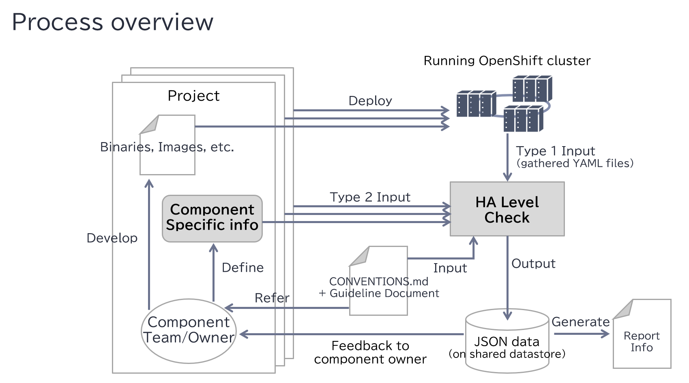
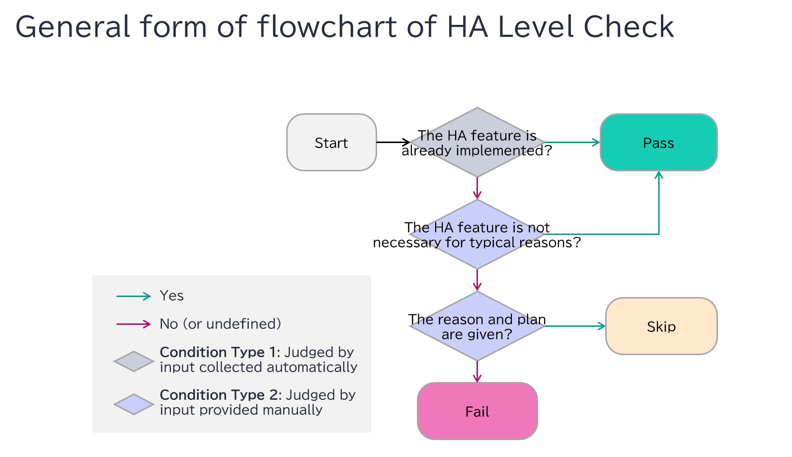

title: ha-policy-management
authors:
  - "@nahorigu"
reviewers:
  - "@dmesser"
  - "@dgoodiwn"
approvers:
  - TBD
api-approvers: None
creation-date: 2026-01-29
last-updated: 2026-01-29
tracking-link: N/A
see-also:
  - https://issues.redhat.com/browse/OCPSTRAT-2649
replaces: N/A
superseded-by: N/A
---

# HA Policy Management

## Summary

This enhancement improves guideline compliance checks within the CI process
(the Red Hat-internal pipeline for OpenShift) to improve overall HA.
Specifically, it integrates a mechanism to evaluate HA levels based on
implementation status and developers' input. By notifying developers of
non-compliant components, the management process encourages developers to follow the
guidelines. All data will be stored in a common repository, allowing both
developers and partners to grasp the overall HA status early and easily.

## Motivation

A service on an OpenShift cluster relies on multiple components, so overall
cluster availability depends on the product of each component's availability.
If any component in the dependency chain lacks high availability (HA),
total availability is degraded.

Currently, HA implementation is often left to developers’ discretion,
leading to inconsistent or insufficient HA configurations.
Although general guidelines exist ([CONVENTIONS.md](https://github.com/openshift/enhancements/blob/master/CONVENTIONS.md#high-availability)).
they are often overlooked and overall conformance status is unknown.
As a result, HA levels can be inconsistent across components, especially
when new components are added or existing ones undergo major changes.

Therefore, an automated checking process and enforcement mechanism are needed.
This proposal aims to introduce a cluster-wide mechanism to ensure consistent
HA implementation across components.

### User Stories

* As an OpenShift Product Manager, I want a clear overview of HA
  implementation status across components, so I can identify issues
  from overall HA quality earlier.
* As an OpenShift component developer, I want to be alerted to any HA gaps
  and have the opportunity to explain why HA is lacking, unnecessary, or
  when planned, reducing repetitive queries from end users.
* As a service provider on OpenShift, I want a stable, reliable platform
  with consistent HA, enabling easier service development without repeatedly
  consulting each component team about HA status and plans.

### Goals

Collect HA policy data (defined below) during the CI process and notify
component owners of any guideline violations.

### Non-Goals

* Strict enforcement of guidelines that block product releases is out of scope.
* Extending HA policy management to cover general guideline compliance beyond
  HA is also out of scope for now.
* This proposal targets only all core and infrastructure-related components,
  and the other components are out of scope.

## Proposal

* Create test cases to collect HA policy information from running OpenShift clusters.
* Define HA configs to define the type of HA feature to be handled
  (redundancy and health check in the first proposal).
* Define the data structure of input and output of "HA level check" process.
* Create test cases to assess the output of "HA level check" process and
  detect degradations in the HA implementation status.
* Define how to store the result of HA level check of each OpenShift version
  to track the record of previous check results.
* Introduce a mechanism to notify the degradations to component owners whose
  projects have failed test cases.
* Define the criteria which conditions should be met for each component pass
  an HA level check for an HA config.
* Define the criteria that must be met to pass the HA level check for each
  component and for each HA config.
* Define the workflow of how to collect the responses from notified component owners.

### Workflow Description

The following figure shows the overview of HA policy management process.



As shown in this figure, this management process is fundamentally based on
collecting and centrally managing the HA implementation status of each
component that makes up OpenShift cluster.
Then, utilizing the collected information, a core function of the management
process (called "HA level check") requests the component owners for additional
information, and encourages them to implement the relevant HA features.

HA policy information is defined as info which is needed by HA level check
process, and there are 2 types:

- Type 1: HA implementation status info which can be collected
  programmatically from the actual OpenShift cluster.
- Type 2: Component specific info which is collected by questions
  for component owners about HA design or development plan.

#### Actors in the workflow

- **Project owner** is a human responsible for the decision over anything
  about development of the component which the project is about.
- **Process owner of HA policy management** is a human or non-human user
  responsible for checking the result of HA level check and interacting with
  component owners to encourage to implement HA or reason the decision.

#### Steps of how HA policy management works

- Trigger CI process.
- CI process runs a test case that do HA level check process.
  - In HA level check process, the tool collect HA-related information from a
    running cluster (like probe settings and redundancy settings).
  - The result is stored in storage with assessment result.
  - Compared with previous check results, the tool identifies newly found
    failed test cases.
  - The tool sends notifications to the component owners whose components
    have failed the HA level check.
- Record a summary of the results of the current check results.
- Terminate the current HA level check process.
- Component owners who received notifications of new failed test cases,
  have 2 options to respond:
  - If the product manager (PM) of the component determines that it is
    unnecessary for implementation, design, or operational reasons, the HA
    feature will not be implemented, and the reasons for this determination
    will be documented.
  - If the HA feature has not yet been implemented solely due to development
    priority or resource constraints, the reason and the planned
    implementation version shall be recorded.
  - The reason and plan given by component owners will be used in the next
    run as justification of leaving failed testcases.

#### HA level check

HA level check uses these types of input information to judge whether each
component properly covers HA configs or not, then the result is output
in JSON data format so that it can be stored in some shared repository (like
GitHub or some internal repository) for later use.  There’re multiple HA
configs in each component, such as healthCheck and redundancy.
Generally, HA level check obeys the flowchart in the following diagram.



The check is done for each component for each HA config, then returns
one of the three values: pass, fail, and skip. Each config has its own
HA implementation status info and component specific info.

This flowchart is essential for HA policy management, so detailed explanations
about the intentions follow:
- The 1st condition class *“the HA feature is already implemented?”* is judged
  only with HA implementation status info, which returns true if the target
  HA feature is already implemented or else false.
- The 2nd condition class *“the HA feature is not necessary for typical
  reasons?”* helps component owners easily judge whether HA implementation is
  actually needed or not. This condition class includes typical viewpoint
  and saves time and effort of component owners to think about how to judge.
- The 3rd condition class *“the reason and plan are given?”* asks why the HA
  is not implemented for the reason other than the answers in the 2nd
  condition class, and when to implement the HA feature. These are judged by
  open-ended answer, which covers very component-specific technical reason
  and/or development-related issues. If these are left unfulfilled, the HA
  level check will fail, and the component owner will be warned with an
  information request.

#### How component owners respond?

A component owner whose component failed the HA Level Check will receive a
notification containing the following data (details are omitted for brevity):

```
{
  "kind": "StatefulSet",
  "name": "lokistack-index-gateway",
  "namespace": "openshift-logging",
  "container": "loki-index-gateway",
  "healthCheck": {
    "hasReadinessProbe": "true",
    "hasLivenessProbe": "true",
    "hasStartupProbe": "false",
    "hasRouterOrK8sService": "true",
    "hasMultiReplicas": "true"
  },
  "haLevelCheckResult": {
    "healthCheckReadinessProbe": "pass",
    "healthCheckLivenessProbe": "pass",
    "healthCheckStartupProbe": "fail"
  }
}
```

Here `healthCheck` is set by info collected programmatically in CI process.
The result of HA level check is set in `haLevelCheckResult`.
In this case, `haLevelCheckResults.healthCheckStartupProbe` is `fail`.

There're two primary ways that recipients are expected to respond the
notification.  The first is to simply implement the required HA config
(a startup probe in this example).
The second is to provide component-specific information.
For example, if a component owner believes that a startup probe is
unnecessary for their container, following response would be expected:

```
{
  "kind": "StatefulSet",
  "name": "lokistack-index-gateway",
  "namespace": "openshift-logging",
  "container": "loki-index-gateway",
  "healthCheck": {
    "componentSpecific": {
      "_ignore": "startup probe is not required for design reasons (...more details...)"
    }
  }
}
```

Alternatively, if the component owner agrees that a startup probe is
necessary but cannot implement it immediately due to constraints such as
resource issues, the expected response would be as follows:

```
{
  "kind": "StatefulSet",
  "name": "lokistack-index-gateway",
  "namespace": "openshift-logging",
  "container": "loki-index-gateway",
  "healthCheck": {
    "componentSpecific": {
      "_ignore": "the team is busy for higher priority tasks",
      "targetVersion": "v4.22"
    }
  }
}
```

In this case, the response must also include the timeframe for resolving
the blocking issues, specified in the `componentSpecific.targetVersion` field.

### API Extensions

N/A

### Topology Considerations

No specific changes required

#### Hypershift / Hosted Control Planes

No specific changes required

#### Standalone Clusters

No specific changes required

#### Single-node Deployments or MicroShift

N/A

### Implementation Details/Notes/Constraints

None (HA policy management is implemented in CI process outside OpenShift components)

### Risks and Mitigations

Risk: Development teams bear the burden of responding to notifications
in a timely manner to prioritize and plan the development of HA features.
Mitigation: The management process will only issue warnings without
blocking the actual release process.

### Drawbacks

None

## Alternatives (Not Implemented)

Not known

## Open Questions [optional]

- How to determine the exact coverage of target components of HA policy management?
- How to maintain and publish the result of HA policy management?
- Currently all defined HA configs are healthCheck and redundancy, but is there any
  other possible HA configs?

## Test Plan

We start with limited enforcement (for example only on select components)
to verify that the management process works properly, and then gradually
expand the scope.

## Graduation Criteria

N/A.

### Dev Preview -> Tech Preview

N/A

### Tech Preview -> GA

N/A

### Removing a deprecated feature

N/A

## Upgrade / Downgrade Strategy

N/A

## Version Skew Strategy

N/A

## Operational Aspects of API Extensions

N/A

## Support Procedures

N/A

## Infrastructure Needed [optional]

N/A
