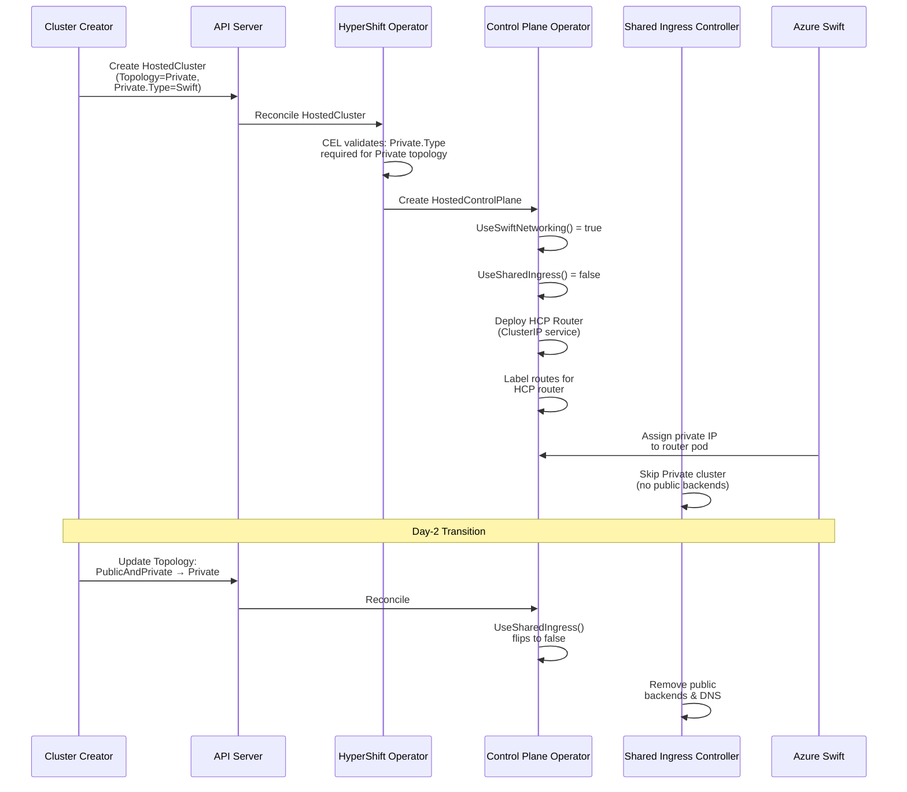

# API-Driven Azure Topology and Private Connectivity

## Summary

This enhancement replaces hardcoded `IsAroHCP()` environment
variable checks and `SwiftPodNetworkInstanceAnnotation` annotation
lookups with API-driven decisions in HyperShift's Azure support.
It extends the `AzurePrivateType` enum with a `Swift` variant and
introduces an `AzureSwiftSpec` struct so that per-cluster Azure
visibility, router, and Swift networking logic is driven by the
`Topology` and `Private` API fields on the HostedCluster and
HostedControlPlane resources. This also enables ARO HCP clusters
to express fully private intent through the API, causing shared
ingress to drop all public endpoint exposure for `Private`
topology clusters.

## Motivation

After CNTRLPLANE-418 (Swift networking integration), all ARO HCP
clusters are effectively `PublicAndPrivate` — public endpoints
are exposed via shared ingress while Swift-assigned private IPs
provide private access. However, the codebase uses two parallel
mechanisms for topology decisions: API fields (`Topology`,
`Private`) for self-managed Azure clusters, and environment
variable checks (`MANAGED_SERVICE=ARO-HCP`) plus the
`SwiftPodNetworkInstanceAnnotation` annotation for ARO HCP. This
dual-path approach creates several problems:

1. **No private-only intent:** ARO HCP customers cannot express
   "this cluster should be private-only" through the API —
   specifically, there is no way to prevent the API server
   endpoint from being exposed through the management cluster's
   shared ingress (public HAProxy). The cluster's own
   openshift-ingress is not affected by this enhancement.
2. **Dual decision paths:** The `IsPrivateHCP()` function
   short-circuits on `isAroHCP()` before checking the `Topology`
   field, bypassing the API.
3. **Testing friction:** CI needs special env vars and
   annotations to simulate production behavior.
4. **Extensibility:** Adding Swift as an `AzurePrivateType`
   (alongside PrivateLink) is the natural API evolution already
   anticipated in code comments but currently impossible because
   of hardcoded branches.

### User Stories

* As an ARO HCP cluster administrator, I want to create a
  fully private cluster by setting `Topology=Private` on my
  HostedCluster so that no public API server endpoints are
  exposed through shared ingress.

* As an ARO HCP cluster administrator, I want to transition
  my existing `PublicAndPrivate` cluster to `Private` (and vice
  versa) on day-2 without node restarts so that I can adjust
  my cluster's network exposure as requirements change.

* As a HyperShift developer, I want a single API-driven code
  path for Azure topology decisions so that I can test all
  topology combinations without setting env vars or
  annotations, reducing CI configuration complexity.

* As an SRE managing ARO HCP at scale, I want the
  SharedIngressReconciler to automatically exclude `Private`
  clusters from the public HAProxy configuration so that I
  can rely on the system to enforce network isolation without
  manual intervention or monitoring for configuration drift.

### Goals

1. Enable ARO HCP clusters to express `Private` and
   `PublicAndPrivate` topology through the `Topology` API
   field, with `Private` clusters having zero public endpoint
   exposure via shared ingress.

2. Extend `AzurePrivateType` with a `Swift` variant and
   introduce `AzureSwiftSpec` to replace the
   `SwiftPodNetworkInstanceAnnotation` annotation with a
   first-class API field.

3. Replace all per-cluster `isAroHCP()` / env-var checks in
   visibility, router, shared ingress, and infra controllers
   with API-driven helpers (`UseSwiftNetworking()`,
   `UseSharedIngress()`, etc.) that derive behavior from the
   `Topology` and `Private` fields.

4. Maintain zero-downtime backward compatibility with existing
   ARO HCP clusters that have `Topology=""` and no
   `Private.Type` set, through legacy annotation fallback in
   Phase 1.

5. Provide a clear 3-phase migration path from
   annotation-based to fully API-driven behavior.

### Non-Goals

1. Removing `isAroHCP()` from management-cluster-level code
   that does not have access to HC/HCP objects (e.g.,
   `main.go` controller startup, `dump.go`). These call sites
   correctly use the env var for cluster-wide decisions.

2. Changing the default topology for Azure clusters. ARO-RP
   must always set `Topology` explicitly; the existing
   `IsPublicHCP()` behavior of treating `Topology=""` as public
   is preserved.

## Proposal

This proposal introduces two tightly coupled changes:

**1. API Extension (CNTRLPLANE-3250):** Add `Swift` to the
`AzurePrivateType` enum and introduce `AzureSwiftSpec` as a
union member in `AzurePrivateSpec`. The Swift spec holds the
pod network instance name currently conveyed via annotation.
CEL validation rules enforce the union contract (type
immutability, positive/negative member requirements).

**2. Private Topology Support (CNTRLPLANE-430):** With
per-cluster decisions now API-driven, `Private` topology
clusters have `UseSharedIngress()` return `false`, causing the
`SharedIngressReconciler` and `sharedingress-config-generator`
to exclude them from public HAProxy configuration and
ExternalDNS records.

The implementation follows a 3-phase migration strategy:

- **Phase 1:** API extension + backward-compatible controller
  code with legacy annotation fallback for unmigrated clusters.
- **Phase 2:** Upstream migration (ARO-RP / Maestro) sets
  `Topology` and `Private.Type=Swift` on all existing clusters.
- **Phase 3:** Once Phase 2 is verified complete across all
  production clusters (see verification criteria below) and
  all clusters are running a CPO version that consumes the
  API fields, remove legacy fallback paths, annotation usage,
  and per-cluster `isAroHCP()` checks from controllers.

### Workflow Description

**Actors:**
- **Cluster creator** — a human or automation (ARO-RP /
  Maestro) responsible for creating HostedClusters.
- **HyperShift operator** — the controller managing
  HostedCluster lifecycle in the management cluster.
- **Control plane operator (CPO)** — the controller managing
  HostedControlPlane resources in the control plane namespace.
- **Shared ingress controller** — the controller configuring
  the management cluster's shared HAProxy for public endpoints.

**CPO rollout considerations:** The CPO version is tied to the
hosted cluster's OCP release. Phase 1 controller changes ship
in a new OCP minor version; the management cluster's HO is
upgraded first (new API types and helpers). Phase 2 can set
the API fields on all clusters immediately, but the fields
only become effective once a cluster upgrades to the OCP
version carrying the updated CPO. Until then, the N-1 CPO
continues to function via the legacy annotation fallback.
If clusters cannot be upgraded to the new minor stream in a
reasonable timeframe, a CPO backport to the previous minor
version may be needed to unblock Phase 3.

#### Creating a Private ARO HCP Cluster

1. The cluster creator creates a HostedCluster with
   `Topology=Private`, `Private.Type=Swift`, and
   `Private.Swift.PodNetworkInstance=<name>`.
2. The API server validates the HostedCluster spec via CEL:
   `Private.Type` is required when `Topology` is `Private` or
   `PublicAndPrivate`.
3. The CPO reconciles the HostedControlPlane:
   - `UseSwiftNetworking(hcp)` returns `true` (Swift type).
   - `UseHCPRouter(hcp)` returns `true` (Swift requires
     router).
   - `IsPrivateHCP(hcp)` returns `true` (`Private` topology).
   - `UseSharedIngress(hcp)` returns `false` (`Private` has
     no public endpoints).
4. The CPO deploys the HCP router with a ClusterIP service
   (no LoadBalancer needed for Swift) and labels routes for
   the HCP router.
5. The shared ingress controller skips this cluster when
   generating HAProxy backends — no public DNS, no
   ExternalDNS entries.
6. Swift assigns a private IP from the customer VNet to the
   router pod, providing private API server access.

#### Day-2 Topology Transition

1. The cluster creator updates `Topology` from
   `PublicAndPrivate` to `Private` on an existing
   HostedCluster.
2. The HyperShift operator propagates the `Topology` change
   to the HostedControlPlane. On the CPO's next reconcile,
   `UseSharedIngress(hcp)` evaluates to `false`.
3. The `sharedingress-config-generator` re-evaluates
   `UseSharedIngressHC()` for this cluster on its next
   reconcile cycle; the function now returns `false`, so the
   cluster's backends are excluded from the regenerated
   HAProxy config.
4. The `SharedIngressReconciler` converges ExternalDNS records
   (removes public entries).
5. No node restarts are required — worker nodes always use
   `api.<name>.hypershift.local` as the API server backend.
6. The cluster creator watches the `PublicEndpointExposed`
   condition on the HostedCluster to confirm the topology
   transition is complete (see API section 4 below).

The reverse transition (`Private` → `PublicAndPrivate`) follows
the same path: the creator updates `Topology`, the HO
propagates to the HCP, `UseSharedIngress(hcp)` flips to
`true`, and the config-generator includes the cluster's
backends in the next HAProxy regeneration. ExternalDNS records
are created for the public endpoint. Public DNS propagation
time determines when the endpoint becomes reachable.

**Transition scope:** Only management-plane components are
affected (shared ingress, ExternalDNS). The HCP router, Swift
networking, and worker node configuration are
topology-independent and require no changes during transitions.



### API Extensions

This enhancement modifies the HyperShift CRDs
(`HostedCluster` and `HostedControlPlane`) which are defined
in the `hypershift/api` module
(`api/hypershift/v1beta1/azure.go`).

#### 1. Extend `AzurePrivateType` Enum

Add `Swift` to the existing `AzurePrivateType` enum:

```go
// +kubebuilder:validation:Enum=PrivateLink;Swift
type AzurePrivateType string

const (
    AzurePrivateTypePrivateLink AzurePrivateType = "PrivateLink"
    AzurePrivateTypeSwift       AzurePrivateType = "Swift"
)
```

#### 2. Add `AzureSwiftSpec` Union Member

Add a Swift-specific configuration struct to
`AzurePrivateSpec`:

```go
type AzureSwiftSpec struct {
    // +required
    // +kubebuilder:validation:MinLength=1
    PodNetworkInstance string `json:"podNetworkInstance"`
}
```

The `AzurePrivateSpec` struct gains a new `Swift` union member.
CEL validation rules are defined at the struct level (not on
the `Type` field) because `has()` requires an object field
reference. Combined with `omitempty` on `Type`, the
immutability rule allows setting the type for the first time on
existing clusters that previously had it unset:

```go
// +kubebuilder:validation:XValidation:rule="!has(oldSelf.type) || self.type == oldSelf.type",message="type is immutable"
// +kubebuilder:validation:XValidation:rule="self.type != 'Swift' || !has(self.privateLink)",message="privateLink must not be set when type is Swift"
// +kubebuilder:validation:XValidation:rule="self.type != 'PrivateLink' || !has(self.swift)",message="swift must not be set when type is PrivateLink"
// +kubebuilder:validation:XValidation:rule="self.type != 'PrivateLink' || has(self.privateLink)",message="privateLink is required when type is PrivateLink"
// +kubebuilder:validation:XValidation:rule="self.type != 'Swift' || has(self.swift)",message="swift is required when type is Swift"
type AzurePrivateSpec struct {
    // +unionDiscriminator
    // +required
    Type AzurePrivateType `json:"type,omitempty"`

    // +optional
    // +unionMember
    PrivateLink AzurePrivateLinkSpec `json:"privateLink,omitzero"`

    // +optional
    // +unionMember
    Swift AzureSwiftSpec `json:"swift,omitzero"`
}
```

At the `AzurePlatformSpec` level, a CEL rule enforces that
`Private.Type` is set for non-default topologies:

```go
// +kubebuilder:validation:XValidation:rule="self.topology == '' || has(self.private.type)",message="private.type is required when topology is set"
type AzurePlatformSpec struct {
    // ...
    Topology AzureTopologyType    `json:"topology,omitempty"`
    Private  AzurePrivateSpec     `json:"private,omitzero"`
}
```

#### 3. `PublicEndpointExposed` Status Condition

Add a new `PublicEndpointExposed` condition to
`HostedCluster.Status.Conditions`. This condition tracks
whether the cluster's API server public endpoint is
configured and exposed — it reflects configuration state,
not endpoint health or reachability.

```go
// PublicEndpointExposed indicates whether public API server
// endpoints are configured and exposed for this cluster.
PublicEndpointExposed ConditionType = "PublicEndpointExposed"
```

**Controller:** The `SharedIngressReconciler` sets this
condition directly on the HostedCluster during each
reconcile cycle. The condition is platform-agnostic and can
be adopted by AWS/GCP endpoint management controllers for
equivalent signaling.

**Logic:** The `SharedIngressReconciler` sets this condition
after reconciling the cluster's public endpoint state — not
based on intent alone, but on the actual converged state:

```go
if !UseSharedIngressHC(hc) {
    // Cluster does not use shared ingress (Private topology
    // or non-Swift). Confirm backends and DNS are removed.
    if !haProxyBackendsExist(hc) && !externalDNSRecordsExist(hc) {
        SetCondition(hc, PublicEndpointExposed, False,
            "TopologyPrivate",
            "Public backends and ExternalDNS records removed")
    } else {
        SetCondition(hc, PublicEndpointExposed, False,
            "ConvergenceInProgress",
            "Public endpoint removal in progress")
    }
    return
}

// Cluster uses shared ingress (Swift + PublicAndPrivate).
// Confirm backends and DNS are configured.
if haProxyBackendsExist(hc) && externalDNSRecordsExist(hc) {
    SetCondition(hc, PublicEndpointExposed, True,
        "SharedIngressConfigured",
        "Public HAProxy backends and ExternalDNS records active")
} else {
    SetCondition(hc, PublicEndpointExposed, True,
        "ConvergenceInProgress",
        "Public endpoint configuration in progress")
}
```

| Topology | Status | Reason | Description |
|---|---|---|---|
| `PublicAndPrivate` (converged) | `True` | `SharedIngressConfigured` | HAProxy backends and ExternalDNS records active |
| `PublicAndPrivate` (converging) | `True` | `ConvergenceInProgress` | Backends or DNS not yet fully configured |
| `Private` (converged) | `False` | `TopologyPrivate` | Public backends and DNS records removed |
| `Private` (converging) | `False` | `ConvergenceInProgress` | Removal in progress |
| No shared ingress (self-managed Azure, PrivateLink) | Not set | — | Condition only set by controllers managing public endpoint exposure |

#### 4. Behavioral Changes to Existing Resources

- `UseSharedIngress()` changes from a parameterless function
  returning `isAroHCP()` to a per-cluster function checking
  `UseSwiftNetworking(hcp) && IsPublicHCP(hcp)`.
- `IsPrivateHCP()` / `IsPrivateHC()` bypass via
  `isAroHCP()` + annotation is removed; `Topology` field is
  used consistently.
- The `sharedingress-config-generator` filters clusters at the
  HostedCluster level using `UseSharedIngressHC()`, which is
  security-critical to prevent private cluster endpoints from
  leaking into public HAProxy config.

### Topology Considerations

#### Hypershift / Hosted Control Planes

This enhancement is exclusively for HyperShift / Hosted Control
Planes on Azure. It directly modifies HyperShift's API types
(`HostedCluster`, `HostedControlPlane`) and controller logic.

**Management cluster impact:**
- The shared ingress controller in the management cluster uses
  `UseSharedIngressHC()` to filter which clusters get public
  HAProxy backends. `Private` clusters are excluded.
- The `MANAGED_SERVICE` env var is retained for
  management-cluster-level startup decisions (e.g., whether to
  run the shared ingress controller at all).

**Guest cluster impact:**
- No guest cluster components are affected. Worker node
  HAProxy configuration is topology-independent — nodes always
  use `api.<name>.hypershift.local`.

#### Standalone Clusters

This change is not relevant for standalone clusters. It only
affects HyperShift-managed Azure clusters (ARO HCP).

#### Single-node Deployments or MicroShift

This proposal does not affect single-node deployments or
MicroShift. It is scoped to HyperShift's Azure platform
support.

#### OpenShift Kubernetes Engine

This proposal does not affect OKE. The changes are internal
to HyperShift's Azure-specific controller logic and do not
depend on features excluded from OKE.

### Implementation Details/Notes/Constraints

#### Helper Function Architecture

The refactored decision graph uses composable helper functions
that derive all per-cluster behavior from API fields:

```
UseHCPRouter (composite)
  ├── UseSwiftNetworking [leaf: Private.Type == Swift]
  ├── IsPrivateHCP [leaf: checks Topology]
  └── LabelHCPRoutes (composite)
        ├── UseSharedIngress (composite)
        │     ├── UseSwiftNetworking [leaf]
        │     └── IsPublicHCP [leaf: checks Topology]
        ├── UseSwiftNetworking [leaf]
        └── UseDedicatedDNSForKAS [leaf: checks Services]
```

`isAroHCP()` does not appear in this graph — all per-cluster
functions are fully API-driven.

#### Key Controller Changes

1. **`IsPrivateHCP()` / `IsPrivateHC()`:** Remove the
   `isAroHCP()` + annotation bypass. Use the `Topology` field
   consistently with a legacy fallback for unmigrated clusters
   in Phase 1.

2. **`UseSharedIngress()`:** Change from parameterless
   `isAroHCP()` to per-cluster
   `UseSwiftNetworking(hcp) && IsPublicHCP(hcp)`.

3. **`UseHCPRouter()`:** Replace `IsAroHCP()` with
   `UseSwiftNetworking(hcp)`.

4. **`LabelHCPRoutes()`:** Replace `isAroHCP()` with
   `UseSharedIngress(hcp) || UseSwiftNetworking(hcp)`.

5. **Router service type:** Drive from `Private.Type` — Swift
   uses ClusterIP, PrivateLink uses LoadBalancer.

6. **Router service status:** Swift clusters resolve
   `ClusterIP` directly instead of waiting for a LoadBalancer
   status that never arrives.

7. **Shared ingress config-generator:** Filter private-only
   clusters at the HostedCluster level before processing
   routes. This is security-critical — without it, labeled
   routes from Private+Swift clusters would appear in the
   public HAProxy config.

8. **Validation:** Remove the `!IsAroHCP()` exemption —
   ARO HCP clusters must set `Private.Type=Swift`.

#### `isAroHCP()` Call Site Classification

| Classification | Description |
|---|---|
| **(a) Change** | Per-cluster decisions → API-driven (visibility, router, shared ingress, infra, CNO, CCM, storage, registry operator) |
| **(b) Keep** | No HC/HCP available (main.go, dump.go) |

See section 9.1 of the design document for the full call site
classification table.

#### Migration Strategy

**Phase 1 — API Extension + Backward-Compatible Code:**
- Add `Swift` to `AzurePrivateType`, add `AzureSwiftSpec`.
- Update controllers to check API fields first, falling back
  to annotation for unmigrated clusters.
- Implement `Private` topology behavior.

**Phase 2 — Upstream Migration (ARO-RP / Maestro):**
- Set `Topology=PublicAndPrivate` on all existing clusters.
- Set `Private.Type=Swift` and
  `Private.Swift.PodNetworkInstance` on all existing clusters.
- Continue setting annotation during migration window for
  N-1 CPO compatibility.

**Phase 2 verification:** Phase 2 is complete when no Azure
HostedClusters remain with an unset `Topology` or missing
`Private.Type`. Verify across all management clusters:

```sh
kubectl get hostedclusters -A -o json | jq '
  [.items[] |
   select(.spec.platform.type == "Azure") |
   select(.spec.platform.azure.topology == null
     or .spec.platform.azure.topology == ""
     or .spec.platform.azure.private.type == null
     or .spec.platform.azure.private.type == "") |
   .metadata.name] | length'
```

The result must be `0` before proceeding to Phase 3.

**Phase 3 — Cleanup:**
- Remove per-cluster `isAroHCP()` from controllers.
- Remove `SwiftPodNetworkInstanceAnnotation` usage.
- Remove legacy fallback paths from Phase 1.
- Keep `isAroHCP()` only in management-cluster-level code.

Timeline: Phase 3 executes minimum 2 minor release cycles
after Phase 2 completion.

#### N-1 / N+1 Compatibility

- **N+1 (new code, old data):** Legacy annotation fallback
  in `UseSwiftNetworking()` and `IsPrivateHCP()` handles
  unmigrated clusters.
- **N-1 (old code, new data):** The `Swift` field uses
  `omitzero`; old code ignores unknown fields during
  deserialization. The `Type` value "Swift" is preserved as
  a string.
- **N-1 round-trip risk:** Old code re-serializing an object
  with `Private.Swift` set will drop the field. The annotation
  is preserved during the migration window as a fallback,
  allowing the controller to recover the Swift configuration
  from the annotation when the API field is missing.
- **CRD schema ordering:** The updated CRD schema must be
  deployed before the operator binary.

#### Annotation Deprecation

The `SwiftPodNetworkInstanceAnnotation` is deprecated but not
immediately removed. During the migration window:
- The API field takes precedence when set. If the API field is
  absent (e.g., after an N-1 round-trip drops it), the
  controller falls back to the annotation.
- A log warning is emitted when the controller falls back to
  the annotation, to aid migration tracking.
- The annotation constant remains in the API module for
  backward compatibility.

#### Feature Gating

HyperShift APIs are defined in `api/hypershift/v1beta1` and
are not gated through the standard `openshift/api`
`features.go` mechanism. The HyperShift v1beta1 API version
provides its own gating. No new feature gate in
`openshift/api` is required for this enhancement.

### Risks and Mitigations

| Risk | Mitigation |
|---|---|
| Existing ARO HCP clusters have empty `Topology` | Phase 1 legacy fallback in `IsPrivateHCP()` and `UseSwiftNetworking()`; Phase 2 migrates clusters |
| ARO-RP not updated in sync | Legacy fallback ensures old clusters work; Phase 2 continues setting annotation for N-1 CPO |
| N-1 round-trip drops `Swift` field | Annotation preserved as fallback during migration window |
| Private cluster endpoints leaked into shared HAProxy | Config-generator filters at HostedCluster level before processing routes (security-critical) |
| `Private.Type` immutability prevents Swift adoption on existing clusters | Immutability CEL rule uses `!has(oldSelf.type)` at struct level with `omitempty` on Type, allowing first set |
| CRD schema must be deployed before new operator | Standard operator lifecycle; CRD with `Enum=PrivateLink;Swift` applied before code creating `Type=Swift` |

**Security review:** The shared ingress filtering logic is
security-critical and should receive dedicated review. The
`sharedingress-config-generator` must
filter at the HostedCluster level, not the route level, to
prevent private cluster endpoints from leaking into the public
HAProxy configuration.

### Drawbacks

- **Migration complexity:** The 3-phase migration adds
  operational complexity. However, this is necessary to
  maintain zero-downtime compatibility with existing clusters.
- **Temporary code duplication:** Phase 1 introduces legacy
  fallback paths that coexist with the new API-driven paths
  until Phase 3 cleanup. This increases code complexity during
  the transition period.
- **Coordination with ARO-RP:** Phase 2 requires ARO-RP /
  Maestro to update all existing clusters, which depends on
  an external team's timeline.

## Alternatives (Not Implemented)

1. **Annotation-only approach:** Instead of extending the API,
   add new annotations for topology intent. Rejected because
   annotations bypass CRD validation, are not discoverable,
   and perpetuate the dual-path problem.

2. **Big-bang migration:** Update all code and migrate all
   clusters simultaneously. Rejected due to zero-downtime
   requirements and the risk of coordinated failures across
   the operator and ARO-RP.

3. **New `AzureTopologySpec` struct:** Instead of reusing the
   existing `Topology` and `Private` fields, introduce a new
   top-level struct. Rejected because the existing API fields
   already express the needed semantics — the issue is that
   ARO HCP code bypasses them.

## Open Questions [optional]

None — all open questions from the design document have been
resolved. See section 10 of the design document for resolved
questions.

## Test Plan

<!-- TODO: Tests must include the following labels as
applicable per dev-guide/feature-zero-to-hero.md and
dev-guide/test-conventions.md:
- [Jira:"Component Name"] for the component
- Appropriate test type labels: [Suite:...], [Serial],
  [Slow], or [Disruptive] as needed
-->

### Unit Tests

- **`visibility_test.go`:** Test `IsPrivateHCP/HC` with all
  combinations of `Topology` and `Private.Type`, with and
  without legacy annotations. Include Phase 1 fallback
  scenarios (`Topology=""` + annotation).
- **`util_test.go` (router):** Test `UseHCPRouter()` with
  Swift, PrivateLink, and empty `Private.Type`.
- **`infra_test.go`:** Test `reconcileHCPRouterServices()`
  creates ClusterIP for Swift, LoadBalancer for PrivateLink.
  Test `reconcileInternalRouterServiceStatus()` returns
  ClusterIP for Swift.
- **`sharedingress_controller_test.go`:** Test
  `UseSharedIngress(hcp)` / `UseSharedIngressHC(hc)` with
  API-driven logic.
- **`config_test.go` (shared ingress):** Test that
  `Private` + Swift clusters are filtered from HAProxy backend
  generation (security-critical).
- **Serialization compatibility tests:** N-1 struct without
  `Swift` field deserializing N struct with `Swift` set.
  Roundtrip from `Private={}` (zero value) allows setting
  `Private.Type=Swift` without hitting immutability CEL rule.

### Integration Tests

- Test day-2 topology transition:
  `PublicAndPrivate` → `Private` → `PublicAndPrivate`.
- Test that shared ingress drops routes when topology changes
  to `Private`.

### E2E Tests

- Existing ARO HCP e2e tests should pass without
  `MANAGED_SERVICE` env var once clusters are migrated.
- Create cluster with `Topology=Private, Private.Type=Swift`
  — verify no public DNS/routes.
- Create cluster with
  `Topology=PublicAndPrivate, Private.Type=Swift` — verify
  both public and private paths work.

## Graduation Criteria

<!-- TODO: Per dev-guide/feature-zero-to-hero.md, promotion
to Default feature set requires:
- At least 5 tests per feature
- All tests run at least 7 times per week
- All tests run at least 14 times per supported platform
- 95% pass rate
- Tests running on all supported platforms (AWS, Azure, GCP,
  vSphere, Baremetal with various network stacks)

For HyperShift-specific features, the supported platforms
may differ — consult with TRT on applicable platform
coverage requirements.
-->

### Dev Preview -> Tech Preview

- Phase 1 implementation complete: API extension and
  backward-compatible controller code merged.
- Unit tests passing for all topology combinations.
- Integration tests for day-2 topology transitions.
- E2E test creating a `Private` + Swift cluster with
  verified no public endpoint exposure.

### Tech Preview -> GA

- Phase 2 complete: All existing ARO HCP clusters migrated
  to use `Topology` and `Private.Type=Swift` API fields.
- Phase 3 complete: Legacy fallback paths and annotation
  usage removed from controllers.
- Load testing with mixed `Private` and `PublicAndPrivate`
  clusters on shared ingress.
- Verified N-1/N+1 compatibility through upgrade/downgrade
  testing.
- All per-cluster `isAroHCP()` call sites converted to
  API-driven helpers (CNO, CCM, storage, registry operator).

### Removing a deprecated feature

- The `SwiftPodNetworkInstanceAnnotation` annotation is
  deprecated in Phase 1 and removed in Phase 3.
- The annotation constant is retained in the API module
  until all consumers have been updated.

## Upgrade / Downgrade Strategy

**Upgrade (N → N+1):**
- Existing clusters with `Topology=""` and `Private={}`
  continue to work via legacy annotation fallback in Phase 1.
- No cluster configuration changes required on upgrade.
- The CRD schema with `Enum=PrivateLink;Swift` must be
  applied before the new operator binary.

**Downgrade (N+1 → N):**
- Clusters created with `Private.Type=Swift` and
  `Private.Swift` set will have the `Swift` field silently
  dropped by N code during deserialization (field not in
  struct).
- The `SwiftPodNetworkInstanceAnnotation` annotation remains
  set during the migration window, so N code continues to
  function correctly using the annotation.
- Phase 2 migration should only proceed after confirming that
  rollback to N-1 is not expected.

**Day-2 topology transition:**
- Transitioning `PublicAndPrivate` → `Private` does not
  require node restarts. Worker nodes always use
  `api.<name>.hypershift.local` as the API server backend.
- The transition only affects management-plane components:
  shared ingress drops/adds public endpoints, ExternalDNS
  records are cleaned up/created.

## Version Skew Strategy

During upgrade, the HyperShift operator and CPO may run
different versions:

- **Old operator, new CPO:** The old operator does not know
  about `Private.Type=Swift` but preserves unknown fields.
  The new CPO uses API-driven helpers that check `Topology`
  and `Private.Type`. If the cluster was created by the old
  operator (no `Private.Type` set), the CPO falls back to
  annotation-based behavior.

- **New operator, old CPO:** The new operator may set
  `Private.Type=Swift` on new clusters. The old CPO ignores
  the `Swift` field (not in its struct) and uses
  `isAroHCP()` + annotation. This works correctly because
  Phase 2 requires the annotation to remain set during the
  migration window.

- **CRD version skew:** The CRD schema must be updated
  before the operator binary. If the old CRD (with
  `Enum=PrivateLink` only) is served while new code creates
  `Type=Swift`, the API server rejects the request.

## Operational Aspects of API Extensions

This enhancement modifies existing CRDs (`HostedCluster`,
`HostedControlPlane`) by extending the `AzurePrivateType`
enum and adding a new `AzureSwiftSpec` struct. No new
webhooks, aggregated API servers, or finalizers are
introduced.

**Impact on existing SLIs:**
- No impact on API throughput — the enum extension and new
  struct are small additions to existing resources.
- The `UseSharedIngress()` check in the config-generator adds
  negligible overhead (one field comparison per cluster per
  reconcile cycle).

**Failure modes:**
- If the CRD schema is not updated before the operator,
  creation of `Type=Swift` resources will be rejected by the
  API server with a validation error.
- If `UseSharedIngressHC()` has a bug, private cluster
  endpoints could leak into the public HAProxy config. This
  is mitigated by unit tests and the security-critical
  designation of this code path.

**Escalation:** The HyperShift / ARO HCP team is responsible
for issues related to this enhancement.

## Support Procedures

**Detecting failure modes:**
- If a `Private` cluster's endpoints appear in the shared
  HAProxy config, the `sharedingress-config-generator` logs
  will show the cluster being included in backend generation.
  Check `UseSharedIngressHC()` return value for the cluster.
- If `IsPrivateHCP()` returns incorrect values, check the
  `Topology` field and `Private.Type` on the HC/HCP. For
  unmigrated clusters, verify the
  `SwiftPodNetworkInstanceAnnotation` annotation is present.
- If the HCP router service status is stuck, check whether
  the service type matches the `Private.Type` (Swift →
  ClusterIP, PrivateLink → LoadBalancer).

**Disabling the extension:**
- The API extension (new enum value and struct) cannot be
  disabled independently. Reverting requires downgrading the
  CRD schema and operator to a version without Swift support.
- Existing clusters with `Private.Type=Swift` would need to
  have the annotation re-set and `Private.Type` cleared
  (which is blocked by the immutability CEL rule — a manual
  CRD patch would be needed).

**Impact on running workloads:**
- Disabling Swift support on a running cluster would break
  private connectivity because the router service type and
  Swift pod network instance configuration would be lost.
- Public endpoints for `PublicAndPrivate` clusters are
  unaffected as they go through shared ingress independently.

## Infrastructure Needed [optional]

No new infrastructure is needed. Existing ARO HCP CI
environments are sufficient for testing.
