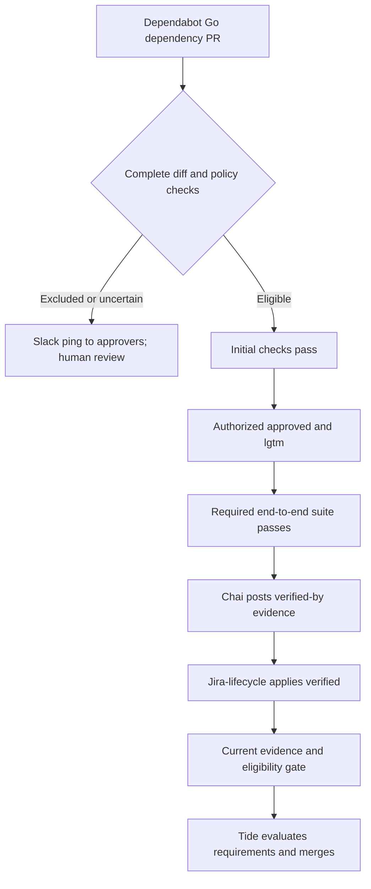

# Automated Dependabot PR Management for HyperShift

## Summary

Chai auto-approves eligible Dependabot Go PRs limited to `go.mod`, `go.sum`, and vendored files. For other paths, including non-vendored Go code, Chai pings approvers in Slack for human review. Tests and verification gate Tide merges.

## Motivation

Maintainers repeatedly perform the same steps for dependency updates: inspect the changes, start tests, provide review labels, and record verification. Some updates also require regenerating vendored files before testing can succeed.

Automating this routine work can reduce maintainer effort and the time updates spend waiting for attention. The benefit depends on a narrow, understandable boundary between delegated work and changes that still require human judgment.

The proposal delegates review attestations only for eligible Go dependency updates. It retains existing test requirements and merge automation rather than introducing a second merge controller.

### User Stories

- As a HyperShift maintainer, I want routine dependency updates to progress without repeated manual commands, so that I can focus on changes that require engineering judgment.
- As a reviewer, I want Chai to notify me in Slack when an update needs human review, with an explanation, so that I can understand why automation stopped and what needs attention.
- As a maintainer handling a failed update, I want a repaired PR to be tested and reviewed independently, so that generating a replacement does not bypass the original safeguards.
- As an automation operator, I want to audit decisions and stop pending automated merges, so that I can safely operate and recover the service.

### Goals

- Reduce manual shepherding of routine Go dependency PRs.
- Make eligibility decisions consistent, explainable, and auditable.
- Require human review whenever changes exceed the delegated scope or available evidence is insufficient.
- Preserve required testing, current-commit verification, and Tide's sole merge authority.

### Non-Goals

- Automating Kubernetes compatibility updates or security-sensitive exceptions to the agreed dependency policy.
- Approving application code, generated Go outside vendored directories, CRDs, workflows, container images, or non-Go dependency updates.
- Managing Renovate PRs, release-branch updates, or weekly consolidated dependency PRs in the initial pilot.
- Calling GitHub's merge API from Chai or replacing Tide.
- Monitoring dependency updates after merge, automatically detecting regressions, or automatically approving revert PRs.
- Changing HyperShift's runtime APIs, deployment model, or supported cluster topologies.

## Proposal

Use Chai to manage individual Dependabot Go dependency PRs targeting `main` in `openshift/hypershift`. Chai is the automation service responsible for classification, test coordination, and narrowly delegated review attestations.

An update is eligible only when its complete diff stays within the allowed paths and passes the Kubernetes compatibility and security exception policies. Matching paths alone does not establish that a change is safe.

For eligible updates, Chai provides `approved` and `lgtm` after initial checks. It issues `/verified by <evidence>` only after the required end-to-end suite and all merge-required checks succeed. Tide performs the merge.

The initial deployment is report-only. Live authority remains disabled until maintainers approve the evaluation results and the authorization, merge gates, and shutdown procedure have been tested.

### Workflow Description

#### Actors and responsibilities

| Actor | Responsibility |
| --- | --- |
| Dependabot | Opens Go dependency update PRs. |
| Chai | Evaluates eligibility, coordinates testing, records evidence, and requests authorized review attestations. |
| Prow | Coordinates presubmit testing and processes supported review and test commands. |
| Jira-lifecycle plugin | Processes the `/verified` command, authorizes its caller, and manages verification labels and records. |
| Tide | Merges PRs that satisfy the applicable labels, checks, and merge gates. |
| HyperShift maintainers and approvers | Own the policy and notification routing, respond to Slack review requests, authorize rollout, and handle post-merge recovery. |
| Automation operator | Operates Chai, investigates failures, and invokes the shutdown procedure. |

`approved` represents delegated approval. `lgtm` represents delegated review. `verified` records a pre-merge testing attestation. Permission to start tests is separate from all three.

#### Eligible update

The following sequence describes live mode. Report-only mode records proposed actions without executing them.

1. Dependabot opens or updates a PR. Chai fetches its current commit ID, target branch, complete changed-file list, and full diff.
2. Chai checks the author, branch, allowed paths, and exception policies. It records the decision and claims processing ownership to prevent duplicate work.
3. Chai uses the supported test-trust path if needed and waits for the configured initial checks to pass on the evaluated commit.
4. Chai refetches the PR and requests `approved` and `lgtm` through the authorized repository-scoped mechanism. The configured workflow starts the required end-to-end suite after `lgtm`.
5. Chai waits for every job in that suite and every Tide-required check to succeed for the current commit. It records job names, run links, tested revisions, and the policy version.
6. Chai refetches the PR again and posts `/verified by <job names, run links, and commit ID>`. It confirms that the Jira-lifecycle plugin accepted the command and applied `verified`.
7. Chai enables the final eligibility gate only while the evidence is current and automation remains enabled. Tide evaluates the applicable merge requirements and merges the PR.
8. Chai records the merge result and releases processing ownership. Its responsibility for the update ends at merge.

The configured test-trigger mechanism must be demonstrated before live rollout. This proposal does not assume that adding `lgtm` already starts every required end-to-end job in the existing configuration.

#### Excluded, uncertain, or failed update

Chai provides no approval or verification for an excluded update. It pings the designated approvers in Slack to request human review. Any Go file outside an allowed vendored subtree requires human `lgtm`.

The notification targets approvers for the affected paths through maintainer-owned routing. It includes the PR link, evaluated commit ID, relevant changed paths, and the reasons the update needs human review.

Approvers review the PR and provide the required attestations through the normal GitHub/Prow workflow. A Slack reply is not an approval and does not make the PR eligible to merge.

Chai avoids duplicate pings for the same decision. If routing or delivery fails, it records the failure and retries the notification; the failure never causes automatic approval or verification.

API failures, incomplete diffs, unknown security results, and stale revisions block automated actions. Chai may retry data collection, but cannot infer eligibility from missing information.

Failed tests do not become passing evidence through a label override. Failures outside the narrow repair path remain human-owned; any permitted retest must produce fresh successful results for the current candidate.

#### Repair and replacement PRs

Chai may attempt repair only when evidence identifies stale vendored or generated output as the cause of a validation failure. Repair is not a general-purpose code-fixing path.

The repair worker starts from a pinned source revision in an isolated workspace. It runs `make verify`, uses `UPDATE=true make test` only when fixture regeneration is justified, then reruns strict `make verify` and plain `make test`.

The replacement PR is evaluated from its own complete diff. It never inherits the source PR's eligibility, review attestations, or test evidence. Generated CRDs, assets, or Go files outside the allowed paths require human review.

Before publishing a replacement, Chai holds the source PR and verifies that the hold is effective. It links the two PRs and leaves the source open while the replacement is tested and reviewed.

Chai closes the source only after the replacement's required remote checks pass on its final commit, any required human review is complete, and Tide has merged it. Local validation or CI success alone is insufficient.

If repair fails or the replacement is abandoned, the source remains open and held for human resolution. Maintainers decide whether to resume the source, revise the replacement, or close either PR.

### API Extensions

This enhancement introduces no OpenShift API extensions. It does not add or modify CRDs, webhooks, aggregated API servers, or finalizers. It uses existing GitHub, Prow, and Jira-lifecycle interfaces.

### Topology Considerations

#### Hypershift / Hosted Control Planes

The automation manages the HyperShift source repository and runs in development or CI infrastructure. It adds no components, configuration, or resource requirements to management clusters or hosted control planes.

Dependency changes still require the agreed HyperShift test suite. Automating their review does not remove topology-specific testing or change supported management and guest cluster relationships.

#### Standalone Clusters

Standalone clusters receive no new runtime component or configuration. The enhancement changes a repository maintenance workflow, not how standalone clusters operate.

#### Single-node Deployments or MicroShift

The automation does not run on customer single-node or MicroShift deployments. It adds no CPU, memory, storage, or configuration requirements to either topology.

#### OpenShift Kubernetes Engine

The workflow operates outside customer clusters and has no dependency on OKE-specific runtime features. It does not change OKE behavior or configuration.

### Implementation Details/Notes/Constraints

#### Eligibility policy

The policy has two outcomes: **eligible (`NOMINAL`)** and **human review (`SPECIAL`)**. `SPECIAL` includes incomplete or uncertain evidence; it does not necessarily indicate a defect in the update.

Intake requires a verified Dependabot identity and the `main` target branch. A repair PR also requires a recorded source relationship and an authorized repair identity; unrelated bot-authored PRs cannot enter through that exception.

The initial manifest allowlist covers the Go modules currently configured for Dependabot. Paths are repository-relative; vendored subtrees are allowed only under these module roots.

| Module root | Allowed manifests | Allowed vendored subtree |
| --- | --- | --- |
| Repository root | `go.mod`, `go.sum` | `vendor/**` |
| `api` | `api/go.mod`, `api/go.sum` | `api/vendor/**` |
| `hack/tools` | `hack/tools/go.mod`, `hack/tools/go.sum` | `hack/tools/vendor/**` |

Any other path requires human review, including `go.work`, another module's manifests, generated assets, documentation, and workflow files. Expanding the module roots requires an explicit policy change and maintainer review.

Classification must inspect both old and new paths for renames and all pages of the changed-file listing. It must detect truncation and missing diff content; an API limit or error cannot become an empty, eligible diff.

Kubernetes compatibility and security exclusions override the path allowlist. Maintainers must approve the dependency rules and security-review inputs before live rollout. Unavailable or inconclusive checks require human review.

All changed module manifests must be examined for exclusions, including modules outside the allowlist. PR titles, Dependabot grouping, and a patch-version designation are not substitutes for examining the actual update.

#### Evidence and state

Each decision records the repository, PR number, verified author identity, base and head commit IDs, complete changed paths, policy version, exception results, reasons, and proposed or completed actions.

The idempotency key is `repository#PR#head_sha#policy_version`. Chai also records the test-suite configuration and tested base revision so changes to either cannot silently reuse incompatible evidence.

Chai refetches current state after delayed or duplicate events and before every privileged action. A head change invalidates the classification, pending actions, Chai-owned attestations, verification evidence, and eligibility gate.

Webhook delivery alone is insufficient. Reconciliation must recover missed events and reconcile commands processed after their evaluated revision became stale. An old `/verified` comment must not restore eligibility for a newer commit.

Initial checks and merge checks are separate sets. Initial checks gate `approved` and `lgtm`; the complete required end-to-end suite and Tide-required checks gate `/verified` and final eligibility.

Missing, pending, failed, canceled, or skipped required jobs do not count as successful evidence. Chai must validate the expected job identities and revisions, not merely observe a green aggregate status.

Base-branch changes also affect the tested merge candidate. Prow and Tide owners must confirm how the current base or merge revision is tested and revalidated. Head-commit equality alone does not prove merge-candidate freshness.

#### Authorization boundaries

Test-trigger authority, review authority, verification authority, and merge authority remain separate. Chai is not added to broad root OWNERS aliases, and it receives no direct merge capability.

The privileged attestation path must enforce the approved repository and eligibility policy. Repository-scoped credentials alone cannot restrict writes by changed-file path; that restriction must exist at the trusted action boundary.

The supported path for `approved` and `lgtm` is a live-launch prerequisite. If existing Prow authorization cannot enforce the required boundary, the integration needs an explicitly reviewed policy-enforcing mechanism.

`verified` is applied only through `/verified by <evidence>`. There is no fallback to direct GitHub label writes, `/verified bypass`, or `/verified later` when the command is rejected.

The current upstream verification handler checks `IsCollaborator`. The exact Chai identity must pass the deployed authorization path in a controlled canary before live use. OWNERS membership alone is not proof of authorization.

The command records a testing assertion; it does not independently validate Chai's CI evidence or bind the label to a commit. Chai must enforce those conditions and test invalidation and delayed-command behavior.

Canaries must cover both `NO-JIRA` dependency PRs and PRs with Jira references. Referenced-issue validation and Jira lifecycle effects must be checked separately from caller authorization and test evidence.

#### Execution and credential isolation

PR diffs, dependency contents, test output, and vendored instruction files are untrusted data. They cannot change the eligibility policy, authorize actions, or supply instructions to the privileged writer.

Repair and validation workers receive no upstream or fork write credentials, GitHub App private keys, or writer credential helpers. Publication and attestation occur in a separate trusted component that revalidates the candidate.

Validation environments use only the test credentials they require. Their isolation and access to CI secrets need security review; removing GitHub write tokens alone does not make executing dependency code harmless.

#### Coordination with existing automation

Chai owns individual eligible Dependabot PRs, not weekly consolidated updates. The weekly triage job must skip claimed candidates or be disabled for the overlapping scope before the live pilot.

Ownership is recorded before work begins and is shared with the weekly job. The coordination mechanism must handle duplicate events, interrupted repairs, and abandoned claims without silently closing source PRs.

Reusing the weekly job requires fail-closed file retrieval, coverage of all changed modules, and separation of validation from writer credentials. It does not receive Chai's attestation authority unchanged.

#### Merge gates and shutdown

Automated merge eligibility requires current policy and test evidence, accepted verification, the required review labels, and an enabled automation gate. A static label alone cannot establish current-commit eligibility.

Every Tide query capable of selecting a managed PR must honor equivalent gates. The current bot-specific and general queries overlap; adding a condition only to the bot query does not establish isolation.

A central enablement flag stops new test-trust grants, attestations, and eligibility decisions. Shutdown must also block already-attested open PRs, using an effective hold or the agreed merge-gate mechanism.

The operator confirms that Tide can no longer select pending managed candidates and reconciles queued commands. Revoking credentials alone does not remove existing labels or cancel work already accepted by another service.

The concrete gate, shutdown response time, and any already-dispatched merge behavior must be agreed and tested before live rollout. Chai does not monitor or undo changes that have already merged.

### Risks and Mitigations

| Risk | Mitigation |
| --- | --- |
| Unsafe dependency content matches the path allowlist. | Keep explicit Kubernetes and security exclusions, review full diffs, and route inconclusive results to humans. |
| Incomplete or stale input is treated as eligible. | Verify complete listings and revisions, fail closed, and reconcile delayed events and commands. |
| Bot permissions exceed the delegated scope. | Enforce policy at the trusted writer, separate permissions, and avoid broad OWNERS membership. |
| Tests or dependency code expose credentials. | Isolate validation from writer credentials and review the remaining CI secret boundary. |
| Another Tide query bypasses eligibility or shutdown. | Review every matching query and test that held, stale, and disabled candidates cannot merge. |
| Repair expands the diff or closes the source too early. | Reclassify the replacement and retain the held source until remote validation and Tide merge complete. |
| Additional test runs increase CI cost or queue time. | Limit the pilot, measure test usage, and require maintainer approval before increasing throughput. |
| A regression appears after merge. | Use the normal human-owned investigation and revert process; pre-merge checks cannot eliminate every regression. |

HyperShift maintainers review the policy and maintainer experience. Test Platform and Jira-lifecycle owners review authorization and merge behavior. Security reviewers assess content handling, permissions, and execution isolation.

### Drawbacks

- Chai's attestations replace a human review step for the delegated scope. A policy or evidence-validation defect can therefore have direct merge consequences.
- The service adds state, authorization, and coordination across several systems. Maintaining those integrations has an ongoing cost.
- Conservative exclusions and incomplete evidence will still require maintainer attention, limiting the achievable automation rate.
- Individual updates can consume more CI capacity than weekly consolidation. The pilot must establish whether reduced manual effort justifies that cost.

## Alternatives (Not Implemented)

### Continue fully manual review

Manual review preserves the existing workflow without another service. It does not reduce recurring shepherding of routine updates, although it remains the fallback and the required path for exceptions.

### Automate weekly consolidated updates

Consolidation can reduce test runs, but combines dependencies and complicates failure attribution, replacement review, and source-PR closure. The initial design instead operates on individual Dependabot PRs.

### Give Dependabot or Chai unrestricted review trust

Broad trust is simpler to configure but does not enforce the agreed file and exception boundaries. Test-trigger permission must not implicitly grant approval, verification, or merge authority.

### Apply verification labels or merge directly through GitHub

Direct writes bypass the agreed Jira-lifecycle verification path or introduce a second merger. The proposal preserves `/verified` as the verification interface and Tide as the sole merge authority.

## Open Questions

These questions block live activation, not creation of a report-only draft. Direct individual PRs, human-handled reverts, deferred Renovate support, and no post-merge monitor are settled boundaries, not open alternatives.

1. **Eligibility exceptions:** Which exact dependency and version rules identify Kubernetes compatibility updates, and which security signals or review criteria must succeed? Owners: HyperShift maintainers and Security.
2. **Authorized identity:** What is Chai's exact GitHub identity, and which deployed mechanisms authorize its test, approval, review, and verification actions? Owners: repository access, Test Platform, and Jira-lifecycle teams.
3. **Test contract:** Which initial and end-to-end jobs are mandatory, how does `lgtm` start the latter, and how is current-base testing established? Owners: HyperShift and Test Platform maintainers.
4. **Merge and shutdown gates:** How will eligibility be enforced across overlapping queries and stale commands, including an already-dispatched merge? What is the shutdown response target? Owners: Chai operations and Tide maintainers.
5. **Pilot thresholds:** Are the proposed shadow sample, duration, and live limits below appropriate? What evidence permits expanding the pilot? Owners: HyperShift maintainers and the automation operator.
6. **Processing ownership:** What claim mechanism will Chai and the weekly job share, and how will claims be recovered after interruption? Owners: Chai and weekly-job maintainers.
7. **Approver notifications:** What Slack destination, path-to-approver routing, and notification retry policy should Chai use? Owners: HyperShift maintainers and Chai operations.

Reviewer identities, one coordinating approver, and the enhancement's tracking issue must also be supplied before submission. No existing prerequisite issue is assumed to track the complete proposal.

## Test Plan

### Policy and evidence tests

- Cover each allowed module, vendored Go files, disallowed module roots, `go.work`, non-Go lockfiles, generated assets, and Go files outside vendored subtrees.
- Cover both sides of renames, deletions, pagination, API limits, missing diff content, and unavailable exception results. Each incomplete or excluded case must produce no Chai attestation.
- Test Kubernetes and security overrides independently of path eligibility. Cover mixed dependency groups rather than relying on PR titles or update-type metadata.
- Test duplicate and out-of-order events, policy changes, head changes, base changes, and incorrect job identities or tested revisions.

### Authorization and workflow integration

- Use controlled canaries to prove the exact actor can trigger only the intended tests and provide `approved` and `lgtm` through the supported path.
- Demonstrate the two test stages. No approval precedes successful initial checks, and no verification precedes the complete required end-to-end suite and Tide-required checks.
- Exercise `/verified by` for `NO-JIRA` and Jira-linked PRs. Unauthorized calls, command failures, and invalid evidence must leave the candidate blocked without a direct-API fallback.
- Change a PR's head while verification is queued. Confirm stale evidence and late commands cannot restore merge eligibility. Repeat while the target branch advances.
- Verify every applicable Tide query rejects a managed candidate with missing labels, stale evidence, a failed required check, a hold, or disabled automation.
- Verify an out-of-scope or excluded update triggers a Slack ping to the designated approvers with its PR link, revision, changed paths, and reasons, while receiving no Chai attestations.
- Verify duplicate events do not repeat the same ping, delivery failures remain visible and retryable, and Slack replies cannot supply approval or merge eligibility.

### Repair and execution isolation

- Reproduce a repairable vendored-output failure and verify the strict local validation sequence before publication.
- Produce an out-of-scope generated file and confirm the replacement receives no Chai attestations. The replacement must require its own remote tests and any necessary human review.
- Verify the source stays open and held until the replacement merges. Repair failure, replacement closure, and interrupted processing must not close the source.
- Verify workers cannot access writer tokens, private keys, or credential helpers, and that vendored instruction files cannot influence privileged decisions.
- Verify the weekly job respects ownership claims and fails closed when file retrieval is unavailable.

### Shutdown and recovery

- Disable automation before approval, during end-to-end testing, after verification, and while commands are queued. Confirm pending candidates are blocked across all applicable merge queries.
- Exercise the agreed handling of an already-dispatched merge and measure shutdown latency. The runbook must describe any limit on stopping work already in progress.
- Restart after missed events or worker interruption. Require current classification and evidence before restoring eligibility, without deleting human-owned review decisions.

## Graduation Criteria

This is repository automation, not a customer-facing OpenShift feature. The required maturity headings describe operational rollout milestones; they do not introduce a product feature gate or an OpenShift release dependency.

### Dev Preview -> Tech Preview

Report-only mode records decisions and a maintainer digest, but grants no test trust and writes no approval, review, verification, or eligibility labels. Tests started by the existing workflow may be observed without being changed.

Proposed shadow criteria are at least two weeks and 25 reviewed candidates, whichever takes longer. Cover each allowed module and representative excluded and incomplete-input cases; use controlled tests for cases not observed.

Live activation additionally requires:

- Zero false-eligible classifications in the reviewed sample and complete evidence for every evaluated candidate.
- Maintainer-approved exception rules, test-suite definitions, and a documented comparison with human decisions.
- Passing authorization canaries, stale-event tests, repair tests, and merge-gate tests.
- A tested shutdown and recovery runbook with named operational owners.
- Confirmed deconfliction with the weekly job and approved credential isolation.

The proposed initial live limit is one in-flight PR and at most one automated merge per UTC day. Maintainers must approve these thresholds before evaluation begins; the sample is not proof against rare failures.

### Tech Preview -> GA

Expand routine operation only after maintainers review the live pilot's classification accuracy, manual interventions, test cost, processing latency, and shutdown results. Any scope or throughput expansion requires explicit approval.

The operating team must own policy updates, integration maintenance, diagnostics, and recovery. The reviewer-facing decision record and operator runbook must be usable without knowledge of Chai's internal implementation.

This milestone does not expand the proposal to Renovate, other branches, reverts, or post-merge monitoring. Those changes require a separate scope decision and review.

### Removing a deprecated feature

No customer-facing feature is deprecated. If the weekly job is disabled for overlapping PRs, document its new scope and rollback procedure before activating the replacement workflow.

## Upgrade / Downgrade Strategy

No cluster upgrade or downgrade behavior changes. Chai policy, test-contract, authorization, and merge-configuration changes are deployed with live eligibility disabled until their integration checks pass.

Policy changes receive a new version and invalidate affected decisions. Do not carry old evidence into a policy or test contract that changes the candidate's requirements.

Rollback first blocks pending automated merges, then disables Chai's writes and restores the manual workflow. Maintain holds until a maintainer reconciles Chai-owned attestations, source/replacement relationships, and outstanding commands.

Do not remove unrelated human labels or resume the weekly job over claimed PRs without resolving ownership. Re-enabling automation requires fresh classification and compatible current-revision evidence.

## Version Skew Strategy

Chai depends on the deployed GitHub, Prow, Tide, and Jira-lifecycle behaviors, not on control-plane and worker version skew. Authorization, command handling, and test-contract compatibility must be verified against those deployed services.

When an integration changes or its behavior is unknown, automated actions stop. Report-only collection may continue if it remains safe. Resume live actions only after canaries prove the required contract and stale-evidence handling.

## Operational Aspects of API Extensions

There are no OpenShift API extensions, so this proposal adds no API-server availability, latency, admission, or conversion dependencies. Repository automation health is handled through the support procedures below.

## Support Procedures

Each candidate's record must show its evaluated revision, policy decision, current stage, required jobs, evidence links, authorization results, ownership claim, and source/replacement relationship where applicable.

The operator monitors pre-merge workflow health: blocked decisions, failed commands, processing age, reconciliation lag, CI usage, and shutdown completion. This is not monitoring for regressions after a dependency update merges.

| Symptom | Diagnostic and recovery action |
| --- | --- |
| PR never becomes eligible | Read its reason codes; distinguish a policy exclusion from unavailable evidence. Retry data collection or hand the PR to maintainers. |
| Approvers do not receive a Slack ping | Check notification status and approver routing, then retry delivery. Keep the PR in the human-review lane without Chai attestations. |
| Initial or end-to-end tests do not start | Check the agreed job list, trigger configuration, actor authorization, and observed Prow response. Do not substitute labels for missing tests. |
| `/verified` is rejected | Inspect the plugin response and deployed actor authorization. Check Jira-linked PR validation separately; do not apply `verified` directly. |
| Evidence refers to an old revision | Keep the candidate blocked, invalidate stale actions, and rerun classification and the required tests. |
| Repair or replacement is stalled | Keep the source open and held. Inspect replacement checks and ownership, then request a maintainer decision. |
| Chai and the weekly job both claim a PR | Hold the candidate and reconcile processing ownership before either workflow resumes. |
| Automation needs to stop | Disable new actions, apply the agreed merge block to pending candidates, and confirm that every matching Tide query honors it. |

HyperShift maintainers own policy exceptions and post-merge regressions. The automation operator owns service recovery; Test Platform and Jira-lifecycle owners handle their respective integration failures.

Disablement affects pending repository work, not running customer workloads. Recovery preserves audit records and human review, and re-evaluates open candidates rather than replaying old attestations.

## Infrastructure Needed

- A Chai execution service with durable decision records, event reconciliation, and a centrally controlled live-enable flag.
- A separately authorized writer and isolated repair/validation workers, with access reviewed by Security and repository owners.
- Prow and Tide configuration changes implementing the agreed test contract and merge gates, plus a proven Jira-lifecycle authorization path.
- A shared processing-ownership mechanism or an explicit exclusion in the weekly job.
- Slack notification access and maintainer-owned routing to the designated approvers, with delivery records and retry handling.
- Controlled canary PRs, decision artifacts or digests, and an operator runbook. No new customer-cluster infrastructure is required.

### References

- [OpenShift enhancement template](../../guidelines/enhancement_template.md)
- [HyperShift Dependabot configuration](https://github.com/openshift/hypershift/blob/main/.github/dependabot.yml)
- [HyperShift Prow plugin configuration](https://github.com/openshift/release/blob/main/core-services/prow/02_config/openshift/hypershift/_pluginconfig.yaml)
- [HyperShift Tide queries](https://github.com/openshift/release/blob/main/core-services/prow/02_config/openshift/hypershift/_prowconfig.yaml)
- [Existing dependency triage workflow](https://github.com/openshift/release/tree/main/ci-operator/step-registry/hypershift/dependabot-triage)
- [Jira pre-merge verification documentation](https://docs.ci.openshift.org/architecture/jira/#pre-merge-verification)
- [Jira-lifecycle command implementation](https://github.com/openshift-eng/jira-lifecycle-plugin/blob/main/cmd/jira-lifecycle-plugin/server.go)
