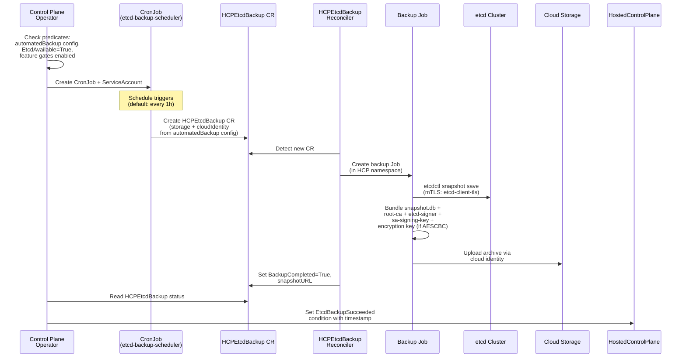
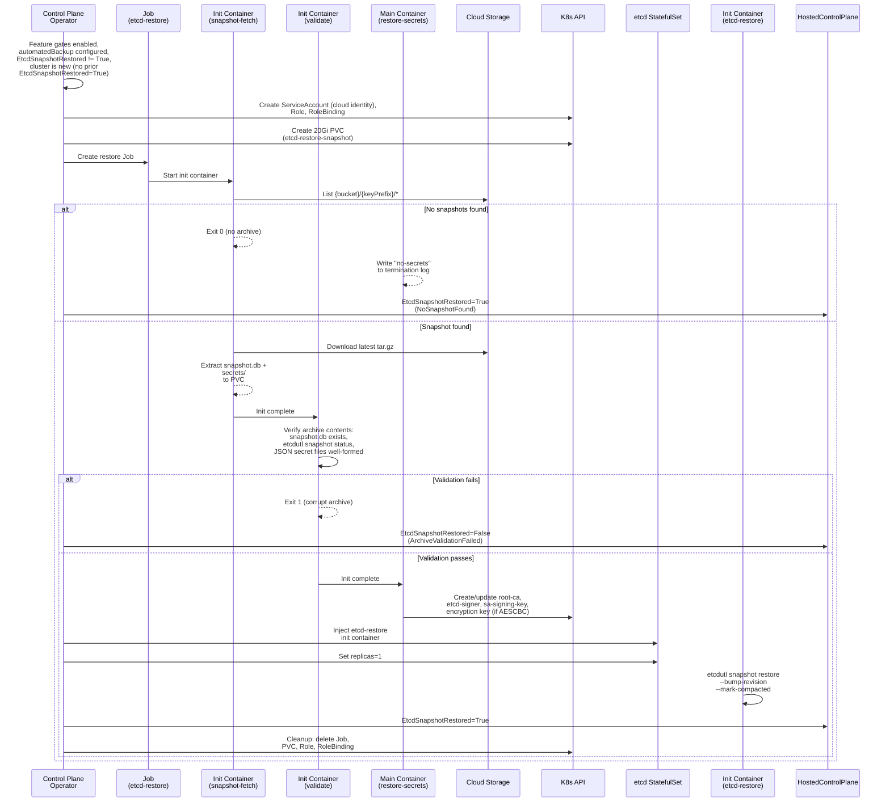

# Automated Etcd Backup and Restore for HyperShift Hosted Control Planes

## Summary

This enhancement adds scheduled etcd backup and automatic restore on cluster creation for HyperShift hosted control planes.
A CronJob in the Control Plane Operator (CPO) periodically creates `HCPEtcdBackup` CRs, which trigger the `HCPEtcdBackup` reconciler to snapshot etcd, bundle the snapshot with critical PKI secrets and the etcd encryption key, and upload the resulting archive to cloud storage.
When a new cluster is created with a matching `keyPrefix` and a backup exists, the CPO automatically restores the snapshot and secrets.

The `HCPEtcdBackup` CRD (see [HCPEtcdBackup enhancement](/enhancements/hypershift/hcp-etcd-backup-crd-for-oadp-integration.md)) serves as the universal one-shot backup primitive for all HyperShift consumers (ARO, ROSA, GCP, self-managed).
This enhancement builds on that primitive by adding a scheduling layer and an automated restore path.
The standalone OCP automated etcd backup enhancement (`/enhancements/etcd/automated-backups.md`) explicitly lists HyperShift as a non-goal; this enhancement fills that gap.

## Motivation

HyperShift hosted control planes run etcd as a StatefulSet in the management cluster's HCP namespace. Unlike standalone OCP clusters where the cluster-etcd-operator manages backups, HyperShift has no built-in mechanism for periodic etcd backup or automated restore. Managed service operators must rely on manual processes or external tools, which are error-prone and do not scale.

### User Stories

1. As a managed service operator, I want etcd to be automatically backed up on a schedule so that I have a recent recovery point without manual intervention.
2. As a managed service operator, I want a new cluster with the same infrastructure ID to automatically restore from the most recent backup so that disaster recovery is seamless.
3. As a managed service operator, I want PKI secrets and the etcd encryption key backed up alongside the etcd snapshot so that the restored cluster can function without regenerating cryptographic anchors.
4. As a managed service operator, I want to use cloud-native identity (per-HostedCluster cloud identity) for storage access so that no fleet-wide static credentials are required.
5. As an SRE, I want to monitor backup health via conditions (`EtcdBackupSucceeded`) so that I can detect silent backup failures through timestamp staleness.
6. As an SRE, I want automatic recovery from transient restore failures so that initial cluster creation is resilient to temporary IAM propagation delays.

### Goals

- Scheduled etcd backup via `HCPEtcdBackup` CRs created on a configurable cron schedule
- Automatic PKI secret and encryption key bundling alongside etcd snapshots (root-ca, etcd-signer, sa-signing-key, and the AESCBC encryption key when secret encryption is configured), delegated to the `HCPEtcdBackup` reconciler
- Automatic restore on cluster creation when a backup exists for the cluster's `keyPrefix`
- Per-HostedCluster cloud identity via API knobs (GCP service account email, AWS IAM role ARN, Azure managed identity client ID) — no fleet-wide static secrets
- Observable backup and restore status via HostedCluster and HostedControlPlane conditions
- Integration with `HCPEtcdBackup` as the universal one-shot backup primitive
- Multi-cloud support for all storage backends supported by `HCPEtcdBackup` (S3, Azure Blob, GCS)

### Non-Goals

- Standalone OCP cluster backup (covered by `/enhancements/etcd/automated-backups.md`)
- Automated backup retention or pruning (delegated to cloud lifecycle policies)
- Point-in-time recovery or incremental backups
- Backup of guest cluster workload state (only etcd data and control plane secrets)
- In-place restore of a running cluster (requires delete and recreate)
- Evolving the `HCPEtcdBackup` CRD itself (covered by the [HCPEtcdBackup enhancement](/enhancements/hypershift/hcp-etcd-backup-crd-for-oadp-integration.md))
- Backup execution mechanics (snapshot, bundling, upload) — delegated to the `HCPEtcdBackup` reconciler

## Proposal

The implementation adds a scheduling controller and a restore controller within the HyperShift CPO.
The `HCPEtcdBackup` CRD serves as the universal backup primitive — it runs in the HCP namespace where etcd and PKI secrets already live, produces a complete restorable artifact, and handles cloud storage upload.
This enhancement layers scheduling and restore on top of that primitive.

**Prerequisite**: The `HCPEtcdBackup` enhancement (PR #1945) must be updated so that:

1. The `HCPEtcdBackup` reconciler and backup Jobs run in the HCP namespace (not the HO namespace), eliminating cross-namespace access, NetworkPolicy management, and service network overhead for snapshot transfer.
2. The backup archive includes PKI secrets (root-ca, etcd-signer, sa-signing-key) and the AESCBC encryption key alongside the etcd snapshot.
3. The `HCPEtcdBackup` spec supports per-HostedCluster cloud identity via API knobs (GCP service account email, AWS IAM role ARN, Azure managed identity client ID) and a `credentialsSecretRef` for self-hosted scenarios. No fleet-wide static secrets.
4. GCS storage backend support is added alongside the existing S3 and Azure Blob backends.

Three components are introduced by this enhancement:

1. **API extension**: An `automatedBackup` field on `ManagedEtcdSpec` with schedule configuration, per-HostedCluster cloud identity knobs, and storage configuration, gated behind the `HCPAutomatedEtcdBackup` feature gate
2. **Scheduling controller**: A CPO controller that creates a CronJob to periodically create `HCPEtcdBackup` CRs. The CronJob does not perform backups itself — it creates CRs, and the `HCPEtcdBackup` reconciler handles execution
3. **Restore controller**: CPO reconciliation logic that downloads the latest backup archive from cloud storage and restores the etcd snapshot and PKI secrets

### Workflow Description

#### Backup

When `automatedBackup` is configured and the etcd cluster is available, the CPO creates a CronJob that periodically creates `HCPEtcdBackup` CRs. The `HCPEtcdBackup` reconciler then handles the actual backup execution.



1. The cluster creator sets `spec.etcd.managed.automatedBackup` on the HostedCluster.
2. The hypershift-operator propagates the field to the HostedControlPlane's `ManagedEtcdSpec` (see [HostedCluster to HostedControlPlane Propagation](#hostedcluster-to-hostedcontrolplane-propagation)).
3. The CPO checks that both the `HCPAutomatedEtcdBackup` and `HCPEtcdBackup` feature gates are enabled, the configuration is present, `EtcdAvailable=True`, and `EtcdSnapshotRestored=True`. The CronJob is not created (or is suspended) until `EtcdSnapshotRestored=True`. This prevents snapshotting an incomplete/in-progress etcd during restore.
4. The CPO creates a CronJob that runs a container to create `HCPEtcdBackup` CRs. The CronJob copies the `storage` (including `keyPrefix`) and `cloudIdentity` configuration from `automatedBackup` into each CR. If `keyPrefix` is empty, the CPO defaults it to the cluster's `infraID` before creating the CR.
5. The `HCPEtcdBackup` reconciler detects the new CR and creates a backup Job in the HCP namespace.
6. The backup Job snapshots etcd, bundles the snapshot with PKI secrets and the encryption key (when AESCBC is configured), and uploads the archive to cloud storage. The archive format and upload logic are defined by the `HCPEtcdBackup` enhancement.
7. The `HCPEtcdBackup` reconciler updates the CR status with `BackupCompleted=True` and the `snapshotURL`.
8. The CPO reads the latest `HCPEtcdBackup` CR status and sets the `EtcdBackupSucceeded` condition on the HostedControlPlane.

The CPO creates a ServiceAccount for the CronJob with RBAC permissions to create `HCPEtcdBackup` CRs in the HCP namespace. The ServiceAccount and associated Role/RoleBinding have owner references to the HostedControlPlane for garbage collection.

#### Restore

When a new cluster is created with `automatedBackup` configured and a backup exists under the configured `keyPrefix`, the CPO automatically restores the etcd snapshot and PKI secrets.



1. The CPO detects that the `HCPAutomatedEtcdBackup` and `HCPEtcdBackup` feature gates are enabled, `automatedBackup` is configured, and `EtcdSnapshotRestored` is not True.
   The restore controller is only active when `automatedBackup` is configured — clusters without it skip restore entirely and the `EtcdSnapshotRestored` condition is not evaluated.
2. **Critical ordering invariant**: The CPO defers PKI secret generation (`root-ca`, `etcd-signer`, `sa-signing-key`) until `EtcdSnapshotRestored` is resolved.
   If the CPO generates fresh secrets after the restore Job writes backup secrets, the restored etcd data becomes permanently unusable
   (data signed/encrypted with the old keys, cluster running with new keys).
   The etcd StatefulSet reconciler also checks `EtcdSnapshotRestored` and skips scale-up and normal PKI secret generation until it is True.
3. It creates a ServiceAccount (annotated for cloud identity access using the `cloudIdentity` configuration), Role, RoleBinding, and a 20Gi PVC.
   The Role grants `get`, `list`, `create`, and `update` on `secrets` in the HCP namespace,
   scoped to the specific secret names (`root-ca`, `etcd-signer`, `sa-signing-key`, and the AESCBC active key name when applicable) via `resourceNames`.
   The AESCBC key name is resolved from the HostedControlPlane's `spec.secretEncryption.aescbc.activeKey.name` at Role creation time.
4. A Job lists objects in cloud storage under `{bucket}/{keyPrefix}/` to find the latest archive (using the `keyPrefix` from `automatedBackup.storage` — the same path used by backup), downloads it, and runs a pre-flight validation step. The archive format is defined by `HCPEtcdBackup` (etcd snapshot + PKI secrets as JSON). See [Archive Format and Path Contract](#archive-format-and-path-contract).
5. If no backup exists, the cluster starts fresh (`NoSnapshotFound`).
6. If validation passes, the restore-secrets container uses server-side apply for each secret.
   If any secret write fails, the container exits non-zero and the retry logic handles it.
   Partial writes are safe on retry because each secret is independently idempotent (overwritten with the correct backup value).
   The CPO then injects an `etcd-restore` init container into the etcd StatefulSet.
7. The init container runs `etcdutl snapshot restore` with `--bump-revision` and `--mark-compacted` (required for the disaster recovery use case to prevent revision conflicts).
8. The CPO sets `EtcdSnapshotRestored=True`, removes the `etcd-restore` init container from the StatefulSet spec, scales the StatefulSet back to 3 replicas, and cleans up the Job, PVC, Role, and RoleBinding.

**Adding `automatedBackup` to a running cluster**: If `automatedBackup` is added to a HostedCluster that already has `EtcdSnapshotRestored=True` (from a previous restore or normal startup), the CPO does **not** trigger a restore. Backups begin on the next CronJob trigger. In-place restore of a running cluster is not supported (see Non-Goals).

**Existing cluster adoption**: When `automatedBackup` is first configured on a cluster that already has a running etcd
(`EtcdAvailable=True` and etcd StatefulSet already has data), the CPO sets `EtcdSnapshotRestored=True` with reason `ExistingCluster` without attempting restore.
This prevents the control plane from being temporarily blocked by the absent `EtcdSnapshotRestored` condition during feature adoption on existing clusters.

**Cluster identity and restore**: In a disaster recovery scenario, the new HostedCluster must be created with the same `automatedBackup` configuration
(including `keyPrefix`) so that the restore controller can locate the backups.
Beyond backup lookup, two HyperShift identifiers are relevant:

- **`infraID`** identifies the cloud infrastructure (VPCs, load balancers, DNS records). The new cluster should reuse the same `infraID` so it picks up existing infrastructure resources. This is a general HyperShift DR requirement, not specific to this enhancement.
- **`clusterID`** is the OpenShift cluster UUID. A newly created cluster always receives a new `clusterID`. The etcd data restored from backup contains the old `clusterID`; the CVO and cluster operators reconcile this to match the new cluster after restore.

Neither `infraID` nor `clusterID` plays a role in backup lookup — that is determined solely by `keyPrefix`.

#### Error Handling

**Restore Job failure with circuit breaker**: When the restore Job fails (all retry attempts exhausted with `backoffLimit: 3`),
the CPO sets `EtcdSnapshotRestored=False` with reason `RestoreJobFailed` and increments the `restoreRetryCount` field in the HostedControlPlane status.
On the next reconcile, the CPO automatically deletes the failed Job, removes the `EtcdSnapshotRestored` condition, and creates a fresh Job.
This handles transient failures such as IAM propagation delays during initial cluster creation.

After **10 failed Job attempts**, the CPO sets `EtcdSnapshotRestored=False` with reason `RestorePermanentlyFailed` and stops creating new Jobs.
This prevents unbounded API churn from permanent failures (wrong bucket, deleted service account, corrupt archive).
To retry after manual remediation, an operator can reset the counter by setting the `restoreRetryCount` status field to 0 on the HostedControlPlane.

**Restore PVC stuck**: If the restore PVC remains in `Pending` state (e.g., due to storage quota exhaustion or zone constraints), the restore Job cannot start. After a 10-minute timeout, the CPO deletes the Pending PVC and counts it as a retry attempt, triggering the circuit breaker logic above. The `EtcdSnapshotRestored=False` condition message includes the PVC status to aid debugging.

**Backup failure**: If the `HCPEtcdBackup` reconciler fails to complete a backup, the `HCPEtcdBackup` CR status reflects the failure. The CPO sets `EtcdBackupSucceeded=False` based on the CR status. The CronJob creates a new `HCPEtcdBackup` CR at the next scheduled interval, and the etcd data plane is unaffected.

**Single-replica failure during restore**: During restore, the StatefulSet is set to `replicas=1`.
If the single etcd pod crashes during or after restore, the StatefulSet controller restarts it.
The `etcd-restore` init container is idempotent — it re-runs on pod restart without data corruption.
After a successful restore, the CPO scales the StatefulSet back to 3 and additional members join via Raft replication.

### API Extensions

#### New Field on `ManagedEtcdSpec`

The `automatedBackup` field is added to `ManagedEtcdSpec` in both the `HostedCluster` and `HostedControlPlane` CRDs:

```go
type ManagedEtcdSpec struct {
    // ...existing fields (Storage, Backup)...

    // automatedBackup configures scheduled etcd backups to cloud storage.
    // When set, the Control Plane Operator creates a CronJob that periodically
    // creates HCPEtcdBackup CRs. The HCPEtcdBackup reconciler handles snapshot,
    // PKI secret bundling, and upload. When a new cluster is created with the
    // same keyPrefix and a backup exists, the snapshot and secrets are
    // automatically restored. When omitted, no automated etcd backups or
    // restores are performed.
    // +optional
    // +openshift:enable:FeatureGate=HCPAutomatedEtcdBackup
    AutomatedBackup AutomatedEtcdBackupConfig `json:"automatedBackup,omitzero"`
}
```

This field is distinct from the existing `Backup HCPEtcdBackupConfig` field on `ManagedEtcdSpec` (value type with `json:"backup,omitzero"`), which is gated behind the `HCPEtcdBackup` feature gate and configures the `HCPEtcdBackup` CRD for one-shot backups. The `automatedBackup` field layers scheduling on top of `HCPEtcdBackup` by creating CRs on a cron schedule.

#### New Types

```go
// AutomatedEtcdBackupConfig configures scheduled etcd backups to cloud storage.
// The zero value means automated backup is disabled. The required storage.type
// field prevents an empty struct from being valid.
type AutomatedEtcdBackupConfig struct {
    // schedule is a cron expression defining the backup frequency using the
    // standard 5-field format (minute hour day-of-month month day-of-week).
    // The schedule is interpreted in UTC. When empty, the CPO applies a default
    // schedule (currently every hour). The default is applied by the
    // controller at reconcile time, not the CRD schema, so it may change
    // across releases. The value must be between 1 and 64 characters long.
    // +optional
    // +kubebuilder:validation:MaxLength=64
    // +kubebuilder:validation:XValidation:rule="self.matches('^[^ ]+ [^ ]+ [^ ]+ [^ ]+ [^ ]+$')",message="schedule must be a 5-field cron expression (minute hour day-of-month month day-of-week)"
    Schedule string `json:"schedule,omitempty"`

    // storage configures the cloud storage backend for backup archives.
    // This configuration is copied into each HCPEtcdBackup CR created by the
    // CronJob.
    // +required
    Storage AutomatedEtcdBackupStorage `json:"storage"`

    // cloudIdentity configures the per-HostedCluster cloud identity used for
    // storage access. Each HostedCluster gets its own cloud identity scoped to
    // its own backup storage. The managed service layer (ARO-HCP, ROSA, GCP-HCP)
    // provisions these identities on cluster creation. This configuration is
    // copied into each HCPEtcdBackup CR created by the CronJob and used by the
    // restore ServiceAccount.
    // +required
    CloudIdentity AutomatedEtcdBackupCloudIdentity `json:"cloudIdentity"`
}

// AutomatedEtcdBackupStorage configures the storage backend for automated etcd
// backups. Exactly one storage type must be specified. The storage type is
// immutable after the first backup has been written; changing it would leave
// orphaned backups in the original backend and cause restore to look in the
// wrong location.
//
// +union
// +kubebuilder:validation:XValidation:rule="self.type == 'GCS' ? has(self.gcs) : !has(self.gcs)",message="gcs configuration is required when type is GCS, and forbidden otherwise"
// +kubebuilder:validation:XValidation:rule="self.type == 'S3' ? has(self.s3) : !has(self.s3)",message="s3 configuration is required when type is S3, and forbidden otherwise"
// +kubebuilder:validation:XValidation:rule="self.type == 'AzureBlob' ? has(self.azureBlob) : !has(self.azureBlob)",message="azureBlob configuration is required when type is AzureBlob, and forbidden otherwise"
// +kubebuilder:validation:XValidation:rule="oldSelf.type == self.type",message="storage type is immutable once set"
type AutomatedEtcdBackupStorage struct {
    // type is the storage backend type. It must be set to one of the
    // following values: GCS, S3, or AzureBlob.
    // +unionDiscriminator
    // +required
    Type AutomatedEtcdBackupStorageType `json:"type"`

    // gcs configures Google Cloud Storage as the backup destination.
    // +optional
    GCS *AutomatedEtcdBackupGCS `json:"gcs,omitzero"`

    // s3 configures AWS S3 as the backup destination.
    // +optional
    S3 *AutomatedEtcdBackupS3 `json:"s3,omitzero"`

    // azureBlob configures Azure Blob Storage as the backup destination.
    // +optional
    AzureBlob *AutomatedEtcdBackupAzureBlob `json:"azureBlob,omitzero"`
}

// AutomatedEtcdBackupStorageType is a string identifying a storage backend.
// +kubebuilder:validation:Enum=GCS;S3;AzureBlob
type AutomatedEtcdBackupStorageType string

const (
    AutomatedEtcdBackupStorageTypeGCS       AutomatedEtcdBackupStorageType = "GCS"
    AutomatedEtcdBackupStorageTypeS3        AutomatedEtcdBackupStorageType = "S3"
    AutomatedEtcdBackupStorageTypeAzureBlob AutomatedEtcdBackupStorageType = "AzureBlob"
)

// AutomatedEtcdBackupGCS configures Google Cloud Storage as the backup
// destination.
type AutomatedEtcdBackupGCS struct {
    // bucket is the name of the GCS bucket for storing etcd backup archives.
    // The bucket must already exist and the cloud identity must have
    // read/write access to it.
    // +required
    // +kubebuilder:validation:MinLength=3
    // +kubebuilder:validation:MaxLength=63
    Bucket string `json:"bucket"`

    // keyPrefix is the object name prefix under which backup archives are
    // stored. Backups are written to {keyPrefix}/{unix-timestamp}.tar.gz.
    // The restore controller lists objects under this same prefix to find
    // the latest archive, ensuring backup and restore always use the same
    // path. When empty, the CPO defaults this to the cluster's infraID at
    // reconcile time. This field is immutable once the first backup has
    // been written; changing it would cause restore to look in the wrong
    // location.
    // +optional
    // +kubebuilder:validation:MaxLength=256
    // +kubebuilder:validation:XValidation:rule="oldSelf == '' || self == oldSelf",message="keyPrefix is immutable once set"
    KeyPrefix string `json:"keyPrefix,omitempty"`
}

// AutomatedEtcdBackupS3 configures AWS S3 as the backup destination.
type AutomatedEtcdBackupS3 struct {
    // bucket is the name of the S3 bucket for storing etcd backup archives.
    // The bucket must already exist and the cloud identity must have
    // read/write access to it.
    // +required
    // +kubebuilder:validation:MinLength=1
    Bucket string `json:"bucket"`

    // region is the AWS region of the bucket.
    // +required
    // +kubebuilder:validation:MinLength=1
    Region string `json:"region"`

    // keyPrefix is the object key prefix under which backup archives are
    // stored. Backups are written to {keyPrefix}/{unix-timestamp}.tar.gz.
    // The restore controller lists objects under this same prefix to find
    // the latest archive, ensuring backup and restore always use the same
    // path. When empty, the CPO defaults this to the cluster's infraID at
    // reconcile time. This field is immutable once the first backup has
    // been written; changing it would cause restore to look in the wrong
    // location.
    // +optional
    // +kubebuilder:validation:MaxLength=256
    // +kubebuilder:validation:XValidation:rule="oldSelf == '' || self == oldSelf",message="keyPrefix is immutable once set"
    KeyPrefix string `json:"keyPrefix,omitempty"`
}

// AutomatedEtcdBackupAzureBlob configures Azure Blob Storage as the backup
// destination.
type AutomatedEtcdBackupAzureBlob struct {
    // container is the Azure Blob Storage container name.
    // +required
    // +kubebuilder:validation:MinLength=1
    Container string `json:"container"`

    // storageAccount is the Azure Storage account name.
    // +required
    // +kubebuilder:validation:MinLength=1
    StorageAccount string `json:"storageAccount"`

    // keyPrefix is the blob name prefix under which backup archives are
    // stored. Backups are written to {keyPrefix}/{unix-timestamp}.tar.gz.
    // The restore controller lists blobs under this same prefix to find
    // the latest archive, ensuring backup and restore always use the same
    // path. When empty, the CPO defaults this to the cluster's infraID at
    // reconcile time. This field is immutable once the first backup has
    // been written; changing it would cause restore to look in the wrong
    // location.
    // +optional
    // +kubebuilder:validation:MaxLength=256
    // +kubebuilder:validation:XValidation:rule="oldSelf == '' || self == oldSelf",message="keyPrefix is immutable once set"
    KeyPrefix string `json:"keyPrefix,omitempty"`
}

// AutomatedEtcdBackupCloudIdentity configures the per-HostedCluster cloud
// identity for backup storage access. Exactly one identity type must be
// specified. This identity is used both for backup (via HCPEtcdBackup CRs)
// and for restore (via the restore ServiceAccount).
//
// +union
// +kubebuilder:validation:XValidation:rule="self.type == 'GCP' ? has(self.gcp) : !has(self.gcp)",message="gcp configuration is required when type is GCP, and forbidden otherwise"
// +kubebuilder:validation:XValidation:rule="self.type == 'AWS' ? has(self.aws) : !has(self.aws)",message="aws configuration is required when type is AWS, and forbidden otherwise"
// +kubebuilder:validation:XValidation:rule="self.type == 'Azure' ? has(self.azure) : !has(self.azure)",message="azure configuration is required when type is Azure, and forbidden otherwise"
type AutomatedEtcdBackupCloudIdentity struct {
    // type is the cloud identity type. It must be set to one of the
    // following values: GCP, AWS, Azure, or Secret.
    // +unionDiscriminator
    // +required
    Type AutomatedEtcdBackupCloudIdentityType `json:"type"`

    // gcp configures GCP Workload Identity for storage access.
    // +optional
    GCP *AutomatedEtcdBackupGCPIdentity `json:"gcp,omitzero"`

    // aws configures AWS IAM role assumption (IRSA/STS) for storage access.
    // +optional
    AWS *AutomatedEtcdBackupAWSIdentity `json:"aws,omitzero"`

    // azure configures Azure Managed Identity for storage access.
    // +optional
    Azure *AutomatedEtcdBackupAzureIdentity `json:"azure,omitzero"`

    // credentialsSecretRef references a Secret containing static cloud
    // credentials for storage access. Use this for self-hosted environments
    // where workload identity is not available. The Secret must exist in the
    // HCP namespace. The expected key format depends on the storage type
    // (e.g., 'credentials' for AWS, 'cloud' for Azure).
    // +optional
    CredentialsSecretRef *corev1.LocalObjectReference `json:"credentialsSecretRef,omitzero"`
}

// AutomatedEtcdBackupCloudIdentityType is a string identifying a cloud
// identity type.
// +kubebuilder:validation:Enum=GCP;AWS;Azure;Secret
type AutomatedEtcdBackupCloudIdentityType string

const (
    AutomatedEtcdBackupCloudIdentityTypeGCP    AutomatedEtcdBackupCloudIdentityType = "GCP"
    AutomatedEtcdBackupCloudIdentityTypeAWS    AutomatedEtcdBackupCloudIdentityType = "AWS"
    AutomatedEtcdBackupCloudIdentityTypeAzure  AutomatedEtcdBackupCloudIdentityType = "Azure"
    AutomatedEtcdBackupCloudIdentityTypeSecret AutomatedEtcdBackupCloudIdentityType = "Secret"
)

// AutomatedEtcdBackupGCPIdentity configures GCP Workload Identity for
// backup storage access on GKE management clusters.
type AutomatedEtcdBackupGCPIdentity struct {
    // gcpServiceAccount is the email address of a GCP service account that
    // has been granted IAM access to the backup bucket. The Kubernetes
    // ServiceAccount used by backup and restore pods is annotated with this
    // email for GKE Workload Identity federation.
    // +required
    // +kubebuilder:validation:XValidation:rule="self.matches('^[a-z][a-z0-9-]{4,28}[a-z0-9]@[a-z][a-z0-9.-]+\\\\.iam\\\\.gserviceaccount\\\\.com$')",message="gcpServiceAccount must be a valid GCP service account email (e.g., name@project.iam.gserviceaccount.com)"
    GCPServiceAccount string `json:"gcpServiceAccount"`
}

// AutomatedEtcdBackupAWSIdentity configures AWS IAM role assumption
// (IRSA/STS) for backup storage access.
type AutomatedEtcdBackupAWSIdentity struct {
    // roleARN is the ARN of the AWS IAM role to assume for storage access.
    // The Kubernetes ServiceAccount used by backup and restore pods is
    // configured for IRSA with this role ARN. The role must have S3
    // read/write permissions on the backup bucket.
    // +required
    // +kubebuilder:validation:MinLength=20
    RoleARN string `json:"roleARN"`
}

// AutomatedEtcdBackupAzureIdentity configures Azure Managed Identity for
// backup storage access.
type AutomatedEtcdBackupAzureIdentity struct {
    // clientID is the client ID of the Azure Managed Identity used for
    // storage access. The Kubernetes ServiceAccount used by backup and
    // restore pods is annotated for Azure Workload Identity federation
    // with this client ID. The identity must have read/write permissions
    // on the backup storage container.
    // +required
    // +kubebuilder:validation:MinLength=36
    // +kubebuilder:validation:MaxLength=36
    ClientID string `json:"clientID"`
}
```

#### Configuration Examples

**GCP with GKE Workload Identity:**

```yaml
apiVersion: hypershift.openshift.io/v1beta1
kind: HostedCluster
metadata:
  name: my-cluster
  namespace: clusters
spec:
  etcd:
    managementType: Managed
    managed:
      automatedBackup:
        schedule: "0 */1 * * *"
        storage:
          type: GCS
          gcs:
            bucket: "my-etcd-backups"
        cloudIdentity:
          type: GCP
          gcp:
            gcpServiceAccount: "etcd-backup@my-project.iam.gserviceaccount.com"
```

**AWS with IRSA:**

```yaml
apiVersion: hypershift.openshift.io/v1beta1
kind: HostedCluster
metadata:
  name: my-cluster
  namespace: clusters
spec:
  etcd:
    managementType: Managed
    managed:
      automatedBackup:
        schedule: "0 */1 * * *"
        storage:
          type: S3
          s3:
            bucket: "my-etcd-backups"
            region: "us-east-1"
        cloudIdentity:
          type: AWS
          aws:
            roleARN: "arn:aws:iam::123456789012:role/etcd-backup-role"
```

**Azure with Managed Identity:**

```yaml
apiVersion: hypershift.openshift.io/v1beta1
kind: HostedCluster
metadata:
  name: my-cluster
  namespace: clusters
spec:
  etcd:
    managementType: Managed
    managed:
      automatedBackup:
        schedule: "0 */1 * * *"
        storage:
          type: AzureBlob
          azureBlob:
            container: "etcd-backups"
            storageAccount: "mystorageaccount"
        cloudIdentity:
          type: Azure
          azure:
            clientID: "12345678-1234-1234-1234-123456789012"
```

**Self-hosted with static credentials:**

```yaml
apiVersion: hypershift.openshift.io/v1beta1
kind: HostedCluster
metadata:
  name: my-cluster
  namespace: clusters
spec:
  etcd:
    managementType: Managed
    managed:
      automatedBackup:
        schedule: "0 */1 * * *"
        storage:
          type: S3
          s3:
            bucket: "my-etcd-backups"
            region: "us-east-1"
        cloudIdentity:
          type: Secret
          credentialsSecretRef:
            name: "etcd-backup-credentials"
```

#### New Conditions

Two conditions are added to track backup and restore status. Both conditions are set on the HostedControlPlane by the CPO. The `EtcdBackupSucceeded` condition is already in the HostedCluster bubble-up list; `EtcdSnapshotRestored` must be added to the bubble-up list in the hypershift-operator's HostedCluster controller (it is not bubbled up today).

**`EtcdBackupSucceeded`** (on HostedControlPlane, bubbled up to HostedCluster):

| Status | Reason | Blocks CP? | Description |
| ------ | ------ | :--------: | ----------- |
| `True` | `BackupSucceeded` | No | Last successful backup timestamp in message (from HCPEtcdBackup CR status) |
| `False` | `BackupInProgress` | No | HCPEtcdBackup CR created but not yet completed |
| `False` | `WaitingForFirstSchedule` | No | CronJob has not been scheduled yet |
| `False` | `CronJobSuspended` | No | CronJob is suspended |
| `False` | `WaitingForEtcd` | No | Waiting for `EtcdAvailable=True` |

**`EtcdSnapshotRestored`** (on HostedControlPlane, must be added to HostedCluster bubble-up list):

| Status | Reason | Blocks CP? | Description |
| ------ | ------ | :--------: | ----------- |
| `True` | `AsExpected` | No | Snapshot restored successfully |
| `True` | `NoSnapshotFound` | No | No backup exists; cluster starts fresh |
| `True` | `ExistingCluster` | No | `automatedBackup` added to a cluster with existing etcd data; restore skipped |
| `False` | `RestoreJobFailed` | **Yes** | Restore Job failed (retrying, up to 10 attempts) |
| `False` | `RestorePermanentlyFailed` | **Yes** | Restore failed after 10 attempts; manual intervention required |
| `False` | `ArchiveValidationFailed` | **Yes** | Archive integrity check failed |
| `False` | `ArchiveDigestMismatch` | **Yes** | SHA-256 digest of downloaded archive does not match upload-time digest |
| Not set | — | **Yes** (temporarily) | Restore in progress or not yet evaluated. Only evaluated when `automatedBackup` is configured; clusters without `automatedBackup` skip restore entirely |

#### Feature Gate

The `automatedBackup` field is gated behind the `HCPAutomatedEtcdBackup` feature gate in the `TechPreviewNoUpgrade` feature set. This follows the same pattern as the existing `Backup` field on `ManagedEtcdSpec`, which is gated behind `HCPEtcdBackup`.

**Dependency**: The `HCPEtcdBackup` feature gate must also be enabled. The CPO predicate checks both gates — `HCPAutomatedEtcdBackup` for the scheduling and restore controllers, and `HCPEtcdBackup` because the CronJob creates `HCPEtcdBackup` CRs which require that gate to be active.

The gate name `HCPAutomatedEtcdBackup` remains the same across feature sets (Tech Preview to GA). During graduation, the gate is moved from `TechPreviewNoUpgrade` to the default feature set. Existing clusters with the field configured continue to function; the field is no longer pruned from objects once the gate is in the default set.

The feature gate provides:

- **Graduated rollout**: The field is only available when the feature gate is explicitly enabled, preventing accidental use in production before the feature is stable.
- **Kill switch**: If a critical bug is found post-release, the feature can be disabled by removing the gate, which causes the gated field to be pruned from stored objects. The CPO predicate checks the gate before creating any backup or restore resources.
- **API safety**: The restore controller path blocks control plane startup (`EtcdSnapshotRestored` not set blocks the CP temporarily). Gating ensures this code path is only active when explicitly opted in.

### Topology Considerations

#### Hypershift / Hosted Control Planes

This is a HyperShift-only feature. The CronJob and restore Job run in the management cluster's HCP namespace. Backup Jobs created by `HCPEtcdBackup` also run in the HCP namespace. No guest cluster components are affected. The scheduling and restore logic is entirely within the Control Plane Operator.

#### Standalone Clusters

Not applicable. Standalone OCP automated backups are covered by `/enhancements/etcd/automated-backups.md`.

#### Single-node Deployments or MicroShift

Not applicable. This feature operates within the HyperShift Control Plane Operator (CPO), which does not run on MicroShift or SNO deployments.

#### OpenShift Kubernetes Engine

Not applicable. This feature is HyperShift-specific and does not depend on features excluded from OKE.

### Implementation Details/Notes/Constraints

#### Integration with HCPEtcdBackup

This enhancement uses `HCPEtcdBackup` as the backup execution primitive. The relationship is:

| Component | Owner | Responsibility |
| --------- | ----- | -------------- |
| `HCPEtcdBackup` CRD and reconciler | HCPEtcdBackup enhancement (PR #1945) | One-shot backup execution: snapshot etcd, bundle PKI secrets, upload to cloud storage |
| `automatedBackup` on `ManagedEtcdSpec` | This enhancement | Scheduling: CronJob creates `HCPEtcdBackup` CRs on a cron schedule |
| Restore controller | This enhancement | Download latest archive from cloud storage, restore etcd snapshot and PKI secrets |

The CronJob controller copies the `storage` (including `keyPrefix`) and `cloudIdentity` configuration from `automatedBackup` into each `HCPEtcdBackup` CR it creates.
The `keyPrefix` field is the shared contract between backup and restore — both sides derive the storage path from this single field in `automatedBackup.storage`.
The `HCPEtcdBackup` reconciler owns the backup Job lifecycle, archive format, and cloud storage upload logic.

**Relationship with `restoreSnapshotURL`**: The `restoreSnapshotURL` field provides manual, URL-based restore from a pre-signed S3 URL.
It does not restore PKI secrets (the operator must ensure the same CA and signing keys are available).
The proposed automated restore is a superset: it restores both the etcd snapshot and PKI secrets from a managed archive.
Both mechanisms use the `EtcdSnapshotRestored` condition.
They are mutually exclusive at restore time — if both `restoreSnapshotURL` and `automatedBackup` are configured,
the CPO should reject the configuration with a validation error.
Long-term, `restoreSnapshotURL` may be deprecated in favor of `automatedBackup` once the feature is GA.

**Relationship with `etcd-backup` subcommand**: The `etcd-backup` subcommand is an internal implementation detail of the `HCPEtcdBackup` reconciler. This enhancement does not depend on or modify it.

#### HostedCluster to HostedControlPlane Propagation

The `automatedBackup` field must be added to `ManagedEtcdSpec` in both the HostedCluster and HostedControlPlane API types.
The hypershift-operator propagates the `automatedBackup` field automatically via `ManagedEtcdSpec.DeepCopy()` during
HostedCluster-to-HostedControlPlane reconciliation (see `hostedcluster_controller.go:2487`) — no HO code change is needed for field propagation.
However, the `EtcdSnapshotRestored` condition must be added to the HO's HostedCluster bubble-up list, which does require an HO change.

The CPO reads `automatedBackup` from the HostedControlPlane spec (not directly from HostedCluster). Conditions are set on the HostedControlPlane status. `EtcdBackupSucceeded` is already in the hypershift-operator's bubble-up list for HostedCluster status; `EtcdSnapshotRestored` must be added.

#### Why PKI Secrets and the Encryption Key Must Be Backed Up

The etcd snapshot alone is insufficient for recovery. These secrets are cryptographic anchors created once and never regenerated. If replaced with fresh keys, the restored data becomes unusable. The `HCPEtcdBackup` reconciler bundles these secrets alongside the etcd snapshot.

| Secret | Purpose | Impact if Lost or Regenerated |
| ------ | ------- | ----------------------------- |
| `root-ca` | Self-signed root CA for the hosted control plane. Signs all CP certificates and is embedded in every guest cluster kubeconfig. | All certificates invalid, kubeconfigs cannot authenticate, nodes cannot join |
| `etcd-signer` | Independent CA that signs all etcd TLS certificates (server, peer, client, metrics). | KAS (Kubernetes API Server) cannot connect to etcd (TLS handshake failure), peer communication breaks |
| `sa-signing-key` | RSA keypair used by KAS to sign and verify ServiceAccount JWT tokens. | Every existing SA token becomes unverifiable, breaking all in-cluster workloads |
| `<activeKey>` (AESCBC) | Symmetric AES-256 key used by KAS to encrypt Secrets at rest in etcd. Referenced by `spec.secretEncryption.aescbc.activeKey`. Present only when `spec.secretEncryption.type == aescbc`. | All encrypted etcd resources (Secrets, ConfigMaps marked for encryption) are permanently unreadable |

The first three secrets are always included in the backup archive by `HCPEtcdBackup`. The AESCBC encryption key is included conditionally based on the HostedCluster's `spec.secretEncryption` configuration:

- **AESCBC encryption** (`spec.secretEncryption.type == aescbc`): The encryption key is included in the backup archive by `HCPEtcdBackup`. The key must be restored before KAS starts, or the restored etcd data is permanently unreadable.
- **KMS encryption** (`spec.secretEncryption.type == kms`): The encryption key lives in the cloud KMS service. No Kubernetes secret needs backing up, but the cloud KMS key must remain accessible and the KMS configuration on the new HostedCluster must reference the same key.
- **No encryption**: No additional secrets beyond the three PKI secrets are needed.

#### Per-HostedCluster Cloud Identity

Each HostedCluster gets its own cloud identity scoped to its own backup storage, configured via the `cloudIdentity` field in `automatedBackup`. This eliminates fleet-wide static secrets that would be a single point of compromise across all clusters.

| Cloud | Identity Mechanism | ServiceAccount Configuration |
| ----- | ------------------ | ---------------------------- |
| GCP | GKE Workload Identity | SA annotated with `iam.gke.io/gcp-service-account` |
| AWS | IRSA / STS | Projected SA token volume with `sts.amazonaws.com` audience + `AWS_ROLE_ARN` env var |
| Azure | Managed Identity | SA annotated with `azure.workload.identity/client-id` + pod label `azure.workload.identity/use: "true"` |
| Self-hosted | Static credentials Secret | Secret mounted as a volume |

The managed service layer (ARO-HCP, ROSA, GCP-HCP) is responsible for provisioning these per-HostedCluster identities on cluster creation. HyperShift provides the API knobs; the consumer provides the identity.

The same `cloudIdentity` configuration is used for both backup (copied into `HCPEtcdBackup` CRs) and restore (applied to the restore ServiceAccount).

#### Why Single-Replica Restore

The restore PVC is `ReadWriteOnce`. On GKE Autopilot and similar environments with topology-aware volume provisioning, scheduling a 3-replica StatefulSet where all pods need the same PVC creates a zonal deadlock. Setting `replicas=1` during restore avoids this. After restore, the StatefulSet scales back to 3 and additional members join via Raft replication.

#### CronJob Settings

The CronJob is a lightweight scheduler that creates `HCPEtcdBackup` CRs. It does not perform etcd snapshots directly.

| Setting | Value | Effect |
| ------- | ----- | ------ |
| `concurrencyPolicy` | `Forbid` | Prevents overlapping CronJob runs |
| `restartPolicy` | `Never` | Failed pods are not retried within a single Job |
| `successfulJobsHistoryLimit` | 3 | Retains the last 3 successful Job objects |
| `failedJobsHistoryLimit` | 5 | Retains the last 5 failed Job objects for debugging |
| `activeDeadlineSeconds` | 300 | Terminates CronJob pods that cannot create HCPEtcdBackup CRs within 5 minutes |
| `priorityClassName` | `openshift-user-critical` | Prevents preemption on resource-constrained management clusters |
| `ownerReferences` | `[{HostedControlPlane}]` | Garbage collection on HCP deletion |

The CronJob is labeled with `hypershift.openshift.io/managed-by: control-plane-operator` for discovery and cleanup.

#### Archive Format and Path Contract

The archive format is defined by the `HCPEtcdBackup` enhancement. Each backup produces a single `.tar.gz` containing:

- `snapshot.db` — the etcd snapshot
- `secrets/root-ca.json` — root CA certificate and key
- `secrets/etcd-signer.json` — etcd signer certificate and key
- `secrets/sa-signing-key.json` — service account signing keypair
- `secrets/<activeKey-name>.json` — AESCBC encryption key (present only when `spec.secretEncryption.type == aescbc`)

**Path contract**: Both backup and restore derive the storage path from the same `keyPrefix` field in the `automatedBackup.storage` configuration.
This is the single source of truth that guarantees backup and restore use the same location
— critical because at restore time (cluster creation) there are no `HCPEtcdBackup` CRs to query.

The CronJob controller copies `keyPrefix` into each `HCPEtcdBackup` CR it creates.
The `HCPEtcdBackup` reconciler writes archives to `{keyPrefix}/{unix-timestamp}.tar.gz`.
The restore controller lists objects under the same `{keyPrefix}/` and selects the latest by lexicographic sort
(Unix timestamps ensure correct ordering).
If `keyPrefix` is empty, the CPO defaults it to the cluster's `infraID` at reconcile time.

The `keyPrefix` field is immutable once set to prevent backup/restore path divergence. Backups are not automatically pruned; users must configure a lifecycle policy on their storage backend.

#### Multi-Tenancy and Scale Considerations

On management clusters hosting many hosted control planes, each cluster with `automatedBackup` configured creates its own CronJob.
Thundering herd effects are avoided by configuring different cron schedules per hosted control plane
and by the `HCPEtcdBackup` reconciler's own concurrency management.
Operators running hundreds of hosted clusters should size the management cluster's API server and etcd accordingly.

In multi-tenant environments where multiple hosted clusters share the same cloud project and backup bucket, operators must ensure `keyPrefix` uniqueness across clusters
(the default `infraID` value is unique by design).
A misconfigured `keyPrefix` on a new cluster could restore from the wrong cluster's backup.
For environments requiring stronger isolation, operators should use separate buckets per cluster or per tenant.

#### Interaction with Etcd Sharding

The [etcd sharding by resource kind](https://github.com/openshift/enhancements/pull/1979) proposal introduces multiple etcd instances per hosted control plane. If sharding is enabled alongside automated backup, the `HCPEtcdBackup` reconciler must handle snapshotting all shards. Key considerations:

- **Backup**: Sharding support in backup execution is the responsibility of the `HCPEtcdBackup` enhancement. The scheduling layer is unaffected — a single `HCPEtcdBackup` CR represents a single backup operation regardless of shard count.
- **Restore**: The restore controller must restore all shard snapshots together. This will require updates to the restore Job to handle per-shard snapshot files.
- **Ordering**: Sharding is not yet implemented. This enhancement targets the current single-etcd architecture. Sharding support will be addressed when the sharding enhancement progresses.

#### PVC Sizing

The restore PVC is sized at 20Gi and uses the same StorageClass as the etcd StatefulSet's PVCs to ensure zone-compatible volume provisioning.
The PVC must hold both the downloaded `.tar.gz` archive and the extracted contents (snapshot.db + secret JSON files),
so roughly 2x the compressed archive size. A typical etcd snapshot is approximately 200MB compressed,
but etcd's default storage limit is 8Gi — a near-full database could produce a 2-4Gi compressed archive
requiring 8-12Gi total for download and extraction. 20Gi provides comfortable headroom for worst-case scenarios.
The PVC is temporary and cleaned up after restore completes.
This sizing will be validated during load testing with large etcd databases (multiple GB) as part of GA graduation.

#### Why Auto-Recovery from Failed Restore Jobs

During initial cluster creation, cloud identity bindings may not have propagated yet,
causing the first restore Job attempt to fail with a permissions error.
The controller detects a failed Job, deletes it, removes the `EtcdSnapshotRestored` condition, and on the next reconcile creates a fresh Job.
This provides transparent recovery from transient failures without manual intervention.
A circuit breaker (10 attempts max) prevents this from becoming an unbounded retry loop for permanent failures.

#### Idempotency and CPO Restarts

The restore flow is fully idempotent and safe across CPO restarts and upgrades.
All restore state is persisted on the HostedControlPlane CR via the `EtcdSnapshotRestored` condition
and the `restoreRetryCount` status field, not in operator memory.
Once `EtcdSnapshotRestored=True` is set, no restore Job is created regardless of how many times the CPO restarts or reconciles.
If the CPO restarts while a restore Job is still running, the reconciler observes the existing Job and waits for it to complete — it does not create a duplicate.
If the CPO restarts after a restore Job failure but before cleanup, the reconciler detects the failed Job and follows the standard auto-recovery path:
it deletes the failed Job, increments the retry counter, removes the `EtcdSnapshotRestored` condition, and creates a fresh Job on the next reconcile.

#### Restoring a Pre-Upgrade Backup

If the cluster was upgraded between the last backup and a disaster, the restored etcd state will reflect the pre-upgrade version
while the control plane runs the post-upgrade version.
In this scenario, the CVO and cluster operators re-reconcile guest cluster state to match the running version.
After an upgrade, operators should verify that a post-upgrade backup exists by comparing the `EtcdBackupSucceeded` condition timestamp
against the upgrade completion time.
For critical upgrades, operators can trigger an immediate backup by creating an `HCPEtcdBackup` CR manually.

### Risks and Mitigations

| Risk | Mitigation |
| ---- | ---------- |
| `HCPEtcdBackup` reconciler unavailable during backup | `HCPEtcdBackup` CRs queue and are processed when the reconciler recovers; `EtcdBackupSucceeded` timestamp staleness detectable via monitoring and `EtcdBackupStale` alert |
| `HCPEtcdBackup` CRD not installed or `HCPEtcdBackup` feature gate disabled | CronJob CR creation fails; CPO sets `EtcdBackupSucceeded=False`; feature gate dependency is documented and checked at startup |
| Workload Identity / cloud identity not ready at cluster creation | Auto-recovery: controller deletes failed Job and retries (`backoffLimit: 3` per Job, up to 10 Job attempts across reconciles before circuit breaker triggers `RestorePermanentlyFailed`) |
| Restore archive corruption | Pre-flight validation: `etcdutl snapshot status` and JSON schema validation before applying. Cloud storage transport-level integrity. If the latest archive fails validation, the operator can remove it from the bucket and the restore Job will pick the next-latest on retry |
| Cloud identity misconfigured | Restore Job fails with clear error in pod logs; `EtcdSnapshotRestored=False` with reason `RestoreJobFailed`; circuit breaker prevents infinite retry |
| Backup accumulation without pruning | Documented: users must configure cloud lifecycle policies; retention API deferred to future work |
| PVC scheduling deadlock on multi-zone clusters | Single-replica restore avoids the issue |
| Restore of pre-upgrade backup creates version skew between etcd state and control plane | CVO and cluster operators re-reconcile guest cluster state to match the running version; operators should verify post-upgrade backups exist |
| HCPEtcdBackup CR accumulation from CronJob | CronJob controller cleans up old `HCPEtcdBackup` CRs, retaining only the most recent N (configurable); completed CRs are deleted after the CPO reads their status |
| Restore PVC stuck in Pending indefinitely | 10-minute PVC timeout with automatic cleanup and retry counting |

### Drawbacks

- Depends on the `HCPEtcdBackup` CRD and feature gate being enabled — this is an additional prerequisite for enabling automated backups.
- No built-in retention policy means cloud storage costs grow without external lifecycle configuration.
- The restore is one-shot at cluster creation time only. Restoring a running cluster requires delete and recreate with the same `automatedBackup` configuration.

## Alternatives (Not Implemented)

### Self-Contained Backup (Without HCPEtcdBackup)

The original design had the CronJob directly snapshot etcd, bundle PKI secrets, and upload archives. This was rejected in favor of using `HCPEtcdBackup` as the shared primitive because:

- It avoids duplicating snapshot, bundling, and upload logic between the CronJob and the `HCPEtcdBackup` reconciler.
- All managed services (ARO, ROSA, GCP) expressed desire to converge on a single backup primitive.
- Running the backup in the HCP namespace (via `HCPEtcdBackup`) eliminates cross-namespace access patterns and fleet-wide credential risks.

### OADP/Velero-Based Scheduled Backups

A scheduled OADP approach was considered but rejected because OADP adds a heavy dependency
(Velero, BackupStorageLocation configuration) and is designed for full cluster disaster recovery rather than lightweight etcd-only backup.
The `HCPEtcdBackup` + scheduling approach is deliberately minimal and self-contained.

### Static Credentials Instead of Per-HC Cloud Identity

Storing cloud credentials as a shared fleet-wide secret would work but was rejected because it creates a single point of compromise with no compensating security benefit. Per-HostedCluster identity scopes each cluster to its own backup storage.

### Backup to PersistentVolume

Following the standalone OCP pattern of backing up to local PVs. Rejected because in the HyperShift model, control plane pods run on management cluster nodes that may be ephemeral, and PV durability varies by provider. Cloud object storage is the natural durable target for a cloud-hosted control plane.

### In-Place Restore (Without Delete/Recreate)

Supporting restore of a running cluster by scaling etcd to 0, restoring, and scaling back. Rejected due to complexity: active connections must be drained, KAS must be stopped, and the risk of data inconsistency is high. Delete and recreate with the same `automatedBackup` configuration is simpler and more reliable.

## Future Work

- **Backup retention/pruning policies**: API fields for configuring retention count or age, with the CPO managing cleanup of old archives in cloud storage.
- **Restore drill**: A periodic Job that downloads and validates the latest archive without applying it, to verify backup usability before a real disaster.

## Future Considerations

- **`restoreSnapshotURL` deprecation**: Once automated restore is GA and supports all platforms, `restoreSnapshotURL` can be deprecated in favor of `automatedBackup`.

## Test Plan

All E2E tests carry the `[OCPFeatureGate:HCPAutomatedEtcdBackup]` label to ensure they only run when the feature gate is enabled. Tests also carry `[Jira:"HyperShift"]` for component tracking.

### CI Lane Design

E2E tests run on periodic Prow jobs against management clusters for each supported cloud (GKE, AWS, Azure). The 14-runs-per-platform GA graduation requirement applies to each platform where backup storage is supported.

### Unit Tests

- **Predicate logic**: Tests all predicate branches (zero-value managed, zero-value automatedBackup, wrong storage type, etcd not available, feature gate disabled, `HCPEtcdBackup` feature gate disabled, happy path)
- **CronJob adaptation**: Verifies schedule, `HCPEtcdBackup` CR template (storage and cloudIdentity copied correctly), concurrency policy, ServiceAccount permissions, and `hypershift.openshift.io/managed-by` label
- **Backup condition reconciliation**: Tests all condition transitions (`BackupSucceeded`, `BackupInProgress`, `WaitingForFirstSchedule`, `CronJobSuspended`, `WaitingForEtcd`), derived from `HCPEtcdBackup` CR status
- **Restore secrets**: Verifies JSON secret files are correctly deserialized and created/updated in the target namespace
- **Circuit breaker**: Tests retry counter increment, `RestorePermanentlyFailed` condition after max retries, and counter reset via status patch
- **PVC timeout**: Tests PVC deletion after 10-minute timeout
- **HCPEtcdBackup CR cleanup**: Verifies old CRs are deleted after the CPO reads their status

### Integration Tests

- Restore Job lifecycle with mock storage (controller test with envtest)
- Condition propagation from HostedControlPlane to HostedCluster (including `EtcdSnapshotRestored` bubble-up)
- Circuit breaker lifecycle: Job failure → retry → permanent failure → annotation reset → retry
- CronJob creates `HCPEtcdBackup` CRs with correct storage and cloudIdentity configuration

### E2E Tests

- Full backup-restore lifecycle: configure `automatedBackup`, wait for CronJob to create `HCPEtcdBackup` CR, wait for `EtcdBackupSucceeded=True`, delete HostedCluster, recreate with same `automatedBackup` configuration, verify `EtcdSnapshotRestored=True`, verify etcd data intact `[OCPFeatureGate:HCPAutomatedEtcdBackup]`
- No-snapshot path: create cluster with `automatedBackup` pointing to an empty bucket, verify `EtcdSnapshotRestored=True` with `NoSnapshotFound` `[OCPFeatureGate:HCPAutomatedEtcdBackup]`
- Backup-restore with etcd encryption (AESCBC) enabled: verify encrypted data is readable after restore `[OCPFeatureGate:HCPAutomatedEtcdBackup]`
- Corrupt archive: place a truncated archive in the bucket, verify `ArchiveValidationFailed` condition, remove corrupt archive, verify retry succeeds with a valid archive `[OCPFeatureGate:HCPAutomatedEtcdBackup]`
- Upgrade: configure `automatedBackup`, verify CronJob exists, upgrade CPO, verify CronJob continues functioning, verify backup condition is maintained. Also exercise the restore path after CPO upgrade: take a backup at version N, upgrade CPO to N+1, delete and recreate cluster, verify restore succeeds `[OCPFeatureGate:HCPAutomatedEtcdBackup]`
- Downgrade: configure `automatedBackup`, take a backup, downgrade CPO to a version without the feature gate, verify CronJob is cleaned up via owner reference GC, verify no orphan resources, verify cloud storage backups survive `[OCPFeatureGate:HCPAutomatedEtcdBackup]`
- On-demand backup via `HCPEtcdBackup` CR: create an `HCPEtcdBackup` CR manually (without CronJob), verify backup completes, delete and recreate cluster, verify automated restore picks up the manually-created backup `[OCPFeatureGate:HCPAutomatedEtcdBackup]`

## Graduation Criteria

### Dev Preview -> Tech Preview

- `HCPEtcdBackup` feature at least Tech Preview (prerequisite)
- End-to-end scheduled backup and restore functional on at least one cloud platform
- At least 3 E2E tests passing in CI with >90% pass rate
- Unit and integration test coverage for all controller paths
- User-facing documentation
- `EtcdBackupSucceeded` and `EtcdSnapshotRestored` conditions observable
- CronJob correctly creates `HCPEtcdBackup` CRs with proper storage and cloudIdentity configuration
- Circuit breaker for restore retries implemented
- `EtcdSnapshotRestored` added to HostedCluster bubble-up list
- Container resource requests and limits sized from initial testing

### Tech Preview -> GA

- At least 5 E2E tests passing in CI, run at least 7 times per week, at least 14 times per supported platform, with at least 95% pass rate, in place no less than 14 days before branch cut
- Load testing with large etcd databases (multiple GB) — validates PVC sizing
- Feedback from managed service operators incorporated
- Retention policy documentation per cloud provider
- Upgrade and downgrade testing
- `EtcdBackupStale` and `EtcdRestoreFailed` alerts defined and firing
- Multi-cloud support validated (GCS, S3, Azure Blob)

### Removing a deprecated feature

Not applicable.

## Upgrade / Downgrade Strategy

**Upgrade**: The `automatedBackup` field is optional and gated behind `HCPAutomatedEtcdBackup`. Existing clusters without it are unaffected. Clusters that configure it after upgrade start receiving backups at the next CronJob trigger. No migration is required.

**Downgrade**: The `automatedBackup` field is protected by the `HCPAutomatedEtcdBackup` feature gate.
On downgrade to a CPO version that does not include this feature gate, the field is pruned from stored HostedCluster
and HostedControlPlane objects by CRD structural schema pruning.
This effectively disables backups on all clusters — no orphan CronJobs are created because the CPO predicate checks both the feature gate and the field presence.
Existing CronJobs created by the previous CPO version have owner references to the HostedControlPlane
and will be garbage-collected when the HCP is next reconciled.
`HCPEtcdBackup` CRs created by the CronJob remain in the namespace but are inert without the scheduling controller.
They can be cleaned up manually if needed:
`oc delete hcpetcdbackup -n <hcp-namespace> -l hypershift.openshift.io/automated-backup=true`.
Backups in cloud storage are unaffected by downgrade.

**CRD management**: The HyperShift CRDs are managed by the hypershift-operator. The `automatedBackup` field is part of the `v1beta1` schema.
On downgrade, the hypershift-operator installs the older CRD schema which does not include `automatedBackup`,
triggering structural schema pruning. The feature gate provides additional protection:
even if the field somehow survives pruning, the CPO will not act on it without the gate enabled.

**Mid-upgrade behavior**: The CronJob creates lightweight `HCPEtcdBackup` CRs and does not affect the hosted cluster's data plane.
An `HCPEtcdBackup` CR created during a CPO upgrade will be processed by the `HCPEtcdBackup` reconciler independently.
A CPO upgrade mid-restore is safe: the restore state is persisted on the HostedControlPlane CR
(condition and retry counter), so the new CPO instance picks up exactly where the previous one left off.

**EUS upgrades**: EUS upgrades always go through the intermediate odd version (e.g., 4.16 to 4.17 to 4.18),
so the version gap between a backup and the running cluster is at most one minor version.
Operators should verify that a post-upgrade backup exists before relying on the restore path.

## Version Skew Strategy

The scheduling controller (CronJob creation) and restore controller are built from the CPO binary.
The `HCPEtcdBackup` reconciler is built from the HO binary.
Version skew between the CPO and HO is bounded by the shared `HCPEtcdBackup` CRD schema — both are part of the same HyperShift release and upgraded together.
The CronJob creates `HCPEtcdBackup` CRs using the `v1beta1` API, which provides schema stability across minor versions.

## Operational Aspects of API Extensions

### No Webhooks or Finalizers

This enhancement adds fields to the existing `HostedCluster` and `HostedControlPlane` CRDs. No admission webhooks, conversion webhooks, aggregated API servers, or finalizers are introduced.

### SLIs

- **`EtcdBackupSucceeded` condition**: Timestamp of last successful backup (derived from `HCPEtcdBackup` CR status). Staleness beyond 2x the configured schedule interval indicates silent failure.
- **`EtcdSnapshotRestored` condition**: Tracks restore progress. `False` with reason `RestoreJobFailed` or `RestorePermanentlyFailed` indicates a problem.
- **CronJob metrics**: Standard Kubernetes CronJob metrics (`kube_cronjob_status_last_successful_time`, `kube_cronjob_status_last_schedule_time`).

### Alerts

The following `PrometheusRule` alerts are defined:

**`EtcdBackupStale`** (critical):
Fires when the `EtcdBackupSucceeded` condition timestamp is older than 2x the configured schedule interval (default: 2 hours for a 1-hour schedule). Indicates silent backup failure.

```promql
time() - hostedcluster_condition_last_transition_time{type="EtcdBackupSucceeded", status="True"} > 7200
```

**`EtcdRestoreFailed`** (critical):
Fires when `EtcdSnapshotRestored=False` with reason `RestoreJobFailed` or `RestorePermanentlyFailed`. Indicates the cluster is stuck in a failed restore state.

### Impact on Existing SLIs

None. The CronJob creates lightweight CRs (not etcd snapshots) and runs on a schedule. The restore Job runs once per cluster creation and is cleaned up after completion.

### Failure Modes

- **CronJob fails to create HCPEtcdBackup CR**: The CronJob runs again at the next interval. The `EtcdBackupSucceeded` condition timestamp goes stale, and the `EtcdBackupStale` alert fires. The etcd data plane is unaffected.
- **HCPEtcdBackup reconciler fails to complete backup**: The `HCPEtcdBackup` CR status reflects the failure. The CPO sets `EtcdBackupSucceeded=False`. The next CronJob run creates a new CR.
- **Restore Job fails**: Cluster creation blocks (etcd cannot start without restored data). Auto-recovery retries the Job up to 10 times; `RestorePermanentlyFailed` condition and `EtcdRestoreFailed` alert fire if all retries fail. Manual intervention via pod logs required.

## Support Procedures

### Detecting Backup Failures

```bash
# Check backup condition
oc get hostedcluster <name> -n clusters \
  -o jsonpath='{.status.conditions[?(@.type=="EtcdBackupSucceeded")]}'

# Check CronJob status
oc get cronjob etcd-backup-scheduler -n <hcp-namespace>

# Check HCPEtcdBackup CRs
oc get hcpetcdbackup -n <hcp-namespace>

# Check the latest HCPEtcdBackup CR status
oc describe hcpetcdbackup <latest-cr-name> -n <hcp-namespace>

# Check backup Job logs (created by HCPEtcdBackup reconciler)
oc logs job/<backup-job-name> -n <hcp-namespace> --all-containers
```

### Detecting Restore Failures

```bash
# Check restore condition
oc get hostedcontrolplane <name> -n <hcp-namespace> \
  -o jsonpath='{.status.conditions[?(@.type=="EtcdSnapshotRestored")]}'

# Check retry counter
oc get hostedcontrolplane <name> -n <hcp-namespace> \
  -o jsonpath='{.status.restoreRetryCount}'

# Check restore Job logs
oc logs job/etcd-restore -n <hcp-namespace> --all-containers
```

### Recovering from a Failed Restore

1. Inspect the Job pod logs to identify the root cause.
2. Check PVC status: `oc get pvc etcd-restore-snapshot -n <hcp-namespace>`. If stuck in `Pending`, resolve the underlying storage issue (quota, zone constraints). The CPO will auto-delete stuck PVCs after 10 minutes.
3. Fix the underlying issue (cloud identity permissions, network access, bucket configuration).
4. If the circuit breaker has triggered (`RestorePermanentlyFailed`), reset it:
   ```bash
   oc patch hostedcontrolplane <name> -n <hcp-namespace> \
     --type merge --subresource status -p '{"status":{"restoreRetryCount":0}}'
   ```
5. Delete the failed Job if still present: `oc delete job etcd-restore -n <hcp-namespace>`.
6. The CPO will automatically remove the `EtcdSnapshotRestored` condition and create a new Job on the next reconcile.

### Forcing a Restore

In-place restore of a running cluster is not supported. To force a restore from an existing backup, the cluster must be deleted and recreated with the same `automatedBackup` configuration:

1. Verify a backup exists in cloud storage (e.g., `gcloud storage ls gs://<bucket>/<keyPrefix>/ | sort | tail -1`).
2. Save the HostedCluster manifest: `oc get hostedcluster <name> -n clusters -o yaml > hc-backup.yaml`
3. Delete the HostedCluster: `oc delete hostedcluster <name> -n clusters`
4. Wait for the namespace to be cleaned up and verify the backup bucket is quiescent (no in-flight backups from the deleted cluster).
5. Recreate the HostedCluster from the saved manifest, ensuring the same `automatedBackup` configuration is preserved (same `keyPrefix`, storage, and `cloudIdentity`).
6. The CPO will automatically detect the backup in the configured bucket and restore the etcd snapshot and PKI secrets during cluster creation.

If the cluster uses KMS encryption, ensure the new HostedCluster references the same KMS key.

**Warning**: If the cluster was upgraded since the last backup, the restore will roll back guest cluster state to the pre-upgrade version. The CVO will attempt to re-drive the upgrade, but operators should monitor the guest cluster closely for reconciliation issues.

### Disabling Backup

Remove the `automatedBackup` field from the HostedCluster spec (or disable the `HCPAutomatedEtcdBackup` feature gate). The CPO predicate returns false, and the CronJob is cleaned up via owner reference garbage collection. `HCPEtcdBackup` CRs created by the CronJob remain but are no longer created. Existing backups in cloud storage remain and can be used for future restores.

### Verifying Backup Integrity

```bash
# List HCPEtcdBackup CRs
oc get hcpetcdbackup -n <hcp-namespace> --sort-by=.metadata.creationTimestamp

# Check the latest successful backup
oc get hcpetcdbackup -n <hcp-namespace> \
  -o jsonpath='{range .items[*]}{.metadata.name}{"\t"}{.status.conditions[?(@.type=="BackupCompleted")].status}{"\n"}{end}'

# Download and inspect from cloud storage (GCS example)
gcloud storage ls gs://<bucket>/<keyPrefix>/ | sort | tail -1
gcloud storage cp gs://<bucket>/<keyPrefix>/<timestamp>.tar.gz /tmp/
mkdir -p /tmp/verify && tar xzf /tmp/<timestamp>.tar.gz -C /tmp/verify/
etcdutl snapshot status /tmp/verify/snapshot.db -w table
ls /tmp/verify/secrets/
# Expected: root-ca.json  etcd-signer.json  sa-signing-key.json
# Also present when AESCBC encryption is configured: <activeKey-name>.json
```

## Infrastructure Needed

- Management clusters with cloud identity support for each target cloud (GKE with Workload Identity, EKS with IRSA, AKS with Managed Identity)
- Cloud storage buckets/containers with appropriate IAM bindings for test identities
- CI lanes capable of provisioning HyperShift hosted clusters on each target cloud
