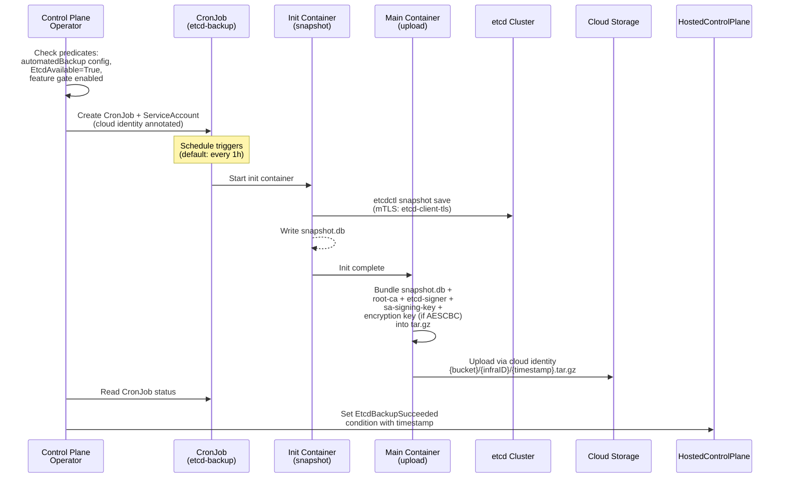

# Automated Etcd Backup and Restore for HyperShift Hosted Control Planes

## Summary

This enhancement adds automated etcd backup to cloud storage and automatic restore on cluster creation for HyperShift hosted control planes.
A CronJob periodically snapshots etcd and bundles the snapshot with critical PKI (Public Key Infrastructure) secrets and the etcd encryption key into a `.tar.gz` archive uploaded to cloud storage.
When a new cluster is created with the same `infraID` and a backup exists, the snapshot and secrets are automatically restored.
GCS with GKE Workload Identity is the first supported backend, with S3 and Azure Blob planned as [Future Work](#future-work).
The standalone OCP automated etcd backup enhancement (`/enhancements/etcd/automated-backups.md`) explicitly lists HyperShift as a non-goal; this enhancement fills that gap.

## Motivation

HyperShift hosted control planes run etcd as a StatefulSet in the management cluster's HCP namespace. Unlike standalone OCP clusters where the cluster-etcd-operator manages backups, HyperShift has no built-in mechanism for periodic etcd backup or automated restore. Managed service operators must rely on manual processes or external tools, which are error-prone and do not scale.

### User Stories

1. As a managed service operator, I want etcd to be automatically backed up on a schedule so that I have a recent recovery point without manual intervention.
2. As a managed service operator, I want a new cluster with the same infrastructure ID to automatically restore from the most recent backup so that disaster recovery is seamless.
3. As a managed service operator, I want PKI secrets and the etcd encryption key backed up alongside the etcd snapshot so that the restored cluster can function without regenerating cryptographic anchors.
4. As a managed service operator, I want to use cloud-native identity (Workload Identity) for storage access so that no static credentials are stored in the cluster.
5. As an SRE, I want to monitor backup health via conditions (`EtcdBackupSucceeded`) so that I can detect silent backup failures through timestamp staleness.
6. As an SRE, I want automatic recovery from transient restore failures so that initial cluster creation is resilient to temporary IAM propagation delays.

### Goals

- Scheduled etcd snapshot backup to cloud storage with configurable cron schedule
- Automatic PKI secret and encryption key bundling alongside etcd snapshots (root-ca, etcd-signer, sa-signing-key, and the AESCBC encryption key when secret encryption is configured)
- Automatic restore on cluster creation when a backup exists for the cluster's `infraID`
- Cloud-native identity for credential-free storage access (GKE Workload Identity for GCS)
- Observable backup and restore status via HostedCluster and HostedControlPlane conditions
- Extensible storage backend API using the Kubernetes union pattern
- S3 and Azure Blob backends planned as [Future Work](#future-work)


### Non-Goals

- Standalone OCP cluster backup (covered by `/enhancements/etcd/automated-backups.md`)
- Automated backup retention or pruning (delegated to cloud lifecycle policies)
- Point-in-time recovery or incremental backups
- Backup of guest cluster workload state (only etcd data and control plane secrets)
- Manual or ad-hoc one-shot backup triggering (the existing `HCPEtcdBackup` CRD under the `HCPEtcdBackup` feature gate covers one-shot CRD-based backups)
- In-place restore of a running cluster (requires delete and recreate)
- Non-GKE management clusters backing up to GCS (GKE Workload Identity requires a GKE management cluster; static credential support is deferred to future work)

## Proposal

The implementation adds new controllers and subcommands within the HyperShift repository.
The Control Plane Operator (CPO) manages both backup and restore via a new CronJob-based backup controller.
This is distinct from the existing `HCPEtcdBackupReconciler` in the HyperShift Operator (HO), which handles one-shot CRD-based backups
(designed for OADP (OpenShift API for Data Protection) integration) via the `HCPEtcdBackup` CRD.
The new controller lives in the CPO because it operates on resources in the HCP namespace (etcd pods, PKI secrets, ServiceAccounts) and follows the same lifecycle as the hosted control plane.
No changes to standalone OCP operators are required.

Three components are introduced:

1. **API extension**: An `automatedBackup` field on `ManagedEtcdSpec` with a union-based storage configuration, gated behind the `HCPAutomatedEtcdBackup` feature gate
2. **Backup CronJob**: A new CPO controller that creates a CronJob to snapshot etcd and upload archives
3. **Restore controller**: New CPO reconciliation logic that creates a one-time Job to fetch and restore the latest backup

The following net-new code is required (none of these exist today):

- `gcs_uploader.go` in `etcd-upload` (only S3 and AzureBlob uploaders exist today)
- `gcs-snapshot-fetch` subcommand in the CPO binary for downloading archives from GCS
- `restore-secrets` subcommand in the CPO binary for restoring PKI secrets from archive JSON
- tar.gz bundling logic for packaging etcd snapshots with PKI secrets
  (the existing `etcd-backup` subcommand is a legacy monolithic snapshot+upload command that only takes an etcd snapshot and uploads to S3; it does not bundle secrets.
  The `HCPEtcdBackupReconciler` uses the separate `etcd-upload` subcommand for uploads.)

The CPO binary already includes a `fetch-etcd-certs` subcommand (`etcd-backup/fetchcerts.go`) for cross-namespace certificate fetching.
Since the automated backup runs in the HCP namespace where certificates are directly accessible, this subcommand is not reused.
The new subcommands (`gcs-snapshot-fetch`, `restore-secrets`) are registered in `control-plane-operator/main.go` via both the `commandFor()` multi-call dispatch
and `defaultCommand()` cobra subcommand pattern, following the existing registration pattern for `etcd-upload` and `fetch-etcd-certs`.

### Workflow Description

#### Backup

When `automatedBackup` is configured and the etcd cluster is available, the CPO creates a CronJob that periodically snapshots etcd and uploads the archive to cloud storage.



1. The cluster creator sets `spec.etcd.managed.automatedBackup` on the HostedCluster.
2. The hypershift-operator propagates the field to the HostedControlPlane's `ManagedEtcdSpec` (see [HostedCluster to HostedControlPlane Propagation](#hostedcluster-to-hostedcontrolplane-propagation)).
3. The CPO checks that the `HCPAutomatedEtcdBackup` feature gate is enabled, the configuration is present, `EtcdAvailable=True`, and `EtcdSnapshotRestored=True`. The CronJob is not created (or is suspended) until `EtcdSnapshotRestored=True`. This prevents snapshotting an incomplete/in-progress etcd during restore.
4. The CPO creates a CronJob and a ServiceAccount annotated for cloud identity access.
5. On each scheduled run, an init container snapshots etcd via mTLS.
6. The main container bundles the snapshot with PKI secrets and the AESCBC encryption key (when `spec.secretEncryption.type == aescbc`) into a `.tar.gz` archive and uploads it.
7. The CPO reads the CronJob status and sets the `EtcdBackupSucceeded` condition.

The CPO creates a ServiceAccount, Role, and RoleBinding for the backup CronJob. The Role grants `get` on the specific PKI secret names (`root-ca`, `etcd-signer`, `sa-signing-key`, and the AESCBC active key name when applicable) in the HCP namespace. The Role and RoleBinding have owner references to the HostedControlPlane for garbage collection.

#### Restore

When a new cluster is created with `automatedBackup` configured and a backup exists for the cluster's `infraID`, the CPO automatically restores the etcd snapshot and PKI secrets.


1. The CPO detects that the `HCPAutomatedEtcdBackup` feature gate is enabled, `automatedBackup` is configured, and `EtcdSnapshotRestored` is not True.
   The restore controller is only active when `automatedBackup` is configured — clusters without it skip restore entirely and the `EtcdSnapshotRestored` condition is not evaluated.
2. **Critical ordering invariant**: The CPO defers PKI secret generation (`root-ca`, `etcd-signer`, `sa-signing-key`) until `EtcdSnapshotRestored` is resolved.
   If the CPO generates fresh secrets after the restore Job writes backup secrets, the restored etcd data becomes permanently unusable
   (data signed/encrypted with the old keys, cluster running with new keys).
   The etcd StatefulSet reconciler also checks `EtcdSnapshotRestored` and skips scale-up and normal PKI secret generation until it is True.
3. It creates a ServiceAccount, Role, RoleBinding, and a 20Gi PVC.
   The Role grants `get`, `list`, `create`, and `update` on `secrets` in the HCP namespace,
   scoped to the specific secret names (`root-ca`, `etcd-signer`, `sa-signing-key`, and the AESCBC active key name when applicable) via `resourceNames`.
   The AESCBC key name is resolved from the HostedControlPlane's `spec.secretEncryption.aescbc.activeKey.name` at Role creation time.
4. A Job fetches the latest archive from storage, extracts it, and runs a pre-flight validation step (see [Archive Integrity Verification](#archive-integrity-verification)).
5. If no backup exists, the cluster starts fresh (`NoSnapshotFound`).
6. If validation passes, the restore-secrets container uses server-side apply for each secret.
   If any secret write fails, the container exits non-zero and the retry logic handles it.
   Partial writes are safe on retry because each secret is independently idempotent (overwritten with the correct backup value).
   The CPO then injects an `etcd-restore` init container into the etcd StatefulSet.
7. The init container runs `etcdutl snapshot restore` with `--bump-revision` and `--mark-compacted` (these are new flags not present in the existing `etcd-init.sh` restore script, required for the disaster recovery use case to prevent revision conflicts).
8. The CPO sets `EtcdSnapshotRestored=True`, removes the `etcd-restore` init container from the StatefulSet spec, scales the StatefulSet back to 3 replicas, and cleans up the Job, PVC, Role, and RoleBinding.

**Adding `automatedBackup` to a running cluster**: If `automatedBackup` is added to a HostedCluster that already has `EtcdSnapshotRestored=True` (from a previous restore or normal startup), the CPO does **not** trigger a restore. Backups begin on the next CronJob trigger. In-place restore of a running cluster is not supported (see Non-Goals).

**Existing cluster adoption**: When `automatedBackup` is first configured on a cluster that already has a running etcd
(`EtcdAvailable=True` and etcd StatefulSet already has data), the CPO sets `EtcdSnapshotRestored=True` with reason `ExistingCluster` without attempting restore.
This prevents the control plane from being temporarily blocked by the absent `EtcdSnapshotRestored` condition during feature adoption on existing clusters.

#### Error Handling

**Restore Job failure with circuit breaker**: When the restore Job fails (all retry attempts exhausted with `backoffLimit: 3`),
the CPO sets `EtcdSnapshotRestored=False` with reason `RestoreJobFailed` and increments the `restoreRetryCount` field in the HostedControlPlane status.
On the next reconcile, the CPO automatically deletes the failed Job, removes the `EtcdSnapshotRestored` condition, and creates a fresh Job.
This handles transient failures such as IAM propagation delays during initial cluster creation.

After **10 failed Job attempts**, the CPO sets `EtcdSnapshotRestored=False` with reason `RestorePermanentlyFailed` and stops creating new Jobs.
This prevents unbounded API churn from permanent failures (wrong bucket, deleted service account, corrupt archive).
To retry after manual remediation, an operator can reset the counter by setting the `restoreRetryCount` status field to 0 on the HostedControlPlane.

**Restore PVC stuck**: If the restore PVC remains in `Pending` state (e.g., due to storage quota exhaustion or zone constraints), the restore Job cannot start. After a 10-minute timeout, the CPO deletes the Pending PVC and counts it as a retry attempt, triggering the circuit breaker logic above. The `EtcdSnapshotRestored=False` condition message includes the PVC status to aid debugging.

**Backup failure**: Backup failures do not block the control plane. The CronJob runs again at the next interval. The `EtcdBackupSucceeded` condition retains the timestamp of the last success.

**Single-replica failure during restore**: During restore, the StatefulSet is set to `replicas=1`.
If the single etcd pod crashes during or after restore, the StatefulSet controller restarts it.
The `etcd-restore` init container is idempotent — it re-runs on pod restart without data corruption.
After a successful restore, the CPO scales the StatefulSet back to 3 and additional members join via Raft replication.

### API Extensions

#### New Field on `ManagedEtcdSpec`

The `automatedBackup` field is added to `ManagedEtcdSpec` in both the `HostedCluster` and `HostedControlPlane` CRDs:

```go
type ManagedEtcdSpec struct {
    // ...existing fields (Storage, Backup)...

    // automatedBackup configures scheduled etcd backups to cloud storage.
    // When set, the Control Plane Operator creates a CronJob that periodically
    // snapshots etcd and uploads the snapshot along with PKI secrets to the
    // configured storage backend. When a new cluster is created with the same
    // infraID and a backup exists, the snapshot and secrets are automatically
    // restored. When omitted, no automated etcd backups or restores are
    // performed.
    // +optional
    // +openshift:enable:FeatureGate=HCPAutomatedEtcdBackup
    AutomatedBackup AutomatedEtcdBackupConfig `json:"automatedBackup,omitzero"`
}
```

This field is distinct from the existing `Backup HCPEtcdBackupConfig` field on `ManagedEtcdSpec` (value type with `json:"backup,omitzero"`), which is gated behind the `HCPEtcdBackup` feature gate and configures one-shot CRD-based backups (designed for OADP integration) via the `HCPEtcdBackup` CRD. See [Relationship with HCPEtcdBackup](#relationship-with-hcpetcdbackup) for details.

#### New Types

```go
// AutomatedEtcdBackupConfig configures scheduled etcd backups to cloud storage.
// The zero value means automated backup is disabled. The required storage.type
// field prevents an empty struct from being valid.
type AutomatedEtcdBackupConfig struct {
    // schedule is a cron expression defining the backup frequency using the
    // standard 5-field format (minute hour day-of-month month day-of-week).
    // The schedule is interpreted in UTC. When empty, the CPO applies a default
    // schedule (currently every hour). The default is applied by the
    // controller at reconcile time, not the CRD schema, so it may change
    // across releases. The value must be between 1 and 64 characters long.
    // +optional
    // +kubebuilder:validation:MaxLength=64
    // +kubebuilder:validation:XValidation:rule="self.matches('^[^ ]+ [^ ]+ [^ ]+ [^ ]+ [^ ]+$')",message="schedule must be a 5-field cron expression (minute hour day-of-month month day-of-week)"
    Schedule string `json:"schedule,omitempty"`

    // storage configures the cloud storage backend for backup archives.
    // +required
    Storage AutomatedEtcdBackupStorage `json:"storage"`
}

// AutomatedEtcdBackupStorage configures the storage backend for automated etcd
// backups. Exactly one storage type must be specified. The storage type is
// immutable after the first backup has been written; changing it would leave
// orphaned backups in the original backend and cause restore to look in the
// wrong location.
//
// +union
// +kubebuilder:validation:XValidation:rule="self.type == 'GCS' ? has(self.gcs) : !has(self.gcs)",message="gcs configuration is required when type is GCS, and forbidden otherwise"
// +kubebuilder:validation:XValidation:rule="oldSelf.type == self.type",message="storage type is immutable once set"
type AutomatedEtcdBackupStorage struct {
    // type is the storage backend type. It must be set to one of the
    // following values: GCS — configures Google Cloud Storage as the backup
    // destination.
    // +unionDiscriminator
    // +required
    Type AutomatedEtcdBackupStorageType `json:"type"`

    // gcs configures Google Cloud Storage as the backup destination.
    // +optional
    GCS AutomatedEtcdBackupGCS `json:"gcs,omitzero"`
}

// AutomatedEtcdBackupStorageType is a string identifying a storage backend.
// +kubebuilder:validation:Enum=GCS
type AutomatedEtcdBackupStorageType string

const (
    AutomatedEtcdBackupStorageTypeGCS AutomatedEtcdBackupStorageType = "GCS"
)

// AutomatedEtcdBackupGCS configures Google Cloud Storage as the backup
// destination. Requires a GKE management cluster with Workload Identity
// enabled.
type AutomatedEtcdBackupGCS struct {
    // bucket is the name of the GCS bucket for storing etcd backup archives.
    // The bucket must already exist and the GCP service account specified in
    // gcpServiceAccount must have read/write access to it. The value must be
    // between 3 and 63 characters long, matching GCS bucket naming rules.
    // The bucket name must comply with GCS naming rules (lowercase letters,
    // numbers, hyphens, underscores, and dots). Names that pass length
    // validation but violate GCS naming rules will cause a backup failure
    // at runtime.
    // +required
    // +kubebuilder:validation:MinLength=3
    // +kubebuilder:validation:MaxLength=63
    Bucket string `json:"bucket"`

    // gcpServiceAccount is the email address of a GCP service account that
    // has been granted IAM access to the backup bucket. The Kubernetes
    // ServiceAccount used by backup and restore pods is annotated with this
    // email for GKE Workload Identity federation. The value must be a valid
    // GCP service account email in the format
    // <name>@<project>.iam.gserviceaccount.com. GCP service account names
    // must be 6-30 characters, lowercase alphanumeric and hyphens, starting
    // with a letter. Validated with regex because GCP service account email
    // format has no simpler CEL expression.
    // +required
    // +kubebuilder:validation:XValidation:rule="self.matches('^[a-z][a-z0-9-]{4,28}[a-z0-9]@[a-z][a-z0-9.-]+\\\\.iam\\\\.gserviceaccount\\\\.com$')",message="gcpServiceAccount must be a valid GCP service account email (e.g., name@project.iam.gserviceaccount.com)"
    GCPServiceAccount string `json:"gcpServiceAccount"`
}
```

#### Configuration Example

```yaml
apiVersion: hypershift.openshift.io/v1beta1
kind: HostedCluster
metadata:
  name: my-cluster
  namespace: clusters
spec:
  # Optional: when secretEncryption is configured with AESCBC, the encryption
  # key is automatically included in every backup archive and restored alongside
  # the PKI secrets. No additional backup configuration is needed.
  secretEncryption:
    type: aescbc
    aescbc:
      activeKey:
        name: my-encryption-key
  etcd:
    managementType: Managed
    managed:
      # ...existing storage config...
      automatedBackup:
        schedule: "0 */1 * * *"
        storage:
          type: GCS
          gcs:
            bucket: "my-etcd-backups"
            gcpServiceAccount: "etcd-backup@my-project.iam.gserviceaccount.com"
```

#### New Conditions

Two conditions are added to track backup and restore status. Both conditions are set on the HostedControlPlane by the CPO. The `EtcdBackupSucceeded` condition is already in the HostedCluster bubble-up list; `EtcdSnapshotRestored` must be added to the bubble-up list in the hypershift-operator's HostedCluster controller (it is not bubbled up today).

**`EtcdBackupSucceeded`** (on HostedControlPlane, bubbled up to HostedCluster):

| Status | Reason | Blocks CP? | Description |
| ------ | ------ | :--------: | ----------- |
| `True` | `BackupSucceeded` | No | Last successful backup timestamp in message |
| `False` | `BackupInProgress` | No | CronJob scheduled but no successful completion yet |
| `False` | `WaitingForFirstSchedule` | No | CronJob has not been scheduled yet |
| `False` | `CronJobSuspended` | No | CronJob is suspended |
| `False` | `WaitingForEtcd` | No | Waiting for `EtcdAvailable=True` |

**`EtcdSnapshotRestored`** (on HostedControlPlane, must be added to HostedCluster bubble-up list):

| Status | Reason | Blocks CP? | Description |
| ------ | ------ | :--------: | ----------- |
| `True` | `AsExpected` | No | Snapshot restored successfully |
| `True` | `NoSnapshotFound` | No | No backup exists; cluster starts fresh |
| `True` | `ExistingCluster` | No | `automatedBackup` added to a cluster with existing etcd data; restore skipped |
| `False` | `RestoreJobFailed` | **Yes** | Restore Job failed (retrying, up to 10 attempts) |
| `False` | `RestorePermanentlyFailed` | **Yes** | Restore failed after 10 attempts; manual intervention required |
| `False` | `ArchiveValidationFailed` | **Yes** | Archive integrity check failed |
| `False` | `ArchiveDigestMismatch` | **Yes** | SHA-256 digest of downloaded archive does not match upload-time digest |
| Not set | — | **Yes** (temporarily) | Restore in progress or not yet evaluated. Only evaluated when `automatedBackup` is configured; clusters without `automatedBackup` skip restore entirely |

#### Feature Gate

The `automatedBackup` field is gated behind the `HCPAutomatedEtcdBackup` feature gate in the `TechPreviewNoUpgrade` feature set. This follows the same pattern as the existing `Backup` field on `ManagedEtcdSpec`, which is gated behind `HCPEtcdBackup`. All HyperShift feature gates use `TechPreviewNoUpgrade` (see `hypershift-operator/featuregate/feature.go`).

The gate name `HCPAutomatedEtcdBackup` remains the same across feature sets (Tech Preview to GA). During graduation, the gate is moved from `TechPreviewNoUpgrade` to the default feature set. Existing clusters with the field configured continue to function; the field is no longer pruned from objects once the gate is in the default set.

The feature gate provides:
- **Graduated rollout**: The field is only available when the feature gate is explicitly enabled, preventing accidental use in production before the feature is stable.
- **Kill switch**: If a critical bug is found post-release, the feature can be disabled by removing the gate, which causes the gated field to be pruned from stored objects. The CPO predicate checks the gate before creating any backup or restore resources.
- **API safety**: The restore controller path blocks control plane startup (`EtcdSnapshotRestored` not set blocks the CP temporarily). Gating ensures this code path is only active when explicitly opted in.

### Topology Considerations

#### Hypershift / Hosted Control Planes

This is a HyperShift-only feature. All components (CronJob, restore Job, etcd StatefulSet init container) run in the management cluster's HCP namespace. No guest cluster components are affected. The backup and restore logic is entirely within the Control Plane Operator.

#### Standalone Clusters

Not applicable. Standalone OCP automated backups are covered by `/enhancements/etcd/automated-backups.md`.

#### Single-node Deployments or MicroShift

Not applicable. This feature operates within the HyperShift Control Plane Operator (CPO), which does not run on MicroShift or SNO deployments.

#### OpenShift Kubernetes Engine

Not applicable. This feature is HyperShift-specific and does not depend on features excluded from OKE.

### Implementation Details/Notes/Constraints

#### Consolidation with Existing Backup and Restore Work

HyperShift has several existing backup and restore mechanisms developed independently over time. This section describes their relationship with the proposed automated backup and the consolidation path.

**Existing mechanisms**:

| Mechanism | Location | Trigger | Scope | Status |
| --------- | -------- | ------- | ----- | ------ |
| `restoreSnapshotURL` ([hypershift#1239](https://github.com/openshift/hypershift/pull/1239)) | CPO (etcd StatefulSet init container) | Manual: operator sets URL on HostedCluster | Restore only (pre-signed S3 URL) | GA, active |
| `HCPEtcdBackup` CRD (SDE-3219, CNTRLPLANE-445) | HO (`HCPEtcdBackupReconciler`) | Manual: operator creates `HCPEtcdBackup` CR | One-shot backup to S3/Azure (OADP integration) | Tech Preview |
| `etcd-backup` subcommand ([hypershift#3034](https://github.com/openshift/hypershift/pull/3034)) | CPO binary | Called by `HCPEtcdBackupReconciler` | Legacy monolithic snapshot+S3 upload | Active (used by HCPEtcdBackup) |
| Proposed `automatedBackup` | CPO (new controller) | Scheduled: CronJob | Automated backup+restore with PKI secrets | This enhancement |

**Relationship with `restoreSnapshotURL`**: The `restoreSnapshotURL` field provides manual, URL-based restore from a pre-signed S3 URL. It does not restore PKI secrets (the operator must ensure the same CA and signing keys are available). The proposed automated restore is a superset: it restores both the etcd snapshot and PKI secrets from a managed archive. Both mechanisms use the `EtcdSnapshotRestored` condition. They are mutually exclusive at restore time — if both `restoreSnapshotURL` and `automatedBackup` are configured, the CPO should reject the configuration with a validation error. Long-term, `restoreSnapshotURL` may be deprecated in favor of `automatedBackup` once all storage backends are supported.

**Relationship with `HCPEtcdBackup` CRD**: The `HCPEtcdBackup` CRD (gated behind `HCPEtcdBackup`) configures one-shot CRD-based backups designed for OADP integration, orchestrated by the `HCPEtcdBackupReconciler` in the HyperShift Operator (HO). The reconciler runs in the HO namespace and requires cross-namespace cert fetching via the `fetch-etcd-certs` init container. The proposed automated backup runs in the HCP namespace, where it has direct access to etcd pods and PKI secrets, simplifying RBAC and eliminating the need for cross-namespace access patterns.

Both features can be active simultaneously. They use different orchestration controllers (HO vs CPO), different trigger mechanisms (CRD creation vs CronJob schedule), and different storage formats (OADP BackupStorageLocation vs direct cloud storage upload). Both perform `etcdctl snapshot save` against the same etcd cluster, but etcd snapshots are read-only linearizable reads that do not block or interfere with each other. If both happen to run at the exact same moment, the etcd server handles concurrent snapshot requests safely.

**Relationship with `etcd-backup` subcommand**: The `etcd-backup` subcommand (hypershift#3034) is a legacy monolithic command that takes an etcd snapshot and uploads it to S3. It does not bundle PKI secrets. The proposed automated backup uses a different architecture (init container for snapshot, main container for bundling and upload) and adds GCS support. The `etcd-backup` subcommand continues to serve `HCPEtcdBackup` CRD workflows.

**Consolidation path**: `automatedBackup` is designed as a lightweight, self-contained scheduled backup that does not depend on OADP. Once S3 and Azure backends are added (see [Future Work](#future-work)), it will cover all platforms currently served by `HCPEtcdBackup`. At that point, the community should evaluate whether `HCPEtcdBackup` should be deprecated in favor of `automatedBackup`, or whether OADP integration remains a distinct use case. Similarly, `restoreSnapshotURL` can be deprecated once automated restore supports all platforms. The consolidation timeline depends on backend availability and user feedback during Tech Preview.

#### HostedCluster to HostedControlPlane Propagation

The `automatedBackup` field must be added to `ManagedEtcdSpec` in both the HostedCluster and HostedControlPlane API types.
The hypershift-operator propagates the `automatedBackup` field automatically via `ManagedEtcdSpec.DeepCopy()` during
HostedCluster-to-HostedControlPlane reconciliation (see `hostedcluster_controller.go:2487`) — no HO code change is needed for field propagation.
However, the `EtcdSnapshotRestored` condition must be added to the HO's HostedCluster bubble-up list, which does require an HO change.

The CPO reads `automatedBackup` from the HostedControlPlane spec (not directly from HostedCluster). Conditions are set on the HostedControlPlane status. `EtcdBackupSucceeded` is already in the hypershift-operator's bubble-up list for HostedCluster status; `EtcdSnapshotRestored` must be added.

#### Why PKI Secrets and the Encryption Key Must Be Backed Up

The etcd snapshot alone is insufficient for recovery. These secrets are cryptographic anchors created once and never regenerated. If replaced with fresh keys, the restored data becomes unusable.

| Secret | Purpose | Impact if Lost or Regenerated |
| ------ | ------- | ----------------------------- |
| `root-ca` | Self-signed root CA for the hosted control plane. Signs all CP certificates and is embedded in every guest cluster kubeconfig. | All certificates invalid, kubeconfigs cannot authenticate, nodes cannot join |
| `etcd-signer` | Independent CA that signs all etcd TLS certificates (server, peer, client, metrics). | KAS (Kubernetes API Server) cannot connect to etcd (TLS handshake failure), peer communication breaks |
| `sa-signing-key` | RSA keypair used by KAS to sign and verify ServiceAccount JWT tokens. | Every existing SA token becomes unverifiable, breaking all in-cluster workloads |
| `<activeKey>` (AESCBC — AES in Cipher Block Chaining mode) | Symmetric AES-256 key used by KAS to encrypt Secrets at rest in etcd. Referenced by `spec.secretEncryption.aescbc.activeKey`. Present only when `spec.secretEncryption.type == aescbc`. | All encrypted etcd resources (Secrets, ConfigMaps marked for encryption) are permanently unreadable |

The first three secrets are always included in the backup archive. The AESCBC encryption key is included conditionally based on the HostedCluster's `spec.secretEncryption` configuration:

- **AESCBC encryption** (`spec.secretEncryption.type == aescbc`): The encryption key secret (referenced by `spec.secretEncryption.aescbc.activeKey`)
  is a symmetric 256-bit AES key. The hypershift-operator copies it from the HostedCluster namespace to the HCP namespace,
  where the CPO uses it to generate the KAS `EncryptionConfiguration`.
  The CronJob includes this key as an additional Volume and VolumeMount, and the bundler and restorer handle it generically alongside the PKI secrets.
  The key must be restored before KAS starts, or the restored etcd data is permanently unreadable.
- **KMS encryption** (`spec.secretEncryption.type == kms`): The encryption key lives in the cloud KMS service (GCP Cloud KMS, AWS KMS, Azure Key Vault, IBM Key Protect).
  No Kubernetes secret needs backing up, but the cloud KMS key must remain accessible and the KMS configuration on the new HostedCluster must reference the same key.
  The restore scope is limited to etcd data and PKI secrets; KMS key availability is a cluster configuration prerequisite, not a restore responsibility.
  If the KMS key is inaccessible or the new HostedCluster references a different key, KAS will fail to start after an otherwise successful restore
  (`EtcdSnapshotRestored=True` but KAS cannot decrypt etcd Secrets). Existing KAS health conditions (e.g., `KubeAPIServerAvailable=False`) surface this failure.
  This prerequisite must be documented in user-facing disaster recovery guides.
- **No encryption**: No additional secrets beyond the three PKI secrets are needed.

#### Why Single-Replica Restore

The restore PVC is `ReadWriteOnce`. On GKE Autopilot and similar environments with topology-aware volume provisioning, scheduling a 3-replica StatefulSet where all pods need the same PVC creates a zonal deadlock. Setting `replicas=1` during restore avoids this. After restore, the StatefulSet scales back to 3 and additional members join via Raft replication.

#### Why Workload Identity Over Static Credentials

GKE Workload Identity maps a Kubernetes ServiceAccount to a GCP service account via IAM binding, providing credential-free access to GCS. This eliminates long-lived service account keys stored as Kubernetes secrets, which would require rotation and pose a security risk. The ServiceAccount is annotated with `iam.gke.io/gcp-service-account`.

Note: The `iam.gke.io/gcp-service-account` annotation-based Workload Identity is a new pattern in the HyperShift codebase.
Existing GCP identity support uses Workload Identity Federation (WIF) with OIDC tokens (`ProjectNumber`/`PoolID`/`ProviderID`).
GKE node-level Workload Identity is chosen here because backup and restore pods run on the management cluster (a GKE cluster)
and need direct GCS access, which is simpler with node-level Workload Identity than project-level OIDC federation.

#### Backup Archive Encryption at Rest

Backup archives contain sensitive cryptographic material (root CA, signing keys, and optionally the AESCBC encryption key).
GCS encrypts all objects at rest by default using Google-managed encryption keys (SSE).
For stricter compliance requirements, operators should configure Customer-Managed Encryption Keys (CMEK) on the backup bucket
to maintain full control over the encryption key lifecycle.
No application-level encryption is applied to the archive itself; encryption is delegated to the storage backend.

For defense-in-depth, operators should configure the IAM binding for the GCP service account with the minimum permissions required (e.g., `storage.objects.create` and `storage.objects.list` for backup, `storage.objects.get` and `storage.objects.list` for restore). The single `gcpServiceAccount` field is used for both operations; IAM-level permission separation is the recommended approach.

#### Why Union API for Storage

The `AutomatedEtcdBackupStorage` type uses the Kubernetes union pattern with a discriminator field (`type`) and `XValidation` rules
to ensure exactly one backend is configured.
Adding a new backend (e.g., S3) requires adding a new enum value, a new config struct, and a new optional field with no breaking changes.
The existing `etcd-upload` CLI supports `S3` and `AzureBlob` via the `--storage-type` flag; GCS support must be added as a new uploader implementation.

#### Archive Integrity Verification

The restore Job includes a pre-flight validation init container that runs after downloading and extracting the archive but before applying any changes:

1. **Completeness check**: Verifies the archive contains `snapshot.db` and the expected `secrets/*.json` files.
2. **Snapshot validation**: Runs `etcdutl snapshot status` on `snapshot.db` to verify the snapshot is not corrupt.
3. **Secret validation**: Validates that each JSON secret file is well-formed and contains the expected Kubernetes Secret structure.
4. **Digest verification**: The upload container computes a SHA-256 digest of the archive and stores it as a GCS object metadata header
   (`x-goog-meta-sha256`). The validation init container recomputes the digest of the downloaded archive and compares it against the metadata header.
   A mismatch fails validation with `ArchiveDigestMismatch`.

If validation fails, the Job exits with a non-zero status and the CPO sets `EtcdSnapshotRestored=False` with reason `ArchiveValidationFailed`. The failed archive must be removed from the bucket before retrying.

#### Why Auto-Recovery from Failed Restore Jobs

During initial cluster creation, the GCP IAM binding for Workload Identity may not have propagated yet,
causing the first restore Job attempt to fail with a permissions error.
The controller detects a failed Job, deletes it, removes the `EtcdSnapshotRestored` condition, and on the next reconcile creates a fresh Job.
This provides transparent recovery from transient failures without manual intervention.
A circuit breaker (10 attempts max) prevents this from becoming an unbounded retry loop for permanent failures.

#### Idempotency and CPO Restarts

The restore flow is fully idempotent and safe across CPO restarts and upgrades.
All restore state is persisted on the HostedControlPlane CR via the `EtcdSnapshotRestored` condition
and the `restoreRetryCount` status field, not in operator memory.
Once `EtcdSnapshotRestored=True` is set, no restore Job is created regardless of how many times the CPO restarts or reconciles.
If the CPO restarts while a restore Job is still running, the reconciler observes the existing Job and waits for it to complete — it does not create a duplicate.
If the CPO restarts after a restore Job failure but before cleanup, the reconciler detects the failed Job and follows the standard auto-recovery path:
it deletes the failed Job, increments the retry counter, removes the `EtcdSnapshotRestored` condition, and creates a fresh Job on the next reconcile.

#### Restoring a Pre-Upgrade Backup

If the cluster was upgraded between the last backup and a disaster, the restored etcd state will reflect the pre-upgrade version
while the control plane runs the post-upgrade version.
In this scenario, the CVO and cluster operators re-reconcile guest cluster state to match the running version.
After an upgrade, operators should verify that a post-upgrade backup exists by comparing the `EtcdBackupSucceeded` condition timestamp
against the upgrade completion time.
For critical upgrades, operators can trigger an immediate backup by creating a one-off Job from the CronJob spec.

#### Archive Format

Each backup produces a single `.tar.gz` containing:

- `snapshot.db` — the etcd snapshot
- `secrets/root-ca.json` — root CA certificate and key
- `secrets/etcd-signer.json` — etcd signer certificate and key
- `secrets/sa-signing-key.json` — service account signing keypair
- `secrets/<activeKey-name>.json` — AESCBC encryption key (present only when `spec.secretEncryption.type == aescbc`)

Backups accumulate under `{bucket}/{infraID}/{unix-timestamp}.tar.gz`. Lexicographic sort of object names selects the latest (Unix timestamps ensure correct ordering). Backups are not automatically pruned; users must configure a lifecycle policy on their storage backend.

The upload is crash-safe: the archive is uploaded to a temporary object name, then copied to the final path and the temporary object is deleted.
GCS object creation is atomic (an object is either fully written or not visible), so the copy produces a complete object at the final path.
If the process crashes between copy and delete, the temporary object is orphaned but the final object is intact — this is benign.
This prevents a partially-written archive from being selected as the "latest" by a concurrent restore.

#### CronJob Settings

| Setting | Value | Effect |
| ------- | ----- | ------ |
| `concurrencyPolicy` | `Forbid` | Prevents overlapping backup runs |
| `restartPolicy` | `Never` | Failed pods are not retried within a single Job |
| `successfulJobsHistoryLimit` | 3 | Retains the last 3 successful Job objects |
| `failedJobsHistoryLimit` | 5 | Retains the last 5 failed Job objects for debugging |
| `activeDeadlineSeconds` | 1800 | Terminates backup Jobs that run longer than 30 minutes |
| `priorityClassName` | `openshift-user-critical` (backup CronJob), `system-cluster-critical` (restore Job) | Prevents preemption on resource-constrained management clusters |
| `ownerReferences` | `[{HostedControlPlane}]` | Garbage collection on HCP deletion |
| `etcdctl --command-timeout` | `300s` | Prevents snapshot hangs from blocking the full 30-minute Job deadline |

The CronJob is labeled with `hypershift.openshift.io/managed-by: control-plane-operator` for discovery and cleanup. The GCS upload client is also configured with a timeout to prevent indefinite hangs on network issues.

Container resource requests and limits will be sized based on load testing with large etcd databases. Initial values will be set before Tech Preview, per CONVENTIONS.md requirements that all cluster components declare resource requests.

#### `etcdutl` Flags

- `--bump-revision 1000000000` prevents revision conflicts with the original cluster's revision space
- `--mark-compacted` prevents re-compaction errors on already-compacted data
- Requires etcd 3.6+ (`etcdutl`), available in OCP 4.21+. The minimum supported OCP version for this feature is 4.21.
- These flags are new additions not present in the existing `etcd-init.sh` restore script,
  which uses `etcdutl snapshot restore` without them.
  The disaster recovery use case requires them to avoid revision and compaction conflicts.
- **Implementation note**: These flags must be verified against the exact `etcdutl` binary shipped in the OCP 4.21 etcd image.
  Historically, `--bump-revision` and `--mark-compacted` were available in `etcdctl snapshot restore` but may not yet exist in `etcdutl`.
  If they are `etcdctl`-only, the restore must use `etcdctl snapshot restore` instead of `etcdutl snapshot restore`.
  This verification is a Tech Preview graduation requirement.

#### Multi-Tenancy and Scale Considerations

On management clusters hosting many hosted control planes, each cluster with `automatedBackup` configured creates its own CronJob.
Thundering herd effects are avoided by configuring different cron schedules per hosted control plane
and by adding a random sleep (up to 5 minutes) at the start of each backup Job before taking the etcd snapshot.
Operators running hundreds of hosted clusters should size the management cluster's API server and etcd accordingly.

In multi-tenant environments where multiple hosted clusters share the same GCP project and backup bucket, operators must ensure `infraID` uniqueness across clusters. A misconfigured `infraID` on a new cluster could restore from the wrong cluster's backup. For environments requiring stronger isolation, operators should use separate buckets per cluster or per tenant.

#### Interaction with Etcd Sharding

The [etcd sharding by resource kind](https://github.com/openshift/enhancements/pull/1979) proposal introduces multiple etcd instances per hosted control plane, each storing a subset of API resources. If sharding is enabled alongside automated backup, the backup CronJob must snapshot all etcd shards to produce a consistent recovery point. Key considerations:

- **Backup**: The CronJob must iterate over all shard endpoints and include a snapshot from each shard in the archive. The archive format would extend from a single `snapshot.db` to `snapshot-<shard>.db` per shard. The init container must take all snapshots within a short window to minimize cross-shard drift.
- **Restore**: All shard snapshots must be restored together. The restore Job must provision an init container per shard and coordinate single-replica startup across all StatefulSets.
- **Ordering**: Sharding is not yet implemented. This enhancement targets the current single-etcd architecture. Sharding support for automated backup will be addressed when the sharding enhancement progresses, either as an update to this enhancement or a follow-up.

#### PVC Sizing

The restore PVC is sized at 20Gi and uses the same StorageClass as the etcd StatefulSet's PVCs to ensure zone-compatible volume provisioning.
The PVC must hold both the downloaded `.tar.gz` archive and the extracted contents (snapshot.db + secret JSON files),
so roughly 2x the compressed archive size. A typical etcd snapshot is approximately 200MB compressed,
but etcd's default storage limit is 8Gi — a near-full database could produce a 2-4Gi compressed archive
requiring 8-12Gi total for download and extraction. 20Gi provides comfortable headroom for worst-case scenarios.
The PVC is temporary and cleaned up after restore completes.
This sizing will be validated during load testing with large etcd databases (multiple GB) as part of GA graduation.
If testing reveals that 20Gi is insufficient for large clusters, new size will be set.

### Risks and Mitigations

| Risk | Mitigation |
| ---- | ---------- |
| Cloud storage unavailable during backup | CronJob retries at next scheduled interval; `EtcdBackupSucceeded` timestamp staleness detectable via monitoring and `EtcdBackupStale` alert |
| AESCBC encryption key missing from backup | The CronJob automatically includes the key when `spec.secretEncryption.type == aescbc` (additional Volume/VolumeMount on the CronJob); omitted when encryption is not configured or uses KMS. Without this key, all encrypted etcd resources are permanently unreadable after restore |
| Workload Identity not ready at cluster creation | Auto-recovery: controller deletes failed Job and retries (`backoffLimit: 3` per Job, up to 10 Job attempts across reconciles before circuit breaker triggers `RestorePermanentlyFailed`) |
| Backup archive corruption | Pre-flight validation: `etcdutl snapshot status` and JSON schema validation before applying. Cloud storage transport-level integrity (GCS CRC32C). If the latest archive fails validation, the operator can remove it from the bucket and the restore Job will pick the next-latest on retry |
| Storage credentials misconfigured | Restore Job fails with clear error in pod logs; `EtcdSnapshotRestored=False` with reason `RestoreJobFailed`; circuit breaker prevents infinite retry |
| Backup accumulation without pruning | Documented: users must configure cloud lifecycle policies; retention API deferred to a future enhancement |
| PVC scheduling deadlock on multi-zone clusters | Single-replica restore avoids the issue |
| Backup archive contains sensitive cryptographic material | GCS default SSE encrypts all objects at rest; CMEK recommended for stricter compliance; IAM-level minimum permissions recommended |
| Restore of pre-upgrade backup creates version skew between etcd state and control plane | CVO and cluster operators re-reconcile guest cluster state to match the running version; operators should verify post-upgrade backups exist |
| Compromised or tampered backup bucket | Archive SHA-256 digest verification (upload-time digest stored as GCS object metadata, verified before restoring). Archive integrity verification before restoring secrets. IAM-level permission separation recommended |
| Backup upload interrupted mid-write (partial archive) | Crash-safe upload via temporary object + copy; partial archives never appear under the final path |
| Restore PVC stuck in Pending indefinitely | 10-minute PVC timeout with automatic cleanup and retry counting |

### Drawbacks

- GCS-only at initial launch, limiting immediate utility to GKE-based management clusters. 
- No built-in retention policy means cloud storage costs grow without external lifecycle configuration.
- The restore is one-shot at cluster creation time only. Restoring a running cluster requires delete and recreate with the same `infraID`.

## Alternatives (Not Implemented)

### OADP/Velero-Based Scheduled Backups

The existing `HCPEtcdBackup` CRD integrates with OADP for one-shot backups.
A scheduled OADP approach was considered but rejected because OADP adds a heavy dependency
(Velero, BackupStorageLocation configuration), requires the `TechPreviewNoUpgrade` feature gate,
and is designed for full cluster disaster recovery rather than lightweight etcd-only backup.
The automated backup is deliberately minimal and self-contained.

### Static Credentials Instead of Workload Identity

Storing GCP service account keys as Kubernetes secrets would work on any cluster, not just GKE. Rejected because it introduces credential rotation burden, security risk from long-lived keys, and is contrary to GCP security best practices.

### Backup to PersistentVolume

Following the standalone OCP pattern of backing up to local PVs. Rejected because in the HyperShift model, control plane pods run on management cluster nodes that may be ephemeral, and PV durability varies by provider. Cloud object storage is the natural durable target for a cloud-hosted control plane.

### In-Place Restore (Without Delete/Recreate)

Supporting restore of a running cluster by scaling etcd to 0, restoring, and scaling back. Rejected due to complexity: active connections must be drained, KAS must be stopped, and the risk of data inconsistency is high. Delete and recreate with the same `infraID` is simpler and more reliable.

## Future Work

- **S3 storage backend**: Involves IRSA (IAM Roles for Service Accounts) authentication, a new `s3-snapshot-fetch` subcommand, and AWS-specific E2E infrastructure. Tracking: TBD (separate enhancement).
- **Azure Blob storage backend**: Involves Azure Workload Identity Federation, a new `azure-snapshot-fetch` subcommand, and Azure-specific E2E infrastructure. Tracking: TBD (separate enhancement).
- **Restore drill**: A periodic Job that downloads and validates the latest archive without applying it, to verify backup usability before a real disaster.

## Future Considerations

- **Consolidation with existing backup/restore mechanisms**: See [Consolidation with Existing Backup and Restore Work](#consolidation-with-existing-backup-and-restore-work) for the relationship between `automatedBackup`, `HCPEtcdBackup`, `restoreSnapshotURL`, and the `etcd-backup` subcommand. Once S3 and Azure backends are available, evaluate deprecation of overlapping mechanisms.

## Test Plan

All E2E tests carry the `[OCPFeatureGate:HCPAutomatedEtcdBackup]` label to ensure they only run when the feature gate is enabled. Tests also carry `[Jira:"HyperShift"]` for component tracking.

### CI Lane Design

E2E tests run on a periodic Prow job against a GKE management cluster. This is a HyperShift-on-GKE-only feature; non-GKE platforms are not applicable. The 14-runs-per-platform GA graduation requirement applies to GKE only.

### Unit Tests

- **Predicate logic**: Tests all predicate branches (zero-value managed, zero-value automatedBackup, wrong storage type, etcd not available, feature gate disabled, happy path)
- **CronJob adaptation**: Verifies schedule, containers, volumes, volume mounts, concurrency policy, ServiceAccount Workload Identity annotation, and `hypershift.openshift.io/managed-by` label
- **Backup condition reconciliation**: Tests all condition transitions (`BackupSucceeded`, `BackupInProgress`, `WaitingForFirstSchedule`, `CronJobSuspended`, `WaitingForEtcd`)
- **Upload bundling**: Verifies snapshot and secrets are correctly bundled into tar.gz
- **Restore secrets**: Verifies JSON secret files are correctly deserialized and created/updated in the target namespace
- **Archive validation**: Tests completeness check, snapshot status validation, and JSON schema validation
- **Circuit breaker**: Tests retry counter increment, `RestorePermanentlyFailed` condition after max retries, and counter reset via status patch
- **PVC timeout**: Tests PVC deletion after 10-minute timeout

### Integration Tests

- Restore Job lifecycle with mock storage (controller test with envtest)
- Condition propagation from HostedControlPlane to HostedCluster (including `EtcdSnapshotRestored` bubble-up)
- Circuit breaker lifecycle: Job failure → retry → permanent failure → annotation reset → retry

### E2E Tests

- Full backup-restore lifecycle on a GKE management cluster: configure `automatedBackup`, wait for `EtcdBackupSucceeded=True`, delete HostedCluster, recreate with same `infraID`, verify `EtcdSnapshotRestored=True`, verify etcd data intact `[OCPFeatureGate:HCPAutomatedEtcdBackup]`
- No-snapshot path: create cluster with `automatedBackup` pointing to an empty bucket, verify `EtcdSnapshotRestored=True` with `NoSnapshotFound` `[OCPFeatureGate:HCPAutomatedEtcdBackup]`
- Backup-restore with etcd encryption (AESCBC) enabled: verify encrypted data is readable after restore `[OCPFeatureGate:HCPAutomatedEtcdBackup]`
- Corrupt archive: place a truncated archive in the bucket, verify `ArchiveValidationFailed` condition, remove corrupt archive, verify retry succeeds with a valid archive `[OCPFeatureGate:HCPAutomatedEtcdBackup]`
- Upgrade: configure `automatedBackup`, verify CronJob exists, upgrade CPO, verify CronJob continues functioning, verify backup condition is maintained. Also exercise the restore path after CPO upgrade: take a backup at version N, upgrade CPO to N+1, delete and recreate cluster, verify restore succeeds `[OCPFeatureGate:HCPAutomatedEtcdBackup]`
- Downgrade: configure `automatedBackup`, take a backup, downgrade CPO to a version without the feature gate, verify CronJob is cleaned up via owner reference GC, verify no orphan resources, verify cloud storage backups survive `[OCPFeatureGate:HCPAutomatedEtcdBackup]`
- Concurrent operation with HCPEtcdBackup: enable both `HCPEtcdBackup` and `HCPAutomatedEtcdBackup`, trigger both a one-shot and scheduled backup, verify no interference `[OCPFeatureGate:HCPAutomatedEtcdBackup]`

## Graduation Criteria

### Dev Preview -> Tech Preview

- End-to-end backup and restore functional on GKE with GCS
- At least 3 E2E tests passing in CI with >90% pass rate
- Unit and integration test coverage for all controller paths
- User-facing documentation
- `EtcdBackupSucceeded` and `EtcdSnapshotRestored` conditions observable
- Etcd encryption key included in backup archive
- Container resource requests and limits sized from initial testing
- Archive SHA-256 digest verification implemented
- Archive integrity verification implemented
- Circuit breaker for restore retries implemented
- `EtcdSnapshotRestored` added to HostedCluster bubble-up list
- Verify `--bump-revision` and `--mark-compacted` availability in the shipped `etcdutl` binary; if unavailable, switch to `etcdctl`

### Tech Preview -> GA

- At least 5 E2E tests passing in CI, run at least 7 times per week, at least 14 times per supported platform, with at least 95% pass rate, in place no less than 14 days before branch cut
- Load testing with large etcd databases (multiple GB) — validates PVC sizing and `activeDeadlineSeconds`
- Feedback from managed service operators incorporated
- Retention policy documentation per cloud provider
- Upgrade and downgrade testing
- `EtcdBackupStale` and `EtcdRestoreFailed` alerts defined and firing

### Removing a deprecated feature

Not applicable.

## Upgrade / Downgrade Strategy

**Upgrade**: The `automatedBackup` field is optional and gated behind `HCPAutomatedEtcdBackup`. Existing clusters without it are unaffected. Clusters that configure it after upgrade start receiving backups at the next CronJob trigger. No migration is required.

**Downgrade**: The `automatedBackup` field is protected by the `HCPAutomatedEtcdBackup` feature gate.
On downgrade to a CPO version that does not include this feature gate, the field is pruned from stored HostedCluster
and HostedControlPlane objects by CRD structural schema pruning.
This effectively disables backups on all clusters — no orphan CronJobs are created because the CPO predicate checks both the feature gate and the field presence.
Existing CronJobs created by the previous CPO version have owner references to the HostedControlPlane
and will be garbage-collected when the HCP is next reconciled.
They are also labeled with `hypershift.openshift.io/managed-by: control-plane-operator` for manual discovery and cleanup if needed:
`oc delete cronjob -n <hcp-namespace> -l hypershift.openshift.io/managed-by=control-plane-operator`.
Backups in cloud storage are unaffected by downgrade.

**CRD management**: The HyperShift CRDs are managed by the hypershift-operator. The `automatedBackup` field is part of the `v1beta1` schema.
On downgrade, the hypershift-operator installs the older CRD schema which does not include `automatedBackup`,
triggering structural schema pruning. The feature gate provides additional protection:
even if the field somehow survives pruning, the CPO will not act on it without the gate enabled.

**Mid-upgrade behavior**: The CronJob runs on management cluster nodes and does not affect the hosted cluster's data plane.
A backup Job in flight during a CPO upgrade will complete or fail independently; the next reconcile will set the correct condition.
A CPO upgrade mid-restore is equally safe: the restore state is persisted on the HostedControlPlane CR
(condition and retry counter annotation), so the new CPO instance picks up exactly where the previous one left off.

**EUS upgrades**: EUS upgrades always go through the intermediate odd version (e.g., 4.16 to 4.17 to 4.18),
so the version gap between a backup and the running cluster is at most one minor version.
Operators should verify that a post-upgrade backup exists before relying on the restore path.

## Version Skew Strategy

All components (CPO, etcd-upload, gcs-snapshot-fetch, restore-secrets) are built from the same binary (`control-plane-operator`).
The `gcs-snapshot-fetch` and `restore-secrets` subcommands are new additions proposed by this enhancement.
There is no cross-version skew between backup and restore components.
The only external dependency is the etcd image, which must include `etcdutl` (etcd 3.6+, available in OCP 4.21+).
The restore script checks for `etcdutl` and fails with a clear error if not found.

## Operational Aspects of API Extensions

### No Webhooks or Finalizers

This enhancement adds fields to the existing `HostedCluster` and `HostedControlPlane` CRDs. No admission webhooks, conversion webhooks, aggregated API servers, or finalizers are introduced.

### SLIs

- **`EtcdBackupSucceeded` condition**: Timestamp of last successful backup. Staleness beyond 2x the configured schedule interval indicates silent failure.
- **`EtcdSnapshotRestored` condition**: Tracks restore progress. `False` with reason `RestoreJobFailed` or `RestorePermanentlyFailed` indicates a problem.
- **CronJob metrics**: Standard Kubernetes CronJob metrics (`kube_cronjob_status_last_successful_time`, `kube_cronjob_status_last_schedule_time`).

### Alerts

The following `PrometheusRule` alerts are defined:

**`EtcdBackupStale`** (critical):
Fires when the `EtcdBackupSucceeded` condition timestamp is older than 2x the configured schedule interval (default: 2 hours for a 1-hour schedule). Indicates silent backup failure.

```promql
# Example PromQL — the hostedcluster_condition_last_transition_time metric must
# be verified to exist in the HyperShift codebase. If it does not, exposing
# HostedCluster condition metrics is a Tech Preview graduation requirement.
time() - hostedcluster_condition_last_transition_time{type="EtcdBackupSucceeded", status="True"} > 7200
```

**`EtcdRestoreFailed`** (critical):
Fires when `EtcdSnapshotRestored=False` with reason `RestoreJobFailed` or `RestorePermanentlyFailed`. Indicates the cluster is stuck in a failed restore state.

### Impact on Existing SLIs

None. The CronJob runs on a schedule (default every hour) and the etcd snapshot operation is read-only and brief. The restore Job runs once per cluster creation and is cleaned up after completion.

### Failure Modes

- **Backup CronJob fails**: Backups stop, condition timestamp goes stale, `EtcdBackupStale` alert fires, etcd data plane is unaffected. The CronJob runs again at the next interval.
- **Restore Job fails**: Cluster creation blocks (etcd cannot start without restored data). Auto-recovery retries the Job up to 10 times; `RestorePermanentlyFailed` condition and `EtcdRestoreFailed` alert fire if all retries fail. Manual intervention via pod logs required.
- **Archive validation fails**: Restore blocks with `ArchiveValidationFailed`. Corrupt archive must be removed from bucket before retry.

## Support Procedures

### Detecting Backup Failures

```bash
# Check backup condition
oc get hostedcluster <name> -n clusters \
  -o jsonpath='{.status.conditions[?(@.type=="EtcdBackupSucceeded")]}'

# Check CronJob status
oc get cronjob etcd-backup -n <hcp-namespace>

# Check recent Jobs
oc get jobs -n <hcp-namespace> -l hypershift.openshift.io/managed-by=control-plane-operator \
  --sort-by=.metadata.creationTimestamp

# Example: successful backup pod log
# time="2026-05-08T12:00:05Z" level=info msg="etcd snapshot saved" path="/tmp/snapshot.db" size=52428800
# time="2026-05-08T12:00:06Z" level=info msg="bundling secrets" count=3
# time="2026-05-08T12:00:07Z" level=info msg="uploading archive" bucket="my-etcd-backups" key="abc123/1715169607.tar.gz" size=48234567
# time="2026-05-08T12:00:10Z" level=info msg="upload complete"

# Example: permissions failure log
# time="2026-05-08T12:00:05Z" level=info msg="etcd snapshot saved" path="/tmp/snapshot.db"
# time="2026-05-08T12:00:07Z" level=error msg="upload failed" error="googleapi: Error 403: Access denied. Caller does not have storage.objects.create access"
```

### Detecting Restore Failures

```bash
# Check restore condition
oc get hostedcontrolplane <name> -n <hcp-namespace> \
  -o jsonpath='{.status.conditions[?(@.type=="EtcdSnapshotRestored")]}'

# Check retry counter
oc get hostedcontrolplane <name> -n <hcp-namespace> \
  -o jsonpath='{.status.restoreRetryCount}'

# Check restore Job logs
oc logs job/etcd-restore -n <hcp-namespace> --all-containers

# Example: archive validation failure log
# time="2026-05-08T12:00:15Z" level=info msg="archive downloaded" path="/tmp/restore/1715169607.tar.gz"
# time="2026-05-08T12:00:16Z" level=error msg="archive validation failed" error="snapshot.db: etcdutl snapshot status failed: expected revision 15000, got 0"

# Example: missing bucket log
# time="2026-05-08T12:00:12Z" level=error msg="failed to list objects" error="storage: bucket doesn't exist"
```

### Recovering from a Failed Restore

1. Inspect the Job pod logs to identify the root cause.
2. Check PVC status: `oc get pvc etcd-restore-snapshot -n <hcp-namespace>`. If stuck in `Pending`, resolve the underlying storage issue (quota, zone constraints). The CPO will auto-delete stuck PVCs after 10 minutes.
3. Fix the underlying issue (storage permissions, network access, bucket configuration).
4. If the circuit breaker has triggered (`RestorePermanentlyFailed`), reset it:
   ```bash
   oc patch hostedcontrolplane <name> -n <hcp-namespace> \
     --type merge --subresource status -p '{"status":{"restoreRetryCount":0}}'
   ```
5. Delete the failed Job if still present: `oc delete job etcd-restore -n <hcp-namespace>`.
6. The CPO will automatically remove the `EtcdSnapshotRestored` condition and create a new Job on the next reconcile.

### Forcing a Restore

In-place restore of a running cluster is not supported. To force a restore from an existing backup, the cluster must be deleted and recreated with the same `infraID`:

1. Verify a backup exists: `gcloud storage ls gs://<bucket>/<infraID>/ | sort | tail -1`
2. Save the HostedCluster manifest: `oc get hostedcluster <name> -n clusters -o yaml > hc-backup.yaml`
3. Delete the HostedCluster: `oc delete hostedcluster <name> -n clusters`
4. Verify the backup bucket is quiescent (no in-flight uploads from the deleted cluster's CronJob): wait at least 30 minutes or verify the latest archive's timestamp is older than the CronJob's `activeDeadlineSeconds` (30 minutes).
5. Recreate the HostedCluster from the saved manifest, ensuring the same `infraID` and `automatedBackup` configuration are preserved.
6. The CPO will automatically detect the backup in the configured bucket and restore the etcd snapshot and PKI secrets during cluster creation.

If the cluster uses KMS encryption, ensure the new HostedCluster references the same KMS key.

**Warning**: If the cluster was upgraded since the last backup, the restore will roll back guest cluster state to the pre-upgrade version. The CVO will attempt to re-drive the upgrade, but operators should monitor the guest cluster closely for reconciliation issues.

### Disabling Backup

Remove the `automatedBackup` field from the HostedCluster spec (or disable the `HCPAutomatedEtcdBackup` feature gate). The CPO predicate returns false, and the CronJob is cleaned up via owner reference garbage collection. Existing backups in cloud storage remain and can be used for future restores.

### Verifying Backup Integrity

```bash
# List backups (GCS example)
gcloud storage ls gs://<bucket>/<infraID>/ | sort | tail -1

# Download and inspect
gcloud storage cp gs://<bucket>/<infraID>/<timestamp>.tar.gz /tmp/
mkdir -p /tmp/verify && tar xzf /tmp/<timestamp>.tar.gz -C /tmp/verify/
etcdutl snapshot status /tmp/verify/snapshot.db -w table
ls /tmp/verify/secrets/
# Expected: root-ca.json  etcd-signer.json  sa-signing-key.json
# Also present when AESCBC encryption is configured: <activeKey-name>.json
```

## Infrastructure Needed

- GKE management cluster with Workload Identity enabled for E2E testing
- GCS bucket with appropriate IAM bindings for the test service account
- CI lane capable of provisioning HyperShift hosted clusters on GKE
