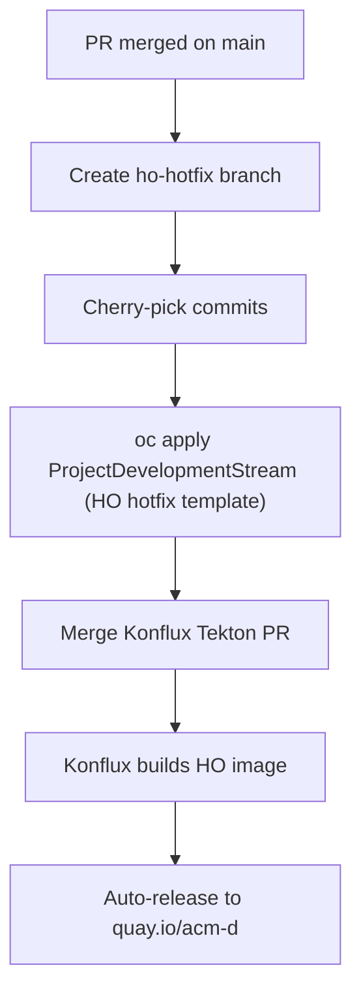
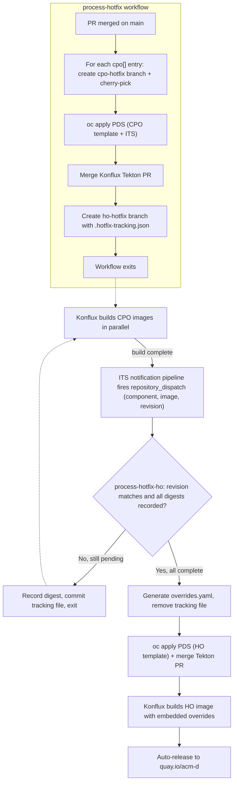

# Automated Hotfix Pipeline

## Summary

This enhancement introduces a declarative, PR-driven workflow for requesting and executing HyperShift Operator (HO) and Control Plane Operator (CPO) hotfixes. Today, hotfixes are a manual, multi-step process that requires Konflux cluster credentials, knowledge of branch-naming conventions, and manual `oc apply` commands — creating a bus factor around a single engineer. By adding a `releases/hotfixes.yaml` file (mirroring the existing `releases/tags.yaml` pattern for release tags), any team member can request a hotfix via a standard pull request, and GitHub Actions automation handles the rest: branch creation, cherry-picking, Konflux resource provisioning, and build orchestration.

## Motivation

HyperShift hotfixes are time-sensitive responses to production incidents. The current manual process documented in [contrib/konflux/README.md](https://github.com/openshift/hypershift/blob/main/contrib/konflux/README.md) involves:

1. Identifying the production commit via `podman inspect`.
2. Creating a hotfix branch by hand with specific naming conventions (`ho-hotfix-<ticket>` for HO, `cpo-hotfix-<ticket>` for CPO).
3. Cherry-picking fix commits onto the branch and pushing.
4. Writing and committing a `ProjectDevelopmentStream` YAML file.
5. Logging into the Konflux cluster with `oc` and applying the stream resource.
6. Merging the Konflux-generated Tekton PR on the hotfix branch (and potentially fixing it to use the common build pipeline).
7. For CPO hotfixes: waiting for the CPO build to complete, extracting the image digest, updating the HO's embedded `overrides.yaml` with that digest for all affected Z-stream versions, and then rebuilding the HO as well.

This process is error-prone, requires Konflux cluster credentials, and concentrates operational knowledge in a few people. During an active incident — precisely when speed matters most — any of these manual steps can fail or be performed incorrectly.

### User Stories

#### Story 1: HO-only hotfix

As a HyperShift/SRE engineer responding to a production incident affecting the HyperShift Operator, I want to open a PR to `releases/hotfixes.yaml` specifying the production commit, the Jira ticket, and the fix commits so that automation creates the hotfix branch, provisions the Konflux build, and produces a hotfix image without requiring me to have Konflux cluster credentials or memorize the manual procedure.

#### Story 2: CPO hotfix across multiple release branches

As a HyperShift engineer responding to a CPO bug affecting OCP 4.20, 4.21, and 4.22, I want to declare the affected release branches, base commits, cherry-picks, and impacted Z-stream versions in a single hotfix request so that automation builds CPO hotfix images for each affected branch, updates the HO's `overrides.yaml` with the resulting image digests, and rebuilds the HO — all without manual intervention after the PR merges.

#### Story 3: Reviewing a hotfix request

As a HyperShift maintainer reviewing a hotfix request, I want CI to validate the request (correct SHA format, commits exist, cherry-picks apply cleanly) so that I can approve with confidence that the automation will succeed.

#### Story 4: Observing hotfix automation health

As a HyperShift maintainer operating the hotfix pipeline, I want the automation to surface the status of in-flight hotfixes (which CPO builds are pending, which have completed, and whether any workflow run failed) and to alert on failures (authentication errors, missing `repository_dispatch` events, cherry-pick conflicts) so that a stalled hotfix is noticed and recovered quickly during an incident rather than silently hanging.

### Goals

1. Make hotfix requests declarative: a YAML change in a PR on `main` triggers all downstream actions.
2. Eliminate the need for Konflux cluster credentials during hotfix execution.
3. Handle the full CPO hotfix lifecycle: build CPO images across multiple release branches, update HO `overrides.yaml` with resulting digests, and rebuild the HO.
4. Validate hotfix requests in CI before merge to catch errors early.
5. Maintain auditability: every hotfix is tracked in Git history via the `releases/hotfixes.yaml` file and corresponding branches.

### Non-Goals

1. Automating the identification of the production commit. The requester is responsible for providing the correct commit SHAs.
2. Determining which Z-stream versions are affected by a CPO bug. The requester must specify `affectedVersions` explicitly.
3. Replacing the existing `contrib/konflux/README.md` manual process immediately. The automation will coexist with the manual process during the rollout.
4. Managing hotfix branch cleanup or Konflux resource teardown. These are separate operational concerns.
5. Automating the Konflux `ReleasePlanAdmission` or releng-tenant coordination for new hotfix applications.
6. ChatOps integration (e.g., chai bot). Triggering hotfixes or surfacing their status through chai bot is out of scope for the pilot. The PR-driven flow is the v1 interface; a chat-based interface may be revisited later (see [Open Questions](#open-questions)).

## Proposal

### Workflow Description

**hotfix requester** is a HyperShift or SRE engineer responding to a production incident.

**hotfix reviewer** is a HyperShift maintainer who reviews and approves the hotfix PR.

**GitHub Actions automation** is the set of workflows that validate and execute hotfix requests.

**Konflux** is the build and release platform that builds container images from hotfix branches.

#### HO-only hotfix flow

1. **Request.** The requester opens a PR against `main` adding an entry to `releases/hotfixes.yaml` with `type: ho`, the production base commit, the Jira ticket, and the list of commits to cherry-pick.
2. **Validate.** The `validate-hotfix-request` workflow runs as a PR check: it verifies YAML schema, commit existence, and dry-runs the cherry-picks.
3. **Review and merge.** The reviewer approves and merges the PR.
4. **Create branch.** The `process-hotfix` workflow creates branch `ho-hotfix-<ticket>` from `baseCommit`, cherry-picks the specified commits, and pushes.
5. **Provision Konflux.** The workflow applies a `ProjectDevelopmentStream` referencing the `hypershift-ho-hotfix-template` to the Konflux cluster.
6. **Merge Tekton PR.** Konflux generates a PR on the hotfix branch adding `.tekton/` pipeline definitions. The workflow verifies it references the common build pipeline, fixes it if needed, and merges it.
7. **Build.** Konflux builds `Containerfile.operator` from the hotfix branch. The existing `hypershift-operator-main-hotfix` ReleasePlan (with `auto-release: true`) promotes the image to `quay.io/acm-d/rhtap-hypershift-operator`.



#### CPO hotfix flow

CPO hotfixes are inherently more complex because:
- The **CPO** is built from `release-*` branches (e.g., `release-4.20`), not `main`.
- The **HO** is built from `main` and runs in production at a different commit.
- A CPO bug may affect **multiple release branches** (e.g., 4.20, 4.21, 4.22), each with its own base commit and potentially different cherry-picks.
- The HO must be rebuilt with updated `overrides.yaml` pointing the affected Z-stream versions at the hotfix CPO images.

The `overrides.yaml` file at `hypershift-operator/controlplaneoperator-overrides/assets/overrides.yaml` is embedded into the HO binary via `//go:embed`. At runtime, `GetControlPlaneOperatorImage()` consults this table to resolve which CPO image to use for a given platform and OCP version. Therefore, **every CPO hotfix implicitly requires an HO rebuild**.

The flow is:

1. **Request.** The requester opens a PR adding a `type: cpo` entry to `releases/hotfixes.yaml`, specifying `cpo[]` entries (one per affected release branch with base commit, cherry-picks, platforms, and affected versions) and an `ho` entry (with the HO production base commit and optional HO-specific cherry-picks).
2. **Validate.** CI validates the YAML, verifies all commits exist, and dry-runs cherry-picks for each CPO branch and the HO branch.
3. **Review and merge.**
4. **Create all branches and provision Konflux (`process-hotfix` workflow).** The workflow:
   - For each `cpo[]` entry: creates branch `cpo-hotfix-<ticket>-<branch>` (e.g., `cpo-hotfix-ocpbugs-94518-release-4-20`) from the entry's `baseCommit`, cherry-picks commits, and pushes.
   - Creates branch `ho-hotfix-<ticket>` from `ho.baseCommit`, applies any `ho.cherryPicks`, commits a `.hotfix-tracking.json` file listing all expected CPO builds (see [Build Coordination](#build-coordination-for-cpo-hotfixes)), and pushes.
   - Applies `ProjectDevelopmentStream` resources for all CPO branches.
   - Merges all Konflux-generated Tekton PRs.
   - Exits. The workflow does **not** poll for build results.
5. **CPO builds complete (event-driven).** Each CPO hotfix application includes an `IntegrationTestScenario` that runs a notification pipeline after a successful build. This pipeline extracts the image digest from the Konflux Snapshot and fires a GitHub `repository_dispatch` event of type `cpo-hotfix-build-complete` to the HyperShift repository, including the image reference, component name, and the Snapshot source revision (the CPO hotfix branch head commit) in the payload. The revision lets the HO workflow discard digests from stale/superseded builds.
6. **HO overrides update (`process-hotfix-ho` workflow).** A separate GitHub Actions workflow triggers on `repository_dispatch` events of type `cpo-hotfix-build-complete`. For each event:
   - Checks out the `ho-hotfix-<ticket>` branch.
   - Records the CPO image digest in `.hotfix-tracking.json`.
   - Checks if all expected CPO builds have reported their digests.
   - If builds remain pending: commits the updated tracking file and exits.
   - If all builds are complete: generates the `overrides.yaml` update, removes `.hotfix-tracking.json`, commits, pushes, and applies the HO `ProjectDevelopmentStream`.
7. **Release.** The HO hotfix image auto-releases via `hypershift-operator-main-hotfix` ReleasePlan.



### API Extensions

This enhancement does not introduce or modify any CRDs, admission or conversion webhooks, ValidatingAdmissionPolicy, MutatingAdmissionPolicy, aggregated API servers, or finalizers.

### Topology Considerations

#### Hypershift / Hosted Control Planes

This enhancement directly targets the HyperShift Operator and Control Plane Operator build and release pipelines. It operates entirely within Konflux CI infrastructure and GitHub Actions — it does not affect the runtime behavior of any HyperShift components.

#### Standalone Clusters

This enhancement does not affect standalone OpenShift clusters.

#### Single-node Deployments or MicroShift

This enhancement does not affect single-node OpenShift or MicroShift deployments.

#### OpenShift Kubernetes Engine

This enhancement does not affect OKE.

### Implementation Details/Notes/Constraints

#### `releases/hotfixes.yaml` Schema

```yaml
# releases/hotfixes.yaml
#
# To request a hotfix, add an entry at the top and open a PR against main.
# On merge, GitHub Actions will create the hotfix branch(es), configure Konflux,
# and trigger the build(s).
hotfixes:
  # --- HO-only hotfix example ---
  - ticket: CNTRLPLANE-3632
    type: ho
    baseCommit: fbaf59ae8f1234567890abcdef1234567890abcd
    # cherryPicks are applied in the order listed, on top of baseCommit.
    cherryPicks:
      - 866091eb451234567890abcdef1234567890abcd
      - 7f2a1c9d3e1234567890abcdef1234567890abcd
    description: >-
      Revert predictable rollout merge to fix HO upgrade regression
      (two commits: the revert plus a follow-up test fix).

  # --- CPO hotfix example (multiple release branches) ---
  - ticket: OCPBUGS-94518
    type: cpo
    cpo:
      - branch: release-4.20
        baseCommit: ae78f03507abcdef1234567890abcdef12345678
        cherryPicks:
          - a385dfb70c1234567890abcdef1234567890abcd
        platforms:
          - aws
          - azure
        affectedVersions:
          - "4.20.0"
          - "4.20.1"
          - "4.20.2"

      - branch: release-4.21
        baseCommit: 982167956e0dabcdef1234567890abcdef123456
        cherryPicks:
          - b1c2d3e4f51234567890abcdef1234567890abcd
        platforms:
          - azure
        affectedVersions:
          - "4.21.0"
          - "4.21.1"

      - branch: release-4.22
        baseCommit: 41cbcdfa522babcdef1234567890abcdef123456
        cherryPicks:
          - c2d3e4f5a61234567890abcdef1234567890abcd
        platforms:
          - aws
          - azure
        affectedVersions:
          - "4.22.0"
          - "4.22.1"
          - "4.22.2"

    ho:
      baseCommit: fbaf59ae8f1234567890abcdef1234567890abcd
      cherryPicks: []
      # overrides.yaml update is auto-generated by the workflow
    description: >-
      Fix konnectivity circular dependency causing DNS timeouts
      across 4.20, 4.21, and 4.22 for AWS and Azure.
```

**Schema rules:**

| Field | Required | Description |
|-------|----------|-------------|
| `ticket` | Yes | Jira ticket (`CNTRLPLANE-NNNN` or `OCPBUGS-NNNN`) |
| `type` | Yes | `ho` or `cpo` |
| `baseCommit` | Yes (HO-only) | 40-char hex SHA of HO production commit |
| `cherryPicks` | Yes (HO-only) | Ordered list of 40-char SHAs to cherry-pick |
| `cpo[]` | Yes (CPO type) | List of CPO branch entries |
| `cpo[].branch` | Yes | Source release branch name (e.g., `release-4.20`) |
| `cpo[].baseCommit` | Yes | 40-char hex SHA: tip of the release branch when CPO was built |
| `cpo[].cherryPicks` | Yes | Ordered list of 40-char SHAs to cherry-pick |
| `cpo[].platforms` | Yes | HyperShift provider platform(s) whose `overrides.yaml` entries need the hotfix CPO image. Values are the platform keys used in `overrides.yaml` (`aws`, `azure`) — i.e., cloud provider platforms, not managed-service product names. |
| `cpo[].affectedVersions` | Yes | Z-stream versions to override (e.g., `["4.20.0", "4.20.1"]`) |
| `ho` | Yes (CPO type) | HO branch configuration |
| `ho.baseCommit` | Yes | 40-char hex SHA of HO production commit |
| `ho.cherryPicks` | No | Optional HO-specific cherry-picks |
| `description` | Yes | Human-readable summary |

#### Build Coordination for CPO Hotfixes

CPO hotfixes that span multiple release branches require coordinating N independent Konflux builds before the HO can be rebuilt with the correct `overrides.yaml`. The coordination uses three mechanisms:

1. **A tracking file (`.hotfix-tracking.json`) on the HO hotfix branch.** Created by the `process-hotfix` workflow at branch creation time. Lists all expected CPO components with their metadata (`branch`, `expectedRevision`, `platforms`, `affectedVersions`) and an `image` field initially set to `null`. The `expectedRevision` records the head commit of each CPO hotfix branch after cherry-picks, so the HO workflow can reject digests from superseded builds (see [Step 6](#process-hotfix-workflow) and Risk 6).

2. **An `IntegrationTestScenario` in the CPO hotfix template.** Triggers a notification pipeline after each successful CPO push build. The pipeline sends a `repository_dispatch` event to GitHub with the image digest.

3. **A `process-hotfix-ho` GitHub Actions workflow.** Triggers on `repository_dispatch` events of type `cpo-hotfix-build-complete`. Records the digest in the tracking file, and when all entries are populated, generates the `overrides.yaml` update and triggers the HO build.

This event-driven architecture means no GitHub Actions runner is kept idle waiting for builds. Each CPO build completion triggers a brief (~1 minute) workflow run that either records a digest and exits, or — on the final completion — generates overrides and triggers the HO build.

#### Validation Workflow

**File:** `.github/workflows/validate-hotfix-request.yaml`

**Trigger:** PR modifying `releases/hotfixes.yaml` targeting `main`.

All checks below run as jobs in this GitHub Actions workflow (no external CI system is involved):
- YAML is well-formed and matches the schema.
- `ticket` matches `^(CNTRLPLANE|OCPBUGS)-\d+$` (case-insensitive).
- All `baseCommit` and `cherryPicks` entries are valid 40-char hex SHAs that exist in the repository.
- For `type: cpo`, each `cpo[].branch` exists as a remote branch.
- `platforms` contains only valid values (`aws`, `azure`).
- `affectedVersions` entries match `^\d+\.\d+\.\d+$`.
- No duplicate tickets in the file.
- Dry-run cherry-picks succeed for each branch (checkout base, attempt cherry-picks in a temporary worktree).
- For CPO hotfixes, the `ho.baseCommit` is not on a `release-*` branch (it should be from `main` or an existing HO hotfix).

#### Process Hotfix Workflow

**File:** `.github/workflows/process-hotfix.yaml`

**Trigger:** Push to `main` modifying `releases/hotfixes.yaml`.

The workflow diffs `releases/hotfixes.yaml` against the parent commit to identify **new** entries, then processes each. The following describes the detailed steps:

**Step 1 — Create hotfix branches:**

For HO-only (`type: ho`):
```bash
git checkout -b ho-hotfix-<ticket-lowercased> <baseCommit>
git cherry-pick <commit1> [<commit2> ...]
git push origin ho-hotfix-<ticket-lowercased>
```

For CPO (`type: cpo`), for each `cpo[]` entry:
```bash
git checkout -b cpo-hotfix-<ticket-lowercased>-<branch-hyphenized> <cpo.baseCommit>
git cherry-pick <commit1> [<commit2> ...]
git push origin cpo-hotfix-<ticket-lowercased>-<branch-hyphenized>
```

**Step 2 — Apply ProjectDevelopmentStream resources:**

For HO-only:
```yaml
apiVersion: projctl.konflux.dev/v1beta1
kind: ProjectDevelopmentStream
metadata:
  name: hypershift-ho-hotfix-<ticket-lowercased>
spec:
  project: crt-redhat-acm-tenant
  template:
    name: hypershift-ho-hotfix-template
    values:
    - name: ticketReference
      value: "<ticket-lowercased>"
```

For each CPO branch entry, using the existing `hypershift-cpo-hotfix-template`. The template expects a branch named `hotfix-<versionName>`, so we set `ticketReference` to `<ticket-lowercased>-<branch-hyphenized>`:
```yaml
apiVersion: projctl.konflux.dev/v1beta1
kind: ProjectDevelopmentStream
metadata:
  name: hypershift-cpo-hotfix-<ticket-lowercased>-<branch-hyphenized>
spec:
  project: crt-redhat-acm-tenant
  template:
    name: hypershift-cpo-hotfix-template
    values:
    - name: ticketReference
      value: "<ticket-lowercased>-<branch-hyphenized>"
```

Note: the CPO hotfix template currently expects the branch to be named `hotfix-<versionName>`. We will need to update the template to use `cpo-hotfix-<versionName>` for consistency, or alternatively update the branch naming in the workflow to match the template's expectation. The template should also be updated to accept the branch name as a variable so it doesn't have to derive it from the ticket reference.

#### Konflux Application Structure for Multi-Branch CPO Hotfixes

When a CPO hotfix spans multiple release branches (e.g., `release-4.20`, `release-4.21`, `release-4.22`), each branch gets its own `ProjectDevelopmentStream` and therefore its own Konflux **Application**, **Component**, and **ImageRepository**:

| Branch | Application | Component |
|--------|-------------|-----------|
| `release-4.20` | `hypershift-cpo-hotfix-ocpbugs-94518-release-4-20` | `hypershift-cpo-hotfix-ocpbugs-94518-release-4-20` |
| `release-4.21` | `hypershift-cpo-hotfix-ocpbugs-94518-release-4-21` | `hypershift-cpo-hotfix-ocpbugs-94518-release-4-21` |
| `release-4.22` | `hypershift-cpo-hotfix-ocpbugs-94518-release-4-22` | `hypershift-cpo-hotfix-ocpbugs-94518-release-4-22` |
| `main` (HO) | `hypershift-operator-hotfix-ocpbugs-94518` | `hypershift-operator-hotfix-ocpbugs-94518` |

Each CPO branch is a **separate Application** rather than multiple Components within a single Application. This is the correct design because:

- Each branch has a different base commit, different code, and produces a different image.
- Separate Applications mean independent Snapshots — a build failure on one branch does not affect others.
- Each Application gets its own IntegrationTestScenario for build notification, keeping the `repository_dispatch` events independent.
- This matches the existing template structure (one Application + one Component per PDS), requiring no template changes for multi-component support.

The HO hotfix is always a separate Application (`hypershift-operator-hotfix-<ticket>`) using the HO hotfix template.

**Step 3 — Pre-create `.tekton/` pipeline files (instead of relying on Konflux PAC):**

Historically, hotfix branches relied on the Konflux PAC `configure-pac` annotation to auto-generate `.tekton/` pipeline definitions via a PR. However, the generated pipelines embed a full ~540-line inline `pipelineSpec` that must then be replaced with a `pipelineRef` to the common build pipeline (see commit `b84c88d1dd` on `ho-hotfix-cntrlplane-3632`). This creates a multi-step sequence: wait for Konflux PR → fix it → merge it.

The automation eliminates this entirely by **pre-creating the correct `.tekton/` files on the hotfix branch** before applying the `ProjectDevelopmentStream`. The files are generated from templates based on the existing `main` push/pull-request pipeline definitions, with the branch name, application name, component name, Containerfile, and service account substituted. The key fields are:

```yaml
# .tekton/<component>-push.yaml
metadata:
  annotations:
    pipelinesascode.tekton.dev/on-cel-expression: |
      event == "push"
      && target_branch == "<hotfix-branch>"
      && (files.all.exists(x, !x.matches('^(?:docs|examples|enhancements|contrib|\\.tekton)/|\\.md$|...'))
         || ".tekton/pipelines/common-operator-build.yaml".pathChanged()
         || ".tekton/<component>-push.yaml".pathChanged())
    pipelinesascode.tekton.dev/pipeline: ".tekton/pipelines/common-operator-build.yaml"
  labels:
    appstudio.openshift.io/application: <application>
    appstudio.openshift.io/component: <component>
spec:
  params:
  - name: output-image
    value: quay.io/redhat-user-workloads/crt-redhat-acm-tenant/<component>:{{revision}}
  - name: dockerfile
    value: <Containerfile.operator or Containerfile.control-plane>
  pipelineRef:
    name: hypershift-common-operator-build
  taskRunTemplate:
    serviceAccountName: build-pipeline-<component>
```

To support this, the `configure-pac` annotation is **removed** from both hotfix templates. PAC's Pipelines-as-Code controller will still detect the `.tekton/` files on the branch and trigger builds on push — the annotation is only needed for initial PR generation, which we no longer want.

This approach:
- Eliminates the wait-for-PR → fix → merge sequence.
- Ensures the correct common pipeline is used from the first build.
- Makes the hotfix branch self-contained: cherry-picks + pipeline files are committed in one push.

**Step 4 — Create HO hotfix branch with tracking state (CPO only):**

The `process-hotfix` workflow creates the HO hotfix branch early — before any CPO build completes — and commits a tracking file that records which CPO builds are expected:

```bash
git checkout -b ho-hotfix-<ticket-lowercased> <ho.baseCommit>
git cherry-pick <ho.cherryPicks...>   # if any

# Generate tracking state from the hotfix request
cat > .hotfix-tracking.json <<'EOF'
{
  "ticket": "<ticket>",
  "pending": {
    "hypershift-cpo-hotfix-<ticket>-<branch1>": {
      "branch": "release-4.20",
      "expectedRevision": "<head SHA of cpo-hotfix-<ticket>-release-4-20 after cherry-picks>",
      "platforms": ["aws", "azure"],
      "affectedVersions": ["4.20.0", "4.20.1", "4.20.2"],
      "image": null
    },
    "hypershift-cpo-hotfix-<ticket>-<branch2>": {
      "branch": "release-4.21",
      "expectedRevision": "<head SHA of cpo-hotfix-<ticket>-release-4-21 after cherry-picks>",
      "platforms": ["azure"],
      "affectedVersions": ["4.21.0", "4.21.1"],
      "image": null
    }
  }
}
EOF

git add .hotfix-tracking.json
git commit -m "hotfix(tracking): <ticket> — awaiting N CPO builds"
git push origin ho-hotfix-<ticket-lowercased>
```

The `process-hotfix` workflow then exits. No runner is kept waiting for builds.

**Step 5 — CPO build notification via IntegrationTestScenario:**

Each CPO hotfix application includes an `IntegrationTestScenario` (added to the CPO hotfix template) that triggers a notification pipeline after a successful push-event Snapshot. This pipeline:

1. Extracts the image reference (including `@sha256:` digest), component name, and the Snapshot source revision from the Snapshot.
2. Sends a GitHub `repository_dispatch` event to the HyperShift repository:

```bash
curl -fsSL -X POST \
  -H "Authorization: token ${GITHUB_APP_TOKEN}" \
  -H "Accept: application/vnd.github+json" \
  "https://api.github.com/repos/openshift/hypershift/dispatches" \
  -d '{
    "event_type": "cpo-hotfix-build-complete",
    "client_payload": {
      "component": "hypershift-cpo-hotfix-<ticket>-<branch>",
      "image": "quay.io/...@sha256:<digest>",
      "revision": "<cpo hotfix branch head commit>"
    }
  }'
```

The pipeline definition lives in the HyperShift repository at `.tekton/pipelines/cpo-hotfix-notify.yaml` and is referenced by the ITS via git resolver (see [Notification Pipeline](#notification-pipeline)).

**Step 6 — Record digest and check completion (`process-hotfix-ho` workflow):**

A GitHub Actions workflow triggers on `repository_dispatch` events of type `cpo-hotfix-build-complete`:

```yaml
on:
  repository_dispatch:
    types: [cpo-hotfix-build-complete]
```

The workflow:

1. Derives the ticket from the component name and checks out the `ho-hotfix-<ticket>` branch.
2. **Validates the revision.** Compares the event's `revision` against
   `pending[component].expectedRevision` in `.hotfix-tracking.json`. If they differ,
   the event is from a **superseded build** (an earlier build that finished after a
   newer cherry-pick was pushed to the CPO hotfix branch); the workflow logs this and
   exits without recording the digest, leaving that entry `null` so it keeps waiting
   for the build matching the expected revision. If a maintainer intentionally pushes
   additional cherry-picks to a CPO hotfix branch after creation, they must also update
   `expectedRevision` in the tracking file (by re-running `process-hotfix` or via a
   dedicated step) so the new build's digest is accepted.
3. Reads `.hotfix-tracking.json`, records the image digest for the completed component (only when the revision matched).
4. Counts remaining builds where `image` is `null`.
5. If builds remain pending: commits the updated tracking file and pushes.
   ```bash
   git commit -m "hotfix(tracking): <ticket> — <component> complete (N remaining)"
   git push origin ho-hotfix-<ticket>
   ```
6. If all builds are complete (`0` remaining): generates the `overrides.yaml` update.

**Race condition handling:** The workflow declares a GitHub Actions `concurrency`
group keyed on the HO branch (e.g., `group: process-hotfix-ho-${HO_BRANCH}`) so that
same-branch dispatches are serialized rather than run in parallel. As a further
safeguard, if two `repository_dispatch` events are still processed close enough to
race on the push, both workflow runs try to push to the same branch and the second
push fails with a non-fast-forward error. The workflow handles this by retrying:
```bash
git pull --rebase origin "${HO_BRANCH}"
# Re-read .hotfix-tracking.json after rebase — the other run may have
# already recorded its digest or even triggered the overrides update
REMAINING=$(jq '[.pending[] | select(.image == null)] | length' .hotfix-tracking.json)
```

Alternatively, the workflow can use the GitHub Contents API (`PUT /repos/.../contents/.hotfix-tracking.json`) which requires the current file SHA and returns `409 Conflict` on concurrent modification — providing atomic compare-and-swap semantics.

**Step 7 — Generate overrides.yaml and trigger HO build:**

When Step 6 determines all CPO builds are complete, the same workflow run:

1. Reads all digests from `.hotfix-tracking.json`.
2. For each entry, adds override entries to `hypershift-operator/controlplaneoperator-overrides/assets/overrides.yaml`:

```yaml
platforms:
  aws:
    overrides:
      # Beginning of <ticket> overrides <branch> section
      - version: "4.20.0"
        cpoImage: quay.io/redhat-user-workloads/crt-redhat-acm-tenant/control-plane-operator-hotfix-<ticket>-<branch>@sha256:<digest>
      - version: "4.20.1"
        cpoImage: quay.io/redhat-user-workloads/crt-redhat-acm-tenant/control-plane-operator-hotfix-<ticket>-<branch>@sha256:<digest>
      # End of <ticket> overrides <branch> section
```

3. Removes `.hotfix-tracking.json`.
4. Commits and pushes:
   ```bash
   git rm .hotfix-tracking.json
   git add hypershift-operator/controlplaneoperator-overrides/assets/overrides.yaml
   git commit -m "hotfix(overrides): <ticket> — update CPO overrides for affected versions"
   git push origin ho-hotfix-<ticket>
   ```
5. Applies the HO `ProjectDevelopmentStream` and merges the Tekton PR.
6. The HO auto-releases with the updated overrides embedded.

The HO hotfix branch history tells the complete story:
```
* hotfix(overrides): OCPBUGS-94518 — update CPO overrides for affected versions
* hotfix(tracking): OCPBUGS-94518 — release-4.21 complete (0 remaining)
* hotfix(tracking): OCPBUGS-94518 — release-4.22 complete (1 remaining)
* hotfix(tracking): OCPBUGS-94518 — release-4.20 complete (2 remaining)
* hotfix(tracking): OCPBUGS-94518 — awaiting 3 CPO builds
* <ho.cherryPicks if any>
* <ho.baseCommit>
```

#### Idempotency and Error Handling

| Condition | Behavior |
|-----------|----------|
| Branch already exists | Skip branch creation, log warning |
| Cherry-pick conflict | Fail workflow, post error details as a comment on the merge commit |
| `ProjectDevelopmentStream` already exists | `oc apply` is idempotent — no-op |
| Tekton PR already merged | Skip merge step |
| CPO build fails | No `repository_dispatch` is sent; tracking file retains `null` for that entry. Operator investigates via Konflux, fixes the issue on the CPO branch, and a new build triggers the ITS notification. |
| `repository_dispatch` race condition | Two CPO builds complete simultaneously; both workflow runs try to push the tracking file. The second push fails (non-fast-forward). The workflow retries with `git pull --rebase` and re-checks remaining count. |
| Duplicate ticket in `hotfixes.yaml` | Caught by validation workflow before merge |
| Workflow re-run after partial completion | Idempotent: existing branches, PDS resources, and merged PRs are all skipped. Tracking file records which digests have already been received. |

#### Konflux Template Updates

The existing `hypershift-cpo-hotfix-template` needs two updates:

**1. Remove `configure-pac` annotation.** The automation pre-creates the correct `.tekton/` pipeline files on the hotfix branch (see [Process Hotfix Workflow — Step 3](#process-hotfix-workflow)), so the PAC auto-generated PR is no longer needed. Remove the `build.appstudio.openshift.io/request: configure-pac` annotation from the Component resource in both hotfix templates.

**2. Branch naming variable.** Currently the template hardcodes `revision: "hotfix-{{.versionName}}"`. We add a `branchName` variable with a default that preserves backward compatibility:

```yaml
variables:
- name: ticketReference
  description: A reference to the Jira ticket
- name: versionName
  defaultValue: "{{hyphenize .ticketReference}}"
- name: branchName
  description: The hotfix branch name
  defaultValue: "cpo-hotfix-{{.versionName}}"
```

And update the Component's `revision` field:
```yaml
source:
  git:
    revision: "{{.branchName}}"
```

This allows the automation to pass the exact branch name while remaining backward compatible with manual usage.

**3. IntegrationTestScenario for build notification.** Add an ITS resource to the template that triggers a notification pipeline after each successful CPO build:

```yaml
- apiVersion: appstudio.redhat.com/v1beta2
  kind: IntegrationTestScenario
  metadata:
    name: hypershift-cpo-hotfix-{{.versionName}}-notify
  spec:
    application: hypershift-cpo-hotfix-{{.versionName}}
    contexts:
    - description: Runs automatically on push build Snapshots
      name: application
    resolverRef:
      resolver: git
      params:
      - name: url
        value: https://github.com/openshift/hypershift
      - name: revision
        value: main
      - name: pathInRepo
        value: .tekton/pipelines/cpo-hotfix-notify.yaml
```

The ITS triggers on every successful push Snapshot for the CPO hotfix application. The `cpo-hotfix-notify.yaml` pipeline extracts the image digest from the Snapshot and sends a `repository_dispatch` event to the HyperShift GitHub repository (see [Notification Pipeline](#notification-pipeline)).

#### Notification Pipeline

The notification pipeline lives at `.tekton/pipelines/cpo-hotfix-notify.yaml` in the HyperShift repository. It is a minimal Tekton PipelineRun that:

1. Receives the `SNAPSHOT` parameter (JSON string containing the built image reference) from the IntegrationTestScenario.
2. Extracts the image reference (including `@sha256:` digest) and component name.
3. Sends a `repository_dispatch` event to `openshift/hypershift` with `event_type: cpo-hotfix-build-complete`.

```yaml
apiVersion: tekton.dev/v1
kind: PipelineRun
metadata:
  name: cpo-hotfix-notify
spec:
  params:
  - name: SNAPSHOT
    value: "$(params.SNAPSHOT)"
  pipelineSpec:
    params:
    - name: SNAPSHOT
      type: string
    tasks:
    - name: notify-github
      taskSpec:
        params:
        - name: SNAPSHOT
          type: string
        steps:
        - name: send-dispatch
          image: registry.access.redhat.com/ubi9/ubi-minimal:latest
          env:
          - name: GITHUB_APP_TOKEN
            valueFrom:
              secretKeyRef:
                name: hotfix-github-notify-token
                key: token
          script: |
            #!/bin/bash
            set -euo pipefail
            dnf install -y jq 2>/dev/null || microdnf install -y jq

            SNAPSHOT='$(params.SNAPSHOT)'
            IMAGE=$(echo "$SNAPSHOT" | jq -r '.components[0].containerImage')
            COMPONENT=$(echo "$SNAPSHOT" | jq -r '.components[0].name')
            REVISION=$(echo "$SNAPSHOT" | jq -r '.components[0].source.git.revision')

            curl -fsSL -X POST \
              -H "Authorization: token ${GITHUB_APP_TOKEN}" \
              -H "Accept: application/vnd.github+json" \
              "https://api.github.com/repos/openshift/hypershift/dispatches" \
              -d "{
                \"event_type\": \"cpo-hotfix-build-complete\",
                \"client_payload\": {
                  \"component\": \"${COMPONENT}\",
                  \"image\": \"${IMAGE}\",
                  \"revision\": \"${REVISION}\"
                }
              }"

            echo "Dispatched cpo-hotfix-build-complete for ${COMPONENT} → ${IMAGE}"
      params:
      - name: SNAPSHOT
        value: "$(params.SNAPSHOT)"
```

The pipeline authenticates with GitHub using a token stored as a Konflux secret (`hotfix-github-notify-token`). This should be a GitHub App installation token from the existing `JIRA_SOLVE_CI` app, scoped to `contents: write` on `openshift/hypershift` (required for `repository_dispatch`). See [Required Permissions and Secrets](#required-permissions-and-secrets).

#### Files to Create or Modify

| Location | File | Action |
|----------|------|--------|
| HyperShift repo | `releases/hotfixes.yaml` | Create: declarative hotfix request file |
| HyperShift repo | `.github/workflows/validate-hotfix-request.yaml` | Create: PR validation workflow |
| HyperShift repo | `.github/workflows/validate-hotfix-request-reusable.yaml` | Create: reusable validation logic |
| HyperShift repo | `.github/workflows/process-hotfix.yaml` | Create: post-merge workflow (creates branches, provisions Konflux) |
| HyperShift repo | `.github/workflows/process-hotfix-reusable.yaml` | Create: reusable execution logic |
| HyperShift repo | `.github/workflows/process-hotfix-ho.yaml` | Create: `repository_dispatch` handler for CPO build completion |
| HyperShift repo | `.github/workflows/process-hotfix-ho-reusable.yaml` | Create: reusable HO override logic |
| HyperShift repo | `.tekton/pipelines/cpo-hotfix-notify.yaml` | Create: ITS notification pipeline |
| HyperShift repo | `.github/workflows/rehearse-release-workflows.yaml` | Modify: add hotfix workflow rehearsal |
| Konflux cluster | `hypershift-cpo-hotfix-template` | Modify: remove `configure-pac`, add `branchName` variable and ITS resource |
| Konflux cluster | `hypershift-ho-hotfix-template` | Modify: remove `configure-pac` |
| Konflux cluster | `contrib/konflux/cpo_hotfix_stream_template.yaml` | Modify: match CPO template update |
| Konflux cluster | `contrib/konflux/ho_hotfix_stream_template.yaml` | Modify: match HO template update |

#### Required Permissions and Secrets

**GitHub App token (existing):**

The repository already uses a GitHub App (`JIRA_SOLVE_CI_APP_ID` / `JIRA_SOLVE_CI_PRIVATE_KEY`) in the `create-tag` workflow for pushing branches. The hotfix workflows reuse this app with these permissions:

| Permission | Scope | Why |
|------------|-------|-----|
| `contents: write` | Repository | Push hotfix branches, push fixup commits |
| `pull-requests: write` | Repository | Merge Konflux-generated Tekton PRs |

The app already has `contents: write`. It may need `pull-requests: write` added to its installation if not already granted.

**Konflux ServiceAccount token (new):**

The `process-hotfix` workflow needs to run `oc apply` to create `ProjectDevelopmentStream` resources. The `process-hotfix-ho` workflow needs `oc apply` for the HO `ProjectDevelopmentStream` after all CPO builds complete. We recommend a dedicated ServiceAccount with minimal RBAC:

```yaml
apiVersion: v1
kind: ServiceAccount
metadata:
  name: hotfix-automation
  namespace: crt-redhat-acm-tenant
---
apiVersion: rbac.authorization.k8s.io/v1
kind: Role
metadata:
  name: hotfix-automation
  namespace: crt-redhat-acm-tenant
rules:
- apiGroups: ["projctl.konflux.dev"]
  resources: ["projectdevelopmentstreams"]
  verbs: ["get", "list", "create", "update", "patch"]
---
apiVersion: rbac.authorization.k8s.io/v1
kind: RoleBinding
metadata:
  name: hotfix-automation
  namespace: crt-redhat-acm-tenant
subjects:
- kind: ServiceAccount
  name: hotfix-automation
roleRef:
  kind: Role
  name: hotfix-automation
  apiGroup: rbac.authorization.k8s.io
```

Note: unlike the polling-based design, this ServiceAccount no longer needs `snapshots` read access — build completion is communicated via `repository_dispatch` events, not by polling Konflux.

The ServiceAccount token and Konflux API URL are stored as GitHub Actions secrets:

| Secret | Value |
|--------|-------|
| `KONFLUX_API_URL` | `https://api.stone-prd-rh01.pg1f.p1.openshiftapps.com:6443` |
| `KONFLUX_SA_TOKEN` | ServiceAccount bearer token |

The workflow authenticates with:
```bash
oc login --token="${KONFLUX_SA_TOKEN}" "${KONFLUX_API_URL}"
oc project crt-redhat-acm-tenant
```

The token is minted with a quarterly TTL (~90 days) and rotated on that cadence (see [Authorization Model](#authorization-model)).

**Konflux secret for GitHub notification (new):**

The CPO hotfix notification pipeline (`.tekton/pipelines/cpo-hotfix-notify.yaml`) needs a GitHub token to call `repository_dispatch`. This is stored as a Konflux secret in the `crt-redhat-acm-tenant` namespace:

| Secret | Location | Value |
|--------|----------|-------|
| `hotfix-github-notify-token` | `crt-redhat-acm-tenant` namespace | GitHub App installation token or fine-grained PAT |

The token needs `contents: write` scope on `openshift/hypershift` (the minimum permission required for `repository_dispatch`). Using a GitHub App installation token from the existing `JIRA_SOLVE_CI` app is preferred over a personal access token because it is not tied to an individual account and can be rotated independently.

**Why a ServiceAccount over OIDC federation:**

While OIDC federation between GitHub Actions and the Konflux cluster would eliminate
long-lived tokens entirely, the Konflux cluster does not currently support GitHub
Actions as an OIDC identity provider. OIDC federation remains the preferred long-term
end state; for now the SA token is rotated quarterly (see
[Authorization Model](#authorization-model)). If Konflux adds GitHub Actions as an
OIDC provider in the future, migrating from a SA token to OIDC would be
straightforward — only the login step in the workflow would change.

#### Authorization Model

Two independent gates govern who can *request* a hotfix and who can *authorize* the resulting cluster mutation.

**Request & merge authorization (pilot).** Permission to merge a change to `releases/hotfixes.yaml` is governed by a Prow `OWNERS` file scoped to the `releases/` directory in `openshift/hypershift`. A dedicated alias in the repository's `OWNER_ALIASES` (e.g., `hotfix-approvers`) lists the trusted approvers, so the set can be widened over time without editing every `OWNERS` file:

```yaml
# OWNER_ALIASES
aliases:
  hotfix-approvers:
    - celebdor
    # - <additional HyperShift maintainers / SRE representatives>
```
```yaml
# releases/OWNERS
approvers:
  - hotfix-approvers
reviewers:
  - hotfix-approvers
```

Any engineer (including SRE and managed-services) may *open* a hotfix PR; merging requires `/approve` from a member of the alias. Because the `process-hotfix` workflow is triggered by the merge to `main`, this Prow approval is the effective authorization gate for the pilot.

**Mutation authorization (optional, phase 2).** For defense in depth, the
`process-hotfix` and `process-hotfix-ho` jobs that run `oc apply` against the Konflux
cluster can additionally be bound to a GitHub **Environment** (e.g., `konflux-prod`)
with a **required-reviewer** protection rule, with `KONFLUX_SA_TOKEN` scoped to that
environment. A job that declares `environment: konflux-prod` pauses before its first
step until a required reviewer approves it in the Actions UI. This separates "approve
the code change" (the merge gate) from "authorize the privileged cluster mutation"
(the mutation gate), allowing the requester/approver pool to be widened — per the
managed-services ask — while the privileged `oc apply` step stays behind a small
on-call group. This gate is deferred past the pilot.

**Token rotation.** The `KONFLUX_SA_TOKEN` is minted with a quarterly TTL (~90 days) and rotated on that cadence; monitoring (Story 4) alerts on authentication failures as a backstop between rotations.

### Risks and Mitigations

**Risk 1: Cherry-pick conflicts halt the workflow.**
- Impact: High — the hotfix cannot be built automatically.
- Likelihood: Low — hotfix cherry-picks are usually clean against their base commit.
- Mitigation: The validation workflow dry-runs cherry-picks before merge to catch conflicts early. If a conflict is discovered post-merge, the workflow fails loudly with conflict details, and the requester must resolve manually and re-trigger.

**Risk 2: Konflux Tekton PR generation is slow or changes format.**
- Impact: Medium — the auto-merge step may time out or fail to detect the PR.
- Likelihood: Low — the Tekton PR format has been stable.
- Mitigation: Configurable timeout with clear failure messages. The workflow is idempotent, so re-running after manual intervention is safe.

**Risk 3: ServiceAccount token expiry or revocation.**
- Impact: High — all hotfix automation stops.
- Likelihood: Low — the token is minted with a quarterly TTL (~90 days).
- Mitigation: The `KONFLUX_SA_TOKEN` is rotated on a quarterly cadence (see [Authorization Model](#authorization-model) and [Support Procedures](#workflow-fails-at-konflux-authentication)). Monitoring (Story 4) alerts on workflow failures that indicate authentication errors as a backstop between rotations.

**Risk 4: Overrides.yaml auto-generation produces incorrect entries.**
- Impact: High — wrong CPO image used for specific Z-stream versions.
- Likelihood: Low — the generation logic is deterministic and based on explicit inputs.
- Mitigation: The generated `overrides.yaml` diff is logged in the workflow output for manual review. The override format follows the exact same pattern used in all existing manual overrides.

**Risk 5: ITS notification pipeline fails to send `repository_dispatch`.**
- Impact: Medium — one CPO build's digest is not recorded; the HO build is never triggered.
- Likelihood: Low — the pipeline is a simple `curl` to a well-defined API.
- Mitigation: The `hotfix-github-notify-token` Konflux secret must be kept valid. If
  the notification fails, the Tekton PipelineRun logs in the ITS will show the error.
  The operator can manually send the `repository_dispatch` event or fall back to
  recording the digest on the HO branch by hand. Monitoring (Story 4) should flag HO
  branches that still carry a `.hotfix-tracking.json` long after their CPO builds
  completed.

**Risk 6: Stale or racing `repository_dispatch` events corrupt tracking state.**
- Impact: High — a superseded CPO build's digest could be embedded in `overrides.yaml` and auto-released, or a concurrent digest update could be lost.
- Likelihood: Low — multiple builds of the same CPO branch, or two builds completing within seconds of each other, are uncommon.
- Mitigation: **Stale builds** are rejected via the `expectedRevision` guard — the HO
  workflow accepts a digest only when the event `revision` matches the tracking file's
  recorded branch head (see [Step 6](#process-hotfix-workflow)). **Concurrent updates**
  are handled with `git pull --rebase` retry logic (or the GitHub Contents API's
  compare-and-swap via file SHA) and a GitHub Actions `concurrency` group keyed on the
  HO branch so same-branch dispatches serialize. The tracking file remains the source
  of truth.

### Drawbacks

- **Added infrastructure complexity.** The automation adds new GitHub Actions workflows and requires a Konflux ServiceAccount, introducing more moving parts to monitor and maintain.
- **Long wall-clock time.** CPO hotfixes spanning multiple release branches have inherent latency: each CPO build takes 20+ minutes (multi-arch), and the HO build cannot start until all CPO digests are available. The total wall-clock time could be 1–2 hours for a three-branch CPO hotfix. However, unlike the polling-based alternative, no GitHub Actions runner is kept idle during this time — the event-driven architecture only consumes runner time for the brief `process-hotfix-ho` workflow runs (~1 minute each).
- **Partial automation.** The workflow automates up to the HO build and auto-release, but does not automate downstream consumption (e.g., updating managed service deployments to use the hotfix image). That remains a manual process for the consuming teams.

## Alternatives (Not Implemented)

### Alternative 1: Skip Konflux templates entirely

Instead of using `ProjectDevelopmentStreamTemplate` / `ProjectDevelopmentStream` resources, the workflow could directly `oc apply` the Application, Component, and ImageRepository resources. This would give full control over the resource structure but would mean the automation owns the resource schema, creating a maintenance burden when Konflux APIs evolve. Using the existing templates keeps the automation decoupled from Konflux resource details.

### Alternative 2: Single branch for CPO + HO

A single hotfix branch with both a CPO Component and an HO Component watching it would reduce branch proliferation. However, this is not feasible because:
- The CPO base commit comes from a `release-*` branch at a specific point in time.
- The HO base commit comes from `main` at a different point in time.
- A single branch cannot represent two different base commits with different histories.
- A CPO bug may span multiple release branches (e.g., 4.20, 4.21, 4.22), each with its own base commit and cherry-picks.

### Alternative 3: Unified ProjectDevelopmentStreamTemplate with conditional components

A single template that conditionally creates HO and/or CPO components based on a variable. However, the Konflux `ProjectDevelopmentStreamTemplate` controller applies Go `text/template` only to specific whitelisted fields within each resource — it does not support conditional resource inclusion (`{{if}}`). Every resource in the `resources` list is always created.

### Alternative 4: Polling for CPO build completion

Instead of the event-driven ITS + `repository_dispatch` architecture, the `process-hotfix` workflow could poll the Konflux cluster for Snapshot completion:
```bash
while true; do
  oc get snapshot -l "appstudio.openshift.io/application=..." ...
  sleep 60
done
```
This is simpler to implement but keeps a GitHub Actions runner occupied for 30+ minutes per CPO branch doing nothing useful. For a three-branch CPO hotfix, that is 90+ minutes of wasted runner time. The event-driven approach trades implementation complexity for resource efficiency and scales better as the number of CPO branches grows.

## Open Questions

1. **CPO hotfix ReleasePlan (resolved for v1).** The HO has a dedicated
   `hypershift-operator-main-hotfix` ReleasePlan with `auto-release: true` that
   promotes to `quay.io/acm-d`. For the pilot/v1, the HO hotfix auto-releases to
   `quay.io/acm-d` (unchanged), and CPO hotfix images are consumed directly from
   `quay.io/redhat-user-workloads/crt-redhat-acm-tenant/...` by digest (as referenced
   in the HO's embedded `overrides.yaml`) — no per-hotfix CPO ReleasePlan is created. A
   future iteration may add a CPO hotfix ReleasePlan and move consumption to
   `redhat-services-prod` once ROSA consumes images from there; that is explicitly out
   of scope for v1.

2. **Affected versions enumeration.** Listing every Z-stream version individually (e.g., `4.20.0` through `4.20.25`) is tedious and error-prone. Should we support range syntax (e.g., `"4.20.0-4.20.25"`) or an open-ended range (e.g., `"4.20.0+"` meaning "from 4.20.0 until the fix lands in the release branch")? This would simplify the hotfix request but adds complexity to the workflow.

3. **Hotfix branch cleanup.** Should the automation clean up hotfix branches and Konflux resources (Application, Component, ImageRepository) after the hotfix is superseded by a regular release that includes the fix? If so, what triggers the cleanup?

4. **Approval gates (resolved).** For the pilot, PR review on `main` — gated by a `releases/OWNERS` file referencing a `hotfix-approvers` alias in `OWNER_ALIASES` — is the authorization gate. A second, optional mutation gate (GitHub Environment with required reviewers guarding the `oc apply` jobs) is designed but deferred to phase 2. See [Authorization Model](#authorization-model).

5. **ChatOps / chai bot.** Should a future iteration let a hotfix be initiated and its status reported through chai bot (for incident response when a PR round-trip is too slow)? Deferred past the pilot; the PR-driven flow is the v1 interface.

## Test Plan

### Validation workflow tests

- Add a `releases/hotfixes.yaml` with known-good entries and verify validation passes.
- Add entries with invalid SHAs, nonexistent commits, and malformed tickets and verify validation catches each.
- Add entries where cherry-picks would conflict and verify the dry-run detects the conflict.
- Add duplicate tickets and verify the duplicate check fires.

### Rehearsal workflow

Extend the existing `.github/workflows/rehearse-release-workflows.yaml` to include hotfix workflow dry-run steps, following the same pattern used for tag and release rehearsal.

### Integration testing

- Create a test hotfix entry (with a test ticket name) and verify the workflow creates the correct branch, applies the `ProjectDevelopmentStream`, and merges the Tekton PR.
- For CPO hotfixes, verify the `overrides.yaml` update matches the expected format by comparing against a golden file.
- Test idempotency by re-running the workflow after a successful run and verifying no duplicate resources are created.

## Graduation Criteria

### Dev Preview -> Tech Preview

Not applicable — this is CI infrastructure, not a user-facing feature.

### Tech Preview -> GA

Not applicable.

### Removing a deprecated feature

Once the automation is stable and has been used for several hotfixes successfully, the manual process documented in `contrib/konflux/README.md` should be updated to reference the automated process as the primary method, with manual steps retained as a fallback.

## Upgrade / Downgrade Strategy

Not applicable — this enhancement affects CI/CD workflows only, not shipped software.

## Version Skew Strategy

Not applicable.

## Operational Aspects of API Extensions

Not applicable — no API extensions are introduced.

## Support Procedures

### Workflow fails at cherry-pick step

**Symptom:** The `process-hotfix` workflow fails with a "cherry-pick conflict" error.

**Diagnosis:** Check the workflow logs for the conflicting file(s) and commit(s).

**Resolution:** The requester must manually resolve the conflict, push the branch, and either:
- Update `releases/hotfixes.yaml` to remove the conflicting entry (since the branch was already created manually).
- Or re-run the workflow after fixing the branch.

### Workflow fails at Konflux authentication

**Symptom:** `oc login` fails with an authentication error.

**Diagnosis:** The `KONFLUX_SA_TOKEN` secret may have expired or been revoked.

**Resolution:** Generate a new ServiceAccount token and update the GitHub Actions secret:
```bash
oc login --web https://api.stone-prd-rh01.pg1f.p1.openshiftapps.com:6443
oc project crt-redhat-acm-tenant
oc create token hotfix-automation --duration=2160h   # ~90 days; rotate quarterly
# Update KONFLUX_SA_TOKEN in GitHub repo settings
```

### CPO build completes but `repository_dispatch` is not received

**Symptom:** A CPO build succeeds in Konflux, but the `process-hotfix-ho` workflow never triggers. The `.hotfix-tracking.json` on the HO branch still shows `null` for that component.

**Diagnosis:**
1. Check whether the ITS PipelineRun completed successfully:
   ```bash
   oc get pipelinerun -l "appstudio.openshift.io/application=hypershift-cpo-hotfix-<ticket>-<branch>,test.appstudio.openshift.io/scenario=hypershift-cpo-hotfix-<ticket>-<branch>-notify" \
     --sort-by=.metadata.creationTimestamp
   ```
2. If the PipelineRun failed, check its logs — the most likely cause is an expired or invalid `hotfix-github-notify-token` secret.
3. If the PipelineRun succeeded but the dispatch was not received, check the GitHub Actions "Events" tab for `repository_dispatch` events.

**Resolution:**
- If the Konflux secret expired: rotate the `hotfix-github-notify-token` secret and re-trigger the ITS by pushing a no-op commit to the CPO hotfix branch.
- If the dispatch was lost: manually send it:
  ```bash
  gh api repos/openshift/hypershift/dispatches \
    -f event_type=cpo-hotfix-build-complete \
    -f 'client_payload[component]=hypershift-cpo-hotfix-<ticket>-<branch>' \
    -f 'client_payload[image]=<full-image-ref-with-digest>'
  ```
- If all else fails: manually update `.hotfix-tracking.json` on the HO branch with the digest and push.

### CPO build fails in Konflux

**Symptom:** The Konflux PipelineRun for a CPO hotfix branch fails.

**Diagnosis:** Check the PipelineRun logs:
```bash
oc get pipelinerun -l "appstudio.openshift.io/component=hypershift-cpo-hotfix-<ticket>-<branch>" \
  --sort-by=.metadata.creationTimestamp
```

**Resolution:** Fix the issue on the CPO hotfix branch (e.g., resolve a build error) and push. The new push triggers a new build, and on success the ITS notification fires automatically. No manual `repository_dispatch` is needed — the tracking file on the HO branch will be updated when the next successful build completes.

### Manual fallback

If the automation is completely unavailable, fall back to the manual procedure documented in [contrib/konflux/README.md](https://github.com/openshift/hypershift/blob/main/contrib/konflux/README.md).

## Infrastructure Needed

- **GitHub Actions secrets:** `KONFLUX_API_URL`, `KONFLUX_SA_TOKEN` (see [Required Permissions and Secrets](#required-permissions-and-secrets)).
- **Konflux ServiceAccount:** `hotfix-automation` in `crt-redhat-acm-tenant` namespace with scoped RBAC.
- **Konflux secret:** `hotfix-github-notify-token` in `crt-redhat-acm-tenant` namespace — GitHub App installation token for `repository_dispatch` (see [Required Permissions and Secrets](#required-permissions-and-secrets)).
- **GitHub App permission update:** `pull-requests: write` on the existing `JIRA_SOLVE_CI` app installation (if not already granted).
- **Tekton pipeline:** `.tekton/pipelines/cpo-hotfix-notify.yaml` — ITS notification pipeline (see [Notification Pipeline](#notification-pipeline)).
