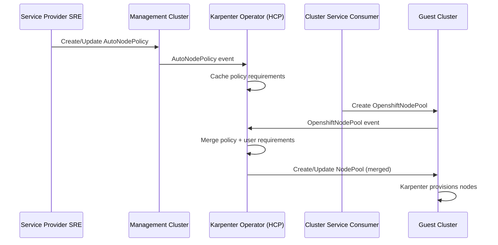

# AutoNode Policy

## Summary

This enhancement proposes a new CRD called `AutoNodePolicy` for HyperShift that
enables service providers (such as ROSA) to define default values and
restrictions for Karpenter-managed NodePools and NodeClasses. AutoNodePolicy
acts as a bridge between user-facing wrapper resources (`OpenshiftNodePool`
and platform-specific NodeClass wrappers like `OpenshiftEC2NodeClass` for AWS)
and the underlying Karpenter resources, allowing
service providers to enforce compliance requirements without explicitly
rejecting user configurations.

## Motivation

### Background

[Karpenter](https://karpenter.sh/) is a Kubernetes node autoscaler that
provisions just-in-time compute capacity for clusters. Unlike traditional
cluster autoscalers that work with predefined node groups, Karpenter directly
provisions nodes based on pending pod requirements, selecting optimal instance
types, availability zones, and other attributes dynamically.

Red Hat is integrating Karpenter as an alternative node management solution
called "AutoNode" for standalone HCP and managed services like ROSA and ARO. There is an existing enhancement proposal for this:
[AutoNode enhancement proposal](https://github.com/openshift/enhancements/pull/1758).

### Problem Statement

Karpenter allows users to create Karpenter NodePools and NodeClasses. These resources configure the worker nodes that Karpenter will auto-provision.
For example, users are able to restrict instance types, availability zones, as well as define other configurations on the resulting nodes such as expiration time and termination grace period through Karpenter NodePools.
NodeClasses on the other hand are used to configure platform-specific settings. For example for AWS and EC2, users can configure the instanceProfile, block device mappings, and other settings.
This large amount of flexibility causes some problems on a managed OpenShift service that may or may not support all possible cloud provider configurations that are possible with Karpenter.

1. **Insufficient Resources**: Small instance types like `t3.micro` cannot
   meet the resource requirements for running OpenShift worker nodes and will
   never successfully become ready nodes.

2. **Billing/Chargeback Issues**: Service providers like ROSA bill based on
   vCPUs, and certain instance types do not meet billing requirements. For
   example, `t3.medium` with 2 vCPUs cannot be used because billing is
   calculated in multiples of 4 vCPUs.

3. **Unsupported Configurations**: Service providers may and will choose to not
   support all possible Karpenter configurations. Examples include:
   - Subnets in Local Zones that are discovered by Karpenter but not supported
     by the service provider (e.g., ROSA does not support Local Zones)
   - Root volume configurations are restricted to specific supported types
     (e.g., only GP3 or IO1) with required volume sizes (e.g., only 75GiB)
   - Certain availability zones or regions that are not supported by the
     service provider

Without a mechanism to enforce these restrictions, Cluster Service Consumers can create
NodePools that reference unsupported configurations, leading to failed node
provisioning, unexpected costs, or clusters in unsupported states.

Karpenter is designed to be flexible for the user to configure exactly what types of nodes they need through custom sets of NodePools and NodeClass configurations.
However on a platform like ROSA, we need to be able to make sure that some of these settings are hidden from the user, or at least restricted to a supported set of configurations.
Until now, we've been able to use things such as ValidatingAdmissionPolicies and reflective wrapper CRDs (e.g., `OpenshiftEC2NodeClass` for AWS) to restrict the user from creating NodeClasses with unsupported configurations.
However, due to the flexibility and nature of the Karpenter API, it becomes clear that we need more for these validations.

### Instance Type Restrictions

The main use case here is preventing users from creating NodePools with instance
types that are unsupported by the service provider (e.g., ROSA does not support
`t3.micro`).

Simple approaches like ValidatingAdmissionPolicies or hiding API fields don't
work well here because of how flexible Karpenter's API is. Karpenter NodePools
use a `requirements` field with `NodeSelectorRequirement` objects. Each
requirement has a label key, an operator (`In`, `NotIn`, `Exists`, etc.), and
values. This allows users to build complex constraints.

For example, a NodePool restricting instances to the `m5` family:

```yaml
apiVersion: karpenter.sh/v1
kind: NodePool
metadata:
  name: default
spec:
  template:
    spec:
      requirements:
        - key: node.kubernetes.io/instance-type
          operator: In
          values: [m5.large, m5.xlarge, m5.2xlarge, m5.4xlarge]
```

Or combining capacity type, operating system, and availability zone:

```yaml
spec:
  template:
    spec:
      requirements:
        - key: karpenter.sh/capacity-type
          operator: In
          values: [spot]
        - key: kubernetes.io/os
          operator: In
          values: [windows]
        - key: topology.kubernetes.io/zone
          operator: In
          values: [us-east-1a]
```

With this flexibility, users can specify exactly what their workloads need.
We can't simply hide or restrict the `requirements` field without limiting an important and powerful feature of Karpenter.
The number of possible configurations is too large for static validation to cover.
Additionally, clusters in different regions may have different restrictions on allowed instance types. A hardcoded policy in the Karpenter Operator wouldn't be able to handle this variation.

### User Stories

#### Story 1: Service Provider Restricts Instance Types

As a ROSA SRE, I want to configure allowed instance types in the management
cluster so that Cluster Service Consumers can only provision worker nodes using instance types
that meet ROSA's minimum resource and billing requirements.

#### Story 2: Service Provider Updates Policies As requirements change

As a ROSA SRE, I want to update AutoNodePolicy configurations dynamically
(e.g., to add newly supported instance types or remove deprecated ones) so
that policy changes take effect across all hosted clusters as instance types are added or removed.

### Goals

1. Enable service providers to define defaults for specific NodePool and NodeClass fields.
   - NodePool requirements: instance types, capacity types, AZs, etc.
   - EC2NodeClass root volume configuration: volume type, size, encryption (AWS platform-specific)

2. Support dynamic policy updates without requiring downtime of the Hosted Cluster or Karpenter.

3. Allow each instance of a service provider to define their own custom policies per management cluster, or optionally per hosted cluster.

4. Protect underlying Karpenter resources (NodePool, NodeClass) defaults from being circumvented by the user.

### Non-Goals

1. This enhancement does not define the complete list of supported instance types or configurations for any specific service provider.

2. This enhancement does not propose to implement restrictions on Karpenter through validations/rejections from the OCM/ROSA API.

3. This enhancement does not propose to implement explicit validation/rejection of NodePools or NodeClasses at creation time.

## Proposal

Introduce a new CRD called `AutoNodePolicy` in the HyperShift management cluster that enables service providers to define default values and restrictions for a targeted subset of Karpenter NodePool and NodeClass fields.
The Karpenter operator running in each AutoNode-enabled hosted control plane reconciles AutoNodePolicy objects and applies the defined defaults to the underlying Karpenter resources.
It is proposed that this CRD be namespaced in the management cluster, one per HostedControlPlane namespace, such that each hosted cluster can have its own policy, if they so desire.

### Initial Scope

This enhancement initially targets the following fields:

1. **`Nodepool.spec.template.spec.requirements`**: Allows service providers to
   define instance type restrictions, availability zone constraints, capacity
   types, and other node requirements.

2. **Root volume configuration** (AWS HCP): Allows service providers to define the
   supported root volume settings (volume type, size, encryption). The
   `rootVolume` field in AutoNodePolicy is translated to the appropriate
   `blockDeviceMappings` in the underlying EC2NodeClass. Users cannot
   customize root volume configuration. Other platforms will have analogous
   platform-specific defaults.

> **Note**: The set of fields covered by
> AutoNodePolicy is subject to change as we gather feedback from service
> providers and users. Additional fields may be added in future iterations.
> Also note that ARO AutoNode is not currently under development, but this enhancement is designed for future platform support in mind.

### Core Capabilities

AutoNodePolicy enables service providers to:

1. **Define supported configurations**: Service providers specify which
   configurations are supported (instance types, volume settings, etc.).
   Configurations not explicitly supported by the service provider are not
   available to users.

2. **Enforce compliance through different mechanisms per field**:
   - **Requirements (NodePool)**: Policy requirements are merged with user
     requirements; Karpenter computes the intersection, restricting what
     instances can be provisioned.
   - **Root Volume (AWS EC2NodeClass)**: Policy settings fully replace user
     settings; users cannot customize root volume configuration. Other
     platforms will have analogous hidden fields.

3. **Update policies dynamically**: Changes to AutoNodePolicy propagate to
   all affected NodePools and NodeClasses without requiring user action.

### Key Components

1. **AutoNodePolicy CRD**: A namespaced resource in the management cluster
   with the well-known name `default` (one per HostedControlPlane namespace)
   that defines default node requirements using Karpenter's native
   `NodeSelectorRequirementWithMinValues` format.

2. **Wrapper Resources**: `OpenshiftNodePool` and platform-specific NodeClass
   wrappers (e.g., `OpenshiftEC2NodeClass` for AWS, `OpenshiftAzureNodeClass` for
   Azure) are user-facing resources in the guest cluster that wrap the upstream
   Karpenter `NodePool` and platform-specific NodeClass resources.

   > **Note**: `OpenshiftNodePool` does not exist in the codebase yet. There is
   > a [pending pull request](https://github.com/openshift/hypershift/pull/7481)
   > to introduce this wrapper resource, as it is needed
   > for other concerns beyond AutoNodePolicy enforcement (e.g., applying default
   > labels to all Karpenter-managed nodes). `OpenshiftEC2NodeClass` (AWS) already exists.

3. **Karpenter Operator**: Runs in each hosted control plane namespace,
   watches AutoNodePolicy in the management cluster, and reconciles wrapper
   resources into upstream Karpenter resources with policy requirements merged.
   The operator also maintains the AutoNodePolicy status.

4. **ValidatingAdmissionPolicy (VAP)**: Deployed in the guest cluster to
   prevent users from directly creating/modifying upstream Karpenter
   resources, ensuring all changes go through the wrapper resources.

### Enforcement Mechanism

AutoNodePolicy uses different enforcement mechanisms depending on the field:

#### NodePool Requirements (Intersection)

When reconciling an `OpenshiftNodePool`, the Karpenter operator:

1. Reads the applicable AutoNodePolicy from the management cluster
2. Prepends policy requirements to user-specified requirements
3. Creates/updates the underlying Karpenter `NodePool` with combined requirements

Karpenter's internal scheduler is designed to compute the **intersection** of all requirements.
This means:
- Policy defines the maximum allowed set (e.g., instance types A, B, C, D)
- User can further restrict within that set (e.g., only B, C)
- Result is the intersection (B, C)
- If user requests something outside policy (e.g., E), it's effectively ignored
  since no instances match both policy AND user requirements

This approach allows users flexibility to choose within supported configurations
while ensuring they cannot exceed service provider boundaries.

This mechanism also enables service providers to prevent provisioning in AWS
Local Zones. Local Zones are AWS edge locations (e.g., `us-east-1-bos-1a`) that
Karpenter may discover via subnet tags. By using `topology.kubernetes.io/zone`
requirements with an allowlist of only standard availability zones (e.g.,
`[us-east-1a, us-east-1b, us-east-1c]`), service providers effectively exclude
Local Zones without needing to maintain a denylist.

#### NodeClass Platform-Specific Fields (Hidden Fields)

For platform-specific NodeClass fields like root volume configuration, the
enforcement is simpler. Using AWS EC2NodeClass as an example:

1. Root volume settings are **not exposed** in the user-facing
   `OpenshiftEC2NodeClass` wrapper resource
2. Policy-defined `rootVolume` is translated to the appropriate
   `blockDeviceMappings` entry for `/dev/xvda` (the root device for RHCOS
   AMIs) in the underlying `EC2NodeClass`
3. Users have no ability to customize root volume configuration

This approach ensures service providers have complete control over storage
configurations (volume type, size, encryption) without any user override
capability. The field is hidden from users entirely via the facade wrapper
pattern.

#### Behavior When No AutoNodePolicy Exists

If no AutoNodePolicy named `default` exists in the HostedControlPlane namespace:

1. **OpenshiftNodePool**: Created normally with user-specified requirements
   passed through unmodified to the underlying NodePool
2. **Platform-specific NodeClass wrappers** (e.g., `OpenshiftEC2NodeClass` for
   AWS): Created with hardcoded defaults for hidden fields. For AWS:
   - Root volume: 75Gi gp3 encrypted (applied to `/dev/xvda`)

This ensures OpenshiftNodePool and NodeClass wrapper resources always function,
even without explicit policy configuration. Service providers who want
restrictions must create an AutoNodePolicy.

#### Behavior With Empty Requirements

If AutoNodePolicy exists but `nodePoolDefaults.requirements` is nil or empty,
this is interpreted as "allow everything" - user requirements pass through
unmodified. This allows service providers to define only platform-specific
NodeClass defaults without restricting instance types.

### Workflow Description

**Service Provider SRE** is a human operator responsible for managing the
HyperShift management cluster and defining service provider policies.

**Cluster Service Consumer** is a human user empowered to request control
planes, request workers, and drive upgrades or modify externalized configuration.

**Karpenter Operator** is the controller running in each hosted control plane
that manages AutoNode functionality.

#### Policy Creation Workflow

1. The Service Provider SRE creates an AutoNodePolicy resource in the
   HostedControlPlane namespace specifying allowed configurations:

   ```yaml
   apiVersion: karpenter.hypershift.openshift.io/v1beta1
   kind: AutoNodePolicy
   metadata:
     name: default  # Well-known name, must be "default"
     namespace: clusters-my-cluster  # HCP namespace
   spec:
     nodePoolDefaults:
       requirements:
         - key: node.kubernetes.io/instance-type
           operator: In
           values: [m5.large, m5.xlarge, m5.2xlarge, m5.4xlarge]
         # Allow only standard AZs, excluding Local Zones like us-east-1-bos-1a
         - key: topology.kubernetes.io/zone
           operator: In
           values: [us-east-1a, us-east-1b, us-east-1c]
         - key: kubernetes.io/arch
           operator: In
           values: [amd64]
     ec2NodeClassDefaults:
       rootVolume:
         volumeSize: 75Gi
         volumeType: gp3
         encrypted: true
   ```

2. The AutoNodePolicy is stored in the management cluster and the Karpenter
   operator begins enforcing it for that hosted cluster.

#### NodePool Creation Workflow

1. The Cluster Service Consumer creates an `OpenshiftNodePool` in the guest cluster:

   ```yaml
   apiVersion: karpenter.hypershift.openshift.io/v1beta1
   kind: OpenshiftNodePool
   metadata:
     name: my-nodepool
   spec:
     template:
       spec:
         requirements:
           - key: node.kubernetes.io/instance-type
             operator: In
             values: [m5.xlarge]
   ```

2. The Karpenter Operator reads the applicable AutoNodePolicy from the
   management cluster.

3. The Karpenter Operator creates/updates the upstream `NodePool` with policy
   requirements merged with user requirements.

4. Karpenter provisions nodes according to the combined requirements.

#### Policy Update Workflow

1. The Service Provider SRE updates an existing AutoNodePolicy (e.g., adds
   a new instance type `m6i.xlarge` to the allowlist).

2. The Karpenter Operator detects the policy change and re-reconciles all
   `OpenshiftNodePool` resources for that hosted cluster.

3. The updated requirements are applied to the underlying `NodePool` resources.



### API Extensions

This enhancement introduces a new CRD: `AutoNodePolicy`.

```go
// AutoNodePolicy defines service provider defaults and restrictions for
// Karpenter-managed NodePools and NodeClasses in a hosted cluster.
// The resource must be named "default" to be recognized by the Karpenter operator.
// +kubebuilder:object:root=true
// +kubebuilder:resource:path=autonodepolicies,scope=Namespaced
// +kubebuilder:subresource:status
type AutoNodePolicy struct {
    metav1.TypeMeta   `json:",inline"`
    metav1.ObjectMeta `json:"metadata,omitempty"`

    Spec   AutoNodePolicySpec   `json:"spec,omitempty"`
    Status AutoNodePolicyStatus `json:"status,omitempty"`
}

type AutoNodePolicyStatus struct {
    // Conditions contains the current state of the AutoNodePolicy.
    // +optional
    Conditions []metav1.Condition `json:"conditions,omitempty"`
}

// Condition types for AutoNodePolicy
const (
    // AutoNodePolicyConditionReady indicates whether the policy has been
    // successfully applied to all NodePools and NodeClasses.
    AutoNodePolicyConditionReady = "Ready"
)

type AutoNodePolicySpec struct {
    // NodePoolDefaults defines defaults applied to all NodePools.
    // +optional
    NodePoolDefaults NodePoolDefaults `json:"nodePoolDefaults,omitempty"`
    
    // EC2NodeClassDefaults defines defaults applied to all EC2NodeClasses (AWS).
    // Other platforms will have their own NodeClassDefaults fields
    // (e.g., AzureNodeClassDefaults for Azure).
    // +optional
    EC2NodeClassDefaults EC2NodeClassDefaults `json:"ec2NodeClassDefaults,omitempty"`
}

type NodePoolDefaults struct {
    // Requirements are Karpenter NodeSelectorRequirements that define
    // constraints on instance selection. Service providers use these to
    // restrict instance types, availability zones, architectures, etc.
    //
    // Common keys include:
    // - node.kubernetes.io/instance-type: EC2 instance types
    // - topology.kubernetes.io/zone: Availability zones (can also be used to
    //   prevent provisioning in AWS Local Zones by allowlisting only standard
    //   AZs, e.g., [us-east-1a, us-east-1b] excludes Local Zones like
    //   us-east-1-bos-1a)
    // - kubernetes.io/arch: CPU architecture (amd64, arm64)
    // - karpenter.sh/capacity-type: spot, on-demand
    //
    // +optional
    Requirements []NodeSelectorRequirementWithMinValues `json:"requirements,omitempty"`
}

type EC2NodeClassDefaults struct {
    // RootVolume defines the root volume configuration for worker nodes.
    // Service providers use this to enforce volume size, type, and
    // encryption settings. This is translated to the appropriate
    // blockDeviceMappings entry in the underlying EC2NodeClass.
    // +optional
    RootVolume *RootVolumeConfig `json:"rootVolume,omitempty"`
}

type RootVolumeConfig struct {
    // VolumeSize is the size of the root volume (e.g., "75Gi").
    // +optional
    VolumeSize *resource.Quantity `json:"volumeSize,omitempty"`
    
    // VolumeType is the EBS volume type (e.g., gp3, gp2, io1).
    // +optional
    VolumeType *string `json:"volumeType,omitempty"`
    
    // Encrypted indicates whether the volume should be encrypted.
    // +optional
    Encrypted *bool `json:"encrypted,omitempty"`
    
    // IOPS is the number of I/O operations per second (for io1/io2/gp3).
    // +optional
    IOPS *int64 `json:"iops,omitempty"`
    
    // Throughput is the throughput in MiB/s (for gp3 volumes).
    // +optional
    Throughput *int64 `json:"throughput,omitempty"`
}

// NodeSelectorRequirementWithMinValues is Karpenter's extension of
// core NodeSelectorRequirement with optional MinValues for flexible
// instance selection.
type NodeSelectorRequirementWithMinValues struct {
    // Key is the label key that the selector applies to.
    Key string `json:"key"`
    
    // Operator represents a key's relationship to a set of values.
    // Valid operators are In, NotIn, Exists, DoesNotExist, Gt, and Lt.
    Operator corev1.NodeSelectorOperator `json:"operator"`
    
    // Values is an array of string values corresponding to the key.
    // +optional
    Values []string `json:"values,omitempty"`
    
    // MinValues indicates the minimum number of unique values required
    // to be scheduled for this key.
    // +optional
    MinValues *int `json:"minValues,omitempty"`
}
```

> **Note**: The fields covered by AutoNodePolicy (`nodePoolDefaults.requirements`
> and `ec2NodeClassDefaults.rootVolume`) represent the initial scope for AWS.
> Other platforms (Azure, etc.) will have analogous platform-specific defaults
> fields added as support is implemented. Additional fields may be added as the
> feature evolves based on service provider feedback.

**Design Rationale:**

Using Karpenter's native `NodeSelectorRequirementWithMinValues` type directly
(rather than a custom allowlist/denylist structure) provides several benefits:

1. **Flexibility**: Supports any label key Karpenter understands, not just
   instance types and AZs
2. **Familiarity**: Users and operators familiar with Karpenter understand this
   format
3. **Forward Compatibility**: New Karpenter features using requirements work
   automatically
4. **Simplicity**: No translation layer needed between policy and NodePool specs

### Resource Protection via ValidatingAdmissionPolicy

To prevent users from bypassing `OpenshiftNodePool` and directly
manipulating upstream Karpenter resources, the operator deploys
ValidatingAdmissionPolicy resources in the guest cluster:

```yaml
apiVersion: admissionregistration.k8s.io/v1
kind: ValidatingAdmissionPolicy
metadata:
  name: karpenter.nodepool.hypershift.io
spec:
  matchConstraints:
    resourceRules:
      - apiGroups: ["karpenter.sh"]
        apiVersions: ["v1"]
        resources: ["nodepools"]
        operations: ["CREATE", "UPDATE", "DELETE"]
  matchConditions:
    - name: exclude-hcco-user
      expression: "'system:hosted-cluster-config' != request.userInfo.username"
  validations:
    - expression: "false"
      message: "NodePool resources cannot be modified directly. Use OpenshiftNodePool instead."
---
apiVersion: admissionregistration.k8s.io/v1
kind: ValidatingAdmissionPolicyBinding
metadata:
  name: karpenter-binding.nodepool.hypershift.io
spec:
  policyName: karpenter.nodepool.hypershift.io
  validationActions: [Deny]
```

Similar VAPs are deployed for platform-specific NodeClass resources (e.g.,
`EC2NodeClass` for AWS).

### Topology Considerations

#### Hypershift / Hosted Control Planes

This feature is specifically designed for HyperShift environments. The
AutoNodePolicy CRD lives in the management cluster (namespaced per
HostedControlPlane) and is reconciled by the Karpenter operator running in
each hosted control plane namespace.

Key considerations:
- The Karpenter operator needs read and update access to AutoNodePolicy
  resources in its HostedControlPlane namespace (read for spec, update for status)
- Only AutoNodePolicy named `default` is recognized; other names are ignored
- Policy enforcement happens via requirement merging in the hosted control
  plane, not admission rejection
- Cluster Service Consumers cannot see or modify AutoNodePolicy resources as
  they exist only in the management cluster
- Cluster Service Consumers interact with `OpenshiftNodePool` and
  platform-specific NodeClass wrappers (e.g., `OpenshiftEC2NodeClass` for AWS)
  in the guest cluster

#### Standalone Clusters

This enhancement is not applicable to standalone OpenShift clusters. AutoNodePolicy
relies on the management/guest cluster separation that only exists in HyperShift
environments. In standalone clusters, administrators have full control over
Karpenter NodePool and NodeClass configurations directly.

#### Single-node Deployments or MicroShift

This enhancement is not applicable to single-node deployments or MicroShift.
These environments do not use Karpenter for node provisioning.

#### OpenShift Kubernetes Engine

This enhancement is not applicable to OpenShift Kubernetes Engine (OKE). OKE does
not include the HyperShift components required for AutoNodePolicy enforcement.

### Implementation Details/Notes/Constraints

1. **CRD Definition**: The AutoNodePolicy CRD is defined in
   `openshift/hypershift` under the `karpenter.hypershift.openshift.io/v1beta1`
   API group. The CRD is installed in the management cluster as part of the
   HyperShift operator installation.

2. **Feature Gate**: This feature is gated behind the existing `AutoNode`
   (Karpenter) feature gate. When AutoNode is enabled, AutoNodePolicy
   enforcement is automatically enabled.

3. **Karpenter Operator Implementation**:
   - Both `NodePoolReconciler` and platform-specific NodeClass reconcilers
     (e.g., `EC2NodeClassReconciler` for AWS) watch `AutoNodePolicy` resources
     in the management cluster via `WatchesRawSource` with a namespace-filtered
     predicate
   - On reconcile, each controller calls `getAutoNodePolicy()` to fetch the
     applicable policy
   - For NodePools: policy requirements are prepended to user requirements
     (Karpenter's scheduler computes the intersection)
   - For NodeClasses: platform-specific defaults (e.g., AWS root volume) are
     applied and **fully replace** any user-specified settings. Users cannot
     customize these fields; the service provider defines the supported
     configuration.
   - Changes to AutoNodePolicy trigger re-reconciliation of all
     `OpenshiftNodePool` and NodeClass wrapper resources

4. **RBAC Configuration**: The Karpenter operator service account in each
   hosted control plane namespace needs read access to AutoNodePolicy spec
   and update access to AutoNodePolicy status. This is configured via the
   HyperShift operator when creating the Karpenter operator Role:

   ```yaml
   - apiGroups: ["karpenter.hypershift.openshift.io"]
     resources: ["autonodepolicies"]
     verbs: ["get", "list", "watch"]
   - apiGroups: ["karpenter.hypershift.openshift.io"]
     resources: ["autonodepolicies/status"]
     verbs: ["update", "patch"]
   ```

5. **Orphan Cleanup**: If an `OpenshiftNodePool` is deleted but the underlying
   `NodePool` remains (e.g., due to a bug or manual intervention), the
   reconciler detects orphaned `NodePool` resources and deletes them.

6. **Policy Scope**: A single AutoNodePolicy named `default` applies to **all**
   `OpenshiftNodePool` and platform-specific NodeClass wrapper resources in
   the hosted cluster. There is no support for targeting specific resources
   via selectors.

7. **Policy Deletion Behavior**: If the AutoNodePolicy is deleted, the Karpenter
   operator re-reconciles all `OpenshiftNodePool` and NodeClass wrapper
   resources to remove policy restrictions:
   - NodePool requirements revert to only user-specified requirements
   - Platform-specific NodeClass fields revert to hardcoded defaults (e.g., for
     AWS: 75Gi gp3 encrypted root volume for `/dev/xvda`)

   > **Warning**: Service provider administrators should exercise caution when
   > modifying or deleting AutoNodePolicy. Policy changes can cause
   > configuration drift between existing nodes and newly provisioned nodes.
   > For example, if a policy previously restricted instance types to `m5.*`
   > and is then deleted, new nodes may be provisioned with different instance
   > types while existing `m5.*` nodes continue running. This drift may have
   > implications for workload consistency, billing, and cluster management.

8. **Status Management**: The Karpenter operator sets the AutoNodePolicy status:
   - `Ready` condition is `True` when the policy has been successfully merged
     into all NodePools and applied to all NodeClass resources
   - `Ready` condition is `False` with a reason if any reconciliation fails

### Risks and Mitigations

**Risk**: Users may be confused about why nodes aren't provisioning.

**Mitigation**: 
- NodePool status conditions indicate scheduling constraints
- Karpenter events and status conditions show why nodes cannot be provisioned
- Documentation should explain the policy enforcement model

**Risk**: Users may attempt to bypass OpenshiftNodePool by directly creating
NodePool resources.

**Mitigation**: ValidatingAdmissionPolicy prevents direct modification of
upstream Karpenter resources. Only the `system:hosted-cluster-config` service
account (used by the Karpenter operator) can manage these resources.

### Drawbacks

1. **Complexity**: This adds another layer of configuration that service
   provider operators must understand and manage correctly.

2. **Indirect Enforcement**: Invalid configurations are accepted at creation
   time but result in no nodes provisioning. This may be less intuitive than
   immediate rejection.

## Alternatives (Not Implemented)

### Alternative 1: Restrict Creation to OCM/ROSA API

Only allow NodePool and NodeClass creation through the OCM or ROSA API, with
validation performed at the service API layer.

**Why not chosen**: Users would no longer interact directly with Karpenter resources in their cluster. This would
degrade the user experience and limit flexibility, as users couldn't leverage
Karpenter's full API capabilities or use familiar Kubernetes tooling (kubectl,
GitOps, etc.) to manage their node configurations.

### Alternative 2: Hardcoded Defaults in Karpenter Operator

Hardcode the allowed configurations directly in the Karpenter operator for
each service provider.

**Why not chosen**: Different service providers need different configurations,
and policies need to be updatable without operator upgrades.

### Alternative 3: Custom Allowlist/Denylist API

Define a custom API with explicit `allowed` and `denied` fields for each
constraint type (instance types, AZs, etc.).

**Why not chosen**: 
- Less flexible than using Karpenter's native requirements format
- Requires translation logic between policy and NodePool specs
- Doesn't support advanced Karpenter features like `MinValues`

## Open Questions [optional]

~~1. Should AutoNodePolicy be cluster-scoped or namespaced in the management
   cluster?~~

**Resolved**: AutoNodePolicy is **namespaced** (one per HCP namespace) with a
well-known name `default`. This allows per-cluster policies while keeping the
design simple. Service providers can create identical policies across namespaces
if they want consistent behavior.

~~2. How should policy conflicts be resolved if multiple AutoNodePolicy
   resources apply to the same hosted cluster?~~

**Resolved**: Only one AutoNodePolicy is recognized per namespace - it must be
named `default`. Any other AutoNodePolicy resources are ignored. This eliminates
the need for conflict resolution logic.

## Test Plan

Tests are labeled per `dev-guide/feature-zero-to-hero.md`:
- Feature gate: `[OCPFeatureGate:AutoNode]` (part of broader AutoNode feature)
- Jira component: `[Jira:"AUTOSCALE"]`

### E2E Tests

All tests will reside in the HyperShift repo under the `test/e2e/karpenter_test.go` file.

1. **Basic Policy Enforcement**:
   - Create AutoNodePolicy with instance type restrictions
   - Create OpenshiftNodePool requesting allowed instance type
   - Verify NodePool is created with merged requirements
   - Verify nodes provision successfully

2. **Policy Restriction**:
   - Create AutoNodePolicy allowing instance types A, B, C
   - Create OpenshiftNodePool requesting instance types B, D
   - Verify resulting NodePool only provisions type B

3. **Conflicting Requirements**:
   - Create AutoNodePolicy allowing only instance type A
   - Create OpenshiftNodePool requesting only instance type B
   - Verify NodePool status indicates no compatible instances

4. **VAP Protection**:
   - Attempt to create NodePool directly (not via OpenshiftNodePool)
   - Verify request is denied by VAP

5. **Policy Update Propagation**:
   - Create AutoNodePolicy and OpenshiftNodePool
   - Update AutoNodePolicy with new requirements
   - Verify NodePool is updated with new merged requirements

6. **NodeClass Root Volume Policy (AWS)**:
   - Create AutoNodePolicy with rootVolume (e.g., 75Gi gp3 encrypted)
   - Verify resulting EC2NodeClass has correct blockDeviceMappings for `/dev/xvda`
   - Note: Root volume settings are hidden from users via the OpenshiftEC2NodeClass facade wrapper

7. **No AutoNodePolicy (Permissive Mode)**:
   - Create OpenshiftNodePool without any AutoNodePolicy in the namespace
   - Verify NodePool is created with user requirements passed through unmodified
   - Verify NodeClass has hardcoded platform-specific defaults (e.g., AWS: 75Gi gp3 encrypted root volume)

8. **Empty Requirements (Allow Everything)**:
   - Create AutoNodePolicy with empty `nodePoolDefaults.requirements`
   - Create OpenshiftNodePool with user requirements
   - Verify NodePool is created with only user requirements (no policy merge)

9. **Policy Deletion**:
   - Create AutoNodePolicy with instance type restrictions
   - Create OpenshiftNodePool and verify merged requirements
   - Delete AutoNodePolicy
   - Verify NodePool is re-reconciled with only user requirements
   - Verify NodeClass reverts to hardcoded platform-specific defaults

10. **AutoNodePolicy Status**:
    - Create AutoNodePolicy and OpenshiftNodePool
    - Verify AutoNodePolicy status shows `Ready=True` condition
    - Introduce a reconciliation failure scenario
    - Verify AutoNodePolicy status shows `Ready=False` with appropriate reason

11. **Well-Known Name Enforcement**:
    - Create AutoNodePolicy with name other than `default`
    - Verify it is ignored (OpenshiftNodePool uses permissive mode)

## Graduation Criteria

This feature will graduate alongside the AutoNode feature.

### Dev Preview -> Tech Preview

This feature will graduate along side the AutoNode feature.

### Tech Preview -> GA

This feature will graduate along side the AutoNode feature.

### Removing a deprecated feature

N/A - This is a new feature with no deprecated predecessors.

## Upgrade / Downgrade Strategy

AutoNodePolicy is part of the AutoNode (Karpenter) feature set and follows its
upgrade/downgrade strategy:

- **Upgrade**: When HyperShift is upgraded, the AutoNodePolicy CRD is installed
  or updated in the management cluster. Existing hosted clusters continue to
  function; AutoNodePolicy enforcement begins when a `default` policy is created.

- **Downgrade**: If HyperShift is downgraded to a version without AutoNodePolicy
  support, the CRD remains but is no longer reconciled. Existing Karpenter
  resources continue to function with their last-applied configuration.

## Version Skew Strategy

AutoNodePolicy is reconciled by the Karpenter operator running in each hosted
control plane namespace. Version skew considerations:

- **Management cluster vs HCP**: The AutoNodePolicy CRD version in the management
  cluster must be compatible with the Karpenter operator version in the HCP.
  HyperShift ensures this through coordinated upgrades.

- **Multiple HCPs at different versions**: Each HCP's Karpenter operator reads
  AutoNodePolicy from the management cluster independently. If an older operator
  doesn't understand newer policy fields, it ignores them (standard Kubernetes
  API behavior).

## Operational Aspects of API Extensions

AutoNodePolicy is a namespaced resource in the management cluster that affects
Karpenter behavior in hosted clusters.

- **Failure Modes**:
  - If AutoNodePolicy is invalid or has conflicting requirements, the Karpenter
    operator sets `Ready=False` condition with a descriptive reason
  - If the operator cannot read AutoNodePolicy (RBAC issues), NodePools fall back
    to permissive mode with hardcoded defaults

- **Monitoring**:
  - The `Ready` condition on AutoNodePolicy indicates successful policy application
  - Standard Karpenter metrics and NodePool status conditions show provisioning issues

- **Recovery**:
  - Fix or delete the malformed AutoNodePolicy; the operator will re-reconcile
  - If policy is deleted, NodePools revert to user-specified requirements only

## Support Procedures

### Debugging AutoNodePolicy Issues

1. **Policy not being applied**:
   - Verify AutoNodePolicy is named `default` in the correct HCP namespace
   - Check AutoNodePolicy status for `Ready` condition
   - Review Karpenter operator logs for reconciliation errors

2. **Nodes not provisioning**:
   - Check NodePool status conditions for requirement conflicts
   - Verify policy requirements don't conflict with user requirements
   - Review Karpenter controller logs for scheduling failures

3. **Policy updates not propagating**:
   - Verify AutoNodePolicy was successfully updated
   - Check that Karpenter operator detected the change (watch events)
   - Review NodePool resources to confirm requirements were updated