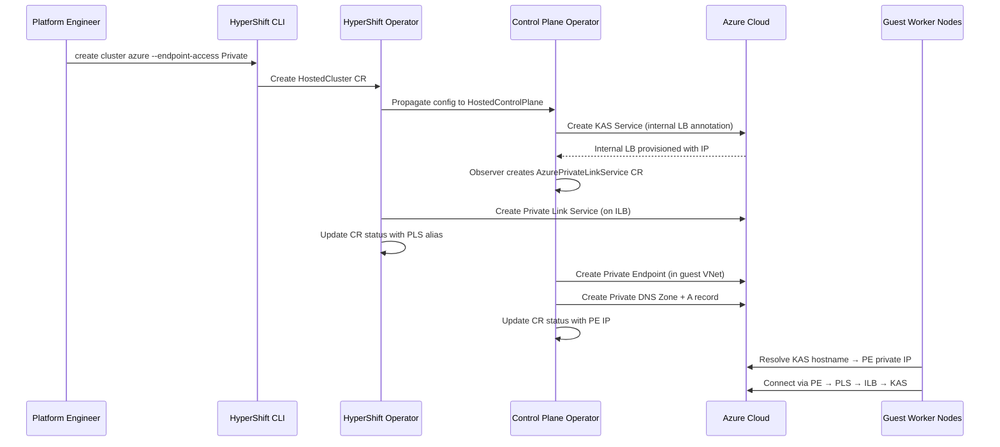
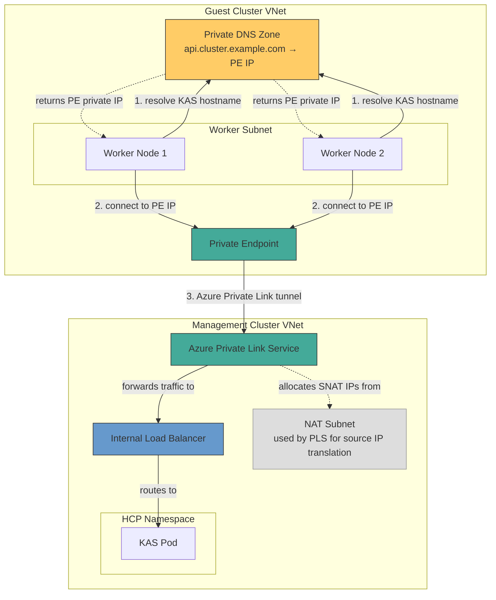
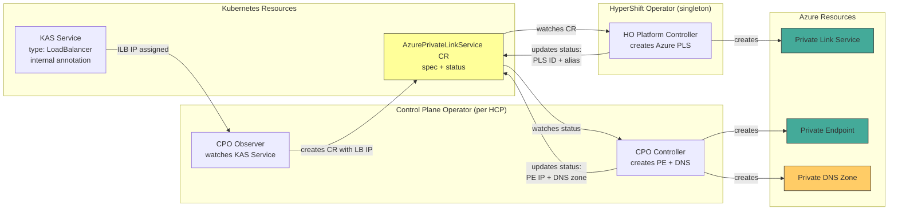

# Azure Private Topology for Self-Managed HyperShift

## Summary

This enhancement adds private endpoint access support to self-managed Azure
HyperShift clusters using Azure Private Link Service (PLS). Currently,
self-managed Azure clusters only support public endpoint access. This proposal
delivers three endpoint access modes — Public (default), PublicAndPrivate, and
Private — mirroring the private topology support already available on AWS
(via VPC PrivateLink) and GCP (via Private Service Connect).

## Motivation

Enterprise customers running self-managed Azure HyperShift require private
network connectivity to hosted control plane endpoints for security and
compliance. Today, the kube-apiserver (KAS) is exposed only via a public
load balancer, which does not meet the requirements of organizations that
prohibit public endpoint exposure. Azure is the only HyperShift platform
without an `EndpointAccess` configuration — AWS and GCP both support
`Public`, `PublicAndPrivate`, and `Private` modes.

### User Stories

#### Story 1: Security-Conscious Enterprise Customer

As a platform engineer at an enterprise with strict network security policies,
I want to deploy hosted clusters where the API server is accessible only via
Azure Private Link, so that no control plane endpoints are exposed to the
public internet.

#### Story 2: Hybrid Connectivity Deployment

As a platform engineer managing a transition from public to private
infrastructure, I want to deploy hosted clusters with both public and private
endpoints (PublicAndPrivate mode), so that existing integrations can continue
using the public endpoint while new workloads connect privately.

#### Story 3: Operations Team Monitoring Private Clusters

As an operations team member, I want to monitor the health of the Private Link
Service infrastructure (PLS, Private Endpoint, DNS) through standard
Kubernetes conditions on a custom resource, so that I can identify connectivity
issues without accessing the Azure portal.

#### Story 4: CLI-Driven Private Cluster Creation

As a platform engineer, I want to create a private Azure hosted cluster using
the HyperShift CLI with simple flags (`--endpoint-access Private`), so that I
don't have to manually configure Azure networking resources.

### Goals

1. Support three endpoint access modes for self-managed Azure: Public
   (default), PublicAndPrivate, and Private, matching AWS and GCP parity.

2. Automate Azure Private Link Service lifecycle through HyperShift
   controllers, following the same split-controller pattern used by AWS
   (AWSEndpointService) and GCP (GCPPrivateServiceConnect).

3. Provide CLI flags for configuring private topology at cluster creation time.

4. Design the API to accommodate future enhancements (e.g., dedicated OAuth
   private load balancer) without breaking changes.

### Non-Goals

1. ARO HCP (managed Azure) support — ARO HCP has its own private connectivity
   implementation via Azure Private Link Service (Swift). This enhancement only
   targets self-managed Azure.

2. Dedicated OAuth private load balancer — the API is designed to accommodate
   this in the future via the `privateConnectivity` struct, but it is not
   implemented in this enhancement.

3. Bring-your-own Private Endpoint (BYOPE) — customers creating their own
   Private Endpoints outside of HyperShift management is a future enhancement.

4. Customer-managed Private DNS Zones — DNS zones are created and managed by
   the controllers.

## Proposal

This enhancement extends self-managed Azure HyperShift with private topology
support by adding:

1. **API fields** on `AzurePlatformSpec` for `endpointAccess` and
   `privateConnectivity` configuration
2. **A new CRD** (`AzurePrivateLinkService`) that coordinates private
   connectivity lifecycle between controllers
3. **Three controllers** following the established AWS/GCP split pattern:
   - CPO Observer: watches the KAS internal load balancer
   - HO Platform Controller: creates the Azure PLS (management-side)
   - CPO Controller: creates the Private Endpoint and DNS (customer-side)
4. **CLI flags** on `hypershift create cluster azure` for endpoint access
   configuration

The design decouples visibility (`endpointAccess`) from the connectivity
mechanism (`privateConnectivity`), allowing future extension for OAuth-specific
private connectivity without API restructuring.

### Workflow Description

**Platform engineer** is a human user responsible for deploying hosted clusters.

**HyperShift Operator (HO)** is the management-cluster controller managing
HostedCluster lifecycle.

**Control Plane Operator (CPO)** is the per-HCP controller managing control
plane components.

1. The platform engineer creates a hosted cluster with private endpoint access:
   ```bash
   hypershift create cluster azure \
     --name my-private-cluster \
     --endpoint-access Private \
     --private-connectivity-nat-subnet-id /subscriptions/.../subnets/pls-nat \
     --private-connectivity-allowed-subscriptions <subscription-id> \
     # ... other required flags
   ```

2. The HyperShift Operator reconciles the HostedCluster and propagates
   `endpointAccess` and `privateConnectivity` to the HostedControlPlane spec.

3. The CPO annotates the KAS Service with
   `service.beta.kubernetes.io/azure-load-balancer-internal: "true"`, causing
   Azure to provision an internal load balancer instead of a public one.

4. The CPO Observer detects the internal LB IP on the KAS Service and creates
   an `AzurePrivateLinkService` CR in the HCP namespace, populating it with
   the LB IP and private connectivity configuration from the HCP spec.

5. The HO Platform Controller sees the new `AzurePrivateLinkService` CR,
   authenticates to Azure using the `PrivateLinkService` workload identity,
   looks up the internal LB, and creates an Azure Private Link Service
   attached to the LB's frontend IP configuration. It updates the CR status
   with the PLS resource ID and alias.

6. The CPO Controller sees the PLS alias in the CR status and creates:
   - A Private Endpoint in the guest VNet targeting the PLS
   - A Private DNS Zone with an A record mapping the KAS hostname to the PE's
     private IP
   It updates the CR status with the PE and DNS resource IDs.

7. Guest cluster worker nodes resolve the KAS hostname to the Private
   Endpoint's private IP and communicate with the control plane via:
   `Worker → PE → PLS → Internal LB → KAS pod`

8. The platform engineer monitors the `AzurePrivateLinkService` CR conditions
   to track lifecycle progress:
   ```bash
   kubectl get azpls -A
   ```



#### Error Handling

If any Azure resource creation fails:
- The corresponding condition on the `AzurePrivateLinkService` CR is set to
  `False` with the error reason and message
- The controller retries with exponential backoff
- Downstream controllers wait for upstream conditions to be met before
  proceeding (e.g., CPO Controller waits for PLS alias before creating PE)

#### Deletion

When the HostedCluster is deleted:
- The `AzurePrivateLinkService` CR is garbage collected via owner references
  to the HostedControlPlane
- Each controller uses finalizers to clean up its Azure resources in reverse
  order: DNS → PE → PLS
- The internal LB is cleaned up automatically when the KAS Service is deleted

### API Extensions

This enhancement introduces the following API changes:

#### New fields on AzurePlatformSpec

Two new immutable fields on `AzurePlatformSpec` in the `hypershift.openshift.io`
API group:

- `endpointAccess` (`AzureEndpointAccessType`): Controls visibility of the
  KAS endpoint. Enum: `Public` (default), `PublicAndPrivate`, `Private`.
  Immutable after creation.

- `privateConnectivity` (`*AzurePrivateConnectivityConfig`): Configures Azure
  Private Link Service parameters. Required when `endpointAccess` is not
  `Public`. Contains `natSubnetID` (subnet for PLS NAT) and
  `allowedSubscriptions` (subscription IDs permitted to create PEs). Immutable
  after creation.

CEL validation ensures `privateConnectivity` is required when
`endpointAccess != Public`.

#### New field on AzureWorkloadIdentities

- `privateLinkService` (`*WorkloadIdentity`): Client ID of a federated managed
  identity used by the HyperShift Operator to manage Azure PLS resources.
  Scoped to the management cluster's resource group. Optional — only required
  when `endpointAccess` is not `Public`.

#### New CRD: AzurePrivateLinkService

A namespaced custom resource in the `hypershift.openshift.io` API group:

- **Spec fields**: `loadBalancerIP`, `subscriptionID`, `resourceGroupName`,
  `location`, `natSubnetID`, `allowedSubscriptions`, `guestSubnetID`,
  `guestVNetID`
- **Status fields**: `conditions`, `internalLoadBalancerID`,
  `privateLinkServiceID`, `privateLinkServiceAlias`, `privateEndpointID`,
  `privateEndpointIP`, `privateDNSZoneID`
- **Conditions**: `AzureInternalLoadBalancerAvailable`,
  `AzurePLSCreated`, `AzurePrivateEndpointAvailable`,
  `AzurePrivateDNSAvailable`, `AzurePrivateLinkServiceAvailable`

This CRD follows the same coordination pattern as `AWSEndpointService` and
`GCPPrivateServiceConnect`.

### Topology Considerations

#### Hypershift / Hosted Control Planes

This enhancement is specifically designed for the HyperShift topology. It
affects:

- **Management cluster**: The HO platform controller runs here and creates
  Azure PLS resources in the management cluster's VNet. A new workload
  identity must be provisioned for the HO pod.
- **HCP namespace**: The CPO observer and controller run here, creating the
  `AzurePrivateLinkService` CR and customer-side Azure resources (PE, DNS).
- **Guest cluster**: Worker nodes use Private DNS to resolve the KAS hostname
  to the PE private IP. No changes to guest cluster components.

The existing ARO HCP code paths are not modified. The private topology
controllers are only registered when the platform is Azure and `IsPrivateHCP()`
returns true, which only matches self-managed Azure clusters with non-Public
endpoint access.

#### Standalone Clusters

Not applicable. This enhancement is specific to the HyperShift topology.

#### Single-node Deployments or MicroShift

Not applicable. This enhancement does not affect SNO or MicroShift
deployments.

#### OpenShift Kubernetes Engine

Not applicable. OKE does not support HyperShift hosted control planes.

### Implementation Details/Notes/Constraints

#### Architecture Overview

The following diagram shows the Azure networking architecture for a private
hosted cluster. The management cluster VNet contains the internal load
balancer and Private Link Service. The guest VNet contains the Private
Endpoint and worker nodes. Private DNS resolves the KAS hostname to the PE's
private IP.

The **data flow** direction is: Worker → PE → PLS → ILB → KAS. The NAT
subnet is not a hop in the data path — it is a subnet from which Azure PLS
allocates source IPs for SNAT. When traffic arrives from a PE, Azure rewrites
the source IP to one from the NAT subnet range before forwarding to the ILB,
hiding the PE's original IP from the backend.



The following diagram shows the controller coordination pattern. Three
controllers interact via the `AzurePrivateLinkService` CRD to manage the
lifecycle of Azure resources:



#### Controller Architecture

The implementation follows the established split-controller pattern used by
AWS and GCP:

| Component | Location | Watches | Creates (Azure) | Auth |
| --------- | -------- | ------- | --------------- | ---- |
| CPO Observer | `control-plane-operator/controllers/azureprivatelinkservice/observer.go` | KAS Service | AzurePrivateLinkService CR | N/A (K8s only) |
| HO Platform Controller | `hypershift-operator/controllers/platform/azure/controller.go` | AzurePrivateLinkService CR | Private Link Service | PrivateLinkService workload identity |
| CPO Controller | `control-plane-operator/controllers/azureprivatelinkservice/controller.go` | AzurePrivateLinkService CR | Private Endpoint + DNS | Existing CPO workload identity |

This split provides least-privilege security:
- The HO identity can only create PLS in the management cluster's resource
  group
- The CPO identity can only create PE and DNS in the guest subscription
- If either credential is compromised, the blast radius is contained

#### Comparison to AWS and GCP

| Aspect | AWS | GCP | Azure (this EP) |
| ------ | --- | --- | --------------- |
| CRD | AWSEndpointService | GCPPrivateServiceConnect | AzurePrivateLinkService |
| Management-side resource | VPC Endpoint Service | Service Attachment | Private Link Service |
| Customer-side resource | VPC Endpoint + SG | PSC Endpoint (Forwarding Rule) | Private Endpoint |
| DNS | Route53 Private Zone | Cloud DNS | Private DNS Zone |
| HO creates | VPC Endpoint Service | Service Attachment | PLS |
| CPO creates | VPC Endpoint + SG + DNS | PSC Endpoint + IP + DNS | PE + DNS |

#### API Design: privateConnectivity Wrapper

The `privateConnectivity` struct wraps PLS-specific configuration rather than
placing fields directly on `AzurePlatformSpec`. This enables future extension
for a dedicated OAuth private load balancer — additional fields can be added
to `AzurePrivateConnectivityConfig` without restructuring the API:

```go
type AzurePrivateConnectivityConfig struct {
    NATSubnetID          string   `json:"natSubnetID"`
    AllowedSubscriptions []string `json:"allowedSubscriptions"`
    // Future: OAuthLoadBalancer *AzureOAuthLBConfig `json:"oauthLoadBalancer,omitempty"`
}
```

#### KAS Internal Load Balancer

When `endpointAccess` is `Private`, the KAS Service is annotated with
`service.beta.kubernetes.io/azure-load-balancer-internal: "true"`. Azure's
cloud provider creates an internal LB instead of a public one.

When `endpointAccess` is `PublicAndPrivate`, both a public and private
endpoint are needed. The implementation follows the same pattern as AWS
`PublicAndPrivate`, where a separate private service is created alongside the
public KAS service.

#### NAT Subnet Requirements

The PLS NAT subnet must:
- Exist in the management cluster's VNet
- Have `privateLinkServiceNetworkPolicies` set to `Disabled`
- Be dedicated to PLS NAT (not shared with other workloads)

The customer provides this subnet ID via the `--private-connectivity-nat-subnet-id`
CLI flag or the `privateConnectivity.natSubnetID` API field.

### Risks and Mitigations

**Risk**: Azure PLS has a limit of 1000 PLS resources per subscription and
region.

**Mitigation**: This is sufficient for most self-managed deployments. Document
the limit and recommend separate subscriptions for very large deployments.

---

**Risk**: The HO workload identity has network-level access to the management
cluster's VNet.

**Mitigation**: The identity is scoped to Network Contributor on the management
resource group only. The CPO identity is separately scoped to the guest
subscription. This follows the same least-privilege pattern as AWS/GCP.

---

**Risk**: NAT subnet misconfiguration (e.g., `privateLinkServiceNetworkPolicies`
not disabled) will cause PLS creation to fail.

**Mitigation**: The controller reports clear error conditions on the
`AzurePrivateLinkService` CR. CLI validation can check subnet configuration
before cluster creation. Documentation covers subnet requirements.

---

**Risk**: Breaking existing ARO HCP code paths.

**Mitigation**: All new controllers are gated on `IsPrivateHCP()` which only
returns true for self-managed Azure with non-Public endpoint access. ARO HCP
uses Swift for private connectivity and is unaffected by these changes.

### Drawbacks

1. **Additional Azure SDK surface**: The controllers introduce new Azure SDK
   dependencies (armnetwork, armprivatedns). This increases the vendor
   footprint and the surface area for Azure API breaking changes.

2. **New workload identity requirement**: Customers creating private clusters
   must provision an additional federated managed identity for the HO. This
   adds complexity to the infrastructure prerequisites.

3. **New CRD**: The `AzurePrivateLinkService` CRD adds one more resource type
   to the HyperShift API surface. However, this follows the established
   pattern (AWS has `AWSEndpointService`, GCP has `GCPPrivateServiceConnect`).

## Alternatives (Not Implemented)

### Alternative 1: Flat Topology Enum (Option A)

Instead of decoupling `endpointAccess` from `privateConnectivity`, define all
permutations as a single enum:

```go
// Example: publicAndPrivateLink, privateLinkAndOAuth, etc.
EndpointTopology AzureEndpointTopology
```

**Rejected because**: Combinatorial explosion as features are added (OAuth LB,
shared ingress, Swift permutations). The decoupled approach chosen by this
enhancement — separating `endpointAccess` (visibility) from
`privateConnectivity` (mechanism) — is more composable and maintainable.
New connectivity methods can be added without creating new topology enum values
for every combination.

### Alternative 2: CPO-Only Controllers (No HO Involvement)

Since the CPO already has Azure credentials, it could create both the PLS
(management-side) and PE (customer-side), eliminating the need for a new HO
workload identity.

**Rejected because**: This violates least-privilege. The CPO identity would need
access to both management and guest Azure resources. The split HO/CPO pattern
provides defense in depth and is consistent with AWS/GCP.

### Alternative 3: CLI-Driven Resource Creation

Instead of controllers creating Azure resources, the CLI or customer would
create PLS, PE, and DNS manually or via `hypershift create infra azure`.

**Rejected because**: AWS and GCP both use controller-driven resource creation
for private connectivity. Controller-driven creation is declarative — the user
sets `endpointAccess: Private` and the controllers handle the lifecycle of all
cloud resources, including cleanup on deletion. CLI-driven creation requires
the user to manually sequence resource creation (wait for ILB, then create PLS,
then create PE, then create DNS) and manually clean up resources on cluster
teardown, which is error-prone and inconsistent with the existing platforms.

## Open Questions [optional]

1. **PublicAndPrivate dual-service pattern**: The exact mechanism for creating
   both a public and private KAS endpoint needs to be verified against the AWS
   `PublicAndPrivate` implementation. AWS creates a separate private router
   service — Azure may need the same or can use dual-stack annotations.

2. **PE subnet**: The current design places the PE in the guest VNet's subnet
   (same as worker nodes). Some deployments may want the PE in a dedicated
   subnet. This can be addressed in a follow-up by adding an optional
   `privateEndpointSubnetID` to `AzurePrivateConnectivityConfig`.

3. **Cross-cloud management cluster**: The parent self-managed Azure EP states
   the management cluster can run on Azure or AWS. Private topology requires
   the PLS to be created in the management cluster's Azure VNet. If the
   management cluster is on AWS, there is no Azure VNet. Private topology
   should be constrained to Azure management clusters only, or an alternative
   architecture is needed for cross-cloud scenarios.

## Test Plan

### Unit Tests

- **API validation tests**: CEL rules for `privateConnectivity` requirement,
  immutability of `endpointAccess` and `privateConnectivity`
- **HO Platform Controller tests**: PLS creation, status updates, cleanup,
  idempotency, owner references (using Azure SDK interface fakes)
- **CPO Observer tests**: CR creation on ILB IP detection, skip on Public
  endpoint access, skip on missing ILB annotation
- **CPO Controller tests**: PE creation, DNS zone + A record creation, status
  updates, cleanup, requeue on missing PLS alias
- **Visibility helper tests**: `IsPrivateHCP`, `IsPublicHCP`, `IsPrivateHC`
  for Azure endpoint access types
- **CLI validation tests**: Flag parsing, validation of required flags for
  non-Public endpoint access

### E2E Tests

- **TestAzurePrivateTopology**: Full lifecycle — create HC with
  `endpointAccess: Private`, verify `AzurePrivateLinkService` CR progresses
  through all conditions, verify KAS is reachable via PE private IP, verify
  cluster reaches `Available` state.

E2E requires a pre-provisioned NAT subnet with
`privateLinkServiceNetworkPolicies` disabled in the CI Azure VNet.

## Graduation Criteria

This feature follows the graduation path of the parent self-managed Azure
enhancement (OCPSTRAT-1915 / OCPSTRAT-2252 / OCPSTRAT-2253).

### Dev Preview -> Tech Preview

- End-to-end private cluster lifecycle works (create, upgrade, delete)
- Unit tests cover all controller logic with >80% coverage
- E2E test runs in CI
- Documentation covers private cluster creation workflow and prerequisites

### Tech Preview -> GA

- Sufficient time for customer feedback (at least one minor release)
- Scale testing completed (multiple private clusters per management cluster)
- Upgrade and downgrade scenarios validated
- User-facing documentation in openshift-docs
- Support procedures documented

### Removing a deprecated feature

N/A — This is a new feature.

## Upgrade / Downgrade Strategy

**Upgrade**: Existing public self-managed Azure clusters are unaffected. The
`endpointAccess` field defaults to `Public` when not set. New clusters can
opt in to private topology at creation time. The `endpointAccess` field is
immutable, so existing clusters cannot be changed to Private after creation.

Before upgrading the HyperShift operator to a version that supports private
topology, customers who intend to use it must:
1. Provision the `PrivateLinkService` federated managed identity with Network
   Contributor RBAC on the management cluster's resource group.
2. Provision a NAT subnet in the management cluster's VNet with
   `privateLinkServiceNetworkPolicies` disabled.

These prerequisites are only required if the customer plans to create private
clusters after the upgrade. Existing public clusters are unaffected and do not
require new identities or subnets.

**Downgrade**: If a management cluster is downgraded to a version that does
not support the `AzurePrivateLinkService` CRD, the CRD and its instances
will remain in the cluster but be unreconciled. The Azure PLS, PE, and DNS
resources will continue to exist in Azure but will not be actively managed.
The customer would need to manually clean up Azure resources if they want to
fully remove the private topology infrastructure.

## Version Skew Strategy

The `AzurePrivateLinkService` CRD is reconciled by both the HO (management
cluster) and CPO (per-HCP). During upgrades:

- The HO is upgraded first (as part of the HyperShift operator upgrade)
- The CPO is upgraded per-HCP (as each hosted cluster is upgraded)

During the window where the HO is upgraded but CPO is not, the CPO Observer
may create `AzurePrivateLinkService` CRs that the upgraded HO can reconcile.
The CPO Controller (old version) will not have the PE/DNS logic, but this is
acceptable because new private clusters should only be created after both
components are upgraded.

Existing public clusters are unaffected by version skew as the private
topology controllers are gated on `IsPrivateHCP()`.

## Operational Aspects of API Extensions

### AzurePrivateLinkService CRD

- **Expected scale**: One `AzurePrivateLinkService` CR per private hosted
  cluster. For most deployments, fewer than 100 instances.
- **Impact on existing SLIs**: Minimal. The CRD adds one watch per controller
  (HO, CPO Observer, CPO Controller). No impact on API throughput for
  unrelated resources.
- **Failure modes**:
  - If the HO Platform Controller fails, PLS is not created. The
    `AzurePLSCreated` condition will be `False`. The hosted cluster will not
    reach `Available` because workers cannot connect to the KAS.
  - If the CPO Controller fails, PE and DNS are not created. The
    `AzurePrivateEndpointAvailable` condition will be `False`. Same impact.
  - Both controllers retry with exponential backoff. Transient Azure API
    failures are handled automatically.
- **Health indicators**:
  - `AzurePrivateLinkService` CR conditions
  - HO controller logs (`controllers.AzurePrivateLinkService`)
  - CPO controller logs (`controllers.AzurePrivateLinkServiceEndpoint`)
  - HostedCluster `Available` condition

### New Workload Identity

The `PrivateLinkService` workload identity is optional — only required when
`endpointAccess` is not `Public`. It does not affect existing clusters or
identities.

## Support Procedures

### Detecting Issues

1. **Private cluster not reaching Available**:
   ```bash
   kubectl get azpls -A -o wide
   ```
   Check which condition is `False`:
   - `AzureInternalLoadBalancerAvailable=False`: ILB not provisioned. Check KAS
     Service annotation and Azure cloud provider logs.
   - `AzurePLSCreated=False`: PLS creation failed. Check HO logs and the
     `PrivateLinkService` workload identity RBAC.
   - `AzurePrivateEndpointAvailable=False`: PE creation failed. Check CPO logs
     and guest subscription permissions.
   - `AzurePrivateDNSAvailable=False`: DNS creation failed. Check CPO logs.

2. **Workers cannot reach KAS**:
   - Verify PE is in `Approved` state in Azure portal
   - Verify Private DNS Zone has correct A record
   - Verify VNet link is active for the guest VNet
   - Check NSG rules allow traffic to PE subnet

3. **PLS creation fails with permission error**:
   - Verify `PrivateLinkService` workload identity has Network Contributor
     on the management resource group
   - Verify federated credential is configured for the HO service account

### Remediation

1. **Stale Azure resources after failed deletion**: If the
   `AzurePrivateLinkService` CR finalizer fails, manually delete Azure
   resources (PLS, PE, DNS zone) via Azure CLI or portal, then remove the
   finalizer from the CR.

2. **NAT subnet misconfiguration**: Check that the NAT subnet has
   `privateLinkServiceNetworkPolicies` set to `Disabled`. This cannot be
   changed after PLS creation — the PLS must be deleted and recreated with
   a corrected subnet.

## Infrastructure Needed [optional]

- Pre-provisioned NAT subnet with `privateLinkServiceNetworkPolicies` disabled
  in the CI Azure VNet for E2E testing
- The CI Azure subscription ID added to the allowed subscriptions list for
  test PLS resources
