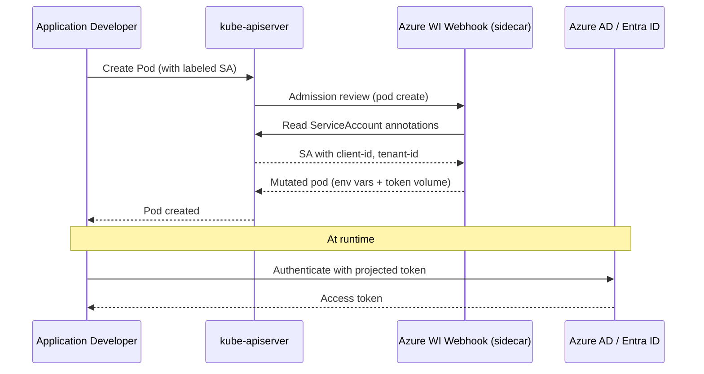

# Azure Workload Identity Webhook for HyperShift

## Summary

This enhancement proposes deploying the
[Azure Workload Identity](https://azure.github.io/azure-workload-identity/docs/)
mutating admission webhook in HyperShift-managed Azure clusters
(including ARO HCP). The webhook enables customer workloads to
use Azure workload identity federation by annotating
`ServiceAccounts` and labeling pods, causing the webhook to
inject the environment variables and projected service account
token volumes necessary for Azure authentication. This mirrors
the existing AWS pod identity webhook already deployed for
AWS-based HyperShift clusters and provides a consistent
experience for Azure customers.

## Motivation

HyperShift already deploys the
[AWS pod identity webhook](https://github.com/openshift/aws-pod-identity-webhook)
as a sidecar in the KAS deployment for AWS clusters. This
webhook enables customer workloads to assume AWS IAM roles via
annotated `ServiceAccounts`. Azure customers on HyperShift
(including ARO HCP) currently lack an equivalent mechanism.

The
[Azure Workload Identity](https://azure.github.io/azure-workload-identity/docs/)
project provides a mutating admission webhook that serves the
same purpose for Azure: when a pod references a `ServiceAccount`
annotated with Azure Managed Identity details and labeled with
`azure.workload.identity/use: "true"`, the webhook injects
environment variables (`AZURE_CLIENT_ID`, `AZURE_TENANT_ID`,
`AZURE_AUTHORITY_HOST`, `AZURE_FEDERATED_TOKEN_FILE`) and a
projected service account token volume into the pod. This allows
the pod to authenticate to Azure services using workload identity
federation without requiring long-lived credentials.

Without this webhook, customers must manually configure projected
token volumes, environment variables, and trust relationships for
each workload, which is error-prone and inconsistent with the
experience on ROSA HCP (AWS).

### User Stories

- As an application developer on an Azure HyperShift cluster, I
  want to annotate my `ServiceAccount` with an Azure Managed
  Identity client ID and label my pods with
  `azure.workload.identity/use: "true"` so that my workloads
  can authenticate to Azure services using workload identity
  federation without managing long-lived credentials.

- As a cluster administrator of an ARO HCP cluster, I want the
  Azure workload identity webhook to be automatically deployed
  and managed as part of the hosted control plane so that I do
  not have to manually install or lifecycle the webhook.

- As a platform operator managing multiple Azure HyperShift
  clusters, I want the webhook to be deployed consistently
  across all Azure clusters so that I can provide a uniform
  workload identity experience to my tenants.

- As an SRE responsible for ARO HCP, I want the webhook to be
  deployed with `failurePolicy: Ignore` and minimal resource
  overhead so that webhook failures do not block pod creation
  and the webhook does not impact control plane stability.

### Goals

1. The Azure workload identity webhook is automatically deployed
   for all Azure HyperShift clusters (both ARO HCP and
   self-managed).
2. Customer workloads can use Azure workload identity federation
   by annotating `ServiceAccounts` and labeling pods, matching
   the
   [Azure Workload Identity quick start](https://azure.github.io/azure-workload-identity/docs/quick-start.html)
   workflow.
3. The implementation mirrors the existing AWS pod identity
   webhook pattern in HyperShift (KAS sidecar, guest cluster
   RBAC, `MutatingWebhookConfiguration`).
4. The webhook image (`azure-workload-identity-webhook`) is
   sourced from the OpenShift release payload.
5. The webhook does not block pod creation if it is unavailable
   (`failurePolicy: Ignore`).

### Non-Goals

1. Automatic creation of Azure Managed Identities or federated
   credentials for customer workloads. Customers are responsible
   for provisioning their own identities and configuring
   federated credentials in Azure, following the standard Azure
   Workload Identity workflow.
2. Modifying how core OpenShift operators authenticate to Azure.
   Core operators use credential secrets and do not rely on the
   webhook (as described in the existing
   [Azure Workload Identity enhancement](https://github.com/openshift/enhancements/blob/master/enhancements/cloud-integration/azure/azure-workload-identity.md)).
3. Deploying the webhook for non-HyperShift (standalone)
   OpenShift clusters. Standalone Azure cluster webhook
   deployment is handled by the Cloud Credential Operator as
   described in the existing Azure workload identity
   enhancement.

## Proposal

Deploy the Azure workload identity webhook as a sidecar
container in the KAS (kube-apiserver) deployment for Azure
HyperShift clusters, mirroring the existing AWS pod identity
webhook pattern. The Control Plane Operator (CPO) will manage
the webhook's lifecycle, including TLS certificates, kubeconfig,
and guest cluster resources (MutatingWebhookConfiguration,
ClusterRole, ClusterRoleBinding).

The webhook image will be sourced from the release payload
under the label `azure-workload-identity-webhook`, using the
[OpenShift fork](https://github.com/openshift/azure-workload-identity)
of the upstream Azure Workload Identity project.

### Workflow Description

**Application developer** is a user deploying workloads on an
Azure HyperShift cluster who wants to use Azure workload
identity federation.

**Cluster administrator** is a user or automated system
responsible for provisioning and managing the Azure HyperShift
cluster.

#### Prerequisite: Azure Identity Setup

1. The cluster administrator (or automation) creates a
   User-Assigned Managed Identity in Azure:
   ```sh
   az identity create \
     --name "my-app-identity" \
     --resource-group "${RESOURCE_GROUP}" \
     --location "${LOCATION}"
   ```

2. The cluster administrator assigns appropriate Azure roles
   to the Managed Identity.

3. The cluster administrator creates a federated identity
   credential linking the Managed Identity to the cluster's
   OIDC issuer and the target ServiceAccount:
   ```sh
   OIDC_ISSUER=$(oc get \
     authentication.config.openshift.io/cluster \
     -o jsonpath='{.spec.serviceAccountIssuer}')

   az identity federated-credential create \
     --name "my-federated-cred" \
     --identity-name "my-app-identity" \
     --resource-group "${RESOURCE_GROUP}" \
     --issuer "${OIDC_ISSUER}" \
     --subject \
       "system:serviceaccount:my-ns:my-sa" \
     --audiences "api://AzureADTokenExchange"
   ```

#### Using Workload Identity in a Pod

1. The application developer creates a `ServiceAccount`
   annotated with the Managed Identity's client ID and tenant
   ID, and labeled for webhook injection:
   ```yaml
   apiVersion: v1
   kind: ServiceAccount
   metadata:
     name: my-sa
     namespace: my-ns
     annotations:
       azure.workload.identity/client-id: "<CLIENT_ID>"
       azure.workload.identity/tenant-id: "<TENANT_ID>"
     labels:
       azure.workload.identity/use: "true"
   ```

2. The application developer creates a pod referencing the
   annotated `ServiceAccount` and labeled for injection:
   ```yaml
   apiVersion: v1
   kind: Pod
   metadata:
     name: my-app
     namespace: my-ns
     labels:
       azure.workload.identity/use: "true"
   spec:
     serviceAccountName: my-sa
     containers:
     - name: my-app
       image: my-app:latest
   ```

3. When the pod is created, the KAS forwards the admission
   request to the Azure workload identity webhook sidecar.

4. The webhook detects the `azure.workload.identity/use: "true"`
   label and the ServiceAccount annotations, then mutates the
   pod spec to inject:
   - Environment variables: `AZURE_CLIENT_ID`,
     `AZURE_TENANT_ID`, `AZURE_AUTHORITY_HOST`,
     `AZURE_FEDERATED_TOKEN_FILE`
   - A projected service account token volume mounted at
     `/var/run/secrets/azure/tokens/azure-identity-token`

5. The application uses the Azure SDK, which automatically
   detects these environment variables and authenticates using
   workload identity federation.



### API Extensions

None. This enhancement does not introduce new CRDs, modify
existing APIs, or add new API fields. The webhook is deployed
automatically for all Azure HyperShift clusters based on the
platform type, matching the existing AWS pod identity webhook
behavior.

### Topology Considerations

#### Hypershift / Hosted Control Planes

This enhancement is specific to HyperShift. The webhook runs
as a sidecar container in the KAS deployment within the
management cluster's control plane namespace. Guest cluster
resources (MutatingWebhookConfiguration, ClusterRole,
ClusterRoleBinding) are reconciled by the Hosted Cluster Config
Operator (HCCO) running in the guest cluster.

This is the same architecture used by the existing AWS pod
identity webhook in HyperShift.

#### Standalone Clusters

This enhancement does not affect standalone clusters. For
standalone Azure clusters, the Azure workload identity webhook
is deployed and managed by the Cloud Credential Operator as
described in the existing
[Azure Workload Identity enhancement](https://github.com/openshift/enhancements/blob/master/enhancements/cloud-integration/azure/azure-workload-identity.md).

#### Single-node Deployments or MicroShift

This enhancement does not affect single-node deployments or
MicroShift. HyperShift is not used in these topologies.

#### OpenShift Kubernetes Engine

This enhancement does not depend on features excluded from OKE.
The webhook deployment is part of the control plane
infrastructure and does not require any OKE-excluded
capabilities.

### Implementation Details/Notes/Constraints

The implementation follows the established AWS pod identity
webhook pattern in HyperShift. The following components require
changes:

#### 1. Webhook Container (KAS Sidecar)

Add an Azure workload identity webhook container to the KAS
deployment when the platform type is Azure, similar to
`applyAWSPodIdentityWebhookContainer` in
`control-plane-operator/controllers/hostedcontrolplane/v2/kas/deployment.go`.

The container will:
- Use the `azure-workload-identity-webhook` image from the
  release payload
- Listen on port 9443 (the default for the Azure workload
  identity webhook)
- Mount TLS serving certificates and a kubeconfig for
  accessing the guest cluster API server
- Pass the `--audience=api://AzureADTokenExchange` flag

The KAS deployment switch statement (currently handling
`AWSPlatform`) should be extended with an `AzurePlatform` case.

#### 2. TLS Certificate Management

Create a serving certificate for the webhook, signed by the
hosted control plane root CA, similar to
`ReconcileAWSPodIdentityWebhookServingCert` in
`control-plane-operator/controllers/hostedcontrolplane/pki/`.

The certificate should be valid for the loopback address
(`127.0.0.1`) since the webhook runs as a sidecar in the same
pod as the KAS.

#### 3. Kubeconfig Generation

Generate a kubeconfig secret for the webhook to authenticate
to the guest cluster API server, similar to
`adaptAWSPodIdentityWebhookKubeconfigSecret` in
`control-plane-operator/controllers/hostedcontrolplane/v2/kas/kubeconfig.go`.

The kubeconfig should be associated with a ServiceAccount in
the guest cluster (e.g.,
`azure-workload-identity-webhook` in the
`openshift-cloud-credential-operator` namespace).

#### 4. Guest Cluster Resources (HCCO)

Add a `reconcileAzureIdentityWebhook` function in
`control-plane-operator/hostedclusterconfigoperator/controllers/resources/resources.go`
(called from the platform-specific switch statement alongside
the existing `reconcileAWSIdentityWebhook`), which creates:

- **ClusterRole**: Grants `get`, `list`, `watch` permissions
  on `serviceaccounts` (the webhook needs to read SA
  annotations).
- **ClusterRoleBinding**: Binds the ClusterRole to the
  webhook's ServiceAccount.
- **MutatingWebhookConfiguration**: Intercepts pod `CREATE`
  operations, pointing to the sidecar at
  `https://127.0.0.1:9443/mutate` with `failurePolicy: Ignore`
  and `sideEffects: None`.

#### 5. Manifests

Create manifest helpers for the Azure webhook resources,
similar to
`control-plane-operator/hostedclusterconfigoperator/controllers/resources/manifests/aws_pod_identity_webhook.go`
and
`control-plane-operator/controllers/hostedcontrolplane/manifests/aws.go`.

#### 6. Component Registration

Register the Azure webhook kubeconfig as a KAS component
manifest, enabled only for `AzurePlatform`, similar to the
AWS webhook kubeconfig registration in
`control-plane-operator/controllers/hostedcontrolplane/v2/kas/component.go`.

### Risks and Mitigations

- **Webhook availability**: If the webhook sidecar is
  unavailable, pod creation could be delayed. This is
  mitigated by setting `failurePolicy: Ignore` on the
  `MutatingWebhookConfiguration`, ensuring pods are created
  even if the webhook is down (without identity injection).

- **Resource overhead**: Adding a sidecar increases the
  resource footprint of the KAS pod. The AWS webhook uses
  minimal resources (10m CPU, 25Mi memory) and the Azure
  webhook is expected to have similar requirements, making
  the impact negligible.

- **Image maintenance**: The Azure workload identity webhook
  image must be maintained in the
  [OpenShift fork](https://github.com/openshift/azure-workload-identity)
  and included in the release payload. This is consistent
  with how the AWS pod identity webhook image is managed.

### Drawbacks

This adds another sidecar container to the KAS deployment for
Azure clusters, increasing the surface area that must be
maintained. However, this is the same pattern used for AWS and
the operational burden is well-understood. The alternative of
requiring customers to manually deploy and lifecycle the webhook
is error-prone and inconsistent with the ROSA HCP experience.

## Alternatives (Not Implemented)

### Standalone Deployment in Control Plane Namespace

Instead of running the webhook as a KAS sidecar, it could be
deployed as a separate `Deployment` in the hosted control
plane namespace. This would allow independent scaling and
lifecycle management but would require additional networking
configuration (the webhook URL in the
`MutatingWebhookConfiguration` would need to point to a
`Service` rather than `127.0.0.1`). The sidecar approach is
preferred because it matches the proven AWS pattern, avoids
network hops, and simplifies certificate management.

### Customer-Managed Webhook Installation

Customers could install the webhook themselves using the Helm
chart from the
[openshift/azure-workload-identity](https://github.com/openshift/azure-workload-identity)
repository. This is the current workaround but requires manual
steps (Helm install, SCC configuration, NetworkPolicy creation)
and does not integrate with the control plane lifecycle. This
is not suitable as a long-term solution for a managed service.

### Cloud Credential Operator Managed Deployment

The Cloud Credential Operator (CCO) could deploy the webhook,
similar to how it manages the AWS pod identity webhook on
standalone clusters. However, in HyperShift the CCO runs in
a constrained mode and the control plane components are
managed by the CPO. Deploying via the CPO as a KAS sidecar
is consistent with HyperShift architecture.

## Open Questions [optional]

1. Should the webhook's ServiceAccount in the guest cluster
   be placed in `openshift-cloud-credential-operator`
   (matching the manual install instructions) or
   `openshift-authentication` (matching the AWS webhook
   pattern)? The AWS webhook uses
   `openshift-authentication` for its ServiceAccount.

2. What additional command-line flags (beyond `--audience`)
   should be passed to the Azure workload identity webhook
   binary? The upstream webhook accepts flags for TLS
   certificate directory, health/metrics addresses, and
   log level.

## Test Plan

<!-- TODO: Fill in the test plan once targeted at a release.

Tests should include the following labels as appropriate:
- [OCPFeatureGate:FeatureName] for the feature gate
  (if applicable)
- [Jira:"Component Name"] for the Jira component
- [Suite:...], [Serial], [Slow], or [Disruptive] as needed

Reference dev-guide/test-conventions.md for details.

Suggested test strategy:
- Unit tests for the new reconciliation functions (webhook
  container, certificates, kubeconfig, guest cluster
  resources).
- Integration tests verifying that the webhook container is
  added to the KAS deployment when the platform is Azure and
  omitted for other platforms.
- E2E tests on an Azure HyperShift cluster verifying:
  1. The MutatingWebhookConfiguration exists in the guest
     cluster.
  2. A pod created with an annotated and labeled
     ServiceAccount has the expected environment variables
     and projected token volume injected.
  3. The injected credentials can successfully authenticate
     to Azure (e.g., list resource groups with Reader role).
  4. A pod created without the label is not mutated.
  5. The webhook failing does not block pod creation
     (failurePolicy: Ignore).
-->

## Graduation Criteria

<!-- TODO: Fill in graduation criteria once targeted at a
release.

Per dev-guide/feature-zero-to-hero.md, promotion requirements
include:
- At least 5 tests per feature
- All tests run at least 7 times per week
- All tests run at least 14 times per supported platform
- 95% pass rate
- Tests running on all supported platforms

Since this feature has no feature gate and is deployed
unconditionally for Azure clusters, graduation criteria
should focus on demonstrating reliability across Azure
HyperShift CI jobs.
-->

### Dev Preview -> Tech Preview

- Ability to utilize the enhancement end to end on an Azure
  HyperShift cluster
- End user documentation
- Sufficient test coverage (unit + integration)
- Webhook deployed and functional on Azure HyperShift CI jobs

### Tech Preview -> GA

- E2E tests passing reliably in Azure HyperShift CI
- Sufficient time for feedback from ARO HCP early adopters
- User-facing documentation created in
  [openshift-docs](https://github.com/openshift/openshift-docs/)
- No regressions to KAS pod startup or availability

### Removing a deprecated feature

Not applicable.

## Upgrade / Downgrade Strategy

On upgrade to a version containing this feature, the CPO will
automatically add the webhook sidecar to the KAS deployment
and the HCCO will create the guest cluster resources. This
triggers a KAS pod rollout. The webhook uses `failurePolicy:
Ignore`, so even during the rollout window, pod creation is
not blocked.

On downgrade, the CPO will remove the sidecar container and
the HCCO will no longer reconcile the guest cluster resources.
Existing pods that were previously mutated by the webhook
retain their injected environment variables and token volumes
but these will continue to function as they rely on standard
Kubernetes projected service account tokens.

No manual steps are required for upgrade or downgrade.

## Version Skew Strategy

During an upgrade, there may be a brief period where the KAS
deployment includes the webhook sidecar but the guest cluster
`MutatingWebhookConfiguration` has not yet been created (or
vice versa). This is harmless:

- If the sidecar exists but the
  `MutatingWebhookConfiguration` does not, no pods are
  forwarded to the webhook.
- If the `MutatingWebhookConfiguration` exists but the
  sidecar is not yet running, `failurePolicy: Ignore`
  ensures pod creation proceeds without mutation.

This is the same version skew behavior as the existing AWS
pod identity webhook.

## Operational Aspects of API Extensions

The `MutatingWebhookConfiguration` created in the guest
cluster intercepts pod `CREATE` operations. The operational
impact is minimal:

- **SLIs**: The webhook's health can be monitored via the
  KAS pod's container status. If the
  `azure-workload-identity-webhook` container is not ready,
  the webhook is degraded. Since `failurePolicy: Ignore` is
  set, this does not affect cluster availability.

- **Impact on existing SLIs**: The webhook adds minimal
  latency to pod creation (only for pods matching the
  label selector). Non-matching pods are not affected.
  The `failurePolicy: Ignore` setting ensures that webhook
  failures do not block the API server.

- **Failure modes**: If the webhook sidecar crashes or is
  unavailable, pod creation continues without mutation.
  Pods that require Azure workload identity will not have
  the necessary environment variables and token volumes
  injected, and the application's Azure SDK calls will
  fail to authenticate. This is a graceful degradation
  that does not affect cluster health.

## Support Procedures

- **Detecting webhook failures**: Check the KAS pod's
  container statuses for the
  `azure-workload-identity-webhook` container. If it is in
  `CrashLoopBackOff` or not ready, the webhook is degraded.
  The KAS pod logs for the webhook container will show error
  details.

- **Verifying webhook injection**: Run
  `oc describe pod <name> -n <ns>` and check for the
  presence of `AZURE_CLIENT_ID`, `AZURE_TENANT_ID`,
  `AZURE_AUTHORITY_HOST`, and `AZURE_FEDERATED_TOKEN_FILE`
  environment variables and the `azure-identity-token`
  projected volume.

- **Disabling the webhook**: Delete the
  `MutatingWebhookConfiguration` in the guest cluster.
  This stops all injection. The HCCO will recreate it on
  its next reconciliation cycle, so to persistently disable
  it, the HCCO reconciliation must also be addressed. No
  existing workloads are affected by disabling the webhook;
  only new pods will miss injection.

- **Graceful failure**: The webhook uses
  `failurePolicy: Ignore`. Disabling or removing the webhook
  does not block pod creation. Workloads that depend on
  injected credentials will fail to authenticate to Azure
  but the cluster remains fully functional.

## Infrastructure Needed [optional]

- The `azure-workload-identity-webhook` image must be built
  from the
  [openshift/azure-workload-identity](https://github.com/openshift/azure-workload-identity)
  fork and included in the OpenShift release payload.
- Azure HyperShift CI jobs must be available for E2E testing
  of the webhook functionality.
