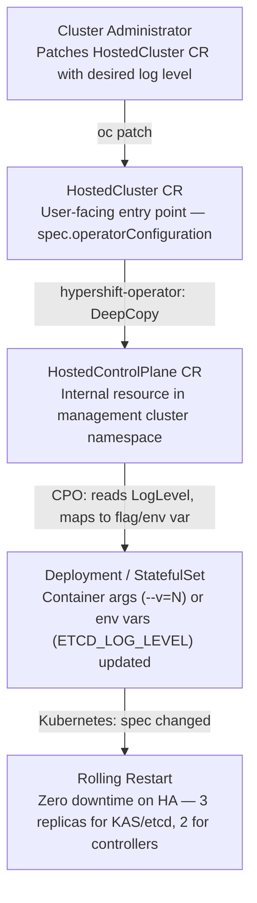
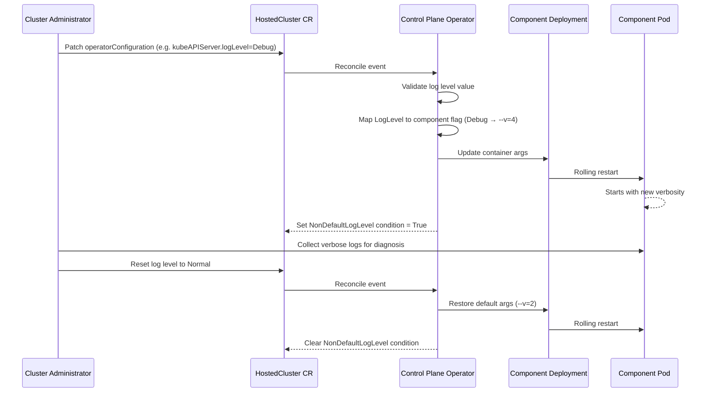

# Configurable Log Levels for Hosted Control Plane Components

## Summary

This enhancement introduces structured, per-component log level configuration for hosted
control plane components managed by the Control Plane Operator (CPO) in HyperShift.
Administrators will be able to set intent-based log levels (`Normal`, `Debug`, `Trace`,
`TraceAll`) on the HostedCluster Custom Resource for kube-apiserver,
kube-controller-manager, kube-scheduler, etcd, openshift-apiserver,
openshift-controller-manager, openshift-oauth-apiserver, and oauth-server. The CPO will
translate these intent-based levels into component-specific mechanisms (`--v=N` for
klog-based components, `ETCD_LOG_LEVEL` env var for etcd), achieving operational parity
with standard OCP's `operatorv1.OperatorSpec.LogLevel` pattern. The new fields are added
as structured `*ComponentLogLevelSpec` pointers in the existing `OperatorConfiguration`
type. The design is intentionally generic to extend to all remaining CPO-managed components
in future phases. This feature ships ungated (no feature gate) as a low-risk operational
knob that extends an already-GA framework.

## Motivation

HyperShift administrators and support engineers currently cannot adjust log verbosity for
hosted control plane components during troubleshooting. In standard OCP, changing log
levels is a routine operation via `oc patch` on operator resources, but in HyperShift the
control plane runs in a management cluster namespace with no user-facing logging
configuration.

This gap creates significant operational pain:

- **Slower incident resolution:** Without verbose logs, diagnosing obscure control plane
  failures requires escalation and often cluster recreation, extending MTTR from hours to
  days.
- **No proactive debugging:** Teams cannot temporarily increase verbosity in pre-production
  to gather data about component behavior before promoting changes.
- **Operational gap vs standard OCP:** Customers managing both standalone and hosted
  clusters face inconsistent tooling, increasing training burden and operational complexity.
- **Support burden:** CEE engineers cannot guide customers through standard log-level-based
  troubleshooting workflows, leading to more escalations to engineering.

Currently only kube-apiserver has a verbosity annotation
(`hypershift.openshift.io/kube-apiserver-verbosity-level`), which is ad-hoc, unvalidated
(raw integer), and inconsistent with the OCP operator pattern. All other components managed
by CPO have no user-facing logging configuration.

This was reported via [RFE-7777](https://issues.redhat.com/browse/RFE-7777) and accepted
as "crucial even for the most minimal troubleshooting."

### User Stories

- As a **HyperShift cluster administrator**, I want to increase the log verbosity of
  kube-apiserver on my hosted cluster so that I can diagnose API request failures without
  escalating to engineering.

- As a **CEE support engineer**, I want to instruct customers to set `Debug` log level on
  specific hosted control plane components via the HostedCluster CR so that I can follow
  the same troubleshooting playbooks used for standard OCP clusters.

- As a **platform engineer** managing hosted clusters in pre-production, I want to
  temporarily set `Trace` level on openshift-apiserver and openshift-controller-manager so
  that I can capture detailed component behavior before promoting changes to production.

- As an **SRE** operating hosted clusters at scale, I want to monitor which hosted clusters
  have non-default log levels active so that I can identify clusters with elevated log
  volume and ensure log storage capacity is not exceeded.

### Goals

This enhancement is delivered in phases:

**Phase 1 — kube-apiserver (initial delivery)**

1. Enable administrators to configure log verbosity for kube-apiserver via the HostedCluster
   CR, replacing the existing ad-hoc annotation-based mechanism.
2. Establish the `ComponentLogLevelSpec` pattern and `LogLevelToKlogVerbosity()` utility
   that all subsequent phases reuse.
3. Provide a deprecation path for the existing
   `hypershift.openshift.io/kube-apiserver-verbosity-level` annotation.
4. Achieve operational parity with standard OCP's `operatorv1.LogLevel` pattern using
   intent-based log levels (`Normal`, `Debug`, `Trace`, `TraceAll`).
5. Ensure log level changes take effect via rolling restart without cluster disruption or
   downtime.

**Phase 2 — remaining core control plane components**

6. Extend log level configuration to: kube-controller-manager, kube-scheduler, etcd,
   openshift-apiserver, openshift-controller-manager, openshift-oauth-apiserver, and
   oauth-server, using the same pattern established in Phase 1.

**Phase 3 — all remaining CPO-managed components (future)**

7. Extend log level configuration to all remaining klog-based CPO-managed components,
   including components with hardcoded `--v=N` values in their asset manifests and
   components using klog defaults, as well as zap-based operator components (HCCO,
   PKI-operator) and karpenter via custom level mappings.
8. The `ComponentLogLevelSpec` API design is intentionally generic to enable this extension
   with only additive, backward-compatible changes to `OperatorConfiguration`.

### Non-Goals

1. **Configuring all ~50 CPO-managed components in Phases 1 and 2.** Phases 1 and 2 cover
   the 8 core control plane components. Phase 3 (future) covers remaining components.

2. **The following components are permanently out of scope** due to their logging model not
   supporting a standard configurable verbosity interface compatible with the
   `Normal/Debug/Trace/TraceAll` abstraction:
   - `control-plane-operator` self-log-level: the CPO binary is deployed by the
     *hypershift-operator*, not by CPO's own reconciliation loop. CPO cannot configure its
     own log level through its own reconciliation.
   - Catalog images (`certified-operators-catalog`, `community-operators-catalog`,
     `redhat-operators-catalog`, `redhat-marketplace-catalog`): use opm/gRPC serving with
     no standard verbosity flag.
   - HAProxy-based components (`router`, `ignition-server-proxy`): log level is
     configuration-file-based, not flag-based.
   - `aws-node-termination-handler`: upstream AWS daemon with a custom logging model not
     compatible with intent-based log level mapping.
   - `olm-collect-profiles`, `featuregate-generator`: cronjob/generator workloads, not
     long-running operators with persistent log level state.
   - `metrics-proxy`: internal sidecar with no user-facing verbosity interface.

3. Implementing log aggregation, forwarding, or retention policies for hosted control plane
   component logs.

4. Providing a real-time log streaming interface or console-based log viewer for hosted
   control plane components.

## Proposal

Introduce a new log level configuration section in the HostedCluster API that allows
per-component log level overrides. The CPO will reconcile these settings and propagate them
to the appropriate control plane component deployments and statefulsets.

HyperShift already defines a `LogLevel` type identical to OCP's `operatorv1.LogLevel`,
mapping to the following glog/klog verbosity levels:

| LogLevel         | klog `--v` | etcd `ETCD_LOG_LEVEL` | Use Case                                          |
|------------------|------------|----------------------|---------------------------------------------------|
| Normal (default) | 2          | info                 | Production                                        |
| Debug            | 4          | debug                | Troubleshooting                                   |
| Trace            | 6          | debug                | Deep investigation                                |
| TraceAll         | 8          | debug                | Full dumps — perf impact, may expose secrets      |

The chosen API design is **Option B — Structured fields** in `OperatorConfiguration`. This
extends the existing pattern (which already has `ClusterVersionOperator`,
`ClusterNetworkOperator`, and `IngressOperator` fields) with new optional
`*ComponentLogLevelSpec` pointer fields. Each component uses `*ComponentLogLevelSpec`
directly.

> **Why etcd uses `ETCD_LOG_LEVEL` env var and not `--log-level` flag:** etcd is started
> via a shell one-liner (`/bin/sh -c "... /usr/bin/etcd"`). Injecting a CLI flag means
> string-manipulating the shell command — fragile and breaks if the command format changes.
> `ETCD_LOG_LEVEL` matches all 15 existing etcd config values and uses the existing
> `util.UpsertEnvVar()` utility (from `support/util/containers.go`). etcd internally maps
> `ETCD_*` env vars to their `--*` flag equivalents.

> **Why Trace and TraceAll both map to `debug` for etcd:** etcd uses zap, which supports:
> debug, info, warn, error, panic, fatal. There is no finer granularity below debug. klog
> has numeric levels (2/4/6/8) giving four distinct settings; etcd only gives two useful
> ones (info and debug).

When no log level is specified for a component, the default (`Normal`) is used, preserving
backward compatibility.

### Workflow Description

**cluster administrator** is a human user responsible for managing a hosted cluster via the
HostedCluster CR.

**Control Plane Operator (CPO)** is the operator running in the management cluster that
reconciles hosted control plane components.

1. The cluster administrator identifies a need to increase log verbosity for a specific
   control plane component (e.g., kube-apiserver) to diagnose an issue.
2. The cluster administrator patches the HostedCluster CR to set the desired log level for
   the target component:
   ```bash
   oc patch hostedcluster my-cluster --type=merge -p \
     '{"spec":{"operatorConfiguration":{
       "kubeAPIServer":{"logLevel":"Debug"}}}}'
   ```
3. The CPO detects the HostedCluster spec change and validates the log level value.
4. The CPO translates the intent-based log level to the component-specific flag (e.g.,
   `Debug` → `--v=4` for kube-apiserver).
5. The CPO updates the component's deployment/statefulset with the new verbosity flag,
   triggering a rolling restart.
6. The component pods restart with the updated verbosity level.
7. The CPO sets a `NonDefaultLogLevel` status condition on the HostedCluster indicating
   that non-default log levels are active.
8. The cluster administrator collects the verbose logs for diagnosis.
9. After troubleshooting, the administrator resets the log level to `Normal` (or removes
   the override), and the CPO triggers another rolling restart to restore default verbosity.

#### Entry Point & Data Flow



#### Sequence Diagram



### API Extensions

This enhancement modifies the `HostedCluster` and `HostedControlPlane` CRDs by adding new
optional pointer fields to the existing `OperatorConfiguration` struct. The existing
`hypershift.openshift.io/kube-apiserver-verbosity-level` annotation is deprecated in favor
of the new structured API.

#### New Type: ComponentLogLevelSpec

Added to `api/hypershift/v1beta1/operator.go` (where `LogLevel` is already defined):

```go
// ComponentLogLevelSpec specifies the log verbosity for a control plane component.
type ComponentLogLevelSpec struct {
    // logLevel configures the log verbosity for the component.
    // Valid values are: "Normal", "Debug", "Trace", "TraceAll".
    // Defaults to "Normal".
    //
    // +optional
    // +kubebuilder:default=Normal
    // +kubebuilder:validation:Enum="";Normal;Debug;Trace;TraceAll
    LogLevel LogLevel `json:"logLevel,omitempty"`
}
```

#### New Fields in OperatorConfiguration

Added to `api/hypershift/v1beta1/hostedcluster_types.go`, extending the existing
`OperatorConfiguration` struct (which already has CVO, CNO, and Ingress fields):

```go
type OperatorConfiguration struct {
    // ...existing ClusterVersionOperator, ClusterNetworkOperator, IngressOperator fields...

    // kubeAPIServer configures the log verbosity of the kube-apiserver component.
    // +optional
    KubeAPIServer *ComponentLogLevelSpec `json:"kubeAPIServer,omitempty"`

    // kubeControllerManager configures the log verbosity of the kube-controller-manager component.
    // +optional
    KubeControllerManager *ComponentLogLevelSpec `json:"kubeControllerManager,omitempty"`

    // kubeScheduler configures the log verbosity of the kube-scheduler component.
    // +optional
    KubeScheduler *ComponentLogLevelSpec `json:"kubeScheduler,omitempty"`

    // etcd configures the log verbosity of the etcd component.
    // +optional
    Etcd *ComponentLogLevelSpec `json:"etcd,omitempty"`

    // openShiftAPIServer configures the log verbosity of the openshift-apiserver component.
    // +optional
    OpenShiftAPIServer *ComponentLogLevelSpec `json:"openShiftAPIServer,omitempty"`

    // openShiftControllerManager configures the log verbosity of the openshift-controller-manager component.
    // +optional
    OpenShiftControllerManager *ComponentLogLevelSpec `json:"openShiftControllerManager,omitempty"`

    // openShiftOAuthAPIServer configures the log verbosity of the openshift-oauth-apiserver component.
    // +optional
    OpenShiftOAuthAPIServer *ComponentLogLevelSpec `json:"openShiftOAuthAPIServer,omitempty"`

    // oAuthServer configures the log verbosity of the oauth-server component.
    // +optional
    OAuthServer *ComponentLogLevelSpec `json:"oAuthServer,omitempty"`
}
```

#### N-1/N+1 Compatibility

| Direction                  | Behavior                                                                              |
|----------------------------|---------------------------------------------------------------------------------------|
| N+1 (new code, old data)   | Old data has no log level fields → nil pointers → defaults apply                      |
| N-1 (old code, new data)   | New data has log level fields → old code ignores unknown JSON keys → no error         |

**Propagation is automatic:** `OperatorConfiguration` is already embedded in
`HostedControlPlaneSpec` and propagated via `DeepCopy()`. Adding new fields requires zero
propagation code — `make update` regenerates the `DeepCopy` method to include them.

### Topology Considerations

#### Hypershift / Hosted Control Planes

This enhancement is specifically designed for HyperShift hosted control planes. The log
level configuration is set on the HostedCluster CR in the management cluster and propagated
to the hosted control plane components running in the management cluster namespace. No
changes are required in the guest cluster.

For managed services (ROSA HCP, ARO HCP), service-level guardrails may be needed to
restrict `TraceAll` log level, as glog level 8 can dump sensitive data including request
bodies and secrets in component logs.

#### Standalone Clusters

This enhancement does not apply to standalone clusters. Standalone OCP clusters already
have log level configuration via the `operatorv1.OperatorSpec.LogLevel` field on each
operator's CR.

#### Single-node Deployments or MicroShift

This enhancement does not apply to single-node deployments or MicroShift. These topologies
use standalone control plane components with existing log level configuration mechanisms.

#### OpenShift Kubernetes Engine

This enhancement applies to OKE deployments that use HyperShift for hosted control planes.
The log level configuration behavior is identical to standard HyperShift deployments. OKE
does not exclude any functionality required by this enhancement.

### Implementation Details/Notes/Constraints

The implementation follows a phased approach.

#### Phase 1: kube-apiserver (first)

kube-apiserver is implemented and validated first because it is the most requested
component for log level tuning, has an existing annotation-based mechanism to deprecate,
and establishes the pattern for all subsequent components.

Log level changes apply to the **main container only**, not sidecars. This matches OCP
behavior — sidecars have different logging models, and `UpdateContainer(ComponentName)`
already targets the main container.

Phase 1 delivers:

1. **API types:** `ComponentLogLevelSpec` struct and the `KubeAPIServer` field in
   `OperatorConfiguration`.
2. **Mapping utility:** `LogLevelToKlogVerbosity()` in `support/util/loglevel.go`.
3. **CPO integration for KAS:** Replace the existing annotation logic at
   `v2/kas/deployment.go` with structured API field reading. Annotation fallback with lower
   precedence during transition.
4. **Annotation deprecation:** Both annotation and API field honored; new field wins.
   Deprecation warning condition emitted when annotation is used.
5. **Status reporting:** `NonDefaultLogLevel` condition on HostedCluster when any component
   has a non-default log level.
6. **Unit + E2E tests** for KAS log level propagation, annotation precedence, and HA
   rolling restart.

#### Phase 2: remaining 7 components (in parallel, after Phase 1 approval)

Once Phase 1 is approved and merged, the remaining 7 components are implemented in parallel
since they all follow the same pattern established by KAS:

- kube-controller-manager, kube-scheduler, openshift-apiserver,
  openshift-controller-manager, openshift-oauth-apiserver, oauth-server — all use klog
  (`--v=N`), same `LogLevelToKlogVerbosity()` utility.
- etcd — uses `ETCD_LOG_LEVEL` env var, requires a `LogLevelToEtcdLevel()` mapping
  utility.

#### CPO Integration by Component

| Component                    | Phase | Logging Model  | File                                    | Mechanism                                    |
|------------------------------|-------|----------------|-----------------------------------------|----------------------------------------------|
| **kube-apiserver**           | **1** | klog           | `v2/kas/deployment.go`                  | `--v=N` (replaces annotation logic)          |
| kube-controller-manager      | 2     | klog           | `v2/kcm/deployment.go`                  | `--v=N` appended to args                     |
| kube-scheduler               | 2     | klog           | `v2/kube_scheduler/deployment.go`       | `--v=N` appended to args                     |
| etcd                         | 2     | zap (non-klog) | `v2/etcd/statefulset.go`                | `ETCD_LOG_LEVEL` env var                     |
| openshift-apiserver          | 2     | klog           | `v2/oapi/deployment.go`                 | `--v=N` appended to args                     |
| openshift-controller-manager | 2     | klog           | `v2/ocm/component.go`                   | `--v=N` appended to args via adapt function  |
| openshift-oauth-apiserver    | 2     | klog           | `v2/oauth_apiserver/deployment.go`      | `--v=N` (overrides hardcoded `--v=2`)        |
| oauth-server                 | 2     | klog           | `v2/oauth/deployment.go`                | `--v=N` appended to args                     |

#### Full Component Scope by Phase

The table below captures the holistic scope of log level configurability across all
CPO-managed components, per the architect's guidance to design this feature comprehensively.
This enhancement covers all phases end-to-end; the initial implementation (this EP) delivers
Phases 1 and 2. Phase 3 components are explicitly in scope for the enhancement at the
holistic level and are deferred only as a sequencing decision. The `ComponentLogLevelSpec`
API is designed to accommodate all phases with only additive, backward-compatible changes to
`OperatorConfiguration`. The logging model column explains the per-component translation
mechanism — it is an implementation detail, not a scope boundary.

| Phase | Components | Logging Model | Count |
|---|---|---|---|
| **Phase 1** | kube-apiserver | klog (`--v=N`) | 1 |
| **Phase 2** | kube-controller-manager, kube-scheduler, etcd, openshift-apiserver, openshift-controller-manager, openshift-oauth-apiserver, oauth-server | klog (`--v=N`) / zap (`ETCD_LOG_LEVEL` env var for etcd) | 7 |
| **Phase 3 — klog-based managed components** | cluster-network-operator, cluster-version-operator, cluster-autoscaler, cluster-image-registry-operator, cluster-storage-operator, cluster-node-tuning-operator, cluster-policy-controller, csi-snapshot-controller-operator, dns-operator, ingress-operator, cloud-credential-operator, capi-provider, capi-manager, cluster-api, kubevirt-cloud-controller-manager, gcp-cloud-controller-manager, powervs-cloud-controller-manager, openstack-cloud-controller-manager, aws-cloud-controller-manager, azure-cloud-controller-manager, kubevirt-csi-controller, machine-approver, karpenter-operator, konnectivity-agent, olm-operator, catalog-operator, packageserver, openshift-route-controller-manager, endpoint-resolver | klog (`--v=N`); same `LogLevelToKlogVerbosity()` utility as Phases 1 & 2 | ~29 |
| **Phase 3 — zap-based managed components** | hosted-cluster-config-operator (HCCO), control-plane-pki-operator, karpenter, ignition-server | zap (`--zap-log-level` / `--log-level`); requires `LogLevelToZapLevel()` mapping utility, analogous to `LogLevelToEtcdLevel()` introduced in Phase 2. ignition-server uses controller-runtime's zap integration via `ctrl.SetLogger(zap.New(...))` | 4 |
| **Permanent non-goals** | `control-plane-operator` self, `certified-operators-catalog`, `community-operators-catalog`, `redhat-operators-catalog`, `redhat-marketplace-catalog`, `router`, `ignition-server-proxy`, `aws-node-termination-handler`, `olm-collect-profiles`, `featuregate-generator`, `metrics-proxy` | No standard configurable verbosity interface — excluded by design, not by sequencing | 11 |

#### Phase 3 API Note: Components with Existing OperatorConfiguration Fields

Three Phase 3 klog-based components — `cluster-version-operator`, `cluster-network-operator`,
and `ingress-operator` — already have dedicated typed configuration structs in
`OperatorConfiguration` (`ClusterVersionOperatorSpec`, `ClusterNetworkOperatorSpec`,
`IngressOperatorSpec`). For these components, log level configuration will be added by
embedding a `LogLevel` field within their existing typed structs rather than introducing
parallel `*ComponentLogLevelSpec` fields. This avoids creating two configuration entry points
for the same component while keeping a single, natural location for all per-component
configuration. The `LogLevel` field will use the same `LogLevel` type and follow the same
semantics as `ComponentLogLevelSpec.LogLevel`, ensuring uniform behavior across all phases.

#### HA Rolling Restart — Zero Downtime

| Component                    | Replicas (HA) | Why No Impact                                          |
|------------------------------|---------------|--------------------------------------------------------|
| kube-apiserver               | 3             | Load balanced — 2 still serving while 1 restarts       |
| kube-controller-manager      | 2             | Leader election — standby takes over in seconds        |
| kube-scheduler               | 2             | Leader election                                        |
| etcd                         | 3             | Raft quorum — 2 of 3 healthy during rolling update     |
| openshift-apiserver          | 3             | Load balanced                                          |
| openshift-controller-manager | 2             | Leader election                                        |
| openshift-oauth-apiserver    | 3             | Load balanced                                          |
| oauth-server                 | 3             | Load balanced — request-serving component              |

**ROSA HCP / ARO HCP:** Always HighlyAvailable. `SingleReplica` is never used. Zero
downtime guaranteed.

### Risks and Mitigations

**Risk:** `TraceAll` (glog level 8) can dump sensitive data including request bodies and
secrets in component logs.
**Mitigation:** Document operational warnings for `TraceAll` in API docs and release notes.
Consider adding validation warnings or status conditions when `TraceAll` is set. Managed
services may restrict this level via admission webhooks.

**Risk:** High verbosity levels significantly increase log volume, potentially impacting log
storage and cluster performance.
**Mitigation:** Add status conditions when non-default log levels are active so SREs can
monitor and alert on elevated verbosity. Document storage impact guidance per log level.

**Risk:** `TraceAll` on managed services (ROSA HCP, ARO HCP) could expose secrets in logs
flowing to CloudWatch or Azure Monitor (customer-visible).
**Mitigation:** Add admission policy or CEL rule blocking `TraceAll` on managed service
clusters. Access model (customer self-service vs SRE/CEE only) to be decided with PM.

**Risk:** High verbosity on managed services (ROSA HCP, ARO HCP) increases log volume
flowing to CloudWatch or Azure Monitor, potentially impacting storage costs.
**Mitigation:** Assess cost impact of `Debug` and `Trace` levels per component. Consider
auto-revert to `Normal` after a configurable timeout if needed.

**Risk:** Rolling restarts during log level changes could cause brief API unavailability if
multiple components are changed simultaneously.
**Mitigation:** The CPO should apply changes sequentially across components to avoid
simultaneous restarts.

### Drawbacks

- Adds API surface to the HostedCluster CRD that requires ongoing maintenance and
  documentation.
- The mapping between intent-based log levels and component-specific flags is not a perfect
  abstraction — etcd uses a different logging model (level-based vs. numeric verbosity) and
  some nuance is lost in translation.
- Log level changes trigger rolling restarts, which is a heavier operation than the in-place
  dynamic reconfiguration some users might expect.

## Alternatives (Not Implemented)

1. **Extend the existing annotation pattern:** Add per-component annotations similar to the
   existing KAS verbosity annotation. This was rejected because annotations are unvalidated,
   not discoverable via `oc explain`, and inconsistent with OCP operator conventions.

2. **Expose raw numeric verbosity levels:** Allow users to set raw `--v=N` values directly.
   This was rejected because it does not provide operational parity with OCP's intent-based
   `LogLevel` pattern, requires users to know component-specific verbosity semantics, and
   does not translate well to etcd's level-based logging.

3. **Dynamic log level reconfiguration without restart:** Some components support runtime
   log level changes. This was considered but rejected for the initial implementation
   because not all target components support it, and the rolling restart approach provides
   consistent behavior across all components.

## Open Questions

1. Should managed services (ROSA HCP, ARO HCP) expose log level configuration to customers
   via ROSA CLI / OCM, or restrict it to SRE/CEE only? Access model to be decided with PM.

2. What is the appropriate deprecation timeline for the existing
   `hypershift.openshift.io/kube-apiserver-verbosity-level` annotation? Current
   recommendation: deprecated on merge, removed in N+2.

## Test Plan

The testing strategy covers the following areas:

- **Unit tests:** Validate `LogLevelToKlogVerbosity()` mapping for all enum values + nil
  (klog `--v=N`).
- **Unit tests:** Validate `LogLevelToEtcdLevel()` mapping for all enum values + nil
  (`ETCD_LOG_LEVEL`).
- **Serialization compat tests:** N-1/N+1 roundtrip for `OperatorConfiguration` with new
  fields set, mixed, and empty.
- **Envtest (CEL) tests:** Valid log levels accepted, invalid values rejected by enum
  validation.
- **Unit tests per component:** Each of the 8 CPO integration points tested with all log
  level values.
- **KAS-specific unit tests:** Annotation fallback, API field precedence over annotation,
  invalid annotation handling.
- **E2E tests:** Set KAS LogLevel to Debug → verify pod restarts with `--v=4`; cluster
  stays healthy.
- **E2E tests:** Remove KAS LogLevel (nil) → verify pod rolls back to `--v=2`.
- **E2E tests:** Set etcd LogLevel to Debug → verify pod restarts with
  `ETCD_LOG_LEVEL=debug`.
- **E2E tests:** KAS annotation deprecation path — annotation works, API field overrides,
  annotation ignored when both set.
- **E2E tests:** HA rolling restart — no API downtime during rollout (health checks pass
  continuously).

Tests should include `[Jira:"Hosted Control Planes"]` labels for the component. Since this
feature ships ungated, no `[OCPFeatureGate:...]` label is needed.

## Graduation Criteria

This feature ships **GA in the target release** with no feature gate. Dev Preview and Tech
Preview stages are skipped because this enhancement adds optional, backward-compatible fields
to an already-GA API surface (`OperatorConfiguration`) using an already-GA type (`LogLevel`).
The feature is a low-risk operational knob — nil fields preserve existing behavior, and the
CPO reconciliation path is well-established. There is no new controller, no new CRD, and no
behavioral change for clusters that do not opt in.

### Dev Preview -> Tech Preview

N/A. This feature skips Dev Preview and Tech Preview. See rationale above.

### Tech Preview -> GA

N/A. This feature ships directly as GA. See rationale above.

### GA Criteria

- Ability to set log levels for all 8 core control plane components via the HostedCluster
  CR end to end.
- Log level changes propagate correctly and components restart with the expected verbosity.
- Unit tests for LogLevel-to-flag mapping (klog and etcd).
- Serialization compatibility tests (N-1/N+1 roundtrip).
- Envtest cases for CEL/enum validation.
- E2E tests for propagation, reset, annotation deprecation path, and HA rolling restart
  with zero downtime.
- Deprecation notice published for the existing KAS verbosity annotation.
- Verification on all supported platforms: AWS/ROSA, Azure/ARO, KubeVirt, IBM, OpenStack,
  and Agent.
- CEE validation with [RFE-7777](https://issues.redhat.com/browse/RFE-7777) reporter
  confirms the feature solves their problem.
- User-facing documentation created in
  [openshift-docs](https://github.com/openshift/openshift-docs/)
  ([OSDOCS-19157](https://issues.redhat.com/browse/OSDOCS-19157)).

### Removing a deprecated feature

The existing `hypershift.openshift.io/kube-apiserver-verbosity-level` annotation is
deprecated on merge of this feature and will be removed in N+2 (two minor releases after
GA).

## Upgrade / Downgrade Strategy

**Upgrade:** The new log level fields are optional pointer types with `omitempty`. Clusters
upgrading from a version without this feature will have `nil` log level fields, and the CPO
will continue to use default verbosity (`Normal`). No action is required from the
administrator to maintain previous behavior. The existing KAS verbosity annotation will
continue to be honored during the transition period; if both the annotation and the new API
field are set, the API field takes precedence.

**Downgrade:** If a cluster is downgraded to a version that does not support the new log
level fields, the fields will be ignored by the older CPO. Components will revert to
default verbosity on the next reconciliation. Administrators should reset log levels to
`Normal` before downgrading to avoid unexpected behavior during the transition.

Each component remains available during log level changes because the CPO uses rolling
restarts with proper pod disruption budgets.

## Version Skew Strategy

During an upgrade, the management cluster CPO may be at version N+1 while some hosted
control plane components are still at version N. This is safe because:

- The log level configuration is applied at the deployment/statefulset level by the CPO.
  The CPO at N+1 will set the verbosity flags on component containers regardless of their
  version.
- The `--v=N` flag and `ETCD_LOG_LEVEL` env var are stable across Kubernetes and etcd
  versions and are not version-specific.
- If the CPO at N+1 sets a log level field that a component at version N does not
  recognize, the flag is still a valid command line argument and the component will honor
  it.

## Operational Aspects of API Extensions

This enhancement adds optional fields to the existing `HostedCluster` and
`HostedControlPlane` CRDs. No new webhooks, aggregated API servers, or finalizers are
introduced.

**SLIs — detecting health of log level configuration:**

The CPO reports a `NonDefaultLogLevel` status condition on the HostedCluster:

- `HostedCluster` condition `NonDefaultLogLevel=True` — one or more components are running
  with elevated verbosity. Administrators and SREs can alert on this to track clusters with
  non-standard log volume.
- `HostedCluster` condition `NonDefaultLogLevel=False` — all components running at default
  verbosity.

**Impact on existing SLIs:**

- No impact at `Normal` log level.
- Higher verbosity levels increase log volume proportionally. This may affect log storage
  consumption but does not affect API availability, control plane latency, or scheduling
  performance at `Debug` or `Trace` levels under normal workloads.
- Expected use cases require short-lived non-default log level windows (minutes to hours
  during incident investigation), not permanent elevation.

**How impact is measured:**

- Log volume per component per verbosity level should be characterized by the QE team
  during validation testing.
- No performance team review required — this is a per-cluster operational configuration
  that does not affect management cluster API throughput or scheduling.

**Failure modes:**

- If an invalid log level is specified, CRD enum validation rejects the value at admission
  time. The component continues running at its current verbosity.
- If a log level change causes a failed rolling restart (e.g., resource constraints prevent
  new pod scheduling), the CPO reports a degraded condition on the HostedCluster. Standard
  rollback procedures apply — the previous pod generation remains running.
- If the CPO itself is unavailable during a log level change, the change is queued and
  applied on CPO recovery. No component restarts occur without CPO orchestration.

**Escalation:** The HyperShift / Hosted Control Planes team is responsible for issues
related to log level configuration.

## Support Procedures

**Detecting non-default log levels:**

Check the HostedCluster status conditions for `NonDefaultLogLevel=True`:

```bash
oc get hostedcluster my-cluster -o jsonpath='{.status.conditions[?(@.type=="NonDefaultLogLevel")]}'
```

Alternatively, inspect the spec directly:

```bash
oc get hostedcluster my-cluster -o jsonpath='{.spec.operatorConfiguration}'
```

**Symptoms of excessive verbosity:**

Increased log volume in the management cluster namespace, potential log storage pressure,
and slightly increased CPU usage on control plane pods. Check pod log rates with:

```bash
oc logs -n <hcp-namespace> deployment/kube-apiserver --tail=100
```

**Resetting to defaults:**

Patch the HostedCluster CR to remove a specific component's log level override:

```bash
oc patch hostedcluster my-cluster --type=json -p \
  '[{"op":"remove",
    "path":"/spec/operatorConfiguration/kubeAPIServer"}]'
```

To reset all components at once:

```bash
oc patch hostedcluster my-cluster --type=json -p \
  '[{"op":"remove","path":"/spec/operatorConfiguration/kubeAPIServer"},
    {"op":"remove","path":"/spec/operatorConfiguration/etcd"}]'
```

**Graceful degradation:**

If log level configuration fields are removed or reset, the CPO restores default verbosity
on the next reconciliation. No data loss or cluster instability results from changing or
removing log level settings. The feature fails safely — components continue running at
their current verbosity until the CPO successfully applies the new setting.

**Disabling the feature:**

This enhancement does not introduce a webhook or aggregated API server that can be disabled
independently. Log level configuration is part of the standard CPO reconciliation loop. To
effectively disable the feature, reset all log level fields to `Normal` or remove them from
the HostedCluster spec.

## Implementation History

- 2026-06-09: EP created (provisional)

## Infrastructure Needed

No new infrastructure is required. This enhancement uses existing HyperShift CI
infrastructure and Prow job configurations for testing.
