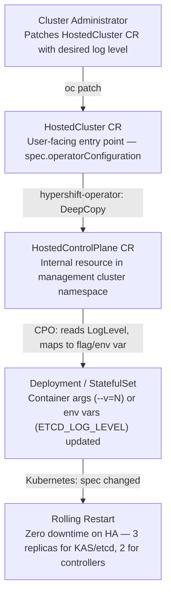
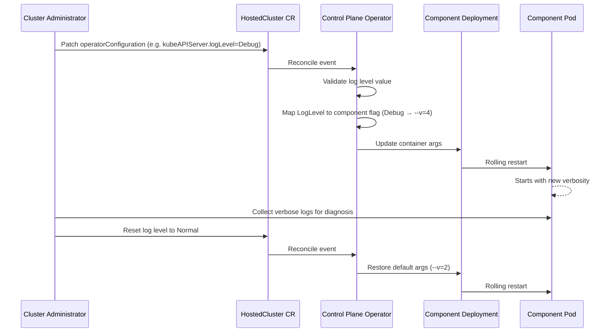

# Configurable Log Levels for Hosted Control Plane Components

## Summary

This enhancement introduces structured, per-component log level configuration for hosted
control plane components managed by the Control Plane Operator (CPO) in HyperShift.
Administrators will be able to set intent-based log levels (`Normal`, `Debug`, `Trace`,
`TraceAll`) on the HostedCluster Custom Resource for kube-apiserver,
kube-controller-manager, kube-scheduler, openshift-apiserver,
openshift-controller-manager, openshift-oauth-apiserver, and oauth-server; and `Normal`
or `Debug` for etcd (etcd's logging model does not support `Trace` or `TraceAll`). The CPO will
translate these intent-based levels into component-specific mechanisms (`--v=N` for
klog-based components, `ETCD_LOG_LEVEL` env var for etcd), achieving operational parity
with standard OCP's `operatorv1.OperatorSpec.LogLevel` pattern. Each component gets a
dedicated per-component type (e.g., `KubeAPIServerOperatorSpec`) that embeds the shared
`ComponentLogLevelSpec` via struct embedding, added to the existing `OperatorConfiguration`
type. This design is future-proof — each component type can be independently extended
without breaking changes. The new fields are gated behind a feature gate and follow a
**gate first, promote when ready** lifecycle.

## Motivation

HyperShift administrators and support engineers currently cannot adjust log verbosity for
hosted control plane components during troubleshooting. In standard OCP, changing log
levels is a routine operation via `oc patch` on operator resources, but in HyperShift the
control plane runs in a management cluster namespace with no user-facing logging
configuration.

This gap creates significant operational pain:

- **Slower incident resolution:** Without verbose logs, diagnosing obscure control plane
  failures requires escalation and often cluster recreation, extending MTTR from hours to
  days.
- **No proactive debugging:** Teams cannot temporarily increase verbosity in pre-production
  to gather data about component behavior before promoting changes.
- **Operational gap vs standard OCP:** Customers managing both standalone and hosted
  clusters face inconsistent tooling, increasing training burden and operational complexity.
- **Support burden:** CEE engineers cannot guide customers through standard log-level-based
  troubleshooting workflows, leading to more escalations to engineering.

Currently only kube-apiserver has a verbosity annotation
(`hypershift.openshift.io/kube-apiserver-verbosity-level`), which is ad-hoc, unvalidated
(raw integer), and inconsistent with the OCP operator pattern. All other components managed
by CPO have no user-facing logging configuration.

This was reported via [RFE-7777](https://issues.redhat.com/browse/RFE-7777) and accepted
as "crucial even for the most minimal troubleshooting."

### User Stories

- As a **service provider engineer** (SRE or CEE) managing hosted control plane components
  on the management cluster, I want to set `Debug` log level on specific components via the
  HostedCluster CR so that I can diagnose control plane issues using standard klog-based
  troubleshooting playbooks.

- As a **platform engineer** running self-managed HyperShift, I want to temporarily set
  `Trace` level on openshift-apiserver and openshift-controller-manager so that I can
  capture detailed component behavior before promoting changes to production.

### Goals

1. Enable administrators to configure log verbosity for all 8 core control plane components
   via the HostedCluster CR, replacing the existing ad-hoc annotation-based mechanism for
   kube-apiserver.
2. Establish the `ComponentLogLevelSpec` pattern and `LogLevelToKlogVerbosity()` utility
   reused across all klog-based components, and `LogLevelToEtcdLevel()` for etcd.
3. Provide a deprecation path for the existing
   `hypershift.openshift.io/kube-apiserver-verbosity-level` annotation.
4. Achieve operational parity with standard OCP's `operatorv1.LogLevel` pattern using
   intent-based log levels (`Normal`, `Debug`, `Trace`, `TraceAll`).
5. Ensure log level changes take effect via rolling restart without downtime on
   HighlyAvailable clusters (SingleReplica clusters will experience a brief service
   interruption during the restart).

### Non-Goals

1. **Configuring all CPO-managed components in this enhancement.** This enhancement covers
   the 8 core control plane components. Additional components may be addressed in follow-up
   enhancements.

2. **The following components are out of scope for this enhancement** due to their logging
   model not supporting a standard configurable verbosity interface compatible with the
   `Normal/Debug/Trace/TraceAll` abstraction:
   - `control-plane-operator` self-log-level: the CPO binary is deployed by the
     *hypershift-operator*, not by CPO's own reconciliation loop. CPO cannot configure its
     own log level through its own reconciliation.
   - Catalog images (`certified-operators-catalog`, `community-operators-catalog`,
     `redhat-operators-catalog`, `redhat-marketplace-catalog`): use opm/gRPC serving with
     no standard verbosity flag.
   - HAProxy-based components (`router`, `ignition-server-proxy`): log level is
     configuration-file-based, not flag-based.
   - `aws-node-termination-handler`: upstream AWS daemon with a custom logging model not
     compatible with intent-based log level mapping.
   - `olm-collect-profiles`, `featuregate-generator`: cronjob/generator workloads, not
     long-running operators with persistent log level state.
   - `metrics-proxy`: internal sidecar with no user-facing verbosity interface.

3. Implementing log aggregation, forwarding, or retention policies for hosted control plane
   component logs.

4. Providing a real-time log streaming interface or console-based log viewer for hosted
   control plane components.

## Proposal

Introduce a new log level configuration section in the HostedCluster API that allows
per-component log level overrides. The CPO will reconcile these settings and propagate them
to the appropriate control plane component deployments and statefulsets.

HyperShift already defines a `LogLevel` type identical to OCP's `operatorv1.LogLevel`,
mapping to the following glog/klog verbosity levels:

| LogLevel         | klog `--v` | etcd `ETCD_LOG_LEVEL` | Use Case                                          |
|------------------|------------|----------------------|---------------------------------------------------|
| Normal (default) | 2          | info                 | Production                                        |
| Debug            | 4          | debug                | Troubleshooting                                   |
| Trace            | 6          | — (rejected)¹        | Deep investigation                                |
| TraceAll         | 8          | — (rejected)¹        | Full dumps — perf impact, may expose secrets      |

¹ etcd uses zap logging which has no granularity below `debug`. Since `Trace` and
`TraceAll` would silently clamp to `debug` with no additional diagnostic value, they are
rejected at admission for etcd via a CEL rule on `EtcdOperatorSpec`. Only `Normal` and
`Debug` are valid for etcd.

The chosen API design uses **structured per-component fields** in `OperatorConfiguration`.
This extends the existing pattern (which already has `ClusterVersionOperator`,
`ClusterNetworkOperator`, and `IngressOperator` fields) with new per-component types, each
embedding the shared `ComponentLogLevelSpec` via `json:",inline"`. Each component gets a
dedicated Go type (e.g., `KubeAPIServerOperatorSpec`) that can be independently extended in
the future without breaking vendoring consumers.

When no log level is specified for a component, the default (`Normal`) is used, preserving
backward compatibility.

### Workflow Description

**cluster administrator** is a human user responsible for managing a hosted cluster via the
HostedCluster CR.

**Control Plane Operator (CPO)** is the operator running in the management cluster that
reconciles hosted control plane components.

1. The cluster administrator identifies a need to increase log verbosity for a specific
   control plane component (e.g., kube-apiserver) to diagnose an issue.
2. The cluster administrator patches the HostedCluster CR to set the desired log level for
   the target component:
   ```bash
   oc patch hostedcluster my-cluster --type=merge -p \
     '{"spec":{"operatorConfiguration":{
       "kubeAPIServer":{"logLevel":"Debug"}}}}'
   ```
3. The CRD validates the log level value at admission time via CEL enum validation.
4. The CPO translates the intent-based log level to the component-specific flag (e.g.,
   `Debug` → `--v=4` for kube-apiserver).
5. The CPO updates the component's deployment/statefulset with the new verbosity flag,
   triggering a rolling restart.
6. The component pods restart with the updated verbosity level.
7. The cluster administrator collects the verbose logs for diagnosis.
8. After troubleshooting, the administrator resets the log level to `Normal` (or removes
   the override), and the CPO triggers another rolling restart to restore default verbosity.

#### Entry Point & Data Flow


```mermaid
flowchart TD
    A["Cluster Administrator\nPatches HostedCluster CR with desired log level"]
    B["HostedCluster CR\nUser-facing entry point — spec.operatorConfiguration"]
    C["HostedControlPlane CR\nInternal resource in management cluster namespace"]
    D["Deployment / StatefulSet\nContainer args (--v=N) or env vars (ETCD_LOG_LEVEL) updated"]
    E["Rolling Restart\nZero downtime on HA — 3 replicas for KAS/etcd, 2 for controllers"]

    A -->|"oc patch"| B
    B -->|"hypershift-operator: DeepCopy"| C
    C -->|"CPO: reads LogLevel, maps to flag/env var"| D
    D -->|"Kubernetes: spec changed"| E
```

#### Sequence Diagram


```mermaid
sequenceDiagram
    participant Admin as Cluster Administrator
    participant HC as HostedCluster CR
    participant CPO as Control Plane Operator
    participant Deploy as Component Deployment
    participant Pod as Component Pod

    Admin->>HC: Patch operatorConfiguration (e.g. kubeAPIServer.logLevel=Debug)
    HC->>CPO: Reconcile event
    CPO->>CPO: Validate log level value
    CPO->>CPO: Map LogLevel to component flag (Debug → --v=4)
    CPO->>Deploy: Update container args
    Deploy->>Pod: Rolling restart
    Pod-->>Pod: Starts with new verbosity
    Admin->>Pod: Collect verbose logs for diagnosis
    Admin->>HC: Reset log level to Normal
    HC->>CPO: Reconcile event
    CPO->>Deploy: Restore default args (--v=2)
    Deploy->>Pod: Rolling restart
```

### API Extensions

This enhancement modifies the `HostedCluster` and `HostedControlPlane` CRDs by adding new
fields to the existing `OperatorConfiguration` struct. The existing
`hypershift.openshift.io/kube-apiserver-verbosity-level` annotation is deprecated in favor
of the new structured API.

#### New Type: ComponentLogLevelSpec

Added to `api/hypershift/v1beta1/operator.go` (where `LogLevel` is already defined):

```go
// ComponentLogLevelSpec configures the log verbosity for a hosted control plane component.
// +kubebuilder:validation:MinProperties=1
type ComponentLogLevelSpec struct {
    // logLevel sets the log verbosity for the component.
    // Valid values are: "Normal", "Debug", "Trace", "TraceAll".
    // When set to Normal, standard operational log messages are produced for auditing and common operations.
    // When set to Debug, more verbose logging is enabled for diagnosing problems.
    // When set to Trace, very verbose logging is enabled including function-level tracing.
    // When set to TraceAll, the most verbose logging is used, including full API body content,
    // this can cause significant performance impact and produce large volumes of logs.
    // When omitted, this means the user has no opinion and the platform
    // chooses a reasonable default, which is subject to change over time.
    // The current default log level is Normal.
    // +optional
    LogLevel LogLevel `json:"logLevel,omitempty"`
}
```

#### Per-Component Wrapper Types

Each component gets a dedicated type that embeds `ComponentLogLevelSpec`. This allows
future per-component extension (e.g., adding `resourceOverrides` to
`KubeAPIServerOperatorSpec`) without breaking Go types for vendoring consumers. The YAML
wire format is unchanged.

```go
// KubeAPIServerOperatorSpec specifies the configuration for the Kube API Server.
// +kubebuilder:validation:MinProperties=1
type KubeAPIServerOperatorSpec struct {
    ComponentLogLevelSpec `json:",inline"`
}

// KubeControllerManagerOperatorSpec specifies the configuration for the Kube Controller Manager.
// +kubebuilder:validation:MinProperties=1
type KubeControllerManagerOperatorSpec struct {
    ComponentLogLevelSpec `json:",inline"`
}

// KubeSchedulerOperatorSpec specifies the configuration for the Kube Scheduler.
// +kubebuilder:validation:MinProperties=1
type KubeSchedulerOperatorSpec struct {
    ComponentLogLevelSpec `json:",inline"`
}

// EtcdOperatorSpec specifies the configuration for the etcd.
// +kubebuilder:validation:MinProperties=1
// +kubebuilder:validation:XValidation:rule="!has(self.logLevel) || self.logLevel in ['Normal', 'Debug']",message="etcd only supports Normal and Debug log levels; Trace and TraceAll are not valid for etcd"
type EtcdOperatorSpec struct {
    ComponentLogLevelSpec `json:",inline"`
}

// OpenShiftAPIServerOperatorSpec specifies the configuration for the OpenShift API Server.
// +kubebuilder:validation:MinProperties=1
type OpenShiftAPIServerOperatorSpec struct {
    ComponentLogLevelSpec `json:",inline"`
}

// OpenShiftControllerManagerOperatorSpec specifies the configuration for the OpenShift Controller Manager.
// +kubebuilder:validation:MinProperties=1
type OpenShiftControllerManagerOperatorSpec struct {
    ComponentLogLevelSpec `json:",inline"`
}

// OpenShiftOAuthAPIServerOperatorSpec specifies the configuration for the OpenShift OAuth API Server.
// +kubebuilder:validation:MinProperties=1
type OpenShiftOAuthAPIServerOperatorSpec struct {
    ComponentLogLevelSpec `json:",inline"`
}

// OAuthServerOperatorSpec specifies the configuration for the OAuth Server.
// +kubebuilder:validation:MinProperties=1
type OAuthServerOperatorSpec struct {
    ComponentLogLevelSpec `json:",inline"`
}
```

#### New Fields in OperatorConfiguration

Added to `api/hypershift/v1beta1/hostedcluster_types.go`, extending the existing
`OperatorConfiguration` struct (which already has CVO, CNO, and Ingress fields):

```go
type OperatorConfiguration struct {
    // ...existing ClusterVersionOperator, ClusterNetworkOperator, IngressOperator fields...

    // kubeAPIServer configures the kube-apiserver component.
    // Setting the logLevel field triggers a rolling restart of the component.
    // When omitted, this means the user has no opinion and the platform
    // chooses a reasonable default, which is subject to change over time.
    // The current default log level is Normal.
    // +optional
    // +openshift:enable:FeatureGate=HCPUserFacingOperatorLogs
    KubeAPIServer KubeAPIServerOperatorSpec `json:"kubeAPIServer,omitzero"`

    // etcd configures the etcd component.
    // Setting the logLevel field triggers a rolling restart of the component.
    // Note: etcd supports fewer log levels than klog-based components,
    // etcd supports only Normal and Debug log levels.
    // When omitted, this means the user has no opinion and the platform
    // chooses a reasonable default, which is subject to change over time.
    // The current default log level is Normal.
    // +optional
    // +openshift:enable:FeatureGate=HCPUserFacingOperatorLogs
    Etcd EtcdOperatorSpec `json:"etcd,omitzero"`

    // kubeControllerManager configures the kube-controller-manager component.
    // Setting the logLevel field triggers a rolling restart of the component.
    // When omitted, this means the user has no opinion and the platform
    // chooses a reasonable default, which is subject to change over time.
    // The current default log level is Normal.
    // +optional
    // +openshift:enable:FeatureGate=HCPUserFacingOperatorLogs
    KubeControllerManager KubeControllerManagerOperatorSpec `json:"kubeControllerManager,omitzero"`

    // kubeScheduler configures the kube-scheduler component.
    // Setting the logLevel field triggers a rolling restart of the component.
    // When omitted, this means the user has no opinion and the platform
    // chooses a reasonable default, which is subject to change over time.
    // The current default log level is Normal.
    // +optional
    // +openshift:enable:FeatureGate=HCPUserFacingOperatorLogs
    KubeScheduler KubeSchedulerOperatorSpec `json:"kubeScheduler,omitzero"`

    // openShiftControllerManager configures the openshift-controller-manager component.
    // Setting the logLevel field triggers a rolling restart of the component.
    // When omitted, this means the user has no opinion and the platform
    // chooses a reasonable default, which is subject to change over time.
    // The current default log level is Normal.
    // +optional
    // +openshift:enable:FeatureGate=HCPUserFacingOperatorLogs
    OpenShiftControllerManager OpenShiftControllerManagerOperatorSpec `json:"openShiftControllerManager,omitzero"`

    // openShiftAPIServer configures the openshift-apiserver component.
    // Setting the logLevel field triggers a rolling restart of the component.
    // When omitted, this means the user has no opinion and the platform
    // chooses a reasonable default, which is subject to change over time.
    // The current default log level is Normal.
    // +optional
    // +openshift:enable:FeatureGate=HCPUserFacingOperatorLogs
    OpenShiftAPIServer OpenShiftAPIServerOperatorSpec `json:"openShiftAPIServer,omitzero"`

    // openShiftOAuthAPIServer configures the openshift-oauth-apiserver component.
    // Setting the logLevel field triggers a rolling restart of the component.
    // When omitted, this means the user has no opinion and the platform
    // chooses a reasonable default, which is subject to change over time.
    // The current default log level is Normal.
    // +optional
    // +openshift:enable:FeatureGate=HCPUserFacingOperatorLogs
    OpenShiftOAuthAPIServer OpenShiftOAuthAPIServerOperatorSpec `json:"openShiftOAuthAPIServer,omitzero"`

    // oauthServer configures the oauth-server component.
    // Setting the logLevel field triggers a rolling restart of the component.
    // When omitted, this means the user has no opinion and the platform
    // chooses a reasonable default, which is subject to change over time.
    // The current default log level is Normal.
    // +optional
    // +openshift:enable:FeatureGate=HCPUserFacingOperatorLogs
    OAuthServer OAuthServerOperatorSpec `json:"oauthServer,omitzero"`
}
```

#### N-1/N+1 Compatibility

| Direction                  | Behavior                                                                              |
|----------------------------|---------------------------------------------------------------------------------------|
| N+1 (new code, old data)   | Old data has no log level fields → zero-value structs → defaults apply                |
| N-1 (old code, new data)   | New data has log level fields → old code ignores unknown JSON keys → no error         |

**Propagation is automatic:** `OperatorConfiguration` is already embedded in
`HostedControlPlaneSpec` and propagated via `DeepCopy()`. Adding new fields requires zero
propagation code — `make update` regenerates the `DeepCopy` method to include them.

### Topology Considerations

#### Hypershift / Hosted Control Planes

This enhancement is specifically designed for HyperShift hosted control planes. The log
level configuration is set on the HostedCluster CR in the management cluster and propagated
to the hosted control plane components running in the management cluster namespace. No
changes are required in the guest cluster.

For managed services (ROSA HCP, ARO HCP), log level configuration is restricted to service
providers (SRE/CEE). Customers do not have direct access to HostedCluster CR fields in
ROSA HCP/ARO HCP. The feature gate governs availability until the feature is promoted to GA.

#### Standalone Clusters

This enhancement does not apply to standalone clusters. Standalone OCP clusters already
have log level configuration via the `operatorv1.OperatorSpec.LogLevel` field on each
operator's CR.

#### Single-node Deployments or MicroShift

This enhancement does not apply to single-node deployments or MicroShift. These topologies
use standalone control plane components with existing log level configuration mechanisms.

#### OpenShift Kubernetes Engine

This enhancement applies to OKE deployments that use HyperShift for hosted control planes.
The log level configuration behavior is identical to standard HyperShift deployments. OKE
does not exclude any functionality required by this enhancement.

### Implementation Details/Notes/Constraints

All 8 components are implemented in a single deliverable.

Log level changes apply to the **main container only**, not sidecars. This matches OCP
behavior — sidecars have different logging models, and `UpdateContainer(ComponentName)`
already targets the main container.

The implementation delivers:

1. **API types:** `ComponentLogLevelSpec` struct, per-component wrapper types
   (`KubeAPIServerOperatorSpec`, etc.), and new fields in `OperatorConfiguration`.
2. **Mapping utilities:** `LogLevelToKlogVerbosity()` and `LogLevelToEtcdLevel()` in
   `support/util/loglevel.go`.
3. **CPO integration for all 8 components:** klog-based components unconditionally inject
   `--v=N` (defaulting to `--v=2` when no log level is set); etcd unconditionally injects
   `ETCD_LOG_LEVEL` (defaulting to `info`). This injection is unconditional — it applies
   regardless of whether the `HCPUserFacingOperatorLogs` feature gate is enabled. The
   feature gate governs API availability (whether users can set the fields), not the
   default verbosity injection. KCM, openshift-controller-manager, openshift-apiserver,
   and oauth-server previously relied on klog's implicit default (level 0) rather than an
   explicit flag; this PR standardizes them to `--v=2` (Normal), matching KAS and
   kube-scheduler which were already at that baseline. The one-time rolling restart this
   causes is intentional — `v=2` is the recommended klog baseline for Kubernetes
   components and aligns with the API contract ("The current default log level is
   Normal").
4. **KAS annotation fallback:** The resolver follows this precedence order: (1) non-empty
   API field value; (2) legacy annotation
   (`hypershift.openshift.io/kube-apiserver-verbosity-level`); (3) default `Normal`. Removing
   the API field restores `Normal` when no annotation is present. Behavior of the annotation
   path on managed services (ROSA HCP / ARO HCP) is not defined by this EP and is deferred
   to Future Work. The deprecation warning condition is tracked separately in
   CNTRLPLANE-3998.
5. **Per-component unit tests** following the `TestAdaptDeployment` pattern.

#### CPO Integration by Component

| Component                    | Logging Model  | File                                    | Mechanism                               |
|------------------------------|----------------|-----------------------------------------|-----------------------------------------|
| kube-apiserver               | klog           | `v2/kas/deployment.go`                  | `--v=N` (supersedes annotation; annotation honored as fallback) |
| kube-controller-manager      | klog           | `v2/kcm/deployment.go`                  | `--v=N` appended to args                |
| kube-scheduler               | klog           | `v2/kube_scheduler/deployment.go`       | `--v=N` (replaces hardcoded `--v=2`)    |
| etcd                         | zap (non-klog) | `v2/etcd/statefulset.go`                | `ETCD_LOG_LEVEL` env var                |
| openshift-apiserver          | klog           | `v2/oapi/deployment.go`                 | `--v=N` appended to args                |
| openshift-controller-manager | klog           | `v2/ocm/deployment.go`                  | `--v=N` appended to args                |
| openshift-oauth-apiserver    | klog           | `v2/oauth_apiserver/deployment.go`      | `--v=N` (replaces hardcoded `--v=2`)    |
| oauth-server                 | klog           | `v2/oauth/deployment.go`                | `--v=N` appended to args                |

#### HA Rolling Restart — Zero Downtime

| Component                    | Replicas (HA) | Why No Impact                                          |
|------------------------------|---------------|--------------------------------------------------------|
| kube-apiserver               | 3             | Load balanced — 2 still serving while 1 restarts       |
| kube-controller-manager      | 2             | Leader election — standby takes over in seconds        |
| kube-scheduler               | 2             | Leader election                                        |
| etcd                         | 3             | Raft quorum — 2 of 3 healthy during rolling update     |
| openshift-apiserver          | 3             | Load balanced                                          |
| openshift-controller-manager | 2             | Leader election                                        |
| openshift-oauth-apiserver    | 3             | Load balanced                                          |
| oauth-server                 | 3             | Load balanced — request-serving component              |

**HighlyAvailable clusters (including ROSA HCP / ARO HCP):** `controllerAvailabilityPolicy:
HighlyAvailable` — control plane components run with full HA replica counts as shown in the
table above. Zero downtime guaranteed during rolling restarts.

**SingleReplica clusters:** `controllerAvailabilityPolicy: SingleReplica` — each control
plane component runs as a single replica. A log level change triggers a rolling restart of
that single replica, which will cause a brief service interruption for the affected
component. Plan log level changes during maintenance windows for SingleReplica clusters.

**Multi-component changes:** When multiple components are changed in a single `oc patch`,
the CPO does not explicitly serialize rollouts across all components. Instead, the CPOv2
dependency graph provides natural layer-based ordering:

- **Layer 0:** etcd (no dependencies) — updated immediately
- **Layer 1:** kube-apiserver (depends on etcd `Available=True` + `RolloutComplete=True`)
- **Layer 2:** KCM, kube-scheduler, openshift-apiserver (implicit KAS dependency)
- **Layer 3:** oauth-apiserver, oauth-server, openshift-controller-manager (depend on
  openshift-apiserver)

Components at the same dependency layer are updated in the same reconciliation pass. HA
safety is guaranteed **per-component** — each component has sufficient replicas (3 for
load-balanced, 2 for leader-elected) to handle rolling restarts without downtime.
Cross-component serialization is not required because each component's rollout is
independent, handled by Kubernetes' own rolling update strategy with proper pod disruption
budgets.

### Risks and Mitigations

**Risk:** `TraceAll` (glog level 8) can dump sensitive data including request bodies and
secrets in component logs.
**Mitigation:** The feature is gated — `TraceAll` cannot reach managed service clusters
until promoted. Operational warnings for `TraceAll` are documented in the API field
godocs and release notes. Since log level configuration is restricted to service providers,
exposure on managed services is an operational concern for SRE/CEE, not a customer-facing
risk.

**Risk:** High verbosity levels significantly increase log volume, potentially impacting log
storage and cluster performance.
**Mitigation:** Document storage impact guidance per log level. Administrators can inspect
the HostedCluster spec directly to identify clusters with non-default log levels.

**Risk:** High verbosity on managed services (ROSA HCP, ARO HCP) increases log volume
flowing to CloudWatch or Azure Monitor, potentially impacting storage costs.
**Mitigation:** Assess cost impact of `Debug` and `Trace` levels per component. Consider
auto-revert to `Normal` after a configurable timeout if needed.

**Risk:** Rolling restarts during log level changes could cause brief API unavailability if
multiple components are changed simultaneously.
**Mitigation:** The CPOv2 dependency graph provides natural layer-based ordering across
components (etcd → KAS → controllers → remaining). Each component's HA guarantees (3
replicas for load-balanced, 2 for leader-elected) ensure zero downtime during its own
rolling restart. See "Multi-component changes" under HA Rolling Restart for details.

### Drawbacks

- Adds API surface to the HostedCluster CRD that requires ongoing maintenance and
  documentation.
- The mapping between intent-based log levels and component-specific flags is not a perfect
  abstraction — etcd uses a different logging model (level-based vs. numeric verbosity) and
  some nuance is lost in translation.
- Log level changes trigger rolling restarts, which is a heavier operation than the in-place
  dynamic reconfiguration some users might expect.
- Etcd's zap-based logging has no granularity below `debug` — `Trace` and `TraceAll` are
  rejected at admission for etcd via a CEL rule on `EtcdOperatorSpec`. Only `Normal` and
  `Debug` are valid for etcd.

## Alternatives (Not Implemented)

1. **Extend the existing annotation pattern:** Add per-component annotations similar to the
   existing KAS verbosity annotation. This was rejected because annotations are unvalidated,
   not discoverable via `oc explain`, and inconsistent with OCP operator conventions.

2. **Expose raw numeric verbosity levels:** Allow users to set raw `--v=N` values directly.
   This was rejected because it does not provide operational parity with OCP's intent-based
   `LogLevel` pattern, requires users to know component-specific verbosity semantics, and
   does not translate well to etcd's level-based logging.

3. **Dynamic log level reconfiguration without restart:** Some components support runtime
   log level changes. This was considered but rejected for the initial implementation
   because not all target components support it, and the rolling restart approach provides
   consistent behavior across all components.

4. **Flat scalar fields (e.g., `kubeAPIServerLogLevel *LogLevel`):** Simpler for users but
   inconsistent with the existing CVO/CNO/Ingress nested pattern in `OperatorConfiguration`,
   and creates a namespace problem if per-component configuration needs to grow beyond just
   log level. The per-component wrapper type approach was chosen for consistency and
   future-proofing.

## Open Questions

1. Should managed services (ROSA HCP, ARO HCP) expose log level configuration to customers
   via ROSA CLI / OCM, or restrict it to SRE/CEE only? Access model to be resolved before
   feature promotion to GA.

   Resolved: The access model for managed services is resolved: log level configuration is
   restricted to service providers (SRE/CEE). Customers do not have direct access to
   HostedCluster CR fields in ROSA HCP/ARO HCP or EKS.

## Test Plan

The testing strategy covers the following areas:

- **Unit tests:** Validate `LogLevelToKlogVerbosity()` mapping for all enum values + nil
  (klog `--v=N`).
- **Unit tests:** Validate `LogLevelToEtcdLevel()` mapping for all enum values + nil
  (`ETCD_LOG_LEVEL`).
- **Serialization compat tests:** N-1/N+1 roundtrip for `OperatorConfiguration` with new
  fields set, mixed, and empty.
- **CRD validation test suite (CEL):** Valid log levels accepted, invalid values rejected
  by enum validation — YAML-based testsuite.yaml under
  `cmd/install/assets/crds/hypershift-operator/tests/`.
- **Per-component adapter tests:** Each of the 8 CPO integration points tested via
  `TestAdaptDeployment*LogLevel` (for deployment-based components) or
  `TestAdaptStatefulSet*LogLevel` (for etcd) within each component's own package,
  asserting `--v=N` or `ETCD_LOG_LEVEL` values in the rendered deployment/statefulset.
- **KAS resolver tests:** `TestResolveKASVerbosity` covers all log level enum values and
  the no-configuration default case; `TestAdaptDeploymentKASLogLevel` validates end-to-end
  flag injection including annotation fallback.

Tests should include `[Jira:"Hosted Control Planes"]` and
`[OCPFeatureGate:HCPUserFacingOperatorLogs]` labels for the component.

## Graduation Criteria

This feature follows a **gate first, promote when ready** lifecycle. The new fields are
gated behind the `HCPUserFacingOperatorLogs` feature gate, consistent with the existing `ClusterVersionOperator` field in
`OperatorConfiguration` which is gated behind
`+openshift:enable:FeatureGate=ClusterVersionOperatorConfiguration`.

Under the continuous release model, promotion does not need to wait for the next OCP
release — it happens when the feature is validated. This is already practiced in OCP
(e.g., dualstack support, Karpenter).

### Dev Preview -> Tech Preview

N/A. This feature ships directly as Tech Preview behind the
`HCPUserFacingOperatorLogs` feature gate.

### Tech Preview

- All 8 per-component wrapper types and `ComponentLogLevelSpec` merged behind feature gate.
- `LogLevelToKlogVerbosity()` and `LogLevelToEtcdLevel()` mapping utilities implemented.
- CPO integration for all 8 components complete; KAS annotation (`hypershift.openshift.io/kube-apiserver-verbosity-level`) honored as fallback with the API field taking precedence.
- Unit tests for all mapping utilities and per-component integration points.
- CRD validation test suite (CEL) passes.

### Tech Preview -> GA
- Serialization compatibility tests (N-1/N+1 roundtrip) pass.
- Verification on all supported platforms.
- CEE validation with [RFE-7777](https://issues.redhat.com/browse/RFE-7777) reporter
  confirms the feature solves their problem.
- User-facing documentation created in
  [openshift-docs](https://github.com/openshift/openshift-docs/)
  ([OSDOCS-19157](https://issues.redhat.com/browse/OSDOCS-19157)).
- Deprecation notice published for the existing KAS verbosity annotation.
- Feature gate promoted — fields available to service providers on all cluster types,
  including managed services (ROSA HCP / ARO HCP).

### Removing a deprecated feature

The existing `hypershift.openshift.io/kube-apiserver-verbosity-level` annotation is
deprecated in OCP 5.1 and will be removed in OCP 5.3.

**Deprecation phase (5.1):** Both the annotation and the new
`operatorConfiguration.kubeAPIServer.logLevel` field are honored. When the annotation is
present, the CPO emits a deprecation warning condition on the HostedCluster
(tracked separately in CNTRLPLANE-3998). If both the annotation and the API
field are set, the API field takes precedence.

**Removal (5.3):** A follow-up PR will:

1. Delete the annotation-reading code path in the KAS reconciler
   (`v2/kas/deployment.go`) — the fallback that checks
   `hypershift.openshift.io/kube-apiserver-verbosity-level` and maps it to `--v=N`.
2. Remove the deprecation warning condition logic that fires when the annotation is
   detected.
3. Update release notes to state the annotation is no longer honored.

After removal, the annotation becomes inert metadata on any HostedCluster that still
carries it — the CPO simply stops reading it. No CRD schema change is required since
annotations are not schema-defined.

## Upgrade / Downgrade Strategy

**Upgrade:** The new log level fields use `omitzero` (non-pointer struct with
`json:",omitzero"`). Clusters upgrading from a version without this feature will have
zero-value structs, and the CPO will apply default verbosity (`Normal`, i.e. `--v=2`).

For kube-apiserver and kube-scheduler, `--v=2` was already explicit — no behavior change.
For kube-controller-manager, openshift-controller-manager, openshift-apiserver, and
oauth-server, these components previously relied on klog's implicit level 0. This upgrade
standardizes them to explicit `--v=2`, triggering a one-time rolling restart per component
on every HyperShift cluster during CPO upgrade. This is intentional: `v=2` is the
recommended klog baseline and aligns with the API contract. No administrator action is
required — the restart is handled automatically by the CPO. The existing KAS verbosity
annotation will continue to be honored during the transition period; if both the annotation
and the new API field are set, the API field takes precedence.

**Downgrade:** If a cluster is downgraded to a version that does not support the new log
level fields, the fields will be ignored by the older CPO. Components will revert to
default verbosity on the next reconciliation. Administrators should reset log levels to
`Normal` before downgrading to avoid unexpected behavior during the transition.

Each component remains available during log level changes because the CPO uses rolling
restarts with proper pod disruption budgets.

## Version Skew Strategy

During an upgrade, the management cluster CPO may be at version N+1 while some hosted
control plane components are still at version N. This is safe because:

- The log level configuration is applied at the deployment/statefulset level by the CPO.
  The CPO at N+1 will set the verbosity flags on component containers regardless of their
  version.
- The `--v=N` flag and `ETCD_LOG_LEVEL` env var are stable across Kubernetes and etcd
  versions and are not version-specific.
- If the CPO at N+1 sets a log level field that a component at version N does not
  recognize, the flag is still a valid command line argument and the component will honor
  it.

## Operational Aspects of API Extensions

This enhancement adds optional fields to the existing `HostedCluster` and
`HostedControlPlane` CRDs. No new webhooks, aggregated API servers, or finalizers are
introduced.

**Impact on existing SLIs:**

- No impact at `Normal` log level.
- Higher verbosity levels increase log volume proportionally. This may affect log storage
  consumption, CPU usage, and potentially control plane latency under sustained
  high-verbosity operation. The resource impact of `Debug` and `Trace` levels has not been
  measured and may vary by component and workload.
- Expected use cases require short-lived non-default log level windows (minutes to hours
  during incident investigation), not permanent elevation.

**How impact is measured:**

- Log volume per component per verbosity level should be characterized during validation
  testing.

**Failure modes:**

- If an invalid log level is specified, CRD enum validation rejects the value at admission
  time. The component continues running at its current verbosity.
- If a log level change causes a failed rolling restart (e.g., resource constraints prevent
  new pod scheduling), the CPO reports a degraded condition on the HostedCluster. Standard
  rollback procedures apply — the previous pod generation remains running.
- If the CPO itself is unavailable during a log level change, the change is queued and
  applied on CPO recovery. No component restarts occur without CPO orchestration.

**Escalation:** The HyperShift / Hosted Control Planes team is responsible for issues
related to log level configuration.

## Support Procedures

**Detecting non-default log levels:**

Inspect the spec directly:

```bash
oc get hostedcluster my-cluster -o jsonpath='{.spec.operatorConfiguration}'
```

**Symptoms of excessive verbosity:**

Increased log volume in the management cluster namespace, potential log storage pressure,
and slightly increased CPU usage on control plane pods. Check pod log rates with:

```bash
oc logs -n <hcp-namespace> deployment/kube-apiserver --tail=100
```

**Resetting to defaults:**

Patch the HostedCluster CR to remove a specific component's log level override:

```bash
oc patch hostedcluster my-cluster --type=json -p \
  '[{"op":"remove",
    "path":"/spec/operatorConfiguration/kubeAPIServer"}]'
```

**Graceful degradation:**

If log level configuration fields are removed or reset, the CPO restores default verbosity
on the next reconciliation. No data loss or cluster instability results from changing or
removing log level settings. The feature fails safely — components continue running at
their current verbosity until the CPO successfully applies the new setting.

**Disabling the feature:**

This enhancement does not introduce a webhook or aggregated API server that can be disabled
independently. Log level configuration is part of the standard CPO reconciliation loop. To
effectively disable the feature, reset all log level fields to `Normal` or remove them from
the HostedCluster spec.

## Future Work

**KAS annotation path on managed services:** The behavior of the legacy
`hypershift.openshift.io/kube-apiserver-verbosity-level` annotation on managed service
clusters (ROSA HCP / ARO HCP) is not defined by this EP. A follow-up should determine
whether the annotation path should be restricted on managed services (e.g., blocked above
`Debug`) and implement the appropriate enforcement before the annotation is removed in 5.3.

A future enhancement may introduce a `defaultLogLevel` field in `OperatorConfiguration`
that sets a baseline verbosity for all components at once. When set, it acts as the default
for any component whose per-component `logLevel` is unset. Per-component `logLevel` fields
always take precedence over the default. The shared `LogLevel` type is used for both the
default and per-component fields, maintaining a unified API type across all components.

## Implementation History

- 2026-06-09: EP created (provisional)
- 2026-07-22: EP updated to address API review feedback — feature gating, per-component
  wrapper types, Phase 3 removed
- 2026-07-26: Removed NonDefaultLogLevel status condition, removed E2E tests, removed Dev
  Preview phase, consolidated Goals into single delivery, updated feature gate name to
  HCPUserFacingOperatorLogs
- 2026-08-14: Corrected API types (value-type LogLevel, MinProperties=1 on all wrapper
  types), collapsed phase split (all 8 components delivered in single PR), updated test
  plan to per-component adapter tests, added defaultLogLevel Future Work direction;
  deprecation warning for legacy annotation tracked separately (CNTRLPLANE-3998)
- 2026-08-24: Addressed coderabbitai review — clarified KAS annotation resolver order and
  deferred annotation managed-service behavior to Future Work; added SingleReplica rolling
  restart caveat; softened SLI performance guarantee; updated version references to
  5.1/5.3; added CEL rule on EtcdOperatorSpec restricting logLevel to Normal and Debug
  only; updated per-component godocs to match PR #8878 implementation
- 2026-08-25: Addressed human reviewer comments — synced godocs and field order with
  PR #8878 (hostedcluster_types.go and operator.go); clarified unconditional --v=2
  injection rationale and one-time rollout for KCM/OCM/OAPI/oauth-server; resolved
  CNTRLPLANE-3998 deprecation warning tracked separately; fixed Goals
  downtime claim to scope zero-downtime guarantee to HighlyAvailable clusters; added
  Future Work entry for annotation path on managed services; qualified etcd log level
  limitation (Normal/Debug only) in Summary; fixed stale last-updated date
- 2026-09-08: Addressed @typeid review — refactored User Stories to two unambiguous
  personas (service provider engineer and self-managed platform engineer); resolved managed
  service access model (restricted to SRE/CEE; customers have no direct HostedCluster CR
  access in ROSA HCP/ARO HCP/EKS); removed stale CEL rule/admission webhook GA
  prerequisites and guardrail language from Graduation Criteria, Topology Considerations,
  and Risks and Mitigations; updated Open Questions with resolution

## Infrastructure Needed

No new infrastructure is required. This enhancement uses existing HyperShift CI
infrastructure and Prow job configurations for testing.
