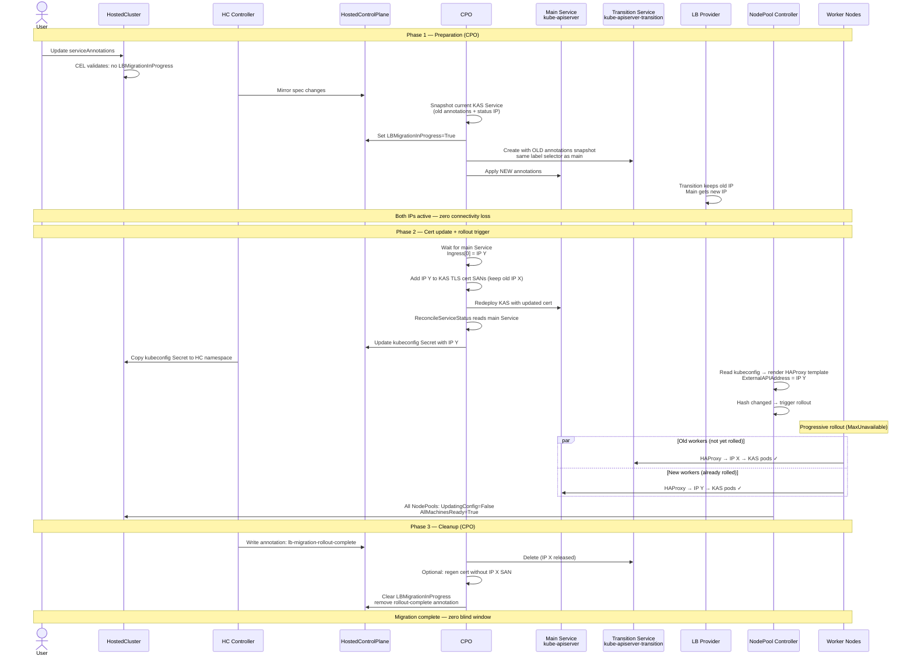

# Deterministic LoadBalancer IP Management for Hosted Control Planes

## Summary

This enhancement extends `LoadBalancerPublishingStrategy` inside `spec.services`
with two provider-agnostic fields for deterministic control of LoadBalancer IP
assignment on the kube-apiserver Service. Scope is **IP-only** — hostname/DNS
indirection is deferred as future work:

- `loadBalancerClass` — standard Kubernetes `Service.spec.loadBalancerClass`
  (GA since K8s 1.24) to select which LB controller provisions the Service.
- `serviceAnnotations` (`map[string]string`) — opaque annotation passthrough to the
  KAS Service. The user provides the exact annotations their LB provider expects.
  HyperShift never learns vendor-specific semantics.

A CEL-based allowlist restricts annotations to known, tested LB provider
prefixes. Adding support for a new provider is a conscious decision that
includes testing — not an implicit side effect.
The `spec.services` immutability CEL rule is migrated from deep-equality to
per-field granular rules, enabling `serviceAnnotations` to be mutable while
keeping all existing fields immutable.

For Day 2 IP migration, a Transition Service pattern enables safe IP changes
without worker connectivity loss. Day 2 changes always trigger a worker rollout;
the Transition Service ensures zero connectivity loss during the rollout.

## Motivation

Multiple enterprise accounts require deterministic LoadBalancer IP assignment for
Hosted Control Planes. The primary use case is Telco/RAN environments where
firewall rules and DNS records must be pre-configured before cluster creation.

Currently, `LoadBalancerPublishingStrategy` only exposes `Hostname` — there is no
mechanism to control IP address pool selection (MetalLB IPAddressPool,
CiliumLoadBalancerIPPool, F5 IPAM labels), specify well-known IP addresses, or
configure provider-specific LoadBalancer settings.
Day 2 IP migration is entirely unsupported and manual attempts risk catastrophic
cluster failure due to worker nodes losing API server connectivity.

### User Stories

- As a Telco platform engineer, I want to specify MetalLB annotations on my
  HostedCluster's kube-apiserver LoadBalancer Service at creation time, so that I
  can pre-configure firewall rules and DNS records before the cluster is provisioned.

- As an AWS HCP administrator, I want to pass EIP allocation annotations to my
  cluster's NLB, so that the API endpoint has a stable, predictable public IP
  address that can be whitelisted in corporate firewalls.

- As a platform operator using F5 BIG-IP, I want to pass F5 CIS annotations to
  my cluster's LoadBalancer, so that the IP assignment integrates with my existing
  F5 infrastructure.

- As an HCP administrator, I want to safely migrate the kube-apiserver LoadBalancer
  IP on a running cluster without worker node connectivity loss, so that I can
  respond to network topology changes without cluster downtime.

- As an HCP administrator using any LB provider, I want a single API field to
  pass annotations without waiting for HyperShift to add typed support for my
  specific provider.

### Goals

- Allow Day 1 deterministic IP/pool assignment for kube-apiserver LB across all
  LB providers.
- Support controller selection for management clusters with multiple LB controllers.
- Support Day 2 IP migration with zero worker connectivity loss.
- Enforce an allowlist: only known, tested providers are accepted by default.
- Maintain backward compatibility: clusters without the new fields behave identically.

### Non-Goals

- **Per-provider typed API structs.** The provider-agnostic approach delegates
  provider semantics to the user via annotations. HyperShift does not validate
  provider-specific annotation values.
- **Hostname/DNS indirection for Day 2.** The initial scope is IP-only. The
  existing `LoadBalancerPublishingStrategy.Hostname` field is preserved as-is (it
  overrides the kubeconfig server URL) but Day 2 hostname changes are deferred as
  future work.
- **None platform support.** HyperShift has no "None" platform. Bare-metal
  self-managed deploys use Agent platform.
- **PowerVS / IBMCloud support.** No RFE, no standard annotation pattern. To be
  evaluated with team input.
- **OAuth or Konnectivity LB configuration.** v1 targets APIServer (public) only.
  OAuth (Azure self-managed) and Konnectivity are stretch goals, but the API
  design supports them without changes.
- **Automatic DNS management for self-managed platforms.** Self-managed platforms
  without ExternalDNS require manual DNS updates; this is documented, not automated.

## Proposal

### Overview

Two new fields under the existing
`spec.services[*].servicePublishingStrategy.loadBalancer` object:

1. **`loadBalancerClass`** (string, optional) — Maps directly to
   `Service.spec.loadBalancerClass`. Selects which LB controller provisions the
   KAS Service. Essential for management clusters with multiple LB providers
   (e.g., F5 for management + MetalLB for tenant Services). Immutable after
   creation (matches Kubernetes semantics — `loadBalancerClass` is immutable on
   Services).

2. **`serviceAnnotations`** (`map[string]string`, optional, mutable) — Passed
   through to the KAS Service as annotations. The user provides exactly the
   annotations their LB provider expects. HyperShift applies them per-key
   (never full-map overwrite) and enforces a CEL allowlist of known provider
   annotation prefixes.

This approach is provider-agnostic by design:
- HyperShift never needs to learn vendor annotation schemas.
- New LB providers work immediately — no API changes, no CRD bumps.
- The LB implementation is a management-cluster property, orthogonal to the
  guest cluster platform. An Agent-platform HC on an AWS management cluster
  has its KAS Service processed by the AWS LB controller, not MetalLB.

Because the fields live inside `LoadBalancerPublishingStrategy`, they
automatically apply per-service. If other services (OAuthServer, Konnectivity)
need deterministic LB IPs in the future, they reuse the same struct with zero
API changes.

#### spec.services Immutability Migration

`spec.services` is currently immutable via a single deep-equality CEL rule:

```go
// +kubebuilder:validation:XValidation:rule=`self.services == oldSelf.services`
```

This blocks any change to any field in the array. To allow `serviceAnnotations`
to be mutable while keeping existing fields immutable, this enhancement:

1. Adds `+kubebuilder:validation:MaxItems=6` to the `services` field (6 service
   types exist in the `ServiceType` enum). This is backward-compatible and
   required for CEL cost budget compliance.

2. Changes the `services` list type from atomic to map with `+listType=map` and
   `+listMapKey=service`, enabling per-element transition rules.

3. Replaces the single deep-equality rule with granular per-field immutability
   rules on each field that must remain immutable.

4. New mutable fields (`serviceAnnotations`) simply omit the immutability marker.

**CEL cost analysis**: The deep-equality rule (`==`) is O(n). The granular
per-field rules use `oldSelf == self` on individual fields within each list
element, correlated by the map key — this is O(1) per field per element, applied
per-element. With `maxItems=6` and ~5 field rules, the estimated cost is
~6 × 5 × 1 = 30, well under the 10M budget. Without `maxItems`, the cost
estimator uses worst-case list size (~30K elements), which would exceed the budget.

### Workflow Description

#### Actors

- **Cluster administrator:** Creates or manages `HostedCluster` resources.
- **HostedCluster controller:** Mirrors HC spec to HCP, copies kubeconfig Secrets,
  mirrors HCP conditions to HC status, relays annotations HC→HCP.
- **CPO (Control Plane Operator):** Reconciles control plane components including
  KAS Service, TLS certificates, and the new Transition Service.
- **NodePool controller:** Renders HAProxy ignition config, computes rollout hash,
  manages progressive rollouts.
- **LB Provider:** External controller (MetalLB, F5 CIS, AWS LB Controller, etc.)
  that processes Service annotations and assigns IPs.

#### Day 1: MetalLB Example

```yaml
apiVersion: hypershift.openshift.io/v1beta1
kind: HostedCluster
spec:
  services:
    - service: APIServer
      servicePublishingStrategy:
        type: LoadBalancer
        loadBalancer:
          loadBalancerClass: "metallb.io/metallb"
          serviceAnnotations:
            metallb.io/loadBalancerIPs: "10.1.1.100"
            metallb.io/address-pool: "production-pool"
    - service: OAuthServer
      servicePublishingStrategy:
        type: Route
    - service: Konnectivity
      servicePublishingStrategy:
        type: Route
    - service: Ignition
      servicePublishingStrategy:
        type: Route
```

1. The HostedCluster controller creates the HostedControlPlane, mirroring
   `spec.services` to HCP.
2. CPO reconciles the KAS Service:
   - Sets `Service.spec.loadBalancerClass` to `metallb.io/metallb`.
   - Applies each entry in `serviceAnnotations` as per-key annotation writes
     on the Service object.
3. MetalLB processes the annotations and assigns IP `10.1.1.100`.
4. `ReconcileServiceStatus()` reads `Service.Status.LoadBalancer.Ingress[0]`,
   propagates to kubeconfig, worker HAProxy config, etc. Standard existing flow.

#### Day 1: AWS NLB with Elastic IPs

```yaml
spec:
  services:
    - service: APIServer
      servicePublishingStrategy:
        type: LoadBalancer
        loadBalancer:
          serviceAnnotations:
            service.beta.kubernetes.io/aws-load-balancer-eip-allocations: "eipalloc-abc123,eipalloc-def456"
```

No `loadBalancerClass` needed — AWS management clusters typically have a single
LB controller (aws-cloud-controller-manager).

#### Day 1: F5 BIG-IP

```yaml
spec:
  services:
    - service: APIServer
      servicePublishingStrategy:
        type: LoadBalancer
        loadBalancer:
          loadBalancerClass: "f5.com/f5-bigip"
          serviceAnnotations:
            cis.f5.com/ip: "10.2.2.50"
            cis.f5.com/ipamLabel: "production"
```

#### Day 1: Azure Static IP

```yaml
spec:
  services:
    - service: APIServer
      servicePublishingStrategy:
        type: LoadBalancer
        loadBalancer:
          serviceAnnotations:
            service.beta.kubernetes.io/azure-load-balancer-ipv4: "20.0.0.100"
```

#### Future: Per-Service LB Configuration

Because the fields live inside `LoadBalancerPublishingStrategy`, extending to
other services requires zero API changes:

```yaml
spec:
  services:
    - service: APIServer
      servicePublishingStrategy:
        type: LoadBalancer
        loadBalancer:
          loadBalancerClass: "metallb.io/metallb"
          serviceAnnotations:
            metallb.io/loadBalancerIPs: "10.1.1.100"
    - service: OAuthServer
      servicePublishingStrategy:
        type: LoadBalancer
        loadBalancer:
          serviceAnnotations:
            metallb.io/loadBalancerIPs: "10.1.1.101"
    - service: Konnectivity
      servicePublishingStrategy:
        type: LoadBalancer
        loadBalancer:
          loadBalancerClass: "metallb.io/metallb"
          serviceAnnotations:
            metallb.io/loadBalancerIPs: "10.1.1.102"
```

#### Day 2: Any serviceAnnotations Change (Transition Service Always)

The Transition Service is created **on every `serviceAnnotations` change**,
regardless of whether the change affects the LB IP. Because annotations are
opaque (CPO does not know which annotations control IP assignment), the safe
default is to always create the safety net.

**Rationale**: The cost of an unnecessary Transition Service is one extra
Service object that gets cleaned up after the rollout. The cost of a missing
Transition Service is worker connectivity loss. Always-on is the correct
tradeoff for an opaque annotation map.

**Detection**: CPO iterates over each key in the HCP spec's `serviceAnnotations`
and compares its value with the same key on the KAS Service. Annotations owned
by other controllers (e.g., MetalLB's `ip-allocated-from-pool`) are ignored —
only user-managed keys from the spec are evaluated. If `serviceAnnotations` did
not previously exist on the spec (first-time assignment), any non-empty map is
treated as a change. If any spec key differs from the Service value → trigger
the Transition Service flow.

##### Flow

1. Administrator changes any annotation in `serviceAnnotations`.
2. CEL validation checks `LBMigrationInProgress` condition — rejects if already
   in progress.
3. CPO reads the current KAS Service and snapshots it (annotations + status IP).
4. CPO sets `LBMigrationInProgress=True` condition on HCP.
5. CPO creates `kube-apiserver-transition` Service:
   - Copies the **old annotations** (snapshot from step 3) and the same
     `loadBalancerClass`.
   - Same label selector as main Service (both route to KAS pods).
   - The LB controller assigns the old IP to the transition Service (because it
     has the same annotations that produced that IP).
6. CPO applies the **new annotations** to the main KAS Service.
7. LB provider reconciles: main gets new IP (or same IP if annotations were
   non-IP-related), transition keeps old IP. Both Services active.
8. CPO waits for main Service to receive new IP in
   `Service.status.loadBalancer.ingress[0]`.
9. CPO adds the new IP to KAS TLS cert SANs, keeping the old IP. Redeploys KAS.
   Kubeconfig is NOT updated until KAS serves the new certificate.
10. `ReconcileServiceStatus()` reads main Service → updates kubeconfig Secret →
    HC controller copies to HC namespace → NodePool controller renders HAProxy →
    hash changes → rollout triggered.
11. Progressive rollout (paced by MaxUnavailable):
    - Old workers: HAProxy → old IP → transition Service → KAS (connected)
    - New workers: HAProxy → new IP → main Service → KAS (connected)
12. All NodePools reach `UpdatingConfig=False` + `AllMachinesReady=True`.
13. HC controller writes `lb-migration-rollout-complete` annotation on HCP.
14. CPO deletes transition Service (old IP released). Optionally regenerates cert
    without old IP SAN. Clears `LBMigrationInProgress`.

##### When the IP didn't actually change

If the annotation change was non-IP-related (e.g., monitoring annotation), then:
- The transition Service gets the same IP as the main Service (same annotations
  that produce the same IP).
- The rollout hash does NOT change (kubeconfig unchanged) → no rollout triggered.
- CPO detects no rollout is needed (NodePools already at target config) → skips
  directly to cleanup → deletes transition Service → clears condition.
- **Net effect**: a transition Service existed for one reconcile cycle. No harm.

##### Edge case: Dynamic IP → Deterministic IP (first-time assignment)

When a cluster transitions from no `serviceAnnotations` (dynamic IP assigned by
LB controller) to deterministic annotations (specific IP), the Transition Service
cannot preserve the old dynamic IP — the old annotations are empty and do not pin
to any IP.

**This path does NOT provide zero-loss migration.** Workers on the old dynamic IP
lose API connectivity and are replaced via the normal rollout mechanism (drain +
delete + create). This is identical to the initial cluster creation flow — it is
a first-time assignment, not a migration.

**Mitigation**: users are advised to set `serviceAnnotations` at cluster creation
time (Day 1). Setting annotations on an existing cluster that never had them is
treated as an initial configuration, not a protected migration. The zero-loss
guarantee only applies to changes between two deterministic IP configurations
(both old and new annotations exist).



#### Day 2: Concurrent Change Protection

CEL validation prevents `serviceAnnotations` changes while a migration is in
progress. The rule is attached at the **HostedCluster resource root** (not
`HostedClusterSpec`) because it needs access to both `spec.services` and
`status.conditions`:

```
// +kubebuilder:validation:XValidation on HostedCluster (resource root):
rule: "!has(oldSelf.status.conditions) ||
       !oldSelf.status.conditions.exists(c,
         c.type == 'LBMigrationInProgress' && c.status == 'True') ||
       self.spec.services == oldSelf.spec.services"
message: "cannot change services while LB migration is in progress"
```

### API Extensions

#### Modified type: LoadBalancerPublishingStrategy

```go
// LoadBalancerPublishingStrategy specifies settings used to expose a service
// as a LoadBalancer.
type LoadBalancerPublishingStrategy struct {
    // hostname is the name of the DNS record that will be created pointing
    // to the LoadBalancer.
    // +kubebuilder:validation:XValidation:rule="!has(oldSelf) || self == oldSelf",message="hostname is immutable once set"
    // +optional
    Hostname string `json:"hostname,omitempty"`

    // loadBalancerClass sets Service.spec.loadBalancerClass to select which
    // LB controller provisions the Service. Required when the management
    // cluster runs multiple LB controllers (e.g., F5 for management + MetalLB
    // for tenant workloads). Maps to the Kubernetes Service field directly.
    // Immutable after creation — matches Kubernetes semantics.
    //
    // +optional
    // +kubebuilder:validation:XValidation:rule="!has(oldSelf) || self == oldSelf",message="loadBalancerClass is immutable once set"
    LoadBalancerClass *string `json:"loadBalancerClass,omitempty"`

    // serviceAnnotations is a map of annotations passed through to the
    // LoadBalancer Service. The user provides the exact annotations their LB
    // provider expects (e.g., metallb.io/loadBalancerIPs,
    // service.beta.kubernetes.io/aws-load-balancer-eip-allocations).
    //
    // Annotations are applied per-key — existing annotations set by other
    // controllers (e.g., MetalLB status annotations) are preserved.
    //
    // Only annotation keys matching known, tested LB provider prefixes are
    // accepted (see allowlist below). Adding a new provider requires adding
    // its prefix to the CEL rule — a conscious decision that includes testing.
    //
    // +optional
    // +kubebuilder:validation:XValidation:rule (see allowlist table for full rule)
    ServiceAnnotations map[string]string `json:"serviceAnnotations,omitempty"`
}
```

#### Modified list type: services

```go
type HostedClusterSpec struct {
    // services defines how control plane services are published.
    //
    // +kubebuilder:validation:MaxItems=6
    // +listType=map
    // +listMapKey=service
    // +kubebuilder:validation:XValidation:rule="oldSelf.all(e, self.exists(s, s.service == e.service))",message="services entries cannot be removed"
    // +kubebuilder:validation:XValidation:rule="self.all(e, oldSelf.exists(o, o.service == e.service))",message="new services entries cannot be added"
    Services []ServicePublishingStrategyMapping `json:"services"`
}
```

#### Immutability CEL migration

The existing deep-equality rule on `HostedClusterSpec`:

```go
// REMOVED:
// +kubebuilder:validation:XValidation:rule=`self.services == oldSelf.services`

// REPLACED BY per-field rules on ServicePublishingStrategyMapping:
```

```go
type ServicePublishingStrategyMapping struct {
    // +kubebuilder:validation:XValidation:rule="self == oldSelf",message="service type is immutable"
    Service ServiceType `json:"service"`

    ServicePublishingStrategy `json:"servicePublishingStrategy"`
}

type ServicePublishingStrategy struct {
    // +kubebuilder:validation:XValidation:rule="self == oldSelf",message="publishing strategy type is immutable"
    Type PublishingStrategyType `json:"type"`

    // +kubebuilder:validation:XValidation:rule="self == oldSelf",message="nodePort config is immutable"
    NodePort *NodePortPublishingStrategy `json:"nodePort,omitempty"`

    // loadBalancer — individual field immutability inside the struct.
    // hostname and loadBalancerClass are immutable; serviceAnnotations is mutable.
    LoadBalancer *LoadBalancerPublishingStrategy `json:"loadBalancer,omitempty"`

    // +kubebuilder:validation:XValidation:rule="self == oldSelf",message="route config is immutable"
    Route *RoutePublishingStrategy `json:"route,omitempty"`
}
```

**Result**: all existing fields remain immutable via their own `self == oldSelf`
rules. `serviceAnnotations` is mutable because it has no immutability rule.
`loadBalancerClass` is immutable via its own rule inside
`LoadBalancerPublishingStrategy`. Future mutable fields simply omit the marker.

#### Annotation allowlist

Only annotation keys matching known, tested LB provider prefixes are accepted
via CEL on `serviceAnnotations`. Adding a new provider is a conscious decision
that includes E2E testing.

| Prefix | Provider | Example annotations |
|--------|----------|-------------------|
| `metallb.io/` | MetalLB (v0.13+) | `loadBalancerIPs`, `address-pool` |
| `metallb.universe.tf/` | MetalLB (legacy) | `loadBalancerIPs`, `address-pool` |
| `service.beta.kubernetes.io/aws-load-balancer-eip*` | AWS NLB (EIP) | `eip-allocations` |
| `service.beta.kubernetes.io/aws-load-balancer-subnet*` | AWS NLB (subnet) | `subnets` |
| `service.beta.kubernetes.io/aws-load-balancer-target-group*` | AWS NLB (TG) | `target-group-attributes` |
| `service.beta.kubernetes.io/azure-load-balancer-ipv*` | Azure LB | `ipv4`, `ipv6` |
| `service.beta.kubernetes.io/azure-load-balancer-resource-group*` | Azure LB (RG) | `resource-group` |
| `networking.gke.io/` | GCP | `load-balancer-ip-addresses` |
| `cis.f5.com/` | F5 BIG-IP CIS | `ip`, `ipamLabel` |
| `lbipam.cilium.io/` | Cilium LB IPAM | `ips`, `sharing-key` |
| `loadbalancer.openstack.org/` | OpenStack Octavia | `floating-network-id`, `floating-subnet-id` |

Annotations not matching any prefix produce a CEL validation error. Adding a
new provider requires adding its prefix to the CEL rule — a conscious decision
that includes E2E testing.

#### New condition: LBMigrationInProgress

A new HCP/HC status condition `LBMigrationInProgress` gates concurrent
`serviceAnnotations` changes during Day 2 IP migration.

### Topology Considerations

#### Hypershift / Hosted Control Planes

This enhancement is exclusively for HyperShift. All changes are in the HyperShift
operator (management cluster) and CPO (HCP namespace). No guest cluster components
are modified.

- **Management cluster**: Modified API types on HostedCluster/HostedControlPlane.
  CPO reconciler changes for KAS Service annotation passthrough, Transition Service
  lifecycle, cert SAN management.
- **Guest cluster**: No changes. Worker HAProxy configuration is managed via
  MachineConfig/Ignition from the management cluster.
- **Split components**: The kubeconfig Secret is generated by CPO in the HCP
  namespace and copied to the HC namespace by the HC controller. The NodePool
  controller reads from HC namespace. This existing chain is leveraged for the
  natural rollout trigger — no new cross-namespace communication needed.

#### Standalone Clusters

Not applicable. Standalone clusters manage LB Services directly.

#### Single-node Deployments or MicroShift

Not applicable. SNO and MicroShift do not use HyperShift.

#### OpenShift Kubernetes Engine

This enhancement adds optional API fields that do not affect OKE functionality.
OKE clusters using HyperShift would benefit from deterministic LB IP assignment
identically to OCP.

### Implementation Details/Notes/Constraints

#### Annotation Passthrough

CPO's `ReconcileService()` uses per-key annotation writes (`svc.Annotations[key] = value`),
never full map overwrite (confirmed at `service.go:67-68`). This means annotations
set by external controllers (MetalLB `ip-allocated-from-pool`, cloud-controller-manager
status annotations) survive every reconciliation loop.

For this feature, `serviceAnnotations` entries from the APIServer's
`LoadBalancerPublishingStrategy` are applied directly as per-key writes.
No translation layer, no vendor-specific logic in CPO.

#### Provider examples

The annotation map covers all known LB providers without any HyperShift code changes:

| Provider | `loadBalancerClass` | `serviceAnnotations` |
|----------|-------------------|---------------------|
| MetalLB | `metallb.io/metallb` | `metallb.io/loadBalancerIPs: "10.1.1.100"`, `metallb.io/address-pool: "prod"` |
| AWS NLB | (not needed — single provider) | `service.beta.kubernetes.io/aws-load-balancer-eip-allocations: "eipalloc-abc"` |
| Azure LB | (not needed) | `service.beta.kubernetes.io/azure-load-balancer-ipv4: "20.0.0.100"` |
| GCP | (not needed) | `networking.gke.io/load-balancer-ip-addresses: "my-ip"` |
| F5 CIS | `f5.com/f5-bigip` | `cis.f5.com/ip: "10.2.2.50"`, `cis.f5.com/ipamLabel: "prod"` |
| Cilium LB IPAM | `io.cilium/bgp-control-plane` | `lbipam.cilium.io/ips: "10.3.3.50"` |
| OpenStack | (not needed) | `loadbalancer.openstack.org/floating-network-id: "<uuid>"` |

New providers work immediately — the user adds annotations, HyperShift passes them through.

#### IP Plumbing Chain (Day 2)

When `serviceAnnotations` change causes the LB controller to assign a new IP,
the new IP propagates through the existing chain without any new code:

```
LB controller assigns new IP
  → Service.status.loadBalancer.ingress[0].ip
  → CPO ReconcileServiceStatus() (kas/service.go:161-167)
  → kubeconfig Secret (server URL = new IP)
  → HC controller copies kubeconfig to HC namespace
  → NodePool controller reads kubeconfig → renders HAProxy template
  → ExternalAPIAddress = new IP in haproxy.cfg
  → ignition content hash changes (config.go:166)
  → new MachineSet → worker rollout
```

The rollout is automatic: the config hash includes `haproxyRawConfig`
(`config.go:277-278`), so any IP change in the kubeconfig produces a new hash.
No new hash logic or rollout trigger is needed.

#### HAProxy and Worker Rollouts

HAProxy kube-apiserver-proxy is deployed as a static pod via MachineConfig/Ignition
on each worker node. The external API address is baked into `haproxy.cfg`
(`assets/haproxy.cfg:29`). HAProxy resolves DNS once at startup and caches forever
— there is no `resolvers` section. This means Day 2 IP changes always require a
worker rollout; there is no hot-reload path.

Any change to the rendered ignition config changes the rollout hash
(`config.go:166`) and triggers full node replacement (drain + delete + create,
paced by MaxUnavailable). The Transition Service ensures zero connectivity loss
during this rollout by maintaining the old IP active until all workers have been
replaced with the new configuration.

#### Controller Coordination

Existing communication channels are reused:
- **CPO → HO**: HCP status conditions mirrored to HC (`hostedcluster_controller.go:783-893`)
- **HO → CPO**: HC spec mirrored to HCP via the standard spec mirror in the
  HostedCluster controller. `spec.services` flows directly — no annotation relay
  needed for the main configuration.

New annotation to register in the relay:
- `hypershift.openshift.io/lb-migration-rollout-complete` — cleanup signal from HO to CPO

Precedent: `AWSLoadBalancerSubnetsAnnotation` (`hostedcluster_controller.go:2873`)
follows the exact same annotation relay pattern.

#### Platform Independence

The LB configuration is inside `spec.services`, not inside platform substructs.
This reflects the reality that the LB provider is a management-cluster property,
orthogonal to the guest cluster platform:

- Agent platform on AWS management cluster → AWS NLB processes the KAS Service
- Agent platform on bare-metal with MetalLB → MetalLB processes the KAS Service
- AWS platform on AWS management cluster → AWS NLB (same provider, different reason)

The CCMs in the HCP namespace are **guest cluster CCMs** — they manage guest
resources. The KAS Service lives in the HCP namespace and is processed by
whatever LB controller runs on the management cluster itself.

#### listType Migration Safety

Changing `spec.services` from atomic to `+listType=map` with `+listMapKey=service`
is documented as a backward-compatible schema change in Kubernetes API conventions.
It changes how server-side apply handles field ownership (from whole-list to
per-element), which is transparent for standard `kubectl apply` and client-go
operations. Since `spec.services` is currently immutable and written once at
creation, the risk of field ownership conflicts during upgrade is minimal.

The `+kubebuilder:validation:MaxItems=6` constraint is backward-compatible —
the `ServiceType` enum has exactly 6 values (APIServer, OAuthServer, OIDC,
Konnectivity, Ignition, OVNSbDb), so no existing cluster can exceed this limit.

### Risks and Mitigations

| Risk | Mitigation |
|------|-----------|
| **User provides invalid annotations** | LB provider ignores unknown annotations. Service stays Pending. Existing conditions surface the failure. Documented. |
| **Reconciliation stripping user annotations** | Confirmed per-key writes at `service.go:67-68`. Unit tests will verify annotation preservation. |
| **Unknown provider needed** | Adding a provider prefix to the allowlist is a one-line CEL change with E2E test. Turnaround is one release cycle. |
| **Transition Service on non-IP changes** | By design: always create Transition Service on any `serviceAnnotations` change. Cost is one extra Service object cleaned up after rollout. No harm when IP doesn't actually change. |
| **Transition Service IP race** | CPO snapshots current Service before applying changes. Creates transition with old annotations first, then applies new annotations. LB controller processes sequentially. |
| **Dynamic→deterministic first-time assignment** | Transition Service cannot pin old dynamic IP (no old annotations). Documented as first-time assignment — rollout without safety net, same as initial provisioning. |
| **Rollout failure leaves dangling transition Service** | Safe degraded state — both Services active. Manual cleanup documented. |
| **No type safety on annotations** | Deliberate tradeoff. Allowlist constrains which providers are accepted; annotation value correctness is the user's responsibility — same as setting annotations directly on any K8s Service. |
| **listType migration** | Backward-compatible per K8s conventions. `spec.services` is write-once today. `maxItems=6` matches the enum. Validated with api-approver. |
| **Per-field immutability drift** | New fields in `ServicePublishingStrategy` are mutable by default. If a field must be immutable, the developer adds one CEL line. CI test verifies all existing fields retain immutability. |

### Drawbacks

- No type safety or `oc explain` discoverability for provider-specific fields.
  Users must know their LB provider's annotation schema. The allowlist ensures
  only known providers are accepted by default.
- The Transition Service pattern adds reconciler complexity. However, it reuses
  existing patterns (`createOrUpdate`, condition mirroring) and the alternative
  (worker connectivity loss) is unacceptable.
- Day 2 IP changes trigger worker rollouts. This is a pre-existing constraint
  (HAProxy config is part of ignition), not introduced by this enhancement.
  The Transition Service mitigates connectivity loss during rollouts.
- The `listType` migration and CEL rule rewrite add upgrade complexity. Mitigated
  by the fact that `spec.services` is write-once and the changes are
  backward-compatible.

## Alternatives (Not Implemented)

### 1. Per-Provider Typed Structs

Provider-specific typed fields inside platform substructs (e.g.,
`AWSLoadBalancerConfig.EIPAllocations`). Discarded:
- Makes HyperShift maintainer of every vendor annotation schema.
- Every new LB provider requires an API change + CRD bump + release cycle.
- Conflates LB provider with guest platform — an Agent HC on AWS uses AWS NLB,
  not MetalLB.
- Internally contradictory when combined with an "unsupported annotation" escape
  hatch (typed structs for safety + untyped blob for everything else).

### 2. Pure HC Annotation (no API field)

Use only HC annotations for Day 1 and Day 2. No API type changes. Discarded: no
OpenAPI validation, no `oc explain` discoverability, fragile JSON strings, no
structured diff. RFE-7201 explicitly proposes API fields.

### 3. Root-Level spec.loadBalancerConfig

A new root-level struct on `HostedClusterSpec`. Discarded:
- Avoids the `spec.services` CEL rewrite but creates API debt if LB config is
  needed per-service in the future.
- Forces a `map[ServiceType]LoadBalancerConfig` or multiple root-level fields
  to support per-service configuration.
- `spec.services` is the natural home for service publishing configuration.

### 4. Automatic MGMT Cluster LB Discovery

HO uses `DetectManagementClusterCapabilities()` to auto-detect the LB provider
and select defaults. Investigated but deferred: the detection mechanism exists
(`support/capabilities/management_cluster_capabilities.go`) and adding CRD checks
is a 1-file change, but auto-detection introduces complexity around multi-provider
clusters and default selection. Can be added as an enhancement on top of this
proposal.

## Future Work

### DNS Indirection (HAProxy Resolvers)

Adding a `resolvers` section to the HAProxy template would allow Day 2 IP changes
without worker rollouts. The design is documented in research (`OCPSTRAT-2653/
research-dns-indirection.md`) and is viable:

- HAProxy `resolvers` + `init-addr last,libc,none` re-resolves DNS every N seconds.
- Bootstrap uses `/etc/hosts` via ignition `append` to seed initial resolution
  (avoids CoreDNS chicken-and-egg — CoreDNS runs in the guest cluster, unavailable
  at first node boot).
- Day 2: update DNS record → HAProxy picks up new IP in ~10-30s → no rollout.
- ~15 lines template change + ~20 lines Go.

Deferred because the RFE scope (OCPSTRAT-2653) only asks for deterministic IP
assignment, not rollout-free Day 2 migration. The Transition Service pattern
provides safe Day 2 with rollout, which covers the v1 use case.

### Automatic MGMT Cluster LB Discovery

HO's `DetectManagementClusterCapabilities()` can be extended to auto-detect MetalLB,
F5 CIS, Cilium, etc. via CRD checks. This would provide UX improvements (default
`loadBalancerClass`, validation hints) but is not required for the annotation
passthrough approach. See `OCPSTRAT-2653/research-mgmt-cluster-discovery.md`.

## Open Questions

1. Should `loadBalancerClass` immutability be enforced at the HC level (CEL) or
   inherited from the Kubernetes Service semantics (fail at Service creation)?
   Recommendation: enforce at HC level via CEL for clearer UX.

2. Should we add an annotation key length or count limit on `serviceAnnotations`?
   Kubernetes already limits total annotation size to 256KB. Probably sufficient.

## Test Plan

### Unit Tests

- `ReconcileService()` passes `serviceAnnotations` per-key to KAS Service.
- `ReconcileService()` sets `loadBalancerClass` on KAS Service.
- CEL allowlist rejects annotations from unknown providers.
- CEL immutability: existing fields (service, type, hostname, loadBalancerClass,
  nodePort, route) remain immutable after migration.
- CEL mutability: `serviceAnnotations` can be changed on update.
- CEL migration guard: rejects changes during `LBMigrationInProgress`.
- Annotation preservation: external annotations survive reconciliation loops.
- Transition Service lifecycle: create, serve during rollout, cleanup after.
- `listType=map` behavior: adding/removing services entries is blocked by
  list-level CEL rules (`oldSelf.all(...)` / `self.all(...)`).

### E2E Tests

- Day 1: Create HC with MetalLB annotations in `serviceAnnotations`, verify
  annotations on KAS Service, verify MetalLB assigns expected IP (requires
  MetalLB in CI).
- Day 2: Change IP annotations with Transition Service, verify zero connectivity
  loss during rollout, verify cleanup after completion.
- `loadBalancerClass`: Create HC with `loadBalancerClass`, verify it's set on
  KAS Service and the correct LB controller processes it.
- Immutability regression: verify existing fields cannot be changed after upgrade.

### Provider Validation (One-Time, Not CI)

- F5 BIG-IP VE Trial VM for end-to-end proof with F5 CIS annotations.
- Cilium LB IPAM with `lbipam.cilium.io/ips` annotation.

## Graduation Criteria

### Dev Preview -> Tech Preview

- Day 1 annotation passthrough functional.
- `loadBalancerClass` support functional.
- Unit test coverage for annotation passthrough and CEL validation.
- CEL immutability migration validated.
- Basic E2E test with MetalLB (if available in CI).

### Tech Preview -> GA

- Day 2 Transition Service flow implemented and tested.
- CEL allowlist validation.
- Load testing with multiple concurrent HostedClusters.
- User-facing documentation in openshift-docs with per-provider examples.
- F5 one-time validation completed.

### GA

- Backhaul SLI telemetry for IP assignment success/failure.
- All E2E tests passing in CI.

### Removing a deprecated feature

Not applicable — this is a new feature.

## Upgrade / Downgrade Strategy

**Upgrade**: Existing clusters without `serviceAnnotations` or `loadBalancerClass`
continue to work identically. The new fields are optional and have no default
behavior when unset. The `listType` migration and CEL rule replacement are
transparent — the same values that were immutable before remain immutable via
per-field rules. No data migration needed.

**Downgrade**: If a cluster was created with `serviceAnnotations`, downgrading the
operator removes the reconciler that applies them. The annotations already set on
the Service persist (Kubernetes does not remove annotations when the controller
that set them is gone). LB provider continues to serve the configured IP. Day 2
changes would require manual annotation management.

## Version Skew Strategy

During upgrade, the HostedCluster controller and CPO may run different versions:

- **Old HO + New CPO**: CPO reads `serviceAnnotations` from HCP's
  `LoadBalancerPublishingStrategy` (mirrored by HO). If HO doesn't know about
  the field, it's passed through as unstructured data in the spec.
- **New HO + Old CPO**: CPO ignores unknown fields. No annotations are set.
  Cluster behaves as before. No harm.

The Transition Service is managed entirely by CPO — no cross-version coordination
needed. The cleanup annotation relay uses existing HC controller annotation
mirroring, which is version-independent.

## Operational Aspects of API Extensions

- **New CRDs**: None. This modifies fields on existing `HostedCluster` and
  `HostedControlPlane` types.
- **Webhooks**: No new webhooks. All validation via CEL on CRD.
- **SLIs**: IP assignment success can be monitored via `Service.Status.LoadBalancer.Ingress`
  population time. Migration progress via `LBMigrationInProgress` condition.
- **Failure mode**: If LB provider fails to assign requested IP (e.g., IP already
  in use, pool exhausted, invalid annotation), the Service stays in Pending state.
  Existing `ExternalDNSReady` and `Available` conditions on HC surface this. No
  new failure mode introduced.
- **Escalation**: HyperShift team (HCP) for reconciler issues. LB provider team
  for provider-specific IP assignment failures.

## Support Procedures

- **Detect**: If `Service.Status.LoadBalancer.Ingress` is empty after expected time,
  check Service annotations match provider expectations. Check LB provider logs for
  assignment errors.
- **Diagnose**: `oc get svc kube-apiserver -n <hcp-namespace> -o yaml` — verify
  annotations are correct and match the LB provider's expected format. Check HC
  status conditions for `LBMigrationInProgress` (stuck migration).
- **Remediate stuck migration**: If `LBMigrationInProgress` is stuck True, check
  NodePool conditions for rollout progress. If rollout is stuck, address the
  underlying NodePool issue. The transition Service keeps old workers connected.
- **Disable**: Remove `serviceAnnotations` and `loadBalancerClass` from the
  APIServer service entry. CPO stops setting LB-related annotations. LB provider
  falls back to default behavior (dynamic IP).

## Infrastructure Needed

- MetalLB availability in CI for E2E testing (TBD — may require CI team coordination).
- F5 BIG-IP VE Trial license for one-time validation (free, time-limited).
