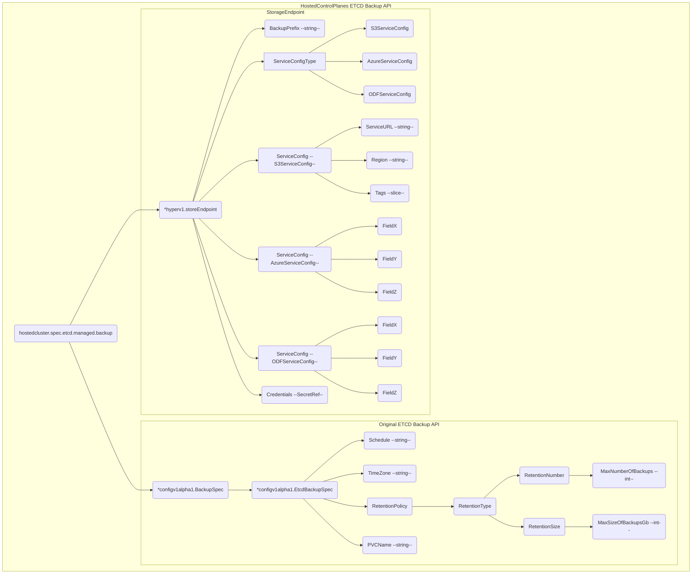
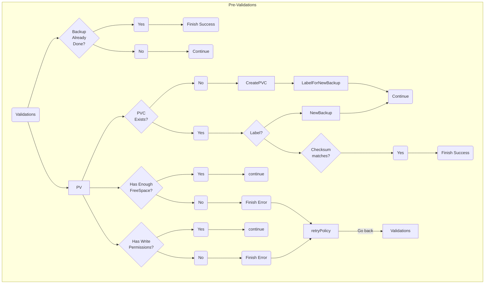
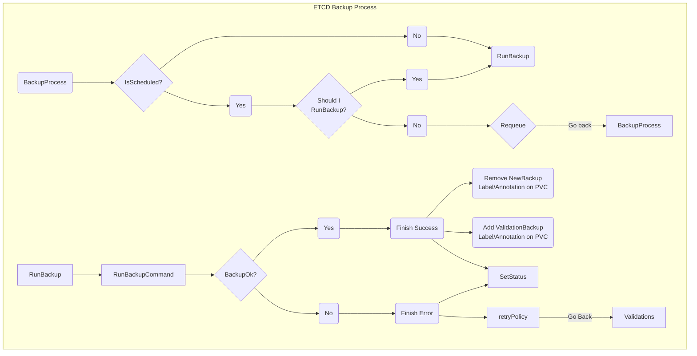
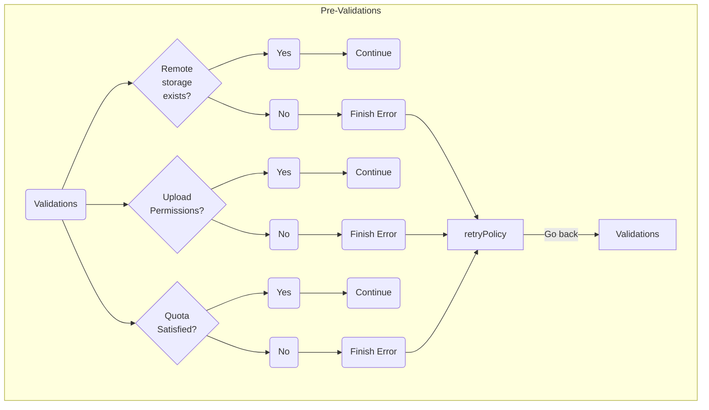
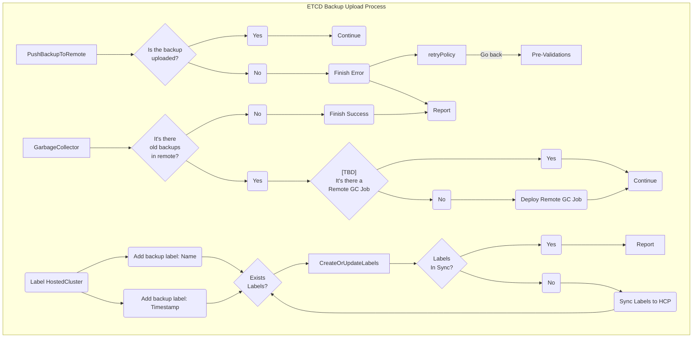
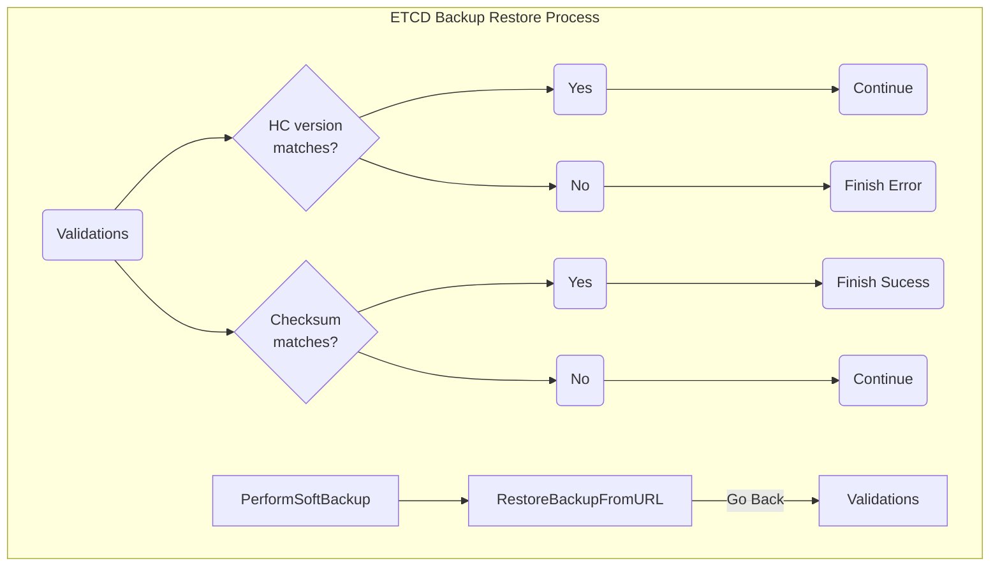

# Hosted Control Plane Etcd Backup API

## Summary

This proposal fleshes out the details for the new automated Etcd Backup API solution for Hosted Control Planes.

## Glossary

- **HCP** - Hosted Control Plane
- **HC** - Hosted Cluster
- **HO** - Hypershift Operator
- **CPO** - Control Plane Operator
- **HCCO** - Hosted Cluster Config Operator
- **PVC** - Persistent Volume Claim
- **PV** - Persistent Volume

## Motivation

Many HCP customers require an etcd backup solution, which we currently provide by utilizing the HCP CLI to access the existing etcd backup procedure ([ADR link](https://docs.google.com/document/d/1gYxpkg9zuFze7BLU6PS2BhpOulqOFV2CL1aAtt5YhD8/edit)). However, this loose integration results in a suboptimal user experience. We propose a more seamless integration by integrating etcd backup directly into the HC API. This approach allows HCP to achieve the necessary integration while leveraging the existing etcd backup API to handle the heavy lifting.

The backup API provides a standardized and documented interface, making it easier for developers and customers to understand and implement backup functionalities for their Hosted Clusters. This not only accelerates the integration process but also encourages the development of a robust ecosystem around /MCE/HostedControlPlanes customers.

The backup API contributes significantly to the reliability of the product by promoting seamless integration, automation, and standardization, ultimately providing users with a more dependable and user-friendly experience.

The API will help with disaster recovery duties, like Hosted Cluster migration or Hosted Cluster recovery, both highly demanded features by Red Hat customers.

### User Stories

- As a customer I want to perform etcd backups of my Hosted Clusters in a concrete time window and schedule at the pace my bussiness needs.
- As a customer/engineer/service provider I want to have the ability to restore etcd cluster in a new hosted cluster.
- As a developer I want to declaratively create etcd backups and upload them to Amazon S3.
- As a developer I want to declaratively create etcd backups and upload them to Azure.
- As a developer I want to declaratively create etcd backups and upload them to an S3 like disconnected block storage platform for Agent and Kubevirt providers.
- As a customer I want to perform etcd backups of my Hosted Clusters in a concrete time window and schedule at the pace my bussiness needs.
- As a customer I want documentation about how to perform the backup and recovery procedures in my Hosted Cluster.
- As a customer I want to restore a ETCD backup with the enough confidence that the new ETCD cluster will contain the same as the moment when I did the backup.

### Goals

- Provide a consumable API for Etcd backup that could be usable in a Hosted Cluster restoration scenario. These are the features included:
  - Schedulable.
  - Capability to select the right Time Zone.
  - Retention policy based on size of the backup or number of backups.
  - Local storage of the backup (PVCs).
  - Remote storage of the backup in a service provider (S3, Azure...).
  - Restoration of the backup in another Hosted Cluster using the already existent API.

### Non-Goals

- Provide a backup/restoration solution for a hosted cluster's volumes
  - This is not covering the Volumes migrations


### Pros and Cons
#### Pros

**Visibility:** Having an API could enhance visibility within the HostedCluster (HC) object, which serves as the primary interface for customers to manage backups. In the event of a backup failure, in addition to log entries, it could update the status.conditions within the HostedCluster object.

**Integration:** Integration with the product is strengthened, meaning that adding new features becomes more straightforward. Employing tightly coupled methods could lead to poor practices.

**Alerting:** The controller can notify users through various channels:

- HC status.conditions
- Log entries
- Events
- Alerting
- Metrics

**Validations:** In this scenario, we incorporate an additional layer of validations (CEL), managed by api-machinery. This layer promptly detects any discrepancies with the API consensus and triggers early failure. Furthermore, additional validations can be employed within the controller.

**Reusability:** Leveraging the existing ETCD backup API developed by the ETCD team, we will integrate the entire API into a new structure within our ETCD API field. Within the same field, we will incorporate the necessary functionality to upload binaries to remote storage such as S3 or Azure.

#### Cons

**Supportability:** Development of the API and support of it during the product life-cycle.
**Complexity:** The Hosted Control Planes team will take the responsibility to stay tuned over the API changes of the ETCD Backup.


## Proposal

The proposal commences with the acknowledgement that a user requires an ETCD backup.

The primary requirement is that the ETCD `managementType` must be configured as `managed`.

This backup operation will be specified within the `hostedcluster.spec.etcd.managed` API custom field under a new field named `backup`. This new field will encompass two childs, with the primary one designated for the backup process itself, directly imported from the original ETCD Backup API. Comprehensive details regarding this API can be found in the official ETCD proposal and its corresponding implementation documentation.

- [ETCD Operator Backup API Design Doc](https://docs.google.com/document/d/1xBnK3D7MCblFgxQ8RUZFyWNIU_bnSFHciLhhHAeP0Xk/edit)
- [ETCD Backup API implementation](https://github.com/openshift/api/pull/1482)
- [Periodic Backup Controller](https://github.com/openshift/cluster-etcd-operator/pull/1074)

The other field is called `storeEndpoint` which basically will take care of the export of the backup object to an external endpoint. This endpoint could be S3, Azure, etc.... Inside of this `storeEndpoint` we have some fields:

- **BackupPrefix:** Where the user could set some kind of prefix to identify that backup in a more readable way. This Prefix will be parsed, validated and used in the final name which will contain the **timestamp**, the **HostedCluster name** and the provided **BackupPrefix**.
- **Credentials:** This is a `SecretReference` located in the HostedCluster namespace using the same name as the backup plus the "credentials" suffix.
- **ServiceConfigType:** This is a enum field which will reference the remote cloud providers to upload the backup object (e.g s3, azure, odf).
- **S3ServiceConfig:** This field is a new type dedicated to the S3 provider. It will contain the details about the remote destination you will upload that backup (warning: This field name is subject to change)
- **AzureServiceConfig:** This field is a new type dedicated to the Azure provider. The implementation details will be included in the future (warning: This field name is subject to change)
- **ODFServiceConfig:** This field is a new type dedicated to the ODF provider. The implementation details will be included in the future (warning: This field name is subject to change)

Each provider struct will be different and for the initial development we will focus on S3 because it could cover AWS and on-premises (MinIO) storage.

- `s3ServiceConfig`:
  - **ServiceURL:** Points to the URL necessary to upload the object.
  - **Region:** This will set the Region for the destination bucket.
  - **Tags:** Necessary tags to label the backup in he destination resources.

### Workflow Description

#### Backup

When a user with a HostedCluster intends to perform a backup, the initial step involves modifying the HostedCluster by introducing a new field within the etcd API field. This new field will serve to incorporate the required parameters and configurations essential for executing backup operations seamlessly within the HostedCluster environment.

```yaml
...
spec:
  controllerAvailabilityPolicy: SingleReplica
  dns:
    baseDomain: hypershiftbm.lab
  etcd:
    managed:
      storage:
        persistentVolume:
          size: 8Gi
        restoreSnapshotURL: null
        type: PersistentVolume
    managementType: Managed
    backup:
      etcdBackup:
        timeZone: "UTC"
        schedule: @weekly
        pvcName: "pre-upgrade-backup"
        retentionPolicy:
          retentionType: RetentionNumber
          retentionNumber:
            maxNumberOfBackups: 10
      storeEndpoint:
        backupPrefix: "pre-upgrade"
        credentials:
          name: "s3-backup-credentials"
        serviceConfig:
          serviceURL: "s3://hc-sample-us-east-1"
          region: "us-east"
          tags:
          - "hostedcluster=hc-sample"
          - "foo=bar"
...
```

Upon introducing this new configuration to the Hosted Cluster, we will undergo the initial layer of validations using CEL with the api-machinery. This step ensures that the user has configured the settings correctly.

Once this initial validation is successful, the subsequent components responsible for taking action are the `ETCDBackupController` and `ETCDUploadController`. These controllers will then proceed with their respective tasks based on the validated configuration.

The behaviour of both controllers will be detailed in the next section. The backup and upload process finishes once the HC is labeled accordingly and the controllers will omit the reconciliation on those HC which the backup are up to date.

#### Restoration

During the restoration process we need to create a new HostedCluster and we need to follow the current restoration process. This process relies on the addition of the `hostedcluster.spec.etcd.managed.storage.restoreSnapshotURL` field. This should point to the resultant URL of the backup process done before.


### API Extensions & Controllers




### Topology Considerations

#### Hypershift / Hosted Control Planes

This is implemented directly for Hypershift.

#### Standalone Clusters

N/A

#### Single-node Deployments or MicroShift

**SNO:** The ETCD backup API and Controllers will work in the same way having 1-N nodes.
**Microshift:** N/A

### Implementation Details/Notes/Constraints

In this section we will dissect the behaviour of the different controller to be implemented.

#### ETCDBackupController

- The `ETCDBackupController` initiates with a series of validations:
  - Checks if the backup has already been performed by examining the HC and HCP labels (further details provided at the end of the process).
  - Validates access permissions to the PVC and available free space. Errors in either could result in log entries, a new status.condition for the HC and HCP, and an event.
  - Verifies the existence and health status of the HostedCluster necessary for performing the backup, as well as the presence of the PVC.
  - The controller creates a new PVC per backup and reschedules the backup for the next iteration, awaiting the status of Bound. This PVC will have a label to be identified as the new vessel for the backup (this label will be deleted later). (1 PVC per backup)
    - If the PVC binding fails after a certain period, the controller will abandon the backup attempt and mark it as a failure.
    - If the PVC it's bound to a PV and contains the label/annotation for "new backup", the controller will trigger the backup process.
    - If the PVC it's bound to a PV and contains the label/annotation for "hash validation", the controller will perform a process to validate the existant backup.
    - TBD: valorate to include a retryPolicy
- The controller initiates the backup process by generating the ETCD backup object in the PVC specified in the manifest.
  - The backup process is directed to a single ETCD member to prevent conflicts during restoration.
  - TBD: valorate to include a retryPolicy
  - The backup object checksum should match with the ETCD cluster health checksum. If the checksums does not matches the backup will be requeued (depending on the retry policy) and marked as failed.
  - The label/annotation for "new backup" is removed and a new label is added for "hash validation" with the proper checksum.
- Upon completion of the backup, the controller performs post-backup tasks:
  - Validates the backup.
  - Sets the status conditions based on the backup process outcome.
- The controller concludes its tasks.






#### ETCDUploadController

- The `ETCDUploadController` will proceed with the task of uploading the generated object to the storeEndpoint.
- This initiates another round of validations:
  - Verification of the existence of the remote storage endpoint.
  - Authentication check/access validation for the remote storeEndpoint.
  - Failure of any of these checks will be reported in the status.condition and logged.
  - TBD: valorate to include a retryPolicy
- Subsequently, the controller will establish the connection and attempt to push the content.
  - Any failures during these processes will be reported in the status.condition and logged.
- The final actions of the controller include:
  - Storing the backup entry in a new section named `hostedcluster.status.backup`, containing backup details (timestamp, backup result, upload result, upload URL, backup name, status).
  - TBD: create another job to perform the GC in the remote storage.
  - Triggering a final task to add new labels in the HCP and HC, including:
    - Two labels: one for the backup name and another for the timestamp. These labels prevent the controller from indefinitely backing up the same cluster.
  - Setting the status conditions based on the upload process outcome.
- The controller completes its tasks.





### ETCD Validation on Restore

Validations on restore phase:

- We need to validate that the ETCD backup comes from an OCP version that matches the destination HostedCluster.
- Once the user performs and upload the ETCD backup to the remote storage a checksum will be generated and annotated in some place (TBD). This checksum should be the same after backup than after restoration so it will be resilient enough to ensure the content is the same in both cases. This checksum is generated using the etcdctl command `etcdctl endpoint health --cluster`.



The PerformSoftBackup step it's there just to make sure we have a safeguard in case the new backup restoration make the cluster to not work properly.

The plan is to modify the current ETCD restoration process to include the required validations and inform the user with the status.

### Risks and Mitigations

New endpoints

- `hostedcluster.v1beta1.hypershift.openshift.io.spec.etcd.managed.backup`
- `hostedcluster.v1beta1.hypershift.openshift.io.spec.etcd.managed.backup.etcdbackup`
- `hostedcluster.v1beta1.hypershift.openshift.io.spec.etcd.managed.backup.etcdbackup.timezone`
- `hostedcluster.v1beta1.hypershift.openshift.io.spec.etcd.managed.backup.etcdbackup.pvcName`
- `hostedcluster.v1beta1.hypershift.openshift.io.spec.etcd.managed.backup.etcdbackup.retentionPolicy`
- `hostedcluster.v1beta1.hypershift.openshift.io.spec.etcd.managed.backup.etcdbackup.retentionPolicy.retentionType`
- `hostedcluster.v1beta1.hypershift.openshift.io.spec.etcd.managed.backup.etcdbackup.retentionPolicy.retentionNumber`
- `hostedcluster.v1beta1.hypershift.openshift.io.spec.etcd.managed.backup.etcdbackup.retentionPolicy.retentionNumber.maxNumberOfBackups`
- `hostedcluster.v1beta1.hypershift.openshift.io.spec.etcd.managed.backup.etcdbackup.retentionPolicy.retentionSize`
- `hostedcluster.v1beta1.hypershift.openshift.io.spec.etcd.managed.backup.etcdbackup.retentionPolicy.retentionSize.maxSizeOfBackupsGb`
- `hostedcluster.v1beta1.hypershift.openshift.io.spec.etcd.managed.backup.storeEndpoint.backupPrefix`
- `hostedcluster.v1beta1.hypershift.openshift.io.spec.etcd.managed.backup.storeEndpoint.credentials`
- `hostedcluster.v1beta1.hypershift.openshift.io.spec.etcd.managed.backup.storeEndpoint.serviceConfig`
- `hostedcluster.v1beta1.hypershift.openshift.io.spec.etcd.managed.backup.storeEndpoint.serviceConfig.serviceURL`
- `hostedcluster.v1beta1.hypershift.openshift.io.spec.etcd.managed.backup.storeEndpoint.serviceConfig.region`
- `hostedcluster.v1beta1.hypershift.openshift.io.spec.etcd.managed.backup.storeEndpoint.serviceConfig.tags`

Main security points:

- Same secret management as being carried out by the HO, CPO, and HCCO.
- No additional permissions needed to perform and manage the backups.
- We will segregate permissions to create the secret in the HostedCluster namespace and replicate those secrets to the HostedControlPlane namespace by the controller.
- The [persona](https://hypershift-docs.netlify.app/reference/concepts-and-personas/) that will benefit from this new API will be the Cluster Service Provider and the Cluster Service Consumer.
- Like other endpoints in Hypershift, the inputs are restricted by the defined types:
  - Enums are limited to the types defined in the code.
  - Strings are restricted to a defined number of characters via OpenAPI.
  - Integers are defined by the Go language.
- All mentioned endpoints require authentication.
- The backup performed is encrypted by default using the key generated for that ETCD cluster.
- The permissions of the provided credentials could be very limited, only allowing for pushing the backup object to a specific S3 bucket. Listing, modifying, or similar actions are not necessary.
- This new component has not yet undergone DUST testing or penetration testing.

**How will security be reviewed and by whom?**

From RH Security team

- David Sastre (@dawud) (Security Architect dedicated to Hypershift)
- Florencio Cano (Backup)

From the internal team:

- Derek Carr (@derekwaynecarr)
- Cesar Wong (@csrwng)
- Alberto Garcia (@enxebre)

**How will UX be reviewed and by whom?**

- @hypershift-team

### Drawbacks

N/A

## Open Questions

- Do we need a retryPolicy for the failure processes?
- The Garbage collector will also clean the remote backups?
  Answer: That might not be necessary. object stores like s3 usually have retention policies.
  Resolution: We will keep this on hold until a customer could potentially ask for this.
- Could the use of backups affect performance at scale, with 80 HostedClusters performing backups simultaneously?

## Test Plan

### Unit Testing

Like any other component, every part of the controller that makes sense to be tested will include unit testing.

### Conformance Testing

Each of the controllers, `ETCDBackupController`, and `ETCDUploadController`, will have its own section to test the behavior of each aspect.

For `ETCDBackupController`:

- Test one-shot backup and validate
- Test scheduled backup and validate

For `ETCDUploadController`:

- Test one-shot backup, validate and upload
- Test scheduled backup, validate and upload

### E2E

For E2E testing, the plan is to develop tests covering the final backup functionality. Currently, tests are available only for AWS, which will be the first provider to be covered. Eventually, more providers will be included. For the Agent/Kubevirt providers, it is likely that we will use Minio or a similar service to mimic the S3 API.

## Graduation Criteria

- Maturity levels
  - `alpha`, `beta`, `stable` in upstream Hypershift
  - `Dev Preview`, `Tech Preview`, `GA` in OpenShift at functionality level.

### Dev Preview -> Tech Preview

- Ability to utilize the enhancement end to end
- End user documentation, relative API stability
- Sufficient test coverage
- E2E Tests coverage
- Gather feedback from users rather than just developers
- Enumerate service level indicators (SLIs), expose SLIs as metrics
- Write symptoms-based alerts for the component(s)

### Tech Preview -> GA

- More testing (upgrade, downgrade, scale)
- Sufficient time for feedback
- Available by default
- Backhaul SLI telemetry
- Document SLOs for the component
- Conduct load testing
- User facing documentation created in [openshift-docs](https://github.com/openshift/openshift-docs/)

### Removing a deprecated feature

- Announce deprecation and support policy of the existing feature
- Deprecate the feature

## Upgrade / Downgrade Strategy

N/A

## Version Skew Strategy

N/A

## Operational Aspects of API Extensions

The additional workload included by these controllers impacts the HostedCluster in some ways. This is exponential to how many HostedClusters you have in your Management Cluster.

### New objects

Each of the hosted cluster will create/have:

- 2 more controllers running in loop.
- 1 new PVC + PV per HostedCluster to store the ETCD backup.
- One new secret for cloud credentials.
- One or two Kubernetes jobs will be deployed into the HCP namespace for garbage colection.
- 2 New status.conditions fields for `BackupProcess` and `UploadBackupProcess`

### Reporting

The additional workload imposed by these controllers has an impact on the HostedCluster in several ways. This impact is proportional to the number of HostedClusters present in your Management Cluster, exhibiting exponential growth.

- **Timestamp:** Timestamp of the last backup done (datetime)
- **Backup Result:** Regards if the backup was finished and validated (success/failure)
- **Upload Result:** Regards if the backup was uploaded properly (success/failure)
- **UploadURL:** Remote URL of the uploaded ETCD snapshot.
- **BackupName:** Name of the Backup.
- **Overall Status:** Overall status of all processes inside the controllers (success/failure).

### Metrics

Some useful metrics:

- Number of the backups finished successful/failed
- Platform used for backup upload

## Support Procedures

To passively detect failures, configuring alerts can be an effective strategy to stay informed about potential issues during the process. However, it's important to note that this aspect will not be included in the initial phase of the enhancement.

To identify possible issues, attention should be given to the following components:

- Hypershift Operator log.
- Control Plane Operator log.
- HostedCluster/HostedControlPlane status.conditions.
- `hostedcluster.status.backup` field.
- Events in the HostedControlPlane namespace
- Metrics

## Infrastructure Needed

Customers will require access to the cloud provider's block storage service to facilitate uploading to an external source. Alternatively, for an offline option, the plan involves deploying a Minio service, which will offer functionality akin to the S3 API. This Minio service must be accessible by the HostedCluster to enable content pushing.


## Alternatives

N/A