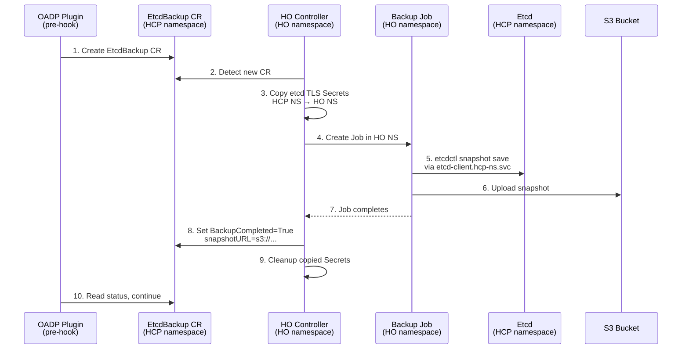

# EtcdBackup CRD for OADP Integration

## Summary

This enhancement introduces a new `EtcdBackup` CRD in the `hypershift.openshift.io/v1beta1` API group that serves as the contract between the OADP HyperShift plugin and the Hypershift Operator for triggering etcd backups and discovering backup URLs. A new controller in the Hypershift Operator watches `EtcdBackup` resources, orchestrates snapshot and upload Jobs in the HO namespace, and reports results back through the CR status. This design keeps management-level cloud credentials isolated from HCP namespaces.

## Motivation

### User Stories

- As an **SRE**, I want to trigger an etcd backup of a hosted cluster so that I can restore it in a disaster recovery scenario.
- As the **OADP plugin**, I want a Kubernetes-native API to request etcd backups and discover the resulting backup URL so that I can integrate etcd snapshots into the standard OADP backup flow.
- As a **platform operator**, I want management-level cloud credentials (S3 access) to remain isolated in the HO namespace so that customer-scoped HCP namespaces are not exposed to service-level credentials.

### Goals

1. Define a CRD that acts as a declarative API for requesting etcd backups.
2. Implement a controller in the HO that orchestrates the backup lifecycle (snapshot + upload).
3. Keep all backup workloads and management credentials in the HO namespace.
4. Report backup status and the resulting snapshot URL through the CR status for OADP consumption.

### Non-Goals

1. Scheduled/periodic backups — this enhancement covers on-demand backups only. Scheduling is an OADP concern.
2. Backup restore — restore is handled by the existing `RestoreSnapshotURL` mechanism in the HCP spec.
3. Multi-cloud storage backends — S3 is the initial target. Other backends can be added later via the `BackupUploader` interface already in the codebase.
4. OADP plugin implementation — the CRD is the contract; the plugin is out of scope. The OADP HyperShift plugin will invoke this CRD as a step within the Velero backup workflow to trigger the etcd snapshot and upload before proceeding with the standard resource backup.

## Proposal

### Workflow Description

1. The OADP plugin (running as a Velero pre-hook or standalone pod) creates an `EtcdBackup` CR in the HCP namespace. The CR spec includes S3 bucket configuration and a reference to an AWS credentials Secret in the HO namespace.

2. The `EtcdBackupReconciler` in the Hypershift Operator detects the new CR and:
   - Validates that a `HostedControlPlane` exists in the same namespace.
   - Copies the etcd TLS Secrets (`etcd-client-tls`, `etcd-ca`) from the HCP namespace to the HO namespace (namespaced to avoid collisions).
   - Creates a `Job` in the HO namespace that runs the `control-plane-operator etcd-backup` binary with:
     - Etcd endpoint: `etcd-client.<hcp-namespace>.svc.cluster.local:2379`
     - Etcd TLS credentials (from copied Secrets)
     - S3 upload configuration and AWS credentials (from the referenced Secret in the HO namespace)

3. The Job takes the etcd snapshot and uploads it to S3.

4. When the Job completes, the controller updates the `EtcdBackup` CR status:
   - Sets `BackupCompleted` condition to `True` with reason `BackupSucceeded`.
   - Sets `status.snapshotURL` to the S3 URL (e.g., `s3://bucket/prefix/1708345200.db`).
   - Cleans up the copied TLS Secrets from the HO namespace.

5. The OADP plugin polls the CR status, detects `BackupCompleted=True`, reads the snapshot URL, and continues with the standard OADP backup flow.

If the Job fails, the controller sets `BackupCompleted=False` with the error in the condition message.


```mermaid
sequenceDiagram
    participant OADP as OADP Plugin<br/>(pre-hook)
    participant CR as EtcdBackup CR<br/>(HCP namespace)
    participant HO as HO Controller<br/>(HO namespace)
    participant Job as Backup Job<br/>(HO namespace)
    participant Etcd as Etcd<br/>(HCP namespace)
    participant S3 as S3 Bucket

    OADP->>CR: 1. Create EtcdBackup CR
    HO->>CR: 2. Detect new CR
    HO->>HO: 3. Copy etcd TLS Secrets<br/>HCP NS → HO NS
    HO->>Job: 4. Create Job in HO NS
    Job->>Etcd: 5. etcdctl snapshot save<br/>via etcd-client.hcp-ns.svc
    Job->>S3: 6. Upload snapshot
    Job-->>HO: 7. Job completes
    HO->>CR: 8. Set BackupCompleted=True<br/>snapshotURL=s3://...
    HO->>HO: 9. Cleanup copied Secrets
    OADP->>CR: 10. Read status, continue
```

### API Extensions

#### New CRD: `EtcdBackup`

```go
// +genclient
// +kubebuilder:object:root=true
// +kubebuilder:resource:path=etcdbackups,scope=Namespaced,shortName=etcdbk
// +kubebuilder:storageversion
// +kubebuilder:subresource:status
// +kubebuilder:printcolumn:name="Completed",type="string",JSONPath=".status.conditions[?(@.type==\"BackupCompleted\")].status"
// +kubebuilder:printcolumn:name="URL",type="string",JSONPath=".status.snapshotURL"
// +kubebuilder:printcolumn:name="Age",type="date",JSONPath=".metadata.creationTimestamp"

// EtcdBackup represents a request to take an etcd snapshot and upload it
// to cloud storage. Creating this resource triggers the backup workflow.
type EtcdBackup struct {
    metav1.TypeMeta   `json:",inline"`
    metav1.ObjectMeta `json:"metadata,omitempty"`
    Spec   EtcdBackupSpec   `json:"spec,omitempty"`
    Status EtcdBackupStatus `json:"status,omitempty"`
}

// EtcdBackupSpec defines the desired backup configuration.
type EtcdBackupSpec struct {
    // storageType selects the cloud storage backend for the backup.
    // +required
    // +kubebuilder:validation:Enum=S3
    // +unionDiscriminator
    StorageType EtcdBackupStorageType `json:"storageType"`

    // s3 defines the S3 storage configuration for uploading the backup.
    // Required when storageType is "S3".
    // +optional
    S3 *EtcdBackupS3 `json:"s3,omitempty"`
}

// EtcdBackupStorageType identifies the cloud storage backend.
// +kubebuilder:validation:Enum=S3
type EtcdBackupStorageType string

const (
    S3BackupStorage EtcdBackupStorageType = "S3"
)

// EtcdBackupS3 defines S3-specific upload configuration.
type EtcdBackupS3 struct {
    // bucket is the S3 bucket name.
    // +required
    // +kubebuilder:validation:MinLength=1
    Bucket string `json:"bucket"`

    // region is the AWS region of the bucket.
    // +required
    // +kubebuilder:validation:MinLength=1
    Region string `json:"region"`

    // keyPrefix is the S3 key prefix for the backup file.
    // +required
    // +kubebuilder:validation:MinLength=1
    KeyPrefix string `json:"keyPrefix"`

    // credentialsSecretRef references a Secret containing AWS credentials
    // for uploading to S3. The Secret must exist in the Hypershift Operator
    // namespace and contain a 'credentials' key with a valid AWS credentials file.
    // +required
    CredentialsSecretRef corev1.LocalObjectReference `json:"credentialsSecretRef"`
}

// EtcdBackupStatus defines the observed state of the backup.
type EtcdBackupStatus struct {
    // conditions tracks the backup lifecycle.
    // +optional
    // +listType=map
    // +listMapKey=type
    // +patchMergeKey=type
    // +patchStrategy=merge
    Conditions []metav1.Condition `json:"conditions,omitempty"`

    // snapshotURL is the cloud provider URL where the backup was stored.
    // Only set when BackupCompleted condition is True.
    // +optional
    SnapshotURL string `json:"snapshotURL,omitempty"`
}
```

**Condition types:**

| Type | Status | Reason | Description |
|------|--------|--------|-------------|
| `BackupCompleted` | `True` | `BackupSucceeded` | Snapshot taken and uploaded successfully |
| `BackupCompleted` | `False` | `BackupFailed` | Job failed; message contains error details |

### Topology Considerations

#### Hypershift / Hosted Control Planes

This enhancement is **exclusively for Hypershift**. The entire design is built around the HyperShift architecture where control planes run in namespaces on a management cluster.

#### Standalone Clusters

Not applicable. Standalone clusters use the standard etcd-operator for backup management.

#### Single-node Deployments or MicroShift

Not applicable.

#### OpenShift Kubernetes Engine

Not applicable.

### Implementation Details/Notes/Constraints

#### Credential Isolation

AWS credentials for S3 access are management-service-scoped (Red Hat-owned in managed offerings like ROSA HCP). These credentials must not be placed in HCP namespaces which are customer-scoped. The `ControlPlaneOperatorARN` in `AWSRolesRef` only grants customer-scoped permissions (ec2, route53, security groups).

The backup Job runs in the HO namespace where management credentials already exist. This ensures clean separation between customer and service credential domains.

#### Cross-Namespace Etcd Access

The backup Job in the HO namespace accesses etcd in the HCP namespace via the Kubernetes service DNS: `etcd-client.<hcp-namespace>.svc.cluster.local:2379`. The required TLS certificates are temporarily copied from the HCP namespace to the HO namespace for the duration of the Job, then cleaned up.

#### Single Job Design

The snapshot and upload happen in a single Job rather than two separate Jobs:
- An etcd snapshot is fast (seconds) and cheap to repeat if the upload fails.
- A single Job avoids PVC coordination, intermediate state management, and cross-Job dependency tracking.
- If the Job fails, the controller can simply create a new one.

#### Existing Binary Reuse

The Job uses the existing `control-plane-operator etcd-backup` binary which already supports both snapshot and upload via the `--upload` flag. The binary uses the `BackupUploader` interface, making it extensible to other cloud storage backends.

### Risks and Mitigations

| Risk | Mitigation |
|------|------------|
| Copied TLS Secrets remain in HO namespace after controller crash | Owner references on copied Secrets pointing to the Job; Kubernetes GC handles cleanup. Controller also cleans up on next reconcile. |
| Etcd endpoint unreachable cross-namespace | The `etcd-client` Service is a ClusterIP service, reachable from any namespace within the cluster. NetworkPolicies in the HCP namespace may need to allow ingress from the HO namespace. |
| Large snapshots cause Job timeouts | The `etcd-backup` binary already has a configurable timeout (default 5m). The Job's `activeDeadlineSeconds` provides an additional safeguard. |
| Multiple concurrent EtcdBackup CRs for the same HCP | The controller should check for in-progress backups and reject concurrent requests via a condition. |

### Drawbacks

- Adds a new CRD to the HyperShift API surface.
- Requires temporary Secret copies across namespaces (mitigated by cleanup).
- The OADP plugin needs to know the HO namespace to reference the credentials Secret.

## Alternatives (Not Implemented)

### HCP Status Condition (Original Approach)

The `etcd-backup` binary sets a status condition directly on the `HostedControlPlane` after backup. This was rejected because:
- It requires AWS credentials in the HCP namespace (or on the Pod running in the HCP namespace).
- The `ControlPlaneOperatorARN` is customer-scoped and cannot be extended with S3 permissions in managed offerings.

### Dedicated ARN in AWSRolesRef

Adding an `EtcdBackupARN` field to `AWSRolesRef` for per-HostedCluster S3 credentials. Rejected because:
- Backup credentials are management-service-scoped, not per-cluster.
- Requires an API change to the HostedCluster type.
- Adds operational burden to configure per-cluster IAM roles for backups.

### CPO Credentials Reuse

Mounting the existing `control-plane-operator-creds` Secret in the backup workload. Rejected because:
- The CPO role is customer-scoped (ec2/route53) and adding S3 permissions violates the separation between customer and service credentials.

## Open Questions

1. **NetworkPolicy**: Do HCP namespaces have NetworkPolicies that would block ingress from the HO namespace to `etcd-client`? If so, the controller may need to create a temporary NetworkPolicy allowing this access.
2. **Credentials Secret lifecycle**: Should the OADP plugin be responsible for creating the AWS credentials Secret in the HO namespace, or should it be pre-provisioned by the platform operator?
3. **CRD naming**: The current name is `EtcdBackup`. Should it be more specific (e.g., `HCPEtcdBackup`) to avoid confusion with standalone etcd backup mechanisms?

## Test Plan

- **Unit tests**: Controller reconcile logic, Job manifest construction, Secret copy/cleanup, status condition updates.
- **Integration tests**: Create an `EtcdBackup` CR, verify the controller creates a Job, simulate Job completion, verify status updates.
- **E2E tests**: Full backup flow with a real HostedCluster — create CR, wait for backup completion, verify snapshot exists in S3.

## Graduation Criteria

### Dev Preview -> Tech Preview

- CRD registered and controller deployed with HO.
- Full backup lifecycle working (create CR → snapshot → upload → status update).
- Unit and integration tests passing.
- OADP plugin can consume the CRD.

### Tech Preview -> GA

- E2E tests validated across AWS environments.
- NetworkPolicy compatibility verified.
- Concurrent backup handling implemented.
- Documentation for OADP plugin integration.
- Secret cleanup verified under failure scenarios.

### Removing a deprecated feature

Not applicable. This is a new feature.

## Upgrade / Downgrade Strategy

- **Upgrade**: The new CRD is additive. Existing clusters are unaffected. The CRD is installed alongside the HO upgrade.
- **Downgrade**: Removing the CRD does not affect existing HostedClusters. In-flight `EtcdBackup` CRs and their associated Jobs would be orphaned and need manual cleanup.

## Version Skew Strategy

The `EtcdBackup` CRD is consumed only by the HO controller and the OADP plugin. Both components are versioned independently. The CRD schema provides forward compatibility through optional fields and standard Kubernetes condition conventions.

## Support Procedures

**Detecting a failed backup:**
```
kubectl get etcdbackup -n <hcp-namespace>
kubectl describe etcdbackup <name> -n <hcp-namespace>
kubectl logs job/<backup-job-name> -n <ho-namespace>
```

**Cleaning up a stuck backup:**
```
kubectl delete etcdbackup <name> -n <hcp-namespace>
kubectl delete job <backup-job-name> -n <ho-namespace>
```

## Operational Aspects of API Extensions

### Failure Modes

- **Job failure**: The CR status condition is set to `BackupCompleted=False` with the error message. The OADP plugin can detect this and retry or fail the OADP backup.
- **Controller unavailable**: The CR remains in its current state. When the controller recovers, it resumes processing.
- **Etcd unreachable**: The Job fails with a timeout. The controller reports the failure in the CR status.

### Support Procedures

**Detecting a failed backup:**
```
kubectl get etcdbackup -n <hcp-namespace>
kubectl describe etcdbackup <name> -n <hcp-namespace>
kubectl logs job/<backup-job-name> -n <ho-namespace>
```

**Cleaning up a stuck backup:**
```
kubectl delete etcdbackup <name> -n <hcp-namespace>
kubectl delete job <backup-job-name> -n <ho-namespace>
```
