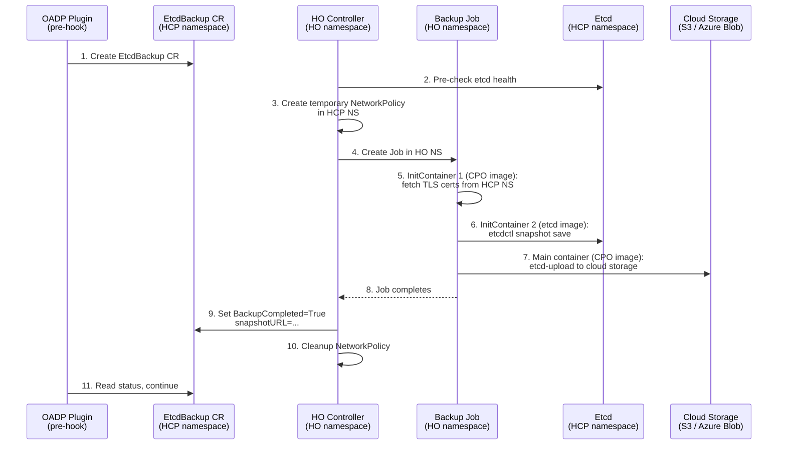

# EtcdBackup CRD for OADP Integration

## Summary

This enhancement introduces a new `EtcdBackup` CRD in the `hypershift.openshift.io/v1beta1` API group that serves as the contract between the OADP HyperShift plugin and the Hypershift Operator for triggering etcd backups and discovering backup URLs. A new controller in the Hypershift Operator watches `EtcdBackup` resources, orchestrates snapshot and upload Jobs in the HO namespace, and reports results back through the CR status. This design keeps management-level cloud credentials isolated from HCP namespaces.

## Motivation

### User Stories

- As an **SRE**, I want to trigger an etcd backup of a hosted cluster so that I can restore it in a disaster recovery scenario.
- As the **OADP plugin**, I want a Kubernetes-native API to request etcd backups and discover the resulting backup URL so that I can integrate etcd snapshots into the standard OADP backup flow.
- As a **platform operator**, I want management-level cloud credentials (S3 access) to remain isolated in the HO namespace so that customer-scoped HCP namespaces are not exposed to service-level credentials.

### Goals

1. Define a CRD that acts as a declarative API for requesting etcd backups.
2. Implement a controller in the HO that orchestrates the backup lifecycle (snapshot + upload).
3. Keep all backup workloads and management credentials in the HO namespace.
4. Report backup status and the resulting snapshot URL through the CR status for OADP consumption.

### Non-Goals

1. Scheduled/periodic backups — this enhancement covers on-demand backups only. Scheduling is an OADP concern.
2. Backup restore — restore is handled by the existing `RestoreSnapshotURL` mechanism in the HCP spec.
3. Storage backends beyond AWS S3 and Azure Blob Storage — the storage backend is designed to be agnostic via an uploader interface that will be implemented as part of this work. The initial implementation will support S3, and Azure Blob Storage will be added subsequently within this same epic. Additional backends can be added later by implementing the same interface.
4. OADP plugin implementation — the CRD is the contract; the plugin is out of scope. The OADP HyperShift plugin will invoke this CRD as a step within the Velero backup workflow to trigger the etcd snapshot and upload before proceeding with the standard resource backup.

## Proposal

### Workflow Description

1. The OADP plugin (running as a Velero pre-hook or standalone pod) creates an `EtcdBackup` CR in the HCP namespace. The CR spec includes the cloud storage configuration (e.g., S3 bucket or Azure Blob container) and a reference to a credentials Secret in the HO namespace.

2. The `EtcdBackupReconciler` in the Hypershift Operator detects the new CR and:
   - Validates that a `HostedControlPlane` exists in the same namespace.
   - Ensures no other backup Job is currently in progress for this HCP (only one backup at a time is allowed).
   - Performs pre-checks on etcd cluster health before proceeding (e.g., verifying quorum and endpoint availability).
   - Creates a temporary NetworkPolicy in the HCP namespace to allow ingress from the HO namespace to etcd pods on port 2379.
   - Creates a `Job` in the HO namespace using a ServiceAccount with access to cloud storage credentials (see [Service Account for Backup Jobs](#service-account-for-backup-jobs)). The Job uses a multi-step pattern (see [Container Image Strategy](#container-image-strategy)):
     - **InitContainer 1** (CPO image): fetches the etcd TLS certificates (`etcd-client-tls`, `etcd-ca`) from the HCP namespace and writes them to a shared `emptyDir` volume.
     - **InitContainer 2** (etcd image from the OCP release payload): runs `etcdctl snapshot save` using the TLS certificates from the shared volume, connecting to `etcd-client.<hcp-namespace>.svc.cluster.local:2379`. Writes the snapshot to a second shared `emptyDir` volume.
     - **Main container** (CPO image): reads the snapshot file and uploads it to the configured cloud storage backend using `control-plane-operator etcd-upload`.

3. The InitContainers run sequentially: first the TLS certificates are fetched, then `etcdctl snapshot save` creates the snapshot. Once both InitContainers complete, the main container uploads the snapshot to cloud storage.

4. When the Job completes, the controller updates the `EtcdBackup` CR status:
   - Sets `BackupCompleted` condition to `True` with reason `BackupSucceeded`.
   - Sets `status.snapshotURL` to the cloud storage URL (e.g., `s3://bucket/prefix/1708345200.db` or `https://<account>.blob.core.windows.net/<container>/prefix/1708345200.db`).
   - Cleans up the temporary NetworkPolicy from the HCP namespace.

5. The OADP plugin polls the CR status, detects `BackupCompleted=True`, reads the snapshot URL, and continues with the standard OADP backup flow.

If the Job fails, the controller sets `BackupCompleted=False` with the error in the condition message.



### API Extensions

#### New CRD: `EtcdBackup`

```go
// +genclient
// +kubebuilder:object:root=true
// +kubebuilder:resource:path=etcdbackups,scope=Namespaced,shortName=etcdbk
// +kubebuilder:storageversion
// +kubebuilder:subresource:status
// +kubebuilder:printcolumn:name="Completed",type="string",JSONPath=".status.conditions[?(@.type==\"BackupCompleted\")].status"
// +kubebuilder:printcolumn:name="URL",type="string",JSONPath=".status.snapshotURL"
// +kubebuilder:printcolumn:name="Age",type="date",JSONPath=".metadata.creationTimestamp"

// EtcdBackup represents a request to take an etcd snapshot and upload it
// to cloud storage. Creating this resource triggers the backup workflow.
type EtcdBackup struct {
    metav1.TypeMeta   `json:",inline"`
    metav1.ObjectMeta `json:"metadata,omitempty"`
    Spec   EtcdBackupSpec   `json:"spec,omitempty"`
    Status EtcdBackupStatus `json:"status,omitempty"`
}

// EtcdBackupSpec defines the desired backup configuration.
// The storage backend is pluggable via an uploader interface to be
// implemented as part of this work. S3 is supported in the initial
// implementation; Azure Blob Storage will be added subsequently
// within this epic.
type EtcdBackupSpec struct {
    // storageType selects the cloud storage backend for the backup.
    // +required
    // +kubebuilder:validation:Enum=S3;AzureBlob
    // +unionDiscriminator
    StorageType EtcdBackupStorageType `json:"storageType"`

    // s3 defines the S3 storage configuration for uploading the backup.
    // Required when storageType is "S3".
    // +optional
    S3 *EtcdBackupS3 `json:"s3,omitzero"`

    // azureBlob defines the Azure Blob Storage configuration for uploading the backup.
    // Required when storageType is "AzureBlob".
    // +optional
    AzureBlob *EtcdBackupAzureBlob `json:"azureBlob,omitzero"`
}

// EtcdBackupStorageType identifies the cloud storage backend.
// +kubebuilder:validation:Enum=S3;AzureBlob
type EtcdBackupStorageType string

const (
    S3BackupStorage        EtcdBackupStorageType = "S3"
    AzureBlobBackupStorage EtcdBackupStorageType = "AzureBlob"
)

// EtcdBackupS3 defines S3-specific upload configuration.
type EtcdBackupS3 struct {
    // bucket is the S3 bucket name.
    // +required
    // +kubebuilder:validation:MinLength=1
    Bucket string `json:"bucket"`

    // region is the AWS region of the bucket.
    // +required
    // +kubebuilder:validation:MinLength=1
    Region string `json:"region"`

    // keyPrefix is the S3 key prefix for the backup file.
    // +required
    // +kubebuilder:validation:MinLength=1
    KeyPrefix string `json:"keyPrefix"`

    // credentialsSecretRef references a Secret containing AWS credentials
    // for uploading to S3. The Secret must exist in the Hypershift Operator
    // namespace and contain a 'credentials' key with a valid AWS credentials file.
    // +required
    CredentialsSecretRef corev1.LocalObjectReference `json:"credentialsSecretRef"`
}

// EtcdBackupAzureBlob defines Azure Blob Storage upload configuration.
type EtcdBackupAzureBlob struct {
    // container is the Azure Blob Storage container name.
    // +required
    // +kubebuilder:validation:MinLength=1
    Container string `json:"container"`

    // storageAccount is the Azure Storage account name.
    // +required
    // +kubebuilder:validation:MinLength=1
    StorageAccount string `json:"storageAccount"`

    // keyPrefix is the blob name prefix for the backup file.
    // +required
    // +kubebuilder:validation:MinLength=1
    KeyPrefix string `json:"keyPrefix"`

    // credentialsSecretRef references a Secret containing Azure credentials
    // for uploading to Blob Storage. The Secret must exist in the Hypershift
    // Operator namespace.
    // +required
    CredentialsSecretRef corev1.LocalObjectReference `json:"credentialsSecretRef"`
}

// EtcdBackupStatus defines the observed state of the backup.
type EtcdBackupStatus struct {
    // conditions tracks the backup lifecycle.
    // +optional
    // +listType=map
    // +listMapKey=type
    // +patchMergeKey=type
    // +patchStrategy=merge
    Conditions []metav1.Condition `json:"conditions,omitempty"`

    // snapshotURL is the cloud provider URL where the backup was stored.
    // Only set when BackupCompleted condition is True.
    // +optional
    SnapshotURL string `json:"snapshotURL,omitempty"`

    // encryptionMetadata captures information about the etcd encryption
    // state at the time of the backup. This metadata allows the restore
    // path to validate KMS key availability before attempting a restore.
    // +optional
    EncryptionMetadata *EtcdBackupEncryptionMetadata `json:"encryptionMetadata,omitempty"`
}

// KMSEncryptionState indicates whether KMS encryption at rest was active.
// +kubebuilder:validation:Enum=Enabled;Disabled
type KMSEncryptionState string

const (
    KMSEncryptionEnabled  KMSEncryptionState = "Enabled"
    KMSEncryptionDisabled KMSEncryptionState = "Disabled"
)

// EtcdBackupEncryptionMetadata captures the encryption state of the etcd
// snapshot at backup time. When KMS encryption at rest is active, the
// snapshot contains DEKs wrapped by the KMS key. The snapshot is only
// restorable if the KMS key remains available and accessible.
type EtcdBackupEncryptionMetadata struct {
    // kmsEncryption indicates whether KMS encryption at rest was active
    // on the hosted cluster's etcd at the time of the backup.
    // +required
    // +kubebuilder:validation:Enum=Enabled;Disabled
    KMSEncryption KMSEncryptionState `json:"kmsEncryption"`

    // kmsKeyID is the identifier of the KMS key used for encryption.
    // Only set when kmsEnabled is true. This allows the restore flow
    // to verify key availability before attempting a restore.
    // For AWS: the KMS key ARN (e.g., arn:aws:kms:us-west-2:123456789:key/...)
    // For Azure: the Key Vault key URL (e.g., https://vault.vault.azure.net/keys/name/version)
    // +optional
    KMSKeyID string `json:"kmsKeyID,omitempty"`
}
```

**Condition types:**

| Type | Status | Reason | Description |
|------|--------|--------|-------------|
| `BackupCompleted` | `True` | `BackupSucceeded` | Snapshot taken and uploaded successfully |
| `BackupCompleted` | `False` | `BackupFailed` | Job failed; message contains error details |

### Topology Considerations

#### Hypershift / Hosted Control Planes

This enhancement is **exclusively for Hypershift**. The entire design is built around the HyperShift architecture where control planes run in namespaces on a management cluster.

#### Standalone Clusters

Not applicable. Standalone clusters use the standard etcd-operator for backup management.

#### Single-node Deployments or MicroShift

Not applicable.

#### OpenShift Kubernetes Engine

Not applicable.

### Implementation Details/Notes/Constraints

#### Credential Isolation

Cloud storage credentials (AWS for S3, Azure for Blob Storage) are management-service-scoped (Red Hat-owned in managed offerings like ROSA HCP and ARO HCP). These credentials must not be placed in HCP namespaces which are customer-scoped.

The backup Job runs in the HO namespace where management credentials already exist. This ensures clean separation between customer and service credential domains.

**Why run the Job in the HO namespace instead of temporarily placing cloud storage credentials in the HCP namespace:**

The design runs the backup Job in the HO namespace and fetches etcd TLS certificates via an InitContainer, rather than running the Job in the HCP namespace with temporary cloud storage credentials. There are two reasons for this:

1. **Cloud storage credentials are management-scoped, not per-cluster.** The backup storage bucket/container is shared infrastructure owned by the service provider (Red Hat in ROSA HCP / ARO HCP). These credentials are analogous to the existing OIDC S3 bucket credentials that the HO already holds. In contrast, every credential Secret in the HCP namespace is customer-scoped — all `AWSRolesRef` roles (`ControlPlaneOperatorARN`, `KubeCloudControllerARN`, `NodePoolManagementARN`, etc.) use STS Web Identity to assume roles in the customer's cloud account with permissions limited to EC2, Route53, EBS, and security groups. The `ControlPlaneOperatorARN` specifically has zero S3 or storage permissions. Placing a management-scoped credential into a customer-scoped namespace breaks this trust model.

2. **Placing management credentials in an HCP namespace is a privilege escalation risk.** In a multi-tenant management cluster, each HCP namespace is an isolation boundary for a single customer. Any workload or operator in that namespace with RBAC to read Secrets could access a management-level credential that grants access to shared infrastructure across all hosted clusters. Etcd TLS secrets, on the other hand, are inherently single-cluster-scoped — they can only authenticate to the etcd of that specific hosted cluster. Fetching them into the more-privileged HO namespace does not expand their blast radius, whereas moving management credentials into a less-privileged HCP namespace would.

#### Service Account for Backup Jobs

The backup Job requires a ServiceAccount in the HO namespace with permissions to read Secrets/ConfigMaps from HCP namespaces (for the InitContainer to fetch etcd TLS certificates) and write access to cloud storage (S3 `PutObject`, Azure Blob write). Three options are under consideration — the decision is pending clarification from ROSA SRE (@Ajpantuso):

1. **Extend the existing HO ServiceAccount** with the additional permissions needed for backup operations. In this case, the cloud storage credentials are already provisioned — only the IAM role associated with the HO needs to be extended with storage permissions.
2. **Create a dedicated ServiceAccount** (`etcd-backup-sa`) with only the minimum permissions required: read Secrets/ConfigMaps in HCP namespaces and write to the cloud storage backend. In this case, the `EtcdBackupReconciler` would be responsible for provisioning the ServiceAccount with the appropriate permissions.
3. **Injectable ServiceAccount** — the operator provides a pre-provisioned ServiceAccount that the controller uses for backup Jobs. This gives managed service teams full control over RBAC and IAM permissions. If this option is chosen, ROSA SRE must justify the need for injectability over a dedicated SA (option 2).

#### Cross-Namespace Etcd Access

The backup Job in the HO namespace accesses etcd in the HCP namespace via the Kubernetes service DNS: `etcd-client.<hcp-namespace>.svc.cluster.local:2379`. The etcd TLS certificates (`etcd-client-tls`, `etcd-ca`) are fetched from the HCP namespace by InitContainer 1 (CPO image) and written to a shared `emptyDir` volume. InitContainer 2 (etcd image) uses these certificates to run `etcdctl snapshot save`. This avoids copying Secrets across namespaces as persistent objects.

#### NetworkPolicy for Cross-Namespace Etcd Access

Every HCP namespace has a `same-namespace` NetworkPolicy that acts as a default-deny for cross-namespace ingress — only pods within the same namespace can reach each other. There is no etcd-specific NetworkPolicy. This means a backup Job running in the HO namespace is blocked from reaching `etcd-client` on port 2379 by default.

To allow the backup Job to access etcd, the controller must create a temporary NetworkPolicy in the HCP namespace that permits ingress from the HO namespace to etcd pods on port 2379. This NetworkPolicy is scoped to pods with label `app: etcd` and restricted to TCP port 2379. It is created alongside the backup Job and cleaned up after the Job completes (or via owner references for GC in failure scenarios).

#### Consequences of Running the Job in the HO Namespace

Running the backup Job in the HO namespace instead of the HCP namespace introduces several trade-offs that must be considered:

- **Service network overhead**: The etcd snapshot is transferred across the cluster service network (from the HCP namespace to the HO namespace) rather than being a local in-namespace operation. This can add load to the service network, especially with large snapshots.
- **Node scheduling**: The Job may be scheduled on a different node than the etcd pod, adding network latency and cross-node traffic. Future optimization could include node affinity to co-locate the backup Job with the etcd pod.
- **NetworkPolicy management**: A temporary NetworkPolicy must be created and cleaned up for each backup operation.

The initial mitigation for these trade-offs is to **serialize backup Jobs** — only one backup at a time is allowed across the controller. If performance issues arise under this model, further optimizations (node affinity, bandwidth throttling) will be evaluated.

#### Artifact Encryption (SSE-KMS / Azure CMK)

Per-tenant encryption of the backup artifact in cloud storage (via per-HCP KMS keys) is under discussion and may be added in a future iteration. The initial implementation will use the default encryption settings of the bucket or storage account (typically SSE-S3 or Azure platform-managed keys). See Open Question #5.

Note that this is **independent of etcd encryption at rest** — the `encryptionMetadata` in the status tracks the KMS key used by etcd internally (for encrypting Secrets, ConfigMaps, etc. inside etcd), not the artifact-level encryption of the stored snapshot file.

#### Etcd Health Pre-Checks

Before creating the backup Job, the controller performs pre-checks on the etcd cluster health to avoid taking a snapshot of an unhealthy cluster. This includes verifying endpoint availability and quorum status. If the etcd cluster is unhealthy, the controller sets `BackupCompleted=False` with reason `EtcdUnhealthy` and does not proceed with the Job creation.

#### Backup Retention

Backup retention is managed via TTL and count-based policies configured externally (e.g., through the HO CLI or Velero TTL). The `EtcdBackup` CRs are simple records — deleting a CR does **not** delete the corresponding cloud storage object.

This approach has several advantages:
- **PutObject-only permissions** — the backup Job's ServiceAccount only needs write access to cloud storage (`s3:PutObject` + `s3:GetObject` / Azure Blob write + read), not delete permissions. This reduces the blast radius of the credentials.
- **Overwrite prevention via conditional writes** — the `etcd-upload` subcommand uses the [`If-None-Match: *` conditional write header](https://docs.aws.amazon.com/AmazonS3/latest/userguide/conditional-writes.html) on the PutObject call. If an object with the same key already exists, S3 returns a `412 Precondition Failed` and the upload fails, preventing any accidental or malicious overwrite. This is enforced at the application level since S3 IAM cannot distinguish "create new" from "overwrite existing" — both are covered by `s3:PutObject`. Combined with **S3 Versioning** on the bucket as an additional safety net, original objects are preserved even in edge cases.
- **No finalizer complexity** — avoids issues with stuck CRs when cloud storage credentials are unavailable at deletion time.
- **Decoupled lifecycle** — cloud storage object retention is managed by the storage backend's native lifecycle policies (S3 Lifecycle Rules, Azure Blob lifecycle management) or by the OADP/Velero TTL mechanism.

The HO CLI (or an external operator) is responsible for cleaning up old `EtcdBackup` CRs based on count thresholds (e.g., keep the last 5 `EtcdBackup` CRs per HCP, delete the oldest Kubernetes object when exceeded). Cloud storage object cleanup is handled by the storage backend's lifecycle policies.

#### Single Job Design

The snapshot and upload happen in a single Job rather than two separate Jobs:
- An etcd snapshot is fast (seconds) and cheap to repeat if the upload fails.
- A single Job avoids PVC coordination, intermediate state management, and cross-Job dependency tracking.
- If the Job fails, the controller can simply create a new one.
- The Job sets `.spec.ttlSecondsAfterFinished` to automatically clean up completed/failed Job resources after a configurable period, preventing accumulation of finished Jobs in the HO namespace.

#### Container Image Strategy

The backup Job requires two binaries that live in different container images:

- **`etcdctl`** is in the **etcd image** from the OCP release payload (`github.com/openshift/etcd`). It is **not** present in the CPO image.
- **`control-plane-operator`** is in the **CPO image**. It contains the cloud storage upload logic (AWS SDK, Azure SDK).

Rather than copying binaries between containers, the Job uses a **multi-step pattern** where each container runs only the binaries native to its image:

1. **InitContainer 1** (CPO image): Fetches etcd TLS certificates (`etcd-client-tls`, `etcd-ca`) from the HCP namespace and writes them to a shared `emptyDir` volume (`/etc/etcd-certs/`).
2. **InitContainer 2** (etcd image): Runs `etcdctl snapshot save` directly using the TLS certificates from the shared volume. Connects to etcd via `etcd-client.<hcp-namespace>.svc.cluster.local:2379`. Writes the snapshot to a second shared `emptyDir` volume (`/etc/etcd-backup/snapshot.db`).
3. **Main container** (CPO image): Reads the snapshot file from the shared volume and uploads it to the configured cloud storage backend using a new `control-plane-operator etcd-upload` subcommand. This subcommand handles only the upload (S3/Azure Blob) — it does not call `etcdctl`.

This approach has several advantages:
- **No binary copying** between containers — each image runs only its own binaries.
- **Version compatibility** — `etcdctl` in the etcd image is always version-compatible with the etcd deployed by the CPO, as both come from the same OCP release payload.
- **Clean separation of concerns** — the snapshot step uses etcd tooling, the upload step uses cloud SDKs.
- **The existing `etcd-backup` subcommand** (which shells out to `etcdctl`) is superseded by this multi-step approach. A new `etcd-upload` subcommand will be added to the CPO that accepts a snapshot file path and uploads it to cloud storage.

#### Existing Binary and Manifest Reuse

The existing `control-plane-operator etcd-backup` subcommand handles both snapshot and upload in a single step by shelling out to `etcdctl`. This subcommand is superseded by the multi-step Job approach. A new `control-plane-operator etcd-upload` subcommand will be added that accepts a snapshot file path and uploads it to the configured cloud storage backend. As part of this work, an uploader interface will be implemented to make the upload extensible to other cloud storage backends (starting with Azure Blob Storage).

The codebase already contains unused manifest scaffolding for etcd backups (`EtcdBackupCronJob` and `EtcdBackupServiceAccount` in `manifests/etcd.go`), which were added but never wired to any controller. The `EtcdBackupReconciler` introduced by this enhancement will create on-demand `batch/v1.Job` resources (not CronJobs). The existing CronJob scaffolding will be removed or superseded by this CRD-driven approach.

### Risks and Mitigations

| Risk | Mitigation |
|------|------------|
| Temporary NetworkPolicy not cleaned up after controller crash | Owner references on the NetworkPolicy pointing to the Job; Kubernetes GC handles cleanup. Controller also cleans up on next reconcile. |
| Etcd endpoint unreachable cross-namespace | The `etcd-client` Service is a ClusterIP service, reachable from any namespace within the cluster. A temporary NetworkPolicy is created to allow ingress from the HO namespace. |
| Large snapshots cause Job timeouts | The `etcd-backup` binary already has a configurable timeout (default 5m). The Job's `activeDeadlineSeconds` provides an additional safeguard. |
| Multiple concurrent EtcdBackup CRs for the same HCP | The controller enforces serial execution — only one backup Job runs at a time. Concurrent requests are rejected with a `BackupCompleted=False` condition and reason `BackupAlreadyInProgress`. |
| KMS key deleted or rotated after backup | The etcd snapshot contains DEKs wrapped by the KMS key used for etcd encryption at rest. If the key is deleted, the backup becomes unrestorable. The `encryptionMetadata` in the status captures the KMS key ID (AWS ARN or Azure Key Vault URL). The restore path must verify that the KMS key referenced in `kmsKeyID` is still available and matches the expected key before attempting a restore — if the keys do not match, the restoration must fail explicitly rather than proceeding with an unrecoverable state. KMS key lifecycle management is outside the scope of this enhancement. |

### Drawbacks

- Adds a new CRD to the HyperShift API surface.
- Cross-namespace etcd access requires temporary NetworkPolicy management.
- The OADP plugin needs to know the HO namespace to reference the credentials Secret.
- Service network overhead from cross-namespace snapshot transfer (mitigated by serial execution).
- If the KMS key is deleted (not rotated), all previous etcd backups encrypted with that key become permanently unrestorable. Key rotation is safe — AWS KMS retains all previous key material versions under the same ARN, and Azure Key Vault preserves old key versions in the vault. However, if the key is deleted and the deletion waiting period expires (7-30 days for AWS, 7-90 days for Azure with soft-delete), the key material is permanently destroyed and the encrypted DEKs in the backups can no longer be unwrapped.

## Alternatives (Not Implemented)

### HCP Status Condition (Original Approach)

The `etcd-backup` binary sets a status condition directly on the `HostedControlPlane` after backup. This was rejected because:
- It requires cloud storage credentials in the HCP namespace (or on the Pod running in the HCP namespace).
- The customer-scoped roles (e.g., `ControlPlaneOperatorARN` on AWS) cannot be extended with storage permissions in managed offerings.

### Dedicated ARN in AWSRolesRef

Adding an `EtcdBackupARN` field to `AWSRolesRef` for per-HostedCluster S3 credentials. Rejected because:
- Backup credentials are management-service-scoped, not per-cluster.
- Requires an API change to the HostedCluster type.
- Adds operational burden to configure per-cluster IAM roles for backups.

### CPO Credentials Reuse

Mounting the existing `control-plane-operator-creds` Secret in the backup workload. Rejected because:
- The CPO role is customer-scoped (ec2/route53) and adding cloud storage permissions violates the separation between customer and service credentials.

## Open Questions

1. **Service Account for backup Jobs**: Should the controller reuse the existing HO ServiceAccount (option 1), create a dedicated `etcd-backup-sa` (option 2), or support an injectable SA provided by the operator (option 3)? @Ajpantuso has proposed the injectable SA approach — pending justification for why injectability is needed over a dedicated SA. See [Service Account for Backup Jobs](#service-account-for-backup-jobs).
2. **CRD naming**: The current name is `EtcdBackup`. Should it be more specific (e.g., `HCPEtcdBackup`) to avoid confusion with standalone etcd backup mechanisms?
3. ~~**EtcdBackup CR retention policy**~~: Resolved — retention is managed via TTL and count-based policies configured externally (HO CLI, Velero TTL, or cloud storage lifecycle policies). See [Backup Retention](#backup-retention).
4. **Per-HCP artifact encryption (SSE-KMS / Azure CMK)**: Should the spec include optional per-tenant KMS key fields (`kmsKeyARN` for S3, `encryptionKeyURL` for Azure Blob) to encrypt the backup artifact in cloud storage? This would require the backup Job's ServiceAccount to have KMS permissions on each tenant's key, adding complexity to SA provisioning. The initial implementation will use bucket/account-level default encryption. Pending further team discussion on complexity vs. security trade-offs.

## Test Plan

- **Unit tests**: Controller reconcile logic, Job manifest construction, Secret copy/cleanup, status condition updates.
- **Integration tests**: Create an `EtcdBackup` CR, verify the controller creates a Job, simulate Job completion, verify status updates.
- **E2E tests**: Full backup flow with a real HostedCluster — create CR, wait for backup completion, verify snapshot exists in cloud storage (S3 for AWS, Azure Blob for Azure).

## Graduation Criteria

### Dev Preview -> Tech Preview

- CRD registered and controller deployed with HO.
- Full backup lifecycle working (create CR → snapshot → upload → status update).
- Unit and integration tests passing.
- OADP plugin can consume the CRD.

### Tech Preview -> GA

- E2E tests validated across AWS and Azure environments.
- NetworkPolicy compatibility verified.
- Concurrent backup handling implemented.
- Documentation for OADP plugin integration.
- Secret cleanup verified under failure scenarios.

### Removing a deprecated feature

Not applicable. This is a new feature.

## Upgrade / Downgrade Strategy

- **Upgrade**: The new CRD is additive. Existing clusters are unaffected. The CRD is installed alongside the HO upgrade.
- **Downgrade**: Removing the CRD does not affect existing HostedClusters. In-flight `EtcdBackup` CRs and their associated Jobs would be orphaned and need manual cleanup.

## Version Skew Strategy

The `EtcdBackup` CRD is consumed only by the HO controller and the OADP plugin. Both components are versioned independently. The CRD schema provides forward compatibility through optional fields and standard Kubernetes condition conventions.

## Support Procedures

**Detecting a failed backup:**
```
kubectl get etcdbackup -n <hcp-namespace>
kubectl describe etcdbackup <name> -n <hcp-namespace>
kubectl logs job/<backup-job-name> -n <ho-namespace>
```

**Cleaning up a stuck backup:**
```
kubectl delete etcdbackup <name> -n <hcp-namespace>
kubectl delete job <backup-job-name> -n <ho-namespace>
```

## Operational Aspects of API Extensions

### Failure Modes

- **Job failure**: The CR status condition is set to `BackupCompleted=False` with the error message. The OADP plugin can detect this and retry or fail the OADP backup.
- **Controller unavailable**: The CR remains in its current state. When the controller recovers, it resumes processing.
- **Etcd unreachable**: The Job fails with a timeout. The controller reports the failure in the CR status.

### Support Procedures

**Detecting a failed backup:**
```
kubectl get etcdbackup -n <hcp-namespace>
kubectl describe etcdbackup <name> -n <hcp-namespace>
kubectl logs job/<backup-job-name> -n <ho-namespace>
```

**Cleaning up a stuck backup:**
```
kubectl delete etcdbackup <name> -n <hcp-namespace>
kubectl delete job <backup-job-name> -n <ho-namespace>
```
