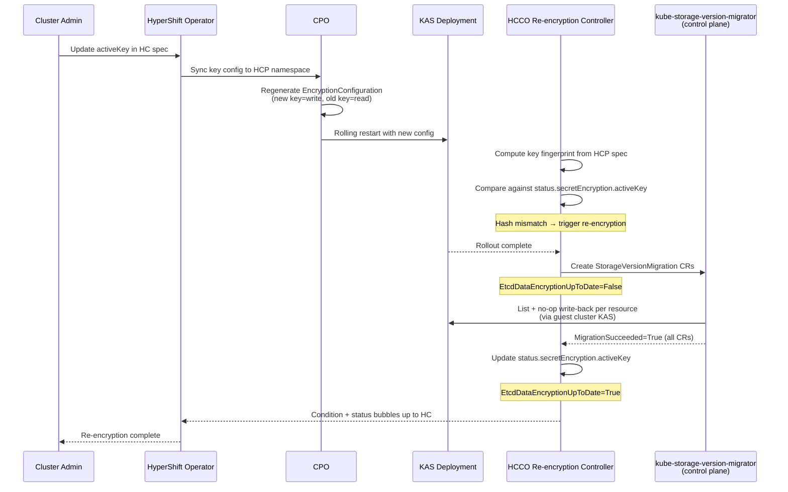

# etcd Data Re-encryption for Key Rotation

## Summary

HyperShift supports encryption key rotation infrastructure -- a new
active key can be set in `SecretEncryptionSpec`, and the
`EncryptionConfiguration` is correctly generated with the new key as
the write provider and the old key as a read provider. However,
there is no mechanism to re-encrypt existing etcd data with the new
key after rotation, and the current `backupKey` API requires manual
lifecycle management that is error-prone. This enhancement adds a
re-encryption controller in the Hosted Cluster Config Operator
(HCCO), deploys the `kube-storage-version-migrator` in the control
plane (management cluster) to support zero-worker-node clusters,
introduces a `status.secretEncryption` field on HostedCluster/HCP
to track the active key and detect rotations, deprecates the
`backupKey` spec fields, and tracks progress via a new
`EtcdDataEncryptionUpToDate` condition.

## Motivation

Without re-encryption, old etcd data remains encrypted with the
previous key indefinitely after a key rotation. This is unacceptable
for ARO-HCP's S360 compliance requirements and for any customer
relying on key rotation as a security control.

The current gaps are:

1. There is **no mechanism to trigger re-encryption** of existing
   etcd data with the new key.
2. There is **no way to track progress or confirm completion** of
   re-encryption.
3. The **`backupKey` API is error-prone** -- it requires the user
   to manually manage old key references and risks premature
   removal that could leave data unreadable.
4. The **`kube-storage-version-migrator` runs in the data plane**,
   which prevents re-encryption on clusters with zero worker
   nodes.

### User Stories

#### Story 1: ARO-HCP Key Rotation Compliance

As an ARO-HCP platform operator, I want all etcd data to be
automatically re-encrypted with the new key after a key rotation, so
that our clusters meet Microsoft's S360 security requirements for
complete data coverage under the active key.

#### Story 2: Key Rotation Progress Monitoring

As a cluster administrator, I want to monitor the progress and
completion of etcd data re-encryption through a standard Kubernetes
condition on the HostedCluster, so that I can confirm when it is safe
to deactivate or remove the old encryption key.

#### Story 3: Safe Key Rotation Without Manual Lifecycle Management

As a cluster administrator performing a key rotation, I want the
system to automatically track the previous active key and manage
the rotation lifecycle, so that I only need to update the active
key in the spec without manually managing a backup key field.

#### Story 4: Operations Team Incident Response

As an operations team member, I want to know when a re-encryption
has failed and see actionable error details in the HostedCluster
conditions, so that I can diagnose and remediate issues without
inspecting individual resources in the guest cluster.

### Goals

1. Guarantee that all existing encrypted etcd data is
   re-encrypted with the currently active encryption key after
   a key rotation. For KMS, this covers secrets, configmaps,
   routes, oauthaccesstokens, and oauthauthorizetokens. For
   AESCBC, this covers secrets (the only resource type AESCBC
   encrypts).

2. Provide an `EtcdDataEncryptionUpToDate` condition on
   HostedControlPlane and HostedCluster that tracks re-encryption
   progress and completion.

3. Track the active encryption key in HostedCluster/HCP status,
   enabling automatic rotation detection and eliminating the
   need for manual `backupKey` management.

4. Maintain cluster availability during the re-encryption process.

5. Support all encryption types (Azure KMS, AWS KMS, IBM Cloud
   KMS, AESCBC) with a single, generic re-encryption mechanism.

### Non-Goals

1. Management of the creation and renewal of encryption keys --
   keys are managed externally (by the ARO RP or user).

2. Automatic key rotation scheduling -- rotation is triggered by
   spec changes, not on a schedule.

3. Performance tuning for specific cluster sizes --
   `StorageVersionMigration` handles pagination natively.

4. Removing the `backupKey` fields from the API entirely --
   they are deprecated and ignored, but remain for backward
   compatibility. Full removal is deferred to a future release.

## Proposal

This enhancement adds etcd data re-encryption support to HyperShift
by reusing library-go's `KubeStorageVersionMigrator` struct (which
creates and monitors `StorageVersionMigration` CRs via the
`migration.k8s.io/v1alpha1` API) within a new HCCO controller,
deploying the `kube-storage-version-migrator` in the control plane,
introducing a status field for rotation tracking, and deprecating
the `backupKey` spec fields.

The design reuses the same `StorageVersionMigration` mechanism that
standalone OCP uses for re-encryption, ensuring consistency and
debuggability across both topologies.

The changes span multiple components:

1. **HCCO** (new controller): Detect active key changes by
   computing a fingerprint of the current encryption key from
   `hcp.Spec.SecretEncryption` and comparing it against
   `hcp.Status.SecretEncryption.ActiveKey`. When a change is
   detected, orchestrate re-encryption by waiting for KAS
   convergence, calling
   `KubeStorageVersionMigrator.EnsureMigration()` for each
   encrypted resource, monitoring completion, updating the status
   field, and setting the `EtcdDataEncryptionUpToDate` condition
   on HCP.

2. **CPO** (existing code modification): Deploy the
   `kube-storage-version-migrator` as a control plane component
   in the HCP namespace, connecting to the guest cluster KAS.
   Modify `adaptSecretEncryptionConfig()` and KMS provider
   constructors to source the backup key from
   `hcp.Status.SecretEncryption.ActiveKey` instead of
   `spec.backupKey`, with `spec.backupKey` as a
   transition-period fallback.

3. **cluster-kube-storage-version-migrator-operator** (separate
   repo change): Remove the
   `include.release.openshift.io/ibm-cloud-managed` annotation
   from the operator manifests to disable the data-plane
   instance for HyperShift.

4. **HyperShift Operator** (existing code modification): Bubble up
   the `EtcdDataEncryptionUpToDate` condition and
   `SecretEncryption` status from HCP to HostedCluster. Deploy a
   `ValidatingAdmissionPolicy` that blocks active key changes on
   HostedCluster while re-encryption is in progress.

### Workflow Description

1. The cluster administrator updates the active encryption key in
   the HostedCluster spec (e.g., rotates Azure KMS key version):
   ```yaml
   secretEncryption:
     type: kms
     kms:
       provider: Azure
       azure:
         activeKey:
           keyVaultName: my-vault
           keyName: my-key
           keyVersion: "v2"       # new version
   ```
   The administrator only needs to update the `activeKey`. The
   system tracks the previous key via
   `status.secretEncryption.activeKey` and automatically
   manages the old key as a read provider in the
   `EncryptionConfiguration`. The `backupKey` field is deprecated
   and no longer required.

2. The HyperShift Operator syncs the key configuration to the HCP
   namespace (existing behavior, no changes needed).

3. The CPO's `adaptSecretEncryptionConfig()` regenerates the
   `EncryptionConfiguration` with the new key as the first
   (write) provider. It reads
   `hcp.Status.SecretEncryption.ActiveKey` and, since the status
   key differs from the spec's active key (or `backupKey` is set
   as a transition-period fallback), includes it as a
   read-only provider. For KMS (AWS/Azure), this means the
   backup sidecar container is configured with the status key
   instead of `spec.backupKey`. HyperShift's two-sidecar
   design (see Component 3) retains one previous key as a
   read provider — the VAP (see Component 6) prevents
   successive rotations that would evict a still-needed read
   provider.

4. The KAS Deployment rolls out with the updated encryption
   config. New writes use the new key; old data remains readable
   via the old key.

5. The HCCO re-encryption controller computes a fingerprint of
   the active key from `hcp.Spec.SecretEncryption` and compares
   it against one derived from
   `hcp.Status.SecretEncryption.ActiveKey`. If the status field
   is nil (first rotation) or the fingerprints differ (new
   rotation), re-encryption is triggered. If they match,
   re-encryption is already complete and no action is taken.

6. The HCCO waits for the KAS Deployment rollout to complete (all
   replicas updated and ready), then creates
   `StorageVersionMigration` CRs in the hosted cluster for each
   encrypted resource type. It sets
   `EtcdDataEncryptionUpToDate=False` with reason
   `ReEncryptionInProgress`.

7. The `kube-storage-version-migrator` controller, running in the
   HCP namespace (control plane), processes each
   `StorageVersionMigration` CR via the guest cluster KAS: it
   lists all objects of each resource type and performs a no-op
   write-back. Since the kube-apiserver reads with whatever key
   can decrypt and writes with the first provider in the
   `EncryptionConfiguration`, this transparently re-encrypts all
   data with the new active key.

8. The HCCO re-encryption controller detects all
   `StorageVersionMigration` CRs have `MigrationSucceeded=True`.
   It sets `hcp.Status.SecretEncryption.ActiveKey` to the
   current spec's active key and sets
   `EtcdDataEncryptionUpToDate=True` with reason
   `ReEncryptionCompleted`.

9. The HyperShift Operator surfaces the condition on the
   HostedCluster. The administrator can confirm that all data
   is encrypted with the new key. On the next CPO reconcile,
   `adaptSecretEncryptionConfig()` observes that
   `hcp.Status.SecretEncryption.ActiveKey` now matches the
   spec's active key and removes the backup key: for KMS, the
   backup sidecar container is removed from the KAS pod; the
   read-only provider is removed from the
   `EncryptionConfiguration`.



#### Error Handling

**Migration failure**: If a `StorageVersionMigration` CR fails, the
controller waits 5 minutes (matching library-go's behavior), prunes
the failed CR, and retries on the next reconcile. The condition is
set to `False` with reason `ReEncryptionFailed` and a message
describing which resource failed.

**Key changes mid-migration**: The VAP blocks active key changes
on HostedCluster while `EtcdDataEncryptionUpToDate=False` (see
Component 6). In the unlikely event that the VAP is bypassed
(e.g., race window between the first rotation and the HCCO
setting the condition), the controller detects the key hash
mismatch on existing `StorageVersionMigration` CRs, deletes
them, and creates new ones for the latest key. This matches
the library-go pattern.

**KAS restart during migration**: `StorageVersionMigration` uses
`continueToken` for resumption. The controller detects stale CRs
and retries as needed.

**Guest cluster KAS unreachable**: The HCCO and the control plane
migrator both connect to the guest cluster KAS. If unreachable,
the controller retries with backoff. The condition reflects the
inability to check status.

### API Extensions

This enhancement does not introduce new CRDs, webhooks, or
aggregated API servers. It adds a new status field, a new
informational status condition to the existing
HostedControlPlane/HostedCluster resources, a
`ValidatingAdmissionPolicy` to guard against concurrent key
rotations, and deprecates the `backupKey` spec fields.

**New condition type:**

```go
// EtcdDataEncryptionUpToDate indicates whether all etcd data
// is encrypted with the currently active encryption key.
// True: all data confirmed encrypted with the active key.
// False: re-encryption is in progress or has failed.
// Absent: encryption is not configured.
EtcdDataEncryptionUpToDate ConditionType = "EtcdDataEncryptionUpToDate"
```

**Condition reasons:**

```go
ReEncryptionInProgressReason        = "ReEncryptionInProgress"
ReEncryptionCompletedReason         = "ReEncryptionCompleted"
ReEncryptionFailedReason            = "ReEncryptionFailed"
ReEncryptionWaitingForKASReason     = "ReEncryptionWaitingForKASConvergence"
ReEncryptionPersistentFailureReason = "ReEncryptionPersistentFailure"
```

When encryption is not configured (`SecretEncryption` is nil), the
condition is omitted entirely from status conditions, matching the
pattern used by `UnmanagedEtcdAvailable`.

**New status field on HostedControlPlane and HostedCluster:**

```go
// SecretEncryptionStatus tracks the state of secret encryption
// key rotation and re-encryption.
type SecretEncryptionStatus struct {
    // ActiveKey is the encryption key specification that all etcd
    // data is confirmed encrypted with. Updated by the HCCO after
    // successful re-encryption. During a rotation (when this
    // differs from spec.secretEncryption's active key), the CPO
    // uses this as the read-only provider in the
    // EncryptionConfiguration.
    // +optional
    ActiveKey *SecretEncryptionKeyStatus `json:"activeKey,omitempty"`
}

// SecretEncryptionProvider identifies the encryption provider
// recorded in status. This is intentionally not schema-validated
// because status values are set by controllers, not users. It is
// a separate type from KMSProvider because the KMSProvider enum
// does not include AESCBC.
type SecretEncryptionProvider string

const (
    SecretEncryptionProviderAzure    SecretEncryptionProvider = "Azure"
    SecretEncryptionProviderAWS      SecretEncryptionProvider = "AWS"
    SecretEncryptionProviderIBMCloud SecretEncryptionProvider = "IBMCloud"
    SecretEncryptionProviderAESCBC   SecretEncryptionProvider = "AESCBC"
)

// SecretEncryptionKeyStatus records the active key identity.
// Status-specific types are used instead of reusing the spec
// types directly, to decouple status serialization from spec
// type evolution (fields added, renamed, or removed in spec
// types should not break status compatibility).
type SecretEncryptionKeyStatus struct {
    // Provider identifies the encryption provider.
    Provider SecretEncryptionProvider `json:"provider"`
    // Azure holds the Azure KMS key identity fields.
    Azure *AzureKMSKeyStatus `json:"azure,omitempty"`
    // AWS holds the AWS KMS key identity fields.
    AWS *AWSKMSKeyStatus `json:"aws,omitempty"`
    // IBMCloud holds the IBM Cloud KMS key identity fields.
    IBMCloud *IBMCloudKMSKeyStatus `json:"ibmCloud,omitempty"`
    // AESCBC holds a reference to the AESCBC key secret.
    AESCBC *AESCBCKeyStatus `json:"aescbc,omitempty"`
}

// AzureKMSKeyStatus contains identity fields for an Azure KMS
// key, sufficient to reconstruct the EncryptionConfiguration
// read provider.
type AzureKMSKeyStatus struct {
    KeyVaultName string `json:"keyVaultName"`
    KeyName      string `json:"keyName"`
    KeyVersion   string `json:"keyVersion"`
}

// AWSKMSKeyStatus contains identity fields for an AWS KMS key,
// sufficient to reconstruct the backup sidecar container
// arguments for a different region than the current spec.
type AWSKMSKeyStatus struct {
    ARN    string `json:"arn"`
    Region string `json:"region"`
}

// IBMCloudKMSKeyStatus contains identity fields for an IBM
// Cloud KMS key list entry, sufficient to reconstruct the
// KP_DATA_JSON entry for the backup key. CorrelationID and
// URL are included because the IBM Cloud KMS sidecar requires
// them to initialize the key connection.
type IBMCloudKMSKeyStatus struct {
    CRKID         string `json:"crkID"`
    InstanceID    string `json:"instanceID"`
    KeyVersion    int32  `json:"keyVersion"`
    Region        string `json:"region"`
    CorrelationID string `json:"correlationID"`
    URL           string `json:"url"`
}

// AESCBCKeyStatus contains a reference to the AESCBC key
// secret and a SHA-256 hash of its contents for fingerprinting.
type AESCBCKeyStatus struct {
    SecretRef corev1.LocalObjectReference `json:"secretRef"`
    // DataHash is the hex-encoded SHA-256 hash of the secret's
    // "key" data field at the time re-encryption completed.
    DataHash  string                      `json:"dataHash"`
}
```

Storing the full key specification in status (not just a hash)
is critical for resilience: if the `kas-secret-encryption-config`
secret is accidentally deleted, the CPO can reconstruct the
`EncryptionConfiguration` using the key in status as the read
provider. Without this, a deleted secret would leave the cluster
unable to read data encrypted with the previous key.

The HCCO detects key changes by computing a fingerprint of the
spec's active key and the status's active key and comparing
them: nil/empty status means first rotation, mismatch means new
rotation, match means re-encryption is complete. No hash is
stored — it is always computed on the fly from the key fields.

**Deprecated spec fields:**

The `backupKey` fields on `AzureKMSSpec`, `AWSKMSSpec`, and
`AESCBCSpec` are deprecated. They are still accepted for backward
compatibility and used as a fallback by the CPO when
`hcp.Status.SecretEncryption.ActiveKey` is not set (see
Component 3 priority chain). The re-encryption controller
ignores `backupKey` — it uses the status field exclusively for
rotation detection. The system automatically manages the
previous key as a read provider in the
`EncryptionConfiguration` based on the status field. IBM Cloud
KMS (`IBMCloudKMSSpec`) uses a `KeyList` and is unaffected.

The following `// Deprecated:` markers must be added to the
Go doc comments:

```go
// Deprecated: This field is deprecated and will be ignored
// when status.secretEncryption.activeKey is set. The system
// automatically manages the previous key via the status field.
// +optional
BackupKey *AWSKMSKeyEntry `json:"backupKey,omitempty"`
```

The same marker applies to `AzureKMSSpec.BackupKey` and
`AESCBCSpec.BackupKey`.

### Topology Considerations

#### Hypershift / Hosted Control Planes

This enhancement is designed specifically for the HyperShift
topology. It affects:

- **Management cluster (HCP namespace)**: The HCCO re-encryption
  controller runs here. It computes the active key fingerprint
  from `hcp.Spec.SecretEncryption`, compares it against the
  key stored in `hcp.Status.SecretEncryption.ActiveKey`, checks
  KAS
  Deployment convergence, and sets conditions on HCP. The
  `kube-storage-version-migrator` also runs here as a control
  plane Deployment, connecting to the guest cluster KAS to
  process `StorageVersionMigration` CRs.
- **Guest cluster**: `StorageVersionMigration` CRs are created
  here by the HCCO using the guest cluster client. The
  `kube-storage-version-migrator` (running in the control plane)
  processes these CRs via the guest cluster KAS. The data-plane
  `cluster-kube-storage-version-migrator-operator` is disabled
  for HyperShift by removing
  `include.release.openshift.io/ibm-cloud-managed` from its
  manifests in the
  `cluster-kube-storage-version-migrator-operator` repo.

The design follows HyperShift's established pattern: the CPO
manages control plane pod configuration (KAS encryption config
generation and migrator deployment), while the HCCO manages the
re-encryption lifecycle. Deploying the migrator in the control
plane ensures re-encryption works on clusters with zero worker
nodes.

No additional RBAC is required for the HCCO:
- The HCCO already has `get`, `list`, `watch` on Deployments and
  Secrets in the HCP namespace.
- The HCCO authenticates as `system:hosted-cluster-config` in the
  guest cluster with `cluster-admin` via the `hcco-cluster-admin`
  ClusterRoleBinding.

The control plane `kube-storage-version-migrator` uses the same
guest cluster client credentials as other control plane
components (e.g., via the admin kubeconfig secret).

#### Standalone Clusters

Not directly applicable. Standalone OCP already has re-encryption
via the library-go encryption framework's `MigrationController`.
This enhancement brings equivalent functionality to HyperShift.

#### Single-node Deployments or MicroShift

Not applicable. This enhancement does not affect SNO or MicroShift
deployments. The re-encryption controller only runs in the HCCO,
which is specific to HyperShift.

#### OpenShift Kubernetes Engine

Not applicable. OKE does not support HyperShift hosted control
planes.

### Implementation Details/Notes/Constraints

#### Why KubeStorageVersionMigrator Instead of MigrationController

Standalone OCP uses library-go's `MigrationController`, which wraps
`KubeStorageVersionMigrator` with a 4-step state machine. This
controller has deep coupling to standalone OCP:

- Expects key secrets in `openshift-config-managed` with specific
  labels/annotations created by the KeyController. HyperShift gets
  keys from `HostedCluster.Spec.SecretEncryption`.
- Expects convergence via `RevisionLabelPodDeployer` checking
  static pod revisions on master nodes. HyperShift runs KAS as a
  Deployment.
- Calls `statemachine.GetEncryptionConfigAndState()` tied to the
  standalone key lifecycle.

Instead, this enhancement reuses only the
`KubeStorageVersionMigrator` struct -- a ~130-line, self-contained
implementation with zero dependencies on the rest of the encryption
framework. It handles:
- Creating `StorageVersionMigration` CRs with deterministic names
- Tracking which encryption key each CR was created for (via
  annotation)
- Detecting stale CRs from a previous key and replacing them
- Monitoring migration status conditions
- Resolving preferred API versions via discovery
- Pruning completed/stale migrations

#### Vendoring Requirements

The following packages must be added to HyperShift's vendor tree:

| Package | Why |
|---|---|
| `library-go/.../encryption/controllers/migrators` | `KubeStorageVersionMigrator` struct and `Migrator` interface |
| `kube-storage-version-migrator/.../informer/` | Required by `KubeStorageVersionMigrator` constructor |
| `kube-storage-version-migrator/.../lister/` | Pulled in transitively by the informer package |

All other dependencies (`migration/v1alpha1` types, typed
clientset, `factory.Informer`, `k8s.io/client-go/discovery`) are
already vendored.

The vendored version of `library-go` must match or be
compatible with HyperShift's existing `library-go` dependency.
The `KubeStorageVersionMigrator` struct has been stable since
its introduction and has no version-specific API changes. The
`kube-storage-version-migrator` informer/lister packages are
auto-generated and track the `migration.k8s.io/v1alpha1` API,
which has been stable since OCP 4.3.

#### Component 1: Key Change Detection (HCCO)

The HCCO re-encryption controller computes the active key
fingerprint on each reconciliation:

- Azure KMS: SHA-256 hash of `keyVaultName/keyName/keyVersion`
- AWS KMS: SHA-256 hash of the active key ARN
- IBM Cloud KMS: SHA-256 hash of the key list entries' CRK ID,
  InstanceID, and KeyVersion (the same fields stored in
  `IBMCloudKMSKeyStatus`). Fields not relevant to key identity
  (CorrelationID, URL) are excluded from the fingerprint to
  avoid triggering spurious re-encryption on metadata-only
  changes.
- AESCBC: SHA-256 hash of the active key secret name + the
  SHA-256 hash of the secret's data field
  (`AESCBCKeySecretKey = "key"`). Key rotation must be performed
  by creating a new secret and updating the `activeKey.name`
  reference. **In-place mutation of the key secret (same name,
  new data) is not supported**: the old key material is
  overwritten, making data encrypted with the previous key
  unreadable before re-encryption completes. The AESCBC
  `SecretRef` in status points to the same secret, so both
  active and backup would read the overwritten data.

It then compares the computed fingerprint against one derived
from `hcp.Status.SecretEncryption.ActiveKey`:

- **Status field nil**: First key rotation observed. Trigger
  re-encryption and set the status field after completion.
- **Fingerprints match**: Re-encryption already completed for
  the current key. No action needed.
- **Fingerprints differ**: New key rotation detected. Trigger
  re-encryption, and update the status field after completion.

**First encryption setup**: A nil status field triggers
re-encryption, so initial encryption setup is treated
identically to a key rotation — all pre-existing data passes
through the apiserver's encryption layer.

#### Component 2: Re-encryption Orchestration (HCCO)

**New file:**
`control-plane-operator/hostedclusterconfigoperator/controllers/reencryption/reencryption.go`

The controller instantiates `KubeStorageVersionMigrator` using
guest cluster clients and orchestrates re-encryption:

1. If encryption is not configured, remove the
   `EtcdDataEncryptionUpToDate` condition if present and return.

2. Compute fingerprints of the spec's active key and the
   status's active key and compare them. If they match,
   re-encryption is complete — return (no action needed).

3. If the status field is nil or the fingerprints differ, wait
   for
   KAS Deployment rollout
   (`updatedReplicas == replicas == readyReplicas`). If not
   converged, set condition `False/ReEncryptionWaitingForKASConvergence` and
   requeue.

4. Determine the encrypted resource list based on encryption
   type. For KMS, use `KMSEncryptedObjects()` (5 resource
   types). For AESCBC, use only `secrets` (AESCBC only
   encrypts secrets, as defined in `aescbc.go`). For each
   resource, call
   `migrator.EnsureMigration(gr, computedKeyHash)` and track
   finished/failed/in-progress state.

5. If all resources migrated successfully, set
   `hcp.Status.SecretEncryption.ActiveKey` to the current
   spec's active key and set condition
   `True/ReEncryptionCompleted`. Both fields are updated in a
   single HCP status patch call to ensure atomicity. The
   controller uses `Status().Patch()` with `MergeFrom` (rather
   than `Status().Update()`) to avoid clobbering status fields
   managed by the existing `hcpStatusReconciler`, which also
   updates HCP status concurrently. On `Conflict` errors, the
   controller re-reads the HCP and retries the patch.

6. If any resource failed and not retried within 5 minutes,
   prune the failed CR for retry on next reconcile and set
   condition `False/ReEncryptionFailed`. The condition message
   includes elapsed time since re-encryption started (e.g.,
   `"re-encryption of secrets failed after 12m30s"`) to help
   operators assess whether manual intervention is needed. The
   controller tracks the retry count via an annotation on the
   `StorageVersionMigration` CR. After 3 consecutive failures
   for the same resource, the condition reason is escalated to
   `ReEncryptionPersistentFailure` to distinguish transient
   failures from systemic issues requiring manual intervention.

7. Otherwise, set condition `False/ReEncryptionInProgress` and
   requeue after 30 seconds. The condition message includes
   progress (e.g., `"3/5 resources migrated, elapsed 2m15s"`)
   and the elapsed time since re-encryption started. The elapsed
   time is computed from the condition's `LastTransitionTime` —
   when the condition first transitions to `False`, the
   `LastTransitionTime` is set and remains stable across
   subsequent updates (since the status stays `False`), providing
   a natural start timestamp without additional state.

The encrypted resources depend on the encryption type:

For KMS (from `support/config/kms.go:KMSEncryptedObjects()`):
- `secrets`
- `configmaps`
- `routes.route.openshift.io`
- `oauthaccesstokens.oauth.openshift.io`
- `oauthauthorizetokens.oauth.openshift.io`

For AESCBC (from `aescbc.go`):
- `secrets`

#### Component 3: CPO EncryptionConfiguration Changes

**Modified files:**
- `control-plane-operator/controllers/hostedcontrolplane/v2/kas/secretencryption.go`
- `control-plane-operator/controllers/hostedcontrolplane/v2/kas/kms/aws.go`
- `control-plane-operator/controllers/hostedcontrolplane/v2/kas/kms/azure.go`

##### KMS Sidecar Architecture

For AWS and Azure KMS, each key in the `EncryptionConfiguration`
requires its own KMS plugin sidecar container running alongside
the KAS. HyperShift deploys exactly **two sidecars** per
provider — one for the active key and one for the backup key —
with dedicated socket paths and health ports:

- **AWS**: `aws-kms-active` (port 8080, `awskmsactive.sock`)
  and `aws-kms-backup` (port 8081, `awskmsbackup.sock`)
- **Azure**: `azure-kms-provider-active` (port 8787,
  `azurekmsactive.socket`) and `azure-kms-provider-backup`
  (port 8788, `azurekmsbackup.socket`)

The backup sidecar is changed to source its key from
`hcp.Status.SecretEncryption.ActiveKey` instead of
`spec.backupKey`.

IBM Cloud KMS uses a different architecture: a single sidecar
(`ibmcloud-kms`) that receives all keys as a JSON key list via
the `KP_DATA_JSON` environment variable.

For AESCBC, keys are inline in the `EncryptionConfiguration`
secret (no sidecar needed).

**Encryption config reload**: The KAS must NOT auto-reload the
`EncryptionConfiguration` during a rollout — all replicas must
converge on the same config via pod replacement. AWS and IBM
Cloud KMS providers already set
`--encryption-provider-config-automatic-reload=false` on the
KAS. The Azure KMS provider must also set this flag to prevent
a split-brain scenario where some replicas hot-reload the new
config before others have been replaced.

The two-sidecar design means the VAP (Component 6) is
essential — it prevents a second rotation that would evict
the still-needed backup sidecar (see Risks).

##### CPO Modification: Status-Derived Backup Key

`adaptSecretEncryptionConfig()` reads the backup key from
`cpContext.HCP.Status.SecretEncryption.ActiveKey` (already
populated from the informer cache) and passes it to the
provider constructor.

The priority chain for determining the backup key:

1. **Status-derived key (primary)**: If
   `hcp.Status.SecretEncryption.ActiveKey` is set and differs
   from the spec's active key, use it as the backup key. For
   KMS, the status stores sufficient fields to reconstruct the
   backup sidecar. For AESCBC, the status stores a `SecretRef`
   — the CPO reads key bytes from this secret.

2. **backupKey fallback (transition safety)**: If
   `hcp.Status.SecretEncryption.ActiveKey` is not set (e.g.,
   the status has not been initialized yet on a cluster that
   was upgraded mid-rotation), fall back to `spec.backupKey`
   if populated. This ensures backward compatibility during the
   transition period.

3. **No backup key**: If neither the status field nor
   `spec.backupKey` provides a backup key, no backup sidecar
   is deployed and the EncryptionConfiguration contains only
   the active key provider (plus the identity provider).

4. **Backup key removal**: When
   `hcp.Status.SecretEncryption.ActiveKey` matches the spec's
   active key (re-encryption confirmed complete), no backup
   key is needed. The backup sidecar container is removed from
   the KAS pod and the read-only provider is removed from the
   `EncryptionConfiguration`.

##### KMS Provider Constructor Changes

Both providers are changed to accept an explicit backup key
parameter:

**AWS**:

```go
// Before
NewAWSKMSProvider(kmsSpec, image, tokenMinterImage)
// reads kmsSpec.BackupKey internally

// After
backupKey := deriveAWSBackupKey(hcpStatus, kmsSpec)
NewAWSKMSProvider(kmsSpec, backupKey, image, tokenMinterImage)
```

**Azure**:

```go
// Before
NewAzureKMSProvider(kmsSpec, image)

// After
backupKey := deriveAzureBackupKey(hcpStatus, kmsSpec)
NewAzureKMSProvider(kmsSpec, backupKey, image)
```

**IBM Cloud** — uses a `KeyList` with a single sidecar. No
backup key change needed; the key list is passed through as-is.

#### Component 4: Control Plane Migrator Deployment (CPO)

The CPO deploys the `kube-storage-version-migrator` as a
Deployment in the HCP namespace. The migrator image is sourced
from the OCP release payload. It connects to the guest cluster
KAS using the `admin-kubeconfig` secret.

The migrator is always deployed — it has responsibilities
beyond encryption (e.g., API version migrations). The
data-plane operator is disabled for HyperShift (see Topology
Considerations). The `StorageVersionMigration` CRD remains
installed in all topologies.

#### Component 5: HyperShift Operator Integration

**Modified file:**
`hypershift-operator/controllers/hostedcluster/hostedcluster_controller.go`

1. **Bubble up condition**: Surface
   `EtcdDataEncryptionUpToDate` from HCP to HostedCluster using
   the copy-if-present pattern (`ValidKubeVirtInfraNetworkMTU`
   style), not the bulk `hcpConditions` list. Absent on HC when
   absent on HCP.

2. **Bubble up status**: Copy `SecretEncryption` status from HCP
   to HostedCluster.

#### Component 6: ValidatingAdmissionPolicy for Key Rotation Guard

The HyperShift Operator deploys a `ValidatingAdmissionPolicy`
and `ValidatingAdmissionPolicyBinding` on the management cluster
to block active key changes while re-encryption is in progress.

```yaml
apiVersion: admissionregistration.k8s.io/v1
kind: ValidatingAdmissionPolicy
metadata:
  name: hostedcluster-block-key-rotation-during-reencryption
spec:
  failurePolicy: Ignore
  matchConstraints:
    resourceRules:
    - apiGroups: ["hypershift.openshift.io"]
      apiVersions: ["v1beta1"]
      operations: ["UPDATE"]
      resources: ["hostedclusters"]
  validations:
  - expression: >-
      !has(object.status.conditions) ||
      !object.status.conditions.exists(c,
        c.type == 'EtcdDataEncryptionUpToDate' &&
        c.status == 'False') ||
      (!has(object.spec.secretEncryption) &&
        !has(oldObject.spec.secretEncryption)) ||
      (has(object.spec.secretEncryption) &&
        has(oldObject.spec.secretEncryption) &&
        object.spec.secretEncryption ==
          oldObject.spec.secretEncryption)
    message: >-
      Cannot change the active encryption key while
      re-encryption is in progress
      (EtcdDataEncryptionUpToDate=False). Wait for
      re-encryption to complete before rotating again.
---
apiVersion: admissionregistration.k8s.io/v1
kind: ValidatingAdmissionPolicyBinding
metadata:
  name: hostedcluster-block-key-rotation-during-reencryption
spec:
  policyName: hostedcluster-block-key-rotation-during-reencryption
  validationActions:
  - Deny
```

**Design choices:**

- **`failurePolicy: Ignore`**: If the policy cannot be
  evaluated (API server issue), allow the write rather than
  blocking all HostedCluster updates. This avoids introducing
  a new failure mode for cluster lifecycle operations.
- **Structural equality** (`==` on the whole
  `secretEncryption` block): CEL compares the entire struct,
  so no per-provider fingerprint logic is needed. This
  intentionally blocks all `secretEncryption` changes during
  re-encryption (not just the active key), because any
  encryption config change triggers a KAS rollout that could
  interfere with in-flight migrations.
- **Nil-safety**: The expression uses `has()` guards to handle
  the case where `spec.secretEncryption` is nil on either the
  old or new object. This also covers the case where a user
  attempts to remove `secretEncryption` entirely while
  re-encryption is in progress — the `has()` mismatch causes
  the structural equality check to fail, blocking the removal.
- **Handles absent condition**: When
  `EtcdDataEncryptionUpToDate` is not present (encryption not
  configured, first setup, older HCCO), the policy allows the
  change.
- **UPDATE only**: CREATE is always allowed.

**Why VAP**: CEL-in-CRD cannot cross-reference status from
spec validation. Webhooks add availability concerns. An HO
reconciler guard would accept the write then silently not
propagate it, causing HC/HCP spec divergence. The VAP rejects
at admission time.

**Race window**: There is a window (two reconcile cycles)
between the first key change and `EtcdDataEncryptionUpToDate=False`
appearing on the HostedCluster. A second key change during
this window would not be blocked. This is acceptable — it
requires two rotations within seconds.

#### Safety Invariants

Derived from library-go's encryption framework:

1. **Convergence gating**: No migration CRs created until all
   KAS replicas run the same encryption config.
2. **Never remove read-keys before migration completes**.
3. **Stop migrations on config divergence**: Delete and recreate
   CRs if the active key changes mid-migration.
4. **Retry failed migrations**: Prune and retry after 5 minutes.
5. **Block concurrent key rotations**: VAP rejects active key
   changes while `EtcdDataEncryptionUpToDate=False`.
6. **Atomic status patches**: Update `ActiveKey` and condition
   in a single `Status().Patch()` call (`MergeFrom`) to avoid
   partial state and clobbering the `hcpStatusReconciler`.

#### Architecture Diagram

```
Management Cluster (HCP namespace)

  HyperShift Operator
  - Surfaces HCP conditions + status to HC
    (copy-if-present pattern for EtcdDataEncryptionUpToDate)
  - Deploys ValidatingAdmissionPolicy that blocks
    active key changes when EtcdDataEncryptionUpToDate=False

  CPO                              HCCO
  - KAS encryption config         - Re-encryption Controller (NEW)
    generation (MODIFIED)          - Computes key fingerprint
    - backup sidecar from            from hcp.Spec.SecretEncryption
      hcp.Status instead of       - Compares against
      spec.backupKey                 hcp.Status.SecretEncryption
    - backupKey fallback for         .ActiveKey
      transition safety            - Waits for KAS rollout
                                   - Creates SVMs in guest
  - Deploys kube-storage-         - Monitors completion
    version-migrator in            - Updates HCP status + condition
    HCP namespace                    atomically on success

  kube-storage-version-migrator
  (control plane Deployment,
   uses admin-kubeconfig secret)
              │
              │ guest cluster KAS
              ▼
Hosted Cluster (guest API)

  StorageVersionMigration CRs
  (migration.k8s.io/v1alpha1)
  For KMS:
  - encryption-migration-core-secrets
  - encryption-migration-core-configmaps
  - encryption-migration-route.openshift.io-routes
  - encryption-migration-oauth...-oauthaccesstokens
  - encryption-migration-oauth...-oauthauthorizetokens
  For AESCBC:
  - encryption-migration-core-secrets

  cluster-kube-storage-version-migrator-operator
  (DISABLED for HyperShift — annotation removed)
```

### Risks and Mitigations

**Risk**: Re-encryption of large clusters takes a long time,
resulting in a prolonged `False` condition.
**Mitigation**: `StorageVersionMigration` handles pagination
internally. The condition message reports which resources have
completed and which are still in progress.

**Risk**: KAS restarts during re-encryption interrupt the
migration.
**Mitigation**: `StorageVersionMigration` uses `continueToken` for
resumption. The controller detects stale CRs and retries as
needed.

**Risk**: `kube-storage-version-migrator` in the control plane is
degraded, causing migrations to never complete.
**Mitigation**: The controller sets a `ReEncryptionFailed`
condition with details after failed migrations persist.
Operational guidance covers how to check the migrator Deployment
health in the HCP namespace.

**Risk**: Guest cluster KAS is unreachable from the control plane,
preventing CR creation, migration processing, or monitoring.
**Mitigation**: The HCCO and migrator both retry with backoff.
The condition reflects the inability to check status rather than
incorrectly reporting success.

**Risk**: A second key rotation occurs before re-encryption
completes. HyperShift's two-sidecar design retains only one
previous key — a rapid v1 -> v2 -> v3 rotation would evict
v1's sidecar, leaving v1-encrypted data unreadable.
**Mitigation**: The VAP (Component 6) rejects active key
changes while `EtcdDataEncryptionUpToDate=False`. If a key
change somehow occurs mid-migration (e.g., direct HCP edit),
the controller detects the hash mismatch, deletes stale CRs,
and recreates them for the new key.

**Risk**: Old-key-encrypted data persists in etcd historical
revisions after re-encryption until etcd compaction runs.
**Mitigation**: HyperShift's etcd auto-compaction (typically
every 5 minutes) clears old revisions. After compaction, old
revisions containing data encrypted with the previous key are
removed. The `EtcdDataEncryptionUpToDate=True` condition
indicates that all *current* revisions are encrypted with the
active key; operators should be aware that historical revisions
remain until the next compaction cycle.

**Risk**: KMS API rate limiting during re-encryption of large
clusters. Each re-encrypted object requires two KMS API calls
(one decrypt via the old key, one encrypt via the new key). A
cluster with 10,000 secrets generates approximately 20,000 KMS
API calls. On Azure Key Vault (2,000 transactions per 10
seconds per vault), this could trigger throttling.
**Mitigation**: `StorageVersionMigration` processes one page at
a time (default page size 500), providing natural throttling.
However, if multiple hosted clusters sharing the same KMS
endpoint rotate keys simultaneously, aggregate API call volume
could hit provider rate limits. Operators managing large fleets
should stagger key rotations across hosted clusters.

#### Backup and Restore During Re-encryption

etcd backups should not be taken while re-encryption is in
progress (`EtcdDataEncryptionUpToDate=False`). A backup taken
during re-encryption contains a mix of objects encrypted with
the old key and the new key. Restoring such a backup requires
that both keys are available as read providers in the
`EncryptionConfiguration`, which may not be the case if the
backup sidecar has already been removed after a subsequent
successful re-encryption.

If a backup must be taken during re-encryption, operators
should ensure that both the old and new encryption keys remain
accessible (not deactivated or deleted in the cloud KMS) until
the backup is no longer needed for restore.

### Drawbacks

1. **Increased operational complexity**: The re-encryption
   controller adds a new reconciliation loop in the HCCO, and
   the `kube-storage-version-migrator` adds a new Deployment in
   the HCP namespace. However, the re-encryption controller is
   dormant when no key rotation is in progress (it no-ops when
   the computed key fingerprint matches the status field).

2. **Vendoring new packages**: Three packages must be added to
   HyperShift's vendor tree. These are small, auto-generated
   packages with no external dependencies beyond what HyperShift
   already vendors.

3. **Cross-repo dependency**: Disabling the data-plane
   `cluster-kube-storage-version-migrator-operator` requires a
   separate PR in the
   `cluster-kube-storage-version-migrator-operator` repo to
   remove the `include.release.openshift.io/ibm-cloud-managed`
   annotation from its manifests.

4. **API deprecation**: The `backupKey` fields are deprecated
   but must remain in the API for backward compatibility. This
   creates a period where both mechanisms coexist.

## Alternatives (Not Implemented)

### Reuse library-go's MigrationController Directly

**Rejected because**: Deep coupling to standalone OCP (key
secrets in `openshift-config-managed`, static pod revision
checking, `statemachine.GetEncryptionConfigAndState()`). See
"Why KubeStorageVersionMigrator" above.

### Build Custom Migration Logic Without library-go

Implement `StorageVersionMigration` CR lifecycle management from
scratch instead of using `KubeStorageVersionMigrator`.

**Rejected because**: `KubeStorageVersionMigrator` is a ~130-line,
self-contained struct that handles CR creation, stale CR detection,
annotation tracking, status monitoring, version discovery, and
pruning. Reimplementing this would duplicate production-tested code
with no benefit.

### Keep the backupKey API for Rotation Tracking

Instead of introducing a status field and deprecating `backupKey`,
continue using the existing `activeKey`/`backupKey` spec fields for
rotation lifecycle management.

**Rejected because**: The `backupKey` API requires the user (or
automation) to manually manage old key references and remember to
populate the backup field during rotation. This is error-prone:
the backup key can be removed prematurely (before re-encryption
completes), or forgotten entirely (leaving no read provider for
old data). A status field that the system manages automatically
eliminates this class of user error and enables the system to
detect and handle mid-rotation key changes.

### Run the kube-storage-version-migrator in the Data Plane

Instead of deploying the migrator in the control plane, rely on
the existing data-plane
`cluster-kube-storage-version-migrator-operator` to process
`StorageVersionMigration` CRs in the hosted cluster.

**Rejected because**: The data-plane migrator runs as a
Deployment in the hosted cluster, which requires schedulable
worker nodes. HyperShift supports clusters with zero worker
nodes (e.g., during initial provisioning or node pool scale-down),
and re-encryption must work in these scenarios. Deploying the
migrator in the control plane (HCP namespace) ensures it is
always available regardless of worker node count.

### Run Key Detection or Re-encryption in the CPO

**Rejected because**: CPOv2 adapt functions receive fresh objects
from static YAML templates and cannot reliably diff against
prior state. The HCCO has direct access to HCP spec/status and
manages guest cluster resources — it is the natural owner for
both key change detection and `StorageVersionMigration` CR
lifecycle.

### Direct etcd Manipulation

Instead of using `StorageVersionMigration` CRs, directly read and
re-write etcd data using the etcd client.

**Rejected because**: This would bypass the kube-apiserver's
encryption layer and require direct etcd access, which is complex,
error-prone, and inconsistent with how OpenShift handles
encryption. The `StorageVersionMigration` approach works through
the API server, ensuring proper encryption, audit logging, and
admission control.

## Open Questions [optional]

1. **Should re-encryption block cluster upgrades?** Current
   recommendation is no -- re-encryption is independent of
   upgrades. The `EtcdDataEncryptionUpToDate` condition is
   informational and does not gate upgrade preconditions.

2. **Should the `backupKey` fields be removed in a future API
   version?** They are currently deprecated and ignored. Full
   removal would simplify the API but requires an API version
   bump.

## Test Plan

<!-- TODO: When implementing tests, include the following labels
per dev-guide/feature-zero-to-hero.md and
dev-guide/test-conventions.md:
- [Jira:"HyperShift"] for component identification
- Appropriate test type labels: [Suite:...], [Serial], [Slow],
  or [Disruptive] as needed

Note: This enhancement does not use an OCP feature gate, so the
[OCPFeatureGate:FeatureName] label is not applicable. HyperShift
tests are gated by the test infrastructure itself (HyperShift CI
jobs). -->

### Unit Tests

- Key fingerprint computation for each provider (Azure KMS, AWS
  KMS, IBM Cloud KMS, AESCBC).
  - AESCBC: Verify fingerprint changes when secret name changes
    (the supported rotation model).
- Re-encryption controller reconciliation logic:
  - When no encryption configured: condition not set.
  - When spec key matches status key: no action taken.
  - When status field nil (first encryption setup): re-encryption
    triggered, status initialized on completion, all existing
    data encrypted.
  - When status field nil (first rotation): re-encryption
    triggered, status initialized on completion.
  - When spec key differs from status key: re-encryption
    triggered for new key.
  - When KAS not converged: condition
    `False/ReEncryptionWaitingForKASConvergence`.
  - When migrations in progress: condition
    `False/ReEncryptionInProgress` with progress and elapsed
    time in message.
  - When all migrations succeeded: condition
    `True/ReEncryptionCompleted`,
    `status.secretEncryption.activeKey` set to spec key.
    Both fields updated in a single status patch.
  - When migration failed: retry after 5 minutes by pruning
    and re-creating. Condition message includes elapsed time.
  - When migration fails 3 consecutive times: condition reason
    escalated to `ReEncryptionPersistentFailure`.
  - When key changes mid-migration (direct HCP edit): delete
    and recreate CRs.
  - AESCBC: Only `secrets` resource migrated (1 CR, not 5).
  - KMS: All 5 resources from `KMSEncryptedObjects()` migrated.
- `StorageVersionMigration` CR naming and annotation logic.
- CPO `adaptSecretEncryptionConfig` and KMS provider changes:
  - Backup sidecar sourced from status when status differs from
    spec.
  - backupKey fallback used when status is nil.
  - Backup sidecar removed when status matches spec.
  - AWS/Azure provider constructors accept explicit backup key
    parameter instead of reading spec.backupKey.
- ValidatingAdmissionPolicy:
  - Active key change rejected when
    `EtcdDataEncryptionUpToDate=False`.
  - Active key change allowed when
    `EtcdDataEncryptionUpToDate=True`.
  - Active key change allowed when condition is absent.
  - Non-encryption spec changes allowed regardless of
    condition state.
  - Removing `secretEncryption` entirely rejected when
    `EtcdDataEncryptionUpToDate=False`.
  - Nil `secretEncryption` on both old and new object: allowed.
- HO condition bubble-up:
  - `EtcdDataEncryptionUpToDate` copied when present on HCP.
  - Condition absent on HC when absent on HCP (not Unknown).

### Integration Tests

- Full key rotation cycle with mock guest cluster.
- Verify `StorageVersionMigration` CRs are created with correct
  GVRs.
- Verify stale CRs are cleaned up on key change.

### E2E Tests

- Azure KMS key rotation with re-encryption (primary test case).
- AWS KMS key rotation with re-encryption (ROSA HCP coverage).
- AESCBC key rotation with re-encryption (verify only `secrets`
  resource is migrated, not all 5).
- Verify data is re-encrypted by confirming that deactivating
  the old KMS key after re-encryption completes does not break
  reads.
- Verify cluster availability during re-encryption.
- Verify condition transitions:
  absent -> `False/ReEncryptionWaitingForKASConvergence` ->
  `False/ReEncryptionInProgress` -> `True/ReEncryptionCompleted`.
- Verify first-encryption-setup: enable encryption on a cluster
  with existing secrets, verify re-encryption triggers and
  all data is encrypted.
- Verify VAP rotation guard: attempt a second key rotation while
  re-encryption is in progress, confirm the API server rejects
  the update.

## Graduation Criteria

<!-- TODO: When preparing for promotion, review the specific
requirements from dev-guide/feature-zero-to-hero.md:
- At least 5 tests per feature
- All tests must run at least 7 times per week
- All tests must run at least 14 times per supported platform
- All tests must pass at least 95% of the time
- Tests running on all supported platforms (AWS, Azure, GCP,
  vSphere, Baremetal with various network stacks)

Note: Since this is a HyperShift-specific feature without an OCP
feature gate, promotion criteria are driven by HyperShift's own
release process rather than the OCP feature gate promotion
process. -->

### Dev Preview -> Tech Preview

- End-to-end key rotation with re-encryption works for Azure KMS.
- Unit tests cover all controller logic.
- Integration tests validate CR lifecycle.
- E2E test runs in CI for at least one encryption type.
- Documentation covers key rotation procedure with
  re-encryption.

### Tech Preview -> GA

- Sufficient time for customer feedback (at least one minor
  release).
- E2E tests cover all supported encryption types (Azure KMS,
  AWS KMS, AESCBC).
- Scale testing completed (re-encryption on clusters with large
  numbers of secrets/configmaps).
- Upgrade scenarios validated.
- User-facing documentation created in openshift-docs.
- Support procedures documented.

### Removing a deprecated feature

N/A -- This is a new feature.

## Upgrade / Downgrade Strategy

**Upgrade**: Existing clusters with encryption configured are
unaffected. The `EtcdDataEncryptionUpToDate` condition is only set
when a key rotation is detected
(`status.secretEncryption.activeKey` is nil or differs from the
spec's active key). Clusters that have never rotated keys will not
see the condition.

The re-encryption controller is added to the HCCO, which is
upgraded per-hosted-cluster as part of the normal hosted cluster
upgrade process. No manual steps are required.

**Downgrade**: Downgrading is not supported in HyperShift.
No downgrade path is provided for this enhancement.

## Version Skew Strategy

The CPO and HCCO are upgraded together per-hosted-cluster. The
`StorageVersionMigration` API (`migration.k8s.io/v1alpha1`) has
been stable since OCP 4.3. No cross-component version skew
exists for the re-encryption flow.

The HO is upgraded independently but uses the copy-if-present
pattern for condition bubble-up (see Component 5), so version
skew between the HO and per-cluster HCCO is safe.

## Operational Aspects of API Extensions

### EtcdDataEncryptionUpToDate Condition

- **Impact on existing SLIs**: None. Informational only, does
  not gate upgrades or availability checks.
- **Failure modes**:
  - Condition stuck at `False/ReEncryptionInProgress`: Indicates
    the `kube-storage-version-migrator` is slow or stalled.
    Check migrator Deployment health in the HCP namespace.
  - Condition stuck at `False/ReEncryptionFailed`: Indicates a
    migration CR has failed. Check the condition message for the
    specific resource and error. The controller retries
    automatically after 5 minutes.
  - Condition at `False/ReEncryptionPersistentFailure`: The
    same resource has failed 3 or more consecutive times,
    indicating a systemic issue. Manual investigation is
    required — check the `StorageVersionMigration` CR status,
    guest cluster KAS health, and admission webhook
    configuration.
  - Condition stuck at `False/ReEncryptionWaitingForKASConvergence`: KAS
    Deployment rollout has not completed. Check KAS pod health
    and Deployment status.
- **Health indicators**:
  - `EtcdDataEncryptionUpToDate` condition on HostedCluster
  - HCCO controller logs (`controllers.ReEncryption`)
  - `StorageVersionMigration` CR status in the guest cluster
  - `kube-storage-version-migrator` Deployment in the HCP
    namespace

### StorageVersionMigration CRs

- **Expected scale**: 5 CRs per rotation for KMS, 1 for AESCBC.
  Pruned after successful migration.
- **API throughput impact**: Proportional to encrypted object
  count. Migrator uses pagination.

## Support Procedures

### Detecting Re-encryption Issues

1. **Check the HostedCluster condition**:
   ```bash
   oc get hostedcluster <name> \
     -o jsonpath='{.status.conditions[?(@.type=="EtcdDataEncryptionUpToDate")]}'
   ```

2. **Check StorageVersionMigration CRs in the guest cluster**:
   ```bash
   oc get storageversionmigrations -A
   ```
   Look for CRs with `MigrationFailed=True` conditions.

3. **Check HCCO logs**:
   ```bash
   oc logs -n <hcp-namespace> \
     deployment/control-plane-operator \
     -c hosted-cluster-config-operator \
     | grep -i reencryption
   ```

4. **Check kube-storage-version-migrator health in the control
   plane**:
   ```bash
   oc get deployment kube-storage-version-migrator \
     -n <hcp-namespace>
   oc get pods -l app=kube-storage-version-migrator \
     -n <hcp-namespace>
   ```

### Remediation

- **Stuck migrations**: Delete the stale
  `StorageVersionMigration` CR in the guest cluster. The HCCO
  controller will recreate it on the next reconcile.

- **Migrator Deployment unhealthy**: Check the
  `kube-storage-version-migrator` Deployment in the HCP
  namespace. Once healthy, the controller will resume
  monitoring.

- **Condition not updating**: Verify the HCCO pod is running and
  healthy. Check for errors in HCCO logs related to the
  re-encryption controller.

## Infrastructure Needed [optional]

No additional infrastructure is needed. The
`kube-storage-version-migrator` is deployed by the CPO as a
control plane component. E2E tests use existing CI
infrastructure for encryption testing.
