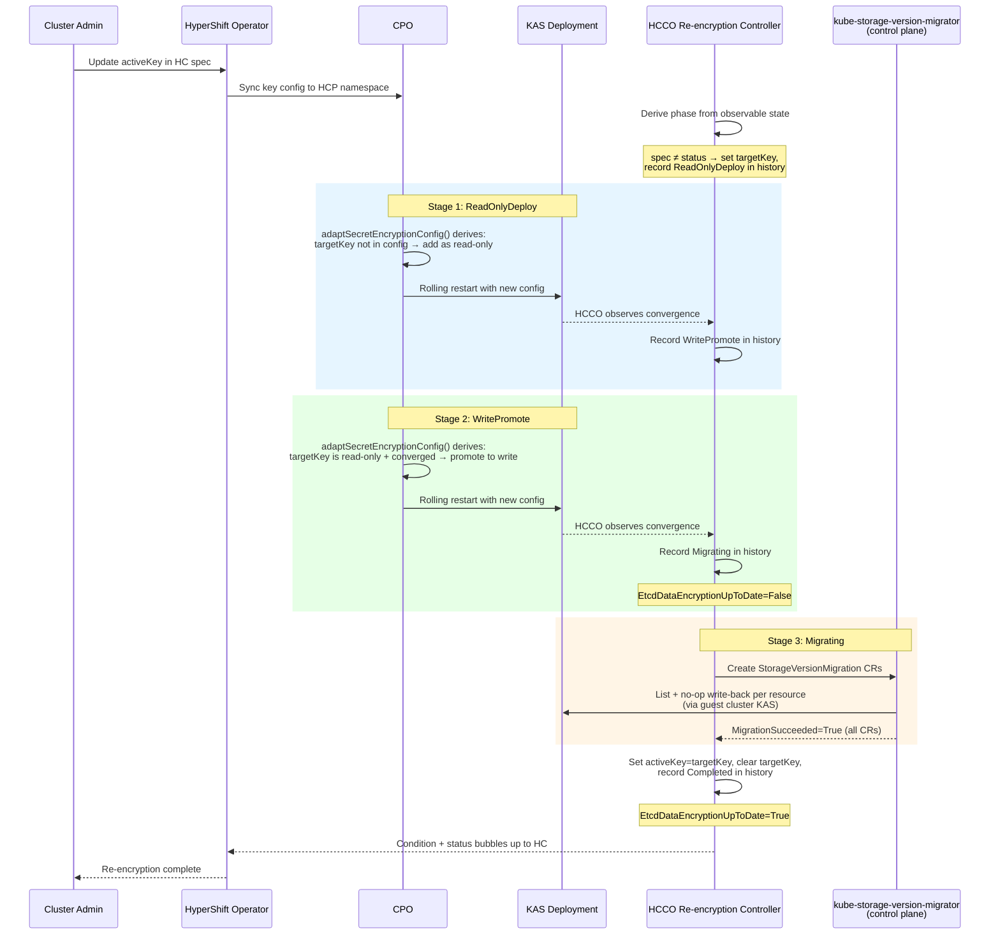

# etcd Data Re-encryption for Key Rotation

## Summary

HyperShift supports encryption key rotation infrastructure -- a new
active key can be set in `SecretEncryptionSpec`, and the
`EncryptionConfiguration` is correctly generated with the new key as
the write provider and the old key as a read provider. However,
there is no mechanism to re-encrypt existing etcd data with the new
key after rotation, and the current `backupKey` API requires manual
lifecycle management that is error-prone. This enhancement adds a
re-encryption controller in the HCCO that observes the encryption
state (spec vs status keys, EncryptionConfiguration contents, KAS
convergence, SVM completion), derives the current rotation phase,
and acts when conditions are met — setting `targetKey`, creating
StorageVersionMigration CRs, and updating `activeKey` on
completion. The CPO's `adaptSecretEncryptionConfig()` independently
derives the correct EncryptionConfiguration from the same
observable state, implementing the two-stage KAS rollout (first
adding the new key as read-only, then promoting it to write). The
enhancement also deploys the `kube-storage-version-migrator` in
the control plane to support zero-worker-node clusters, introduces
`status.secretEncryption` fields on HostedCluster/HCP to track
the active key, target key, and rotation history, deprecates the
`backupKey` spec fields, and tracks progress via a new
`EtcdDataEncryptionUpToDate` condition.

## Motivation

Without re-encryption, old etcd data remains encrypted with the
previous key indefinitely after a key rotation. This is unacceptable
for ARO-HCP's S360 compliance requirements and for any customer
relying on key rotation as a security control.

The current gaps are:

1. There is **no mechanism to trigger re-encryption** of existing
   etcd data with the new key.
2. There is **no way to track progress or confirm completion** of
   re-encryption.
3. The **`backupKey` API is error-prone** -- it requires the user
   to manually manage old key references and risks premature
   removal that could leave data unreadable.
4. The **`kube-storage-version-migrator` runs in the data plane**,
   which prevents re-encryption on clusters with zero worker
   nodes.

### User Stories

#### Story 1: ARO-HCP Key Rotation Compliance

As an ARO-HCP platform operator, I want all etcd data to be
automatically re-encrypted with the new key after a key rotation, so
that our clusters meet Microsoft's S360 security requirements for
complete data coverage under the active key.

#### Story 2: Key Rotation Progress Monitoring

As a cluster administrator, I want to monitor the progress and
completion of etcd data re-encryption through a standard Kubernetes
condition on the HostedCluster, so that I can confirm when it is safe
to deactivate or remove the old encryption key.

#### Story 3: Safe Key Rotation Without Manual Lifecycle Management

As a cluster administrator performing a key rotation, I want the
system to automatically track the previous active key and manage
the rotation lifecycle, so that I only need to update the active
key in the spec without manually managing a backup key field.

#### Story 4: Operations Team Incident Response

As an operations team member, I want to know when a re-encryption
has failed and see actionable error details in the HostedCluster
conditions, so that I can diagnose and remediate issues without
inspecting individual resources in the guest cluster.

### Goals

1. Guarantee that all existing encrypted etcd data is
   re-encrypted with the currently active encryption key after
   a key rotation. The re-encryption controller creates
   `StorageVersionMigration` CRs for whatever resource types
   `KMSEncryptedObjects()` returns (for KMS) or for `secrets`
   (for AESCBC). Note: KMS sidecars are currently only
   configured on KAS, so only KAS-served resources (secrets,
   configmaps) are actually encrypted via KMS today. The
   remaining resources in `KMSEncryptedObjects()` (routes,
   oauthaccesstokens, oauthauthorizetokens) are served by
   the OpenShift API servers, which do not have KMS sidecars
   — fixing this is out of scope (see Non-Goals). Similarly,
   AESCBC only encrypting secrets is a known gap in the
   existing implementation. In both cases, the re-encryption
   controller will automatically cover additional resources
   when the upstream encryption scope is expanded.

2. Provide an `EtcdDataEncryptionUpToDate` condition on
   HostedControlPlane and HostedCluster that tracks re-encryption
   progress and completion.

3. Track the active encryption key in HostedCluster/HCP status,
   enabling automatic rotation detection and eliminating the
   need for manual `backupKey` management.

4. Maintain cluster availability during the re-encryption process
   via a two-stage KAS rollout that prevents decryption failures
   during rolling updates.

5. Support all encryption types (Azure KMS, AWS KMS, IBM Cloud
   KMS, AESCBC) with a single, generic re-encryption mechanism.

6. Expose Prometheus metrics for re-encryption state and failures
   to enable alerting without requiring active polling of
   conditions.

7. Maintain a brief history of recent key rotations in
   HostedCluster/HCP status for audit and debugging.

### Non-Goals

1. Management of the creation and renewal of encryption keys --
   keys are managed externally (by the ARO RP or user).

2. Automatic key rotation scheduling or detection of
   cloud-provider-initiated rotation where the key identifier
   is unchanged (e.g., AWS KMS automatic rotation behind the
   same ARN). See "Cloud-Provider-Initiated Key Rotation" in
   Implementation Details for per-provider analysis.

3. Performance tuning for specific cluster sizes --
   `StorageVersionMigration` handles pagination natively.

4. Removing the `backupKey` fields from the API entirely --
   they are deprecated but still functional: `spec.backupKey` is
   used as a read provider fallback when
   `status.secretEncryption.activeKey` is not yet initialized
   (see Upgrade Strategy). Once the status is initialized, the
   status-driven mechanism takes over and `backupKey` is no
   longer needed. The fields remain in the API for backward
   compatibility; full removal is deferred to a future release.

5. Expanding the set of encrypted resource types or adding KMS
   sidecars to the OpenShift API servers
   (`openshift-apiserver`, `oauth-apiserver`). Currently, KMS
   sidecars are only configured on KAS, so only KAS-served
   resources are encrypted via KMS. AESCBC only encrypting
   `secrets` (not `configmaps`) is also a known gap. Fixing
   these upstream issues is separate work; the re-encryption
   mechanism is designed to automatically cover any newly
   encrypted resources without changes.

6. Tracking convergence of multiple API server Deployments
   (openshift-apiserver, oauth-apiserver) during the two-stage
   rollout. The current design tracks KAS convergence only.
   When encryption is expanded to other API servers, the
   convergence check should be extended accordingly.

## Proposal

This enhancement adds etcd data re-encryption support to HyperShift
by reusing library-go's `KubeStorageVersionMigrator` struct (which
creates and monitors `StorageVersionMigration` CRs via the
`migration.k8s.io/v1alpha1` API), deploying the
`kube-storage-version-migrator` in the control plane, introducing
a status field for rotation tracking, and deprecating the
`backupKey` spec fields.

The design reuses the same `StorageVersionMigration` mechanism that
standalone OCP uses for re-encryption, ensuring consistency and
debuggability across both topologies.

The changes span multiple components:

1. **HCCO** (new controller): Derives the current rotation phase
   from observable state on each reconciliation — not from a
   stored phase field. Detects key changes by comparing
   `hcp.Spec.SecretEncryption` against
   `hcp.Status.SecretEncryption.ActiveKey`. When a rotation is
   needed, sets `targetKey`, creates a history entry, waits for
   KAS convergence between stages, creates
   `StorageVersionMigration` CRs when conditions for Migrating
   are met, and on completion updates `ActiveKey`, clears
   `TargetKey`, and sets `EtcdDataEncryptionUpToDate=True`.
   Records the derived phase in `history[0].state` for
   observability, but does not use it as input for decisions.

2. **CPO `adaptSecretEncryptionConfig()`** (existing code
   modification): Derives the correct `EncryptionConfiguration`
   from observable state — comparing `spec.activeKey` against
   `status.activeKey` and inspecting the current
   EncryptionConfiguration contents to determine whether the
   target key is already present as a read or write provider.
   Implements the two-stage rollout: if the target key is not
   yet in the config, adds it as read-only; if it's present as
   read-only and KAS has converged, promotes it to write.
   `spec.backupKey` is used as a fallback only when
   `status.secretEncryption.activeKey` is not set (upgrade
   transition).

3. **CPO** (existing code modification): Deploy the
   `kube-storage-version-migrator` as a control plane component
   in the HCP namespace, connecting to the guest cluster KAS.

4. **cluster-kube-storage-version-migrator-operator** (separate
   repo change): Remove the
   `include.release.openshift.io/ibm-cloud-managed` annotation
   from the operator manifests to disable the data-plane
   instance for HyperShift.

5. **HyperShift Operator** (existing code modification): Bubble up
   the `EtcdDataEncryptionUpToDate` condition and
   `SecretEncryption` status from HCP to HostedCluster. Deploy a
   `ValidatingAdmissionPolicy` that blocks active key changes on
   HostedCluster while re-encryption is in progress.

### Workflow Description

1. The cluster administrator updates the active encryption key in
   the HostedCluster spec (e.g., rotates Azure KMS key version):
   ```yaml
   secretEncryption:
     type: kms
     kms:
       provider: Azure
       azure:
         activeKey:
           keyVaultName: my-vault
           keyName: my-key
           keyVersion: "v2"       # new version
   ```
   The administrator only needs to update the `activeKey`. The
   system tracks the previous key via
   `status.secretEncryption.activeKey` and automatically
   manages the old key as a read provider in the
   `EncryptionConfiguration`. The `backupKey` field is deprecated
   and no longer required.

2. The HyperShift Operator syncs the key configuration to the HCP
   namespace (existing behavior, no changes needed).

3. The HCCO re-encryption controller derives the current phase
   from observable state. It compares `spec.activeKey` against
   `status.activeKey` — if the status is nil and no `backupKey`
   is set (upgrade bootstrap), it initializes `status.activeKey`
   directly. If a rotation is needed (fingerprints differ, or
   status nil with `backupKey` set), it sets `targetKey` and
   prepends a history entry. It records the derived phase in
   `history[0].state` for observability.

4. **Stage 1 — ReadOnlyDeploy**: The CPO's
   `adaptSecretEncryptionConfig()` independently derives the
   correct config: it sees `targetKey` is set but not yet in
   the current EncryptionConfiguration, so it generates the
   config with the **old key** (`status.activeKey`) as the write
   provider and the **new key** (`status.targetKey`) as a
   read-only provider. The KAS Deployment rolls out. During this
   rolling update, pods with the new config can read both keys
   but still write with the old key; pods with the old config
   only see the old key. Since no pod writes with the new key
   yet, all reads succeed across all replicas.

5. The HCCO observes that KAS has converged with the target key
   as a read-only provider. It records
   `history[0].state=WritePromote`.

6. **Stage 2 — WritePromote**: The adapt function sees the
   target key is present as read-only and KAS has converged, so
   it generates the config with the **new key** as the write
   provider and the **old key** as read-only. The KAS Deployment
   rolls out again. During this rolling update, pods still on
   the previous config already have the new key as a read-only
   provider (from Stage 1), so they can decrypt data written by
   new-config pods.

7. The HCCO observes that KAS has converged with the target key
   as the write provider. It records
   `history[0].state=Migrating` and sets
   `EtcdDataEncryptionUpToDate=False`.

8. **Stage 3 — Migrating**: The HCCO creates
   `StorageVersionMigration` CRs in the hosted cluster for each
   encrypted resource type. The `kube-storage-version-migrator`
   controller, running in the HCP namespace (control plane),
   processes each CR via the guest cluster KAS: it lists all
   objects of each resource type and performs a no-op write-back,
   transparently re-encrypting all data with the new active key.

9. The HCCO detects all `StorageVersionMigration` CRs have
   `MigrationSucceeded=True`. It sets
   `hcp.Status.SecretEncryption.ActiveKey` to `TargetKey`,
   clears `TargetKey`, records `history[0].state=Completed`
   with `completionTime`, and sets
   `EtcdDataEncryptionUpToDate=True`.

10. The HyperShift Operator surfaces the condition on the
    HostedCluster. On the next CPO reconcile, the adapt function
    sees `activeKey` matches `spec.activeKey` and no `targetKey`
    is set — the backup sidecar is removed. If the spec key
    changed during the rotation, the HCCO detects the new
    mismatch and starts a fresh rotation from step 3.



#### Error Handling

**Migration failure**: If a `StorageVersionMigration` CR fails, the
controller waits 5 minutes (matching library-go's behavior), prunes
the failed CR, and retries on the next reconcile. The condition is
set to `False` with reason `ReEncryptionFailed` and a message
describing which resource failed.

**Key changes mid-rotation**: The system is designed to be safe
without relying on the VAP (see Component 5). Behavior depends
on the derived phase:

- **During `ReadOnlyDeploy`**: No data has been encrypted with
  the target key yet — it is only a read-only provider. If the
  spec's active key changes, the HCCO updates `status.targetKey`
  to the new spec key in-place and restarts `ReadOnlyDeploy`.
  The adapt function picks up the new `targetKey` on the next
  reconcile and generates the updated `EncryptionConfiguration`.
  This allows immediate correction of wrong-key mistakes without
  waiting for a full rotation cycle.

- **During `WritePromote` or `Migrating`**: Some KAS replicas
  may have already written data with the target key. Abandoning
  it would require keeping 3 keys simultaneously (old active +
  abandoned target + new key), which violates the two-sidecar
  constraint. The HCCO continues with the snapshotted
  `targetKey` and ignores the spec change. Once the current
  rotation completes, it detects the new mismatch and starts a
  fresh rotation.

The VAP (Component 5) provides a better UX by rejecting
mid-rotation changes at admission time with a clear error
message, rather than silently restarting or queuing them.

**KAS restart during migration**: `StorageVersionMigration` uses
`continueToken` for resumption. The controller detects stale CRs
and retries as needed.

**Guest cluster KAS unreachable**: The HCCO (during Migrating
phase) and the control plane migrator both connect to the guest
cluster KAS. If unreachable, the HCCO retries with backoff. The
condition reflects the inability to check status.

### API Extensions

This enhancement does not introduce new CRDs, webhooks, or
aggregated API servers. It adds a new status field, a new
informational status condition to the existing
HostedControlPlane/HostedCluster resources, a
`ValidatingAdmissionPolicy` to guard against concurrent key
rotations, and deprecates the `backupKey` spec fields.

**New condition type:**

```go
// EtcdDataEncryptionUpToDate indicates whether all etcd data
// is encrypted with the currently active encryption key.
// True: all data confirmed encrypted with the active key.
// False: re-encryption is in progress or has failed.
// Absent: encryption is not configured.
EtcdDataEncryptionUpToDate ConditionType = "EtcdDataEncryptionUpToDate"
```

**Condition reasons:**

```go
ReadOnlyRolloutInProgressReason     = "ReadOnlyRolloutInProgress"
WritePromotionInProgressReason      = "WritePromotionInProgress"
ReEncryptionInProgressReason        = "ReEncryptionInProgress"
ReEncryptionCompletedReason         = "ReEncryptionCompleted"
ReEncryptionFailedReason            = "ReEncryptionFailed"
ReEncryptionWaitingForKASReason     = "ReEncryptionWaitingForKASConvergence"
ReEncryptionPersistentFailureReason = "ReEncryptionPersistentFailure"
```

When encryption is not configured (`SecretEncryption` is nil), the
condition is omitted entirely from status conditions, matching the
pattern used by `UnmanagedEtcdAvailable`.

**New status field on HostedControlPlane and HostedCluster:**

```go
// SecretEncryptionStatus tracks the state of secret encryption
// key rotation and re-encryption.
// +k8s:deepcopy-gen=true
type SecretEncryptionStatus struct {
    // activeKey is the encryption key specification that all etcd
    // data is confirmed encrypted with. Updated after successful
    // re-encryption.
    // +optional
    ActiveKey SecretEncryptionKeyStatus `json:"activeKey,omitempty,omitzero"`
    // targetKey is the key being rolled out during an active
    // rotation. Snapshot from spec.secretEncryption's active key
    // when the rotation starts. The CPO uses this (not the
    // current spec) during the rotation, so mid-rotation spec
    // changes are safely queued until the current rotation
    // completes. Cleared when rotation completes.
    // +optional
    TargetKey SecretEncryptionKeyStatus `json:"targetKey,omitempty,omitzero"`
    // history contains a list of key rotations applied to this
    // cluster. The newest entry is first in the list. Entries
    // have state Completed when re-encryption has finished.
    // Entries have state ReadOnlyDeploy, WritePromote, or
    // Migrating when a rotation is in progress. The current
    // rotation phase is always history[0].state when
    // history[0] is not Completed or Interrupted.
    // +optional
    // +listType=atomic
    // +kubebuilder:validation:MaxItems=5
    History []EncryptionMigrationHistory `json:"history,omitempty"`
}

// EncryptionMigrationState tracks the lifecycle of a key
// rotation. Progresses through: ReadOnlyDeploy → WritePromote
// → Migrating → Completed. May also be Interrupted if the
// target key was replaced during ReadOnlyDeploy.
// +kubebuilder:validation:Enum=ReadOnlyDeploy;WritePromote;Migrating;Completed;Interrupted
type EncryptionMigrationState string

const (
    // EncryptionMigrationStateReadOnlyDeploy means the new key
    // is being deployed as a read-only provider. The old key
    // remains the write provider. The CPO's adapt function
    // generates the EncryptionConfiguration accordingly.
    EncryptionMigrationStateReadOnlyDeploy EncryptionMigrationState = "ReadOnlyDeploy"
    // EncryptionMigrationStateWritePromote means the new key is
    // being promoted to write provider. The old key becomes
    // read-only.
    EncryptionMigrationStateWritePromote EncryptionMigrationState = "WritePromote"
    // EncryptionMigrationStateMigrating means all KAS replicas
    // have converged on the new write provider and re-encryption
    // (StorageVersionMigration) is in progress.
    EncryptionMigrationStateMigrating EncryptionMigrationState = "Migrating"
    // EncryptionMigrationStateCompleted means all data was
    // successfully re-encrypted with the target key.
    EncryptionMigrationStateCompleted EncryptionMigrationState = "Completed"
    // EncryptionMigrationStateInterrupted means the rotation was
    // abandoned before data was encrypted with the target key
    // (e.g., targetKey replaced during ReadOnlyDeploy).
    EncryptionMigrationStateInterrupted EncryptionMigrationState = "Interrupted"
)

// EncryptionKeyReference identifies an encryption key by its
// provider and fingerprint.
// +k8s:deepcopy-gen=true
type EncryptionKeyReference struct {
    // provider identifies the encryption provider.
    // +required
    Provider SecretEncryptionProvider `json:"provider"`
    // fingerprint is the hex-encoded SHA-256 hash of the key's
    // identity fields.
    // +required
    Fingerprint string `json:"fingerprint"`
}

// EncryptionMigrationHistory records a key rotation, including
// in-progress rotations. Created when a rotation starts (with
// state=ReadOnlyDeploy and nil completionTime), updated as the
// rotation progresses through phases, and finalized when it
// completes or is interrupted.
// +k8s:deepcopy-gen=true
type EncryptionMigrationHistory struct {
    // from is the key that data was migrated from (the previous
    // active key).
    // +required
    From EncryptionKeyReference `json:"from,omitempty,omitzero"`
    // to is the key that data was migrated to (the target key).
    // +required
    To EncryptionKeyReference `json:"to,omitempty,omitzero"`
    // state tracks the current phase of this rotation. Progresses
    // through ReadOnlyDeploy → WritePromote → Migrating →
    // Completed. May be Interrupted if the target key was
    // replaced during ReadOnlyDeploy.
    // +required
    // +kubebuilder:validation:Enum=ReadOnlyDeploy;WritePromote;Migrating;Completed;Interrupted
    State EncryptionMigrationState `json:"state"`
    // startedTime is when the rotation was initiated.
    // +required
    StartedTime metav1.Time `json:"startedTime,omitempty,omitzero"`
    // completionTime is when the rotation finished. Not set
    // while the rotation is in progress.
    // +optional
    CompletionTime metav1.Time `json:"completionTime,omitempty,omitzero"`
}

// SecretEncryptionProvider identifies the encryption provider
// recorded in status. This is intentionally not schema-validated
// because status values are set by controllers, not users. It is
// a separate type from KMSProvider because the KMSProvider enum
// does not include AESCBC.
type SecretEncryptionProvider string

const (
    SecretEncryptionProviderAzure    SecretEncryptionProvider = "Azure"
    SecretEncryptionProviderAWS      SecretEncryptionProvider = "AWS"
    SecretEncryptionProviderIBMCloud SecretEncryptionProvider = "IBMCloud"
    SecretEncryptionProviderAESCBC   SecretEncryptionProvider = "AESCBC"
)

// SecretEncryptionKeyStatus records the active key identity.
// Status-specific types are used instead of reusing the spec
// types directly, to decouple status serialization from spec
// type evolution (fields added, renamed, or removed in spec
// types should not break status compatibility).
// +k8s:deepcopy-gen=true
// +kubebuilder:validation:XValidation:rule="self.provider == 'Azure' ? has(self.azure) : !has(self.azure)",message="azure is required when provider is Azure, and forbidden otherwise"
// +kubebuilder:validation:XValidation:rule="self.provider == 'AWS' ? has(self.aws) : !has(self.aws)",message="aws is required when provider is AWS, and forbidden otherwise"
// +kubebuilder:validation:XValidation:rule="self.provider == 'IBMCloud' ? has(self.ibmCloud) : !has(self.ibmCloud)",message="ibmCloud is required when provider is IBMCloud, and forbidden otherwise"
// +kubebuilder:validation:XValidation:rule="self.provider == 'AESCBC' ? has(self.aescbc) : !has(self.aescbc)",message="aescbc is required when provider is AESCBC, and forbidden otherwise"
// +union
type SecretEncryptionKeyStatus struct {
    // provider identifies the encryption provider.
    // +required
    // +unionDiscriminator
    // +kubebuilder:validation:Enum=Azure;AWS;IBMCloud;AESCBC
    Provider SecretEncryptionProvider `json:"provider"`
    // azure holds the Azure KMS key identity fields.
    // +optional
    // +unionMember
    Azure AzureKMSKeyStatus `json:"azure,omitempty,omitzero"`
    // aws holds the AWS KMS key identity fields.
    // +optional
    // +unionMember
    AWS AWSKMSKeyStatus `json:"aws,omitempty,omitzero"`
    // ibmCloud holds the IBM Cloud KMS key identity fields.
    // +optional
    // +unionMember
    IBMCloud IBMCloudKMSKeyStatus `json:"ibmCloud,omitempty,omitzero"`
    // aescbc holds a reference to the AESCBC key secret.
    // +optional
    // +unionMember
    AESCBC AESCBCKeyStatus `json:"aescbc,omitempty,omitzero"`
}

// AzureKMSKeyStatus contains identity fields for an Azure KMS
// key, sufficient to reconstruct the EncryptionConfiguration
// read provider.
// +k8s:deepcopy-gen=true
type AzureKMSKeyStatus struct {
    // keyVaultName is the name of the Azure Key Vault.
    // +required
    KeyVaultName string `json:"keyVaultName"`
    // keyName is the name of the key in the vault.
    // +required
    KeyName string `json:"keyName"`
    // keyVersion is the version of the key.
    // +required
    KeyVersion string `json:"keyVersion"`
}

// AWSKMSKeyStatus contains identity fields for an AWS KMS key,
// sufficient to reconstruct the backup sidecar container
// arguments.
// +k8s:deepcopy-gen=true
type AWSKMSKeyStatus struct {
    // arn is the Amazon Resource Name of the KMS key.
    // +required
    ARN string `json:"arn"`
    // region is the AWS region of the KMS key.
    // +required
    Region string `json:"region"`
}

// IBMCloudKMSKeyStatus contains identity fields for an IBM
// Cloud KMS key list entry, sufficient to reconstruct the
// KP_DATA_JSON entry for the backup key. CorrelationID and
// URL are included because the IBM Cloud KMS sidecar requires
// them to initialize the key connection.
// +k8s:deepcopy-gen=true
type IBMCloudKMSKeyStatus struct {
    // crkID is the Customer Root Key ID.
    // +required
    CRKID string `json:"crkID"`
    // instanceID is the KMS instance ID.
    // +required
    InstanceID string `json:"instanceID"`
    // keyVersion is the key version number.
    // +required
    KeyVersion int32 `json:"keyVersion"`
    // region is the IBM Cloud region.
    // +required
    Region string `json:"region"`
    // correlationID is the correlation ID for the key.
    // +required
    CorrelationID string `json:"correlationID"`
    // url is the KMS endpoint URL.
    // +required
    URL string `json:"url"`
}

// AESCBCKeyStatus contains a reference to the AESCBC key
// secret and a SHA-256 hash of its contents for fingerprinting.
// +k8s:deepcopy-gen=true
type AESCBCKeyStatus struct {
    // secretRef is a reference to the secret containing the
    // AESCBC key.
    // +required
    SecretRef corev1.LocalObjectReference `json:"secretRef"`
    // dataHash is the hex-encoded SHA-256 hash of the secret's
    // "key" data field at the time re-encryption completed.
    // +required
    DataHash string `json:"dataHash"`
}
```

Storing the full key specification in status (not just a hash)
is critical for resilience: if the `kas-secret-encryption-config`
secret is accidentally deleted, the CPO can reconstruct the
`EncryptionConfiguration` using the key in status as the read
provider. Without this, a deleted secret would leave the cluster
unable to read data encrypted with the previous key.

The HCCO re-encryption controller detects key changes by
computing a fingerprint of the spec's active key and the
status's active key and comparing them: nil/empty status means
first rotation, mismatch means new rotation, match means
re-encryption is complete. No hash is stored — it is always
computed on the fly from the key fields.

The current rotation phase is derived from `history[0].state`
— there is no separate top-level `rolloutPhase` field. This
follows the `ControlPlaneVersionStatus` pattern where
`history[0]` represents the current or most recent operation.

The `history[0].state` drives the CPO's
`EncryptionConfiguration` generation:

| `history[0].state` | Write provider | Read provider |
|---|---|---|
| no history / `Completed` | spec.activeKey | none |
| `ReadOnlyDeploy` | status.activeKey | status.targetKey |
| `WritePromote` | status.targetKey | status.activeKey |
| `Migrating` | status.targetKey | status.activeKey |

This two-stage approach ensures that during each KAS rolling
update, all replicas can decrypt data written by any other
replica — no replica ever encounters a key it cannot read (see
Workflow Description steps 4-8).

The `history` field records both in-progress and completed
rotations, using fingerprints (not full key specs) to keep the
status compact. A new entry is prepended when a rotation starts
(with `state=ReadOnlyDeploy` and no `completionTime`), updated
as phases progress, and finalized when the rotation completes
or is interrupted. The list is capped at 5 entries, most recent
first.

Example status during an active rotation:

```yaml
status:
  secretEncryption:
    activeKey:
      provider: Azure
      azure:
        keyVaultName: my-vault
        keyName: my-key
        keyVersion: "v2"
    targetKey:
      provider: Azure
      azure:
        keyVaultName: my-vault
        keyName: my-key
        keyVersion: "v3"
    history:
    - from:
        provider: Azure
        fingerprint: "a1b2c3..."
      to:
        provider: Azure
        fingerprint: "d4e5f6..."
      state: WritePromote
      startedTime: "2026-04-15T10:00:00Z"
    - from:
        provider: Azure
        fingerprint: "789abc..."
      to:
        provider: Azure
        fingerprint: "a1b2c3..."
      state: Completed
      startedTime: "2026-01-10T14:00:00Z"
      completionTime: "2026-01-10T14:12:15Z"
```

**Deprecated spec fields:**

The `backupKey` fields on `AzureKMSSpec`, `AWSKMSSpec`, and
`AESCBCSpec` are deprecated. They are still accepted for backward
compatibility and used as a fallback by the CPO when
`hcp.Status.SecretEncryption.ActiveKey` is not set (see
Component 3 priority chain). The re-encryption controller
ignores `backupKey` — it uses the status field exclusively for
rotation detection. The system automatically manages the
previous key as a read provider in the
`EncryptionConfiguration` based on the status field. IBM Cloud
KMS (`IBMCloudKMSSpec`) uses a `KeyList` and is unaffected.

**Why `backupKey` cannot always be honored**: For KMS providers,
each key in the `EncryptionConfiguration` requires its own KMS
plugin sidecar container. HyperShift deploys exactly two
sidecars per provider (active + backup). During a rotation, both
sidecar slots are occupied by `status.activeKey` and
`status.targetKey` — there is no third sidecar to service a
`spec.backupKey`. For this reason, `backupKey` is only honored
when `status.activeKey` is not set (upgrade transition). Once
the status is initialized, the system manages keys exclusively
through the status fields.

The following `// Deprecated:` markers must be added to the
Go doc comments:

```go
// Deprecated: This field is deprecated and will be ignored
// when status.secretEncryption.activeKey is set. The system
// automatically manages the previous key via the status field.
// +optional
BackupKey *AWSKMSKeyEntry `json:"backupKey,omitempty"`
```

The same marker applies to `AzureKMSSpec.BackupKey` and
`AESCBCSpec.BackupKey`.

### Topology Considerations

#### Hypershift / Hosted Control Planes

This enhancement is designed specifically for the HyperShift
topology. It affects:

- **Management cluster (HCP namespace)**: The HCCO re-encryption
  controller runs here, deriving the current rotation phase from
  observable state, managing `targetKey` and `activeKey` in HCP
  status, and creating `StorageVersionMigration` CRs in the
  guest cluster. The CPO's `adaptSecretEncryptionConfig()`
  independently derives the correct EncryptionConfiguration
  from the same observable state. The
  `kube-storage-version-migrator` runs as a control plane
  Deployment, connecting to the guest cluster KAS to process
  `StorageVersionMigration` CRs.
- **Guest cluster**: `StorageVersionMigration` CRs are created
  here by the HCCO using the guest cluster client. The
  `kube-storage-version-migrator` (running in the control plane)
  processes these CRs via the guest cluster KAS. The data-plane
  `cluster-kube-storage-version-migrator-operator` is disabled
  for HyperShift by removing
  `include.release.openshift.io/ibm-cloud-managed` from its
  manifests in the
  `cluster-kube-storage-version-migrator-operator` repo.
  For existing clusters upgrading from a version where the
  data-plane operator was present, explicit cleanup is
  required — the CVO does not delete resources when manifests
  are removed from a profile. The data-plane operator
  Deployment is added to `ResourcesToRemove()`, and the HCCO
  explicitly deletes it from the hosted cluster using a
  client on upgrade (the same pattern used for other disabled
  components like `network-operator` on IBM Cloud).

The design follows HyperShift's established pattern: the CPO
manages KAS Deployment configuration (encryption config
generation, migrator deployment), while the HCCO manages the
re-encryption lifecycle (phase derivation, status management,
StorageVersionMigration CR lifecycle). Both components derive
their decisions from observable state independently, with no
stored phase field as the source of truth. Deploying the
migrator in the control plane ensures re-encryption works on
clusters with zero worker nodes.

No additional RBAC is required for the HCCO:
- The HCCO already has `get`, `list`, `watch` on Deployments and
  Secrets in the HCP namespace.
- The HCCO authenticates as `system:hosted-cluster-config` in the
  guest cluster with `cluster-admin` via the `hcco-cluster-admin`
  ClusterRoleBinding.

The control plane `kube-storage-version-migrator` uses the same
guest cluster client credentials as other control plane
components (e.g., via the admin kubeconfig secret).

#### Standalone Clusters

Not directly applicable. Standalone OCP already has re-encryption
via the library-go encryption framework's `MigrationController`.
This enhancement brings equivalent functionality to HyperShift.

#### Single-node Deployments or MicroShift

Not applicable. This enhancement does not affect SNO or MicroShift
deployments. The re-encryption controller only runs in the HCCO,
which is specific to HyperShift.

#### OpenShift Kubernetes Engine

Not applicable. OKE does not support HyperShift hosted control
planes.

### Implementation Details/Notes/Constraints

#### Why KubeStorageVersionMigrator Instead of MigrationController

Standalone OCP uses library-go's `MigrationController`, which wraps
`KubeStorageVersionMigrator` with a 4-step state machine. This
controller has deep coupling to standalone OCP:

- Expects key secrets in `openshift-config-managed` with specific
  labels/annotations created by the KeyController. HyperShift gets
  keys from `HostedCluster.Spec.SecretEncryption`.
- Expects convergence via `RevisionLabelPodDeployer` checking
  static pod revisions on master nodes. HyperShift runs KAS as a
  Deployment.
- Calls `statemachine.GetEncryptionConfigAndState()` tied to the
  standalone key lifecycle.

Instead, this enhancement reuses only the
`KubeStorageVersionMigrator` struct -- a ~130-line, self-contained
implementation with zero dependencies on the rest of the encryption
framework. It handles:
- Creating `StorageVersionMigration` CRs with deterministic names
- Tracking which encryption key each CR was created for (via
  annotation)
- Detecting stale CRs from a previous key and replacing them
- Monitoring migration status conditions
- Resolving preferred API versions via discovery
- Pruning completed/stale migrations

#### Vendoring Requirements

The following packages must be added to HyperShift's vendor tree:

| Package | Why |
|---|---|
| `library-go/.../encryption/controllers/migrators` | `KubeStorageVersionMigrator` struct and `Migrator` interface |
| `kube-storage-version-migrator/.../informer/` | Required by `KubeStorageVersionMigrator` constructor |
| `kube-storage-version-migrator/.../lister/` | Pulled in transitively by the informer package |

All other dependencies (`migration/v1alpha1` types, typed
clientset, `factory.Informer`, `k8s.io/client-go/discovery`) are
already vendored.

The vendored version of `library-go` must match or be
compatible with HyperShift's existing `library-go` dependency.
The `KubeStorageVersionMigrator` struct has been stable since
its introduction and has no version-specific API changes. The
`kube-storage-version-migrator` informer/lister packages are
auto-generated and track the `migration.k8s.io/v1alpha1` API,
which has been stable since OCP 4.3.

#### Component 1: Key Change Detection and Phase Derivation (HCCO)

The HCCO re-encryption controller computes the active key
fingerprint on each reconciliation:

- Azure KMS: SHA-256 hash of `keyVaultName/keyName/keyVersion`
- AWS KMS: SHA-256 hash of the active key ARN
- IBM Cloud KMS: SHA-256 hash of the key list entries' CRK ID,
  InstanceID, and KeyVersion (the same fields stored in
  `IBMCloudKMSKeyStatus`). Fields not relevant to key identity
  (CorrelationID, URL) are excluded from the fingerprint to
  avoid triggering spurious re-encryption on metadata-only
  changes.
- AESCBC: SHA-256 hash of the active key secret name + the
  SHA-256 hash of the secret's data field
  (`AESCBCKeySecretKey = "key"`). Key rotation must be performed
  by creating a new secret and updating the `activeKey.name`
  reference. **In-place mutation of the key secret (same name,
  new data) is not supported**: the old key material is
  overwritten, making data encrypted with the previous key
  unreadable before re-encryption completes. The AESCBC
  `SecretRef` in status points to the same secret, so both
  active and backup would read the overwritten data.

#### Cloud-Provider-Initiated Key Rotation

Cloud KMS providers support automatic key rotation at the
provider level. The behavior varies by provider and determines
whether re-encryption is triggered:

**Azure Key Vault**: The HyperShift API requires an explicit
`keyVersion` in `AzureKMSKey`. When Azure auto-rotates a key
(creates a new version), KAS continues using the version pinned
in the spec — nothing changes transparently. The user must
update `keyVersion` in the spec to use the new version, which
changes the fingerprint and triggers re-encryption. Azure
cloud-initiated rotation is therefore always detectable via a
spec change.

**AWS KMS**: Automatic key rotation creates new backing key
material behind the same CMK ARN. KAS continues referencing the
same ARN, and AWS transparently handles decryption using the
correct key material version (the version is embedded in the
ciphertext metadata). Since the ARN does not change, the
fingerprint remains the same and re-encryption is **not**
automatically triggered. However, this is safe: old data
remains readable through the same ARN, and new writes
automatically use the latest key material. If compliance
requires explicit re-encryption after AWS-initiated rotation,
the user can trigger it manually (e.g., by toggling a
spec field). For manual AWS key rotation (new CMK = new ARN),
the ARN changes and re-encryption is triggered normally.

**IBM Cloud KMS**: The `CRKID` and `KeyVersion` fields are
explicit in the spec. Cloud-initiated rotation that changes
these values requires a spec update, which triggers
re-encryption. IBM Cloud's `KeyList`-based API naturally
supports tracking multiple key versions.

**AESCBC**: Keys are Kubernetes secrets managed by the user.
There is no cloud-initiated rotation. The user must create a
new secret and update the `activeKey.name` reference.

It then compares the computed fingerprint against one derived
from `hcp.Status.SecretEncryption.ActiveKey`:

- **Status field nil, no `backupKey` set** (upgrade bootstrap —
  never rotated): Initialize `status.activeKey` to
  `spec.activeKey` without triggering re-encryption. No
  rotation needed.
- **Status field nil, `backupKey` set** (upgrade with rotation
  in progress): Data may still be encrypted with the backup
  key. Snapshot the spec's active key into `status.targetKey`,
  prepend a history entry with `state=ReadOnlyDeploy`, and
  begin the two-stage rollout. `spec.backupKey` is used as
  the read provider during the rollout.
- **Fingerprints match**: Re-encryption already completed for
  the current key. No action needed.
- **Fingerprints differ**: New key rotation detected. Snapshot
  the spec's active key into `status.targetKey`, prepend a
  new history entry with `state=ReadOnlyDeploy`, and begin
  the two-stage rollout.

**Mid-rotation spec changes**: The HCCO uses a hybrid
interrupt/queue strategy depending on the derived phase:

- **`ReadOnlyDeploy`**: If `fingerprint(spec.activeKey)` ≠
  `fingerprint(status.targetKey)`, the HCCO updates
  `status.targetKey` to the new spec key and restarts
  `ReadOnlyDeploy`. This is safe because no data has been
  encrypted with the target key yet — it was only a read-only
  provider. The corrected key takes effect on the next KAS
  rollout without completing a full wasted rotation.

- **`WritePromote` or `Migrating`**: The HCCO continues with
  the snapshotted `targetKey` and ignores the spec change.
  Interrupting would require 3 simultaneous keys (old active +
  abandoned target + new key), violating the two-sidecar
  constraint. Once the rotation completes, the HCCO detects the
  new mismatch and starts a fresh rotation.

This hybrid approach ensures safety without relying on the VAP
while providing fast correction for the common "wrong key"
scenario.

**Upgrade bootstrap**: When `status.activeKey` is nil and no
`backupKey` is set, the HCCO initializes `status.activeKey`
directly without triggering re-encryption. When `backupKey`
is set, a full re-encryption is triggered to ensure all data
is encrypted with the current active key before transitioning
to the status-driven mechanism. See Upgrade Strategy for
details.

#### Component 2: Re-encryption Orchestration (HCCO)

**New file:**
`control-plane-operator/hostedclusterconfigoperator/controllers/reencryption/reencryption.go`

The HCCO re-encryption controller instantiates
`KubeStorageVersionMigrator` using guest cluster clients and
derives the current phase from observable state on each
reconciliation. The phase is **not** read from
`history[0].state` — it is computed from resources (spec vs
status keys, EncryptionConfiguration contents, KAS Deployment
convergence, SVM status). The controller records the derived
phase in `history[0].state` for observability.

1. If encryption is not configured, remove the
   `EtcdDataEncryptionUpToDate` condition if present, clear
   `targetKey` if set, and return.

2. Compute fingerprints of the spec's active key and the
   status's active key. If they match and no `targetKey` is
   set, re-encryption is complete — return.

   If `status.activeKey` is nil and no `spec.backupKey` is set
   (upgrade bootstrap), initialize `status.activeKey` to
   `spec.activeKey` without triggering re-encryption. Return.

   If a rotation is needed (`status.activeKey` nil with
   `backupKey` set, or fingerprints differ) and `targetKey` is
   not set, snapshot the spec's active key into
   `status.targetKey` and prepend a history entry.

3. **Derive the current phase** from observable state:
   - Inspect the current `EncryptionConfiguration` to
     determine whether `targetKey` is present as a provider
   - Check KAS Deployment convergence
     (`updatedReplicas == replicas == readyReplicas`)
   - Check SVM completion status

   The derived phase determines what action to take:

   a. **ReadOnlyDeploy** (targetKey not yet in
      EncryptionConfiguration, or present but KAS not
      converged with it as read-only): Wait for the adapt
      function to generate the config and KAS to converge.
      Set condition
      `False/ReEncryptionWaitingForKASConvergence` if not
      converged. Record `history[0].state=ReadOnlyDeploy`.

   b. **WritePromote** (targetKey present as read-only, KAS
      converged, but targetKey not yet the write provider, or
      KAS not converged with it as write): Wait for the adapt
      function to promote and KAS to converge. Set condition
      `False/WritePromotionInProgress`. Record
      `history[0].state=WritePromote`.

   c. **Migrating** (targetKey is write provider, KAS
      converged): Create `StorageVersionMigration` CRs. Set
      condition `False/ReEncryptionInProgress`. Record
      `history[0].state=Migrating`.

4. Determine the encrypted resource list based on encryption
   type. For KMS, use `KMSEncryptedObjects()` (5 resource
   types). For AESCBC, use only `secrets` (AESCBC only encrypts
   secrets, as defined in `aescbc.go`). For each resource, call
   `migrator.EnsureMigration(gr, computedKeyHash)` and track
   finished/failed/in-progress state.

5. If all resources migrated successfully, set
   `hcp.Status.SecretEncryption.ActiveKey` to `TargetKey`,
   clear `TargetKey`, record `history[0].state=Completed` with
   `completionTime`, and set condition
   `True/ReEncryptionCompleted`. The history list is capped at
   5 entries (oldest pruned on append). All fields are updated
   in a single HCP status patch call to ensure atomicity. The
   controller uses `Status().Patch()` with `MergeFrom` (rather
   than `Status().Update()`) to avoid clobbering other status
   fields. On `Conflict` errors, the controller re-reads the
   HCP and retries the patch.

6. If any resource failed and not retried within 5 minutes,
   prune the failed CR for retry on next reconcile and set
   condition `False/ReEncryptionFailed`. The condition message
   includes elapsed time since re-encryption started (e.g.,
   `"re-encryption of secrets failed after 12m30s"`) to help
   operators assess whether manual intervention is needed. The
   controller tracks the retry count via an annotation on the
   `StorageVersionMigration` CR. After 3 consecutive failures
   for the same resource, the condition reason is escalated to
   `ReEncryptionPersistentFailure` to distinguish transient
   failures from systemic issues requiring manual intervention.

7. Otherwise, set condition `False/ReEncryptionInProgress` and
   requeue after 30 seconds. The condition message includes
   progress (e.g., `"3/5 resources migrated, elapsed 2m15s"`)
   and the elapsed time since re-encryption started. The elapsed
   time is computed from the condition's `LastTransitionTime` —
   when the condition first transitions to `False`, the
   `LastTransitionTime` is set and remains stable across
   subsequent updates (since the status stays `False`), providing
   a natural start timestamp without additional state.

The encrypted resources depend on the encryption type:

For KMS (from `support/config/kms.go:KMSEncryptedObjects()`):
- `secrets`
- `configmaps`
- `routes.route.openshift.io` *
- `oauthaccesstokens.oauth.openshift.io` *
- `oauthauthorizetokens.oauth.openshift.io` *

\* These resources are listed in `KMSEncryptedObjects()` but are
served by the OpenShift API servers, which do not currently have
KMS sidecars configured. The re-encryption controller creates
SVMs for all resources returned by `KMSEncryptedObjects()` —
the SVMs for resources that are not actually encrypted will
perform no-op write-backs (data passes through unchanged). When
KMS sidecars are added to the OpenShift API servers, these SVMs
will automatically perform real re-encryption.

For AESCBC (from `aescbc.go`):
- `secrets`

Note: AESCBC only encrypting `secrets` (not `configmaps`) is a
known gap in the existing implementation, not an intentional
design choice of this enhancement.

**StorageVersionMigration CR naming**: The
`KubeStorageVersionMigrator` creates SVMs with deterministic
names prefixed with `encryption-migration-` (e.g.,
`encryption-migration-core-secrets`). Conflicts with
admin-created SVMs are unlikely due to this prefix. If a
conflict occurs, the controller detects the wrong key
annotation and recreates the CR.

#### EncryptionConfiguration by Phase

The following shows how the `EncryptionConfiguration` changes
during a KMS (Azure) key rotation from v2 to v3:

**ReadOnlyDeploy** (old key writes, new key read-only):
```yaml
apiVersion: apiserver.config.k8s.io/v1
kind: EncryptionConfiguration
resources:
- resources: [secrets, configmaps]
  providers:
  - kms:
      name: azurekmsactive      # v2 — write provider
      endpoint: unix:///azurekmsactive.socket
  - kms:
      name: azurekmsbackup      # v3 — read-only
      endpoint: unix:///azurekmsbackup.socket
  - identity: {}
```

**WritePromote / Migrating** (new key writes, old key read-only):
```yaml
apiVersion: apiserver.config.k8s.io/v1
kind: EncryptionConfiguration
resources:
- resources: [secrets, configmaps]
  providers:
  - kms:
      name: azurekmsactive      # v3 — write provider
      endpoint: unix:///azurekmsactive.socket
  - kms:
      name: azurekmsbackup      # v2 — read-only
      endpoint: unix:///azurekmsbackup.socket
  - identity: {}
```

**Completed** (single key, backup removed):
```yaml
apiVersion: apiserver.config.k8s.io/v1
kind: EncryptionConfiguration
resources:
- resources: [secrets, configmaps]
  providers:
  - kms:
      name: azurekmsactive      # v3
      endpoint: unix:///azurekmsactive.socket
  - identity: {}
```

#### Component 3: CPO `adaptSecretEncryptionConfig()` Changes

**Modified files:**
- `control-plane-operator/controllers/hostedcontrolplane/v2/kas/secretencryption.go`
- `control-plane-operator/controllers/hostedcontrolplane/v2/kas/kms/aws.go`
- `control-plane-operator/controllers/hostedcontrolplane/v2/kas/kms/azure.go`

##### KMS Sidecar Architecture

For AWS and Azure KMS, each key in the `EncryptionConfiguration`
requires its own KMS plugin sidecar container running alongside
the KAS. HyperShift deploys exactly **two sidecars** per
provider — one for the active key and one for the backup key —
with dedicated socket paths and health ports:

- **AWS**: `aws-kms-active` (port 8080, `awskmsactive.sock`)
  and `aws-kms-backup` (port 8081, `awskmsbackup.sock`)
- **Azure**: `azure-kms-provider-active` (port 8787,
  `azurekmsactive.socket`) and `azure-kms-provider-backup`
  (port 8788, `azurekmsbackup.socket`)

During a rotation, both sidecars are used: one for the write
provider key and one for the read-only provider key. Which key
goes to which sidecar depends on the derived state (see
"Derived-State Configuration" below).

IBM Cloud KMS uses a different architecture: a single sidecar
(`ibmcloud-kms`) that receives all keys as a JSON key list via
the `KP_DATA_JSON` environment variable.

For AESCBC, keys are inline in the `EncryptionConfiguration`
secret (no sidecar needed).

**Encryption config reload**: The KAS must NOT auto-reload the
`EncryptionConfiguration` during a rollout — all replicas must
converge on the same config via pod replacement. AWS and IBM
Cloud KMS providers already set
`--encryption-provider-config-automatic-reload=false` on the
KAS. The Azure KMS provider must also set this flag to prevent
a split-brain scenario where some replicas hot-reload the new
config before others have been replaced.

The two-sidecar constraint (exactly two KMS sidecars) means at
most two KMS keys can be active simultaneously. The HCCO's
queuing behavior (see Component 1) ensures mid-rotation spec
changes are deferred until the current rotation completes,
keeping the key count within this limit. The VAP (Component 5)
provides a better UX by rejecting mid-rotation changes at
admission time rather than silently queuing them.

##### CPO Modification: Derived-State Configuration

`adaptSecretEncryptionConfig()` derives the correct
`EncryptionConfiguration` from observable state — it does not
read `history[0].state`. Instead, it inspects:

1. `spec.activeKey` vs `status.activeKey` — is a rotation
   needed?
2. `status.targetKey` — is a rotation in progress?
3. The current `EncryptionConfiguration` contents — is the
   target key already present? As read-only or write?
4. KAS Deployment convergence — have all replicas converged?

The derivation logic:

| Observed state | Write provider | Read provider |
|---|---|---|
| No `targetKey` set | spec.activeKey | none |
| `targetKey` set, not yet in config | status.activeKey | status.targetKey |
| `targetKey` in config as read-only, KAS converged | status.targetKey | status.activeKey |
| `targetKey` is write provider | status.targetKey | status.activeKey |

For KMS, the write provider key is configured on the "active"
sidecar and the read provider key on the "backup" sidecar.
For AESCBC, both keys are inline in the
`EncryptionConfiguration` secret.

**backupKey fallback (transition safety)**: If
`hcp.Status.SecretEncryption.ActiveKey` is not set (e.g., the
status has not been initialized yet on a cluster that was
upgraded mid-rotation) and no in-progress history entry, fall back
to `spec.backupKey` if populated. This ensures backward
compatibility during the transition period. Once the status is
initialized, `spec.backupKey` is ignored — during a rotation,
both sidecar slots are occupied by `status.activeKey` and
`status.targetKey`, leaving no slot for a third key (see
"Why `backupKey` cannot always be honored" in API Extensions).

**Backup removal**: When no rotation is in progress and
`status.activeKey` matches the spec's active key
(re-encryption confirmed complete), no backup key is needed.
The backup sidecar container is removed from the KAS pod and
the read-only provider is removed from the
`EncryptionConfiguration`.

##### KMS Provider Constructor Changes

Both providers are changed to accept explicit write and read
key parameters derived from the `history[0].state` table above:

**AWS**:

```go
// Before
NewAWSKMSProvider(kmsSpec, image, tokenMinterImage)
// reads kmsSpec.BackupKey internally

// After
writeKey, readKey := deriveAWSKeys(hcpStatus, kmsSpec)
NewAWSKMSProvider(writeKey, readKey, image, tokenMinterImage)
```

**Azure**:

```go
// Before
NewAzureKMSProvider(kmsSpec, image)

// After
writeKey, readKey := deriveAzureKeys(hcpStatus, kmsSpec)
NewAzureKMSProvider(writeKey, readKey, image)
```

**IBM Cloud** — uses a `KeyList` with a single sidecar. No
backup key change needed; the key list is passed through as-is.

#### Component 4: Control Plane Migrator Deployment (CPO)

The CPO deploys the `kube-storage-version-migrator` as a
Deployment in the HCP namespace. The migrator image is sourced
from the OCP release payload. It connects to the guest cluster
KAS using the `admin-kubeconfig` secret.

The migrator is always deployed — it has responsibilities
beyond encryption (e.g., API version migrations). The
data-plane operator is disabled for HyperShift (see Topology
Considerations). The `StorageVersionMigration` CRD remains
installed in all topologies.

#### Component 5: HyperShift Operator Integration

**Modified file:**
`hypershift-operator/controllers/hostedcluster/hostedcluster_controller.go`

1. **Bubble up condition**: Surface
   `EtcdDataEncryptionUpToDate` from HCP to HostedCluster using
   the copy-if-present pattern (`ValidKubeVirtInfraNetworkMTU`
   style), not the bulk `hcpConditions` list. Absent on HC when
   absent on HCP.

2. **Bubble up status**: Copy `SecretEncryption` status from HCP
   to HostedCluster.

#### Component 6: ValidatingAdmissionPolicy (UX Improvement)

The system is designed to be safe without the VAP — the CPO
main reconciler queues mid-rotation key changes by continuing
with the snapshotted `targetKey` and deferring the new spec key
until the current rotation completes (see Component 1). The
VAP provides a better user experience by rejecting mid-rotation
changes at admission time with a clear error message, rather
than silently queuing them.

The HyperShift Operator deploys a `ValidatingAdmissionPolicy`
and `ValidatingAdmissionPolicyBinding` on the management cluster
to block active key changes while a rotation is in progress.

```yaml
apiVersion: admissionregistration.k8s.io/v1
kind: ValidatingAdmissionPolicy
metadata:
  name: hostedcluster-block-key-rotation-during-reencryption
spec:
  failurePolicy: Ignore
  matchConstraints:
    resourceRules:
    - apiGroups: ["hypershift.openshift.io"]
      apiVersions: ["v1beta1"]
      operations: ["UPDATE"]
      resources: ["hostedclusters"]
  validations:
  - expression: >-
      !has(object.status.conditions) ||
      !object.status.conditions.exists(c,
        c.type == 'EtcdDataEncryptionUpToDate' &&
        c.status == 'False') ||
      (!has(object.spec.secretEncryption) &&
        !has(oldObject.spec.secretEncryption)) ||
      (has(object.spec.secretEncryption) &&
        has(oldObject.spec.secretEncryption) &&
        object.spec.secretEncryption ==
          oldObject.spec.secretEncryption)
    message: >-
      Cannot change the active encryption key while
      re-encryption is in progress
      (EtcdDataEncryptionUpToDate=False). Wait for
      re-encryption to complete before rotating again.
---
apiVersion: admissionregistration.k8s.io/v1
kind: ValidatingAdmissionPolicyBinding
metadata:
  name: hostedcluster-block-key-rotation-during-reencryption
spec:
  policyName: hostedcluster-block-key-rotation-during-reencryption
  validationActions:
  - Deny
```

**Design choices:**

- **`failurePolicy: Ignore`**: If the policy cannot be
  evaluated (API server issue), allow the write rather than
  blocking all HostedCluster updates. This avoids introducing
  a new failure mode for cluster lifecycle operations.
- **Structural equality** (`==` on the whole
  `secretEncryption` block): CEL compares the entire struct,
  so no per-provider fingerprint logic is needed. This
  intentionally blocks all `secretEncryption` changes during
  re-encryption (not just the active key), because any
  encryption config change triggers a KAS rollout that could
  interfere with in-flight migrations.
- **Nil-safety**: The expression uses `has()` guards to handle
  the case where `spec.secretEncryption` is nil on either the
  old or new object. This also covers the case where a user
  attempts to remove `secretEncryption` entirely while
  re-encryption is in progress — the `has()` mismatch causes
  the structural equality check to fail, blocking the removal.
- **Handles absent condition**: When
  `EtcdDataEncryptionUpToDate` is not present (encryption not
  configured, first setup, older HCCO), the policy allows the
  change.
- **UPDATE only**: CREATE is always allowed.

**Why VAP over alternatives**: CEL-in-CRD cannot
cross-reference status from spec validation. Webhooks add
availability concerns. An HO reconciler guard would accept
the write then silently not propagate it, causing HC/HCP spec
divergence. The VAP rejects at admission time with a clear
error message. However, the VAP is strictly a UX improvement
— the controller is safe without it (see Component 1 for
the queuing mechanism).

**Race window**: There is a window (two reconcile cycles)
between the first key change and `EtcdDataEncryptionUpToDate=False`
appearing on the HostedCluster. A second key change during
this window would not be blocked by the VAP. This is safe
because the controller queues the change — it is not a
correctness issue, only a UX gap where the user does not get
immediate feedback.

#### Safety Invariants

Derived from library-go's encryption framework and adapted
for the two-stage rollout:

1. **Two-stage rollout**: Never promote a new key to write
   provider until all KAS replicas have it as a read provider.
   This prevents decryption failures during rolling updates.
2. **Convergence gating**: No phase transition
   (`ReadOnlyDeploy` → `WritePromote` → `Migrating`) occurs
   until all KAS replicas are converged
   (`updatedReplicas == replicas == readyReplicas`).
3. **Never remove read-keys before migration completes**.
4. **Hybrid interrupt/queue for mid-rotation key changes**:
   During `ReadOnlyDeploy` (no data encrypted with target key),
   spec changes update `targetKey` in-place and restart the
   phase. During `WritePromote` or `Migrating`, spec changes
   are queued until the current rotation completes. This is
   enforced at the controller level and does not depend on the
   VAP.
5. **Retry failed migrations**: Prune and retry after 5 minutes.
6. **VAP as UX guard**: The VAP rejects mid-rotation active key
   changes at admission time for better user feedback, but the
   controller is safe without it.
7. **Atomic status patches**: Update `ActiveKey`, clear
   `TargetKey`, set `history[0].state=Completed`, and set the
   condition in a single `Status().Patch()` call (`MergeFrom`)
   to avoid partial state.

#### Architecture Diagram

```
Management Cluster (HCP namespace)

  HyperShift Operator
  - Surfaces HCP conditions + status to HC
    (copy-if-present pattern for EtcdDataEncryptionUpToDate)
  - Deploys ValidatingAdmissionPolicy (UX improvement)
    that blocks key changes when
    EtcdDataEncryptionUpToDate=False

  CPO                              HCCO
  - adaptSecretEncryptionConfig()  - Re-encryption Controller (NEW)
    (MODIFIED):                      Derives phase from observable
    - Derives EncryptionConfig         state on each reconcile:
      from observable state          - Compares spec vs status keys
      (spec/status keys,             - Inspects EncryptionConfig
       current config contents,      - Checks KAS convergence
       KAS convergence)              - Checks SVM completion
    - backupKey fallback for         - Sets targetKey, creates SVMs,
      transition safety                updates activeKey
  - Deploys kube-storage-           - Records derived phase in
    version-migrator in                history[0].state
    HCP namespace                    - Sets conditions

  kube-storage-version-migrator
  (control plane Deployment,
   uses admin-kubeconfig secret)
              │
              │ guest cluster KAS
              ▼
Hosted Cluster (guest API)

  StorageVersionMigration CRs
  (migration.k8s.io/v1alpha1)
  For KMS:
  - encryption-migration-core-secrets
  - encryption-migration-core-configmaps
  - encryption-migration-route.openshift.io-routes
  - encryption-migration-oauth...-oauthaccesstokens
  - encryption-migration-oauth...-oauthauthorizetokens
  For AESCBC:
  - encryption-migration-core-secrets

  cluster-kube-storage-version-migrator-operator
  (DISABLED for HyperShift — annotation removed)
```

### Risks and Mitigations

**Risk**: Re-encryption of large clusters takes a long time,
resulting in a prolonged `False` condition.
**Mitigation**: `StorageVersionMigration` handles pagination
internally. The condition message reports which resources have
completed and which are still in progress.

**Risk**: KAS restarts during re-encryption interrupt the
migration.
**Mitigation**: `StorageVersionMigration` uses `continueToken` for
resumption. The controller detects stale CRs and retries as
needed.

**Risk**: `kube-storage-version-migrator` in the control plane is
degraded, causing migrations to never complete.
**Mitigation**: The controller sets a `ReEncryptionFailed`
condition with details after failed migrations persist.
Operational guidance covers how to check the migrator Deployment
health in the HCP namespace.

**Risk**: Guest cluster KAS is unreachable from the control plane,
preventing CR creation, migration processing, or monitoring.
**Mitigation**: The HCCO and migrator both retry with backoff.
The condition reflects the inability to check status rather than
incorrectly reporting success.

**Risk**: A second key rotation occurs before re-encryption
completes. HyperShift's two-sidecar design retains only one
previous key — a rapid v1 -> v2 -> v3 rotation would evict
v1's sidecar, leaving v1-encrypted data unreadable.
**Mitigation**: The controller uses a hybrid approach
(VAP-independent): during `ReadOnlyDeploy` (no data encrypted
with the target key yet), spec changes update `targetKey`
in-place, allowing immediate correction. During `WritePromote`
or `Migrating`, spec changes are queued until the current
rotation completes. The VAP provides a better UX by rejecting
mid-rotation changes at admission time.

**Risk**: Old-key-encrypted data persists in etcd historical
revisions after re-encryption until etcd compaction runs.
**Mitigation**: HyperShift's etcd auto-compaction (typically
every 5 minutes) clears old revisions. After compaction, old
revisions containing data encrypted with the previous key are
removed. The `EtcdDataEncryptionUpToDate=True` condition
indicates that all *current* revisions are encrypted with the
active key; operators should be aware that historical revisions
remain until the next compaction cycle.

**Risk**: KMS API rate limiting during re-encryption of large
clusters. Each re-encrypted object requires two KMS API calls
(one decrypt via the old key, one encrypt via the new key). A
cluster with 10,000 secrets generates approximately 20,000 KMS
API calls. On Azure Key Vault (2,000 transactions per 10
seconds per vault), this could trigger throttling.
**Mitigation**: `StorageVersionMigration` processes one page at
a time (default page size 500), providing natural throttling.
However, if multiple hosted clusters sharing the same KMS
endpoint rotate keys simultaneously, aggregate API call volume
could hit provider rate limits. Operators managing large fleets
should stagger key rotations across hosted clusters.

#### Backup and Restore During Re-encryption

etcd backups should not be taken while re-encryption is in
progress (`EtcdDataEncryptionUpToDate=False`). A backup taken
during re-encryption contains a mix of objects encrypted with
the old key and the new key. Restoring such a backup requires
that both keys are available as read providers in the
`EncryptionConfiguration`, which may not be the case if the
backup sidecar has already been removed after a subsequent
successful re-encryption.

If a backup must be taken during re-encryption, operators
should ensure that both the old and new encryption keys remain
accessible (not deactivated or deleted in the cloud KMS) until
the backup is no longer needed for restore.

### Drawbacks

1. **Increased operational complexity**: The re-encryption
   controller adds a new reconciliation loop in the HCCO, and
   the `kube-storage-version-migrator` adds a new Deployment in
   the HCP namespace. However, the re-encryption controller is
   dormant when no key rotation is in progress (it no-ops when
   the computed key fingerprint matches the status field).

2. **Vendoring new packages**: Three packages must be added to
   HyperShift's vendor tree. These are small, auto-generated
   packages with no external dependencies beyond what HyperShift
   already vendors.

3. **Cross-repo dependency**: Disabling the data-plane
   `cluster-kube-storage-version-migrator-operator` requires a
   separate PR in the
   `cluster-kube-storage-version-migrator-operator` repo to
   remove the `include.release.openshift.io/ibm-cloud-managed`
   annotation from its manifests.

4. **API deprecation**: The `backupKey` fields are deprecated
   but must remain in the API for backward compatibility. This
   creates a period where both mechanisms coexist.

## Alternatives (Not Implemented)

### Reuse library-go's MigrationController Directly

**Rejected because**: Deep coupling to standalone OCP (key
secrets in `openshift-config-managed`, static pod revision
checking, `statemachine.GetEncryptionConfigAndState()`). See
"Why KubeStorageVersionMigrator" above.

### Build Custom Migration Logic Without library-go

Implement `StorageVersionMigration` CR lifecycle management from
scratch instead of using `KubeStorageVersionMigrator`.

**Rejected because**: `KubeStorageVersionMigrator` is a ~130-line,
self-contained struct that handles CR creation, stale CR detection,
annotation tracking, status monitoring, version discovery, and
pruning. Reimplementing this would duplicate production-tested code
with no benefit.

### Keep the backupKey API for Rotation Tracking

Instead of introducing a status field and deprecating `backupKey`,
continue using the existing `activeKey`/`backupKey` spec fields for
rotation lifecycle management.

**Rejected because**: The `backupKey` API requires the user (or
automation) to manually manage old key references and remember to
populate the backup field during rotation. This is error-prone:
the backup key can be removed prematurely (before re-encryption
completes), or forgotten entirely (leaving no read provider for
old data). A status field that the system manages automatically
eliminates this class of user error and enables the system to
detect and handle mid-rotation key changes.

### Run the kube-storage-version-migrator in the Data Plane

Instead of deploying the migrator in the control plane, rely on
the existing data-plane
`cluster-kube-storage-version-migrator-operator` to process
`StorageVersionMigration` CRs in the hosted cluster.

**Rejected because**: The data-plane migrator runs as a
Deployment in the hosted cluster, which requires schedulable
worker nodes. HyperShift supports clusters with zero worker
nodes (e.g., during initial provisioning or node pool scale-down),
and re-encryption must work in these scenarios. Deploying the
migrator in the control plane (HCP namespace) ensures it is
always available regardless of worker node count.

### Run the Full Re-encryption State Machine in the CPO

**Rejected because**: The Migrating phase requires creating and
monitoring `StorageVersionMigration` CRs in the guest cluster.
The HCCO already has guest cluster client access and manages
guest cluster resources. Since the phase is derived from
observable state (not stored), having a single controller (HCCO)
own the entire lifecycle avoids split-state conflicts. The CPO's
`adaptSecretEncryptionConfig()` independently derives the
correct EncryptionConfiguration from the same observable state.

### Direct etcd Manipulation

Instead of using `StorageVersionMigration` CRs, directly read and
re-write etcd data using the etcd client.

**Rejected because**: This would bypass the kube-apiserver's
encryption layer and require direct etcd access, which is complex,
error-prone, and inconsistent with how OpenShift handles
encryption. The `StorageVersionMigration` approach works through
the API server, ensuring proper encryption, audit logging, and
admission control.

## Open Questions [optional]

1. **Should re-encryption block cluster upgrades?** Current
   recommendation is no -- re-encryption is independent of
   upgrades. The `EtcdDataEncryptionUpToDate` condition is
   informational and does not gate upgrade preconditions.

2. **Should the `backupKey` fields be removed in a future API
   version?** They are currently deprecated and used as a
   fallback during upgrade transition. Full removal would
   simplify the API but requires an API version bump.

#### Forward Compatibility

**Cross-type migration** (e.g., AESCBC → AWS KMS): The status
types support different providers in `from` and `to` fields of
history entries, and `activeKey` and `targetKey` can have
different providers. The two-stage rollout and re-encryption
mechanism work regardless of whether the provider type changes.
While cross-type migration is not in scope for this
enhancement, the design does not preclude it.

**Etcd sharding** (see PR #1979): The re-encryption mechanism
works through the API server (StorageVersionMigration CRs),
not direct etcd access. If etcd is sharded by resource kind
via `--etcd-servers-overrides`, the API server routes
write-backs to the correct shard transparently. The
re-encryption controller does not need shard awareness.

## Test Plan

<!-- TODO: When implementing tests, include the following labels
per dev-guide/feature-zero-to-hero.md and
dev-guide/test-conventions.md:
- [Jira:"HyperShift"] for component identification
- Appropriate test type labels: [Suite:...], [Serial], [Slow],
  or [Disruptive] as needed

Note: This enhancement does not use an OCP feature gate, so the
[OCPFeatureGate:FeatureName] label is not applicable. HyperShift
tests are gated by the test infrastructure itself (HyperShift CI
jobs). -->

### Unit Tests

- Key fingerprint computation for each provider (Azure KMS, AWS
  KMS, IBM Cloud KMS, AESCBC).
  - AESCBC: Verify fingerprint changes when secret name changes
    (the supported rotation model).
- Re-encryption controller reconciliation logic:
  - When no encryption configured: condition not set.
  - Upgrade bootstrap (status nil, no backupKey): status.activeKey
    initialized to spec.activeKey, no re-encryption triggered.
  - Upgrade bootstrap (status nil, backupKey set): re-encryption
    triggered with backupKey as read provider.
  - When spec key matches status key: no action taken.
  - When status field nil (first encryption setup):
    `targetKey` set, history entry prepended with
    `state=ReadOnlyDeploy`, two-stage rollout begins.
  - When spec key differs from status key: `targetKey` set,
    history entry prepended with `state=ReadOnlyDeploy`,
    two-stage rollout begins.
  - Two-stage rollout phase transitions:
    - `ReadOnlyDeploy` + KAS converged →
      `history[0].state=WritePromote`.
    - `WritePromote` + KAS converged →
      `history[0].state=Migrating`.
    - `Migrating` + all migrations succeeded →
      `activeKey=targetKey`, `targetKey` cleared,
      `history[0].state=Completed` with `completionTime`,
      condition `True/ReEncryptionCompleted`.
  - When KAS not converged during any phase: condition
    `False/ReEncryptionWaitingForKASConvergence`, requeue.
  - When migrations in progress: condition
    `False/ReEncryptionInProgress` with progress and elapsed
    time in message.
  - When migration failed: retry after 5 minutes by pruning
    and re-creating. Condition message includes elapsed time.
  - When migration fails 3 consecutive times: condition reason
    escalated to `ReEncryptionPersistentFailure`.
  - Mid-rotation spec change during `ReadOnlyDeploy`:
    `targetKey` updated in-place to new spec key, phase
    restarts with corrected target.
  - Mid-rotation spec change during `WritePromote`/`Migrating`:
    controller continues with `targetKey`, ignores spec. After
    completion, detects new mismatch and starts fresh rotation.
  - AESCBC: Only `secrets` resource migrated (1 CR, not 5).
  - KMS: All 5 resources from `KMSEncryptedObjects()` migrated.
- Migration history:
  - `Completed` entry appended on successful rotation with
    correct `from`/`to` key references and timestamps.
  - `Interrupted` entry appended when `targetKey` is replaced
    during `ReadOnlyDeploy`.
  - History capped at 5 entries, oldest pruned on append.
  - First rotation (nil `activeKey`): `from.fingerprint` is
    empty, `from.provider` matches the initial provider.
- `StorageVersionMigration` CR naming and annotation logic.
- CPO `adaptSecretEncryptionConfig` and KMS provider changes:
  - `history[0].state=ReadOnlyDeploy`: old key=write, new
    key=read.
  - `history[0].state=WritePromote`: new key=write, old
    key=read.
  - `history[0].state=Migrating`: new key=write, old key=read.
  - no history / `Completed`: spec.activeKey=write, no backup.
  - backupKey fallback used when status.activeKey is nil.
  - Backup sidecar removed when no rotation in progress and
    status.activeKey matches spec.
  - AWS/Azure provider constructors accept explicit write/read
    key parameters instead of reading spec.backupKey.
- ValidatingAdmissionPolicy:
  - Active key change rejected when
    `EtcdDataEncryptionUpToDate=False`.
  - Active key change allowed when
    `EtcdDataEncryptionUpToDate=True`.
  - Active key change allowed when condition is absent.
  - Non-encryption spec changes allowed regardless of
    condition state.
  - Removing `secretEncryption` entirely rejected when
    `EtcdDataEncryptionUpToDate=False`.
  - Nil `secretEncryption` on both old and new object: allowed.
- HO condition bubble-up:
  - `EtcdDataEncryptionUpToDate` copied when present on HCP.
  - Condition absent on HC when absent on HCP (not Unknown).

### Integration Tests

- Full key rotation cycle with mock guest cluster.
- Verify `StorageVersionMigration` CRs are created with correct
  GVRs.
- Verify stale CRs are cleaned up on key change.

### E2E Tests

- Azure KMS key rotation with re-encryption (primary test case).
- AWS KMS key rotation with re-encryption (ROSA HCP coverage).
- AESCBC key rotation with re-encryption (verify only `secrets`
  resource is migrated, not all 5).
- Verify data is re-encrypted by confirming that deactivating
  the old KMS key after re-encryption completes does not break
  reads.
- Verify cluster availability during re-encryption.
- Verify condition transitions through the two-stage rollout:
  absent -> `False/ReadOnlyRolloutInProgress` ->
  `False/WritePromotionInProgress` ->
  `False/ReEncryptionInProgress` -> `True/ReEncryptionCompleted`.
- Verify first-encryption-setup: enable encryption on a cluster
  with existing secrets, verify re-encryption triggers and
  all data is encrypted.
- Verify VAP rotation guard: attempt a second key rotation while
  re-encryption is in progress, confirm the API server rejects
  the update.

## Graduation Criteria

<!-- TODO: When preparing for promotion, review the specific
requirements from dev-guide/feature-zero-to-hero.md:
- At least 5 tests per feature
- All tests must run at least 7 times per week
- All tests must run at least 14 times per supported platform
- All tests must pass at least 95% of the time
- Tests running on all supported platforms (AWS, Azure, GCP,
  vSphere, Baremetal with various network stacks)

Note: Since this is a HyperShift-specific feature without an OCP
feature gate, promotion criteria are driven by HyperShift's own
release process rather than the OCP feature gate promotion
process. -->

### Dev Preview -> Tech Preview

- End-to-end key rotation with re-encryption works for Azure KMS.
- Unit tests cover all controller logic.
- Integration tests validate CR lifecycle.
- E2E test runs in CI for at least one encryption type.
- Documentation covers key rotation procedure with
  re-encryption.

### Tech Preview -> GA

- Sufficient time for customer feedback (at least one minor
  release).
- E2E tests cover all supported encryption types (Azure KMS,
  AWS KMS, AESCBC).
- Scale testing completed (re-encryption on clusters with large
  numbers of secrets/configmaps).
- Upgrade scenarios validated.
- User-facing documentation created in openshift-docs.
- Support procedures documented.

### Removing a deprecated feature

N/A -- This is a new feature.

## Upgrade / Downgrade Strategy

**Upgrade**: On upgrade, the HCCO re-encryption controller handles
existing clusters based on their current encryption state:

1. **No encryption configured**: Unaffected. No status fields
   set, no condition emitted.

2. **Encryption configured, no `backupKey` set** (never
   rotated): The CPO initializes
   `status.secretEncryption.activeKey` to `spec.activeKey`
   without triggering re-encryption or a KAS rollout. This is
   a status-only update — the cluster is already fully
   encrypted with the active key. No condition is emitted.

3. **Encryption configured, `backupKey` set** (rotation was in
   progress or completed before upgrade): Some data may still
   be encrypted with the backup key. The CPO triggers a full
   two-stage rollout and re-encryption to ensure all data is
   encrypted with the current `spec.activeKey`. During the
   rollout, `spec.backupKey` is used as the read provider
   (the existing fallback path, since `status.activeKey` is
   nil). After re-encryption completes,
   `status.secretEncryption.activeKey` is set and the
   status-driven mechanism takes over. The `backupKey` field
   is no longer needed but continues to function as a
   fallback if status is ever cleared.

The re-encryption controller is added to the HCCO, which is
upgraded per-hosted-cluster as part of the normal hosted
cluster upgrade process. No manual steps are required.

**Downgrade**: Downgrading is not supported in HyperShift.
No downgrade path is provided for this enhancement.

## Version Skew Strategy

The CPO and HCCO are upgraded together per-hosted-cluster. The
`StorageVersionMigration` API (`migration.k8s.io/v1alpha1`) has
been stable since OCP 4.3. No cross-component version skew
exists for the re-encryption flow.

The HO is upgraded independently but uses the copy-if-present
pattern for condition bubble-up (see Component 5), so version
skew between the HO and per-cluster HCCO is safe.

## Operational Aspects of API Extensions

### EtcdDataEncryptionUpToDate Condition

- **Impact on existing SLIs**: None. Informational only, does
  not gate upgrades or availability checks.
- **Failure modes**:
  - Condition stuck at `False/ReEncryptionInProgress`: Indicates
    the `kube-storage-version-migrator` is slow or stalled.
    Check migrator Deployment health in the HCP namespace.
  - Condition stuck at `False/ReEncryptionFailed`: Indicates a
    migration CR has failed. Check the condition message for the
    specific resource and error. The controller retries
    automatically after 5 minutes.
  - Condition at `False/ReEncryptionPersistentFailure`: The
    same resource has failed 3 or more consecutive times,
    indicating a systemic issue. Manual investigation is
    required — check the `StorageVersionMigration` CR status,
    guest cluster KAS health, and admission webhook
    configuration.
  - Condition stuck at `False/ReEncryptionWaitingForKASConvergence`: KAS
    Deployment rollout has not completed. Check KAS pod health
    and Deployment status.
- **Health indicators**:
  - `EtcdDataEncryptionUpToDate` condition on HostedCluster
  - HCCO controller logs (`controllers.ReEncryption`)
  - `StorageVersionMigration` CR status in the guest cluster
  - `kube-storage-version-migrator` Deployment in the HCP
    namespace

### StorageVersionMigration CRs

- **Expected scale**: 5 CRs per rotation for KMS, 1 for AESCBC.
  Pruned after successful migration.
- **API throughput impact**: Proportional to encrypted object
  count. Migrator uses pagination.

### Prometheus Metrics

The HCCO re-encryption controller exposes metrics derived from
`status.secretEncryption` for alerting:

| Metric | Type | Description |
|---|---|---|
| `hypershift_encryption_migration_state` | Gauge | Current rotation state per hosted cluster. Label `state` maps to `history[0].state` or `idle` when no rotation is in progress. |
| `hypershift_encryption_migration_duration_seconds` | Histogram | Duration of completed rotations (from `startedTime` to `completionTime`). |
| `hypershift_encryption_migration_failures_total` | Counter | Total `StorageVersionMigration` CR failures per hosted cluster. |

**Suggested alert rules:**

- `HyperShiftEncryptionMigrationStuck`: Fires when state is
  not `idle` or `Completed` for more than 1 hour.
- `HyperShiftEncryptionMigrationPersistentFailure`: Fires when
  failures increase by 3+ within 30 minutes.

## Support Procedures

### Detecting Re-encryption Issues

1. **Check the HostedCluster condition**:
   ```bash
   oc get hostedcluster <name> \
     -o jsonpath='{.status.conditions[?(@.type=="EtcdDataEncryptionUpToDate")]}'
   ```

2. **Check StorageVersionMigration CRs in the guest cluster**:
   ```bash
   oc get storageversionmigrations -A
   ```
   Look for CRs with `MigrationFailed=True` conditions.

3. **Check HCCO logs**:
   ```bash
   oc logs -n <hcp-namespace> \
     deployment/control-plane-operator \
     -c hosted-cluster-config-operator \
     | grep -i reencryption
   ```

4. **Check kube-storage-version-migrator health in the control
   plane**:
   ```bash
   oc get deployment kube-storage-version-migrator \
     -n <hcp-namespace>
   oc get pods -l app=kube-storage-version-migrator \
     -n <hcp-namespace>
   ```

### Remediation

- **Stuck migrations**: Delete the stale
  `StorageVersionMigration` CR in the guest cluster. The HCCO
  controller will recreate it on the next reconcile.

- **Migrator Deployment unhealthy**: Check the
  `kube-storage-version-migrator` Deployment in the HCP
  namespace. Once healthy, the controller will resume
  monitoring.

- **Condition not updating**: Verify the HCCO pod is running and
  healthy. Check for errors in HCCO logs related to the
  re-encryption controller.

## Infrastructure Needed [optional]

No additional infrastructure is needed. The
`kube-storage-version-migrator` is deployed by the CPO as a
control plane component. E2E tests use existing CI
infrastructure for encryption testing.
