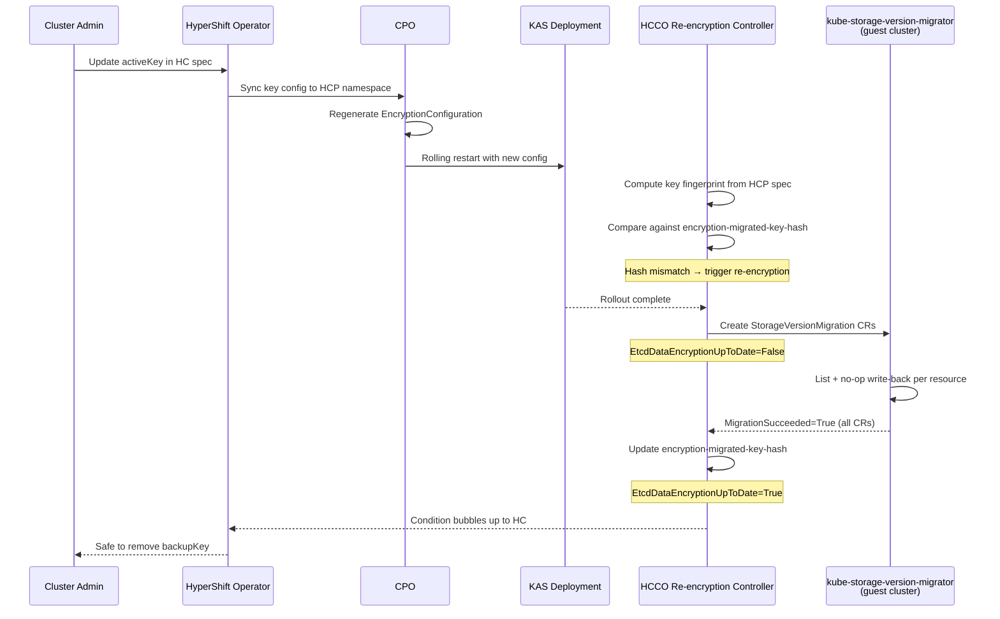

# etcd Data Re-encryption for Key Rotation

## Summary

HyperShift supports encryption key rotation infrastructure -- a new
active key can be set alongside a backup key in
`SecretEncryptionSpec`, and the `EncryptionConfiguration` is correctly
generated with the new key as the write provider and the old key as a
read provider. However, there is no mechanism to re-encrypt existing
etcd data with the new key after rotation. This enhancement adds a
re-encryption controller in the Hosted Cluster Config Operator (HCCO)
that leverages the existing `kube-storage-version-migrator` in every
hosted cluster to transparently re-encrypt all encrypted resources
with the active key, tracks progress via a new
`EtcdDataEncryptionUpToDate` condition, and guards against premature
backup key removal.

## Motivation

Without re-encryption, old etcd data remains encrypted with the
previous key indefinitely after a key rotation. This is unacceptable
for ARO-HCP's S360 compliance requirements and for any customer
relying on key rotation as a security control.

The current gaps are:

1. There is **no mechanism to trigger re-encryption** of existing
   etcd data with the new key.
2. There is **no way to track progress** of re-encryption.
3. There is **no confirmation of completion** -- no guarantee that
   all data is encrypted with the active key.
4. There is **no guard against premature backup key removal** before
   re-encryption finishes, which could leave data unreadable.

### User Stories

#### Story 1: ARO-HCP Key Rotation Compliance

As an ARO-HCP platform operator, I want all etcd data to be
automatically re-encrypted with the new key after a key rotation, so
that our clusters meet Microsoft's S360 security requirements for
complete data coverage under the active key.

#### Story 2: Key Rotation Progress Monitoring

As a cluster administrator, I want to monitor the progress and
completion of etcd data re-encryption through a standard Kubernetes
condition on the HostedCluster, so that I can confirm when it is safe
to deactivate or remove the old encryption key.

#### Story 3: Safe Backup Key Removal

As a cluster administrator performing a key rotation, I want to be
warned if I attempt to remove the backup key before re-encryption
has completed, so that I do not accidentally leave data unreadable
if the old key is deactivated.

#### Story 4: Operations Team Incident Response

As an operations team member, I want to know when a re-encryption
has failed and see actionable error details in the HostedCluster
conditions, so that I can diagnose and remediate issues without
inspecting individual resources in the guest cluster.

### Goals

1. Guarantee that all existing encrypted etcd data (secrets,
   configmaps, routes, oauthaccesstokens, oauthauthorizetokens)
   is re-encrypted with the currently active encryption key after
   a key rotation.

2. Provide an `EtcdDataEncryptionUpToDate` condition on
   HostedControlPlane and HostedCluster that tracks re-encryption
   progress and completion.

3. Guard against premature backup key removal by emitting a
   warning event when the backup key is removed while
   re-encryption is incomplete.

4. Maintain cluster availability during the re-encryption process.

5. Support all encryption types (Azure KMS, AWS KMS, IBM Cloud
   KMS, AESCBC) with a single, generic re-encryption mechanism.

### Non-Goals

1. Management of the creation and renewal of encryption keys --
   keys are managed externally (by the ARO RP or user).

2. Automatic key rotation scheduling -- rotation is triggered by
   spec changes, not on a schedule.

3. Performance tuning for specific cluster sizes --
   `StorageVersionMigration` handles pagination natively.

4. Webhook validation for backup key removal -- deferred to a
   follow-up enhancement.

## Proposal

This enhancement adds etcd data re-encryption support to HyperShift
by reusing library-go's `KubeStorageVersionMigrator` struct (which
creates and monitors `StorageVersionMigration` CRs via the
`migration.k8s.io/v1alpha1` API) within a new HCCO controller,
combined with condition bubble-up in the HyperShift Operator.

The design reuses the same `StorageVersionMigration` mechanism that
standalone OCP uses for re-encryption, ensuring consistency and
debuggability across both topologies.

The changes span two components:

1. **HCCO** (new controller): Detect active key changes by
   computing a fingerprint of the current encryption key from
   `hcp.Spec.SecretEncryption` and comparing it against the
   stored fingerprint annotation. When a change is detected,
   orchestrate re-encryption by waiting for KAS convergence,
   calling `KubeStorageVersionMigrator.EnsureMigration()` for each
   encrypted resource, monitoring completion, and setting the
   `EtcdDataEncryptionUpToDate` condition on HCP.

2. **HyperShift Operator** (existing code modification): Bubble up
   the condition from HCP to HostedCluster and guard against
   premature backup key removal.

### Workflow Description

**Cluster administrator** is a human user (or automation like the
ARO RP) responsible for managing the HostedCluster's encryption
configuration.

**Hosted Cluster Config Operator (HCCO)** manages guest cluster
resources, detects key changes, and runs the re-encryption
controller.

**HyperShift Operator (HO)** manages HostedCluster lifecycle and
surfaces conditions.

**kube-storage-version-migrator** is an existing OCP component in
every hosted cluster that processes `StorageVersionMigration` CRs.

1. The cluster administrator updates the active encryption key in
   the HostedCluster spec (e.g., rotates Azure KMS key version),
   moving the old key to the `backupKey` field:
   ```yaml
   secretEncryption:
     type: kms
     kms:
       provider: Azure
       azure:
         activeKey:
           keyVaultName: my-vault
           keyName: my-key
           keyVersion: "v2"       # new version
         backupKey:
           keyVaultName: my-vault
           keyName: my-key
           keyVersion: "v1"       # old version
   ```

2. The HyperShift Operator syncs the key configuration to the HCP
   namespace (existing behavior, no changes needed).

3. The CPO regenerates the `EncryptionConfiguration` with the new
   key as the first (write) provider and the old key as the second
   (read) provider (existing behavior, no changes needed).

4. The KAS Deployment rolls out with the updated encryption
   config. New writes use the new key; old data remains readable
   via the old key.

5. The HCCO re-encryption controller computes a fingerprint
   (SHA-256 hash) of the active key identity from
   `hcp.Spec.SecretEncryption` and compares it against the
   `hypershift.openshift.io/encryption-migrated-key-hash`
   annotation on the `kas-secret-encryption-config` secret. If
   the annotation is absent (first rotation) or the hashes
   differ (new rotation), re-encryption is triggered. If the
   hashes match, re-encryption is already complete and no action
   is taken.

6. The HCCO waits for the KAS Deployment rollout to complete (all
   replicas updated and ready), then creates
   `StorageVersionMigration` CRs in the hosted cluster for each
   encrypted resource type. It sets
   `EtcdDataEncryptionUpToDate=False` with reason
   `ReEncryptionInProgress`.

7. The `kube-storage-version-migrator` operator in the hosted
   cluster processes each `StorageVersionMigration` CR: it lists
   all objects of each resource type and performs a no-op
   write-back. Since the kube-apiserver reads with whatever key
   can decrypt and writes with the first provider in the
   `EncryptionConfiguration`, this transparently re-encrypts all
   data with the new active key.

8. The HCCO re-encryption controller detects all
   `StorageVersionMigration` CRs have `MigrationSucceeded=True`.
   It updates the `encryption-migrated-key-hash` annotation to
   reflect the current active key and sets
   `EtcdDataEncryptionUpToDate=True` with reason
   `ReEncryptionCompleted`.

9. The HyperShift Operator surfaces the condition on the
   HostedCluster. The administrator can now safely remove the
   `backupKey` from the spec.



#### Error Handling

**Migration failure**: If a `StorageVersionMigration` CR fails, the
controller waits 5 minutes (matching library-go's behavior), prunes
the failed CR, and retries on the next reconcile. The condition is
set to `False` with reason `ReEncryptionFailed` and a message
describing which resource failed.

**Key changes mid-migration**: If the active key changes again
before re-encryption finishes, the controller detects the key hash
mismatch on existing `StorageVersionMigration` CRs, deletes them,
and creates new ones for the latest key. This matches the
library-go pattern.

**KAS restart during migration**: `StorageVersionMigration` uses
`continueToken` for resumption. The controller detects stale CRs
and retries as needed.

**Guest cluster unreachable**: The controller retries with backoff.
The condition reflects the inability to check status.

### API Extensions

This enhancement does not introduce new CRDs, webhooks, aggregated
API servers, or finalizers. It adds only a new informational status
condition and associated reasons to the existing
HostedControlPlane/HostedCluster resources, plus internal
annotations on an existing secret. These do not modify the
structural API surface.

**New condition type:**

```go
// EtcdDataEncryptionUpToDate indicates whether all etcd data
// is encrypted with the currently active encryption key.
// True: all data confirmed encrypted with the active key.
// False: re-encryption is in progress or has failed.
// Absent: encryption is not configured.
EtcdDataEncryptionUpToDate ConditionType = "EtcdDataEncryptionUpToDate"
```

**Condition reasons:**

```go
ReEncryptionInProgressReason = "ReEncryptionInProgress"
ReEncryptionCompletedReason  = "ReEncryptionCompleted"
ReEncryptionFailedReason     = "ReEncryptionFailed"
ReEncryptionWaitingForKAS    = "WaitingForKASConvergence"
```

When encryption is not configured (`SecretEncryption` is nil), the
condition is omitted entirely from status conditions, matching the
pattern used by `UnmanagedEtcdAvailable`.

**Annotation on kas-secret-encryption-config secret (internal):**

- `hypershift.openshift.io/encryption-migrated-key-hash` -- SHA-256
  fingerprint of the active key identity at the time of the last
  successful re-encryption. Written by the HCCO after all
  `StorageVersionMigration` CRs succeed. The HCCO detects key
  changes by comparing the current key fingerprint (computed on the
  fly from `hcp.Spec.SecretEncryption`) against this annotation:
  absent means first rotation, mismatch means new rotation, match
  means re-encryption is complete.

### Topology Considerations

#### Hypershift / Hosted Control Planes

This enhancement is designed specifically for the HyperShift
topology. It affects:

- **Management cluster (HCP namespace)**: The HCCO re-encryption
  controller runs here. It computes the active key fingerprint
  from `hcp.Spec.SecretEncryption`, compares it against the
  `encryption-migrated-key-hash` annotation on the
  `kas-secret-encryption-config` secret, checks KAS Deployment
  convergence, and sets conditions on HCP.
- **Guest cluster**: `StorageVersionMigration` CRs are created
  here by the HCCO using the guest cluster client. The
  `kube-storage-version-migrator` operator (part of OCP payload
  since 4.3, guaranteed present in all supported hosted cluster
  versions >= 4.14) processes these CRs.

The design follows HyperShift's established pattern: the CPO
manages control plane pod configuration (KAS encryption config
generation), while the HCCO manages guest cluster resources
(`StorageVersionMigration` CRs) and the re-encryption lifecycle.
Key change detection is handled entirely by the HCCO, which
computes the active key fingerprint from the HCP spec and
compares it against the stored annotation.

No additional RBAC is required:
- The HCCO already has `get`, `list`, `watch` on Deployments and
  Secrets in the HCP namespace.
- The HCCO authenticates as `system:hosted-cluster-config` in the
  guest cluster with `cluster-admin` via the `hcco-cluster-admin`
  ClusterRoleBinding.

#### Standalone Clusters

Not directly applicable. Standalone OCP already has re-encryption
via the library-go encryption framework's `MigrationController`.
This enhancement brings equivalent functionality to HyperShift.

#### Single-node Deployments or MicroShift

Not applicable. This enhancement does not affect SNO or MicroShift
deployments. The re-encryption controller only runs in the HCCO,
which is specific to HyperShift.

#### OpenShift Kubernetes Engine

Not applicable. OKE does not support HyperShift hosted control
planes.

### Implementation Details/Notes/Constraints

#### Why KubeStorageVersionMigrator Instead of MigrationController

Standalone OCP uses library-go's `MigrationController`, which wraps
`KubeStorageVersionMigrator` with a 4-step state machine. This
controller has deep coupling to standalone OCP:

- Expects key secrets in `openshift-config-managed` with specific
  labels/annotations created by the KeyController. HyperShift gets
  keys from `HostedCluster.Spec.SecretEncryption`.
- Expects convergence via `RevisionLabelPodDeployer` checking
  static pod revisions on master nodes. HyperShift runs KAS as a
  Deployment.
- Calls `statemachine.GetEncryptionConfigAndState()` tied to the
  standalone key lifecycle.

Instead, this enhancement reuses only the
`KubeStorageVersionMigrator` struct -- a ~130-line, self-contained
implementation with zero dependencies on the rest of the encryption
framework. It handles:
- Creating `StorageVersionMigration` CRs with deterministic names
- Tracking which encryption key each CR was created for (via
  annotation)
- Detecting stale CRs from a previous key and replacing them
- Monitoring migration status conditions
- Resolving preferred API versions via discovery
- Pruning completed/stale migrations

#### Vendoring Requirements

The following packages must be added to HyperShift's vendor tree:

| Package | Why |
|---|---|
| `library-go/.../encryption/controllers/migrators` | `KubeStorageVersionMigrator` struct and `Migrator` interface |
| `kube-storage-version-migrator/.../informer/` | Required by `KubeStorageVersionMigrator` constructor |
| `kube-storage-version-migrator/.../lister/` | Pulled in transitively by the informer package |

All other dependencies (`migration/v1alpha1` types, typed
clientset, `factory.Informer`, `k8s.io/client-go/discovery`) are
already vendored.

#### Component 1: Key Change Detection (HCCO)

Key change detection is handled entirely by the HCCO
re-encryption controller. The CPO is not modified for
re-encryption — it continues to generate the
`EncryptionConfiguration` as before with no awareness of the
re-encryption lifecycle. This avoids modifying the CPOv2
framework, whose adapt functions receive fresh objects from static
YAML templates and cannot reliably read live annotations.

The HCCO re-encryption controller computes the active key
fingerprint on each reconciliation:

- Azure KMS: SHA-256 hash of `keyVaultName/keyName/keyVersion`
- AWS KMS: SHA-256 hash of the active key ARN
- IBM Cloud KMS: SHA-256 hash of the CRK ID
- AESCBC: SHA-256 hash of the active key secret name + data hash

It then compares the computed fingerprint against the
`hypershift.openshift.io/encryption-migrated-key-hash` annotation
on the `kas-secret-encryption-config` secret:

- **Annotation absent**: First key rotation observed. Trigger
  re-encryption and initialize the annotation after completion.
- **Hashes match**: Re-encryption already completed for the
  current key. No action needed.
- **Hashes differ**: New key rotation detected. Trigger
  re-encryption, and update the annotation after completion.

#### Component 2: Re-encryption Orchestration (HCCO)

**New file:**
`control-plane-operator/hostedclusterconfigoperator/controllers/reencryption/reencryption.go`

The controller instantiates `KubeStorageVersionMigrator` using
guest cluster clients and orchestrates re-encryption:

1. If encryption is not configured, remove the
   `EtcdDataEncryptionUpToDate` condition if present and return.

2. Compute the active key fingerprint from
   `hcp.Spec.SecretEncryption` and compare it against the
   `encryption-migrated-key-hash` annotation on the
   `kas-secret-encryption-config` secret. If the hashes match,
   re-encryption is complete — return (no action needed).

3. If the annotation is absent or the hashes differ, wait for
   KAS Deployment rollout
   (`updatedReplicas == replicas == readyReplicas`). If not
   converged, set condition `False/WaitingForKASConvergence` and
   requeue.

4. For each resource in `KMSEncryptedObjects()`, call
   `migrator.EnsureMigration(gr, activeKeyHash)` and track
   finished/failed/in-progress state.

5. If all resources migrated successfully, update the
   `encryption-migrated-key-hash` annotation with the current
   fingerprint and set condition `True/ReEncryptionCompleted`.

6. If any resource failed and not retried within 5 minutes,
   prune the failed CR for retry on next reconcile and set
   condition `False/ReEncryptionFailed`.

7. Otherwise, set condition `False/ReEncryptionInProgress` and
   requeue after 30 seconds.

The encrypted resources (from
`support/config/kms.go:KMSEncryptedObjects()`) are:
- `secrets`
- `configmaps`
- `routes.route.openshift.io`
- `oauthaccesstokens.oauth.openshift.io`
- `oauthauthorizetokens.oauth.openshift.io`

#### Component 3: HyperShift Operator Integration

**Modified file:**
`hypershift-operator/controllers/hostedcluster/hostedcluster_controller.go`

1. **Bubble up condition**: Surface
   `EtcdDataEncryptionUpToDate` from HCP to HostedCluster
   conditions, following the same pattern used for
   `EtcdAvailable`, `KubeAPIServerAvailable`, etc.

2. **Guard backup key removal**: When the user removes the
   `backupKey` while `EtcdDataEncryptionUpToDate` is `False`,
   emit a warning event:
   ```
   Warning BackupKeyRemovedBeforeReEncryption
   Re-encryption has not completed; removing the backup key
   may leave data unreadable if the old key is deactivated
   ```

#### Safety Invariants

These invariants, derived from library-go's encryption framework,
are replicated in the HyperShift implementation:

1. **Convergence gating**: No `StorageVersionMigration` CRs are
   created until all KAS replicas are running the same encryption
   config.
2. **Never remove read-keys before migration completes**: Old keys
   stay in the `EncryptionConfiguration` until re-encryption is
   confirmed.
3. **Stop migrations on config divergence**: If the active key
   changes mid-migration, existing CRs are deleted and recreated
   for the new key.
4. **Retry failed migrations**: After 5 minutes, prune failed
   `StorageVersionMigration` CRs and retry.

#### Architecture Diagram

```
Management Cluster (HCP namespace)

  HyperShift Operator
  - Surfaces HCP conditions to HC
  - Guards backup key removal

  CPO                              HCCO
  - KAS encryption config         - Re-encryption Controller (NEW)
    generation (unchanged)         - Computes key fingerprint
                                     from hcp.Spec.SecretEncryption
                                   - Compares against annotation:
                                     encryption-migrated-key-hash
                                   - Waits for KAS rollout
                                   - Creates SVMs in guest
                                   - Monitors completion
                                   - Updates annotation on success
                                   - Sets HCP conditions
                              │
                              │ guest cluster client
                              ▼
Hosted Cluster (guest)

  StorageVersionMigration CRs
  (migration.k8s.io/v1alpha1)
  - encryption-migration-core-secrets
  - encryption-migration-core-configmaps
  - encryption-migration-route.openshift.io-routes
  - encryption-migration-oauth...-oauthaccesstokens
  - encryption-migration-oauth...-oauthauthorizetokens
                  │
                  │ processed by
                  ▼
  cluster-kube-storage-version-migrator-operator
  (part of OCP payload since 4.3)
  Lists all objects -> no-op write-back -> re-encrypted
```

### Risks and Mitigations

**Risk**: Re-encryption of large clusters takes a long time,
resulting in a prolonged `False` condition.
**Mitigation**: `StorageVersionMigration` handles pagination
internally. The condition message reports which resources have
completed and which are still in progress.

**Risk**: KAS restarts during re-encryption interrupt the
migration.
**Mitigation**: `StorageVersionMigration` uses `continueToken` for
resumption. The controller detects stale CRs and retries as
needed.

**Risk**: `kube-storage-version-migrator` operator is degraded on
the hosted cluster, causing migrations to never complete.
**Mitigation**: The controller sets a `ReEncryptionFailed`
condition with details after failed migrations persist.
Operational guidance covers how to check the migrator operator
health.

**Risk**: Guest cluster is unreachable from the HCCO, preventing
CR creation or monitoring.
**Mitigation**: The controller retries with backoff. The condition
reflects the inability to check status rather than incorrectly
reporting success.

**Risk**: The active key changes again before re-encryption
finishes, leaving stale migration CRs.
**Mitigation**: The controller detects key hash mismatch on
existing CRs, deletes stale CRs, and creates new ones for the
latest key. This matches the library-go pattern.

**Risk**: A second key rotation occurs before re-encryption
completes, causing data loss. For example: key rotates from v1
to v2, then v2 to v3 before re-encryption finishes. The
`EncryptionConfiguration` now has v3 (write) and v2 (read), but
data still encrypted with v1 becomes unreadable because v1 is
no longer a read provider. This is equivalent to premature
backup key removal — a second rotation implicitly discards the
previous backup key.
**Mitigation**: The `EtcdDataEncryptionUpToDate=False` condition
signals that a rotation is still in progress. The backup key
removal guard emits a warning event. Documentation and
operational guidance must clearly state that **a second key
rotation must not be performed until
`EtcdDataEncryptionUpToDate=True`**. A validating webhook to
block key rotation while re-encryption is in progress can be
added as a follow-up.

**Risk**: Backup key removed before re-encryption completes,
potentially leaving data unreadable.
**Mitigation**: A warning event is emitted when backup key is
removed while `EtcdDataEncryptionUpToDate` is `False`. A
validating webhook to block this can be added as a follow-up.

### Drawbacks

1. **Increased operational complexity**: The re-encryption
   controller adds a new reconciliation loop in the HCCO.
   However, the controller is dormant when no key rotation is in
   progress (it no-ops when the computed key fingerprint matches
   the stored `encryption-migrated-key-hash` annotation).

2. **Vendoring new packages**: Three packages must be added to
   HyperShift's vendor tree. These are small, auto-generated
   packages with no external dependencies beyond what HyperShift
   already vendors.

3. **Dependency on guest cluster component**: Re-encryption
   depends on the `kube-storage-version-migrator` operator being
   healthy in the hosted cluster. If this operator is degraded,
   re-encryption will not complete. However, this operator has
   been in the OCP payload since 4.3 and is well-tested.

## Alternatives (Not Implemented)

### Reuse library-go's MigrationController Directly

Instead of building a thin HCCO controller around
`KubeStorageVersionMigrator`, reuse the full `MigrationController`
from library-go.

**Rejected because**: The `MigrationController` has deep coupling
to standalone OCP's key management (key secrets in
`openshift-config-managed`), convergence model (static pod
revision checking), and state machine
(`statemachine.GetEncryptionConfigAndState()`). Adapting it for
HyperShift would require forking or significant interface
abstraction, which is more complex than building a thin controller
around the already-decoupled `KubeStorageVersionMigrator`.

### Build Custom Migration Logic Without library-go

Implement `StorageVersionMigration` CR lifecycle management from
scratch instead of using `KubeStorageVersionMigrator`.

**Rejected because**: `KubeStorageVersionMigrator` is a ~130-line,
self-contained struct that handles CR creation, stale CR detection,
annotation tracking, status monitoring, version discovery, and
pruning. Reimplementing this would duplicate production-tested code
with no benefit.

### Detect Key Changes in the CPO

Instead of the HCCO computing key fingerprints, have the CPO
detect key changes in `adaptSecretEncryptionConfig()` and signal
the HCCO via annotations (e.g., `encryption-rekey-needed` and
`encryption-active-key-hash`).

**Rejected because**: The CPOv2 framework's adapt functions
receive fresh objects deserialized from static YAML templates on
each reconciliation. They cannot reliably read live annotations
from the previous reconciliation, which are needed to compare
against the new key fingerprint. The HCCO, which has direct
access to `hcp.Spec.SecretEncryption` and can read live
annotations from the `kas-secret-encryption-config` secret, is
the natural place for key change detection. This also simplifies
the design by eliminating cross-component annotation coupling.

### Run the Re-encryption Controller in the CPO

Instead of the HCCO, run the re-encryption controller as a CPO
component.

**Rejected because**: The CPO manages control plane pods and their
configuration in the HCP namespace. Creating and managing resources
in the guest cluster (such as `StorageVersionMigration` CRs) is
the HCCO's responsibility. This follows HyperShift's established
pattern where HCCO handles guest cluster state using a guest
cluster client.

### Direct etcd Manipulation

Instead of using `StorageVersionMigration` CRs, directly read and
re-write etcd data using the etcd client.

**Rejected because**: This would bypass the kube-apiserver's
encryption layer and require direct etcd access, which is complex,
error-prone, and inconsistent with how OpenShift handles
encryption. The `StorageVersionMigration` approach works through
the API server, ensuring proper encryption, audit logging, and
admission control.

## Open Questions [optional]

1. **Should re-encryption block cluster upgrades?** Current
   recommendation is no -- re-encryption is independent of
   upgrades. The `EtcdDataEncryptionUpToDate` condition is
   informational and does not gate upgrade preconditions.

2. **Should the condition be set to True on initial encryption
   setup?** Current design omits the condition entirely when the
   `encryption-migrated-key-hash` annotation is absent and no key
   rotation has occurred. On the first key rotation, the absent
   annotation triggers re-encryption and initializes the
   annotation upon completion. This avoids a misleading `True` on
   clusters that have never rotated keys.

## Test Plan

<!-- TODO: When implementing tests, include the following labels
per dev-guide/feature-zero-to-hero.md and
dev-guide/test-conventions.md:
- [Jira:"HyperShift"] for component identification
- Appropriate test type labels: [Suite:...], [Serial], [Slow],
  or [Disruptive] as needed

Note: This enhancement does not use an OCP feature gate, so the
[OCPFeatureGate:FeatureName] label is not applicable. HyperShift
tests are gated by the test infrastructure itself (HyperShift CI
jobs). -->

### Unit Tests

- Key fingerprint computation for each provider (Azure KMS, AWS
  KMS, IBM Cloud KMS, AESCBC).
- Re-encryption controller reconciliation logic:
  - When no encryption configured: condition not set.
  - When key hash matches annotation: no action taken.
  - When annotation absent (first rotation): re-encryption
    triggered, annotation initialized on completion.
  - When key hash differs from annotation: re-encryption
    triggered for new key.
  - When KAS not converged: condition
    `False/WaitingForKASConvergence`.
  - When migrations in progress: condition
    `False/ReEncryptionInProgress`.
  - When all migrations succeeded: condition
    `True/ReEncryptionCompleted`,
    `encryption-migrated-key-hash` annotation updated.
  - When migration failed: retry after 5 minutes by pruning
    and re-creating.
  - When key changes mid-migration: delete and recreate CRs.
- `StorageVersionMigration` CR naming and annotation logic.

### Integration Tests

- Full key rotation cycle with mock guest cluster.
- Verify `StorageVersionMigration` CRs are created with correct
  GVRs.
- Verify stale CRs are cleaned up on key change.

### E2E Tests

- Azure KMS key rotation with re-encryption (primary test case).
- AWS KMS key rotation with re-encryption (ROSA HCP coverage).
- AESCBC key rotation with re-encryption.
- Verify data is re-encrypted by confirming that removing the
  backup key and deactivating the old KMS key does not break
  reads.
- Verify cluster availability during re-encryption.
- Verify condition transitions:
  absent -> `False/WaitingForKASConvergence` ->
  `False/ReEncryptionInProgress` -> `True/ReEncryptionCompleted`.

## Graduation Criteria

<!-- TODO: When preparing for promotion, review the specific
requirements from dev-guide/feature-zero-to-hero.md:
- At least 5 tests per feature
- All tests must run at least 7 times per week
- All tests must run at least 14 times per supported platform
- All tests must pass at least 95% of the time
- Tests running on all supported platforms (AWS, Azure, GCP,
  vSphere, Baremetal with various network stacks)

Note: Since this is a HyperShift-specific feature without an OCP
feature gate, promotion criteria are driven by HyperShift's own
release process rather than the OCP feature gate promotion
process. -->

### Dev Preview -> Tech Preview

- End-to-end key rotation with re-encryption works for Azure KMS.
- Unit tests cover all controller logic.
- Integration tests validate CR lifecycle.
- E2E test runs in CI for at least one encryption type.
- Documentation covers key rotation procedure with
  re-encryption.

### Tech Preview -> GA

- Sufficient time for customer feedback (at least one minor
  release).
- E2E tests cover all supported encryption types (Azure KMS,
  AWS KMS, AESCBC).
- Scale testing completed (re-encryption on clusters with large
  numbers of secrets/configmaps).
- Upgrade and downgrade scenarios validated.
- User-facing documentation created in openshift-docs.
- Support procedures documented.

### Removing a deprecated feature

N/A -- This is a new feature.

## Upgrade / Downgrade Strategy

**Upgrade**: Existing clusters with encryption configured are
unaffected. The `EtcdDataEncryptionUpToDate` condition is only set
when a key rotation is detected (the `encryption-migrated-key-hash`
annotation is absent or differs from the current key fingerprint).
Clusters that have never rotated keys will not see the condition.

The re-encryption controller is added to the HCCO, which is
upgraded per-hosted-cluster as part of the normal hosted cluster
upgrade process. No manual steps are required.

**Downgrade**: If a management cluster is downgraded to a version
without the re-encryption controller:
- The `EtcdDataEncryptionUpToDate` condition will no longer be
  updated but will remain in the HCP/HC status as a stale
  condition.
- Any in-progress `StorageVersionMigration` CRs in the guest
  cluster will continue to be processed by the
  `kube-storage-version-migrator` operator (independent of
  HyperShift), but their completion will not be tracked.
- The `encryption-migrated-key-hash` annotation will remain on
  the `kas-secret-encryption-config` secret but will be ignored.

No data loss or cluster availability impact occurs during
downgrade.

## Version Skew Strategy

During upgrades, the CPO and HCCO are upgraded together as part
of the hosted cluster control plane upgrade. The re-encryption
controller runs entirely in the HCCO — it computes key
fingerprints from the HCP spec and manages the
`encryption-migrated-key-hash` annotation independently. No
cross-component annotation dependency exists.

The `kube-storage-version-migrator` operator in the guest cluster
is upgraded independently (as part of the hosted cluster's OCP
payload). The `StorageVersionMigration` API
(`migration.k8s.io/v1alpha1`) has been stable since OCP 4.3, so
version skew between the HCCO and the guest cluster migrator
operator is not a concern.

The HyperShift Operator (which bubbles up conditions) is upgraded
independently of the per-cluster control planes. During the window
where the HO is at a newer version than a hosted cluster's HCCO,
the HO will attempt to bubble up the `EtcdDataEncryptionUpToDate`
condition. If the condition is not present (because the old HCCO
does not set it), the HO simply does not surface it -- no error or
degradation occurs.

## Operational Aspects of API Extensions

This enhancement does not introduce CRDs, admission/conversion
webhooks, or aggregated API servers. The only API surface change
is a new informational status condition.

### EtcdDataEncryptionUpToDate Condition

- **Impact on existing SLIs**: None. This is a new informational
  condition that does not gate any existing functionality
  (upgrades, availability checks, etc.).
- **Failure modes**:
  - Condition stuck at `False/ReEncryptionInProgress`: Indicates
    the `kube-storage-version-migrator` is slow or stalled.
    Check migrator operator health in the guest cluster.
  - Condition stuck at `False/ReEncryptionFailed`: Indicates a
    migration CR has failed. Check the condition message for the
    specific resource and error. The controller retries
    automatically after 5 minutes.
  - Condition stuck at `False/WaitingForKASConvergence`: KAS
    Deployment rollout has not completed. Check KAS pod health
    and Deployment status.
- **Health indicators**:
  - `EtcdDataEncryptionUpToDate` condition on HostedCluster
  - HCCO controller logs (`controllers.ReEncryption`)
  - `StorageVersionMigration` CR status in the guest cluster

### StorageVersionMigration CRs (Guest Cluster)

- **Expected scale**: 5 CRs per key rotation (one per encrypted
  resource type). CRs are pruned after successful migration.
- **Impact on guest cluster API throughput**: During active
  migration, the migrator performs list + write operations for
  each resource type. This generates additional API server load
  proportional to the number of encrypted objects. The migrator
  handles pagination and does not overwhelm the API server.

## Support Procedures

### Detecting Re-encryption Issues

1. **Check the HostedCluster condition**:
   ```bash
   oc get hostedcluster <name> \
     -o jsonpath='{.status.conditions[?(@.type=="EtcdDataEncryptionUpToDate")]}'
   ```

2. **Check StorageVersionMigration CRs in the guest cluster**:
   ```bash
   oc get storageversionmigrations -A
   ```
   Look for CRs with `MigrationFailed=True` conditions.

3. **Check HCCO logs**:
   ```bash
   oc logs -n <hcp-namespace> \
     deployment/control-plane-operator \
     -c hosted-cluster-config-operator \
     | grep -i reencryption
   ```

4. **Check kube-storage-version-migrator health in the guest
   cluster**:
   ```bash
   oc get deployment \
     -n openshift-kube-storage-version-migrator-operator
   oc get pods \
     -n openshift-kube-storage-version-migrator
   ```

### Remediation

- **Stuck migrations**: Delete the stale
  `StorageVersionMigration` CR in the guest cluster. The HCCO
  controller will recreate it on the next reconcile.

- **Migrator operator degraded**: Check and remediate the
  `cluster-kube-storage-version-migrator-operator` in the guest
  cluster. Once healthy, the controller will resume monitoring.

- **Condition not updating**: Verify the HCCO pod is running and
  healthy. Check for errors in HCCO logs related to the
  re-encryption controller.

## Infrastructure Needed [optional]

No additional infrastructure is needed. The
`kube-storage-version-migrator` operator is already part of the
OCP payload in every hosted cluster. E2E tests use existing CI
infrastructure for encryption testing.
