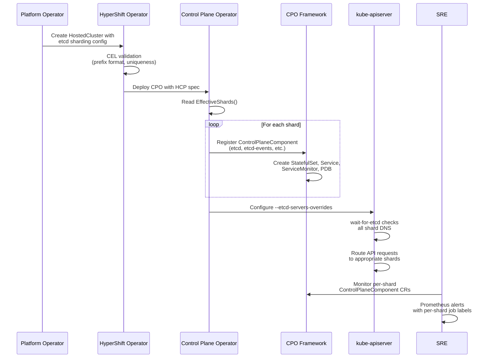

# Etcd Sharding by Kubernetes Resource Kind via Separate Control Plane Components

## Summary

This enhancement adds etcd sharding by Kubernetes resource kind to HyperShift,
enabling hosted clusters to distribute resources across multiple independent etcd
deployments for improved scalability and performance. Each etcd shard is registered
as an independent `ControlPlaneComponent` within the control-plane-operator (CPO) component framework,
inheriting all framework features automatically. Kube-apiserver (KAS) is configured with
`--etcd-servers-overrides` to route resources to the appropriate shard.

## Motivation

HyperShift currently deploys a single etcd cluster per hosted control plane, which
becomes a bottleneck for very large clusters (7500+ nodes). High-churn resources like
Events and Leases cause performance degradation and impact critical cluster resources.
[OpenAI demonstrated](https://openai.com/index/scaling-kubernetes-to-7500-nodes/) that sharding etcd by resource type enables scaling to 7,500 nodes
with better performance and stability through reduced blast radius.

Current limitations:

- Single etcd cluster handles all Kubernetes resources regardless of churn rate
- Events and Leases cause compaction and performance issues
- No way to optimize storage or replica counts per resource type
- No isolation between critical and ephemeral data

### User Stories

#### Story 1: Platform operator creates a sharded HostedControlPlane (HCP) for a large cluster

As a platform operator, I want to create a HostedCluster with separate etcd shards for
events and leases so that high-churn resources do not cause compaction issues or degrade
performance for critical cluster state.

#### Story 2: Platform operator configures volatile storage for events

As a platform operator, I want to configure the events shard with `storage.type: EmptyDir`
so that events are stored in memory for maximum write throughput without provisioning
persistent storage for data that is inherently ephemeral.

#### Story 3: SRE investigates a shard failure

As an SRE, I want to identify which etcd shard is unhealthy so that I can take targeted
remediation action without disrupting the entire control plane. I can inspect individual
`ControlPlaneComponent` CRs per shard and correlate alerts by the `job` label in
Prometheus (e.g., `job="etcd-events"`).

#### Story 4: Existing cluster upgrades without disruption

As a platform operator running a pre-sharding cluster, I want to upgrade the CPO to a
sharding-capable version without any changes to my existing single-etcd deployment so
that the upgrade is transparent and requires no action on my part.

#### Story 5: Platform operator creates a cluster via CLI with sharding config

As a platform operator, I want to specify etcd sharding configuration via a YAML file
passed to `hypershift create cluster --etcd-sharding-config` so that I can declaratively
define shard topology at cluster creation time.

#### Story 6: Platform operator places etcd shards on dedicated storage nodes

As a platform operator, I want to schedule the default etcd shard on management cluster
nodes with NVMe SSDs and place the events shard on nodes with standard storage so that
I can optimize disk I/O for critical cluster state without over-provisioning all
management cluster nodes with high-performance storage.

### Goals

1. Add declarative etcd sharding configuration to the HostedCluster/HostedControlPlane API,
   allowing users to define multiple etcd shards, map resource kinds to shards, and configure
   per-shard settings.
2. Implement sharded etcd using the CPO component framework by registering each shard as an independent
   `ControlPlaneComponent`, inheriting all framework features (priority class, node
   isolation, topology spread, etc.) without behavioral gaps.
3. Extend the CPO component framework minimally to support etcd shard components without
   breaking any existing single-instance components.
4. Preserve backward compatibility: existing `StatefulSet/etcd` and
   `ControlPlaneComponent/etcd` names must not change for single-shard deployments.
5. Configure kube-apiserver with `--etcd-servers-overrides` to route resources to the
   appropriate shard.
6. Provide per-shard pod scheduling controls (`nodeSelector`, `tolerations`) so that
   operators can place etcd shards on management cluster nodes with appropriate storage
   or isolation characteristics.

### Non-Goals

1. Changing the `adapt` function signature for existing components.
2. Introducing a general-purpose `CompositeComponent` abstraction for arbitrary
   multi-instance components.
3. Dynamic shard rebalancing or migration from non-sharded to sharded after creation.
4. Mutating the shard list after cluster creation (adding, removing, or reordering shards).
5. Auto-sharding based on resource usage patterns.
6. Per-shard Grafana dashboards (can be added later).
7. Per-shard backup orchestration (backup tooling backs up all PVC-backed
   shards; per-shard opt-out can be added later if needed).
8. Routing openshift-apiserver or oauth-apiserver managed resources to specific shards
   (these aggregated API servers only support a single etcd endpoint via
   `storageConfig.urls`, not per-resource overrides like KAS `--etcd-servers-overrides`).

## Proposal

Each etcd shard is registered as an independent `ControlPlaneComponent` using the same
`NewStatefulSetComponent` builder that all other CPO components use. A single-shard HCP
registers only the existing `etcd` component; a multi-shard HCP additionally registers
`etcd-events`, `etcd-leases`, etc.

The CPO component framework maps each registered component to exactly one workload
object with its own `ControlPlaneComponent` CR, status tracking, and lifecycle management.
This ensures every shard automatically inherits all framework features — priority class
assignment, control plane node isolation, colocation affinity, multi-zone topology spread,
config hash annotations, scale-to-zero support, restart propagation, and PodDisruptionBudget (PDB) semantics —
without duplicating adaptation logic or diverging from framework behavior as it evolves.

This introduces a new pattern of conditional component registration at startup. Existing
components (including platform-specific cloud controller managers) are registered
unconditionally and use predicates to skip reconciliation at runtime. Shard components
are instead registered conditionally because the number of components varies per HCP
spec. Shard immutability ensures the component list does not need to change after
startup. On CPO restart, the shard list is re-read from the HCP spec and all
components are re-registered, converging to the correct state idempotently.
This approach was explicitly preferred by maintainers over alternatives that
would manage multiple workloads within a single component.

### Workflow Description

**Platform operator** is a human user responsible for creating and managing hosted clusters.

**SRE** is a human user responsible for monitoring and remediating hosted cluster issues.

#### Managed Etcd Sharding



1. The service consumer configures etcd sharding in the HostedCluster
   `spec.etcd.managed.shards` field, specifying shard names, resource prefixes,
   data policies, and storage settings. For self-hosted (MCE) deployments, the
   `hcp` CLI provides a convenience flag:
   `hcp create cluster --etcd-sharding-config <file>`.
3. The HyperShift operator validates the shard configuration at admission time via CEL
   rules (prefix format, uniqueness, default shard presence, name constraints).
4. The control-plane-operator (CPO) starts and reads the HCP spec. For each shard in
   `EffectiveShards()`, it registers a CPO component (`etcd`, `etcd-events`,
   `etcd-leases`, etc.).
5. The framework reconciles each shard component independently — creating StatefulSets,
   Services, ServiceMonitors, PDBs, and defrag RBAC resources with shard-specific names.
6. The CPO configures kube-apiserver with `--etcd-servers-overrides` pointing non-default
   resources to their shard endpoints, and updates `wait-for-etcd` to check all shards.
7. KAS starts after all shard services are DNS-resolvable and routes API requests to the
   appropriate etcd shard based on resource type.
8. The SRE monitors per-shard health via individual `ControlPlaneComponent` CRs and
   Prometheus metrics with distinct `job` labels per shard.

#### Unmanaged Etcd Sharding

For unmanaged etcd, HyperShift does not deploy or manage etcd infrastructure. The
platform operator is responsible for operating the external etcd clusters. HyperShift's
role is limited to configuring KAS to route resources to the correct external endpoints.

1. The platform operator provisions and operates multiple external etcd clusters
   (one per shard), each with its own endpoint and TLS credentials.
2. The platform operator creates a HostedCluster with `spec.etcd.managementType:
   Unmanaged` and populates `spec.etcd.unmanaged.shards` with the shard definitions,
   including per-shard endpoints and TLS configuration.
3. The HyperShift operator validates the shard configuration at admission time via CEL
   rules (prefix format, uniqueness, default shard presence, endpoint format).
4. The CPO configures kube-apiserver:
   - `--etcd-servers` points to the default shard's endpoint
   - `--etcd-servers-overrides` contains entries for non-default shards
   - Per-shard TLS credentials are mounted from the referenced secrets
5. No `ControlPlaneComponent` CRs, StatefulSets, Services, ServiceMonitors, or PDBs
   are created for unmanaged shards — monitoring and lifecycle are the operator's
   responsibility.
6. The `wait-for-etcd` init container is removed for unmanaged etcd (existing behavior,
   unchanged by this enhancement).

### API Extensions

This enhancement adds the following types to the `hypershift.openshift.io/v1beta1` API:

- **`ManagedEtcdShardSpec`** — per-shard configuration with fields: `Name`,
  `ResourcePrefixes`, `Storage`, `Replicas`, `Scheduling`
- **`ManagedEtcdShardStorageSpec`** — per-shard storage configuration with fields:
  `Type` (PersistentVolume or EmptyDir) and optional `StorageClassName` override.
  PVC size and etcd backend quota are inherited from the parent
  `ManagedEtcdSpec.Storage`; EmptyDir `sizeLimit` is derived from the same PVC
  size to match the etcd quota ceiling. This is a separate type from
  `ManagedEtcdStorageSpec` because `EmptyDir` is only valid for sharded
  configurations — the top-level `ManagedEtcdSpec.Storage` continues to support
  only `PersistentVolume`
- **`EtcdShardSchedulingSpec`** — per-shard pod placement with `NodeSelector` and
  `Tolerations`
- **`Shards []ManagedEtcdShardSpec`** — added to `ManagedEtcdSpec`
- **`UnmanagedEtcdShardSpec`** — per-shard configuration for unmanaged etcd with fields:
  `Name`, `ResourcePrefixes`, `Endpoint`, `TLS` (HyperShift does not manage storage or
  backups for unmanaged etcd)
- **`Shards []UnmanagedEtcdShardSpec`** — added to `UnmanagedEtcdSpec`

All new sharding fields are gated behind the `EtcdSharding` feature gate, starting
in `TechPreviewNoUpgrade`. The gate is defined in
`api/hypershift/v1beta1/featuregates/featureGate-Hypershift-TechPreviewNoUpgrade.yaml`
and the `Shards` field on both `ManagedEtcdSpec` and `UnmanagedEtcdSpec` is annotated
with `+openshift:enable:FeatureGate=EtcdSharding`.

No new CRDs, webhooks, or aggregated API servers are introduced. The existing
`ControlPlaneComponent` CRD is used for per-shard health reporting.

#### New Type Definitions

```go
// ManagedEtcdShardSpec defines the configuration for a single etcd shard
// within a managed etcd deployment.
type ManagedEtcdShardSpec struct {
    // name is a unique identifier for this shard. It is used to derive
    // resource names (e.g., StatefulSet "etcd-{name}", Service
    // "etcd-client-{name}").
    // +required
    // +immutable
    // +kubebuilder:validation:MinLength=1
    // +kubebuilder:validation:MaxLength=48
    // +kubebuilder:validation:XValidation:rule="self.matches('^[a-z][a-z0-9-]*$')",message="name must be lowercase alphanumeric with hyphens, starting with a letter"
    // +kubebuilder:validation:XValidation:rule="self == oldSelf",message="name is immutable"
    Name string `json:"name,omitempty"`

    // resourcePrefixes is the list of resource type prefixes routed to this
    // shard. Entries use the KAS --etcd-servers-overrides key format:
    // "/events#" for core group resources, "coordination.k8s.io/leases#"
    // for named API group resources. The default catch-all "/" prefix is
    // not permitted — the default shard is configured via the top-level
    // storage and scheduling fields.
    // +required
    // +immutable
    // +kubebuilder:validation:MinItems=1
    // +kubebuilder:validation:MaxItems=20
    // +kubebuilder:validation:items:MinLength=1
    // +kubebuilder:validation:items:MaxLength=253
    // +listType=set
    // +kubebuilder:validation:XValidation:rule="self == oldSelf",message="resourcePrefixes are immutable"
    ResourcePrefixes []string `json:"resourcePrefixes,omitempty"`

    // storage configures the storage backend for this shard.
    // If not specified, the shard inherits PersistentVolume storage from
    // the parent ManagedEtcdSpec.Storage.
    // +optional
    // +immutable
    // +kubebuilder:validation:XValidation:rule="!has(oldSelf) || self == oldSelf",message="storage is immutable"
    Storage ManagedEtcdShardStorageSpec `json:"storage,omitzero,omitempty"`

    // replicas is the number of etcd replicas for this shard. Must be 1 or 3.
    // If specified, overrides controllerAvailabilityPolicy for this shard.
    // If not specified, defaults to 3 for HA deployments or 1 for
    // SingleReplica, following controllerAvailabilityPolicy.
    // +optional
    // +immutable
    // +kubebuilder:validation:Enum=1;3
    // +kubebuilder:validation:XValidation:rule="!has(oldSelf) || self == oldSelf",message="replicas is immutable"
    Replicas *int32 `json:"replicas,omitempty"`

    // scheduling configures per-shard pod placement constraints. These
    // constraints are merged with the framework's control plane node
    // isolation settings (nodeSelector, tolerations, topology spread).
    // +optional
    // +kubebuilder:validation:MinProperties=1
    Scheduling EtcdShardSchedulingSpec `json:"scheduling,omitzero,omitempty"`
}

// EtcdShardSchedulingSpec configures pod placement for a single etcd shard.
type EtcdShardSchedulingSpec struct {
    // nodeSelector constrains this shard's pods to nodes matching the
    // specified labels, in addition to the framework's control plane node
    // selector.
    // +optional
    // +kubebuilder:validation:MinProperties=1
    // +kubebuilder:validation:MaxProperties=16
    NodeSelector map[string]string `json:"nodeSelector,omitempty"`

    // tolerations allows this shard's pods to schedule on nodes with
    // matching taints, in addition to the framework's control plane
    // tolerations.
    // +optional
    // +listType=atomic
    // +kubebuilder:validation:MinItems=1
    // +kubebuilder:validation:MaxItems=16
    Tolerations []corev1.Toleration `json:"tolerations,omitempty"`
}

// UnmanagedEtcdShardSpec defines the configuration for a single etcd shard
// within an unmanaged (externally operated) etcd deployment.
type UnmanagedEtcdShardSpec struct {
    // name is a unique identifier for this shard.
    // +required
    // +immutable
    // +kubebuilder:validation:MinLength=1
    // +kubebuilder:validation:MaxLength=48
    // +kubebuilder:validation:XValidation:rule="self.matches('^[a-z][a-z0-9-]*$')",message="name must be lowercase alphanumeric with hyphens, starting with a letter"
    // +kubebuilder:validation:XValidation:rule="self == oldSelf",message="name is immutable"
    Name string `json:"name,omitempty"`

    // resourcePrefixes is the list of resource type prefixes routed to this
    // shard. Uses the same format as ManagedEtcdShardSpec.ResourcePrefixes.
    // +required
    // +immutable
    // +kubebuilder:validation:MinItems=1
    // +kubebuilder:validation:MaxItems=20
    // +kubebuilder:validation:items:MinLength=1
    // +kubebuilder:validation:items:MaxLength=253
    // +listType=set
    // +kubebuilder:validation:XValidation:rule="self == oldSelf",message="resourcePrefixes are immutable"
    ResourcePrefixes []string `json:"resourcePrefixes,omitempty"`

    // endpoint is the full etcd client endpoint URL for this shard.
    // +required
    // +immutable
    // +kubebuilder:validation:MinLength=1
    // +kubebuilder:validation:MaxLength=255
    // +kubebuilder:validation:XValidation:rule="self.startsWith('https://')",message="endpoint must use HTTPS (start with 'https://')"
    // +kubebuilder:validation:XValidation:rule="self == oldSelf",message="endpoint is immutable"
    Endpoint string `json:"endpoint,omitempty"`

    // tls specifies TLS configuration for this shard's HTTPS endpoint.
    // +required
    // +immutable
    // +kubebuilder:validation:XValidation:rule="self == oldSelf",message="tls is immutable"
    TLS EtcdTLSConfig `json:"tls,omitzero"`
}
```

#### Modifications to Existing Types

The `Shards` field is added to both `ManagedEtcdSpec` and `UnmanagedEtcdSpec`:

```go
// +kubebuilder:validation:XValidation:rule="!has(oldSelf.shards) || has(self.shards)",message="shards cannot be removed once configured"
type ManagedEtcdSpec struct {
    // storage specifies how etcd data is persisted.
    // +required
    Storage ManagedEtcdStorageSpec `json:"storage"`

    // scheduling configures pod placement for the default etcd shard.
    // These constraints are merged with the framework's control plane
    // node isolation settings.
    // +optional
    // +openshift:enable:FeatureGate=EtcdSharding
    // +kubebuilder:validation:MinProperties=1
    Scheduling EtcdShardSchedulingSpec `json:"scheduling,omitzero,omitempty"`

    // shards defines additional etcd shards for resource-level routing.
    // The existing storage and scheduling fields above configure
    // the default shard (catch-all for all resources not explicitly
    // routed). Entries in this list define non-default shards,
    // each deployed as an independent StatefulSet and ControlPlaneComponent.
    // A shard with resourcePrefixes containing "/" is rejected — the
    // default shard is always configured via the fields above.
    // Immutable after creation.
    // +optional
    // +openshift:enable:FeatureGate=EtcdSharding
    // +listType=map
    // +listMapKey=name
    // +kubebuilder:validation:MinItems=1
    // +kubebuilder:validation:MaxItems=10
    // +kubebuilder:validation:XValidation:rule="self.all(s, !s.resourcePrefixes.exists(p, p == '/'))",message="shards must not contain the default '/' prefix — the default shard is configured via the top-level storage and scheduling fields"
    // +kubebuilder:validation:XValidation:rule="self.all(s1, self.all(s2, s1.name == s2.name || !s1.resourcePrefixes.exists(p, s2.resourcePrefixes.exists(q, p == q))))",message="resource prefixes must not overlap across shards"
    // +kubebuilder:validation:XValidation:rule="!has(oldSelf) || self.size() == oldSelf.size()",message="shards cannot be added or removed after creation"
    Shards []ManagedEtcdShardSpec `json:"shards,omitempty"`
}

// +kubebuilder:validation:XValidation:rule="!has(oldSelf.shards) || has(self.shards)",message="shards cannot be removed once configured"
type UnmanagedEtcdSpec struct {
    Endpoint string         `json:"endpoint"`
    TLS      EtcdTLSConfig  `json:"tls"`

    // shards defines additional etcd shards for resource-level routing.
    // The top-level endpoint and tls fields define the default shard
    // (the catch-all for all resources not explicitly routed). Entries
    // in this list define non-default shards, each with its own endpoint
    // and TLS configuration.
    // A shard with resourcePrefixes containing "/" is rejected — the
    // default shard is always the top-level endpoint.
    // Immutable after creation.
    // +optional
    // +openshift:enable:FeatureGate=EtcdSharding
    // +listType=map
    // +listMapKey=name
    // +kubebuilder:validation:MinItems=1
    // +kubebuilder:validation:MaxItems=10
    // +kubebuilder:validation:XValidation:rule="self.all(s, !s.resourcePrefixes.exists(p, p == '/'))",message="shards must not contain the default '/' prefix — the top-level endpoint is the default shard"
    // +kubebuilder:validation:XValidation:rule="self.all(s1, self.all(s2, s1.name == s2.name || !s1.resourcePrefixes.exists(p, s2.resourcePrefixes.exists(q, p == q))))",message="resource prefixes must not overlap across shards"
    // +kubebuilder:validation:XValidation:rule="!has(oldSelf) || self.size() == oldSelf.size()",message="shards cannot be added or removed after creation"
    Shards []UnmanagedEtcdShardSpec `json:"shards,omitempty"`
}
```

**Helper function:** `EffectiveShards(managed *ManagedEtcdSpec)` is a standalone
function (not a method on the API type, per
[OpenShift API conventions](https://github.com/openshift/enhancements/blob/master/dev-guide/api-conventions.md)
which forbid functions on API types). It always synthesizes a default shard from the
top-level `Storage` and `Scheduling` fields (with `ResourcePrefixes: ["/"]`,
replicas from `controllerAvailabilityPolicy`), and appends any explicit non-default
shards from the `Shards` list. When no
shards are configured, the result is a single default shard — identical to today's
behavior. The function is defined in `support/etcd/` or a similar helper package, not
in the `api/` module.

**Storage type determines the backing implementation.** The storage type and replica
count are independent choices, giving operators flexibility to match each shard's
configuration to its workload characteristics.

**Backup policy is determined by storage type.** All PVC-backed shards are included
in backup/restore procedures. EmptyDir shards have no PVCs and are not backed up.
No per-shard opt-out is provided in the initial implementation; if needed, a typed
API field can be added in a future enhancement.

#### Common Configurations

**PersistentVolume (default shard and PVC-backed non-default shards)**

Data is written to persistent disk, survives pod and node restarts, and is included
in backup/restore procedures for disaster recovery and cluster migration.

*Use case — default shard:* The default shard (`/`) containing pods, deployments,
secrets, configmaps, and all other core Kubernetes resources.

*Use case — leases shard:* Lease data is high-churn and regenerable, but PVC storage
avoids memory pressure and survives full-cluster restarts gracefully. Clients don't
all race to re-acquire leases simultaneously after a full restart. While the data is
not critical for DR, PVC-backed leases shards are still included in backup for
simplicity.

**EmptyDir (tmpfs)**

Data is stored in memory only. Maximum write throughput, no PVC provisioning, no
storage costs. Data is lost on any pod restart and must be regenerated by the system.
Not backed up — there is no persistent state.

*Use case:* Events shard. Events are inherently ephemeral, continuously generated by
the system, and have built-in TTL expiration. Losing events on restart has no impact
on cluster functionality.

#### Configuration Matrix

| Storage Type | Survives pod restart | Survives full-cluster restart | DR/Migration | Memory pressure |
| --- | --- | --- | --- | --- |
| PVC | Yes | Yes | Yes (backed up) | None (disk) |
| EmptyDir | No | No | No | Uses node RAM |

The existing `ManagedEtcdStorageSpec` is **unchanged** by this enhancement — it
continues to support only `PersistentVolume`. Per-shard storage uses a new
`ManagedEtcdShardStorageSpec` type that adds `EmptyDir`:

```go
// ManagedEtcdShardStorageSpec configures storage for a single etcd shard.
// This is a separate type from ManagedEtcdStorageSpec because EmptyDir
// is only valid for sharded configurations.
//
// When type is PersistentVolume, the shard inherits PVC size and etcd
// backend quota from the parent ManagedEtcdSpec.Storage — these are
// tightly coupled and exposing them independently per shard risks
// misconfiguration (e.g., a PVC smaller than the quota causes
// filesystem-full errors before the clean quota alarm fires). The
// storageClassName can be overridden per shard to target different I/O
// tiers or storage pools (e.g., NVMe vs standard, or different local
// volume pools on bare metal).
//
// When type is EmptyDir, the shard uses tmpfs-backed storage. The
// sizeLimit is derived from the parent ManagedEtcdSpec.Storage PVC size
// to match the etcd backend quota ceiling. Since tmpfs does not
// pre-allocate memory, setting the limit equal to the PVC size has no
// upfront cost — memory is consumed only as etcd writes data. This
// avoids the same misconfiguration risk as undersized PVCs: a sizeLimit
// lower than the etcd quota would cause filesystem-full errors (ENOSPC)
// before etcd's clean quota alarm fires.
// +kubebuilder:validation:XValidation:rule="self.type != 'EmptyDir' || !has(self.storageClassName)",message="storageClassName is not valid for EmptyDir storage"
type ManagedEtcdShardStorageSpec struct {
    // type is the kind of storage implementation to use for this shard.
    // PersistentVolume uses PVCs; EmptyDir uses ephemeral node storage.
    // +required
    // +immutable
    // +unionDiscriminator
    Type ManagedEtcdShardStorageType `json:"type,omitempty"`

    // storageClassName overrides the StorageClass for this shard's PVCs.
    // Only valid when type is PersistentVolume. If not specified, the
    // parent ManagedEtcdSpec's storageClassName is used.
    // +optional
    // +immutable
    // +kubebuilder:validation:MinLength=1
    // +kubebuilder:validation:MaxLength=255
    // +kubebuilder:validation:XValidation:rule="!has(oldSelf) || self == oldSelf",message="storageClassName is immutable"
    StorageClassName string `json:"storageClassName,omitempty"`
}
```

The existing `PersistentVolumeEtcdStorageSpec` (used by the top-level
`ManagedEtcdSpec.Storage`) is unchanged. It continues to configure storage for
the default etcd shard and is inherited by any non-default shard with
`type: PersistentVolume`. For EmptyDir shards, the CPO derives the tmpfs
`sizeLimit` from the parent `ManagedEtcdSpec.Storage.PersistentVolume.Size`
(defaulting to 8Gi if unset) to match the etcd backend quota ceiling.

When a non-default shard's `Storage` is unset or `type` is `PersistentVolume`,
the shard inherits PVC size and etcd backend quota from the parent
`ManagedEtcdSpec.Storage` — these are tightly coupled and exposing them
independently per shard risks misconfiguration (e.g., a PVC smaller than the
quota causes filesystem-full errors before the clean quota alarm fires). The
`storageClassName` can be overridden per shard to target different I/O tiers
or storage pools.
Replicas and scheduling on non-default shards default to framework values
(3 replicas HA, no special scheduling) if unset — they do not inherit from the
top-level `Replicas`/`Scheduling` fields, which apply only to the default shard.

**Validation rules:**

- Reject shards with `"/"` prefix (the default shard is the top-level configuration)
- Prevent duplicate resource prefixes across shards
- Validate resource prefix format using the
  [KAS `--etcd-servers-overrides`](https://kubernetes.io/docs/reference/command-line-tools-reference/kube-apiserver/)
  key format directly:
  - `/<resource>#` for core API group resources (e.g., `/events#`, `/pods#`)
  - `<group>/<resource>#` for named API groups (e.g., `coordination.k8s.io/leases#`,
    `apps/deployments#`)
  - `"/"` for the default catch-all
  - Resource names must be valid Kubernetes resource names (lowercase alphanumeric +
    hyphens, matching `^[a-z][-a-z0-9]*$`)
  - Group names must be valid API group names (lowercase alphanumeric + dots + hyphens)
  - The trailing `#` is included in stored values to match the KAS
    `--etcd-servers-overrides` format exactly. This avoids a translation step in the
    controller and ensures the stored value is directly usable when building the flag.
  - Only built-in kube-apiserver resources can be overridden — CRDs are not supported
    by KAS `--etcd-servers-overrides`
    ([kubernetes/kubernetes#118858](https://github.com/kubernetes/kubernetes/issues/118858))
- Validate shard names: DNS-1035 compliant, lowercase alphanumeric with hyphens, max 48
  chars (leaves room for the `etcd-` prefix within the 63-char StatefulSet name limit)
- Enforce immutability via CEL rules:

  **On the parent struct (`ManagedEtcdSpec`):** prevent removing `shards` once set:
  ```go
  // +kubebuilder:validation:XValidation:rule="!has(oldSelf.shards) || has(self.shards)",
  //   message="shards cannot be removed once configured"
  ```

  **On `Shards` field (list-level):** prevent adding or removing shards after creation:
  ```go
  // +kubebuilder:validation:XValidation:rule="!has(oldSelf) || self.size() == oldSelf.size()",
  //   message="shards cannot be added or removed after creation"
  ```

  Combined with `+listType=map` and `+listMapKey=name`, this prevents adds, removes,
  and renames (renaming changes the map key, which is an add+remove). Reordering is
  a no-op for map-type lists since items are matched by key, not position.

  **Per-field immutability on `ManagedEtcdShardSpec`:** each field is individually
  immutable, following the pattern used by `GCPWorkloadIdentityConfig` fields. This
  allows future API evolution — new optional fields can be added to the shard spec
  without breaking the immutability check on existing fields:
  ```go
  type ManagedEtcdShardSpec struct {
      // +kubebuilder:validation:XValidation:rule="self == oldSelf",message="name is immutable"
      Name string `json:"name,omitempty"`

      // +kubebuilder:validation:XValidation:rule="self == oldSelf",message="resourcePrefixes are immutable"
      ResourcePrefixes []string `json:"resourcePrefixes,omitempty"`

      // +kubebuilder:validation:XValidation:rule="!has(oldSelf) || self == oldSelf",message="storage is immutable"
      Storage ManagedEtcdShardStorageSpec `json:"storage,omitzero,omitempty"`

      // +kubebuilder:validation:XValidation:rule="!has(oldSelf) || self == oldSelf",message="replicas is immutable"
      Replicas *int32 `json:"replicas,omitempty"`

      Scheduling EtcdShardSchedulingSpec `json:"scheduling,omitzero,omitempty"`
  }
  ```

  Scheduling is intentionally mutable — changing pod placement does not require
  data migration, so operators can adjust shard placement after creation.

  The same per-field immutability pattern applies to `UnmanagedEtcdShardSpec` fields
  (`Name`, `ResourcePrefixes`, `Endpoint`, `TLS`).

- Validate replica count: must be 1 or 3 on `ManagedEtcdShardSpec.Replicas`
  (non-default shards only; the default shard uses `controllerAvailabilityPolicy`)
- Shards must not contain a `"/"` prefix — the default shard is configured
  via the top-level fields on `ManagedEtcdSpec` (managed) or `UnmanagedEtcdSpec`
  (unmanaged)
- Enforce `MaxItems=10` for both managed and unmanaged shards arrays (shards
  are optional non-default overrides in both cases)
- Use `+listType=map` and `+listMapKey=name` for the shards array
- Validate scheduling: `nodeSelector` keys and values must be valid Kubernetes label
  key/value pairs; `tolerations` must conform to `corev1.Toleration` schema
- **No semantic validation of resource prefixes.** Syntactically valid prefixes that
  do not match a real built-in Kubernetes resource (e.g., `/event#` instead of
  `/events#`) are accepted by both the CRD and KAS — the override silently has no
  effect and the resource is stored in the default shard. A `ValidatingAdmissionPolicy`
  with a static resource list was considered but rejected due to maintenance burden:
  the list would need updating every Kubernetes rebase, and version skew between the
  management cluster and hosted cluster makes accuracy unreliable. Runtime validation
  via API discovery was also considered but only provides feedback after cluster
  creation, at which point operators can already observe shard utilization via
  per-shard Prometheus metrics (`job` label per shard). Documentation should list
  commonly sharded resources and their correct prefix format

**Unmanaged-specific validation rules:**

The resource prefix and shard name validations above apply identically to unmanaged
shards. Additionally:

- Each shard's `Endpoint` must match `^https://` and be at most 255 characters
- Each shard's `TLS.ClientSecret` must reference a valid secret name
- Shards must not contain a `"/"` prefix — the default shard is always the
  top-level `endpoint`/`tls` on `UnmanagedEtcdSpec`
- The top-level `endpoint` becomes `--etcd-servers`; the shards list becomes
  `--etcd-servers-overrides`
- Immutability rules are identical: the shard list cannot be modified after creation

**Example configuration:**

```yaml
spec:
  etcd:
    managementType: Managed
    managed:
      # Default shard — catches all resources not routed elsewhere
      storage:
        type: PersistentVolume
        persistentVolume:
          size: 8Gi
      scheduling:
        nodeSelector:
          storage-tier: nvme

      # Non-default shards — only overrides
      shards:
      # PVC — leases survive restarts, ok to regenerate after DR
      # Inherits PVC size (8Gi) and quota from the parent storage config.
      - name: leases
        resourcePrefixes:
        - "coordination.k8s.io/leases#"
        storage:
          type: PersistentVolume

      # tmpfs — events are pure ephemeral, regenerated on restart
      # sizeLimit is derived from the parent PVC size (8Gi) to match
      # the etcd backend quota ceiling.
      - name: events
        resourcePrefixes:
        - "/events#"
        storage:
          type: EmptyDir
```

**Unmanaged example configuration:**

```yaml
spec:
  etcd:
    managementType: Unmanaged
    unmanaged:
      # The top-level endpoint/tls is the default shard (catch-all for "/")
      endpoint: https://etcd-default.example.com:2379
      tls:
        clientSecret:
          name: etcd-default-tls
      # shards only contains non-default overrides
      shards:
      - name: events
        resourcePrefixes:
        - "/events#"
        endpoint: https://etcd-events.example.com:2379
        tls:
          clientSecret:
            name: etcd-events-tls
```

### Topology Considerations

#### Hypershift / Hosted Control Planes

This enhancement is HyperShift-specific. All shard components (StatefulSets, Services,
ServiceMonitors, PDBs) run in the management cluster within the HCP namespace. The guest
cluster is unaware of etcd sharding — it only sees a single Kubernetes API endpoint.
KAS routing via `--etcd-servers-overrides` is transparent to guest cluster workloads.

#### Standalone Clusters

This enhancement does not apply to standalone OpenShift clusters. Etcd sharding for
standalone clusters would require changes to the cluster-etcd-operator, which is out
of scope.

#### Single-node Deployments or MicroShift

Not applicable. HyperShift is not used in SNO or MicroShift deployments.

#### OpenShift Kubernetes Engine

No OKE-specific considerations. This enhancement operates entirely within the HyperShift
control plane operator and does not depend on OKE-excluded features.

#### Disconnected / Air-Gapped Environments

No additional considerations. Shard components use the same etcd image already required
by the control plane. No new images, external network calls, or registry dependencies
are introduced.

### Implementation Details/Notes/Constraints

#### Conditional Component Registration

Registration happens in the reconciler setup where `r.components` is populated. The
existing `etcd` component continues to use its current `isManagedETCD` predicate for
the default shard. Additional shard components are registered alongside it:

```go
// Default etcd component -- always registered (predicate handles managed/unmanaged)
r.components = append(r.components, etcdv2.NewComponent())

// Additional shard components -- registered for managed etcd only
if hcp.Spec.Etcd.ManagementType == hyperv1.Managed && hcp.Spec.Etcd.Managed != nil {
    for _, shard := range hcp.Spec.Etcd.Managed.Shards {
        r.components = append(r.components, etcdv2.NewShardComponent(shard))
    }
}
```

Each shard component uses `WithAssetDir("etcd")` to load manifests from the shared
`assets/etcd/` directory. Asset YAMLs use Go templates (`{{ .Name }}`) in place of
hardcoded `etcd` in resource names, labels, and selectors. For the default `etcd`
component, `{{ .Name }}` renders to `etcd` — unchanged behavior. For shards, it
renders to the shard's component name (e.g., `etcd-events`, `etcd-leases`).

The framework renders templates at load time via a `TemplatedProvider` that wraps the
existing `WorkloadProvider`. Both workload and non-workload manifests pass through
the same rendering path, so `update()`, `delete()`, and `reconcileComponentStatus()`
all get correctly-named objects. This eliminates per-manifest rename adapt functions
entirely — no `adaptClientServiceForShard`, `adaptDiscoveryServiceForShard`,
`adaptPDBForShard`, etc. When a new manifest is added to `assets/etcd/`, it only
needs `{{ .Name }}` in the right places — no Go code change required.

```go
func NewShardComponent(shard hyperv1.ManagedEtcdShardSpec) component.ControlPlaneComponent {
    name := resourceNameForShard(ComponentName, shard.Name)
    return component.NewStatefulSetComponent(name, &etcdShard{shard: shard}).
        WithAssetDir(ComponentName).
        WithAdaptFunction(func(ctx component.WorkloadContext, sts *appsv1.StatefulSet) error {
            return adaptStatefulSetForShard(ctx, sts, shard)
        }).
        WithPredicate(isManagedETCD).
        WithManifestAdapter("servicemonitor.yaml").
        WithManifestAdapter("pdb.yaml",
            component.AdaptPodDisruptionBudget(),
        ).
        WithManifestAdapter("defrag-role.yaml",
            component.WithPredicate(defragControllerPredicate),
        ).
        WithManifestAdapter("defrag-rolebinding.yaml",
            component.WithPredicate(defragControllerPredicate),
        ).
        WithManifestAdapter("defrag-serviceaccount.yaml",
            component.WithPredicate(defragControllerPredicate),
        ).
        Build()
}
```

The only adapt functions that remain are those with real etcd domain logic:
`adaptStatefulSetForShard` (rewriting `spec.serviceName`, peer URLs, init container
args, storage type switching, and scheduling merge). Defrag manifests retain their
predicates but no longer need rename adapters — the template handles naming.

**Defrag controller:** The defrag controller runs as a sidecar inside each etcd pod,
connecting to `localhost:2379` and discovering cluster members via the etcd member
list API. Each shard's StatefulSet gets its own defrag sidecar that operates only
on that shard's members. No changes to the defrag controller are needed — only
the RBAC resources (Role, RoleBinding, ServiceAccount) need shard-specific names,
which the template rendering handles.

#### Framework Extensions

**Etcd component prefix check** — The four framework locations that currently use
`name == "etcd"` checks are changed to `strings.HasPrefix(name, "etcd")` to cover
all shard components (`etcd`, `etcd-events`, `etcd-leases`, etc.). Where the
existing code uses set membership rather than direct comparison (e.g.,
`checkDependencies`), the set lookup is replaced with prefix-based iteration:

1. `checkDependencies()` — excludes etcd components from automatic KAS dependency
2. `priorityClass()` — returns `hypershift-etcd` for etcd components
3. `DefaultReplicas()` — returns 3 for HA etcd components
4. `setDefaults()` — sets FSGroup for etcd components (required for PVC permissions)

This requires no interface changes, no builder additions, and no boilerplate on
existing components. The long-term fix is builder methods (`WithPriorityClass()`,
`WithDefaultReplicas()`) that let components declare these settings at registration
time, but the prefix check is the smallest change that works correctly for the
initial implementation.

#### Shard-Aware StatefulSet Adaptation

The `statefulset.yaml` asset contains hardcoded references to `etcd-discovery` and
`etcd-client` service names. Following the established framework pattern (as used by
KAS `wait-for-etcd`), `adaptStatefulSetForShard()` overwrites these values:

- **`sts.Spec.ServiceName`**: overwritten to `etcd-discovery-{shardName}`
- **`ETCD_INITIAL_ADVERTISE_PEER_URLS`** and **`ETCD_ADVERTISE_CLIENT_URLS`**: upserted
  via `util.UpsertEnvVar` with shard-specific discovery service DNS
- **`reset-member`** and **`ensure-dns`** init container `Args`: overwritten wholesale
  with shard-specific service references

**Storage adaptation based on `Storage.Type`:** When `Storage.Type` is `EmptyDir`, the
adapt function removes `volumeClaimTemplates` and replaces it with an inline `emptyDir`
volume with `medium: Memory` and `sizeLimit` derived from the parent
`ManagedEtcdSpec.Storage.PersistentVolume.Size` (defaulting to 8Gi). The container's
memory limit is set to match the `sizeLimit` so the pod can use the full tmpfs
allocation without being OOM-killed. When `Storage.Type` is `PersistentVolume`, the
existing `volumeClaimTemplates` are preserved with size and quota inherited from the
parent, and `storageClassName` optionally overridden from the shard's
`Storage.StorageClassName`.

**Scheduling adaptation from `Scheduling`:** When `Scheduling` is set, the adapt
function merges the shard's `NodeSelector` labels into the pod template's existing
`nodeSelector` (the framework's control plane node selector is always present) and
appends the shard's `Tolerations` to the pod template's existing tolerations. The
framework's topology spread constraints and colocation affinity are unaffected — they
continue to apply to all shard pods. This merge strategy means per-shard scheduling
*narrows* placement within the control plane node pool rather than replacing it.

#### KAS Configuration

The KAS configuration for `--etcd-servers` and `--etcd-servers-overrides` is the same
for both managed and unmanaged etcd. The only difference is the source of the endpoint
URLs and TLS credentials.

**Managed etcd:**
- `--etcd-servers` points to the default shard's in-cluster service URL
  (e.g., `https://etcd-client.{namespace}.svc:2379`)
- `--etcd-servers-overrides` contains entries for non-default shards using their
  in-cluster service URLs
- TLS credentials are generated by the PKI controller
- The KAS deployment adapt function extends the `wait-for-etcd` init container to
  check DNS resolution for all shard client services. The existing init container
  runs `nslookup etcd-client.$(POD_NAMESPACE).svc` in a loop. The adapt function
  has access to the shard list from the HCP spec and appends one `nslookup` check
  per shard service name (e.g., `etcd-client-events`, `etcd-client-leases`) to the
  same shell script

**Unmanaged etcd:**
- `--etcd-servers` points to the default shard's external endpoint from
  `spec.etcd.unmanaged.endpoint` (single-shard) or the default shard's `Endpoint` field
- `--etcd-servers-overrides` contains entries for non-default shards using their
  respective `Endpoint` values
- TLS credentials are mounted from the secrets referenced in each shard's `TLS` config
- `wait-for-etcd` init container is not used (existing behavior for unmanaged etcd)

**Common:**
- Override format follows the
  [KAS `--etcd-servers-overrides` format](https://kubernetes.io/docs/reference/command-line-tools-reference/kube-apiserver/):
  `group/resource#servers`
- Only built-in kube-apiserver resources can be overridden — CRDs are not supported
  ([kubernetes/kubernetes#118858](https://github.com/kubernetes/kubernetes/issues/118858))

#### Shard Rollout Ordering

**Initial creation:** All shard StatefulSets are created in parallel by the framework,
which reconciles each `ControlPlaneComponent` independently. The `wait-for-etcd` init
container in the KAS deployment blocks KAS startup until all shard client services are
DNS-resolvable. KAS does not start until every shard is available.

**Upgrades (CPO or etcd image):** Each shard's StatefulSet performs its own rolling
update independently. KAS is already running and tolerates brief per-pod unavailability
during rolling restarts — this is the same behavior as today's single-etcd rolling
update, just happening per-shard. Since each StatefulSet has its own PDB, the framework
ensures at most one pod per shard is unavailable at a time. Multiple shards may roll
simultaneously, but each shard maintains quorum independently.

**KAS restart:** If KAS itself needs to restart (e.g., config change), the same
`wait-for-etcd` init container gates startup on all shard DNS. KAS does not start with
a partial set of shards.

#### Monitoring and Alerting

Each shard has its own ServiceMonitor named after the component (e.g., `etcd`,
`etcd-events`). Prometheus derives the `job` label from the ServiceMonitor name by
default, producing a distinct `job` label per shard (e.g., `job="etcd"`,
`job="etcd-events"`) with no additional configuration.

Existing SRE alerts use regex selectors like `job=~".*etcd.*"`, which automatically
match all shard job labels. Per-shard alerting works with no changes to SRE alert
definitions.

The KAS recording rules in
`control-plane-operator/controllers/hostedcontrolplane/v2/assets/kube-apiserver/prometheus-recording-rules.yaml`
must be updated from `{job="etcd"}` to `{job=~"etcd.*"}` to capture metrics from all
shards (five rules). This file is owned by the HyperShift team and ships as part of the
same PR — no cross-team dependency.

#### Resource Naming Conventions

| Resource | Default Shard | Named Shard (e.g., "events") |
| --- | --- | --- |
| StatefulSet | `etcd` | `etcd-events` |
| Client Service | `etcd-client` | `etcd-client-events` |
| Discovery Service | `etcd-discovery` | `etcd-discovery-events` |
| ServiceMonitor | `etcd` | `etcd-events` |
| PDB | `etcd` | `etcd-events` |
| ControlPlaneComponent CR | `etcd` | `etcd-events` |
| PVCs | `data-etcd-{ordinal}` | `data-etcd-events-{ordinal}` |

#### TLS Certificate Generation

Each shard gets its own TLS certificates — there is no cert sharing between shards.
They are independent components with different pods and services, so each shard has its
own server cert, peer cert, and client cert secrets (e.g., `etcd-server-tls`,
`etcd-events-server-tls`). The CPO's PKI controller generates per-shard certificates
with Subject Alternative Names (SANs) matching the shard's service names (`etcd-client-{shard}`,
`*.etcd-discovery-{shard}`). Certificate rotation affects only the rotated shard — no
blast radius to other shards. Since shards are immutable, the set of certificates is
fixed at creation time.

#### Resource Ownership

Shard resources (StatefulSets, Services, ServiceMonitors, PDBs, Secrets) follow the
existing framework pattern: they are owned by the HCP via standard owner references.
Garbage collection on HCP deletion is automatic.

#### Management Cluster Resource Impact

Each shard adds the following resources per HCP. The exact footprint varies based on
storage type and replica count:

| Resource | Per shard (3 replicas, PVC) | Per shard (3 replicas, EmptyDir) |
| --- | --- | --- |
| Pods | 3 | 3 |
| PVCs | 3 | 0 |
| Services | 2 (client + discovery) | 2 (client + discovery) |
| ServiceMonitor | 1 | 1 |
| PDB | 1 | 1 |
| TLS Secrets | ~3 (server, peer, client) | ~3 (server, peer, client) |

**Example:** A 3-shard configuration (default + events + leases) with the default and
leases on PVC and events on EmptyDir produces 9 pods, 6 PVCs, 6 Services, 3
ServiceMonitors, 3 PDBs, and ~9 TLS Secrets per HCP. At scale (hundreds of HCPs on a
single management cluster), operators should account for this linear growth when sizing
the management cluster. Single-replica shards (`replicas: 1`) reduce the pod and PVC
count proportionally.

#### Instance-Level I/O Budget Considerations

EBS volumes are network-attached and logically independent, but all volumes attached to
a single EC2 instance share the instance's EBS bandwidth and IOPS ceiling. At high HCP
density, the instance-level limit — not the per-volume limit — becomes the bottleneck.

**Example: 50 HCPs on m5.xlarge nodes (3 AZs, 3 replicas per shard)**

An m5.xlarge instance provides ~81 MBps sustained EBS throughput (burst to 593 MBps)
and 18,750 EBS IOPS, shared across all attached volumes. With soft colocation affinity
packing ~5 HCPs per node, a single node may host ~15 etcd pods across different HCPs
and shard types.

Events are the highest-churn Kubernetes resource — continuous creation plus TTL-driven
garbage collection generates sustained write I/O that can represent 40–60% of total
etcd write volume. Leases generate moderate, steady writes proportional to node count.
The default shard (pods, secrets, configmaps) has bursty but generally lower sustained
I/O.

| Scenario | EBS-backed pods per node | Estimated IOPS demand | m5.xlarge headroom |
| --- | --- | --- | --- |
| All shards on PVC | ~15 | 5,000–25,000 | Exceeds 18,750 limit at peak |
| Events on EmptyDir | ~10 | 750–3,500 | 5–19% utilization |

Moving events to EmptyDir removes the single largest I/O contributor from disk
entirely. etcd writes are small (~1–2 KB per event), so throughput is
IOPS-dominated — even 10 PVC-backed pods at default+leases write rates consume only
5–10 MBps, well within the sustained instance bandwidth.

This benefit applies equally to bare metal management clusters. On bare metal, multiple
PVC-backed etcd pods sharing a node often share the same physical disk(s) via a local
volume provisioner, making disk I/O a shared, contended resource. Unlike cloud
environments where per-volume I/O budgets are at least logically independent, bare
metal I/O contention is direct — every fsync from every shard on the same disk
competes for the same spindle or flash channel. EmptyDir events shards eliminate the
highest-churn writer from disk entirely, reducing contention for the remaining
PVC-backed shards (default, leases) and improving WAL fsync latency across all HCPs
on that node.

**Recommended storage configuration for dense management clusters:**

| Shard | Storage | Rationale |
| --- | --- | --- |
| Default (`/`) | PVC | Critical cluster state, moderate I/O, requires DR |
| Events (`/events#`) | EmptyDir | Highest I/O, inherently ephemeral, eliminates disk I/O bottleneck |
| Leases (`coordination.k8s.io/leases#`) | PVC | Low I/O, survives full-cluster restarts, regenerable after DR |

For cloud management clusters requiring maximum density, use instance types with
dedicated (not burst) EBS bandwidth (e.g., m5.2xlarge at 593 MBps sustained,
m5.4xlarge at 1,187 MBps sustained) or instance types with local NVMe storage (m5d,
i3en). For bare metal management clusters, ensure the local volume provisioner
allocates distinct physical disks per PV rather than partitions of a shared disk, and
consider per-shard `nodeSelector` to pin PVC-backed shards to nodes with
high-performance storage.

### Risks and Mitigations

**Risk: Non-default shard failure causes partial API unavailability.**
KAS returns errors for resources routed to an unavailable shard with no automatic
fallback ([Kubernetes limitation](https://github.com/kubernetes/kubernetes/issues/98814)).
See [Failure Modes](#failure-modes) for per-storage-type impact and recovery procedures.
**Mitigation:** Service teams should only route high-churn, regenerable resources
(Events, Leases) to non-default shards. The default shard handles all unmapped resources.

**Risk: Shard configuration errors are silent at runtime.**
If `ResourcePrefixes` contain syntactically valid but semantically meaningless entries
(e.g., `/event#` instead of `/events#`), KAS accepts the override but it has no effect —
the resource is silently stored in the default shard.
**Mitigation:** Admission-time CEL validation catches structural format errors (missing
`#` suffix, invalid group/resource name characters). Semantic validation against a known
resource list was considered but rejected due to maintenance burden (static list
requires updating every Kubernetes rebase) and version skew (management cluster VAP
vs. hosted cluster KAS may disagree on valid resources). Operators can verify their
configuration by checking per-shard Prometheus metrics — an events shard with no
traffic indicates a likely prefix misconfiguration. Documentation should list commonly
sharded resources and their correct prefix format.

**Risk: Management cluster resource pressure with many shards.**
Each shard creates a StatefulSet (with PVCs), two Services, a ServiceMonitor, and a PDB.
**Mitigation:** `MaxItems=10` enforced at the CRD level bounds resource growth. Service
teams can further restrict via `ValidatingAdmissionPolicy` appropriate for their
environment.

**Risk: Disk I/O saturation at high HCP density.**
At high density (e.g., 50 HCPs on a management cluster), a single node may host 10–15
etcd pods from multiple HCPs, and their combined I/O demand can exceed per-node disk
limits. On cloud instances, EBS volumes are network-attached and share the instance's
bandwidth and IOPS ceiling regardless of per-volume provisioned IOPS. On bare metal,
PVC-backed pods sharing a node often share the same physical disk(s) via a local volume
provisioner, creating direct I/O contention. In both cases, saturation manifests as WAL
fsync latency spikes, slow proposals, and potential leader elections across all HCPs on
the affected node.
**Mitigation:** Configure events shards with `EmptyDir` storage to remove the
highest-churn resource from the disk I/O budget. This reduces per-node IOPS demand
by 40–60%, making dense configurations viable on standard instance types and reducing
contention for PVC-backed shards on bare metal. For cloud management clusters
requiring maximum density, use instance types with dedicated (not burst) EBS bandwidth
(m5.2xlarge+) or local NVMe storage (m5d, i3en). For bare metal, ensure the local
volume provisioner allocates distinct physical disks per PV. See
[Instance-Level I/O Budget Considerations](#instance-level-io-budget-considerations).

### Drawbacks

1. **Conditional registration at startup.** Component list is not fully static. This is
   a new pattern — existing components (including cloud provider controllers) are
   registered unconditionally and use predicates at reconcile time. Shard immutability
   ensures the component list does not need to change after startup.

2. **Prefix check is convention-based.** The `strings.HasPrefix(name, "etcd")` check
   assumes no future non-etcd component will have a name starting with "etcd". A
   naming collision would be caught immediately (wrong priority class, unexpected
   replica count), but the long-term fix is builder methods for explicit opt-in.

3. **No single parent CR.** No aggregated `ControlPlaneComponent/etcd` CR reflecting all
   shards' combined health. Operators must inspect individual shard CRs.

4. **Shard list is fully immutable.** Operators cannot add or remove shards after cluster
   creation. This is a deliberate constraint — shard changes would require data migration.

## Alternatives (Not Implemented)

### Alternative A: Standalone Sharding Package

Introduce a new `etcd/` package outside the CPO component framework that hand-rolls per-shard
`StatefulSet`, `Service`, `ServiceMonitor`, and `PodDisruptionBudget` objects.

**Why rejected:** Bypasses the CPO component framework, requiring manual reimplementation of
priority class, node isolation, colocation affinity, topology spread, config hash
annotations, scale-to-zero, restart propagation, and PDB semantics.

### Alternative B: Parameterized Components (Instance Multiplier)

Extend `controlPlaneWorkload[T]` to carry a set of named instances and loop in
`reconcileWorkload()`.

**Why rejected:** Requires changing the `adapt` function signature — a package-wide
breaking change affecting all ~40 registered components.

### Alternative C: Full Template-Based Asset Loading

Make asset loading fully instance-aware with per-shard template directories and
template-driven reconcile loops.

**Why rejected as a full alternative:** Framework `Reconcile()` still reconciles one
workload. Framework features must still be reimplemented manually. However, a
narrower form of template rendering *is* adopted in the chosen approach — Go
templates in shared asset YAMLs handle resource naming (`{{ .Name }}`), eliminating
per-manifest rename adapt functions while keeping the framework's existing reconcile
loop and lifecycle management intact.

### Alternative D: CompositeComponent

Introduce `CompositeComponent` type that owns a parent CR and delegates to child
`controlPlaneWorkload[T]` instances via a `ChildFactory`.

**Why not chosen:** Maintainer consensus preferred separate components. Composite approach
adds two-level CR hierarchy, factory-based child construction, and orphan cleanup —
conceptual overhead that separate components avoids.

### Alternative E: Single Component with Internal Loop

Extend the existing `etcd` component's `Reconcile()` to loop over shards internally.

**Why rejected:** Still requires the same framework prefix check for KAS
dependency exclusion. Produces less maintainable, non-reusable code.

## Open Questions

1. ~~Should semantic validation of resource prefixes against known
   built-in Kubernetes resources be enforced at admission time, or
   is format-only CEL validation sufficient for the initial
   implementation?~~
   **Resolved:** Format-only CEL validation at admission time. No semantic
   validation against a known resource list — the maintenance burden of
   keeping a static list accurate across Kubernetes rebases is too high,
   and version skew between the management cluster (where the VAP runs)
   and the hosted cluster (where KAS serves the resources) makes accuracy
   unreliable. Runtime validation via API discovery was also considered
   but only provides feedback after cluster creation, at which point
   operators can already observe shard utilization via per-shard Prometheus
   metrics. Operators can detect misconfigured prefixes by checking whether
   a shard has traffic — an events shard with no write activity indicates
   a likely prefix typo. Documentation should list commonly sharded
   resources and their correct prefix format.
2. ~~Should there be a maximum `sizeLimit` enforced for `EmptyDir`
   shards to prevent accidental memory exhaustion on management
   cluster nodes?~~
   **Resolved:** `sizeLimit` is not user-configurable. The CPO derives it
   from the parent `ManagedEtcdSpec.Storage.PersistentVolume.Size`
   (defaulting to 8Gi) to match the etcd backend quota ceiling. Since
   tmpfs does not pre-allocate memory, matching the PVC size has no
   upfront cost — memory is consumed only as etcd writes data. A
   `sizeLimit` lower than the quota would cause filesystem-full errors
   (ENOSPC) before etcd's clean quota alarm fires, which is a worse
   failure mode. This is the same reasoning that led to not exposing
   per-shard PVC size.
3. ~~Is there a need for a cross-shard health aggregation mechanism
   (e.g., a synthetic condition on the HCP) to simplify monitoring,
   or are individual `ControlPlaneComponent` CRs sufficient?~~
   **Resolved:** Individual `ControlPlaneComponent` CRs are sufficient.
   Each shard reports `Available` and `Progressing` conditions, and
   per-shard Prometheus metrics with distinct `job` labels enable
   granular alerting. An aggregated HCP-level condition would require
   defining severity thresholds across shards with very different
   blast radii (events vs. leases vs. default), adding complexity
   without clear benefit over per-shard signals.

## Test Plan

All tests for sharding functionality must carry the `[OCPFeatureGate:EtcdSharding]`
label to ensure they only run on clusters where the feature gate is enabled.

### Unit Tests

- `support/controlplane-component/status_test.go`: verify `checkDependencies()` excludes
  KAS for etcd-prefixed components; verify unmanaged-etcd logic is unaffected.
- `support/controlplane-component/defaults_test.go`: verify `priorityClass()` and
  `DefaultReplicas()` return etcd values for etcd-prefixed components.
- `control-plane-operator/controllers/hostedcontrolplane/v2/etcd/`: existing
  `NewStatefulSetComponentTest` harness exercised for each shard variant (`default`,
  `events`, `leases`). Golden fixtures generated per shard name.

### Integration Tests

- HCP with single-shard etcd: verifies backward-compatible `StatefulSet/etcd` naming,
  `ControlPlaneComponent/etcd` CR existence, and all framework features applied.
- HCP with three-shard etcd: verifies three `StatefulSet`s, three independent
  `ControlPlaneComponent` CRs, and no parent/child hierarchy.
- Priority class `hypershift-etcd` applied to all shard pods.
- Node isolation affinity/toleration applied to all shard pods.

### E2E Tests

- Existing etcd-related E2E tests must pass unmodified for single-shard HCPs.
- Multi-shard E2E test creates cluster with 3-shard configuration (main, events, leases).
- E2E test verifies resources land in correct shards via `--etcd-servers-overrides`.

#### Failure Mode and Resilience Tests

- **Non-default shard unavailability:** Scale the events shard StatefulSet to 0 replicas.
  Verify that KAS returns errors for Event API requests while other resource types
  (pods, configmaps) continue to operate normally via the default shard.
- **KAS startup with unavailable shard:** Delete a non-default shard's client Service,
  then trigger a KAS pod restart. Verify the `wait-for-etcd` init container blocks
  KAS startup until the service is recreated and DNS-resolvable.
- **EmptyDir shard data loss and recovery:** Delete all pods in an EmptyDir-backed shard.
  Verify that pods restart with empty data, events begin recording again, and the
  `ControlPlaneComponent` CR returns to `Available=True`.
- **Upgrade from pre-sharding CPO:** Create a single-shard HCP, then upgrade the CPO
  to the sharding-capable version. Verify the existing `StatefulSet/etcd` and
  `ControlPlaneComponent/etcd` are unchanged, `EffectiveShards()` returns a single
  default shard, and KAS continues operating without `--etcd-servers-overrides`.
- **Per-shard scheduling verification:** Create a multi-shard HCP with per-shard
  `nodeSelector` labels. Verify that shard pods are placed on nodes matching the
  specified selectors and that the framework's control plane node isolation constraints
  are preserved.

### CI Lane Design

**Presubmit job** (`pull-ci-openshift-hypershift-*-e2e-etcd-sharding`):
- Runs on PRs to `openshift/hypershift` that touch `v2/etcd/`, `support/controlplane-component/`,
  or etcd-related API types.
- Creates a 3-shard HostedCluster (default + events + leases) on AWS.
- Verifies events are routed to the events shard by creating Events via the guest
  cluster API and confirming they are stored in the events shard's etcd (not the
  default shard).
- Runs the full `[OCPFeatureGate:EtcdSharding]` test suite.

**Periodic jobs** (`periodic-ci-openshift-hypershift-*-e2e-etcd-sharding`):
- Runs daily on AWS (both `TechPreviewNoUpgrade` and `Default` variants) to meet
  the 7 runs/week threshold.
- Same 3-shard cluster configuration as the presubmit job.
- Includes failure mode and resilience tests (shard unavailability, upgrade).

### Envtest (API Validation Tests)

YAML-driven envtest cases focus on CEL validation rules that cannot be expressed by
kubebuilder schema markers alone. Simple constraints (name length, pattern, enum values,
endpoint format) are enforced by the CRD schema and do not need envtest coverage.

`ManagedEtcdShardSpec` CEL validation:

- Valid: single non-default shard with `/events#` prefix
- Valid: two shards with distinct non-default prefixes
- Invalid: shard with `"/"` prefix (default shard is the top-level config)
- Invalid: duplicate prefixes across shards (cross-shard CEL rule)
- Immutability: shards cannot be added or removed after creation
- Immutability: shard `name`, `resourcePrefixes`, `replicas`, `storage`
  cannot change after creation (per-field CEL rules)
- Mutability: shard `scheduling` can be updated after creation

`UnmanagedEtcdShardSpec` CEL validation:

- Valid: single shard with `/events#` prefix and its own endpoint/TLS
- Valid: two shards with distinct non-default prefixes and separate endpoints/TLS
- Invalid: shard with `"/"` prefix (default shard is the top-level endpoint)
- Invalid: duplicate prefixes across shards (cross-shard CEL rule)
- Immutability: shards cannot be added or removed after creation
- Immutability: shard `name`, `resourcePrefixes`, `endpoint`, `tls`
  cannot change after creation (per-field CEL rules)

## Graduation Criteria

### Dev Preview -> Tech Preview

- `EtcdSharding` feature gate defined in `TechPreviewNoUpgrade` feature set.
- Framework prefix check (`strings.HasPrefix(name, "etcd")`) implemented and merged.
- Etcd shard components registered via `NewShardComponent`.
- All framework features verified on shard components by unit + integration tests.
- Single-shard backward compatibility confirmed.
- Per-shard scheduling (`nodeSelector`, `tolerations`) implemented and verified.
- SLIs exposed as Prometheus metrics with per-shard `job` labels.
- Symptoms-based alerts written for per-shard etcd health (leader changes,
  WAL fsync latency, DB size).

### Tech Preview -> GA

- **Testing thresholds met** (per
  [feature-zero-to-hero.md](../../dev-guide/feature-zero-to-hero.md)):
  - At least 5 tests carrying the `[OCPFeatureGate:EtcdSharding]` label.
  - All tests run at least 7 times per week via periodic Prow jobs.
  - All tests run at least 14 times per supported platform.
  - All tests pass at least 95% of the time.
  - Testing in place no less than 14 days before branch cut.
  - Tests run in both `TechPreviewNoUpgrade` and `Default` Prow job variants.
- Multi-shard etcd validated in ROSA HCP production clusters.
- Shard immutability validated across HCP upgrade scenarios.
- Load testing completed: 3-shard HCP under sustained write pressure
  (events + leases) with metrics demonstrating per-shard isolation.
- User-facing documentation created in
  [openshift-docs](https://github.com/openshift/openshift-docs/).

### Removing a deprecated feature

Not applicable. This enhancement does not deprecate or remove any existing feature.

## Upgrade / Downgrade Strategy

### Upgrade

Upgrade is transparent. Existing unsharded HCPs continue to register only the `etcd`
component via `EffectiveShards()` synthesizing a single default shard. The
`StatefulSet/etcd` name and `ControlPlaneComponent/etcd` CR are unchanged. The etcd
component is already a CPO component, so no new scheduling hints, priority
classes, or topology rules are applied during upgrade.

Sharding requires creating a new cluster with the shard list specified at creation time.
There is no migration path from unsharded to sharded.

### Downgrade

CPO downgrade is not a supported operational procedure in HyperShift. The HyperShift
team always rolls forward, even in the face of issues. A CPO rollback to a version
that does not understand shards is not expected to occur in practice.

If a rollback were to happen, unsharded HCPs would be unaffected. Sharded HCPs
are incompatible with a pre-sharding CPO: non-default shard components would lose
reconciliation (no controller watching them), their `ControlPlaneComponent` CR
conditions would go stale, and if shard pods crash the old CPO would not restart
them. Existing StatefulSets and Services would continue running only as long as
the shard pods remain available. This is consistent with HyperShift's forward-only
operational model.

## Version Skew Strategy

During upgrade, the new CPO reconciles the existing `StatefulSet/etcd` through the
framework with no behavioral change. New shard StatefulSets are additive. The shard
list is immutable, so no coordination is needed between old and new CPO versions — only
one version runs at a time per HCP.

**EUS upgrades:** The recording rules change (`{job="etcd"}` → `{job=~"etcd.*"}`) is
backward compatible — the regex still matches the single `job="etcd"` label. An EUS
upgrade that skips an intermediate version applies the change atomically with no
intermediate state. No special handling is required.

## Operational Aspects of API Extensions

The `ManagedEtcdShardSpec` and `UnmanagedEtcdShardSpec` types extend existing CRDs
(`HostedCluster` and `HostedControlPlane`). No new CRDs, webhooks, or aggregated API
servers are introduced.

**SLIs for shard health:**

- Each shard's `ControlPlaneComponent` CR reports `Available` and `Progressing` conditions.
- Prometheus metrics per shard: `etcd_mvcc_db_total_size_in_bytes`,
  `etcd_disk_wal_fsync_duration_seconds`, `etcd_server_leader_changes_seen_total`,
  each scoped by `job` label (`etcd`, `etcd-events`, etc.).

**Impact on existing SLIs:**

- No impact on existing single-shard HCPs — `EffectiveShards()` synthesizes a default
  shard that produces identical behavior.
- Multi-shard HCPs add N-1 additional StatefulSets and associated resources to the
  management cluster namespace. Resource consumption scales linearly with shard count.

**Failure modes:**

- Non-default shard unavailability: KAS returns errors for resources routed to that shard.
  No automatic fallback. Impact depends on storage type and backup configuration
  (see Failure Modes section below).
- All-shard unavailability: identical to current single-etcd failure — full API outage.

## Support Procedures

### Identifying an unhealthy shard

**Symptoms:** API errors for specific resource types (e.g., events not recording, lease
renewal failures) while other resource types work normally.

**Detection:**

```bash
# List all etcd shard ControlPlaneComponent CRs
oc get controlplanecomponent -n <hcp-namespace> | grep etcd

# Check conditions on a specific shard
oc get controlplanecomponent etcd-events -n <hcp-namespace> -o yaml

# Check etcd pod health for a shard
oc get pods -n <hcp-namespace> -l app=etcd-events
```

**Prometheus alerts:** SRE alerts using `job=~".*etcd.*"` fire per-shard. The `job` label
identifies the affected shard (e.g., `job="etcd-events"`).

### Restarting a failed shard

```bash
# Delete pods to trigger StatefulSet restart
oc delete pods -n <hcp-namespace> -l app=etcd-events
```

For `EmptyDir` shards, data is lost on restart but regenerated by the system. For
PVC-backed shards, data persists across restarts.

### Disabling sharding

Sharding cannot be disabled on a running cluster — the shard list is immutable. To
revert to a single-shard configuration, create a new cluster without sharding and
migrate workloads.

## Failure Modes

### Non-Default Shard Unavailability

When a non-default etcd shard becomes unavailable, KAS returns errors for API requests
targeting resources routed to that shard via `--etcd-servers-overrides`. There is no
automatic fallback to the default shard — this is a
[Kubernetes limitation](https://github.com/kubernetes/kubernetes/issues/98814).

**Detection:** The shard's `ControlPlaneComponent` CR reports unhealthy conditions.
SRE alerts fire per-shard via distinct `job` labels.

**Impact depends on both storage type and which resources are routed to the shard:**

| Storage | Resource type | Impact of total shard loss | Recovery |
| --- | --- | --- | --- |
| PVC | Default (`/`) | Critical — all unmapped resources inaccessible | Restore from backup |
| PVC | Leases | High — leader election stops, controllers/scheduler halt until leases re-acquired | Restart StatefulSet; clients re-acquire leases (thundering herd) |
| EmptyDir | Leases | High — same as PVC, but data must be fully rebuilt | Restart StatefulSet; longer re-acquisition window |
| EmptyDir | Events | Low — events lost, system regenerates continuously | Restart StatefulSet |

**Note on leases:** Lease shard loss — regardless of storage type — causes all
leader election to stop, halting controllers, scheduler, and cloud-controller-manager.
In HA (3 replicas), a single pod failure does not lose data since quorum is maintained.
Total shard loss (all replicas) is the dangerous scenario. PVC storage reduces recovery
time after total failure because lease data survives on disk, avoiding a thundering herd
of concurrent lease re-acquisitions. EmptyDir is acceptable for leases in HA
deployments where total simultaneous failure of all replicas is unlikely.

### KAS Startup Before All Shards Ready

The `wait-for-etcd` init container checks DNS resolution for all shard client services
before KAS starts. KAS blocks until all shards are available.

### Incorrect ResourcePrefixes Configuration

Syntactically valid but semantically meaningless prefixes (nonexistent resources) are
accepted by KAS but have no effect — resources are stored in the default shard.
Admission-time CEL validation catches format errors only.

## Assumptions

1. All supported HyperShift versions run Kubernetes 1.20+ (required for
   `--etcd-servers-overrides`)
2. Current etcd version supports multiple independent clusters in the same namespace
3. Each HostedCluster has a dedicated namespace preventing cross-cluster interference
4. Storage class supports dynamic provisioning for multiple PVCs
5. Default behavior (no shards configured) maintains current single-etcd architecture

## Out of Scope (Future Enhancements)

- Dynamic shard rebalancing (moving prefixes between shards post-creation)
- Migration from non-sharded to sharded (must create new cluster)
- Shard list mutation after cluster creation
- Auto-sharding based on resource usage patterns
- Shard merging and cross-shard transactions
- Per-shard backup opt-out for PVC-backed shards
- Routing openshift-apiserver/oauth-apiserver resources to specific shards
- Framework-level builder methods for priority class and default replicas
- More than 10 etcd shards per HCP (requires a CRD `MaxItems` increase)

## Infrastructure Needed

- CI access to HCP clusters with 2-3 etcd shards for multi-shard integration tests.
- Metrics/alerts review for new shard `ControlPlaneComponent` CRs to ensure existing
  dashboards display per-shard health correctly.
