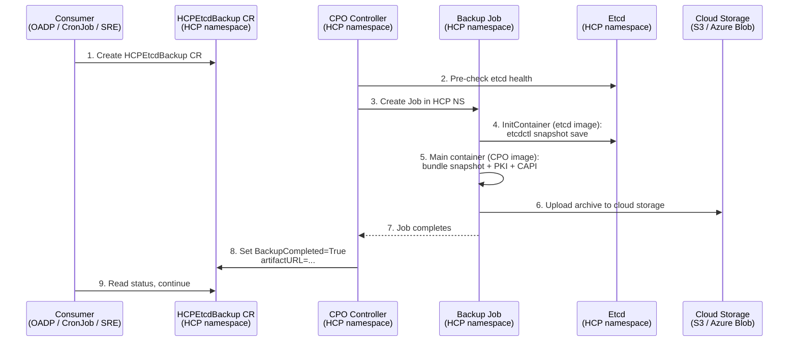

# HCPEtcdBackup CRD for OADP Integration

## Summary

This enhancement introduces a new `HCPEtcdBackup` CRD in the `hypershift.openshift.io/v1beta1` API group that serves as the universal one-shot backup primitive for all HyperShift consumers (ARO, ROSA, GCP, self-managed). A controller in the Control Plane Operator (CPO) watches `HCPEtcdBackup` resources in the HCP namespace, orchestrates backup Jobs that produce a complete restorable artifact (etcd snapshot, critical PKI secrets, and CAPI objects), and uploads the resulting archive to cloud storage. The controller runs in the HCP namespace where etcd, PKI secrets, and CAPI resources already live — no cross-namespace access, no temporary NetworkPolicies, and no service network overhead for snapshot transfer. Authentication uses per-cloud workload identity (AWS IRSA, Azure Managed Identity, or static credentials for self-hosted) instead of fleet-wide shared secrets. This design **eliminates the need to pause HostedCluster/NodePool reconciliation during backups** — the previous CSI volume snapshot approach required pausing reconciliation for 20-30 minutes per backup cycle, blocking all day-two operations. Scheduled backups are handled by a separate enhancement ([PR #2004](https://github.com/openshift/enhancements/pull/2004)), which layers a CronJob-based scheduling mechanism on top of this primitive.

## Motivation

### User Stories

- As an **SRE**, I want to trigger an etcd backup of a hosted cluster so that I can restore it in a disaster recovery scenario.
- As the **OADP plugin**, I want a Kubernetes-native API to request etcd backups and discover the resulting backup URL so that I can integrate etcd snapshots into the standard OADP backup flow.
- As a **platform operator**, I want each HostedCluster to authenticate to cloud storage using its own workload identity (AWS IRSA, Azure Managed Identity) so that there is no fleet-wide shared credential that represents a single point of compromise.
- As an **SRE**, I want the backup artifact to be a complete restorable bundle (etcd snapshot + PKI secrets + CAPI objects) so that a disaster recovery restore has everything it needs in a single archive.
- As an **SRE**, I want optional per-tenant KMS encryption (SSE-KMS on S3 / CMK on Azure) for backup artifacts so that snapshots are encrypted with a customer-managed key in cloud storage.

### Goals

1. Define a CRD that acts as a declarative API for requesting etcd backups — the universal one-shot backup primitive for all HyperShift consumers.
2. Implement a controller in the CPO that orchestrates the backup lifecycle (snapshot + PKI/CAPI bundling + upload) within the HCP namespace.
3. Produce a complete restorable artifact: etcd snapshot, critical PKI secrets (root-ca, etcd-signer, sa-signing-key, encryption key), and CAPI objects — bundled as a single archive.
4. Use per-cloud workload identity (AWS IRSA, Azure Managed Identity) or static credentials (self-hosted) for cloud storage authentication, with no fleet-wide shared secrets.
5. Report backup status and the resulting artifact URL through the CR status for consumer consumption.
6. Support optional per-tenant KMS encryption of backup artifacts in cloud storage via keys defined at the HostedCluster level.

### Non-Goals

1. Scheduled/periodic backups — this enhancement covers on-demand backups only. Scheduling is covered by a separate enhancement ([PR #2004](https://github.com/openshift/enhancements/pull/2004)), which creates a CronJob that periodically creates `HCPEtcdBackup` CRs.
2. Backup restore — restore is handled by the existing `RestoreSnapshotURL` mechanism in the HCP spec.
3. Storage backends beyond AWS S3 and Azure Blob Storage — the storage backend is designed to be agnostic via an uploader interface. The initial implementation supports S3, and Azure Blob Storage is added within the same epic. GCP Cloud Storage will be addressed in a separate enhancement. The `GCPServiceAccount` field in the `cloudIdentity` union is included in this API to prepare the ground for future GCP support, so that adding the GCP storage backend does not require an API change.
4. OADP plugin implementation — the CRD is the contract; the plugin is out of scope. The OADP HyperShift plugin will invoke this CRD as a step within the Velero backup workflow to trigger the etcd snapshot and upload before proceeding with the standard resource backup.
5. Per-HostedCluster cloud identity lifecycle — the managed service layer (ARO-HCP, ROSA, GCP-HCP) is responsible for creating and managing per-HC cloud identities (managed identity, GCP SA, IAM role). HyperShift provides the API knob; the consumer provides the identity. This is covered by a separate enhancement.

## Implementation Tracking

The implementation of this enhancement is organized across two epics:

- **[CNTRLPLANE-2676](https://issues.redhat.com/browse/CNTRLPLANE-2676) — HCPEtcdBackup CRD for OADP Integration (self-managed)**: Covers the initial CRD API, controller (originally in HO), CPO subcommands (`fetch-etcd-certs`, `etcd-backup`, `etcd-upload`), OADP plugin integration, E2E tests, envtest validation, and Tech Preview documentation. **Status: Dev Complete** — all child issues closed and PRs merged. **Note:** This implementation predates the redesign described in this document. A new OCPStrat + EPIC will be created to implement the changes outlined here (controller in CPO, HCP namespace, cloudIdentity union, archive artifact with PKI/CAPI).

- **[CNTRLPLANE-3312](https://issues.redhat.com/browse/CNTRLPLANE-3312) — HCPEtcdBackup support for ROSA and ARO**: Extends the feature to managed platforms (ROSA HCP / ARO HCP). **Status: On hold** — pending the redesign to align with the per-cloud workload identity model and convergence with the scheduled backups enhancement ([PR #2004](https://github.com/openshift/enhancements/pull/2004)).

## Proposal

### Workflow Description

1. A consumer (OADP plugin, managed service layer, or SRE) creates an `HCPEtcdBackup` CR in the HCP namespace. The CR spec includes the cloud storage configuration (e.g., S3 bucket or Azure Blob container) and cloud identity for authentication (e.g., AWS IRSA role ARN, Azure Managed Identity client ID, or a static credentials Secret reference for self-hosted environments).

2. The `HCPEtcdBackupReconciler` in the Control Plane Operator (CPO) detects the new CR and:
   - Validates that a `HostedControlPlane` exists in the same namespace.
   - Ensures no other backup Job is currently in progress for this HCP (only one backup at a time is allowed).
   - Performs pre-checks on etcd cluster health before proceeding (e.g., verifying quorum and endpoint availability).
   - Creates a `Job` in the HCP namespace. The Job uses a multi-step pattern (see [Container Image Strategy](#container-image-strategy)):
     - **InitContainer 1** (etcd image from the OCP release payload): runs `etcdctl snapshot save` using the etcd TLS certificates already available in the namespace, connecting to `etcd-client:2379`. Writes the snapshot to a shared `emptyDir` volume.
     - **Main container** (CPO image): reads the snapshot file, collects critical PKI secrets (`root-ca`, `etcd-signer`, `sa-signing-key`, `kas-secret-encryption-config`) and CAPI objects (`Cluster`, `Machine`, `MachineSet`, `MachineDeployment`, and platform-specific infrastructure resources) from the HCP namespace, bundles everything into a single archive, and uploads it to the configured cloud storage backend using `control-plane-operator etcd-upload`. If a KMS key is configured in the `HCPEtcdBackup` CR spec, the upload uses SSE-KMS (S3) or CMK (Azure) encryption.

3. The InitContainer takes the etcd snapshot first. Once it completes, the main container bundles the snapshot with PKI secrets and CAPI objects, then uploads the archive to cloud storage.

4. When the Job completes, the controller updates the `HCPEtcdBackup` CR status:
   - Sets `BackupCompleted` condition to `True` with reason `BackupSucceeded`.
   - Sets `status.artifactURL` to the cloud storage URL (e.g., `s3://bucket/prefix/1708345200.tar.gz` or `https://<account>.blob.core.windows.net/<container>/prefix/1708345200.tar.gz`).

5. The consumer polls the CR status, detects `BackupCompleted=True`, reads the `artifactURL`, and proceeds with its workflow (e.g., OADP continues with the standard backup flow).

If the Job fails, the controller sets `BackupCompleted=False` with the error in the condition message.

**KMS key propagation**: The optional KMS key for artifact encryption is defined once at the HostedCluster level (in `spec.etcd.managed.backup.kmsKeyARN` for AWS or `spec.etcd.managed.backup.encryptionKeyURL` for Azure) and is **immutable** at all three levels. The propagation chain is: HC → HCP (via `hostedcluster_controller.go`) → `HCPEtcdBackup` CR spec (via `HCPEtcdBackupReconciler`). The consumer does not set the KMS key — it is always populated by the controller from the HCP.



### API Extensions

#### New CRD: `HCPEtcdBackup`

```go
// +genclient
// +kubebuilder:object:root=true
// +kubebuilder:resource:path=hcpetcdbackups,scope=Namespaced,shortName=hcpetcdbk
// +kubebuilder:storageversion
// +kubebuilder:subresource:status
// +kubebuilder:printcolumn:name="Completed",type="string",JSONPath=".status.conditions[?(@.type==\"BackupCompleted\")].status"
// +kubebuilder:printcolumn:name="URL",type="string",JSONPath=".status.artifactURL"
// +kubebuilder:printcolumn:name="Age",type="date",JSONPath=".metadata.creationTimestamp"
// +openshift:enable:FeatureGate=HCPEtcdBackup

// HCPEtcdBackup represents a request to take an etcd snapshot of a
// HostedControlPlane, bundle it with critical PKI secrets and CAPI objects,
// and upload the resulting archive to cloud storage. Creating this
// resource triggers the backup workflow.
type HCPEtcdBackup struct {
    metav1.TypeMeta   `json:",inline"`
    metav1.ObjectMeta `json:"metadata,omitempty"`
    Spec   HCPEtcdBackupSpec   `json:"spec,omitzero"`
    Status HCPEtcdBackupStatus `json:"status,omitzero"`
}

// HCPEtcdBackupSpec defines the desired backup configuration.
// The storage backend is pluggable via an uploader interface.
// S3 is supported in the initial implementation; Azure Blob Storage
// is added within the same epic. GCP Cloud Storage will be addressed
// in a separate enhancement.
// +kubebuilder:validation:XValidation:rule="self.storageType == 'S3' ? self.cloudIdentity.type in ['AWSRoleARN', 'Secret'] : true",message="S3 storage requires AWSRoleARN or Secret cloud identity"
// +kubebuilder:validation:XValidation:rule="self.storageType == 'AzureBlob' ? self.cloudIdentity.type in ['AzureManagedIdentity', 'Secret'] : true",message="AzureBlob storage requires AzureManagedIdentity or Secret cloud identity"
type HCPEtcdBackupSpec struct {
    // storageType selects the cloud storage backend for the backup.
    // +required
    // +kubebuilder:validation:Enum=S3;AzureBlob
    // +unionDiscriminator
    StorageType HCPEtcdBackupStorageType `json:"storageType"`

    // s3 defines the S3 storage configuration for uploading the backup.
    // Required when storageType is "S3".
    // +optional
    S3 *HCPEtcdBackupS3 `json:"s3,omitzero"`

    // azureBlob defines the Azure Blob Storage configuration for uploading the backup.
    // Required when storageType is "AzureBlob".
    // +optional
    AzureBlob *HCPEtcdBackupAzureBlob `json:"azureBlob,omitzero"`

    // cloudIdentity defines the authentication method for accessing cloud storage.
    // Each HostedCluster uses its own cloud identity — there are no fleet-wide
    // shared credentials.
    // +required
    CloudIdentity HCPEtcdBackupCloudIdentity `json:"cloudIdentity"`
}

// HCPEtcdBackupStorageType identifies the cloud storage backend.
// +kubebuilder:validation:Enum=S3;AzureBlob
type HCPEtcdBackupStorageType string

const (
    S3BackupStorage        HCPEtcdBackupStorageType = "S3"
    AzureBlobBackupStorage HCPEtcdBackupStorageType = "AzureBlob"
)

// HCPEtcdBackupCloudIdentityType identifies the cloud identity mechanism.
// +kubebuilder:validation:Enum=AWSRoleARN;AzureManagedIdentity;GCPServiceAccount;Secret
type HCPEtcdBackupCloudIdentityType string

const (
    AWSRoleARNIdentity          HCPEtcdBackupCloudIdentityType = "AWSRoleARN"
    AzureManagedIdentityType    HCPEtcdBackupCloudIdentityType = "AzureManagedIdentity"
    GCPServiceAccountIdentity   HCPEtcdBackupCloudIdentityType = "GCPServiceAccount"
    SecretIdentity              HCPEtcdBackupCloudIdentityType = "Secret"
)

// HCPEtcdBackupCloudIdentity defines the authentication method for accessing
// cloud storage. This is a union type — exactly one of the identity-specific
// fields must be set, matching the type discriminator.
type HCPEtcdBackupCloudIdentity struct {
    // type selects the cloud identity mechanism.
    // +required
    // +unionDiscriminator
    Type HCPEtcdBackupCloudIdentityType `json:"type"`

    // roleARN is the ARN of the AWS IAM role to assume via IRSA (IAM Roles
    // for Service Accounts) for S3 access. The backup Job uses a projected
    // ServiceAccount token with sts.amazonaws.com audience to assume this role.
    // Required when type is "AWSRoleARN".
    // +optional
    RoleARN string `json:"roleARN,omitzero"`

    // clientID is the Azure Managed Identity client ID used for Azure Blob
    // Storage access. The backup Job's ServiceAccount is annotated with this
    // client ID, and the Azure Workload Identity webhook injects the
    // federated token at runtime.
    // Required when type is "AzureManagedIdentity".
    // +optional
    ClientID string `json:"clientID,omitzero"`

    // gcpServiceAccount is the email of the GCP Service Account used for
    // GCP Cloud Storage access via Workload Identity Federation. The backup
    // Job's ServiceAccount is annotated with this SA email.
    // Required when type is "GCPServiceAccount".
    // NOTE: Including this field does not imply that GCP platform integration
    // is implemented in this enhancement. The API knob is defined here to
    // prepare the ground for future GCP support, making it easier to add
    // when the time comes without requiring an API change.
    // +optional
    GCPServiceAccount string `json:"gcpServiceAccount,omitzero"`

    // credentialsSecretRef references a Secret in the HCP namespace containing
    // static cloud credentials. Used for self-hosted environments where
    // workload identity is not available. The Secret must contain the
    // appropriate credential keys for the selected storage backend
    // (e.g., 'credentials' for AWS, 'cloud' for Azure).
    // Required when type is "Secret".
    // +optional
    CredentialsSecretRef *corev1.LocalObjectReference `json:"credentialsSecretRef,omitzero"`
}

// HCPEtcdBackupS3 defines S3-specific upload configuration.
type HCPEtcdBackupS3 struct {
    // bucket is the S3 bucket name.
    // +required
    // +kubebuilder:validation:MinLength=1
    Bucket string `json:"bucket"`

    // region is the AWS region of the bucket.
    // +required
    // +kubebuilder:validation:MinLength=1
    Region string `json:"region"`

    // keyPrefix is the S3 key prefix for the backup archive.
    // +required
    // +kubebuilder:validation:MinLength=1
    KeyPrefix string `json:"keyPrefix"`

    // kmsKeyARN is the ARN of the AWS KMS key used for server-side encryption
    // (SSE-KMS) of the backup artifact in S3. When set, the etcd-upload
    // subcommand passes ServerSideEncryption=aws:kms and SSEKMSKeyId on the
    // PutObject call. This field is populated by the controller from the
    // HostedControlPlane spec and is immutable once set.
    // +optional
    // +kubebuilder:validation:XValidation:rule="self == oldSelf",message="kmsKeyARN is immutable"
    KMSKeyARN string `json:"kmsKeyARN,omitzero"`
}

// HCPEtcdBackupAzureBlob defines Azure Blob Storage upload configuration.
type HCPEtcdBackupAzureBlob struct {
    // container is the Azure Blob Storage container name.
    // +required
    // +kubebuilder:validation:MinLength=1
    Container string `json:"container"`

    // storageAccount is the Azure Storage account name.
    // +required
    // +kubebuilder:validation:MinLength=1
    StorageAccount string `json:"storageAccount"`

    // keyPrefix is the blob name prefix for the backup archive.
    // +required
    // +kubebuilder:validation:MinLength=1
    KeyPrefix string `json:"keyPrefix"`

    // encryptionKeyURL is the Azure Key Vault key URL used for customer-managed
    // key (CMK) encryption of the backup artifact in Azure Blob Storage. When set,
    // the etcd-upload subcommand configures CMK encryption on the blob upload.
    // This field is populated by the controller from the HostedControlPlane spec
    // and is immutable once set.
    // +optional
    // +kubebuilder:validation:XValidation:rule="self == oldSelf",message="encryptionKeyURL is immutable"
    EncryptionKeyURL string `json:"encryptionKeyURL,omitzero"`
}

// HCPEtcdBackupStatus defines the observed state of the backup.
type HCPEtcdBackupStatus struct {
    // conditions tracks the backup lifecycle.
    // +optional
    // +listType=map
    // +listMapKey=type
    // +patchMergeKey=type
    // +patchStrategy=merge
    Conditions []metav1.Condition `json:"conditions,omitzero"`

    // artifactURL is the cloud provider URL where the backup archive was stored.
    // The archive contains the etcd snapshot, PKI secrets, and CAPI objects.
    // Only set when BackupCompleted condition is True.
    // +optional
    ArtifactURL string `json:"artifactURL,omitzero"`

    // encryptionMetadata captures information about the etcd encryption
    // state at the time of the backup. This metadata allows the restore
    // path to validate KMS key availability before attempting a restore.
    // +optional
    EncryptionMetadata *HCPEtcdBackupEncryptionMetadata `json:"encryptionMetadata,omitzero"`
}

// KMSEncryptionState indicates whether KMS encryption at rest was active.
// +kubebuilder:validation:Enum=Enabled;Disabled
type KMSEncryptionState string

const (
    KMSEncryptionEnabled  KMSEncryptionState = "Enabled"
    KMSEncryptionDisabled KMSEncryptionState = "Disabled"
)

// HCPEtcdBackupEncryptionMetadata captures the encryption state of the etcd
// snapshot at backup time. When KMS encryption at rest is active, the
// snapshot contains DEKs wrapped by the KMS key. The snapshot is only
// restorable if the KMS key remains available and accessible.
type HCPEtcdBackupEncryptionMetadata struct {
    // kmsEncryption indicates whether KMS encryption at rest was active
    // on the hosted cluster's etcd at the time of the backup.
    // +required
    // +kubebuilder:validation:Enum=Enabled;Disabled
    KMSEncryption KMSEncryptionState `json:"kmsEncryption"`

    // kmsKeyID is the identifier of the KMS key used for encryption.
    // Only set when kmsEncryption is Enabled. This allows the restore flow
    // to verify key availability before attempting a restore.
    // For AWS: the KMS key ARN (e.g., arn:aws:kms:us-west-2:123456789:key/...)
    // For Azure: the Key Vault key URL (e.g., https://vault.vault.azure.net/keys/name/version)
    // +optional
    KMSKeyID string `json:"kmsKeyID,omitzero"`
}
```

#### Extension to `ManagedEtcdSpec` (HostedCluster / HostedControlPlane)

The optional KMS key for artifact encryption is configured at the HostedCluster level and propagated through the stack. This new struct is added to `ManagedEtcdSpec`:

```go
// HCPEtcdBackupConfig defines backup configuration for managed etcd.
// This is set at the HostedCluster level and propagated to HCP and
// then to individual HCPEtcdBackup CRs by the controller.
// +openshift:enable:FeatureGate=HCPEtcdBackup
type HCPEtcdBackupConfig struct {
    // kmsKeyARN is the ARN of the AWS KMS key used for SSE-KMS encryption
    // of backup artifacts stored in S3. When set, every HCPEtcdBackup CR
    // created for this cluster will have this value copied into its spec.
    // This field is immutable once set.
    // +optional
    // +kubebuilder:validation:XValidation:rule="self == oldSelf",message="kmsKeyARN is immutable"
    KMSKeyARN string `json:"kmsKeyARN,omitzero"`

    // encryptionKeyURL is the Azure Key Vault key URL used for CMK encryption
    // of backup artifacts stored in Azure Blob Storage. When set, every
    // HCPEtcdBackup CR created for this cluster will have this value copied
    // into its spec. This field is immutable once set.
    // +optional
    // +kubebuilder:validation:XValidation:rule="self == oldSelf",message="encryptionKeyURL is immutable"
    EncryptionKeyURL string `json:"encryptionKeyURL,omitzero"`
}
```

The `ManagedEtcdSpec` in `hostedcluster_types.go` is extended with:

```go
type ManagedEtcdSpec struct {
    // ... existing fields ...

    // backup defines the backup configuration for managed etcd, including
    // optional KMS key settings for artifact encryption in cloud storage.
    // +optional
    // +openshift:enable:FeatureGate=HCPEtcdBackup
    Backup *HCPEtcdBackupConfig `json:"backup,omitempty"`
}
```

**Propagation chain**: `HostedCluster.spec.etcd.managed.backup` → `HostedControlPlane.spec.etcd.managed.backup` (via `hostedcluster_controller.go`) → `HCPEtcdBackup.spec.s3.kmsKeyARN` or `HCPEtcdBackup.spec.azureBlob.encryptionKeyURL` (via `HCPEtcdBackupReconciler`).

**Condition types:**

| Type | Status | Reason | Description |
|------|--------|--------|-------------|
| `BackupCompleted` | `True` | `BackupSucceeded` | Snapshot taken and uploaded successfully |
| `BackupCompleted` | `False` | `BackupFailed` | Job failed; message contains error details |

### Topology Considerations

#### Hypershift / Hosted Control Planes

This enhancement is **exclusively for Hypershift**. The entire design is built around the HyperShift architecture where control planes run in namespaces on a management cluster.

#### Standalone Clusters

Not applicable. Standalone clusters use the standard etcd-operator for backup management.

#### Single-node Deployments or MicroShift

Not applicable.

#### OpenShift Kubernetes Engine

Not applicable.

### Implementation Details/Notes/Constraints

#### Feature Gate: `HCPEtcdBackup`

All new API fields and controller logic are gated behind the `HCPEtcdBackup` feature gate. This ensures the feature can be enabled progressively through the standard OpenShift feature gate lifecycle.

**Feature gate configuration files** (in the HyperShift repository):

- `featureGate-Hypershift-Default.yaml`: `HCPEtcdBackup` is **disabled** (not listed or explicitly set to `false`).
- `featureGate-Hypershift-TechPreviewNoUpgrade.yaml`: `HCPEtcdBackup` is **enabled**.

**API markers**: All new fields in the `HostedCluster`, `HostedControlPlane`, and `HCPEtcdBackup` types carry the `+openshift:enable:FeatureGate=HCPEtcdBackup` annotation. This means the fields are only present in the CRD schema when the feature gate is enabled.

**Controller predicate**: The `HCPEtcdBackupReconciler` in the CPO includes a feature gate predicate check at the start of `Reconcile()`. If the `HCPEtcdBackup` feature gate is not enabled, the reconciler is a **no-op** — it returns immediately without processing the CR. This ensures that even if an `HCPEtcdBackup` CR is created while the gate is disabled, no backup Job is created.

```go
func (r *HCPEtcdBackupReconciler) Reconcile(ctx context.Context, req ctrl.Request) (ctrl.Result, error) {
    if !featuregate.IsEnabled(featuregate.HCPEtcdBackup) {
        return ctrl.Result{}, nil
    }
    // ... rest of reconciliation logic
}
```

#### Cloud Identity Model

Each HostedCluster authenticates to cloud storage using its own cloud identity — there is no fleet-wide shared credential. This eliminates the single-point-of-compromise risk of a shared Secret that accesses every cluster's backup storage.

The `cloudIdentity` field on the `HCPEtcdBackup` spec is a union type that supports:

- **AWS IRSA** (`AWSRoleARN`): The backup Job uses a projected ServiceAccount token with `sts.amazonaws.com` audience to assume an IAM role scoped to the HostedCluster's backup storage. The role ARN is provided by the consumer (managed service layer or cluster administrator).
- **Azure Managed Identity** (`AzureManagedIdentity`): The backup Job's ServiceAccount is annotated with the Managed Identity client ID, and the Azure Workload Identity webhook injects the federated token at runtime. The client ID is provided by the consumer.
- **GCP Service Account** (`GCPServiceAccount`): The backup Job's ServiceAccount is annotated with the GCP Service Account email for Workload Identity Federation. The SA email is provided by the consumer. Note: the GCP Cloud Storage backend is not implemented in this enhancement — the API knob is defined here to prepare the ground for future GCP support, avoiding an API change when that work lands.
- **Static credentials** (`Secret`): For self-hosted environments where workload identity is not available, a Secret reference in the HCP namespace provides static credentials. The Secret is scoped to the individual HostedCluster's namespace — not shared across clusters.

The managed service layer (ARO-HCP, ROSA, GCP-HCP) is responsible for creating and managing per-HostedCluster cloud identities. HyperShift provides the API knob; the consumer provides the identity. The per-HC cloud identity lifecycle is covered by a separate enhancement.

#### Service Account for Backup Jobs

The backup Job uses a ServiceAccount named `etcd-backup-job` in the HCP namespace. This ServiceAccount is created and managed by the `HCPEtcdBackupReconciler` in the CPO. Since the Job runs in the HCP namespace, it has direct access to etcd TLS certificates, PKI secrets, and CAPI objects without cross-namespace RBAC.

For cloud storage authentication, the controller configures the ServiceAccount based on the `cloudIdentity` type:

- **AWS IRSA**: The ServiceAccount is annotated with `eks.amazonaws.com/role-arn` (or equivalent), and the Job includes a projected ServiceAccount token volume with `sts.amazonaws.com` audience and 1-hour expiry.
- **Azure Managed Identity**: The ServiceAccount is annotated with `azure.workload.identity/client-id`, and the pod template includes `azure.workload.identity/use: "true"` label. The Azure WI webhook injects the federated token at runtime.
- **GCP Service Account**: The ServiceAccount is annotated with `iam.gke.io/gcp-service-account` for GCP Workload Identity Federation.
- **Static credentials**: The Secret referenced in `credentialsSecretRef` is mounted directly in the Job pod.

Each HCP namespace has its own `etcd-backup-job` ServiceAccount, scoped to that HostedCluster's cloud identity. There is no shared ServiceAccount across clusters.

#### Artifact Encryption (SSE-KMS / Azure CMK)

Per-tenant encryption of the backup artifact in cloud storage is supported via optional KMS key fields:

- **AWS S3**: `kmsKeyARN` in `HCPEtcdBackupS3` — when set, the `etcd-upload` subcommand passes `ServerSideEncryption=aws:kms` and `SSEKMSKeyId` on the `PutObject` call (SSE-KMS).
- **Azure Blob**: `encryptionKeyURL` in `HCPEtcdBackupAzureBlob` — when set, the `etcd-upload` subcommand configures customer-managed key (CMK) encryption on the blob upload. Note: the specific Azure encryption mechanism (Encryption Scopes with CMK, account-level CMK, or client-side encryption) is pending a decision from the ARO HCP team. The API field exists and the architecture supports all three approaches with localized changes to the Azure uploader.

The KMS key is defined once at the HostedCluster level in `spec.etcd.managed.backup` (via the `HCPEtcdBackupConfig` struct) and is **immutable** at all three levels (HC, HCP, HCPEtcdBackup CR). The propagation chain is:

1. `HostedCluster.spec.etcd.managed.backup.kmsKeyARN` (or `encryptionKeyURL`) — set by the cluster administrator, immutable.
2. `HostedControlPlane.spec.etcd.managed.backup.kmsKeyARN` — propagated by `hostedcluster_controller.go`, immutable.
3. `HCPEtcdBackup.spec.s3.kmsKeyARN` (or `azureBlob.encryptionKeyURL`) — populated by the `HCPEtcdBackupReconciler` from the HCP, immutable.

The OADP plugin does **not** set the KMS key — it is always populated by the controller. If no KMS key is configured, the backup uses the default encryption settings of the bucket or storage account (typically SSE-S3 or Azure platform-managed keys).

When a KMS key is configured, the backup Job's ServiceAccount must have `kms:GenerateDataKey` and `kms:Decrypt` permissions on the specified KMS key (AWS), or the appropriate Key Vault permissions (Azure).

Note that this is **independent of etcd encryption at rest** — the `encryptionMetadata` in the status tracks the KMS key used by etcd internally (for encrypting Secrets, ConfigMaps, etc. inside etcd), not the artifact-level encryption of the stored snapshot file.

#### Etcd Health Pre-Checks

Before creating the backup Job, the controller performs pre-checks on the etcd cluster health to avoid taking a snapshot of an unhealthy cluster. This includes verifying endpoint availability and quorum status. If the etcd cluster is unhealthy, the controller sets `BackupCompleted=False` with reason `EtcdUnhealthy` and does not proceed with the Job creation.

#### Backup Retention

Backup retention is managed via TTL and count-based policies configured externally (e.g., through the HyperShift CLI or Velero TTL). The `HCPEtcdBackup` CRs are simple records — deleting a CR does **not** delete the corresponding cloud storage object.

This approach has several advantages:
- **PutObject-only permissions** — the backup Job's ServiceAccount only needs write access to cloud storage (`s3:PutObject` + `s3:GetObject` / Azure Blob write + read), not delete permissions. This reduces the blast radius of the credentials.
- **Overwrite prevention** — For **Azure Blob Storage**, the `etcd-upload` subcommand uses the `IfNoneMatch: ETagAny` conditional write header, which prevents overwriting an existing blob (Azure returns `412 ConditionNotMet`). For **AWS S3**, conditional writes via `If-None-Match` are **not supported** because the upload uses the AWS SDK v2 Transfer Manager, which handles multipart uploads internally and does not expose conditional write headers in its API. Instead, overwrite prevention on S3 is mitigated at the application level: the upload key includes a Unix timestamp (`{keyPrefix}/{timestamp}.tar.gz`), making key collisions practically impossible. Combined with **S3 Versioning** on the bucket as an additional safety net, original objects are preserved even in edge cases.
- **No finalizer complexity** — avoids issues with stuck CRs when cloud storage credentials are unavailable at deletion time.
- **Decoupled lifecycle** — cloud storage object retention is managed by the storage backend's native lifecycle policies (S3 Lifecycle Rules, Azure Blob lifecycle management) or by the OADP/Velero TTL mechanism.

The HyperShift CLI (or an external operator) is responsible for cleaning up old `HCPEtcdBackup` CRs based on count thresholds (e.g., keep the last 5 `HCPEtcdBackup` CRs per HCP, delete the oldest Kubernetes object when exceeded). Cloud storage object cleanup is handled by the storage backend's lifecycle policies.

#### S3 Object Lock Compatibility

The HCPEtcdBackup controller is compatible with S3 Object Lock by design — the backup Job only performs `PutObject` operations, never `DeleteObject`. If the bucket has Object Lock enabled, the uploaded snapshot objects comply with the retention policy without any special handling. S3 object lifecycle management is delegated to the storage backend's native lifecycle rules.

Note: Velero is exploring Object Lock support ([velero-io/velero#8686](https://github.com/velero-io/velero/issues/8686)). The HCPEtcdBackup archive is written to a sibling prefix alongside Velero's backup directory (see [OADP Plugin Integration](#oadp-plugin-integration)). If Object Lock is enabled on the bucket, the uploaded archive objects comply with the retention policy without any special handling, since the controller never deletes S3 objects.

#### S3 Object Tagging (Future Improvement)

The `etcd-upload` subcommand does not currently tag S3 objects with metadata (e.g., `cluster-id`, `schedule`, `backup-type`). Adding S3 object tags is a planned future improvement that would enable:

- **S3 Lifecycle Rules based on tags** — automatic cleanup of old backups by tag-based retention policies (e.g., delete objects with `schedule=6-hourly` after 7 days).
- **Safety net for Velero deletion failures** — production experience has shown that Velero can get permanently stuck during backup deletion, leaving orphan S3 data. Tag-based lifecycle rules provide a fallback cleanup mechanism.
- **Operational visibility** — tags like `cluster-id` enable per-cluster cost attribution and audit trails.

The architecture supports this — the `etcd-upload` subcommand can accept a `--s3-object-tags` flag and pass the `Tagging` parameter on the `PutObject` call. Tags can either be specified explicitly in the `HCPEtcdBackup` spec or extracted from the Velero `BackupStorageLocation.spec.config.tagging` configuration.

#### Single Job Design

The snapshot and upload happen in a single Job rather than two separate Jobs:
- An etcd snapshot is fast (seconds) and cheap to repeat if the upload fails.
- A single Job avoids PVC coordination, intermediate state management, and cross-Job dependency tracking.
- If the Job fails, the controller can simply create a new one.
- The Job sets `.spec.ttlSecondsAfterFinished` to automatically clean up completed/failed Job resources after a configurable period, preventing accumulation of finished Jobs in the HCP namespace.

#### Container Image Strategy

The backup Job requires two binaries that live in different container images:

- **`etcdctl`** is in the **etcd image** from the OCP release payload (`github.com/openshift/etcd`). It is **not** present in the CPO image.
- **`control-plane-operator`** is in the **CPO image**. It contains the PKI/CAPI collection, archive bundling, and cloud storage upload logic (AWS SDK, Azure SDK).

The Job uses a **two-step pattern** where each container runs only the binaries native to its image:

1. **InitContainer** (etcd image): Mounts the etcd TLS certificates (`etcd-client-tls`, `etcd-ca`) from the HCP namespace directly as Secret volumes. Runs `etcdctl snapshot save` connecting to `etcd-client:2379` (same namespace, no cross-namespace DNS needed). Writes the snapshot to a shared `emptyDir` volume (`/etc/etcd-backup/snapshot.db`).
2. **Main container** (CPO image): Reads the snapshot file from the shared volume, collects PKI secrets (`root-ca`, `etcd-signer`, `sa-signing-key`, `kas-secret-encryption-config`) and CAPI objects (`Cluster`, `Machine`, `MachineSet`, `MachineDeployment`, and platform-specific infrastructure resources) from the HCP namespace via the Kubernetes API, bundles everything into a `.tar.gz` archive, and uploads it to the configured cloud storage backend using `control-plane-operator etcd-upload`.

This approach has several advantages:
- **No binary copying** between containers — each image runs only its own binaries.
- **No cross-namespace access** — all resources (etcd, PKI, CAPI) are in the same HCP namespace.
- **Version compatibility** — `etcdctl` in the etcd image is always version-compatible with the etcd deployed by the CPO, as both come from the same OCP release payload.
- **Clean separation of concerns** — the snapshot step uses etcd tooling, the bundling and upload step uses the CPO with Kubernetes API and cloud SDKs.
- **The existing `etcd-backup` subcommand** (which shells out to `etcdctl`) is superseded by this multi-step approach. The `etcd-upload` subcommand is extended to handle archive creation and upload.

#### OADP Plugin Integration

The OADP HyperShift plugin orchestrates the `HCPEtcdBackup` CR lifecycle during Velero backup and restore operations:

**Pre-flight check:** Before creating the CR, the plugin must verify that the `HCPEtcdBackup` feature gate is enabled on the target HostedControlPlane (e.g., by checking the CRD availability or the HCP's feature gate status). If the gate is disabled, the plugin must fail fast with a clear error rather than creating a CR that the CPO will never reconcile — otherwise the Velero backup would hang indefinitely polling a CR that never reaches `BackupCompleted`.

**Backup flow:**
1. The plugin fetches the Velero `BackupStorageLocation` (BSL) configuration.
2. Maps the BSL to `HCPEtcdBackupStorage` (S3 or AzureBlob) and resolves the cloud identity for the HostedCluster.
3. Creates the `HCPEtcdBackup` CR in the HCP namespace with the storage configuration and cloud identity, and polls for completion.
4. On success, stores the `artifactURL` and the `encryptionMetadata` (KMS encryption state and key ID) as annotations on the HostedControlPlane/HostedCluster objects in the Velero tarball. Persisting the encryption metadata ensures the restore path can validate KMS key availability even after the `HCPEtcdBackup` CR is deleted.

**Restore flow:**
1. The plugin's `RestoreItemAction` reads the `artifactURL` and `encryptionMetadata` annotations from the backed-up HostedControlPlane/HostedCluster.
2. If `encryptionMetadata` indicates KMS encryption was active, validates that the KMS key referenced in `kmsKeyID` is still available before proceeding. Fails explicitly if the key is missing.
3. Downloads the archive from cloud storage (using presigned URL: S3 presigned GET with STS `AssumeRoleWithWebIdentity` if needed, or Azure Blob SAS).
4. Extracts the archive contents: etcd snapshot (`snapshot.db`), PKI secrets, and CAPI objects.
5. Restores the PKI secrets and CAPI objects to the HCP namespace.
6. Uploads the extracted etcd snapshot (`snapshot.db`) to a temporary location in cloud storage and generates a presigned URL for it. This is necessary because the existing HyperShift restore mechanism expects `restoreSnapshotURL` to point to a single downloadable snapshot file, not a `.tar.gz` archive.
7. Injects the presigned snapshot URL into `spec.etcd.managed.storage.restoreSnapshotURL`.
8. The existing HyperShift restore machinery picks up the URL and restores etcd from the snapshot.

**Upload path:** The archive is uploaded to `{keyPrefix}/{timestamp}.tar.gz` where `keyPrefix` is provided in the `HCPEtcdBackup` CR spec. The plugin constructs the `keyPrefix` to use a sibling prefix alongside Velero's backup directory (`{bsl-prefix}-hypershift-etcd/{backup-name}/`), following the pattern established by other Velero plugins (e.g., kubevirt-datamover-controller). This avoids depending on Velero's internal directory layout, which has no compatibility guarantee. A `DeleteItemAction` (DIA) plugin handles cleanup of the archive when a Velero backup is deleted.

#### Existing Binary and Manifest Reuse

The existing `control-plane-operator etcd-backup` subcommand handles both snapshot and upload in a single step by shelling out to `etcdctl`. This subcommand is superseded by the multi-step Job approach. The `control-plane-operator etcd-upload` subcommand is extended to handle archive creation (bundling snapshot + PKI secrets + CAPI objects) and upload to cloud storage. The uploader interface supports multiple cloud storage backends (S3, Azure Blob Storage).

The codebase already contains unused manifest scaffolding for etcd backups (`EtcdBackupCronJob` and `EtcdBackupServiceAccount` in `manifests/etcd.go`), which were added but never wired to any controller. The `HCPEtcdBackupReconciler` introduced by this enhancement creates on-demand `batch/v1.Job` resources in the HCP namespace. The existing CronJob scaffolding will be removed. Scheduled backups are handled by a separate enhancement ([PR #2004](https://github.com/openshift/enhancements/pull/2004)) that creates a CronJob generating `HCPEtcdBackup` CRs on a schedule.

### Risks and Mitigations

| Risk | Mitigation |
|------|------------|
| Large snapshots cause Job timeouts | The Job's `activeDeadlineSeconds` provides a safeguard. The etcd snapshot itself is fast (seconds); the archive bundling and upload are the longer operations. |
| Multiple concurrent HCPEtcdBackup CRs for the same HCP | The controller enforces serial execution — only one backup Job runs at a time. Concurrent requests are rejected with a `BackupCompleted=False` condition and reason `BackupAlreadyInProgress`. |
| KMS key deleted or rotated after backup | The etcd snapshot contains DEKs wrapped by the KMS key used for etcd encryption at rest. If the key is deleted, the backup becomes unrestorable. The `encryptionMetadata` in the status captures the KMS key ID (AWS ARN or Azure Key Vault URL). The restore path must verify that the KMS key referenced in `kmsKeyID` is still available and matches the expected key before attempting a restore — if the keys do not match, the restoration must fail explicitly rather than proceeding with an unrecoverable state. KMS key lifecycle management is outside the scope of this enhancement. |
| Backup capability depends on CPO version | The controller runs in the CPO, so backup is only available for HostedClusters running a CPO version that includes the `HCPEtcdBackupReconciler`. Older HCPs without the controller cannot process `HCPEtcdBackup` CRs. The `HCPEtcdBackup` feature gate ensures the CRD is only registered when supported. |
| Cloud identity not provisioned | If the managed service layer has not provisioned a cloud identity for a HostedCluster, the backup Job will fail with an authentication error. The controller reports this via the `BackupCompleted=False` condition. The per-HC cloud identity lifecycle is the responsibility of the consumer (separate enhancement). |
| Archive size with CAPI objects | Including PKI secrets and CAPI objects in the archive increases its size compared to a raw etcd snapshot. In practice, PKI secrets and CAPI manifests are small (KB range) relative to the etcd snapshot (MB range), so the overhead is negligible. |

### Drawbacks

- Adds a new CRD to the HyperShift API surface.
- Backup capability is tied to CPO version — older HostedClusters cannot use this feature until upgraded.
- Requires the managed service layer to provision per-HostedCluster cloud identities, adding operational overhead compared to a single shared credential.
- The OADP plugin needs RBAC access to HCP namespaces to create `HCPEtcdBackup` CRs.
- If the KMS key is deleted (not rotated), all previous etcd backups encrypted with that key become permanently unrestorable. Key rotation is safe — AWS KMS retains all previous key material versions under the same ARN, and Azure Key Vault preserves old key versions in the vault. However, if the key is deleted and the deletion waiting period expires (7-30 days for AWS, 7-90 days for Azure with soft-delete), the key material is permanently destroyed and the encrypted DEKs in the backups can no longer be unwrapped.

## Alternatives (Not Implemented)

### Controller in Hypershift Operator with Jobs in HO Namespace (Previous Design)

The original design ran the controller in the Hypershift Operator and created backup Jobs in the HO namespace. This was rejected because:
- A fleet-wide credential Secret in the HO namespace represents a single point of compromise with access to every cluster's backup storage.
- Cross-namespace etcd access required temporary NetworkPolicies and service network overhead.
- The design did not converge with managed services (ROSA, ARO, GCP) requirements for per-HostedCluster cloud identity.

### HCP Status Condition (Original Approach)

The `etcd-backup` binary sets a status condition directly on the `HostedControlPlane` after backup. This was rejected because:
- It couples the backup lifecycle to the HCP reconciler, making it harder to manage independently.
- The customer-scoped roles (e.g., `ControlPlaneOperatorARN` on AWS) cannot be extended with storage permissions in managed offerings.

### CPO Credentials Reuse

Mounting the existing `control-plane-operator-creds` Secret in the backup workload. Rejected because:
- The CPO role is customer-scoped (ec2/route53) and adding cloud storage permissions violates the separation between customer and service credentials.

### Credential Auto-Detection from Secret Content (Previous Design)

The original design auto-detected the credential type (static, STS/IRSA, Workload Identity) by inspecting the Secret content at runtime. This was replaced by an explicit `cloudIdentity` union type because:
- Implicit detection is fragile and harder to debug when authentication fails.
- An explicit union type is self-documenting and aligns with the `AutomatedEtcdBackupCloudIdentity` model in the scheduled backups enhancement ([PR #2004](https://github.com/openshift/enhancements/pull/2004)).

## Open Questions

1. ~~**Service Account for backup Jobs**~~: Resolved — per-HCP `etcd-backup-job` ServiceAccount in the HCP namespace, managed by the CPO. See [Service Account for Backup Jobs](#service-account-for-backup-jobs).
2. ~~**CRD naming**~~: Resolved — `HCPEtcdBackup`.
3. ~~**HCPEtcdBackup CR retention policy**~~: Resolved — retention is managed via TTL and count-based policies configured externally. See [Backup Retention](#backup-retention).
4. ~~**Per-HCP artifact encryption (SSE-KMS / Azure CMK)**~~: Resolved — optional per-tenant KMS key fields in the spec, propagated HC → HCP → HCPEtcdBackup CR. See [Artifact Encryption (SSE-KMS / Azure CMK)](#artifact-encryption-sse-kms--azure-cmk).
5. ~~**Credential model**~~: Resolved — explicit `cloudIdentity` union type (AWS IRSA, Azure MI, static Secret). Replaces the previous credential auto-detection approach. See [Cloud Identity Model](#cloud-identity-model).
6. **Azure encryption mechanism**: The specific Azure encryption mechanism (Encryption Scopes with CMK, account-level CMK, or client-side encryption) is pending a decision from the ARO HCP team. The API field and architecture are ready to support any of these approaches with localized changes to the Azure uploader.
7. **CAPI objects scope per platform**: The exact set of platform-specific CAPI infrastructure resources (e.g., `AWSMachine`, `AzureMachine`, `AzureMachineTemplate`) to include in the archive needs to be finalized per platform. The generic CAPI resources (`Cluster`, `Machine`, `MachineSet`, `MachineDeployment`) are always included.

### Implementation Details Deferred to Development

The following items are acknowledged as necessary but are implementation details that will be addressed during development, not in this enhancement document:

- **Union marker enforcement**: The `+unionDiscriminator` markers on `storageType` and `cloudIdentity.type` require corresponding `+unionMember` markers or CEL rules to enforce mutual exclusivity (e.g., reject a CR with `storageType=S3` but no `s3` field). These will be added during CRD implementation.
- **KMS immutability at parent scope**: The `self == oldSelf` CEL rule on optional KMS fields (`kmsKeyARN`, `encryptionKeyURL`) allows the field to be removed (transition from set to unset). A parent-scoped rule (e.g., `!has(oldSelf.kmsKeyARN) || has(self.kmsKeyARN)`) is needed to prevent this. This will be handled during CEL validation implementation.
- **RBAC and admission control**: The `HCPEtcdBackup` CR includes cloud storage configuration (bucket, key prefix) and cloud identity. RBAC rules restricting who can create CRs in the HCP namespace, and admission validation to prevent misconfigured storage targets, will be defined during implementation.
- **Platform-specific CAPI resource discovery**: The mechanism by which the backup Job discovers which platform-specific infrastructure resources to include (static list, label-based discovery, or GVR enumeration) will be determined during implementation, using the existing DR documentation (`docs/content/how-to/disaster-recovery/dr-cli.md`) as the authoritative reference.

## Test Plan

- **Unit tests**: Controller reconcile logic, Job manifest construction, archive bundling (snapshot + PKI + CAPI), cloud identity configuration, status condition updates.
- **Integration tests**: Create an `HCPEtcdBackup` CR, verify the controller creates a Job in the HCP namespace, simulate Job completion, verify status updates and `artifactURL`.
- **E2E tests**: Full backup flow with a real HostedCluster — create CR with cloud identity, wait for backup completion, verify archive exists in cloud storage (S3 for AWS, Azure Blob for Azure), validate archive contents (snapshot + PKI secrets + CAPI objects).

## Graduation Criteria

### Dev Preview -> Tech Preview

- `HCPEtcdBackup` feature gate enabled in `TechPreviewNoUpgrade`.
- CRD registered and controller deployed in CPO.
- Full backup lifecycle working (create CR → snapshot → bundle PKI/CAPI → upload archive → status update).
- Unit and integration tests passing.
- OADP plugin can consume the CRD.

### Tech Preview -> GA

- `HCPEtcdBackup` feature gate enabled in `Default`.
- E2E tests validated across AWS and Azure environments.
- Per-cloud workload identity (IRSA, Azure MI) verified.
- Archive contents validated (snapshot + PKI + CAPI objects).
- Documentation for OADP plugin integration.
- Concurrent backup handling implemented.

### Removing a deprecated feature

Not applicable. This is a new feature.

## Upgrade / Downgrade Strategy

- **Upgrade**: The new CRD is additive. Existing clusters are unaffected. The CRD is installed alongside the HO upgrade, and the controller becomes available when the CPO is upgraded to a version that includes the `HCPEtcdBackupReconciler`.
- **Downgrade**: Removing the CRD does not affect existing HostedClusters. In-flight `HCPEtcdBackup` CRs and their associated Jobs would be orphaned and need manual cleanup.

## Version Skew Strategy

The `HCPEtcdBackup` CRD is consumed by the CPO controller, the OADP plugin, and potentially by a scheduling CronJob (see [PR #2004](https://github.com/openshift/enhancements/pull/2004)). The CPO version is tied to the OCP release payload, while the OADP plugin is versioned independently. The CRD schema provides forward compatibility through optional fields and standard Kubernetes condition conventions.

## Support Procedures

**Detecting a failed backup:**
```shell
kubectl get hcpetcdbackup -n <hcp-namespace>
kubectl describe hcpetcdbackup <name> -n <hcp-namespace>
kubectl logs job/<backup-job-name> -n <hcp-namespace>
```

**Cleaning up a stuck backup:**
```shell
kubectl delete hcpetcdbackup <name> -n <hcp-namespace>
kubectl delete job <backup-job-name> -n <hcp-namespace>
```

## Operational Aspects of API Extensions

### Failure Modes

- **Job failure**: The CR status condition is set to `BackupCompleted=False` with the error message. The consumer can detect this and retry or fail its workflow.
- **Controller unavailable**: The CR remains in its current state. When the CPO recovers, it resumes processing.
- **Etcd unreachable**: The Job fails with a timeout. The controller reports the failure in the CR status.
- **Cloud identity not provisioned**: The Job fails with an authentication error. The consumer must ensure the cloud identity is provisioned before creating the CR.
