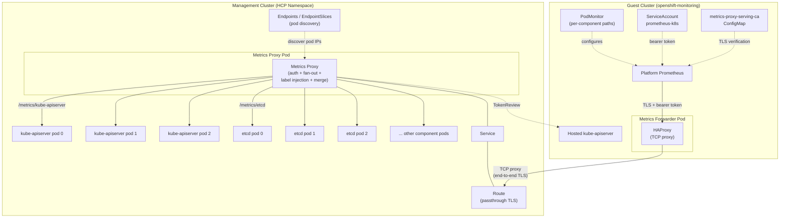

# Hosted Control Plane Metrics Exposure to Data Plane

## Summary

This enhancement proposes exposing hosted control plane metrics to the data plane
(guest cluster) in HyperShift. A new metrics proxy deployment in the control plane
namespace discovers all pods for each control plane component, scrapes them in
parallel, injects a `source_pod` label for pod-level attribution, and serves the
merged metrics via a route. The guest cluster's platform Prometheus scrapes these
metrics through a metrics forwarder pod and PodMonitor, making control plane
metrics visible in the guest cluster's monitoring stack.

## Glossary

- **Management cluster** - The OpenShift cluster that hosts the control planes for
  one or more guest clusters.
- **Control plane namespace (HCP namespace)** - The namespace on the management
  cluster where a hosted control plane's components run.
- **Data plane (guest cluster)** - The OpenShift cluster whose workloads run on
  worker nodes, with its control plane hosted on the management cluster.
- **CMO** - Cluster Monitoring Operator. Deploys and manages the platform monitoring
  stack on an OpenShift cluster.
- **Platform Prometheus** - The Prometheus instance deployed by CMO that scrapes
  platform metrics.
- **HCP** - HostedControlPlane. The custom resource representing a hosted control
  plane on the management cluster.
- **Metrics proxy** - The new component proposed in this enhancement. A custom
  Go binary that authenticates requests via TokenReview, discovers pod endpoints
  for each control plane component, fans out scrape requests to all pods,
  injects a `source_pod` label into each metric, and serves the merged response.

## Motivation

In a HyperShift deployment, control plane components (kube-apiserver,
kube-controller-manager, etcd, etc.) run on the management cluster, separated from
the data plane by a network boundary. The data plane's platform Prometheus (managed
by CMO) can only scrape endpoints on the guest cluster's service network. This means
control plane metrics are invisible to the guest cluster's monitoring stack.

This means guest cluster administrators cannot view control plane component
metrics (e.g. API server request latencies, etcd health, controller manager
queue depths) through the guest cluster's monitoring UI (OpenShift Console,
Prometheus queries). This limits their ability to diagnose performance issues
and understand cluster health.

The existing [monitoring enhancement](/enhancements/hypershift/monitoring.md) solved
metrics collection on the management cluster side (for SRE and service provider use
cases) but explicitly left guest cluster access to control plane metrics unaddressed.
This enhancement closes that gap.

### User Stories

- As a **hosted cluster user**, I expect the same monitoring experience as a
  standalone OpenShift cluster. Control plane metrics (API server latency, etcd
  health, controller queue depths) should be visible in the OpenShift Console
  monitoring UI and queryable via PromQL without any additional setup, regardless
  of whether my cluster is self-managed or hosted.

- As a **hosted cluster user**, I want to define PrometheusRule alerts on
  control plane metrics (e.g. high API server error rate, etcd leader changes)
  the same way I would on a standalone cluster, so that my existing alerting
  workflows work without modification.

- As an **SRE**, I want a single mechanism for exposing control plane metrics to
  the data plane that works across all HyperShift deployment models (self-managed
  and managed service), so that the monitoring architecture is consistent and
  requires no per-cluster manual configuration.

- As a **service provider**, I want the monitoring parity to be automatic and
  transparent to cluster users, so that hosted clusters are indistinguishable
  from standalone clusters in terms of monitoring capabilities.

### Goals

- Expose all control plane component metrics to the guest cluster's platform
  Prometheus.
- Use a single aggregating proxy to avoid exposing multiple endpoints to the
  data plane.
- Inject labels that match standalone OCP conventions so that existing OpenShift
  Console dashboards and alerting rules work without modification.
- Automatically create the metrics forwarder and PodMonitor on the guest cluster
  so that CMO's Prometheus can scrape the exposed metrics without manual
  configuration.
- Authenticate requests from the data plane to the metrics endpoint using
  ServiceAccount tokens validated via TokenReview.
- Follow existing HyperShift patterns for route exposure (similar to ignition
  server, konnectivity server, and OAuth server).

### Non-Goals

- Replacing or modifying the existing management cluster-side monitoring
  described in the [monitoring enhancement](/enhancements/hypershift/monitoring.md).
- Providing long-term metrics storage on the control plane side. The proxy does
  not store metrics; it proxies requests to upstream endpoints in real time.
- Defining a new set of metrics to expose. The proxy reuses the existing
  MetricsSet-based filtering already applied by management-side
  ServiceMonitors, using the allow-list corresponding to the configured
  MetricsSet (`All`, `SRE`, or `Telemetry`). The default is `All`, which
  matches the metrics produced in a self-managed cluster.
- Exposing metrics from the HyperShift Operator itself (these are management
  cluster metrics, not per-hosted-cluster metrics).
- Implementing metrics for data plane components (worker node metrics, kubelet
  metrics, etc.), which are already handled by CMO on the guest cluster.

## Proposal

### Architecture Overview

The solution introduces a new **metrics proxy** deployment in each hosted control
plane namespace on the management cluster. The metrics proxy is a custom Go
binary that handles authentication, pod endpoint discovery, metrics fan-out,
label injection, and response merging in a single process. For each control
plane component, it discovers all backing pods, scrapes them in parallel,
injects a `source_pod` label into every metric to identify the originating pod,
and serves the merged response. A route exposes the proxy to the data plane. On
the guest cluster side, a metrics forwarder pod and PodMonitor are automatically
created to enable the platform Prometheus to scrape the metrics route.



### Components

#### 1. Metrics Proxy Deployment

A new Deployment in the HCP namespace runs a single-container pod with the
**metrics proxy**, a custom Go binary that handles authentication, endpoint
discovery, metrics fan-out, label injection, and response merging.

The metrics proxy exposes control plane metrics under component-specific paths:

| Path | Component | Pod discovery via | Injected labels |
|------|-----------|-------------------|-----------------|
| `/metrics/kube-apiserver` | kube-apiserver | Endpoints for kube-apiserver service | `job="apiserver"`, `namespace="default"`, `service="kubernetes"`, `endpoint="https"` |
| `/metrics/kube-controller-manager` | kube-controller-manager | Endpoints for kube-controller-manager service | `job="kube-controller-manager"`, `namespace="openshift-kube-controller-manager"`, `service="kube-controller-manager"`, `endpoint="https"` |
| `/metrics/openshift-apiserver` | openshift-apiserver | Endpoints for openshift-apiserver service | `job="api"`, `namespace="openshift-apiserver"`, `service="api"`, `endpoint="https"` |
| `/metrics/openshift-controller-manager` | openshift-controller-manager | Endpoints for openshift-controller-manager service | `job="controller-manager"`, `namespace="openshift-controller-manager"`, `service="controller-manager"`, `endpoint="https"` |
| `/metrics/etcd` | etcd | Endpoints for etcd-client service | `job="etcd"`, `namespace="openshift-etcd"`, `service="etcd"`, `endpoint="etcd-metrics"` |
| `/metrics/cluster-version-operator` | cluster-version-operator | Endpoints for cluster-version-operator service | `job="cluster-version-operator"`, `namespace="openshift-cluster-version"`, `service="cluster-version-operator"`, `endpoint="metrics"` |
| `/metrics/olm-operator` | olm-operator | Endpoints for olm-operator-metrics service | `job="olm-operator-metrics"`, `namespace="openshift-operator-lifecycle-manager"`, `service="olm-operator-metrics"`, `endpoint="https-metrics"` |
| `/metrics/catalog-operator` | catalog-operator | Endpoints for catalog-operator-metrics service | `job="catalog-operator-metrics"`, `namespace="openshift-operator-lifecycle-manager"`, `service="catalog-operator-metrics"`, `endpoint="https-metrics"` |
| `/metrics/openshift-route-controller-manager` | openshift-route-controller-manager | Endpoints for openshift-route-controller-manager service | `job="route-controller-manager"`, `namespace="openshift-route-controller-manager"`, `service="route-controller-manager"`, `endpoint="https"` |
| `/metrics/cluster-node-tuning-operator` | cluster-node-tuning-operator | Endpoints for node-tuning-operator service | `job="node-tuning-operator"`, `namespace="openshift-cluster-node-tuning-operator"`, `service="node-tuning-operator"`, `endpoint="60000"` |

The table above lists the components present in a default hosted control plane.
This is not a fixed list -- the control-plane-operator dynamically discovers
the set of components to include by enumerating the ServiceMonitors and
PodMonitors in the HCP namespace. The injected label values (`job`,
`namespace`, `service`, `endpoint`) are specified as annotations on each
ServiceMonitor or PodMonitor (see
[Component Discovery](#component-discovery) for the annotation keys). When
optional features are enabled via day-2 operations (e.g. enabling `autonode`
or other optional components) and new ServiceMonitors or PodMonitors appear
in the HCP namespace with the appropriate annotations, the
control-plane-operator detects them during reconciliation and regenerates the
proxy ConfigMap to include the new component paths. See
[Component Discovery](#component-discovery) for details on how this works.

For each request, the metrics proxy:
1. Validates the bearer token via TokenReview against the hosted kube-apiserver.
   Rejects unauthenticated or unauthorized requests with 401/403.
2. Queries the Kubernetes Endpoints (or EndpointSlices) API to discover all
   pod IPs and names backing the component's service.
3. Sends parallel GET requests to each pod's metrics endpoint using the pod IP
   directly (bypassing the service ClusterIP to reach every pod).
4. Parses each response using the Prometheus `expfmt` library.
5. Injects labels into every metric sample to match what a standalone OCP
   cluster's Prometheus would produce for that component (e.g. `pod`, `job`,
   `namespace`, `service`, `endpoint`, `instance`). This ensures that existing
   OpenShift Console dashboards and alerting rules work without modification.
6. Filters metric families through a per-component allow-list before
   serializing the response (see [Metric Filtering](#metric-filtering) below).
7. Merges all labeled metric families and serializes the combined output.

The metrics proxy authenticates to upstream metrics endpoints using the same
method specified in each component's existing ServiceMonitor or PodMonitor in
the HCP namespace. The authentication method varies per component:

- **mTLS** (HTTPS with client certificate): Most ServiceMonitor-based
  components (kube-apiserver, kube-controller-manager, openshift-apiserver,
  openshift-controller-manager, olm-operator, catalog-operator,
  openshift-route-controller-manager, node-tuning-operator) use the
  `metrics-client` TLS secret for client certificate authentication.
- **Dedicated mTLS**: etcd uses a separate `etcd-metrics-client-tls` secret
  with etcd-specific client certificates and the `etcd-ca` CA.
- **Server-side TLS only** (HTTPS with CA verification, no client certificate):
  Some components (e.g. cluster-version-operator) expose HTTPS metrics
  endpoints that verify the server certificate but do not require a client
  certificate.
- **Plain HTTP**: Some PodMonitor-based components (e.g. cluster-autoscaler,
  ingress-operator) expose metrics over plain HTTP with no TLS.

The proxy configuration (generated by the control-plane-operator) includes
per-component upstream authentication details (scheme, CA, client certificate
references, and server name) derived from the component's ServiceMonitor or
PodMonitor spec.

The metrics proxy serves HTTPS using a serving certificate signed by the HCP's
certificate authority.

#### 2. Authentication and Authorization

Requests from the data plane Prometheus to the metrics proxy are authenticated
using **bearer token authentication** with a ServiceAccount token from the guest
cluster. Authentication is handled directly by the metrics proxy as the first
step of request processing.

The authentication flow:

1. The existing `prometheus-k8s` ServiceAccount in the guest cluster's
   `openshift-monitoring` namespace is used. This is the ServiceAccount that
   CMO's Prometheus already runs under, so no new ServiceAccount is needed.
2. The platform Prometheus is configured (via the PodMonitor's
   `bearerTokenFile` field, set to
   `/var/run/secrets/kubernetes.io/serviceaccount/token`) to attach this
   ServiceAccount's token to each scrape request to the metrics forwarder.
3. A request arrives at the metrics proxy. The proxy extracts the
   `Authorization: Bearer <token>` header.
4. The proxy performs a **TokenReview** against the hosted kube-apiserver to
   validate the token. Since the proxy runs in the HCP namespace on the
   management cluster, it has direct access to the hosted kube-apiserver via
   its in-cluster service address.
5. If the TokenReview confirms the token belongs to an authorized ServiceAccount
   (e.g. `system:serviceaccount:openshift-monitoring:prometheus-k8s`), the proxy
   proceeds with pod discovery, fan-out scraping, and response merging.
6. If the token is missing, invalid, or belongs to an unauthorized identity, the
   proxy returns a 401 or 403 response immediately.

This approach leverages the existing guest cluster identity infrastructure without
introducing new credential types. The TokenReview call is made against the
co-located kube-apiserver, so it does not cross network boundaries.

**TokenReview caching**: TokenReview is called on every scrape request. With
10 component paths at a 30-second scrape interval, this results in
approximately 20 TokenReview calls per minute per hosted cluster. Since the
`prometheus-k8s` ServiceAccount uses bound tokens with a known expiry
(typically 1 hour), the validation result can be safely cached. The metrics
proxy caches successful TokenReview results with a short TTL (5 minutes) keyed
by a hash of the bearer token. Cache entries are invalidated when the TTL
expires or the token changes. This reduces TokenReview calls from ~20/min to
roughly 1 every 5 minutes per unique token.

**KAS unavailability**: If the hosted kube-apiserver is unavailable and the
proxy cannot perform a TokenReview (and no valid cache entry exists), the proxy
returns HTTP 503 (Service Unavailable) with a `Retry-After` header. This
signals to Prometheus that the failure is transient and avoids blocking
indefinitely. The proxy's readiness probe also checks connectivity to the
hosted kube-apiserver, so prolonged KAS unavailability causes the proxy pod to
become not-ready, preventing the route from receiving traffic.

#### 3. Route

A new route `metrics-proxy` is created in the HCP namespace, following the same
pattern as existing HyperShift routes (ignition server, konnectivity server,
OAuth server):

- **TLS termination**: Passthrough. The metrics proxy handles TLS termination
  internally using its serving certificate.
- **Hostname**: Generated dynamically based on the `ServicePublishingStrategy`
  and HCP visibility (public/private), consistent with how other HyperShift
  routes are configured.
- **Labels**: Standard HyperShift route labels
  (`hypershift.openshift.io/hosted-control-plane: <namespace>`).

For private HyperShift clusters, the route uses the internal hostname pattern
(e.g. `metrics-proxy.apps.<hcp-name>.hypershift.local`) and is labeled as an
internal route.

**ServicePublishingStrategy integration**: Existing externally-exposed services
(APIServer, Konnectivity, OAuthServer, Ignition) are all configurable via
`ServicePublishingStrategy` in the HostedCluster spec. To maintain consistency,
the metrics proxy route follows the publishing strategy of the **Ignition**
service. The Ignition service is the closest analog because it is also a
non-API data-serving endpoint consumed by components on the data plane side.
The metrics proxy uses the same publishing type (Route, LoadBalancer, NodePort)
as the Ignition service and derives its hostname accordingly.

A new `MetricsProxy` entry in `ServiceType` is not proposed for the initial
implementation to avoid an API change. If managed service providers (ROSA, ARO)
require independent control over the metrics proxy publishing strategy (e.g.
exposing it via a different mechanism than Ignition), a new `ServiceType` can
be introduced in a follow-up enhancement. This is tracked as an open question
below.

**Platform-specific DNS and network considerations**: The metrics proxy route
hostname must be resolvable and reachable from the guest cluster's data plane
network. This has different implications depending on the platform:

- **AWS (ROSA)**: For private hosted clusters, the metrics proxy route is
  exposed to the data plane transparently via PrivateLink, following the same
  pattern used for the API server and other HCP services. No additional DNS
  configuration is required beyond what the existing HyperShift AWS
  infrastructure provides.
- **Azure (ARO)**: The cluster service must ensure the metrics proxy route
  hostname is resolvable from the data plane. The metrics proxy pod in the
  HCP namespace must be exposed to the data plane network (e.g. via the
  existing Swift/networking infrastructure used for other HCP services). DNS
  records for the route must be created in the appropriate zone.
- **Self-managed / on-premise**: The management cluster's ingress router must
  be reachable from the data plane network. For private clusters using
  internal routes, the internal DNS zone must include a record for the
  metrics proxy route hostname.

These are the same DNS and connectivity requirements that apply to other
HyperShift routes (API server, OAuth server, Ignition server). The metrics
proxy does not introduce any new networking patterns -- it follows the
existing route exposure infrastructure for the platform.

#### 4. Guest Cluster Metrics Forwarder and PodMonitor

Since the metrics proxy is exposed via a route (external hostname), it cannot
be targeted directly by a ServiceMonitor or PodMonitor inside the guest cluster.
The OpenShift router requires the hostname for SNI-based routing, so resolving
the route to an IP address for use in an Endpoints object is not viable.
Additionally, the ScrapeConfig CRD (which supports static hostname targets) is
not available in OCP.

To bridge this gap, the **hosted-cluster-config-operator** (HCCO) deploys a
simple **metrics forwarder** pod in the guest cluster's `openshift-monitoring`
namespace. This is a lightweight HAProxy instance running in **TCP proxy
mode** -- it does not terminate TLS. It simply accepts TCP connections and
forwards them to the metrics proxy route on the management cluster. The TLS
connection is end-to-end between Prometheus and the metrics proxy.

The HAProxy configuration is trivial -- a single TCP backend pointing at the
metrics proxy route hostname on port 443:

```
frontend metrics_proxy
    bind *:9443
    mode tcp
    default_backend metrics_proxy_backend

backend metrics_proxy_backend
    mode tcp
    server metrics-proxy <metrics-proxy-route-hostname>:443
```

Because HAProxy operates in TCP mode, the TLS ClientHello (including the SNI
hostname) passes through transparently. The OpenShift router on the
management cluster reads the SNI and routes the connection to the metrics
proxy pod, which terminates TLS. The forwarder requires no certificates --
it is opaque to the TLS protocol.

A **PodMonitor** targets the metrics forwarder pod directly (no Service
required), with one `podMetricsEndpoints` entry per control plane component
path. Each endpoint configures:

- `scheme: https` -- Prometheus initiates a TLS connection to the forwarder
  pod. Since the forwarder is a TCP proxy, this TLS connection passes
  through end-to-end to the metrics proxy, which terminates it.
- `tlsConfig.ca` -- references the `metrics-proxy-serving-ca` ConfigMap in
  the `openshift-monitoring` namespace (synced by the HCCO from the HCP's
  CA). This allows Prometheus to verify the metrics proxy's serving
  certificate. The CA is referenced by ConfigMap name (not by file path),
  since this is a custom CA not already mounted into the Prometheus pod.
  This follows the same pattern used by ServiceMonitors like
  `monitor-network` in `openshift-multus`, except those reference CAs
  already available to Prometheus via `caFile` paths.
- `tlsConfig.serverName` -- set to the metrics proxy route hostname. This
  is needed for both SNI routing (so the OpenShift router directs the
  connection to the correct backend) and certificate verification (so
  Prometheus checks the cert against the route hostname, not the forwarder
  pod IP).
- `bearerTokenFile` -- set to
  `/var/run/secrets/kubernetes.io/serviceaccount/token`, which is the
  `prometheus-k8s` ServiceAccount token already mounted into the Prometheus
  pod. This token is sent inside the TLS tunnel and forwarded transparently
  by the TCP proxy to the metrics proxy, which validates it via TokenReview.

```yaml
apiVersion: monitoring.coreos.com/v1
kind: PodMonitor
metadata:
  name: control-plane-metrics
  namespace: openshift-monitoring
spec:
  selector:
    matchLabels:
      app: control-plane-metrics-forwarder
  podMetricsEndpoints:
    - port: metrics
      path: /metrics/kube-apiserver
      scheme: https
      bearerTokenFile: /var/run/secrets/kubernetes.io/serviceaccount/token
      tlsConfig: &tlsConfig
        ca:
          configMap:
            name: metrics-proxy-serving-ca
            key: ca.crt
        serverName: <metrics-proxy-route-hostname>
      metricRelabelings: &relabeling
        # The metrics proxy injects labels like pod, namespace, job, service,
        # endpoint, instance into the metric samples to match standalone OCP
        # conventions. Prometheus prefixes these with "exported_" when they
        # conflict with target labels from the PodMonitor. The relabeling
        # below restores the proxy-injected values as the authoritative labels.
        - sourceLabels: [exported_pod]
          targetLabel: pod
          action: replace
        - sourceLabels: [exported_namespace]
          targetLabel: namespace
          action: replace
        - sourceLabels: [exported_instance]
          targetLabel: instance
          action: replace
        - sourceLabels: [exported_job]
          targetLabel: job
          action: replace
        - sourceLabels: [exported_service]
          targetLabel: service
          action: replace
        - sourceLabels: [exported_endpoint]
          targetLabel: endpoint
          action: replace
        - action: labeldrop
          regex: exported_(.+)
    - port: metrics
      path: /metrics/etcd
      scheme: https
      bearerTokenFile: /var/run/secrets/kubernetes.io/serviceaccount/token
      tlsConfig: *tlsConfig
      metricRelabelings: *relabeling
    - port: metrics
      path: /metrics/kube-controller-manager
      scheme: https
      bearerTokenFile: /var/run/secrets/kubernetes.io/serviceaccount/token
      tlsConfig: *tlsConfig
      metricRelabelings: *relabeling
    - port: metrics
      path: /metrics/openshift-apiserver
      scheme: https
      bearerTokenFile: /var/run/secrets/kubernetes.io/serviceaccount/token
      tlsConfig: *tlsConfig
      metricRelabelings: *relabeling
    - port: metrics
      path: /metrics/openshift-controller-manager
      scheme: https
      bearerTokenFile: /var/run/secrets/kubernetes.io/serviceaccount/token
      tlsConfig: *tlsConfig
      metricRelabelings: *relabeling
    - port: metrics
      path: /metrics/cluster-version-operator
      scheme: https
      bearerTokenFile: /var/run/secrets/kubernetes.io/serviceaccount/token
      tlsConfig: *tlsConfig
      metricRelabelings: *relabeling
    - port: metrics
      path: /metrics/olm-operator
      scheme: https
      bearerTokenFile: /var/run/secrets/kubernetes.io/serviceaccount/token
      tlsConfig: *tlsConfig
      metricRelabelings: *relabeling
    - port: metrics
      path: /metrics/catalog-operator
      scheme: https
      bearerTokenFile: /var/run/secrets/kubernetes.io/serviceaccount/token
      tlsConfig: *tlsConfig
      metricRelabelings: *relabeling
    - port: metrics
      path: /metrics/openshift-route-controller-manager
      scheme: https
      bearerTokenFile: /var/run/secrets/kubernetes.io/serviceaccount/token
      tlsConfig: *tlsConfig
      metricRelabelings: *relabeling
    - port: metrics
      path: /metrics/cluster-node-tuning-operator
      scheme: https
      bearerTokenFile: /var/run/secrets/kubernetes.io/serviceaccount/token
      tlsConfig: *tlsConfig
      metricRelabelings: *relabeling
```

The guest cluster's platform Prometheus discovers the PodMonitor and opens
a TLS connection to the forwarder pod for each scrape. The forwarder
TCP-proxies the connection to the metrics proxy route. The metrics proxy
terminates TLS, authenticates the bearer token via TokenReview, fans out to
the backing pods, injects `source_pod` labels, and returns the merged
response through the same connection.

The HCCO is responsible for creating the following resources in the guest
cluster's `openshift-monitoring` namespace:
- The metrics forwarder Deployment (single-replica HAProxy pod in TCP proxy
  mode). No certificates are mounted -- the forwarder is opaque to TLS.
- The HAProxy configuration as a ConfigMap, containing the metrics proxy route
  hostname as the TCP backend.
- A **`metrics-proxy-serving-ca` ConfigMap** containing the HCP's CA
  certificate. This is synced from the HCP namespace on the management
  cluster. Prometheus uses this CA (referenced by name in the PodMonitor's
  `tlsConfig.ca.configMap`) to verify the metrics proxy's serving
  certificate end-to-end through the TCP proxy.
- The PodMonitor targeting the forwarder pod, with `scheme: https`,
  `tlsConfig` referencing the CA ConfigMap by name and `serverName` set to
  the metrics proxy route hostname, and `bearerTokenFile` pointing to the
  `prometheus-k8s` ServiceAccount token.

#### 5. Control Plane Operator Changes

The **control-plane-operator** is responsible for reconciling the new resources
in the HCP namespace:

- Create the metrics proxy Deployment (see below for how the Deployment is
  constructed from ServiceMonitor/PodMonitor specs).
- Create the Service fronting the metrics proxy's port.
- Create the Route using the existing `util.ReconcileExternalRoute()` /
  `util.ReconcileInternalRoute()` helpers.
- Generate and manage the metrics proxy's serving certificate.
- Generate the proxy ConfigMap with per-component entries that include
  upstream connection details and file paths to mounted credentials (see
  below).
- Create an RBAC role and binding on the management cluster allowing the
  metrics proxy's ServiceAccount to read Endpoints/EndpointSlices in the
  HCP namespace for pod discovery.
- **Respect the `hypershift.openshift.io/disable-monitoring-services`
  annotation**: When this annotation is set on the HostedControlPlane, the
  control-plane-operator skips creation of the metrics proxy Deployment,
  Service, Route, and ConfigMap entirely. This annotation is already used by
  IBM Cloud to disable management-side ServiceMonitor/PodMonitor creation
  (via `component.DisableIfAnnotationExist()`), and the metrics proxy follows
  the same pattern. If monitoring services are disabled, there is no
  management-side monitoring infrastructure to mirror, so the metrics proxy
  is not deployed. The HCCO similarly skips creation of the guest cluster
  metrics forwarder and PodMonitor when this annotation is present.

##### Building the Metrics Proxy Deployment

The control-plane-operator constructs the metrics proxy Deployment by
inspecting the `tlsConfig` (and `scheme`) of each annotated ServiceMonitor
and PodMonitor endpoint. The process has two phases: collecting volume
mounts and generating the proxy ConfigMap.

**Phase 1: Collecting volumes and volume mounts**

The control-plane-operator iterates over each annotated ServiceMonitor and
PodMonitor endpoint and inspects its `tlsConfig` field. Each `tlsConfig`
may reference Secrets (for client certificates and keys) and ConfigMaps
(for CA bundles). The control-plane-operator collects all unique Secret and
ConfigMap references and adds them as volumes on the metrics proxy
Deployment. Each volume is mounted at a deterministic path under
`/etc/metrics-proxy/`:

- **CA ConfigMaps** are mounted at `/etc/metrics-proxy/ca/<configmap-name>/`.
  For example, the `root-ca` ConfigMap is mounted at
  `/etc/metrics-proxy/ca/root-ca/`, making the CA bundle available at
  `/etc/metrics-proxy/ca/root-ca/ca.crt`.
- **Client certificate Secrets** are mounted at
  `/etc/metrics-proxy/tls/<secret-name>/`. For example, the `metrics-client`
  Secret is mounted at `/etc/metrics-proxy/tls/metrics-client/`, making the
  certificate and key available at
  `/etc/metrics-proxy/tls/metrics-client/tls.crt` and
  `/etc/metrics-proxy/tls/metrics-client/tls.key`.

Because many components share the same Secrets and ConfigMaps (e.g. most
ServiceMonitors reference `root-ca` and `metrics-client`), the
control-plane-operator deduplicates volume references. A given Secret or
ConfigMap is mounted only once, regardless of how many ServiceMonitors
reference it.

For a typical hosted control plane, the resulting volumes are:

| Volume type | Name | Mount path | Referenced by |
|-------------|------|------------|---------------|
| ConfigMap | `root-ca` | `/etc/metrics-proxy/ca/root-ca/` | kube-apiserver, kube-controller-manager, openshift-apiserver, openshift-controller-manager, CVO, olm-operator, catalog-operator, route-controller-manager, node-tuning-operator, cluster-image-registry-operator |
| ConfigMap | `etcd-ca` | `/etc/metrics-proxy/ca/etcd-ca/` | etcd |
| Secret | `metrics-client` | `/etc/metrics-proxy/tls/metrics-client/` | kube-apiserver, kube-controller-manager, openshift-apiserver, openshift-controller-manager, olm-operator, catalog-operator, route-controller-manager, node-tuning-operator |
| Secret | `etcd-metrics-client-tls` | `/etc/metrics-proxy/tls/etcd-metrics-client-tls/` | etcd |

Components that use plain HTTP (e.g. cluster-autoscaler, ingress-operator)
have no `tlsConfig` and contribute no volumes.

**Phase 2: Generating the proxy ConfigMap**

The control-plane-operator generates the proxy ConfigMap with one entry per
component. Each entry includes the upstream connection details extracted from
the ServiceMonitor/PodMonitor spec, with Secret and ConfigMap references
translated to the corresponding file paths inside the container. For
example:

```yaml
components:
  etcd:
    service: etcd-client
    port: metrics
    scheme: https
    tlsConfig:
      caFile: /etc/metrics-proxy/ca/etcd-ca/ca.crt
      certFile: /etc/metrics-proxy/tls/etcd-metrics-client-tls/etcd-client.crt
      keyFile: /etc/metrics-proxy/tls/etcd-metrics-client-tls/etcd-client.key
      serverName: etcd-client
    labels:
      job: etcd
      namespace: openshift-etcd
      service: etcd
      endpoint: etcd-metrics

  kube-apiserver:
    service: kube-apiserver
    port: client
    scheme: https
    tlsConfig:
      caFile: /etc/metrics-proxy/ca/root-ca/ca.crt
      certFile: /etc/metrics-proxy/tls/metrics-client/tls.crt
      keyFile: /etc/metrics-proxy/tls/metrics-client/tls.key
      serverName: kube-apiserver
    labels:
      job: apiserver
      namespace: default
      service: kubernetes
      endpoint: https

  cluster-version-operator:
    service: cluster-version-operator
    port: https
    scheme: https
    tlsConfig:
      caFile: /etc/metrics-proxy/ca/root-ca/ca.crt
      serverName: cluster-version-operator
      # No certFile/keyFile -- server-side TLS only
    labels:
      job: cluster-version-operator
      namespace: openshift-cluster-version
      service: cluster-version-operator
      endpoint: metrics

  cluster-autoscaler:
    service: cluster-autoscaler
    port: metrics
    scheme: http
    # No tlsConfig -- plain HTTP
    labels:
      job: cluster-autoscaler
      namespace: openshift-machine-api
      service: cluster-autoscaler
      endpoint: metrics
```

The `labels` values come from the `hypershift.openshift.io/metrics-*`
annotations on the ServiceMonitor or PodMonitor. The `tlsConfig` fields
(`caFile`, `certFile`, `keyFile`, `serverName`) are derived by mapping each
Secret/ConfigMap reference in the ServiceMonitor/PodMonitor's `tlsConfig`
to its mount path under `/etc/metrics-proxy/`. When `certFile` and `keyFile`
are absent (as for cluster-version-operator), the proxy connects with
server-side TLS verification only. When the entire `tlsConfig` is absent
and `scheme` is `http`, the proxy connects over plain HTTP.

At runtime, the metrics proxy reads this ConfigMap and uses the file paths
to load the appropriate certificates for each component's upstream
connection.

### Workflow Description

**Cluster lifecycle automation** (HyperShift Operator + Control Plane Operator +
Hosted Cluster Config Operator) performs all setup automatically. No manual
action is required from any user.

1. A HostedCluster is created (or upgraded to a version that includes this
   feature).
2. The control-plane-operator reconciles the HCP and creates the metrics proxy
   Deployment, Service, and Route in the HCP namespace.
3. The control-plane-operator generates the proxy configuration with the
   component-to-service mapping for all control plane components.
4. The metrics proxy is configured to authorize the existing `prometheus-k8s`
   ServiceAccount from the guest cluster's `openshift-monitoring` namespace.
5. The hosted-cluster-config-operator deploys the metrics forwarder pod
   (HAProxy) in the guest cluster's `openshift-monitoring` namespace,
   configured to forward requests to the metrics proxy route hostname.
6. The hosted-cluster-config-operator creates a PodMonitor in the guest
   cluster targeting the forwarder pod, with one endpoint entry per control
   plane component path.
7. The guest cluster's platform Prometheus discovers the PodMonitor and begins
   scraping the forwarder pod on each component path.
8. For each scrape, the forwarder TCP-proxies the connection to the metrics
   proxy route. The metrics proxy terminates TLS, authenticates the request,
   fans out to all pods for the component, injects `source_pod` labels, and
   returns the merged response.
9. Control plane metrics become available in the guest cluster's Prometheus and
   are visible in the OpenShift Console monitoring UI.

### API Extensions

No new CRDs or API extensions are introduced. The feature uses existing
Kubernetes and OpenShift resource types (Deployment, Service, Route, ConfigMap,
Secret, PodMonitor).

A future iteration may add a field to the HostedCluster or HostedControlPlane
API to allow disabling this feature, but that is not part of the initial
implementation.

### Topology Considerations

#### Hypershift / Hosted Control Planes

This enhancement is exclusively for the HyperShift topology. It addresses the
fundamental architectural split between the control plane (on the management
cluster) and the data plane (guest cluster) that is unique to HyperShift.

The metrics proxy runs in the HCP namespace on the management cluster alongside
the other control plane components. It adds one additional pod per hosted
cluster on the management cluster, plus one lightweight forwarder pod per
guest cluster. Resource consumption is minimal since neither component stores
metrics -- the proxy fans out and merges on demand, and the forwarder simply
proxies TCP connections.

#### Standalone Clusters

Not applicable. In standalone clusters, control plane components run on the same
cluster as the data plane, and CMO already scrapes them directly.

#### Single-node Deployments or MicroShift

Not applicable. This enhancement is specific to the HyperShift topology.

#### OpenShift Kubernetes Engine

This enhancement does not depend on features excluded from OKE. The monitoring
components (Prometheus, ServiceMonitors) are part of the base platform available
in both OCP and OKE.

### Implementation Details/Notes/Constraints

#### Metrics Proxy Binary

The metrics proxy is a single Go binary that handles the full request lifecycle:

1. **TLS termination**: Serves HTTPS using its serving certificate.
2. **Authentication**: Extracts the bearer token, performs a TokenReview against
   the hosted kube-apiserver, and verifies the identity matches an authorized
   ServiceAccount. Rejects unauthorized requests with 401/403.
3. **Pod discovery**: Maps the URL path to a control plane component and queries
   the Kubernetes Endpoints or EndpointSlices API to discover all pod IPs and
   names backing that component's service.
4. **Fan-out scraping**: Sends parallel GET requests to each discovered pod's
   metrics endpoint using the pod IP directly (bypassing the service ClusterIP).
   Uses the authentication method specified in the component's ServiceMonitor
   or PodMonitor (mTLS with client certificates, server-side TLS only, or
   plain HTTP).
5. **Label injection**: Parses each pod's metrics response using the Prometheus
   `expfmt` library (`github.com/prometheus/common/expfmt`) and injects labels
   into every metric sample to match what a standalone OCP cluster's Prometheus
   would produce for that component. The injected labels are `pod`, `job`,
   `namespace`, `service`, `endpoint`, and `instance`. The specific values for
   `job`, `namespace`, `service`, and `endpoint` are read from annotations on
   the component's ServiceMonitor or PodMonitor (see
   [Component Discovery](#component-discovery) for the annotation keys and
   the table in [Metrics Proxy Deployment](#1-metrics-proxy-deployment) for
   the complete mapping).
6. **Merge and response**: Combines all labeled metric families from all pods
   into a single response and serializes it back to Prometheus exposition format.

Configuration (hosted kube-apiserver endpoint, authorized ServiceAccounts,
component-to-service mapping, port details) is provided as a ConfigMap generated
by the control-plane-operator.

#### Pod Discovery and Label Injection

The metrics proxy uses the Kubernetes API to discover pod endpoints dynamically.
This is necessary because most control plane components are deployed as
Deployments, meaning pod names and IPs are not stable across restarts.

For a request to `/metrics/etcd`, the proxy:

1. Looks up the Endpoints resource for the `etcd-client` service in the HCP
   namespace.
2. Finds 3 pod endpoints: `etcd-0` (10.0.1.5), `etcd-1` (10.0.1.6),
   `etcd-2` (10.0.1.7).
3. Sends `GET https://10.0.1.5:9979/metrics`, `GET https://10.0.1.6:9979/metrics`,
   `GET https://10.0.1.7:9979/metrics` in parallel.
4. Parses each response. A metric line like:
   ```
   etcd_server_leader_changes_seen_total 3
   ```
   becomes (for the response from pod `etcd-0` at `10.0.1.5`):
   ```
   etcd_server_leader_changes_seen_total{pod="etcd-0",namespace="openshift-etcd",job="etcd",service="etcd",endpoint="etcd-metrics",instance="10.0.1.5:9979"} 3
   ```
5. Merges all three responses and returns the combined output.

The injected labels are chosen to match what Prometheus would produce when
scraping the same component in a standalone OCP cluster. The values for
`job`, `namespace`, `service`, and `endpoint` are read from annotations on
each component's ServiceMonitor or PodMonitor in the HCP namespace (see
[Component Discovery](#component-discovery) for the annotation keys). The
following table shows the complete label mapping for each component:

| Component | `job` | `namespace` | `service` | `endpoint` |
|-----------|-------|-------------|-----------|------------|
| kube-apiserver | `apiserver` | `default` | `kubernetes` | `https` |
| kube-controller-manager | `kube-controller-manager` | `openshift-kube-controller-manager` | `kube-controller-manager` | `https` |
| etcd | `etcd` | `openshift-etcd` | `etcd` | `etcd-metrics` |
| openshift-apiserver | `api` | `openshift-apiserver` | `api` | `https` |
| openshift-controller-manager | `controller-manager` | `openshift-controller-manager` | `controller-manager` | `https` |
| cluster-version-operator | `cluster-version-operator` | `openshift-cluster-version` | `cluster-version-operator` | `metrics` |
| olm-operator | `olm-operator-metrics` | `openshift-operator-lifecycle-manager` | `olm-operator-metrics` | `https-metrics` |
| catalog-operator | `catalog-operator-metrics` | `openshift-operator-lifecycle-manager` | `catalog-operator-metrics` | `https-metrics` |
| openshift-route-controller-manager | `route-controller-manager` | `openshift-route-controller-manager` | `route-controller-manager` | `https` |
| cluster-node-tuning-operator | `node-tuning-operator` | `openshift-cluster-node-tuning-operator` | `node-tuning-operator` | `60000` |

The `pod` label is set to the actual pod name (e.g. `etcd-0`) and `instance`
is set to `<pod_ip>:<target_port>` (e.g. `10.0.1.5:9979`). These labels
ensure that existing OpenShift Console dashboards, alerting rules, and
recording rules that filter on labels like `job="etcd"` or
`namespace="openshift-etcd"` work without modification in hosted clusters.

Note that several annotation values differ from what one might expect based
on component names alone. These values are chosen to match the labels that
Prometheus produces in a standalone OCP cluster for the same component:
- **kube-apiserver** uses `job="apiserver"` (not `kube-apiserver`),
  `namespace="default"`, and `service="kubernetes"` because in standalone OCP
  the ServiceMonitor targets the `kubernetes` Service in the `default`
  namespace, whose `component=apiserver` label maps to the `job` label.
- **openshift-apiserver** uses `job="api"` and `service="api"` because the
  target Service is named `api` in the `openshift-apiserver` namespace.
- **openshift-controller-manager** uses `job="controller-manager"` and
  `service="controller-manager"` because the target Service is named
  `controller-manager`.
- **openshift-route-controller-manager** uses `job="route-controller-manager"`
  and `service="route-controller-manager"`.
- **olm-operator** and **catalog-operator** use service names with a
  `-metrics` suffix (`olm-operator-metrics`, `catalog-operator-metrics`)
  because the ServiceMonitors target separate metrics services.

#### Relabeling on the Guest Cluster

Because the PodMonitor targets the metrics forwarder pod, Prometheus
automatically adds target labels (`pod`, `namespace`, `instance`, `job`, etc.)
that describe the forwarder, not the control plane components. These target
labels would conflict with the labels injected by the metrics proxy.

The PodMonitor uses `metricRelabelings` to resolve this. Prometheus prefixes
conflicting metric labels with `exported_` (e.g. the proxy-injected `pod`
becomes `exported_pod` while the target's `pod` label takes precedence). The
relabeling configuration restores the proxy-injected values as the authoritative
labels and drops the forwarder's target labels:

```yaml
metricRelabelings:
  # Restore proxy-injected labels as authoritative
  - sourceLabels: [exported_pod]
    targetLabel: pod
    action: replace
  - sourceLabels: [exported_namespace]
    targetLabel: namespace
    action: replace
  - sourceLabels: [exported_instance]
    targetLabel: instance
    action: replace
  - sourceLabels: [exported_job]
    targetLabel: job
    action: replace
  - sourceLabels: [exported_service]
    targetLabel: service
    action: replace
  - sourceLabels: [exported_endpoint]
    targetLabel: endpoint
    action: replace
  # Drop all remaining exported_ prefixed labels
  - action: labeldrop
    regex: exported_(.+)
```

These relabelings ensure that labels like `job="etcd"`,
`namespace="openshift-etcd"`, and `service="etcd"` (as injected by the
metrics proxy) take precedence over the target labels that describe the
forwarder pod itself (e.g. `namespace="openshift-monitoring"`,
`pod="control-plane-metrics-forwarder-..."`). The same relabeling
configuration is applied to all `podMetricsEndpoints` entries in the
PodMonitor.

#### Error Handling for Pod Scraping

If one or more pods fail to respond (e.g. a pod is restarting), the aggregator:
- Returns metrics from the pods that did respond successfully.
- Includes a synthetic metric (e.g. `metrics_aggregator_pod_scrape_errors_total`)
  indicating which pods failed.
- Does not fail the entire request due to a single pod failure.

#### Certificate Management

The following certificates are needed:

- **Serving certificate**: Used by the metrics proxy to serve HTTPS. Signed by
  the HCP's CA. The guest cluster's Prometheus must trust this CA.
- **Upstream authentication credentials**: The metrics proxy reuses the
  existing Secrets and ConfigMaps already present in the HCP namespace for
  management-side monitoring. These are collected dynamically from the
  `tlsConfig` of each annotated ServiceMonitor/PodMonitor and mounted into
  the metrics proxy pod. The proxy ConfigMap references the mounted
  credentials by file path. See
  [Building the Metrics Proxy Deployment](#building-the-metrics-proxy-deployment)
  for the volume mount structure and ConfigMap format.

#### Metric Filtering

Exposing all metrics unfiltered has significant cardinality implications. For
example, kube-apiserver alone can return 500+ metric families with
high-cardinality labels (`verb`, `resource`, `code`), far exceeding what the
management-side ServiceMonitors collect after MetricsSet-based filtering.

To control cardinality and align with what standalone OCP exposes, the metrics
proxy applies a **per-component metric allow-list**. The allow-list is stored
in the proxy's ConfigMap and is generated by the control-plane-operator based on
the `MetricsSet` configured for the HostedControlPlane (one of `All`,
`SRE`, or `Telemetry`):

- **All** (default): No filtering; all metric families are passed through.
  This produces the same set of metrics that a self-managed (standalone) OCP
  cluster exposes, making existing dashboards, alerts, and recording rules
  work without modification. This is the appropriate default because the
  goal of this feature is parity with self-managed cluster monitoring.
- **SRE**: Includes Telemetry metrics plus additional metrics used by SRE
  dashboards and alerts.
- **Telemetry**: Only the metric families included in the Telemetry
  ServiceMonitors are allowed through the proxy. This is a deliberately
  minimal set designed for central collection (e.g. in a managed service's
  central Prometheus stack) and is not suitable as a default for data plane
  exposure, since it omits many metrics that cluster administrators rely on
  for operational visibility.

The control-plane-operator derives the allow-list for each component by
examining the `metricRelabelings` in the existing management-side
ServiceMonitor definitions (which already encode the MetricsSet-based
filtering). This ensures that the set of metrics exposed to the data plane
is consistent with what the management cluster collects.

For managed services (ROSA, ARO) that need tighter control over what customers
see, the `Telemetry` MetricsSet provides a minimal, well-defined set of
metrics. Service providers can also override the allow-list in the proxy
ConfigMap if platform-specific customization is required.

#### Scalability Considerations

- Each scrape request to the proxy triggers upstream requests to the individual
  control plane component. With multiple paths scraped at the default 30s
  interval, the proxy generates approximately 10 upstream requests per scrape
  cycle. This is negligible load compared to the existing ServiceMonitor-based
  scraping on the management cluster side.
- The proxy does not buffer or store metrics, so memory usage is proportional to
  the size of a single metrics response (typically a few hundred KB per
  component).
- For management clusters hosting many (hundreds of) hosted clusters, each
  cluster gets its own independent proxy, so there is no cross-cluster
  scalability concern.

#### Component Discovery

The proxy configuration is generated by the control-plane-operator at
reconciliation time by enumerating the **ServiceMonitors and PodMonitors**
that exist in the HCP namespace. This approach avoids maintaining a separate
hardcoded registry of components -- the ServiceMonitors and PodMonitors
already encode the complete set of metrics endpoint details (service or pod
selector, port, scheme, TLS configuration, and metric relabelings) for each
component.

Each ServiceMonitor or PodMonitor that should be exposed to the data plane
carries annotations specifying the label values that the metrics proxy should
inject into the scraped metrics. These annotations correspond to the labels
that Prometheus would produce when scraping the same component in a
standalone OCP cluster:

| Annotation | Description | Example (etcd) |
|------------|-------------|----------------|
| `hypershift.openshift.io/metrics-job` | Value for the `job` label | `etcd` |
| `hypershift.openshift.io/metrics-namespace` | Value for the `namespace` label | `openshift-etcd` |
| `hypershift.openshift.io/metrics-service` | Value for the `service` label | `etcd` |
| `hypershift.openshift.io/metrics-endpoint` | Value for the `endpoint` label | `etcd-metrics` |

ServiceMonitors or PodMonitors that do not carry these annotations are
ignored by the control-plane-operator and are not included in the proxy
configuration. This serves as the opt-in mechanism: system components
whose metrics are internal to the HyperShift infrastructure (e.g.
`controlplane-operator`, `hosted-cluster-config-operator`,
`ignition-server`) simply omit these annotations and are excluded
automatically.

During each reconciliation loop, the control-plane-operator:

1. Lists all ServiceMonitors and PodMonitors in the HCP namespace.
2. Filters to only those that carry the `hypershift.openshift.io/metrics-*`
   annotations. ServiceMonitors and PodMonitors without these annotations
   are skipped.
3. For each annotated ServiceMonitor or PodMonitor, extracts the upstream
   connection details (scheme, TLS config, target port, metrics path) from
   the spec, and reads the label values to inject (`job`, `namespace`,
   `service`, `endpoint`) from the annotations.
4. Generates the proxy ConfigMap with one entry per discovered component.

When the set of control plane components changes -- for example, when an
optional feature like `autonode` is enabled via a day-2 operation and a new
ServiceMonitor or PodMonitor appears in the HCP namespace with the
appropriate annotations -- the control-plane-operator detects the change
during its next reconciliation, regenerates the proxy ConfigMap to include
the new component's path and configuration, and rolls the proxy deployment
to pick up the updated configuration. The same applies when a component is
removed: its ServiceMonitor or PodMonitor is deleted, the entry is dropped
from the ConfigMap, and the proxy stops serving that path.

On the guest cluster side, the HCCO similarly reconciles the PodMonitor to
add or remove `podMetricsEndpoints` entries corresponding to the components
present in the proxy configuration. This ensures the guest cluster's
Prometheus automatically starts scraping new components and stops scraping
removed ones without manual intervention.

Because the ServiceMonitors and PodMonitors in the HCP namespace are the
complete source of truth (connection details from the spec, label values
from annotations), adding support for a new component requires only that
the component's operator creates a ServiceMonitor or PodMonitor in the HCP
namespace with the `hypershift.openshift.io/metrics-*` annotations. No code
change in the control-plane-operator is needed.

### Risks and Mitigations

**Risk**: Exposing control plane metrics over a route increases the attack
surface. An attacker who obtains a valid ServiceAccount token from the guest
cluster could scrape control plane metrics.

**Mitigation**: The bearer token is validated via TokenReview against the guest
cluster's API server, and only tokens from the `prometheus-k8s` ServiceAccount
(in `openshift-monitoring` namespace) are authorized. This ServiceAccount is
managed by CMO and not accessible to unprivileged guest cluster users. Additionally, the route uses passthrough TLS, so all traffic is
encrypted.

**Risk**: The proxy introduces a new component that could fail, making control
plane metrics unavailable to the guest cluster.

**Mitigation**: Control plane metrics are still independently collected on the
management cluster side via the existing ServiceMonitors/PodMonitors. The proxy
failure only affects guest cluster visibility. The proxy is stateless and can be
restarted without data loss. Standard Kubernetes health checks (liveness/readiness
probes) ensure automatic recovery.

**Risk**: Increased load on control plane metrics endpoints from dual scraping
(management cluster monitoring + data plane Prometheus via the proxy).

**Mitigation**: Most metrics endpoints are already scraped by management cluster
monitoring. Adding one more scraper (the data plane Prometheus, proxied) roughly
doubles the scrape load, but metrics endpoint scraping is lightweight. The 30s
default scrape interval keeps the additional load minimal.

### Drawbacks

- **Additional resource consumption**: One metrics proxy pod per hosted cluster
  on the management cluster, plus one forwarder pod per guest cluster. For
  deployments with hundreds of hosted clusters, this adds up, though both
  components are lightweight.
- **Operational complexity**: A new component to monitor, troubleshoot, and
  maintain. Proxy configuration must be kept in sync with the set of control
  plane components.
- **Dual scraping**: Control plane metrics are scraped twice (once by the
  management cluster monitoring stack, once by the data plane via the proxy).
  This is by design, since the two scraping paths serve different purposes, but
  it does increase the load on metrics endpoints.

## Alternatives (Not Implemented)

### Push gateway in the guest cluster

Deploy a Prometheus push gateway in the guest cluster and push metrics from the
control plane to it via the kube-apiserver proxy.

This was considered and rejected in the original
[monitoring enhancement](/enhancements/hypershift/monitoring.md) because:
- The push gateway is not designed for this use case (it is meant for short-lived
  jobs, not continuous metrics scraping).
- It requires adding a new image to the release payload.
- It creates a dependency on the data plane being healthy to receive metrics.

### Konnectivity tunnel

Use the existing konnectivity tunnel to reverse-proxy metrics from the control
plane to the data plane.

Rejected because:
- The konnectivity tunnel is designed for API server-to-node communication, not
  arbitrary service proxying.
- Adding metrics traffic to the konnectivity tunnel increases its load and
  complexity.
- The tunnel direction (management -> guest) does not naturally support the pull
  model of Prometheus scraping.

### Prometheus federation endpoint

Deploy a lightweight Prometheus instance in the control plane namespace that
scrapes all control plane metrics and exposes a `/federate` endpoint via route.

Rejected because:
- Requires running a full Prometheus instance (or agent) per hosted cluster,
  which is heavier than a simple reverse proxy.
- Introduces metrics storage in the control plane, even if short-lived, which
  is counter to the goal of keeping the proxy stateless.
- A reverse proxy achieves the same result with less resource overhead.

### Simple reverse proxy (HAProxy/nginx)

Use a standard reverse proxy (HAProxy or nginx) that routes each path to the
component's service ClusterIP, rather than a custom binary that discovers and
scrapes individual pods.

Rejected because:
- A reverse proxy forwards each request to a single backend (via the service's
  load balancing). For multi-replica components (e.g. etcd with 3 pods,
  kube-apiserver in HA), each scrape would only hit one pod, and there would be
  no way to identify which pod's metrics were returned.
- Metrics from different pods of the same component would be indistinguishable,
  making it impossible to correlate metrics to specific pods for debugging.
- A custom proxy that discovers all pod endpoints, scrapes each one, and injects
  a `source_pod` label solves this problem at the cost of additional code.

### Single merged metrics endpoint

Merge all control plane component metrics into a single `/metrics` response
instead of using per-component paths.

Rejected because:
- Merging metrics from different sources can cause metric name collisions.
- A single large response is harder to debug than per-component responses.
- Per-component paths allow the data plane Prometheus to have independent scrape
  targets with separate error handling and timing.

### ServiceMonitor with Service/Endpoints targeting the route

Create a headless Service (no selector) and a manually managed Endpoints object
in the guest cluster, with the Endpoints containing the resolved IP of the
metrics proxy route. A ServiceMonitor would target this Service.

Rejected because:
- The Endpoints resource only accepts IP addresses, not hostnames.
- The OpenShift router uses SNI (for passthrough TLS routes) to determine which
  backend to route traffic to. Connecting directly to the router's IP without
  the proper hostname in the TLS SNI would cause the router to reject or
  misroute the request.
- Even if SNI were handled (e.g. via `serverName` in the ServiceMonitor's TLS
  config), the router IP can change, requiring continuous reconciliation of the
  Endpoints object.

### ScrapeConfig CRD for static targets

Use the prometheus-operator `ScrapeConfig` CRD, which supports static hostname
targets directly without needing a Service or Endpoints object.

Rejected because:
- The ScrapeConfig CRD is not available in OCP. CMO does not ship a version of
  prometheus-operator that includes this CRD.

### Guest cluster ServiceAccount token with static validation

Use a shared secret or static token instead of ServiceAccount token + TokenReview.

Rejected because:
- Static tokens do not expire and are harder to rotate.
- ServiceAccount tokens integrate with the existing Kubernetes identity system.
- TokenReview provides standard Kubernetes authentication with audit trail.

## Open Questions

1. Should the feature be gated behind a feature flag or HostedCluster API field
   in the initial implementation, or should it be enabled unconditionally?

2. What is the exact set of control plane components to include? The list in
   this enhancement covers the current set of components that have
   ServiceMonitors/PodMonitors, but some components (e.g. control-plane-operator
   itself, ignition-server) may not need their metrics exposed to the data plane.

3. Should the metrics proxy have its own `ServiceType` entry (e.g.
   `MetricsProxy`) in the `ServicePublishingStrategy`, or is following the
   Ignition service's publishing strategy sufficient? Managed service providers
   may have platform-specific requirements for how the metrics route is
   exposed.

## Test Plan

- **Unit tests**: Verify proxy configuration generation for various HCP
  configurations (different sets of control plane components). Verify label
  injection logic with `expfmt` parsing for various metric types (counters,
  gauges, histograms, summaries).
- **Integration tests**: Verify that the control-plane-operator creates the
  proxy Deployment, Service, Route, and ConfigMap correctly. Verify that HCCO
  creates the forwarder pod and PodMonitor on the guest
  cluster.
- **E2E tests**: Deploy a HostedCluster and verify that:
  - The metrics proxy pod is running and healthy on the management cluster.
  - The metrics forwarder pod is running and healthy on the guest cluster.
  - The metrics route is accessible.
  - The guest cluster's Prometheus is scraping control plane metrics via the
    PodMonitor.
  - Control plane metrics (e.g. `apiserver_request_total`,
    `etcd_server_leader_changes_seen_total`) are queryable from the guest
    cluster's Prometheus.
  - Metrics contain `source_pod` labels identifying the originating pod.
  - Metrics appear in the guest cluster's OpenShift Console monitoring UI.
- **Authentication tests**: Verify that unauthenticated requests and requests
  with invalid tokens are rejected by the metrics proxy. Verify that only the
  designated ServiceAccount token is accepted.

## Graduation Criteria

### Dev Preview -> Tech Preview

- Metrics proxy deployed and functional for all control plane components.
- Metrics forwarder and PodMonitor auto-created on guest cluster.
- Bearer token authentication working via TokenReview.
- Basic e2e test coverage.
- Documentation for the feature and its architecture.

### Tech Preview -> GA

- Load testing with many hosted clusters to validate resource impact.
- Upgrade/downgrade testing.
- Validation across all supported platforms (AWS, Azure, GCP, etc.).
- Support procedures documented.
- Alerting for proxy health issues.

### Removing a deprecated feature

N/A. This is a new feature.

## Upgrade / Downgrade Strategy

**Upgrade**: When a HostedCluster is upgraded to a version that includes this
feature, the control-plane-operator creates the new metrics proxy resources
during reconciliation. The HCCO creates the guest cluster resources (forwarder
pod, PodMonitor). No manual action is required. Existing
monitoring on the management cluster side is unaffected.

**Downgrade**: When a HostedCluster is downgraded to a version without this
feature, the control-plane-operator removes the metrics proxy Deployment,
Service, Route, and ConfigMap. The HCCO removes the forwarder pod, PodMonitor,
from the guest cluster. The guest cluster's Prometheus stops
scraping control plane metrics. Management cluster monitoring continues to
function normally.

## Version Skew Strategy

The metrics proxy is tightly coupled to the control plane version since its
configuration is generated by the control-plane-operator based on the set of
deployed components. There is no version skew concern between the proxy and the
control plane because they are reconciled together.

During upgrades, there may be a brief period where the proxy configuration
reflects the old set of components while new components are being rolled out (or
vice versa). This results in temporary 502 errors for paths that reference
not-yet-available or already-removed components, which is acceptable since
Prometheus handles transient scrape failures gracefully.

## Operational Aspects of API Extensions

N/A. No API extensions are introduced.

## Support Procedures

- **Detecting issues**: If the metrics proxy is unhealthy, the proxy pod will
  show as not ready. The guest cluster's Prometheus will report scrape failures
  as `up == 0` for the corresponding targets. Alerts can be configured on the
  guest cluster side to detect when control plane metrics become unavailable.

- **Diagnosing issues**:
  - Check the metrics proxy pod logs in the HCP namespace for errors.
  - Check the metrics forwarder pod logs in the guest cluster for errors.
  - Check readiness/liveness probe status for both pods.
  - Verify the route is accessible from the guest cluster:
    `curl -k https://<metrics-proxy-route>/metrics/kube-apiserver`.
  - Verify the forwarder can reach the route: check HAProxy logs for
    connection errors.
  - Verify the ServiceAccount token is valid: check TokenReview responses in
    the kube-apiserver audit logs.
  - Verify the PodMonitor exists on the guest cluster:
    `oc get podmonitors -n openshift-monitoring`.

- **Impact of failure**: If the metrics proxy fails, guest cluster users lose
  visibility into control plane metrics. Management cluster-side monitoring is
  completely unaffected. No data loss occurs since the proxy is stateless. The
  guest cluster itself continues to function normally; only monitoring visibility
  is degraded.

- **Recovery**: The proxy is a standard Kubernetes Deployment with health checks.
  Kubernetes will automatically restart failed pods. If the issue is
  configuration-related, the control-plane-operator will reconcile the
  configuration on its next loop.

## Implementation History

- 2026-02-16: Initial enhancement proposal.
