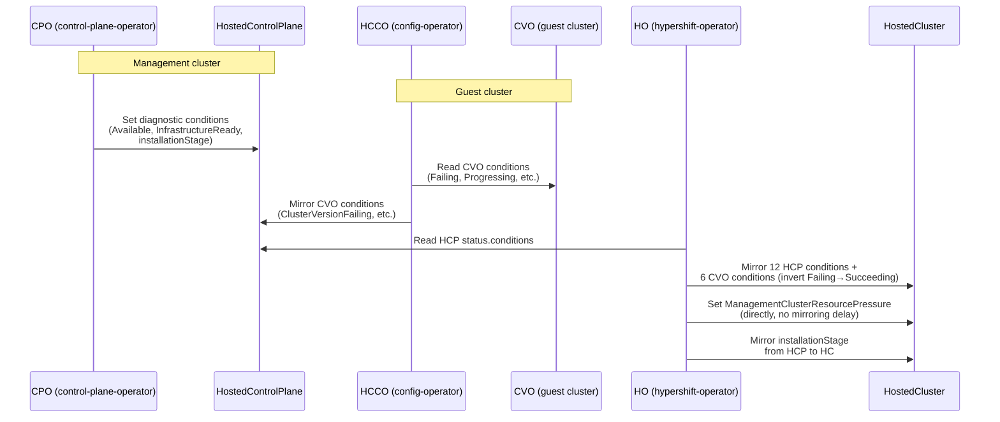
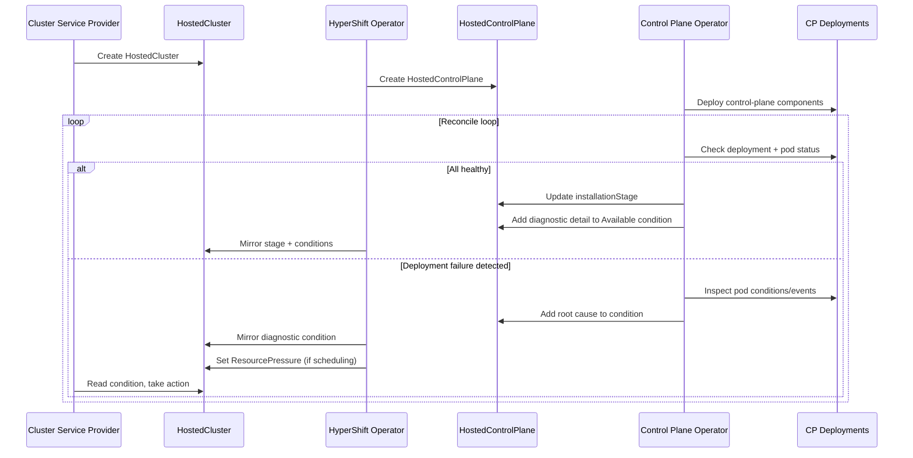

# Enhanced Debuggability for HyperShift Cluster Installation Failures

## Summary

This enhancement improves the debuggability of HyperShift
cluster installations by adding diagnostic detail to existing status conditions
with actionable messages and adding structured
progress tracking on `HostedCluster` resources when
installation is blocked or failing. Today, installation
failures produce opaque timeouts (e.g., `context deadline
exceeded` after 45 minutes) that require manual log
inspection across multiple components to diagnose. This
proposal adds diagnostic detail to existing condition messages including pod-level
failure reasons and component-specific detail, adds a
lightweight installation stage field, and introduces a
genuinely new condition for a gap not covered by the
existing condition surface — enabling cluster service
providers, SREs,
and administrators to quickly identify and resolve
installation blockages.

## Glossary

| Term | Definition |
|------|-----------|
| **HC** | `HostedCluster` — the user-facing CRD representing a hosted cluster |
| **HCP** | `HostedControlPlane` — the management-cluster CRD representing the control plane |
| **HO** | HyperShift Operator — reconciles `HostedCluster` resources, manages `HostedControlPlane` lifecycle |
| **CPO** | Control Plane Operator — reconciles `HostedControlPlane`, manages control-plane component deployments in the HCP namespace |
| **HCCO** | Hosted Cluster Config Operator — runs inside the guest cluster, mirrors CVO conditions back to HCP |
| **CPC** | `ControlPlaneComponent` — per-component CRD with `Available` and `RolloutComplete` conditions |
| **CVO** | ClusterVersion Operator — manages operator lifecycle in the guest cluster |

## Motivation

Current debugging of HyperShift clusters stuck during
installation is manual, time-consuming, and produces
uninformative errors. A cluster that fails to install
typically stalls with a generic `Available=False` condition
or an opaque timeout, requiring the operator to inspect
logs across the HyperShift operator, control plane operator,
hosted cluster config operator, and individual control-plane
component pods. This is particularly painful in managed
service environments (ROSA HCP, ARO HCP) where SREs handle
thousands of clusters and need automated, structured signals
to triage failures at scale.

The problem is compounded by the variety of root causes:
some failures are platform-agnostic (e.g., a control-plane
deployment with unavailable replicas), while others are
specific to the cloud provider (e.g., Azure Policy conflicts
blocking resource creation, or AWS IAM role assumption
failures). In all cases, the root cause is buried in logs
rather than surfaced on the API objects that operators and
automation tools consume.

### User Stories

* As a **cluster service provider** (ROSA/ARO), I want
  clear status conditions on `HostedCluster` indicating
  which specific stage of installation is blocked so that
  I can triage failures without manually inspecting logs
  across multiple components.

* As an **SRE**, I want fleet-wide metrics on installation
  failure categories so that I can identify systemic issues
  (e.g., management cluster capacity exhaustion affecting
  multiple clusters) and prioritize remediation.

* As a **self-managed HyperShift administrator**, I want
  the `HostedCluster` status to tell me why my cluster
  is not progressing so that I can take corrective action
  (e.g., increase management cluster capacity, fix DNS
  configuration) without deep HyperShift internals
  knowledge.

* As an **automated provisioning system**, I want
  machine-readable status conditions with structured
  failure reasons so that I can implement automated
  retry/escalation logic and surface actionable messages
  to end users.

* As a **platform operator**, I want Prometheus metrics
  tracking installation stage progression and failure
  counts by category so that I can build dashboards and
  alerts for installation health across my fleet.

### Goals

1. Add diagnostic detail to existing status conditions on `HostedCluster`
   with specific, actionable messages for the most common
   installation failure modes, replacing opaque timeouts
   with diagnostically useful detail (pod-level reasons,
   per-component failure information, operator-specific
   messages).

2. Provide structured installation progress tracking via
   a new status field that indicates the current stage of
   installation.

3. Add one genuinely new condition
   (`ManagementClusterResourcePressure`) for the
   diagnostic gap not covered by the existing condition
   surface: management cluster scheduling pressure
   affecting hosted cluster pods. A second condition
   (`PlatformInfrastructureReady`) is deferred to
   Phase 2 in a separate enhancement.

4. Expose Prometheus metrics for installation stage
   progression and failure reason counts to enable
   fleet-wide monitoring and alerting.

5. Cover platform-agnostic failures that benefit all
   HyperShift deployments in Phase 1. Defer
   platform-specific failures (AWS, Azure) to Phase 2
   in a separate enhancement.

### Non-Goals

1. Automatically remediating installation failures. This
   enhancement surfaces diagnostics; it does not implement
   auto-healing.

2. Debugging non-installation issues. Post-installation
   operational failures (day-2 operations, upgrade
   failures) are out of scope. **Exception**:
   `ManagementClusterResourcePressure` persists into
   day-2 as a continuous health signal. This is the only
   condition that crosses the day-1/day-2 boundary, for
   three reasons: (a) management cluster scheduling
   pressure affects running hosted clusters — not just
   new installations — so removing the signal after
   installation would create a monitoring blind spot;
   (b) the HO already watches pods in HCP namespaces
   for all clusters regardless of installation state, so
   the runtime cost of maintaining this condition is
   negligible; (c) the condition is level-driven and set
   to `False` when no pressure exists, so it adds no
   noise to day-2 operations.

3. Comprehensive coverage of all platform-specific failure
   modes. Platform-specific cases (ARO HCP Azure failures,
   ROSA HCP AWS failures) are deferred to a follow-up
   enhancement with dedicated CAPI provider team reviewers.
   See [Future Work](#future-work--phase-2) for the full
   list of deferred cases.

4. Integration with third-party monitoring tools beyond
   Prometheus metrics and Kubernetes-native status
   conditions.

5. Error categorization framework. The User Error vs.
   Internal Service Error distinction is a cross-cutting
   concern that affects all HyperShift conditions, not
   just installation-related ones. It deserves its own
   enhancement with input from SRE, support, and managed
   services teams. See
   [Future Work](#future-work--phase-2).

6. `NodePool` installation diagnostics. `NodePool` already
   has `AllMachinesReady` with CAPI Machine condition
   aggregation. NodePool-specific diagnostics will be
   addressed in a follow-up enhancement after the
   `HostedCluster` patterns are proven.

7. Detection of management cluster inode, file descriptor,
   and IP address exhaustion. Standard Kubernetes Node
   conditions do not expose inode or FD pressure. IP
   exhaustion is CNI-specific. Detecting these would
   require querying Prometheus or reading non-standard
   node metrics, adding a monitoring stack dependency
   that HyperShift does not currently have. The
   `ManagementClusterResourcePressure` condition covers
   pod scheduling failures, which is the most common
   symptom of resource exhaustion.

## Proposal

### Current State / Prior Art

HyperShift already has a substantial condition and metrics
surface. This enhancement builds on — rather than
duplicates — what exists today.

**Existing conditions (54 total: 51 typed + 3 untyped):**

The HyperShift API defines 54 condition type constants in
`api/hypershift/v1beta1/hostedcluster_conditions.go`
(51 typed `ConditionType` constants plus 3 untyped string
constants: `ClusterSizeComputed`,
`ClusterSizeTransitionPending`,
`ClusterSizeTransitionRequired`).
Key existing conditions relevant to installation include:

| Existing Condition | What It Surfaces Today | Gap This EP Fills |
|---|---|---|
| `Available` (on HCP) | Aggregated availability with reasons `KubeconfigWaitingForCreate`, `ComponentsNotAvailable`, etc. | **Message lacks detail**: `ComponentsNotAvailable` lists component names only (e.g., `"[etcd, kube-apiserver]"`), discarding the per-CPC reason and message. No pod-level failure reasons. |
| `KubeAPIServerAvailable` | KAS deployment readiness | No gap — already specific. |
| `InfrastructureReady` | LB Service status. Route readiness is inferred from LB availability rather than inspecting the actual Route resource's admission status (`infra.go:54-70`, `ingress/router.go:108-149`). | **Does not inspect actual Route admission**. Cannot explain *why* a route is not admitted (e.g., missing IngressController, domain mismatch). |
| `ClusterVersionSucceeding` | CVO progressing/failing (inverted from `ClusterVersionFailing`). The HCCO copies the CVO `Failing` condition's `Reason` and `Message` verbatim; the HO inverts the status but passes through reason/message unchanged. | **Raw CVO message passthrough**: the message is whatever the CVO produces, which is not a stable API. No structured per-operator detail. |
| `ClusterVersionAvailable` | CVO availability | No gap — already specific. |
| `PlatformCredentialsFound` | Credential secret existence | No gap — already specific. |

**Existing per-component tracking:**

`ControlPlaneComponent` (CPC) resources have `Available` and
`RolloutComplete` conditions
(`controlplanecomponent_types.go:19-22`). The CPO function
`controlPlaneComponentsAvailable()` aggregates these into the
HCP `Available` condition, but **discards all per-component
reason and message detail** — returning only a list of
unavailable component names
(`hostedcontrolplane_controller.go:1142-1147`).
No CPC CRD schema changes are needed for this enhancement
— only CPO controller logic is modified. CPC resources
live in the HCP namespace (not visible to customers in
managed services) and are consumed only by the CPO
internally. External fleet management tools (ROSA/ARO
SRE, ACM) do not watch CPC-level conditions, so CPC
reason code changes do not require separate SRE
confirmation.

**Existing metrics (25+):**

`metrics/metrics.go` defines 25+ Prometheus metrics including:
- `hypershift_hostedclusters_failure_conditions` — counts
  *which* condition failed
- `hypershift_cluster_waiting_initial_availability_duration_seconds`
  — time until first availability
- `hypershift_hosted_cluster_transition_seconds` — time per
  status transition

**What does NOT exist today:**
- Pod-level failure reasons (scheduling errors, crash loops,
  image pull failures) in any condition
- Per-component detail preserved in the HCP `Available`
  aggregation
- Structured CVO operator detail in mirrored conditions
- Installation phase/stage tracking
- Management cluster resource pressure detection
- Cloud provider error surfacing as structured conditions

**Condition mirroring pipeline:**



Conditions flow: CPO -> HCP -> HO -> HC. The HO mirrors
conditions from HCP to HC via two code paths:
- 12 HCP conditions (`hostedcluster_controller.go:871-884`)
- 6 CVO conditions (`hostedcluster_controller.go:774-791`),
  mirrored from guest cluster by the HCCO
  (`hcpstatus/hcpstatus.go:161-235`)

Additional conditions are mirrored via separate code paths
(`Degraded`, `ValidKubeVirtInfraNetworkMTU`,
`KubeVirtNodesLiveMigratable`,
`HostedClusterConfigurationDeprecated`), bringing the total
to 25+ mirrored conditions. Adding a new condition to HCP
requires explicitly adding it to the relevant mirroring
code path.

This enhancement does **not** add any new conditions to the
HCP -> HC mirroring list. The diagnostic condition messages
flow through the existing mirroring paths unchanged (they
are on existing condition types). The only new condition,
`ManagementClusterResourcePressure`, is set directly by
the HO on the HC — it does not flow through the mirroring
pipeline, so it has no mirroring delay. The deferred
`PlatformInfrastructureReady` (Phase 2) will require
addition to the mirroring list when implemented.

Propagation delay for diagnostic condition messages is bounded
by the HyperShift operator's reconciliation interval
(typically 1 minute). Diagnostic messages may briefly show
stale information during the propagation window — this is
acceptable because the information is diagnostic, not
control-flow.

### Condition Semantics

All conditions — both existing diagnostic conditions and the
new `ManagementClusterResourcePressure` condition — follow
these principles:

1. **Level-driven**: Every condition is re-evaluated from
   scratch on every reconciliation pass. No condition value
   is carried forward from a previous reconciliation — the
   controller recomputes the full state each time. This
   ensures self-healing: if the CPO crashes after setting
   `Available=False` and restarts after the deployment
   recovers, the next reconciliation sets `Available=True`.
   Note: `meta.SetStatusCondition` only updates
   `lastTransitionTime` when the `Status` field changes,
   not when `Message` or `Reason` changes. This means
   diagnostic condition messages can be updated without
   triggering `lastTransitionTime` changes, which avoids
   false positives in flapping detection that relies on
   `lastTransitionTime`.

2. **Top-level only**: All conditions live in
   `status.conditions` on the relevant resource (HC, HCP).
   No nested conditions inside sub-structs. This preserves
   compatibility with `oc get`, Prometheus alert rules, and
   fleet management tools that watch `status.conditions`.

3. **Informational**: Conditions do not affect cluster
   behavior. The installation process runs identically
   regardless of condition state. Conditions are purely
   for diagnostic observability.

### Condition Cleanup

- **Diagnostic detail in existing conditions** (pod-level reasons in
  CPC `Available`, per-component detail in HCP `Available`,
  CVO operator detail in `ClusterVersionSucceeding`):
  level-driven semantics (point 1 above) handle cleanup
  automatically. When pods are healthy, the message returns
  to normal.

- **`ManagementClusterResourcePressure`**: When no
  `FailedScheduling` events exist and no pods are in
  `Pending` state with `PodScheduled=False,
  reason=Unschedulable` in the HCP namespace, the condition
  is set to `False` (no pressure). The `False` state
  confirms the controller is running and actively evaluating
  pressure. If control-plane pod status cannot be retrieved
  (e.g., API server unreachable), the condition is set to
  `Unknown` with `Reason=ControlPlanePodStatusUnavailable`
  — this clears automatically when the data becomes
  available again. The condition persists into day-2 as a
  continuous health signal (see Non-Goal 2 for the explicit
  exception).
  **Day-2 transient behavior during rolling updates:**
  When the CPO orchestrates an OCP upgrade, pods may
  transiently show `FailedScheduling` due to pod
  disruption budgets or temporary resource contention
  during pod churn. This can cause the condition to
  briefly transition to `True` during an otherwise
  healthy upgrade. This is expected and mitigated by
  three factors: (1) the 60-second reconciliation
  interval provides natural damping — pressure that
  resolves between reconciliations is never surfaced;
  (2) the recommended alerts use a 15-minute `for:`
  duration, filtering out transient upgrade activity;
  (3) the condition is level-driven and self-clears
  as soon as scheduling pressure resolves, typically
  within seconds of pod rescheduling. Note that
  `CrashLoopBackOff` and `ImagePullBackOff` during
  upgrades do NOT trigger this condition — it is
  scoped to scheduling failures only. If false
  positives during upgrades prove to be a problem in
  practice, a follow-up can suppress the condition
  when `ControlPlaneVersionStatus.History` shows an
  active rollout.

- **`installationStage`**: Persists as `InstallationComplete`
  after installation finishes. On day-2, it serves as a
  record of when installation completed. This does not
  contradict Non-Goal 2 because it is a simple enum, not
  a diagnostic condition.

- **Deletion during installation**: If a `HostedCluster`
  is deleted while installation is in progress, standard
  HyperShift deletion logic applies — the HO removes the
  HCP namespace and all child resources via owner
  references. No special cleanup is needed for the new
  status fields or conditions, as they are part of the
  `HostedCluster` and `HostedControlPlane` resources
  being deleted. The
  `hypershift_hostedclusters_installation_stage` gauge
  is automatically removed when the cluster's metrics
  are deregistered (standard Prometheus client behavior
  for deleted label sets). The
  `hypershift_hostedclusters_installation_failure_reason_total`
  counter is also deregistered on cluster deletion
  using `DeletePartialMatch` keyed on `namespace` and
  `name`. This prevents stale time series from
  accumulating in long-lived management clusters with
  high cluster churn. Both metrics use the same
  deregistration pattern — cleanup is performed in the
  HO's existing cluster deletion reconciliation path.

### Failure Categories in Scope (Phase 1)

These failures are platform-agnostic and apply to all
HyperShift deployments (ARO HCP, ROSA HCP, self-managed):

| ID  | Failure Case | Approach |
|-----|-------------|----------|
| 1.1 | API server route not admitted or unreachable | Add diagnostic detail to `InfrastructureReady` condition message with actual route admission status |
| 1.2 | Hosted control-plane kubeconfig never created | Already surfaced via `Available=False, Reason=KubeconfigWaitingForCreate`. No change needed. |
| 1.3 | Control-plane deployment has unavailable replicas | Add diagnostic detail to CPC `Available` condition message with pod-level failure reasons (scheduling, crash loop, image pull) |
| 1.4 | Required operators not yet available or degraded | Set `Reason=ClusterVersionFailing` on `ClusterVersionSucceeding`; pass through the CVO message verbatim (no parsing) |
| 1.5 | HostedCluster has no installed version or stops progressing | New `installationStage` status field |
| 1.6 | Management cluster capacity exhaustion — pod scheduling failures | New `ManagementClusterResourcePressure` condition |
| 1.7 | Opaque timeout masking root cause | Addressed by all of the above — diagnostic conditions replace the opaque timeout with specifics |

Note: IP/inode/FD exhaustion was removed from the
failure case table. See [Non-Goals](#non-goals)
item 7.

**Known gap — CPO unavailability:** When the CPO
itself is unavailable (CrashLoopBackOff,
unschedulable, OOMKilled), the `HostedCluster` shows
`Available=False, Reason=WaitingForAvailable,
Message="Waiting for hosted control plane to be
healthy"` — a generic message with no root cause.
Because the CPO is the controller that writes
diagnostic conditions on the `HostedControlPlane`,
all diagnostic enrichment from this enhancement
requires the CPO to be running. If the CPO is dead,
diagnostics go dark. The HO detects CPO
unavailability indirectly as a stale HCP (no
condition updates), but cannot provide pod-level
diagnostic detail for the CPO's own pods — that
would require the HO to inspect CPO pod status
directly, which is a separate concern. Enriching
this case is deferred to future work.

**Known gap — Konnectivity tunnel failures:** When
the Konnectivity tunnel between the management
cluster and the guest cluster is broken, the HCCO
cannot mirror CVO conditions, so
`ClusterVersionSucceeding` remains at
`Status=Unknown, Reason=StatusUnknown`. The user
sees `installationStage=WaitingForOperators` with
no indication that the root cause is connectivity.
However, this gap is partially covered by existing
conditions: `KubeAPIServerAvailable` tracks KAS
readiness, `KASLoadBalancerNotReachable` (reason on
HCP `Available`) signals LB-level failures, and
`ControlPlaneConnectionAvailable` checks
data-plane-to-control-plane connectivity via the
kas-connection-checker. The remaining uncovered
case is when KAS is reachable (forward path) but
the Konnectivity reverse tunnel is broken —
preventing the HCCO from mirroring CVO state.
Dedicated Konnectivity health diagnostics are
deferred to future work.

### Workflow Description

**Actors:**

- **cluster service provider**: A human or automation
  system responsible for creating and managing
  `HostedCluster` resources.
- **HyperShift Operator (HO)**: Reconciles `HostedCluster`
  resources and creates `HostedControlPlane` resources in
  the management cluster.
- **Control Plane Operator (CPO)**: Reconciles the
  `HostedControlPlane` and manages control-plane component
  deployments in the HCP namespace.
- **monitoring system**: Prometheus-based monitoring that
  scrapes metrics from HyperShift components.

**Normal installation flow with enhanced diagnostics:**

1. The cluster service provider creates a `HostedCluster`
   resource.
2. The HO creates a `HostedControlPlane` in the management
   cluster and begins reconciliation.
3. The CPO deploys control-plane components
   (kube-apiserver, etcd, etc.) and updates the
   `installationStage` field on `HostedControlPlane`
   with the current stage.
4. The HO mirrors the `installationStage` and diagnostic
   conditions from `HostedControlPlane` to `HostedCluster`
   status.
5. The cluster service provider or monitoring system
   observes the `HostedCluster` status to track progress.

**Failure scenario — control-plane deployment failure:**

1. A control-plane deployment (e.g., kube-apiserver)
   fails to become available due to pod scheduling
   failures on the management cluster.
2. The CPO detects the unavailable deployment, inspects
   pod conditions (best-effort, with a 5-second timeout
   and fallback to default message), and adds diagnostic detail to
   the CPC `Available` condition on `HostedControlPlane`:
   - Type: `Available` (on CPC `kube-apiserver`)
   - Status: `False`
   - Reason: `PodSchedulingFailed`
   - Message: `kube-apiserver: 0/3 replicas available
     — FailedScheduling: Insufficient cpu`
3. The CPO aggregates this into the HCP `Available`
   condition, preserving the first failure detail:
   - Type: `Available` (on HCP)
   - Status: `False`
   - Reason: `ComponentsNotAvailable`
   - Message: `2 components unavailable. First failure:
     kube-apiserver — PodSchedulingFailed: Insufficient
     cpu`
4. The HO detects `FailedScheduling` events and pods in
   `Pending` state with `PodScheduled=False` in the HCP
   namespace and sets
   `ManagementClusterResourcePressure=True` directly
   on the `HostedCluster`.
5. The HO mirrors the diagnostic `Available` condition
   from HCP to HC.
6. The cluster service provider sees both signals on
   the `HostedCluster` and understands that the
   management cluster needs more capacity.



### API Extensions

This enhancement modifies the status subresource of the
`HostedCluster` and `HostedControlPlane` CRDs, both owned
by the HyperShift project. It does not modify resources
owned by other teams, add webhooks, aggregated API servers,
or finalizers.

**New status fields:**

```go
// HostedClusterStatus additions
type HostedClusterStatus struct {
    // ... existing fields ...

    // installationStage indicates the current phase of
    // the initial cluster installation. The value is
    // updated by the control plane operator as
    // installation progresses through its stages.
    // Stage transitions are forward-only (monotonic):
    // a stage is never set to a value earlier in the
    // progression than the current value. If a
    // precondition for a later stage is lost (e.g.,
    // kubeconfig becomes unavailable), the stage does
    // NOT regress — only the relevant condition
    // (e.g., Available) reflects the problem.
    // Valid values are: "Initializing",
    // "ControlPlaneProvisioning",
    // "WaitingForKubeconfig",
    // "WaitingForOperators", "InstallationComplete".
    // +optional
    InstallationStage InstallationStage `json:"installationStage,omitempty"`

    // installationStageTransitionTime is the timestamp
    // of the most recent installationStage transition.
    // This field is only meaningful for clusters created
    // after this feature was deployed. For clusters that
    // were already installed before this field was
    // introduced, it reflects when the field was first
    // populated on upgrade, not the original installation
    // time. Consumers should not use this field for
    // installation-duration calculations on pre-existing
    // clusters.
    // +optional
    InstallationStageTransitionTime metav1.Time `json:"installationStageTransitionTime,omitempty,omitzero"`
}

// InstallationStage describes the current phase of the
// initial cluster installation. Adding new enum values
// requires a CRD schema update first (the
// +kubebuilder:validation:Enum marker generates schema
// validation that rejects unrecognized values on write).
// In the normal HyperShift upgrade flow, the HO updates
// the CRD schema before the new controller starts, so
// new values are accepted by the time they are written.
// +kubebuilder:validation:Enum=Initializing;ControlPlaneProvisioning;WaitingForKubeconfig;WaitingForOperators;InstallationComplete
type InstallationStage string

const (
    // StageInitializing indicates the HostedControlPlane
    // has been created and initial reconciliation is
    // starting.
    StageInitializing InstallationStage = "Initializing"

    // StageControlPlaneProvisioning indicates
    // control-plane component deployments are being
    // created and waiting for available replicas.
    StageControlPlaneProvisioning InstallationStage = "ControlPlaneProvisioning"

    // StageWaitingForKubeconfig indicates control-plane
    // components are available and the system is waiting
    // for the hosted cluster kubeconfig to be generated.
    StageWaitingForKubeconfig InstallationStage = "WaitingForKubeconfig"

    // StageWaitingForOperators indicates the kubeconfig
    // is available and the system is waiting for required
    // operators (via CVO) to become available.
    StageWaitingForOperators InstallationStage = "WaitingForOperators"

    // StageInstallationComplete indicates installation
    // has finished successfully.
    StageInstallationComplete InstallationStage = "InstallationComplete"
)
```

The `InstallationStageTransitionTime` field uses
non-pointer `metav1.Time` with the `omitzero` struct
tag. This follows the newer HyperShift convention
established by `ControlPlaneUpdateHistory`
(`StartedTime metav1.Time
\`json:"startedTime,omitempty,omitzero"\``,
`CompletionTime metav1.Time
\`json:"completionTime,omitempty,omitzero"\``)
in `controlplaneversion_types.go:49,55`,
and aligns with `dev-guide/api-conventions.md`, which
advises against pointers in CRD-based APIs unless
there is an absolute need to distinguish nil from
zero-value. The older `LastReleaseImageTransitionTime`
uses `*metav1.Time` but predates this convention; new
fields should not replicate the older pattern.

Stage transitions are enforced as forward-only via ordinal
comparison in controller logic only — not via API
validation. This is acceptable because `installationStage`
is a status field authored exclusively by the CPO; no
external actor writes to it. The CPO compares the proposed
new stage against the current stage's ordinal position
and only sets the new value if it is strictly later in
the progression:

```go
// stageOrdinal maps each InstallationStage to its
// position in the progression. A stage transition is
// only applied if the new ordinal > current ordinal.
var stageOrdinal = map[InstallationStage]int{
    StageInitializing:              0,
    StageControlPlaneProvisioning:  1,
    StageWaitingForKubeconfig:      2,
    StageWaitingForOperators:       3,
    StageInstallationComplete:      4,
}
```

**Stage transition trigger conditions:**

Each stage transition is evaluated by the CPO on every
reconciliation of the `HostedControlPlane`. The CPO
checks the trigger condition for each stage and sets
the field to the latest stage whose trigger is
satisfied (subject to the forward-only ordinal
constraint above):

| Transition | Trigger Condition | What the CPO checks |
|---|---|---|
| → `Initializing` | HCP reconciliation starts | The CPO's `Reconcile()` is invoked for this `HostedControlPlane`. Set unconditionally on first reconciliation if `installationStage` is empty. |
| `Initializing` → `ControlPlaneProvisioning` | At least one control-plane component deployment has been created | The CPO has called `CreateOrUpdate` for any CPC deployment (kube-apiserver, etcd, etc.) in the HCP namespace. |
| `ControlPlaneProvisioning` → `WaitingForKubeconfig` | All required control-plane component deployments have `AvailableReplicas > 0` | `controlPlaneComponentsAvailable()` returns true — every CPC's `Available` condition is `True`. |
| `WaitingForKubeconfig` → `WaitingForOperators` | The hosted cluster kubeconfig secret exists | The CPO confirms the kubeconfig secret (named `<infraID>-admin-kubeconfig`) is present in the HCP namespace. This is the same check that drives the existing `Available=False, Reason=KubeconfigWaitingForCreate` condition. |
| `WaitingForOperators` → `InstallationComplete` | The CVO reports the cluster version is available | The `ClusterVersionAvailable` condition on the `HostedControlPlane` is `True`. This indicates the CVO in the guest cluster has successfully rolled out all required cluster operators for the target version. |

Note: the CPO evaluates all trigger conditions on
every reconciliation loop, not only the "next" one.
Because of the forward-only constraint, if multiple
triggers become true simultaneously (e.g., after a
fast installation or an informer cache catch-up), the
stage jumps directly to the latest satisfied stage
without pausing at intermediate values.

**Backfill for pre-existing clusters:** The trigger
evaluation described above applies only to clusters
whose installation is being tracked from the start.
For clusters that were already installed before this
feature was deployed, the CPO applies an explicit
backfill rule: if `installationStage` is empty AND
the HCP `Available` condition is currently `True`,
the CPO unconditionally sets
`installationStage=InstallationComplete` — bypassing
trigger evaluation entirely. This prevents a
pre-existing cluster from being incorrectly assigned
an intermediate stage (e.g., `WaitingForOperators`)
if `ClusterVersionAvailable` happens to be transiently
`False` at the moment of the first post-upgrade
reconciliation (e.g., during a concurrent OCP
upgrade). The `Available=True` check is the right
signal because a cluster that has been `Available`
has, by definition, completed installation. Once
`InstallationComplete` is set, the forward-only
constraint prevents any subsequent regression.

**Diagnostic detail in existing conditions — reason code analysis:**

These are changes to condition *messages* and *reasons* on
existing condition types. No new condition types are created
for these — the `Type` string remains unchanged.

New `Reason` values are declared as Go constants (not just
documented in prose). Note: existing HyperShift reason
constants use bare names without a prefix (e.g.,
`AsExpected`, `ComponentsNotAvailable`). The new
constants use a `Reason` prefix (`ReasonPodSchedulingFailed`)
to avoid collisions with identically named types or
functions in the same package. Both styles are acceptable
in Go — the prefix is a naming convention, not a semantic
distinction. These are proposed constant names for the
HyperShift codebase (`openshift/hypershift`), not
existing constants — they will be added as part of this
enhancement's implementation:

```go
// ManagementClusterResourcePressure is the condition
// type indicating pod scheduling pressure on the
// management cluster affecting this hosted cluster's
// control plane pods.
const ManagementClusterResourcePressure ConditionType = "ManagementClusterResourcePressure"

const (
    // ReasonPodSchedulingFailed indicates a control-plane
    // component is unavailable because its pods cannot be
    // scheduled on the management cluster.
    ReasonPodSchedulingFailed = "PodSchedulingFailed"

    // ReasonCrashLoopBackOff indicates a control-plane
    // component is unavailable because one or more pods
    // are in CrashLoopBackOff.
    ReasonCrashLoopBackOff = "CrashLoopBackOff"

    // ReasonImagePullBackOff indicates a control-plane
    // component is unavailable because one or more pods
    // cannot pull their container image.
    ReasonImagePullBackOff = "ImagePullBackOff"

    // ReasonRouteNotAdmitted indicates infrastructure is
    // not ready because the API server route has not been
    // admitted by any IngressController.
    ReasonRouteNotAdmitted = "RouteNotAdmitted"

    // ReasonClusterVersionFailing indicates the CVO
    // reports a failure. This may be an operator
    // degradation, an internal CVO error, a
    // precondition failure, or a capability mismatch.
    ReasonClusterVersionFailing = "ClusterVersionFailing"

    // ReasonControlPlanePodStatusUnavailable indicates
    // control-plane pod status could not be retrieved
    // (e.g., API server unreachable), so scheduling
    // pressure cannot be determined. Used as the Reason
    // for ManagementClusterResourcePressure when
    // Status=Unknown.
    ReasonControlPlanePodStatusUnavailable = "ControlPlanePodStatusUnavailable"

    // ReasonNoPressure indicates no scheduling pressure
    // is detected on the management cluster. Used as the
    // Reason for ManagementClusterResourcePressure when
    // Status=False.
    ReasonNoPressure = "NoPressure"

    // ReasonFailedScheduling indicates scheduling
    // pressure is detected on the management cluster.
    // Used as the Reason for
    // ManagementClusterResourcePressure when
    // Status=True.
    ReasonFailedScheduling = "FailedScheduling"
)
```

The following tables show existing reason codes for each
diagnostic condition and confirm that the new reason codes
do not collide:

**CPC `Available` condition:**

| Existing Reason Codes | New Reason Codes |
|---|---|
| `AsExpected` | `PodSchedulingFailed` |
| `NotFound` | `CrashLoopBackOff` |
| `WaitingForAvailable` | `ImagePullBackOff` |

New reasons appear only when `AvailableReplicas == 0` and
the CPO can identify a specific pod-level failure. In the
absence of a specific pod failure, the existing
`WaitingForAvailable` or `NotFound`
reason is used. New reasons do not replace existing ones —
they are set only in the specific failure scenarios
described above.

**HCP `Available` condition:**

| Existing Reason Codes | New Reason Codes |
|---|---|
| `AsExpected` | (none — no new reasons) |
| `StatusUnknown` | |
| `InfraStatusFailure` (passthrough) | |
| `KubeconfigWaitingForCreate` | |
| `KASLoadBalancerNotReachable` | |
| `ComponentsNotAvailable` | |
| (passthrough from etcd/KAS condition) | |

The HCP `Available` reason is determined by a
priority-ordered switch in
`hostedcontrolplane_controller.go:950-984`:
infrastructure failure → kubeconfig wait → etcd
failure → KAS failure → LB health check → component
availability → success. Passthrough reasons (from
`InfrastructureReady`, etcd, KAS conditions) carry
the downstream condition's reason string verbatim.
Only the `Message` on the `ComponentsNotAvailable`
case is diagnostic with the first CPC's failure detail.
No new reason codes are added to this condition.

**`ClusterVersionSucceeding` condition:**

The HCCO mirrors the CVO `Failing` condition verbatim
(`hcpstatus.go:182-225`). The HO inverts the status
(`hostedcluster_controller.go:815-819`) but passes
through the reason and message unchanged. The
existing reason codes on this condition are therefore:

| Existing Reason Codes | Source | New Reason Codes |
|---|---|---|
| `StatusUnknown` | HO/HCCO: CVO condition not found or error retrieving ClusterVersion | `ClusterVersionFailing` |
| `FromClusterVersion` | HCCO: CVO condition has an empty `Reason` field (reason is optional in `ClusterOperatorStatusCondition`) | |
| (CVO passthrough) | HCCO: whatever `Reason` the CVO `Failing` condition carries — this is not a fixed set and varies by OCP version | |

`ClusterVersionFailing` replaces the CVO's passthrough
`Reason` when the inverted `ClusterVersionSucceeding`
condition has `Status=False`. This is safe because the
existing CVO passthrough reason values are not
consumed programmatically by downstream automation
on the `ClusterVersionSucceeding` condition — they
were designed for `ClusterVersionFailing` and
passthrough was incidental. When `Status=True`
(succeeding), the existing reason is preserved.
Note: the CVO passthrough reasons are not a fixed
set controlled by HyperShift. Downstream consumers
should not switch on `Reason` values for this
condition other than `StatusUnknown` and the new
`ClusterVersionFailing`.

**Interpretation guidance:** `Reason=ClusterVersionFailing`
is a point-in-time signal, not a terminal verdict. It
indicates the CVO currently reports a failure — which
may be operator degradation, an internal CVO error,
a precondition failure, or a capability mismatch. The
failure may be a transient state (operator still
starting) or persistent. The accompanying `Message`
(verbatim from the CVO) provides the specific failure
detail. Debuggers should correlate the condition's
`lastTransitionTime` with the cluster age to
distinguish a slow start from a genuinely stuck
state — for example, `ClusterVersionFailing` set within
the first few minutes of installation is likely
transient, while the same reason persisting beyond the
expected operator startup window warrants investigation.
This condition is level-driven: it automatically clears
to `Status=True` when the CVO reports success, so no
manual intervention is needed for transient cases.

**Triage location — control plane vs guest cluster:**
`ClusterVersionSucceeding` always reflects guest
cluster state — it mirrors the CVO, which runs
inside the hosted cluster and reports on guest
cluster operators. When `ClusterVersionFailing` is
the reason, the SRE should investigate the guest
cluster (CVO logs, cluster operator status).
Control-plane component failures (running in the
HCP namespace on the management cluster) are
surfaced through a separate path: CPC `Available`
→ HCP `Available` → HC `Available`, with reasons
like `PodSchedulingFailed`, `CrashLoopBackOff`, or
`ComponentsNotAvailable`. The CP vs DP distinction
is therefore already encoded in the condition type:
`Available` with `ComponentsNotAvailable` points to
the management cluster; `ClusterVersionSucceeding`
with `ClusterVersionFailing` points to the guest
cluster.

**`InfrastructureReady` condition:**

The CPO sets this condition in
`reconcileInfrastructureStatusCondition()`
(`hostedcontrolplane_controller.go:778-821`). The
full set of existing reason codes:

| Existing Reason Codes | Source | New Reason Codes |
|---|---|---|
| `AsExpected` | Infrastructure ready (line 803) | `RouteNotAdmitted` |
| `StatusUnknown` | Initial/default before infrastructure status is determined (line 783) | |
| `InfraStatusFailure` | Error calling `reconcileInfrastructureStatus` (line 790) | |
| `WaitingOnInfrastructureReady` | Infrastructure not ready but no error — e.g., LB Service not yet provisioned (line 818) | |

`RouteNotAdmitted` is set only when the endpoint
publishing strategy uses Routes (i.e.,
`spec.services[].servicePublishingStrategy.type=Route`)
AND the LB Service is ready but the Route is not
admitted. The existing CPO infrastructure
reconciliation logic (`infra.go`) already gates Route
inspection on the endpoint publishing strategy —
clusters using `NodePort`, `LoadBalancer`, or `None`
strategies (e.g., private clusters, KubeVirt, Agent
platform) skip the Route check entirely and never
produce `RouteNotAdmitted`. No platform-type or
topology gating is needed beyond the existing strategy
check. When the LB Service itself is not ready, the
existing `WaitingOnInfrastructureReady` reason is used.
When there is an error determining infrastructure
status,
`InfraStatusFailure` is used. New and existing reasons
are mutually exclusive — they correspond to different
branches in the CPO's infrastructure status
reconciliation logic.

**Downstream consumers**: The following known consumers
of `HostedCluster` conditions should be checked for
compatibility with new `Reason` values. The table
below maps each new reason code to the conditions
and consumers that need confirmation:

| New Reason | Condition | Consumers to Confirm |
|---|---|---|
| `PodSchedulingFailed` | CPC `Available` | CPC conditions are internal to the HCP namespace — no external consumers. CPO-only. |
| `CrashLoopBackOff` | CPC `Available` | Same as above — CPO-only. |
| `ImagePullBackOff` | CPC `Available` | Same as above — CPO-only. |
| `ClusterVersionFailing` | `ClusterVersionSucceeding` | ROSA/ARO fleet management, ACM/MCE, OCM console |
| `RouteNotAdmitted` | `InfrastructureReady` | ROSA/ARO fleet management, ACM/MCE, OCM console |
| `NoPressure` | `ManagementClusterResourcePressure` | New condition — no existing consumers. |
| `FailedScheduling` | `ManagementClusterResourcePressure` | New condition — no existing consumers. |
| `ControlPlanePodStatusUnavailable` | `ManagementClusterResourcePressure` | New condition — no existing consumers. |

**Risk is concentrated in two reason codes**:
`ClusterVersionFailing` (on `ClusterVersionSucceeding`)
and `RouteNotAdmitted` (on `InfrastructureReady`).
These are the only new reasons added to existing
conditions that are visible on the `HostedCluster`
and consumed by external automation.

- **ROSA/ARO fleet management** — SRE automation,
  alert rules, and runbooks that switch on `Reason`
  for `ClusterVersionSucceeding` or
  `InfrastructureReady`
- **ACM/MCE** — Advanced Cluster Management imports
  `HostedCluster` status for fleet dashboards;
  confirm health assessments don't reject unknown
  reasons
- **Hive** — ClusterDeployment integration may
  reference HC conditions; confirm no `Reason`-based
  logic on these two conditions
- **OCM console** — OpenShift Cluster Manager web UI
  displays condition status; confirm rendering
  handles new reason values gracefully
- **Third-party GitOps tools** (e.g., ArgoCD health
  checks) — custom health assessments may key on
  `Reason` values; document new reasons in release
  notes

**Downstream validation plan** (required before
`implementable`):

Risk is limited to two reason codes on two conditions
that are visible on `HostedCluster` and consumed by
external automation: `ClusterVersionFailing` on
`ClusterVersionSucceeding` and `RouteNotAdmitted` on
`InfrastructureReady`. All other new reasons are on
CPC conditions (CPO-internal, not mirrored to HC) or
on the new `ManagementClusterResourcePressure`
condition (no existing consumers).

| Consumer | Validation Action | Owner | Target |
|---|---|---|---|
| ROSA SRE | Audit fleet automation, alert rules, and runbooks for `Reason`-based logic on `ClusterVersionSucceeding` and `InfrastructureReady` | EP author + ROSA SRE lead | Before `implementable` |
| ARO SRE | Same audit for ARO fleet automation | EP author + ARO SRE lead | Before `implementable` |
| ACM/MCE | Confirm health assessments don't reject unknown reason values on imported `HostedCluster` conditions | EP author + ACM team | Before Tech Preview |
| Hive | Confirm no `Reason`-based logic on `ClusterVersionSucceeding` or `InfrastructureReady` | EP author | Before Tech Preview |
| OCM console | Confirm UI renders new reason values gracefully | EP author | Before Tech Preview |
| Third-party GitOps | Document new reasons in release notes | EP author | GA release notes |

**Contingency if consumers break**: If any downstream
consumer keys on `Reason` values and would break, the
fallback is to keep the existing `Reason` values
unchanged and move diagnostic detail to the `Message`
field only. For example, instead of
`Reason=ClusterVersionFailing, Message="Cluster operator
ingress is degraded..."`, the condition would use
`Reason=FromClusterVersion, Message="ClusterVersionFailing:
Cluster operator ingress is degraded..."`. This
preserves backward compatibility while still surfacing
diagnostic information. The diagnostic code paths are
isolated (separate functions per condition type) and
this fallback can be applied per-condition without
affecting other diagnostic additions.

| Existing Condition | Diagnostic detail | Example |
|---|---|---|
| CPC `Available` | When `AvailableReplicas == 0`, inspect pods for `FailedScheduling` events, `CrashLoopBackOff`, `ImagePullBackOff`. Include the reason in the condition message. | `Available=False, Reason=PodSchedulingFailed, Message="kube-apiserver: 0/3 replicas available — FailedScheduling: Insufficient cpu"` |
| HCP `Available` (reason `ComponentsNotAvailable`) | Include the first unavailable CPC's reason and message in the aggregated condition, instead of only listing component names. | `Available=False, Reason=ComponentsNotAvailable, Message="2 components unavailable. First failure: etcd — CrashLoopBackOff: OOMKilled"` |
| `ClusterVersionSucceeding` | Set `Reason=ClusterVersionFailing` when the CVO reports a failure. The `Message` is passed through from the CVO verbatim — no parsing is performed. The CVO message format is not a stable API and may change across OCP versions; parsing it would create a fragile coupling. If the CVO message format becomes structured in a future OCP version, the diagnostic detail can be revisited. | `ClusterVersionSucceeding=False, Reason=ClusterVersionFailing, Message="Cluster operator ingress is degraded: IngressController default not admitted"` |
| `InfrastructureReady` | When the LB Service is ready but the route is not admitted, include the actual route admission status. | `InfrastructureReady=False, Reason=RouteNotAdmitted, Message="API server route not admitted: IngressController default has no matching domain"` |

**New condition types (Phase 1 only):**

Only one genuinely new condition type is introduced in
Phase 1. This fills a gap not covered by any existing
condition:

| Condition Type | Set By | Scope | Purpose |
|---|---|---|---|
| `ManagementClusterResourcePressure` | HO | Phase 1 | Indicates pod scheduling pressure on the management cluster affecting this hosted cluster's control plane pods. Set to `True` when `FailedScheduling` events are detected on pods in the HCP namespace or when pods are in `Pending` state with `PodScheduled=False, reason=Unschedulable`. Set to `False` when no scheduling pressure exists. Scoped to pod scheduling failures only — does not detect inode, FD, or IP exhaustion. The condition message includes a summary of affected pods grouped by resource type (e.g., `"3 pods with FailedScheduling: 2 Insufficient cpu, 1 Insufficient memory"`). This prevents SREs from resolving one resource constraint only to discover another. |

The condition follows the Kubernetes convention for
"pressure" conditions (matching `DiskPressure`,
`MemoryPressure` on Node): `True` means pressure is
detected, `False` means no pressure.
`observedGeneration` is not applicable to this
condition because it is event-driven (derived from
pod status and scheduling events), not spec-driven.

**Architectural note — why the HO, not MCE:** Management
cluster resource pressure is a cross-cutting concern,
and one could argue it belongs in the MCE
(Multicluster Engine) layer or a dedicated management
cluster health operator. The HO is chosen as the home
for Phase 1 for pragmatic reasons: (1) the HO already
watches pods in HCP namespaces — the data is local,
requiring no new component dependency; (2) MCE is not
present in all deployments — self-managed HyperShift
does not require MCE, so an MCE-only signal would
leave self-managed users without coverage; (3) the
condition is not always identical across HCs —
scheduling pressure can affect some HCs more than
others depending on resource requests, node affinity,
and priority classes, so a per-HC signal is more
precise than a cluster-wide one; (4) a per-HC
condition is directly visible on `oc get hostedcluster`
without requiring knowledge of MCE resources. The
`ManagementClusterWidePressure` alert (recommended
above) aggregates the per-HC signals into a single
fleet-level alert, addressing the "N identical
conditions" concern at the alerting layer. If MCE
gains management cluster health monitoring in the
future, the condition's architectural home can be
revisited.

**Security consideration for managed services**: In managed
service environments (ROSA, ARO), the `HostedCluster`
resource is visible to customers but the HCP namespace is
not. Diagnostic condition messages include pod and deployment
names from the HCP namespace, which could reveal management
cluster topology. **Management cluster node names are NOT
included in condition messages** — only pod names and
scheduling failure reasons are surfaced. Pod names in
HyperShift follow a deterministic pattern
(`<component>-<hash>`) that does not reveal sensitive
infrastructure details. ROSA/ARO security teams should
confirm this is acceptable before GA (tracked as a
graduation criterion).

**`PlatformInfrastructureReady`** is deferred to
Phase 2 (see [Future Work](#future-work--phase-2)).
It is not included in the API Extensions for this
enhancement.

### No Per-Cluster Disable Toggle

This enhancement does not include a per-cluster toggle
to disable diagnostic detail. Rationale:

- **All changes are purely informational.** Diagnostic detail
  modifies condition `Message` content and adds `Reason`
  values. It does not change cluster behavior. A wrong
  message is cosmetic, not harmful.
- **Conditions are level-driven.** Every reconciliation
  recomputes the full state from scratch. A bug
  self-corrects on the next reconciliation after a code
  fix — there is no persistent corruption.
- **HyperShift ships independently from OCP.** Unlike
  core OCP operators that follow the OCP z-stream
  cadence, HyperShift has its own release process
  ([HyperShift release process](https://github.com/openshift/hypershift/blob/main/docs/content/reference/release-process.md))
  and can ship a fix within days. The "must roll back
  the entire version" concern that motivates escape
  hatches in OCP components does not apply here.
- **No precedent in HyperShift.** Existing HyperShift
  features do not have per-feature disable toggles in
  `spec`. Adding one here would set an unusual pattern
  and add permanent API surface for a feature that,
  once stable, nobody would want to disable.
- **A spec field lives forever.** Adding a toggle for
  a diagnostic feature creates permanent API maintenance
  cost with diminishing returns after the feature
  stabilizes.

### Kubernetes Events Strategy

Kubernetes Events are not *emitted* by this enhancement
in Phase 1. Note: existing Kubernetes Events (e.g.,
`FailedScheduling`) are *consumed* as input signals —
specifically by the `ManagementClusterResourcePressure`
detection logic. Rationale for not emitting new Events:
Events are ephemeral (default TTL 1 hour), not queryable
at fleet scale, and add implementation complexity.
Persistent conditions and metrics cover the diagnostic
needs for installation failures.

Future work may add Events for transient signals that
don't warrant a persistent condition (e.g., individual
`FailedScheduling` events per pod, cloud API throttling
retries). If added, Events will be emitted on the
`HostedControlPlane` resource with reason/message
conventions matching the diagnostic condition patterns.

### Topology Considerations

#### Hypershift / Hosted Control Planes

This enhancement is HyperShift-specific. All changes
target the `HostedCluster` and `HostedControlPlane` CRDs
and the controllers that reconcile them.

**Management cluster impact**: The CPO performs additional
inspection of pod conditions and deployment status during
reconciliation. These pod inspection API calls use a
best-effort strategy with a 5-second timeout and fallback
to default messages. If the management cluster API
is under load (exactly when scheduling failures are most
likely), these calls fail fast and do not exacerbate the
problem.

The HO performs additional inspection of pod events for
scheduling failure detection. This adds a small amount of
CPU/memory overhead per hosted cluster during installation.
The overhead is negligible for steady-state
(already-installed) clusters.

**Guest cluster impact**: None. All diagnostic logic
runs on the management cluster side. The guest cluster
receives no new components or configuration.

**Disconnected environments**: The diagnostic conditions
for platform-agnostic failures (Phase 1) work identically
in disconnected environments since they inspect only
local Kubernetes resources (pods, deployments, events).
Note: in disconnected environments, `ImagePullBackOff`
is the most common failure mode and typically indicates
mirror registry misconfiguration rather than a
permissions issue. The diagnostic condition message will
show the raw container status reason (e.g.,
`"ImagePullBackOff: pull access denied"`) which is
technically accurate but may mislead users unfamiliar
with disconnected image mirroring. SREs in disconnected
environments should check `ImageContentSourcePolicy`
or `ImageDigestMirrorSet` configuration when
`ImagePullBackOff` is reported.
The deferred `PlatformInfrastructureReady` condition
(Phase 2) depends on cloud API error responses; in
disconnected or proxied environments, errors may manifest
as generic connectivity failures (TCP timeout, TLS
handshake failure) rather than semantic cloud errors.
This will be addressed in the Phase 2 enhancement.
In disconnected environments, Prometheus metrics and
conditions remain available locally, but remote
telemetry collection (OCM, Insights) may be
unavailable, limiting fleet-wide visibility.

#### Standalone Clusters

Not applicable. This enhancement is specific to the
HyperShift topology. Standalone clusters do not use
`HostedCluster` or `HostedControlPlane` resources.
Standalone cluster installation debugging is handled
by the installer and CVO, which are separate components.

#### Single-node Deployments or MicroShift

Not applicable. HyperShift management clusters are
multi-node by design. This enhancement does not add
any components to guest clusters, so SNO guest clusters
are unaffected. MicroShift is not deployable as a
guest cluster type in HyperShift and does not run the
HyperShift Operator.

#### OpenShift Kubernetes Engine

HyperShift is not part of the OKE entitlement. This
enhancement is therefore not applicable to OKE
deployments. If OKE entitlement changes in the future
to include HyperShift, this enhancement works
identically since it does not depend on any
OCP-specific features excluded from OKE.

### Implementation Details/Notes/Constraints

The implementation involves changes to two primary
components:

**1. Control Plane Operator (CPO):**

- Add diagnostic detail to `setAvailableCondition()` in
  `support/controlplane-component/status.go`: when
  `AvailableReplicas == 0`, inspect pods owned by the
  deployment for `FailedScheduling` events,
  `CrashLoopBackOff` container status,
  `ImagePullBackOff` container status, or
  `Unschedulable` node condition. Include the first
  matching reason in the CPC `Available` condition
  message. **Pod inspection uses a best-effort
  strategy with a 5-second context timeout.** If the
  timeout is reached, the condition falls back to the
  default message and an `Info`-level log line
  is emitted so support can distinguish "diagnostic
  unavailable due to timeout" from "no failure
  detected." Since each CPO instance manages a single
  HCP, the 5-second timeout applies to one HCP only
  — there is no accumulation across HCPs. This
  prevents additional API calls from exacerbating
  management cluster pressure. Under sustained API
  pressure, the 5-second timeout may fire every
  reconciliation cycle, meaning diagnostic conditions
  are never populated. This degraded mode is
  acceptable: consecutive timeout failures are visible
  in CPO logs at `Info` level, and the default
  condition messages remain correct (just less
  detailed). A dedicated timeout counter metric is not
  needed — the absence of diagnostic messages combined
  with CPO log entries is sufficient for diagnosis.
- Add diagnostic detail to `controlPlaneComponentsAvailable()` in
  `hostedcontrolplane_controller.go`: instead of
  returning only unavailable component names, include
  the first unavailable CPC's reason and message in
  the aggregated HCP `Available` condition.
- Add diagnostic detail to `ClusterVersionSucceeding` condition mirroring
  in the HCCO -> HCP -> HC pipeline: set
  `Reason=ClusterVersionFailing` when the CVO reports a
  failure. The CVO message is passed through verbatim
  — no parsing of the message string is performed.
  The CVO `Failing` condition's `Reason` and `Message`
  are copied unchanged by the HCCO
  (`hcpstatus.go:212-223`); the HO inverts the status
  but preserves reason/message. This enhancement only
  changes the `Reason` field (from the CVO's original
  reason to `ClusterVersionFailing`) when the condition
  indicates a failure. The `Message` remains the raw
  CVO output, avoiding a fragile coupling to the CVO
  message format which is not a stable API and may
  change across OCP versions.
- Add diagnostic detail to `InfrastructureReady` in `infra/infra.go`:
  when the LB Service is ready but the route is not
  admitted, inspect the actual Route resource status
  and include the admission failure reason.
- Populate the `installationStage` field with stage
  transitions based on reconciliation state.
  Stage transitions are forward-only (monotonic) —
  the CPO compares the proposed stage ordinal against
  the current stage ordinal and only updates if the
  new stage is strictly later.

**2. HyperShift Operator (HO):**

- Mirror `installationStage` and
  `installationStageTransitionTime` from HCP to HC
  status. The HO copies the HCP value unconditionally
  — it does **not** enforce the monotonic constraint
  independently. Monotonicity is the CPO's
  responsibility (the single writer of this field on
  HCP). If the HO reads a stale HCP value due to
  informer cache lag, the HC stage could briefly show
  an older value until the next reconciliation
  refreshes the cache. This is self-correcting within
  one reconciliation interval (60 seconds) and
  acceptable because `installationStage` is
  informational — no controller or automation uses it
  for control-flow decisions.
- Add `ManagementClusterResourcePressure` condition:
  detect scheduling pressure using two mechanisms:
  1. Watch for `FailedScheduling` events on pods in
     the HCP namespace (using a field selector to
     filter to `reason=FailedScheduling`).
  2. Directly inspect pods in `Pending` state with
     `PodScheduled=False, reason=Unschedulable` as a
     supplementary check (this handles the case where
     events have expired due to the 1-hour default
     TTL but pods are still unschedulable).
  When either signal is detected, set the condition to
  `True` with the scheduling failure reason. When
  neither signal exists, set to `False`.
  **Pod status retrieval failure**: If the pod or
  event informer fails to sync (e.g., API server
  unreachable, network partition, or unexpected
  error during list/watch), the HO cannot determine
  whether scheduling pressure exists. In this case,
  the condition is set to `Status=Unknown,
  Reason=ControlPlanePodStatusUnavailable` with a
  message describing the error (e.g., `"Unable to
  determine scheduling pressure: control-plane pod
  status could not be retrieved"`). This avoids
  both false positives (`True` without data) and
  false negatives (`False` without data). The
  `Unknown` status clears automatically on the
  next successful reconciliation when pod status
  becomes available again — consistent with
  level-driven semantics. Controller-runtime's
  informer cache exposes `HasSynced()` which the
  HO checks before reading from the cache.
- **RBAC**: The HO needs `get/list/watch` on Events
  and Pods in HCP namespaces. **No RBAC changes are
  needed** — the HO's existing ClusterRole already
  grants `VerbAll` (all verbs) on both Pods and
  Events across all namespaces
  (`cmd/install/assets/hypershift_operator.go:1417-1433`).
  This was established for existing HO functionality
  (e.g., pod log collection, event inspection for
  other reconciliation paths). The implementation
  uses per-namespace informers scoped to each HCP
  namespace, consistent with the HO's existing
  pattern for other resources (e.g.,
  `HostedControlPlane`, Deployments, Services).
  Events use a field selector
  (`reason=FailedScheduling`) to minimize cached
  objects. Pods are filtered client-side to
  `status.phase=Pending` with
  `PodScheduled=False, reason=Unschedulable`.
  **Memory overhead at fleet scale**: Each HCP
  namespace has ~30 control-plane pods and a small
  number of events matching the field selector. At
  200 HCPs, the per-namespace informers add ~50MB
  total to the HO (primarily pod metadata). At 500
  HCPs, ~120MB. At 1000 HCPs, ~240MB (the
  relationship is approximately linear because each
  HCP namespace contributes a fixed number of cached
  objects). This is acceptable given the HO already
  caches `HostedControlPlane`, `HostedCluster`, and
  other resources at similar scale. The pod informer
  overhead is negligible for steady-state clusters
  where no pods are Pending.
  **Compact cluster behavior**: On compact
  self-managed deployments (e.g., 3-node management
  cluster co-located with workloads), transient
  `FailedScheduling` events are more common during
  normal operation due to tighter resource margins.
  The condition may be frequently or perpetually
  `True` on these clusters, which is accurate —
  scheduling pressure genuinely exists — but may
  create alert fatigue. The condition itself does
  not use configurable thresholds; it reports
  observed scheduling state as-is. Fleet operators
  in compact deployments should tune the recommended
  alerts: increase the `for:` duration beyond 15
  minutes, raise the HC count threshold on
  `ManagementClusterWidePressure`, or suppress the
  alerts entirely if perpetual scheduling pressure
  is an accepted operational baseline. This is an
  alerting-layer concern, not a condition-layer one.
- `ManagementClusterResourcePressure` is **set
  directly on the `HostedCluster`** by the HO. It
  is NOT added to the HCP -> HC condition mirroring
  list, because the HO has the event/pod data locally
  and mirroring would add unnecessary delay.
  **Condition preservation during mirroring**: The
  HO's existing condition sync logic uses a
  read-modify-write pattern — it reads the current
  HC `status.conditions`, merges in mirrored
  conditions from HCP (using `meta.SetStatusCondition`
  which keys on condition `Type`), then writes the
  result. `ManagementClusterResourcePressure` is set
  via the same `meta.SetStatusCondition` call within
  the same reconciliation loop, so it is included in
  the merged conditions array. There is no separate
  write that could race with the mirroring pass. This
  follows the same pattern used for `Degraded` and
  other HO-set conditions today. The HO uses
  controller-runtime's standard status update, which
  applies resourceVersion-based optimistic concurrency.
  A conflict triggers a full re-reconciliation,
  recomputing all conditions from scratch (consistent
  with level-driven semantics).
  **Fleet-scale write behavior**: When the management
  cluster is under genuine resource pressure, all HCs
  on that cluster will transition
  `ManagementClusterResourcePressure` from `False` to
  `True` within the same reconciliation window. This
  creates a burst of status subresource writes bounded
  by the number of HCs. This burst is mitigated by
  three factors: (1) controller-runtime's workqueue
  staggers reconciliation starts across HCs — they do
  not all fire at the same instant; (2) once the
  condition is `True`, subsequent reconciliations do
  not cause a status write unless the `Message` changes
  (same `Status` = no `lastTransitionTime` update, and
  `meta.SetStatusCondition` skips the write if the
  condition is unchanged); (3) optimistic concurrency
  conflicts cause retries with backoff, further
  spreading writes over time. At 200 HCs, the initial
  transition burst produces at most 200 status writes
  spread over the 60-second reconciliation interval —
  well within etcd write capacity. No additional
  jitter is needed.

**3. Metrics:**

- Add `hypershift_hostedclusters_installation_stage`:
  Gauge indicating current installation stage per
  cluster. Labels: `namespace`, `name`, `stage`.
  **Semantics**: On each reconciliation, the HO sets
  the gauge to `1` for the cluster's current stage
  and `0` for all other stages. This is the standard
  Prometheus info/state-set pattern — at any point
  in time, exactly one `stage` label has value `1`
  per `namespace`/`name` pair. Example: when a cluster
  is in `WaitingForOperators`, the gauge emits:
  `{stage="WaitingForOperators"} 1`,
  `{stage="Initializing"} 0`,
  `{stage="ControlPlaneProvisioning"} 0`, etc.
  This enables queries like
  `hypershift_hostedclusters_installation_stage == 1`
  to select clusters in a specific stage. Uses the
  `hypershift_hostedclusters_` prefix consistent
  with existing metrics.
- Add
  `hypershift_hostedclusters_installation_failure_reason_total`:
  Counter of installation failures by failure reason.
  Labels: `namespace`, `name`, `reason`.
  **Increment semantics**: The counter increments
  **once per failure episode**, not on every
  reconciliation. A failure episode begins when an
  diagnostic condition transitions to a failure state
  (e.g., CPC `Available` transitions from `True` to
  `False` with a pod-level reason). The counter
  increments at the point of transition. Subsequent
  reconciliations that observe the same ongoing
  failure do **not** increment the counter again.
  If the failure resolves and then recurs, that is
  a new episode and the counter increments again.
  This prevents the counter from inflating during
  sustained failures and ensures `rate()` queries
  reflect actual failure frequency rather than
  reconciliation frequency. The `reason`
  label is constrained to a fixed enumerated set:
  `PodSchedulingFailed`, `CrashLoopBackOff`,
  `ImagePullBackOff`, `RouteNotAdmitted`,
  `ClusterVersionFailing`, `Unknown`. This prevents
  unbounded cardinality from dynamic content (pod
  event messages, node names). This complements the
  existing `hypershift_hostedclusters_failure_conditions`
  which counts *which* condition failed — the new
  metric counts *why*. **Cardinality note**: the
  `namespace` × `name` × `reason` label combination
  produces at most 6 time series per cluster (one per
  reason value). At 500 HCPs, this is ~3000 time
  series — consistent with existing metrics like
  `hypershift_hostedclusters_failure_conditions` which
  has comparable cardinality. **Cluster churn**: When
  a `HostedCluster` is deleted, the counter's time
  series are deregistered via `DeletePartialMatch`
  (see "Deletion during installation" above), so
  stale series do not accumulate across cluster
  create/delete cycles.
- No new installation duration metric — existing
  `hypershift_cluster_waiting_initial_availability_duration_seconds`
  and `hypershift_hosted_cluster_transition_seconds`
  already cover this.

**4. Telemetry / Insights:**

Installation failure data (diagnostic condition reasons,
stage at which failures occur, `ManagementClusterResourcePressure`
frequency) should be collected via telemetry for
fleet-wide visibility across Red Hat managed services.
HyperShift management clusters run the Insights Operator
on the management cluster, but the Insights Operator
collects data from the management cluster's own
`ClusterVersion` and operator status — it does not
automatically collect `HostedCluster` conditions. In
managed service environments (ROSA, ARO), telemetry is
typically collected via the service's own pipeline
(e.g., OCM telemetry) rather than the Insights Operator.
The Prometheus metrics added by this enhancement
(`hypershift_hostedclusters_installation_stage`,
`hypershift_hostedclusters_installation_failure_reason_total`)
are the primary fleet-wide telemetry mechanism and are
already scraped by standard managed services monitoring.
Additional integration with OCM telemetry or Insights
Operator, if needed, will be determined during
implementation. Note: in disconnected environments,
Prometheus metrics remain available locally but remote
telemetry collection may be unavailable.

### `installationStage` vs `controlPlaneVersion` Interaction

The `installationStage` field tracks a coarse-grained
installation phase (5 stages). The existing
`ControlPlaneVersionStatus.History` tracks version-level
rollout progress with fine-grained timestamps. These are
complementary:

- `installationStage` answers: "What phase is the
  initial installation in?"
- `ControlPlaneVersionStatus.History` answers: "What
  versions have been deployed and when?"

They cannot show conflicting states because they track
different dimensions. A cluster can be in
`WaitingForOperators` (installation stage) while
`ControlPlaneVersionStatus` shows the current version as
`Partial` (version status). The stage tracks
installation phases; the version status tracks rollout
completeness.

### Risks and Mitigations

**Risk: Condition message instability.** Diagnostic
condition messages include dynamic content (pod names,
event messages). Consumers that parse condition messages
rather than reason codes could break.

*Mitigation*: Diagnostic messages change only the `Message`
field, not the `Type` or `Reason`. Consumers should
use `Reason` for programmatic decisions and `Message`
for human display. New reason codes (e.g.,
`PodSchedulingFailed`, `RouteNotAdmitted`) are added
alongside existing ones — existing reason codes are
not removed or renamed. See the reason code collision
analysis tables above.

**Risk: Increased API object size.** Adding detailed
messages could increase the size of `HostedCluster`
status.

*Mitigation*: Messages are kept concise — one-line
summaries with the first failure reason only, capped
at 256 characters. The 256-character limit is enforced
in controller code via a Go constant (e.g.,
`maxConditionMessageLength = 256`), not via API
validation, since condition messages are part of
upstream `metav1.Condition` which does not define a
max length. No arrays of per-pod or per-node details.
The `installationStage` field is a single enum string.

**Truncation behavior**: When the assembled message
exceeds 256 characters, the controller truncates by
dropping trailing content and appending a count of
omitted items. The truncation strategy differs by
message type:

- **CPC `Available` / HCP `Available`**: These use a
  "first failure" pattern (e.g., `"2 components
  unavailable. First failure: etcd — CrashLoopBackOff:
  OOMKilled"`). Only the first failure is included;
  additional failures are represented by the count.
  Truncation is unlikely since only one failure detail
  is included.
- **`ManagementClusterResourcePressure`**: Groups
  affected pods by resource type (e.g., `"3 pods with
  FailedScheduling: 2 Insufficient cpu, 1 Insufficient
  memory"`). If the grouped message exceeds 256 chars
  (e.g., 10+ distinct failure reasons), trailing
  resource groups are dropped and a summary is
  appended: `"12 pods with FailedScheduling:
  5 Insufficient cpu, 4 Insufficient memory...
  (3 more reasons omitted)"`. The total pod count and
  the first groups are always preserved.
- **`ClusterVersionSucceeding`**: The CVO message is
  passed through verbatim. If it exceeds 256 chars,
  it is truncated at a word boundary with `...`.

Worst-case example (multi-resource summary with long
node/reason names): `"5 components unavailable. First
failure: cluster-monitoring-operator —
PodSchedulingFailed: 0/6 nodes are available:
3 Insufficient cpu, 2 Insufficient memory, 1 node(s)
had untolerated taint..."` (197 chars — within limit).

**Risk: Condition flapping.** Transient errors (e.g.,
brief scheduling pressure) could cause conditions to
rapidly toggle.

*Mitigation*: The 60-second reconciliation interval
provides natural damping — a transient error must
persist across at least one full reconciliation cycle
to remain visible. Since conditions are level-driven
(recomputed from scratch each pass with no carried-
forward state), a transient failure that resolves
between reconciliations is never surfaced. No explicit
debounce timer is used, as that would require stateful
tracking that contradicts level-driven semantics.
The validation criteria for GA is that fewer than 5%
of condition transitions are reversed within 2 minutes
under production workloads.

**Risk: Security — exposing internal infrastructure
details.** Detailed error messages might expose
management cluster topology or internal service
details.

*Mitigation*: Messages include pod names and scheduling
failure reasons only. **Management cluster node names
are NOT included** in diagnostic condition messages.
Pod names in HyperShift follow a deterministic pattern
(`<component>-<hash>`) that does not reveal sensitive
infrastructure details. No secrets, credentials, or
internal service endpoints are included in condition
messages. ROSA/ARO security teams must confirm this
before GA (tracked as a graduation criterion).

**Risk: Event TTL dependency.** The
`ManagementClusterResourcePressure` condition relies
on `FailedScheduling` events, which have a 1-hour
default TTL. If the HO restarts and events have
expired, the condition could flip to `False` even if
pods are still unschedulable.

*Mitigation*: The detection mechanism supplements
event watching with direct pod status inspection
(checking for pods in `Pending` state with
`PodScheduled=False, reason=Unschedulable`). Pod
status persists as long as the pod exists, eliminating
the event TTL dependency for the core signal.

### Drawbacks

- **Maintenance burden**: Diagnostic condition messages
  require ongoing maintenance as HyperShift internals
  evolve. New pod failure modes may not be recognized
  by the inspection logic.
- **Incomplete coverage**: The initial implementation
  covers the most common failure modes. Users may
  encounter failures that still produce opaque errors
  until platform-specific coverage is added in Phase 2.

## Open Questions

None at this time. Previous open questions have been
resolved:

- **Condition flapping (resolved)**: The 60-second
  reconciliation interval provides sufficient natural
  damping — no explicit debounce logic will be added.
  This will be validated during Tech Preview with the
  following measurement plan: track
  `lastTransitionTime` changes on diagnostic conditions
  (`Available`, `InfrastructureReady`,
  `ClusterVersionSucceeding`,
  `ManagementClusterResourcePressure`) in the
  ROSA/ARO staging fleet over a 14-day observation
  window. Count transitions where the condition's
  `Status` field reverses (e.g., `True` → `False` →
  `True`) within a 2-minute window. Compute the
  ratio: (reversed transitions) / (total transitions).
  The 5% threshold applies per condition type across
  all clusters in the staging fleet. If exceeded,
  an explicit debounce using in-memory first-seen
  timestamps will be added (with the understanding
  that the timer resets on controller restart).

## Alternatives (Not Implemented)

**Alternative 1: Introduce 6 new condition types
instead of adding diagnostic detail to existing conditions.**

The original proposal created 6 new condition types
(`ControlPlaneComponentAvailable`,
`APIServerRouteAdmitted`, `KubeconfigAvailable`,
`RequiredOperatorsAvailable`,
`ManagementClusterResourcePressure`,
`PlatformInfrastructureReady`). Code verification
revealed that 4 of these duplicate or conflict with
existing conditions:
- `ControlPlaneComponentAvailable` collides with the
  existing CPC-level condition type name.
- `KubeconfigAvailable` duplicates
  `Available=False, Reason=KubeconfigWaitingForCreate`.
- `RequiredOperatorsAvailable` duplicates
  `ClusterVersionSucceeding` and
  `ClusterVersionAvailable`.
- `APIServerRouteAdmitted` duplicates
  `InfrastructureReady`.

*Rejected because*: Adding diagnostic detail to existing conditions is
less disruptive, avoids naming collisions, maintains
the existing tooling surface, and requires no changes
to the condition mirroring list for 4 of the 6 cases.

**Alternative 2: Nested `installationProgress` struct
with its own `Conditions` array.**

The original proposal used a nested struct:
```go
type InstallationProgress struct {
    Stage      InstallationStage
    Conditions []metav1.Condition
    StartedAt  *metav1.Time
    CompletedStages []CompletedStage
}
```

*Rejected because*: Conditions-within-conditions breaks
standard tooling (`oc get`, Prometheus alert rules,
fleet management tools that watch `status.conditions`),
violates the flat conditions convention from
`ClusterOperator`, and creates discoverability
problems. `StartedAt` duplicates
`metadata.creationTimestamp`. `CompletedStages` overlaps
with `ControlPlaneVersionStatus.History`.

**Alternative 3: Log-based diagnostics only.**
Improve log messages and structured logging without
adding API-level conditions.

*Rejected because*: Logs require manual inspection or
log aggregation infrastructure. They cannot be consumed
by automation tools, Kubernetes controllers, or simple
`oc get` commands. The goal is to make diagnostics
available on the API objects themselves.

**Alternative 4: Dedicated diagnostic CRD.**
Create a separate `InstallationDiagnostic` CRD per
`HostedCluster` that contains all diagnostic
information.

*Rejected because*: It adds API surface area and
requires consumers to watch an additional resource.
Conditions on the existing `HostedCluster` status are
the standard Kubernetes pattern for surfacing
operational state and are already consumed by existing
tooling.

## Future Work / Phase 2

The following items are explicitly deferred from this
enhancement and will be addressed in follow-up work:

### Platform-Specific Failure Cases

Phase 1 changes are platform-agnostic and work on all
management cluster platforms, including bare metal.
The following platform-specific items require CAPI
provider team alignment and changes in separate
repositories (`cluster-api-provider-aws`,
`cluster-api-provider-azure`).

**`PlatformInfrastructureReady` condition:**

A new condition type indicating platform-specific
infrastructure readiness. Surfaces cloud provider errors
(Azure Policy conflicts, AWS IAM denials, quota
exhaustion) as structured conditions. Requires CAPI
provider team alignment and will be addressed in a
separate enhancement. Set by CPO, aggregating from CAPI
provider conditions.

**ARO HCP (Azure):**

| ID | Failure Case | Status |
|----|-------------|--------|
| 2.1 | Azure Policy conflicts (`AzureRequestDisallowedByPolicy`) | Confirmed |
| 2.2 | Azure resource quota exhaustion | Confirmed |
| 2.3 | Entra ID soft-delete limit on managed identities | Confirmed |
| 2.4 | OneCert timeout/throttling/expiry | Confirmed |
| 2.5 | ASO secret export failure | Confirmed |
| 2.6 | Maestro API URL propagation failure | Confirmed |
| 2.7 | Azure CNS / Swift DHCP failures | Confirmed |
| 2.8 | Azure ARM errors (zonal allocation, name conflicts, OIDC RBAC) | Confirmed |
| 2.9 | MCE webhook cert expiry | Confirmed |
| 2.10 | DNS domain mismatch race condition | Confirmed |

Note: Azure PLS conditions are currently NOT mirrored
to `HostedCluster` (asymmetry with AWS conditions like
`ValidAWSIdentityProvider` and
`AWSDefaultSecurityGroupCreated`). Phase 2 should fix
this mirroring gap.

**ROSA HCP (AWS):**

| ID | Failure Case | Status |
|----|-------------|--------|
| 3.1 | AWS IAM/STS role assumption failures | Confirmed by ROSA SRE |
| 3.2 | AWS resource quota exhaustion | Needs verification |
| 3.3 | VPC/Subnet misconfiguration | Confirmed by ROSA SRE |
| 3.4 | AWS PrivateLink / VPC endpoint failures | Needs verification |
| 3.5 | Route 53 DNS failures | Needs verification |
| 3.6 | KMS key access failures | Needs verification |
| 3.7 | Node connectivity failures | Confirmed by ROSA SRE |
| 3.8 | AWS Service Control Policies (SCPs) | Needs verification |
| 3.9 | EC2 instance capacity | Needs verification |
| 3.10 | S3 / OIDC provider misconfiguration | Needs verification |
| 3.11 | AWS API throttling | Needs verification |
| 3.12 | ELB provisioning failures | Needs verification |

**Self-Managed:**

Bare metal, vSphere, and Agent provider failure cases
need to be collected from self-managed HyperShift
deployments.

See the source document
(`installation-failure-debuggability.md` in the
[OCPSTRAT-1598 Jira ticket](https://issues.redhat.com/browse/OCPSTRAT-1598))
for full details on each failure case.

### Error Categorization Framework

The User Error vs. Internal Service Error distinction
is a cross-cutting concern affecting all HyperShift
conditions. Options under consideration:

- **Reason prefix convention**: e.g.,
  `Reason=UserError_InvalidCredentials` vs.
  `Reason=InternalError_PodCrashLoop`
- **Annotation**: e.g.,
  `hypershift.openshift.io/error-category: user`
- **Dedicated enhancement**: Full framework with input
  from SRE, support, and managed services teams

This will be addressed in a separate enhancement.

### NodePool Installation Diagnostics

`NodePool` already has `AllMachinesReady` with CAPI
Machine condition aggregation
(`nodepool/conditions.go`). NodePool-specific
diagnostics (e.g., CAPI Machine failure reasons) will
be addressed after the `HostedCluster` patterns are
proven.

### Kubernetes Events for Transient Signals

Events for per-pod scheduling details, cloud API
throttling retries, and other transient signals that
don't warrant a persistent condition.

### Platform-Specific Failure Reason Metric

`hypershift_hostedclusters_installation_failure_reason_total`
with platform-specific reason labels (e.g.,
`AzurePolicyConflict`, `AWSIAMDenied`) will be added
alongside the `PlatformInfrastructureReady` condition
in Phase 2.

## Test Plan

**Note on feature gates**: This enhancement does not use
a feature gate. Per `dev-guide/feature-zero-to-hero.md`,
"ALL new OpenShift features must start out as being
disabled by default." This enhancement qualifies for
exemption because:

1. The changes are purely additive status field and
   condition diagnostics. No new controller is
   introduced, no existing behavior is changed, and no
   new CRD is created. Existing conditions already have
   messages — this enhancement makes them more
   informative.
2. The `installationStage` field is a new `+optional`
   status field that defaults to empty. There is no
   code path that can be broken by the presence of
   these changes.
3. The HyperShift API is `v1beta1`, lives in a
   separate repository
   (`github.com/openshift/hypershift`), and follows
   its own release cadence — not the OCP z-stream
   cadence. Standard OCP feature gates in
   `openshift/api/features/features.go` do not apply
   to HyperShift CRDs. HyperShift can ship fixes
   independently within days.
4. Level-driven condition semantics mean bugs
   self-correct on the next reconciliation after a
   fix — there is no persistent corruption risk.

**Initial rollout safety**: During the initial rollout,
the diagnostic logic will be deployed to a ROSA/ARO
staging fleet before production (per the contingency
plan in the Risks section). If the staging rollout
reveals issues, the HO and CPO can be rolled back
within hours. No separate disable toggle (env var or
feature gate) is provided — the arguments in the
"No Per-Cluster Disable Toggle" section apply equally
to a global toggle. An undocumented env var would add
dead code paths that are never exercised in CI,
creating a false sense of safety. The actual escape
hatch is HyperShift's independent release process:
a fix or rollback can be shipped within days, and
level-driven condition semantics ensure that any bug
self-corrects on the next reconciliation after a
fix is deployed.

Testing strategy:

1. **Unit tests** for each condition diagnostic path:
   - Pod scheduling failure reason extraction from pod
     events and container status
   - CrashLoopBackOff and ImagePullBackOff detection
     from container status
   - Per-component detail preservation in HCP
     `Available` aggregation
   - CVO condition reason override to `ClusterVersionFailing`
     with message passthrough (no parsing)
   - Route admission status inspection
   - `ManagementClusterResourcePressure` detection from
     both `FailedScheduling` events and pod
     `PodScheduled=False` condition
   - `ManagementClusterResourcePressure` set to
     `Unknown` with
     `Reason=ControlPlanePodStatusUnavailable` when
     pod/event informer has not synced
   - `installationStage` monotonic forward-only
     transitions (verify stage cannot regress)
   - 5-second timeout on pod inspection falls back to
     default message

2. **Integration tests** verifying that diagnostic
   conditions are correctly mirrored from
   `HostedControlPlane` to `HostedCluster`, including:
   - Diagnostic `Available` condition with pod-level
     reasons mirrors correctly
   - `installationStage` mirrors correctly
   - `ManagementClusterResourcePressure` is set
     directly on HC (no mirroring)

3. **E2e tests** that simulate common failure scenarios
   and verify that the correct diagnostic conditions are
   surfaced:
   - Insufficient management cluster capacity
     (pod scheduling failures) — verifies
     `ManagementClusterResourcePressure=True` and CPC
     `Available` diagnostic with `PodSchedulingFailed`
   - Control-plane component crash loop — verifies CPC
     `Available` diagnostic with `CrashLoopBackOff`
   - Route not admitted — verifies
     `InfrastructureReady` diagnostic with
     `RouteNotAdmitted` reason and message
   - CVO operator degraded — verifies
     `ClusterVersionSucceeding` has
     `Reason=ClusterVersionFailing` and CVO message is
     passed through verbatim (not parsed)
   - Event TTL expiry fallback — verifies
     `ManagementClusterResourcePressure` still detects
     pressure via pod `PodScheduled=False` when events
     have expired
   - Stage progression from `Initializing` to
     `InstallationComplete`

4. **Backward compatibility tests** verifying that
   existing condition consumers are not broken by
   diagnostic messages or new reason codes:
   - Verify that condition `Type` values are unchanged
   - Verify that existing `Reason` values are still
     used in their original scenarios
   - Verify that new `Reason` values only appear in
     the specific new failure scenarios

5. **Metrics tests** verifying that
   `hypershift_hostedclusters_installation_stage` is
   emitted with correct labels, and
   `hypershift_hostedclusters_installation_failure_reason_total`
   increments only for the enumerated reason set.

Tests should use `[Jira:"HyperShift"]` labels and
appropriate test type labels (`[Serial]`, `[Slow]`,
etc.) per `dev-guide/test-conventions.md`. Tests will
integrate into existing HyperShift e2e test suites —
no new periodic CI lanes are needed.

## Graduation Criteria

This enhancement does not use a feature gate (see
[Test Plan](#test-plan) for justification). Graduation
follows the standard HyperShift release process.

### Dev Preview -> Tech Preview

- All platform-agnostic condition diagnostics (cases
  1.1, 1.3, 1.4) implemented and unit-tested.
- `installationStage` field implemented with monotonic
  forward-only stage transitions.
- `ManagementClusterResourcePressure` condition
  implemented (FailedScheduling detection and pod
  PodScheduled=False supplementary check).
- Metrics exposed
  (`hypershift_hostedclusters_installation_stage`).
- Feedback collected from ROSA/ARO SRE teams.

### Tech Preview -> GA

- Minimum 5 unique e2e tests covering condition
  diagnostics and stage transitions.
- Tests running on all supported HyperShift management
  cluster platforms: AWS, Azure, and any additional
  platforms supported at GA time (GCP, bare metal
  management clusters for Agent provider). Minimum
  7 runs per week, 14 runs per supported platform,
  and 95% pass rate. Note: vSphere and bare metal
  guest clusters are not supported by HyperShift in
  all configurations — test coverage should match
  the HyperShift support matrix, not the full OCP
  platform list.
- Condition flapping validated with production data:
  fewer than 5% of condition transitions reversed
  within 2 minutes (relying on 60-second reconciliation
  interval as natural damping).
- ROSA/ARO SRE downstream validation completed (required
  before `implementable` — see Downstream Consumer
  Compatibility section). Staging fleet deployment
  validates compatibility under production traffic
  before GA.
- ROSA/ARO security teams confirm that diagnostic
  condition messages do not expose sensitive management
  cluster topology information (owner: EP author,
  target: before GA).
- Telemetry integration mechanism determined and
  implemented.
- User-facing documentation in openshift-docs.
- Load testing with ~35 concurrent HCPs to verify
  diagnostic condition reporting and
  `ManagementClusterResourcePressure` detection under
  management cluster pressure.
- `ManagementClusterResourcePressure` day-2 behavior
  validated: verify that the condition continues to
  accurately reflect scheduling pressure on clusters
  that have completed installation
  (`installationStage=InstallationComplete`). This
  includes: (a) condition transitions to `True` when
  scheduling pressure appears on a running cluster,
  (b) condition transitions back to `False` when
  pressure resolves, (c) condition does not produce
  false positives during normal day-2 operations
  (e.g., rolling updates, node scaling).
- SLO: 95% of installation failures produce a specific
  diagnostic condition rather than an opaque timeout.

Note: `feature-zero-to-hero.md` requires promotion
criteria to be met "14 days before branch cut." Since
HyperShift follows its own release cadence (not
OCP branch cuts), this requirement translates to:
all GA criteria must be met 14 days before the
HyperShift release that promotes this feature to GA.

### Removing a deprecated feature

Not applicable — this enhancement does not deprecate
any existing feature.

## Upgrade / Downgrade Strategy

This enhancement adds two new status fields
(`installationStage`, `installationStageTransitionTime`)
and one new condition type
(`ManagementClusterResourcePressure`) to the
`HostedCluster` and `HostedControlPlane` CRDs. All
changes are purely additive and status-only.

**EUS**: Skipping intermediate versions is safe for
these changes because they are informational status
fields with no controller dependencies. An EUS upgrade
that skips a version where these fields were introduced
simply results in the fields appearing for the first
time after the upgrade completes. Phase 2 additions
(new `Reason` values for platform-specific conditions)
must maintain backward compatibility with Phase 1
values — existing Phase 1 reason codes must not be
removed or renamed. **Storage version migration**:
when HyperShift eventually graduates from `v1beta1`
to `v1`, the new status fields will need storage
version migration. This is deferred to the `v1`
graduation EP.

**CRD schema update ordering**: The HyperShift Operator
updates the CRD schema as part of its own upgrade (it
already does this for existing CRDs). The CRD schema
must be updated before the new controller starts writing
new fields. If the CRD update fails, the HO upgrade
fails and the old controller continues running — no new
fields are written. The new controller code tolerates
missing fields (they are all `+optional`) — if the CRD
update succeeds but the controller has not restarted
yet, the fields simply remain empty.

**Upgrade**: After upgrading HyperShift components (HO,
CPO), the new fields and diagnostic conditions will be
populated for new and in-progress installations.
Existing, already-installed clusters will show
`installationStage=InstallationComplete` (set on first
reconciliation) and
`ManagementClusterResourcePressure=False`
(no pressure). The `installationStageTransitionTime`
for pre-existing clusters reflects when the field was
first populated on upgrade, not the original
installation time. No action is required from operators.

**Metric impact of retroactive backfill**: On upgrade day,
every existing cluster transitions to
`InstallationComplete` on first reconciliation, creating
a spike in the
`hypershift_hostedclusters_installation_stage` gauge.
Consumers building installation-duration SLO dashboards
should filter out clusters where
`installationStageTransitionTime` is within the HO
upgrade window (i.e., where the stage was retroactively
set rather than tracked from the start). The
`hypershift_hostedclusters_installation_failure_reason_total`
counter is unaffected — it only increments when a
failure reason is detected, not on backfill.

**Downgrade**: HyperShift CRDs use structural schemas
generated from kubebuilder-annotated Go types. With
structural schemas, **unknown fields are pruned during
writes**. If a downgraded CPO writes to HCP status, the
`installationStage` field is silently removed — it is
not preserved. This is acceptable because:
- The fields are informational and not consumed by any
  controller logic
- No other component depends on their presence
- They reappear when the operator is upgraded again
- Diagnostic condition messages revert to their
  default form (the condition type and existing
  reason codes are unchanged)
- `ManagementClusterResourcePressure` condition: unlike
  `installationStage` (which is a typed field pruned by
  the structural schema), conditions live in a generic
  `[]metav1.Condition` array. The old HO's condition
  mirroring logic uses `meta.SetStatusCondition`, which
  keys on `Type` — it only sets conditions it knows
  about. It does not prune unknown condition types.
  Therefore, a stale `ManagementClusterResourcePressure`
  condition persists after downgrade indefinitely.
  In practice, a stale `Status=True` (pressure
  detected) is unlikely: pressure must have resolved
  for the cluster to be healthy enough to justify a
  downgrade, so the condition's last state before
  downgrade is almost always `Status=False` (no
  pressure). A stale `Status=False` condition is
  harmless — it correctly reflects reality.
  If an operator does encounter a stale `Status=True`
  after downgrade, the Support Procedures section
  documents a manual cleanup command.
  **Alert suppression during downgrade**: If the
  recommended `ManagementClusterResourcePressure` or
  `ManagementClusterWidePressure` alerts are deployed,
  fleet operators should silence them during the HO
  downgrade window to avoid false positives from stale
  conditions. The silence should cover the period
  between HO downgrade and manual cleanup of stale
  conditions (or re-upgrade). Example using
  Alertmanager: create a silence matching
  `alertname=~"ManagementCluster.*Pressure"` for the
  duration of the downgrade maintenance window.
  On re-upgrade, the condition resumes being actively
  managed.

## Version Skew Strategy

This enhancement involves the HyperShift Operator (HO)
and Control Plane Operator (CPO), which are upgraded
together as part of the HyperShift release. Version
skew between HO and CPO is not expected in normal
operation.

During an upgrade where the HO is updated before
individual CPO instances:
- The HO will attempt to mirror the `installationStage`
  field and diagnostic conditions from
  `HostedControlPlane` to `HostedCluster`. If the CPO
  has not been updated yet, it will not produce the
  new fields or diagnostic messages, and the HO will
  simply mirror the existing (default) values.
  This is safe.
- The HO will set `ManagementClusterResourcePressure`
  independently of the CPO version, since this
  condition is based on the HO's own event watching
  and pod status inspection.
- Once the CPO is updated for a given hosted cluster,
  the diagnostic conditions and `installationStage`
  will begin appearing.
- **Consumer guidance for empty `installationStage`**:
  During the HO→CPO upgrade window, a cluster that is
  actively installing may have an empty
  `installationStage` on the `HostedCluster`. Consumers
  should treat an empty value as "stage tracking not yet
  available" rather than "installation not started."
  The `Available` condition remains the authoritative
  signal for installation completeness regardless of
  whether `installationStage` is populated.
- On CPO upgrade: CPO reads the CRD schema from the
  management cluster. If the CRD has the new fields,
  CPO writes them. If not (version skew), CPO
  continues without error (no writes to unknown fields).

The reverse scenario — CPO updated before HO (e.g., due
to a failed HO Deployment rollout) — is not covered
because the HO is responsible for rolling out CPO
updates. If the HO fails to start, no CPO gets updated.
This scenario would require manual intervention and has
only cosmetic impact: `installationStage` would not
appear on the HC, and `ManagementClusterResourcePressure`
would not be set. No control-flow is affected.

Propagation delay during the skew window is bounded by
the HyperShift operator's reconciliation interval
(typically 1 minute).

## Operational Aspects of API Extensions

This enhancement modifies the status subresource of
existing CRDs (`HostedCluster`, `HostedControlPlane`).
It does not add webhooks, aggregated API servers, or
finalizers.

**Impact on existing SLIs:**
- The additional reconciliation logic in CPO (pod
  condition inspection with 5-second timeout) and HO
  (event watching with field selector) adds a small
  amount of CPU/memory overhead. Based on similar
  status-diagnostic work (e.g.,
  `controlPlaneVersion`), this is expected to be
  negligible (<10MB additional memory per CPO instance,
  <5ms additional reconciliation time per loop).
- No impact on API throughput — changes are to status
  subresources, which use separate etcd writes from
  spec updates.

**Failure modes:**
- If the condition diagnostic logic has a bug (e.g.,
  incorrect pod condition parsing), it would produce
  misleading messages on existing conditions. The
  condition `Type` and pre-existing `Reason` values
  remain correct — only the `Message` field could be
  wrong. This is mitigated by thorough unit testing,
  level-driven condition semantics (self-correcting
  on the next reconciliation after a fix), and
  HyperShift's independent release process which
  allows shipping a fix within days.
- If the pod inspection or event watching logic panics,
  the CPO/HO reconciliation loop would restart. This
  is standard controller-runtime behavior and does not
  degrade the cluster.
- All conditions are level-driven (re-evaluated from
  scratch each reconciliation), so a transient bug
  self-corrects on the next successful reconciliation.

## Support Procedures

**Triage: HostedCluster has `Available=False` for 45+
minutes:**

1. Check `installationStage`:
   `oc get hostedcluster <name> -o jsonpath='{.status.installationStage}'`
   - Empty → CPO has not been upgraded yet (see Version
     Skew). Check HCP directly.
   - `ControlPlaneProvisioning` → check CPC `Available`
     conditions for pod-level failure reasons.
   - `WaitingForKubeconfig` → kubeconfig generation is
     blocked; check `Available` condition reason.
   - `WaitingForOperators` → check
     `ClusterVersionSucceeding` for operator failures.
   - `InstallationComplete` → installation succeeded;
     the issue is day-2, not installation.
2. Check `ManagementClusterResourcePressure`:
   `oc get hostedcluster <name> -o jsonpath='{.status.conditions}' | jq '.[] | select(.type=="ManagementClusterResourcePressure")'`
   - `True` → management cluster capacity issue. Add
     nodes or reduce workload.
   - `False` → management cluster is fine; issue is
     within the hosted cluster.
3. Cross-reference the diagnostic condition messages on
   `Available`, `InfrastructureReady`, and
   `ClusterVersionSucceeding` for the specific root
   cause.

**Detecting issues with diagnostics:**

- If diagnostic conditions are not appearing on a
  `HostedCluster` that appears stuck:
  1. Check CPO logs for errors in the pod inspection
     logic:
     `oc logs -n <hcp-namespace> deploy/control-plane-operator`
  2. Check `HostedControlPlane` status to see if
     diagnostic conditions are set there but not mirrored
     to `HostedCluster`:
     `oc get hostedcontrolplane -n <hcp-namespace> -o yaml`
  3. Verify the HO is running and reconciling:
     `oc logs -n hypershift deploy/operator`
  4. Check that the CRD schema has been updated (new
     fields present):
     `oc explain hostedcluster.status.installationStage`

- If conditions have inaccurate or misleading messages:
  1. The diagnostic messages are informational and do not
     affect cluster behavior. The cluster will continue
     its normal installation process regardless of
     message content.
  2. The condition `Type` and `Reason` remain correct
     even if the `Message` is wrong.
  3. File a bug against the HyperShift component with
     the specific condition type, reason, and message.
     HyperShift ships independently from OCP and a fix
     can be deployed within days.

**Emergency status correction for a stuck
`installationStage`:**

> **Warning:** A persistently intermediate
> `installationStage` on a cluster where
> `Available=True` is a symptom of a CPO
> reconciliation bug or an unhandled edge case —
> the CPO should have advanced the stage
> automatically when the trigger condition was met.
> The manual patch below is an emergency status
> correction, not a substitute for investigating and
> fixing the root cause. Only use this procedure if
> you have confirmed that the cluster is genuinely
> healthy (all expected workloads running, CVO
> reports success) and the stage field is the only
> inconsistency. File a bug against the HyperShift
> component with the stuck stage value, the
> `Available` and `ClusterVersionAvailable` condition
> states, and the CPO logs covering the installation
> window.

The CPO writes `installationStage` on the
`HostedControlPlane`, and the HO mirrors it to the
`HostedCluster`. To correct a stuck stage, patch the
**`HostedControlPlane`** (the source of truth):

```bash
# Emergency status correction — patch the HCP
# (source of truth; the CPO writes here)
oc patch hostedcontrolplane <name> -n <hcp-namespace> \
  --subresource=status --type=merge \
  -p '{"status":{"installationStage":"InstallationComplete"}}'
```

The HO will mirror the corrected stage to the
`HostedCluster` on its next reconciliation (typically
within 1 minute). Patching the `HostedCluster`
directly would appear to work but would be
overwritten on the next HO mirror sync.

The CPO enforces forward-only transitions during
initial installation, so it will not regress a
manually corrected stage on the next reconciliation.
Note that `installationStage` tracks only the initial
installation phase — it is not continuously
reconciled after reaching `InstallationComplete` and
has no role during upgrades. Upgrades are tracked
separately by `ControlPlaneVersionStatus.History`.

**Example: diagnosing a stuck installation with diagnostic
conditions:**

```
$ oc get hostedcluster my-cluster -o jsonpath='{.status.installationStage}'
WaitingForOperators

$ oc get hostedcluster my-cluster -o jsonpath='{.status.conditions}' | jq '.[] | select(.type=="ClusterVersionSucceeding")'
{
  "type": "ClusterVersionSucceeding",
  "status": "False",
  "reason": "ClusterVersionFailing",
  "message": "Cluster operator ingress is degraded"
}

$ oc get hostedcluster my-cluster -o jsonpath='{.status.conditions}' | jq '.[] | select(.type=="ManagementClusterResourcePressure")'
{
  "type": "ManagementClusterResourcePressure",
  "status": "False",
  "reason": "NoPressure",
  "message": "No scheduling pressure detected"
}
```

In this example, the installation is stuck at
`WaitingForOperators` because `cluster-ingress-operator`
is degraded. The management cluster has no resource
pressure, so the issue is within the guest cluster
operators, not infrastructure.

**Example: diagnosing management cluster capacity
exhaustion:**

```
$ oc get hostedcluster my-cluster -o jsonpath='{.status.conditions}' | jq '.[] | select(.type=="Available")'
{
  "type": "Available",
  "status": "False",
  "reason": "ComponentsNotAvailable",
  "message": "2 components unavailable. First failure: kube-apiserver — PodSchedulingFailed: Insufficient cpu"
}

$ oc get hostedcluster my-cluster -o jsonpath='{.status.conditions}' | jq '.[] | select(.type=="ManagementClusterResourcePressure")'
{
  "type": "ManagementClusterResourcePressure",
  "status": "True",
  "reason": "FailedScheduling",
  "message": "3 pods with FailedScheduling: 2 Insufficient cpu, 1 Insufficient memory"
}
```

Both signals point to management cluster capacity.
The SRE should add nodes or reduce workload on the
management cluster.

**Removing a stale `ManagementClusterResourcePressure`
condition after downgrade:**

If the HyperShift Operator is downgraded to a version
that does not know about the
`ManagementClusterResourcePressure` condition type, the
condition persists in the `HostedCluster` status
because `meta.SetStatusCondition` does not prune
unknown types. In most cases the stale condition has
`Status=False` (no pressure), which is harmless. If a
stale `Status=True` condition is present and causing
confusion, remove it manually:

```bash
# Find the array index of the stale condition using jq
INDEX=$(oc get hostedcluster <name> -o json \
  | jq '.status.conditions
        | to_entries[]
        | select(.value.type == "ManagementClusterResourcePressure")
        | .key')
# Remove the condition by index
oc patch hostedcluster <name> --type=json \
  --subresource=status \
  -p "[{\"op\":\"remove\",\"path\":\"/status/conditions/$INDEX\"}]"
```

This is only needed after a downgrade. On re-upgrade,
the condition resumes being actively managed by the HO.

**Prometheus queries for fleet monitoring:**

```promql
# Clusters stuck at a specific installation stage
# for more than 30 minutes.
# The gauge is set to 1 for the current stage on each
# reconciliation. If the stage hasn't changed in 30
# minutes (changes() == 0) and the cluster is not
# complete, the installation is stalled.
(hypershift_hostedclusters_installation_stage == 1)
  and on(namespace, name, stage)
    (changes(
      hypershift_hostedclusters_installation_stage[30m]
    ) == 0)
  unless on(namespace, name)
    (hypershift_hostedclusters_installation_stage{
      stage="InstallationComplete"} == 1)

# Top failure reasons across the fleet
topk(5,
  sum by (reason) (
    hypershift_hostedclusters_installation_failure_reason_total
  )
)

# Management cluster pressure — number of HCs affected.
# A count > 1 strongly indicates a management-cluster-level
# issue (resource exhaustion) rather than a per-cluster
# problem. Use this to distinguish "management cluster is
# out of capacity" from "one cluster has a bad pod spec."
count(
  hypershift_hostedclusters_failure_conditions{
    condition="ManagementClusterResourcePressure"
  } > 0
)
```

**Recommended alerts:**

The following alert rules are suggestions for fleet
operators. Exact thresholds should be tuned per
environment:

```yaml
# Alert: management cluster resource pressure affecting
# multiple hosted clusters — indicates a
# management-cluster-level issue (not per-cluster).
# Use this alert instead of (or in addition to) the
# per-cluster alert to avoid N alerts for 1 root cause.
- alert: ManagementClusterWidePressure
  expr: |
    count(
      hypershift_hostedclusters_failure_conditions{
        condition="ManagementClusterResourcePressure"
      } > 0
    ) > 1
  for: 15m
  labels:
    severity: critical
  annotations:
    summary: >-
      {{ $value }} hosted clusters have scheduling
      pressure — management cluster resource
      exhaustion likely

# Alert: management cluster resource pressure
# sustained for more than 15 minutes on a single
# hosted cluster. In fleet environments, prefer the
# aggregate ManagementClusterWidePressure alert above
# to avoid alert storms when the management cluster
# is broadly under pressure.
- alert: ManagementClusterResourcePressure
  expr: |
    hypershift_hostedclusters_failure_conditions{
      condition="ManagementClusterResourcePressure"
    } > 0
  for: 15m
  labels:
    severity: warning
  annotations:
    summary: >-
      Management cluster scheduling pressure
      detected for {{ $labels.name }}

# Alert: installation stuck at intermediate stage
# for more than 45 minutes.
# Note: excludes paused clusters — when
# spec.pausedUntil is set, the HO stops reconciling
# and installationStage freezes. The
# hypershift_cluster_paused metric (gauge, 1 when
# paused) is used to filter these out. Fleet
# operators should verify this metric is available
# in their monitoring stack and adapt the expression
# if their HyperShift version uses a different
# metric name or label for pause state.
- alert: HostedClusterInstallationStuck
  expr: |
    (hypershift_hostedclusters_installation_stage == 1)
      unless on(namespace, name)
        (hypershift_hostedclusters_installation_stage{
          stage="InstallationComplete"} == 1)
      unless on(namespace, name)
        (hypershift_cluster_paused == 1)
  for: 45m
  labels:
    severity: warning
  annotations:
    summary: >-
      {{ $labels.name }} stuck at stage
      {{ $labels.stage }} for 45+ minutes

# Alert: high installation failure rate across fleet
- alert: HighInstallationFailureRate
  expr: |
    sum(rate(
      hypershift_hostedclusters_installation_failure_reason_total[1h]
    )) > 0.1
  for: 10m
  labels:
    severity: warning
  annotations:
    summary: >-
      Elevated installation failure rate
      across fleet
```

Alerting rule definition and deployment (e.g.,
PrometheusRule CRs) are the responsibility of the
fleet operator. These examples serve as starting
points.

**Metrics for monitoring:**

- `hypershift_hostedclusters_installation_stage`: If
  this metric is not changing for a cluster, the
  installation is stalled. Cross-reference with the
  conditions on the `HostedCluster` for the root cause.
- `hypershift_hostedclusters_installation_failure_reason_total`:
  Use to identify systemic failure patterns across the
  fleet (e.g., widespread `PodSchedulingFailed` indicates
  management cluster capacity issues).

## Cross-Team Validation Tracker

The following items require confirmation from external
teams before the EP can progress. Each links to the
specific section or case that requires validation.

| # | Item | Team | Target | EP Reference |
|---|------|------|--------|-------------|
| V1 | Audit fleet automation, alert rules, and runbooks for `Reason`-based logic on `ClusterVersionSucceeding` and `InfrastructureReady` | ROSA SRE | Before `implementable` | [Downstream validation plan](#downstream-consumers) |
| V2 | Same audit for ARO fleet automation | ARO SRE | Before `implementable` | [Downstream validation plan](#downstream-consumers) |
| V3 | Confirm ACM/MCE health assessments don't reject unknown `Reason` values on imported `HostedCluster` conditions | ACM/MCE team | Before Tech Preview | [Downstream validation plan](#downstream-consumers) |
| V4 | Confirm Hive has no `Reason`-based logic on `ClusterVersionSucceeding` or `InfrastructureReady` | Hive team | Before Tech Preview | [Downstream validation plan](#downstream-consumers) |
| V5 | Confirm OCM console renders new reason values gracefully | OCM console team | Before Tech Preview | [Downstream validation plan](#downstream-consumers) |
| V6 | Confirm diagnostic condition messages (pod names, scheduling reasons) do not expose sensitive management cluster topology | ROSA/ARO security | Before GA | [Security consideration](#security-consideration-for-managed-services) |
| V7 | Verify ROSA case 3.2: AWS resource quota exhaustion | ROSA SRE | Phase 2 | [Future Work — ROSA case 3.2](#future-work--phase-2) |
| V8 | Verify ROSA case 3.4: AWS PrivateLink / VPC endpoint failures | ROSA SRE | Phase 2 | [Future Work — ROSA case 3.4](#future-work--phase-2) |
| V9 | Verify ROSA case 3.5: Route 53 DNS failures | ROSA SRE | Phase 2 | [Future Work — ROSA case 3.5](#future-work--phase-2) |
| V10 | Verify ROSA case 3.6: KMS key access failures | ROSA SRE | Phase 2 | [Future Work — ROSA case 3.6](#future-work--phase-2) |
| V11 | Verify ROSA case 3.8: AWS Service Control Policies (SCPs) | ROSA SRE | Phase 2 | [Future Work — ROSA case 3.8](#future-work--phase-2) |
| V12 | Verify ROSA case 3.9: EC2 instance capacity | ROSA SRE | Phase 2 | [Future Work — ROSA case 3.9](#future-work--phase-2) |
| V13 | Verify ROSA case 3.10: S3 / OIDC provider misconfiguration | ROSA SRE | Phase 2 | [Future Work — ROSA case 3.10](#future-work--phase-2) |
| V14 | Verify ROSA case 3.11: AWS API throttling | ROSA SRE | Phase 2 | [Future Work — ROSA case 3.11](#future-work--phase-2) |
| V15 | Verify ROSA case 3.12: ELB provisioning failures | ROSA SRE | Phase 2 | [Future Work — ROSA case 3.12](#future-work--phase-2) |
| V16 | Document new reason codes in release notes for third-party GitOps consumers | EP author | GA release notes | [Downstream validation plan](#downstream-consumers) |
| V17 | Collect bare metal, vSphere, and Agent provider failure cases from self-managed deployments | HyperShift team | Phase 2 | [Future Work — Self-Managed](#future-work--phase-2) |

**Status**: V1-V6 and V16 gate Phase 1 milestones.
V7-V15 and V17 are Phase 2 prerequisites. ARO cases
2.1-2.10 are already confirmed and not listed here.

## Infrastructure Needed [optional]

No new infrastructure is needed. Changes are to existing
HyperShift components and CRDs.
