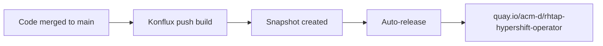
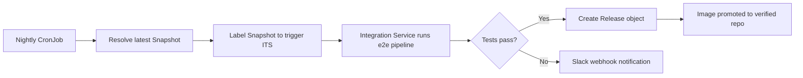
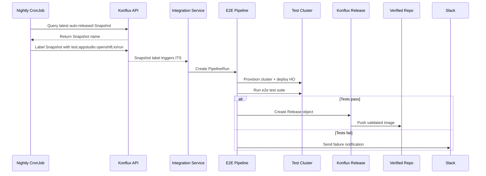

# Konflux Release Gating Pipeline

## Summary

This enhancement introduces a nightly, platform-independent gating system that validates HyperShift Operator (HO) images against end-to-end test suites before promoting them to verified repositories. The pipeline operates alongside the existing Konflux auto-release mechanism, adding a parallel promotion path that only advances images which have passed e2e test suites agreed upon between the HyperShift and managed service (HCM) teams. Tests may vary by platform.
ARO HCP serves as the pilot platform, with ROSA HCP and GCP HCP following the same extensible template.

## Glossary

| Term | Definition |
| ---- | ---------- |
| ACMD | ACM Downstream — the downstream image registry (`quay.io/acm-d/...`) where HO images are auto-released after every merge |
| HO | HyperShift Operator — the operator that manages hosted control planes |
| Konflux | Red Hat's CI/CD build and release platform |
| Snapshot | A Konflux object that records the container images produced by a build pipeline run |
| CPO | Control Plane Operator — the per-hosted-cluster operator deployed by HO |
| Verified Repository | A single `quay.io` image repository (e.g., `quay.io/<org>/hypershift-operator-verified`) containing only HO images which have passed e2e validation. Each platform tags images differently within this shared repository (e.g., `aro-hcp-<digest>`, `rosa-hcp-<digest>`). |

## Motivation

Every merged HyperShift Operator (HO) build is auto-released to ACMD before platform-specific test results are available. Platform teams do run their own testing (ROSA regression tests, ARO HCP e2e tests), but these results do not gate the release.
A bad image can be consumed by managed service teams before those tests complete. The gap is timing and gating — testing exists, but the auto-release does not wait for it.

### User Stories

- As a managed service engineer consuming HO images, I want to pull images from a verified repository so that I can be confident every image I deploy has passed e2e validation for my platform.

- As a HyperShift operator developer, I want merged builds to continue flowing to ACMD without delay so that my existing development workflow is not disrupted by the new gating pipeline.

- As a platform team lead for ARO HCP, I want an independent promotion path for my platform so that a test failure on another platform (e.g., ROSA HCP) does not block my team's access to validated images.

- As an SRE responsible for HyperShift deployments, I want automated Slack notifications on gating failures and stale promotion alerts so that I can quickly investigate and re-trigger the pipeline without manual monitoring.

### Goals

1. Provide a verified image repository containing only HO images which have passed e2e validation, tagged per platform.
2. Run nightly e2e validation of the latest HO build against platform-specific test suites.
3. Keep the existing auto-release to ACMD completely unchanged; the new pipeline is purely additive.
4. Enable independent promotion paths per platform so that one platform's failure does not block others.
5. Make the pipeline extensible to new platforms with only new Konflux resource definitions and no pipeline code changes.

### Non-Goals

1. Replacing the existing auto-release to ACMD. The current auto-release path remains untouched.
2. Providing real-time or per-commit gating. The pipeline runs nightly, not on every merge.
3. Implementing ROSA HCP or GCP HCP promotion paths in the initial rollout. These follow the same template but are deferred to later phases.

#### Design Rationale

**Nightly cadence (24h):** Each pipeline run provisions real cloud infrastructure with platform-specific credentials (e.g., Azure for ARO HCP). A nightly cadence balances validation confidence with cloud infrastructure cost. Per-commit gating is cost-prohibitive and would slow the development feedback loop (see Alternatives). Per-platform cadence can differ — each platform can have its own CronJob schedule.

**Alerting and troubleshooting:** Every failure type triggers a Slack notification (see Error Handling table). Stale promotion alerts fire if no successful promotion occurs within a configurable threshold (default 3 days). Detection commands, remediation steps, and manual re-trigger procedures are documented in Support Procedures.

## Proposal

Add a parallel, gated promotion path alongside the existing auto-release. A nightly pipeline resolves the most recent HO image built by Konflux's push build pipeline (triggered on every merge to `main`) and tests it against platform-specific e2e suites. Only tested images are promoted to a verified repository. Each platform's promotion is independent — a failure on one does not block others.

The existing auto-release to ACMD continues unchanged.

The dual-path architecture operates as follows:

**Existing auto-release (unchanged):**



**New gated promotion (parallel path):**



### Workflow Description

**nightly CronJob** is a Kubernetes CronJob that fires at 3:15 AM UTC daily in the `crt-redhat-acm-tenant` namespace.

**Konflux build pipeline** is the existing push build pipeline that creates Snapshots for every merged commit.

**e2e test pipeline** is a Tekton Pipeline defined in the HyperShift repository under `.tekton/pipelines/`. For the MVP, a single pipeline file (`ho-release-gate.yaml`) serves the ARO HCP platform. When additional platforms are onboarded, each may get its own pipeline file (e.g., `ho-aro-release-gate.yaml`, `ho-rosa-release-gate.yaml`) if the test suites differ enough to warrant separate pipeline definitions, or they may share a single parameterized pipeline using the ITS `spec.params` field to pass platform-specific values (test suite, credentials, infrastructure target).

**managed service team** is a human team (e.g., ARO HCP engineers) that consumes validated HO images.

1. **Trigger:** A Kubernetes CronJob in the `crt-redhat-acm-tenant` namespace runs nightly.
2. **Resolve:** The CronJob queries Konflux Snapshots for the most recent push build that has been auto-released successfully.
3. **Label:** The CronJob labels the resolved Snapshot with `test.appstudio.openshift.io/run=hypershift-ho-release-gate-aro-hcp`. This signals the Konflux Integration Service to execute the IntegrationTestScenario's pipeline against that Snapshot.
4. **Test:** The Integration Service creates a PipelineRun from the ITS definition, which deploys the resolved HO image and runs e2e tests against it. Each platform defines its own `IntegrationTestScenario` that specifies the test suite and infrastructure — for example, ARO HCP tests run against Azure-provisioned clusters, while ROSA HCP tests would use AWS.
5. **Promote:** On pass, the pipeline's `finally` block creates a Konflux Release object referencing the tested Snapshot and a platform-specific ReleasePlan. Konflux's release pipeline pushes the image to the verified repository.
6. **Notify:** On failure, a Slack webhook fires with failure details (snapshot name, image ref, pipeline run link).



#### Error Handling

| Failure | Impact | Handling |
| ------- | ------ | -------- |
| CronJob fails to resolve Snapshot | No test run | Slack alert + manual re-trigger |
| E2e tests fail | Image not promoted to verified repo | Slack alert. ACMD auto-release unaffected. |
| E2e tests flake | Unnecessary block | Manual re-trigger. Future: add retry logic. |
| Release creation fails | Tested image not promoted | Slack alert. Manual Release creation as fallback. |
| No promotion in N days | ARO HCP running stale image | Stale promotion alert (configurable threshold, default 3 days) |

Manual re-trigger:

```bash
oc create job --from=cronjob/hypershift-operator-nightly-promotion manual-$(date +%s) -n crt-redhat-acm-tenant
```

### API Extensions

This enhancement does not introduce or modify any CRDs, admission or conversion webhooks, ValidatingAdmissionPolicy, MutatingAdmissionPolicy, aggregated API servers, or finalizers. It consumes existing Konflux API resources (Snapshot, Release, ReleasePlan, IntegrationTestScenario) without modifying their schemas or behavior.

### Topology Considerations

#### Hypershift / Hosted Control Planes

This enhancement directly targets the HyperShift Operator release pipeline. It validates HO images used to manage hosted control planes across all supported platforms (ARO HCP, ROSA HCP, GCP HCP). The pipeline itself runs in the Konflux infrastructure (`crt-redhat-acm-tenant` namespace), not within a hosted control plane or management cluster.
It does not affect the runtime behavior of any HyperShift components; it gates which images are promoted to verified repositories.

#### Standalone Clusters

This enhancement does not affect standalone OpenShift clusters. The pipeline operates entirely within Konflux CI infrastructure and only gates HO image promotion for managed service platforms.

#### Single-node Deployments or MicroShift

This enhancement does not affect single-node OpenShift or MicroShift deployments. The gating pipeline is a CI/CD concern, not a runtime feature.

#### OpenShift Kubernetes Engine

This enhancement does not affect OKE. It operates within Konflux CI infrastructure and does not depend on any OCP or OKE specific features at runtime.

### Implementation Details/Notes/Constraints

The implementation consists of creating Konflux resources and a Tekton pipeline definition. All resources are created in the `crt-redhat-acm-tenant` namespace unless noted otherwise.

The Tekton pipeline definition lives in the HyperShift repository (`.tekton/pipelines/`), referenced by the ITS via git resolver. Konflux namespace resources (IntegrationTestScenario, ReleasePlan, CronJob, RBAC) are defined in `contrib/konflux/` in the HyperShift repository and applied to the `crt-redhat-acm-tenant` namespace. Changes to these resources follow the standard PR review process.

#### Files to Create

| Location | File/Resource | Action |
| -------- | ------------- | ------ |
| Repo | `.tekton/pipelines/ho-release-gate.yaml` | Create: E2E test pipeline |
| Konflux namespace | `ReleasePlan/hypershift-operator-ho-release-gate-aro-hcp` | Create: Gated release plan |
| Releng tenant | `ReleasePlanAdmission` | Create: Admission policy (releng coordination needed) |
| Konflux namespace | `IntegrationTestScenario/hypershift-ho-release-gate-aro-hcp` | Create: Wire e2e as Snapshot gate |
| Konflux namespace | `CronJob/hypershift-operator-nightly-promotion` | Create: Nightly trigger |
| Konflux namespace | `ServiceAccount/nightly-promotion-sa` | Create: CronJob identity |
| Konflux namespace | `Role/nightly-promotion-role` | Create: RBAC permissions |
| Konflux namespace | `RoleBinding/nightly-promotion-binding` | Create: RBAC binding |
| Konflux namespace | `Secret/slack-webhook` | Create: Webhook URL |

#### Nightly CronJob

Runs nightly at 3:15 AM UTC. Resolves the most recent Snapshot from the push build pipeline and labels it to trigger the `hypershift-ho-release-gate-aro-hcp` IntegrationTestScenario. This follows the [Konflux periodic integration test pattern](https://konflux-ci.dev/docs/testing/integration/periodic-integration-tests/) — the CronJob does not create PipelineRuns directly; instead, labeling the Snapshot with `test.appstudio.openshift.io/run=<scenario-name>` signals the Integration Service to execute the ITS pipeline.

```yaml
kind: CronJob
apiVersion: batch/v1
metadata:
  name: hypershift-operator-nightly-promotion
  namespace: crt-redhat-acm-tenant
spec:
  schedule: '15 3 * * *'  # 3:15 AM UTC, offset to avoid peak
  jobTemplate:
    spec:
      template:
        spec:
          containers:
          - name: trigger-e2e-scenario
            image: 'quay.io/konflux-ci/task-runner:v1'
            command: ["/bin/bash", "-c"]
            args:
            - |
              #!/bin/bash
              set -euo pipefail

              KONFLUX_SCENARIO_NAME="hypershift-ho-release-gate-aro-hcp"
              KONFLUX_TENANT_NAME="crt-redhat-acm-tenant"
              KONFLUX_APPLICATION_NAME="hypershift-operator"
              KONFLUX_COMPONENT_NAME="hypershift-operator-main"

              # Resolve the most recent Snapshot from push builds that has been auto-released
              LATEST_SNAPSHOT=$(kubectl get snapshots -n "${KONFLUX_TENANT_NAME}" -o json | \
                jq --arg application "$KONFLUX_APPLICATION_NAME" \
                   --arg component "$KONFLUX_COMPONENT_NAME" -r '
                  .items
                  | map(select(
                      .metadata.labels."appstudio.openshift.io/application" == $application and
                      .metadata.labels."appstudio.openshift.io/component" == $component and
                      .metadata.labels."pac.test.appstudio.openshift.io/event-type" == "push" and
                      (.status.conditions // [] | map(select(
                          .type == "AutoReleased" and
                          .reason == "AutoReleased" and
                          .status == "True"
                          ))
                      | length > 0)
                      ))
                  | sort_by(.metadata.creationTimestamp) | last | .metadata.name')

              if [[ -z "${LATEST_SNAPSHOT}" || "${LATEST_SNAPSHOT}" == "null" ]]; then
                echo "[ERROR] No valid snapshot found."
                exit 1
              fi

              echo "Resolved snapshot: ${LATEST_SNAPSHOT}"

              # Label the Snapshot to trigger the IntegrationTestScenario
              kubectl -n "${KONFLUX_TENANT_NAME}" label snapshot "${LATEST_SNAPSHOT}" \
                test.appstudio.openshift.io/run="${KONFLUX_SCENARIO_NAME}"
          serviceAccountName: nightly-promotion-sa
          restartPolicy: Never
```

#### RBAC

The CronJob runs under a dedicated service account with least-privilege RBAC scoped to the `crt-redhat-acm-tenant` namespace.

```yaml
apiVersion: v1
kind: ServiceAccount
metadata:
  name: nightly-promotion-sa
  namespace: crt-redhat-acm-tenant
---
apiVersion: rbac.authorization.k8s.io/v1
kind: Role
metadata:
  name: nightly-promotion-role
  namespace: crt-redhat-acm-tenant
rules:
- apiGroups: ["appstudio.redhat.com"]
  resources: ["snapshots"]
  verbs: ["get", "list", "watch", "update", "patch"]
---
apiVersion: rbac.authorization.k8s.io/v1
kind: RoleBinding
metadata:
  name: nightly-promotion-binding
  namespace: crt-redhat-acm-tenant
subjects:
- kind: ServiceAccount
  name: nightly-promotion-sa
roleRef:
  kind: Role
  name: nightly-promotion-role
  apiGroup: rbac.authorization.k8s.io
```

#### ReleasePlan (per-platform)

A per-platform resource created by the HCP team in the `crt-redhat-acm-tenant` namespace. The YAML below shows the ARO HCP pilot instance. Future platforms (ROSA HCP, GCP HCP) will each get their own ReleasePlan. All platforms push to the same verified repository, tagged differently per managed service. Auto-release is disabled (`auto-release: 'false'`), meaning images only reach the verified repo through explicit Release objects created after tests pass.

```yaml
apiVersion: appstudio.redhat.com/v1alpha1
kind: ReleasePlan
metadata:
  name: hypershift-operator-ho-release-gate-aro-hcp
  namespace: crt-redhat-acm-tenant
  labels:
    release.appstudio.openshift.io/auto-release: 'false'
spec:
  target: rhtap-releng-tenant
  application: hypershift-operator
```

A matching `ReleasePlanAdmission` in the `rhtap-releng-tenant` namespace is required. This may need coordination with the releng team.

#### IntegrationTestScenario (per-platform)

A per-platform resource created by the HCP team in the `crt-redhat-acm-tenant` namespace. This wires the e2e test Tekton pipeline as a gate on Snapshots. It references a pipeline definition stored in the HyperShift repository, allowing the test pipeline to evolve alongside the code it validates.

The `disabled` context prevents this test from running on every push build. Instead, it is triggered only by the nightly CronJob, which labels the latest Snapshot with `test.appstudio.openshift.io/run=<scenario-name>` to initiate the test on demand. This follows the [Konflux periodic integration test pattern](https://konflux-ci.dev/docs/testing/integration/periodic-integration-tests/).

```yaml
apiVersion: appstudio.redhat.com/v1beta2
kind: IntegrationTestScenario
metadata:
  name: hypershift-ho-release-gate-aro-hcp
  namespace: crt-redhat-acm-tenant
spec:
  application: hypershift-operator
  resolverRef:
    resolver: git
    params:
    - name: url
      value: https://github.com/openshift/hypershift
    - name: revision
      value: main
    - name: pathInRepo
      value: .tekton/pipelines/ho-release-gate.yaml
  contexts:
  - name: disabled
    description: Triggered only by nightly CronJob, not on every push build
```

#### Release Object (created programmatically on test pass)

Release objects are not created in advance. They are generated programmatically by a Tekton `finally` task after e2e tests pass. Each references the specific tested Snapshot and the platform's gated ReleasePlan. Once created, Konflux's built-in release pipeline handles the actual image push.

```yaml
apiVersion: appstudio.redhat.com/v1alpha1
kind: Release
metadata:
  generateName: hypershift-operator-ho-release-gate-aro-hcp-
  namespace: crt-redhat-acm-tenant
spec:
  snapshot: <snapshot-name-that-passed-tests>
  releasePlan: hypershift-operator-ho-release-gate-aro-hcp
  gracePeriodDays: 7
```

#### E2E Test Pipeline

A new Tekton pipeline at `.tekton/pipelines/ho-release-gate.yaml` consisting of five sequential tasks followed by a `finally` block for promotion or notification. All test jobs run in Prow; Konflux launches Prow jobs and consumes their pass/fail results and run links.

**Pipeline tasks (sequential):**

| Task | Purpose |
| ---- | ------- |
| `extract-image` | Parse Snapshot, extract HO image reference |
| `setup-test-env` | Provision or connect to test infrastructure |
| `deploy-ho` | Deploy the HO image under test |
| `run-e2e` | Execute the e2e test suite |
| `cleanup` | Tear down test resources |

**Finally tasks (always run):**

| Task | Condition | Purpose |
| ---- | --------- | ------- |
| `create-release` | `run-e2e` succeeded | Create Konflux Release object |
| `notify-slack` | `run-e2e` failed | Send Slack webhook notification |

**Slack notification task:**

```yaml
- name: notify-slack
  when:
  - input: $(tasks.run-e2e.status)
    operator: in
    values: ["Failed"]
  taskSpec:
    steps:
    - name: send-notification
      image: curlimages/curl:latest
      script: |
        #!/bin/sh
        curl -X POST -H 'Content-type: application/json' \
          --data "{
            \"text\": \"HyperShift nightly promotion FAILED\nSnapshot: $(params.snapshot-name)\nImage: $(params.ho-image)\nPipeline: $(context.pipelineRun.name)\"
          }" \
          "${SLACK_WEBHOOK_URL}"
      env:
      - name: SLACK_WEBHOOK_URL
        valueFrom:
          secretKeyRef:
            name: slack-webhook
            key: url
```

#### Stale Promotion Alert

A separate check (within the nightly CronJob or as its own CronJob) queries the last successful Release timestamp. If older than the configured threshold, it fires a Slack alert. Corresponds to [CNTRLPLANE-3451](https://issues.redhat.com/browse/CNTRLPLANE-3451).

#### MVP Test Coverage

For the MVP, the pipeline runs HyperShift's own e2e suite from `test/e2e/`. Future iterations add platform-specific tests (ARO HCP e2e via Azure ARM API). Minimum coverage targets from OCPSTRAT-3250:
- Every supported CPO latest 4.y.z
- Every supported CPO latest-minus-one 4.y.z
- Every supported minor release 4.y.0

Start with basic cluster lifecycle and one upgrade path, expand over time. Test matrix is configured via pipeline parameters.

| Phase | Coverage | Ownership |
| ----- | -------- | --------- |
| Phase 1 (MVP) | Cluster lifecycle, NodePool scaling, one upgrade path | HCP team — required for completion |
| Phase 2 | Full CPO version matrix (every supported 4.y.z and 4.y.0) | HCP team — required for completion |
| Phase 3 | Platform-specific e2e (ARO HCP Azure ARM, etc.) | Informing only — platform teams own these jobs |

Phases 1 and 2 are critical for considering this work complete. If promotion fails in these phases, the HCP team owns investigation and resolution.

Phase 3 introduces platform-specific informing jobs. Responsibility for creating and watching these jobs lies with the platform teams. The release controller's responsibility ends with demonstrating that it is possible to create such a job. The HCP team can help debug and fix failing tests in coordination with platform teams.

#### Platform Extensibility

Each platform gets its own:
- `IntegrationTestScenario` (defines which tests to run)
- `ReleasePlan` (defines which verified repo to push to)
- Optionally its own CronJob schedule

Adding a new platform means creating these 2-3 Konflux resources. No pipeline code changes are needed.

ARO HCP is the pilot. ROSA HCP and GCP HCP follow the same pattern.

| Platform | IntegrationTestScenario | ReleasePlan | CronJob | Status |
| -------- | ----------------------- | ----------- | ------- | ------ |
| **ARO HCP** | `hypershift-ho-release-gate-aro-hcp` | `...-aro-hcp-verified` | Shared nightly | Pilot |
| ROSA HCP | `hypershift-ho-release-gate-rosa-hcp` | `...-rosa-hcp-verified` | Shared or separate | Future |
| GCP HCP | `hypershift-ho-release-gate-gcp-hcp` | `...-gcp-hcp-verified` | Shared or separate | Future |

#### Strategy Alignment

Each solution element maps to a tracked strategy or feature:

| Solution Element | Strategy / Feature | Implementation |
| ---------------- | ------------------ | -------------- |
| Gated promotion path (nightly pipeline, test, promote) | [OCPSTRAT-3250](https://issues.redhat.com/browse/OCPSTRAT-3250) | [CNTRLPLANE-3434](https://issues.redhat.com/browse/CNTRLPLANE-3434) (epic), [CNTRLPLANE-3447](https://issues.redhat.com/browse/CNTRLPLANE-3447), [CNTRLPLANE-3449](https://issues.redhat.com/browse/CNTRLPLANE-3449) |
| ARO HCP as pilot platform | [OCPSTRAT-3250](https://issues.redhat.com/browse/OCPSTRAT-3250), [OCPSTRAT-2856](https://issues.redhat.com/browse/OCPSTRAT-2856) | [CNTRLPLANE-3448](https://issues.redhat.com/browse/CNTRLPLANE-3448) (ARO HCP e2e gate), [CNTRLPLANE-3452](https://issues.redhat.com/browse/CNTRLPLANE-3452) (credentials) |
| Independent promotion per platform | [OCPSTRAT-3250](https://issues.redhat.com/browse/OCPSTRAT-3250) | [CNTRLPLANE-3434](https://issues.redhat.com/browse/CNTRLPLANE-3434) (architecture) |
| Existing auto-release unchanged | [OCPSTRAT-3250](https://issues.redhat.com/browse/OCPSTRAT-3250) | No work needed — parallel path, not replacement |
| ROSA HCP — same pattern | [CNTRLPLANE-3438](https://issues.redhat.com/browse/CNTRLPLANE-3438) | Future — follows ARO HCP pilot template |
| GCP HCP — same pattern | [CNTRLPLANE-3439](https://issues.redhat.com/browse/CNTRLPLANE-3439) | Future — follows ARO HCP pilot template |
| Failure notifications & stale alerting | [OCPSTRAT-3250](https://issues.redhat.com/browse/OCPSTRAT-3250) | [CNTRLPLANE-3451](https://issues.redhat.com/browse/CNTRLPLANE-3451) (stale alert), [CNTRLPLANE-3450](https://issues.redhat.com/browse/CNTRLPLANE-3450) (re-trigger) |

#### Related Jira Issues

Implementation is tracked under [CNTRLPLANE-3434](https://issues.redhat.com/browse/CNTRLPLANE-3434):

- [CNTRLPLANE-3446](https://issues.redhat.com/browse/CNTRLPLANE-3446) — Disable auto-release (NOT in scope — auto-release kept unchanged)
- [CNTRLPLANE-3447](https://issues.redhat.com/browse/CNTRLPLANE-3447) — Nightly snapshot resolution
- [CNTRLPLANE-3448](https://issues.redhat.com/browse/CNTRLPLANE-3448) — ARO HCP e2e gate
- [CNTRLPLANE-3449](https://issues.redhat.com/browse/CNTRLPLANE-3449) — Release creation on pass
- [CNTRLPLANE-3450](https://issues.redhat.com/browse/CNTRLPLANE-3450) — Manual re-trigger
- [CNTRLPLANE-3451](https://issues.redhat.com/browse/CNTRLPLANE-3451) — Stale promotion alerting
- [CNTRLPLANE-3452](https://issues.redhat.com/browse/CNTRLPLANE-3452) — Credential setup

### Risks and Mitigations

**Risk:** E2e test flakes block promotion unnecessarily.
**Mitigation:** Manual re-trigger capability from day one. Future iterations will add automatic retry logic.

**Risk:** Test infrastructure credentials (Azure, AWS) could be compromised.
**Mitigation:** Credentials are stored as Kubernetes Secrets with RBAC restricted to the nightly-promotion service account. Credential rotation follows existing Konflux tenant security practices.

**Risk:** Stale verified images if pipeline fails silently.
**Mitigation:** Configurable stale promotion alerting (default 3 days) notifies the team if no successful promotion has occurred.

**Risk:** ReleasePlanAdmission policies in `rhtap-releng-tenant` may introduce unexpected constraints.
**Mitigation:** Early coordination with the releng team during implementation.

### Drawbacks

This enhancement adds operational complexity to the HO release process. Teams must now monitor an additional pipeline and respond to failure notifications. However, the cost of this monitoring is significantly lower than the cost of deploying unvalidated images to managed service environments.

The nightly cadence means there is up to a 24-hour delay between a merge and its appearance in a verified repository. This is acceptable for production consumption but may require teams to continue using ACMD for rapid iteration.

## Alternatives (Not Implemented)

**Gate the existing auto-release:** Instead of adding a parallel path, the auto-release to ACMD could be modified to wait for test results. This was rejected because it would delay all consumers, including developers who need quick access to builds for iteration. The parallel path preserves the existing fast-feedback loop.

**Per-commit gating:** Running the full e2e suite on every merge would provide tighter validation but is cost-prohibitive in terms of cloud infrastructure and would significantly slow the development feedback loop. A nightly cadence balances validation confidence with resource efficiency.

## Open Questions [optional]

1. **Test infrastructure:** Where do the e2e tests run? The pipeline needs a cluster with cloud credentials (Azure for ARO HCP, AWS for ROSA HCP). We need to coordinate with each platform team to get tests that can run on their infrastructure. See [CNTRLPLANE-3452](https://issues.redhat.com/browse/CNTRLPLANE-3452).

2. **ReleasePlanAdmission:** Requires coordination with the releng team (`rhtap-releng-tenant`). What policies govern the verified repo? What approval workflows are needed?

3. **Verified repo location:** Which quay.io repository serves as the verified/promoted destination? We need to create a new quay repo that the managed service teams (ARO HCP, ROSA HCP) can also reach.

4. **Platform e2e test integration:** Bryan is working with the ARO HCP team to integrate their platform-specific e2e tests into the HyperShift repo, following the same pattern used for HyperShift's existing presubmit e2e tests.

5. **Regression analysis:** deads2k raised that this release, decoupled from OCP releases, needs its own regression analysis in component readiness — comparing current HO against a sliding baseline to track the trajectory of the project. This needs further discussion to determine what that mechanism looks like and how it integrates with existing component readiness tooling.

## Test Plan

<!-- TODO: This section needs to be filled in when targeted at a release.

The test strategy for this enhancement focuses on validating the pipeline itself rather than OCP cluster features. Consider:

- Integration tests verifying the CronJob correctly resolves the latest Snapshot and creates a PipelineRun.
- Tests verifying the finally block correctly creates a Release object on pass and sends a Slack notification on failure.
- End-to-end pipeline runs in a staging Konflux environment before production deployment.
- Stale promotion alerting verification.

Note: Since this is a CI/CD pipeline enhancement and not an OCP cluster feature, standard OCP e2e test labeling conventions
([OCPFeatureGate:...], [Jira:...]) do not directly apply. However, the e2e tests RUN BY the pipeline should follow test-conventions.md. -->

## Graduation Criteria

### Dev Preview -> Tech Preview

- Ability to run the nightly pipeline end-to-end for ARO HCP with manual trigger capability.
- Slack notifications functioning for both pass and fail outcomes.
- Verified repository receiving promoted images on test pass.
- Stale promotion alerting operational.

### Tech Preview -> GA

- Nightly pipeline running reliably for ARO HCP with fewer than 5% false-negative failure rate.
- At least one additional platform (ROSA HCP or GCP HCP) onboarded using the extensible template.
- Managed service teams actively consuming from verified repositories.
- Runbook documented for failure triage and manual re-trigger procedures.
- Monitoring dashboard for pipeline health and promotion history.

### Removing a deprecated feature

Not applicable. This enhancement adds a new pipeline path and does not deprecate any existing functionality.

## Upgrade / Downgrade Strategy

This enhancement does not affect OCP cluster upgrade or downgrade behavior. The pipeline operates entirely within Konflux CI infrastructure. Changes to the pipeline are deployed by updating Konflux resource definitions in the `crt-redhat-acm-tenant` namespace. Rolling back a pipeline change involves reverting the resource definitions.

The existing auto-release to ACMD is completely unaffected, so a failure or rollback of the gated promotion path has no impact on the current release flow.

## Version Skew Strategy

Not applicable to OCP cluster version skew. The pipeline validates a single HO image at a time against a deployed test environment. Version skew between HO and the test cluster is managed by the e2e test suite's cluster provisioning step, which deploys a compatible OCP version.

## Operational Aspects of API Extensions

This enhancement does not introduce any API extensions. No CRDs, webhooks, aggregated API servers, or finalizers are added or modified.

## Support Procedures

**Detecting failures:**
- Slack notifications are sent on every pipeline failure with the snapshot name, image reference, and a link to the failed PipelineRun.
- Stale promotion alerts fire when no successful promotion has occurred within the configurable threshold (default 3 days).
- Pipeline status can be checked via:
  ```bash
  oc get pipelinerun -n crt-redhat-acm-tenant -l app=ho-release-gate --sort-by=.metadata.creationTimestamp
  ```

**Remediation:**
- For transient failures (flakes, infrastructure issues), manually re-trigger the pipeline:
  ```bash
  oc create job --from=cronjob/hypershift-operator-nightly-promotion manual-$(date +%s) -n crt-redhat-acm-tenant
  ```
- For persistent test failures, investigate the e2e test logs in the linked PipelineRun and coordinate with the HyperShift development team.

**Impact of pipeline downtime:** If the gated promotion pipeline is unavailable, no new images are promoted to the verified repository. The existing auto-release to ACMD continues unaffected. Managed service teams retain access to their most recently promoted image.

## Infrastructure Needed [optional]

- A single `quay.io` repository for verified/promoted HO images, tagged per managed service (e.g., `quay.io/<org>/hypershift-operator-verified`).
- Cloud credentials (Azure) for ARO HCP e2e test infrastructure, stored as Kubernetes Secrets in `crt-redhat-acm-tenant`.
- A Slack webhook endpoint for failure notifications.
- `ReleasePlanAdmission` resource in `rhtap-releng-tenant` (requires releng team coordination).
