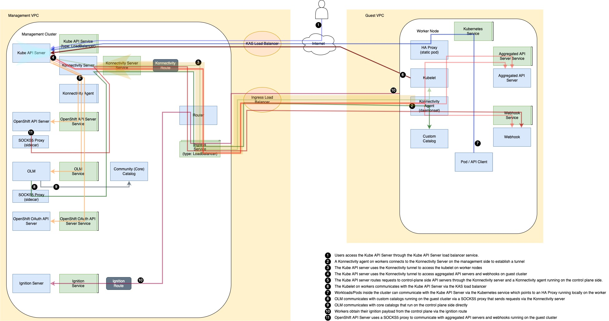
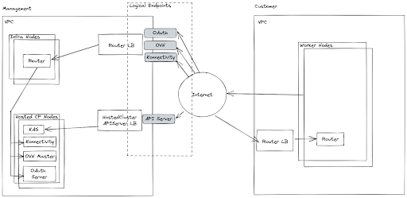

# Networking

## Summary

This proposal fleshes out the details for the current networking solution for HyperShift form factor i.e. hosed control planes.

## Motivation

HyperShift differs from standalone OCP in that the components that run in the Hosted Control Plane (HCP) on the management cluster are not on the same cluster service network as the components that run on guest cluster nodes.
Challenges include but not limited to:
- KAS access to kubelets.
- KAS access to aggregated API servers.
- KAS access to webhooks.
- Guest pod service access (kubernetes.default.svc) to KAS.
- OLM access end-user catalogs.

### User Stories
- As a Cluster Provider I want to be able to express intent for SDN, pod network CIDR and service network CIDR, so I can satisfy Cluster Consumer requirements.
- As a Cluster Provider I want to have the ability to restrict access to control plane components coexisting in a management cluster, so I can satisfy security compliance:
  - Ability to restrict KAS access to a provided CIDR.
  - Ability to restrict KAS access to components in the guest cluster.
  - Ability to restrict endpoints visibility.
- As a Cluster Provider I want to be able to express intent for service publishing strategy e.g. NodePort, so I can satisfy platform scenarios where infra might be limited, e.g. there's no load balancer.

### Goals
- Enable bidirectional traffic between control plane and data plane in a secure, restricted and controlled fashion.
- Enable OCP supported endpoint topologies for AWS: public, private and public, private.

### Non-Goals

## Proposal

### KAS access to Kubelets and Guest Networks
We use [konnectivity](https://github.com/kubernetes-sigs/apiserver-network-proxy) to control traffic from the KAS in alignment with [upstream efforts](https://github.com/kubernetes/enhancements/tree/master/keps/sig-api-machinery/1281-network-proxy#proposal).

- Guest nodes are likely in a private subnet with no publicly accessible IP.
- konnectivity-agent deamonset runs on each guest node and connects to the konnectivity-server in the HCP.
- This creates a path from the konnectivity-server in the hosted control plane to the node and guest service network.
- KAS is konnectivity aware and will use the proxy according to the EgressSelectorConfiguration.
- A konnectivity-agent also runs in the hosted control plane to route specific IPs that do not conform to the boundaries in the EgressSelectorConfiguration.

```yaml
apiVersion: apiserver.k8s.io/v1beta1
name: cluster
kind: EgressSelectorConfiguration
egressSelections:
- name: controlplane
  connection:
    proxyProtocol: Direct
- name: etcd
  connection:
    proxyProtocol: Direct
- name: cluster
  connection:
    proxyProtocol: HTTPConnect
    transport:
      tcp:
        tlsConfig:
          caBundle: /etc/kubernetes/certs/client-ca/ca.crt
          clientCert: /etc/kubernetes/certs/konnectivity-client/tls.crt
          clientKey: /etc/kubernetes/certs/konnectivity-client/tls.key
        url: https://konnectivity-server-local:8090
```

#### konnectivity-socks5-proxy

For components that do not natively support Konnectivity, Hypershift has a [sidecar](https://github.com/openshift/hypershift/tree/main/konnectivity-socks5-proxy)
that provides a socks5 proxy that can be used by configuring the `HTTP{,S}_PROXY` and `NO_PROXY` env vars. The sidecar
* Authenticates to Konnectivity
* Does DNS resolving of guest cluster services
* Exempts cloud provider traffic from going through Konnectivity, in order to support management clusters that have a proxy setup, as the components themselves
  already have the sidecar as target in their proxy environment variables

Despite being a socks5 proxy, the sidecar only supports TCP and not UDP, as it routes over Konnectivity through http connect. It is a socks5 proxy to allow
supporting DNS resolving, which is not supported by http connect or Konnectivity itself.

Current components that use this are :
- OLM packageserver.
- OLM operator.
- openshift-apiserver.
- oauth-server
- Ingress operator.

### Guest pod service access to KAS
Pods regularly use `kubernetes.default.svc` to contact the KAS. However, the KAS does not exist on the guest pod service network.
The Endpoint for the default/kubernetes service is set as an address bound to the lo interface on each guest node.
A haproxy static pod listens on lo for service traffic to kubernetes endpoint and proxies to the KAS LB on the hosted control plane.

#### kubernetes Endpoint to localhost routing
```shell
# oc get svc -n default kubernetes
NAME         TYPE        CLUSTER-IP   EXTERNAL-IP   PORT(S)   AGE
kubernetes   ClusterIP   172.31.0.1   <none>        443/TCP   3h59m

# oc get ep -n default kubernetes
NAME         ENDPOINTS         AGE
kubernetes   172.20.0.1:6443   3h59m
```

```shell
1: lo: <LOOPBACK,UP,LOWER_UP> mtu 65536 qdisc noqueue state UNKNOWN group default qlen 1000
    link/loopback 00:00:00:00:00:00 brd 00:00:00:00:00:00
    inet 127.0.0.1/8 scope host lo
       valid_lft forever preferred_lft forever
    inet 172.20.0.1/32 brd 172.20.0.1 scope host lo
       valid_lft forever preferred_lft forever
    inet6 ::1/128 scope host
       valid_lft forever preferred_lft forever

```

#### haproxy daemonset for proxying traffic to KAS

```shell
# cat haproxy.cfg
global
...

frontend local_apiserver
  bind 172.20.0.1:6443
  log global
  mode tcp
  option tcplog
  default_backend remote_apiserver

backend remote_apiserver
  mode tcp
  log global
  option httpchk GET /version
  option log-health-checks
  default-server inter 10s fall 3 rise 3
  server controlplane a14f6ca3f6e68494d82eb09da7f9ea60-1266310068.us-west-1.elb.amazonaws.com:6443
```

#### KAS Service on Hosted Control Plane
```shell
# oc get svc kube-apiserver
NAME             TYPE           CLUSTER-IP      EXTERNAL-IP                                                               PORT(S)          AGE
kube-apiserver   LoadBalancer   172.30.240.27   a14f6ca3f6e68494d82eb09da7f9ea60-1266310068.us-west-1.elb.amazonaws.com   6443:32617/TCP   4h20m
```

### AWS Example


### Service publishing strategy
There are a number of components endpoints that can be configured to satisfy different platform specific scenarios.

Configurable components:
- APIServer
- OAuthServer
- Konnectivity
- OIDC
- Ignition
- OVNSbDb

Strategy:
- LoadBalancer
- NodePort
- Route
- None
- S3

### Endpoints topology
#### AWS
HyperShift AWS HostedClusters can be configured with one of 3 endpoint access settings: Public, PublicAndPrivate, and Private. Each access mode will expose access points differently to Customer clusters. However, the endpoints are the same in each case:

Kubernetes API Server - This is the main API endpoint for the Kube APIServer running in the control plane namespace of the management cluster. It is secured initially via a kubeconfig over TLS. It  can also be accessed via bearer token emitted by the OAuth Server.

OAuth Server - Authenticates users via customer defined identity provider(s) and provides a token to access the Kubernetes API Server. When it's a route, it's labeled, so it can be accepted by an additional public ingress shard on the management cluster, keeping the default ingress private.

Konnectivity Server - Creates a tunnel through which the API server communicates with worker nodes. Worker nodes authenticate with this endpoint using mTLS.

OVN Control Plane - Provides OVN daemonset pods access to the OVN db and corresponding flows.

##### Public Cluster
On Management Cluster, public:
- Kubernetes API Server
- Konnectivity Server
- OVN Control Plane
- OAuth Server

On Guest Cluster:
- Router



##### PublicAndPrivate Cluster
On Management Cluster:
- Public
  - Kubernetes API Server
  - OAuth Server
- Private (through PrivateLink)
  - Kubernetes API Server
  - Konnectivity Server
  - OVN Control Plane

On Guest Cluster:
- Router


##### Private Cluster
On Management Cluster
- Public:
  - OAuth Server
- Private:
  - Kubernetes API Server
  - Konnectivity Server
  - OVN Control Plane

On Guest Cluster:
- Router (optional)


### DNS
TODO (flesh out).

### Workflow Description
### API Extensions
### Risks and Mitigations
### Drawbacks
### Test Plan
#### Dev Preview -> Tech Preview
#### Tech Preview -> GA
#### Removing a deprecated feature
### Upgrade / Downgrade Strategy
### Version Skew Strategy
### Operational Aspects of API Extensions
#### Failure Modes
#### Support Procedures
## Alternatives

## Design Details

### Graduation Criteria

## Implementation History
The initial version of this doc represents implementation as delivered via MCE tech preview.
