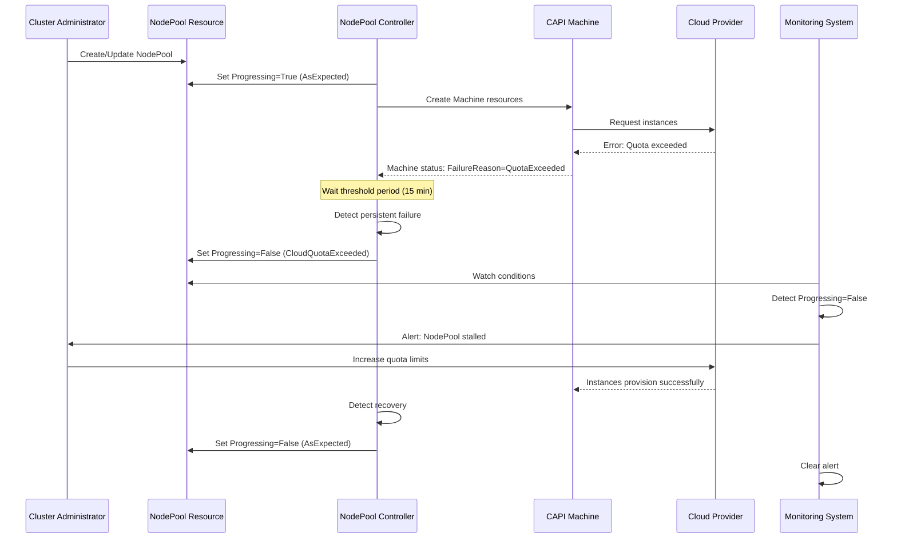

# NodePool Progressing Condition for Failure Detection

## Summary

This enhancement introduces a `Progressing` condition to the NodePool API
that provides a clear signal when a NodePool cannot make forward progress
due to persistent failures requiring manual intervention. The condition
follows the standard Kubernetes pattern and helps users and automation
distinguish between transient issues that may self-heal and persistent
failures that require remediation, such as cloud provider quota exhaustion,
missing infrastructure resources, or critical controller errors.

## Motivation

The NodePool controller currently has 20+ specific condition types to
represent various validation and operational states. However, several
critical failure scenarios lack dedicated conditions, making it difficult
for users and automation to detect and respond to these failures.
Currently, failures like cloud provider quota exhaustion, IAM role
deletion, or persistent CAPI provider errors are reported only through
generic conditions such as `AllMachinesReady=False`, which cannot
distinguish between normal provisioning states and failures requiring
intervention.

Without a clear `Progressing` condition, users must manually inspect
multiple conditions to determine if a NodePool requires intervention,
automation cannot reliably detect persistent failures, and support teams
spend time troubleshooting issues that will not self-resolve. This
enhancement addresses these gaps by providing a single, unambiguous
condition that indicates when a NodePool has stalled and requires manual
remediation.

### User Stories

* As a cluster administrator, I want to know when my NodePool has
  encountered a persistent failure requiring my intervention, so that I can
  take corrective action rather than waiting for an issue to self-resolve.

* As a monitoring system operator, I want to configure alerts based on a
  clear `Progressing=False` condition, so that I can automatically notify
  the appropriate team when NodePools require intervention at scale.

* As a support engineer, I want to quickly identify NodePools that are
  blocked on failures requiring specific remediation steps, so that I can
  provide accurate guidance without extensive investigation.

* As a platform operator, I want clear recovery guidance in condition
  messages when a NodePool cannot progress, so that I can understand what
  actions are needed to restore normal operation and monitor the NodePool
  lifecycle effectively at scale.

### Goals

* Provide a clear, unambiguous signal when a NodePool cannot make forward
  progress due to persistent failures requiring intervention
* Improve observability and enable automation to detect and alert on
  stalled NodePools
* Distinguish between transient issues that may self-heal and persistent
  failures requiring intervention to recover
* Provide clear recovery guidance in condition messages
* Maintain backward compatibility with existing condition types

### Non-Goals

* Replace existing specific condition types with the `Progressing`
  condition
* Change the controller's reconciliation logic or retry behavior beyond
  what is necessary to manage the new condition
* Introduce new condition types beyond `Progressing`

## Proposal

This proposal implements the `Progressing` condition type in the NodePool
API to represent when NodePools are unable to make forward progress due to
persistent failures not covered by existing specific conditions. When
`Progressing=False`, it provides a clear signal that a NodePool has
encountered an error requiring manual intervention.

The `Progressing` condition follows the standard Kubernetes pattern
established by Deployments and other core resources, where
`Progressing=False` indicates that a resource is not progressing anymore. The `reason` for the condtion value will give indication if the NodePool is blocked, for example for bad configuration, or an 'AsExpected' reason will indicate a succes. This is more semantically accurate than a `Failed`
condition and aligns with existing Kubernetes conventions.

Detection logic will identify common failure scenarios including cloud
provider quota exhaustion, insufficient cloud capacity, missing cloud
resources (IAM roles, security groups), persistent MachineDeployment
failures, and critical controller errors. Each failure reason will include
specific recovery guidance in the condition message.

### Workflow Description

**cluster administrator** is a human user responsible for managing
HyperShift NodePools and ensuring worker node availability.

**monitoring system** is an automated system that watches NodePool
conditions and generates alerts.

**NodePool controller** is the component responsible for reconciling
NodePool resources and managing their conditions.

#### Normal Operation Workflow

1. The cluster administrator creates or updates a NodePool resource.
2. The NodePool controller reconciles the NodePool and sets
   `Progressing=True` with `Reason=AsExpected` or a more specific reason
   like `Scaling`, `Upgrading`, or `Provisioning`.
3. Machines are created and provisioned successfully.
4. The monitoring system sees `Progressing=False` `Reason=AsExpected` and does not alert.

#### Failure Detection Workflow

1. The NodePool controller attempts to provision machines for a NodePool.
2. The underlying CAPI Machine resources fail with cloud provider errors
   (e.g., quota exceeded, IAM role not found).
3. The NodePool controller detects these errors have persisted beyond the
   configured threshold period (e.g., 15 minutes for quota errors).
4. The NodePool controller sets `Progressing=False` with an appropriate
   reason (e.g., `CloudQuotaExceeded`) and includes detailed recovery
   guidance in the message field.
5. The monitoring system detects `Progressing=False` and triggers an alert
   to notify the cluster administrator.
6. The cluster administrator reviews the condition message and takes the
   recommended recovery action (e.g., increases cloud quota, restores
   deleted IAM role, changes instance type).



#### Recovery Workflow

1. After receiving an alert, the cluster administrator follows the recovery
   guidance in the condition message.
2. The administrator takes corrective action (increases quota, restores
   resources, updates NodePool spec, etc.).
3. The NodePool controller detects during its next reconciliation that new
   machines are provisioning successfully or the underlying issue is
   resolved.
4. The NodePool controller sets `Progressing=True` with `Reason=Recoverying`
6. When situation is recovered NodePool controller sets `Progressing=False` with  `Reason=AsExpected`.
7. The monitoring system clears the alert.

#### Variation: Multiple Failure Scenarios

If multiple failure indicators exist simultaneously, the controller sets
`Progressing=False` based on precedence:
1. Use specific conditions first if they accurately represent the failure
2. Among generic failures, use the most severe reason
3. Among equally severe failures, use the first one detected

### API Extensions

This enhancement modifies the existing NodePool CRD by adding a new
condition type and associated reason constants.

**API Changes:**

The `Progressing` condition type will be added to the NodePool status
conditions. This is a standard Kubernetes condition with the following
fields:
- `type`: `"Progressing"`
- `status`: `"True"` or `"False"`
- `reason`: One of several new reason constants (see below)
- `message`: Human-readable description with recovery guidance
- `lastTransitionTime`: Standard timestamp field

**New Condition Type Constant:**
```go
// In api/hypershift/v1beta1/nodepool_conditions.go
NodePoolProgressingConditionType ConditionType = "Progressing"
```

**New Reason Constants:**

When `Progressing=False`:
- `CloudQuotaExceeded`: Cloud provider quota limits reached
- `InsufficientCloudCapacity`: Cloud provider has no capacity in the
  requested region/zone
- `MissingCloudResources`: Required cloud resources (IAM roles, security
  groups, etc.) deleted
- `CAPIProviderFailed`: CAPI infrastructure provider persistent failure
- `ControllerError`: Internal controller error preventing reconciliation
- `MachineDeploymentFailed`: MachineDeployment has failed persistently

When `Progressing=True`:
- `AsExpected`: Normal operation
- `Scaling`: NodePool is scaling to desired replica count
- `Upgrading`: NodePool is upgrading to new version
- `Provisioning`: Machines are being provisioned

**Behavior Modification:**

This enhancement does not modify the behavior of existing NodePool
resources beyond adding the new condition. The condition is purely
informational and does not affect the controller's reconciliation logic,
except that the controller may use longer requeue delays when
`Progressing=False` to avoid excessive API calls for stalled NodePools.

### Topology Considerations

#### Hypershift / Hosted Control Planes

This enhancement is specifically designed for HyperShift NodePools. The
`Progressing` condition applies to NodePool resources in the management
cluster and helps operators understand the status of worker node
provisioning for hosted clusters.

The condition is particularly valuable in HyperShift environments where:
- Multiple hosted clusters share cloud provider quotas
- Infrastructure resources may be managed separately from NodePools
- Failures can cascade across multiple NodePools

The implementation will detect failures specific to the cloud provider
backing each NodePool (AWS, Azure, OpenStack, KubeVirt, etc.).

#### Standalone Clusters

This enhancement is not applicable to standalone OpenShift clusters, as
NodePool resources are specific to HyperShift architecture.

#### Single-node Deployments or MicroShift

This enhancement is not applicable to single-node deployments or
MicroShift, as these topologies do not use HyperShift NodePools.

#### OpenShift Kubernetes Engine

This enhancement does not affect OpenShift Kubernetes Engine (OKE), as OKE
does not include HyperShift functionality.

### Implementation Details/Notes/Constraints

The implementation will involve changes to several areas of the HyperShift
codebase:

**1. API Definition**

Add the `Progressing` condition type and reason constants to
`api/hypershift/v1beta1/nodepool_conditions.go`. These are Go constants
used throughout the controller code to ensure consistency.

**2. Failure Detection Logic**

Implement detection functions in the NodePool controller
(`hypershift-operator/controllers/nodepool/conditions.go`) for each
failure scenario:

- **Cloud Quota Detection**: Inspect CAPI Machine `FailureReason` and
  `FailureMessage` fields for platform-specific quota error patterns (AWS:
  `VcpuLimitExceeded`, `InstanceLimitExceeded`; Azure: `QuotaExceeded`;
  etc.). Set `Progressing=False` if errors persist beyond 15-minute
  threshold.

- **Capacity Detection**: Check if all machines consistently fail with
  capacity errors (AWS: `InsufficientInstanceCapacity`; Azure:
  `SkuNotAvailable`). Set `Progressing=False` if errors persist beyond
  30-minute threshold.

- **Missing Resources Detection**: Detect when required infrastructure
  resources are deleted after initial setup (IAM roles, security groups,
  subnets). Use platform-specific error patterns to identify missing
  resources.

- **MachineDeployment Failure Detection**: Monitor MachineDeployment
  conditions for persistent `Available=False` state beyond 45-minute
  threshold.

**3. Recovery Detection**

Implement recovery checks that run when `Progressing=False`. Check if the
underlying issue is resolved (e.g., new machines provisioning successfully,
error patterns no longer present) and transition back to
`Progressing=True`.

**4. Reconciliation Optimization**

When `Progressing=False`, implement lightweight reconciliation that:
- Checks if failure is resolved
- Avoids expensive operations like machine template generation
- Returns with long requeue delay (5 minutes) to reduce API load

**5. Threshold Configuration**

Define threshold constants for each failure type:
- Cloud quota errors: 15 minutes
- Cloud capacity errors: 30 minutes
- Missing resources: 5 minutes
- MachineDeployment failures: 45 minutes

These thresholds prevent false positives from transient errors while
ensuring timely detection of persistent failures.

**6. Event Emission**

Emit Kubernetes Warning events when setting `Progressing=False` to provide
additional visibility in event logs.

**7. Platform-Specific Error Patterns**

Implement error pattern matching for each supported platform (AWS, Azure,
OpenStack, etc.) to accurately detect quota, capacity, and resource
errors. This requires platform-specific knowledge encoded in the
controller.


### Risks and Mitigations

**Risk: False positives from transient errors**

Mitigation: Use threshold periods before setting `Progressing=False` to
ensure errors are persistent. Thresholds are tuned based on the nature of
each failure type (e.g., 15 minutes for quota errors, 30 minutes for
capacity errors).

**Risk: Incomplete error pattern detection**

Mitigation: Start with known error patterns from major cloud providers
(AWS, Azure, OpenStack) and expand coverage based on real-world failures
reported by users. Document error patterns in code and enhancement.

**Risk: Recovery detection may miss some scenarios**

Mitigation: Implement conservative recovery detection that only transitions
to `Progressing=True` when clear positive signals exist (e.g., healthy
machines running). Continue to improve recovery detection based on user
feedback.

**Risk: Condition message may not provide sufficient guidance**

Mitigation: Include specific, actionable recovery steps in each condition
message. Reference platform-specific documentation where appropriate.
Gather feedback from support teams during tech preview.

**Risk: Increased API load from frequent condition updates**

Mitigation: Only update the condition when its status or reason changes,
not on every reconciliation. Use longer requeue delays when
`Progressing=False` to reduce reconciliation frequency for stalled
NodePools.

### Drawbacks

**Additional complexity in condition management**

Adding another condition type increases the complexity of the NodePool
status. However, this is justified by the significant improvement in
observability for critical failure scenarios that currently lack dedicated
signals.

**Maintenance burden for error pattern detection**

Maintaining platform-specific error patterns requires ongoing effort as
cloud providers change error messages or introduce new failure modes.
However, this maintenance burden is outweighed by the value of accurate
failure detection, and the patterns can be updated incrementally.

**Potential for condition churn**

In edge cases where a failure alternates between persistent and resolved
states, the condition may transition frequently. This is mitigated by using
appropriate threshold periods and conservative recovery detection.

## Alternatives (Not Implemented)

**Alternative 1: Add specific conditions for each failure type**

Instead of a generic `Progressing` condition, we could add specific
conditions like `QuotaExceeded`, `CapacityUnavailable`, etc.

This was rejected because:
- It would significantly increase the number of conditions in NodePool
  status
- Users and automation would need to watch multiple new conditions instead
  of a single well-known pattern
- The `Progressing` pattern is a Kubernetes standard that users already
  understand from Deployments and other resources

**Alternative 2: Use a `Failed` condition instead of `Progressing`**

We could introduce a `Failed=True` condition instead of
`Progressing=False`.

This was rejected because:
- `Progressing` is the established Kubernetes pattern for this use case
- `Failed` is semantically less accurate, as the NodePool itself has not
  failed but rather cannot make progress
- `Progressing=False` is more intuitive for users familiar with Kubernetes
  Deployments

**Alternative 3: Enhance AllMachinesReady condition with detailed reasons**

We could add more detailed reason codes to the existing `AllMachinesReady`
condition.

This was rejected because:
- `AllMachinesReady=False` is already overloaded and represents many
  different states
- Adding more reasons doesn't provide a clear "stop sign" signal for
  persistent failures
- A dedicated `Progressing` condition provides better separation of
  concerns

**Alternative 4: Create a separate FailureConditions status subfield**

We could add a dedicated status field for tracking failure information
instead of using conditions.

This was rejected because:
- Kubernetes conditions are the standard pattern for representing resource
  status
- Using conditions ensures consistency with the rest of the Kubernetes
  ecosystem
- Tooling and monitoring systems already know how to work with conditions

## Open Questions [optional]

1. Should `Progressing=False` prevent modifications to the NodePool spec?
   - Current answer: No. Users should be able to fix the spec to recover.
   - This may be revisited during implementation if use cases emerge.

2. Should we emit events when setting `Progressing=False`?
   - Current answer: Yes. Emit Warning events for better visibility.
   - Event format and content to be finalized during implementation.

## Test Plan

<!-- TODO: This section needs to be filled in with specific test plans.

Per dev-guide/feature-zero-to-hero.md, tests must include the following
labels:
- `[OCPFeatureGate:NodePoolProgressingCondition]` (or the finalized
  feature gate name)
- `[Jira:"HyperShift"]` (or the appropriate component name)
- Appropriate test type labels: `[Suite:...]`, `[Serial]`, `[Slow]`, or
  `[Disruptive]` as needed

Reference dev-guide/test-conventions.md for additional details on test
labeling and conventions.

Test coverage should include:
1. Unit tests for failure detection logic for each failure scenario
2. Unit tests for recovery detection logic
3. Unit tests for threshold period enforcement
4. Integration tests for platform-specific error pattern matching
5. E2E tests for common failure scenarios (quota exceeded, missing IAM
   role) on supported platforms
6. E2E tests for recovery workflows
-->

The test plan will include:

**Unit Tests:**
- Failure detection for each error type (quota, capacity, missing
  resources, MachineDeployment failures)
- Recovery detection for each failure type
- Threshold period logic to prevent false positives
- Condition precedence when multiple failures exist
- Platform-specific error pattern matching

**Integration Tests:**
- NodePool controller sets `Progressing=False` when CAPI Machines report
  persistent failures
- NodePool controller sets `Progressing=True` when failures resolve
- Condition message includes appropriate recovery guidance
- Events are emitted when condition transitions to `False`

**E2E Tests:**
- AWS: Simulate quota exceeded scenario, verify condition is set, increase
  quota, verify recovery
- Azure: Simulate insufficient capacity scenario, verify condition is set
- AWS: Delete IAM instance profile, verify MissingCloudResources condition,
  restore resource, verify recovery
- All platforms: Verify `Progressing=True` during normal provisioning,
  scaling, and upgrade operations

## Graduation Criteria

<!-- TODO: Define specific graduation criteria based on
dev-guide/feature-zero-to-hero.md requirements:

- Minimum 5 tests with [OCPFeatureGate:NodePoolProgressingCondition] label
- Tests run at least 7 times per week
- Tests run at least 14 times per supported platform
- 95% pass rate across all test runs
- Tests running on all supported platforms: AWS, Azure, GCP, vSphere,
  Baremetal with various network stacks (IPv4, IPv6, Dual)

The feature should start in DevPreviewNoUpgrade or TechPreviewNoUpgrade
feature set and graduate to Default (GA) once the above criteria are met
and the feature has been stable for at least one release cycle.
-->

### Dev Preview -> Tech Preview

- Ability to detect and report common failure scenarios (quota, capacity,
  missing resources) on at least AWS and Azure platforms
- End user documentation describing the condition and recovery procedures
- Sufficient test coverage as outlined in the Test Plan
- Gather feedback from early adopters on condition accuracy and recovery
  guidance quality
- Expose condition status as metrics for monitoring integration
- Create initial runbooks for each failure reason

### Tech Preview -> GA

- Detection logic expanded to cover all supported HyperShift platforms
  (AWS, Azure, OpenStack, KubeVirt, etc.)
- Demonstrated stability over at least one minor release cycle
- False positive rate < 1% based on telemetry
- Recovery success rate > 80% when users follow guidance
- Available by default (feature gate promoted to Default feature set)
- Complete user-facing documentation in openshift-docs
- Comprehensive runbooks for support teams
- Monitoring integration validated with real-world usage
- Test coverage meets promotion requirements (minimum 5 tests, 7 runs per
  week, 14 runs per platform, 95% pass rate)

**For promotion to GA, end-to-end tests covering the major failure and
recovery scenarios must be included.**

### Removing a deprecated feature

Not applicable. This is a new feature, not a replacement for an existing
deprecated feature.

## Upgrade / Downgrade Strategy

**Upgrade:**

When upgrading to a version that includes the `Progressing` condition:
- The NodePool CRD will be updated to include the new condition type
- Existing NodePools will not have the `Progressing` condition initially
- The NodePool controller will add `Progressing=False` with
  `Reason=AsExpected` to existing NodePools during the first
  reconciliation after upgrade
- No user action is required
- Existing NodePool functionality remains unchanged

If the feature is behind a feature gate (which is required per
dev-guide/feature-zero-to-hero.md):
- The condition will only be added to NodePools when the feature gate is
  enabled
- Clusters not using the feature gate will see no changes
- Enabling the feature gate does not require NodePool recreation

**Downgrade:**

When downgrading to a version without the `Progressing` condition:
- The `Progressing` condition in existing NodePool status will be ignored
  by the older controller version
- NodePool functionality will continue to work as before
- No user action is required
- The condition data will remain in the NodePool status but will not be
  updated

The `Progressing` condition is purely additive and informational. Its
presence or absence does not affect NodePool reconciliation logic beyond
optimization of requeue delays, which gracefully degrades to default
behavior if the condition is not present.

## Version Skew Strategy

The `Progressing` condition is part of the NodePool status and is managed
entirely by the NodePool controller in the HyperShift operator.

**HyperShift Operator Version Skew:**

- **Newer operator, older NodePool CRD:** The operator will not attempt to
  set the `Progressing` condition if the CRD does not support it. The
  operator should check for CRD version/capabilities before setting the
  condition.

- **Older operator, newer NodePool CRD:** The older operator will ignore
  the `Progressing` condition field. NodePools will function normally
  without the condition being set.

**Control Plane and Data Plane Skew:**

The `Progressing` condition is part of the management cluster's control
plane (HyperShift operator) and does not interact with guest cluster
components or worker nodes. There are no version skew concerns between the
management cluster and guest clusters.

**CAPI Provider Version Skew:**

The implementation relies on standard CAPI Machine `FailureReason` and
`FailureMessage` fields that have been stable across CAPI versions. Version
skew with CAPI providers should not affect the condition's functionality.

## Operational Aspects of API Extensions

**SLIs for API Extension Health:**

While this enhancement adds a new condition type to the NodePool CRD, it
does not introduce webhooks, aggregated API servers, or other runtime API
extensions that require dedicated health monitoring. The NodePool CRD
itself is managed by the standard CRD serving infrastructure.

Operators can monitor:
- HyperShift operator pod health and readiness
- HyperShift operator log errors related to NodePool reconciliation
- Standard CRD serving metrics from kube-apiserver

**Impact on Existing SLIs:**

- **API Throughput:** Minimal impact. The condition is updated only when
  its status or reason changes, not on every reconciliation.

- **API Availability:** No impact. The condition is part of the NodePool
  status and does not affect API request serving.

- **Scalability:** Slightly positive impact for stalled NodePools, as the
  controller will use longer requeue delays when `Progressing=False`,
  reducing API load for NodePools that cannot make progress.

- **Expected Use Cases:** Large HyperShift deployments may have hundreds of
  NodePools. Each NodePool will have one additional condition in its
  status, which is negligible compared to the existing 20+ conditions.

**Measurement:**

- Impact will be measured through standard HyperShift operator metrics
  (reconciliation rate, API call rate, error rate)
- Monitored automatically in CI through existing HyperShift test suites
- No specialized performance testing required beyond existing HyperShift
  scalability tests

**Failure Modes:**

- **Controller fails to detect a failure:** NodePool remains in
  `Progressing=True` state despite persistent failure. Impact: Users may
  not receive timely notification, but other conditions (like
  `AllMachinesReady=False`) will still indicate problems. Likelihood: Low,
  as detection logic uses well-established error patterns.

- **Controller sets false positive (Progressing=False incorrectly):**
  NodePool marked as failed when it will actually recover. Impact: Users
  may take unnecessary remediation actions or receive false alerts.
  Likelihood: Low due to threshold periods. Mitigation: Threshold periods
  tuned during tech preview based on real-world data.

- **Condition thrashing (frequent transitions):** Condition alternates
  rapidly between True and False. Impact: Increased API load, alert noise.
  Likelihood: Very low due to threshold periods and transition hysteresis.

- **Recovery detection fails:** NodePool stuck in `Progressing=False`
  despite issue being resolved. Impact: False alerts continue, user may
  believe remediation failed. Likelihood: Low. Mitigation: Conservative
  recovery detection with clear positive signals.

**Team Escalation:**

Issues related to this enhancement should be escalated to:
- Primary: HyperShift team (Jira component: HyperShift)
- For cloud provider-specific error patterns: Respective platform teams
  (AWS, Azure, OpenStack, etc.)

## Support Procedures

**Detecting Failure Modes:**

1. **Controller fails to detect a failure:**
   - Symptom: NodePool has `AllMachinesReady=False` for extended period
     but `Progressing=True` or condition not set
   - Detection: Check CAPI Machine status for failure reasons. Review
     HyperShift operator logs for error pattern matching.
   - Logs: HyperShift operator logs will show "checking for failure
     conditions" messages. Absence of "setting Progressing=False" when
     expected indicates detection failure.

2. **False positive (Progressing=False incorrectly set):**
   - Symptom: `Progressing=False` but machines are actually provisioning or
     recent machine creation is successful
   - Detection: Check CAPI Machine resources for recent successful
     provisioning. Review condition transition timeline vs. actual machine
     state changes.
   - Metrics: Monitor condition transition events. High frequency of
     transitions may indicate false positives.

3. **Condition thrashing:**
   - Symptom: `Progressing` condition `lastTransitionTime` shows frequent
     changes (multiple transitions within threshold periods)
   - Detection: Query NodePool conditions history, check for rapid status
     changes
   - Metrics: Track condition transition rate

4. **Recovery detection failure:**
   - Symptom: Machines are healthy and running, but `Progressing=False`
     persists
   - Detection: Compare current machine state to condition reason. Check if
     failure reason still applies.
   - Logs: HyperShift operator logs should show recovery checks during
     reconciliation

**Disabling the API Extension:**

Since this enhancement modifies an existing CRD condition rather than
introducing webhooks or aggregated API servers, there is no runtime
component to disable. If the feature is behind a feature gate:

- Disable by setting the feature gate to a feature set that does not
  include the feature (e.g., change from TechPreviewNoUpgrade to Default if
  feature is not in Default)
- The HyperShift operator will stop setting the `Progressing` condition
- Existing `Progressing` conditions in NodePool status will remain but will
  not be updated

**Consequences of disabling:**

- On cluster health: No impact. The condition is informational only.
- On existing workloads: No impact. NodePool functionality continues
  normally.
- On newly created workloads: No impact. New NodePools will not have the
  `Progressing` condition set, but will function normally.

**Graceful degradation:**

Yes. The feature degrades gracefully:
- If disabled, NodePools continue to function with existing conditions
- Other conditions like `AllMachinesReady` continue to provide health
  signals
- When re-enabled, the controller will resume setting `Progressing`
  condition on next reconciliation
- No data loss or consistency issues from disabling/re-enabling

## Infrastructure Needed [optional]

No special infrastructure is needed beyond existing HyperShift development
and testing infrastructure.

Standard requirements:
- Access to HyperShift development and CI environments
- Access to test cloud provider accounts (AWS, Azure, etc.) for E2E testing
- Standard OpenShift CI/CD pipeline for HyperShift components
