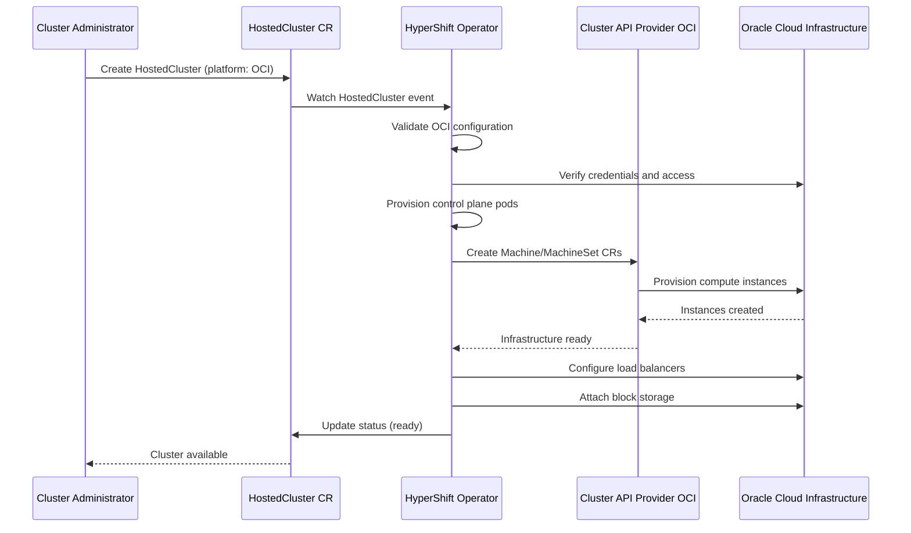

# OCI HCP Support

## Summary

This enhancement enables deployment and operation of OpenShift Hosted
Control Planes (HCP) on Oracle Cloud Infrastructure (OCI), allowing Oracle
to deploy and operate Managed OpenShift services on their cloud platform.
This extends HyperShift's multi-cloud capabilities to include OCI alongside
existing support for AWS (ROSA HCP), Azure (ARO HCP), and GCP HCP,
establishing architectural parity across major cloud providers.

## Motivation

Oracle is a strategic cloud partner seeking to offer Managed OpenShift
with HCP on OCI. This capability enables Oracle to deploy and operate
their own managed service, expanding Red Hat's reach into Oracle's
customer base while leveraging Oracle's cloud infrastructure expertise.
This addresses enterprise customers with Oracle cloud commitments while
maintaining consistent architecture across all major cloud providers.

### User Stories

* As an Oracle customer with existing OCI commitments, I want to run
  Managed OpenShift with HCP on OCI so that I can leverage my cloud
  investments while gaining access to Red Hat's OpenShift platform.

* As an Oracle cloud architect, I want to deploy and operate Managed
  OpenShift with HCP on OCI so that I can provide my customers with a
  fully managed Kubernetes platform that integrates natively with OCI
  services.

* As a Red Hat engineer, I want to provide architectural guidance and
  reference patterns for HCP on OCI so that Oracle can successfully
  build and operate their managed service with best practices.

* As a platform SRE, I want full observability of HCP clusters running
  on OCI so that I can monitor, troubleshoot, and remediate issues at
  scale across multiple tenancies.

### Goals

* Enable HyperShift operator to provision and manage hosted control
  planes on OCI infrastructure

* Integrate OCI-specific services (networking, storage, load balancing,
  IAM) with HCP architecture

* Provide full observability patterns for HCP clusters running on OCI

* Document deployment best practices and architectural recommendations
  for Oracle's development team

* Achieve feature parity with existing HCP implementations on AWS,
  Azure, and GCP where applicable to OCI's service offerings

### Non-Goals

* Full production implementation of Oracle's managed service (Oracle
  will own this)

* Support for OCI-specific features not required for core HCP
  functionality (can be addressed in future enhancements)

* Migration tooling from other cloud providers to OCI

## Proposal

This proposal introduces OCI as a supported platform for HyperShift by
integrating OCI-specific infrastructure provisioning, networking, and
cloud services with the existing HCP architecture. The implementation
leverages Cluster API Provider OCI (CAPOCI) for infrastructure lifecycle
management and introduces OCI-specific controllers in the HyperShift
operator to handle OCI service integration.

The core components include:

* Extension of HyperShift operator to support OCI platform type
* Integration with Cluster API Provider OCI (CAPOCI) for infrastructure
  provisioning
* OCI cloud controller manager for cloud provider integration
* OCI-specific networking configuration (VCN, subnets, security lists)
* Integration with OCI services (load balancers, block storage, IAM)
* Observability stack configuration for OCI environments

### Workflow Description

**Oracle Platform Engineer** is a human user responsible for deploying
HCP infrastructure on OCI.

**Red Hat Architect** is a human user responsible for providing
architectural guidance and best practices.

**HyperShift Operator** is the Kubernetes operator responsible for
managing hosted control planes.

**Cluster Administrator** is a human user responsible for managing
individual hosted clusters.

#### Deployment Workflow

1. The Oracle Platform Engineer reviews the OCI HCP architecture
   documentation and best practices guide provided by Red Hat.

2. The Oracle Platform Engineer configures the OCI management cluster
   (OKE cluster) to host the HyperShift operator.

3. The Oracle Platform Engineer creates an OCI credentials secret
   containing the necessary IAM user or instance principal credentials.

4. The Oracle Platform Engineer deploys the HyperShift operator to the
   management cluster with OCI platform support enabled via the
   `OCIPlatform` feature gate.

5. The Cluster Administrator creates a HostedCluster resource
   specifying OCI as the platform type, including VCN, subnet, and
   region configurations.

6. The HyperShift Operator validates the OCI configuration and
   provisions the control plane infrastructure in the management
   cluster.

7. The HyperShift Operator leverages CAPOCI to provision worker node
   infrastructure (compute instances, networking) in the specified OCI
   tenancy.

8. The OCI cloud controller manager integrates the hosted cluster with
   OCI services (load balancers for ingress/API, block storage for
   persistent volumes).

9. The Cluster Administrator verifies cluster health through the
   observability stack (metrics, logs, alerts) configured for OCI.

10. The Oracle Platform Engineer monitors multiple hosted clusters
    across tenancies using centralized observability patterns.

#### Failure Recovery Workflow

1. If infrastructure provisioning fails, CAPOCI reports the error back
   to the HyperShift operator, which updates the HostedCluster status.

2. The Cluster Administrator reviews the status conditions and error
   messages to identify the root cause (e.g., quota limits, network
   configuration issues).

3. The Cluster Administrator remediates the issue (e.g., requesting
   quota increases, updating network configurations) and triggers
   reconciliation.

4. The HyperShift operator retries the provisioning operation based on
   the corrected configuration.



### API Extensions

This enhancement adds OCI-specific fields to existing HyperShift CRDs
in the `hypershift.openshift.io/v1beta1` API group. These additions will
be gated behind the `OCIPlatform` feature gate.

#### HostedCluster CRD Extensions

**Status**: Proposed new API

The `HostedCluster` CRD will be extended with OCI platform
configuration under `.spec.platform.oci`:

```go
type PlatformSpec struct {
    // ... other platform fields (AWS, Azure, GCP, etc.)

    // oci specifies configuration for clusters running on Oracle Cloud
    // Infrastructure.
    //
    // +optional
    // +immutable
    // +openshift:enable:FeatureGate=OCIPlatform
    OCI *OCIPlatformSpec `json:"oci,omitempty"`
}

// OCIPlatformSpec specifies configuration for clusters running on
// Oracle Cloud Infrastructure.
type OCIPlatformSpec struct {
    // tenancy is the OCI tenancy OCID (root compartment).
    // Format: ocid1.tenancy.<realm>..<unique_id>
    // +required
    // +immutable
    Tenancy string `json:"tenancy"`

    // compartment is the OCI compartment OCID where cluster resources
    // will be created.
    // Format: ocid1.compartment.<realm>..<unique_id>
    // +required
    // +immutable
    Compartment string `json:"compartment"`

    // region is the OCI region (e.g., "us-phoenix-1", "uk-london-1")
    // +required
    // +immutable
    Region string `json:"region"`

    // networkConfig specifies VCN configuration for the cluster
    // +required
    NetworkConfig OCINetworkConfig `json:"networkConfig"`

    // endpointAccess controls API endpoint accessibility
    // Allowed values: "Private", "PublicAndPrivate"
    // +kubebuilder:default=Private
    // +optional
    EndpointAccess OCIEndpointAccessType `json:"endpointAccess,omitempty"`
}

// OCINetworkConfig specifies VCN configuration for OCI clusters
type OCINetworkConfig struct {
    // vcn is the Virtual Cloud Network (VCN) for the cluster
    // +required
    VCN OCIVCNReference `json:"vcn"`

    // nlbSubnet is the subnet where the Network Load Balancer is deployed
    // Required for private connectivity to the hosted control plane
    // +optional
    NLBSubnet *OCISubnetReference `json:"nlbSubnet,omitempty"`
}

// OCIVCNReference represents a reference to an OCI VCN by OCID
type OCIVCNReference struct {
    // ocid is the Oracle Cloud Identifier for the VCN
    // Format: ocid1.vcn.<realm>.<region>[.future_use].<unique_id>
    // +required
    OCID string `json:"ocid"`
}

// OCISubnetReference represents a reference to an OCI Subnet by OCID
type OCISubnetReference struct {
    // ocid is the Oracle Cloud Identifier for the subnet
    // Format: ocid1.subnet.<realm>.<region>[.future_use].<unique_id>
    // +required
    OCID string `json:"ocid"`
}
```

#### NodePool CRD Extensions

**Status**: Proposed new API

The `NodePool` CRD will be extended with OCI-specific fields for worker
node configuration under `.spec.platform.oci`. Following the pattern of
other platforms (AWS, Azure, KubeVirt):

```go
type NodePoolPlatform struct {
    // ... other platform fields (AWS, Azure, etc.)

    // oci specifies the configuration used when operating on OCI platform
    //
    // +optional
    // +openshift:enable:FeatureGate=OCIPlatform
    OCI *OCINodePoolPlatform `json:"oci,omitempty"`
}

// OCINodePoolPlatform specifies the configuration for NodePool when
// operating on Oracle Cloud Infrastructure
type OCINodePoolPlatform struct {
    // instanceType is the OCI compute shape (e.g., "VM.Standard.E4.Flex",
    // "VM.Standard3.Flex", "BM.Standard.E4.128")
    // See https://docs.oracle.com/en-us/iaas/Content/Compute/References/computeshapes.htm
    // +required
    InstanceType string `json:"instanceType"`

    // ocpus specifies the number of OCPUs for flexible shapes
    // Required for shapes ending in ".Flex"
    // +optional
    OCPUs *int32 `json:"ocpus,omitempty"`

    // memoryInGBs specifies memory allocation for flexible shapes
    // Required for shapes ending in ".Flex"
    // +optional
    MemoryInGBs *int32 `json:"memoryInGBs,omitempty"`

    // bootVolumeSizeInGBs specifies the size of the boot volume in GB
    // Defaults to 50 GB if not specified
    // +optional
    // +kubebuilder:default=50
    BootVolumeSizeInGBs *int64 `json:"bootVolumeSizeInGBs,omitempty"`

    // subnet is the OCI subnet where worker nodes will be placed
    // +required
    Subnet OCISubnetReference `json:"subnet"`

    // imageID is the OCI image OCID for worker nodes
    // If not specified, uses the default RHCOS image for the region
    // +optional
    ImageID *string `json:"imageID,omitempty"`
}
```

#### No Modification of Existing Resource Behavior

This enhancement does not modify the behavior of existing resources
owned by other teams or upstream resources. The OCI platform provider is
isolated and only adds new fields under `.spec.platform.oci` for
HostedCluster and `.spec.platform.oci` for NodePool.

The operational impact of these API extensions is covered in the
"Operational Aspects of API Extensions" section below.

### Topology Considerations

#### Hypershift / Hosted Control Planes

This enhancement is specifically designed for Hosted Control Planes
topology. The management cluster (OKE cluster on OCI) hosts the control
plane components for multiple guest clusters, following the standard
HyperShift architecture pattern.

OCI-specific considerations:

* Management cluster must have connectivity to OCI API endpoints
* Control plane pods require OCI credentials for infrastructure
  management
* Network connectivity between management cluster and guest cluster
  worker nodes must be established via VCN peering or alternative
  networking solutions

#### Standalone Clusters

This enhancement does not apply to standalone OpenShift clusters. For
traditional OpenShift deployments on OCI, users should continue to use
existing installation methods (IPI/UPI) that are outside the scope of
HyperShift.

#### Single-node Deployments or MicroShift

This enhancement does not affect single-node OpenShift (SNO) or
MicroShift deployments. The HyperShift operator and HCP architecture are
not applicable to these deployment models.

Single-node deployments on OCI would continue to use the standard SNO
installation approach, which is separate from HyperShift.

#### Oracle Kubernetes Engine (OKE)

**Note**: In this context, OKE refers to Oracle Kubernetes Engine
(Oracle's managed Kubernetes service on OCI), not OpenShift Kubernetes
Engine.

This enhancement is highly relevant to Oracle Kubernetes Engine
deployments as the management cluster will typically be an OKE cluster
running on OCI. The HyperShift operator will be deployed to this OKE
management cluster to provision and manage hosted control planes for
Managed OpenShift.

OKE-specific considerations:

* OKE cluster must meet minimum resource requirements for hosting
  multiple OpenShift control planes
* OKE cluster must have appropriate OCI IAM policies for infrastructure
  provisioning
* OKE cluster networking must support connectivity to guest cluster
  worker nodes

### Implementation Details/Notes/Constraints

The implementation requires changes across several components:

**HyperShift Operator**:
* Add OCI platform provider implementation in
  `hypershift/hypershift-operator/controllers/hostedcluster/`
* Implement OCI-specific infrastructure reconciliation logic
* Add validation for OCI configuration fields
* Integrate with CAPOCI for infrastructure lifecycle management

**API Changes**:
* Extend `HostedCluster` CRD with OCI platform specification
* Add OCI-specific fields to `NodePool` CRD
* Define OCI platform status fields for reporting infrastructure state

**Infrastructure Integration**:
* Integrate with CAPOCI for compute instance provisioning
* Implement OCI VCN and subnet configuration logic
* Configure security lists and network security groups for cluster
  communication
* Integrate OCI load balancer service for ingress and API endpoints

**Cloud Provider Integration**:
* Deploy OCI cloud controller manager in hosted control planes
* Configure CSI driver for OCI block storage
* Implement integration with OCI IAM for service authentication

**Observability**:
* Configure metrics collection for OCI-specific components
* Implement logging integration with OCI Logging service
* Define alerts for OCI infrastructure health
* Provide dashboards for OCI-specific metrics

**Feature Gate**:
Per dev-guide/feature-zero-to-hero.md, this feature must be gated behind
a new `OCIPlatform` feature gate that will be added to
https://github.com/openshift/api/blob/master/features/features.go with
the `DevPreviewNoUpgrade` feature set initially. The feature gate
definition must specify:
* Jira component: "HyperShift"
* Contact person: TBD (HyperShift team lead)
* Enhancement PR: Link to this merged enhancement proposal
* Initial feature set: `DevPreviewNoUpgrade`

The API fields in HostedCluster and NodePool CRDs will use the
`+openshift:enable:FeatureGate=OCIPlatform` marker to ensure they are
only available when the feature gate is enabled.

**Constraints**:
* Requires OCI credentials with appropriate IAM policies
* Management cluster must have network connectivity to OCI API endpoints
* OCI service limits (compute quotas, VCN limits) may constrain
  deployment scale
* Some OCI services may have region-specific availability

### Cross-Team Dependencies

This enhancement requires support and contributions from multiple
OpenShift component teams. The following sections outline what is needed
from each team to enable full OCI HCP functionality.

#### Image Registry Team

**Requirements**:
* Support for OCI Object Storage as a backend for the internal image
  registry
* Integration with OCI Object Storage API for image push/pull operations
* Support for OCI IAM authentication for object storage access

**Specific Changes Needed**:
* Extend the image registry operator to support OCI Object Storage
  configuration
* Implement OCI Object Storage driver following the existing S3/Azure
  Blob patterns
* Add validation for OCI Object Storage bucket configuration
* Support for OCI resource principals or IAM credentials for
  authentication

**Contacts**: TBD (Image Registry team)

#### Storage Team

**Requirements**:
* OCI Block Volume CSI driver integration for persistent volume support
* OCI File Storage CSI driver integration for ReadWriteMany volumes
  (optional but recommended)
* Support for OCI-specific storage classes and volume parameters

**Specific Changes Needed**:
* Collaborate with Oracle on upstream OCI CSI drivers
  (https://github.com/oracle/oci-cloud-controller-manager contains CSI
  drivers)
* Work with Oracle to ensure drivers meet OpenShift requirements and can
  be included in OpenShift release payload
* Package OCI CSI drivers in OpenShift release payload
* Create default StorageClass configurations for OCI Block Volumes
* Document OCI-specific volume parameters (performance tiers, volume
  types)
* Ensure CSI drivers work with OCI IAM authentication in HyperShift
  context

**Upstream Collaboration**: Changes needed for OpenShift integration
should be contributed to Oracle's upstream OCI CSI driver repository.

**Contacts**: TBD (Storage team)

#### Ingress Team

**Requirements**:
* Support for OCI Load Balancer service for IngressController
* Integration with OCI Network Load Balancer (NLB) for Layer 4 traffic
* Support for OCI Flexible Load Balancer for HTTP/HTTPS traffic

**Specific Changes Needed**:
* Extend cluster-ingress-operator to support OCI Load Balancer
  provisioning
* Implement OCI Load Balancer annotations for Service type=LoadBalancer
* Support for OCI-specific load balancer configurations (shapes,
  bandwidth)
* Handle OCI Load Balancer lifecycle (create, update, delete) in
  HyperShift hosted clusters
* Support for private load balancers for private endpoint access

**Contacts**: TBD (Ingress team)

#### Networking Team

**Requirements**:
* OCI VCN integration for cluster networking
* Support for OCI-specific network configurations (security lists,
  network security groups)
* Integration with OCI Virtual Network Interface Cards (VNICs) for pod
  networking

**Specific Changes Needed**:
* Extend cluster-network-operator for OCI VCN configuration
* Support for OCI subnet allocation for pod networking
* Handle OCI security list and NSG configuration for cluster
  communication
* Implement OCI-specific network policies if needed
* Support for OCI VCN peering for management cluster to guest cluster
  connectivity

**Contacts**: TBD (Networking team)

#### Cloud Platform Team - CAPOCI Integration

**Requirements**:
* Cluster API Provider OCI (CAPOCI) integration for inclusion in
  OpenShift release payload
* Collaboration with Oracle on CAPOCI enhancements for OpenShift/HyperShift
* Support for OpenShift-specific machine configurations

**Specific Changes Needed**:
* Work with Oracle to contribute OpenShift and HyperShift integration
  changes to upstream CAPOCI
  (https://github.com/oracle/cluster-api-provider-oci)
* Ensure CAPOCI supports OpenShift requirements (RHCOS images, HyperShift
  patterns, etc.)
* Package CAPOCI from upstream in OpenShift release payload
* Establish collaborative relationship with Oracle CAPOCI maintainers for
  ongoing support and feature development
* Define SLA with Oracle for CAPOCI updates and security patches
* Ensure CAPOCI works with HyperShift's infrastructure provisioning
  patterns

**Collaboration Model**: Red Hat and Oracle will collaborate on CAPOCI
development. OpenShift-specific features and HyperShift integration
changes should be contributed upstream to Oracle's CAPOCI repository
rather than maintained in a separate fork. This partnership approach
ensures both teams benefit from improvements and reduces maintenance
burden.

**Ownership**: Joint ownership between Red Hat (HyperShift/Cloud teams)
and Oracle (CAPOCI maintainers). Regular sync meetings and shared
roadmap planning recommended.

**Contacts**: TBD (Cloud Provider team, HyperShift team, Oracle CAPOCI
maintainers)

#### OCI Cloud Controller Manager

**Requirements**:
* Package and maintain the OCI Cloud Controller Manager (CCM) for
  OpenShift
* Ensure CCM works in HyperShift hosted control plane architecture

**Specific Changes Needed**:
* Collaborate with Oracle on upstream OCI CCM
  (https://github.com/oracle/oci-cloud-controller-manager)
* Work with Oracle to contribute HyperShift compatibility changes
  upstream
* Package OCI CCM from upstream in OpenShift release payload
* Ensure CCM adapts to HyperShift's control plane/data plane separation
  model
* Establish collaborative support model with Oracle

**Upstream Collaboration**: HyperShift-specific changes should be
contributed to Oracle's upstream OCI CCM repository.

**Contacts**: TBD (Cloud Provider team, HyperShift team, Oracle CCM
maintainers)

#### Documentation Team

**Requirements**:
* Document OCI HCP installation and configuration procedures
* Create user-facing documentation for OCI-specific features
* Document differences between OCI and other cloud providers

**Contacts**: TBD (Documentation team)

#### CI/CD and Testing Infrastructure

**Requirements**:
* OCI cloud credentials for CI/CD testing infrastructure
* Prow jobs for OCI E2E testing
* OCI resources for periodic and presubmit test runs

**Specific Changes Needed**:
* Provision OCI tenancy for OpenShift CI (potentially provided by Oracle
  as part of partnership)
* Create Prow job configurations for OCI platform testing
* Allocate OCI quota for test cluster provisioning
* Set up OCI credentials management in Prow

**Contacts**: TBD (Test Platform team, HyperShift team)

### Risks and Mitigations

**Risk: OCI API rate limiting**
* Mitigation: Implement exponential backoff and request throttling in
  OCI API clients. Monitor API usage and optimize reconciliation
  frequency.

**Risk: Network connectivity issues between management and guest
clusters**
* Mitigation: Provide comprehensive networking documentation and
  validation tooling. Support multiple networking topologies (VCN
  peering, VPN, FastConnect).

**Risk: OCI-specific service limitations or differences from AWS/Azure**
* Mitigation: Document OCI-specific constraints clearly. Implement
  feature parity where possible and document differences in operational
  guides.

**Risk: Security vulnerabilities in credential handling**
* Mitigation: Follow OpenShift security best practices for credential
  management. Support instance principals and short-lived credentials.
  Conduct security review with Red Hat security team.

**Risk: Incomplete observability leading to operational challenges**
* Mitigation: Implement comprehensive observability from day one.
  Provide runbooks and troubleshooting guides. Engage with Oracle SRE
  teams early for feedback.

Security will be reviewed by the Red Hat HyperShift security team and
OCI platform security experts.

UX will be reviewed by the HyperShift product team to ensure consistent
experience across cloud providers.

### Drawbacks

**Increased maintenance burden**: Adding OCI as a supported platform
increases the testing and maintenance surface area for HyperShift. Each
HyperShift release must be validated on OCI infrastructure.

**OCI-specific operational complexity**: SREs must learn OCI-specific
concepts, tooling, and troubleshooting approaches, which differ from
AWS/Azure/GCP patterns.

**Potential for platform-specific bugs**: OCI may expose edge cases or
limitations not present in other cloud providers, requiring
platform-specific fixes and workarounds.

**Limited initial feature parity**: Some features available on mature
HCP platforms (AWS, Azure) may not be immediately available on OCI due
to service availability or implementation complexity.

**Dependency on CAPOCI maturity**: The quality and reliability of the
OCI integration depends on the maturity of Cluster API Provider OCI,
which is developed upstream and may have its own limitations.

Despite these drawbacks, the strategic value of enabling Managed
OpenShift on OCI through partnership with Oracle outweighs the
implementation and maintenance costs. The architectural patterns
developed for OCI will also inform future multi-cloud HCP work.

## Alternatives (Not Implemented)

**Alternative 1: Wait for upstream Cluster API OCI maturity**
* Instead of implementing OCI support now, wait until CAPOCI reaches
  full maturity and stability.
* **Not chosen because**: Strategic timeline with Oracle requires proof
  of concept by Red Hat Summit (May 2026). Waiting would miss this
  critical partnership milestone.

**Alternative 2: Use Terraform-based infrastructure provisioning**
* Instead of using CAPOCI, implement OCI infrastructure provisioning
  using Terraform providers similar to the existing
  `oci-openshift/oci-openshift` approach.
* **Not chosen because**: HyperShift architecture is built on Cluster
  API patterns for consistency across platforms. Introducing a
  Terraform-based approach would diverge from established patterns and
  increase maintenance complexity.

**Alternative 3: Oracle builds OCI support independently**
* Instead of Red Hat implementing OCI support, Oracle could build the
  integration independently and contribute it upstream.
* **Not chosen because**: Red Hat's architectural expertise with
  HyperShift is critical for ensuring quality implementation. The
  strategic partnership benefits from joint development and knowledge
  transfer.

**Alternative 4: Implement full managed service in this enhancement**
* Instead of focusing on technical enablement, implement the complete
  managed service offering for Oracle.
* **Not chosen because**: The goal of this enhancement is to enable
  Oracle to operate their own managed service. Full production
  implementation will be owned by Oracle after Red Hat provides the
  reference architecture and implementation guidance.

## Open Questions [optional]

1. What is the minimum OCI API version that must be supported? Should
   we target the latest stable API version or maintain compatibility
   with older versions?

2. Should the implementation support OCI GovCloud regions from day one,
   or can this be added as a follow-up enhancement?

3. What is the preferred approach for OCI credential management: IAM
   user credentials, instance principals, or both?

4. Should we implement OCI-specific cost optimization features (e.g.,
   preemptible instances for dev/test workloads) in the initial
   release?

## Test Plan

<!-- TODO: This section needs to be filled in when the enhancement is
targeted at a release.

Per dev-guide/feature-zero-to-hero.md and dev-guide/test-conventions.md,
all tests must include appropriate labels:

* `[OCPFeatureGate:OCIPlatform]` - Feature gate label for OCI HCP
  support
* `[Jira:"HyperShift"]` - Component label for routing bugs/issues
* `[Suite:openshift/hypershift/oci]` - Test suite label if a dedicated
  suite is needed for disruptive/slow tests
* `[Serial]` - If tests must run serially
* `[Slow]` - If tests run slowly (>5 minutes)
* `[Disruptive]` - If tests cause cluster disruption

Test strategy:

**Unit Tests**:
* Test OCI platform provider validation logic
* Test OCI configuration parsing and defaulting
* Test OCI-specific reconciliation logic

**Integration Tests**:
* Test HyperShift operator with CAPOCI for infrastructure provisioning
* Test OCI credential handling and authentication
* Test network configuration and connectivity

**E2E Tests**:
* Test full hosted cluster lifecycle (create, upgrade, delete) on OCI
* Test node pool operations (scale up, scale down, rolling updates)
* Test OCI service integration (load balancers, storage, IAM)
* Test failure scenarios (network issues, quota limits, API errors)
* Test multi-tenancy scenarios with multiple hosted clusters

**Platform Coverage**:
Tests must run on OCI infrastructure with coverage for:
* Multiple OCI regions
* Different instance shapes (standard, flex, bare metal)
* Different networking topologies (single VCN, multi-VCN, VCN peering)

**Observability Testing**:
* Validate metrics collection for OCI-specific components
* Validate log aggregation from OCI environments
* Validate alerting for OCI infrastructure failures

**Security Testing**:
* Validate credential rotation and expiration handling
* Validate IAM policy enforcement
* Validate network isolation between hosted clusters
-->

## Graduation Criteria

<!-- TODO: Complete this section when targeting a release.

Per dev-guide/feature-zero-to-hero.md, promotion from DevPreviewNoUpgrade
to TechPreviewNoUpgrade and eventually to GA (Default feature set)
requires:

**Minimum Testing Requirements**:
* At least 5 tests per feature
* All tests run at least 7 times per week
* All tests run at least 14 times per supported platform
* All tests achieve at least 95% pass rate
* Tests run on all supported platforms (AWS, Azure, GCP, vSphere,
  Baremetal with various network stacks)
* Testing requirements met no less than 14 days before branch cut

**Note**: For OCI-specific features, we may need to request an exception
for running on all platforms if the feature is inherently OCI-specific.
This exception must follow the SBAR process.

**Dev Preview -> Tech Preview**:
* Ability to deploy and operate hosted clusters on OCI end-to-end
* Documentation for Oracle's development team
* Sufficient test coverage on OCI infrastructure
* Feedback from Oracle engineering team on usability
* Metrics and monitoring in place for OCI components
* Alerts defined for OCI infrastructure failures

**Tech Preview -> GA**:
* Extensive testing (upgrade, downgrade, scale) on OCI
* Feedback period of at least one release cycle
* OCI support enabled by default via Default feature set
* Full observability telemetry collection
* SLOs documented for OCI HCP clusters
* Load testing completed on OCI infrastructure
* User-facing documentation in openshift-docs
* Production deployment by Oracle with positive feedback
-->

### Dev Preview -> Tech Preview

- Ability to utilize the enhancement end to end
- End user documentation, relative API stability
- Sufficient test coverage
- Gather feedback from users rather than just developers
- Enumerate service level indicators (SLIs), expose SLIs as metrics
- Write symptoms-based alerts for the component(s)

### Tech Preview -> GA

- More testing (upgrade, downgrade, scale)
- Sufficient time for feedback
- Available by default
- Backhaul SLI telemetry
- Document SLOs for the component
- Conduct load testing
- User facing documentation created in
  [openshift-docs](https://github.com/openshift/openshift-docs/)

### Removing a deprecated feature

N/A - This is a new feature.

## Upgrade / Downgrade Strategy

This enhancement follows standard HCP upgrade patterns. The HyperShift
operator and control plane components will follow the OpenShift release
cadence and upgrade mechanisms.

**Upgrade Strategy**:

* Control plane upgrades are managed by the HyperShift operator running
  in the management cluster. Upgrading the HyperShift operator enables
  OCI-specific improvements and bug fixes.

* Hosted cluster upgrades (control plane and workers) follow standard
  OpenShift upgrade procedures. The OCI cloud controller manager and CSI
  driver versions are tied to the OpenShift release.

* OCI infrastructure (compute instances, networking) is immutable and
  managed through CAPOCI. Instance updates are performed via rolling
  replacement of worker nodes.

* No changes to OCI configuration are required on upgrade unless new OCI
  services or features are introduced in a specific release.

**Downgrade Strategy**:

* If an N→N+1 upgrade of the HyperShift operator fails or causes issues,
  the operator can be rolled back to version N using standard Kubernetes
  deployment rollback mechanisms.

* Hosted cluster downgrades follow OpenShift downgrade procedures.
  OCI-specific components (cloud controller manager, CSI driver) will be
  downgraded as part of the cluster downgrade.

* CAPOCI-managed infrastructure does not require downgrade as instances
  are immutable. Rolling back worker nodes would involve recreating
  instances with the previous configuration.

* Credentials and network configurations do not need to be changed during
  downgrade operations.

**Version Skew Considerations**:

* The HyperShift operator must maintain compatibility with N-1 hosted
  cluster versions to support gradual upgrades across multiple hosted
  clusters.

* CAPOCI version compatibility must be validated to ensure
  infrastructure management remains functional during HyperShift operator
  upgrades.

## Version Skew Strategy

This enhancement handles version skew following standard HyperShift
patterns:

* The HyperShift operator in the management cluster may be at version N
  while hosted control planes are at version N-1. The operator must
  maintain backward compatibility for OCI-specific controllers.

* During HyperShift operator upgrades, both old and new versions of OCI
  provider code may be running temporarily. All infrastructure operations
  must be idempotent to handle this gracefully.

* The OCI cloud controller manager version is tied to the hosted cluster
  version, not the HyperShift operator version. Version skew between
  control plane and cloud controller manager follows standard Kubernetes
  version skew policy (N±1).

* CAPOCI infrastructure controllers must support worker nodes running N-1
  kubelet versions during cluster upgrades.

* OCI API clients must handle API version negotiation gracefully to
  support multiple OCI API versions as the service evolves.

## Operational Aspects of API Extensions

This enhancement adds CRD fields to the `HostedCluster` and `NodePool`
resources in the `hypershift.openshift.io/v1beta1` API group.

**SLIs for API Health**:

* HyperShift operator condition `HostedClusterAvailable=True` indicates
  the hosted cluster control plane is healthy
* HyperShift operator condition `HostedClusterProgressing=False`
  indicates reconciliation is complete
* Metrics: `hypershift_hostedcluster_available` (gauge, by platform)
* Metrics: `hypershift_hostedcluster_reconcile_errors_total` (counter,
  by platform)
* Metrics: `hypershift_oci_api_calls_total` (counter, by operation,
  result)

**Impact on Existing SLIs**:

* Adding OCI platform support does not impact existing platform
  implementations (AWS, Azure, GCP). Each platform provider is isolated.
* Expected use cases require fewer than 100 hosted clusters per
  management cluster, which is well within HyperShift's tested scale.
  This should not impact general API throughput.
* OCI-specific reconciliation loops are independent and do not affect
  reconciliation performance for other platforms.

**Measurement Strategy**:

* QE will run OCI-specific E2E tests for each release to measure control
  plane provisioning time, API latency, and failure rates.
* Performance team will conduct scale testing to validate 100+ hosted
  clusters on OCI infrastructure.
* Sippy will track OCI test results separately to identify
  OCI-specific regressions.

**Failure Modes**:

1. **OCI API rate limiting or unavailability**
   - Impact: Hosted cluster creation/updates delayed or fail
   - Affected functionality: Infrastructure provisioning via CAPOCI
   - Teams: HyperShift team, OCI platform team

2. **Invalid OCI configuration in HostedCluster CR**
   - Impact: Hosted cluster creation fails with validation error
   - Affected functionality: Cluster creation blocked until
     configuration corrected
   - Teams: HyperShift team

3. **OCI credential expiration or invalid permissions**
   - Impact: Infrastructure reconciliation fails, cluster operations
     degraded
   - Affected functionality: Node scaling, load balancer updates,
     storage provisioning
   - Teams: HyperShift team, OCI IAM team

4. **Network connectivity issues between management and guest clusters**
   - Impact: Control plane cannot manage worker nodes, cluster degraded
   - Affected functionality: Node management, workload scheduling
   - Teams: HyperShift team, OCI networking team

## Support Procedures

**Detecting Failure Modes**:

1. **OCI API Issues**:
   - Symptom: HyperShift operator logs show "OCI API rate limit
     exceeded" or connection timeout errors
   - Metric: `hypershift_oci_api_calls_total{result="error"}` increasing
   - Operator condition: `HostedClusterProgressing=True` with reason
     "OCIAPIUnavailable"

2. **Invalid Configuration**:
   - Symptom: HostedCluster status shows validation error
   - Event: "Invalid OCI configuration: VCN ID not found in compartment"
   - Operator condition: `HostedClusterAvailable=False` with reason
     "InvalidConfiguration"

3. **Credential Issues**:
   - Symptom: CAPOCI logs show "authentication failed" or "permission
     denied"
   - Metric: `hypershift_oci_api_calls_total{result="auth_error"}`
     increasing
   - Event: "Failed to authenticate with OCI API"

4. **Network Connectivity Issues**:
   - Symptom: Control plane cannot reach worker node API
   - Metric: Node readiness flapping in hosted cluster
   - Alert: `HostedClusterNodeUnreachable` firing

**Disabling the API Extension**:

To disable OCI HCP support, remove the `OCIPlatform` feature gate from
the feature gate configuration. This will prevent creation of new
HostedClusters with platform type OCI.

**Consequences of Disabling**:

* **Cluster Health**: Existing OCI hosted clusters will continue to run,
  but the HyperShift operator will stop reconciling them. Control planes
  will become unmanaged.

* **Existing Workloads**: Running workloads will continue to function as
  worker nodes and control plane pods are already provisioned. However,
  any infrastructure changes (scaling, updates) will not be processed.

* **New Workloads**: New hosted clusters with platform type OCI cannot
  be created while the feature gate is disabled.

**Graceful Failure and Recovery**:

The HyperShift operator implements reconciliation with exponential
backoff. If OCI API calls fail temporarily, the operator will retry with
increasing delays. When the issue is resolved (e.g., API service
restored, credentials updated), reconciliation will resume automatically
without requiring manual intervention.

Infrastructure state is stored in Kubernetes resources (HostedCluster,
NodePool, Machine CRs). If the operator restarts or is temporarily
unavailable, it will resume reconciliation from the last known state
without data loss.

## Infrastructure Needed [optional]

**OCI Resources for Development and Testing**:

* OCI tenancy with appropriate quota for compute instances, VCNs, load
  balancers, and block storage
* OKE cluster for hosting HyperShift operator during development
* Access to multiple OCI regions for testing regional deployments
* OCI IAM user credentials with permissions for infrastructure
  provisioning

**CI/CD Infrastructure**:

* Prow job infrastructure for running OCI E2E tests
* OCI credentials stored securely in OpenShift CI for automated testing
* Storage for OCI cluster artifacts and logs from test runs

**Documentation and Collaboration**:

* Dedicated Slack channel for HyperShift OCI integration discussions
* Shared documentation repository for architectural guidance and best
  practices
* Regular sync meetings between Red Hat HyperShift team and Oracle
  engineering
