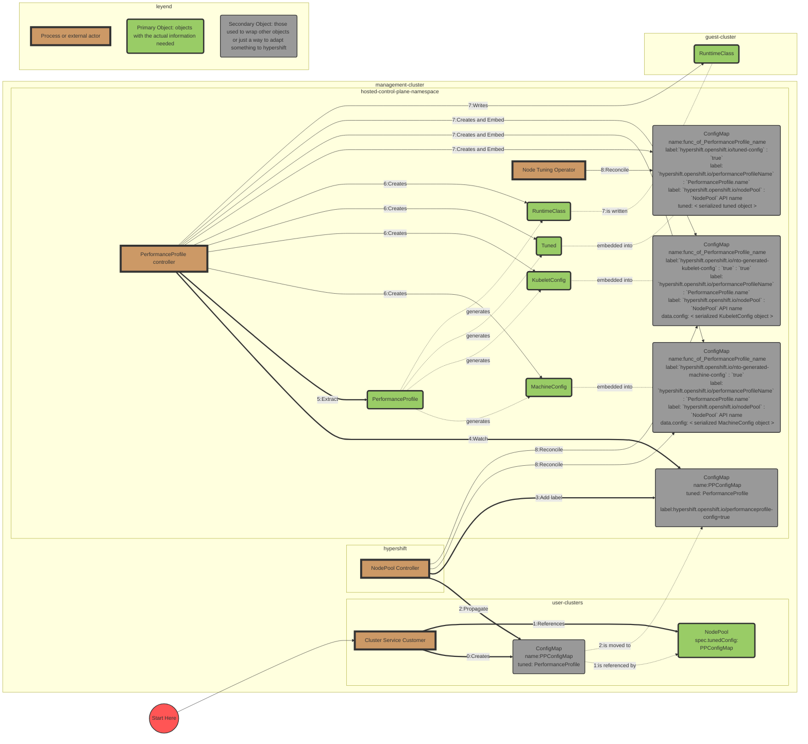
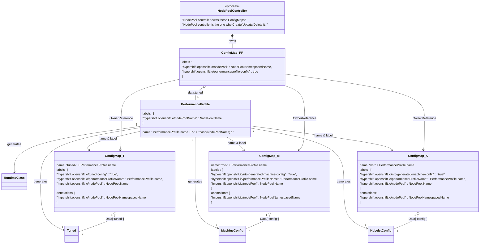

# Performance Profile Controller Adaptation to Hypershift

## Summary

This enhancement describes how the [Performance Profile Controller](https://github.com/openshift/cluster-node-tuning-operator/blob/master/docs/performanceprofile/performance_controller.md), previously known as Performance add-on operator,
will run in Hypershift's managed control plane.

This is part of Phase-3 for Node Tunning Operator enablement and so it depends on the two previous phases.

## Motivation

See the HyperShift [project goals](https://hypershift-docs.netlify.app/reference/goals-and-design-invariants/).
These goals should not come at the cost of giving up any existing OpenShift features.

In standalone OpenShift Performance Profile Controller, as part of Node Tuning Operator, helps in optimizing OpenShift clusters for applications sensitive to cpu and network latency
by letting the user to create a more comprehensive and unified API from where the controller extracts the appropiate parameters,
creates the kubernetes objects and applies them to the worker nodes in the cluster.

### User Stories

[See](/enhancements/hypershift/node-tuning.md#user-stories)

### Goals

- Handle the PerformanceProfile objects in the hosted control plane namespaces while applying the output manifests to the appropiate worker nodes in the hosted cluster.

### Non-Goals

- N/A

## Proposal

The Performance Profile Controller, being part of the Node Tuning Operator, will run in the hosted control plane namespace, alongside several other control plane components.

Performance Profile Controller optimizes OpenShift clusters for applications sensitive to cpu and network.
More info [here](https://github.com/openshift/cluster-node-tuning-operator/blob/master/docs/performanceprofile/performance_controller.md)

[PerformanceProfile CRD](https://github.com/openshift/cluster-node-tuning-operator/blob/master/docs/performanceprofile/performance_profile.md) is the API for Performance Profile Controller. Using a PerformanceProfile as input Performance Profile Controller currently generates four different objects:

- machineconfiguration.openshift.io/v1/MachineConfiguration
- machineconfiguration.openshift.io/v1/KubeletConfig
- tuned.openshift.io/v1/Tuned
- node.k8s.io/v1/RuntimeClass

In a Standalone deployment this CRs are generated by Performance Profile Controller and then reconciled by the appropriate controllers/operators running in the same cluster.
In a Hypershift deployment we need to change how these CRs are created.

### Workflow Description
1. Cluster Service Consumer will create PerformanceProfile objects inside of ConfigMaps, using a key named `tuned`, and reference these ConfigMaps in the `spec.tunedConfig` field of the NodePool API.
2. NodePool controller will propagate these ConfigMaps into the hosted control plane namespace, where PerformanceProfileController (PPC) is running, adding the label `hypershift.openshift.io/performanceprofile-config=true`
3. PPC will watch the ConfigMaps in the hosted control plane namespace of the management cluster with the label `hypershift.openshift.io/performanceprofile-config=true` extract the PerformanceProfile object and create the objects (MachineConfig, KubeletConfig, Tuned, RuntimeClass) from it. Details on how each of these objects will be handle are given below.

#### Performance Profile

The proposal to handle the Performance Profile (PP) mimics the way NTO handles it `Tuned` API

- [Cluster Service Consumer](https://hypershift-docs.netlify.app/reference/concepts-and-personas/) will create `PerformanceProfile` objects inside of configmaps, then reference these configmaps objects in the `.spec.tunedConfig` field of the `NodePool` API
- NodePool Controller will read these configmaps, extract the `PerformanceProfile`s and propagate that information into one `configmap` per `NodePool` in the `hosted-control-plane-namespace` where Performance Profile Controller runs and can read them.
  - The `configmap` created by NodePool Controller will have the following labels and annotations:
    - label: `hypershift.openshift.io/performanceprofile-config` : `true`
    - label: `hypershift.openshift.io/nodePool` : `NodePool` API name where it was referenced.
    - annotation: `hypershift.openshift.io/nodePool` : `NodePool` API name where it was referenced.
- Performance Profile Controller will watch these configmaps and extract the `PerformanceProfile` objects from them to generate its output.

#### Tuned

The proposal for this output object is to use the way NTO has already put in place to handle its own `tuned` objects as it is.

- Once Performance Profile Controller has created the `tuned` object as usual, it will embeded the `tuned` into a `configmap` in the `hosted-control-plane-namespace`.
  - This `configmap` will have:
    - name: will be function of the `PeformanceProfile` name
    - label: `hypershift.openshift.io/tuned-config` : `true`
    - label: `hypershift.openshift.io/nodePool` : `NodePool` API name where the `PeformanceProfile` which generate this `tuned` was referenced.
    - label: `hypershift.openshift.io/performanceProfileName` : `PerformanceProfile.name`,
    - annotation: `hypershift.openshift.io/nodePool` : `NodePool` API namespaced name where the `PeformanceProfile` which generate this `tuned` was referenced.
    - data: `Tuned` serialized object in the "tuned" key
- This will trigger the reconcile operation in NTO for these kind of objects.

#### MachineConfig

The proposal for this output object is to use the way NTO has already put in place to handle its own `MachineConfig` objects as it is.

- Once Performance Profile Controller has created the `MachineConfig` object as usual, it will embeded the object into a `configmap` in the `hosted-control-plane-namespace`.
- This `configmap` will have:
  - name: will be function of the `PeformanceProfile` name
  - label: `hypershift.openshift.io/nto-generated-machine-config` : `true`
  - label: `hypershift.openshift.io/nodePool` : `NodePool` API name where the `PeformanceProfile` which generate this `MachineConfig` was referenced.
  - label: `hypershift.openshift.io/performanceProfileName` : `PerformanceProfile.name`,
  - annotation: `hypershift.openshift.io/nodePool` : `NodePool` API namespaced name where the `PeformanceProfile` which generate this `MachineConfig` was referenced.
  - data: `MachineConfig` serialized object in the "config" key
- This will trigger the reconcile operation in NodePool Controller for these objects.

#### MCO KubeletConfig

Being this object also handled by MachineConfig Operator (MCO) as `MachineConfig`s the proposal is to handle them in a similar way.

- Once Performance Profile Controller has created the `Kubeletconfig` object as usual, it will embeded the object into a `configmap` in the `hosted-control-plane-namespace`.
- This `configmap` will have:
  - name: will be function of the `PeformanceProfile` name
  - label: `hypershift.openshift.io/nto-generated-kubelet-config` : `true`
  - label: `hypershift.openshift.io/nodePool` : `NodePool` API name where the `PeformanceProfile` which generate this `MachineConfig` was referenced.
  - label: `hypershift.openshift.io/performanceProfileName` : `PerformanceProfile.name`,
  - annotation: `hypershift.openshift.io/nodePool` : `NodePool` API namespaced name where the `PeformanceProfile` which generate this `MachineConfig` was referenced.
  - data: `KubeletConfig` serialized object in the "config" key
- This will trigger the reconcile operation in NodePool Controller for these objects.

#### RuntimeClass

The proposal is to handle these objects like NTO handles its `tuned` configurations once they are in the `hosted-control-plane-namespace`, that is synchronize them directly with the ones in the hosted cluster using the proper KubeConfig.

### Workflow Diagram

#### Static Diagram
This diagram shows all the objects handle by PerformanceProfile and the Configmaps used to embed those objects with all the labels and annotations used to handle the relationships between them.

### API Extensions

None.

This proposal will use the API extensions already proposed by the NTO adaptation [see](/enhancements/hypershift/node-tuning.md#api-extensions)

### Risks and Mitigations

N/A.

### Drawbacks

N/A.

### Test Plan

N/A.

#### Dev Preview -> Tech Preview

N/A.

#### Tech Preview -> GA

N/A.

#### Removing a deprecated feature

N/A.

### Upgrade / Downgrade Strategy

### Version Skew Strategy

N/A.

### Operational Aspects of API Extensions

N/A.

#### Failure Modes

#### Support Procedures

## Alternatives

## Design Details

### Hypershift NodePool controller
In order to propagate any `PerformanceProfile` inside a configmap referenced in the `.spec.TunedConfig` NodePool field to the hosted control plane namespace where the Performance Profile controller could read it, NodePool controller should be modified.
Tuned manifests are already being handled in NodePool controller so we would apply minimal changes to that procedure to also use it for PerformanceProfile manifests.

Basically all configmaps referenced in `NodePool.spec.TunedConfig` field will be read and all `PerformanceProfile`s found embedded into them will be extracted, appended and embedded in a new configmap, this time in the hosted control plane namespace, where Performance Profile controller will be able to handle them.
See openshift/hypershift#1782 

To be able to handle `KubeletConfig` propagation properly NodePool controller should be changed to recognize a `KubeletConfig` as a valid content and set its defaults properly, that is mainly to ensure label `machineconfiguration.openshift.io/role=worker` is set.
This can be made by changing [`defaultAndValidateConfigManifest`](https://github.com/openshift/hypershift/blob/fa0ca3d09fab02ebff64d45b97cc1abaf4f1c27a/hypershift-operator/controllers/nodepool/nodepool_controller.go#L1439)  to handle `KubeletConfig` almost as it is handling `MachineConfig` right now.

### Performance Profile controller

1. Change SetUp to watch over ConfigMaps with Label: `hypershift.openshift.io/performanceprofile-config=true`
In Hypershift Performance Profile controller (PPC) will not be reconciling PerformanceProfile objects perse but ConfigMap objects with PerformanceProfile objects embedded, so the controller SetUp should be changed to resemble this.

2. Change reconcile loop
  Reconcile should somehow follow the same operations as in StandAlone but with some changes
   - Extract PerformanceProfile object from ConfigMap `config` field.
   - Handle deletion
     - Configmap with a `PerformanceProfile` embedded will have an `OwnerReference` to each one of the Configmaps that embed any object created from that `PerformanceProfile`, so whenever the `PerformanceProfile`'s Configmap is deleted all of them will be deleted as well.
     - A [`finalizer`](https://kubernetes.io/docs/concepts/overview/working-with-objects/finalizers/) will be added to each Configmap with a `PerformanceProfile` embedded, this will enable the controller to handle `RuntimeClass` deletion whenever `PerformanceProfile`'s Configmap is marked for deletion
   - Create new components from PerformanceProfile.
     - note:`machineConfigPoolSelector` in KC can be empty
   - Apply components. 
     - Each of the ConfigMaps where elements are embedded will have a name which is a function of the PerformanceProfile name.
     - Read the ConfigMap:
       - if it do not exist create a new one with the embedded object
       - If it already exist
         - Extract the content and only if there is a difference update it properly and write it again.
   - Update PerformanceProfile status conditions with the status of the different components created from the PerformanceProfile (MachineConfig, KubeletConfig, Tuned)
     - Still not defined if and how this will be done.
## Background

### Hypershift docs

Documentation worth reading to get familiar with Hypershift.

- High level approach : <https://hypershift-docs.netlify.app/>
- Main concepts and actors: <https://hypershift-docs.netlify.app/reference/concepts-and-personas/>
- Architecture: <https://hypershift-docs.netlify.app/reference/controller-architecture/>

Additional documentation about Hypershift.

- [Node lifecycle and the changes in Machine configuration handling due to Hypershift](https://github.com/openshift/enhancements/blob/master/enhancements/hypershift/node-lifecycle.md)

### Context

As Performance Profile Controller is part of [Cluster Node Tuning Operator](https://github.com/openshift/cluster-node-tuning-operator) (NTO) this proposal references some of the NTO adaptations to Hypershift.

Here are the documents as reference:

- [Enhancement](https://github.com/openshift/enhancements/pull/1229)
- [NTO Phase one adaptation](https://github.com/openshift/cluster-node-tuning-operator/pull/390)
- [Hypershift changes for NTO adaptation](https://github.com/openshift/hypershift/pull/1651)
- [NTO Phase two adaptation proposal](https://github.com/openshift/hypershift/pull/1729)
- [NTO Hypershift adaptation design document](https://docs.google.com/document/d/1G9uu_EBCu-X8OgEA5L0P1GZMcrASjQJ6qIYAJSS6NbY/edit)

### Graduation Criteria

## Implementation History
- NodePoll controller change to handle PerofrmanceProfile objects: openshift/hypershift#1782 