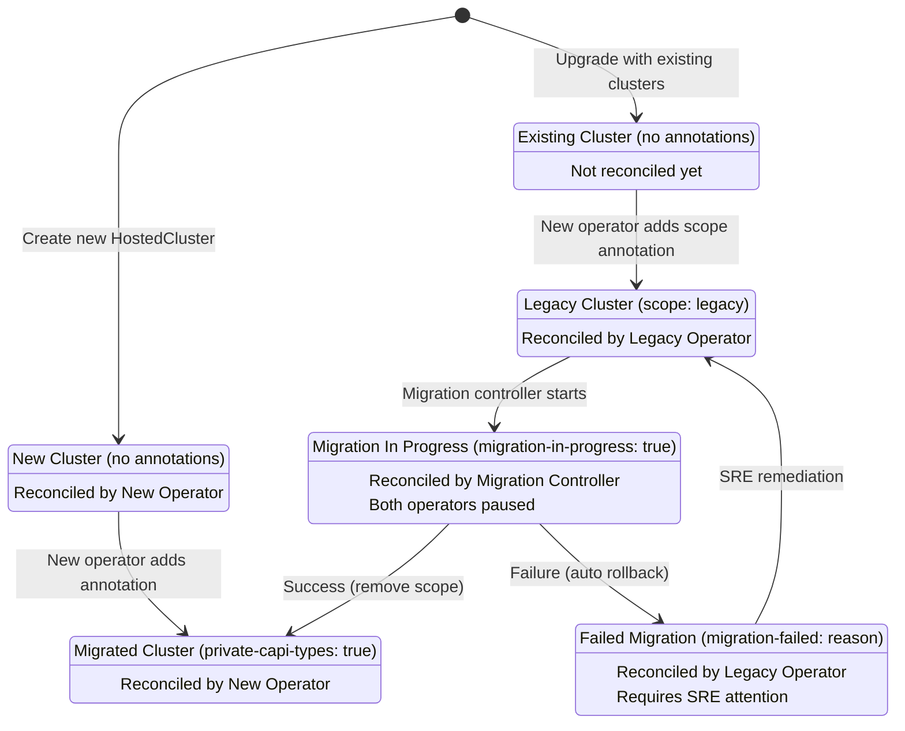

# HyperShift Private CAPI Types

## Summary

This enhancement proposes isolating HyperShift's Cluster API (CAPI) Custom Resource Definitions (CRDs) from those installed by the OpenShift platform on management clusters. HyperShift will use CAPI CRDs with a distinct group name (`cluster.hypershift.openshift.io` instead of `cluster.x-k8s.io`) to prevent version conflicts as standalone OpenShift clusters adopt CAPI for their own machine management. A transparent API proxy sidecar will enable HyperShift components to continue using standard CAPI types while the underlying resources use the HyperShift-specific group names.

## Glossary

- **CAPI**: Cluster API, a Kubernetes project for declaratively managing Kubernetes clusters
- **Private CAPI Types**: CAPI CRDs using the `cluster.hypershift.openshift.io` API group instead of the standard `cluster.x-k8s.io` group. The term "private" indicates these are **isolated** and **dedicated** to HyperShift's exclusive use, preventing conflicts with the platform's CAPI installation. These CRDs are not hidden or secured differently—they remain visible to all users with appropriate RBAC permissions. The "private" designation refers to namespace isolation and API group separation, not access control.
- **API Proxy Sidecar**: A lightweight HTTP proxy container that runs alongside HyperShift components, translating between standard CAPI API groups (`cluster.x-k8s.io`) and private CAPI groups (`cluster.hypershift.openshift.io`)
- **Migration Controller**: A dedicated controller within the HyperShift operator responsible for automatically migrating existing HostedClusters from standard CAPI types to private CAPI types
- **Dual Operator Architecture**: Temporary deployment pattern where two HyperShift operator instances run simultaneously: one supporting private CAPI types (new operator) and one using standard CAPI types (legacy operator)
- **Legacy Operator**: The HyperShift operator deployment that reconciles HostedClusters still using standard CAPI types (`cluster.x-k8s.io`)
- **New Operator**: The HyperShift operator deployment that reconciles HostedClusters using private CAPI types (`cluster.hypershift.openshift.io`)
- **CPO**: Control Plane Operator, the operator that manages components within a hosted control plane namespace
- **HostedCluster**: A HyperShift API resource representing a complete OpenShift cluster managed by HyperShift
- **Hosted Control Plane**: The control plane components for a HostedCluster, running in a namespace on the management cluster
- **Management Cluster**: The OpenShift cluster where HyperShift runs and manages HostedClusters

## Motivation

### Background

Historically, HyperShift management clusters did not use Cluster API (CAPI) for their own machine management, relying instead on the OpenShift Machine API. This allowed HyperShift to install and manage its own version of CAPI CRDs, effectively owning the CAPI types on the management cluster.

With OpenShift's evolution toward using CAPI for standalone cluster machine management, a critical conflict emerges: both the platform and HyperShift will need to install CAPI CRDs on the same management cluster. If these CRD versions are incompatible, neither the platform nor HyperShift can function correctly.

### User Stories

* As a HyperShift platform engineer, I want HyperShift to use isolated CAPI CRDs, so that I can ensure compatibility between platform and HyperShift CAPI versions without coordination overhead.

* As a management cluster administrator, I want to upgrade my standalone OpenShift cluster's CAPI implementation independently from HyperShift, so that I can adopt new platform features without risking HyperShift stability.

* As a HyperShift operator maintainer, I want to upgrade HyperShift's CAPI dependencies independently, so that I can deliver improvements to hosted cluster provisioning without being blocked by platform CAPI version requirements.

* As a service provider running HyperShift at scale, I want the migration to private CAPI types to be transparent and automatic, so that my existing hosted clusters continue operating without manual intervention or downtime.

### Goals

* Isolate HyperShift's CAPI CRD dependencies from the platform's CAPI CRDs by using a distinct API group (`cluster.hypershift.openshift.io`).
* Enable HyperShift components to continue using standard CAPI client libraries without modification through a transparent API proxy.
* Automatically migrate existing HyperShift installations to use the private CAPI types without user intervention or hosted cluster downtime.
* Ensure zero user-facing impact - hosted cluster administrators and workloads should experience no behavioral changes.
* Provide operational visibility into the migration process through metrics and alerts.

### Non-Goals

* Supporting both standard and private CAPI types simultaneously in production deployments long-term. This is a one-way migration for the entire deployment.
* Backporting this functionality to HyperShift Operator releases prior to 4.22.
* Making the API proxy sidecar a general-purpose, reusable component for other use cases beyond CAPI type translation.
* Modifying or extending the CAPI specification itself.
* Changing the behavior or functionality of CAPI resources as perceived by HyperShift components.

## Proposal

This proposal consists of two major components:

1. **Private CAPI Types and API Proxy**: Introduce HyperShift-specific CAPI CRDs using the `cluster.hypershift.openshift.io` group and deploy an API proxy sidecar alongside HyperShift components to transparently translate between standard and private CAPI types.

2. **Automatic Migration**: Implement a migration controller that automatically converts existing hosted clusters from standard to private CAPI types without disrupting hosted cluster operations.

### Workflow Description

#### New HyperShift Installation

**platform administrator** is a human user responsible for installing and managing the HyperShift operator on a management cluster.

1. The platform administrator installs HyperShift using the `hypershift install` command with the new `--private-capi-types` flag.

2. The install command:
   - Installs the private CAPI CRDs with the `cluster.hypershift.openshift.io` group into the management cluster
   - Creates the new HyperShift operator deployment (`operator`) with an API proxy sidecar container configured to translate CAPI API requests
   - Creates the legacy HyperShift operator deployment (`operator-legacy`) without API proxy, using standard CAPI types

3. The new operator scans for existing HostedClusters. If none exist, it automatically deletes the legacy operator deployment.

4. When a user creates a new HostedCluster resource, the HyperShift operator:
   - Automatically adds the `hypershift.openshift.io/private-capi-types: "true"` annotation to the HostedCluster
   - Creates the hosted control plane namespace
   - Deploys CAPI-dependent components (CAPI manager, CAPI provider) with API proxy sidecars
   - Creates CAPI resources (Cluster, Machines, infrastructure-specific resources) using the private `cluster.hypershift.openshift.io` group by sending requests through the proxy

5. The control plane operator deployment for the HostedCluster is laid down with an environment variable that indicates that it should be using private types. The CPO then will provision additional CAPI workloads (Machine autoapprover, Autoscaler) with the proxy sidecar.

6. From the perspective of HyperShift components, they continue to use standard CAPI client libraries and types. The API proxy transparently rewrites:
   - **Outbound requests**: Translates standard CAPI groups (`cluster.x-k8s.io`) to private groups (`cluster.hypershift.openshift.io`)
   - **Inbound responses**: Translates private CAPI groups back to standard CAPI groups

#### Existing HyperShift Installation Migration

**hypershift migration controller** is an automated controller within the new HyperShift operator responsible for migrating hosted clusters to private CAPI types.

**dual operator architecture** consists of two HyperShift operator instances running simultaneously: one supporting private CAPI types (new) and one using standard CAPI types (legacy).

1. The platform administrator upgrades their HyperShift operator to a version that supports the `--private-capi-types` flag and runs `hypershift install --private-capi-types`.

2. The install command deploys:
   - Private CAPI CRDs (`cluster.hypershift.openshift.io` group)
   - New HyperShift operator deployment (`operator`) with API proxy sidecar and migration controller
   - Legacy HyperShift operator deployment (`operator-legacy`) without API proxy, using standard CAPI types

3. Both operators use the `hypershift.openshift.io/scope` annotation mechanism to determine which HostedClusters to reconcile:
   
   The following table clarifies which component reconciles each HostedCluster based on its annotation state:
   
   | HostedCluster Annotation State | Reconciled By | Notes |
   |-------------------------------|---------------|-------|
   | `hypershift.openshift.io/private-capi-types: "true"` | New Operator | Successfully migrated clusters |
   | `hypershift.openshift.io/scope: "legacy"` | Legacy Operator | Existing clusters awaiting migration |
   | `hypershift.openshift.io/migration-in-progress: "true"` | Migration Controller | Clusters actively being migrated (neither operator reconciles) |
   | `hypershift.openshift.io/migration-failed` | Legacy Operator | Previous migration failed; requires SRE remediation before retry |
   | No annotations (new cluster) | New Operator | Brand new clusters created after upgrade |
   | `scope: "legacy"` AND `private-capi-types: "true"` | Invalid state | Should not occur; indicates migration error |
   
   **New Operator** reconciles HostedClusters with:
   - `hypershift.openshift.io/private-capi-types: "true"` annotation present
   - No scope annotation (indicates a brand new cluster)
   
   **Legacy Operator** reconciles HostedClusters with:
   - `hypershift.openshift.io/scope: "legacy"` annotation present
   - No `private-capi-types` annotation
   
   **Migration Controller** (within new operator) handles HostedClusters with:
   - `hypershift.openshift.io/migration-in-progress: "true"` annotation
   - Neither operator reconciles clusters during migration to prevent conflicts

   **Annotation Validation and Consistency**:
   
   Both operators validate annotation consistency during reconciliation to detect and recover from invalid states:
   
   - **Invalid state detection**: If a HostedCluster has both `scope: "legacy"` AND `private-capi-types: "true"` annotations, this indicates a migration error or manual annotation corruption.
   - **Recovery mechanism**: The operators inspect actual CAPI resources in the hosted control plane namespace to determine the source of truth:
     - If CAPI resources use the `cluster.hypershift.openshift.io` group: Remove `scope: "legacy"` annotation, keep `private-capi-types: "true"`
     - If CAPI resources use the `cluster.x-k8s.io` group: Remove `private-capi-types: "true"` annotation, keep `scope: "legacy"`
   - **Logging**: Invalid states are logged as warnings with details about detected inconsistencies and recovery actions taken
   - **Prevention**: The migration controller removes the `scope: "legacy"` annotation atomically when adding `private-capi-types: "true"` to prevent invalid states during normal operation

   **State Transition Diagram**:
   
   The following diagram illustrates the lifecycle states and transitions for HostedClusters during migration:



4. During initial startup, the new operator scans existing HostedClusters:
   - For HostedClusters without the `private-capi-types` annotation, it adds `scope: "legacy"`
   - This ensures existing clusters continue being reconciled by the legacy operator without interruption

5. The migration controller identifies HostedClusters with `scope: "legacy"` and processes them one at a time:

   a. **Acquire Lock**:
      - Add `hypershift.openshift.io/migration-in-progress: "true"` annotation
      - Both operators stop reconciling this HostedCluster

   b. **Pause and Scale Down**:
      - Pause the CAPI Cluster resource to prevent new machine operations
      - Scale down CAPI-dependent workloads (CAPI manager, provider, autoscaler, autoapprover) to 0 replicas, along with the control plane operator
      - Wait for all pods to terminate (timeout: 5 minutes)

   c. **Resource Conversion**:
      - For each CAPI resource (Cluster, Machine, MachineSet, MachineDeployment, infrastructure resources):
        - Create an equivalent resource using the `cluster.hypershift.openshift.io` group
        - Copy all spec, status, and metadata fields
        - Preserve owner references, labels, and annotations

   d. **Workload Update and Resume**:
      - Update CAPI-dependent workload deployments to include the API proxy sidecar
      - For deployments managed by the Control Plane Operator, update the CPO deployment to signal it should add proxy sidecars
      - Scale workloads back to their original replica counts
      - Wait for deployments to become available (timeout: 10 minutes)
      - Unpause the CAPI Cluster resource

   e. **Verify and Complete**:
      - Verify cluster health (check CAPI Cluster status, node count, API availability)
      - Delete old CAPI resources using standard groups
      - Add `hypershift.openshift.io/private-capi-types: "true"` annotation
      - Remove `hypershift.openshift.io/scope` annotation
      - Remove `hypershift.openshift.io/migration-in-progress` annotation
      - The new operator immediately begins reconciling this HostedCluster

6. **Automatic Rollback on Failure**:
   If migration fails at any step (resource creation failures, timeout waiting for pods, health check failures):
   - The migration controller logs detailed error information
   - Adds the `hypershift.openshift.io/migration-failed` annotation to the HostedCluster (see Failure Handling section for details)
   - Fires an alert for SRE attention
   - Deletes any partially created private CAPI resources
   - Scales CAPI workloads back to original state (without proxy sidecars)
   - Unpauses the CAPI Cluster resource
   - Removes the `migration-in-progress` annotation
   - Leaves the `scope: "legacy"` annotation intact
   - The legacy operator automatically resumes reconciliation
   - The HostedCluster continues operating normally with standard CAPI types

7. The migration controller continues processing remaining HostedClusters until all are migrated.

8. Once all HostedClusters are successfully migrated (no HostedClusters with `scope: "legacy"` remain):
   - The new operator automatically deletes the legacy operator deployment
   - Only the new operator continues running

### API Extensions

This enhancement introduces new CRDs that mirror the standard CAPI CRDs but use the `cluster.hypershift.openshift.io` API group:

- `Cluster.cluster.hypershift.openshift.io`
- `Machine.cluster.hypershift.openshift.io`
- `MachineSet.cluster.hypershift.openshift.io`
- `MachineDeployment.cluster.hypershift.openshift.io`
- Infrastructure provider CRDs (e.g., `AWSCluster.infrastructure.cluster.hypershift.openshift.io`, `AWSMachine.infrastructure.cluster.hypershift.openshift.io`)

**Behavioral Impact**:
- These CRDs are functionally identical to their standard CAPI equivalents
- Validation and defaulting webhooks follow the same pattern as standard CAPI CRDs
- Conversion webhooks require a shim layer to translate between private and standard CAPI groups during version conversion (see Conversion Webhook Shim section)
- The CRDs are owned and lifecycled by the HyperShift operator
- Deleting a HostedCluster will clean up all associated private CAPI resources through standard owner reference garbage collection

### Topology Considerations

#### Hypershift / Hosted Control Planes

This enhancement is specific to HyperShift and does not apply to standalone clusters.

**Management Cluster Impact**:
- The HyperShift operator pod will include an additional API proxy sidecar container
- Memory overhead per operator pod: approximately 50-100 MB for the proxy sidecar
- CPU overhead: minimal, as translation is lightweight string replacement

**Hosted Control Plane Impact**:
- Each hosted control plane will have additional API proxy sidecars in CAPI-related pods:
  - CAPI manager deployment
  - Infrastructure provider deployment
  - Cluster autoscaler deployment
  - Cluster API autoapprover deployment
- Memory overhead per hosted control plane: approximately 200-400 MB total across all proxy sidecars
- CPU overhead: minimal, proportional to CAPI API request volume

#### Standalone Clusters

This enhancement does not affect standalone OpenShift clusters. Standalone clusters will use standard CAPI CRDs with the `cluster.x-k8s.io` group for their own machine management.

#### Single-node Deployments or MicroShift

Not applicable. HyperShift does not run on single-node OpenShift or MicroShift.

#### OpenShift Kubernetes Engine

Not applicable. HyperShift is not part of the OKE product offering.

### Implementation Details/Notes/Constraints

#### API Proxy Sidecar

The API proxy sidecar is a lightweight HTTP proxy that runs alongside HyperShift components needing CAPI access.

**Configuration**:
- Listens on `localhost:8080` (or configurable port)
- Accepts plain HTTP requests (traffic is local to pod)
- Uses the pod's service account credentials and kubeconfig to communicate with the Kubernetes API server
- No additional authentication required between container and sidecar (localhost trust boundary)
- Port configuration is managed by the HyperShift operator when deploying the proxy sidecar

**Translation Logic**:
- **Request Path Translation**: Rewrites API paths containing `cluster.x-k8s.io` to `cluster.hypershift.openshift.io`
- **Response Body Translation**: Rewrites `apiVersion` fields in JSON/YAML responses from `cluster.hypershift.openshift.io` back to `cluster.x-k8s.io`
- **Scope**: Only CAPI-related groups are translated; all other API requests pass through unchanged
- **Watch Requests**: Supports long-lived watch connections with streaming translation
- **Performance**: Stateless design with no caching or persistent state

**Integration**:
- HyperShift components that need CAPI access configure their Kubernetes clients to use `http://localhost:8080` instead of the standard API server address
- Configuration is injected via the `KUBECONFIG` environment variable set by the HyperShift operator when deploying pods
- The `KUBECONFIG` environment variable points to a kubeconfig file that directs API requests to `http://localhost:8080`
- Affected components include: HyperShift operator, CAPI manager, infrastructure provider, autoscaler, and autoapprover
- Components use standard Kubernetes client libraries; no code changes are required as the proxy makes private types appear as standard types

#### API Proxy Translation Details

The API proxy performs bidirectional translation to make private CAPI types (`cluster.hypershift.openshift.io`) appear as standard CAPI types (`cluster.x-k8s.io`) to HyperShift components.

**URL Path Translation Patterns**:

Incoming requests are translated by replacing API group segments in the URL path:
- `/apis/cluster.x-k8s.io/` → `/apis/cluster.hypershift.openshift.io/`
- `/apis/infrastructure.cluster.x-k8s.io/` → `/apis/infrastructure.cluster.hypershift.openshift.io/`
- `/apis/controlplane.cluster.x-k8s.io/` → `/apis/controlplane.cluster.hypershift.openshift.io/`
- `/apis/bootstrap.cluster.x-k8s.io/` → `/apis/bootstrap.cluster.hypershift.openshift.io/`

All CAPI-related groups follow the pattern: `*.cluster.x-k8s.io` → `*.cluster.hypershift.openshift.io`

**Discovery API Translation**:

Discovery requests are translated in both directions:
- Request: `GET /apis/cluster.x-k8s.io/v1beta1` → `GET /apis/cluster.hypershift.openshift.io/v1beta1`
- Response: The API server returns discovery information for `cluster.hypershift.openshift.io`
- The proxy translates the response JSON to show `cluster.x-k8s.io` as the group name
- This ensures CAPI clients can discover resources as if they were standard CAPI types

**JSON Field Translation**:

The proxy translates the following fields in both request and response bodies:

1. **apiVersion**: `cluster.x-k8s.io/v1beta1` ↔ `cluster.hypershift.openshift.io/v1beta1`
2. **ownerReferences[].apiVersion**: Translated for any owner reference to a CAPI resource
3. **managedFields[].apiVersion**: Translated in server-side apply field tracking
4. **List.items[].apiVersion**: Each item in list responses is translated individually
5. **TypeMeta.apiVersion**: In any embedded object (e.g., in raw extensions)

Translation is performed using JSON streaming to handle large responses efficiently without loading entire payloads into memory.

**Watch and Streaming Operations**:

Long-lived watch connections are fully supported:
- The proxy maintains the connection and translates each watch event as it arrives
- No buffering of watch streams - events are translated and forwarded immediately
- Connection failures are propagated to the client for proper retry handling

**Non-CAPI Request Passthrough**:

Requests to non-CAPI API groups (e.g., `core/v1`, `apps/v1`, `hypershift.openshift.io`) are proxied without URL path translation, but their response bodies are still scanned for CAPI references:
- **ownerReferences[].apiVersion**: Translated if the owner is a CAPI resource
- **managedFields[].apiVersion**: Translated if it references a CAPI group

Example: A ConfigMap owned by a CAPI Cluster will have its ownerReference translated even though the ConfigMap itself is not a CAPI resource.

This ensures proper garbage collection and field management across all resources that interact with CAPI types.

**Performance Characteristics**:
- Streaming JSON parser/translator to minimize memory overhead
- No request/response buffering for non-CAPI resources
- Minimal buffering for CAPI resources (up to 64KB read-ahead)
- Expected per-request overhead: <1ms for typical CAPI operations
- Memory overhead: 50-100 MB per proxy instance

#### Migration Controller

The migration controller is a dedicated controller within the HyperShift operator responsible for migrating HostedClusters to private CAPI types.

**Selection Logic**:
- Watches HostedCluster resources without the `hypershift.openshift.io/private-capi-types: "true"` annotation
- Processes one HostedCluster at a time to minimize risk and resource contention
- Skips HostedClusters already being reconciled by the main operator
- Skips HostedClusters with the `hypershift.openshift.io/migration-failed` annotation (indicates a previous migration failure that requires SRE attention)

**Migration Scalability**:
- **Estimated migration duration per HostedCluster**: 5-15 minutes (depending on cluster size and number of CAPI resources)
  - Scale down phase: ~2-3 minutes (estimate based on typical pod termination times with 5-10 CAPI-related pods per cluster)
  - Resource conversion: ~1-2 minutes (estimate for clusters with 10-50 Machines, scales linearly with Machine count)
  - Scale up and health verification: ~2-10 minutes (estimate based on standard Kubernetes deployment rollout times and health check intervals)
  
  **Key variables affecting duration**:
  - Number of Machine resources (more Machines = longer conversion)
  - Management cluster API server load and responsiveness
  - Pod termination grace periods (configured per deployment)
  - Network latency between migration controller and API server
  
  **Note**: These are estimated values that will be refined based on actual measurements during testing and production rollout.

- For deployments with 100+ HostedClusters, migrations will proceed sequentially:
  - Total estimated migration time: approximately 8-25 hours for 100 clusters (based on 5-15 minutes per cluster)
  - Migrations run continuously until all HostedClusters are migrated
  - The legacy operator continues to reconcile unmigrated clusters during this period, ensuring no service disruption
  
- Parallelization is not supported in the initial implementation to ensure:
  - Resource contention is minimized on the management cluster
  - Each migration can be monitored and debugged individually
  - Rollback procedures remain straightforward
  - Future versions may support configurable parallel migration limits if needed

**Migration Process**:
1. Acquire a lock on the HostedCluster by adding the `hypershift.openshift.io/migration-in-progress: "true"` annotation to prevent concurrent modifications
2. Pause CAPI Cluster resource (`spec.paused: true`)
3. Scale down CAPI-dependent deployments (store original replica counts in annotations) as well as the CPO.
4. Wait for all pods to terminate (timeout: 5 minutes)
5. For each CAPI resource in the control plane namespace:
   - Read the existing resource
   - Create a new resource with the private API group
   - Copy all fields except API version and group
6. Update deployment manifests to include API proxy sidecar containers
   - The HyperShift operator directly controls and updates the CAPI manager and CAPI provider deployments
   - For other deployments managed by the Control Plane Operator (CPO), updates occur via CPO coordination:
     - **CPO Image Management**: Proxy sidecar support is backported to CPO images for all supported OpenShift versions (4.14 through 4.22). The HyperShift operator ensures each HostedCluster uses a CPO image with proxy sidecar support, overriding the CPO image during migration if necessary.
     - **Signaling Mechanism**: The HyperShift operator updates the control plane operator deployment to signal that it should add the proxy sidecar to the deployments it manages (via environment variable or annotation on the HostedControlPlane).
     - **CPO Reconciliation**: The CPO reads this signal and automatically adds the proxy sidecar to relevant deployments (Machine autoapprover, Autoscaler).
   
   **Alternative Approach**: If backporting proxy sidecar support to all CPO versions proves too burdensome, a mutating admission webhook could be deployed as an alternative. The HyperShift operator would deploy a webhook for pods in control plane namespaces that automatically injects the proxy sidecar container and configures the KUBECONFIG environment variable. This approach is only considered if the backporting strategy becomes impractical.
7. Scale deployments back to original replica counts
8. Wait for deployments to become available (timeout: 10 minutes)
9. Unpause CAPI Cluster resource
10. Verify cluster health before completing migration:
    - **CAPI Cluster Status** (required): 
      - Verify `status.phase: "Provisioned"` or `status.phase: "Provisioning"` (clusters actively scaling are acceptable)
      - Verify `status.infrastructureReady: true` (infrastructure provider has completed provisioning)
      - Verify no critical error conditions in `status.conditions` (warnings are acceptable, errors cause rollback)
    - **Resource Count Consistency** (required):
      - Compare count of Machine resources before and after migration (must match exactly)
      - Verify all Machines have `status.phase` set to `"Running"`, `"Provisioning"`, or `"Pending"` (failed Machines cause rollback)
      - Verify count of MachineSet and MachineDeployment resources matches pre-migration count
    - **Deployment Readiness** (required):
      - All CAPI-dependent deployments must report `status.availableReplicas == status.replicas`
      - All pods must be in `Running` state (not `CrashLoopBackOff`, `Error`, or `Unknown`)
      - No pod restartCount increase detected during health check period (indicates crash loops)
    - **API Connectivity Verification** (required):
      - Successful API call through proxy to verify translation is working
      - Test: GET request for a Machine resource using standard CAPI group (`cluster.x-k8s.io`) through the proxy succeeds
      - Verify response contains the correct resource with translated API group
    - **Health Check Execution**:
      - Total timeout: 5 minutes
      - Check frequency: Poll every 10 seconds
      - All checks must pass continuously for at least 30 seconds before migration is considered successful
      - If any check fails after timeout: Migration is automatically rolled back (see Failure Handling section)
11. Add `hypershift.openshift.io/private-capi-types: "true"` annotation to HostedCluster
12. Delete old CAPI resources (using standard API groups)
13. Release lock by removing the `hypershift.openshift.io/migration-in-progress` annotation

**Failure Handling**:
- If any step fails (including health check failures), the migration controller:
  - Releases the lock by removing the `hypershift.openshift.io/migration-in-progress` annotation
  - Logs detailed error information including which health check failed (if applicable)
  - Adds the `hypershift.openshift.io/migration-failed` annotation to the HostedCluster with the failure reason as the annotation value (e.g., `hypershift.openshift.io/migration-failed: "health-check-timeout"`)
  - Fires an alert for SRE attention (`HyperShiftPrivateCAPIMigrationFailed`)
  - Stops processing that HostedCluster but continues with others
  - **Rollback Actions**:
    - Deletes any partially created private CAPI resources (to prevent resource duplication)
    - Scales CAPI workloads back to original state (without proxy sidecars)
    - Unpauses the CAPI Cluster resource (if it was paused)
    - Leaves old CAPI resources intact (using standard groups) for continued operation
    - Maintains `scope: "legacy"` annotation so legacy operator resumes reconciliation
  - The HostedCluster continues operating normally with standard CAPI types
  - The migration controller will not attempt to migrate this HostedCluster again until the `migration-failed` annotation is removed

**Resumption**:
- The migration controller periodically re-scans for unmigrated HostedClusters
- Failed migrations can be retried after SRE remediation:
  - SRE investigates and resolves the root cause of the migration failure
  - SRE removes the `hypershift.openshift.io/migration-failed` annotation from the HostedCluster
  - The migration controller will detect the HostedCluster as eligible for migration again and retry the migration process

#### Infrastructure Provider Support

HyperShift supports the following CAPI infrastructure providers:
- **CAPA** (Cluster API Provider AWS)
- **CAPZ** (Cluster API Provider Azure)
- **CAPK** (Cluster API Provider KubeVirt)
- **CAP-Agent** (Cluster API Provider Agent)
- **CAPG** (Cluster API Provider GCP)

The API proxy automatically supports any CAPI infrastructure provider that follows standard naming conventions:

- Base infrastructure group: `infrastructure.cluster.x-k8s.io` → `infrastructure.cluster.hypershift.openshift.io`
- Provider-specific groups (e.g., `controlplane.cluster.x-k8s.io`) → `controlplane.cluster.hypershift.openshift.io`

No provider-specific code is required in the proxy. The translation is purely group-based string replacement.

#### Conversion Webhook Shim

CAPI CRDs use conversion webhooks to convert resources between different API versions (e.g., `v1beta1` to `v1beta2`). Since HyperShift 4.22 will use CAPI 1.11, which includes both `v1beta1` and `v1beta2` versions, the conversion webhook is a required component. When HyperShift uses private CAPI types with the `cluster.hypershift.openshift.io` API group, the conversion webhook must be adapted to handle group name translation in addition to version conversion.

**Architecture**:

The conversion webhook shim is a service that intercepts conversion requests for private CAPI CRDs and translates them to work with the standard CAPI conversion webhook infrastructure.

**Request Flow**:

1. **Kubernetes API Server** receives a conversion request for a private CAPI resource (e.g., requesting `cluster.hypershift.openshift.io/v1beta2` when stored as `cluster.hypershift.openshift.io/v1beta1`)

2. **Conversion Webhook Shim** receives the conversion review request:
   - The request contains objects with `apiVersion: cluster.hypershift.openshift.io/v1beta1`
   - The requested version is `cluster.hypershift.openshift.io/v1beta2`

3. **Request Translation**:
   - The shim translates the request to use standard CAPI groups:
     - Input objects: `cluster.hypershift.openshift.io/v1beta1` → `cluster.x-k8s.io/v1beta1`
     - Requested version: `cluster.hypershift.openshift.io/v1beta2` → `cluster.x-k8s.io/v1beta2`
   - All `apiVersion` fields in the request objects are translated from private to standard groups

4. **Delegation to Standard CAPI Conversion Webhook**:
   - The shim forwards the translated request to the standard CAPI conversion webhook service
   - The standard webhook performs the actual version conversion (e.g., `v1beta1` → `v1beta2`)

5. **Response Translation**:
   - The standard webhook returns converted objects with `apiVersion: cluster.x-k8s.io/v1beta2`
   - The shim translates the response back to private groups:
     - `cluster.x-k8s.io/v1beta2` → `cluster.hypershift.openshift.io/v1beta2`
   - All `apiVersion` fields in response objects are translated from standard to private groups

6. **Response to API Server**:
   - The shim returns the translated conversion review response to the Kubernetes API server
   - The API server receives objects with the correct private group and requested version

**Deployment**:

- The conversion webhook shim is deployed as a service within the HyperShift operator namespace
- The private CAPI CRDs are configured with `spec.conversion.webhook.clientConfig` pointing to the shim service
- The shim service is accessible via a Kubernetes Service with proper TLS certificates (managed by OpenShift Service CA)
- The shim maintains knowledge of the standard CAPI conversion webhook service endpoint and delegates conversion requests accordingly

**Translation Scope**:

The shim translates the following fields in conversion review requests and responses:

1. **Request Objects**:
   - `request.objects[].apiVersion`: Translate from `cluster.hypershift.openshift.io/*` to `cluster.x-k8s.io/*`
   - `request.desiredAPIVersion`: Translate from `cluster.hypershift.openshift.io/*` to `cluster.x-k8s.io/*`

2. **Response Objects**:
   - `response.convertedObjects[].apiVersion`: Translate from `cluster.x-k8s.io/*` back to `cluster.hypershift.openshift.io/*`
   - `response.result.status`: Preserve as-is (success/failure status)

3. **Nested Fields**:
   - Any embedded objects with `apiVersion` fields (e.g., in `spec`, `status`, `ownerReferences`) are also translated
   - `ownerReferences[].apiVersion`: Translated if referencing CAPI resources
   - `managedFields[].apiVersion`: Translated in field manager tracking

**Error Handling**:

- If the standard CAPI conversion webhook is unavailable, the shim returns an error to the API server
- If translation fails (e.g., malformed request), the shim returns an error without delegating to the standard webhook
- Errors are logged with context about which resource and version conversion failed
- The shim implements retry logic for transient failures when communicating with the standard CAPI conversion webhook

**Performance Considerations**:

- The shim adds minimal latency (<1ms) for group name translation
- Conversion latency is dominated by the standard CAPI conversion webhook's version conversion logic
- The shim uses streaming JSON parsing to handle large conversion requests efficiently
- Memory overhead: approximately 50-100 MB per shim instance

**CRD Configuration**:

Each private CAPI CRD includes conversion webhook configuration:

```yaml
spec:
  conversion:
    strategy: Webhook
    webhook:
      clientConfig:
        service:
          name: capi-conversion-webhook-shim
          namespace: hypershift-operator
          path: /convert
      conversionReviewVersions: ["v1"]
```

The shim service handles conversion requests for all private CAPI CRD types (Cluster, Machine, MachineSet, MachineDeployment, and infrastructure provider CRDs).

### Risks and Mitigations

**Risk**: Migration failure leaves a hosted cluster in an inconsistent state with partial CAPI resources using both group names.

**Mitigation**:
- The dual-operator architecture ensures unmigrated clusters continue to be reconciled by the legacy operator without interruption
- The migration controller uses a transactional approach: new resources are created before old ones are deleted
- If migration fails at any step, the migration controller **automatically rolls back** the cluster:
  - Deletes any partially created private CAPI resources
  - Restores CAPI workloads to their pre-migration state (without proxy sidecars)
  - Removes the migration lock annotation
  - The legacy operator immediately resumes reconciliation
  - The cluster continues operating normally with standard CAPI types
- No manual intervention is required for failed migrations
- Alerts notify operators of migration failures for awareness and potential retry
- The migration controller will retry failed migrations on subsequent reconciliation loops

**Risk**: The API proxy introduces a performance bottleneck for CAPI API operations.

**Mitigation**:
- The proxy performs simple string replacement with minimal overhead
- Benchmarking will be conducted to measure proxy latency (expected <1ms per request)
- The proxy is stateless and horizontally scales with the number of pods

**Risk**: Watch operations or other advanced Kubernetes API features may not work correctly through the proxy.

**Mitigation**:
- The proxy implementation will be thoroughly tested with all CAPI controller patterns, including watches, list operations, and patch requests
- Integration tests will run standard CAPI controllers through the proxy to validate correctness

**Risk**: Conversion webhook shim failures could prevent reading or writing CAPI resources when version conversion is required, potentially blocking garbage collection and other cluster operations.

**Mitigation**:
- The conversion webhook shim includes health checks and proper error handling
- If the shim is unavailable, the Kubernetes API server will fail conversion requests gracefully, logging errors for operator visibility
- The shim implements retry logic for transient failures when communicating with the standard CAPI conversion webhook
- Monitoring and alerts will track conversion webhook shim availability and latency
- The shim is deployed as part of the HyperShift operator, ensuring it scales with operator replicas for high availability
- If the standard CAPI conversion webhook is unavailable, the shim returns clear error messages to aid troubleshooting

**Risk**: Future CAPI versions may introduce breaking changes that require more sophisticated translation than simple group name replacement.

**Mitigation**:
- This enhancement isolates HyperShift from platform CAPI versions, providing the flexibility to implement more sophisticated translation if needed
- The proxy architecture is designed to support future enhancements (e.g., field-level transformations)

**Risk**: Operational complexity increases with the addition of sidecars and migration logic.

**Mitigation**:
- Comprehensive documentation will cover troubleshooting scenarios
- Metrics and alerts will provide visibility into proxy health and migration status
- The migration process is designed to be fully automatic, minimizing operator burden

**Risk**: Running dual operators simultaneously increases resource consumption and management complexity.

**Mitigation**:
- The legacy operator is automatically removed once all HostedClusters are successfully migrated
- Both operators use the `scope` annotation mechanism to avoid conflicts and ensure clear separation of responsibilities
- The dual-operator period is temporary and bounded by the migration timeline
- Metrics track the number of unmigrated clusters to provide visibility into when the legacy operator can be removed
- In greenfield installations with no existing HostedClusters, the legacy operator is removed immediately

### Drawbacks

- **Increased resource consumption**: Each pod using CAPI resources requires an additional sidecar container, increasing memory usage by approximately 50-100 MB per pod.
- **Operational complexity**: Debugging issues may require understanding the proxy translation layer, adding cognitive overhead.
- **Divergence from upstream CAPI**: HyperShift will use non-standard API groups, potentially complicating integration with upstream CAPI tooling or documentation.
- **Migration risk**: Although designed to be safe, the migration process touches critical infrastructure resources and could cause issues if bugs exist in the implementation.
- **One-way migration**: Reverting to standard CAPI types after migration would require manual intervention and potentially a separate operator deployment.

### Security Considerations

**API Proxy Authentication and Authorization**:
- The API proxy sidecar uses the pod's service account credentials to communicate with the Kubernetes API server
- All authentication and authorization checks are performed by the Kubernetes API server, not by the proxy
- The proxy does not modify or bypass RBAC policies; it only translates API group names
- Components using the proxy maintain the same permissions they would have when accessing the API server directly

**Localhost Communication**:
- The API proxy listens on `localhost:8080` within the pod, creating a local trust boundary
- No additional network exposure is introduced; communication is container-to-container within the same pod
- The proxy does not require TLS for localhost communication, as traffic never leaves the pod

**Resource Access Isolation**:
- Private CAPI types use a distinct API group (`cluster.hypershift.openshift.io`), providing namespace-level isolation from platform CAPI resources
- RBAC policies must be updated to grant access to the new API group for components that need CAPI access
- The migration process preserves existing RBAC policies by creating equivalent resources with the same ownership and access patterns

**Migration Security**:
- The migration controller runs with the same service account permissions as the HyperShift operator
- Migration operations are logged and auditable through standard Kubernetes audit logging
- The `migration-in-progress` annotation prevents concurrent modifications, reducing the risk of race conditions
- Failed migrations leave resources in a known state (standard CAPI types) rather than an inconsistent intermediate state

**No New Attack Surface**:
- The API proxy is a stateless translation layer with no persistent storage or external network access
- Proxy failures result in CAPI operation failures but do not expose new attack vectors
- The proxy does not process or store sensitive data beyond what is necessary for API group translation

## Alternatives (Not Implemented)

### Alternative 1: Coordinate CAPI Versions Between Platform and HyperShift

Instead of isolating CAPI types, ensure that the platform and HyperShift always use compatible CAPI versions through tight coordination.

**Why not chosen**:
- This approach creates a strong coupling between platform and HyperShift release schedules, reducing flexibility.
- Version skew issues would inevitably arise during upgrades when the platform and HyperShift are at different versions.
- It does not prevent conflicts if both attempt to install CRDs at the same time.

### Alternative 2: Namespace-Scoped CAPI CRDs

Modify CAPI to support namespace-scoped CRDs instead of cluster-scoped, allowing different versions in different namespaces.

**Why not chosen**:
- CAPI is designed around cluster-scoped resources, and changing this would be a fundamental architecture change requiring upstream buy-in.
- Kubernetes does not support multiple versions of the same CRD with different scopes.
- This would require extensive upstream CAPI changes that are unlikely to be accepted.


## Test Plan

### Unit Tests

- API proxy string translation logic for all CAPI resource types
- Migration controller state machine transitions
- Error handling and recovery paths in the migration controller
- Conversion webhook shim request/response translation logic
- Conversion webhook shim error handling and retry logic

### Integration Tests

- Deploy HyperShift with `--private-capi-types` flag and create a new HostedCluster
- Verify that CAPI resources are created with the `cluster.hypershift.openshift.io` group
- Verify that CAPI components can successfully create, read, update, and delete resources through the proxy
- Test watch operations for CAPI resources through the proxy
- Simulate migration of an existing HostedCluster:
  - Create a HostedCluster without the private CAPI types annotation
  - Enable the migration controller
  - Verify successful migration and cluster health
- Test migration failure scenarios (e.g., resource creation failures) and verify proper error handling
- Verify that multiple infrastructure providers (AWS, Azure, etc.) work correctly with the proxy
- Test conversion webhook shim functionality:
  - Create CAPI resources with one version (e.g., `v1beta1`) and read them with a different version (e.g., `v1beta2`)
  - Verify conversion webhook shim translates requests and responses correctly
  - Verify garbage collection works correctly with converted CAPI resources
  - Test conversion webhook shim failure scenarios and verify proper error handling

### Edge Case Tests

**Migration Concurrency and Locking**:
- Verify that only one HostedCluster is migrated at a time (even with multiple eligible clusters)
- Test that the `migration-in-progress` annotation prevents both operators from reconciling the same HostedCluster
- Verify that attempting to manually add `migration-in-progress` annotation is handled correctly
- Test migration controller behavior when multiple HostedClusters become eligible simultaneously

**Migration Interruption Scenarios**:
- Simulate HyperShift operator restart during migration:
  - Verify migration state is preserved and migration resumes correctly
  - Verify no duplicate resources are created
  - Verify rollback occurs if migration cannot be safely resumed
- Simulate management cluster API server disruption during migration:
  - Verify migration controller handles API errors gracefully
  - Verify migration can be retried after API server recovery
- Simulate pod eviction during migration (scale down phase):
  - Verify migration controller detects pod termination failures
  - Verify timeout handling works correctly

**Migration with Unhealthy HostedClusters**:
- Test migration of HostedCluster with unhealthy CAPI Cluster resource:
  - Verify migration succeeds and copies error statuses from original resources
  - Verify private CAPI resources reflect the same unhealthy state
  - Verify migration completes successfully despite unhealthy state
- Test migration of HostedCluster with failed Machine resources:
  - Verify failed Machine resources are migrated with their error statuses preserved
  - Verify migration completes and HostedCluster continues operating
- Test migration of HostedCluster with degraded control plane components:
  - Verify migration proceeds normally
  - Verify degraded state is preserved in migrated resources
- Verify that unhealthy clusters can be successfully migrated (migration-failed annotation should only be added if migration process itself fails, not due to cluster health)
- Verify that legacy operator continues to reconcile unhealthy unmigrated clusters

**Migration Failure and Retry**:
- Test migration failure at each step of the migration process:
  - Resource conversion failures
  - Deployment update failures
  - Health check failures
  - Verify proper rollback for each failure type
- Test retry after SRE remediation:
  - Verify removal of `migration-failed` annotation allows retry
  - Verify migration controller picks up the HostedCluster for retry
  - Verify successful migration on retry after remediation

**API Proxy Failure Scenarios**:
- Test API proxy sidecar container crash:
  - Verify pod restart restores proxy functionality
  - Verify CAPI operations resume after restart
- Test API proxy during high load:
  - Verify proxy handles concurrent requests correctly
  - Verify no request loss or corruption
- Test API proxy with large CAPI resources:
  - Verify streaming translation works for large Machine/MachineSet resources
  - Verify memory usage remains bounded

**Conversion Webhook Shim Failure Scenarios**:
- Test conversion webhook shim service unavailability:
  - Verify API server handles conversion failures gracefully
  - Verify error messages are clear and actionable
  - Verify garbage collection continues to function for non-CAPI resources
- Test conversion webhook shim during standard CAPI conversion webhook failure:
  - Verify shim returns appropriate error messages
  - Verify shim retry logic works correctly
  - Verify API server retries conversion requests with exponential backoff
- Test conversion webhook shim with version mismatches:
  - Verify shim handles requests for unsupported versions correctly
  - Verify shim translates version conversion errors appropriately
- Test conversion webhook shim with malformed requests:
  - Verify shim handles invalid conversion review requests gracefully
  - Verify shim returns appropriate error responses
- Test conversion webhook shim during high load:
  - Verify shim handles concurrent conversion requests correctly
  - Verify shim maintains acceptable latency under load
  - Verify no conversion request loss or corruption

**Custom CAPI Resources**:
- Test migration of HostedCluster with custom CAPI resources (e.g., custom infrastructure resources)
- Verify all CAPI resource types are properly converted
- Verify owner references are preserved correctly
- Verify labels and annotations are copied accurately

**Dual Operator Coordination**:
- Test behavior when both operators are running:
  - Verify no conflicts between operators
  - Verify correct operator handles each HostedCluster state
  - Verify legacy operator cleanup after all migrations complete
- Test greenfield installation (no existing HostedClusters):
  - Verify legacy operator is removed immediately
  - Verify new HostedClusters use private CAPI types from the start

### Scale Tests

**Migration Scale**:
- Migrate a hosted cluster with hundreds of Machine resources (100+ Machines)
- Measure migration duration and resource overhead
- Test migration with large numbers of MachineSets and MachineDeployments
- Verify resource conversion performance scales linearly
- Test migration of multiple large HostedClusters sequentially

**API Proxy Scale**:
- Verify that the proxy does not introduce significant latency at scale:
  - Test with high CAPI API request rates (100+ requests/second)
  - Test with large response payloads (hundreds of Machines in list responses)
  - Test watch operations with many concurrent watchers
- Measure proxy memory and CPU usage under load
- Verify proxy handles connection failures and retries correctly

**Management Cluster Scale**:
- Test migration with 50+ HostedClusters on a single management cluster
- Verify migration controller handles large numbers of eligible HostedClusters
- Verify dual-operator overhead is acceptable
- Measure total migration time for large deployments

### Upgrade/Downgrade Tests

**Upgrade Scenarios**:
- Upgrade a HyperShift deployment from standard CAPI types to private types:
  - Verify dual-operator deployment is created correctly
  - Verify existing HostedClusters are marked with `scope: "legacy"` annotation
  - Verify migration controller begins processing HostedClusters
  - Verify all HostedClusters are successfully migrated
  - Verify legacy operator is automatically removed after all migrations complete
- Test upgrade with multiple HostedClusters (10+ clusters):
  - Verify migrations proceed sequentially
  - Verify no service disruption during migration
  - Verify metrics track migration progress correctly
- Test upgrade with HostedClusters in various states:
  - Healthy clusters
  - Clusters with ongoing operations (scaling, repairs)
  - Clusters with degraded components

**Downgrade Scenarios**:
- Verify that downgrade from 4.22 to pre-4.22 is detected and prevented (if possible)
- Test behavior when attempting to use pre-4.22 operator with migrated clusters:
  - Verify error messages are clear
  - Document failure modes
- Test individual HostedCluster rollback (manual procedure):
  - Verify rollback process works correctly
  - Verify HostedCluster resumes normal operation with standard CAPI types
  - Verify legacy operator resumes reconciliation

### Performance Validation

The proposal includes several performance estimates that must be validated during testing. These estimates are not based on actual benchmarks but represent expected overhead based on the design.

**Memory Overhead Estimates**:
- API proxy sidecar: 50-100 MB per instance (estimated)
- Conversion webhook shim: 50-100 MB per instance (estimated)
- Total per hosted control plane: 200-400 MB across all CAPI-related sidecars (estimated)

**Validation Approach**:
- Measure actual memory usage under typical workloads with varying cluster sizes
- Test scenarios: Small clusters (3-10 Machines), Medium clusters (10-50 Machines), Large clusters (100+ Machines)
- Acceptance criteria: Memory overhead remains within reasonable bounds for production use

**Latency Overhead Estimates**:
- API proxy per-request overhead: <1ms (estimated)
- Conversion webhook shim translation: <1ms (estimated)
- Overall CAPI operation latency increase: <5% compared to direct API access (estimated)

**Validation Approach**:
- Measure end-to-end latency for common CAPI operations (GET, LIST, PATCH, WATCH)
- Compare latency with and without the proxy layer
- Test under various load conditions (normal operation and high request rates)
- Acceptance criteria: p95 latency increase <5% for typical CAPI operations

**Migration Duration Estimates**:
- Per-cluster migration: 5-15 minutes depending on cluster size and number of CAPI resources (estimated)
- Variables: Number of Machines, management cluster load, pod termination times, network conditions

**Validation Approach**:
- Measure actual migration duration across different cluster sizes and configurations
- Document migration performance characteristics for capacity planning
- Identify bottlenecks and optimization opportunities

**Note**: All estimates will be refined based on actual measurements during QE testing. Performance regression tests will be incorporated into CI to ensure ongoing validation.

## Graduation Criteria

This feature will be released as GA in OpenShift 4.22.

### Dev Preview -> Tech Preview

Does not apply.

### Tech Preview -> GA

Does not apply.

### Removing a deprecated feature

Does not apply.

### GA Requirements

- All test plans executed successfully
- Migration controller automatically migrates existing HostedClusters without operator intervention
- Comprehensive documentation for troubleshooting and operational procedures
- Metrics and alerts for monitoring migration progress and detecting failures
- Zero user-facing behavioral changes observed in QE testing
- Performance benchmarks show acceptable overhead (<5% latency increase for CAPI operations)
- Manual scale testing validates migration of large deployments (100+ hosted clusters)

## Upgrade / Downgrade Strategy

### Upgrade to 4.22 with Private CAPI Types

1. **Pre-upgrade**: The platform administrator should review the list of existing HostedClusters and verify they are all in a healthy state.

2. **Upgrade HyperShift operator**: Upgrade the HyperShift operator to 4.22 using the `hypershift install` command with the `--private-capi-types` flag.

3. **Automatic Migration**: The migration controller automatically begins migrating HostedClusters one at a time. Operators should monitor:
   - Metrics: `hypershift_private_capi_migrated_hosted_clusters_total`, `hypershift_private_capi_pending_hosted_clusters_total`
   - Alerts: `HyperShiftPrivateCAPIMigrationStuck`

4. **Verification**: After migration completes, verify that all HostedClusters have the `hypershift.openshift.io/private-capi-types: "true"` annotation and are in a healthy state.

5. **Post-upgrade**: New HostedClusters will automatically use private CAPI types.

### Downgrade from 4.22

**HyperShift Operator downgrade is not supported**. Once the dual-operator deployment is installed with `--private-capi-types`, reverting to a pre-4.22 single-operator deployment is not supported.

**Individual HostedCluster rollback from migration** is handled automatically:
- If a HostedCluster migration fails, the migration controller automatically rolls it back to use standard CAPI types
- The legacy operator resumes reconciliation immediately
- No manual intervention is required for failed migrations
- The HostedCluster continues operating normally with standard CAPI types

**Manual rollback of successfully migrated HostedCluster**:

⚠️ **WARNING**: This procedure is complex and carries risk of service disruption. Manual rollback should only be attempted under the following conditions:

- Active coordination with Red Hat Support
- During a planned maintenance window
- After exhausting all other troubleshooting options
- When the hosted cluster is not serving critical production workloads
- When you understand the risks and have a backup plan

1. **Prerequisites** - Verify ALL conditions before proceeding:
   - [ ] The legacy operator must still be deployed (check: `kubectl get deployment -n hypershift operator-legacy`)
   - [ ] The HostedCluster must be in a healthy state (verify: `kubectl get hostedcluster <name> -o jsonpath='{.status.conditions}'`)
   - [ ] All private CAPI resources are healthy (verify: `kubectl get clusters.cluster.hypershift.openshift.io,machines.cluster.hypershift.openshift.io -n <namespace>`)
   - [ ] No active Machine operations in progress (scaling, rolling updates, repairs)
   - [ ] Complete backup of HostedCluster resource and all CAPI resources (required for disaster recovery)
   - [ ] Red Hat support case opened and manual rollback approach approved
   - [ ] Maintenance window scheduled with stakeholders notified

2. **Rollback Process** - Execute each step carefully with verification:
   
   a. **Acquire Migration Lock**:
      - Add annotation: `kubectl annotate hostedcluster <name> hypershift.openshift.io/migration-in-progress="true"`
      - Verify both operators stop reconciling (check operator logs for reconciliation events)
   
   b. **Pause CAPI Operations**:
      - Pause Cluster: `kubectl patch cluster.cluster.hypershift.openshift.io <name> -n <namespace> --type=merge -p '{"spec":{"paused":true}}'`
      - Verify paused: `kubectl get cluster.cluster.hypershift.openshift.io <name> -n <namespace> -o jsonpath='{.spec.paused}'` (should return "true")
   
   c. **Scale Down CAPI Workloads**:
      - Scale down CAPI manager, provider, autoscaler, autoapprover, and CPO deployments to 0
      - Store original replica counts for each deployment
      - Wait for all pods to terminate (timeout: 5 minutes)
      - Verify no pods running: `kubectl get pods -n <namespace> -l <capi-workload-selector>`
   
   d. **Recreate Resources with Standard API Groups**:
      - For each private CAPI resource (Cluster, Machines, MachineSets, MachineDeployments, infrastructure resources):
        - Export resource: `kubectl get <resource-type>.cluster.hypershift.openshift.io <name> -n <namespace> -o yaml > backup.yaml`
        - Modify `apiVersion` field to use `cluster.x-k8s.io` group
        - Create new resource: `kubectl apply -f modified.yaml`
        - Verify resource created successfully with correct spec and status
   
   e. **Update Workload Deployments**:
      - Remove API proxy sidecar containers from deployment manifests
      - Update KUBECONFIG environment variables to point directly to API server (not proxy)
      - Verify deployment manifests are correct before applying
   
   f. **Scale Up and Verify**:
      - Scale workloads back to original replica counts
      - Wait for all deployments to become available (timeout: 10 minutes)
      - Verify all pods are running and healthy
      - Check for crash loops or errors in pod logs
   
   g. **Unpause and Verify Health**:
      - Unpause Cluster: `kubectl patch cluster.cluster.x-k8s.io <name> -n <namespace> --type=merge -p '{"spec":{"paused":false}}'`
      - Wait 2-3 minutes for CAPI controllers to resume operations
      - Verify cluster health (check Cluster status, Machine status, node count)
   
   h. **Update Annotations**:
      - Remove annotation: `kubectl annotate hostedcluster <name> hypershift.openshift.io/private-capi-types-`
      - Add annotation: `kubectl annotate hostedcluster <name> hypershift.openshift.io/scope="legacy"`
      - Remove annotation: `kubectl annotate hostedcluster <name> hypershift.openshift.io/migration-in-progress-`
      - Verify legacy operator begins reconciling (check operator logs)
   
   i. **Final Verification**:
      - Verify HostedCluster status returns to healthy
      - Verify all CAPI resources are using `cluster.x-k8s.io` group
      - Delete private CAPI resources once standard resources are confirmed healthy
      - Monitor for 30+ minutes to ensure stable operation

3. **Limitations and Risks**:
   - This process is not automated and requires careful manual execution of each step
   - Risk of service disruption if steps are performed incorrectly or in wrong order
   - Data loss risk if resources are deleted before verification
   - Should only be attempted with active Red Hat Support guidance
   - Once the legacy operator is automatically removed (after all clusters are migrated), manual rollback requires redeploying the legacy operator first
   - Rollback may fail if private CAPI resources have diverged significantly from original state

## Version Skew Strategy

### HyperShift Operator Version Skew

- The HyperShift operator deployed with `--private-capi-types` can only reconcile HostedClusters that have been migrated to private CAPI types (indicated by the annotation).
- Unmigrated HostedClusters will not be reconciled by the main operator until the migration controller processes them.
- This ensures that there is no version skew between the operator's expectations and the actual CAPI resources.

### CAPI Component Version Skew

- All CAPI-related components within a single hosted control plane (CAPI manager, infrastructure provider, autoscaler, autoapprover) must be updated to use the API proxy simultaneously during migration.
- During the migration window, CAPI components are scaled down, preventing version skew.
- After migration, all components communicate through the proxy, ensuring consistent API group usage.

### Infrastructure Provider Version Skew

- The API proxy supports all CAPI infrastructure providers that follow standard naming conventions.
- New infrastructure provider versions can be introduced without changes to the proxy, as long as they use the standard `infrastructure.cluster.x-k8s.io` group.

## Operational Aspects of API Extensions

### Custom Resource Definitions

This enhancement introduces private CAPI CRDs under the `cluster.hypershift.openshift.io` and `infrastructure.cluster.hypershift.openshift.io` groups.

**Conversion Webhooks**:
- All private CAPI CRDs use webhook-based conversion strategy
- Conversion webhook shim service handles version conversion and group name translation
- Conversion webhook configuration is managed by the HyperShift operator
- Service CA certificates are automatically injected into CRD conversion webhook configurations

**SLIs**:
- CRD installation status: Verified during HyperShift operator startup
- CRD availability: Standard Kubernetes API server metrics for CRD requests
- Conversion webhook shim availability: Service endpoint health checks
- Conversion webhook latency: Metrics for conversion request duration

**Impact on Existing SLIs**:
- Minimal impact on API throughput, as private CAPI CRDs are used only within hosted control plane namespaces
- No impact on platform CAPI CRD usage
- Conversion webhook calls add minimal latency (<1ms) for group name translation

**Measurement**:
- QE will measure API latency during scale testing to ensure <5% overhead
- Continuous monitoring of CAPI API request latency in production environments
- Conversion webhook shim metrics track request counts, latency, and error rates

### Failure Modes

#### API Proxy Sidecar Failure

**Symptoms**:
- CAPI-related pods (operator, CAPI manager, infrastructure provider, autoscaler, autoapprover) unable to communicate with the Kubernetes API server
- Logs showing connection refused errors to `localhost:8080`
- CAPI resources not being created, updated, or deleted
- Pod liveness/readiness probe failures for containers attempting to use the proxy

**Impact**:
- **New HostedClusters**: Provisioning stalls as CAPI resources cannot be created
- **Existing HostedClusters**: 
  - Hosted cluster workloads continue running normally (no impact on application pods)
  - Machine scaling operations fail (cannot create/update/delete Machine resources)
  - Machine repair operations fail (cannot replace unhealthy nodes)
  - Autoscaling operations fail (autoscaler cannot read MachineSet/MachineDeployment status)
- **Control Plane Operations**: Control plane components continue operating, but CAPI-dependent operations are blocked

**Automatic Recovery**:
- Kubernetes will automatically restart the pod if the proxy sidecar container crashes (standard pod restart policy)
- The proxy sidecar includes health checks (`/healthz` endpoint) that Kubernetes uses to detect failures
- Upon restart, the proxy automatically reconnects and resumes operation
- Typical recovery time: 10-30 seconds (pod restart + container startup)

**Manual Remediation**:
1. **Immediate Recovery**:
   - Restart the affected pod: `kubectl delete pod <pod-name> -n <namespace>`
   - Kubernetes will automatically recreate the pod with a fresh proxy sidecar
2. **Investigation**:
   - Check sidecar logs: `kubectl logs <pod-name> -c kube-apiserver-proxy -n <namespace>`
   - Verify proxy container status: `kubectl describe pod <pod-name> -n <namespace>`
   - Check for resource constraints (memory/CPU limits)
   - Verify proxy configuration (environment variables, port bindings)
3. **Persistent Issues**:
   - Review proxy metrics for error rates or latency spikes
   - Check management cluster API server health (proxy depends on it)
   - Verify network policies allow localhost communication within the pod

**Disabling**:
- If the proxy is fundamentally broken and cannot be fixed:
  - For unmigrated clusters: Revert to a separate HyperShift operator shard using standard CAPI types (legacy operator)
  - For migrated clusters: This is not supported without manual intervention to convert back to standard CAPI types

#### Migration Controller Failure

**Symptoms**:
- Alert `HyperShiftPrivateCAPIMigrationStuck` firing
- Metrics show HostedClusters stuck in pending migration state
- Migration controller logs show repeated errors for specific HostedClusters

**Impact**:
- Affected HostedClusters remain on standard CAPI types and continue operating normally
- Main HyperShift operator does not reconcile unmigrated clusters
- New HostedClusters are not affected

**Remediation**:
- Check migration controller logs for specific errors
- Verify that the HostedCluster is in a healthy state before migration
- Manually inspect CAPI resources for inconsistencies
- If necessary, deploy a separate HyperShift operator shard to reconcile unmigrated clusters using standard CAPI types

**Disabling**:
- The migration controller can be disabled by scaling the HyperShift operator to use a version without the `--private-capi-types` flag
- This will prevent new migrations but will not affect already-migrated clusters

#### Conversion Webhook Shim Failure

**Symptoms**:
- Kubernetes API server errors when reading CAPI resources that require version conversion (e.g., stored as `v1beta1` but requested as `v1beta2`)
- Garbage collection controller failures for CAPI resources
- API server logs showing conversion webhook timeout or connection errors
- CAPI controllers unable to read resources when version conversion is needed
- Errors in API server logs: `failed calling webhook` or `conversion webhook error`

**Impact**:
- **Reading Resources**: GET/LIST/WATCH operations on CAPI resources may fail if the stored version differs from the requested version
- **Garbage Collection**: The garbage collector may fail to process CAPI resources, preventing cleanup of deleted resources
- **Controller Operations**: CAPI controllers may be unable to reconcile resources when version conversion is required
- **API Server Performance**: Conversion failures can cause API server requests to hang or timeout
- **Existing Resources**: Resources already stored in etcd continue to exist, but may become unreadable if conversion fails

**Automatic Recovery**:
- Kubernetes will automatically retry conversion webhook calls with exponential backoff
- If the shim service is unavailable, Kubernetes API server will mark the conversion webhook as failing
- The shim service is deployed as part of the HyperShift operator, so operator pod restarts will restore the service
- Typical recovery time: 10-30 seconds (service restart + health check)

**Manual Remediation**:
1. **Immediate Recovery**:
   - Check shim service status: `kubectl get svc capi-conversion-webhook-shim -n hypershift-operator`
   - Verify shim service endpoints: `kubectl get endpoints capi-conversion-webhook-shim -n hypershift-operator`
   - Restart HyperShift operator pods if the shim service is unavailable
2. **Investigation**:
   - Check shim service logs: `kubectl logs -n hypershift-operator -l app=operator | grep conversion-webhook`
   - Verify CRD conversion configuration: `kubectl get crd clusters.cluster.hypershift.openshift.io -o yaml | grep -A 10 conversion`
   - Check if standard CAPI conversion webhook is available and healthy
   - Verify TLS certificates are valid: `kubectl get secret -n hypershift-operator | grep conversion`
   - Review API server logs for conversion webhook errors
3. **Persistent Issues**:
   - Verify the standard CAPI conversion webhook service is running and accessible
   - Check network policies allow communication between API server and shim service
   - Verify Service CA certificates are properly injected into CRD conversion webhook configurations
   - Review shim metrics for error rates or latency spikes

**Disabling**:
- Conversion webhooks cannot be disabled without breaking CAPI resource version conversion
- If the shim is fundamentally broken, the only recovery path is to fix the shim service or revert to standard CAPI types (requires manual intervention)

## Observability

This section consolidates all metrics, alerts, and monitoring guidance for the private CAPI types feature.

### Metrics

**Migration Progress Metrics**:
- `hypershift_private_capi_migrated_hosted_clusters_total`: Total number of HostedClusters successfully migrated to private CAPI types
  - Type: Counter
  - Labels: None
  - Use: Track overall migration progress across the management cluster

- `hypershift_private_capi_pending_hosted_clusters_total`: Number of HostedClusters awaiting migration (with `scope: "legacy"` annotation)
  - Type: Gauge
  - Labels: None
  - Use: Monitor remaining migration work; value should decrease to 0 over time

- `hypershift_private_capi_migration_failed_hosted_clusters_total`: Number of HostedClusters with failed migrations (with `migration-failed` annotation)
  - Type: Gauge
  - Labels: `failure_reason` (e.g., "health-check-timeout", "resource-conversion-failed")
  - Use: Identify clusters requiring SRE attention

- `hypershift_private_capi_migration_duration_seconds`: Histogram of migration durations per HostedCluster
  - Type: Histogram
  - Labels: `cluster_size` (small/medium/large based on Machine count)
  - Buckets: [60, 120, 300, 600, 900, 1800] (1 min to 30 min)
  - Use: Understand migration performance and identify slow migrations

**API Proxy Performance Metrics**:
- `hypershift_api_proxy_requests_total`: Total number of requests processed by the API proxy
  - Type: Counter
  - Labels: `method` (GET/POST/PATCH/DELETE), `resource` (cluster/machine/machineset), `code` (HTTP status code)
  - Use: Monitor proxy request volume and error rates

- `hypershift_api_proxy_request_duration_seconds`: Histogram of API proxy request latency
  - Type: Histogram
  - Labels: `method`, `resource`
  - Buckets: [0.001, 0.005, 0.01, 0.05, 0.1, 0.5, 1.0] (1ms to 1s)
  - Use: Identify proxy performance bottlenecks and verify <1ms overhead

- `hypershift_api_proxy_translation_errors_total`: Count of translation failures in the API proxy
  - Type: Counter
  - Labels: `error_type` (e.g., "invalid-json", "unsupported-resource")
  - Use: Detect proxy translation issues

**Conversion Webhook Shim Metrics**:
- `hypershift_conversion_webhook_requests_total`: Total number of conversion requests processed
  - Type: Counter
  - Labels: `from_version`, `to_version`, `resource`, `result` (success/failure)
  - Use: Monitor conversion webhook utilization

- `hypershift_conversion_webhook_duration_seconds`: Histogram of conversion request latency
  - Type: Histogram
  - Labels: `from_version`, `to_version`, `resource`
  - Buckets: [0.001, 0.005, 0.01, 0.05, 0.1, 0.5] (1ms to 500ms)
  - Use: Verify conversion webhook performance remains low

- `hypershift_conversion_webhook_errors_total`: Count of conversion failures
  - Type: Counter
  - Labels: `error_type` (e.g., "upstream-webhook-unavailable", "translation-failed")
  - Use: Detect conversion webhook issues

### Alerts

**Critical Alerts**:

**HyperShiftPrivateCAPIMigrationFailed**
- **Severity**: Warning
- **Trigger**: Any HostedCluster has a `migration-failed` annotation
- **Expression**: `hypershift_private_capi_migration_failed_hosted_clusters_total > 0`
- **Duration**: Immediate
- **Description**: One or more HostedCluster migrations have failed and require SRE attention
- **Action**: 
  1. Check migration controller logs: `kubectl logs -n hypershift deployment/operator | grep MigrationController`
  2. Identify failed cluster: `kubectl get hostedclusters -A -o json | jq -r '.items[] | select(.metadata.annotations["hypershift.openshift.io/migration-failed"] != null)'`
  3. Review failure reason in annotation value
  4. Remediate root cause based on failure reason
  5. Remove `migration-failed` annotation to retry: `kubectl annotate hostedcluster <name> hypershift.openshift.io/migration-failed-`

**Warning Alerts**:

**HyperShiftPrivateCAPIMigrationStuck**
- **Severity**: Warning
- **Trigger**: A HostedCluster has been in `migration-in-progress` state for >1 hour
- **Expression**: `time() - hypershift_private_capi_migration_start_time > 3600`
- **Duration**: 1 hour
- **Description**: A migration has been running longer than expected and may be stuck
- **Action**:
  1. Check if migration is actually progressing (review logs)
  2. Verify management cluster health (API server, etcd)
  3. Check for pod scheduling issues in control plane namespace
  4. Consider manual intervention if truly stuck (requires careful analysis)

**HyperShiftAPIProxyHighLatency**
- **Severity**: Warning
- **Trigger**: API proxy p95 latency exceeds 100ms
- **Expression**: `histogram_quantile(0.95, rate(hypershift_api_proxy_request_duration_seconds_bucket[5m])) > 0.1`
- **Duration**: 10 minutes
- **Description**: API proxy is experiencing high latency, which may indicate performance issues
- **Action**:
  1. Check proxy container resource usage (CPU/memory)
  2. Verify management cluster API server health
  3. Review proxy logs for errors or warnings
  4. Check for unusual request patterns or volumes
  5. Consider increasing proxy container resource limits if consistently high

**HyperShiftConversionWebhookUnavailable**
- **Severity**: Warning
- **Trigger**: Conversion webhook error rate exceeds 5% of requests
- **Expression**: `rate(hypershift_conversion_webhook_errors_total[5m]) / rate(hypershift_conversion_webhook_requests_total[5m]) > 0.05`
- **Duration**: 5 minutes
- **Description**: Conversion webhook is experiencing failures, which may block CAPI resource operations
- **Action**:
  1. Check conversion webhook shim service status
  2. Verify standard CAPI conversion webhook is available
  3. Review shim logs for error details
  4. Check network connectivity between API server and shim service
  5. Verify TLS certificates are valid

### Dashboards

A Grafana dashboard should be created for operational monitoring with the following panels:

**Migration Overview**:
- **Migration Status Pie Chart**: Shows distribution of clusters (migrated/pending/failed/new)
  - Queries: `hypershift_private_capi_migrated_hosted_clusters_total`, `hypershift_private_capi_pending_hosted_clusters_total`, `hypershift_private_capi_migration_failed_hosted_clusters_total`
- **Migration Progress Over Time**: Line graph showing cumulative migrated clusters
  - Query: `hypershift_private_capi_migrated_hosted_clusters_total`
- **Migration Duration Heatmap**: Histogram showing migration duration distribution
  - Query: `hypershift_private_capi_migration_duration_seconds`

**API Proxy Performance**:
- **Request Rate**: Requests per second by method and resource type
  - Query: `rate(hypershift_api_proxy_requests_total[5m])`
- **Latency Percentiles**: p50, p95, p99 latency over time
  - Query: `histogram_quantile(0.95, rate(hypershift_api_proxy_request_duration_seconds_bucket[5m]))`
- **Error Rate**: Percentage of failed requests
  - Query: `rate(hypershift_api_proxy_requests_total{code=~"5.."}[5m]) / rate(hypershift_api_proxy_requests_total[5m])`

**Conversion Webhook Performance**:
- **Conversion Request Rate**: Requests per second by version conversion
  - Query: `rate(hypershift_conversion_webhook_requests_total[5m])`
- **Conversion Latency**: p95 latency for conversion operations
  - Query: `histogram_quantile(0.95, rate(hypershift_conversion_webhook_duration_seconds_bucket[5m]))`
- **Conversion Error Rate**: Percentage of failed conversions
  - Query: `rate(hypershift_conversion_webhook_errors_total[5m]) / rate(hypershift_conversion_webhook_requests_total[5m])`

**Resource Utilization**:
- **Proxy Container Memory**: Memory usage across all proxy sidecar instances
  - Query: `container_memory_working_set_bytes{container="kube-apiserver-proxy"}`
- **Proxy Container CPU**: CPU usage across all proxy sidecar instances
  - Query: `rate(container_cpu_usage_seconds_total{container="kube-apiserver-proxy"}[5m])`

### Logging

**Key Log Messages** to monitor:

**Migration Controller**:
- `"Starting migration for HostedCluster"` - INFO - Migration beginning
- `"Migration completed successfully"` - INFO - Migration succeeded
- `"Migration failed, rolling back"` - ERROR - Migration failed (includes failure reason)
- `"Invalid annotation state detected"` - WARN - Annotation inconsistency found

**API Proxy**:
- `"Translation error"` - ERROR - Failed to translate API group (includes request details)
- `"Proxy request failed"` - WARN - Upstream API server request failed
- `"Unsupported resource type"` - WARN - Attempted to translate non-CAPI resource

**Conversion Webhook Shim**:
- `"Conversion request failed"` - ERROR - Conversion failed (includes version and resource type)
- `"Upstream webhook unavailable"` - ERROR - Standard CAPI conversion webhook unreachable
- `"Invalid conversion review request"` - WARN - Malformed request received

## Support Procedures

### Detecting Migration Status

**Metrics**:
- `hypershift_private_capi_migrated_hosted_clusters_total`: Number of HostedClusters successfully migrated to private CAPI types
- `hypershift_private_capi_pending_hosted_clusters_total`: Number of HostedClusters awaiting migration

**Status Conditions**:
- Check the HostedCluster resource for the `hypershift.openshift.io/private-capi-types` annotation
- Check HostedCluster status conditions for migration-related messages

**Alerts**:
- `HyperShiftPrivateCAPIMigrationStuck`: Fires when a HostedCluster has been in pending migration state for more than 1 hour

### Verifying Proxy Functionality

**Check Proxy Container Status**:
```bash
kubectl get pods -n hypershift -l app=operator -o jsonpath='{.items[*].status.containerStatuses[?(@.name=="kube-apiserver-proxy")].ready}'
```

**Check Proxy Logs**:
```bash
kubectl logs -n hypershift deployment/operator -c kube-apiserver-proxy
```

**Test Proxy Translation**:
- Create a test Machine resource and verify it appears with the `cluster.hypershift.openshift.io` group:
```bash
kubectl get machines.cluster.hypershift.openshift.io -n <control-plane-namespace>
```

### Troubleshooting Migration Failures

1. **Identify the stuck HostedCluster**:
```bash
kubectl get hostedclusters -A -o json | jq -r '.items[] | select(.metadata.annotations["hypershift.openshift.io/private-capi-types"] != "true") | .metadata.name'
```

2. **Check migration controller logs**:
```bash
kubectl logs -n hypershift deployment/operator | grep MigrationController
```

3. **Inspect CAPI resources in the control plane namespace**:
```bash
kubectl get clusters,machines,machinesets -n <control-plane-namespace> --show-labels
```

4. **Check for partial migration state** (resources in both old and new groups):
```bash
kubectl get clusters.cluster.x-k8s.io -n <control-plane-namespace>
kubectl get clusters.cluster.hypershift.openshift.io -n <control-plane-namespace>
```

5. **Manual recovery** (if necessary):
- Delete partial new resources: `kubectl delete clusters.cluster.hypershift.openshift.io <name> -n <namespace>`
- Remove migration annotations from HostedCluster
- Add annotation for new HyperShift cluster scope to the HostedCluster
- Deploy a separate HyperShift operator shard using the new scope to reconcile using standard CAPI types

### Monitoring Proxy Performance

**Latency Metrics** (to be implemented):
- `hypershift_api_proxy_request_duration_seconds`: Histogram of proxy request latency
- `hypershift_api_proxy_requests_total`: Counter of total proxy requests

**Alerts** (to be implemented):
- `HyperShiftAPIProxyHighLatency`: Fires when p95 proxy latency exceeds 100ms

## FAQ (Frequently Asked Questions)

**Q: Why not just coordinate CAPI versions between HyperShift and the platform?**

A: Version coordination creates tight coupling between platform and HyperShift release schedules, significantly reducing flexibility for both teams. This approach would still not prevent conflicts during upgrades when both components are at different versions simultaneously. The isolation strategy using private CAPI types provides complete independence and eliminates version skew concerns entirely. See the "Alternatives (Not Implemented)" section for detailed analysis.

**Q: What happens to existing CAPI resources when a cluster is migrated?**

A: During migration, new resources are created using the private API group (`cluster.hypershift.openshift.io`) with identical spec, status, and metadata copied from the original resources. After verifying the new resources are healthy and all CAPI controllers are functioning correctly, the old resources (using `cluster.x-k8s.io`) are deleted. The migration is designed to be transactional—if any step fails, the migration automatically rolls back and the cluster continues operating with the original standard CAPI resources.

**Q: Can I run both standard and private CAPI types simultaneously for different clusters long-term?**

A: No, this is a one-way migration for the entire HyperShift deployment. The dual-operator architecture (supporting both standard and private types) is temporary and only exists during the migration period. Once all HostedClusters are migrated, the legacy operator is automatically removed. New HostedClusters created after the migration will always use private CAPI types. While technically possible to maintain separate operator deployments indefinitely, this is not supported or recommended.

**Q: What if I need to downgrade HyperShift after migrating to private CAPI types?**

A: HyperShift operator downgrade from 4.22 to earlier versions is not supported once private CAPI types are enabled. For individual clusters, automatic rollback occurs if migration fails. Manual rollback of successfully migrated clusters is possible but complex and should only be attempted with Red Hat Support guidance (see the "Downgrade from 4.22" section for detailed procedures and warnings).

**Q: Does this migration affect my hosted cluster workloads or applications?**

A: No, this change is completely transparent to hosted cluster administrators and workloads running on hosted clusters. The migration only affects CAPI resources used for infrastructure management on the management cluster. Application pods, services, and data on hosted clusters continue running without interruption. The hosted cluster API remains available throughout the migration process.

**Q: How long will the migration take for my deployment?**

A: Migration time depends on the number of HostedClusters and their sizes. Estimated per-cluster migration time is 5-15 minutes. For deployments with 100 clusters, expect approximately 8-25 hours of total migration time. Migrations run sequentially and automatically, with the legacy operator continuing to manage unmigrated clusters during this period. Monitor the `hypershift_private_capi_pending_hosted_clusters_total` metric to track remaining work.

**Q: What happens if a migration fails?**

A: The migration controller automatically rolls back failed migrations, restoring the cluster to its pre-migration state with standard CAPI types. The legacy operator immediately resumes reconciliation, so the cluster continues operating normally. A `migration-failed` annotation is added with the failure reason, and an alert fires for SRE attention. After investigating and resolving the root cause, SREs can remove the annotation to retry the migration.

**Q: Can I pause or stop the migration process?**

A: The migration controller processes one cluster at a time automatically. To effectively pause migration, you can scale the new operator to 0 replicas (the migration controller runs within the new operator). The legacy operator will continue managing unmigrated clusters. Resume by scaling the new operator back to its original replica count. However, partially completed migrations should not be interrupted—wait for the current cluster's migration to complete (or fail and rollback) before pausing.

**Q: Will this work with all CAPI infrastructure providers (AWS, Azure, GCP, etc.)?**

A: Yes, the API proxy uses pattern-based translation that works with any CAPI infrastructure provider following standard naming conventions. All provider-specific groups (e.g., `infrastructure.cluster.x-k8s.io`, `controlplane.cluster.x-k8s.io`) are automatically translated to their HyperShift-private equivalents. No provider-specific code is required in the proxy.

**Q: What is the performance impact of the API proxy?**

A: The API proxy is designed to have minimal overhead. Estimated latency impact is <1ms per request for simple string replacement operations. Expected memory overhead is 50-100 MB per proxy sidecar instance. Performance validation during testing will measure actual impact, with acceptance criteria of <5% latency increase for typical CAPI operations. See the "Performance Validation" section for detailed testing approach.

**Q: How do I troubleshoot if CAPI operations are failing after migration?**

A: First, verify the API proxy sidecar is running in the affected pods (`kubectl get pods -n <namespace> -o jsonpath='{.items[*].spec.containers[*].name}'`). Check proxy logs for translation errors (`kubectl logs <pod> -c kube-apiserver-proxy`). Verify CAPI resources exist in the correct API group (`kubectl get clusters.cluster.hypershift.openshift.io -n <namespace>`). See the "Support Procedures" section for detailed troubleshooting steps and common failure scenarios.

## Infrastructure Needed [optional]

No new infrastructure is required. Existing CI and test environments can be used for testing this enhancement.
