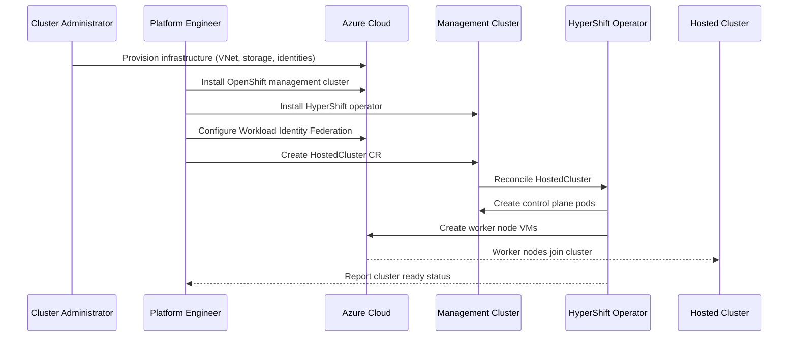
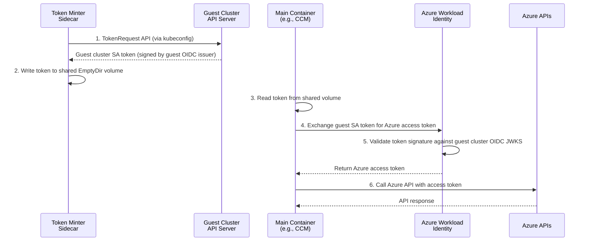

# Self-Managed Azure HyperShift

## Summary

This enhancement proposal defines the design and implementation for self-managed
Azure support in HyperShift. Self-managed Azure enables users to run HyperShift
hosted control planes on self-managed Azure infrastructure outside of the ARO
HCP (Azure Red Hat OpenShift Hosted Control Planes) managed service. Unlike the
managed offering where infrastructure is provisioned and managed by the service,
self-managed Azure requires users to provision their own Azure resources such as
Virtual Networks, storage accounts, managed identities, and DNS zones, while
managing the HyperShift operator lifecycle themselves.

## Motivation

Currently, HyperShift on Azure is primarily available through ARO HCP, a managed
service offering. However, there is significant demand from users who need to
run HyperShift on Azure with more control over their infrastructure and without
the constraints of a managed service. Self-managed Azure HyperShift addresses
this need by allowing users to deploy OpenShift hosted control planes on
customer-provisioned OpenShift management clusters running in Azure.

This approach provides several benefits:
- Users retain full control over their Azure infrastructure and management
  cluster lifecycle
- Enables deployment in environments where managed services are not permitted
- Allows customization of infrastructure to meet specific organizational
  requirements
- Provides flexibility in network architecture and security configurations

### User Stories

#### Story 1: Platform Engineer Deploying Hosted Clusters

As a platform engineer, I want to deploy HyperShift hosted control planes on my
existing Azure OpenShift management cluster so that I can provide on-demand
OpenShift clusters to my development teams while maintaining control over the
underlying infrastructure.

#### Story 2: Cluster Administrator Managing Infrastructure

As a cluster administrator, I want to provision and manage the Azure
infrastructure required for HyperShift (VNets, storage, managed identities) so
that I can ensure compliance with my organization's security and networking
policies.

#### Story 3: Operations Team Monitoring Deployments

As an operations team member, I want to monitor the health and status of
self-managed Azure HyperShift deployments using standard HyperShift metrics so
that I can proactively identify and remediate issues at scale.

#### Story 4: Security Engineer Configuring Workload Identity

As a security engineer, I want to configure Azure Workload Identity Federation
for hosted clusters so that OpenShift components can authenticate to Azure
services using short-lived tokens without managing long-lived credentials.

### Goals

1. Enable deployment of HyperShift hosted control planes on self-managed Azure
   infrastructure using customer-provisioned OpenShift management clusters.

2. Provide clear documentation and tooling for Azure infrastructure prerequisites
   including VNets, subnets, storage accounts, managed identities, and DNS zones.

3. Support Azure Workload Identity Federation for secure authentication of
   OpenShift components to Azure services.

4. Ensure self-managed Azure HyperShift follows the same operational patterns as
   other supported HyperShift platforms (AWS, bare metal).

5. Deliver the feature as Developer Preview in OpenShift 4.21 with a clear path
   to Tech Preview and GA.

### Non-Goals

1. This proposal does not aim to replace or deprecate the ARO HCP managed
   service offering.

2. Providing automated infrastructure provisioning equivalent to the managed
   service is not in scope for the initial implementation.

3. Supporting Azure Stack Hub or Azure Government environments is not in the
   initial scope (may be addressed in future enhancements).

## Proposal

Self-managed Azure HyperShift extends the existing HyperShift architecture to
support Azure as a platform where users manage all infrastructure themselves.
The implementation leverages existing HyperShift patterns while adding
Azure-specific infrastructure provisioning guidance and workload identity
integration.

The deployment consists of three main phases:

1. **Azure Workload Identity Setup**: Create managed identities for OpenShift
   components, configure the OIDC issuer, and establish federated credentials.

2. **Management Cluster Setup**: Install the HyperShift operator on an existing
   OpenShift cluster in Azure, optionally configure External DNS, and prepare
   the cluster to host control planes.

3. **Hosted Cluster Creation**: Provision Azure infrastructure for the hosted
   cluster, deploy the control plane, create worker node VMs, and integrate
   workload identities.

### Component Changes

The following components require modifications to support self-managed Azure
HyperShift:

#### HyperShift Repository Components

1. **HyperShift CLI (`hypershift` binary)**
   This enhancement references the upstream `hypershift` CLI. Equivalent
   functionality will be available in the downstream `hcp` CLI for
   production use.
   - `hypershift install`: Add Azure-specific flags for External DNS
     configuration and credential management when installing the HyperShift
     operator on a self-managed management cluster.
   - `hypershift create cluster azure`: Extend to support user-provided
     infrastructure (VNet, subnet, NSG IDs) and workload identity configuration
     (OIDC issuer URL, managed identities file).
   - `hypershift create infra azure`: New infrastructure provisioning command
     for creating Azure resources (VNets, subnets, NSGs, storage accounts).
   - `hypershift create iam azure`: New command for generating workload
     identity credentials and federated credential configurations.

2. **Control Plane Operator (CPO)**
   - Configures hosted control plane components to use Azure Workload Identity
     Federation instead of long-lived service principal credentials.
   - Injects token minter sidecar configuration into operands that require Azure
     API access, enabling short-lived token authentication.
   - Manages the OIDC issuer configuration and ensures service account tokens
     are properly signed and distributed to control plane pods.

3. **HyperShift Operator**
   - Validates Azure-specific infrastructure references (VNet ID, subnet ID,
     NSG ID) provided by users for self-managed deployments.
   - Creates and manages Azure infrastructure resources in the cluster-specific
     resource group.
   - Orchestrates the deployment of hosted control plane components with proper
     Azure credentials.

4. **NodePool Controller**
   - Provisions Azure VMs for worker nodes using the Azure Machine API.
   - Configures worker node networking using user-provided VNet and subnet.
   - Integrates with Azure Workload Identity for node bootstrap authentication.

#### Hosted Control Plane Components Requiring Token Minter Sidecar

Control plane components running in the management cluster that need to
communicate with Azure APIs must use short-lived tokens obtained via Azure
Workload Identity Federation. The Control Plane Operator (CPO) configures these
components with a token minter sidecar that:

1. Projects a Kubernetes service account token to a well-known file path
2. Configures Azure SDK environment variables for workload identity
   authentication
3. Enables components to obtain Azure access tokens without long-lived
   credentials

The following hosted control plane components require this configuration:

| Component | Azure API Usage |
|-----------|-----------------|
| Cloud Controller Manager | Load balancer management, node lifecycle |
| Azure Disk CSI Driver | Persistent volume provisioning |
| Azure File CSI Driver | File share provisioning |
| Cluster Image Registry Operator | Azure Blob storage for registry |
| Cluster Ingress Operator | DNS record management |
| Cloud Network Config Controller (CNCC) | Network configuration management |
| Cluster API Azure (CAPZ) | VM provisioning for worker nodes |

Each component's deployment is configured by CPO to include:
- A projected service account token volume
- Environment variables: `AZURE_CLIENT_ID`, `AZURE_TENANT_ID`,
  `AZURE_FEDERATED_TOKEN_FILE`
- The appropriate workload identity client ID for its Azure RBAC permissions

**Component Workload Identity Support**: The following components already have
built-in Azure workload identity authentication support enabled by default via
the `AzureWorkloadIdentity` feature gate (enabled in `configv1.Default`):

- **Cluster Ingress Operator**: Uses `azidentity.WorkloadIdentityCredential`
  in `pkg/dns/azure/client/auth.go` with automatic fallback to environment
  variables and default token path `/var/run/secrets/openshift/serviceaccount/token`
- **Cluster Image Registry Operator**: Uses `azidentity.WorkloadIdentityCredential`
  in `pkg/storage/azure/azureclient/azureclient.go` when no client secret is
  provided
- **Cloud Network Config Controller**: Uses `azidentity.WorkloadIdentityCredential`
  in `pkg/cloudprovider/azure.go` when `AzureWorkloadIdentity` feature gate is
  enabled and token file is present

No changes are required to these components for self-managed Azure HyperShift
support. CPO injects a **token-minter sidecar container** into each component's
deployment that:

1. Creates an EmptyDir volume backed by memory
2. Mints guest cluster service account tokens via the TokenRequest API
3. Writes tokens to `/var/run/secrets/openshift/serviceaccount/token`
4. The main container reads tokens from this shared volume

CPO also sets these environment variables on the main container:

| Environment Variable | Value |
|---------------------|-------|
| `AZURE_CLIENT_ID` | Workload identity client ID from `HostedCluster.Spec.Platform.Azure.WorkloadIdentities.<component>.ClientID` |
| `AZURE_TENANT_ID` | Azure tenant ID from `HostedCluster.Spec.Platform.Azure.TenantID` |
| `AZURE_FEDERATED_TOKEN_FILE` | `/var/run/secrets/openshift/serviceaccount/token` |

Note: The token-minter sidecar is only injected for self-managed Azure (not
ARO-HCP), per `token-minter-container.go:59-60`.

#### CSI Driver Token Minter Configuration

The Azure Disk and Azure File CSI drivers require special handling for workload
identity authentication on self-managed HyperShift clusters
([OCPBUGS-63698](https://issues.redhat.com/browse/OCPBUGS-63698)). CPO passes the
`HYPERSHIFT_IMAGE` environment variable to the Cluster Storage Operator (CSO),
which then passes it to the CSI driver operators. This enables the CSI operators
to inject a token-minter sidecar container into the CSI driver controller pods.

The token-minter flow works as follows:

1. **CPO → CSO**: CPO sets `HYPERSHIFT_IMAGE` on the cluster-storage-operator
   deployment, pointing to the token-minter image from the release payload.

2. **CSO → CSI Operators**: CSO passes `HYPERSHIFT_IMAGE` to the Azure Disk and
   Azure File CSI driver operators.

3. **CSI Operators → Driver Controllers**: When `HYPERSHIFT_IMAGE` is set, the
   CSI operators inject a token-minter sidecar into the CSI driver controller
   pods with the following configuration:
   ```yaml
   containers:
   - name: token-minter
     image: <HYPERSHIFT_IMAGE>
     command: ["/usr/bin/control-plane-operator", "token-minter"]
     args:
     - "--token-audience=openshift"
     - "--service-account-namespace=openshift-cluster-csi-drivers"
     - "--service-account-name=<csi-driver-controller-sa>"
     - "--token-file=/var/run/secrets/openshift/serviceaccount/token"
     - "--kubeconfig=/etc/kubernetes/kubeconfig"
   ```

4. **Token Minting**: The token-minter creates guest cluster service account
   tokens and writes them to the shared volume at
   `/var/run/secrets/openshift/serviceaccount/token`.

5. **CSI Driver Authentication**: The CSI driver reads the token and uses Azure
   Workload Identity Federation to authenticate to Azure APIs.

This approach differs from ARO HCP, which uses Azure Secrets Store CSI Driver
with SecretProviderClass resources to mount credentials from Azure Key Vault.

> **Note**: The Azure File CSI driver currently uses a workaround for SMB
> authentication rather than true short-term credentials. See
> [kubernetes-sigs/azurefile-csi-driver#1737](https://github.com/kubernetes-sigs/azurefile-csi-driver/issues/1737)
> for tracking. This is an upstream limitation that does not block this
> enhancement. When upstream support is available, the behavior will be
> transparent to users.

### Workflow Description

**Platform Engineer** is a human user responsible for setting up the management
cluster and deploying hosted clusters.

**Cluster Administrator** is a human user responsible for provisioning and
maintaining Azure infrastructure.

**HyperShift Operator** is the software component that manages hosted cluster
lifecycles.

1. The cluster administrator provisions the required Azure infrastructure:
   - Creates a resource group for persistent shared resources
   - Creates Virtual Network (VNet) with appropriate subnets
   - Configures Network Security Groups (NSGs)
   - Sets up Azure DNS zones
   - Creates storage accounts for OIDC and image registry
   - Creates managed identities for OpenShift components

2. The platform engineer installs an OpenShift management cluster using the
   standard OpenShift installer.

   **Supported Management Cluster Configurations**: For Dev Preview, the
   supported management cluster configuration is a standalone OpenShift cluster.
   The management cluster can run on Azure or AWS. This is the configuration
   that has been validated through testing. The workflow and diagram below
   describe the Azure management cluster setup; the AWS management cluster
   setup follows a similar pattern.

3. The platform engineer installs the HyperShift operator on the management
   cluster following the
   [Setup Azure Management Cluster](https://hypershift.pages.dev/how-to/azure/setup-management-cluster/)
   documentation. With External DNS (recommended for production):
   ```bash
   hypershift install \
     --external-dns-provider=azure \
     --external-dns-credentials $SERVICE_PRINCIPAL_FILEPATH \
     --pull-secret $PULL_SECRET \
     --external-dns-domain-filter $DNS_ZONE_NAME \
     --limit-crd-install Azure
   ```
   Or without External DNS (simpler, for development):
   ```bash
   hypershift install \
     --pull-secret $PULL_SECRET \
     --limit-crd-install Azure
   ```

4. The platform engineer configures Azure Workload Identity Federation:
   - Creates federated credentials linking Kubernetes service accounts to
     Azure managed identities
   - Configures the OIDC issuer endpoint

5. The platform engineer creates a hosted cluster using the HyperShift CLI
   following the
   [Create a Self-Managed Azure HostedCluster](https://hypershift.pages.dev/how-to/azure/create-self-managed-azure-cluster/)
   documentation:
   ```bash
   hypershift create cluster azure \
     --name $CLUSTER_NAME \
     --namespace $CLUSTER_NAMESPACE \
     --azure-creds $AZURE_CREDS \
     --location $LOCATION \
     --node-pool-replicas 2 \
     --base-domain $PARENT_DNS_ZONE \
     --pull-secret $PULL_SECRET \
     --generate-ssh \
     --release-image $RELEASE_IMAGE \
     --external-dns-domain $DNS_ZONE_NAME \
     --resource-group-name $MANAGED_RG_NAME \
     --vnet-id $VNET_ID \
     --subnet-id $SUBNET_ID \
     --network-security-group-id $NSG_ID \
     --sa-token-issuer-private-key-path $SA_TOKEN_ISSUER_PRIVATE_KEY_PATH \
     --oidc-issuer-url $OIDC_ISSUER_URL \
     --dns-zone-rg-name $PERSISTENT_RG_NAME \
     --assign-service-principal-roles \
     --workload-identities-file ./workload-identities.json \
     --diagnostics-storage-account-type Managed
   ```

6. The HyperShift operator provisions the hosted control plane in the management
   cluster namespace.

7. The HyperShift operator creates worker node VMs in Azure using the configured
   infrastructure.

8. The platform engineer monitors the hosted cluster status and manages ongoing
   operations using standard HyperShift tooling.



### API Extensions

<!-- TODO: This section needs to be updated when Tech Preview API changes are
finalized. Currently, for Dev Preview, no new API fields are required. However,
Tech Preview may introduce new fields on HostedCluster and/or NodePool for
Azure-specific configuration. When API changes are needed, update this section
and change api-approvers from "None" to "TBD", then request an API reviewer
from the #forum-api-review Slack channel. -->

For the initial Dev Preview implementation, no API extensions are required.
Self-managed Azure leverages the existing HostedCluster and NodePool APIs with
Azure platform configuration.

### Topology Considerations

#### Hypershift / Hosted Control Planes

This enhancement is specifically designed for HyperShift/Hosted Control Planes.
The proposal defines how self-managed Azure deployments differ from the managed
ARO HCP offering:

- **Management Cluster**: Must be a customer-provisioned OpenShift cluster
  running in Azure or AWS (unlike ARO HCP which uses an AKS management cluster)
- **Infrastructure Lifecycle**: Users are responsible for provisioning and
  maintaining all Azure infrastructure
- **Workload Identity**: Users must configure Azure Workload Identity Federation
  manually
- **DNS**: Users can optionally configure External DNS for automatic DNS record
  management or manage DNS manually

The hosted control plane runs as pods in the management cluster, while worker
nodes are Azure VMs in the customer's subscription.

#### Standalone Clusters

This proposal does not apply to standalone OpenShift clusters. Self-managed
Azure HyperShift is specifically for the hosted control plane topology.

#### Single-node Deployments or MicroShift

This proposal does not apply to Single-node OpenShift (SNO) or MicroShift
deployments. While SNO could theoretically serve as a management cluster for
HyperShift, this is not a target use case for self-managed Azure.

#### OpenShift Kubernetes Engine

Not applicable. This enhancement is specific to the HyperShift topology and does
not affect OKE.

### Implementation Details/Notes/Constraints

The implementation builds on the existing HyperShift Azure support used by ARO
HCP, adapting it for self-managed deployments. Key implementation areas include:

1. **Infrastructure Documentation**: Comprehensive documentation for Azure
   infrastructure prerequisites is being developed in
   https://github.com/openshift/hypershift/pull/7361.

2. **HyperShift CLI Enhancements**: The `hypershift create cluster azure`
   command supports self-managed deployments with user-provided infrastructure
   parameters.

3. **Workload Identity Integration**: Azure Workload Identity Federation is used
   for secure authentication, requiring:
   - OIDC issuer configuration
   - Workload identities for each OpenShift component
   - Federated credentials linking Kubernetes service accounts

4. **Resource Group Strategy**:
   - Persistent resource group for shared resources (OIDC storage, DNS zones)
   - Cluster-specific resource groups for hosted cluster infrastructure

5. **Network Configuration**:
   - User-provided VNet and subnets
   - Network Security Groups for security policies
   - Load balancers for API and ingress endpoints

#### Azure Workload Identity Architecture

Self-managed Azure HyperShift uses Azure Workload Identity Federation to provide
secure, credential-free authentication for control plane components. This
replaces long-lived service principal secrets with short-lived tokens.

**OIDC Issuer Setup**:

1. The platform engineer generates an RSA key pair for signing service account
   tokens.
2. An Azure Blob Storage container is created to host the OIDC discovery
   document and JWKS (JSON Web Key Set).
3. Azure is configured to trust tokens signed by this issuer via Managed
   Identity federated credentials.

**Token Flow**:



**CPO Token Minter Configuration**:

Control plane pods run on the management cluster but must authenticate using
tokens signed by the **guest cluster's** OIDC issuer, which Azure is configured
to trust. A standard Kubernetes projected service account token cannot be used
because it would be signed by the management cluster's issuer. Instead, CPO
configures each Azure-aware component with a token-minter sidecar that mints
guest cluster tokens:

1. **EmptyDir Volume**: A memory-backed EmptyDir volume shared between the
   token-minter sidecar and the main container
   (`token-minter-container.go:145-152`):
   ```yaml
   volumes:
   - name: <component>-token
     emptyDir:
       medium: Memory
   ```

2. **Token Minter Sidecar**: A sidecar container that connects to the guest
   cluster via kubeconfig and mints service account tokens using the
   Kubernetes TokenRequest API (`token-minter-container.go:95-123`):
   ```yaml
   containers:
   - name: token-minter
     image: <HYPERSHIFT_IMAGE>
     command: ["/usr/bin/control-plane-operator", "token-minter"]
     args:
     - "--service-account-namespace=<component-namespace>"
     - "--service-account-name=<component-sa>"
     - "--token-file=/var/run/secrets/openshift/serviceaccount/token"
     volumeMounts:
     - name: <component>-token
       mountPath: /var/run/secrets/openshift/serviceaccount
   ```
   The token-minter automatically renews tokens at 80% of their lifetime
   (`tokenminter.go:119-229`).

3. **Environment Variables**: The main container is configured with Azure SDK
   environment variables pointing to the token written by the sidecar:
   ```yaml
   env:
   - name: AZURE_CLIENT_ID
     value: "<managed-identity-client-id>"
   - name: AZURE_TENANT_ID
     value: "<azure-tenant-id>"
   - name: AZURE_FEDERATED_TOKEN_FILE
     value: "/var/run/secrets/openshift/serviceaccount/token"
   ```

The Azure SDK's `azidentity.WorkloadIdentityCredential` reads the token from
`AZURE_FEDERATED_TOKEN_FILE` and exchanges it with Azure AD for an access
token. Azure validates the token signature against the guest cluster's OIDC
JWKS endpoint.

#### Managed Identity Requirements

Each control plane component requires a dedicated Azure Managed Identity with
appropriate RBAC permissions. The HyperShift CLI assigns custom role definitions
to provide least-privilege access for each component:

| Component | Role | Scopes |
|-----------|------|--------|
| Cloud Provider (CCM) | Custom: Cloud Provider Role | Managed RG, NSG RG, VNet RG |
| Azure Disk CSI Driver | Custom: Azure Disk Role | Managed RG |
| Azure File CSI Driver | Custom: Azure File Role | Managed RG, NSG RG, VNet RG |
| Image Registry (CIRO) | Custom: Image Registry Role | Managed RG |
| Ingress Operator | Custom: Ingress Role | Managed RG, VNet RG, DNS Zone RG |
| Network (CNCC) | Custom: Network Role | Managed RG, VNet RG |
| Cluster API Azure (CAPZ) | Custom: NodePool Management Role | Managed RG, VNet RG |

> **Note**: Unlike ARO-HCP (managed Azure), the Control Plane Operator in
> self-managed Azure does not require a dedicated Azure managed identity. CPO
> accesses the guest cluster via kubeconfigs and coordinates component
> authentication through the workload identities listed above.

The custom role definitions provide fine-grained permissions for each component.
When `--assign-service-principal-roles` is passed to the CLI, these roles are
automatically assigned to the managed identities. When `--assign-custom-hcp-roles`
is passed, custom roles with least-privilege permissions are assigned instead of
the default Contributor role.

The `hypershift create iam azure` command generates the required managed
identities and federated credentials based on a workload identities
configuration file.

<!-- Note: Per dev-guide/feature-zero-to-hero.md, new features typically require
a feature gate. However, since this enhancement extends existing supported
functionality and does not introduce breaking changes, a feature gate may not
be required. Verify with the API review team if a feature gate is needed. -->

### Risks and Mitigations

**Risk**: Users may misconfigure Azure infrastructure leading to deployment
failures.

**Mitigation**: Provide comprehensive documentation, validation in the
HyperShift CLI, and clear error messages when infrastructure prerequisites are
not met.

---

**Risk**: Azure API rate limiting may impact large-scale deployments.

**Mitigation**: Implement appropriate retry logic and backoff in Azure API
clients. Document recommended practices for scaling.

---

**Risk**: Security vulnerabilities from misconfigured workload identity.

**Mitigation**: Provide detailed security guidance and validation of workload
identity configuration. Use least privilege principles in documentation
examples.

### Drawbacks

1. **Operational Complexity**: Self-managed Azure requires users to manage both
   the management cluster and Azure infrastructure, increasing operational
   burden compared to ARO HCP.

2. **Support Scope**: Support for self-managed deployments may be more complex
   as infrastructure varies between customers.

3. **Feature Parity**: Some features available in ARO HCP may not be immediately
   available or require additional configuration in self-managed deployments.

## Alternatives (Not Implemented)

N/A

## Open Questions [optional]

This section is intentionally left empty. No open questions remain at this time.

## Test Plan

<!-- TODO: Develop comprehensive test plan per dev-guide/feature-zero-to-hero.md
requirements. Tests must include:
- `[OCPFeatureGate:SelfManagedAzure]` label (if feature gate is used)
- `[Jira:"HyperShift"]` label for component
- Appropriate test type labels (`[Suite:...]`, `[Serial]`, `[Slow]`, etc.)

Reference dev-guide/test-conventions.md for labeling requirements.

Test coverage should include:
- End-to-end hosted cluster lifecycle (create, upgrade, delete)
- Worker node provisioning and scaling
- Workload identity authentication
- Network connectivity validation
- Upgrade and downgrade scenarios
-->

The test strategy for self-managed Azure HyperShift includes:

1. **Unit Tests**: Test Azure-specific logic in HyperShift controllers and CLI.

2. **End-to-End Tests**: Full hosted cluster lifecycle tests including creation,
   scaling, upgrades, and deletion on Azure infrastructure.

3. **Conformance Tests**: Run OpenShift conformance test suite on hosted
   clusters deployed via self-managed Azure.

## Graduation Criteria

<!-- TODO: Define specific graduation criteria per dev-guide/feature-zero-to-hero.md
promotion requirements:
- Minimum 5 tests per feature
- All tests run at least 7 times per week
- All tests run at least 14 times per supported platform
- 95% pass rate
- Tests running on all supported platforms

See the feature-zero-to-hero.md document for complete requirements. -->

### Dev Preview -> Tech Preview

Tracked by [OCPSTRAT-2252](https://issues.redhat.com/browse/OCPSTRAT-2252).

- Ability to deploy and manage hosted clusters end-to-end on self-managed Azure
- Documentation for all Azure infrastructure prerequisites
- Basic test coverage for cluster lifecycle operations
- Gather feedback from early adopters

### Tech Preview -> GA

Tracked by [OCPSTRAT-2253](https://issues.redhat.com/browse/OCPSTRAT-2253).

- Comprehensive test coverage across supported configurations
- Performance and scale testing completed
- User-facing documentation in openshift-docs
- Support procedures documented
- At least one minor release cycle of Tech Preview feedback addressed

### Removing a deprecated feature

N/A - This is a new feature.

## Upgrade / Downgrade Strategy

Self-managed Azure HyperShift follows the standard HyperShift upgrade path with
no Azure-specific considerations:

**Upgrade**:
- Management cluster upgrades follow standard OpenShift upgrade procedures
- HyperShift operator upgrades are handled by OLM
- Hosted cluster upgrades are controlled via the HostedCluster release image

**Downgrade**:
- Management cluster downgrades are not supported (standard OpenShift policy)
- HyperShift operator downgrades should be avoided; if necessary, ensure
  compatible hosted cluster versions
- Hosted cluster downgrades are controlled via the HostedCluster release image
  (subject to standard OpenShift downgrade policies)

No special handling is required for Azure infrastructure during upgrades.

## Version Skew Strategy

Self-managed Azure HyperShift follows the standard HyperShift
[Versioning and Support](https://hypershift.pages.dev/reference/versioning-support/)
policy:

- **NodePool to HostedCluster**: NodePool version cannot be higher than the
  HostedCluster version. NodePools support up to N-3 version skew (up to 3
  minor versions behind the HostedCluster).
- **Hosted Cluster versions**: Supported versions are determined by the
  HyperShift Operator and listed in the `supported-versions` ConfigMap.
  Typically supports the same OCP version as the management cluster plus two
  previous minor versions.
- **Management Cluster**: For production deployments, use Multi-Cluster Engine
  (MCE) which has specific OCP management cluster version requirements.
- Azure infrastructure components are version-agnostic and do not require
  version coordination.

Monitor the `SupportedVersionSkew` condition on NodePools to identify version
compatibility issues.

## Operational Aspects of API Extensions

N/A - No API extensions are introduced in this enhancement.

## Support Procedures

### Detecting Issues

1. **HostedCluster not becoming available**:
   - Check HostedCluster conditions: `oc get hostedcluster -o yaml`
   - Review HyperShift operator logs: `oc logs -n hypershift deployment/operator`
   - Verify Azure infrastructure is correctly provisioned

2. **Worker nodes not joining**:
   - Check NodePool conditions: `oc get nodepool -o yaml`
   - Verify Azure VM provisioning in Azure portal
   - Check Network Security Group rules allow required traffic

3. **Workload Identity authentication failures**:
   - Verify managed identity configuration in Azure
   - Check federated credential configuration
   - Review component logs for authentication errors

### Common Remediation Steps

1. **Infrastructure issues**: Verify Azure resources match documented
   prerequisites. Check VNet connectivity, NSG rules, and DNS configuration.

2. **Authentication issues**: Regenerate federated credentials and restart
   affected pods to pick up new tokens.

3. **Scaling issues**: Check Azure subscription quotas and resource limits.

## Infrastructure Needed [optional]

- Azure subscription for CI/CD testing with appropriate quotas
- Test Azure infrastructure (VNets, storage accounts, DNS zones) for e2e tests
- Integration with existing HyperShift CI infrastructure
- Azure Graph API access is required for creating managed identities and
  federated credentials during workload identity setup
