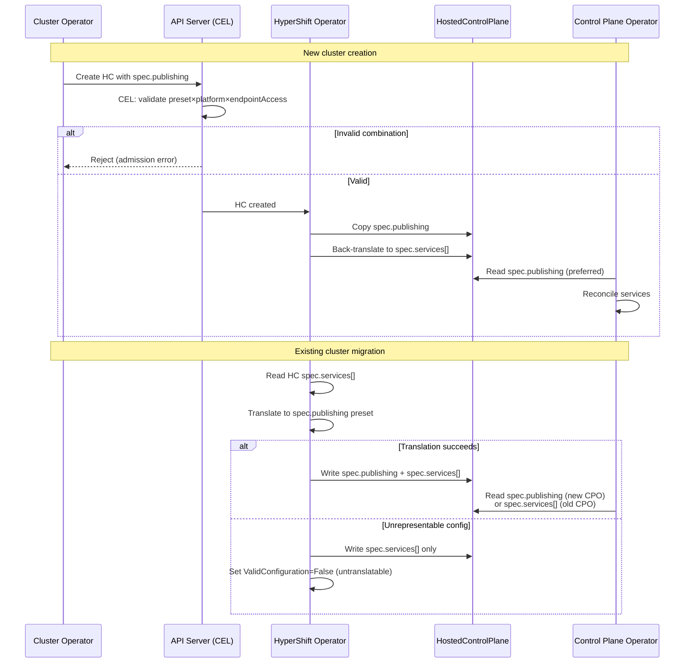

# Service Publishing API Evolution: Replacing `spec.services[]` with `spec.publishing`

## Summary

HostedClusters cannot expose the hosted control plane
router as anything other than a cloud LoadBalancer: the
router Service is created unconditionally as type
`LoadBalancer`, so on management clusters without a cloud
load-balancer provider (Agent, KubeVirt) it stays `Pending`
indefinitely (OCPBUGS-77856). Fixing this requires letting
users choose how the router is exposed — and two attempts to
add that capability to the existing `spec.services[]` API
failed review, because the field cannot be extended cleanly.

The underlying problem is that `spec.services[]` advertises
arbitrary per-service publishing combinations while the
controllers implement only a small, fixed set of platform
topologies. That mismatch is papered over with a growing tax
of CEL rules (several disabled because they exceed the cost
budget), controller-time validation, recurring bug fixes,
and a ~1,200-line reference document that tells users which
combinations are actually allowed.

This enhancement replaces `spec.services[]` with a new
`spec.publishing` field built from a small set of topology
presets: `DedicatedIngress` (all services through a single
ingress point), `DedicatedAPIEndpoint` (API server on a
dedicated LoadBalancer, the rest through management-cluster
ingress), and `NodePort` (all services on node ports).
Because the presets encode only the topologies the
controllers support, the set of valid configurations is
expressed structurally: the API is self-documenting and
rejects unsupported topologies at admission instead of after
the fact, and router exposure becomes an explicit,
user-visible field rather than an emergent side effect.

Initial migration (Phase 1) leverages the HO-to-HCP copy
boundary to translate between APIs without mutating existing
HostedClusters. A later optional phase (Phase 2.5) lets
clusters adopt `spec.publishing` directly via an atomic swap
that clears `spec.services[]` and sets `spec.publishing` in
a single update.

## Motivation

The `spec.services[]` API was designed to be maximally
flexible: any control plane service can, in principle, be
published with any strategy. In practice the controllers
implement only a handful of platform-specific topologies.
Every time that gap is exercised — by a bug, a new platform
requirement, or a new feature — we respond by adding more
validation, more controller checks, and more documentation
to steer users away from the combinations that don't work.
The API cannot express what it actually supports, so we
compensate everywhere else. The router exposure bug below is
the latest example, and the reason this enhancement exists.

### The trigger: the router exposure bug (OCPBUGS-77856)

The hosted control plane router Service is created
unconditionally as type `LoadBalancer`
(`hypershift-operator/controllers/sharedingress/router.go`).
On management clusters that have no cloud load-balancer
provider — Agent and KubeVirt in particular — that Service
never receives an address and stays `Pending`, which blocks
route status propagation and KAS resolution. The fix is
conceptually simple: let the user expose the router as a
NodePort instead. Delivering it through the current API was
not:

- PR [openshift/hypershift#8439](https://github.com/openshift/hypershift/pull/8439)
  tried platform auto-detection and was closed after review.
- PR [openshift/enhancements#2024](https://github.com/openshift/enhancements/pull/2024)
  proposed a dedicated `spec.routerPublishing` field, which
  this enhancement supersedes.

Two properties of the current API made a clean fix
impossible. First, the router is not a service in
`spec.services[]` at all — whether it is even deployed is
derived implicitly from platform, endpoint access, KAS
strategy, and whether a dedicated DNS hostname is set
(`support/netutil/visibility.go`, `LabelHCPRoutes`). There
is no field that says "deploy the router," let alone "expose
it this way." Second, `spec.services[]` is immutable after
creation for every platform except IBMCloud, so even if
router exposure were representable, existing clusters could
not adopt it without being recreated.

### Root cause: flexibility the controllers don't implement

`spec.services[]` is a `[]ServicePublishingStrategyMapping`
that binds each `ServiceType` (APIServer, OAuthServer,
Konnectivity, Ignition) to an arbitrary
`ServicePublishingStrategy` (LoadBalancer, Route, NodePort,
…). The schema permits any combination. The controllers do
not: the supported configurations are a fixed matrix of
platform × endpoint access × external-DNS, enumerated in
"Supported topologies today" below and in the reference
documentation. A user who submits a combination outside
that matrix does not get a working cluster — they get silent
misbehavior or a degraded condition, after admission has
already accepted the write.

This is the core problem. It is not any single structural
defect; it is that the shape of the API promises something
the implementation cannot honor.

### The cost of the mismatch

Because the API cannot express what is actually supported,
the constraints have to be enforced — and explained —
everywhere else:

- **Validation admission can't run.** The rules that would
  enforce required service types and unique Route/NodePort
  endpoints are written but commented out on the `services`
  field in `hostedcluster_types.go` because they exceed the
  CEL cost budget. Uniqueness is instead checked at
  controller time (`validatePublishingStrategyMapping`), and
  Route capability likewise
  (`validateConfigAndClusterCapabilities`). Both run after
  the write is admitted, so the user learns of the problem
  from a condition, not a rejection.
- **Recurring bug fixes.** OCPBUGS-77856 is one instance;
  each new platform or exposure requirement tends to surface
  another combination the controllers must be taught to
  reject or special-case.
- **Documentation standing in for the type system.** The
  reference guide
  (`docs/content/reference/service-publishing-strategies.md`,
  ~1,200 lines) exists largely to tell users, per platform
  and per endpoint-access mode, which service/strategy
  combinations are valid. That document is the API
  constraint the schema can't express.
- **Testing can't be systematic.** Because the set of valid
  configurations isn't derivable from the type — it lives in
  the platform × endpoint-access × external-DNS matrix in
  documentation — tests have to replicate that matrix by hand
  to know which combinations to exercise, and drift from it as
  the controllers change. And because invalid combinations are
  admitted and then fail silently, negative testing ("this
  configuration is rejected") can't be done at admission; it
  requires standing up controllers and asserting on degraded
  conditions.

A preset model collapses this: the valid topologies are the
type, so admission enforces them for free, the configuration
is self-documenting, and testing becomes tractable — the
valid set is finite and enumerable directly from the API, and
invalid configurations are rejected deterministically at
admission (envtest asserts accept/reject on YAML, with no
controllers in the loop).

### Structural symptoms of the same mismatch

These follow from modeling a constrained topology as an
open-ended list. Each is individually fixable — some via
CRD ratcheting — but they recur because the shape is wrong:

1. **Open-ended list for a closed set.** Ordering is
   ambiguous, there is no schema-level uniqueness (duplicate
   entries are possible), and `MaxItems` must be raised
   whenever a new service is added.
2. **MaxItems coupling.** Both `HostedCluster` and
   `HostedControlPlane` cap `services[]` at `MaxItems=6`,
   and the HO copies the list verbatim from HC to HCP
   (`hcp.Spec.Services = hcluster.Spec.Services`). The two
   caps must be raised in lockstep; otherwise the copy is
   rejected by HCP admission at reconcile time. (A test
   asserting the two limits stay equal would be a cheap
   interim guard.)
3. **Count without content.** A minimum count is enforced
   (`size(self.services) >= 4`, or `>= 3` for IBMCloud), but
   *which* services are present, and whether their endpoints
   are unique, is not — those are exactly the checks that
   exceed the CEL budget and were disabled.
4. **Dead values kept for compatibility.** The `S3` and
   `None` strategies and the `OIDC` and `OVNSbDb` service
   types remain in the enums with CEL rules but no controller
   support; the `MaxItems=6` cap exists partly to keep room
   for these no-op values.
5. **Immutability.** As above, the field is immutable
   (except IBMCloud), so misconfigurations and missing
   capabilities can only be corrected by recreating the
   cluster.

### Why extending `spec.services[]` doesn't work

The natural way to fix the router bug within the current API
would be to add the router to `spec.services[]`. An earlier
revision of #2024 proposed exactly that — a `Router`
`ServiceType` — and review rejected it, for reasons that
generalize to any extension of this field:

- **The router is shared infrastructure, not a service.** It
  is a single HAProxy deployment per HCP namespace that
  fronts all Route-type services via SNI. Listing it beside
  APIServer/OAuth/Konnectivity models it as a peer of the
  things it serves.
- **Its lifecycle is conditional.** The router only deploys
  under specific conditions, so a `Router` entry can be
  configured when no router will exist — with no clean way to
  validate that at admission.
- **It carries no new per-service information.** When
  services already use Route, a `Router` entry adds nothing
  except how to expose the router itself — which is a
  property of the topology, not of any one service.

#2024 responded by moving the router out of the list into a
dedicated `spec.routerPublishing` field. This enhancement
generalizes that instinct: rather than bolt one more special
case onto the list, model the whole publishing topology as a
small set of presets that includes router exposure by
construction.

### User Stories

As a cluster administrator, I want to specify my service
publishing topology with a single preset instead of
configuring 4 individual services, so that I can't
accidentally create invalid combinations that the
controllers don't support.

As a platform engineer running HyperShift on a management
cluster with no cloud load-balancer provider (Agent or
KubeVirt, e.g. bare metal), I want to expose the HCP router
as a NodePort instead of the hardcoded LoadBalancer, so that
the router Service does not stay `Pending` and block route
status and KAS resolution (OCPBUGS-77856).

As an SRE managing a fleet of hosted clusters, I want the
API to reject unsupported service publishing configurations
at admission time, so that I don't discover
misconfigurations through controller errors or degraded
conditions after creation.

As an Azure self-managed cluster operator, I want to give
the OAuth server its own dedicated LoadBalancer while keeping
other services behind the HCP router, so that OAuth traffic
can be isolated for compliance and performance requirements.

As an IBMCloud managed service operator (OCM), I want to
configure all-Route publishing without deploying an HCP
router, so that the platform's existing shared ingress
infrastructure handles service exposure.

### Goals

1. Replace `spec.services[]` with a preset-based
   `spec.publishing` field that covers all documented,
   recommended topologies.
2. Express the set of supported topologies structurally, so
   that the API is self-documenting and unsupported
   configurations are rejected at admission — removing the
   need for the current controller-time checks and for the
   platform/strategy compatibility matrix that today lives
   only in documentation.
3. Make the supported configuration space finite and directly
   testable: the valid set is enumerable from the type, and
   invalid configurations can be asserted rejected
   deterministically at admission (envtest) rather than
   through controller runs and degraded conditions.
4. Make router deployment an explicit, preset-determined
   decision — not an implicit consequence of service
   strategy combinations.
5. Support the Router NodePort exposure use case from
   enhancement PR #2024 (OCPBUGS-77856) without adding a new
   `ServiceType`.
6. Provide a safe, rollback-compatible migration path from
   `spec.services[]` to `spec.publishing` using the
   HO-to-HCP copy boundary.
7. Deprecate and eventually remove `spec.services[]`.

### Non-Goals

1. Changing how `endpointAccess` works or how private
   connectivity (PrivateLink, Private Service Connect,
   Swift) is configured — these are orthogonal platform
   concerns.
2. Supporting *unconstrained* per-service strategy
   combinations. The presets deliberately encode only the
   per-service variations the controllers support (for
   example, the Azure self-managed OAuth LoadBalancer case);
   they do not reopen the arbitrary combination space that
   `spec.services[]` nominally allowed.
3. Changing the HCP router's internal architecture or SNI
   routing behavior.
4. Automatically migrating existing HostedClusters'
   `spec.services[]` in place — Phase 1 translation
   happens at the HO-to-HCP boundary without mutating
   the HC. Phase 2.5 provides a user-initiated atomic
   swap path for existing clusters that need to adopt
   `spec.publishing` to access new capabilities (e.g.,
   configurable router exposure per CNTRLPLANE-3527).

## Proposal

Replace the heterogeneous `spec.services[]` list with a
new `spec.publishing` field on `HostedClusterSpec` that
uses a discriminated union of three topology presets. Each
preset fully determines the service publishing topology,
including whether an HCP router is deployed. The three
presets cover all currently supported platform x
configuration combinations.

The HyperShift Operator (HO) handles migration by
translating `spec.services[]` from existing HostedClusters
into the equivalent `spec.publishing` on the
HostedControlPlane, maintaining backward compatibility with
older Control Plane Operators (CPO) by writing both fields.

### Workflow Description

**Actors:**

- **Cluster operator**: Human user creating or managing a
  HostedCluster.
- **HyperShift Operator (HO)**: Controller on the
  management cluster that reconciles HostedCluster to
  HostedControlPlane.
- **Control Plane Operator (CPO)**: Controller that
  reconciles HostedControlPlane resources within each
  HCP namespace.
- **API server**: Kubernetes API server with CEL validation
  rules on the HostedCluster CRD.

#### New cluster creation

1. Operator chooses a publishing topology:
   `DedicatedIngress`, `DedicatedAPIEndpoint`, or `NodePort`.
2. Operator sets `spec.publishing.type` to the chosen preset
   and fills in the preset-specific sub-struct (hostnames,
   ports, exposure type).
3. API server CEL validation rejects invalid
   preset x platform x endpointAccess combinations at
   admission time.
4. HO copies `spec.publishing` from HC to HCP, and
   back-translates it to `spec.services[]` on the HCP for
   CPO backward compatibility.
5. CPO reads `spec.publishing` from HCP (falling back to
   `spec.services[]` for older CPO versions).

#### Existing cluster migration

1. Existing HC retains its immutable `spec.services[]` — no
   mutation required.
2. HO reads `spec.services[]` from HC, translates it to the
   equivalent `spec.publishing` preset.
3. HO writes both `spec.publishing` and `spec.services[]` to
   the HCP.
4. New CPO reads `spec.publishing`; old CPO reads
   `spec.services[]`.
5. If translation fails (unrepresentable configuration), HO
   skips translation, copies `spec.services[]` only, and
   reports the failure on the HC's `ValidConfiguration`
   condition. The cluster keeps working on `spec.services[]`.



#### CLI interaction

```bash
# DedicatedIngress with LB exposure (e.g., AWS Private)
hcp create cluster aws \
  --endpoint-access=Private \
  --external-dns-domain=example.com \
  --publishing-type=DedicatedIngress \
  --publishing-exposure=LoadBalancer

# DedicatedAPIEndpoint (e.g., AWS Public, no ExternalDNS)
hcp create cluster aws \
  --endpoint-access=Public \
  --publishing-type=DedicatedAPIEndpoint

# NodePort (e.g., Agent default)
hcp create cluster agent \
  --publishing-type=NodePort \
  --api-server-address=10.0.0.5
```

The CLI should infer the publishing preset from existing
flags (`--endpoint-access`, `--external-dns-domain`,
`--service-publishing-strategy`) to maintain backward
compatibility. An explicit override flag
(e.g., `--publishing-type`) may be added for advanced use
cases. Exact flag names and inference logic are deferred to
implementation.

### API Extensions

This enhancement modifies the `HostedCluster` and
`HostedControlPlane` CRDs in the
`hypershift.openshift.io/v1beta1` API group. It adds a new
`spec.publishing` field and associated types. No admission
webhooks, conversion webhooks, aggregated API servers, or
finalizers are added or modified.

#### `spec.publishing` — discriminated union

A new field `spec.publishing` on `HostedClusterSpec`,
mutually exclusive with `spec.services[]` (CEL enforced).

```yaml
spec:
  publishing:
    # +unionDiscriminator
    # +kubebuilder:validation:Enum=DedicatedIngress;
    #   DedicatedAPIEndpoint;NodePort
    type: DedicatedIngress | DedicatedAPIEndpoint | NodePort

    # type=DedicatedIngress: all services through a
    # single ingress point
    dedicatedIngress:
      # +unionDiscriminator
      # +kubebuilder:validation:Enum=LoadBalancer;
      #   NodePort;External
      exposure: LoadBalancer | NodePort | External

      # exposure=LoadBalancer: HCP router deployed,
      # fronted by cloud LB
      loadBalancer:
        hostname: kas-lb.example.com

      # exposure=NodePort: HCP router deployed,
      # exposed as NodePort
      nodePort:
        address: 10.0.0.5
        port: 30080  # optional — auto-assigned if omitted

      # exposure=External: platform handles routing
      # (IBMCloud)

      # services: list keyed by service name. An APIServer
      # entry with a hostname is required; the other
      # services' hostnames are derived when omitted.
      services:
      - name: APIServer      # required — KAS hostname required
        hostname: api.custom.com
      - name: OAuthServer    # optional — derived if omitted
        hostname: oauth.custom.com
        # exposure: promote OAuth onto its own dedicated LB
        # (Azure self-managed only)
        exposure: DedicatedLoadBalancer
      - name: Konnectivity
        hostname: konnectivity.custom.com
      - name: Ignition       # optional — omit if no Ignition
        hostname: ignition.custom.com

    # type=DedicatedAPIEndpoint: KAS on a dedicated LB;
    # OAuth via Route through the management ingress
    dedicatedAPIEndpoint:
      # services: only APIServer and OAuthServer are
      # configurable. Konnectivity/Ignition are served by the
      # management ingress with derived, non-overridable
      # hostnames. All entries optional (hostnames derived).
      services:
      - name: APIServer      # optional — override LB hostname
        hostname: api.example.com
      - name: OAuthServer    # optional
        hostname: oauth.example.com
        # exposure: OAuth on its own dedicated LB
        # (Azure self-managed only)
        exposure: DedicatedLoadBalancer

    # type=NodePort: all services directly on node ports
    nodePort:
      address: 10.0.0.5  # required — shared address
      services:  # optional — per-service port overrides
      - name: APIServer
        port: 30443
      - name: OAuthServer
        port: 30444
      - name: Konnectivity
        port: 30445
      - name: Ignition
        port: 30446
```

#### Go types (sketch)

```go
// ServicePublishing configures how control plane services
// are exposed. Exactly one of DedicatedIngress,
// DedicatedAPIEndpoint, or NodePort must be set, matching
// the Type discriminator.
// +union
type ServicePublishing struct {
    // +unionDiscriminator
    // +kubebuilder:validation:Enum=DedicatedIngress;DedicatedAPIEndpoint;NodePort
    // +required
    Type ServicePublishingType `json:"type,omitempty"`

    // +optional
    DedicatedIngress DedicatedIngressPublishing `json:"dedicatedIngress,omitzero"`

    // +optional
    DedicatedAPIEndpoint DedicatedAPIEndpointPublishing `json:"dedicatedAPIEndpoint,omitzero"`

    // +optional
    NodePort NodePortPublishing `json:"nodePort,omitzero"`
}

// IngressServiceName is the closed set of services published
// through the HCP ingress router in the DedicatedIngress
// preset. All four are served by the router, so each supports
// a hostname in the cluster's external DNS domain. New
// services are added by extending this enum.
// +kubebuilder:validation:Enum=APIServer;OAuthServer;Konnectivity;Ignition
// +kubebuilder:validation:MaxLength=16
type IngressServiceName string

// APIEndpointServiceName is the closed set of services whose
// endpoints are user-configurable in the DedicatedAPIEndpoint
// preset. Konnectivity and Ignition are intentionally absent:
// in this topology they are served by the management-cluster
// ingress with the external-DNS annotation stripped, so a
// custom hostname would be unreachable.
// +kubebuilder:validation:Enum=APIServer;OAuthServer
// +kubebuilder:validation:MaxLength=16
type APIEndpointServiceName string

// NodePortServiceName is the closed set of services published
// on node ports in the NodePort preset.
// +kubebuilder:validation:Enum=APIServer;OAuthServer;Konnectivity;Ignition
// +kubebuilder:validation:MaxLength=16
type NodePortServiceName string

// ServiceExposureOverride promotes a single service off its
// default exposure onto a dedicated LoadBalancer. The only
// supported value is DedicatedLoadBalancer, valid only for
// OAuthServer on Azure self-managed (enforced by CEL).
// +kubebuilder:validation:Enum=DedicatedLoadBalancer
// +kubebuilder:validation:MaxLength=24
type ServiceExposureOverride string

// DedicatedIngressPublishing configures all services through
// a single ingress point. The exposure sub-union describes
// how the HCP router itself is exposed.
// +union
// +kubebuilder:validation:XValidation:rule="self.services.exists(s, s.name == 'APIServer' && has(s.hostname))",message="DedicatedIngress requires an APIServer entry with a hostname"
// +kubebuilder:validation:XValidation:rule="self.services.all(s, !has(s.exposure) || s.name == 'OAuthServer')",message="exposure override is only valid for the OAuthServer entry"
type DedicatedIngressPublishing struct {
    // +unionDiscriminator
    // +kubebuilder:validation:Enum=LoadBalancer;NodePort;External
    // +required
    Exposure IngressExposureType `json:"exposure,omitempty"`

    // +optional
    LoadBalancer IngressLoadBalancerConfig `json:"loadBalancer,omitzero"`

    // +optional
    NodePort IngressNodePortConfig `json:"nodePort,omitzero"`

    // services lists per-service hostname (and optional OAuth
    // exposure) overrides. Services omitted from the list have
    // their hostname derived. An APIServer entry with a
    // hostname is required (KAS route hostname is
    // non-derivable).
    // +listType=map
    // +listMapKey=name
    // +kubebuilder:validation:MinItems=1
    // +kubebuilder:validation:MaxItems=4
    // +required
    Services []DedicatedIngressService `json:"services,omitempty"`
}

// DedicatedIngressService configures one service published
// through the HCP ingress router. It carries only endpoint
// metadata; the preset determines the exposure strategy.
type DedicatedIngressService struct {
    // name identifies the control-plane service this entry
    // configures.
    // +required
    Name IngressServiceName `json:"name,omitempty"`

    // hostname is the external DNS name for this service,
    // served by the router. Required for APIServer (enforced
    // on the parent); derived from the cluster's ingress
    // domain for the other services when omitted.
    // +kubebuilder:validation:MinLength=1
    // +kubebuilder:validation:MaxLength=253
    // +optional
    Hostname string `json:"hostname,omitempty"`

    // exposure optionally promotes this service onto its own
    // dedicated LoadBalancer instead of the shared router.
    // Only valid for OAuthServer on Azure self-managed.
    // +optional
    Exposure ServiceExposureOverride `json:"exposure,omitempty"`
}

type IngressLoadBalancerConfig struct {
    // +kubebuilder:validation:MinLength=1
    // +kubebuilder:validation:MaxLength=253
    // +optional
    Hostname string `json:"hostname,omitempty"`
}

type IngressNodePortConfig struct {
    // Same address validation as existing
    // NodePortPublishingStrategy.Address — hostname,
    // IPv4, or IPv6 (full regex in hostedcluster_types.go)
    // +kubebuilder:validation:MinLength=1
    // +kubebuilder:validation:MaxLength=253
    // +required
    Address string `json:"address,omitempty"`

    // +optional
    // +kubebuilder:validation:Minimum=30000
    // +kubebuilder:validation:Maximum=32767
    Port *int32 `json:"port,omitempty"`
}

// DedicatedAPIEndpointPublishing publishes KAS on a dedicated
// LoadBalancer and OAuth via Route through the management
// ingress. Konnectivity and Ignition are served by the
// management ingress with derived, non-overridable hostnames
// and are therefore not configurable in this preset.
// +kubebuilder:validation:XValidation:rule="self.services.all(s, !has(s.exposure) || s.name == 'OAuthServer')",message="exposure override is only valid for the OAuthServer entry"
type DedicatedAPIEndpointPublishing struct {
    // services optionally overrides the APIServer and/or
    // OAuthServer endpoints. The preset is fully functional
    // with the list absent (all hostnames derived).
    // +listType=map
    // +listMapKey=name
    // +kubebuilder:validation:MaxItems=2
    // +optional
    Services []DedicatedAPIEndpointService `json:"services,omitempty"`
}

// DedicatedAPIEndpointService configures one service in the
// DedicatedAPIEndpoint preset. Only APIServer and OAuthServer
// are representable (see APIEndpointServiceName).
type DedicatedAPIEndpointService struct {
    // +required
    Name APIEndpointServiceName `json:"name,omitempty"`

    // hostname is the DNS name for this service. For APIServer
    // it is derived from the dedicated LoadBalancer status when
    // omitted; for OAuthServer it is derived from the
    // management ingress domain when omitted.
    // +kubebuilder:validation:MinLength=1
    // +kubebuilder:validation:MaxLength=253
    // +optional
    Hostname string `json:"hostname,omitempty"`

    // exposure optionally promotes OAuthServer onto its own
    // dedicated LoadBalancer. Only valid for OAuthServer on
    // Azure self-managed.
    // +optional
    Exposure ServiceExposureOverride `json:"exposure,omitempty"`
}

// NodePortPublishing publishes all services on node ports at
// a shared address.
// +kubebuilder:validation:XValidation:rule="self.services.all(x, !has(x.port) || self.services.filter(y, has(y.port) && y.port == x.port).size() == 1)",message="explicit port values must be unique across services"
type NodePortPublishing struct {
    // Same address validation as existing
    // NodePortPublishingStrategy.Address — hostname,
    // IPv4, or IPv6 (full regex in hostedcluster_types.go)
    // +kubebuilder:validation:MinLength=1
    // +kubebuilder:validation:MaxLength=253
    // +required
    Address string `json:"address,omitempty"`

    // services lists optional per-service NodePort overrides.
    // Unset ports are dynamically assigned.
    // +listType=map
    // +listMapKey=name
    // +kubebuilder:validation:MaxItems=4
    // +optional
    Services []NodePortPublishedService `json:"services,omitempty"`
}

type NodePortPublishedService struct {
    // +required
    Name NodePortServiceName `json:"name,omitempty"`

    // port is the NodePort. When omitted it is dynamically
    // assigned.
    // +optional
    // +kubebuilder:validation:Minimum=30000
    // +kubebuilder:validation:Maximum=32767
    Port *int32 `json:"port,omitempty"`
}
```

#### Design principles

1. **Intent-based naming.** Preset names describe what the
   operator wants, not implementation mechanisms.
2. **Presets encode topology, not individual service strategies.** Operators think in topologies, not
   per-service configurations.
3. **No contradictions by construction.** Each preset fully
   determines the publishing topology.
4. **Ingress exposure is explicit.** The `DedicatedIngress`
   preset has a nested `exposure` discriminator.
5. **No `Custom` / escape-hatch preset.** Three presets
   cover all documented topologies. Freeform per-service
   strategy would reproduce `spec.services[]` problems.
6. **Closed-enum keyed map-lists.** Per-service config uses
   `+listType=map` lists keyed by a closed service-name enum —
   not free-form lists, and not named-field structs. The enum
   makes each preset's configurable service set visible in the
   schema (`kubectl explain`); the map key gives name
   uniqueness for free (no CEL cost); and entries carry only
   endpoint metadata (hostname/port/exposure), never a
   strategy — so the `spec.services[]` `{service × strategy}`
   explosion cannot recur. Because the reachable service set
   genuinely differs by preset, each preset has its own enum
   (`IngressServiceName` = all four; `APIEndpointServiceName`
   = APIServer/OAuthServer only), so the schema never
   advertises a hostname the controllers cannot honor.
7. **Consistent field naming.** LoadBalancer uses `hostname`;
   NodePort uses `address` and `port` — matching existing
   API types.
8. **Router deployment is preset-determined:**
   - `DedicatedIngress` (LoadBalancer) → HCP router
     deployed, fronted by cloud LB
   - `DedicatedIngress` (NodePort) → HCP router deployed,
     exposed as NodePort
   - `DedicatedIngress` (External) → no HCP router;
     platform handles routing (currently IBMCloud)
   - `DedicatedAPIEndpoint` → no user-facing HCP router;
     on private clusters, a private HCP router is deployed
     for internal Route serving via the platform's private
     connectivity (PrivateLink, PSC)
   - `NodePort` → no HCP router

   The private connectivity mechanisms themselves
   (PrivateLink, Private Service Connect, Swift) are
   platform infrastructure, not user-configurable, and
   orthogonal to the publishing preset.

#### Why private connectivity is not a publishing preset

A dedicated "PrivateLink" preset — covering AWS, Azure, and
GCP `PublicAndPrivate` and `Private` — is a plausible
alternative, on the premise that these always use a single
internal router and require a hostname for APIServer and
OAuth. That premise holds for GCP and Azure private
clusters: Private Service Connect (GCP) and Private Link
Service (Azure) expose only a single private endpoint (the
router), so KAS and OAuth must use Route (hostname
required). This constraint is captured by the
`GCP Private → DedicatedIngress only` and
`Azure Private → DedicatedIngress only` CEL rules below.

Private connectivity is nonetheless kept orthogonal to the
publishing preset (derived from
`spec.platform.<cloud>.endpointAccess`) rather than being
reified as a preset, for three reasons:

1. **AWS breaks the generalization.** AWS PrivateLink can
   create two VPC Endpoint Services (`kube-apiserver-private`
   and `private-router`), so AWS `Private` /
   `PublicAndPrivate` supports *both* KAS on Route
   (`DedicatedIngress`) *and* a dedicated private KAS
   LoadBalancer (`DedicatedAPIEndpoint`). A single
   `PrivateLink` preset could not represent both AWS
   variants without re-introducing the Route-vs-LB
   discriminator that `DedicatedIngress` /
   `DedicatedAPIEndpoint` already provide — or it would
   drop AWS's supported dedicated-private-KAS capability.

2. **The publishing intent is identical across public and
   private.** For `Public + ExternalDNS`,
   `PublicAndPrivate + ExternalDNS`, and
   `Private + ExternalDNS`, all four services use Route
   through one router — the same `DedicatedIngress` intent.
   Everything private-specific (the internal LoadBalancer
   Service, the PrivateLink/PSC/PLS endpoint, route
   labeling) is derived from `endpointAccess` by the
   controllers (`IsPrivateHCP`, `LabelHCPRoutes`), not from
   the publishing config. A `PrivateLink` preset would
   re-encode reachability that `endpointAccess` already
   owns, allowing contradictory specs (e.g. `PrivateLink`
   with `endpointAccess: Public`) that would then need
   still more CEL to forbid.

3. **"Single internal router" is precise only for
   `Private`.** The HCP router is a single Deployment, but
   for `PublicAndPrivate` it is fronted by *two*
   LoadBalancer Services — an external one
   (`IsPublicHCP && LabelHCPRoutes`) and an internal one
   (`IsPrivateHCP`). Naming a preset for one reachability
   mode would mislead for the very common dual-reachability
   case.

Net: the "PrivateLink" topology is `DedicatedIngress`
combined with `endpointAccess` of `Private` or
`PublicAndPrivate`. It has a clearly named home without a
redundant API discriminator, and the GCP/Azure
single-endpoint constraint is enforced by cross-field CEL
rather than as a third enum value.

#### Preset-to-topology mapping

| Preset | KAS | OAuth | Konnectivity | Ignition | Ingress infrastructure | Platforms |
|--------|-----|-------|-------------|----------|----------------------|-----------|
| `DedicatedIngress` (LB) | Route | Route | Route | Route | HCP Router + cloud LB | AWS+ExtDNS, AWS Private+ExtDNS, Azure (all), GCP+ExtDNS, KubeVirt+ExtDNS, PowerVS+ExtDNS |
| `DedicatedIngress` (LB) + OAuth `exposure` | Route | **LB** | Route | Route | HCP Router + cloud LB; OAuth on dedicated LB | Azure self-managed + ExtDNS |
| `DedicatedIngress` (NodePort) | Route | Route | Route | Route | HCP Router as NodePort | Bare metal use case |
| `DedicatedIngress` (External) | Route | Route | Route | opt | Platform handles routing | IBMCloud (Route path) |
| `DedicatedAPIEndpoint` | LB | Route | Route | Route | KAS on dedicated LB; rest through mgmt ingress; no HCP router | AWS (no ExtDNS, all endpoint access modes), GCP PublicAndPrivate (no ExtDNS), KubeVirt Ingress, Agent production, OpenStack, PowerVS, None (LB) |
| `DedicatedAPIEndpoint` + OAuth `exposure` | LB | **LB** | Route | Route | KAS+OAuth on dedicated LBs | Azure self-managed (no ExtDNS) |
| `NodePort` | NP | NP | NP | NP | None | Agent default, KubeVirt NP, None, IBMCloud (legacy) |

Endpoint access (`Public` / `PublicAndPrivate` / `Private`)
is an orthogonal axis, not a preset — see "Why private
connectivity is not a publishing preset". The "PrivateLink"
topology is `DedicatedIngress` with `endpointAccess` of
`Private` or `PublicAndPrivate` on AWS, Azure, and GCP;
`DedicatedAPIEndpoint` is additionally valid for AWS
private clusters (two VPC Endpoint Services).

### Topology Considerations

#### Hypershift / Hosted Control Planes

This enhancement is HyperShift-specific. It modifies the
`HostedCluster` and `HostedControlPlane` CRDs and the
HO/CPO controllers that reconcile them.

**Management cluster impact**: The HO gains translation
logic to convert `spec.services[]` to `spec.publishing` on
the HCP. This is a pure function with negligible CPU/memory
overhead.

**Guest cluster impact**: None. The publishing API controls
how services are exposed on the management cluster; guest
cluster components are unaffected.

#### Standalone Clusters

N/A — standalone clusters do not use `HostedCluster` or
the service publishing API. This enhancement is specific to
the HyperShift topology.

#### Single-node Deployments or MicroShift

N/A — these deployment models do not use HyperShift.
The HyperShift management cluster could be SNO, but this
enhancement does not change resource consumption on the
management cluster in any meaningful way.

#### OpenShift Kubernetes Engine

N/A — OKE does not use HyperShift hosted control planes.

### Implementation Details/Notes/Constraints

#### Feature gate

Per
[dev-guide/feature-zero-to-hero.md](../../dev-guide/feature-zero-to-hero.md),
a new feature gate `ServicePublishingAPI` must be created
in
[openshift/api features.go](https://github.com/openshift/api/blob/master/features/features.go)
with the `DevPreviewNoUpgrade` feature set. The
`spec.publishing` field on `HostedCluster` and
`HostedControlPlane` must be gated behind this feature gate
using `+openshift:enable:FeatureGate=ServicePublishingAPI`
markers.

<!-- TODO: The developer should create the feature gate in
openshift/api and add the FeatureGateAware markers to the
new API types. -->

#### Supported topologies today

Analysis of CLI defaults, CEL validation, controller code
(`UseHCPRouter`, `LabelHCPRoutes`, `IsPrivateHCP`), and
service publishing strategy documentation reveals three
supported topologies:

**Topology 1: Single Ingress (all services via Route)**
— maps to `DedicatedIngress`

All services use Route strategy through a single ingress
point. An HCP router is deployed in all configurations
except IBMCloud (which uses `exposure: External`).

| Platform | Variant | Ingress exposure |
|----------|---------|-----------------|
| AWS | Public + ExternalDNS | HCP Router + External LB |
| AWS | PublicAndPrivate + ExternalDNS | HCP Router + External LB + Internal LB (PrivateLink) |
| AWS | Private + ExternalDNS | HCP Router + Internal LB (PrivateLink) |
| Azure (ARO HCP) | PublicAndPrivate (always) | HCP Router + shared ingress + Swift |
| Azure (Self-Managed) | Public | HCP Router + External LB |
| Azure (Self-Managed) | PublicAndPrivate | HCP Router + External LB + Azure PLS |
| Azure (Self-Managed) | Private | HCP Router + Azure PLS |
| GCP (Managed) | PublicAndPrivate + ExternalDNS | HCP Router + External LB + Internal LB (PSC) |
| GCP (Managed) | Private + ExternalDNS | HCP Router + Internal LB (PSC) |
| KubeVirt | Ingress + ExternalDNS | HCP Router + External LB |
| PowerVS | With ExternalDNS | HCP Router + External LB |
| IBMCloud | Route (new) | External (no HCP router) |

**Topology 2: Dedicated API Endpoint
(KAS=LoadBalancer, rest=Route)**
— maps to `DedicatedAPIEndpoint`

| Platform | Variant |
|----------|---------|
| AWS | Public/PublicAndPrivate/Private (no ExternalDNS) |
| GCP (Managed) | PublicAndPrivate (no ExternalDNS) |
| KubeVirt | Ingress (no ExternalDNS) |
| Agent | Production recommended (with MetalLB) |
| None | With `--expose-through-load-balancer` |
| OpenStack | Default |
| PowerVS | No ExternalDNS |

**Topology 3: NodePort (all services direct)**
— maps to `NodePort`

| Platform | Variant |
|----------|---------|
| Agent | Default |
| KubeVirt | NodePort mode |
| None | With `--api-server-address` |
| IBMCloud | Legacy clusters (pre-Route migration) |

#### Azure self-managed OAuth LoadBalancer variant

Azure self-managed supports an optional
`--oauth-publishing-strategy=LoadBalancer` CLI flag that
gives OAuth its own dedicated LoadBalancer:

| ExternalDNS | KAS | OAuth | Preset |
|-------------|-----|-------|--------|
| No | LB | LB | `DedicatedAPIEndpoint`, OAuthServer entry `exposure: DedicatedLoadBalancer` |
| Yes | Route | LB | `DedicatedIngress`, OAuthServer entry `exposure: DedicatedLoadBalancer` |

#### Preset validation by platform and endpoint access

Not all presets are valid for all
platform x endpointAccess x ExternalDNS combinations.
Invalid combinations must be rejected by CEL at admission
time.

**Key constraints:**

- `DedicatedIngress` requires KAS to use Route, which
  requires a hostname. The API enforces this structurally:
  the APIServer entry must be present with a hostname (CEL),
  because the KAS Route hostname is non-derivable — the
  controller errors on an empty value (verified:
  `kas/service.go`, `hostedcluster_controller.go`). The other
  services' hostnames are optional and derived from the
  cluster's ingress domain when omitted (verified:
  `netutil.ReconcileExternalRoute`). The CLI may still
  materialize hostnames from the ExternalDNS domain, but the
  API only hard-requires the APIServer hostname.
- `DedicatedAPIEndpoint` requires a KAS LoadBalancer. On
  private clusters, the KAS LB must be reachable through
  the platform's private connectivity mechanism. AWS
  supports this (PrivateLink creates two VPC Endpoint
  Services). GCP and Azure only create a single private
  connectivity endpoint for the HCP router, so KAS must
  use Route on those platforms.
- `DedicatedIngress` (External) delegates routing to the
  platform. Currently only IBMCloud uses this exposure, but
  it is not restricted by CEL to IBMCloud — other platforms
  may adopt it in the future.

> **Open question:** Should `DedicatedIngress` (External)
> be restricted bidirectionally? Two independent decisions:
> (1) force IBMCloud to use External (currently enforced by
> the IBMCloud CEL rule), and (2) prevent non-IBMCloud
> platforms from using External. Currently only (1) is
> enforced. Adding (2) would require relaxation if another
> platform adopts External later.
- `NodePort` requires directly reachable management cluster
  nodes. Supported on Agent, KubeVirt, and None. IBMCloud
  is a managed exception: legacy IBMCloud clusters expose
  services as NodePort but reach them through IBM's shared
  ingress rather than directly (see "IBMCloud special
  cases").
- OAuthServer `exposure: DedicatedLoadBalancer` is Azure
  self-managed only, and valid only on the OAuthServer entry
  (both structurally — a per-service field — and by CEL).

**Platform validation matrix:**

**AWS:**

| EndpointAccess | ExternalDNS | Valid presets |
|----------------|-------------|--------------|
| Public | Yes | `DedicatedIngress` (LB) |
| Public | No | `DedicatedAPIEndpoint` |
| PublicAndPrivate | Yes | `DedicatedIngress` (LB) |
| PublicAndPrivate | No | `DedicatedAPIEndpoint` |
| Private | Yes | `DedicatedIngress` (LB) |
| Private | No | `DedicatedAPIEndpoint` |

**Azure (ARO HCP / Managed):**

| EndpointAccess | Valid presets |
|----------------|--------------|
| PublicAndPrivate (always) | `DedicatedIngress` (LB) |

**Azure (Self-Managed):**

| EndpointAccess | ExternalDNS | Valid presets |
|----------------|-------------|--------------|
| Public | Yes | `DedicatedIngress` (LB), + OAuth `exposure` |
| Public | No | `DedicatedAPIEndpoint`, + OAuth `exposure` |
| PublicAndPrivate | Yes | `DedicatedIngress` (LB), + OAuth `exposure` |
| PublicAndPrivate | No | `DedicatedAPIEndpoint`, + OAuth `exposure` |
| Private | Yes | `DedicatedIngress` (LB) |
| Private | No | `DedicatedIngress` (LB) |

**GCP (Managed):**

| EndpointAccess | ExternalDNS | Valid presets |
|----------------|-------------|--------------|
| PublicAndPrivate | Yes | `DedicatedIngress` (LB) |
| PublicAndPrivate | No | `DedicatedAPIEndpoint` |
| Private | Yes | `DedicatedIngress` (LB) |

**KubeVirt:**

| ExternalDNS | Valid presets |
|-------------|--------------|
| Yes | `DedicatedIngress` (LB) |
| No | `DedicatedAPIEndpoint` |
| N/A (NP mode) | `NodePort` |

> **IBM Z (s390x):** "Z" is a worker-node architecture, not
> a platform. It is supported only on the KubeVirt platform
> (enforced by CEL:
> `self.arch != 's390x' || has(self.platform.kubevirt)` in
> `nodepool_types.go`), so a "Z" cluster inherits the
> KubeVirt publishing options above and needs no separate
> preset.

**Agent:**

| Configuration | Valid presets |
|--------------|--------------|
| Default | `NodePort` |
| With MetalLB | `DedicatedAPIEndpoint` |

**None:**

| Configuration | Valid presets |
|--------------|--------------|
| `--api-server-address` | `NodePort` |
| `--expose-through-load-balancer` | `DedicatedAPIEndpoint` |

**OpenStack:**

| Configuration | Valid presets |
|--------------|--------------|
| Default | `DedicatedAPIEndpoint` |

**PowerVS:**

| ExternalDNS | Valid presets |
|-------------|--------------|
| Yes | `DedicatedIngress` (LB) |
| No | `DedicatedAPIEndpoint` |

Verified against `hcp create cluster powervs` defaults:
without ExternalDNS, KAS=LoadBalancer with the rest on
Route (`DedicatedAPIEndpoint`); with ExternalDNS, all
services on Route (`DedicatedIngress` LB). The PowerVS CLI
only supports `Public` (its `isPrivate` is hardcoded
false), so no private-only row is needed.

**IBMCloud:** (managed only)

| Configuration | Valid presets |
|--------------|--------------|
| Route strategy (new) | `DedicatedIngress` (External) |
| NodePort strategy (legacy, mid-migration) | `NodePort` |

#### CEL validation rules

These constraints are enforced by CEL rules on
`HostedClusterSpec`. Unlike the commented-out
`spec.services[]` rules which exceeded the CEL cost budget,
the `spec.publishing` rules stay well within budget: preset
and endpoint-access checks are O(1) scalar/`has()` tests, and
the per-service list rules are O(n) `exists`/`all` over lists
capped at `MaxItems ≤ 4`. Crucially, per-service name
uniqueness is enforced for free by `+listType=map`
(`+listMapKey=name`) at the schema level — with no CEL — which
is exactly the O(n²) uniqueness check that blew the budget on
`spec.services[]`.

**Mutual exclusivity and immutability:**

```cel
// At least one publishing source required
rule: has(self.publishing)
      || (has(self.services) && size(self.services) > 0)
message: "spec.publishing or non-empty spec.services
  is required"

// Mutual exclusivity
rule: !has(self.publishing)
      || !has(self.services)
      || size(self.services) == 0
message: "spec.publishing and spec.services are
  mutually exclusive"

// Immutability (value)
rule: !has(self.publishing)
      || !has(oldSelf.publishing)
      || self.publishing == oldSelf.publishing
message: "spec.publishing is immutable"

// Once set, cannot be removed
rule: !has(oldSelf.publishing)
      || has(self.publishing)
message: "spec.publishing cannot be removed once set"
```

**Platform → valid presets** (each rule is
`NOT platform || preset in allowed`):

```cel
// AWS: DedicatedIngress or DedicatedAPIEndpoint
rule: !has(self.publishing)
      || self.platform.type != "AWS"
      || self.publishing.type in
         ["DedicatedIngress", "DedicatedAPIEndpoint"]

// Agent: NodePort or DedicatedAPIEndpoint
rule: !has(self.publishing)
      || self.platform.type != "Agent"
      || self.publishing.type in
         ["NodePort", "DedicatedAPIEndpoint"]

// OpenStack: DedicatedAPIEndpoint only
rule: !has(self.publishing)
      || self.platform.type != "OpenStack"
      || self.publishing.type == "DedicatedAPIEndpoint"

// IBMCloud: DedicatedIngress (External) for new
// Route-based clusters, or NodePort for legacy clusters
// still mid-migration (OCPBUGS-57450). See "IBMCloud
// special cases".
rule: !has(self.publishing)
      || self.platform.type != "IBMCloud"
      || self.publishing.type == "NodePort"
      || (self.publishing.type == "DedicatedIngress"
          && has(self.publishing.dedicatedIngress)
          && self.publishing.dedicatedIngress.exposure
             == "External")
```

**Endpoint access → preset restrictions:**

```cel
// GCP Private: DedicatedIngress only
// (PSC has router endpoint only)
rule: !has(self.publishing)
      || self.platform.type != "GCP"
      || !has(self.platform.gcp)
      || self.platform.gcp.endpointAccess != "Private"
      || self.publishing.type == "DedicatedIngress"

// Azure Private: DedicatedIngress only
// (PLS has router endpoint only)
rule: !has(self.publishing)
      || self.platform.type != "Azure"
      || self.platform.?azure.topology.orValue("")
         != "Private"
      || self.publishing.type == "DedicatedIngress"
```

**Exposure type restrictions:**

```cel
// DedicatedIngress NodePort: only platforms with
// directly reachable nodes
rule: !has(self.publishing)
      || self.publishing.type != "DedicatedIngress"
      || !has(self.publishing.dedicatedIngress)
      || self.publishing.dedicatedIngress.exposure
         != "NodePort"
      || self.platform.type in
         ["Agent", "KubeVirt", "None"]
message: "DedicatedIngress with NodePort exposure is
  only supported on Agent, KubeVirt, and None"
```

**Per-service rules** (on the preset sub-structs; O(n) over
`MaxItems ≤ 4`):

```cel
// DedicatedIngress: an APIServer entry with a hostname is
// required — the KAS Route hostname is non-derivable
// (verified: kas/service.go, hostedcluster_controller.go).
rule: self.services.exists(s, s.name == "APIServer"
      && has(s.hostname))
message: "DedicatedIngress requires an APIServer entry with
  a hostname"

// exposure override is valid only on the OAuthServer entry
// (same rule on the DedicatedIngress and
// DedicatedAPIEndpoint sub-structs).
rule: self.services.all(s, !has(s.exposure)
      || s.name == "OAuthServer")
message: "exposure override is only valid for the OAuthServer
  entry"
```

Per-service name uniqueness needs no CEL: `+listType=map`
with `+listMapKey=name` rejects duplicate service names at the
schema level. The per-preset name enums (`IngressServiceName`,
`APIEndpointServiceName`) forbid unreachable services (e.g. a
Konnectivity hostname under `DedicatedAPIEndpoint`) at the
schema level too — no CEL allowlist needed.

**OAuth exposure → Azure self-managed** (top-level
`HostedClusterSpec`, because the sub-struct cannot see
`spec.platform`; O(n) over `MaxItems ≤ 4`):

```cel
// DedicatedIngress: OAuthServer exposure only on Azure
// self-managed.
rule: !has(self.publishing)
      || self.publishing.type != "DedicatedIngress"
      || !has(self.publishing.dedicatedIngress)
      || self.publishing.dedicatedIngress.services.all(s,
           !has(s.exposure))
      || (self.platform.type == "Azure"
          && self.platform.?azure.azureAuthenticationConfig
             .azureAuthenticationConfigType.orValue("")
             != "ManagedIdentities")
message: "OAuthServer dedicated LoadBalancer exposure is
  only supported on Azure self-managed"

// DedicatedAPIEndpoint: analogous rule over
// self.publishing.dedicatedAPIEndpoint.services.
```

> **To confirm during implementation:** the exact
> self-managed predicate
> (`azureAuthenticationConfigType != "ManagedIdentities"`)
> must be checked against `visibility.go` `IsAroHCPByHC`,
> which uses `ManagedIdentities` to detect ARO-managed
> clusters; self-managed is its complement.

The full set of CEL rules (including Azure ARO HCP vs
self-managed and union discriminator enforcement) is
documented in the detailed analysis and will be implemented
in the API PR.

**Union discriminator enforcement** (auto-generated by
`+union`/`+unionDiscriminator` kubebuilder markers, listed
for reference):

```cel
// Top-level: type must match sub-struct
rule: !has(self.publishing)
      || (self.publishing.type == "DedicatedIngress"
          ? has(self.publishing.dedicatedIngress)
          : !has(self.publishing.dedicatedIngress))
message: "dedicatedIngress must be set when type is
  DedicatedIngress, and forbidden otherwise"

// DedicatedAPIEndpoint arm is NOT required when
// selected — all fields are optional, defaults apply
// when absent. Only reject if set on a non-matching type.
rule: !has(self.publishing)
      || self.publishing.type == "DedicatedAPIEndpoint"
      || !has(self.publishing.dedicatedAPIEndpoint)
message: "dedicatedAPIEndpoint must not be set when type
  is not DedicatedAPIEndpoint"

rule: !has(self.publishing)
      || (self.publishing.type == "NodePort"
          ? has(self.publishing.nodePort)
          : !has(self.publishing.nodePort))
message: "nodePort must be set when type is NodePort,
  and forbidden otherwise"

// Nested: DedicatedIngress exposure must match sub-struct
rule: !has(self.publishing)
      || !has(self.publishing.dedicatedIngress)
      || (self.publishing.dedicatedIngress.exposure
              == "LoadBalancer"
          ? has(self.publishing.dedicatedIngress.loadBalancer)
          : !has(self.publishing.dedicatedIngress.loadBalancer))
message: "loadBalancer config must be set when exposure
  is LoadBalancer, and forbidden otherwise"

rule: !has(self.publishing)
      || !has(self.publishing.dedicatedIngress)
      || (self.publishing.dedicatedIngress.exposure
              == "NodePort"
          ? has(self.publishing.dedicatedIngress.nodePort)
          : !has(self.publishing.dedicatedIngress.nodePort))
message: "nodePort config must be set when exposure is
  NodePort, and forbidden otherwise"
```

**HostedControlPlane validation:** The mutual exclusivity
and immutability rules above apply only to `HostedCluster`.
`HostedControlPlane` allows both `spec.publishing` and
`spec.services[]` simultaneously because HO writes both
during the translation phase (HC `spec.services[]` →
HCP `spec.publishing` + `spec.services[]`). Platform and
endpoint-access preset rules apply to both resources since
HO's translation must produce valid presets.

#### IBMCloud special cases

IBMCloud is a managed-only platform (no CLI, created
exclusively by OCM) with additional special cases:
- Only 3 required services (no Ignition).
- Services are mutable — CEL immutability exception.
- KAS uses internal service port 2040 instead of 6443
  (`KASSVCIBMCloudPort`). With the Route strategy the
  externally advertised KAS port is 443, served through
  IBM's shared ingress, not an HCP router.
- No HCP router is ever deployed — `UseHCPRouter` and
  `LabelHCPRoutes` both return false for IBMCloud; IBM's
  platform handles service exposure.

IBMCloud is migrating its service publishing from NodePort
to Route (OCPBUGS-57450), so both must be representable:
- **Legacy / existing clusters:** all services use
  `NodePort` (see the example manifests under
  `docs/content/reference/manifests/ibmcloud/`). These map
  to the `NodePort` preset.
- **New / migrated clusters:** services use `Route`, with
  IBM's platform handling exposure. These map to the
  `DedicatedIngress` preset with `exposure: External`.

Because IBMCloud services are mutable and clusters may sit
on either side of this migration, the IBMCloud CEL rule
must permit **both** the `NodePort` preset and
`DedicatedIngress` (External) — reflected in the platform
validation matrix and CEL rules above.

### Risks and Mitigations

| Risk | Mitigation |
|------|------------|
| External tooling (ROSA CLI, OCM, ACM, ARO-HCP) must update to produce `spec.publishing` | Phase 2 migration with per-team timelines; existing clusters work via HO translation |
| Unrepresentable `spec.services[]` configurations cannot migrate | HO skips translation, copies `spec.services[]` only, and reports the failure via the `ValidConfiguration` condition; the cluster keeps working on `spec.services[]` |
| New CPO reading `spec.publishing` paired with old HO that doesn't write it | CPO falls back to `spec.services[]` when `spec.publishing` is absent |
| Old CPO that doesn't understand `spec.publishing` | HO always writes `spec.services[]` to HCP alongside `spec.publishing`; old CPO ignores unknown field |

No new security or access-control risks. The publishing API
controls how services are exposed on the management
cluster — it does not change authentication, authorization,
or network policy. The same RBAC that protects
`spec.services[]` today protects `spec.publishing`. The
preset model reduces security risk by preventing
unsupported configurations that could leave services
unexpectedly exposed or unreachable.

### Drawbacks

- **Three presets may not cover future topologies.** Adding
  a new topology requires an API change (new preset or new
  field on an existing preset). However, the current API's
  "flexibility" is illusory — controllers only support
  three topologies, and unsupported combinations fail
  silently.

- **Azure-specific concern in a general API.** The OAuth
  `exposure: DedicatedLoadBalancer` override is an Azure
  self-managed concern expressed through a general per-service
  field. It is maximally contained: a single optional enum
  value, valid only on the OAuthServer entry (structurally)
  and only on Azure self-managed (CEL) — not a top-level
  platform-specific field (`oauthEndpoint`) as in an earlier
  draft.

- **Dual code paths during migration.** Carrying both
  `spec.services[]` and `spec.publishing` controller paths
  adds complexity during the coexistence phase. The HO
  translation logic is additional code that must be
  maintained until `spec.services[]` is fully removed.
  However, the translation is a pure function with no
  state or side effects.

- **Multi-team coordination.** External tooling migration
  requires cross-team effort with no forcing function
  beyond deprecation warnings. Existing clusters work
  indefinitely via HO translation, which reduces urgency.

## Alternatives (Not Implemented)

**Add a `Router` ServiceType to `spec.services[]`**
(enhancement PR #2024): Rejected because the Router is
infrastructure, not a peer service. This approach would
worsen the existing structural issues (MaxItems bump,
validation gaps, ordering ambiguity) without addressing
them.

**Rename `DedicatedAPIEndpoint` to a general preset with
configurable services**: Rejected because router deployment
becomes dependent on which optional fields are set rather
than being explicit.

**Defaults + per-service overrides (no presets)**: Rejected
because when 2 of 4 services override the "default," the
default isn't a default. Also loses preset-determined
router deployment.

**Treat the Azure OAuth LB case as unsupported in the new
API**: Rejected because it blocks full deprecation of
`spec.services[]`.

**Make private connectivity ("PrivateLink") its own
preset**: Rejected because private connectivity is a
reachability concern already owned by
`spec.platform.<cloud>.endpointAccess`, not a publishing
topology — a preset would duplicate that state and permit
contradictory specs. AWS also supports two private
topologies (`DedicatedIngress` and `DedicatedAPIEndpoint`)
that a single preset could not represent. See "Why private
connectivity is not a publishing preset".

## Open Questions

1. **Mutability.** Today `spec.services[]` is immutable
   (CEL enforced) except on IBMCloud. Should any
   `spec.publishing` fields be mutable? Candidates:
   ingress `exposure` (switching NodePort <-> LoadBalancer),
   per-service hostnames, NodePort ports.

   Current decision: `spec.publishing` is immutable after
   creation, matching existing `spec.services[]` behavior.
   This constraint can be loosened for specific fields in
   the future without breaking changes.

2. **DedicatedIngress NodePort exposure platform
   restrictions.** The `DedicatedIngress` preset with
   `exposure: NodePort` is listed for bare-metal use
   cases. No CEL rule currently restricts which platforms
   can use this exposure type. Is `exposure: NodePort`
   valid on all platforms that support `DedicatedIngress`,
   or only a subset (e.g., Agent, KubeVirt, None)?

3. **GCP CLI vs. CEL for `Private` without ExternalDNS.**
   The proposed `GCP Private → DedicatedIngress only` rule
   requires KAS to use Route. But the GCP CLI hardcodes
   `isPrivate=false` (`cmd/cluster/gcp/create.go`), so
   `GCP Private` without ExternalDNS currently yields
   KAS=`LoadBalancer` (`DedicatedAPIEndpoint`), which the
   rule would reject. Before shipping, reconcile the two:
   either the GCP CLI must set KAS=Route for `Private`
   (matching Azure, which wires `isPrivate` through), or the
   matrix/CEL must accept the current CLI output. The GCP
   validation matrix above omits `Private` without
   ExternalDNS pending this decision.

4. **OAuth dedicated LB under Azure `Private`.** Azure
   self-managed can create a second private endpoint for
   OAuth when OAuth uses `LoadBalancer` (never for KAS), so
   the OAuthServer `exposure: DedicatedLoadBalancer` variant
   should be permitted under Azure `Private`, not only
   `Public` / `PublicAndPrivate`. The CEL gating this field
   must not restrict it to public endpoint access.

## Test Plan

<!-- TODO: Tests must include the following labels per
dev-guide/feature-zero-to-hero.md:
- [OCPFeatureGate:ServicePublishingAPI] for the feature gate
- [Jira:"HyperShift"] for the component
- Appropriate test type labels: [Suite:...], [Serial],
  [Slow], or [Disruptive] as needed
See dev-guide/test-conventions.md for details. -->

**Unit tests:**

- Preset-to-topology mapping: verify each
  platform x configuration combination produces the
  correct service strategies.
- HO translation logic: `spec.services[]` →
  `spec.publishing` for all valid combinations, including
  edge cases:
  - IBMCloud (3 services, no Ignition, mutable)
  - Azure OAuth LB (both ExternalDNS variants)
  - Unrepresentable configurations (skip + condition)
- Back-translation: `spec.publishing` → `spec.services[]`
  for HCP backward compatibility.
- Round-trip: `spec.services[]` → `spec.publishing` →
  `spec.services[]` produces equivalent output.

**Envtest (CEL validation):**

- Mutual exclusivity: setting both `spec.publishing` and
  `spec.services[]` is rejected.
- Union discriminator enforcement: `type=DedicatedIngress`
  with `nodePort` sub-struct (wrong arm) is rejected.
- Exposure discriminator enforcement:
  `exposure=LoadBalancer` with `nodePort` sub-struct is
  rejected.
- Required field validation: `DedicatedIngress` without an
  APIServer `services` entry — or with one lacking a
  `hostname` — is rejected.
- Preset x platform x endpointAccess matrix: all invalid
  combinations are rejected per the validation matrix.
- OAuth `exposure: DedicatedLoadBalancer` restricted to the
  OAuthServer entry and to Azure self-managed.
- Per-preset service enum: a `Konnectivity` or `Ignition`
  entry under `DedicatedAPIEndpoint` is rejected.
- Per-service name uniqueness: duplicate service names in a
  preset's `services` list are rejected (`+listType=map`).
- NodePort range validation (30000-32767).
- NodePort address format validation (hostname/IPv4/IPv6).
- NodePort port uniqueness across services.
- HC-level migration transitions:
  - Atomic swap: clearing `spec.services[]` and setting
    `spec.publishing` in the same update is accepted.
  - Clearing `spec.services[]` without setting
    `spec.publishing` is rejected.
  - Changing `spec.services[]` values without migration
    is rejected.
  - Removing `spec.publishing` after migration is
    rejected.
  - Changing `spec.publishing` value after migration is
    rejected.
- `spec.publishing` immutability: absent-to-present
  (creation) accepted, value change rejected, removal
  rejected.

**E2E tests:**

- `DedicatedIngress` (LoadBalancer): AWS Private or
  AWS Public + ExternalDNS.
- `DedicatedIngress` (NodePort): Agent or bare metal.
- `DedicatedIngress` (External): IBMCloud (if CI
  available).
- `DedicatedAPIEndpoint`: AWS Public (no ExternalDNS).
- `DedicatedAPIEndpoint` + OAuth `exposure`: Azure
  self-managed (no ExternalDNS).
- `NodePort`: Agent default.
- HO translation: create cluster with `spec.services[]`,
  upgrade HO, verify HCP gets `spec.publishing`.

**Upgrade tests:**

- `e2e-aws-upgrade-hypershift-operator`: verify existing
  clusters continue working after HO upgrade with
  translation path.
- Version skew: new HO + old CPO (verify CPO falls
  back to `spec.services[]`). HO/CPO downgrade is
  unsupported — no old HO + new CPO test required.

## Graduation Criteria

<!-- TODO: Per dev-guide/feature-zero-to-hero.md, promotion
requires: minimum 5 tests, 7 runs per week, 14 runs per
supported platform, 95% pass rate, and tests running on all
supported platforms (AWS, Azure, GCP, vSphere, Baremetal
with various network stacks). Since this is a
HyperShift-specific feature, confirm with TRT which
platform matrix applies. -->

### Dev Preview -> Tech Preview

The immediate use case driving this enhancement is
[CNTRLPLANE-3527](https://issues.redhat.com/browse/CNTRLPLANE-3527):
enabling configurable HCP router exposure (particularly
NodePort for bare-metal environments).
`DedicatedIngress` is the preset that addresses this.

- `DedicatedIngress` preset implemented with all three
  exposure modes (LoadBalancer, NodePort, External) and
  controller support (CPO reads `spec.publishing`).
- `DedicatedAPIEndpoint` and `NodePort` presets
  implemented with controller support.
- HO translation path functional (`spec.services[]` →
  `spec.publishing` on HCP).
- CEL validation: mutual exclusivity, union
  discriminators, required fields, platform restrictions
  for `DedicatedIngress`.
- CLI produces `spec.publishing` with `DedicatedIngress`
  for new clusters on at least AWS and Agent platforms.
- Unit test coverage for translation logic and preset
  mapping.
- Envtest coverage for CEL validation rules.
- E2E passing for `DedicatedIngress` (LB) on AWS and
  `DedicatedIngress` (NodePort) on Agent.
- Feature-gated behind `ServicePublishingAPI`.

### Tech Preview -> GA

- E2E passing for all preset x platform combinations
  listed in the test plan.
- CEL validation for full preset x platform x
  endpointAccess matrix (all invalid combinations
  rejected).
- CLI produces `spec.publishing` for all platforms.
- `spec.services[]` marked deprecated (godoc `Deprecated:` +
  apiserver write-time warning); fleet deprecation tracking
  handled by the platform's generic deprecation-warning
  mechanism, not a bespoke condition.
- Upgrade tested: new HO + old CPO version skew verified.
- `e2e-aws-upgrade-hypershift-operator` passing with HO
  translation path.
- Azure OAuth LB sub-cases covered (both ExternalDNS
  variants).
- IBMCloud `DedicatedIngress` (External) validated.
- Documentation updated: service-publishing-strategies.md
  rewritten for `spec.publishing`.
- User facing documentation created in
  [openshift-docs](https://github.com/openshift/openshift-docs/).
- Feature gate removed.

### Removing a deprecated feature

Removal of `spec.services[]` follows four phases:

**Phase 1: Coexistence**

1. Add `spec.publishing` to both HC and HCP API types.
2. CEL enforces mutual exclusivity on the HC.
3. HCP allows both fields simultaneously (internal).
4. HO implements translation: HC `spec.services[]` →
   HCP `spec.publishing` + `spec.services[]`.
5. CPO reads `spec.publishing` when present, falls back to
   `spec.services[]`.
6. CLI produces `spec.publishing` for new clusters.
7. `spec.services[]` marked deprecated (apiserver write-time
   warning); fleet deprecation tracking uses the platform's
   generic deprecation-warning mechanism — no bespoke
   condition is added by this enhancement.

**Phase 2: External tooling migration**

- ROSA CLI, OCM, ACM, ARO-HCP adopt `spec.publishing` for
  new cluster creation.
- Existing clusters work via HO translation — no urgency.

**Phase 2.5: HC-level migration**

Existing HCs can migrate from `spec.services[]` to
`spec.publishing` in a single atomic update that removes
`spec.services[]` and sets `spec.publishing`. This requires
relaxing the existing `spec.services[]` immutability rule
to permit clearing it when `spec.publishing` is being set
in the same update.

The existing `spec.services[]` immutability rule
(`hostedcluster_types.go:528`) is:

```cel
rule: self.platform.type != "IBMCloud"
      ? self.services == oldSelf.services
      : true
message: "Services is immutable"
```

This must be replaced with a rule that allows the
one-way transition:

```cel
// spec.services[] is immutable unless the update is
// a migration to spec.publishing (clearing services
// while setting publishing in the same update).
rule: self.platform.type == "IBMCloud"
      // both absent — no change
      || (!has(self.services) && !has(oldSelf.services))
      // both present and equal — no change
      || (has(self.services) && has(oldSelf.services)
          && self.services == oldSelf.services)
      // migration: old had services, new clears them
      // and sets publishing
      || (has(oldSelf.services)
          && size(oldSelf.services) > 0
          && !has(oldSelf.publishing)
          && has(self.publishing)
          && (!has(self.services)
              || size(self.services) == 0))
message: "spec.services is immutable; to migrate,
  set spec.publishing and clear spec.services in
  the same update"
```

This rule permits exactly one transition: a cluster
with `spec.services[]` can clear it and set
`spec.publishing` atomically. The reverse is blocked
by `spec.publishing` immutability (once set, cannot be
removed). Combined with mutual exclusivity, the valid
HC states are:

| State | Allowed transitions |
|-------|-------------------|
| `spec.services[]` only | Migrate to `spec.publishing` (clear services) |
| `spec.publishing` only | Value changes blocked (immutable) |
| Both | Rejected by mutual exclusivity |
| Neither | Rejected — at least one source required |

**Phase 3: HC-level deprecation**

- `spec.services[]` rejected via a non-transition CEL
  rule. CRD Validation Ratcheting (GA in Kubernetes
  1.30) ensures existing HCs that do not modify the
  field are not affected — the API server skips
  validation for unchanged fields.

  ```cel
  rule: !has(self.services)
        || size(self.services) == 0
  message: "spec.services is deprecated;
    use spec.publishing"
  ```

  This rule:
  - **Create with `spec.services[]`:** rejected.
  - **Update without changing `spec.services[]`:**
    ratcheted (passes).
  - **Update modifying `spec.services[]`:** rejected
    (field changed, ratcheting does not apply).

- HO translation path remains active.

**Phase 4: Removal**

- After confirming no clusters in managed fleets use
  `spec.services[]`:
  - Remove `spec.services[]` from HC and HCP API types.
  - Remove HO translation logic.
  - Remove CPO fallback path.

## Upgrade / Downgrade Strategy

### Upgrade

When a new HO version (with `spec.publishing` support) is
deployed:

1. Existing HCs retain their `spec.services[]` — no
   mutation.
2. HO begins translating `spec.services[]` →
   `spec.publishing` on the HCP.
3. HO writes both fields to HCP for backward
   compatibility.
4. If CPO is already new, it reads `spec.publishing`; if
   old, it reads `spec.services[]`.
5. No cluster disruption — both paths produce the same
   service configuration.

### Downgrade

Downgrade of the HyperShift Operator and Control Plane
Operator is not supported. The version skew strategy
below covers forward-only upgrades where the HO and CPO
may temporarily run at different versions.

## Version Skew Strategy

| HO version | CPO version | HC field | Behavior |
|------------|-------------|----------|----------|
| New | New | `spec.publishing` | HO copies to HCP; CPO reads `spec.publishing` |
| New | New | `spec.services[]` | HO translates to `spec.publishing` + copies `spec.services[]` on HCP; CPO reads `spec.publishing` |
| New | Old | `spec.publishing` | HO copies to HCP + back-translates `spec.services[]`; old CPO reads `spec.services[]` |
| New | Old | `spec.services[]` | HO translates and writes both; old CPO reads `spec.services[]` |

The CPO version is per-OCP-release (different HCPs can run
different CPO versions). The HO is deployed once on the
management cluster. During an upgrade, new HO may
temporarily coexist with old CPO versions — the HO
back-translation path handles this by writing both fields
to HCP.

## Operational Aspects of API Extensions

This enhancement modifies the `HostedCluster` and
`HostedControlPlane` CRDs. No admission webhooks,
conversion webhooks, aggregated API servers, or finalizers
are added. The API extensions are purely structural (new
fields with CEL validation).

### Failure Modes

- **HO translation produces incorrect preset.** The CPO
  would receive a `spec.publishing` that doesn't match the
  HC's intended topology. Mitigation: `spec.services[]` is
  always written alongside `spec.publishing` on the HCP. If
  a mismatch is detected, the CPO falls back to
  `spec.services[]`. The HO reports the failure on the HC's
  `ValidConfiguration` condition.

- **CEL validation bug allows an invalid combination.** The
  controller would receive a configuration it can't
  reconcile. Mitigation: controllers already validate at
  reconcile time and set `ValidConfiguration=False` with a
  descriptive message. CEL validation is defense-in-depth.

- **HO translation skips a cluster it shouldn't.** An
  existing HC's `spec.services[]` maps to a valid preset
  but the translation logic has a bug. Mitigation: the
  failure is reported on the HC's `ValidConfiguration`
  condition, visible to operators and SREs. The cluster
  continues working on `spec.services[]` via CPO fallback.

### SLIs

No new SLIs. The existing `ValidConfiguration` condition on
HostedCluster is the primary indicator and reports any
translation failure during migration. Deprecation of
`spec.services[]` is surfaced through the platform's generic
deprecation-warning mechanism, which is informational, not
alertable.

### Escalation

The HyperShift team owns all issues with the publishing
API, HO translation logic, and CPO preset handling.

## Support Procedures

### Detecting misconfiguration

```bash
# Check publishing validation (also reports translation
# failures during migration)
oc get hostedcluster <name> \
  -o jsonpath='{.status.conditions[?(@.type=="ValidConfiguration")]}'

# Identify clusters still on the deprecated field
oc get hostedcluster <name> \
  -o jsonpath='{.spec.services}'

# Compare HC and HCP publishing config
oc get hostedcluster <name> \
  -o jsonpath='{.spec.publishing}'
oc get hostedcontrolplane \
  -n <hcp-namespace> <name> \
  -o jsonpath='{.spec.publishing}'
```

### Disabling the feature

During Dev Preview / Tech Preview, the feature is behind
the `ServicePublishingAPI` feature gate. Disabling the gate:

- New clusters cannot use `spec.publishing` (CEL rejects
  it).
- Existing clusters using `spec.publishing` continue
  working (CPO still reads the field).
- HO stops translating `spec.services[]` to
  `spec.publishing` on HCPs.

After GA (gate removed), `spec.publishing` cannot be
disabled. Clusters using it would need to be recreated
with `spec.services[]` to revert (during the coexistence
phase only).

### Graceful degradation

If the HO translation logic fails for an existing cluster:

1. HO copies `spec.services[]` to HCP without
   `spec.publishing`.
2. CPO falls back to reading `spec.services[]`.
3. Cluster continues operating with existing behavior.
4. HO reports the failure on the HC's `ValidConfiguration`
   condition.

## Infrastructure Needed [optional]

N/A — existing e2e CI infrastructure covers all platforms
needed for testing. No new cloud accounts, clusters, or
test environments required.
