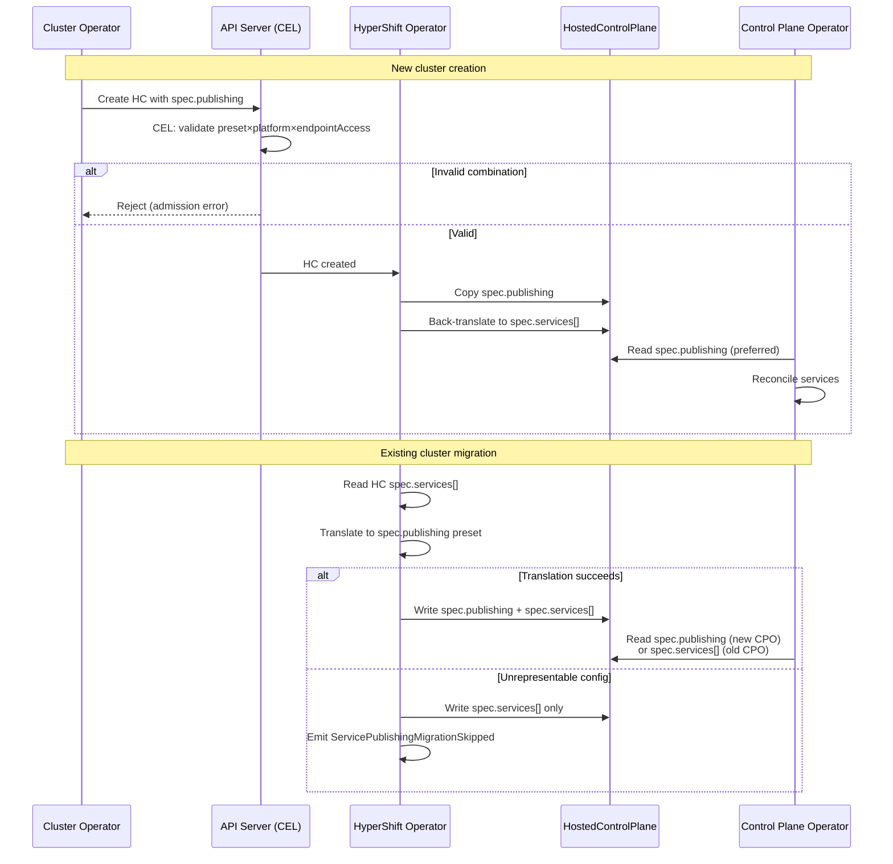

# Service Publishing API Evolution: Replacing
# `spec.services[]` with `spec.publishing`

## Summary

Replace the `spec.services[]` heterogeneous list on
`HostedCluster` with a new `spec.publishing` field that uses
a discriminated union of three topology presets:
`DedicatedIngress` (all services through a single ingress
point), `DedicatedAPIEndpoint` (API server on a dedicated
LoadBalancer, rest through management cluster ingress), and
`NodePort` (all services on node ports). The preset model
eliminates structural API problems (ordering ambiguity,
duplicate entries, MaxItems coupling, unvalidatable
constraints), makes router deployment an explicit
user-visible decision, and covers all documented
platform x configuration topologies. Initial migration
(Phase 1) leverages the HO-to-HCP copy boundary to
translate between APIs without mutating existing
HostedClusters. A later optional phase (Phase 2.5)
allows clusters to adopt `spec.publishing` directly via
an atomic swap that clears `spec.services[]` and sets
`spec.publishing` in a single update.

## Motivation

### Current problems with `spec.services[]`

#### Structural issues

1. **Heterogeneous list.** `spec.services[]` is a
   `[]ServicePublishingStrategyMapping` — a list of structs
   where each entry binds a `ServiceType` enum to a
   publishing strategy. This creates ordering ambiguity, no
   schema-level uniqueness (duplicate entries are possible),
   and `MaxItems` must be bumped every time a new service is
   added (currently 6, would need 7 for Router).

2. **Immutability.** The field is immutable after creation
   (enforced by CEL). If an operator didn't configure
   something at creation time, they can't change it without
   recreating the cluster.

3. **MaxItems coupling.** Both `HostedCluster` and
   `HostedControlPlane` CRDs have `MaxItems` on
   `services[]`. The HO copies services from HC to HCP
   directly, so both must be bumped in lockstep or
   reconciliation silently breaks.

4. **Validation gaps.** There is no `MinItems` on
   `spec.services[]` — count validation is absent entirely.
   A user could submit any number of entries (up to
   `MaxItems=6`) of any type, including duplicates, and pass
   validation. Rules to validate required service types were
   designed but never shipped — they are commented out
   (prefixed with `-kubebuilder`) at line 673 of
   `hostedcluster_types.go` because they exceed the CEL
   cost budget.

5. **Dead/vestigial values.** `S3` and `None` publishing
   strategies, and `OIDC` and `OVNSbDb` service types, are
   defined in the API enum with CEL rules but no controller
   code handles them.

#### Flexibility without controller support

The current API allows arbitrary per-service strategy
combinations, but controllers only support three topologies.
Users who specify unsupported combinations get silent
misbehavior or confusing controller errors, not working
clusters. The API's "flexibility" is a validation gap, not
a feature.

#### Semantic issues with extending it

Enhancement PR
[openshift/enhancements#2024](https://github.com/openshift/enhancements/pull/2024)
proposed adding a `Router` ServiceType to `spec.services[]`
to allow configuring the HCP router's NodePort exposure.
This exposed further problems:

- **Router is infrastructure, not a service.** The private
  router is a single HAProxy deployment per HCP namespace
  that serves ALL Route-type services via SNI routing.
  Putting it alongside APIServer/OAuth/Konnectivity implies
  it's a peer, which it isn't.
- **Router deployment is conditional.** The router only
  deploys under specific conditions. A `Router` ServiceType
  can be configured when the router won't exist, with no
  clean admission-time validation.
- **Redundant information.** On most platforms,
  OAuth/Konnectivity/Ignition are required to use Route.
  Adding a `Router` entry doesn't tell the system anything
  new — the only new information is how to expose the
  router itself.

### User Stories

As a cluster administrator, I want to specify my service
publishing topology with a single preset instead of
configuring 4 individual services, so that I can't
accidentally create invalid combinations that the
controllers don't support.

As a platform engineer deploying on bare metal, I want to
expose the HCP router as a NodePort instead of the hardcoded
LoadBalancer, so that I can run HyperShift without a cloud
load balancer provider.

As an SRE managing a fleet of hosted clusters, I want the
API to reject unsupported service publishing configurations
at admission time, so that I don't discover
misconfigurations through controller errors or degraded
conditions after creation.

As a tooling developer (ROSA CLI, OCM, ACM), I want a
stable publishing API that doesn't require MaxItems bumps or
lockstep CRD updates when new services are added, so that my
integration code is not fragile.

As an Azure self-managed cluster operator, I want to give
the OAuth server its own dedicated LoadBalancer while keeping
other services behind the HCP router, so that OAuth traffic
can be isolated for compliance and performance requirements.

As an IBMCloud managed service operator (OCM), I want to
configure all-Route publishing without deploying an HCP
router, so that the platform's existing shared ingress
infrastructure handles service exposure.

As an SRE operating a fleet of hosted clusters at scale, I
want to monitor clusters that still use the deprecated
`spec.services[]` field via a
`ServicePublishingDeprecated` condition and track migration
failures via `ServicePublishingMigrationSkipped`, so that I
can plan and execute the migration to `spec.publishing`
across my fleet without disruption.

### Goals

1. Replace `spec.services[]` with a preset-based
   `spec.publishing` field that covers all documented,
   recommended topologies.
2. Make router deployment an explicit, preset-determined
   decision — not an implicit consequence of service
   strategy combinations.
3. Enable admission-time validation of all publishing
   configurations (no more commented-out CEL rules).
4. Support the Router NodePort exposure use case from
   enhancement PR #2024 without adding a new ServiceType.
5. Provide a safe, rollback-compatible migration path from
   `spec.services[]` to `spec.publishing` using the
   HO-to-HCP copy boundary.
6. Deprecate and eventually remove `spec.services[]`.

### Non-Goals

1. Changing how `endpointAccess` works or how private
   connectivity (PrivateLink, Private Service Connect,
   Swift) is configured — these are orthogonal platform
   concerns.
2. Supporting arbitrary per-service strategy combinations —
   the preset model intentionally restricts to documented
   topologies.
3. Changing the HCP router's internal architecture or SNI
   routing behavior.
4. Automatically migrating existing HostedClusters'
   `spec.services[]` in place — Phase 1 translation
   happens at the HO-to-HCP boundary without mutating
   the HC. Phase 2.5 provides a user-initiated atomic
   swap path for existing clusters that need to adopt
   `spec.publishing` to access new capabilities (e.g.,
   configurable router exposure per CNTRLPLANE-3527).

## Proposal

Replace the heterogeneous `spec.services[]` list with a
new `spec.publishing` field on `HostedClusterSpec` that
uses a discriminated union of three topology presets. Each
preset fully determines the service publishing topology,
including whether an HCP router is deployed. The three
presets cover all currently supported platform x
configuration combinations.

The HyperShift Operator (HO) handles migration by
translating `spec.services[]` from existing HostedClusters
into the equivalent `spec.publishing` on the
HostedControlPlane, maintaining backward compatibility with
older Control Plane Operators (CPO) by writing both fields.

### Workflow Description

**Actors:**

- **Cluster operator**: Human user creating or managing a
  HostedCluster.
- **HyperShift Operator (HO)**: Controller on the
  management cluster that reconciles HostedCluster to
  HostedControlPlane.
- **Control Plane Operator (CPO)**: Controller that
  reconciles HostedControlPlane resources within each
  HCP namespace.
- **API server**: Kubernetes API server with CEL validation
  rules on the HostedCluster CRD.

#### New cluster creation

1. Operator chooses a publishing topology:
   `DedicatedIngress`, `DedicatedAPIEndpoint`, or `NodePort`.
2. Operator sets `spec.publishing.type` to the chosen preset
   and fills in the preset-specific sub-struct (hostnames,
   ports, exposure type).
3. API server CEL validation rejects invalid
   preset x platform x endpointAccess combinations at
   admission time.
4. HO copies `spec.publishing` from HC to HCP, and
   back-translates it to `spec.services[]` on the HCP for
   CPO backward compatibility.
5. CPO reads `spec.publishing` from HCP (falling back to
   `spec.services[]` for older CPO versions).

#### Existing cluster migration

1. Existing HC retains its immutable `spec.services[]` — no
   mutation required.
2. HO reads `spec.services[]` from HC, translates it to the
   equivalent `spec.publishing` preset.
3. HO writes both `spec.publishing` and `spec.services[]` to
   the HCP.
4. New CPO reads `spec.publishing`; old CPO reads
   `spec.services[]`.
5. If translation fails (unrepresentable configuration), HO
   skips translation, copies `spec.services[]` only, and
   emits a `ServicePublishingMigrationSkipped` condition.



#### CLI interaction

```bash
# DedicatedIngress with LB exposure (e.g., AWS Private)
hcp create cluster aws \
  --endpoint-access=Private \
  --external-dns-domain=example.com \
  --publishing-type=DedicatedIngress \
  --publishing-exposure=LoadBalancer

# DedicatedAPIEndpoint (e.g., AWS Public, no ExternalDNS)
hcp create cluster aws \
  --endpoint-access=Public \
  --publishing-type=DedicatedAPIEndpoint

# NodePort (e.g., Agent default)
hcp create cluster agent \
  --publishing-type=NodePort \
  --api-server-address=10.0.0.5
```

The CLI should infer the publishing preset from existing
flags (`--endpoint-access`, `--external-dns-domain`,
`--service-publishing-strategy`) to maintain backward
compatibility. An explicit override flag
(e.g., `--publishing-type`) may be added for advanced use
cases. Exact flag names and inference logic are deferred to
implementation.

### API Extensions

This enhancement modifies the `HostedCluster` and
`HostedControlPlane` CRDs in the
`hypershift.openshift.io/v1beta1` API group. It adds a new
`spec.publishing` field and associated types. No admission
webhooks, conversion webhooks, aggregated API servers, or
finalizers are added or modified.

#### `spec.publishing` — discriminated union

A new field `spec.publishing` on `HostedClusterSpec`,
mutually exclusive with `spec.services[]` (CEL enforced).

```yaml
spec:
  publishing:
    # +unionDiscriminator
    # +kubebuilder:validation:Enum=DedicatedIngress;
    #   DedicatedAPIEndpoint;NodePort
    type: DedicatedIngress | DedicatedAPIEndpoint | NodePort

    # type=DedicatedIngress: all services through a
    # single ingress point
    dedicatedIngress:
      # +unionDiscriminator
      # +kubebuilder:validation:Enum=LoadBalancer;
      #   NodePort;External
      exposure: LoadBalancer | NodePort | External

      # exposure=LoadBalancer: HCP router deployed,
      # fronted by cloud LB
      loadBalancer:
        hostname: kas-lb.example.com

      # exposure=NodePort: HCP router deployed,
      # exposed as NodePort
      nodePort:
        address: 10.0.0.5
        port: 30080  # optional — auto-assigned if omitted

      # exposure=External: platform handles routing
      # (IBMCloud)

      # oauthEndpoint: controls how OAuth is exposed
      # (Azure self-managed only)
      oauthEndpoint: LoadBalancer

      services:  # required — per-service hostname config
        apiServer:  # required — KAS hostname
          hostname: api.custom.com
        oAuthServer:  # optional — derived if omitted
          hostname: oauth.custom.com
        konnectivity:
          hostname: konnectivity.custom.com
        ignition:  # optional — omit if no Ignition
          hostname: ignition.custom.com

    # type=DedicatedAPIEndpoint: KAS (and optionally
    # OAuth) on dedicated LBs
    dedicatedAPIEndpoint:
      apiServer:  # optional — hostname override for LB
        hostname: api.example.com
      oAuthServer:  # optional — presence → OAuth gets LB
        hostname: oauth.example.com

    # type=NodePort: all services directly on node ports
    nodePort:
      address: 10.0.0.5  # required — shared address
      services:  # optional — per-service port overrides
        apiServer:
          port: 30443
        oAuthServer:
          port: 30444
        konnectivity:
          port: 30445
        ignition:
          port: 30446
```

#### Go types (sketch)

```go
// ServicePublishing configures how control plane services
// are exposed. Exactly one of DedicatedIngress,
// DedicatedAPIEndpoint, or NodePort must be set, matching
// the Type discriminator.
// +union
type ServicePublishing struct {
    // +unionDiscriminator
    // +kubebuilder:validation:Enum=DedicatedIngress;DedicatedAPIEndpoint;NodePort
    Type ServicePublishingType `json:"type"`

    // +optional
    DedicatedIngress DedicatedIngressPublishing `json:"dedicatedIngress,omitzero"`

    // +optional
    DedicatedAPIEndpoint DedicatedAPIEndpointPublishing `json:"dedicatedAPIEndpoint,omitzero"`

    // +optional
    NodePort NodePortPublishing `json:"nodePort,omitzero"`
}

// DedicatedIngressPublishing configures all services
// through a single ingress point.
// +union
type DedicatedIngressPublishing struct {
    // +unionDiscriminator
    // +kubebuilder:validation:Enum=LoadBalancer;NodePort;External
    Exposure IngressExposureType `json:"exposure"`

    // +optional
    LoadBalancer IngressLoadBalancerConfig `json:"loadBalancer,omitzero"`

    // +optional
    NodePort IngressNodePortConfig `json:"nodePort,omitzero"`

    // OAuthEndpoint controls how OAuth is exposed.
    // LoadBalancer: OAuth gets its own dedicated LB.
    // Only supported on Azure self-managed.
    // +optional
    // +kubebuilder:validation:Enum=LoadBalancer;Default
    OAuthEndpoint OAuthEndpointType `json:"oauthEndpoint,omitempty"`

    // +required
    Services IngressServices `json:"services,omitzero"`
}

type IngressLoadBalancerConfig struct {
    Hostname string `json:"hostname"`
}

type IngressNodePortConfig struct {
    // +kubebuilder:validation:MinLength=1
    // +kubebuilder:validation:MaxLength=253
    // Same address validation as existing
    // NodePortPublishingStrategy.Address — hostname,
    // IPv4, or IPv6 (full regex in hostedcluster_types.go)
    // +required
    Address string `json:"address"`

    // +optional
    // +kubebuilder:validation:Minimum=30000
    // +kubebuilder:validation:Maximum=32767
    Port *int32 `json:"port,omitempty"`
}

type IngressServices struct {
    // +required
    APIServer ServiceHostnameConfig `json:"apiServer,omitzero"`
    // +optional
    OAuthServer ServiceHostnameConfig `json:"oAuthServer,omitzero"`
    // +optional
    Konnectivity ServiceHostnameConfig `json:"konnectivity,omitzero"`
    // +optional
    Ignition ServiceHostnameConfig `json:"ignition,omitzero"`
}

type ServiceHostnameConfig struct {
    // +kubebuilder:validation:MinLength=1
    // +required
    Hostname string `json:"hostname,omitempty"`
}

// DedicatedAPIEndpointPublishing configures KAS with a
// dedicated LB. No HCP router is deployed for public
// access.
type DedicatedAPIEndpointPublishing struct {
    // +optional
    APIServer DedicatedEndpointConfig `json:"apiServer,omitzero"`

    // When present, OAuth gets a dedicated LB.
    // Only Azure self-managed.
    // +optional
    OAuthServer *DedicatedEndpointConfig `json:"oAuthServer,omitempty"`
}

type DedicatedEndpointConfig struct {
    // +optional
    Hostname string `json:"hostname,omitempty"`
}

type NodePortPublishing struct {
    // +kubebuilder:validation:MinLength=1
    // +kubebuilder:validation:MaxLength=253
    // Same address validation as existing
    // NodePortPublishingStrategy.Address — hostname,
    // IPv4, or IPv6 (full regex in hostedcluster_types.go)
    // +required
    Address string `json:"address"`

    // +optional
    Services NodePortServices `json:"services,omitzero"`
}

// Port uniqueness: unset ports get unique negative
// sentinels (outside 30000-32767 range) so they never
// collide. exists_one checks each value appears once.
// +kubebuilder:validation:XValidation:rule="[[has(self.apiServer) && has(self.apiServer.port) ? self.apiServer.port : -1, has(self.oAuthServer) && has(self.oAuthServer.port) ? self.oAuthServer.port : -2, has(self.konnectivity) && has(self.konnectivity.port) ? self.konnectivity.port : -3, has(self.ignition) && has(self.ignition.port) ? self.ignition.port : -4]].all(arr, arr.all(p, arr.exists_one(x, x == p)))",message="explicit port values must be unique across services"
type NodePortServices struct {
    // +optional
    APIServer NodePortServiceConfig `json:"apiServer,omitzero"`
    // +optional
    OAuthServer NodePortServiceConfig `json:"oAuthServer,omitzero"`
    // +optional
    Konnectivity NodePortServiceConfig `json:"konnectivity,omitzero"`
    // +optional
    Ignition NodePortServiceConfig `json:"ignition,omitzero"`
}

type NodePortServiceConfig struct {
    // +optional
    // +kubebuilder:validation:Minimum=30000
    // +kubebuilder:validation:Maximum=32767
    Port *int32 `json:"port,omitempty"`
}
```

#### Design principles

1. **Intent-based naming.** Preset names describe what the
   operator wants, not implementation mechanisms.
2. **Presets encode topology, not individual service
   strategies.** Operators think in topologies, not
   per-service configurations.
3. **No contradictions by construction.** Each preset fully
   determines the publishing topology.
4. **Ingress exposure is explicit.** The `DedicatedIngress`
   preset has a nested `exposure` discriminator.
5. **No `Custom` / escape-hatch preset.** Three presets
   cover all documented topologies. Freeform per-service
   strategy would reproduce `spec.services[]` problems.
6. **Structured fields over lists.** Named fields for known
   services instead of enum-keyed lists.
7. **Consistent field naming.** LoadBalancer uses `hostname`;
   NodePort uses `address` and `port` — matching existing
   API types.
8. **Router deployment is preset-determined:**
   - `DedicatedIngress` (LoadBalancer) → HCP router
     deployed, fronted by cloud LB
   - `DedicatedIngress` (NodePort) → HCP router deployed,
     exposed as NodePort
   - `DedicatedIngress` (External) → no HCP router;
     platform handles routing (currently IBMCloud)
   - `DedicatedAPIEndpoint` → no user-facing HCP router;
     on private clusters, a private HCP router is deployed
     for internal Route serving via the platform's private
     connectivity (PrivateLink, PSC)
   - `NodePort` → no HCP router

   The private connectivity mechanisms themselves
   (PrivateLink, Private Service Connect, Swift) are
   platform infrastructure, not user-configurable, and
   orthogonal to the publishing preset.

#### Preset-to-topology mapping

| Preset | KAS | OAuth | Konnectivity | Ignition | Ingress infrastructure | Platforms |
|--------|-----|-------|-------------|----------|----------------------|-----------|
| `DedicatedIngress` (LB) | Route | Route | Route | Route | HCP Router + cloud LB | AWS+ExtDNS, AWS Private+ExtDNS, Azure (all), GCP+ExtDNS, KubeVirt+ExtDNS, PowerVS+ExtDNS |
| `DedicatedIngress` (LB) + `oauthEndpoint` | Route | **LB** | Route | Route | HCP Router + cloud LB; OAuth on dedicated LB | Azure self-managed + ExtDNS |
| `DedicatedIngress` (NodePort) | Route | Route | Route | Route | HCP Router as NodePort | Bare metal use case |
| `DedicatedIngress` (External) | Route | Route | Route | opt | Platform handles routing | IBMCloud |
| `DedicatedAPIEndpoint` | LB | Route | Route | Route | KAS on dedicated LB; rest through mgmt ingress; no HCP router | AWS (no ExtDNS, all endpoint access modes), GCP PublicAndPrivate (no ExtDNS), KubeVirt Ingress, Agent production, OpenStack, PowerVS, None (LB) |
| `DedicatedAPIEndpoint` + `oAuthServer` | LB | **LB** | Route | Route | KAS+OAuth on dedicated LBs | Azure self-managed (no ExtDNS) |
| `NodePort` | NP | NP | NP | NP | None | Agent default, KubeVirt NP, None |

### Topology Considerations

#### Hypershift / Hosted Control Planes

This enhancement is HyperShift-specific. It modifies the
`HostedCluster` and `HostedControlPlane` CRDs and the
HO/CPO controllers that reconcile them.

**Management cluster impact**: The HO gains translation
logic to convert `spec.services[]` to `spec.publishing` on
the HCP. This is a pure function with negligible CPU/memory
overhead.

**Guest cluster impact**: None. The publishing API controls
how services are exposed on the management cluster; guest
cluster components are unaffected.

#### Standalone Clusters

N/A — standalone clusters do not use `HostedCluster` or
the service publishing API. This enhancement is specific to
the HyperShift topology.

#### Single-node Deployments or MicroShift

N/A — these deployment models do not use HyperShift.
The HyperShift management cluster could be SNO, but this
enhancement does not change resource consumption on the
management cluster in any meaningful way.

#### OpenShift Kubernetes Engine

N/A — OKE does not use HyperShift hosted control planes.

### Implementation Details/Notes/Constraints

#### Feature gate

Per
[dev-guide/feature-zero-to-hero.md](../../dev-guide/feature-zero-to-hero.md),
a new feature gate `ServicePublishingAPI` must be created
in
[openshift/api features.go](https://github.com/openshift/api/blob/master/features/features.go)
with the `DevPreviewNoUpgrade` feature set. The
`spec.publishing` field on `HostedCluster` and
`HostedControlPlane` must be gated behind this feature gate
using `+openshift:enable:FeatureGate=ServicePublishingAPI`
markers.

<!-- TODO: The developer should create the feature gate in
openshift/api and add the FeatureGateAware markers to the
new API types. -->

#### Supported topologies today

Analysis of CLI defaults, CEL validation, controller code
(`UseHCPRouter`, `LabelHCPRoutes`, `IsPrivateHCP`), and
service publishing strategy documentation reveals three
supported topologies:

**Topology 1: Single Ingress (all services via Route)**
— maps to `DedicatedIngress`

All services use Route strategy through a single ingress
point. An HCP router is deployed in all configurations
except IBMCloud (which uses `exposure: External`).

| Platform | Variant | Ingress exposure |
|----------|---------|-----------------|
| AWS | Public + ExternalDNS | HCP Router + External LB |
| AWS | PublicAndPrivate + ExternalDNS | HCP Router + External LB + Internal LB (PrivateLink) |
| AWS | Private + ExternalDNS | HCP Router + Internal LB (PrivateLink) |
| Azure (ARO HCP) | PublicAndPrivate (always) | HCP Router + shared ingress + Swift |
| Azure (Self-Managed) | Public | HCP Router + External LB |
| Azure (Self-Managed) | PublicAndPrivate | HCP Router + External LB + Azure PLS |
| Azure (Self-Managed) | Private | HCP Router + Azure PLS |
| GCP (Managed) | PublicAndPrivate + ExternalDNS | HCP Router + External LB + Internal LB (PSC) |
| GCP (Managed) | Private + ExternalDNS | HCP Router + Internal LB (PSC) |
| KubeVirt | Ingress + ExternalDNS | HCP Router + External LB |
| PowerVS | With ExternalDNS | HCP Router + External LB |
| IBMCloud | All | External (no HCP router) |

**Topology 2: Dedicated API Endpoint
(KAS=LoadBalancer, rest=Route)**
— maps to `DedicatedAPIEndpoint`

| Platform | Variant |
|----------|---------|
| AWS | Public/PublicAndPrivate/Private (no ExternalDNS) |
| GCP (Managed) | PublicAndPrivate (no ExternalDNS) |
| KubeVirt | Ingress (no ExternalDNS) |
| Agent | Production recommended (with MetalLB) |
| None | With `--expose-through-load-balancer` |
| OpenStack | Default |
| PowerVS | No ExternalDNS |

**Topology 3: NodePort (all services direct)**
— maps to `NodePort`

| Platform | Variant |
|----------|---------|
| Agent | Default |
| KubeVirt | NodePort mode |
| None | With `--api-server-address` |

#### Azure self-managed OAuth LoadBalancer variant

Azure self-managed supports an optional
`--oauth-publishing-strategy=LoadBalancer` CLI flag that
gives OAuth its own dedicated LoadBalancer:

| ExternalDNS | KAS | OAuth | Preset |
|-------------|-----|-------|--------|
| No | LB | LB | `DedicatedAPIEndpoint` + `oAuthServer` |
| Yes | Route | LB | `DedicatedIngress` + `oauthEndpoint` |

#### Preset validation by platform and endpoint access

Not all presets are valid for all
platform x endpointAccess x ExternalDNS combinations.
Invalid combinations must be rejected by CEL at admission
time.

**Key constraints:**

- `DedicatedIngress` requires KAS to use Route, which
  requires a hostname. The CLI derives hostnames from the
  ExternalDNS domain when configured, or the user provides
  them explicitly. The API always requires hostname values
  when the service field is present — the CLI materializes
  them before submission.
- `DedicatedAPIEndpoint` requires a KAS LoadBalancer. On
  private clusters, the KAS LB must be reachable through
  the platform's private connectivity mechanism. AWS
  supports this (PrivateLink creates two VPC Endpoint
  Services). GCP and Azure only create a single private
  connectivity endpoint for the HCP router, so KAS must
  use Route on those platforms.
- `DedicatedIngress` (External) delegates routing to the
  platform. Currently only IBMCloud uses this exposure, but
  it is not restricted by CEL to IBMCloud — other platforms
  may adopt it in the future.

> **Open question:** Should `DedicatedIngress` (External)
> be restricted bidirectionally? Two independent decisions:
> (1) force IBMCloud to use External (currently enforced by
> the IBMCloud CEL rule), and (2) prevent non-IBMCloud
> platforms from using External. Currently only (1) is
> enforced. Adding (2) would require relaxation if another
> platform adopts External later.
- `NodePort` requires directly reachable management cluster
  nodes. Only supported on Agent, KubeVirt, and None.
- `oauthEndpoint: LoadBalancer` is Azure self-managed only.

**Platform validation matrix:**

**AWS:**

| EndpointAccess | ExternalDNS | Valid presets |
|----------------|-------------|--------------|
| Public | Yes | `DedicatedIngress` (LB) |
| Public | No | `DedicatedAPIEndpoint` |
| PublicAndPrivate | Yes | `DedicatedIngress` (LB) |
| PublicAndPrivate | No | `DedicatedAPIEndpoint` |
| Private | Yes | `DedicatedIngress` (LB) |
| Private | No | `DedicatedAPIEndpoint` |

**Azure (ARO HCP / Managed):**

| EndpointAccess | Valid presets |
|----------------|--------------|
| PublicAndPrivate (always) | `DedicatedIngress` (LB) |

**Azure (Self-Managed):**

| EndpointAccess | ExternalDNS | Valid presets |
|----------------|-------------|--------------|
| Public | Yes | `DedicatedIngress` (LB), +`oauthEndpoint` |
| Public | No | `DedicatedAPIEndpoint`, +`oAuthServer` |
| PublicAndPrivate | Yes | `DedicatedIngress` (LB), +`oauthEndpoint` |
| PublicAndPrivate | No | `DedicatedAPIEndpoint`, +`oAuthServer` |
| Private | Yes | `DedicatedIngress` (LB) |
| Private | No | `DedicatedIngress` (LB) |

**GCP (Managed):**

| EndpointAccess | ExternalDNS | Valid presets |
|----------------|-------------|--------------|
| PublicAndPrivate | Yes | `DedicatedIngress` (LB) |
| PublicAndPrivate | No | `DedicatedAPIEndpoint` |
| Private | Yes | `DedicatedIngress` (LB) |

**KubeVirt:**

| ExternalDNS | Valid presets |
|-------------|--------------|
| Yes | `DedicatedIngress` (LB) |
| No | `DedicatedAPIEndpoint` |
| N/A (NP mode) | `NodePort` |

**Agent:**

| Configuration | Valid presets |
|--------------|--------------|
| Default | `NodePort` |
| With MetalLB | `DedicatedAPIEndpoint` |

**None:**

| Configuration | Valid presets |
|--------------|--------------|
| `--api-server-address` | `NodePort` |
| `--expose-through-load-balancer` | `DedicatedAPIEndpoint` |

**OpenStack:**

| Configuration | Valid presets |
|--------------|--------------|
| Default | `DedicatedAPIEndpoint` |

**PowerVS:**

| ExternalDNS | Valid presets |
|-------------|--------------|
| Yes | `DedicatedIngress` (LB) |
| No | `DedicatedAPIEndpoint` |

**IBMCloud:**

| Configuration | Valid presets |
|--------------|--------------|
| All (managed only) | `DedicatedIngress` (External) |

#### CEL validation rules

These constraints are enforced by CEL rules on
`HostedClusterSpec`. Unlike the commented-out
`spec.services[]` rules which exceeded the CEL cost budget
due to list iteration, the `spec.publishing` rules only
check scalar fields and `has()` — each is O(1).

**Mutual exclusivity and immutability:**

```cel
// At least one publishing source required
rule: has(self.publishing)
      || (has(self.services) && size(self.services) > 0)
message: "spec.publishing or non-empty spec.services
  is required"

// Mutual exclusivity
rule: !has(self.publishing)
      || !has(self.services)
      || size(self.services) == 0
message: "spec.publishing and spec.services are
  mutually exclusive"

// Immutability (value)
rule: !has(self.publishing)
      || !has(oldSelf.publishing)
      || self.publishing == oldSelf.publishing
message: "spec.publishing is immutable"

// Once set, cannot be removed
rule: !has(oldSelf.publishing)
      || has(self.publishing)
message: "spec.publishing cannot be removed once set"
```

**Platform → valid presets** (each rule is
`NOT platform || preset in allowed`):

```cel
// AWS: DedicatedIngress or DedicatedAPIEndpoint
rule: !has(self.publishing)
      || self.platform.type != "AWS"
      || self.publishing.type in
         ["DedicatedIngress", "DedicatedAPIEndpoint"]

// Agent: NodePort or DedicatedAPIEndpoint
rule: !has(self.publishing)
      || self.platform.type != "Agent"
      || self.publishing.type in
         ["NodePort", "DedicatedAPIEndpoint"]

// OpenStack: DedicatedAPIEndpoint only
rule: !has(self.publishing)
      || self.platform.type != "OpenStack"
      || self.publishing.type == "DedicatedAPIEndpoint"

// IBMCloud: DedicatedIngress with External only
rule: !has(self.publishing)
      || self.platform.type != "IBMCloud"
      || (self.publishing.type == "DedicatedIngress"
          && has(self.publishing.dedicatedIngress)
          && self.publishing.dedicatedIngress.exposure
             == "External")
```

**Endpoint access → preset restrictions:**

```cel
// GCP Private: DedicatedIngress only
// (PSC has router endpoint only)
rule: !has(self.publishing)
      || self.platform.type != "GCP"
      || !has(self.platform.gcp)
      || self.platform.gcp.endpointAccess != "Private"
      || self.publishing.type == "DedicatedIngress"

// Azure Private: DedicatedIngress only
// (PLS has router endpoint only)
rule: !has(self.publishing)
      || self.platform.type != "Azure"
      || self.platform.?azure.topology.orValue("")
         != "Private"
      || self.publishing.type == "DedicatedIngress"
```

**Exposure type restrictions:**

```cel
// DedicatedIngress NodePort: only platforms with
// directly reachable nodes
rule: !has(self.publishing)
      || self.publishing.type != "DedicatedIngress"
      || !has(self.publishing.dedicatedIngress)
      || self.publishing.dedicatedIngress.exposure
         != "NodePort"
      || self.platform.type in
         ["Agent", "KubeVirt", "None"]
message: "DedicatedIngress with NodePort exposure is
  only supported on Agent, KubeVirt, and None"
```

The full set of CEL rules (including Azure ARO HCP vs
self-managed, oauthEndpoint restrictions, and union
discriminator enforcement) is documented in the detailed
analysis and will be implemented in the API PR.

**Union discriminator enforcement** (auto-generated by
`+union`/`+unionDiscriminator` kubebuilder markers, listed
for reference):

```cel
// Top-level: type must match sub-struct
rule: !has(self.publishing)
      || (self.publishing.type == "DedicatedIngress"
          ? has(self.publishing.dedicatedIngress)
          : !has(self.publishing.dedicatedIngress))
message: "dedicatedIngress must be set when type is
  DedicatedIngress, and forbidden otherwise"

// DedicatedAPIEndpoint arm is NOT required when
// selected — all fields are optional, defaults apply
// when absent. Only reject if set on a non-matching type.
rule: !has(self.publishing)
      || self.publishing.type == "DedicatedAPIEndpoint"
      || !has(self.publishing.dedicatedAPIEndpoint)
message: "dedicatedAPIEndpoint must not be set when type
  is not DedicatedAPIEndpoint"

rule: !has(self.publishing)
      || (self.publishing.type == "NodePort"
          ? has(self.publishing.nodePort)
          : !has(self.publishing.nodePort))
message: "nodePort must be set when type is NodePort,
  and forbidden otherwise"

// Nested: DedicatedIngress exposure must match sub-struct
rule: !has(self.publishing)
      || !has(self.publishing.dedicatedIngress)
      || (self.publishing.dedicatedIngress.exposure
              == "LoadBalancer"
          ? has(self.publishing.dedicatedIngress.loadBalancer)
          : !has(self.publishing.dedicatedIngress.loadBalancer))
message: "loadBalancer config must be set when exposure
  is LoadBalancer, and forbidden otherwise"

rule: !has(self.publishing)
      || !has(self.publishing.dedicatedIngress)
      || (self.publishing.dedicatedIngress.exposure
              == "NodePort"
          ? has(self.publishing.dedicatedIngress.nodePort)
          : !has(self.publishing.dedicatedIngress.nodePort))
message: "nodePort config must be set when exposure is
  NodePort, and forbidden otherwise"
```

**HostedControlPlane validation:** The mutual exclusivity
and immutability rules above apply only to `HostedCluster`.
`HostedControlPlane` allows both `spec.publishing` and
`spec.services[]` simultaneously because HO writes both
during the translation phase (HC `spec.services[]` →
HCP `spec.publishing` + `spec.services[]`). Platform and
endpoint-access preset rules apply to both resources since
HO's translation must produce valid presets.

#### IBMCloud special cases

IBMCloud is a managed-only platform (no CLI, created
exclusively by OCM) with additional special cases:
- Only 3 required services (no Ignition)
- Services are mutable — CEL immutability exception
- KAS uses port 2040 instead of 6443

These are covered by the `DedicatedIngress` preset with
`exposure: External`.

### Risks and Mitigations

| Risk | Mitigation |
|------|------------|
| External tooling (ROSA CLI, OCM, ACM, ARO-HCP) must update to produce `spec.publishing` | Phase 2 migration with per-team timelines; existing clusters work via HO translation |
| Unrepresentable `spec.services[]` configurations cannot migrate | HO skips translation, copies `spec.services[]` only, emits `ServicePublishingMigrationSkipped` condition |
| New CPO reading `spec.publishing` paired with old HO that doesn't write it | CPO falls back to `spec.services[]` when `spec.publishing` is absent |
| Old CPO that doesn't understand `spec.publishing` | HO always writes `spec.services[]` to HCP alongside `spec.publishing`; old CPO ignores unknown field |

No new security or access-control risks. The publishing API
controls how services are exposed on the management
cluster — it does not change authentication, authorization,
or network policy. The same RBAC that protects
`spec.services[]` today protects `spec.publishing`. The
preset model reduces security risk by preventing
unsupported configurations that could leave services
unexpectedly exposed or unreachable.

### Drawbacks

- **Three presets may not cover future topologies.** Adding
  a new topology requires an API change (new preset or new
  field on an existing preset). However, the current API's
  "flexibility" is illusory — controllers only support
  three topologies, and unsupported combinations fail
  silently.

- **Azure-specific leak.** The `oauthEndpoint` field on
  `DedicatedIngress` and the optional `oAuthServer` on
  `DedicatedAPIEndpoint` are Azure self-managed concerns
  leaking into the general API. This is contained (single
  optional enum field, CEL-restricted to Azure).

- **Dual code paths during migration.** Carrying both
  `spec.services[]` and `spec.publishing` controller paths
  adds complexity during the coexistence phase. The HO
  translation logic is additional code that must be
  maintained until `spec.services[]` is fully removed.
  However, the translation is a pure function with no
  state or side effects.

- **Multi-team coordination.** External tooling migration
  requires cross-team effort with no forcing function
  beyond deprecation warnings. Existing clusters work
  indefinitely via HO translation, which reduces urgency.

## Alternatives (Not Implemented)

**Add a `Router` ServiceType to `spec.services[]`**
(enhancement PR #2024): Rejected because the Router is
infrastructure, not a peer service. This approach would
worsen the existing structural issues (MaxItems bump,
validation gaps, ordering ambiguity) without addressing
them.

**Rename `DedicatedAPIEndpoint` to a general preset with
configurable services**: Rejected because router deployment
becomes dependent on which optional fields are set rather
than being explicit.

**Defaults + per-service overrides (no presets)**: Rejected
because when 2 of 4 services override the "default," the
default isn't a default. Also loses preset-determined
router deployment.

**Treat the Azure OAuth LB case as unsupported in the new
API**: Rejected because it blocks full deprecation of
`spec.services[]`.

## Open Questions

1. **Mutability.** Today `spec.services[]` is immutable
   (CEL enforced) except on IBMCloud. Should any
   `spec.publishing` fields be mutable? Candidates:
   ingress `exposure` (switching NodePort <-> LoadBalancer),
   per-service hostnames, NodePort ports.

   Current decision: `spec.publishing` is immutable after
   creation, matching existing `spec.services[]` behavior.
   This constraint can be loosened for specific fields in
   the future without breaking changes.

2. **DedicatedIngress NodePort exposure platform
   restrictions.** The `DedicatedIngress` preset with
   `exposure: NodePort` is listed for bare-metal use
   cases. No CEL rule currently restricts which platforms
   can use this exposure type. Is `exposure: NodePort`
   valid on all platforms that support `DedicatedIngress`,
   or only a subset (e.g., Agent, KubeVirt, None)?

## Test Plan

<!-- TODO: Tests must include the following labels per
dev-guide/feature-zero-to-hero.md:
- [OCPFeatureGate:ServicePublishingAPI] for the feature gate
- [Jira:"HyperShift"] for the component
- Appropriate test type labels: [Suite:...], [Serial],
  [Slow], or [Disruptive] as needed
See dev-guide/test-conventions.md for details. -->

**Unit tests:**

- Preset-to-topology mapping: verify each
  platform x configuration combination produces the
  correct service strategies.
- HO translation logic: `spec.services[]` →
  `spec.publishing` for all valid combinations, including
  edge cases:
  - IBMCloud (3 services, no Ignition, mutable)
  - Azure OAuth LB (both ExternalDNS variants)
  - Unrepresentable configurations (skip + condition)
- Back-translation: `spec.publishing` → `spec.services[]`
  for HCP backward compatibility.
- Round-trip: `spec.services[]` → `spec.publishing` →
  `spec.services[]` produces equivalent output.

**Envtest (CEL validation):**

- Mutual exclusivity: setting both `spec.publishing` and
  `spec.services[]` is rejected.
- Union discriminator enforcement: `type=DedicatedIngress`
  with `nodePort` sub-struct (wrong arm) is rejected.
- Exposure discriminator enforcement:
  `exposure=LoadBalancer` with `nodePort` sub-struct is
  rejected.
- Required field validation: `DedicatedIngress` without
  `services.apiServer.hostname` is rejected.
- Preset x platform x endpointAccess matrix: all invalid
  combinations are rejected per the validation matrix.
- `oauthEndpoint` restricted to Azure self-managed.
- NodePort range validation (30000-32767).
- NodePort address format validation (hostname/IPv4/IPv6).
- NodePort port uniqueness across services.
- HC-level migration transitions:
  - Atomic swap: clearing `spec.services[]` and setting
    `spec.publishing` in the same update is accepted.
  - Clearing `spec.services[]` without setting
    `spec.publishing` is rejected.
  - Changing `spec.services[]` values without migration
    is rejected.
  - Removing `spec.publishing` after migration is
    rejected.
  - Changing `spec.publishing` value after migration is
    rejected.
- `spec.publishing` immutability: absent-to-present
  (creation) accepted, value change rejected, removal
  rejected.

**E2E tests:**

- `DedicatedIngress` (LoadBalancer): AWS Private or
  AWS Public + ExternalDNS.
- `DedicatedIngress` (NodePort): Agent or bare metal.
- `DedicatedIngress` (External): IBMCloud (if CI
  available).
- `DedicatedAPIEndpoint`: AWS Public (no ExternalDNS).
- `DedicatedAPIEndpoint` + `oAuthServer`: Azure
  self-managed (no ExternalDNS).
- `NodePort`: Agent default.
- HO translation: create cluster with `spec.services[]`,
  upgrade HO, verify HCP gets `spec.publishing`.

**Upgrade tests:**

- `e2e-aws-upgrade-hypershift-operator`: verify existing
  clusters continue working after HO upgrade with
  translation path.
- Version skew: new HO + old CPO (verify CPO falls
  back to `spec.services[]`). HO/CPO downgrade is
  unsupported — no old HO + new CPO test required.

## Graduation Criteria

<!-- TODO: Per dev-guide/feature-zero-to-hero.md, promotion
requires: minimum 5 tests, 7 runs per week, 14 runs per
supported platform, 95% pass rate, and tests running on all
supported platforms (AWS, Azure, GCP, vSphere, Baremetal
with various network stacks). Since this is a
HyperShift-specific feature, confirm with TRT which
platform matrix applies. -->

### Dev Preview -> Tech Preview

The immediate use case driving this enhancement is
[CNTRLPLANE-3527](https://issues.redhat.com/browse/CNTRLPLANE-3527):
enabling configurable HCP router exposure (particularly
NodePort for bare-metal environments).
`DedicatedIngress` is the preset that addresses this.

- `DedicatedIngress` preset implemented with all three
  exposure modes (LoadBalancer, NodePort, External) and
  controller support (CPO reads `spec.publishing`).
- `DedicatedAPIEndpoint` and `NodePort` presets
  implemented with controller support.
- HO translation path functional (`spec.services[]` →
  `spec.publishing` on HCP).
- CEL validation: mutual exclusivity, union
  discriminators, required fields, platform restrictions
  for `DedicatedIngress`.
- CLI produces `spec.publishing` with `DedicatedIngress`
  for new clusters on at least AWS and Agent platforms.
- Unit test coverage for translation logic and preset
  mapping.
- Envtest coverage for CEL validation rules.
- E2E passing for `DedicatedIngress` (LB) on AWS and
  `DedicatedIngress` (NodePort) on Agent.
- Feature-gated behind `ServicePublishingAPI`.

### Tech Preview -> GA

- E2E passing for all preset x platform combinations
  listed in the test plan.
- CEL validation for full preset x platform x
  endpointAccess matrix (all invalid combinations
  rejected).
- CLI produces `spec.publishing` for all platforms.
- `ServicePublishingDeprecated` warning condition emitting
  on `spec.services[]` clusters.
- Upgrade tested: new HO + old CPO version skew verified.
- `e2e-aws-upgrade-hypershift-operator` passing with HO
  translation path.
- Azure OAuth LB sub-cases covered (both ExternalDNS
  variants).
- IBMCloud `DedicatedIngress` (External) validated.
- Documentation updated: service-publishing-strategies.md
  rewritten for `spec.publishing`.
- User facing documentation created in
  [openshift-docs](https://github.com/openshift/openshift-docs/).
- Feature gate removed.

### Removing a deprecated feature

Removal of `spec.services[]` follows four phases:

**Phase 1: Coexistence**

1. Add `spec.publishing` to both HC and HCP API types.
2. CEL enforces mutual exclusivity on the HC.
3. HCP allows both fields simultaneously (internal).
4. HO implements translation: HC `spec.services[]` →
   HCP `spec.publishing` + `spec.services[]`.
5. CPO reads `spec.publishing` when present, falls back to
   `spec.services[]`.
6. CLI produces `spec.publishing` for new clusters.
7. `ServicePublishingDeprecated` warning condition on HCs
   using `spec.services[]`.

**Phase 2: External tooling migration**

- ROSA CLI, OCM, ACM, ARO-HCP adopt `spec.publishing` for
  new cluster creation.
- Existing clusters work via HO translation — no urgency.

**Phase 2.5: HC-level migration**

Existing HCs can migrate from `spec.services[]` to
`spec.publishing` in a single atomic update that removes
`spec.services[]` and sets `spec.publishing`. This requires
relaxing the existing `spec.services[]` immutability rule
to permit clearing it when `spec.publishing` is being set
in the same update.

The existing `spec.services[]` immutability rule
(`hostedcluster_types.go:528`) is:

```cel
rule: self.platform.type != "IBMCloud"
      ? self.services == oldSelf.services
      : true
message: "Services is immutable"
```

This must be replaced with a rule that allows the
one-way transition:

```cel
// spec.services[] is immutable unless the update is
// a migration to spec.publishing (clearing services
// while setting publishing in the same update).
rule: self.platform.type == "IBMCloud"
      // both absent — no change
      || (!has(self.services) && !has(oldSelf.services))
      // both present and equal — no change
      || (has(self.services) && has(oldSelf.services)
          && self.services == oldSelf.services)
      // migration: old had services, new clears them
      // and sets publishing
      || (has(oldSelf.services)
          && size(oldSelf.services) > 0
          && !has(oldSelf.publishing)
          && has(self.publishing)
          && (!has(self.services)
              || size(self.services) == 0))
message: "spec.services is immutable; to migrate,
  set spec.publishing and clear spec.services in
  the same update"
```

This rule permits exactly one transition: a cluster
with `spec.services[]` can clear it and set
`spec.publishing` atomically. The reverse is blocked
by `spec.publishing` immutability (once set, cannot be
removed). Combined with mutual exclusivity, the valid
HC states are:

| State | Allowed transitions |
|-------|-------------------|
| `spec.services[]` only | Migrate to `spec.publishing` (clear services) |
| `spec.publishing` only | Value changes blocked (immutable) |
| Both | Rejected by mutual exclusivity |
| Neither | Rejected — at least one source required |

**Phase 3: HC-level deprecation**

- `spec.services[]` rejected via a non-transition CEL
  rule. CRD Validation Ratcheting (GA in Kubernetes
  1.30) ensures existing HCs that do not modify the
  field are not affected — the API server skips
  validation for unchanged fields.

  ```cel
  rule: !has(self.services)
        || size(self.services) == 0
  message: "spec.services is deprecated;
    use spec.publishing"
  ```

  This rule:
  - **Create with `spec.services[]`:** rejected.
  - **Update without changing `spec.services[]`:**
    ratcheted (passes).
  - **Update modifying `spec.services[]`:** rejected
    (field changed, ratcheting does not apply).

- HO translation path remains active.

**Phase 4: Removal**

- After confirming no clusters in managed fleets use
  `spec.services[]`:
  - Remove `spec.services[]` from HC and HCP API types.
  - Remove HO translation logic.
  - Remove CPO fallback path.

## Upgrade / Downgrade Strategy

### Upgrade

When a new HO version (with `spec.publishing` support) is
deployed:

1. Existing HCs retain their `spec.services[]` — no
   mutation.
2. HO begins translating `spec.services[]` →
   `spec.publishing` on the HCP.
3. HO writes both fields to HCP for backward
   compatibility.
4. If CPO is already new, it reads `spec.publishing`; if
   old, it reads `spec.services[]`.
5. No cluster disruption — both paths produce the same
   service configuration.

### Downgrade

Downgrade of the HyperShift Operator and Control Plane
Operator is not supported. The version skew strategy
below covers forward-only upgrades where the HO and CPO
may temporarily run at different versions.

## Version Skew Strategy

| HO version | CPO version | HC field | Behavior |
|------------|-------------|----------|----------|
| New | New | `spec.publishing` | HO copies to HCP; CPO reads `spec.publishing` |
| New | New | `spec.services[]` | HO translates to `spec.publishing` + copies `spec.services[]` on HCP; CPO reads `spec.publishing` |
| New | Old | `spec.publishing` | HO copies to HCP + back-translates `spec.services[]`; old CPO reads `spec.services[]` |
| New | Old | `spec.services[]` | HO translates and writes both; old CPO reads `spec.services[]` |

The CPO version is per-OCP-release (different HCPs can run
different CPO versions). The HO is deployed once on the
management cluster. During an upgrade, new HO may
temporarily coexist with old CPO versions — the HO
back-translation path handles this by writing both fields
to HCP.

## Operational Aspects of API Extensions

This enhancement modifies the `HostedCluster` and
`HostedControlPlane` CRDs. No admission webhooks,
conversion webhooks, aggregated API servers, or finalizers
are added. The API extensions are purely structural (new
fields with CEL validation).

### Failure Modes

- **HO translation produces incorrect preset.** The CPO
  would receive a `spec.publishing` that doesn't match the
  HC's intended topology. Mitigation: `spec.services[]` is
  always written alongside `spec.publishing` on the HCP. If
  a mismatch is detected, the CPO falls back to
  `spec.services[]`. The HO emits a
  `ServicePublishingTranslationError` condition on the HC.

- **CEL validation bug allows an invalid combination.** The
  controller would receive a configuration it can't
  reconcile. Mitigation: controllers already validate at
  reconcile time and set `ValidConfiguration=False` with a
  descriptive message. CEL validation is defense-in-depth.

- **HO translation skips a cluster it shouldn't.** An
  existing HC's `spec.services[]` maps to a valid preset
  but the translation logic has a bug. Mitigation: the
  `ServicePublishingMigrationSkipped` condition is visible
  to operators and SREs. The cluster continues working on
  `spec.services[]` via CPO fallback.

### SLIs

No new SLIs. The existing `ValidConfiguration` condition on
HostedCluster is the primary indicator. The new
`ServicePublishingDeprecated` and
`ServicePublishingMigrationSkipped` conditions are
informational, not alertable.

### Escalation

The HyperShift team owns all issues with the publishing
API, HO translation logic, and CPO preset handling.

## Support Procedures

### Detecting misconfiguration

```bash
# Check publishing validation
oc get hostedcluster <name> \
  -o jsonpath='{.status.conditions[?(@.type=="ValidConfiguration")]}'

# Check for migration skip (existing clusters)
oc get hostedcluster <name> \
  -o jsonpath='{.status.conditions[?(@.type=="ServicePublishingMigrationSkipped")]}'

# Check for deprecation warning
oc get hostedcluster <name> \
  -o jsonpath='{.status.conditions[?(@.type=="ServicePublishingDeprecated")]}'

# Compare HC and HCP publishing config
oc get hostedcluster <name> \
  -o jsonpath='{.spec.publishing}'
oc get hostedcontrolplane \
  -n <hcp-namespace> <name> \
  -o jsonpath='{.spec.publishing}'
```

### Disabling the feature

During Dev Preview / Tech Preview, the feature is behind
the `ServicePublishingAPI` feature gate. Disabling the gate:

- New clusters cannot use `spec.publishing` (CEL rejects
  it).
- Existing clusters using `spec.publishing` continue
  working (CPO still reads the field).
- HO stops translating `spec.services[]` to
  `spec.publishing` on HCPs.

After GA (gate removed), `spec.publishing` cannot be
disabled. Clusters using it would need to be recreated
with `spec.services[]` to revert (during the coexistence
phase only).

### Graceful degradation

If the HO translation logic fails for an existing cluster:

1. HO copies `spec.services[]` to HCP without
   `spec.publishing`.
2. CPO falls back to reading `spec.services[]`.
3. Cluster continues operating with existing behavior.
4. `ServicePublishingMigrationSkipped` or
   `ServicePublishingTranslationError` condition emitted
   on HC.

## Infrastructure Needed [optional]

N/A — existing e2e CI infrastructure covers all platforms
needed for testing. No new cloud accounts, clusters, or
test environments required.
