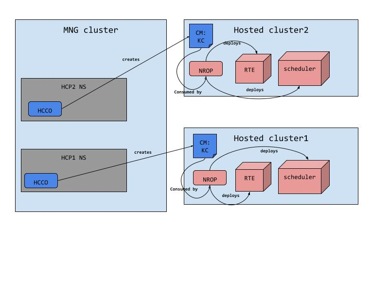

# NumaResources-Operator Deployment on a Hosted Clusters

## Summary

Topology-Aware Scheduling (TAS) enhances Kubernetes/OpenShift (K8S/OCP) scheduler 
by adding NUMA awareness, enabling more granular scheduling decisions 
with respect to NUMA resource locality.
The Numa-Resources-Operator (NROP) is responsible for deploying and enabling
TAS capabilities on the cluster.
This proposal aims to address the gaps identified
during the installation of NROP on the HyperShift (HCP) platform.

Official docs: https://docs.openshift.com/container-platform/4.16/scalability_and_performance/cnf-numa-aware-scheduling.html

## Motivation

See the HCP (HyperShift) project goals.
These goals should not come at the cost of giving up any existing OCP (OpenShift) features.
On standard OCP it is possible to deploy NROP (Numa-Resources-Operator) as a day-2 operator 
to optimize scheduling decisions based on the node's hardware layout.
It's a desire to have the same functionality on HyperShift as well.


### User Stories

* As a cluster service consumer, I want to be able to use TAS capabilities on HyperShift's hosted clusters in a similar fashion to standard OCP clusters.

* As an administrator, I want to be able to install NROP on HyperShift's hosted clusters in a similar fashion to standard OCP clusters.

### Goals

Allow a day-2 NROP deployment on a hosted cluster 
to support TAS (Topology-Aware-Scheduling) over HyperShift platform.

### Non-Goals

- N/A

## Proposal

NROP is a day-2, optional operator that users can install on demand.
To make the procedure as similar as possible to standard OCP clusters,
it is suggested to install the operator and its managed components on the hosted-cluster.
The following paragraphs detail the identified gaps and suggest resolution for each. 

### Architectural Overview

TAS solution comprises three main components:

Resource-Topology-Exporter (RTE) - Responsible for collecting node information (mostly NUMA resources allocations) 
and advertises it as a CR object named NRT (Node-Resource-Topology)

Secondary-Scheduler - A complementary scheduler to the default scheduler
which enhances the cluster and responsible for
scheduling the pod in the most suitable node according to the data exposed by the NRT object.

NROP - The operator itself which is responsible for the deployment of RTE and the Scheduler.
RTE and the scheduler are configurable via the NumaResourceOperator and NumaResourceScheduler CRs respectively.

### Expose KubeletConfig to Hosted-Clusters

NROP needs to learn the [topology-manager](https://kubernetes.io/docs/tasks/administer-cluster/topology-manager/) (TM) 
scope and policy of the nodes on which TAS is running and feed RTE with that information.
RTE advertises the TM configuration in the NRT object which is used by the scheduler  
to perform scheduling logic as close as possible as the topology manager.
For that, NROP needs access to the KubeletConfig object which holds the information about the TM scope and policy.

Since NROP is running on the hosted-cluster, it doesn’t have access to the KubeletConfig object.
On HyperShift, the Hosted-Cluster-Config-Operator (HCCO) is responsible for rendering the KubeletConfig objects
and applying their configuration on the node.
It’s suggested that when HCCO renders KubeletConfig, it adds a ConfigMap that encapsulates the KubeletConfig data
on the desired hosted clusters, so that NROP could access it and read the information it’s needed.
The ConfigMap contains a NodePool label so NROP knows which group of nodes is associated with the given KubeletConfig.

More details in the [implementation section](#implementation-detailsnotesconstraints)



### Handle Node Grouping
On HyperShift NROP maps the nodes of the hosted-cluster per NodePool.
This is the equivalent of MachineConfigPool (MCP) on OCP.
Each node has a label with a value of the NodePool it belongs to,
so NROP iterates over the list of nodes and builds a map of [NodePoolName] []*corev1.Nodes.
It is suggested to use NodeSelector instead of MachineConfigPoolSelector to have a unified API for both HCP and OCP.
A validation is necessary to prevent users from using both fields, i.e., MCP and node selectors.  

### Workflow Description

The deployment and usage of NROP per-se, as a day2 operator,
on HCP is similar to the deployment and usage on OCP. 
No major changes are necessary on that front.

### API Extensions

Extend the [NUMAResourceOperator](https://github.com/openshift-kni/numaresources-operator/blob/0beeb62c7c0182ba5a2963ccd658bd0f6af44ebd/api/numaresourcesoperator/v1/numaresourcesoperator_types.go#L164) CR to contain NodeSelector filed.
`spec.NodeGroup[].NodeSelector`
User can choose the group of node by the NodeSelector and to have a unified API for OCP and HCP.

For example:

  OpenShift:

  `spec.NodeGroup[].NodeSelector = "node-role.kubernetes.io/worker="`
  
  HyperShift:

  `spec.NodeGroup[].NodeSelector = "hypershift.openshift.io/nodePool=hostedcluster02"`

### Topology Considerations

#### Hypershift / Hosted Control Planes

This proposal aims for Hypershift / Hosted Control Planes alone. 

#### Standalone Clusters

* N/A

#### Single-node Deployments or MicroShift

* N/A

### Implementation Details/Notes/Constraints

#### Expose KubeletConfig to Hosted-Clusters

At first, when a user associates a KubeletConfig's ConfigMap to the NodePool,
the NodePool controller mirrors the ConfigMap to the control-plane namespace.
Similar to: https://github.com/openshift/hypershift/pull/4150
The KubeletConfig's ConfigMap NamespacedName convention, created by the NodePool controller is:
`<control-plane-namespace>/<name+node-pool>`
* `control-plane-namespace` = name of the control-plane namespace
* `name` = name of the ConfigMap as provided by the user in the hosted-cluster namespace.
* `node-pool` = name of the NodePool on which the ConfigMap was referenced.

To make sure the final name is valid,
it's given to the https://github.com/openshift/hypershift/blob/ffa435f71e1a037174e29d31a2b80d569c940d57/support/util/route.go#L39 
function so that 
```
finalName := ShortenName(name, NodePoolName)
```
In addition, the NodePool controller creates the KubeletConfig ConfigMap with the following labels:
* `hypershift.openshift.io/kubeletconfig-config` : `""`
* `hypershift.openshift.io/nodePool` : `NodePool` API name where the KubeletConfig has referenced

Then, HCCO picks it up from the control-plane namespace, 
by listing ConfigMaps with the labels above, and copies it to the hosted-cluster.

The KubeletConfig's ConfigMap NamespacedName convention, created by HCCO is:
`openshift-config-managed/<name>`
* `openshift-config-managed` = name of the namespace where all the configs managed by OCP reside.
* `name` = name of the ConfigMap as provided by the NodePool controller in the control-plane namespace.

Any changes to the KubeletConfig's ConfigMap on the hosted cluster will be blocked by the  
[hypershift validating admission policy](https://kubernetes.io/docs/reference/access-authn-authz/validating-admission-policy/)
IOW only HCCO can change the KubeletConfig's ConfigMap and no external tampering is allowed.

When the KubeletConfig ConfigMap is deleted by the user (removed from the NodePool spec), 
the NodePool controller deletes the ConfigMap from the control-plane namespace.
HCCO will watch for changes in ConfigMaps under the CP NS:
```
p := predicate.NewPredicateFuncs(func(o client.Object) bool {
		cm := o.(*corev1.ConfigMap)
		if _, ok := cm.Labels[nodepool.KubeletConfigConfigMapLabel]; ok {
			return true
		}
		return false
	})
	if err := c.Watch(source.Kind[client.Object](opts.CPCluster.GetCache(), &corev1.ConfigMap{}, eventHandler(), p)); err != nil {
		return fmt.Errorf("failed to watch ConfigMap: %w", err)
	}
```
so the deletion of the ConfigMaps triggers the reconciliation loop of HCCO.
HCCO compares the KubeletConfig ConfigMaps on the CP NS against the KubeletConfig ConfigMaps on the
hosted cluster, and deletes the ones exist on the hosted cluster but are no longer on the CP NS. 

It is possible to have multiple KubeletConfig's ConfigMap (one per each NodePool) under the same hosted cluster.
The names are always different because they are derived from the name provided by the user. 

The NodePool controller performs a validation to make sure no more than a single KubeletConfig's ConfigMap 
is referenced for the NodePool, throws an error otherwise, and reflects it under the `nodepool.status.condition`.

A user intervention is required to remove the additional KubeletConfig to make the operator functional again.

There is also a case that a generated KubeletConfig is already associated with the NodePool.
For example, NTO generates a KubeletConfig when it is given a PerformanceProfile.
The NodePool controller treats such generated KubeletConfig as equal as a user provided one.

### Risks and Mitigations

* N/A

### Drawbacks

* N/A

## Open Questions [optional]

* N/A

## Test Plan

All tests that are running for OCP expected to pass on 
HCP, but the ones that are dealing with MCP/KubeletConfig changes.
The later are expected to be skipped while CI running on HCP. 

## Graduation Criteria

* N/A

### Dev Preview -> Tech Preview

* N/A

### Tech Preview -> GA

* N/A

### Removing a deprecated feature

* N/A

## Upgrade / Downgrade Strategy

* N/A

## Version Skew Strategy

* N/A

## Operational Aspects of API Extensions

* N/A

## Support Procedures
* N/A
* 
## Alternatives (Not Implemented)

1. Running NROP on the MNG-cluster and the managed components are deployed on the hosted-cluster as in the original proposal
Upside: KubeletConfig can be accessed directly.
Downside:
An issue/security flaw on the day-2 operator compromises not only the hosted-cluster which the operator is associated with, but all the other hosted-clusters which are communicating with the same MNG-cluster.


## Infrastructure Needed [optional]

* N/A
