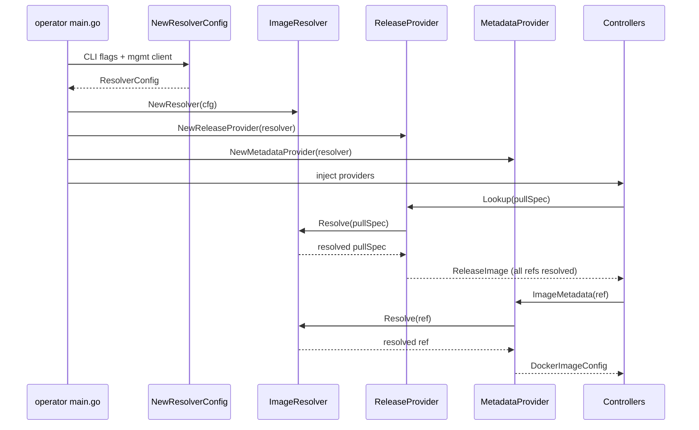

# Unified Image Resolution

## Summary

Refactor HyperShift's registry override and image resolution
code into a single `support/imageresolution/` package with a
unified `ImageResolver` interface. Today this logic is
scattered across four packages with twelve types, two
separate override mechanisms (`--registry-overrides` and
ICSP/IDMS) implemented through different code paths, and no
mechanical enforcement of abstraction boundaries. The result
is that surgical fixes to registry override handling keep
missing spots (see OCPBUGS-83564), and engineers describe
the code as "a huge mess" they are reluctant to touch.

This enhancement consolidates all image resolution behind a
single abstraction that all operators and controllers use,
adds a `go/analysis` linter to enforce the boundary, and
preserves the existing consumer API so controllers require no
changes.

## Motivation

As HyperShift expands to more non-OpenShift management
clusters (AKS for ARO-HCP, and potentially others), the
`--registry-overrides` flag — originally introduced for
environments without ICSP/IDMS support — becomes
increasingly important. The current code makes it
structurally easy to miss applying these overrides in new
controllers and code paths.

The problems are:

- **Inconsistent override application.**
  `--registry-overrides` is not honored in all controllers.
  OCPBUGS-83564 demonstrates this with nightly releases on
  non-OpenShift management clusters.
- **Duplicated logic.** CLI overrides are applied in
  `RegistryMirrorProviderDecorator`, ICSP/IDMS overrides
  are applied in both
  `ProviderWithOpenShiftImageRegistryOverridesDecorator`
  (for release pullspecs) and `SeekOverride()` in
  `RegistryClientImageMetadataProvider` (for image
  metadata). These are separate implementations of similar
  logic.
- **Confusing interface hierarchy.** The `Provider` ->
  `ProviderWithRegistryOverrides` ->
  `ProviderWithOpenShiftImageRegistryOverrides` tower
  in `releaseinfo` couples override concerns with lookup
  concerns and produces type names exceeding 50 characters.
- **No enforcement.** Nothing prevents new code from
  handling image references without applying overrides.
  Engineers and AI agents both miss spots due to the
  codebase size.

This also aligns with the broader CNTRLPLANE-2791 effort
to make the codebase more agent-readable. CPOV2 has
demonstrated that clean, well-structured abstractions
dramatically improve AI agent output quality.

### User Stories

- As a HyperShift developer, I want a single package that
  owns all image resolution logic so that when I need to
  understand or modify how images are resolved, I only
  need to look in one place.
- As a HyperShift developer implementing a new controller,
  I want the linter to tell me if I'm bypassing the image
  resolution abstraction so that I don't accidentally
  introduce a bug like OCPBUGS-83564.
- As an ARO-HCP operator deploying on AKS (a non-OpenShift
  management cluster), I want `--registry-overrides` to be
  honored consistently across all code paths so that I can
  use nightly release images without hitting resolution
  failures.
- As a platform team managing HyperShift at scale, I want
  the image resolution code to be well-tested and unified
  so that I can confidently upgrade without worrying about
  registry override regressions.

### Goals

1. Consolidate all registry override and image resolution
   logic into a single `support/imageresolution/` package.
2. Provide a unified `ImageResolver` interface that handles
   both `--registry-overrides` (CLI) and ICSP/IDMS
   (OpenShift management cluster) through one `Resolve()`
   method.
3. Preserve the existing consumer API
   (`imageprovider.ReleaseImageProvider`,
   `util.ImageMetadataProvider`) so that controllers require
   no changes.
4. Include a `go/analysis` linter that flags raw registry
   override parameters, direct registry client imports, and
   override-related string manipulation outside the
   `imageresolution/` package.
5. Resolve OCPBUGS-83564 structurally — make it impossible
   to obtain an unresolved image reference through the
   standard APIs.
6. Ensure all components are fully unit-testable through
   injected interfaces with no dependency on real container
   registries.

### Non-Goals

1. Changing the `--registry-overrides` CLI flag format or
   semantics. The flag works the same way; only the internal
   implementation changes.
2. Modifying the HostedControlPlane API or
   `ImageContentSources` spec field. ICSP/IDMS data
   continues to flow through the HCP spec as today.
3. Refactoring the HC controller or HCCO beyond what is
   necessary to wire up the new image resolution package.
   Broader HC controller and HCCO refactoring is tracked
   under CNTRLPLANE-3294.

## Proposal

Replace the current scattered image resolution
implementation with a single `support/imageresolution/`
package containing:

1. **`ImageResolver`** — A core interface with a single
   `Resolve(ctx, ref) (string, error)` method that applies
   both CLI overrides and ICSP/IDMS mirror policies to any
   image reference. A `Config()` method provides the
   serializable configuration for propagation to child
   operator deployments.

2. **`ReleaseProvider`** — Replaces the decorator chain
   (`ProviderWithOpenShiftImageRegistryOverridesDecorator`
   -> `RegistryMirrorProviderDecorator` ->
   `CachedProvider` -> `RegistryClientProvider`). Fetches
   release payloads from resolved locations and resolves
   every component image through the shared
   `ImageResolver`.

3. **`ComponentProvider`** — Replaces
   `SimpleReleaseImageProvider`. A pure lookup table over
   an already-resolved `ReleaseImage`. Implements the
   existing `imageprovider.ReleaseImageProvider` interface.

4. **`MetadataProvider`** — Replaces
   `RegistryClientImageMetadataProvider`. Resolves image
   references through the shared `ImageResolver` before
   fetching metadata. Implements the existing
   `util.ImageMetadataProvider` interface.

5. **Linter** — A `go/analysis` analyzer that flags bypass
   of the abstraction: raw override map parameters, direct
   registry client imports, and override-related string
   replacement outside the allowed package.

### Workflow Description

This enhancement changes internal implementation only. There
is no user-facing workflow change. The `--registry-overrides`
flag continues to work identically. ICSP/IDMS resources on
OpenShift management clusters continue to be honored.

**Developer workflow changes:**

1. When a developer adds a new controller that needs to
   resolve images, they use `ImageResolver.Resolve()` or
   obtain images from `ReleaseImageProvider.GetImage()`,
   which returns already-resolved references.
2. If a developer attempts to handle registry overrides
   directly (e.g., accepting a `registryOverrides` map
   parameter, importing registry client libraries, or
   doing string replacement on image references), the
   linter fails CI with a clear error message pointing
   them to the `imageresolution` package.

**Operator initialization:**



### API Extensions

This enhancement does not add or modify any CRDs, admission
webhooks, conversion webhooks, aggregated API servers, or
finalizers. It is a purely internal refactoring.

### Topology Considerations

#### Hypershift / Hosted Control Planes

This enhancement is entirely within the HyperShift codebase.
It affects all topologies equally since the image resolution
code is shared infrastructure used by all platforms.

Key considerations:

- The management cluster operators (hypershift-operator,
  ignition-server, karpenter-operator) and hosted control
  plane operators (control-plane-operator) all construct
  their own `ImageResolver` from their respective CLI flags.
- Override configuration is propagated from management
  cluster to hosted control plane via the CPO deployment
  args (`--registry-overrides`) and the HCP spec
  (`ImageContentSources`), same as today.
- Non-OpenShift management clusters (AKS) benefit most from
  this change, as consistent `--registry-overrides`
  application is the primary bug fix.

#### Standalone Clusters

Not directly applicable. HyperShift is a hosted control
plane solution and does not run on standalone clusters.
However, standalone OpenShift clusters used as management
clusters will continue to have their ICSP/IDMS resources
honored through the unified `ImageResolver`.

#### Single-node Deployments or MicroShift

Not applicable. This enhancement does not affect
single-node deployments or MicroShift. It is internal to
the HyperShift operator and control plane operator
binaries.

#### OpenShift Kubernetes Engine

Not applicable. This enhancement does not depend on
features excluded from OKE, nor does it change any
OKE-relevant behavior.

### Implementation Details/Notes/Constraints

#### Package Layout

```
support/imageresolution/
    resolver.go
    config.go
    release.go
    component.go
    metadata.go
    cache.go
    registry_client.go
    lint/
        analyzer.go
        analyzer_test.go
        cmd/
            main.go
```

#### Core Interface: ImageResolver

```go
type ImageResolver interface {
    Resolve(ctx context.Context, ref string) (string, error)
    Config() ResolverConfig
}

type ResolverConfig struct {
    RegistryOverrides   map[string]string
    ImageRegistryMirrors map[string][]string
}
```

`Resolve()` applies overrides in a defined order:

1. CLI `--registry-overrides` (prefix replacement, always
   succeeds, no network I/O)
2. ICSP/IDMS mirrors (try mirrors in order, verify
   availability with timeout)
3. If no overrides match, return the original reference

#### Testability

All registry I/O is behind injectable interfaces:

| Interface | Purpose | Test Fake |
|---|---|---|
| `MirrorAvailabilityChecker` | Mirror reachability | Canned `available` map |
| `ReleaseFetcher` | Release payload I/O | Canned release payloads |
| `ImageMetadataFetcher` | Image metadata I/O | Canned image configs |

The `ImageResolver` itself is also an interface, so
consumers in other packages can inject a test double that
returns canned resolved references without any override
logic running.

All caches accept TTL as a constructor parameter, enabling
zero-TTL caches in tests for uncached behavior and
pre-populated caches for cache-hit paths.

#### Type Migration

| Old Type | Old Package | New Type | Fate |
|---|---|---|---|
| `Provider` | `releaseinfo` | `ReleaseProvider` | Rebuilt |
| `ProviderWithRegistryOverrides` | `releaseinfo` | -- | Deleted |
| `ProviderWithOpenShiftImageRegistryOverrides` | `releaseinfo` | -- | Deleted |
| `RegistryClientProvider` | `releaseinfo` | unexported | Internalized |
| `CachedProvider` | `releaseinfo` | unexported | Generalized |
| `RegistryMirrorProviderDecorator` | `releaseinfo` | -- | Deleted |
| `ProviderWithOpenShiftImageRegistryOverridesDecorator` | `releaseinfo` | -- | Deleted |
| `ReleaseImageProvider` | `imageprovider` | **kept** | Consumer interface |
| `SimpleReleaseImageProvider` | `imageprovider` | `ComponentProvider` | Rebuilt |
| `ImageMetadataProvider` | `util` | **kept** | Consumer interface |
| `RegistryClientImageMetadataProvider` | `util` | `MetadataProvider` | Rebuilt |

Net reduction: 12 types across 4 packages to 6 types in 1
package plus 2 preserved consumer interfaces.

#### Linter Rules

The `go/analysis` analyzer flags three categories:

1. **Raw override map parameters** outside
   `imageresolution/` — function parameters or struct
   fields matching `registryOverrides map[string]string`
   or `imageRegistryMirrors map[string][]string`.
2. **Direct registry client imports** outside
   `imageresolution/` — imports of
   `go-containerregistry/pkg/v1/remote`,
   `containers/image`, etc.
3. **Override-related string replacement** outside
   `imageresolution/` — `strings.Replace` calls in
   contexts suggesting image/registry manipulation
   (heuristic, variable-name-based).

Test files and the `imageresolution/` package itself are
allowlisted.

#### Migration Strategy

The migration is structured as four independently shippable
and revertible PRs:

**PR 1: New package.** Create `support/imageresolution/`
with all types, interfaces, and implementations. Port
logic from the decorator chain and `SeekOverride()` into
`ImageResolver.Resolve()`. Full unit test coverage. No
callers yet.

**PR 2: Wire operator entrypoints.** Update all four
operator `main.go` files to construct the new resolver and
providers. Create adapter constructors so controllers see
no API change. Both old and new code may coexist briefly
for parity verification.

**PR 3: Migrate remaining consumers.** Move
`support/catalogs/images.go`, ICSP/IDMS config fetching,
and HC controller override propagation to use the new
package.

**PR 4: Delete old code + add linter.** Remove the
decorator chain, interface tower, `SeekOverride()`, and
related utilities. Add the `go/analysis` linter to
`make lint`.

### Risks and Mitigations

**Risk: Behavioral regression in override resolution.**
The override resolution logic is being reimplemented in a
new location. Subtle differences in ordering, matching, or
fallback behavior could cause regressions.

Mitigation: Comprehensive unit tests for `Resolve()`
covering all current matching strategies (root registry,
namespace, exact repository). The migration plan includes
a parity verification phase where both old and new paths
can run simultaneously.

**Risk: Large refactoring across core infrastructure.**
Image resolution is used by every controller. A mistake
could affect all hosted clusters.

Mitigation: The consumer API is preserved, so controllers
don't change. The blast radius is confined to
infrastructure code in `support/` and operator `main.go`
files. Each PR is independently revertible.

**Risk: Linter false positives.**
Rule 3 (string replacement heuristic) may flag legitimate
code that happens to use `strings.Replace` near variables
named `image` or `registry`.

Mitigation: Start with the more precise rules (1 and 2)
and tune rule 3 based on CI experience. The analyzer
supports an allowlist for exceptional cases.

### Drawbacks

- **Large diff across core infrastructure.** Even though
  the consumer API is stable, the internal wiring changes
  are substantial. This will require careful review and
  testing.
- **Temporary code duplication.** During the migration,
  both old and new implementations will exist. This is
  intentional for parity verification but adds short-term
  complexity.
- **Learning curve.** Engineers familiar with the current
  decorator chain will need to learn the new structure.
  However, the new structure is simpler (fewer types,
  clearer names), so this cost is low.

## Alternatives (Not Implemented)

### Override Engine Only

Extract only the override/resolution concern into a new
`support/imageoverride/` package, leaving the existing
`releaseinfo`, `imageprovider`, and `util` packages in
place with their current structures but injecting the
shared override engine.

This was rejected because it doesn't address the full
problem: types remain scattered across packages, the
confusing interface hierarchy stays, and the "where does
image resolution live?" question still has multiple
answers. The linter boundary is also harder to define with
multiple allowed packages.

### Pipeline Architecture

Model the entire image resolution flow as composable
middleware stages: `Ref -> Resolve -> Fetch -> Transform ->
Result`. Override resolution would be one stage.

This was rejected as over-engineered. The actual problem
has two override sources and three consumers. A pipeline
abstraction adds indirection without proportional benefit.

## Open Questions

1. Should the `support/catalogs/images.go` catalog image
   resolution also go through `ImageResolver`, or does it
   have unique requirements that warrant a separate path?
   Initial analysis suggests it can use `ImageResolver`
   directly.

2. What is the right granularity for linter rule 3
   (string replacement heuristic)? This may need tuning
   after the initial implementation based on false
   positive rates.

## Test Plan

<!-- TODO: Finalize test labels and CI integration once
the implementation is underway. -->

### Unit Tests

All components are unit-testable through injected
interfaces:

- **`ImageResolver.Resolve()`**: Tests covering CLI
  override matching, ICSP/IDMS mirror failover, combined
  CLI + ICSP/IDMS behavior, digest and tag preservation,
  and no-match passthrough.
- **`ReleaseProvider.Lookup()`**: Tests for release
  pullspec resolution, component image resolution, caching
  behavior, and error propagation.
- **`ComponentProvider`**: Tests for successful lookups,
  missing image tracking, version and component image map
  access.
- **`MetadataProvider`**: Tests for image reference
  resolution before fetch, caching, and error propagation.
- **Linter**: Tests using `analysistest.Run()` with
  testdata fixtures covering all three flag categories
  and allowlist behavior.

### Integration Tests

- Parity verification during migration: run both old and
  new code paths and compare results.

### E2E Tests

- Verify `--registry-overrides` on a non-OpenShift
  management cluster (AKS) with nightly release images.
- Verify ICSP/IDMS on an OpenShift management cluster.

## Graduation Criteria

<!-- TODO: Define graduation milestones per
dev-guide/feature-zero-to-hero.md requirements once
targeted at a release. -->

This enhancement is an internal refactoring with no
user-facing feature change. It does not require feature
gates or graduation through Dev Preview / Tech Preview /
GA stages. The refactoring is complete when:

1. All image resolution goes through `imageresolution/`.
2. The old decorator chain and interface tower are deleted.
3. The linter is integrated into `make lint`.
4. OCPBUGS-83564 is verified resolved.

## Upgrade / Downgrade Strategy

This enhancement changes internal implementation only. There
are no changes to stored state, API objects, or
configuration formats. The `--registry-overrides` flag
format is unchanged.

- **Upgrade:** No action required. The new code resolves
  images identically to the old code.
- **Downgrade:** No action required. The old code can be
  reverted to without data migration.

## Version Skew Strategy

During an upgrade, the hypershift-operator and
control-plane-operator may briefly run different versions.
This is safe because:

- The override configuration is serialized to child
  operator deployments via CLI flags
  (`--registry-overrides`) and HCP spec
  (`ImageContentSources`), both of which are unchanged.
- Each operator constructs its own `ImageResolver` from
  its own flags. There is no shared runtime state between
  operators for image resolution.

## Operational Aspects of API Extensions

Not applicable. This enhancement does not add or modify
any API extensions.

## Support Procedures

Not applicable. This enhancement does not change any
user-facing behavior, APIs, or operational procedures.
Existing support procedures for `--registry-overrides` and
ICSP/IDMS continue to apply.

## Infrastructure Needed

None.
