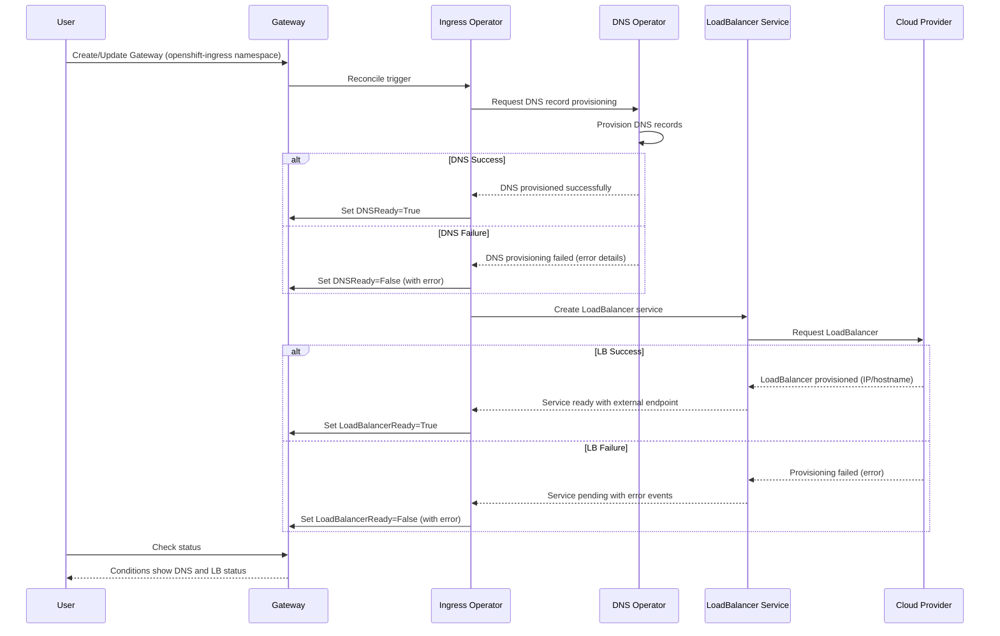

# Add DNS and LoadBalancer Conditions to Managed Gateway

## Summary

This enhancement adds DNS and LoadBalancer status conditions to GatewayAPI Gateway resources managed by OpenShift in the `openshift-ingress` namespace. These conditions provide visibility into DNS provisioning and cloud LoadBalancer service status, similar to the existing conditions on OpenShift IngressController resources. This feature is scoped to cloud platform deployments where native LoadBalancer services are available (AWS, Azure, GCP, etc.).

## Motivation

Cluster administrators and end users currently lack visibility into DNS and LoadBalancer provisioning failures for Gateway resources managed by OpenShift. Unlike IngressController resources which provide detailed condition status for DNS and LoadBalancer operations, Gateway resources do not expose this information. This gap makes it difficult to diagnose and troubleshoot issues when Gateways fail due to infrastructure provisioning problems.

By adding these conditions to managed Gateway resources, users gain the same observability they currently have with IngressController, enabling faster issue detection and resolution for DNS and cloud LoadBalancer failures.

### User Stories

* As a customer, I want to know when my Gateway has errors due to a DNS issue so that I can identify and resolve DNS-related problems quickly.

* As a customer, I want to know when my Gateway has errors due to a LoadBalancer issue so that I can diagnose cloud infrastructure provisioning failures.

* As a cluster administrator, I want to know when a Gateway has errors due to a DNS issue so that I can proactively address DNS configuration or quota problems.

* As a cluster administrator, I want to know when my Gateway has errors due to a LoadBalancer issue so that I can troubleshoot cloud provider integration issues or resource limits.

### Goals

* Add DNS condition to Gateway status that reflects the state of DNS record provisioning for the Gateway
* Add LoadBalancer condition to Gateway status that reflects the state of cloud LoadBalancer service provisioning
* Ensure conditions follow the same semantics and behavior as existing IngressController DNS and LoadBalancer conditions
* Scope the feature to Gateways in the `openshift-ingress` namespace only (platform-managed)
* Support cloud platforms with native LoadBalancer services (AWS, Azure, GCP, etc.)

### Non-Goals

* Supporting bare metal or on-premise deployments that do not have cloud LoadBalancer services
* Adding these conditions to user-managed Gateway resources outside the `openshift-ingress` namespace
* Modifying or changing existing IngressController condition behavior or semantics
* Introducing custom condition types beyond DNS and LoadBalancer at this time
* Automatic remediation of DNS or LoadBalancer failures (this enhancement provides visibility only)

## Proposal

This enhancement proposes extending the Gateway status with two new condition types: `DNSReady` and `LoadBalancerReady`. These conditions will be managed by the ingress operator and will reflect the current state of DNS record provisioning and cloud LoadBalancer service provisioning respectively.

The ingress operator will:
1. Monitor DNS record creation/updates for Gateway resources in `openshift-ingress` namespace
2. Monitor LoadBalancer service status for Gateway resources in cloud environments
3. Update the Gateway status conditions based on the provisioning state
4. Follow the same condition update patterns used for IngressController resources

This is a purely additive change that does not modify existing Gateway behavior or APIs. The conditions provide read-only status information to users and monitoring systems.

### Workflow Description

**Cluster Administrator** is a user who manages OpenShift cluster infrastructure and troubleshoots platform issues.

**Customer/Developer** is a user who deploys applications and monitors application ingress health.

**Ingress Operator** is the OpenShift operator responsible for managing ingress resources including Gateways and IngressControllers.

**DNS Operator** is responsible for managing DNS records for cluster ingress.

**Cloud Provider API** is the underlying cloud infrastructure that provisions LoadBalancer services.

#### Normal Flow (Success Case)

1. Customer creates or updates a Gateway resource in the `openshift-ingress` namespace
2. Ingress Operator detects the Gateway resource and begins reconciliation
3. Ingress Operator initiates DNS record provisioning through the DNS Operator
4. DNS Operator successfully creates DNS records and updates its status
5. Ingress Operator updates Gateway condition `DNSReady=True` with message "DNS records provisioned"
6. Ingress Operator creates LoadBalancer service for the Gateway
7. Cloud Provider API provisions the LoadBalancer successfully
8. LoadBalancer service status is updated with external IP/hostname
9. Ingress Operator updates Gateway condition `LoadBalancerReady=True` with message "LoadBalancer provisioned"
10. Customer checks Gateway status and sees both conditions are `True`, confirming the Gateway is fully operational

#### DNS Failure Flow

1. Customer creates a Gateway resource in the `openshift-ingress` namespace
2. Ingress Operator initiates DNS record provisioning through the DNS Operator
3. DNS Operator encounters an error (e.g., invalid zone, quota exceeded, provider API error)
4. DNS Operator reports failure status
5. Ingress Operator updates Gateway condition `DNSReady=False` with reason `DNSProvisioningFailed` and detailed error message
6. Cluster Administrator reviews Gateway status and identifies the DNS-specific error
7. Cluster Administrator resolves the DNS issue (e.g., increases quota, fixes zone configuration)
8. DNS Operator retries and successfully provisions DNS records
9. Ingress Operator updates Gateway condition `DNSReady=True`

#### LoadBalancer Failure Flow

1. Customer creates a Gateway resource in the `openshift-ingress` namespace
2. Ingress Operator creates LoadBalancer service for the Gateway
3. Cloud Provider API fails to provision LoadBalancer (e.g., quota exceeded, subnet full, invalid configuration)
4. LoadBalancer service remains in Pending state with event describing the error
5. Ingress Operator updates Gateway condition `LoadBalancerReady=False` with reason `LoadBalancerProvisioningFailed` and error details from service events
6. Cluster Administrator reviews Gateway status and identifies the cloud infrastructure issue
7. Cluster Administrator resolves the issue (e.g., increases quota, adjusts VPC configuration)
8. Cloud Provider API successfully provisions the LoadBalancer
9. Ingress Operator updates Gateway condition `LoadBalancerReady=True`

### API Extensions

This enhancement adds two new condition types to the status of Gateway resources in the `openshift-ingress` namespace:

**DNSReady Condition:**
- Type: `DNSReady`
- Status: `True`, `False`, or `Unknown`
- Reason: Examples include `DNSProvisioned`, `DNSProvisioningFailed`, `DNSNotConfigured`
- Message: Human-readable description of DNS provisioning status

**LoadBalancerReady Condition:**
- Type: `LoadBalancerReady`
- Status: `True`, `False`, or `Unknown`
- Reason: Examples include `LoadBalancerProvisioned`, `LoadBalancerProvisioningFailed`, `LoadBalancerPending`
- Message: Human-readable description including cloud provider error messages when applicable

These conditions are additions to the existing Gateway status and do not modify the behavior of the Gateway resource itself. The Gateway API specification allows for implementation-specific conditions, and these follow standard Kubernetes condition conventions.

The enhancement does not add finalizers, webhooks, or modify existing resources owned by other components. It only adds status conditions to Gateway resources that are already managed by the ingress operator.

### Topology Considerations

#### Hypershift / Hosted Control Planes

This enhancement applies to Hypershift environments with the following considerations:

* The ingress operator runs in the management cluster but manages Gateway resources for the hosted cluster
* DNS and LoadBalancer provisioning happens in the context of the hosted cluster's infrastructure
* Conditions will reflect the status of infrastructure provisioned for the hosted cluster
* No special handling is required; the same condition logic applies

#### Standalone Clusters

This enhancement is fully relevant for standalone OpenShift clusters deployed on cloud platforms (AWS, Azure, GCP, etc.). The conditions provide visibility into DNS and LoadBalancer provisioning for the cluster's ingress infrastructure.

#### Single-node Deployments or MicroShift

**Single-node OpenShift (SNO):**
* Applicable only when SNO is deployed on a cloud platform with LoadBalancer support
* On bare metal SNO deployments, LoadBalancer conditions would remain in `Unknown` or `False` state as LoadBalancer services are not available
* DNS conditions apply regardless of platform if DNS records are being managed

**MicroShift:**
* MicroShift typically does not use Gateway API or cloud LoadBalancer services
* This enhancement is not applicable to MicroShift deployments
* No impact on MicroShift resource consumption or configuration

**Resource Impact:**
* Minimal CPU/memory impact: only adds condition updates during reconciliation
* No additional controllers or processes required
* Negligible increase in etcd storage for condition status (~1KB per Gateway)

### Implementation Details/Notes/Constraints

**Condition Update Logic:**
* The ingress operator will watch for changes to DNS records and LoadBalancer services associated with each Gateway
* Conditions will be updated during the Gateway reconciliation loop
* The operator will parse DNS operator status and LoadBalancer service events to populate condition messages
* Rate limiting will be applied to prevent excessive condition updates

**DNS Condition Details:**
* The `DNSReady` condition reflects the status reported by the DNS operator for the Gateway's DNS records
* The condition will include specific DNS provider errors when provisioning fails
* DNS record creation is considered complete when the DNS operator reports success

**LoadBalancer Condition Details:**
* The `LoadBalancerReady` condition reflects the status of the Kubernetes LoadBalancer service
* The condition will be `True` when the service has an external IP or hostname assigned
* The condition will be `False` when service events indicate provisioning failures
* Error messages will include cloud provider error details extracted from service events

**Platform Detection:**
* The operator will detect the platform type to determine if LoadBalancer services are supported
* On unsupported platforms (bare metal, etc.), the LoadBalancerReady condition may be set to `Unknown` or omitted

**Condition Lifecycle:**
* Conditions are added when a Gateway is created in `openshift-ingress` namespace
* Conditions are updated throughout the Gateway lifecycle as DNS/LB status changes
* Conditions are removed when the Gateway is deleted

### Risks and Mitigations

**Risk: Condition update storms**
* Mitigation: Implement rate limiting and debouncing for condition updates to prevent excessive writes to etcd

**Risk: Inconsistent condition status during transient failures**
* Mitigation: Use appropriate backoff and retry logic to distinguish between transient and permanent failures

**Risk: Exposure of sensitive information in condition messages**
* Mitigation: Sanitize error messages to remove any credentials or sensitive data before including in conditions

**Risk: Compatibility with future Gateway API versions**
* Mitigation: Use well-defined condition types that align with Kubernetes conventions and Gateway API patterns

**Security Review:**
* No new authentication or authorization mechanisms introduced
* Conditions are read-only status information
* Standard RBAC applies to Gateway resources

**UX Review:**
* Condition messages should be clear and actionable for both administrators and developers
* Error messages should include enough detail to enable self-service troubleshooting

### Drawbacks

**Additional API surface:**
* Adding conditions increases the Gateway status size, though the impact is minimal (~1KB per Gateway)

**Maintenance burden:**
* Requires ongoing maintenance to keep condition logic in sync with DNS operator and cloud provider behavior
* May need updates when DNS operator or cloud provider integrations change

**Potential confusion:**
* Users may expect these conditions to appear on all Gateway resources, not just those in `openshift-ingress`
* Clear documentation will be needed to explain the scoping

**Not applicable to all environments:**
* The LoadBalancer condition is only meaningful on cloud platforms
* Users on bare metal may see persistent `False` or `Unknown` status which could be confusing

## Alternatives (Not Implemented)

**Alternative 1: Use Gateway API standard conditions only**
* The Gateway API specification defines standard conditions like `Accepted` and `Programmed`
* We could map DNS/LB status into these existing conditions rather than adding new ones
* Rejected because: Standard conditions don't provide the granularity needed to distinguish DNS vs. LoadBalancer issues

**Alternative 2: Add conditions to all Gateway resources cluster-wide**
* Could add these conditions to any Gateway resource, not just those in `openshift-ingress`
* Rejected because: User-managed Gateways may not follow the same DNS/LB provisioning patterns, and this would create inconsistent behavior

**Alternative 3: Create separate status CRD for infrastructure details**
* Could create a new CRD (e.g., `GatewayInfrastructureStatus`) to hold DNS/LB information
* Rejected because: Adds unnecessary complexity; conditions are the standard Kubernetes pattern for status reporting

**Alternative 4: Emit events instead of conditions**
* Could use Kubernetes events to report DNS/LB status instead of conditions
* Rejected because: Events are transient and harder to query programmatically; conditions provide persistent, queryable status

**Alternative 5: Extend IngressController to manage Gateways**
* Could treat Gateways as a variant of IngressController and add them to the IngressController status
* Rejected because: Gateway API and IngressController are separate APIs with different ownership models

## Open Questions [optional]

<!-- TODO: This section needs to be filled in -->

1. Should we support automatic retries for DNS/LoadBalancer provisioning failures, or just report status?
   - Current proposal: Only report status; reconciliation loop will naturally retry

2. What should the condition status be on platforms without LoadBalancer support (bare metal)?
   - Proposed: Set to `Unknown` with message indicating platform does not support LoadBalancers

3. Should these conditions be backported to older OpenShift versions?
   - To be determined based on customer demand

## Test Plan

**Unit Tests:**
* Test condition updates for various DNS provisioning states (success, failure, pending)
* Test condition updates for various LoadBalancer service states
* Test condition sanitization to ensure no sensitive data leaks
* Test condition lifecycle (creation, update, deletion)

**Integration Tests:**
* Test end-to-end Gateway creation with DNS and LoadBalancer provisioning on cloud platform
* Test DNS provisioning failure scenario and verify condition is set correctly
* Test LoadBalancer provisioning failure scenario and verify condition is set correctly
* Test that conditions are only added to Gateways in `openshift-ingress` namespace
* Test Gateway deletion and verify conditions are cleaned up

**E2E Tests:**
* Create Gateway in `openshift-ingress` namespace and verify both conditions become `True`
* Simulate DNS failure (e.g., invalid zone) and verify `DNSReady=False` with appropriate error message
* Simulate LoadBalancer failure (e.g., quota exceeded) and verify `LoadBalancerReady=False` with cloud error details
* Verify conditions are not added to Gateways in other namespaces

**Platform-Specific Testing:**
* Test on AWS, Azure, and GCP to ensure cloud-specific error messages are captured correctly
* Test on bare metal to verify graceful handling when LoadBalancer services are not available

**Managed OpenShift Testing:**
* Verify conditions work correctly in ROSA (AWS) and ARO (Azure) environments
* Test with managed cluster constraints (resource quotas, restricted permissions)

## Graduation Criteria

### Dev Preview -> Tech Preview

* Feature implemented and available behind a feature gate (if needed)
* Unit and integration tests passing
* E2E tests covering basic scenarios on at least one cloud platform
* Documentation drafted explaining the new conditions
* Feedback gathered from early adopters in dev preview

### Tech Preview -> GA

* E2E tests passing on all supported cloud platforms (AWS, Azure, GCP)
* Performance testing shows minimal impact on reconciliation loop performance
* Condition messages are clear and actionable based on user feedback
* User-facing documentation published in openshift-docs
* Metrics/telemetry added to track condition transitions (optional)
* Support procedures documented for troubleshooting DNS/LB issues via conditions

### Removing a deprecated feature

Not applicable - this is a new feature.

## Upgrade / Downgrade Strategy

**Upgrade Strategy:**
* This is a purely additive feature with no configuration changes required
* On upgrade to a version with this enhancement:
  - Existing Gateway resources in `openshift-ingress` namespace will have conditions added during next reconciliation
  - No user action required
  - No disruption to existing Gateways or traffic flow
* The feature is backwards compatible; older clients that don't understand these conditions will ignore them

**Downgrade Strategy:**
* On downgrade to a version without this enhancement:
  - The new conditions will remain in the Gateway status but will not be updated
  - The CVO does not delete status fields, so conditions will persist but become stale
  - No impact on Gateway functionality; conditions are read-only status
  - If desired, users can manually remove the conditions, but this is not required

**Version Skew:**
* Ingress operator and Gateway resources can be at different versions during upgrade
* Older ingress operator will not add/update the new conditions (graceful degradation)
* Newer ingress operator will add conditions to any Gateway in `openshift-ingress` regardless of when it was created

## Version Skew Strategy

This enhancement involves coordination between:
* Ingress operator (adds conditions to Gateway status)
* DNS operator (provides DNS provisioning status)
* Cloud controller manager (provisions LoadBalancer services)

**Version Skew Handling:**
* The ingress operator will check for DNS operator status fields before accessing them
* If DNS operator is older and doesn't provide expected status, `DNSReady` will be set to `Unknown`
* LoadBalancer service status is part of core Kubernetes and is stable across versions
* No kubelet changes are involved
* No CSI, CRI, or CNI changes are involved

**Compatibility:**
* Feature works with Gateway API v1beta1 and v1 (both support custom conditions)
* No breaking changes to Gateway API contract
* Follows standard Kubernetes condition conventions

## Operational Aspects of API Extensions

**API Extension Type:**
* This enhancement adds status conditions to existing Gateway resources (no new CRDs)
* No admission webhooks, conversion webhooks, aggregated API servers, or finalizers are introduced
* Status conditions are a standard Kubernetes pattern and do not require API approval for new types

**Impact on Existing SLIs:**
* Negligible impact on API throughput: condition updates happen during normal reconciliation
* No new API calls introduced; only status updates to existing Gateway resources
* Expected number of managed Gateways in `openshift-ingress` namespace: typically 1-10 per cluster
* Condition updates are rate-limited to prevent excessive writes

**Failure Modes:**
* If ingress operator is unavailable, conditions will not be updated, but Gateways continue to function
* If DNS operator is unavailable, `DNSReady` condition will reflect unknown/failure state, but routing continues with existing DNS
* If cloud provider API is unavailable, `LoadBalancerReady` condition will show pending/failure, but existing LB continues to work
* Conditions are status-only and do not affect Gateway data plane functionality

**Health Indicators:**
* Monitor ingress-operator pod health and logs for errors updating Gateway conditions
* Existing ingress-operator metrics and alerts apply

**Responsible Teams:**
* Networking team (ingress): primary owner for Gateway condition logic
* Networking team (DNS): consulted for DNS operator integration
* Cloud platform teams: consulted for cloud-specific LoadBalancer error handling

## Support Procedures

**Detecting Issues:**

*Symptom: Gateway conditions show `DNSReady=False`*
* Check Gateway status: `oc get gateway <name> -n openshift-ingress -o yaml`
* Review condition message for specific DNS error
* Check DNS operator logs: `oc logs -n openshift-dns-operator deployment/dns-operator`
* Check for DNS operator events: `oc get events -n openshift-ingress --field-selector involvedObject.name=<gateway-name>`
* Common causes: DNS zone misconfiguration, DNS provider quota exceeded, invalid DNS records

*Symptom: Gateway conditions show `LoadBalancerReady=False`*
* Check Gateway status: `oc get gateway <name> -n openshift-ingress -o yaml`
* Review condition message for cloud provider error
* Check LoadBalancer service status: `oc get svc -n openshift-ingress`
* Check service events: `oc describe svc <lb-service-name> -n openshift-ingress`
* Common causes: Cloud quota exceeded, subnet IP exhaustion, invalid security group configuration

*Symptom: Conditions are missing or stuck in `Unknown` state*
* Check ingress operator health: `oc get pods -n openshift-ingress-operator`
* Check ingress operator logs for errors: `oc logs -n openshift-ingress-operator deployment/ingress-operator`
* Verify Gateway is in `openshift-ingress` namespace (conditions only apply there)
* Check if platform supports LoadBalancer services (bare metal does not)

**Disabling the Feature:**
* This feature cannot be easily disabled as it's integrated into ingress operator reconciliation
* Conditions are harmless status fields and do not need to be disabled
* If needed, users can ignore these conditions; they do not affect Gateway functionality

**Graceful Failure:**
* Condition updates are best-effort; failures to update conditions do not block Gateway provisioning
* If condition updates fail, ingress operator logs errors but continues reconciliation
* Stale conditions do not prevent Gateways from functioning correctly

**Escalation:**
* For DNS-related issues: escalate to DNS/Networking team
* For LoadBalancer issues: escalate to Cloud Platform team for the specific cloud provider
* For condition update issues: escalate to Networking/Ingress team

## Infrastructure Needed [optional]

No new infrastructure required. This enhancement uses existing OpenShift components:
* Ingress operator (existing)
* DNS operator (existing)
* Cloud controller manager / LoadBalancer services (existing)
