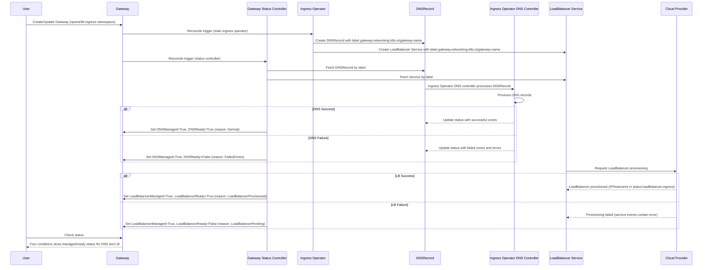

# Add DNS and LoadBalancer Conditions to Managed Gateway resource

## Summary

This enhancement adds four status conditions to GatewayAPI Gateway resources 
managed by OpenShift in the `openshift-ingress` namespace: `DNSManaged`, 
`DNSReady`, `LoadBalancerManaged`, and `LoadBalancerReady`. 
These conditions provide visibility into DNS provisioning and cloud LoadBalancer 
service status, similar to the existing conditions on OpenShift IngressController 
resources. The "Managed" conditions indicate whether OpenShift should manage the 
resource, while the "Ready" conditions indicate whether the resource is 
functioning correctly. This feature is scoped to cloud platform deployments 
where native LoadBalancer services are available (AWS, Azure, GCP, etc.).

## Motivation

Cluster administrators and end users currently lack visibility into DNS and 
LoadBalancer provisioning failures for Gateway resources managed by OpenShift. 
Unlike IngressController resources which provide detailed condition status for 
DNS and LoadBalancer operations, Gateway resources do not expose this 
information. This gap makes it difficult to diagnose and troubleshoot issues 
when Gateways fail due to infrastructure provisioning problems.

By adding these conditions to managed Gateway resources, users gain the same 
observability they currently have with IngressController, enabling faster issue 
detection and resolution for DNS and cloud LoadBalancer failures.

### User Stories

* As a customer, I want to know when my Gateway has errors due to a DNS issue 
so that I can identify and resolve DNS-related problems quickly.
* As a customer, I want to know when my Gateway has errors due to a LoadBalancer 
issue so that I can diagnose cloud infrastructure provisioning failures.
* As a cluster administrator, I want to know when a Gateway has errors due to a 
DNS issue so that I can proactively address DNS configuration or quota problems.
* As a cluster administrator, I want to know when my Gateway has errors due to 
a LoadBalancer issue so that I can troubleshoot cloud provider integration 
issues or resource limits.

### Goals

* Add `DNSManaged` and `DNSReady` conditions to Gateway status that reflect 
whether DNS is managed and the state of DNS record provisioning
* Add `LoadBalancerManaged` and `LoadBalancerReady` conditions to Gateway status
that reflect whether LoadBalancer is managed and the state of cloud LoadBalancer
service provisioning
* Implement a two-tier condition model: "Managed" conditions indicate whether 
OpenShift should manage the resource, "Ready" conditions indicate whether it is 
functioning
* Ensure conditions follow the same semantics and behavior as existing 
IngressController DNS and LoadBalancer conditions by reusing the same status 
computation logic
* Scope the feature to Gateways in the `openshift-ingress` namespace that are managed
by Openshift Gateway Class (`openshift.io/gateway-controller/v1`)
* Support cloud platforms with native LoadBalancer services (AWS, Azure, GCP, etc.)

### Non-Goals

* Supporting bare metal or on-premise deployments that do not have cloud 
LoadBalancer services
* Adding these conditions to user-managed Gateway resources outside the 
`openshift-ingress` namespace
* Modifying or changing existing IngressController condition behavior or semantics
* Introducing custom condition types beyond DNS and LoadBalancer at this time
* Automatic remediation of DNS or LoadBalancer failures (this enhancement 
provides visibility only)

## Proposal

This enhancement proposes extending the Gateway status with four new condition 
types: `DNSManaged`, `DNSReady`, `LoadBalancerManaged`, and `LoadBalancerReady`.
These conditions will be managed by a new gateway-status controller in the 
cluster-ingress-operator and will reflect the current state of DNS record 
provisioning and cloud LoadBalancer service provisioning respectively.

The conditions follow a two-tier model:
* **Managed conditions** (`DNSManaged`, `LoadBalancerManaged`): Indicate whether
OpenShift should be managing this aspect of the Gateway based on configuration
(DNS zones, publishing strategy, DNSManagementPolicy, etc.)
* **Ready conditions** (`DNSReady`, `LoadBalancerReady`): Indicate whether the
managed resource is actually functioning correctly

The implementation reuses the existing status computation logic from the
IngressController by:
1. Creating a shared `pkg/resources/status` package with condition computation
functions
2. Refactoring existing IngressController status code to use this shared package
3. Creating Gateway-specific wrapper functions that call the shared logic and
convert to Gateway API condition types

The gateway-status controller will:
1. Watch Gateway resources in `openshift-ingress` namespace that specify the
OpenShift Gateway Class
2. Discover associated DNSRecord and Service resources using the
`gateway.networking.k8s.io/gateway-name` label
3. Fetch cluster DNS and Infrastructure configuration
4. Compute conditions using the shared status logic (same as IngressController)
5. Patch Gateway status with the computed conditions including ObservedGeneration

This is a purely additive change that does not modify existing Gateway behavior 
or APIs. The conditions provide read-only status information to users and 
monitoring systems.

### Workflow Description

**Cluster Administrator** is a user who manages OpenShift cluster infrastructure
and troubleshoots platform issues.

**Customer/Developer** is a user who deploys applications and monitors
application ingress health.

**Ingress Operator** is the OpenShift operator responsible for managing ingress
resources including Gateways and IngressControllers.

**DNS Operator** is responsible for managing DNS records for cluster ingress.

**Cloud Provider API** is the underlying cloud infrastructure that provisions
LoadBalancer services.

#### Normal Flow (Success Case)

1. Customer creates or updates a Gateway resource in the `openshift-ingress` namespace
2. Gateway API controller creates LoadBalancer service for the Gateway
3. Cloud Provider API provisions the LoadBalancer successfully
4. LoadBalancer service status is updated with external IP/hostname
5. Cluster Ingress Operator detects the Gateway resource and begins reconciliation
6. Cluster Ingress Operator initiates DNS record provisioning through its own dns controller
7. Cluster Ingress Operator dns controller successfully creates DNS records and 
updates its status
8. Gateway Status Controller updates Gateway condition `LoadBalancerManaged=True`
with reason "Normal" (LoadBalancer should be managed)
9. Gateway Status Controller updates Gateway condition `LoadBalancerReady=True`
with reason "LoadBalancerProvisioned"
10. Gateway Status Controller updates Gateway condition `DNSManaged=True` with 
reason "Normal" (DNS should be managed)
11. Gateway Status Controller updates Gateway condition `DNSReady=True` with 
reason "Normal" (DNS records provisioned successfully)
12. Customer checks Gateway status and sees all four conditions are `True`, confirming the Gateway is fully operational

#### DNS Failure Flow

1. Customer creates a Gateway resource in the `openshift-ingress` namespace
2. Cluster Ingress Operator initiates DNS record provisioning through its own dns controller
3. Cluster Ingress Operator DNS controller encounters an error (e.g., invalid 
zone, quota exceeded, provider API error)
4. Cluster Ingress Operator DNS controller reports failure status in the 
DNSRecord resource
5. Gateway Status Controller updates Gateway condition `DNSManaged=True`
(DNS should be managed, configuration is correct)
6. Gateway Status Controller updates Gateway condition `DNSReady=False` with
reason `FailedZones` and detailed error message from DNS provider
7. Cluster Administrator reviews Gateway status and identifies the DNS-specific 
error from the `DNSReady` condition message
8. Cluster Administrator resolves the DNS issue (e.g., increases quota,
fixes zone configuration)
9. DNS Operator retries and successfully provisions DNS records
10. Gateway Status Controller updates Gateway condition `DNSReady=True` with
reason "Normal"

#### LoadBalancer Failure Flow

1. Customer creates a Gateway resource in the `openshift-ingress` namespace
2. Gateway API controller creates LoadBalancer service for the Gateway
3. Cloud Provider API fails to provision LoadBalancer (e.g., quota exceeded,
subnet full, invalid configuration)
4. LoadBalancer service remains in Pending state with event describing the error
5. Gateway Status Controller updates Gateway condition `LoadBalancerManaged=True`
(LoadBalancer should be managed, configuration is correct)
6. Gateway Status Controller updates Gateway condition `LoadBalancerReady=False`
with reason `LoadBalancerPending` and error details from service events
7. Cluster Administrator reviews Gateway status and identifies the cloud
infrastructure issue from the `LoadBalancerReady` condition message
8. Cluster Administrator resolves the issue (e.g., increases quota, adjusts VPC
configuration)
9. Cloud Provider API successfully provisions the LoadBalancer
10. LoadBalancer service status is updated with external IP/hostname
11. Gateway Status Controller updates Gateway condition `LoadBalancerReady=True`
with reason "LoadBalancerProvisioned"

### API Extensions

No API extension will be made, just conditions being added to the already existing 
Gateway resource.

### Topology Considerations

#### Hypershift / Hosted Control Planes

This enhancement applies to Hypershift environments with the following considerations:

* The ingress operator runs in the management cluster but manages Gateway resources for the hosted cluster
* DNS and LoadBalancer provisioning happens in the context of the hosted cluster's infrastructure
* Conditions will reflect the status of infrastructure provisioned for the hosted cluster
* No special handling is required; the same condition logic applies

#### Standalone Clusters

This enhancement is fully relevant for standalone OpenShift clusters deployed on
cloud platforms (AWS, Azure, GCP, etc.). The conditions provide visibility into
DNS and LoadBalancer provisioning for the cluster's ingress infrastructure.

#### Single-node Deployments or MicroShift

**Single-node OpenShift (SNO):**
* Applicable only when SNO is deployed on a cloud platform with LoadBalancer support
* On bare metal SNO deployments, LoadBalancer conditions would remain in `Unknown`
or `False` state as LoadBalancer services are not available
* DNS conditions apply regardless of platform if DNS records are being managed

**MicroShift:**
* MicroShift typically does not use Gateway API or cloud LoadBalancer services
* This enhancement is not applicable to MicroShift deployments
* No impact on MicroShift resource consumption or configuration

**Resource Impact:**
* Minimal CPU/memory impact: only adds condition updates during reconciliation
* No additional controllers or processes required
* Negligible increase in etcd storage for condition status (~1KB per Gateway)

### Implementation Details/Notes/Constraints

**Controller Architecture:**
* A new `gateway-status` controller is added to the cluster-ingress-operator
* Uses the controller-runtime framework with predicates to filter relevant Gateway resources

**Condition Update Logic:**
* The ingress operator watches Gateway resources in the `openshift-ingress`
namespace that have the OpenShift Gateway Class as their `.spec.gatewayClassName` controller
* Associated DNSRecord and Service resources are discovered using the
`gateway.networking.k8s.io/gateway-name` label
* Only the first matching DNSRecord and Service in the same namespace are used
for status computation
* Conditions updated during the Gateway reconciliation:
  - DNS conditions
  - LoadBalancer conditions
* These functions wrap the existing functions used for IngressController, ensuring consistency
* The operator patches Gateway status using the Kubernetes API with the computed conditions
* Conditions include `ObservedGeneration` to track which Gateway generation the status reflects

**DNS Condition Details:**

*DNSManaged Condition:*
* Set to `False` with reason `NoDNSZones` when cluster DNS configuration has no zones
* Set to `False` with reason `UnsupportedEndpointPublishingStrategy` when the
publishing strategy is not LoadBalancerService
* Set to `False` with reason `UnmanagedLoadBalancerDNS` when DNSManagementPolicy is `Unmanaged`
* Set to `True` with reason `Normal` when DNS records should be managed by OpenShift

*DNSReady Condition:*
* Set to `Unknown` when DNSManagementPolicy is `Unmanaged` (OpenShift doesn't manage DNS, so status is unknown)
* Set to `False` with reason `RecordNotFound` when the associated DNSRecord resource cannot be found
* Set to `False` with reason `NoZones` when the DNSRecord has no zones configured
* Set to `False` with reason `FailedZones` when one or more zones have failed to publish
* Set to `False` with reason `UnknownZones` when zone status cannot be determined
* Set to `True` with reason `Normal` when all zones have successfully published DNS records
* Error messages include specific DNS provider errors when provisioning fails

**LoadBalancer Condition Details:**

*LoadBalancerManaged Condition:*
* Set to `False` with reason `UnsupportedEndpointPublishingStrategy` when the
publishing strategy doesn't require a managed LoadBalancer
* Set to `True` with reason `Normal` when a LoadBalancer service should be managed by OpenShift

*LoadBalancerReady Condition:*
* Set to `False` with reason `ServiceNotFound` when the associated Service
resource cannot be found
* Set to `False` with reason `LoadBalancerPending` when the service exists but
has no LoadBalancer ingress (external IP/hostname)
* Set to `False` with reason `SyncLoadBalancerFailed` when cloud provider events
indicate provisioning failures
* Set to `True` with reason `LoadBalancerProvisioned` when the service has an
external IP or hostname assigned
* Error messages include cloud provider error details extracted from service events

**Code Reuse:**
* The implementation creates a shared package that contains status computation logic
* This logic is used by both the existing IngressController status controller
and the new Gateway status controller
* Condition computation functions accept generic inputs (DNSRecord, Service,
events, config) and return conditions
* Gateway-specific wrappers convert between internal condition types
and Gateway API `metav1.Condition` types

**Resource Discovery:**
* The controller watches the following resources to trigger reconciliation:
  - Gateway resources in `openshift-ingress` namespace
  - DNSRecord resources with `gateway.networking.k8s.io/gateway-name` label
  - Service resources with `gateway.networking.k8s.io/gateway-name` label
  - DNS cluster configuration changes
  - Infrastructure cluster configuration changes

**Platform Detection:**
* Platform type is determined from the cluster Infrastructure resource
* DNS zone configuration comes from the cluster DNS resource
* The DNSManagementPolicy field on IngressController-like configuration determines whether DNS is managed

**Condition Lifecycle:**
* Conditions are added when a Gateway is reconciled in the `openshift-ingress` namespace
* Conditions are updated in-place using `condutils.SetStatusCondition()` to preserve transition times
* Conditions are automatically garbage collected when the Gateway is deleted (part of Gateway status)
* Maximum of 8 total conditions are maintained per Gateway to prevent unbounded growth

**Permissions:**
* The cluster-ingress-operator service account is granted additional RBAC permissions to:
  - Get, List, Watch Gateway resources
  - Patch Gateway status subresource
  - Get, List, Watch DNSRecord and Service resources by label

### Risks and Mitigations

**Risk: Condition limit on Gateway resource**
Gateway resource establishes a limit of 8 conditions on its status. Istio, which is 
used as our Gateway API implementation, sets 2 conditions. Cluster Ingress Operator 
will set additional 4 conditions. In case Istio starts adding more conditions, this 
can be a problem.

* Mitigation: An e2e test should be added, to assert that the length of conditions 
is consistent with the current Istio and Cluster Ingress Operator conditions. In 
case of change, the test should fail and engineering should verify if Istio is adding
additional conditions.

**Risk: Exposure of sensitive information in condition messages**
* Mitigation: Sanitize error messages to remove any credentials or sensitive
data before including in conditions

**Risk: Compatibility with future Gateway API versions**
* Mitigation: Use well-defined condition types that align with Kubernetes
conventions and Gateway API patterns

**Security Review:**
* No new authentication or authorization mechanisms introduced
* Conditions are read-only status information
* Standard RBAC applies to Gateway resources
* Cluster Ingress Operator cluster role needs a new permission to `UPDATE` and `PATCH`
Gateway status subresource.

**UX Review:**
* Condition messages should be clear and actionable for both administrators and developers
* Error messages should include enough detail to enable self-service troubleshooting

### Drawbacks

**Additional API surface:**
* Adding conditions increases the Gateway status size, though the impact is
minimal (~1KB per Gateway)

**Maintenance burden:**
* Requires ongoing maintenance to keep condition logic in sync with DNS operator and cloud provider behavior
* May need updates when DNS operator or cloud provider integrations change

**Potential confusion:**
* Users may expect these conditions to appear on all Gateway resources, not just
those in `openshift-ingress`
* Clear documentation will be needed to explain the scoping

**Not applicable to all environments:**
* The LoadBalancer condition is only meaningful on cloud platforms or platforms with
`LoadBalancer` support.
* Users on bare metal may see persistent `False` or `Unknown` status which could
be confusing

## Alternatives (Not Implemented)

**Alternative 1: Use Gateway API standard conditions only**
* The Gateway API specification defines standard conditions like `Accepted` and `Programmed`
* We could map DNS/LB status into these existing conditions rather than adding new ones
* Rejected because: Standard conditions don't provide the granularity needed to
distinguish DNS vs. LoadBalancer issues

**Alternative 2: Add conditions to all Gateway resources cluster-wide**
* Could add these conditions to any Gateway resource, not just those in `openshift-ingress`
* Rejected because: User-managed Gateways may not follow the same DNS/LB
provisioning patterns, and this would create inconsistent behavior

**Alternative 3: Create separate status CRD for infrastructure details**
* Could create a new CRD (e.g., `GatewayInfrastructureStatus`) to hold DNS/LB information
* Rejected because: Adds unnecessary complexity; conditions are the standard
Kubernetes pattern for status reporting

**Alternative 4: Emit events instead of conditions**
* Could use Kubernetes events to report DNS/LB status instead of conditions
* Rejected because: Events are transient and harder to query programmatically;
conditions provide persistent, queryable status

## Open Questions [optional]

<!-- TODO: This section needs to be filled in -->

1. What should the condition status be on platforms without LoadBalancer support (bare metal)?
   - Proposed: Set to `Unknown` with message indicating platform does not support LoadBalancers

2. Should these conditions be backported to older OpenShift versions?
   - To be determined based on customer demand
  
## Test Plan

**Unit Tests:**
* Test `ComputeDNSStatus` with various DNSRecord states (no zones, failed zones, successful zones, unmanaged)
* Test `ComputeLoadBalancerStatus` with various Service states (not found, pending, provisioned, failed)
* Test `ComputeGatewayAPIDNSStatus` wrapper correctly converts internal conditions to Gateway API conditions
* Test `ComputeGatewayAPILoadBalancerStatus` wrapper correctly converts internal conditions to Gateway API conditions
* Test condition computation with DNSManagementPolicy set to Managed vs Unmanaged
* Test ObservedGeneration is correctly set on conditions

**E2E Tests:**
* Create Gateway in `openshift-ingress` namespace and verify all four conditions become `True`
 * On the same test, verify that changing Gateway generation will bump the conditions `observedGeneration`
 * On the same test, verify that the Gateway API controller (Istio) reconciliation 
does not replace Openshift conditions
 * On the same test, verify the condition count is consistent with Istio and Openshift
added conditions
* Create Gateway out of `openshift-ingress` and verify that no Openshift condition is added
* Create Gateway with wrong DNS Domain and verify that Openshift conditions reflect the failue

## Graduation Criteria

This proposal just adds new conditions to Gateway, and don't impact the Gateway
behavior. There is no API or behavior change, so no need to go through graduation criteria

## Upgrade / Downgrade Strategy

**Upgrade Strategy:**
* This is a purely additive feature with no configuration changes required
* On upgrade to a version with this enhancement:
  - Existing Gateway resources in `openshift-ingress` namespace will have 
  conditions added during next reconciliation
  - No user action required
  - No disruption to existing Gateways or traffic flow
* The feature is backwards compatible; older clients that don't understand 
these conditions will ignore them

**Downgrade Strategy:**
* On downgrade to a version without this enhancement:
  - The new conditions will remain in the Gateway status but will not be updated
  - The CVO does not delete status fields, so conditions will persist but become stale
  - No impact on Gateway functionality; conditions are read-only status
  - If desired, users can manually remove the conditions, but this is not required

**Version Skew:**
* Ingress operator and Gateway resources can be at different versions during upgrade
* Older ingress operator will not add/update the new conditions (graceful degradation)
* Newer ingress operator will add conditions to any Gateway in `openshift-ingress` regardless of when it was created

## Version Skew Strategy

This enhancement involves coordination between:
* Ingress operator (adds conditions to Gateway status)
* Gateway API controller (adds labels, creates services)

**Version Skew Handling:**
* No kubelet changes are involved
* No CSI, CRI, or CNI changes are involved

**Compatibility:**
* Feature works with Gateway API v1 (both support custom conditions)
* No breaking changes to Gateway API contract
* Follows standard Kubernetes condition conventions

## Operational Aspects of API Extensions

**API Extension Type:**
* This enhancement adds status conditions to existing Gateway resources (no new CRDs)
* No admission webhooks, conversion webhooks, aggregated API servers, or finalizers are introduced
* Status conditions are a standard Kubernetes pattern and do not require API approval for new types

**Impact on Existing SLIs:**
* Negligible impact on API throughput: condition updates happen during normal reconciliation
* No new API calls introduced; only status updates to existing Gateway resources
* Expected number of managed Gateways in `openshift-ingress` namespace: typically 1-10 per cluster
* Condition updates are rate-limited to prevent excessive writes

**Failure Modes:**
* If ingress operator is unavailable, conditions will not be updated, but Gateways continue to function
* Conditions are status-only and do not affect Gateway data plane functionality

**Health Indicators:**
* Monitor ingress-operator pod health and logs for errors updating Gateway conditions
* Existing ingress-operator metrics and alerts apply

**Responsible Teams:**
* Networking team (ingress): primary owner for Gateway condition logic

## Support Procedures

**Detecting Issues:**

*Symptom: Gateway conditions show `DNSManaged=False`*
* Check Gateway status: `oc get gateway <name> -n openshift-ingress -o yaml`
* Review condition reason and message:
  - Reason `NoDNSZones`: Cluster DNS configuration has no zones configured
  - Reason `UnsupportedEndpointPublishingStrategy`: Publishing strategy is not LoadBalancerService
  - Reason `UnmanagedLoadBalancerDNS`: DNSManagementPolicy is set to Unmanaged
* Check cluster DNS configuration: `oc get dns.config.openshift.io cluster -o yaml`
* Check Infrastructure configuration for platform type: `oc get infrastructure cluster -o yaml`

*Symptom: Gateway conditions show `DNSReady=False`*
* Check Gateway status: `oc get gateway <name> -n openshift-ingress -o yaml`
* Review condition reason and message:
  - Reason `RecordNotFound`: DNSRecord resource with label `gateway.networking.k8s.io/gateway-name=<gateway-name>` not found
  - Reason `NoZones`: DNSRecord has no zones configured
  - Reason `FailedZones`: One or more DNS zones failed to publish (message contains provider errors)
  - Reason `UnknownZones`: Zone status cannot be determined
* Check DNSRecord resource: `oc get dnsrecord -n openshift-ingress -l gateway.networking.k8s.io/gateway-name=<gateway-name> -o yaml`
* Check DNS operator logs: `oc logs -n openshift-dns-operator deployment/dns-operator`
* Common causes: DNS zone misconfiguration, DNS provider quota exceeded, invalid DNS records, provider API failures

*Symptom: Gateway conditions show `DNSReady=Unknown`*
* This is expected when `DNSManaged=False` with reason `UnmanagedLoadBalancerDNS`
* OpenShift is not managing DNS, so status is unknown
* Check if DNS is supposed to be managed by external system

*Symptom: Gateway conditions show `LoadBalancerManaged=False`*
* Check Gateway status: `oc get gateway <name> -n openshift-ingress -o yaml`
* Review condition reason and message:
  - Reason `UnsupportedEndpointPublishingStrategy`: Publishing strategy doesn't require managed LoadBalancer
* Verify publishing strategy configuration is correct for your environment

*Symptom: Gateway conditions show `LoadBalancerReady=False`*
* Check Gateway status: `oc get gateway <name> -n openshift-ingress -o yaml`
* Review condition reason and message:
  - Reason `ServiceNotFound`: Service resource with label `gateway.networking.k8s.io/gateway-name=<gateway-name>` not found
  - Reason `LoadBalancerPending`: Service exists but has no external IP/hostname (message may contain cloud provider errors)
  - Reason `SyncLoadBalancerFailed`: Cloud provider events indicate provisioning failures
* Check Service resource: `oc get svc -n openshift-ingress -l gateway.networking.k8s.io/gateway-name=<gateway-name> -o yaml`
* Check service events: `oc describe svc <lb-service-name> -n openshift-ingress`
* Common causes: Cloud quota exceeded, subnet IP exhaustion, invalid security group configuration, VPC limits

*Symptom: Conditions are missing entirely*
* Check ingress operator health: `oc get pods -n openshift-ingress-operator`
* Check ingress operator logs for errors: `oc logs -n openshift-ingress-operator deployment/ingress-operator | grep gateway-status`
* Verify Gateway is in `openshift-ingress` namespace (conditions only apply there)
* Verify Gateway has correct controller class: `oc get gateway <name> -n openshift-ingress -o jsonpath='{.spec.gatewayClassName}'`
* Check if gateway-status controller is running

**Disabling the Feature:**
* This feature cannot be easily disabled as it's integrated into ingress operator reconciliation
* Conditions are harmless status fields and do not need to be disabled
* If needed, users can ignore these conditions; they do not affect Gateway functionality

**Graceful Failure:**
* Condition updates are best-effort; failures to update conditions do not block Gateway provisioning
* If condition updates fail, ingress operator logs errors but continues reconciliation
* Stale conditions do not prevent Gateways from functioning correctly

**Escalation:**
* For DNS-related issues: escalate to DNS/Networking team
* For LoadBalancer issues: escalate to Cloud Platform team for the specific cloud provider
* For condition update issues: escalate to Networking/Ingress team

## Infrastructure Needed [optional]

No new infrastructure required. This enhancement uses existing OpenShift components:
* Ingress operator (existing)
* DNS operator (existing)
* Cloud controller manager / LoadBalancer services (existing)
