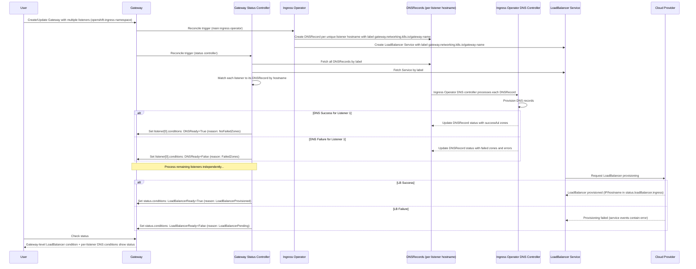

# Add DNS and LoadBalancer Conditions to Managed Gateway resource

## Summary

This enhancement adds DNS status conditions to Gateway listeners and LoadBalancer
status conditions to Gateway resources managed by OpenShift in the `openshift-ingress`
namespace. Specifically, it adds `DNSReady` conditions to each listener's status
(in `status.listeners[].conditions[]`) and `LoadBalancerReady` conditions to the
Gateway status (in `status.conditions[]`). These conditions provide visibility
into per-listener DNS provisioning and gateway-level cloud LoadBalancer service
status, similar to the existing conditions on OpenShift IngressController resources.

## Motivation

Cluster administrators and end users currently lack visibility into DNS and 
LoadBalancer provisioning failures for Gateway resources managed by OpenShift. 
Unlike IngressController resources which provide detailed condition status for 
DNS and LoadBalancer operations, Gateway resources do not expose this 
information. This gap makes it difficult to diagnose and troubleshoot issues 
when Gateways fail due to infrastructure provisioning problems.

By adding these conditions to managed Gateway resources, users gain the same 
observability they currently have with IngressController, enabling faster issue 
detection and resolution for DNS and cloud LoadBalancer failures.

### User Stories

* As a cluster administrator, I want to know which specific Gateway listeners have
DNS issues so that I can proactively address DNS configuration or quota problems
for specific hostnames.
* As a cluster administrator, I want to know when my Gateway has errors due to
a LoadBalancer issue so that I can troubleshoot cloud provider integration
issues or resource limits.

### Goals

* Add `DNSReady` condition to each Gateway listener status (in `status.listeners[].conditions[]`)
that reflects the state of DNS record provisioning for that specific listener
* Add `LoadBalancerReady` condition to Gateway status (in `status.conditions[]`)
that reflects the state of cloud LoadBalancer service provisioning
* Ensure conditions follow the same semantics and behavior as existing
IngressController DNS and LoadBalancer conditions by reusing the same status
computation logic
* Scope the feature to Gateways in the `openshift-ingress` namespace that are managed
by OpenShift gateway controller name (`openshift.io/gateway-controller/v1`)
* Support cloud platforms with native LoadBalancer services (AWS, Azure, GCP, etc.)

### Non-Goals

* Supporting environments where DNS is not managed by OpenShift
* Adding these conditions to user-managed Gateway resources outside the 
`openshift-ingress` namespace
* Modifying or changing existing IngressController condition behavior or semantics
* Introducing custom condition types beyond DNS and LoadBalancer at this time
* Automatic remediation of DNS or LoadBalancer failures (this enhancement 
provides visibility only)
* Reporting status of DNS records managed by `external-dns`. Only records managed
by `cluster-ingress-operator` are supported

## Proposal

This enhancement proposes extending the Gateway status with DNS conditions at the
listener level and LoadBalancer conditions at the gateway level. Specifically:

* **Listener-level conditions** (in `status.listeners[].conditions[]`):
  - `DNSReady`: Indicates whether the DNS record for this listener's hostname
    is functioning correctly

* **Gateway-level conditions** (in `status.conditions[]`):
  - `LoadBalancerReady`: Indicates whether the cloud LoadBalancer service for
    the entire Gateway is functioning correctly

These conditions will be managed by a new gateway-status controller in the
cluster-ingress-operator. The placement reflects the architecture where:
- Each listener with a unique hostname gets its own DNSRecord resource
- The entire Gateway shares a single LoadBalancer Service resource

The `DNSReady` and `LoadBalancerReady` conditions indicate whether the managed
resources (DNS records and LoadBalancer service) are functioning correctly.

The implementation reuses the existing status computation logic from the
IngressController by:
1. Creating a shared `pkg/resources/status` package with condition computation
functions
2. Refactoring existing IngressController status code to use this shared package
3. Creating Gateway-specific wrapper functions that call the shared logic and
convert to Gateway API condition types

The gateway-status controller will:
1. Watch Gateway resources in `openshift-ingress` namespace that specify any
GatewayClass that specifies OpenShift's gateway controller name.
2. Discover associated DNSRecord and Service resources using a matching gateway name in the
`gateway.networking.k8s.io/gateway-name` label
3. For each listener in the Gateway:
   - Find the corresponding DNSRecord by matching the listener's hostname with
     the DNSRecord's `.spec.dnsName` field
   - Compute DNS conditions using the shared status logic (same as IngressController)
   - Update the listener's status in `status.listeners[].conditions[]`
4. For the Gateway's LoadBalancer service:
   - Fetch the single Service resource for the Gateway
   - Compute LoadBalancer condition using the shared status logic
   - Update the Gateway's status in `status.conditions[]`
5. Fetch cluster DNS configuration, that will be used to define `DNSReady` condition
   based on what are the managed zones.
6. Patch Gateway status with the computed `LoadBalancerReady` and `DNSReady` status
conditions, including setting `ObservedGeneration` on these two conditions.

This is a purely additive change that does not modify existing Gateway behavior 
or APIs. The conditions provide read-only status information to users and 
monitoring systems.

### Workflow Description

**Cluster Administrator** is a user who manages OpenShift cluster infrastructure
and troubleshoots platform issues.

**Customer/Developer** is a user who deploys applications and monitors
application ingress health.

**Gateway API controller** is the controller that runs in the cluster and reconciles
Gateway API resources.

**Ingress Operator** is the OpenShift operator responsible for managing ingress
resources including Gateways and IngressControllers.

**Load Balancer controller** is the underlying load balancer controller that provisions
Load balancer services. The load balancer can be provisioned on a cloud provider, or
on any other service that implements a Kubernetes-compatible Load Balancer.

#### Normal Flow (Success Case)

1. Customer creates or updates a Gateway resource with a single or multiple listeners in the `openshift-ingress` namespace
2. Gateway API controller (Istio) creates LoadBalancer service for the Gateway
3. Load Balancer controller provisions the LoadBalancer successfully
4. Load Balancer controller  updates the LoadBalancer service status with the external IP address or host name
5. Cluster Ingress Operator detects the Gateway resource and begins reconciliation
6. Cluster Ingress Operator initiates DNS record provisioning through `gateway-service-dns` controller,
that creates one DNSRecord per unique listener hostname
7. Cluster Ingress Operator dns controller successfully creates all DNS records and
updates their status
8. Gateway Status Controller updates Gateway condition `LoadBalancerReady=True`
with reason "LoadBalancerProvisioned" in `status.conditions[]`
9. Gateway Status Controller updates each listener's conditions in `status.listeners[].conditions[]`:
   - Sets `DNSReady=True` with reason "NoFailedZones" (DNS record for this listener provisioned successfully)
10. Customer checks Gateway status and sees:
    - Gateway-level condition `LoadBalancerReady=True`
    - Each listener has `DNSReady=True`
    - Confirming the Gateway is fully operational

#### DNS Failure Flow

1. Customer creates a Gateway resource with multiple listeners in the `openshift-ingress` namespace
2. Cluster Ingress Operator initiates DNS record provisioning through its own dns controller,
creating one DNSRecord per unique listener hostname
3. Cluster Ingress Operator DNS controller encounters an error for one listener's DNSRecord
(e.g., invalid zone, quota exceeded, provider API error)
4. Cluster Ingress Operator DNS controller reports failure status in the affected
DNSRecord resource
5. Gateway Status Controller updates the affected listener's conditions in
`status.listeners[].conditions[]`:
   - Sets `DNSReady=False` with reason `FailedZones` and detailed error message from DNS provider
6. Other listeners with successful DNS records show `DNSReady=True`
7. Cluster Administrator reviews Gateway status and identifies which specific listener
has DNS issues by checking each listener's conditions
8. Cluster Administrator resolves the DNS issue (e.g., increases quota,
fixes zone configuration)
9. Cluster Ingress Operator DNS controller retries and successfully provisions the DNS record
10. Gateway Status Controller updates the affected listener's condition `DNSReady=True` with
reason "NoFailedZones"

#### LoadBalancer Failure Flow

1. Customer creates a Gateway resource in the `openshift-ingress` namespace
2. Gateway API controller creates LoadBalancer service for the Gateway
3. Load Balancer controller fails to provision LoadBalancer (e.g., quota exceeded,
subnet full, invalid configuration)
4. LoadBalancer service remains in Pending state with event describing the error
5. Gateway Status Controller updates Gateway condition `LoadBalancerReady=False`
with reason `LoadBalancerPending` and error details from service events
6. Cluster Administrator reviews Gateway status and identifies the cloud
infrastructure issue from the `LoadBalancerReady` condition message
7. Cluster Administrator resolves the issue (e.g., increases quota, adjusts VPC
configuration)
8. Load Balancer controller successfully provisions the LoadBalancer
9. Load Balancer controller  updates the LoadBalancer service status with the external IP address or host name
10. Gateway Status Controller updates Gateway condition `LoadBalancerReady=True`
with reason "LoadBalancerProvisioned"




### API Extensions

- Adds new conditions to `gateways.gateway.networking.k8s.io` resources that
represent the state of a Load Balancer and DNS Record provisioning

### Topology Considerations

#### Hypershift / Hosted Control Planes

This enhancement applies to Hypershift environments with the following considerations:

* The ingress operator runs in the management cluster but manages Gateway resources for the hosted cluster
* DNS and LoadBalancer provisioning happens in the context of the hosted cluster's infrastructure
* Conditions will reflect the status of infrastructure provisioned for the hosted cluster
* No special handling is required; the same condition logic applies

#### Standalone Clusters

This enhancement is fully relevant for standalone OpenShift clusters deployed on
cloud platforms (AWS, Azure, GCP, etc.). The conditions provide visibility into
DNS and LoadBalancer provisioning for the cluster's ingress infrastructure.

For on-premises environments, the same behavior existing on Ingress Controllers is replicated
to Gateway API status: the `LoadBalancerReady` will reflect the existence of a Load balancer
controller on the environment, while `DNSReady` will reflect the DNS record provisioning status;
namely, `DNSReady` will report `False` with a message indicating that OpenShift cannot manage
DNS records on non-cloud infrastructure platforms.

#### Single-node Deployments or MicroShift

**Single-node OpenShift (SNO):**
* Applicable only when SNO is deployed on a cloud platform with LoadBalancer support
or it has some Load Balancer controller, like MetalLB installed.

**MicroShift:**
* This enhancement is not applicable to MicroShift deployments
* No impact on MicroShift resource consumption or configuration

**Resource Impact:**
* Minimal CPU/memory impact: only adds condition updates during reconciliation
* A new `gateway-status` controller is created on existing Cluster Ingress Operator
* Negligible increase in etcd storage for condition status (~1KB per Gateway)

#### OpenShift Kubernetes Engine

No special considerations for OpenShift Kubernetes Engine.

### Implementation Details/Notes/Constraints

**Architecture Overview:**

This enhancement maps infrastructure resources to Gateway status as follows:

```
Gateway (1)
├── Spec
│   └── Listeners (N)
│       ├── Listener[0] (hostname: *.stage.example.com)
│       ├── Listener[1] (hostname: *.prod.example.com)
│       └── Listener[2] (hostname: *.stage.example.com)  # shares hostname with Listener[0]
│
└── Infrastructure Resources
    ├── Service (1) ────────────────────► status.conditions[]: LoadBalancerReady
    │   └── LoadBalancer (cloud)
    │
    └── DNSRecords (N unique hostnames)
        ├── DNSRecord[0] (*.stage.example.com) ──► status.listeners[0].conditions[]: DNSReady
        │                                        └► status.listeners[2].conditions[]: DNSReady
        └── DNSRecord[1] (*.prod.example.com)  ──► status.listeners[1].conditions[]: DNSReady
```

**Key Architectural Decisions:**
1. **One LoadBalancer Service per Gateway** → Gateway-level `LoadBalancerReady` condition
2. **One DNSRecord per unique hostname** → Listener-level `DNSReady` condition
3. **Multiple listeners can share a hostname** → They map to the same DNSRecord and get identical DNS conditions
4. **Listeners without hostnames** → No DNS conditions added

**Example Gateway Status:**

```yaml
apiVersion: gateway.networking.k8s.io/v1
kind: Gateway
metadata:
  name: example-gateway
  namespace: openshift-ingress
spec:
  listeners:
  - name: stage-http
    hostname: "*.stage.example.com"
    port: 80
    protocol: HTTP
  - name: stage-https
    hostname: "*.stage.example.com"
    port: 443
    protocol: HTTPS
  - name: prod-https
    hostname: "*.prod.example.com"
    port: 443
    protocol: HTTPS
status:
  # Gateway-level conditions (LoadBalancer status)
  conditions:
  - type: LoadBalancerReady
    status: "True"
    reason: LoadBalancerProvisioned
    message: "The LoadBalancer service is provisioned"
    observedGeneration: 1
    lastTransitionTime: "2025-01-12T10:00:00Z"

  # Listener-level conditions (DNS status per listener)
  listeners:
  - name: stage-http
    conditions:
    - type: DNSReady
      status: "True"
      reason: NoFailedZones
      message: "The record is provisioned in all reported zones."
      observedGeneration: 1
      lastTransitionTime: "2025-01-12T10:00:00Z"

  - name: stage-https
    conditions:
    - type: DNSReady
      status: "True"
      reason: NoFailedZones
      message: "The record is provisioned in all reported zones."
      observedGeneration: 1
      lastTransitionTime: "2025-01-12T10:00:00Z"

  - name: prod-https
    conditions:
    - type: DNSReady
      status: "False"
      reason: FailedZones
      message: "The record failed to provision in some zones: [prod.example.com]"
      observedGeneration: 1
      lastTransitionTime: "2025-01-12T10:00:00Z"
```

Note: In this example, `stage-http` and `stage-https` share the same hostname, so they
have identical DNS conditions (both map to the same DNSRecord). The `prod-https` listener
has a different hostname and shows a DNS failure, while the LoadBalancer is working for
the entire Gateway.

**Controller Architecture:**
* A new "Gateway Status" controller is added to the Cluster Ingress Operator
* Uses the controller-runtime framework with predicates to filter relevant Gateway resources
* Creates a dedicated cache for Gateway API resources, limited to the operand namespace with managed fields stripped to reduce memory overhead
* Uses direct API reader for events (instead of cache) to ensure access to the latest LoadBalancer failure events

**Condition Update Logic:**
* The ingress operator watches Gateway resources in the `openshift-ingress`
namespace that have the OpenShift Gateway Class as their `.spec.gatewayClassName` controller
* Associated DNSRecord and Service resources are discovered using the
`gateway.networking.k8s.io/gateway-name` label
* The Istio-created service matching an individual gateway-name is the only one discovered
for LoadBalancer status computation, as it is expected that Istio provisions just one LoadBalancer per Gateway
* For each listener in the Gateway:
  - The controller builds two mapping structures:
    * `hostnameToDNSRecord`: Maps DNS names (with trailing dots trimmed) to their DNSRecord objects
    * `listenerToHostname`: Maps listener names to their configured hostnames
  - For each listener with a hostname, the controller looks up the corresponding DNSRecord
  - DNS conditions are computed using the shared status logic
  - Only DNS zones that exist in the cluster DNS config (publicZone or privateZone) are considered
    when computing status to prevent false failures when zones are removed from config
  - Conditions are updated in `status.listeners[].conditions[]` for the matching listener
  - If no hostname is specified for a listener, DNS conditions are not added
  - If a listener's hostname is removed, the DNSReady condition is removed from that listener
* For the Gateway's LoadBalancer service:
  - LoadBalancer conditions are computed using the shared status logic
  - Conditions are updated in `status.conditions[]` at the Gateway level
* These functions wrap the existing functions used for IngressController, ensuring consistency
* The operator patches Gateway status using the Kubernetes API with the computed conditions
* Conditions include `ObservedGeneration` to track which Gateway generation the status reflects

**DNS Condition Details:**

DNS conditions are set per-listener in `status.listeners[].conditions[]`:

*DNSReady Condition (per listener):*
* Set to `False` with reason `NoDNSZones` when cluster DNS configuration has no zones (publicZone or privateZone)
* Set to `False` with reason `RecordNotFound` when the DNSRecord for this listener's hostname cannot be found
* Set to `Unknown` with reason `UnmanagedDNS` when the DNSRecord has DNSManagementPolicy set to `Unmanaged`
* Set to `False` with reason `NoZones` when the DNSRecord has no zones in its status
* Set to `False` with reason `FailedZones` when one or more zones have failed to publish (zones with Published=False)
  - If both failed and unknown zones exist, failed zones take precedence
* Set to `False` with reason `UnknownZones` when zone status cannot be determined (zones with Published=Unknown)
* Set to `True` with reason `NoFailedZones` when all zones have successfully published DNS records for this listener
* Only zones that exist in the cluster DNS config (publicZone or privateZone) are considered when determining status
* Error messages include specific DNS provider errors and list of affected zones when provisioning fails
* If a listener has no hostname specified, DNS conditions are not added to that listener
* If a listener's hostname is removed, the DNSReady condition is removed from that listener's status

**LoadBalancer Condition Details:**

LoadBalancer condition is set at the Gateway level in `status.conditions[]`:

*LoadBalancerReady Condition (gateway-level):*
* Set to `False` with reason `ServiceNotFound` when the associated Service
resource cannot be found or has an empty name
* Set to `False` with reason `LoadBalancerPending` when the service exists but
has no LoadBalancer ingress (external IP/hostname)
* Set to `False` with reason `SyncLoadBalancerFailed` when cloud provider events
indicate provisioning failures (events are filtered by component "service-controller"
and reason "SyncLoadBalancerFailed")
* Set to `True` with reason `LoadBalancerProvisioned` when the service has an
external IP or hostname assigned
* Error messages include cloud provider error details extracted from service events
* Events are read using direct API reader to ensure access to the latest events

**Code Reuse:**
* The implementation creates a shared package that contains status computation logic
* This logic is used by both the existing IngressController status controller
and the new Gateway status controller
* Condition computation functions accept generic inputs (DNSRecord, Service,
events, config) and return conditions
* Gateway-specific wrappers convert between internal condition types
and Gateway API `metav1.Condition` types:
  - `ComputeGatewayAPIDNSStatus`: Converts to listener-level conditions in `status.listeners[].conditions[]`
  - `ComputeGatewayAPILoadBalancerStatus`: Converts to gateway-level conditions in `status.conditions[]`

**Resource Discovery:**
* The controller watches the following resources to trigger reconciliation:
  - Gateway resources in `openshift-ingress` namespace that uses GatewayClasses with 
  `openshift.io/gateway-controller/v1` as their `.spec.controllerName` 
  - DNSRecord resources with `gateway.networking.k8s.io/gateway-name` label matching a gateway name
  - Service resources with `gateway.networking.k8s.io/gateway-name` label matching a gateway name
  - DNS cluster configuration changes
  - Infrastructure cluster configuration changes

**Platform Detection:**
* Platform type is determined from the cluster Infrastructure resource
* DNS zone configuration comes from the cluster DNS resource

**Condition Lifecycle:**
* Conditions are added when a Gateway is reconciled in the `openshift-ingress` namespace
* Listener-level DNS conditions are updated in-place in `status.listeners[].conditions[]`
using `condutils.SetStatusCondition()` and the transition time must reflect changes
* Gateway-level LoadBalancer conditions are updated in-place in `status.conditions[]`
using `condutils.SetStatusCondition()` and the transition time must reflect changes
* Conditions are automatically garbage collected when the Gateway is deleted (part of Gateway status)
* Maximum of 8 conditions per listener and 8 conditions at gateway level are maintained
to prevent unbounded growth

**Permissions:**
* The cluster-ingress-operator service account uses existing RBAC permissions to:
  - Get, List, Watch Gateway resources
  - Get, List, Watch DNSRecord and Service resources by label
* The cluster-ingress-operator service account needs new RBAC permissions to:
  - Update and Patch `gateways.gateway.networking.k8s.io` status subresource

### Risks and Mitigations

**Risk: Condition limit on Gateway and Listener resources**
Gateway API establishes a limit of 8 conditions on both the Gateway status and each
listener status. Istio, which is used as our Gateway API implementation, sets 2
gateway-level conditions and also sets listener-level conditions. Cluster Ingress
Operator will set 1 additional gateway-level condition (`LoadBalancerReady`) and
1 listener-level condition per listener (`DNSReady`). If Istio starts adding more
conditions, this can be a problem.

* Mitigation:
  - The implementation intentionally does NOT add `LoadBalancerManaged` or `DNSManaged`
    conditions to Gateway resources to conserve the limited condition slots.
  - An e2e test should be added to assert that the total number of conditions
    at both gateway and listener levels is consistent with the current Istio and Cluster
    Ingress Operator conditions. In case of change, the test should fail and engineering
    should verify if Istio is adding additional conditions.

**Security Review:**
* No new authentication or authorization mechanisms introduced
* Conditions are read-only status information
* Standard RBAC applies to Gateway resources
* Cluster Ingress Operator cluster role needs a new permission to `UPDATE` and `PATCH`
Gateway status subresource.

### Drawbacks

**Additional API surface:**
* Adding conditions increases the Gateway status size. With listener-level DNS
conditions, the size increase scales with the number of listeners (~1KB per
Gateway + ~1KB per listener with DNS conditions)

**Maintenance burden:**
* Requires ongoing maintenance to keep condition logic in sync with DNS operator and cloud provider behavior
* May need updates when DNS operator or cloud provider integrations change

**Potential confusion:**
* Users may expect these conditions to appear on all Gateway resources, not just
those in `openshift-ingress`
* Users need to understand the difference between gateway-level conditions (LoadBalancer)
and listener-level conditions (DNS)
* Clear documentation will be needed to explain the scoping and condition placement

**Not applicable to all environments:**
* The LoadBalancer condition is only meaningful on cloud platforms or platforms with
`LoadBalancer` support.
* Users on bare metal may see persistent `False` or `Unknown` status which could
be confusing

## Alternatives (Not Implemented)

**Alternative 1: Use Gateway API standard conditions only**
* The Gateway API specification defines standard conditions like `Accepted` and `Programmed`
* We could map DNS/LB status into these existing conditions rather than adding new ones
* Rejected because: Standard conditions don't provide the granularity needed to
distinguish DNS vs. LoadBalancer issues
* Additionally, Istio already sets the standard conditions and using the same conditions would conflict with Istio
in case both controllers are updating the same conditions.

**Alternative 2: Add conditions to all Gateway resources cluster-wide**
* Could add these conditions to any Gateway resource, not just those in `openshift-ingress`
* Rejected because: It is out of the original scope of this EP, but may be reassessed
as a followup of this enhancement.

**Alternative 3: Create separate status CRD for infrastructure details**
* Could create a new CRD (e.g., `GatewayInfrastructureStatus`) to hold DNS/LB information
* Rejected because: Adds unnecessary complexity; conditions are the standard
Kubernetes pattern for status reporting

**Alternative 4: Emit events instead of conditions**
* Could use Kubernetes events to report DNS/LB status instead of conditions
* Rejected because: Events are transient and harder to query programmatically;
conditions provide persistent, queryable status

**Alternative 5: Put DNS conditions at Gateway level instead of listener level**
* Could add DNS conditions to `status.conditions[]` (gateway-level) and aggregate
status across all DNSRecords
* Rejected because:
  - Each listener with a unique hostname gets its own DNSRecord resource
  - A single gateway-level DNS condition cannot accurately represent the state when
    some listeners have working DNS and others don't
  - Users need to know which specific listener has DNS issues for troubleshooting
  - Gateway API supports listener-level conditions specifically for this use case
  - The current implementation in cluster-ingress-operator creates per-hostname DNSRecords,
    making listener-level status the natural fit
  - Multiple listeners can share the same hostname (and thus the same DNSRecord), so
    listener-level conditions allow showing the same DNS status for all listeners
    sharing a hostname

## Open Questions [optional]

N/A
  
## Test Plan

**Unit Tests:**
* Test `ComputeDNSStatus` with various DNSRecord states (no zones, failed zones, successful zones)
* Test `ComputeLoadBalancerStatus` with various Service states (not found, pending, provisioned, failed)
* Test `ComputeGatewayAPIDNSStatus` wrapper correctly converts internal conditions to Gateway API listener conditions
* Test `ComputeGatewayAPILoadBalancerStatus` wrapper correctly converts internal conditions to Gateway API gateway-level conditions
* Test ObservedGeneration is correctly set on conditions
* Test if the transition times are correctly set on conditions
* Test matching DNSRecords to listeners by hostname
* Test handling of listeners without hostnames (no DNS conditions should be added)
* Test handling of multiple listeners with the same hostname (should map to same DNSRecord)

**E2E Tests:**
* Create Gateway in `openshift-ingress` namespace with listeners and verify:
  - Gateway-level condition `LoadBalancerReady=True` in `status.conditions[]`
  - Each listener has `DNSReady=True` in `status.listeners[].conditions[]`
* On the same test, verify that a change that implies the Gateway `metadata.generation` change will bump the conditions `observedGeneration`
* On the same test, verify that the Gateway API controller (Istio) reconciliation
does not replace OpenShift conditions
* On the same test, verify the condition count is consistent with Istio and OpenShift
added conditions (both at gateway and listener levels)
* Create Gateway out of `openshift-ingress` and verify that no OpenShift condition is added
* Create Gateway with unmanaged DNS Domain and verify that listener DNS conditions reflect the failure
in `status.listeners[].conditions[]`
* Create Gateway with multiple listeners with different hostnames. Verify:
  - Each listener gets its own `DNSReady` condition in `status.listeners[].conditions[]`
  - Each listener's conditions correspond to its specific DNSRecord status
* Create Gateway with multiple listeners sharing the same hostname. Verify:
  - All listeners with the same hostname show the same DNS condition status
  - Only one DNSRecord is created for the shared hostname
* Create Gateway with a listener without a hostname. Verify:
  - That listener does not have DNS conditions added
  - Other listeners with hostnames do have DNS conditions

## Graduation Criteria

This proposal just adds new conditions to Gateway, and don't impact the Gateway
behavior. There is no API or behavior change, so no need to go through graduation criteria

### Dev Preview -> Tech Preview

N/A

### Tech Preview -> GA

N/A

### Removing a deprecated feature

N/A

## Upgrade / Downgrade Strategy

**Upgrade Strategy:**
* This is a purely additive feature with no configuration changes required
* On upgrade to a version with this enhancement:
  - Existing Gateway resources in `openshift-ingress` namespace will have 
  conditions added during next reconciliation
  - No user action required
  - No disruption to existing Gateways or traffic flow
* The feature is backwards compatible; older clients that don't understand 
these conditions will ignore them

**Downgrade Strategy:**
* On downgrade to a version without this enhancement:
  - The new conditions will remain in the Gateway status but will not be updated
  - The CVO does not delete status fields, so conditions will persist but become stale
  - No impact on Gateway functionality; conditions are read-only status
  - If desired, users can manually remove the conditions, but this is not required

**Version Skew:**
* Ingress operator and Gateway resources can be at different versions during upgrade
* Older ingress operator will not add/update the new conditions (graceful degradation)
* Newer ingress operator will add conditions to any Gateway in `openshift-ingress` regardless of when it was created

## Version Skew Strategy

This enhancement involves coordination between:
* Ingress operator: adds conditions to Gateway status
* Gateway API controller (Istio): adds labels on managed resources, creates services for Gateway resources

**Version Skew Handling:**
* No kubelet changes are involved
* No CSI, CRI, or CNI changes are involved

**Compatibility:**
* Feature works with Gateway API v1
* No breaking changes to Gateway API contract
* Follows standard Kubernetes condition conventions

## Operational Aspects of API Extensions

**API Extension Type:**
* This enhancement adds status conditions to existing Gateway resources (no new CRDs)
* Conditions are added at two levels:
  - Gateway-level conditions in `status.conditions[]` for LoadBalancer status
  - Listener-level conditions in `status.listeners[].conditions[]` for DNS status
* No admission webhooks, conversion webhooks, aggregated API servers, or finalizers are introduced
* Status conditions are a standard Kubernetes and Gateway API pattern and do not require API approval for new types

**Impact on Existing SLIs:**
* Negligible impact on API write throughput: condition updates happen during normal reconciliation
* Negligible impact on API read throughput: Query for resources happens on the cached client, events related to a service are read from the direct client

**Failure Modes:**
* If ingress operator is unavailable, conditions will not be updated, but Gateways continue to function
* Conditions are status-only and do not affect Gateway data plane functionality

**Health Indicators:**
* Monitor ingress-operator pod health and logs for errors updating Gateway conditions
* Existing ingress-operator metrics and alerts apply

**Responsible Teams:**
* The OpenShift Network Ingress and DNS (NID) team is primary owner for Gateway condition logic

## Support Procedures

**Detecting Issues:**

*Symptom: Listener conditions show `DNSReady=False` or `DNSReady=Unknown`*
* Check Gateway status: `oc get gateway <name> -n openshift-ingress -o yaml`
* Look at the specific listener's conditions in `status.listeners[].conditions[]`
* Review condition reason and message:
  - Reason `NoDNSZones`: Cluster DNS configuration has no zones (publicZone or privateZone)
  - Reason `RecordNotFound`: DNSRecord resource for this listener's hostname not found
  - Reason `UnmanagedDNS` (status `Unknown`): DNSRecord has DNSManagementPolicy set to `Unmanaged`
  - Reason `NoZones`: DNSRecord has no zones in its status
  - Reason `FailedZones`: One or more DNS zones failed to publish (message contains provider errors and failed zones)
  - Reason `UnknownZones`: Zone status cannot be determined (zones with Published=Unknown)
* Find the listener's hostname from `.spec.listeners[].hostname`
* Check cluster DNS configuration: `oc get dns.config.openshift.io cluster -o yaml`
* Check DNSRecord resource by matching the hostname: `oc get dnsrecord -n openshift-ingress -l gateway.networking.k8s.io/gateway-name=<gateway-name> -o yaml`
* Look for the DNSRecord where `.spec.dnsName` matches the listener's hostname (trailing dots are stripped for matching)
* Check DNSRecord's DNSManagementPolicy: `oc get dnsrecord <name> -n openshift-ingress -o jsonpath='{.spec.dnsManagementPolicy}'`
* Check DNS controller logs in ingress-operator Pods: `oc logs -n openshift-ingress-operator deployment/ingress-operator | grep dns_controller`
* Common causes: DNS zone misconfiguration, DNS provider quota exceeded, invalid DNS records, provider API failures, unmanaged DNS policy

*Symptom: Gateway conditions show `LoadBalancerReady=False`*
* Check Gateway status: `oc get gateway <name> -n openshift-ingress -o yaml`
* Review condition reason and message:
  - Reason `ServiceNotFound`: Service resource with label `gateway.networking.k8s.io/gateway-name=<gateway-name>` not found
  - Reason `LoadBalancerPending`: Service exists but has no external IP/hostname (message may contain cloud provider errors)
  - Reason `SyncLoadBalancerFailed`: Cloud provider events indicate provisioning failures
* Check Service resource: `oc get svc -n openshift-ingress -l gateway.networking.k8s.io/gateway-name=<gateway-name> -o yaml`
* Check service events: `oc describe svc <lb-service-name> -n openshift-ingress`
* Common causes: Cloud quota exceeded, subnet IP exhaustion, invalid security group configuration, VPC limits
  - Check the pods and logs in the `openshift-cloud-controller-manager` namespace

*Symptom: Conditions are missing entirely, or stale*
* Check ingress operator health: `oc get pods -n openshift-ingress-operator`
* Check ingress operator logs for errors: `oc logs -n openshift-ingress-operator deployment/ingress-operator | grep gateway_status`
* Verify Gateway is in `openshift-ingress` namespace (conditions only apply there)
* Verify Gateway has a correct GatewayClass: `oc get gateway <gateway-name> -n openshift-ingress -o jsonpath='{.spec.gatewayClassName}{"\n"}'` and then `oc get gatewayclass <gatewayclass-name> -o jsonpath='{.spec.controllerName}{"\n"}'`.
* Check if gateway-status controller is running by verifying ingress operator logs: `oc logs -n openshift-ingress-operator deployment/ingress-operator | grep gateway-status`
* For DNS conditions: Check that listeners have hostnames specified in `.spec.listeners[].hostname`
  (DNS conditions are only added to listeners with hostnames)
* For DNS conditions: If a listener previously had a hostname but it was removed, the DNSReady condition
  will be removed from that listener's status
* For LoadBalancer conditions: Check in `status.conditions[]` at the Gateway level
* For DNS conditions: Check in `status.listeners[].conditions[]` for each listener

**Disabling the Feature:**
* This feature cannot be easily disabled as it's integrated into ingress operator reconciliation
* Conditions are harmless status fields and do not need to be disabled
* If needed, users can ignore these conditions; they do not affect Gateway functionality

**Graceful Failure:**
* Condition updates are best-effort; failures to update conditions do not block Gateway provisioning
* If condition updates fail, ingress operator logs errors but continues reconciliation
* Stale conditions do not prevent Gateways from functioning correctly

**Bug Reports:**
	* For DNS-related issues: open an OCP bug in the Networking / router
	* For LoadBalancer issues: open an OCP bug in the Cloud Compute / <cloud provider> component
	* For condition update issues: open an OCP bug in the Networking / router component

## Infrastructure Needed [optional]

No new infrastructure required. This enhancement uses existing OpenShift components:
* Ingress operator (existing)
* Cloud controller manager / LoadBalancer services (existing)
