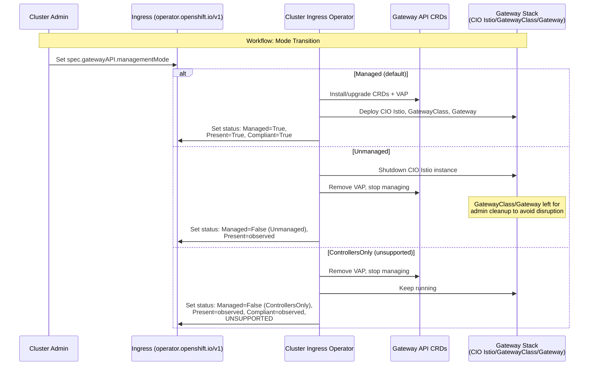

# Gateway API CRD Management Mode

## Summary

This enhancement introduces a new cluster-scoped singleton API
resource, `Ingress` (resource `ingresses`, singleton named
`cluster`), in the `operator.openshift.io/v1` group. The
resource exposes a `spec.gatewayAPI.managementMode` enum
field that controls how the Cluster Ingress Operator (CIO)
manages Gateway API CRDs and the associated Gateway controller
stack (CIO-managed Istio, GatewayClass, Gateway). Three modes
are provided: `Managed` (default -- CIO owns everything),
`Unmanaged` (CIO does nothing, external entity takes over), and
`ControllersOnly` (CIO runs the Gateway controller against
externally-provided CRDs, unsupported configuration).

The field lives on a new resource rather than on
`IngressController` (where multiple instances could conflict) or
`ingress.config.openshift.io/cluster` (which is owned by
`config-operator` for install-time configuration). The
`operator.openshift.io` group already has cluster-scoped
singletons (`DNS`, `Console`) and is the natural home for
operator-managed behavior.

## Motivation

As established by the
[gateway-api-crd-life-cycle-management](gateway-api-crd-life-cycle-management.md)
and
[gateway-api-without-olm](gateway-api-without-olm.md)
enhancements, CIO owns the Gateway API CRDs, pins them to a
specific version, protects them with Validating Admission Policies
(VAPs), and upgrades them during cluster upgrades. This is the
right default for most customers, but creates friction for:

1. **Third-party Gateway API implementations**: Customers using
   Envoy Gateway, Traefik, Kong, or other non-OpenShift controllers
   cannot install their own CRD versions because CIO owns and
   protects them.

2. **Development and testing**: Platform engineers who need newer CRD
   versions must fight the VAP and CIO reconciler.

3. **Supportability**: There is no API-level signal indicating who
   owns the CRDs or whether the current state is intentional.

### User Stories

#### Story 1: Third-Party Gateway Controller

As a cluster administrator, I want to disable OpenShift's Gateway API
CRD management and Gateway controller so that I can install and use a
third-party Gateway API implementation (such as Envoy Gateway or Kong)
without conflicts with CIO's CRD ownership or VAP protections.

#### Story 2: Development and Testing with External CRDs

As a platform engineer, I want to use externally-provided Gateway API
CRDs while keeping the OpenShift Gateway controller running so that I
can test with newer CRD versions or experimental fields in a
development environment, understanding that this configuration is
unsupported.

#### Story 3: Determining CRD Ownership State

As a support engineer responding to a customer escalation, I want to
quickly determine who owns the Gateway API CRDs on a cluster and
whether the current CRD state matches the configured ownership mode
so that I can diagnose issues without needing to inspect labels,
annotations, and controller logs manually.

#### Story 4: Operational Monitoring

As a fleet administrator, I want to monitor Gateway API CRD ownership
state via standard OpenShift status conditions so that I can detect
clusters where CRD ownership is misconfigured or where CRDs have
drifted from the expected state.

### Goals

1. Provide a `managementMode` enum field on a new Ingress
   (`operator.openshift.io/v1`) singleton with three modes:
   `Managed`, `Unmanaged`, and `ControllersOnly`.
2. Allow customers and third-party products to take full control of
   Gateway API CRDs without fighting CIO's reconciler or VAP.
3. Expose status conditions reporting CRD ownership mode, presence,
   and version compliance.
4. Preserve the current fully-managed behavior as the default,
   requiring no action from existing customers.
5. Define clear upgrade and downgrade semantics for mode transitions.

### Non-Goals

1. **Unknown field management**: Future work tracked upstream in
   [gateway-api#3624](https://github.com/kubernetes-sigs/gateway-api/issues/3624).
   This enhancement mentions it for context but does not define the
   solution.
2. **CRD version ranges**: Future work that depends on resolving
   the unknown fields problem.
3. **Automatic migration of third-party CRDs**: When switching from
   `Unmanaged` to `Managed`, CIO will not migrate third-party CRDs.
   The administrator must ensure compatibility before changing modes.
4. **MicroShift support**: MicroShift does not use CIO and is
   unaffected by this enhancement.
5. **Istio CRD management**: This enhancement controls only Gateway
   API CRDs (`gateway.networking.k8s.io`). Istio CRDs are handled
   by the sail-operator library as described in
   [gateway-api-without-olm](gateway-api-without-olm.md).

## Proposal

Introduce a new cluster-scoped singleton API resource in the
`operator.openshift.io/v1` group:

- **Kind**: `Ingress`
- **Resource**: `ingresses`
- **Scope**: Cluster (non-namespaced)
- **Singleton name**: `cluster`
- **Pattern**: Same as `DNS` and `Console` in
  `operator.openshift.io/v1` -- embeds
  `OperatorSpec`/`OperatorStatus` inline.

The spec contains a `gatewayAPI` struct with a
`managementMode` enum. The struct is extensible for future
Gateway API configuration fields.

CIO watches this resource and reads
`spec.gatewayAPI.managementMode` to determine its behavior:

- **Managed** (default): CIO installs, protects (via VAP), and
  upgrades Gateway API CRDs. CIO runs the full Gateway controller
  stack (CIO-managed Istio, GatewayClass, Gateway). This is the
  current behavior and the only fully supported configuration.

- **Unmanaged**: CIO does not install CRDs and does not deploy
  the Gateway controller stack. The customer or a third-party
  product owns the CRDs and Gateway controller. CIO reports
  observational status only.

- **ControllersOnly**: CIO does not manage CRDs but does run the
  Gateway controller stack. The customer brings their own CRDs.
  This is an **unsupported** configuration for development and
  testing. CIO reports status including a persistent unsupported
  warning.

### Workflow Description

**Cluster administrator** is a human user responsible for managing
the OpenShift cluster and configuring ingress.

**CIO (Cluster Ingress Operator)** is the operator that reconciles
IngressController resources and manages Gateway API components.

#### Workflow 1: Default Managed Mode (No Action Required)

1. The cluster administrator installs or upgrades OpenShift.
2. CIO reads the Ingress (`operator.openshift.io/v1`) `cluster`
   resource and observes that `spec.gatewayAPI.managementMode`
   is unset (defaults to `Managed`).
3. CIO deploys Gateway API CRDs, VAPs, the CIO-managed Istio
   instance, GatewayClass, and Gateway resources as per the existing
   behavior.
4. CIO sets `status.gatewayAPI.conditions`:
   - `CRDsManaged=True` (reason: `ManagedByCIO`)
   - `CRDsPresent=True`
   - `CRDsCompliant=True`
5. External consumers observe the conditions and proceed normally.

#### Workflow 2: Switching to Unmanaged Mode

1. The cluster administrator decides to use a third-party Gateway
   API implementation.
2. The cluster administrator edits the Ingress
   (`operator.openshift.io/v1`) `cluster` resource:
   ```yaml
   apiVersion: operator.openshift.io/v1
   kind: Ingress
   metadata:
     name: cluster
   spec:
     gatewayAPI:
       managementMode: Unmanaged
   ```
3. CIO detects the mode change and begins transition:
   a. Shuts down the CIO-managed Istio instance.
   b. Removes the VAP protecting Gateway API CRDs.
   c. Does **not** remove the GatewayClass, Gateway resources, or
      Gateway API CRDs. Removing these resources could cause
      disruptions to existing workloads. The cluster administrator
      is responsible for cleaning up these resources if desired.
4. CIO sets `status.gatewayAPI.conditions`:
   - `CRDsManaged=False` (reason: `Unmanaged`)
   - `CRDsPresent=True/False` (observational)
   - `CRDsCompliant=Unknown` (not applicable in this mode)
5. The cluster administrator installs their third-party Gateway
   controller and optionally their own CRD version.

#### Workflow 3: Switching to ControllersOnly Mode

1. The cluster administrator or developer wants to test with newer
   Gateway API CRDs while using the OpenShift Gateway controller.
2. The cluster administrator edits the Ingress
   (`operator.openshift.io/v1`) `cluster` resource:
   ```yaml
   apiVersion: operator.openshift.io/v1
   kind: Ingress
   metadata:
     name: cluster
   spec:
     gatewayAPI:
       managementMode: ControllersOnly
   ```
3. CIO detects the mode change:
   a. Removes the VAP protecting Gateway API CRDs.
   b. Stops managing (installing/upgrading) Gateway API CRDs.
   c. Keeps the CIO-managed Istio instance, GatewayClass, and
      Gateway resources running.
4. CIO sets `status.gatewayAPI.conditions`:
   - `CRDsManaged=False` (reason: `ControllersOnly`,
     message includes unsupported warning)
   - `CRDsPresent=True/False` (observational)
   - `CRDsCompliant=True/False` (whether existing CRDs
     match the expected version)
5. The cluster administrator installs their own CRD version.
6. If the CRDs are incompatible with the CIO-managed Istio
   instance, CIO reports degraded status but continues running.

#### Workflow 4: Returning to Managed Mode

1. The cluster administrator wants to return to the fully managed
   configuration.
2. The cluster administrator ensures the existing Gateway API CRDs
   match the version CIO expects, or removes them entirely.
3. The cluster administrator edits the Ingress
   (`operator.openshift.io/v1`) `cluster` resource:
   ```yaml
   apiVersion: operator.openshift.io/v1
   kind: Ingress
   metadata:
     name: cluster
   spec:
     gatewayAPI:
       managementMode: Managed
   ```
4. CIO detects the mode change:
   a. If CRDs are absent, CIO installs them.
   b. If CRDs are present and match the expected version, CIO takes
      ownership (adds labels, deploys VAP).
   c. If CRDs are present but do not match the expected version, CIO
      sets `CRDsCompliant=False` (in `status.gatewayAPI.conditions`)
      and does NOT overwrite
      them. The administrator must resolve the mismatch.
5. CIO deploys the full Gateway controller stack if not already
   running.



### API Extensions

This enhancement introduces a **new CRD** in the
`operator.openshift.io/v1` group. The new resource follows the
same pattern as the existing `DNS` and `Console` cluster-scoped
singletons in this group.

**Why a new resource** (see also Alternatives section):
`IngressController` is namespaced and multi-instance, so it
cannot hold a cluster-wide setting without conflicts.
`ingress.config.openshift.io` is owned by `config-operator` for
install-time configuration. A dedicated singleton in
`operator.openshift.io` follows the DNS/Console pattern and
provides a clean extension point.

The proposed Go types are in a new file in `operator/v1/` in the
`openshift/api` repository (note: `types_ingress.go` already
exists for `IngressController`, so this type needs a separate
file, e.g. `types_ingress_gateway.go`):

```go
// +genclient
// +genclient:nonNamespaced
// +k8s:deepcopy-gen:interfaces=k8s.io/apimachinery/pkg/runtime.Object
//
// Ingress holds cluster-wide configuration for Gateway API
// integration managed by the Cluster Ingress Operator. The
// canonical name is `cluster`.
//
// Compatibility level 1: Stable within a major release for a
// minimum of 12 months or 3 minor releases (whichever is longer).
// +openshift:compatibility-gen:level=1
// +openshift:api-approved.openshift.io=<TBD>
// +openshift:file-pattern=cvoRunLevel=0000_50,operatorName=ingress,operatorOrdering=02
// +kubebuilder:object:root=true
// +kubebuilder:resource:path=ingresses,scope=Cluster
// +kubebuilder:subresource:status
// +openshift:capability=Ingress
type Ingress struct {
	metav1.TypeMeta `json:",inline"`

	// metadata is the standard object's metadata.
	metav1.ObjectMeta `json:"metadata,omitempty"`

	// spec holds user settable values for configuration.
	// +required
	Spec IngressSpec `json:"spec"`

	// status holds observed values from the cluster.
	// +optional
	Status IngressStatus `json:"status"`
}

type IngressSpec struct {
	// Inline OperatorSpec for standard operator fields
	// (managementState, logLevel, etc.)
	OperatorSpec `json:",inline"`

	// gatewayAPI holds configuration for Gateway API
	// integration, including how the Cluster Ingress Operator
	// manages Gateway API CRDs and the Gateway controller stack.
	// This struct is designed to accommodate additional Gateway
	// API configuration fields in future releases.
	//
	// +required
	// +openshift:enable:FeatureGate=GatewayAPIManagementMode
	GatewayAPI GatewayAPIIngressConfig `json:"gatewayAPI"`
}

type IngressStatus struct {
	// Inline OperatorStatus for standard operator status fields
	// (conditions, version, observedGeneration, etc.)
	OperatorStatus `json:",inline"`

	// gatewayAPI holds status information for Gateway API
	// integration, including conditions related to CRD
	// management and the Gateway controller stack.
	//
	// +optional
	GatewayAPI GatewayAPIIngressStatus `json:"gatewayAPI,omitempty"`
}
```

The `GatewayAPIIngressConfig` and `GatewayAPIIngressStatus` types:

```go
// GatewayAPIManagementMode describes how the Cluster Ingress
// Operator manages Gateway API Custom Resource Definitions.
//
// +kubebuilder:validation:Enum=Managed;Unmanaged;ControllersOnly
type GatewayAPIManagementMode string

const (
	// ManagedGatewayAPICRDs means CIO installs, owns, protects
	// (via VAP), and upgrades the Gateway API CRDs. CIO also
	// deploys the full Gateway controller stack (the Istio
	// instance deployed by CIO, GatewayClass, Gateway). This is
	// the default mode and the only fully supported configuration.
	ManagedGatewayAPICRDs GatewayAPIManagementMode = "Managed"

	// UnmanagedGatewayAPICRDs means CIO does NOT install or
	// manage Gateway API CRDs and does NOT deploy the Gateway
	// controller stack. The customer or a third-party product is
	// responsible for bringing their own CRDs and Gateway
	// controller. CIO reports observational status only.
	UnmanagedGatewayAPICRDs GatewayAPIManagementMode = "Unmanaged"

	// ControllersOnlyGatewayAPICRDs means CIO does NOT manage
	// Gateway API CRDs but DOES deploy the OpenShift Gateway
	// controller stack (the Istio instance deployed by CIO,
	// GatewayClass, Gateway). The customer brings their own
	// CRDs. This is an UNSUPPORTED configuration useful for
	// development, testing, or advanced users.
	ControllersOnlyGatewayAPICRDs GatewayAPIManagementMode = "ControllersOnly"
)

// GatewayAPIIngressConfig holds configuration for Gateway API
// integration in the Cluster Ingress Operator.
type GatewayAPIIngressConfig struct {
	// managementMode specifies how the Cluster Ingress
	// Operator manages Gateway API Custom Resource Definitions
	// (CRDs) and the associated Gateway controller stack.
	//
	// When set to "Managed" (the default), CIO installs, owns,
	// and upgrades the Gateway API CRDs, protects them with a
	// Validating Admission Policy, and deploys the full Gateway
	// controller stack (the Istio instance deployed by CIO,
	// GatewayClass, Gateway resources). This is the only fully
	// supported configuration.
	//
	// When set to "Unmanaged", CIO does not install or manage
	// Gateway API CRDs and does not deploy the Gateway controller
	// stack. The cluster administrator or a third-party product
	// is responsible for providing their own CRDs and Gateway
	// controller. CIO reports observational status only.
	//
	// When set to "ControllersOnly", CIO does not manage Gateway
	// API CRDs but does deploy the OpenShift Gateway controller
	// stack. The cluster administrator brings their own CRDs.
	// This is an unsupported configuration intended for
	// development and testing.
	//
	// +kubebuilder:default:="Managed"
	// +default="Managed"
	// +required
	ManagementMode GatewayAPIManagementMode `json:"managementMode"`
}

// GatewayAPIIngressStatus holds status information for Gateway
// API integration managed by the Cluster Ingress Operator.
type GatewayAPIIngressStatus struct {
	// conditions is a list of conditions related to Gateway API
	// CRD management and the Gateway controller stack.
	//
	// Supported condition types are:
	// * CRDsManaged - whether CIO is actively managing CRDs
	// * CRDsPresent - whether Gateway API CRDs exist on cluster
	// * CRDsCompliant - whether installed CRDs match expected version
	//
	// +listType=map
	// +listMapKey=type
	// +optional
	Conditions []metav1.Condition `json:"conditions,omitempty"`
}
```

The field paths are:

```
spec.gatewayAPI.managementMode
status.gatewayAPI.conditions
```

The following conditions are set within
`status.gatewayAPI.conditions`:

| Condition Type | Status | Reason | Description |
|---|---|---|---|
| `CRDsManaged` | `True` | `ManagedByCIO` | CIO is actively managing CRDs |
| `CRDsManaged` | `False` | `Unmanaged` | Administrator chose Unmanaged mode |
| `CRDsManaged` | `False` | `ControllersOnly` | Administrator chose ControllersOnly mode (unsupported) |
| `CRDsPresent` | `True` | `CRDsFound` | Gateway API CRDs are present on the cluster |
| `CRDsPresent` | `False` | `CRDsNotFound` | Gateway API CRDs are not present on the cluster |
| `CRDsCompliant` | `True` | `VersionMatch` | Installed CRDs match the expected version |
| `CRDsCompliant` | `False` | `VersionMismatch` | Installed CRDs do not match the expected version. Message includes the expected and actual versions. |
| `CRDsCompliant` | `Unknown` | `NotApplicable` | Compliance check is not applicable (e.g., Unmanaged mode with no CRDs present) |

**Note:** This is a new CRD and must go through the full API
review process via `#forum-api-review`. The API approver must
review both this enhancement and the implementation PR in
`openshift/api`.

### Topology Considerations

#### Hypershift / Hosted Control Planes

Same semantics as standalone clusters. The Ingress Operator runs
on the management cluster but manages resources on the guest
cluster. The mode is configured per-guest-cluster and does not
affect the management cluster.

#### Standalone Clusters

Primary topology. All three modes apply with no special
considerations.

#### Single-node Deployments or MicroShift

**SNO**: No additional resource concerns. `Unmanaged` mode allows
disabling the Gateway controller stack to reclaim resources.

**MicroShift**: Not affected. MicroShift does not use CIO (see
[MicroShift Gateway API Support](../microshift/gateway-api-support.md)).

#### OpenShift Kubernetes Engine

All three modes are available. The
[gateway-api-without-olm](gateway-api-without-olm.md) enhancement
enables Gateway API on OKE by eliminating OSSM licensing concerns.

### Implementation Details/Notes/Constraints

#### Feature Gate

New feature gate: `GatewayAPIManagementMode`, added to
`TechPreviewNoUpgrade` in
[features.go](https://github.com/openshift/api/blob/master/features/features.go).

The `gatewayAPI` field uses the
`+openshift:enable:FeatureGate=GatewayAPIManagementMode` marker
so it only appears in CRDs when the gate is enabled.

#### Interaction with the GatewayAPI Feature Gate

The `managementMode` field only takes effect when the existing
`GatewayAPI` feature gate is also enabled. When `GatewayAPI` is
disabled, CIO does not manage any Gateway API resources regardless
of the mode setting.

#### CIO Controller Changes

Affected controllers:

| Controller | Managed | Unmanaged | ControllersOnly |
|---|---|---|---|
| CRD management | Install, upgrade, protect (VAP) | Observe only | Observe only |
| GatewayClass | Active | Disabled | Active |
| Gateway | Active | Disabled | Active |
| Status | Report conditions | Report conditions | Report conditions + unsupported warning |

#### VAP Management

The VAP protecting Gateway API CRDs is deployed only in `Managed`
mode. When transitioning away from `Managed`, the VAP must be
removed first to avoid leaving CRDs locked.

#### CRD Validity Definition

A Gateway API CRD is considered **compliant** when:

1. **Strict version match**: The CRD's
   `gateway.networking.k8s.io/bundle-version` annotation matches
   the exact Gateway API version that CIO expects (e.g.,
   `v1.2.1`). Version ranges are not supported (see Non-Goals).

2. **Checksum verification** (future iteration): SHA-256 checksum
   of the CRD's OpenAPI schema compared against the expected
   checksum embedded in the CIO binary.

When CRDs are non-compliant, CIO reports the mismatch in the
`CRDsCompliant` condition message, including expected vs. actual
versions and where to obtain valid manifests. Valid CRD manifests
are available from:
- The `gateway-api` container image in the OpenShift release
  payload at `/manifests/gateway-api/`.
- The upstream Gateway API release at
  `https://github.com/kubernetes-sigs/gateway-api/releases`.

#### Mode Transition Ordering

When transitioning between modes, CIO must follow a specific order
to avoid leaving the cluster in an inconsistent state:

- **Managed to Unmanaged**: Remove VAP, stop CRD management,
  shutdown CIO-managed Istio instance. GatewayClass and Gateway
  resources are left in place; administrator is responsible for
  cleanup.
- **Managed to ControllersOnly**: Remove VAP, stop CRD management,
  keep CIO-managed Istio instance, GatewayClass, and Gateway
  running.
- **Unmanaged to Managed**: Verify CRDs match expected version (or
  are absent), install CRDs if absent, deploy VAP, start
  CIO-managed Istio instance, GatewayClass, and Gateway.
- **Unmanaged to ControllersOnly**: Start CIO-managed Istio instance,
  GatewayClass, and Gateway (CRDs must already be present or
  controller will wait).
- **ControllersOnly to Managed**: Verify CRDs match expected version,
  take ownership, deploy VAP.
- **ControllersOnly to Unmanaged**: Shutdown CIO-managed Istio
  instance. GatewayClass and Gateway resources are left in place.

#### Long-Term: Unknown Field Management

The "unknown fields" problem (CRDs containing fields the controller
does not recognize) is tracked upstream in
[gateway-api#3624](https://github.com/kubernetes-sigs/gateway-api/issues/3624).
The `ControllersOnly` mode is particularly susceptible. This
enhancement provides the management mode infrastructure that future
work (version ranges, unknown field detection, compatibility
checks) can build on. See Non-Goals for scope.

#### Future Work on the Ingress Resource

The new Ingress (`operator.openshift.io/v1`) resource is designed
to accommodate future configuration beyond `managementMode`:

1. **GatewayClass customization**: The `gatewayAPI` struct can be
   extended to allow administrators to define additional OpenShift
   GatewayClasses in a structured way -- specifying service type,
   resource allocation for Envoy proxies, and other per-class
   parameters. This would replace the current model where only a
   single default GatewayClass is created by CIO.

2. **Operator and operand logging levels**: The Ingress resource
   embeds `OperatorSpec`, which includes `logLevel` (for operands)
   and `operatorLogLevel` (for the operator) fields. These can be
   used to implement the logging level controls originally proposed
   in
   [ingress-operator-operand-logging-level](ingress-operator-operand-logging-level.md),
   providing a supported API for adjusting CIO and Gateway
   controller verbosity.

These are out of scope for this enhancement.

### Risks and Mitigations

#### Risk: Unsupported ControllersOnly Mode Misuse

Customers may use `ControllersOnly` in production and file support
tickets when CRD incompatibility causes issues.

**Mitigation**: CIO sets a persistent unsupported warning condition
in status. Telemetry captures the management mode for support
triage.

#### Risk: Orphaned Resources During Mode Transition

Switching to `Unmanaged` leaves GatewayClass, Gateway, and
HTTPRoute resources without a managing controller.

**Mitigation**: CIO preserves all Gateway API resources during
transitions to avoid disruption. The administrator is responsible
for cleanup. Documentation must state this clearly.

#### Risk: Incompatible Mode Transition

Switching to `Managed` may fail if existing CRDs do not match the
expected version.

**Mitigation**: CIO verifies CRD compliance before taking
ownership. If incompatible, CIO sets `CRDsCompliant=False` and
does not overwrite. The administrator must resolve the mismatch.

#### Risk: Security Implications of Removing VAP

In non-`Managed` modes, the VAP is removed, allowing any actor
with CRD RBAC to modify Gateway API CRDs.

**Mitigation**: Explicit trade-off. Standard Kubernetes RBAC still
applies. Documentation must state that VAP protection is removed.

### Drawbacks

Increased CIO complexity: three behavioral modes with different
controller enable/disable states and mode transition logic. This is
justified by customer demand -- the alternative is customers
fighting the VAP and CRD reconciler.

The `ControllersOnly` mode introduces an explicitly unsupported
configuration, but without it, advanced users would resort to worse
workarounds (disabling the VAP manually, using
`unsupportedConfigOverrides`).

## Open Questions

1. ~~**Field placement**: Resolved. New Ingress singleton in
   `operator.openshift.io/v1`, following the DNS/Console pattern.~~

2. **ControllersOnly mode scope**: Should `ControllersOnly` mode perform
   compatibility pre-checks before starting the Gateway controller,
   or always start and report incompatibility via status conditions?

3. **CRD cleanup on Unmanaged transition**: Should CIO offer an
   option to remove CRDs when transitioning to `Unmanaged`? This
   would delete all Gateway/HTTPRoute resources. The current
   proposal preserves CRDs during transitions.

4. **Interaction with `unsupportedConfigOverrides`**: The CRD
   lifecycle management enhancement uses an "unsupported config
   override" mechanism to bypass CRD succession checks. Should
   `managementMode` replace this mechanism or coexist with it?

5. **Telemetry**: What telemetry should be collected? At minimum
   the configured mode. Should CIO also report metrics for CRD
   compliance and mode transitions?

6. **Singleton creation**: Should the `cluster` singleton instance
   be created by CVO (via a manifest in the release payload) or
   by CIO on first startup? This affects upgrade behavior and
   needs alignment with the operator pattern used by DNS/Console.

7. **Kind name collision**: The proposed Kind `Ingress` in
   `operator.openshift.io/v1` shares a name with the well-known
   `networking.k8s.io/v1` Ingress. While API groups disambiguate,
   this may cause user confusion with `oc get ingress`. The short
   name and resource disambiguation strategy should be decided
   during API review.

## Test Plan

<!-- TODO: Tests must include the following labels per
dev-guide/feature-zero-to-hero.md:
- [OCPFeatureGate:GatewayAPIManagementMode] for the feature gate
- [Jira:"Networking / ingress"] for the component
- Appropriate test type labels: [Serial], [Slow], [Disruptive]
  as needed
- Reference dev-guide/test-conventions.md for details -->

Testing strategy covers unit tests, integration tests, and e2e tests
for each management mode and mode transitions.

### Unit Tests

- Validation of the `managementMode` field (valid enum values,
  defaulting behavior).
- Status condition computation logic for each mode.
- Controller enable/disable logic based on mode.

### Integration Tests

- CRD management controller behavior in each mode.
- VAP deployment and removal during mode transitions.
- Status condition updates during mode transitions.

### E2E Tests

The following e2e test scenarios are required:

1. **Managed mode (default)**: Verify that a new cluster has CRDs
   installed, VAP deployed, and the Gateway controller stack
   running. Verify status conditions report `Managed`.

2. **Transition to Unmanaged**: Set mode to `Unmanaged`. Verify
   that the CIO-managed Istio instance is shut down, the VAP is
   removed, and CRDs, GatewayClass, and Gateway resources are
   preserved. Verify status conditions report `Unmanaged`. Verify
   a third-party GatewayClass can be created.

3. **Transition to ControllersOnly**: Set mode to `ControllersOnly`. Verify that the
   VAP is removed, CRDs are no longer managed, but the Gateway
   controller stack remains running. Verify the unsupported warning
   condition.

4. **Return to Managed**: From `Unmanaged` or `ControllersOnly`, return to
   `Managed`. Verify CIO takes ownership of compatible CRDs, or
   reports incompatibility for mismatched CRDs.

5. **Unmanaged mode with absent CRDs**: Set mode to `Unmanaged` on
   a cluster with no Gateway API CRDs. Verify CIO does not install
   CRDs and reports `CRDsNotFound`.

6. **ControllersOnly mode with incompatible CRDs**: Set mode to `ControllersOnly` and
   install CRDs that do not match the expected version. Verify CIO
   reports compliance failure but continues running the Gateway
   controller stack.

7. **Upgrade with non-default mode**: Upgrade a cluster that has
   `Unmanaged` or `ControllersOnly` mode set. Verify the mode is preserved
   and CIO does not attempt to take over CRDs during upgrade.

## Graduation Criteria

<!-- TODO: Promotion requirements per
dev-guide/feature-zero-to-hero.md:
- Minimum 5 tests
- 7 runs per week
- 14 runs per supported platform
- 95% pass rate
- Tests running on all supported platforms
  (AWS, Azure, GCP, vSphere, Baremetal with IPv4/IPv6/Dual) -->

### Dev Preview -> Tech Preview

- Feature gate `GatewayAPIManagementMode` added to
  `TechPreviewNoUpgrade` feature set.
- `Managed` and `Unmanaged` modes fully functional.
- `ControllersOnly` mode functional with unsupported warning.
- Status conditions implemented and observable.
- Unit and integration tests passing.
- Initial e2e tests for basic mode transitions.
- End user documentation for Tech Preview.

### Tech Preview -> GA

- All e2e test scenarios passing consistently (95%+ pass rate).
- Upgrade and downgrade testing with mode transitions validated.
- Mode transition edge cases tested (e.g., incompatible CRDs,
  missing CRDs).
- Telemetry for management mode implemented and reporting.
- Load testing with mode transitions under concurrent operations.
- User-facing documentation created in
  [openshift-docs](https://github.com/openshift/openshift-docs/).
- Feature gate promoted to `Default` feature set.
- Sufficient time for customer feedback (at least one minor
  release in Tech Preview).

### Backport to OCP 4.19

The official backport target is OCP 4.19. Without this backport,
customers on 4.19 with third-party Gateway API CRDs face CRD
succession conflicts when upgrading, because CIO enforces
ownership with no opt-out. Backporting lets customers set
`Unmanaged` before upgrading.

> **Note**: There is also a desire to backport to OCP 4.18, as the
> lack of this feature is currently blocking 4.18 upgrades for
> customers with third-party CRDs. This requires the same SBAR
> exception process and is subject to architect approval.

**SBAR exception process**: Backporting a new CRD to a released
version requires SBAR (Situation, Background, Assessment,
Recommendation) with architect approval. The SBAR must justify
the backport (customer upgrade path continuity) and demonstrate
bounded risk.

Backport scope:
- Ingress CRD manifest for `operator.openshift.io/v1` (CVO).
- `gatewayAPI` spec/status structs with all three enum values.
- `status.gatewayAPI.conditions` reporting.
- Feature gate `GatewayAPIManagementMode` (behind
  `TechPreviewNoUpgrade`).
- CIO controller changes.

**E2E requirements**: 95%+ pass rate, 7 runs/week on supported
platforms.

The backport does not change CRD succession logic from
[gateway-api-crd-life-cycle-management](gateway-api-crd-life-cycle-management.md).
It adds the opt-out mechanism on top of existing behavior.

### Removing a deprecated feature

Not applicable. This enhancement adds new functionality.

## Upgrade / Downgrade Strategy

### Upgrade

When upgrading from a version that does not have the Ingress
(`operator.openshift.io/v1`) resource to one that does (e.g.,
upgrading from 4.18 to 4.19 with the backport applied):

- CVO installs the new Ingress CRD. The `cluster` singleton is
  created with `spec.gatewayAPI.managementMode` defaulting to
  `Managed`, preserving existing behavior. No action is required
  from the cluster administrator.
- Existing clusters with CIO-managed CRDs continue to work
  identically.

When upgrading a cluster that has a non-default mode set (e.g.,
upgrading from 4.19 to 4.20+ with mode already configured):

- **Unmanaged mode**: CIO does not attempt to install or manage
  CRDs during the upgrade. The administrator's third-party CRDs
  are preserved.
- **ControllersOnly mode**: CIO does not upgrade CRDs but does upgrade
  the CIO-managed Istio instance. If the new Istio version is
  incompatible with the existing CRDs, CIO reports degraded status.
  The administrator is responsible for updating the CRDs.

### Downgrade

When downgrading from a version that has the Ingress
(`operator.openshift.io/v1`) resource to one that does not:

- The Ingress CRD and `cluster` singleton persist on the cluster
  (CRDs are not removed during rollbacks), but the older CIO does
  not watch this resource. It has no effect.
- The older CIO behaves as `Managed` (its only behavior) and
  attempts to install and manage Gateway API CRDs.
- **If the cluster was in `Unmanaged` mode**: The downgraded CIO
  will attempt to install CRDs and deploy the Gateway controller
  stack. If third-party CRDs are present, the existing CRD
  management succession logic (from
  [gateway-api-crd-life-cycle-management](gateway-api-crd-life-cycle-management.md))
  applies.
- **If the cluster was in `ControllersOnly` mode**: The downgraded CIO
  will attempt to take ownership of the CRDs. If they do not match
  the expected version, the operator reports `Degraded`.

**Recommendation**: Set mode to `Managed` and ensure CRD
compatibility before downgrading.

## Version Skew Strategy

During upgrade, CIO may start before CVO creates the Ingress CRD.
CIO treats the absence as `Managed` mode (existing behavior). The
field is consumed only by CIO and requires no cross-component
coordination.

## Operational Aspects of API Extensions

Operational impact is minimal -- one additional cluster-scoped
resource read during CIO reconciliation.

- **SLIs**: `status.gatewayAPI.conditions` (`CRDsManaged`,
  `CRDsPresent`, `CRDsCompliant`).

- **Failure modes**:
  - VAP removal failure during mode transition: CRDs remain locked.
    CIO retries and reports in status.
  - `ControllersOnly` mode with absent CRDs: Gateway controller cannot
    start. CIO reports and retries when CRDs appear.

- **Escalation**: Networking / Ingress team. For Istio CRD
  interactions, consult the OSSM team.

## Support Procedures

### Detecting the Current Mode

```bash
oc get ingress.operator.openshift.io cluster \
  -o jsonpath='{.spec.gatewayAPI.managementMode}'
```

### Checking CRD Management Status

```bash
oc get ingress.operator.openshift.io cluster \
  -o jsonpath='{.status.gatewayAPI.conditions}' | \
  jq '.[]'
```

### Common Issues

**Symptom**: `CRDsCompliant=False` in `status.gatewayAPI.conditions`
after switching to `Managed` mode.

**Diagnosis**: The existing CRDs do not match the expected version.
Check the condition message for the expected and actual versions.

**Resolution**: Either upgrade the CRDs to the expected version or
remove them and let CIO reinstall them. Valid CRD manifests can be
obtained from the `gateway-api` container image in the OpenShift
release payload at `/manifests/gateway-api/`, or from the upstream
Gateway API release at
`https://github.com/kubernetes-sigs/gateway-api/releases` matching
the expected version shown in the condition message.

```bash
# Check expected version from condition message
oc get ingress.operator.openshift.io cluster \
  -o jsonpath='{.status.gatewayAPI.conditions}' | \
  jq '.[] | select(.type=="CRDsCompliant")'

# Remove CRDs to let CIO reinstall (WARNING: this deletes
# all Gateway, HTTPRoute, and other Gateway API resources)
oc delete crd \
  gatewayclasses.gateway.networking.k8s.io \
  gateways.gateway.networking.k8s.io \
  httproutes.gateway.networking.k8s.io \
  referencegrants.gateway.networking.k8s.io \
  grpcroutes.gateway.networking.k8s.io
```

**Symptom**: Gateway controller not starting in `ControllersOnly` mode.

**Resolution**: Install Gateway API CRDs. CIO starts the
controller when CRDs appear.

**Symptom**: `CRDsManaged=False` with reason `ControllersOnly`.

**Resolution**: Expected behavior for `ControllersOnly` mode. Verify
the customer intentionally chose this mode. For production
clusters, recommend switching to `Managed`.

## Alternatives (Not Implemented)

### Alternative 1: Boolean Gateway API Disable Switch

Does not address the `ControllersOnly` use case (CRDs external, controller
active). Also prohibited by OpenShift API conventions (no boolean
fields in CRDs).

### Alternative 2: Modify `ingress.config.openshift.io/cluster`

That resource is owned by `config-operator` for install-time
configuration (base domain, HSTS policies, component routes).
Gateway API operational behavior belongs in `operator.openshift.io`.

### Alternative 3: Annotation-Based Configuration

Lacks validation, defaulting, and discoverability. Not visible in
`oc describe` as structured fields.

### Alternative 4: Separate `GatewayAPIConfig` CRD

Adds unnecessary complexity. CRD management is an ingress concern,
so the Ingress resource in `operator.openshift.io/v1` is a more
natural home.

### Alternative 5: Per-CRD Management Granularity

Per-CRD modes (e.g., manage GatewayClass CRD but not HTTPRoute)
add significant complexity for minimal benefit. In practice, CRDs
are managed as a cohesive set or not at all.

## Infrastructure Needed

No new infrastructure is required for this enhancement.
