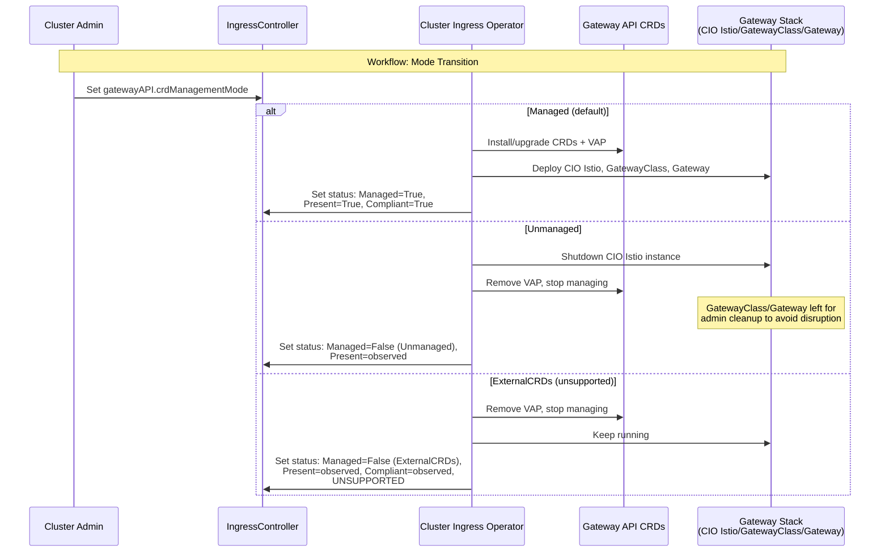

# Gateway API CRD Management Mode

## Summary

This enhancement introduces a new `gatewayAPI` configuration struct
on the `IngressController` API (`operator.openshift.io/v1`) that
contains a `crdManagementMode` enum field controlling how the
Cluster Ingress Operator (CIO) manages Gateway API Custom Resource
Definitions (CRDs) and the associated Gateway controller stack
(the Istio instance deployed by CIO, GatewayClass, Gateway
resources). The enum exposes three modes -- `Managed`, `Unmanaged`,
and `ExternalCRDs` -- enabling cluster administrators and
third-party products to choose whether CIO fully owns the Gateway
API CRDs and controller, delegates CRD ownership entirely to an
external entity, or runs the OpenShift Gateway controller against
externally-provided CRDs. The `gatewayAPI` struct is designed to be
extended in the future with additional Gateway API-related
configuration fields. This gives customers the flexibility they
need while preserving a clear, observable ownership model that CIO
and support teams can reason about.

## Motivation

The current Gateway API integration in OpenShift, as established by
the
[gateway-api-crd-life-cycle-management](gateway-api-crd-life-cycle-management.md)
and
[gateway-api-without-olm](gateway-api-without-olm.md)
enhancements, treats Gateway API CRDs as a core platform API. CIO
owns the CRDs, pins them to a specific version, protects them with
Validating Admission Policies (VAPs), and upgrades them automatically
during cluster upgrades. This is the right default for most customers.

However, this "CIO owns everything" model creates friction for several
legitimate use cases:

1. **Third-party Gateway API implementations**: Customers who want to
   use a non-OpenShift Gateway API controller (e.g., Envoy Gateway,
   Traefik, Kong) cannot do so cleanly because CIO installs and
   protects its own CRD versions. The third-party controller may
   require a different CRD version or schema.

2. **Development and testing**: Platform engineers and advanced users
   sometimes need to test with newer CRD versions or experimental
   fields. Today, this requires fighting the VAP and the CIO
   reconciler.

3. **Supportability and observability**: When CRDs are modified
   outside the expected flow (e.g., by bypassing the VAP), there is
   no explicit API-level signal that tells support or monitoring
   who is supposed to own the CRDs and whether the current state is
   intentional.

This enhancement addresses these gaps by providing an explicit,
API-level knob that makes CRD ownership a first-class configuration
choice rather than an implicit assumption.

### User Stories

#### Story 1: Third-Party Gateway Controller

As a cluster administrator, I want to disable OpenShift's Gateway API
CRD management and Gateway controller so that I can install and use a
third-party Gateway API implementation (such as Envoy Gateway or Kong)
without conflicts with CIO's CRD ownership or VAP protections.

#### Story 2: Development and Testing with External CRDs

As a platform engineer, I want to use externally-provided Gateway API
CRDs while keeping the OpenShift Gateway controller running so that I
can test with newer CRD versions or experimental fields in a
development environment, understanding that this configuration is
unsupported.

#### Story 3: Determining CRD Ownership State

As a support engineer responding to a customer escalation, I want to
quickly determine who owns the Gateway API CRDs on a cluster and
whether the current CRD state matches the configured ownership mode
so that I can diagnose issues without needing to inspect labels,
annotations, and controller logs manually.

#### Story 4: Operational Monitoring at Scale

As a fleet administrator managing hundreds of OpenShift clusters, I
want to monitor the Gateway API CRD ownership state via standard
OpenShift status conditions and metrics so that I can detect clusters
where CRD ownership is misconfigured or where CRDs have drifted from
the expected state, enabling proactive remediation before users are
affected.

#### Story 5: Automatic CRD Upgrades

As a cluster administrator using the default configuration, I want
OpenShift to continue automatically upgrading Gateway API CRDs during
cluster upgrades so that I do not need to manage CRD versions myself,
and I want the ownership state to be clearly reported in the
IngressController status.

### Goals

1. Provide an explicit API field on the IngressController that
   controls Gateway API CRD ownership with three modes: `Managed`,
   `Unmanaged`, and `ExternalCRDs`.
2. Enable customers and third-party products to take full control of
   Gateway API CRDs when needed, without fighting CIO's reconciler
   or VAP protections.
3. Expose clear, observable status conditions that report the current
   CRD ownership mode, CRD presence, and CRD compliance with the
   expected version.
4. Signal via status conditions the CRD management state so that
   external consumers can determine the platform's Gateway API
   posture.
5. Preserve the current fully-managed behavior as the default,
   requiring no action from existing customers.
6. Define clear upgrade and downgrade semantics for transitioning
   between modes.

### Non-Goals

1. **Unknown field management**: Handling fields in CRDs that are not
   recognized by the current controller version is a long-term goal
   that will build on top of this work. This enhancement mentions it
   for context but does not define the solution. See
   [gateway-api#3624](https://github.com/kubernetes-sigs/gateway-api/issues/3624)
   for upstream tracking.
2. **CRD version ranges**: Allowing a configurable range of acceptable
   CRD versions rather than pinning to one specific version. This is
   future work that depends on resolving the unknown fields problem.
3. **Automatic migration of third-party CRDs**: When switching from
   `Unmanaged` to `Managed`, CIO will not attempt to reconcile or
   migrate third-party CRDs automatically. The administrator must
   ensure the cluster state is compatible before changing modes.
4. **MicroShift support**: MicroShift does not use CIO and has its own
   Gateway API design. This enhancement does not affect MicroShift.
5. **Istio CRD management mode**: This enhancement controls only
   Gateway API CRDs (`gateway.networking.k8s.io` group). Istio CRD
   management (the `networking.istio.io`, `security.istio.io`, etc.
   groups) is handled separately by the sail-operator library as
   described in
   [gateway-api-without-olm](gateway-api-without-olm.md).

## Proposal

Add a new `gatewayAPI` struct field to the `IngressControllerSpec`
that serves as a namespace for all Gateway API-related configuration.
Initially, this struct contains a single `crdManagementMode` enum
field with three values: `Managed` (default), `Unmanaged`, and
`ExternalCRDs`. The struct is intentionally designed to be extensible so
that future Gateway API configuration fields can be added without
further API restructuring. The CIO will use the `crdManagementMode`
field to determine its behavior regarding Gateway API CRD lifecycle
management and the Gateway controller stack (the Istio instance
deployed by CIO, GatewayClass, Gateway resources).

The three modes are:

- **Managed** (default): CIO maintains the Gateway API CRDs, protects
  them via VAPs, upgrades them during cluster upgrades, and runs the
  full Gateway controller stack (the Istio instance deployed by CIO,
  GatewayClass, Gateway). This is the current behavior and the only
  fully supported configuration.

- **Unmanaged**: CIO does NOT install Gateway API CRDs and does NOT
  deploy the Gateway controller stack. The customer or a third-party
  product brings their own CRDs and Gateway controller. CIO's
  Gateway-related controllers are disabled entirely. CIO reports
  observational status (CRD presence, version) but takes no
  management action.

- **ExternalCRDs**: CIO does NOT manage Gateway API CRDs (no install,
  no upgrade, no VAP protection) but DOES run the OpenShift Gateway
  controller stack (the Istio instance deployed by CIO, GatewayClass,
  Gateway). The customer
  brings their own CRDs. This is explicitly marked as an
  **unsupported** configuration, useful for development, testing, or
  advanced users who need newer CRD versions. CIO reports status
  including a persistent unsupported warning.

### Workflow Description

**Cluster administrator** is a human user responsible for managing
the OpenShift cluster and configuring ingress.

**CIO (Cluster Ingress Operator)** is the operator that reconciles
IngressController resources and manages Gateway API components.

#### Workflow 1: Default Managed Mode (No Action Required)

1. The cluster administrator installs or upgrades OpenShift.
2. CIO reads the `default` IngressController and observes that
   `spec.gatewayAPI.crdManagementMode` is unset (defaults to
   `Managed`).
3. CIO deploys Gateway API CRDs, VAPs, the CIO-managed Istio
   instance, GatewayClass, and Gateway resources as per the existing
   behavior.
4. CIO sets `status.gatewayAPI.conditions`:
   - `CRDsManaged=True` (reason: `ManagedByCIO`)
   - `CRDsPresent=True`
   - `CRDsCompliant=True`
5. External consumers observe the conditions and proceed normally.

#### Workflow 2: Switching to Unmanaged Mode

1. The cluster administrator decides to use a third-party Gateway
   API implementation.
2. The cluster administrator edits the `default` IngressController:
   ```yaml
   spec:
     gatewayAPI:
       crdManagementMode: Unmanaged
   ```
3. CIO detects the mode change and begins transition:
   a. Shuts down the CIO-managed Istio instance.
   b. Removes the VAP protecting Gateway API CRDs.
   c. Does **not** remove the GatewayClass, Gateway resources, or
      Gateway API CRDs. Removing these resources could cause
      disruptions to existing workloads. The cluster administrator
      is responsible for cleaning up these resources if desired.
4. CIO sets `status.gatewayAPI.conditions`:
   - `CRDsManaged=False` (reason: `Unmanaged`)
   - `CRDsPresent=True/False` (observational)
   - `CRDsCompliant=Unknown` (not applicable in this mode)
5. The cluster administrator installs their third-party Gateway
   controller and optionally their own CRD version.

#### Workflow 3: Switching to ExternalCRDs Mode

1. The cluster administrator or developer wants to test with newer
   Gateway API CRDs while using the OpenShift Gateway controller.
2. The cluster administrator edits the `default` IngressController:
   ```yaml
   spec:
     gatewayAPI:
       crdManagementMode: ExternalCRDs
   ```
3. CIO detects the mode change:
   a. Removes the VAP protecting Gateway API CRDs.
   b. Stops managing (installing/upgrading) Gateway API CRDs.
   c. Keeps the CIO-managed Istio instance, GatewayClass, and
      Gateway resources running.
4. CIO sets `status.gatewayAPI.conditions`:
   - `CRDsManaged=False` (reason: `ExternalCRDs`,
     message includes unsupported warning)
   - `CRDsPresent=True/False` (observational)
   - `CRDsCompliant=True/False` (whether existing CRDs
     match the expected version)
5. The cluster administrator installs their own CRD version.
6. If the CRDs are incompatible with the CIO-managed Istio
   instance, CIO reports degraded status but continues running.

#### Workflow 4: Returning to Managed Mode

1. The cluster administrator wants to return to the fully managed
   configuration.
2. The cluster administrator ensures the existing Gateway API CRDs
   match the version CIO expects, or removes them entirely.
3. The cluster administrator edits the `default` IngressController:
   ```yaml
   spec:
     gatewayAPI:
       crdManagementMode: Managed
   ```
4. CIO detects the mode change:
   a. If CRDs are absent, CIO installs them.
   b. If CRDs are present and match the expected version, CIO takes
      ownership (adds labels, deploys VAP).
   c. If CRDs are present but do not match the expected version, CIO
      sets `CRDsCompliant=False` (in `status.gatewayAPI.conditions`)
      and does NOT overwrite
      them. The administrator must resolve the mismatch.
5. CIO deploys the full Gateway controller stack if not already
   running.



### API Extensions

This enhancement modifies the existing `IngressController` CRD
(`operator.openshift.io/v1`) by adding new fields to the spec and
new conditions to the status. No new CRDs, admission webhooks,
conversion webhooks, aggregated API servers, or finalizers are
introduced.

The proposed Go types are:

```go
// GatewayAPICRDManagementMode describes how the Cluster Ingress
// Operator manages Gateway API Custom Resource Definitions.
//
// +kubebuilder:validation:Enum=Managed;Unmanaged;ExternalCRDs
type GatewayAPICRDManagementMode string

const (
	// ManagedGatewayAPICRDs means CIO installs, owns, protects
	// (via VAP), and upgrades the Gateway API CRDs. CIO also
	// deploys the full Gateway controller stack (the Istio
	// instance deployed by CIO, GatewayClass, Gateway). This is
	// the default mode and the only fully supported configuration.
	ManagedGatewayAPICRDs GatewayAPICRDManagementMode = "Managed"

	// UnmanagedGatewayAPICRDs means CIO does NOT install or
	// manage Gateway API CRDs and does NOT deploy the Gateway
	// controller stack. The customer or a third-party product is
	// responsible for bringing their own CRDs and Gateway
	// controller. CIO reports observational status only.
	UnmanagedGatewayAPICRDs GatewayAPICRDManagementMode = "Unmanaged"

	// ExternalCRDsGatewayAPICRDs means CIO does NOT manage Gateway
	// API CRDs but DOES deploy the OpenShift Gateway controller
	// stack (the Istio instance deployed by CIO, GatewayClass,
	// Gateway). The customer brings their own CRDs. This is an
	// UNSUPPORTED configuration useful for development, testing,
	// or advanced users.
	ExternalCRDsGatewayAPICRDs GatewayAPICRDManagementMode = "ExternalCRDs"
)

// GatewayAPIConfig holds configuration for Gateway API integration
// in the Cluster Ingress Operator. This struct is designed to be
// extended with additional Gateway API-related configuration
// fields in the future.
type GatewayAPIConfig struct {
	// crdManagementMode specifies how the Cluster Ingress
	// Operator manages Gateway API Custom Resource Definitions
	// (CRDs) and the associated Gateway controller stack.
	//
	// When set to "Managed" (the default), CIO installs, owns,
	// and upgrades the Gateway API CRDs, protects them with a
	// Validating Admission Policy, and deploys the full Gateway
	// controller stack (the Istio instance deployed by CIO,
	// GatewayClass, Gateway resources). This is the only fully
	// supported configuration.
	//
	// When set to "Unmanaged", CIO does not install or manage
	// Gateway API CRDs and does not deploy the Gateway controller
	// stack. The cluster administrator or a third-party product
	// is responsible for providing their own CRDs and Gateway
	// controller. CIO reports observational status only.
	//
	// When set to "ExternalCRDs", CIO does not manage Gateway API
	// CRDs but does deploy the OpenShift Gateway controller stack.
	// The cluster administrator brings their own CRDs. This is an
	// unsupported configuration intended for development and
	// testing.
	//
	// +kubebuilder:default:="Managed"
	// +default="Managed"
	// +required
	CRDManagementMode GatewayAPICRDManagementMode `json:"crdManagementMode"`
}
```

The `GatewayAPIConfig` struct is added to the
`IngressControllerSpec` as a value type (not a pointer). The field
is mandatory and defaults to `Managed` mode. Once set, the
administrator must change the mode to a different value rather than
removing the field entirely:

```go
type IngressControllerSpec struct {
	// ... existing fields ...

	// gatewayAPI holds configuration for Gateway API integration,
	// including how the Cluster Ingress Operator manages Gateway
	// API CRDs and the Gateway controller stack. This struct is
	// designed to accommodate additional Gateway API configuration
	// fields in future releases.
	//
	// +required
	// +openshift:enable:FeatureGate=GatewayAPICRDManagementMode
	GatewayAPI GatewayAPIConfig `json:"gatewayAPI"`
}
```

The field path for the CRD management mode is:

```
spec.gatewayAPI.crdManagementMode
```

This nesting under the `gatewayAPI` struct allows future fields
such as `spec.gatewayAPI.someOtherSetting` to be added without
further API restructuring.

A new `gatewayAPI` struct is added to `IngressControllerStatus` to
namespace all Gateway API-related status, mirroring the spec-side
`gatewayAPI` struct. This keeps Gateway API conditions separate from
the IngressController's top-level conditions and makes it easy for
consumers to find all Gateway API state in one place.

```go
// GatewayAPIStatus holds status information for Gateway API
// integration managed by the Cluster Ingress Operator.
type GatewayAPIStatus struct {
	// conditions is a list of conditions related to Gateway API
	// CRD management and the Gateway controller stack. These
	// conditions are scoped to Gateway API concerns and are
	// separate from the IngressController's top-level conditions.
	//
	// Supported condition types are:
	// * CRDsManaged - whether CIO is actively managing CRDs
	// * CRDsPresent - whether Gateway API CRDs exist on the cluster
	// * CRDsCompliant - whether installed CRDs match the expected version
	//
	// +listType=map
	// +listMapKey=type
	// +optional
	Conditions []metav1.Condition `json:"conditions,omitempty"`
}
```

The `GatewayAPIStatus` struct is added to the
`IngressControllerStatus`:

```go
type IngressControllerStatus struct {
	// ... existing fields ...

	// gatewayAPI holds status information for Gateway API
	// integration, including conditions related to CRD management
	// and the Gateway controller stack.
	//
	// +optional
	GatewayAPI GatewayAPIStatus `json:"gatewayAPI,omitempty"`
}
```

The status field path for Gateway API conditions is:

```
status.gatewayAPI.conditions
```

The following conditions are set within
`status.gatewayAPI.conditions`. These conditions follow the
standard Kubernetes condition semantics with `type`, `status`,
`reason`, `message`, `lastTransitionTime`, and
`observedGeneration` fields:

| Condition Type | Status | Reason | Description |
|---|---|---|---|
| `CRDsManaged` | `True` | `ManagedByCIO` | CIO is actively managing CRDs |
| `CRDsManaged` | `False` | `Unmanaged` | Administrator chose Unmanaged mode |
| `CRDsManaged` | `False` | `ExternalCRDs` | Administrator chose ExternalCRDs mode (unsupported) |
| `CRDsPresent` | `True` | `CRDsFound` | Gateway API CRDs are present on the cluster |
| `CRDsPresent` | `False` | `CRDsNotFound` | Gateway API CRDs are not present on the cluster |
| `CRDsCompliant` | `True` | `VersionMatch` | Installed CRDs match the expected version |
| `CRDsCompliant` | `False` | `VersionMismatch` | Installed CRDs do not match the expected version. Message includes the expected and actual versions. |
| `CRDsCompliant` | `Unknown` | `NotApplicable` | Compliance check is not applicable (e.g., Unmanaged mode with no CRDs present) |

Since these conditions live under `status.gatewayAPI.conditions`,
the `GatewayAPICRDs` prefix is no longer needed on the condition
type names — the namespace is provided by the struct itself.

### Topology Considerations

#### Hypershift / Hosted Control Planes

This enhancement applies to Hypershift with the same semantics as
standalone clusters. The Ingress Operator runs on the management
cluster but manages resources on the guest cluster via kubeconfig.
The `gatewayAPI.crdManagementMode` field on the IngressController
in the guest cluster's `openshift-ingress-operator` namespace
controls CRD management on the guest cluster.

No management-cluster-side changes are required. The mode
configuration is per-guest-cluster and does not affect the
management cluster or other guest clusters.

#### Standalone Clusters

This is the primary topology for this enhancement. All three modes
are fully applicable to standalone clusters with no special
considerations.

#### Single-node Deployments or MicroShift

**Single-node OpenShift (SNO)**: This enhancement applies to SNO
with no additional resource consumption concerns beyond what the
existing Gateway API feature already introduces. The `Unmanaged`
mode may be particularly useful for SNO deployments with constrained
resources, as it allows disabling the Gateway controller stack
entirely (the CIO-managed Istio instance, Envoy proxies) to reclaim
CPU and memory.

**MicroShift**: MicroShift does not use the Cluster Ingress Operator
and has its own Gateway API design (see the
[MicroShift Gateway API Support Enhancement](../microshift/gateway-api-support.md)).
This enhancement does not affect MicroShift.

#### OpenShift Kubernetes Engine

This enhancement is fully applicable to OKE. Since the
[gateway-api-without-olm](gateway-api-without-olm.md) enhancement
enables Gateway API on OKE by eliminating OSSM licensing concerns,
all three CRD management modes are available on OKE clusters.

The `Unmanaged` mode may be particularly relevant for OKE customers
who prefer to use their own Gateway API implementation.

### Implementation Details/Notes/Constraints

#### Feature Gate

Per the OpenShift feature development process, this enhancement
requires a new feature gate. The proposed feature gate name is
`GatewayAPICRDManagementMode`. The feature gate must be added to
https://github.com/openshift/api/blob/master/features/features.go
with the `TechPreviewNoUpgrade` feature set initially.

The `gatewayAPI` field on IngressControllerSpec must use the
`+openshift:enable:FeatureGate=GatewayAPICRDManagementMode` marker
to ensure the field is only present in CRDs for feature sets where
the feature gate is enabled.

The `ExternalCRDs` enum value should use the
`+openshift:validation:FeatureGateAwareEnum` marker if the intent
is to gate the unsupported mode separately from the other two modes.

#### Interaction with the GatewayAPI Feature Gate

The existing `GatewayAPI` feature gate controls whether CIO's
Gateway API controllers are enabled at all. The new
`GatewayAPICRDManagementMode` feature gate and the
`crdManagementMode` field only take effect when the `GatewayAPI`
feature gate is also enabled. When `GatewayAPI` is disabled, the
`crdManagementMode` field is ignored and CIO does not manage any
Gateway API resources regardless of the mode.

#### CIO Controller Changes

The following controllers in CIO are affected:

1. **GatewayClass controller**: Must respect the management mode.
   In `Unmanaged` mode, this controller must be fully disabled. In
   `Managed` and `ExternalCRDs` modes, it operates as today.

2. **CRD management controller**: Must respect the management mode.
   In `Managed` mode, it installs, upgrades, and protects CRDs. In
   `Unmanaged` and `ExternalCRDs` modes, it does not install or manage
   CRDs but does observe their presence and compliance.

3. **Gateway controller**: Must respect the management mode. In
   `Unmanaged` mode, this controller is disabled. In `Managed` and
   `ExternalCRDs` modes, it operates as today.

4. **Status controller**: A new or extended controller that computes
   the `CRDsManaged`, `CRDsPresent`, and `CRDsCompliant`
   conditions in `status.gatewayAPI.conditions` based on the
   configured
   mode and the observed cluster state.

#### VAP Management

In `Managed` mode, the VAP that protects Gateway API CRDs from
unauthorized modification is deployed as today. In `Unmanaged` and
`ExternalCRDs` modes, the VAP must be removed to allow the cluster
administrator or third-party products to modify the CRDs.

The transition from `Managed` to `Unmanaged` or `ExternalCRDs` must
remove the VAP before CIO stops managing the CRDs, to avoid
leaving the cluster in a state where CRDs cannot be modified by
anyone.

#### CRD Validity Definition

A Gateway API CRD is considered **valid** (compliant) when it meets
the following criteria:

1. **Strict version match**: The CRD must be the exact version that
   the current CIO release expects. CIO pins to a specific Gateway
   API release version (e.g., `v1.2.1`). The CRD's
   `gateway.networking.k8s.io/bundle-version` label must match this
   pinned version exactly. Version ranges are not supported in this
   enhancement (see Non-Goals regarding future CRD version range
   support).

2. **Checksum verification** (future iteration): As a subsequent
   improvement within this enhancement's scope, CIO will compute a
   SHA-256 checksum of the CRD's OpenAPI schema and compare it
   against the expected checksum embedded in the CIO binary. This
   ensures that even if the version label matches, the actual schema
   has not been tampered with or partially modified. Until checksum
   verification is implemented, version label matching is the
   primary compliance check.

When CRDs are found to be non-compliant (in any mode), CIO will
report the mismatch in the `CRDsCompliant` condition (under
`status.gatewayAPI.conditions`)
message, including:
- The expected version and (when available) checksum.
- The actual version and (when available) checksum found on the
  cluster.
- A pointer to where the administrator can obtain the correct CRD
  manifests. The valid CRD manifests can be obtained from the
  `gateway-api` container image shipped in the OpenShift release
  payload at the path `/manifests/gateway-api/`. Alternatively,
  they can be extracted from the upstream Gateway API release at
  `https://github.com/kubernetes-sigs/gateway-api/releases` matching
  the expected version.

#### Mode Transition Ordering

When transitioning between modes, CIO must follow a specific order
to avoid leaving the cluster in an inconsistent state:

- **Managed to Unmanaged**: Remove VAP, stop CRD management,
  shutdown CIO-managed Istio instance. GatewayClass and Gateway
  resources are left in place; administrator is responsible for
  cleanup.
- **Managed to ExternalCRDs**: Remove VAP, stop CRD management,
  keep CIO-managed Istio instance, GatewayClass, and Gateway
  running.
- **Unmanaged to Managed**: Verify CRDs match expected version (or
  are absent), install CRDs if absent, deploy VAP, start
  CIO-managed Istio instance, GatewayClass, and Gateway.
- **Unmanaged to ExternalCRDs**: Start CIO-managed Istio instance,
  GatewayClass, and Gateway (CRDs must already be present or
  controller will wait).
- **ExternalCRDs to Managed**: Verify CRDs match expected version,
  take ownership, deploy VAP.
- **ExternalCRDs to Unmanaged**: Shutdown CIO-managed Istio
  instance. GatewayClass and Gateway resources are left in place.

#### Long-Term: Unknown Field Management

As mentioned in
[gateway-api-crd-life-cycle-management](gateway-api-crd-life-cycle-management.md),
the "unknown fields" (or "dead fields") problem is being tracked
upstream in
[gateway-api#3624](https://github.com/kubernetes-sigs/gateway-api/issues/3624).
The `ExternalCRDs` mode is particularly susceptible to this problem because
the CRDs may contain fields that the OpenShift Gateway controller
does not recognize.

This enhancement establishes the foundation for future work on
unknown field management by providing the management mode
infrastructure. Future enhancements can build on this to add:

- CRD version range support (allowing a set of compatible versions
  rather than a single pinned version).
- Unknown field detection and warning mechanisms.
- Automated compatibility checks between CRDs and the controller
  version.

This future work is out of scope for this enhancement.

### Risks and Mitigations

#### Risk: Unsupported ExternalCRDs Mode Misuse

**Description**: Customers may use the `ExternalCRDs` mode in production
and then file support tickets when things break due to CRD
incompatibility.

**Mitigation**: The `ExternalCRDs` mode will be clearly documented as
unsupported. CIO will set a persistent unsupported warning condition
on the IngressController status. The condition message will include
explicit language that this configuration is not supported.
Additionally, telemetry can capture the management mode to help
support engineers quickly identify clusters using unsupported
configurations.

#### Risk: Orphaned Resources During Mode Transition

**Description**: Switching from `Managed` to `Unmanaged` leaves
GatewayClass, Gateway, and HTTPRoute resources on the cluster
without a managing controller, which may confuse administrators.

**Mitigation**: CIO intentionally does NOT remove Gateway API CRDs,
GatewayClass, or Gateway resources when transitioning to `Unmanaged`
mode to avoid disrupting existing workloads. The CIO-managed Istio
instance is shut down, but all Gateway API resources are preserved.
The cluster administrator is responsible for cleaning up these
resources if desired. Documentation must clearly state that
resources are preserved during mode transitions and that the
administrator must handle cleanup.

#### Risk: Incompatible Mode Transition

**Description**: Switching from `Unmanaged` or `ExternalCRDs` to `Managed`
may fail if the existing CRDs do not match the expected version.

**Mitigation**: CIO will verify CRD compliance before taking
ownership. If CRDs are incompatible, CIO will set
`CRDsCompliant=False` (in `status.gatewayAPI.conditions`) and will
NOT overwrite the CRDs.
The administrator must resolve the mismatch (by upgrading or
removing the CRDs) before the transition can complete. This
prevents accidental data loss or breaking existing configurations.

#### Risk: Security Implications of Removing VAP

**Description**: In `Unmanaged` and `ExternalCRDs` modes, the VAP is
removed, allowing any actor with sufficient RBAC to modify the
Gateway API CRDs.

**Mitigation**: This is an explicit trade-off of these modes.
Documentation must clearly state that the VAP protection is
removed in non-Managed modes. Customers who choose these modes
are accepting responsibility for CRD integrity. Standard
Kubernetes RBAC still applies to CRD modifications.

### Drawbacks

The primary drawback is increased complexity in CIO. The operator
must now handle three distinct behavioral modes, each with its own
set of controllers to enable/disable and status conditions to
compute. This increases the testing surface and the potential for
edge-case bugs during mode transitions.

However, this complexity is justified by the clear customer demand
for CRD ownership flexibility and the fact that the alternative --
customers fighting the VAP and CRD reconciler -- is worse for both
customers and support.

Another drawback is the `ExternalCRDs` mode, which introduces an explicitly
unsupported configuration. While this creates a risk of support
confusion, the alternative of not providing this mode would push
advanced users toward even more unsupported workarounds (e.g.,
disabling the VAP manually and using `unsupportedConfigOverrides`).

## Open Questions

1. **Field placement**: Should `gatewayAPI` live on the `default`
   IngressController only, or should it be allowed on any
   IngressController? Given that Gateway API CRD management is a
   cluster-wide concern (CRDs are cluster-scoped), it may make
   sense to restrict this to the `default` IngressController to
   avoid conflicting configurations from multiple IngressControllers.

2. **ExternalCRDs mode scope**: Should the `ExternalCRDs` mode
   perform any compatibility pre-checks before starting the
   CIO-managed Istio instance, or should it always attempt to start
   and report incompatibility via status conditions after the fact?

3. **CRD cleanup on Unmanaged transition**: Should CIO offer an
   option to remove the CRDs when transitioning to `Unmanaged`?
   This is dangerous (it would delete all Gateway/HTTPRoute
   resources) but some customers may want a clean slate. The
   current proposal preserves CRDs during transitions.

4. **Interaction with `unsupportedConfigOverrides`**: The existing
   CRD lifecycle management enhancement mentions
   `unsupportedConfigOverrides` as a mechanism for bypassing CRD
   succession checks. Should the new `crdManagementMode` field
   replace this mechanism, or should they coexist?

5. **Telemetry**: What telemetry should be collected for the
   management mode? At minimum, the configured mode should be
   reported. Should CIO also report metrics for CRD compliance
   state and mode transition events?

## Test Plan

<!-- TODO: Tests must include the following labels per
dev-guide/feature-zero-to-hero.md:
- [OCPFeatureGate:GatewayAPICRDManagementMode] for the feature gate
- [Jira:"Networking / ingress"] for the component
- Appropriate test type labels: [Serial], [Slow], [Disruptive]
  as needed
- Reference dev-guide/test-conventions.md for details -->

Testing strategy covers unit tests, integration tests, and e2e tests
for each management mode and mode transitions.

### Unit Tests

- Validation of the `crdManagementMode` field (valid enum values,
  defaulting behavior).
- Status condition computation logic for each mode.
- Controller enable/disable logic based on mode.

### Integration Tests

- CRD management controller behavior in each mode.
- VAP deployment and removal during mode transitions.
- Status condition updates during mode transitions.

### E2E Tests

The following e2e test scenarios are required:

1. **Managed mode (default)**: Verify that a new cluster has CRDs
   installed, VAP deployed, and the Gateway controller stack
   running. Verify status conditions report `Managed`.

2. **Transition to Unmanaged**: Set mode to `Unmanaged`. Verify
   that the CIO-managed Istio instance is shut down, the VAP is
   removed, and CRDs, GatewayClass, and Gateway resources are
   preserved. Verify status conditions report `Unmanaged`. Verify
   a third-party GatewayClass can be created.

3. **Transition to ExternalCRDs**: Set mode to `ExternalCRDs`. Verify that the
   VAP is removed, CRDs are no longer managed, but the Gateway
   controller stack remains running. Verify the unsupported warning
   condition.

4. **Return to Managed**: From `Unmanaged` or `ExternalCRDs`, return to
   `Managed`. Verify CIO takes ownership of compatible CRDs, or
   reports incompatibility for mismatched CRDs.

5. **Unmanaged mode with absent CRDs**: Set mode to `Unmanaged` on
   a cluster with no Gateway API CRDs. Verify CIO does not install
   CRDs and reports `CRDsNotFound`.

6. **ExternalCRDs mode with incompatible CRDs**: Set mode to `ExternalCRDs` and
   install CRDs that do not match the expected version. Verify CIO
   reports compliance failure but continues running the Gateway
   controller stack.

7. **Upgrade with non-default mode**: Upgrade a cluster that has
   `Unmanaged` or `ExternalCRDs` mode set. Verify the mode is preserved
   and CIO does not attempt to take over CRDs during upgrade.

## Graduation Criteria

<!-- TODO: Promotion requirements per
dev-guide/feature-zero-to-hero.md:
- Minimum 5 tests
- 7 runs per week
- 14 runs per supported platform
- 95% pass rate
- Tests running on all supported platforms
  (AWS, Azure, GCP, vSphere, Baremetal with IPv4/IPv6/Dual) -->

### Dev Preview -> Tech Preview

- Feature gate `GatewayAPICRDManagementMode` added to
  `TechPreviewNoUpgrade` feature set.
- `Managed` and `Unmanaged` modes fully functional.
- `ExternalCRDs` mode functional with unsupported warning.
- Status conditions implemented and observable.
- Unit and integration tests passing.
- Initial e2e tests for basic mode transitions.
- End user documentation for Tech Preview.

### Tech Preview -> GA

- All e2e test scenarios passing consistently (95%+ pass rate).
- Upgrade and downgrade testing with mode transitions validated.
- Mode transition edge cases tested (e.g., incompatible CRDs,
  missing CRDs).
- Telemetry for management mode implemented and reporting.
- Load testing with mode transitions under concurrent operations.
- User-facing documentation created in
  [openshift-docs](https://github.com/openshift/openshift-docs/).
- Feature gate promoted to `Default` feature set.
- Sufficient time for customer feedback (at least one minor
  release in Tech Preview).

### Backport to OCP 4.19

There is a desire to backport this feature all the way back to
OpenShift OCP 4.19. The motivation is to allow customers who are
already running 4.19 with third-party Gateway API controllers (or
who need to opt out of CIO's CRD management) to do so cleanly,
and to ensure that customers upgrading from 4.19 through later
releases have a consistent, supported upgrade path with the CRD
management mode available at every step.

Without the backport, customers on 4.19 who have installed
third-party Gateway API CRDs would face CRD succession conflicts
during upgrade to a version that includes this knob, because the
older 4.19 CIO would still enforce CRD ownership with no opt-out
mechanism. Backporting gives customers the ability to set
`Unmanaged` or `ExternalCRDs` mode on 4.19 before upgrading,
ensuring a smooth transition.

The backport scope includes:
- The `gatewayAPI` spec and status structs on IngressController.
- The `crdManagementMode` enum with all three values.
- The `status.gatewayAPI.conditions` reporting.
- The feature gate `GatewayAPICRDManagementMode` (behind
  `TechPreviewNoUpgrade` on 4.19).

The backport does NOT require changes to the CRD succession logic
already present in 4.19 (from
[gateway-api-crd-life-cycle-management](gateway-api-crd-life-cycle-management.md)).
Instead, it adds the opt-out mechanism on top of the existing
behavior.

### Removing a deprecated feature

Not applicable. This enhancement adds new functionality.

## Upgrade / Downgrade Strategy

### Upgrade

When upgrading from a version that does not have the
`gatewayAPI.crdManagementMode` field to one that does (e.g.,
upgrading from 4.18 to 4.19 with the backport applied):

- The field defaults to `Managed`, which preserves the existing
  behavior. No action is required from the cluster administrator.
- Existing clusters with CIO-managed CRDs continue to work
  identically.
- The new status conditions are added to the IngressController
  status on the first reconciliation after upgrade.

When upgrading a cluster that has a non-default mode set (e.g.,
upgrading from 4.19 to 4.20+ with mode already configured):

- **Unmanaged mode**: CIO does not attempt to install or manage
  CRDs during the upgrade. The administrator's third-party CRDs
  are preserved.
- **ExternalCRDs mode**: CIO does not upgrade CRDs but does upgrade
  the CIO-managed Istio instance. If the new Istio version is
  incompatible with the existing CRDs, CIO reports degraded status.
  The administrator is responsible for updating the CRDs.

### Downgrade

When downgrading from a version that has the
`gatewayAPI.crdManagementMode` field to one that does not:

- The older CIO version does not recognize the `gatewayAPI` field
  and ignores it (standard Kubernetes API behavior for unknown
  fields -- the field is simply pruned on the next write).
- The older CIO version will behave as if the mode is `Managed`
  (its only behavior), which means it will attempt to install and
  manage CRDs.
- **If the cluster was in `Unmanaged` mode**: The downgraded CIO
  will attempt to install CRDs and deploy the Gateway controller
  stack. If third-party CRDs are present, the existing CRD
  management succession logic (from
  [gateway-api-crd-life-cycle-management](gateway-api-crd-life-cycle-management.md))
  applies.
- **If the cluster was in `ExternalCRDs` mode**: The downgraded CIO will
  attempt to take ownership of the CRDs. If they do not match the
  expected version, the operator reports `Degraded`.

**Recommendation**: Before downgrading, the administrator should
set the mode to `Managed` and ensure CRDs are compatible with the
target version. Documentation must include this as a required
pre-downgrade step.

## Version Skew Strategy

During an upgrade, there may be a brief period where the new CIO
binary is running but the IngressController CRD has not yet been
updated to include the `gatewayAPI` field. During this period, CIO
will treat the absence of the field as `Managed` mode (the default),
which is the existing behavior. No version skew issues are expected.

The `gatewayAPI` field is consumed only by CIO and does not require
coordination with any other component on the node or in the control
plane.

## Operational Aspects of API Extensions

This enhancement adds new fields to the existing IngressController
CRD and new status conditions. The operational impact is minimal:

- **API throughput**: No measurable impact. The new field is read
  by CIO during reconciliation, which already reads the full
  IngressController spec. The additional status conditions add a
  small amount of data to status updates.

- **SLIs**: The new status conditions themselves serve as SLIs for
  Gateway API CRD management health. Administrators and monitoring
  systems can watch for:
  - `status.gatewayAPI.conditions` `CRDsManaged=False` with
    unexpected reasons
  - `status.gatewayAPI.conditions` `CRDsCompliant=False` indicating
    CRD drift
  - `status.gatewayAPI.conditions` `CRDsPresent=False` in modes
    that expect CRDs

- **Failure modes**:
  - If CIO fails to remove the VAP during a mode transition, CRDs
    remain protected and the administrator cannot modify them. CIO
    should retry VAP removal and report the failure in status.
  - If CIO fails to deploy the Gateway controller stack in
    `ExternalCRDs` mode because CRDs are absent, CIO should report the
    failure and retry when CRDs become available.

- **Escalation**: Issues with CRD management mode should be
  escalated to the Networking / Ingress team (NID). For issues
  involving Istio CRD interactions, the OSSM team should be
  consulted.

## Support Procedures

### Detecting the Current Mode

```bash
oc get ingresscontroller default \
  -n openshift-ingress-operator \
  -o jsonpath='{.spec.gatewayAPI.crdManagementMode}'
```

### Checking CRD Management Status

```bash
oc get ingresscontroller default \
  -n openshift-ingress-operator \
  -o jsonpath='{.status.gatewayAPI.conditions}' | \
  jq '.[]'
```

### Common Issues

**Symptom**: `CRDsCompliant=False` in `status.gatewayAPI.conditions`
after switching to `Managed` mode.

**Diagnosis**: The existing CRDs do not match the expected version.
Check the condition message for the expected and actual versions.

**Resolution**: Either upgrade the CRDs to the expected version or
remove them and let CIO reinstall them. Valid CRD manifests can be
obtained from the `gateway-api` container image in the OpenShift
release payload at `/manifests/gateway-api/`, or from the upstream
Gateway API release at
`https://github.com/kubernetes-sigs/gateway-api/releases` matching
the expected version shown in the condition message.

```bash
# Check expected version from condition message
oc get ingresscontroller default \
  -n openshift-ingress-operator \
  -o jsonpath='{.status.gatewayAPI.conditions}' | \
  jq '.[] | select(.type=="CRDsCompliant")'

# Remove CRDs to let CIO reinstall (WARNING: this deletes
# all Gateway, HTTPRoute, and other Gateway API resources)
oc delete crd \
  gatewayclasses.gateway.networking.k8s.io \
  gateways.gateway.networking.k8s.io \
  httproutes.gateway.networking.k8s.io \
  referencegrants.gateway.networking.k8s.io \
  grpcroutes.gateway.networking.k8s.io
```

**Symptom**: Gateway controller stack not starting in `ExternalCRDs` mode.

**Diagnosis**: Gateway API CRDs are absent. The controller cannot
create GatewayClass/Gateway resources without the CRDs.

**Resolution**: Install Gateway API CRDs. CIO will detect their
presence and start the controller stack.

**Symptom**: `CRDsManaged=False` with reason `ExternalCRDs` and an
unsupported warning in `status.gatewayAPI.conditions`.

**Diagnosis**: This is expected behavior for `ExternalCRDs` mode. Verify
with the customer that they intentionally chose this mode. If this
is a production cluster, recommend switching to `Managed` mode.

## Alternatives (Not Implemented)

### Alternative 1: Boolean Gateway API Disable Switch

A simpler approach would be a boolean field to enable/disable
Gateway API entirely. However, this does not address the use case
where customers want to bring their own CRDs while using the
OpenShift Gateway controller. Additionally, OpenShift API
conventions prohibit boolean fields in CRDs.

### Alternative 2: Annotation-Based Configuration

Using annotations on the IngressController to control CRD management
mode would avoid an API change but would lack validation,
defaulting, and discoverability. Annotations are also not visible
in `oc describe` output as structured fields and cannot have
kubebuilder validation applied.

### Alternative 3: Separate CRD for Gateway API Configuration

Creating a new `GatewayAPIConfig` CRD would provide a clean
separation of concerns but adds operational complexity (a new
resource to manage, new RBAC rules, a new controller to reconcile).
Given that CRD management mode is directly related to
IngressController behavior, placing it on the IngressController
spec is more natural and discoverable.

### Alternative 4: Per-CRD Management Granularity

Instead of a single mode for all Gateway API CRDs, each CRD could
have its own management mode (e.g., manage GatewayClass CRD but not
HTTPRoute CRD). This would provide maximum flexibility but adds
significant complexity for minimal benefit. In practice, CRDs are
either managed as a cohesive set or not managed at all.

## Infrastructure Needed

No new infrastructure is required for this enhancement.
