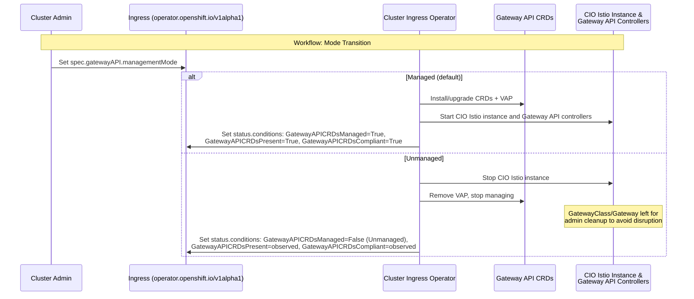

# Gateway API CRD Management Mode

## Summary

This enhancement introduces a new cluster-scoped singleton API
resource, `Ingress` (resource `ingresses`, singleton named
`cluster`), in the `operator.openshift.io/v1alpha1` group.

The resource exposes a `spec.gatewayAPI.managementMode` enum
field that controls how the Cluster Ingress Operator (CIO)
manages Gateway API CRDs, the CIO-managed Istio installation,
and the associated CIO Gateway API controllers (`gatewayapi`,
`gatewayclass`, `gateway-labeler`, `gateway-network-policy`,
`gateway-service-dns`, `gateway-status`, and other controllers
that may be added in the future).

Two modes are provided: `Managed` (default -- CIO owns everything,
controllers are enabled) and `Unmanaged` (CIO stops managing,
reports observational status only).

## Motivation

As established by the
[gateway-api-crd-life-cycle-management](gateway-api-crd-life-cycle-management.md)
and
[gateway-api-without-olm](gateway-api-without-olm.md)
enhancements, CIO owns the Gateway API CRDs, pins them to a
specific version, protects them with Validating Admission Policies
(VAPs), and upgrades them during cluster upgrades. This default
suits most customers but creates friction for:

1. **Third-party Gateway API implementations**: Customers using
   Envoy Gateway, Traefik, Kong, or other non-OpenShift controllers
   cannot install their own CRD versions because CIO owns and
   protects them.

2. **Development and testing**: Platform engineers who need newer CRD
   versions must fight the VAP and CIO reconciler.

3. **Supportability**: No API-level signal indicates who owns the
   CRDs or whether the current state is intentional.

### User Stories

#### Story 1: Third-Party Gateway Controller

As a cluster administrator, I want to disable OpenShift's Gateway API
CRD management and Gateway controller so that I can install and use a
third-party Gateway API implementation (such as Envoy Gateway or Kong)
without conflicts with CIO's CRD ownership or VAP protections.

#### Story 2: Determining CRD Ownership State

As a support engineer responding to a customer escalation, I want to
quickly determine who owns the Gateway API CRDs on a cluster and
whether the current CRD state matches the configured ownership mode
so that I can diagnose issues without needing to inspect labels,
annotations, and controller logs manually.

#### Story 3: Operational Monitoring

As a fleet administrator, I want to monitor Gateway API CRD ownership
state via standard OpenShift status conditions so that I can detect
clusters where CRD ownership is misconfigured or where CRDs have
drifted from the expected state.

### Goals

1. Provide a `managementMode` enum field on a new Ingress
   (`operator.openshift.io/v1alpha1`) singleton with two modes:
   `Managed` and `Unmanaged`.
2. Allow customers and third-party products to take full control of
   Gateway API CRDs without fighting CIO's reconciler or VAP.
3. Expose status conditions reporting CRD ownership mode, presence,
   and version compliance.
4. Preserve the current fully-managed behavior as the default,
   requiring no action from existing customers.
5. Define clear upgrade and downgrade semantics for mode transitions.

### Non-Goals

1. **CRD version ranges**: Each OCP version supports a specific
   Gateway API CRD version, not a version within a range.
2. **Automatic migration of third-party CRDs**: When switching from
   `Unmanaged` to `Managed`, CIO will not migrate third-party CRDs.
   The administrator must ensure compatibility before changing modes.
3. **MicroShift support**: MicroShift does not use CIO and is
   unaffected by this enhancement.
4. **Istio CRD management**: This enhancement controls only Gateway
   API CRDs (`gateway.networking.k8s.io`). Istio CRDs are handled
   by the sail-operator library as described in
   [gateway-api-without-olm](gateway-api-without-olm.md).

## Proposal

Introduce a new cluster-scoped singleton API resource in the
`operator.openshift.io/v1alpha1` group:

- **Kind**: `Ingress`
- **Resource**: `ingresses`
- **Scope**: Cluster (non-namespaced)
- **Singleton name**: `cluster`

The spec contains a `gatewayAPI` struct with a
`managementMode` enum.

CIO watches this resource and reads
`spec.gatewayAPI.managementMode` to determine its behavior:

- **Managed** (default): CIO installs, protects (via VAP), and
  upgrades Gateway API CRDs, runs the CIO-managed Istio instance,
  and runs the CIO Gateway API controllers (`gatewayapi`,
  `gatewayclass`, `gateway-labeler`, `gateway-network-policy`,
  `gateway-service-dns`, `gateway-status`, and others). This is
  the current behavior and the only fully supported configuration.

- **Unmanaged**: CIO does not install CRDs, does not run the
  CIO-managed Istio instance, and does not run the CIO Gateway
  API controllers (`gatewayapi`, `gatewayclass`, `gateway-labeler`,
  `gateway-network-policy`, `gateway-service-dns`, `gateway-status`,
  and others). The customer or a third-party product owns the
  CRDs and Gateway controller. CIO reports
  observational status only. This mode also serves as a signal
  to layered products that the installed CRDs may not be the
  ones supported by the OpenShift Gateway API implementation,
  and those products should adjust their behavior accordingly.

### Workflow Description

**Cluster administrator** is a human user responsible for managing
the OpenShift cluster and configuring ingress.

**CIO (Cluster Ingress Operator)** is the operator that reconciles
`ingresses.operator.openshift.io` resources and manages Gateway API components.

#### Workflow 1: Default Managed Mode (No Action Required)

1. The cluster administrator installs or upgrades OpenShift.
2. CIO reads the Ingress (`operator.openshift.io/v1alpha1`) `cluster`
   resource and observes that `spec.gatewayAPI.managementMode`
   is unset (defaults to `Managed`).
3. CIO deploys Gateway API CRDs, VAP, the CIO-managed Istio
   instance, GatewayClass, and Gateway resources as per the existing
   behavior.
4. CIO sets the following conditions in `status.conditions`:
   - `GatewayAPICRDsManaged=True` (reason: `ManagedByIngressOperator`)
   - `GatewayAPICRDsPresent=True`
   - `GatewayAPICRDsCompliant=True`
5. External consumers observe the conditions and proceed normally.

#### Workflow 2: Switching to Unmanaged Mode

1. The cluster administrator decides to use a third-party Gateway
   API implementation.
2. The cluster administrator edits the Ingress
   (`operator.openshift.io/v1alpha1`) `cluster` resource:
   ```yaml
   apiVersion: operator.openshift.io/v1alpha1
   kind: Ingress
   metadata:
     name: cluster
   spec:
     gatewayAPI:
       managementMode: Unmanaged
   ```
3. CIO detects the mode change and begins transition:
   a. Stops the CIO-managed Istio instance.
   b. Removes the VAP protecting Gateway API CRDs.
   c. Does **not** remove the GatewayClass, Gateway resources, or
      Gateway API CRDs. Removing these resources could cause
      disruptions to existing workloads served by these Gateways.
      The cluster administrator is responsible for cleaning up
      these resources if desired, for example once a third-party
      Gateway controller has taken over management.
   d. Leaves any proxy pods created as a result of Gateway
      provisioning in place, avoiding traffic disruption.
   e. Leaves resources previously created by CIO Gateway API
      controllers (like DNSRecord and NetworkPolicy for a
      previously managed Gateway) in place, unless the parent
      Gateway is also removed.
4. CIO sets the following conditions in `status.conditions`:
   - `GatewayAPICRDsManaged=False` (reason: `Unmanaged`)
   - `GatewayAPICRDsPresent=True/False` (observational)
   - `GatewayAPICRDsCompliant=True/False` (whether the
     installed CRDs match the version expected by the ingress
     operator)
5. The cluster administrator installs their third-party Gateway
   controller and optionally their own CRD version.
6. Layered products observe the `GatewayAPICRDsManaged=False`
   condition with reason `Unmanaged` and treat this as a signal
   that the installed CRDs may not be the ones supported by the
   OpenShift Gateway API implementation. They should adjust their
   behavior accordingly (e.g., not relying on specific CRD
   versions or fields).

#### Workflow 3: Returning to Managed Mode

1. The cluster administrator wants to return to the fully managed
   configuration.
2. The cluster administrator should ensure the existing Gateway API
   CRDs match the version CIO expects, or remove them entirely.
3. The cluster administrator edits the Ingress
   (`operator.openshift.io/v1alpha1`) `cluster` resource:
   ```yaml
   apiVersion: operator.openshift.io/v1alpha1
   kind: Ingress
   metadata:
     name: cluster
   spec:
     gatewayAPI:
       managementMode: Managed
   ```
4. CIO detects the mode change and begins transition.
   `GatewayAPICRDsManaged` remains `False` until CIO successfully
   takes ownership:
   a. If CRDs are absent, CIO installs them.
   b. If CRDs are present and match the expected version, CIO takes
      ownership (adds labels, deploys VAP) and sets
      `GatewayAPICRDsManaged=True`.
   c. If CRDs are present but do not match the expected version, CIO
      sets `GatewayAPICRDsCompliant=False` (in `status.conditions`)
      and does NOT overwrite them. `GatewayAPICRDsManaged` stays
      `False`. The administrator must resolve the mismatch before
      CIO can take ownership.
5. Once `GatewayAPICRDsManaged=True`, `GatewayAPICRDsPresent=True`,
   and `GatewayAPICRDsCompliant=True`, CIO starts the CIO-managed
   Istio instance and the CIO Gateway API controllers (`gatewayapi`,
   `gatewayclass`, `gateway-labeler`, `gateway-network-policy`,
   `gateway-service-dns`, `gateway-status`, and others). If any of
   these conditions is not `True`, the Istio instance and the CIO
   Gateway API controllers are not started, but the cluster is not
   marked as degraded and upgrades are not blocked.



### API Extensions

This enhancement introduces a **new CRD** in the
`operator.openshift.io/v1alpha1` group. The new resource follows a
singleton approach similar to the existing `DNS` cluster-scoped
singleton in `operator.openshift.io/v1`.

**Why a new resource** (see also Alternatives section):
`IngressController` is namespaced and multi-instance, so it
cannot hold a cluster-wide setting without conflicts.
`ingress.config.openshift.io` is owned by `config-operator` for
install-time configuration. A dedicated singleton in
`operator.openshift.io` follows the DNS pattern and provides a
clean extension point.

The proposed Go types are in a new file in `operator/v1alpha1/` in
the `openshift/api` repository (e.g.,
`types_ingress.go`):

```go
// +genclient
// +genclient:nonNamespaced
// +k8s:deepcopy-gen:interfaces=k8s.io/apimachinery/pkg/runtime.Object
//
// Ingress contains configuration options specific to the Ingress Operator itself.
//
// Compatibility level 4: No compatibility is provided, the API
// can change at any point for any reason. These capabilities
// should not be used by applications needing long-term support.
// +openshift:compatibility-gen:level=4
// +openshift:api-approved.openshift.io=<TBD>
// +openshift:file-pattern=cvoRunLevel=0000_50,operatorName=ingress,operatorOrdering=02
// +kubebuilder:object:root=true
// +kubebuilder:resource:path=ingresses,scope=Cluster
// +kubebuilder:subresource:status
// +openshift:capability=Ingress
type Ingress struct {
	metav1.TypeMeta `json:",inline"`

	// metadata is the standard object's metadata.
	metav1.ObjectMeta `json:"metadata,omitempty"`

	// spec holds user settable values for configuration.
	// +required
	Spec IngressSpec `json:"spec"`

	// status holds observed values from the cluster.
	// +optional
	Status IngressStatus `json:"status"`
}

type IngressSpec struct {
	// gatewayAPI holds configuration for Gateway API
	// integration, including how the ingress operator manages
	// Gateway API CRDs, the Istio instance it deploys, and its
	// Gateway API controllers.
	//
	// +required
	// +openshift:enable:FeatureGate=GatewayAPIManagementMode
	GatewayAPI GatewayAPIIngressConfig `json:"gatewayAPI"`
}

type IngressStatus struct {
	// observedGeneration is the last generation change you've dealt with
	// +optional
	ObservedGeneration int64 `json:"observedGeneration,omitempty"`

	// conditions is a list of conditions and their status.
	// Gateway API CRD management conditions are reported here
	// with the "GatewayAPI" prefix:
	//
	// "GatewayAPICRDsManaged" indicates whether the ingress operator is
	// actively managing Gateway API CRDs:
	//   - status: True, reason: "ManagedByIngressOperator" — the
	//     ingress operator is installing, protecting (via VAP), and
	//     upgrading CRDs.
	//   - status: False, reason: "Unmanaged" — the administrator
	//     chose Unmanaged mode, or a conflict prevents the ingress
	//     operator from taking control of the CRDs; the ingress
	//     operator does not manage CRDs or run the OpenShift
	//     Gateway API implementation.
	//
	// "GatewayAPICRDsPresent" indicates whether Gateway API CRDs
	// exist on the cluster:
	//   - status: True, reason: "CRDsFound" — Gateway API CRDs
	//     are present on the cluster.
	//   - status: False, reason: "CRDsNotFound" — Gateway API
	//     CRDs are not present on the cluster.
	//
	// "GatewayAPICRDsCompliant" indicates whether the installed
	// CRDs match the version expected by this ingress operator release:
	//   - status: True, reason: "VersionMatch" — installed CRDs
	//     match the expected version.
	//   - status: False, reason: "VersionMismatch" — installed
	//     CRDs do not match the expected version. The message
	//     includes expected and actual versions and a pointer
	//     to where valid manifests can be obtained.
	// +listType=map
	// +listMapKey=type
	// +optional
	Conditions []OperatorCondition `json:"conditions,omitempty"`
}
```

The `GatewayAPIIngressConfig` type:

```go
// GatewayAPIManagementMode describes how the Cluster Ingress
// Operator manages Gateway API Custom Resource Definitions.
//
// +kubebuilder:validation:Enum=Managed;Unmanaged
type GatewayAPIManagementMode string

const (
	// GatewayAPIManagementModeManaged means the ingress operator
	// installs, owns, protects (via VAP), and upgrades the Gateway
	// API CRDs, deploys the OpenShift Gateway API implementation,
	// and runs its Gateway API controllers. This is the default
	// mode and the only fully supported configuration.
	GatewayAPIManagementModeManaged GatewayAPIManagementMode = "Managed"

	// GatewayAPIManagementModeUnmanaged means the ingress operator
	// does NOT install or manage Gateway API CRDs, does NOT
	// deploy the OpenShift Gateway API implementation, and does
	// NOT run its Gateway API controllers. The customer or a
	// third-party product is responsible for bringing their own
	// CRDs and Gateway controller. The ingress operator reports
	// observational status only. This mode signals to layered
	// products that the installed CRDs may not be the ones
	// supported by the OpenShift Gateway API implementation.
	GatewayAPIManagementModeUnmanaged GatewayAPIManagementMode = "Unmanaged"
)

// GatewayAPIIngressConfig holds configuration for Gateway API
// integration in the Cluster Ingress Operator.
type GatewayAPIIngressConfig struct {
	// managementMode specifies how the Cluster Ingress
	// Operator manages Gateway API Custom Resource Definitions
	// (CRDs), the OpenShift Gateway API implementation, and its
	// Gateway API controllers.
	//
	// When set to "Managed" (the default), the ingress operator
	// installs, owns, and upgrades the Gateway API CRDs, protects
	// them with a Validating Admission Policy, and deploys the
	// OpenShift Gateway API implementation and its Gateway API
	// controllers. This is the only fully supported configuration.
	//
	// When set to "Unmanaged", the ingress operator does not
	// install or manage Gateway API CRDs and does not deploy the
	// OpenShift Gateway API implementation or its Gateway API
	// controllers. The cluster administrator or a third-party
	// product is responsible for providing their own CRDs and
	// Gateway controller.
	//
	// +kubebuilder:default:="Managed"
	// +default="Managed"
	// +required
	ManagementMode GatewayAPIManagementMode `json:"managementMode"`
}
```

The field paths are:

```
spec.gatewayAPI.managementMode
status.conditions
```

The following Gateway API conditions are set within
`status.conditions`:

| Condition Type | Status | Reason | Description |
|---|---|---|---|
| `GatewayAPICRDsManaged` | `True` | `ManagedByIngressOperator` | Ingress operator is actively managing CRDs |
| `GatewayAPICRDsManaged` | `False` | `Unmanaged` | Administrator chose Unmanaged mode, or a conflict prevents the ingress operator from taking control of the CRDs |
| `GatewayAPICRDsPresent` | `True` | `CRDsFound` | Gateway API CRDs are present on the cluster |
| `GatewayAPICRDsPresent` | `False` | `CRDsNotFound` | Gateway API CRDs are not present on the cluster |
| `GatewayAPICRDsCompliant` | `True` | `VersionMatch` | Installed CRDs match the expected version |
| `GatewayAPICRDsCompliant` | `False` | `VersionMismatch` | Installed CRDs do not match the expected version. Message includes the expected and actual versions. |

**API versioning note:** As a net-new API, this resource is
introduced at `v1alpha1` (`operator.openshift.io/v1alpha1`). It
will be promoted to `operator.openshift.io/v1` once the feature
reaches GA and graduates from the feature gate.

**Note:** This is a new CRD and must go through the full API
review process via `#forum-api-review`. The API approver must
review both this enhancement and the implementation PR in
`openshift/api`.

### Topology Considerations

#### Hypershift / Hosted Control Planes

Same semantics as standalone clusters. The Ingress Operator runs
on the management cluster but manages resources on the guest
cluster. The mode is configured per-guest-cluster and does not
affect the management cluster.

#### Standalone Clusters

Primary topology. Both modes apply with no special considerations.

#### Single-node Deployments or MicroShift

**SNO**: No additional resource concerns. `Unmanaged` mode allows
disabling the CIO-managed Istio instance and CIO Gateway API
controllers to reclaim resources.

**MicroShift**: Not affected. MicroShift does not use CIO (see
[MicroShift Gateway API Support](../microshift/gateway-api-support.md)),
and the new `Ingress` (`operator.openshift.io/v1alpha1`) resource
should not be installed on it.

#### OpenShift Kubernetes Engine

Both modes are available on OKE. However, Gateway API support on
OKE depends on the
[gateway-api-without-olm](gateway-api-without-olm.md) enhancement
which eliminates OSSM licensing concerns. Given the desire to
backport this management mode feature to OCP 4.18, OKE enablement
depends on whether `gateway-api-without-olm` is also backported
to the same version. If that enhancement is not backported, OKE
support for this feature is limited to the OCP version where
`gateway-api-without-olm` is first available.

### Implementation Details/Notes/Constraints

#### Feature Gate

New feature gate: `GatewayAPIManagementMode`, added to
`TechPreviewNoUpgrade` in
[features.go](https://github.com/openshift/api/blob/master/features/features.go).

The `gatewayAPI` field uses the
`+openshift:enable:FeatureGate=GatewayAPIManagementMode` marker
so it only appears in CRDs when the gate is enabled.

#### Interaction with the GatewayAPI Feature Gate

The `managementMode` field only takes effect when Gateway API is
enabled. On OCP versions before 4.22, Gateway API controllers are
gated behind the `GatewayAPI` feature gate, so `managementMode`
also requires that gate to be enabled. Starting with OCP 4.22,
Gateway API is available by default and this requirement no
longer applies.

#### CIO Controller Changes

The CIO controllers that manage the Gateway API feature (`gatewayapi`,
`gatewayclass`, `gateway-labeler`, `gateway-network-policy`,
`gateway-service-dns`, `gateway-status`, and others) are deactivated
in `Unmanaged` mode.

#### Istio and Gateway API Controllers Start Condition

CIO starts the CIO-managed Istio instance and the CIO Gateway API
controllers only when all three of the following conditions are
`True` in `status.conditions`:

- `GatewayAPICRDsManaged=True`
- `GatewayAPICRDsPresent=True`
- `GatewayAPICRDsCompliant=True`

If any of these conditions is not `True` (e.g., during a transition
back to `Managed` where CRDs are non-compliant, or while CIO is
installing CRDs), the Istio instance and CIO Gateway API
controllers are not started. This is not a degraded state: these
conditions do not contribute to the
operator's `Degraded` status condition and do not block cluster
upgrades. They are informational signals about Gateway API CRD
readiness.

#### VAP Management

The VAP protecting Gateway API CRDs is deployed only in `Managed`
mode. When transitioning away from `Managed`, the VAP must be
removed first to avoid leaving CRDs locked.

#### CRD Validity Definition

A Gateway API CRD is considered **compliant** when:

1. **Strict version match**: The CRD's
   `gateway.networking.k8s.io/bundle-version` annotation matches
   the exact Gateway API version that CIO expects (e.g.,
   `v1.2.1`). Version ranges are not supported (see Non-Goals).

2. **Semantic verification**: The CRDs are compared against the
   expected schema using
   `"k8s.io/apimachinery/pkg/api/equality".Semantic.DeepEqual`.

When CRDs are non-compliant, CIO reports the mismatch in the
`GatewayAPICRDsCompliant` condition message, including expected vs. actual
versions and where to obtain valid manifests. Valid CRD manifests
are available from:
- The `cluster-ingress-operator` container image in the OpenShift
  release payload, at `/gateway-api-manifests/` (see Support
  Procedures for an extraction example).
- The upstream Gateway API release at
  `https://github.com/kubernetes-sigs/gateway-api/releases`.

#### Dockerfile Change to Bundle CRD Manifests

The `cluster-ingress-operator` Dockerfile must be updated to copy
the Gateway API CRD manifests into `/gateway-api-manifests/` in
the built image, so that the exact CRD manifests CIO expects can
be retrieved directly from the release payload (see Support
Procedures) instead of only from the upstream Gateway API release.

#### Mode Transition Ordering

When transitioning between modes, CIO must follow a specific order
to avoid leaving the cluster in an inconsistent state:

- **Managed to Unmanaged**: Remove VAP, stop CRD management, shut
  down the CIO-managed Istio instance and the CIO Gateway API
  controllers. GatewayClass and Gateway resources are left in
  place; administrator is responsible for cleanup.
- **Unmanaged to Managed**: Verify CRDs match expected version (or
  are absent), install CRDs if absent, deploy VAP, start the
  CIO-managed Istio instance and the CIO Gateway API controllers.

#### Long-Term: Unknown Field Management

The "unknown fields" problem (CRDs containing fields the controller
does not recognize) is tracked upstream in
[gateway-api#3624](https://github.com/kubernetes-sigs/gateway-api/issues/3624).
This enhancement provides the management mode infrastructure that future
work (unknown field detection, compatibility checks) can build on.
Unknown field management is out of scope for this enhancement.

#### Future Work on the Ingress Resource

The new Ingress (`operator.openshift.io/v1alpha1`) resource is designed
to accommodate future configuration beyond `managementMode`:

1. **GatewayClass customization**: The `gatewayAPI` struct can be
   extended to allow administrators to define additional OpenShift
   GatewayClasses in a structured way -- specifying service type,
   resource allocation for Envoy proxies, and other per-class
   parameters. This would replace the current model where only a
   single default GatewayClass is created by CIO.

2. **Operator and operand logging levels**: `OperatorSpec` (which
   includes `logLevel` for operands and `operatorLogLevel` for the
   operator) is not embedded in `IngressSpec` today, but could be
   added if the logging level controls originally proposed in
   [ingress-operator-operand-logging-level](ingress-operator-operand-logging-level.md)
   are implemented on this resource, providing a supported API for
   adjusting CIO and Gateway controller verbosity.

These are out of scope for this enhancement.

### Risks and Mitigations

#### Risk: Orphaned Resources During Mode Transition

Switching to `Unmanaged` leaves GatewayClass, Gateway, and
HTTPRoute resources without a managing controller.

Additionally, child resources created as a result of a previously
managed Gateway (such as Deployment, DNSRecord, and NetworkPolicy)
are not removed and must be cleaned up by the user. Deleting the
parent Gateway will cascade-delete any of these resources that
carry an `ownerReference` back to the Gateway or one of its
subresources (e.g., DNSRecord is owned by the Service created for
the Gateway, which is itself owned by the Gateway), via standard
Kubernetes garbage collection.

**Mitigation**: CIO preserves all Gateway API resources during
transitions to avoid disruption. The administrator is responsible
for cleanup. Documentation must state this clearly.

#### Risk: Incompatible Mode Transition

Switching to `Managed` may fail if existing CRDs do not match the
expected version.

**Mitigation**: CIO verifies CRD compliance before taking
ownership. If incompatible, CIO sets `GatewayAPICRDsCompliant=False` and
does not overwrite. The administrator must resolve the mismatch.

#### Risk: Security Implications of Removing VAP

In `Unmanaged` mode, the VAP is removed, allowing any actor with
CRD RBAC to modify Gateway API CRDs.

**Mitigation**: Explicit trade-off. Standard Kubernetes RBAC still
applies. Documentation must state that VAP protection is removed.

### Drawbacks

Increased CIO complexity: two behavioral modes with different
controller enable/disable states and mode transition logic. This is
justified by customer demand -- the alternative is customers
fighting the VAP and CRD reconciler.

## Open Questions

1. **Telemetry**: What telemetry should be collected? At minimum
   the configured mode, CRD version, and OSSM version. Should CIO
   also report metrics for CRD compliance and mode transitions?

2. **Singleton creation**: Should the `cluster` singleton instance
   be created by CVO (via a manifest in the release payload) or
   by CIO on first startup? This affects upgrade behavior and
   needs alignment with the operator pattern used by DNS/Console.

## Test Plan

<!-- TODO: Tests must include the following labels per
dev-guide/feature-zero-to-hero.md:
- [OCPFeatureGate:GatewayAPIManagementMode] for the feature gate
- [Jira:"Networking / ingress"] for the component
- Appropriate test type labels: [Serial], [Slow], [Disruptive]
  as needed
- Reference dev-guide/test-conventions.md for details -->

Testing strategy covers unit tests, integration tests, and e2e tests
for each management mode and mode transitions.

### Unit Tests

- Validation of the `managementMode` field (valid enum values,
  defaulting behavior).
- Status condition computation logic for each mode.
- Controller enable/disable logic based on mode.

### Integration Tests

- CRD management controller behavior in each mode.
- VAP deployment and removal during mode transitions.
- Status condition updates during mode transitions.

### E2E Tests

The following e2e test scenarios are required:

1. **Managed mode (default)**: Verify that a new cluster has CRDs
   installed, VAP deployed, and the CIO-managed Istio instance
   and CIO Gateway API controllers running. Verify
   `GatewayAPICRDsManaged=True`, `GatewayAPICRDsPresent=True`, and
   `GatewayAPICRDsCompliant=True`.

2. **Transition to Unmanaged**: Set mode to `Unmanaged`. Verify
   that the CIO-managed Istio instance is stopped, the VAP is
   removed, and CRDs, GatewayClass, and Gateway resources are
   preserved. Verify `GatewayAPICRDsManaged=False` with reason
   `Unmanaged`. Verify a third-party GatewayClass can be created.

3. **Return to Managed**: From `Unmanaged`, return to `Managed`.
   Verify CIO takes ownership of compatible CRDs, or reports
   `GatewayAPICRDsCompliant=False` for mismatched CRDs.

4. **Unmanaged mode with absent CRDs**: Set mode to `Unmanaged` on
   a cluster with no Gateway API CRDs. Verify CIO does not install
   CRDs and reports `GatewayAPICRDsPresent=False`.

5. **Upgrade with non-default mode**: Upgrade a cluster that has
   `Unmanaged` mode set. Verify the mode is preserved and CIO does
   not attempt to take over CRDs during upgrade.

## Graduation Criteria

<!-- TODO: Promotion requirements per
dev-guide/feature-zero-to-hero.md:
- Minimum 5 tests
- 7 runs per week
- 14 runs per supported platform
- 95% pass rate
- Tests running on all supported platforms
  (AWS, Azure, GCP, vSphere, Baremetal with IPv4/IPv6/Dual) -->

### Dev Preview -> Tech Preview

- Feature gate `GatewayAPIManagementMode` added to
  `TechPreviewNoUpgrade` feature set.
- `Managed` and `Unmanaged` modes fully functional.
- Status conditions implemented and observable.
- Unit and integration tests passing.
- Initial e2e tests for basic mode transitions.
- End user documentation for Tech Preview.

### Tech Preview -> GA

- All e2e test scenarios passing consistently (95%+ pass rate).
- Upgrade and downgrade testing with mode transitions validated.
- Mode transition edge cases tested (e.g., incompatible CRDs,
  missing CRDs).
- Telemetry for management mode implemented and reporting.
- Load testing with mode transitions under concurrent operations.
- User-facing documentation created in
  [openshift-docs](https://github.com/openshift/openshift-docs/).
- Feature gate promoted to `Default` feature set.
- API promoted from `operator.openshift.io/v1alpha1` to
  `operator.openshift.io/v1`.
- Sufficient time for customer feedback (at least one minor
  release in Tech Preview).

### Backport to OCP 4.18

The official backport target is OCP 4.18. Without this backport,
customers on 4.18 with third-party Gateway API CRDs face CRD
succession conflicts when upgrading, because CIO enforces
ownership with no opt-out. Backporting lets customers set
`Unmanaged` before upgrading.

**SBAR exception process**: Backporting a new CRD to a released
version requires SBAR (Situation, Background, Assessment,
Recommendation) with architect approval. The SBAR must justify
the backport (customer upgrade path continuity) and demonstrate
bounded risk.

Backport scope:
- Ingress CRD manifest for `operator.openshift.io/v1alpha1` (CVO).
- `gatewayAPI` spec/status structs with both enum values.
- `status.conditions` Gateway API condition reporting.
- Feature gate `GatewayAPIManagementMode` (initially behind
  `TechPreviewNoUpgrade`, then `GA` once the E2E requirements pass).
- CIO controller changes.

**E2E requirements**: 95%+ pass rate, 7 runs/week on supported
platforms.

The backport does not change CRD succession logic from
[gateway-api-crd-life-cycle-management](gateway-api-crd-life-cycle-management.md).
It adds the opt-out mechanism on top of existing behavior.

### Removing a deprecated feature

Not applicable. This enhancement adds new functionality.

## Upgrade / Downgrade Strategy

### Upgrade

When upgrading from a version that does not have the Ingress
(`operator.openshift.io/v1alpha1`) resource to one that does (e.g.,
upgrading from 4.17 to 4.18 with the backport applied):

- CVO installs the new Ingress CRD. The `cluster` singleton is
  created with `spec.gatewayAPI.managementMode` defaulting to
  `Managed`, preserving existing behavior. No action is required
  from the cluster administrator.
- Existing clusters with CIO-managed CRDs continue to work
  identically.

When upgrading a cluster that has a non-default mode set (e.g.,
upgrading from 4.19 to 4.20+ with mode already configured):

- **Unmanaged mode**: CIO does not attempt to install or manage
  CRDs during the upgrade. The administrator's third-party CRDs
  are preserved.

### Downgrade

When downgrading from a version that has the Ingress
(`operator.openshift.io/v1alpha1`) resource to one that does not:

- The Ingress CRD and `cluster` singleton persist on the cluster
  (CRDs are not removed during rollbacks), but the older CIO does
  not watch this resource. It has no effect.
- The older CIO behaves as `Managed` (its only behavior) and
  attempts to install and manage Gateway API CRDs.
- **If the cluster was in `Unmanaged` mode**: The downgraded CIO
  will attempt to install CRDs and deploy the Istio instance and
  Gateway API controllers. If third-party CRDs are present, the
  existing CRD management succession logic (from
  [gateway-api-crd-life-cycle-management](gateway-api-crd-life-cycle-management.md))
  applies.

**Recommendation**: Set mode to `Managed` and ensure CRD
compatibility before downgrading.

## Version Skew Strategy

During upgrade, CIO may start before CVO creates the Ingress CRD.
CIO treats the absence as `Managed` mode (existing behavior). The
field is consumed only by CIO and requires no cross-component
coordination.

## Operational Aspects of API Extensions

Operational impact is minimal -- one additional cluster-scoped
resource read during CIO reconciliation.

- **SLIs**: `status.conditions` (`GatewayAPICRDsManaged`,
  `GatewayAPICRDsPresent`, `GatewayAPICRDsCompliant`).

- **Failure modes**:
  - VAP removal failure during mode transition: CRDs remain locked.
    CIO retries and reports in status.

- **Escalation**: Networking / Ingress team. For Istio CRD
  interactions, consult the OSSM team.

## Support Procedures

### Detecting the Current Mode

```bash
oc get ingress.operator.openshift.io cluster \
  -o jsonpath='{.spec.gatewayAPI.managementMode}'
```

### Checking CRD Management Status

```bash
oc get ingress.operator.openshift.io cluster \
  -o jsonpath='{.status.conditions}' | \
  jq '.[] | select(.type | startswith("GatewayAPI"))'
```

### Common Issues

**Symptom**: `GatewayAPICRDsCompliant=False` in `status.conditions`
after switching to `Managed` mode.

**Diagnosis**: The existing CRDs do not match the expected version.
Check the condition message for the expected and actual versions.

**Resolution**: Either upgrade the CRDs to the expected version or
remove them and let CIO reinstall them. Valid CRD manifests can be
extracted from the `cluster-ingress-operator` container image in
the cluster's current release payload (Gateway API CRD manifests
are bundled at `/gateway-api-manifests/` in that image), or
obtained from the upstream Gateway API release at
`https://github.com/kubernetes-sigs/gateway-api/releases` matching
the expected version shown in the condition message.

```bash
# Check expected version from condition message
oc get ingress.operator.openshift.io cluster \
  -o jsonpath='{.status.conditions}' | \
  jq '.[] | select(.type=="GatewayAPICRDsCompliant")'

# Authenticate to the release image registry using the cluster's
# pull secret
oc get secret/pull-secret -n openshift-config \
  -o jsonpath='{.data.\.dockerconfigjson}' | base64 -d > pull-secret.json

# Extract the Gateway API CRD manifests from the
# cluster-ingress-operator image in the cluster's current
# release payload
CIO_IMAGE=$(oc adm release info --image-for=cluster-ingress-operator \
  --registry-config=pull-secret.json)
oc image extract "${CIO_IMAGE}" --registry-config=pull-secret.json \
  --path /gateway-api-manifests/:./gateway-api-manifests --confirm

# Apply the extracted CRDs to upgrade to the expected version
oc apply -f ./gateway-api-manifests/

# Alternatively, remove CRDs to let CIO reinstall (WARNING: this
# deletes all Gateway, HTTPRoute, and other Gateway API resources)
oc delete crd \
  gatewayclasses.gateway.networking.k8s.io \
  gateways.gateway.networking.k8s.io \
  httproutes.gateway.networking.k8s.io \
  referencegrants.gateway.networking.k8s.io \
  grpcroutes.gateway.networking.k8s.io \
  backendtlspolicies.gateway.networking.k8s.io
```

## Alternatives (Not Implemented)

### Alternative 1: ControllersOnly Mode (Controller without CRD Management)

A third mode, `ControllersOnly`, was considered where CIO would not
manage Gateway API CRDs but would still run the CIO-managed Istio
instance and CIO Gateway API controllers. The customer would bring
their own CRDs. This would have been an explicitly unsupported
configuration intended for development and testing with newer CRD
versions.

This mode was removed from the proposal due to a lack of evidence
that it would be used in practice. The primary customer need is to
opt out of CIO's CRD management entirely (to use a third-party
controller), which `Unmanaged` mode addresses. Running the OpenShift
controller against arbitrary externally-provided CRDs introduces
significant compatibility risks (unknown fields, schema mismatches)
with limited benefit. This decision will be revisited if customer
demand or concrete use cases emerge.

### Alternative 2: Boolean Gateway API Disable Switch

Prohibited by OpenShift API conventions (no boolean fields in CRDs).
Also does not provide the observability benefits of the enum pattern.

### Alternative 3: Modify `ingress.config.openshift.io/cluster`

That resource is owned by `config-operator` for install-time
configuration (base domain, HSTS policies, component routes).
Gateway API operational behavior belongs in `operator.openshift.io`.

### Alternative 4: Annotation-Based Configuration

Lacks validation, defaulting, and discoverability. Not visible in
`oc describe` as structured fields.

### Alternative 5: Separate `GatewayAPIConfig` CRD

Adds unnecessary complexity. CRD management is an ingress operator configuration,
so the Ingress resource in `operator.openshift.io/v1alpha1` is a more
natural home.

### Alternative 6: Per-CRD Management Granularity

Per-CRD modes (e.g., manage GatewayClass CRD but not HTTPRoute)
add significant complexity for minimal benefit. In practice, CRDs
are managed as a cohesive set or not at all.

## Infrastructure Needed

No new infrastructure is required for this enhancement.
