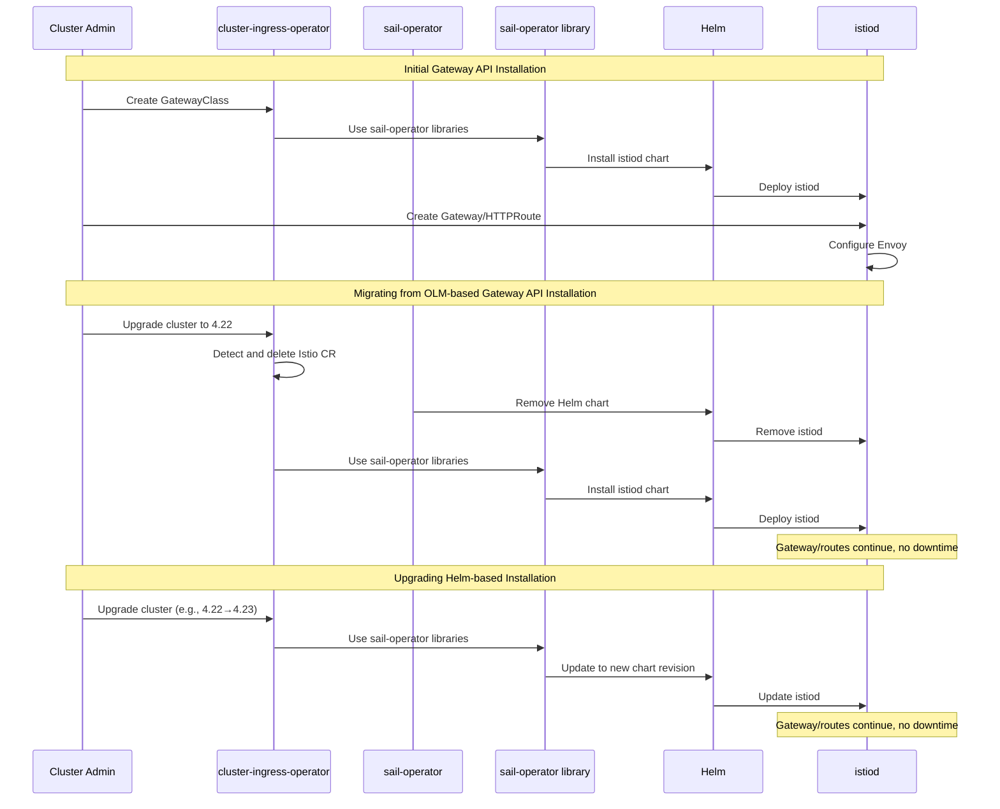

# Gateway API without OLM

This enhancement describes changes to the cluster-ingress-operator to remove
the dependency on OLM and the sail-operator by installing istiod directly
using Helm charts while leveraging libraries provided by the sail-operator
project.

## Summary

The cluster-ingress-operator currently installs OpenShift Service Mesh (OSSM)
via an OLM Subscription to provide Gateway API support. This enhancement
proposes replacing the OLM-based installation with a direct Helm chart
installation using shared library code from the sail-operator project. This
eliminates dependencies on both OLM and the sail-operator deployment for
Gateway API, avoids conflicts with existing OSSM subscriptions, and enables
Gateway API on clusters without OLM/Marketplace capabilities.

## Motivation

The current OLM-based approach for installing OSSM to support Gateway API
presents several challenges that impact both cluster administrators and the
engineering team's ability to deliver Gateway API features.

When the cluster-ingress-operator creates an OLM Subscription to install
sail-operator, it takes ownership of and overwrites any existing
OSSM subscription, potentially disrupting existing service mesh
installations managed by cluster administrators. Additionally, clusters
without OLM/Marketplace capabilities cannot enable Gateway API at all.

The OLM dependency also increases operational complexity and resource
consumption. The ingress operator must manage Subscriptions and InstallPlans,
while the multi-layer architecture (OLM → sail-operator → istiod) makes
troubleshooting more difficult. The sail-operator deployment adds unnecessary
overhead when service mesh capabilities aren't needed.

### User Stories

#### Story 1: Cluster Admin with Existing OSSM Installation

As a cluster admin who has already installed OpenShift Service Mesh via OLM
for service mesh use cases, I want to enable Gateway API for ingress without
conflicts, so that I can use both mesh and Gateway API features on the same
cluster without subscription conflicts or installation failures.

#### Story 2: Cluster Admin on Restricted Environment

As a cluster admin managing a cluster without OLM and Marketplace capabilities
enabled, I want to use Gateway API for ingress, so that I can leverage modern
ingress capabilities without requiring OLM infrastructure.

#### Story 3: Platform Engineer

As a platform engineer maintaining Gateway API, I want to install and upgrade
istiod directly without managing OLM Subscriptions and InstallPlans, so that
I have fewer components to coordinate and the system is more predictable.

### Goals

- Remove the dependency on OLM for installing istiod for Gateway API support.
- Enable Gateway API on clusters without OLM and Marketplace capabilities.
- Avoid conflicts with existing OSSM subscriptions created by cluster
  administrators.
- Support seamless upgrade from OLM-based installation (4.21) to Helm-based
  installation (4.22).
- Preserve the current user-facing Gateway API experience, excluding issues
  caused by the OLM-based installation mechanism.
- Reduce component dependencies and engineering complexity.
- Reduce resource overhead by eliminating the sail-operator deployment when
  service mesh is not needed.
- Enable Gateway API on OKE clusters, which do not include OSSM licensing.

### Non-Goals

- Affecting service mesh use cases or OSSM installations created by cluster
  admins for mesh purposes.
- Adding new Gateway API features beyond what is currently supported.
- Making OSSM a core operator bundled in the OpenShift release payload (though
  this may be reconsidered in the future).
- Enabling day 0 installation for this enhancement. This is not in scope for
  this EP but is not precluded for future enhancements.
- Including istiod and envoy images in the OCP release payload. Images will
  initially be pulled from registry.redhat.io. Custom image sources and image
  mirroring are out of scope for this enhancement.
- Accelerating OSSM release availability. This enhancement still depends on
  OSSM production images being released.
- Changing the control plane architecture. istiod will continue to run in the
  openshift-ingress namespace with the same configuration.

## Proposal

The cluster-ingress-operator will transition from creating an OLM Subscription
to installing istiod directly using Helm charts. This will be accomplished by
leveraging libraries provided by the sail-operator project.

**Note**: Throughout this document, "Helm-based installation" refers to the
cluster-ingress-operator using sail-operator libraries to install istiod
directly, as opposed to "OLM-based installation" where OLM manages a
sail-operator deployment which then installs istiod. Both approaches ultimately
use Helm charts; the distinction is in the management layer.

### High-Level Changes

The cluster-ingress-operator will make the following changes:

1.  **Install istiod Directly via Helm**: Leverage libraries from the
    sail-operator project to install istiod programmatically with
    gateway-api configurations.

2.  **Upgrade Migration**: Detect when upgrading from an OLM-based
    installation (4.21) to Helm-based (4.22), delete the `Istio` CR in order to
    remove the control-plane (istiod) while leaving the data plane (Envoy)
    operational, wait for sail-operator cleanup, then re-install the
    control-plane via Helm with no data-plane downtime.

### Workflow Description

From the user's perspective, the workflow for enabling and using Gateway API
remains unchanged. The implementation details of how istiod is installed differ
from previous releases.

#### Initial Gateway API Installation

This workflow applies when Gateway API is being enabled for the first time on a
4.22+ cluster (no existing `Istio` CR from prior Gateway API enablement).

1.  Cluster admin creates a `GatewayClass` with
    `spec.controllerName: openshift.io/gateway-controller/v1`.
2.  The cluster-ingress-operator's gatewayclass-controller detects the
    new `GatewayClass` owned by OpenShift.
3.  The controller uses sail-operator libraries to install istiod via
    Helm.
4.  Cluster admin creates `Gateway` and `HTTPRoute` resources as before.

#### Migrating from OLM-based Gateway API Installation

This workflow applies when upgrading from 4.21 to 4.22 on a cluster where Gateway
API was previously enabled via OLM (existing `Istio` CR detected).

1.  Cluster admin initiates cluster upgrade to 4.22+.
2.  The upgraded cluster-ingress-operator detects the existing OLM-based
    installation and deletes the `Istio` CR.
3.  The sail-operator removes its Helm chart and istiod installation.
4.  The cluster-ingress-operator installs istiod using sail-operator
    libraries via Helm.
5.  Existing `Gateway` and route resources continue functioning with no data
    plane downtime.

#### Upgrading Helm-based Installation

This workflow applies when upgrading a 4.22+ cluster that already has
Helm-based Gateway API installed.

1.  Cluster admin initiates cluster upgrade (e.g., 4.22 to 4.23).
2.  The upgraded cluster-ingress-operator detects the existing Helm-based
    installation.
3.  The cluster-ingress-operator updates the Helm chart to a new revision
    using sail-operator libraries.
4.  Existing `Gateway` and route resources continue functioning with no data
    plane downtime.



### API Extensions

This enhancement does not introduce new CRDs or API extensions.

### Topology Considerations

#### Hypershift / Hosted Control Planes

This enhancement applies to Hypershift with no additional considerations beyond
existing Gateway API support. The Gateway API control plane (istiod) and data
plane (Envoy) both run on the guest cluster, so there is no operational
difference for this feature between standalone OpenShift and Hypershift.

#### Standalone Clusters

This enhancement applies to standalone clusters with no additional
considerations beyond existing Gateway API support.

#### Single-node Deployments or MicroShift

This enhancement reduces resource consumption on single-node deployments by
eliminating the sail-operator deployment.

MicroShift (which has Gateway API support since 4.18) could benefit from the
sail-operator library's Helm chart vendoring approach to simplify their
build-time manifest generation and reduce resource consumption by eliminating
the sail-operator deployment. However, MicroShift does not use
cluster-ingress-operator, so this enhancement does not directly affect it.

#### OpenShift Kubernetes Engine

This enhancement enables the use of the Gateway API controller on OKE by
eliminating OSSM licensing concerns. OKE does not include OSSM licensing, so
the current OLM-based approach cannot be used on OKE clusters.

### Implementation Details/Notes/Constraints

#### Helm Chart Vendoring

The Helm charts are included in the sail-operator library as embedded
resources. By vendoring the sail-operator library via `go.mod`, the
cluster-ingress-operator gets the charts as well, which are embedded in the
binary and can be used directly by the sail-operator libraries.

The process works as follows:
1. Add the sail-operator library dependency to `go.mod`, which vendors the
   library including its embedded Helm charts.
2. Use sail-operator library functions to install istiod, which access the
   embedded charts from the vendored library.
3. No external chart files are needed at runtime.

This approach ensures charts are version controlled and synchronized via Go
vendoring, eliminating drift between the Helm charts and the Istio version they
deploy. When the sail-operator library version is updated in `go.mod`, the Helm
charts are automatically synchronized with the corresponding Istio version.

#### Component Versioning

OpenShift releases remain linked to OSSM releases through the vendored
sail-operator library. Each OCP release uses a specific OSSM version
(e.g., OCP 4.22 uses sail-operator library from OSSM 3.3.0). This enhancement
changes the installation mechanism from OLM to Helm, but does not change the
version alignment between OCP and OSSM releases.

#### Image Management

Images will be sourced as follows:
- **Initially**: Pull from registry.redhat.io using the same image references
  that OLM currently uses. This enhancement does not change which container
  images are used or which image registry they are pulled from.
- **Future**: Incorporate images into the OCP release payload to support
  disconnected/offline installations. This will require coordination with the
  ART team.

The operator will provide a mechanism to override image references in the Helm
chart values for the purpose of prerelease testing with unreleased istiod and
Envoy images. Image mirroring for disconnected environments is not supported
in this initial implementation and remains out of scope for this enhancement.

#### Upgrade Detection and Migration

The operator will detect OLM-based installations by checking for an existing
`Istio` CR created by cluster-ingress-operator.

Migration steps:
1. Detect and delete the existing `Istio` CR created by cluster-ingress-operator.
2. Wait for the sail-operator to delete all Helm chart resources (istiod
   deployment, services, etc.).
3. Install istiod using the operator's Helm-based approach.
4. Verify istiod is running and healthy.

**Downtime Characteristics**:
- Brief istiod control plane downtime during the transition.
- No data plane downtime occurs during the transition. `Gateway` pods may roll
  out due to the new istiod version, but this is a standard rolling update.

**Note**: The sail-operator deployment will NOT be removed during upgrade. If a
cluster admin has installed sail-operator separately for service mesh use cases,
it will remain in place and continue operating independently.

**Migration Timeline**: This migration logic is only required for the 4.21 to
4.22 upgrade. Once a cluster is on 4.22+, any Gateway API installation will
already be Helm-based. The migration code can be removed in a future release
(e.g., 4.23+) once 4.21 is no longer supported.

#### Object Watching and Reconciliation

The gatewayclass-controller is now responsible for watching and reconciling all
objects created by the istiod Helm chart. The sail-operator library may provide
controller logic in the future to help manage these objects and reduce the
maintenance burden.

#### RBAC Changes

The cluster-ingress-operator's `ClusterRole` has been extended to include
permissions for all resources required to install and manage istiod via Helm,
including webhook configurations, Istio API groups, and coordination resources.

### Risks and Mitigations

#### Risk: YAML/Chart Drift

**Description**: If the cluster-ingress-operator's Helm charts fall out of
sync with the sail-operator/OSSM team's charts, incompatibilities may arise.

**Mitigation**: Use `go.mod` to vendor charts from the sail-operator
repository. Upgrade tests will validate compatibility between versions.

#### Risk: Istio Control Plane Protocol Changes

**Description**: If the Istio version changes during upgrade from 4.21 to 4.22,
the old Envoy proxy pods may be unable to communicate with the new istiod
control plane due to protocol changes (e.g., new authentication mechanisms,
updated xDS protocol, or configuration format changes).

**Mitigation**: This is a pre-existing risk that exists in the current
sail-operator upgrade process. Istio documents that the control plane can be
one version ahead of the data plane, requiring backwards compatibility during
upgrades. Regardless, the gateway deployment should roll out when istiod updates,
as the new istiod version will reference a new proxy image. This ensures Envoy
proxies are updated alongside the control plane, preventing communication issues.

#### Risk: Resource Drift or Deletion

**Description**: If Helm-managed resources (such as the istiod `Deployment`)
are deleted or modified outside of the operator's control, they will not be
automatically reconciled since sail-operator is not running.

**Mitigation**: The gatewayclass-controller will watch and reconcile all
Helm-managed resources. See [Object Watching and
Reconciliation](#object-watching-and-reconciliation) for details.

#### Risk: Future Sail Operator Feature Requirements

**Description**: If future Istio features require additional sail-operator
functionality beyond what the vendored libraries provide, the
cluster-ingress-operator would need to either implement that functionality
itself (increasing maintenance burden) or migrate back to using the
sail-operator deployment (wasting effort).

**Mitigation**: The Sail Operator itself is being refactored to use the exact
same sail library logic that CIO will use, so this risk is mitigated by design.
Any functionality required by sail-operator will be available in the shared
library. Additionally, monitor sail-operator development and engage with the
OSSM team early when new features are planned.

#### Risk: Sail-Operator Library Dependency

**Description**: Consuming the sail-operator library creates a dependency on
library completion for the initial 4.22 implementation.

**Mitigation**: Maintain close collaboration with the OSSM team on delivery
timelines for 4.22.

### Drawbacks

- **Maintenance Burden**: While the sail-operator library provides Helm
  installation logic, the cluster-ingress-operator is a direct consumer and
  remains in the path of responsibility.
- **Increased Testing Burden**: The NID team must test the 4.21 to 4.22 migration
  and add E2E tests for vendored sail-operator library integration (e.g.,
  istiod deployment reconciliation). While the library provides the logic,
  CIO must verify correct usage.
- **Potential Conflict with Future Plans**: If OSSM becomes a core operator,
  this approach may need to be reworked.
- **Pre-release Testing Workflow Complexity**: Pre-release testing requires both
  vendoring the new sail-operator library (go.mod update to obtain updated Helm
  charts) and providing pre-release istiod/envoy images. This is more complex
  than the current approach which only requires overriding a single
  sail-operator image. Vendor bumps may require code changes, making fully
  automated pre-release testing more difficult. The existing
  `e2e-aws-pre-release-ossm` job will likely break when this enhancement is
  rolled out and will need to be redesigned or replaced.

## Alternatives (Not Implemented)

### Alternative 1: Keep OLM-Based Approach

Continue using the current OLM-based approach where the cluster-ingress-operator
creates an OSSM Subscription, and OLM manages the sail-operator deployment which
installs istiod. This is the status quo / no-change approach.

**Pros**:
- No implementation changes required.
- Sail-operator handles all istiod installation, upgrade, and lifecycle
  complexity, avoiding the maintenance burden, testing burden, and CRD
  management complexity of the direct Helm approach.

**Cons**:
- Does not address conflicts with existing OSSM subscriptions.
- Does not enable Gateway API on clusters without OLM/Marketplace.
- Does not simplify the process for testing and releasing Gateway API updates.
- Higher resource consumption (sail-operator deployment).

**Reason Not Chosen**: Does not solve the core problems this enhancement
addresses.

### Alternative 2: Use Existing Sail-Operator Libraries Without Enhancements

The cluster-ingress-operator would use the sail-operator Helm chart manager
libraries as they exist today, without waiting for the OSSM team to enhance them
for this use case. This achieves the same architectural outcome as the chosen
approach (Helm-based istiod installation), but differs in implementation details.

**Pros**:
- No dependency on OSSM team timeline or library enhancements for 4.22.

**Cons**:
- Higher maintenance burden as ingress operator must implement additional
  functionality around the basic libraries that enhanced libraries would provide.
- More duplicative code between ingress operator and sail-operator implementations.

**Reason Not Chosen**: Coordinating with the OSSM team on library enhancements
reduces long-term duplicative work and maintenance burden. The enhanced libraries
will also benefit other OSSM projects that plan to consume them, making the
coordination valuable beyond just the ingress operator use case.

### Alternative 3: Make OSSM a Core Operator

Include OSSM as a core operator in the OCP release payload, similar to other
core operators.

**Pros**:
- istiod and envoy images would be part of the release payload, supporting
  disconnected installations from the start.
- OSSM would be tightly integrated with OCP releases.
- Eliminates OLM dependency for Gateway API.

**Cons**:
- Requires significant architectural changes across OSSM, OCP, and ART teams.
- May not align with OSSM product strategy.
- Does not provide a near-term solution.

**Reason Not Chosen**: This is a longer-term possibility that requires broader
alignment and architectural changes. The Helm-based approach provides a
near-term solution and can be migrated to a core operator model in the future
if needed.

### Alternative 4: Ingress Operator Manages Sail-Operator Deployment Directly

The cluster-ingress-operator would deploy and manage its own sail-operator
instance directly (without OLM), which would then manage istiod installation via
Helm.

**Pros**:
- Avoids ingress operator directly managing Istio CRDs, webhooks, and Helm resources.
- Sail-operator handles istiod lifecycle complexity.
- Eliminates OLM dependency for Gateway API.

**Cons**:
- Multiple sail-operator instances would exist when users also install OSSM
  (larger resource footprint).
- Sail-operator is designed as a singleton and uses cluster-scoped Istio CRs,
  requiring changes to support multiple instances managing separate Istio
  installations.
- Still requires ingress operator to manage the sail-operator deployment,
  service account, RBAC, and other resources.

**Reason Not Chosen**: Requires architectural changes to sail-operator to
support multiple instances. The direct Helm approach provides a near-term
solution without requiring upstream changes.

## Open Questions

1. **Sail-operator library readiness**: Will the OSSM team's enhanced
   library (`pkg/install`) be production-ready for 4.22? Should the initial
   implementation use only the lower-level sail-operator libraries, or wait
   for the enhanced library?

2. **Istio CRD management**: Should the cluster-ingress-operator manage Istio
   CRDs for layered products' north/south ingress use cases? On 4.21, layered
   products (RHOAI, Kuadrant, MCP Gateway) rely on Istio CRDs that are provided
   when the cluster-ingress-operator installs OSSM via OLM. Without CRD management
   in 4.22, these features would break unless layered products install OSSM
   themselves (recreating the subscription conflict problem this EP solves).

   If the cluster-ingress-operator were to manage these CRDs, the following would
   need to be included:
   - `EnvoyFilter`: Required by RHCL/Kuadrant, MCP Gateway, and RHOAI
   - `WasmPlugin`: Required by RHCL/Kuadrant
   - `DestinationRule`: Required by RHCL/Kuadrant versions not yet supporting
     `BackendTLSPolicy`

   The proposed ownership model would be:
   - **If no CRDs exist**: The cluster-ingress-operator creates them when a
     `GatewayClass` is created.
   - **If OLM subscription is created afterwards**: OLM takes ownership of the
     CRDs that the cluster-ingress-operator created. The cluster-ingress-operator
     yields control and no longer manages them.
   - **If OLM has previously created CRDs or taken ownership**: The
     cluster-ingress-operator does not touch them and skips installation.
   - **CRD deletion**: CRDs are never deleted when `GatewayClass` is deleted, to
     preserve any instances that may exist and avoid breaking user workloads.

   The OSSM team plans to provide library functions in the sail-operator to handle
   CRD management implementation, so while the cluster-ingress-operator would run
   this code, the OSSM team would own the maintenance of the implementation.

   **Alternatives:**
   - Layered products manage CRDs themselves (coordination challenge, duplicated work)
   - Require OSSM installation for these features (adds resource overhead when service
     mesh capabilities aren't needed)
   - Defer to future enhancement (causes regression from 4.21 to 4.22)

3. **Go module conventions for sail-operator**: Would adding 'v' prefixes to
   tags (e.g., v1.27.1 instead of 1.27.1) in the sail-operator repository
   simplify dependency management and align with Go module conventions? Note
   that sail-operator already uses semantic versioning, this question is about
   adopting the 'v' prefix convention.

4. **Webhook management**: Who manages the webhook certificates, and is this
   still a concern with modern Kubernetes? During implementation, confirm that
   the sail-operator library creates webhooks that only select resources with
   the appropriate revision label to avoid conflicts.

   **Answer**: Webhook certificates are managed by istiod itself. The ingress
   operator does not need to handle certificate generation or rotation for the
   webhooks.

## Test Plan

Testing for this enhancement will cover the following scenarios:

### E2E Tests

All existing Gateway API e2e tests will be run with the new Helm-based
installation to ensure no regressions in end-user functionality.

Additional test scenarios specific to this enhancement:

1. **Upgrade Path**: Upgrade from 4.21 (OLM-based) to 4.22 (Helm-based).
   Verify automatic migration occurs, `Gateway`/`HTTPRoute` resources remain
   functional with no traffic interruption, and an `HTTPRoute` created during
   the upgrade works immediately after the upgrade completes.

2. **Reconciliation Logic**: Verify operator correctly detects and reconciles
   Helm objects and istiod deployments.

#### Testing Pre-releases of OSSM

The existing `e2e-aws-pre-release-ossm` job will need to be updated since it
currently uses OLM subscriptions and index images. Pre-release testing requires
both vendoring the new sail-operator library (to obtain updated Helm charts) and
providing pre-release istiod/envoy images, which increases workflow complexity
compared to the current approach (see [Pre-release Testing Workflow
Complexity](#drawbacks)).

A mechanism for providing pre-release images to the ingress operator (similar
to the [current override
approach](https://github.com/openshift/cluster-ingress-operator/blob/master/hack/ossm-overrides.md))
will be required, as pre-release testing cannot wait for images to be published
in the production registry. The approach will either be to remove the job in
favor of manual vendor bump smoke test PRs, or adapt it to vendor the new
pre-release version directly.

Pre-release istiod images may be available a few days earlier than the full OSSM
index image in the stage registry, providing a minor improvement for early
testing.

## Graduation Criteria

This enhancement will initially be released behind a feature gate in 4.22 to
de-risk the implementation and enable safer backports, then promoted to GA in
the same 4.22 release after validation.

### Dev Preview -> Tech Preview

N/A. This feature will be introduced behind a feature gate as Tech Preview.

### Tech Preview -> GA

The feature gate will be promoted to the Default feature set and the Helm-based
installation will become the default Gateway API installation mechanism in 4.22
after E2E tests pass consistently, and Istio CRD management decisions are
resolved.

### Removing a deprecated feature

N/A.

## Upgrade / Downgrade Strategy

### Upgrade (4.21 → 4.22)

Clusters upgrading from 4.21 to 4.22 will automatically migrate from OLM-based
to Helm-based istiod installation. The migration maintains data plane continuity
with no downtime for existing `Gateway`/`HTTPRoute` resources. See the [Upgrade
Detection and Migration](#upgrade-detection-and-migration) section for
implementation details.

### Downgrade (4.22 → 4.21)

When a cluster upgrade to 4.22 fails and rolls back to 4.21, the downgraded
cluster-ingress-operator will revert to the OLM-based installation:

1. Recreate the `Istio` CR to trigger installation via sail-operator.
   Note: Since upgrade does not uninstall sail-operator, it should still be running during downgrade.
2. sail-operator reconciles the existing Helm chart, adding a new revision and
   migrating ownership back to sail-operator.

`Gateway` and `HTTPRoute` resources remain in place with no control plane or
data plane downtime during the transition.

## Version Skew Strategy

This enhancement does not introduce new version skew concerns. The
cluster-ingress-operator and istiod versions remain synchronized through the OCP
release as they were with the OLM-based approach.

## Operational Aspects of API Extensions

This enhancement does not introduce new CRDs or API extensions, so it has no
operational impact related to API extensions.

## Support Procedures

### Verify Installation

Check istiod is running:
```bash
oc -n openshift-ingress get deployment istiod-openshift-gateway
```

Check operator logs:
```bash
oc -n openshift-ingress-operator logs deployment/ingress-operator
```

### Troubleshooting

**Failed migration (4.21 to 4.22)**: Verify `Istio` and `IstioRevision` CR deleted, verify state of the helm chart,
and check the logs of the ingress operator:
```bash
oc get istio
oc get istiorevision
helm list -A
oc -n openshift-ingress-operator logs deployment/ingress-operator
```

## Infrastructure Needed

No new infrastructure required. This enhancement uses existing OpenShift
components:
- Existing CI infrastructure for e2e tests
- Existing image registry (registry.redhat.io) for istiod and envoy images
- Helm charts vendored via sail-operator libraries
- Existing cluster-ingress-operator
