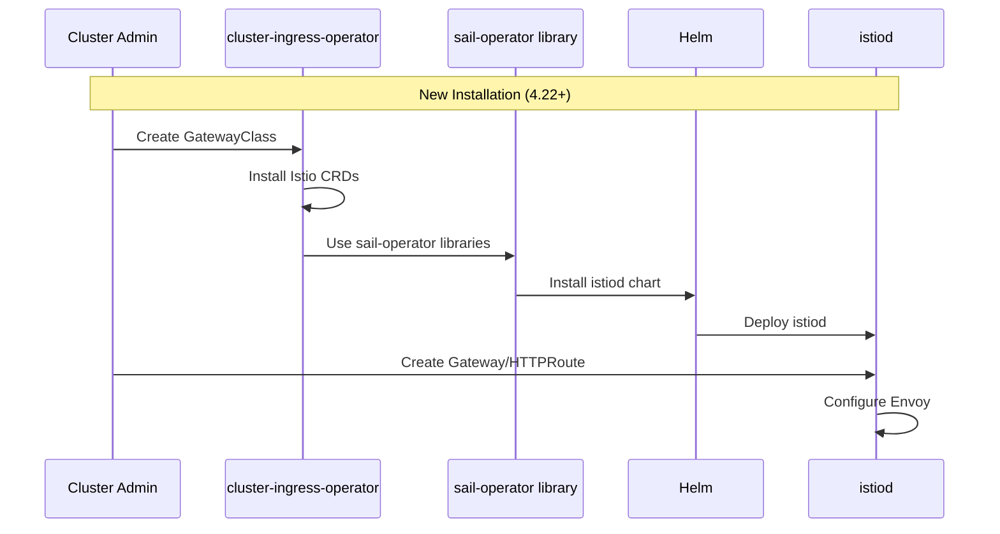

# Gateway API without OLM

This enhancement describes changes to the cluster-ingress-operator to remove
the dependency on OLM and the sail-operator by installing istiod directly
using Helm charts while leveraging libraries provided by the sail-operator
project.

## Summary

The cluster-ingress-operator currently installs OpenShift Service Mesh (OSSM)
via an OLM Subscription to provide Gateway API support. This enhancement
proposes replacing the OLM-based installation with a direct Helm chart
installation using sail-operator libraries. This change eliminates the OLM
dependency, avoids conflicts with existing OSSM subscriptions, enables Gateway
API on clusters without OLM/Marketplace capabilities, and allows faster
Gateway API releases independent of OLM release cycles.

## Motivation

The current OLM-based approach for installing OSSM to support Gateway API
presents several challenges that impact both cluster administrators and the
engineering team's ability to deliver Gateway API features.

### User Stories

#### Story 1: Cluster Admin with Existing OSSM Installation

As a cluster admin who has already installed OpenShift Service Mesh via OLM
for service mesh use cases, I want to enable Gateway API for ingress without
conflicts, so that I can use both mesh and Gateway API features on the same
cluster without subscription conflicts or installation failures.

#### Story 2: Cluster Admin on Restricted Environment

As a cluster admin managing a cluster without OLM and Marketplace capabilities
enabled, I want to use Gateway API for ingress, so that I can leverage modern
ingress capabilities without requiring OLM infrastructure.

#### Story 3: Platform Engineer

As a platform engineer working on Gateway API features, I want to release new
Gateway API versions independently of OLM release cycles, so that I can deliver
features and bug fixes to customers faster and respond more quickly to upstream
Gateway API changes.

### Goals

- Remove the dependency on OLM for installing OSSM/istiod for Gateway API
  support.
- Enable Gateway API on clusters without OLM and Marketplace capabilities.
- Avoid conflicts with existing OSSM subscriptions created by cluster
  administrators.
- Support seamless upgrade from OLM-based installation (4.21) to Helm-based
  installation (4.22).
- Support downgrade from Helm-based installation (4.22) to OLM-based
  installation (4.21).
- Enable faster Gateway API releases independent of OLM release cycles.

### Non-Goals

- Changing the user-facing Gateway API experience. Cluster admins will continue
  to create `GatewayClass`, `Gateway`, and `HTTPRoute` resources in the same
  way.
- Affecting service mesh use cases or OSSM installations created by cluster
  admins for mesh purposes.
- Adding new Gateway API features beyond what is currently supported.
- Making OSSM a core operator bundled in the OpenShift release payload (though
  this may be reconsidered in the future).
- Changing the control plane architecture. istiod will continue to run in the
  same namespace with the same configuration.

## Proposal

The cluster-ingress-operator will transition from creating an OLM Subscription
to installing istiod directly using Helm charts. This will be accomplished by
leveraging libraries provided by the sail-operator project.

### High-Level Changes

The cluster-ingress-operator will make the following changes:

1.  **Install istiod Directly via Helm**: Leverage libraries from the
    sail-operator project to install istiod programmatically with
    gateway-api configurations.

2.  **Install Istio CRDs for Layered Products**: Install required Istio
    CRDs (`EnvoyFilter`, `WasmPlugin`, `DestinationRule`) if they don't already
    exist, to support layered products requiring fine-grained Envoy
    configuration.

3.  **Upgrade Migration**: Detect when upgrading from an OLM-based
    installation (4.21) to Helm-based (4.22), delete the `Istio` CR,
    wait for sail-operator cleanup, then install via Helm with no data
    plane downtime.

### Workflow Description

From the user's perspective, the workflow for enabling and using Gateway API
remains unchanged. The implementation details of how istiod is installed differ
from previous releases.

#### Enabling Gateway API

1.  Cluster admin creates a `GatewayClass` with
    `spec.controllerName: openshift.io/gateway-controller`.
2.  The cluster-ingress-operator's gatewayclass-controller detects the
    new `GatewayClass` owned by OpenShift.
3.  The controller uses sail-operator libraries to install istiod via
    Helm.
4.  The controller installs the required Istio CRDs (`EnvoyFilter`,
    `WasmPlugin`, `DestinationRule`) if they do not already exist.
5.  Cluster admin creates `Gateway` and `HTTPRoute` resources as before.

### API Extensions

This enhancement does not introduce new CRDs. It changes ownership of three
Istio CRDs (`EnvoyFilter`, `WasmPlugin`, `DestinationRule`) and associated
webhooks (`ValidatingWebhookConfiguration`, `MutatingWebhookConfiguration`)
from the sail-operator to the cluster-ingress-operator.

See the [CRD Management](#crd-management) section in Implementation Details for
more information about how these CRDs are managed.

### Topology Considerations

#### Hypershift / Hosted Control Planes

This enhancement applies to Hypershift with no additional considerations beyond
existing Gateway API support.

#### Standalone Clusters

This enhancement applies to standalone clusters with no additional
considerations beyond existing Gateway API support.

#### Single-node Deployments or MicroShift

This enhancement reduces resource consumption on single-node deployments by
eliminating the sail-operator deployment.

MicroShift (which has Gateway API support since 4.18) could benefit from the
sail-operator library's Helm chart vendoring approach to simplify their
build-time manifest generation and reduce resource consumption by eliminating
the sail-operator deployment. However, MicroShift does not use
cluster-ingress-operator, so this enhancement does not directly affect it.

#### OpenShift Kubernetes Engine

This enhancement applies to OKE with no additional considerations beyond
existing Gateway API support.

### Implementation Details/Notes/Constraints

#### Helm Chart Vendoring

The Helm charts are included in the sail-operator library as embedded
resources. By vendoring the sail-operator library via `go.mod`, the
cluster-ingress-operator gets the charts as well, which are embedded in the
binary and can be used directly by the sail-operator libraries.

The process works as follows:
1. Add the sail-operator library dependency to `go.mod`, which vendors the
   library including its embedded Helm charts.
2. Use sail-operator library functions to install istiod, which access the
   embedded charts from the vendored library.
3. No external chart files are needed at runtime.

This approach ensures charts are version controlled and synchronized via go
vendoring to eliminate drift in the chart YAML. When the sail-operator library
version is updated in `go.mod`, the Helm charts are automatically synchronized
with the OSSM team's updates.

#### CRD Management

The cluster-ingress-operator will manage the following Istio CRDs required for
layered products: `WasmPlugin`, `EnvoyFilter`, and `DestinationRule`. These
CRDs will be maintained long-term to support layered products that may not
adopt newer Gateway API features immediately.

The operator will implement the following ownership model:
- **If no CRDs exist**: The cluster-ingress-operator creates them when a
  `GatewayClass` is created.
- **If OLM subscription is created afterwards**: OLM takes ownership of the
  CRDs that the cluster-ingress-operator created. The cluster-ingress-operator
  yields control and no longer manages them.
- **If OLM has previously created CRDs or taken ownership**: The
  cluster-ingress-operator does not touch them and skips installation.
- **CRD deletion**: CRDs are never deleted when `GatewayClass` is deleted, to
  preserve any instances that may exist and avoid breaking user workloads.

This ownership handoff approach allows the cluster-ingress-operator to provide
CRDs when needed for basic Gateway API functionality, while gracefully deferring
to user-managed OSSM installations when present.

#### Image Management

Images will be sourced as follows:
- **Initially**: Pull from registry.redhat.io using standard image references in
  the Helm chart values.
- **Future**: Incorporate images into the OCP release payload to support
  disconnected/offline installations. This will require coordination with the
  ART team.

The operator will configure the Helm chart values to reference the appropriate
image registry based on the cluster configuration. The sail-operator libraries
will provide this configurability to support mirrored images in disconnected
environments without hardcoding image locations.

#### Upgrade Detection and Migration

The operator will detect OLM-based installations by:
- Checking for an existing `Istio` CR created by the operator.
- Checking for the existence of a sail-operator `Subscription`.

Migration steps:
1. Detect and delete the existing `Istio` CR created by the operator.
2. Wait for the sail-operator to delete all Helm chart resources (istiod
   deployment, services, etc.).
3. Install istiod using the operator's Helm-based approach.
4. Verify istiod is running and healthy.

**Downtime Characteristics**:
- Brief istiod control plane downtime during the transition.
- No data plane downtime occurs during the transition. `Gateway` pods may roll
  out due to the new istiod version, but this is a standard rolling update.

**Note**: The sail-operator deployment will NOT be removed during upgrade. If a
cluster admin has installed sail-operator separately for service mesh use cases,
it will remain in place and continue operating independently.

#### Object Watching and Reconciliation

The gatewayclass-controller is now responsible for watching and reconciling all
objects created by the istiod Helm chart. The sail-operator library may provide
controller logic in the future to help manage these objects and reduce the
maintenance burden.

#### RBAC Changes

The cluster-ingress-operator's `ClusterRole` has been extended to include
permissions for all resources required to install and manage istiod via Helm,
including webhook configurations, Istio API groups, and coordination resources.

### Risks and Mitigations

#### Risk: YAML/Chart Drift

**Description**: If the cluster-ingress-operator's Helm charts fall out of
sync with the sail-operator/OSSM team's charts, incompatibilities may arise.

**Mitigation**: Use `go.mod` to vendor charts from the sail-operator repository.

#### Risk: Istio Control Plane Protocol Changes

**Description**: If the Istio version changes during upgrade from 4.21 to 4.22,
the old Envoy proxy pods may be unable to communicate with the new istiod
control plane due to protocol changes (e.g., new authentication mechanisms,
updated xDS protocol, or configuration format changes).

**Mitigation**: The gateway deployment should roll out when istiod updates, as
the new istiod version will reference a new proxy image. This ensures Envoy
proxies are updated alongside the control plane, preventing communication
issues.

### Drawbacks

- **Maintenance Burden**: The cluster-ingress-operator takes on additional
  maintenance responsibilities for Helm chart installation, Istio CRD
  management, object watches, and reconciliation logic that the sail-operator
  previously handled.
- **Increased Testing Burden**: The NID team must test Helm-based istiod
  installation, upgrade paths, downgrade paths, and compatibility with
  user-managed OSSM installations, increasing the testing surface area.
- **Loss of OLM Benefits**: Automatic updates, dependency management, and
  operator lifecycle management provided by OLM are no longer available for
  istiod.
- **Potential Conflict with Future Plans**: If OSSM becomes a core operator,
  this approach may need to be reworked.

## Alternatives (Not Implemented)

### Alternative 1: Keep OLM-Based Approach

Continue using the OLM-based approach with the sail-operator managing istiod
installation.

**Pros**:
- No implementation changes required.
- Sail-operator handles all istiod installation, upgrade, and lifecycle
  complexity, avoiding the maintenance burden, testing burden, and CRD
  management complexity of the direct Helm approach.

**Cons**:
- Does not address conflicts with existing OSSM subscriptions.
- Does not enable Gateway API on clusters without OLM/Marketplace.
- Does not allow faster Gateway API releases independent of OLM.
- Higher resource consumption (sail-operator deployment).

**Reason Not Chosen**: Does not solve the core problems this enhancement
addresses.

### Alternative 2: Make OSSM a Core Operator

Include OSSM as a core operator in the OCP release payload, similar to other
core operators.

**Pros**:
- istiod images would be part of the release payload, supporting disconnected
  installations from the start.
- OSSM would be tightly integrated with OCP releases.
- Eliminates OLM dependency for Gateway API.

**Cons**:
- Requires significant architectural changes across OSSM, OCP, and ART teams.
- May not align with OSSM product strategy.
- Does not provide a near-term solution.

**Reason Not Chosen**: This is a longer-term possibility that requires broader
alignment and architectural changes. The Helm-based approach provides a
near-term solution and can be migrated to a core operator model in the future
if needed.

## Open Questions

1. **Sail-operator library readiness**: Will the OSSM team's enhanced
   library (`pkg/install`) be production-ready for 4.22? Should the initial
   implementation use only the lower-level sail-operator libraries, or wait
   for the enhanced library?

2. **CRD version mismatch handling**: If a user has installed OSSM separately
   and created the same CRDs with different versions, how should the operator
   handle version mismatches? Should it require matching CRD versions and fail
   if they don't match, or skip CRD installation and proceed with the existing
   versions?

3. **Semantic versioning for sail-operator**: Would adopting semantic
   versioning with 'v' prefixes (e.g., v1.27.1 instead of 1.27.1) in the
   sail-operator repository simplify dependency management and align with Go
   module conventions?

## Test Plan

Testing for this enhancement will cover the following scenarios:

### E2E Tests

All existing Gateway API e2e tests will be run with the new Helm-based
installation to ensure no regressions in end-user functionality.

Additional test scenarios specific to this enhancement:

1. **Upgrade Path**: Upgrade from 4.21 (OLM-based) to 4.22 (Helm-based).
   Verify automatic migration occurs and `Gateway`/`HTTPRoute` resources remain
   functional.

2. **CRD Lifecycle**: Test Istio CRD installation, upgrade, and handling of
   pre-existing CRDs from user-managed OSSM installations.

3. **Reconciliation Logic**: Verify operator correctly detects and reconciles
   Helm objects, Istio CRDs, and istiod deployments.

## Graduation Criteria

This enhancement is an improvement to an existing GA feature (Gateway API), not
a new feature. Therefore, it does not follow the typical Dev Preview → Tech
Preview → GA graduation path. Instead, it will be released directly in
OpenShift 4.22 as GA.

## Upgrade / Downgrade Strategy

### Upgrade (4.21 → 4.22)

Clusters upgrading from 4.21 to 4.22 will automatically migrate from OLM-based
to Helm-based istiod installation. The migration maintains data plane continuity
with no downtime for existing `Gateway`/`HTTPRoute` resources. See the [Upgrade
Detection and Migration](#upgrade-detection-and-migration) section for
implementation details.

### Downgrade (4.22 → 4.21)

When a cluster upgrade to 4.22 fails and rolls back to 4.21, the downgraded
cluster-ingress-operator will revert to the OLM-based installation:

1. Recreate the `Istio` CR to trigger sail-operator installation.
2. sail-operator reconciles the existing Helm chart, adding a new revision and
   migrating ownership back to sail-operator.

`Gateway` and `HTTPRoute` resources remain in place with no control plane or
data plane downtime during the transition.

## Version Skew Strategy

This enhancement does not introduce new version skew concerns. The
cluster-ingress-operator and istiod versions remain synchronized through the OCP
release as they were with the OLM-based approach.

The only consideration is when Istio CRDs are already present from a
user-managed OSSM installation. In this case, the operator will not overwrite
them to avoid conflicts, though CRD version mismatches could potentially cause
issues.

## Operational Aspects of API Extensions

This enhancement does not introduce new CRDs. It changes ownership of three
Istio CRDs (`EnvoyFilter`, `WasmPlugin`, `DestinationRule`) from the
sail-operator to the cluster-ingress-operator. These CRDs do not have
admission or conversion webhooks and are not used in typical Gateway API
workflows, so they have minimal operational impact.

## Infrastructure Needed

No new infrastructure required. This enhancement uses existing OpenShift
components:
- Existing CI infrastructure for e2e tests
- Existing image registry (registry.redhat.io) for istiod images
- Helm charts vendored via sail-operator libraries
- Existing cluster-ingress-operator
