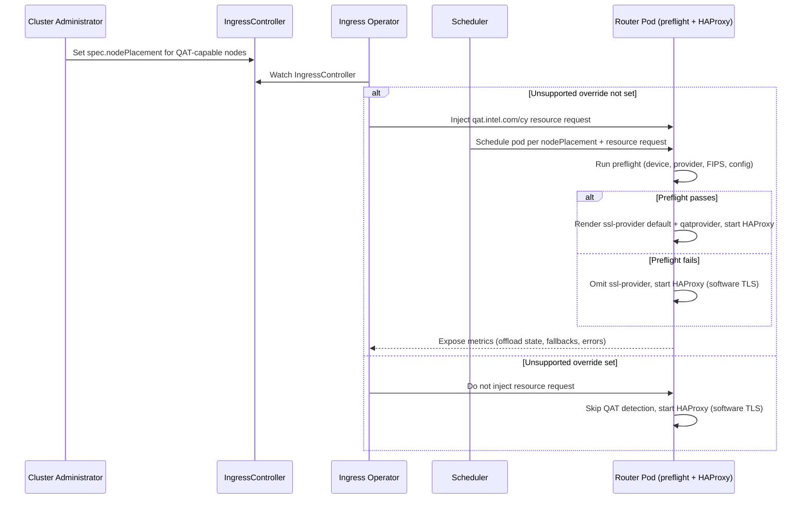

# QAT Acceleration for Ingress

## Summary

This enhancement proposes automatically offloading TLS handshake
cryptographic operations (RSA/ECDHE) from HAProxy to Intel QuickAssist
Technology (QAT) hardware accelerators, when such hardware is present and
usable on a worker node, for ingress router pods running on OpenShift's
haproxy34 image (RHEL10-based). HAProxy has no QAT-specific code; offload is
achieved through OpenSSL 3.x's generic Provider interface and Intel's
`qatengine` package, which is installed unconditionally in the router image
and activated only when a working device is confirmed. For its initial
delivery, this capability ships without a new, versioned IngressController
API field and without an OpenShift feature gate: it is enabled automatically
by default, with an unsupported, undocumented-by-default opt-out exposed
through `spec.unsupportedConfigOverrides`, so that early adopters with QAT
hardware can validate the feature and provide feedback ahead of a committed,
supported API (tentatively targeted for a later release).

## Motivation

Intel QAT is a throughput/CPU-offload accelerator, not a per-connection
latency reducer: offload is asynchronous, so it benefits deployments with
high TLS handshake churn (short-lived connections, frequent renegotiation,
mTLS) by freeing CPU for L7 processing and letting a router sustain a higher
handshake rate, rather than helping an isolated, low-volume handshake.
Red Hat has already validated HAProxy with Intel's `qatengine` on RHEL 9.2
using the legacy OpenSSL ENGINE interface, and the `qatengine`/`qatlib`
packaging is available directly from RHEL AppStream, giving a credible path
to ship this without new third-party repositories or vendored components.

OpenShift's router does not currently take advantage of QAT hardware even
when it is present on a cluster's worker nodes, leaving TLS handshake
capacity on the table for customers who have already invested in QAT-capable
servers (Intel 4th/5th Gen Xeon Scalable with QAT 4xxx). This enhancement
lets those customers realize that investment for ingress traffic without
requiring a new, fully-designed API up front, while providing Red Hat with
real-world feedback to inform the eventual supported interface.

### User Stories

* As a cluster administrator running TLS-heavy ingress workloads (short-lived
  connections, mTLS, frequent renegotiation) on Intel QAT-capable worker
  nodes, I want HAProxy to automatically offload TLS handshake crypto
  operations to the QAT accelerator, so that I can sustain a higher
  handshake rate without over-provisioning CPU.
* As an early-adopter customer validating QAT hardware with OpenShift, I
  want to try QAT acceleration without OpenShift having committed to a new,
  stable API, so that I can give feedback that shapes the eventual supported
  interface.
* As a cluster administrator who does not want this automatic, unsupported
  behavior on my cluster, I want a documented way to disable QAT activation,
  so that I can opt out if it causes problems on my QAT-capable nodes.
* As a platform operations engineer running router fleets at scale, I want
  QAT offload activity, software-fallback counts, and device errors exposed
  through the router's standard Prometheus metrics, so that I can monitor
  whether acceleration is actually helping and detect failures without
  bespoke tooling, life-cycling the feature the same way as any other router
  capability.

### Goals

- Automatically activate Intel QAT TLS crypto offload, through the OpenSSL
  3.x Provider interface, for HAProxy on haproxy34/RHEL10 router pods
  whenever a usable QAT device is confirmed, with no required administrator
  configuration.
- Keep a single router image and configuration path that works unmodified on
  both QAT-capable and commodity hardware; there is no separate "QAT image."
- Guarantee router pods never crash-loop because of QAT: the HAProxy
  configuration must omit the `ssl-provider qatprovider` directive entirely
  unless a preflight sequence has confirmed the device and provider
  actually work.
- Provide a documented, unsupported escape hatch
  (`spec.unsupportedConfigOverrides`) that lets early adopters disable the
  automatic behavior while Red Hat gathers feedback ahead of a stable API.
- Never activate QAT acceleration in a way that would compromise a cluster's
  FIPS posture.

### Non-Goals

- Introducing a stable, versioned IngressController API field for
  configuring QAT acceleration; this is deferred to a future enhancement
  update (tentatively targeted for OCP 5.2).
- Introducing an OpenShift feature gate for this capability in its initial,
  unsupported, opt-out-only delivery (see Risks and Mitigations).
- Supporting a FIPS-validated QAT acceleration path; FIPS-enabled clusters
  will not activate QAT acceleration at all in this enhancement's scope.
- Supporting the RHEL9/haproxy32 OpenSSL ENGINE-based offload track; only
  the haproxy34/RHEL10 OpenSSL Provider-based path is in scope.
- Supporting the `qat_sw` (software) backend or QAT-accelerated HTTP/data
  compression (`qatzip`); this enhancement is scoped to `qat_hw`-backed TLS
  crypto offload only. `qat_sw` and `qatzip` use different libraries and
  build paths than the `qatengine` TLS offload path proposed here.
- Provisioning or managing node-level QAT infrastructure: RHCOS10 worker
  pools, BIOS/kernel configuration, Node Feature Discovery labeling, or
  installing/configuring the Intel Device Plugin Operator. These are
  prerequisites owned by other components and teams.
- Automatically selecting or scheduling router pods onto QAT-capable nodes;
  placement remains the administrator's responsibility via the existing
  `spec.nodePlacement` field.
- Guaranteeing sufficient VF capacity for rolling update headroom (for
  example, `maxSurge`, where old and new router pods may both request a VF
  simultaneously), node drain, or device-plugin restarts. Sizing the QAT
  node pool to cover this is a capacity-planning and documentation concern
  for the administrator, not a guarantee this enhancement's implementation
  provides; a VF shortage during rollout surfaces as ordinary `Pending`
  pods (see Support Procedures).

## Proposal

QAT-capable worker nodes are required to run the RHCOS10 stream; this is a
hard kernel-compatibility requirement, not an arbitrary choice of track.
Intel's QATlib documentation requires a kernel driver version of 5.15.3 or
newer for QAT 4xxx crypto offload. OCP 5.1 ships two RHCOS streams: RHCOS9
(kernel 5.14.0.x) and RHCOS10 (kernel 6.12.0.x). Only RHCOS10's kernel meets
that minimum, so QAT acceleration cannot work on RHCOS9 regardless of any
other configuration.

This enhancement spans the router image/binary, the router's control-plane
logic, and the cluster-ingress-operator:

- The haproxy34 (RHEL10) router image installs the `qatengine` RPM
  unconditionally. The package is small and inert on hardware without a QAT
  device, so no separate "QAT image" variant is needed.
- The router's control plane runs a sidecar preflight sequence before
  HAProxy starts: it checks that a QAT virtual function device is visible in
  the container, that OpenSSL can load the `qatprovider.so` Provider, that
  activating it would not conflict with the cluster's FIPS configuration,
  and that the fully-rendered HAProxy configuration validates. Only if every
  check passes does the router render `ssl-provider default` followed by
  `ssl-provider qatprovider`; otherwise both directives are omitted and
  HAProxy starts with software-only TLS. Loading `qatprovider` explicitly
  disables OpenSSL's automatic loading of the `default` provider, so
  `default` must also be loaded explicitly, or any TLS algorithm not
  implemented by `qatprovider` would fail silently or error out. This
  check-then-render ordering is required because a failed provider load is
  fatal to HAProxy startup.
- The cluster-ingress-operator reads `Node` objects and automatically adds
  the `qat.intel.com/cy` extended resource request to the router
  deployment's container only when at least one node the IngressController's
  `spec.nodePlacement` would consider actually advertises that resource in
  its allocatable capacity (i.e., the Intel Device Plugin Operator is
  installed and has provisioned virtual functions there). On clusters with
  no QAT-capable nodes, or where `spec.nodePlacement` does not target any,
  the operator injects nothing and router deployments are unaffected. The
  operator does not alter placement itself.
- Administrators who do not want this behavior can set a documented, but
  explicitly unsupported, override under `spec.unsupportedConfigOverrides`
  to disable detection, activation, and the associated resource request.
- No new CRD field, CRD validation, or OpenShift feature gate is introduced
  for this initial delivery. A future enhancement will propose the stable,
  gated `v1` API surface once there has been time to gather feedback from
  early adopters (tentatively OCP 5.2).

### Workflow Description

**cluster administrator** is a human user responsible for managing
IngressControllers and the worker nodes that back them.

**cluster-ingress-operator** is the control-plane component that manages
IngressController resources and their router deployments.

**router pod** is the data-plane pod (router + HAProxy) that terminates and
load-balances ingress traffic.

1. Infrastructure outside this enhancement's scope provisions QAT-capable
   worker nodes that advertise the `qat.intel.com/cy` extended resource:
   a `MachineConfigPool` (or `NodePool`, for Hypershift) with
   `spec.osImageStream.name: rhel-10` explicitly set, since OCP 5.1 ships
   both RHCOS9 and RHCOS10 streams and only RHCOS10 meets QAT's minimum
   kernel requirement (see Proposal); BIOS/kernel configuration; Node
   Feature Discovery; and the Intel Device Plugin Operator with a
   `QatDevicePlugin` CR.
2. The cluster administrator configures an IngressController's existing
   `spec.nodePlacement` field to target those QAT-capable nodes. No new API
   is required for this step.
3. As a prerequisite, the cluster administrator sets the IngressController's
   existing `haproxyVersion` field to select haproxy34 (HAProxy 3.4), since
   HAProxy 3.2 remains the OCP 5.1 default and this capability only applies
   to haproxy34 or newer (see `select-haproxy-version.md`). None of the
   automatic behavior described below applies until this explicit,
   non-default version selection is made.
4. Unless the administrator has set the unsupported opt-out described
   below, the cluster-ingress-operator checks whether a node matching the
   IngressController's `spec.nodePlacement` advertises the
   `qat.intel.com/cy` resource in its allocatable capacity, and if so,
   automatically adds a matching resource request to the router container.
   The operator continues to watch `Node` objects afterward, so the
   resource request is added or removed as matching nodes' QAT
   advertisement appears or disappears (for example, as the Intel Device
   Plugin Operator finishes provisioning virtual functions).
5. The scheduler places router pods according to the administrator's
   `spec.nodePlacement` and the injected resource request, following
   standard Kubernetes scheduling semantics.
6. On startup, before HAProxy launches, the router runs its preflight
   sequence: RHCOS10/OS-stream and kernel version assertion, QAT device
   visibility, OpenSSL Provider loadability, FIPS compatibility, and
   HAProxy configuration validation.
7. If every preflight check passes, the router renders `ssl-provider
   default` and `ssl-provider qatprovider` into the HAProxy configuration
   and starts HAProxy with QAT offload active. Both directives are required
   together: loading `qatprovider` disables OpenSSL's automatic loading of
   `default`, and without `default` any TLS algorithm not implemented by
   `qatprovider` would fail silently or error out.
8. If any preflight check fails, the router omits both `ssl-provider`
   directives and starts HAProxy with software-only TLS, never risking a
   crash-loop due to QAT.
9. The router exposes Prometheus metrics for offload-active state,
   software-fallback count, device resets, and queue depth so operators can
   confirm whether acceleration is engaged and healthy.
10. An administrator who wants to disable this behavior entirely sets the
    documented unsupported override in `spec.unsupportedConfigOverrides`;
    on the next rollout, the operator stops injecting the resource request
    and the router skips QAT detection and activation.



### API Extensions

This enhancement does not add or modify any CRD, admission or conversion
webhook, ValidatingAdmissionPolicy, MutatingAdmissionPolicy, aggregated API
server, or finalizer.

The only existing API surface touched is IngressController's pre-existing,
intentionally schema-unvalidated `spec.unsupportedConfigOverrides` field.
The cluster-ingress-operator will recognize a documented (but explicitly
unsupported) key under this field to let administrators opt out of the
automatic behavior described in this enhancement. Because
`unsupportedConfigOverrides` carries no schema or support guarantee today,
this does not constitute an API Extension as defined above, and no API
approver review is required for this delivery.

<!-- TODO: The exact key name and shape under unsupportedConfigOverrides
     (e.g. a single boolean flag vs. a nested struct) is still open and
     should be finalized during implementation; see Open Questions. -->

A future enhancement will introduce a stable, versioned IngressController
API field for this capability (tentatively OCP 5.2). That future change will
go through the normal API Extensions review process, including a dedicated
API approver.

### Topology Considerations

#### Hypershift / Hosted Control Planes

QAT hardware is a worker-node (data-plane) resource, so this enhancement
primarily affects guest-cluster node pools where router pods actually run.
The cluster-ingress-operator itself runs in the management cluster, but the
behavior it manages (resource injection, and the router's own preflight and
config rendering) executes against guest-cluster router pods.

<!-- TODO: This needs validation with the Hypershift team: confirm whether
     any additional handling is required for management-cluster vs.
     guest-cluster router placement, and whether the unsupported override
     needs special handling when hosted control planes are used. -->

#### Standalone Clusters

This is the primary target for this enhancement. Administrators provision
QAT-capable worker nodes and use the existing `spec.nodePlacement` field to
place router pods on them.

#### Single-node Deployments or MicroShift

For Single-Node OpenShift (SNO), a QAT-capable node could serve both control
and data plane; since QAT offloads CPU rather than consuming more, this
enhancement should not meaningfully increase SNO resource consumption when
the device is present, and has no effect when it is not.

MicroShift does not run the cluster-ingress-operator or IngressController
resources in the same way as standalone OpenShift, so this enhancement does
not apply to MicroShift in its current form.

<!-- TODO: Confirm with the MicroShift team whether QAT acceleration is a
     relevant capability for MicroShift's ingress architecture, now or in a
     future iteration. -->

#### OpenShift Kubernetes Engine

This enhancement relies on standard IngressController resources and worker
node infrastructure, which are available in OKE.

<!-- TODO: Confirm with the OKE team whether shipping an automatic,
     explicitly-unsupported behavior (rather than a fully-supported, gated
     feature) raises any concerns specific to the OKE product offering. -->

### Implementation Details/Notes/Constraints

**Router image and packaging**: The haproxy34 (RHEL10) router image installs
the `qatengine` RPM unconditionally via its Dockerfile's `INSTALL_PKGS`
(rather than relying solely on a spec-level `Recommends`), so the same image
works on both QAT and commodity hardware. No HAProxy build-flag change is
required for Provider loading (`ssl-provider`/`ssl-provider-path` only
require `USE_OPENSSL=1` and OpenSSL >= 3.0, already satisfied).

**Router preflight and config-generation**: New Go-side logic (likely in the
router's config-templating package) implements the sidecar preflight
sequence described in the Proposal and Workflow Description, keying
detection off the presence of the `qatprovider.so` artifact rather than
assuming a fixed relationship between OS/image version and interface, since
that relationship is not guaranteed to stay stable across RHEL major
versions. Since OCP 5.1 ships both RHCOS9 and RHCOS10 streams, and only
RHCOS10's kernel meets QAT's minimum kernel-driver requirement (see
Proposal), the preflight sequence also asserts the node's OS stream, kernel
version, and container runtime (`crun`) match what the RHCOS10/haproxy34
QAT path was validated against, rather than assuming the
`MachineConfigPool`'s
`spec.osImageStream.name: rhel-10` setting from step 1 of the Workflow
Description was actually applied to the node the pod landed on. The
preflight sequence must run, and must gate config rendering, on every
router start/reload, since a previously-usable device can become unusable
(driver reset, VF revoked) between reloads.

Gating only at start/reload is not sufficient on its own: reloads are driven
by route/config changes, so a cluster with a stable set of routes can run
for a long time between reloads, and a device that fails mid-flight (driver
reset, VF revoked) would not be re-evaluated until the next unrelated
change. The router must therefore also run the device/provider portion of
the preflight checks on an independent timer, decoupled from route-driven
reloads, and trigger a reload to fall back to software-only TLS as soon as
the device is found unusable, rather than waiting on the next incidental
reload. Whether `qatengine` itself already provides transparent, per-request
fallback to software crypto when the hardware fails mid-operation (as
opposed to failing the handshake outright) is not established by current
research and needs empirical confirmation; see Open Questions.

**cluster-ingress-operator**: Adds logic to read `Node` objects and
automatically set the `qat.intel.com/cy` resource request/limit on the
router deployment's container only when a node matching the
IngressController's `spec.nodePlacement` advertises that resource in its
allocatable capacity, and to recognize the unsupported opt-out key described
in API Extensions. Reconciling on `Node` changes (not just on
IngressController changes) ensures the resource request is added once the
Intel Device Plugin Operator finishes provisioning virtual functions on a
targeted node, without requiring an unrelated IngressController edit to
trigger it. The operator does not compute or alter node placement; that
remains entirely driven by the administrator's existing `spec.nodePlacement`
configuration.

**No feature gate for this delivery**: OpenShift's standard process requires
all new features to ship behind a feature gate, disabled by default. This
enhancement deliberately deviates from that process for its initial
delivery: because there is no new API surface being committed to, gating the
behavior behind a `FeatureGate` would imply a commitment this enhancement
explicitly wants to avoid making yet. Instead, the behavior ships as an
automatic, default-on capability with an unsupported, documented opt-out.
This is called out explicitly in Risks and Mitigations for reviewer
scrutiny. When the stable `v1` API field is introduced in a future
enhancement, that field (and the behavior it controls) will be registered as
a proper feature gate in
https://github.com/openshift/api/blob/master/features/features.go, starting
in an appropriate feature set (`DevPreviewNoUpgrade` or
`TechPreviewNoUpgrade`), per the guidance in
`dev-guide/feature-zero-to-hero.md`.

The absence of a dedicated feature gate is further mitigated by this
capability's dependency on HAProxy version selection (see
`select-haproxy-version.md`): HAProxy 3.4 (haproxy34) is not available at
all until it is introduced, as a non-default, explicitly-selectable version
via the existing `haproxyVersion` field, alongside this enhancement. It
cannot be pinned today because it does not exist in OCP 5.0. QAT activation
is conditioned on the IngressController running haproxy34 or newer, so an
administrator must already have explicitly set `haproxyVersion` to this new,
non-default version before this enhancement's automatic behavior can ever
apply. This naturally limits exposure to clusters that have deliberately
opted in to the new HAProxy version, even without a feature gate of its own.

### Risks and Mitigations

**Risk**: Loading the `qatprovider` OpenSSL provider disables OpenSSL's
automatic loading of the `default` provider. Without `default` also loaded
explicitly, any TLS algorithm not implemented by `qatprovider` would fail
silently or error out, breaking cipher suites and TLS features that have
nothing to do with QAT.

**Mitigation**: The router always renders `ssl-provider default` before
`ssl-provider qatprovider`, never `qatprovider` alone (see Workflow
Description and Proposal). This is covered by a dedicated test exercising a
TLS path that requires a non-QAT algorithm, to catch any regression in this
ordering (see Test Plan).

**Risk**: Shipping an automatic, default-on behavior without a feature gate
deviates from OpenShift's standard feature-development process, and could
set an unwanted precedent.

**Mitigation**: The behavior is strictly scoped to hardware that does not
exist in commodity clusters (QAT-capable nodes), is engineered to never
cause a crash-loop (mandatory preflight before any config change), carries
an explicit, documented "unsupported" designation, and is intentionally
time-boxed to a single release cycle ahead of a properly gated, supported
API. This EP calls the deviation out explicitly so reviewers and API
approvers can weigh in before it merges.

**Risk**: Whether `ssl-mode-async` actually drives OpenSSL's
`OSSL_ASYNC_FD`/`ASYNC_WAIT_CTX` machinery for a Provider (as opposed to an
ENGINE) is unverified; without it, this feature may provide functional
correctness but no real throughput benefit.

**Mitigation**: This is treated as a hard gate for promotion beyond this
early-access delivery: the project will not claim a performance benefit, nor
graduate this capability, until async offload is empirically confirmed on
real haproxy34/RHEL10 hardware.

**Risk**: A QAT device that was usable at HAProxy start/reload time can
become unusable afterward (driver reset, VF revoked, firmware issue), and
reloads are driven by route/config changes rather than device health, so a
stable cluster could run for an extended period without re-evaluating
device state.

**Mitigation**: In addition to gating at start/reload, the router runs the
device/provider portion of the preflight checks on an independent timer and
proactively triggers a reload to fall back to software-only TLS as soon as
the device is found unusable, rather than waiting for the next
route-triggered reload. Whether `qatengine` also provides its own
transparent, per-request software fallback when the hardware fails
mid-operation still needs empirical confirmation (see Open Questions).

**Risk**: Real QAT hardware for CI/QE is not yet confirmed, which limits how
much of this feature can be validated before shipping.

**Mitigation**: Hardware access is being arranged; until it is confirmed,
testing is limited to the hardware-independent cases listed in the Test
Plan, and this is tracked explicitly in Infrastructure Needed and Open
Questions.

**Risk**: Automatic, default-on resource injection could surprise
administrators who did not explicitly request QAT acceleration, for example
on shared or multi-tenant QAT-capable node pools.

**Mitigation**: The behavior is documented, is visible through router
metrics, and can be disabled cluster-wide (per IngressController) through
the unsupported override.

**Risk**: FIPS-enabled clusters must never activate a non-FIPS-validated
crypto path.

**Mitigation**: The preflight sequence explicitly checks FIPS compatibility
and refuses to activate QAT when it is not safe to do so; this enhancement's
scope is limited to non-FIPS clusters (see Non-Goals).

### Drawbacks

This enhancement introduces an automatic behavior change (new resource
requests, a new preflight sequence, conditional config rendering) without
the usual feature-gate safety net, which increases the burden on the router
and ingress operator teams to get the default-on behavior right the first
time. It also means troubleshooting relies on logs and metrics rather than a
dedicated IngressController status condition in this initial delivery
(status reporting is an open question). These trade-offs are accepted in
exchange for faster, real-world feedback ahead of committing to a stable
API, but reviewers may reasonably push back on shipping default-on behavior
without a feature gate.

## Alternatives (Not Implemented)

**Ship a fully-gated Tech Preview feature with a stable v1 API now**: This
was not selected for this release because the API shape (opt-in field vs.
automatic detection, resource/placement model, status reporting) has open
questions that are better informed by early-adopter feedback than by
up-front design alone. A future enhancement will revisit this once that
feedback is available.

**Require an explicit opt-in field instead of automatic, default-on
behavior**: Considered, but an opt-out-by-exception model was chosen to
maximize early feedback from customers who already have QAT hardware,
without asking them to learn a new, soon-to-be-replaced API field.

## Open Questions [optional]

1. What is the exact key name and shape for the unsupported opt-out under
   `spec.unsupportedConfigOverrides`?
2. What IngressController status/condition reporting, if any, should exist
   for QAT state in this initial delivery? This is currently left
   unresolved (TBD) and may remain logs/metrics-only until the stable API
   lands.
3. How does this enhancement interact with Hypershift/Hosted Control Planes
   specifically (see Topology Considerations)?
4. Does the Intel Device Plugin Operator's `QatDevicePlugin` CR, NFD
   labeling, and RHCOS10 kernel/BIOS prerequisites impose any additional
   constraints on what the router's preflight sequence can assume is true
   by the time it runs?
5. Does shipping an automatic, unsupported-only behavior (rather than a
   fully supported, gated feature) raise concerns for OKE (see Topology
   Considerations)?
6. When will `ssl-mode-async` be empirically confirmed to drive real async
   offload for the Provider path on haproxy34/RHEL10, and what is the plan
   if it does not?
7. What is the concrete timeline for confirming real QAT hardware access
   for CI/QE?
8. What is the migration path from the unsupported override to the future
   supported `v1` API field, for administrators who adopted the unsupported
   behavior early?
9. Does `qatengine` provide its own transparent, per-request fallback to
   software crypto when the QAT hardware fails mid-operation, or does a
   runtime hardware failure fail the TLS handshake outright until the
   router's independent health-check timer forces a reload? This determines
   how fast a runtime device failure is actually reflected in router
   behavior.
10. The RHCOS10 kernel requirement itself is settled (see Proposal), but
    the exact supported tuple built on top of it (`crun` version, OpenSSL
    3.x, `qatprovider`, QAT 4xxx firmware/driver) is not yet pinned, and
    neither is the package source for `qatengine` on RHEL10. At the time of
    writing, Brew shows `haproxy34-3.4.5-1.rhaos5.1.el10` (build 4122540)
    and `qatengine-2.1.0-1.el10` (build 4048100) in `rhel-10.3-candidate`,
    the latest RHCOS10 candidate kernel is `6.12.0-211.64.1.el10_2` (build
    4127236), but `qatengine` is not yet present in
    `rhaos-5.1-rhel-10-candidate`. It is not yet decided whether `qatengine`
    will be consumed directly from RHEL AppStream or needs its own
    `rhaos`-candidate build; this must be resolved, and the exact tuple
    pinned, before implementation.

## Test Plan

**Test ownership**: RHEL and Intel are responsible for validating the broad
QAT hardware/software support matrix (device generations, firmware, kernel
driver versions). OpenShift Ingress/QE is responsible for validating one
exact, pinned tuple (see Open Questions) for the HAProxy +
`qatengine`/OpenSSL integration specifically - this enhancement does not
attempt to re-validate the matrix RHEL/Intel already own.

Since no feature gate exists for this initial delivery, tests cannot use an
`[OCPFeatureGate:...]` label yet; one will be added once the future
enhancement introduces the gated v1 API. Until then, all tests should
include a `[Jira:"Network Edge"]` (or appropriate component) label, and
suite/type labels such as `[Suite:...]`, `[Serial]`, `[Slow]`, or
`[Disruptive]` as needed. See `dev-guide/test-conventions.md` for details.

The following do not require real QAT hardware:

- Unit tests for the preflight sequence (device visibility, provider load,
  FIPS compatibility, config validation) against faked signals, including
  the "must never emit `ssl-provider` without confirmation" rule, and the
  "`ssl-provider default` must always precede `ssl-provider qatprovider`"
  rule.
- A test exercising a TLS handshake path that requires an algorithm not
  implemented by `qatprovider`, with QAT active, to catch any regression
  where `default` is not loaded alongside `qatprovider`.
- Unit tests for the independent, timer-driven re-check of device/provider
  health described in Risks and Mitigations, confirming it triggers a
  reload to software-only TLS when a previously-usable device is found
  unusable between route-driven reloads.
- Unit tests for the operator's node-capability detection (only injecting
  `qat.intel.com/cy` when a matching node advertises it), its reaction to
  `Node` add/update events, and its handling of the unsupported opt-out key.

The following require real QAT hardware, since no credible software
emulator exists for the QAT PCI accelerator:

- End-to-end validation that `ssl-provider qatprovider` actually offloads
  TLS handshakes, including the `ssl-mode-async` question from Risks and
  Mitigations.
- End-to-end validation of the runtime failure path: inducing a device
  failure (or simulating VF revocation) after HAProxy has started with QAT
  active, and confirming the router falls back to software-only TLS within
  the expected bound, without manual intervention.
- Validation of the full deployment runbook end to end (RHCOS10 worker
  pool, NFD labeling, Intel Device Plugin Operator, resource advertisement,
  scheduling, and router activation).

## Graduation Criteria

Because this initial delivery has no feature gate, the standard graduation
framework (minimum 5 tests, 7 runs/week, 14 runs per supported platform, 95%
pass rate, coverage across AWS, Azure, GCP, vSphere, and Baremetal
network-stack variants) will be defined once the future enhancement
introduces the gated, supported v1 API. Until then, "graduation" for this
delivery means gathering enough early-adopter feedback and empirical
validation (see Open Questions) to inform that future API design.

<!-- TODO: Numeric performance targets (handshake-rate uplift, throughput,
     CPU savings vs. software-only baseline) are not yet defined. These
     should be set by the perf team once real QAT hardware is available for
     benchmarking (see Infrastructure Needed), rather than asserted here
     without measurement. -->

### Dev Preview -> Tech Preview

<!-- TODO: To be defined alongside the future enhancement that introduces
     the feature-gated v1 API. -->

### Tech Preview -> GA

Confirmation of a real async offload benefit (see Risks and Mitigations,
`ssl-mode-async`) and perf-team-defined numeric performance targets are
treated as hard gates for GA; neither is satisfied yet.

<!-- TODO: The rest of this criteria is to be defined alongside the future
     enhancement that introduces the feature-gated v1 API. -->

### Removing a deprecated feature

N/A - this is a new capability, not a replacement for an existing one.

## Upgrade / Downgrade Strategy

Because this enhancement does not add a new CRD field, upgrades and
downgrades are governed by normal `unsupportedConfigOverrides` semantics:
clusters running an older cluster-ingress-operator version simply do not
recognize the opt-out key and are unaffected by this enhancement. Clusters
running a newer operator version will begin automatically injecting the
`qat.intel.com/cy` resource request on applicable router deployments after
upgrade, unless the administrator has already set the opt-out.

Downgrading to an operator version that predates this enhancement removes
the automatic resource injection and preflight/QAT behavior; router pods
return to software-only TLS with no QAT-related resource requests. No manual
cleanup is required, since no new persisted API field is introduced.

## Version Skew Strategy

This enhancement does not involve the kubelet, CSI, CRI, or CNI, and does
not require control-plane/data-plane coordination beyond the
cluster-ingress-operator rolling out router deployments as it already does
today. During a rolling upgrade, some router pods may run with QAT
acceleration active and others without it (for example, mid-rollout), which
is acceptable since both states are already supported, crash-safe
configurations.

## Operational Aspects of API Extensions

N/A - this enhancement does not add or modify any CRD, webhook, aggregated
API server, or finalizer.

## Support Procedures

* **Failure Mode 1**: QAT preflight check fails (device not visible,
  provider fails to load, FIPS incompatibility, or config validation
  failure).
  * **Impact**: None to availability - the router omits `ssl-provider` and
    starts HAProxy with software-only TLS, as it would without this
    enhancement.
  * **Detection**: Router logs record which preflight check failed. Router
    Prometheus metrics show QAT offload as inactive/fallback.
  * **Teams**: Networking team (ingress maintainers) handles escalations.

* **Failure Mode 2**: The `qat.intel.com/cy` resource request cannot be
  satisfied (misconfigured `spec.nodePlacement`, insufficient VFs, or Intel
  Device Plugin Operator not installed/healthy).
  * **Impact**: Affected router pods remain `Pending` and do not serve
    traffic; other router replicas that can be scheduled continue serving
    traffic normally.
  * **Detection**: Standard Kubernetes pod scheduling events/status
    (`FailedScheduling`, insufficient `qat.intel.com/cy`).
  * **Teams**: Networking team (ingress maintainers) for the resource
    request itself; escalate to the Intel Device Plugin Operator/NFD owners
    for device-plugin or node-level issues.

### Detecting Failures

* **Symptom 1**: Router pod logs show a preflight check failure message
  (device, provider load, FIPS, or config validation).
  ```bash
  oc logs -n openshift-ingress <router-pod-name>
  ```

* **Symptom 2**: Router pods stuck `Pending` due to an unsatisfiable
  `qat.intel.com/cy` resource request.
  ```bash
  oc describe pod -n openshift-ingress <router-pod-name>
  ```

* **Symptom 3**: Router metrics show QAT offload inactive or a rising
  software-fallback count despite QAT hardware being expected to be in use.

### Graceful Degradation

The feature fails gracefully by design: any preflight failure results in a
router that starts and serves traffic using software-only TLS, never a
crash-loop. An administrator can disable the behavior entirely at any time
via the unsupported override in `spec.unsupportedConfigOverrides`; on the
next rollout, the operator stops injecting the resource request and the
router stops attempting QAT detection.

## Infrastructure Needed [optional]

- Real Intel QAT-capable hardware (lab, cloud, or CI pool) for CI/QE
  testing. Access is being arranged but not yet confirmed; this is a
  tracked blocker for empirical validation (see Open Questions).
- RHCOS10-based worker pool infrastructure, once haproxy34/RHEL10 images
  exist, to exercise the full deployment runbook end to end.
