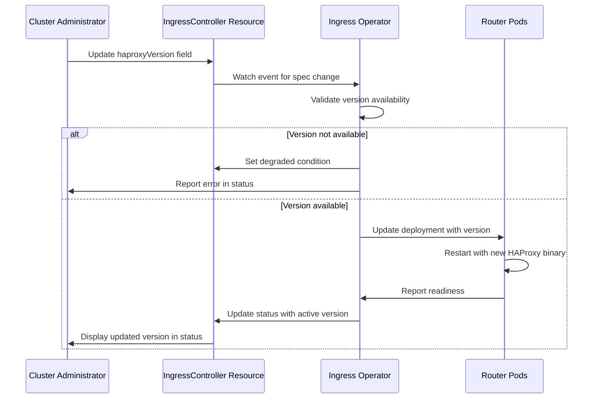

# Select HAProxy Version

## Summary

This enhancement proposes adding the ability for cluster administrators to
select specific HAProxy versions for IngressControllers, decoupling HAProxy
version upgrades from OpenShift cluster upgrades. This allows administrators
to test new HAProxy versions independently before deploying them to
production workloads, reducing the risk of application outages during
cluster upgrades. The feature will be available starting with OpenShift 5.0.

## Motivation

Router and the HAProxy implementation are critical components of the
OpenShift environment. They are responsible for exposing applications
outside of the cluster, and even minimal changes during upgrades can lead
to applications misbehaving or experiencing outages. Currently, HAProxy
versions are tightly coupled with OpenShift releases, forcing all
IngressControllers to upgrade HAProxy simultaneously during cluster
upgrades.

By adding the ability to select HAProxy versions, system administrators can:
- Preserve the HAProxy version from a previous OpenShift release during
  cluster upgrades
- Test new HAProxy versions on non-production IngressControllers before
  promoting to production
- Manage risk more effectively during upgrade cycles
- Maintain stability for critical production applications while exploring
  newer versions

### User Stories

As a cluster administrator, I want to upgrade my OpenShift cluster without
simultaneously upgrading HAProxy on production IngressControllers, so that I
can reduce the risk of application outages during the upgrade process.

As a cluster administrator, I want to create a test IngressController with
a newer HAProxy version, so that I can validate the behavior of the new
version before deploying it to production workloads.

As a cluster administrator, I want to gradually migrate my IngressControllers
from one LTS OpenShift version's HAProxy to the next, so that I can manage
changes incrementally across multiple OpenShift releases.

As a cluster administrator, I want to downgrade an existing IngressController
to a previous HAProxy version, so that I can resolve a critical outage or
degradation caused by a later HAProxy version.

As a platform operations team, I want to monitor and manage HAProxy versions
across multiple IngressControllers at scale, so that I can ensure
consistency and track version adoption across the cluster.

### Goals

- Enable cluster administrators to select HAProxy versions for individual
  IngressControllers independently of OpenShift cluster version
- Support exactly 3 distinct HAProxy versions simultaneously: the current
  OpenShift release and the 2 previous minor releases (e.g., OCP 5.1, 5.0,
  4.22), provided they are actively supported by Red Hat
- Provide a 1:1 mapping from OCP version to the default HAProxy version for
  that release (e.g., `haproxyVersion: "OCP-4.22"` always uses the default
  HAProxy version from OCP 4.22), providing an intuitive correlation between
  OCP versions and HAProxy versions (see Alternative API Approach #2 for a
  rejected approach using abstract version identifiers)
- Allow testing new HAProxy versions on dedicated IngressControllers before
  production deployment
- Maintain compatibility with dynamic HAProxy compilation and required
  dependencies (pcre, openssl, FIPS libraries)
- Default to the HAProxy version from the current OpenShift release when no
  explicit version is selected

### Non-Goals

- Backporting HAProxy versions from newer OpenShift releases to older
  clusters
- Providing formal support for custom HAProxy versions or images not shipped
  with supported OpenShift releases (though the mechanism may technically
  allow custom versions in an unsupported configuration - see Open Question #12)
- Allowing selection of specific HAProxy version numbers (e.g., "2.8.5") in
  the standard supported configuration - only OCP version references are
  supported (e.g., "OCP-4.22")
- Providing version selection for other ingress components beyond HAProxy
  itself (router code, templates, etc.)
- Supporting more or fewer than exactly 3 distinct HAProxy versions
  simultaneously (except for OCP 5.0 which supports 2)
- Supporting OCP versions older than current minus 2 (e.g., on OCP 5.1,
  cannot select OCP-4.21 or older)

## Proposal

This enhancement proposes adding a new field to the IngressController API
that allows administrators to specify which HAProxy version to use. The
version is referenced by OpenShift release version (e.g., "OCP-4.21") or
the special value "Current" (default) which always uses the default
HAProxy version on the current OpenShift release.

When an administrator specifies an OpenShift release version, the
IngressController will use the HAProxy version that shipped with that
specific OpenShift release. The ingress-controller-operator will manage the
deployment of the appropriate HAProxy binary and its dependencies (pcre,
openssl, FIPS libraries) to support the selected version.

Exactly 3 distinct HAProxy versions will be supported simultaneously
(current OCP version, previous minor version, and two versions back),
allowing administrators to migrate across OpenShift versions while
preserving HAProxy versions during the transition period. Each OCP version
has a 1:1 mapping to a specific HAProxy version. The feature begins with
OCP 5.0.

**Exception**: OCP 5.0 will support only 2 versions (5.0 and 4.22) as it is
the first release where this feature becomes available. Starting with OCP
5.1, exactly 3 versions will be supported (e.g., 5.1, 5.0, and 4.22).

**Implementation Approach**: This feature will be implemented using a sidecar
deployment model where HAProxy runs in a separate container alongside the
main router container. Each supported HAProxy version is packaged in its own
dedicated container image, providing clean separation of concerns and
independent versioning. See the Implementation section below for detailed
information.

### Workflow Description

**cluster administrator** is a human user responsible for managing
OpenShift cluster infrastructure and upgrades.

#### Selecting a HAProxy Version

1. The cluster administrator reviews the current OpenShift release notes and
   identifies the HAProxy version shipped with the new release.
2. The cluster administrator creates or updates an IngressController resource,
   specifying the desired HAProxy version in the new API field (e.g.,
   `haproxyVersion: "OCP-5.0"` or `haproxyVersion: "Current"`).
3. The ingress-controller-operator validates the requested version is
   available and supported.
4. The operator updates the IngressController deployment to use the
   specified HAProxy version and its matching dependencies.
5. The router pods restart with the selected HAProxy version.
6. The cluster administrator verifies the IngressController status reflects
   the selected version and routes are functioning correctly.

#### Testing a New HAProxy Version Before Production

1. The cluster administrator creates a new IngressController with
   `haproxyVersion: "Current"` to test the latest HAProxy version.
2. The cluster administrator configures test routes to use the new
   IngressController via domain or namespace selectors.
3. The cluster administrator runs tests against the test IngressController
   to validate HAProxy behavior.
4. Once validated, the cluster administrator updates production
   IngressControllers to use `haproxyVersion: "Current"` or the specific
   OpenShift version.

#### Upgrading OpenShift with HAProxy Version Control

1. The cluster administrator initiates an OpenShift cluster upgrade from
   version 5.0 to 5.1.
2. For IngressControllers with `haproxyVersion: "Current"`, the operator
   automatically upgrades to the HAProxy version from OpenShift 5.1.
3. For IngressControllers with `haproxyVersion: "OCP-5.0"`, the operator
   preserves the HAProxy version from OpenShift 5.0.
4. The cluster administrator validates production applications on
   IngressControllers running HAProxy from OpenShift 5.0.
5. The cluster administrator gradually updates production IngressControllers
   to use newer HAProxy versions after validation.



### API Extensions

This enhancement modifies the existing IngressController CRD
(`operator.openshift.io/v1`) to add a new optional field for specifying
the HAProxy version.

The proposed API fields for the IngressController spec:

```go
// HAProxyVersion specifies which HAProxy version to use for this
// IngressController. Valid values are:
// - "Current" (default): Use the HAProxy version from the current OpenShift
//   release (the most recent version available)
// - "OCP-X.Y": Use the HAProxy version from OpenShift release X.Y
//
// Each OpenShift version has a 1:1 mapping to a specific HAProxy version.
// Exactly 3 versions are supported: the current OpenShift release and the 2
// prior minor releases, provided they are actively supported by Red Hat.
//
// +optional
// +kubebuilder:default="Current"
// +kubebuilder:validation:Pattern=`^(Current|OCP-[0-9]+\.[0-9]+)$`
// +openshift:enable:FeatureGate=SelectableHAProxyVersion
HAProxyVersion string `json:"haproxyVersion,omitempty"`
```

The proposed API fields for the IngressController status:

```go
// EffectiveHAProxyVersion reports the OCP version determining the HAProxy
// version currently in use by this IngressController. This reflects the
// resolved value of the spec.haproxyVersion field.
//
// Examples:
// - "OCP-5.0": Using HAProxy from OpenShift 5.0
// - "OCP-4.22": Using HAProxy from OpenShift 4.22
//
// The actual HAProxy binary version number is available through HAProxy's
// own metrics.
//
// +optional
EffectiveHAProxyVersion string `json:"effectiveHAProxyVersion,omitempty"`
```

The validation pattern `^(Current|OCP-[0-9]+\.[0-9]+)$` ensures that only
"Current" or properly formatted "OCP-X.Y" values (e.g., "OCP-5.0",
"OCP-4.22") are accepted. Additional validation logic in the operator will
verify that the specified OCP version is available and supported.

The field will be gated behind the `SelectableHAProxyVersion` feature gate
and will only appear in the CRD when the feature gate is enabled.

This modification does not change the behavior of existing IngressController
resources. When the field is not specified or set to "Current", the
IngressController will use the latest HAProxy version, maintaining backward
compatibility.

### Topology Considerations

#### Hypershift / Hosted Control Planes

This enhancement works with Hypershift deployments. The HAProxy version
selection applies to IngressControllers in both the management cluster and
guest clusters. The ingress-controller-operator in each context manages the
appropriate HAProxy binaries and dependencies.

#### Standalone Clusters

This enhancement is fully applicable to standalone clusters and represents
the primary use case. Administrators can manage HAProxy versions
independently across multiple IngressControllers.

#### Single-node Deployments or MicroShift

For Single-Node OpenShift (SNO) deployments, this enhancement provides the
same benefits as standalone clusters. Resource consumption is minimal as
only the selected HAProxy binary and its dependencies are loaded.

For MicroShift, this enhancement may not be directly applicable as
MicroShift has a different ingress architecture. If MicroShift adopts
IngressController resources in the future, this enhancement could be
extended to support it.

#### OpenShift Kubernetes Engine

This enhancement works with OpenShift Kubernetes Engine (OKE) as it relies
on standard IngressController resources which are available in OKE.

### Implementation Details

#### Chosen Implementation: External HAProxy Images with Sidecar Deployment

This implementation deploys HAProxy as a separate sidecar container alongside the
main router container. Each supported HAProxy version is packaged in its own
dedicated container image. One HAProxy sidecar image is built per OCP version,
with a 1:1 mapping between OCP version and HAProxy version.

**Pod Structure**:
```yaml
spec:
  initContainers:
  - name: init-router-config
    image: registry.redhat.io/openshift4/ose-haproxy-router:v5.0
    # Run script to copy static files (error pages) and templates to shared volume
    command: ["/usr/local/bin/init-haproxy-files.sh"]
    volumeMounts:
    - name: haproxy-shared
      mountPath: /mnt/shared
  containers:
  - name: router
    image: registry.redhat.io/openshift4/ose-haproxy-router:v5.0
    # Router logic, template rendering, route watching
    volumeMounts:
    - name: haproxy-shared
      mountPath: /var/lib/haproxy
  - name: haproxy
    image: registry.redhat.io/openshift4/ose-haproxy:4.22
    # HAProxy binary with its dependencies
    volumeMounts:
    - name: haproxy-shared
      mountPath: /var/lib/haproxy
  volumes:
  - name: haproxy-shared
    emptyDir: {}
```

The init container runs from the router image and executes a shell script to
copy static files (error pages, scripts) and HAProxy configuration templates
from the router image filesystem to the shared emptyDir volume. The router
container generates HAProxy configuration and writes it to the shared volume.
The router communicates with HAProxy through the HAProxy admin socket (also
on the shared volume) to trigger configuration reloads and manage the HAProxy
process.

**Advantages**:
- Clean separation of concerns (router logic vs HAProxy runtime)
- Smaller individual images
- Independent versioning and updates
- No library isolation complexity
- Only selected version image is pulled
- HAProxy image can be updated independently

**Disadvantages**:
- Requires pod structure changes (init container + sidecar)
- Minimal additional container overhead
- Requires special handling if using new features from a newer HAProxy
  version, not available on an older one
- Init container needed for static files and initial configuration
- Operator must maintain mapping from OCP version to HAProxy sidecar image
- More complex startup sequence

### Alternative Implementation Approaches

During the design phase, two alternative approaches were considered but not
selected. These are documented here for completeness and future reference.

#### Alternative 1: Multiple HAProxy Versions in Single Router Image

This proposal packages all supported HAProxy versions (up to 3) within the
existing router container image. Each HAProxy version is installed with its
complete set of direct dependencies (pcre, openssl, FIPS libraries) and
indirect dependencies (libc and other system libraries), ensuring complete
isolation and compatibility. Isolation is achieved through one of three
sub-approaches.

**Directory Structure Example**:
```
/usr/local/haproxy/
  4.22/
    bin/haproxy
    lib/libpcre.so.1
    lib/libssl.so.3
    lib/libc.so.6           # libc and other system libraries
    lib/...                 # additional system libraries
    lib64/ossl-modules/fips.so
  5.0/
    bin/haproxy
    lib/libpcre.so.1
    lib/libssl.so.3
    lib/libc.so.6           # libc and other system libraries
    lib/...                 # additional system libraries
    lib64/ossl-modules/fips.so
  5.1/
    bin/haproxy
    lib/libpcre.so.1
    lib/libssl.so.3
    lib/libc.so.6           # libc and other system libraries
    lib/...                 # additional system libraries
    lib64/ossl-modules/fips.so
```

**Sub-Proposal 1.a: chroot Isolation**

Start HAProxy using `chroot` to isolate each version's file system view. Each
HAProxy version directory contains its required direct dependencies (pcre,
openssl, FIPS modules), indirect dependencies (libc and other system
libraries), and a complete directory structure for HAProxy operation,
including configuration files, certificates, and runtime state.

**Directory Structure Example**:
```
/usr/local/haproxy/4.22/
  bin/haproxy
  lib/libpcre.so.1
  lib/libc.so.6           # libc and other system libraries
  lib/...                 # additional system libraries
  lib64/libssl.so.3
  lib64/ossl-modules/fips.so
  var/lib/haproxy/conf/haproxy.config
  var/lib/haproxy/certs/
  var/lib/haproxy/run/admin.sock
```

The router process runs inside the chroot environment and manages all
HAProxy-related files (configuration, certificates from Secrets, admin socket)
directly within the chroot filesystem.

Advantages:
- Strong isolation between HAProxy versions
- No environment variable conflicts
- Clear separation of dependencies
- Router and HAProxy both run in isolated environment

Disadvantages:
- Requires complete directory structure for each version
- Router process must run within chroot environment
- Requires privileged container permissions for chroot operation
- Potential compatibility issues with older libraries (from older OCP versions)
  running on newer kernels, particularly for FIPS libraries

**Sub-Proposal 1.b: Environment Variable Isolation**

Use `LD_LIBRARY_PATH` to point to version-specific library directories and
`OPENSSL_MODULES` to specify the correct FIPS module location. The router
entrypoint script sets these variables before executing the appropriate HAProxy
binary.

Example startup:
```bash
export LD_LIBRARY_PATH="/usr/local/haproxy/5.0/lib:/usr/local/haproxy/5.0/lib64"
export OPENSSL_MODULES="/usr/local/haproxy/5.0/lib64/ossl-modules"
/usr/local/haproxy/5.0/bin/haproxy -f /var/lib/haproxy/conf/haproxy.config
```

Advantages:
- Simpler implementation than chroot
- No special permissions required
- Straightforward library path management

Disadvantages:
- Environment variables affect entire process
- Potential conflicts if libraries are not fully isolated
- Requires careful ordering of library paths
- Possible conflict between the library loader (from the OS) and the libc
  version being loaded (from the dynamic HAProxy dependencies)

**Sub-Proposal 1.c: Manual Library Loader Invocation**

Directly invoke a version-specific dynamic linker with `--library-path` to
specify version-specific library directories. Each HAProxy version includes
its own copy of the dynamic linker (ld-linux) alongside its other libraries,
avoiding dependency issues between the linker and the libc version. This
provides explicit control over library resolution without relying on
environment variables. HAProxy does not use `dlopen()` for dynamic
dependencies, so this approach handles all required library loading.

**Directory Structure Addition**:
```
/usr/local/haproxy/5.0/
  bin/haproxy
  lib/ld-linux-x86-64.so.2  # dynamic linker copied for this version
  lib/libpcre.so.1
  lib/libssl.so.3
  lib/libc.so.6
  lib64/ossl-modules/fips.so
```

Example startup:
```bash
/usr/local/haproxy/5.0/lib/ld-linux-x86-64.so.2 \
  --library-path /usr/local/haproxy/5.0/lib:/usr/local/haproxy/5.0/lib64 \
  /usr/local/haproxy/5.0/bin/haproxy \
  -f /var/lib/haproxy/conf/haproxy.config
```

Advantages:
- Most explicit control over library loading
- No pollution of environment variables
- Can override RPATH/RUNPATH embedded in binaries
- Compatible with HAProxy's library loading model
- Dynamic linker and libc versions match, avoiding incompatibilities

Disadvantages:
- Platform-specific (loader filename differs across architectures)
- More complex command line
- FIPS compliance verification needed for this approach
- Each version must include its own copy of the dynamic linker
- Running process is the library loader, not haproxy

**Common Advantages for Proposal 1**:
- Single container image to manage
- No changes to pod structure
- Straightforward deployment model
- All versions available immediately

**Common Disadvantages for Proposal 1**:
- Complexity in the library isolation
- Requires special handling if using new features from a newer HAProxy
  version, not available on an older one
- Larger image size (multiple HAProxy binaries and dependencies)
- All versions consume image storage even when unused (no deduplication of
  identical libraries across versions)
- Image rebuilds required to update any HAProxy version

#### Alternative 2: Distinct Router Images per HAProxy Version

This proposal creates completely separate router images for each supported
HAProxy version. Each image contains the router code and a single embedded
HAProxy version with its dependencies. All images are built together from the
same source during each OCP release, with only the embedded HAProxy binary
differing. Images are tagged by the target OCP version.

The router and HAProxy evolve together within each image as a complete unit.
The ingress-controller-operator selects the appropriate image based on the
`haproxyVersion` field. Router code bug fixes are applied to all supported
images using the same backport strategy used for patch releases across OCP
versions.

Previous OCP releases provide the router images to newer releases (e.g., the
5.0 and 4.22 router images provide the HAProxy binaries for the ocp5.0 and
ocp4.22 images). See Open Questions for details on the feasibility of this
approach.

Advantages:
- Simplest runtime model (single container, single HAProxy)
- No library isolation complexity
- Smallest individual image sizes
- Clear image-to-version mapping
- Easiest to troubleshoot
- Router and HAProxy evolve together within each image

Disadvantages:
- Router code duplicated across all images
- More complex build and release pipeline
- Bug fixes must be applied to all supported images

### Implementation Details/Notes/Constraints

The implementation using the sidecar deployment model requires the following
high-level code changes:

1. **API Changes**: Add the `haproxyVersion` field to the IngressController
   CRD in the `openshift/api` repository, gated behind the
   `SelectableHAProxyVersion` feature gate.

2. **Feature Gate Registration**: Register the `SelectableHAProxyVersion`
   feature gate in
   https://github.com/openshift/api/blob/master/features/features.go with
   the `TechPreviewNoUpgrade` feature set. The feature gate must
   specify the Jira component, contact person, and link to this enhancement.

3. **Operator Logic**: Update the ingress-controller-operator to:
   - Read and validate the `haproxyVersion` field
   - Map the OCP version to the appropriate HAProxy sidecar container image
     reference
   - Update the router deployment to include the HAProxy sidecar container
     with the selected image
   - Configure the init container to copy static files and templates to the
     shared volume
   - Report the effective HAProxy version in a new IngressController status
     field (e.g., `status.effectiveHAProxyVersion: "OCP-4.22"`) showing the
     OCP version that determines the HAProxy version in use
   - HAProxy's own version number is available through HAProxy's built-in
     metrics

4. **HAProxy Image Management**: Using the sidecar deployment model:
   - Build separate HAProxy container images for each supported OCP version
   - Each HAProxy image includes the HAProxy binary and all its dependencies
     (pcre, openssl, FIPS libraries, libc, and other system libraries)
   - The operator maintains a mapping from OCP version (e.g., "OCP-4.22") to
     the corresponding HAProxy sidecar image reference
   - Maintain compatibility matrices for HAProxy versions and their
     dependencies

5. **Version Validation**: Implement validation to ensure:
   - Only supported OpenShift release versions can be specified (current and
     2 previous minor versions)
   - Only "Current" or "OCP-X.Y" format is accepted
   - Requested OCP versions are available in the current cluster
   - Exactly 3 versions are provided (except OCP 5.0 which provides 2)

6. **Upgrade Handling**: Implement logic to handle cluster upgrades according
   to the specified version policy:
   - "Current" always uses the latest available version
   - Specific versions are preserved if available in the target release
   - Set the ingress ClusterOperator resource's `Upgradeable` condition to
     `False` when any IngressController references a `haproxyVersion` that
     would become unsupported in the target release, preventing cluster
     upgrades until administrators update to "Current" or a supported version.

### Risks and Mitigations

**Risk 1**: Supporting multiple HAProxy versions increases operational complexity
with the sidecar deployment model.

**Mitigation**: Limit support to 3 distinct versions. The sidecar approach
minimizes individual image sizes and only pulls the selected version. Monitor
image size and establish clear deprecation policies. The init container and
sidecar pattern is well-established in Kubernetes, reducing operational risk.

**Risk 2**: Administrators may select outdated HAProxy versions with known
security vulnerabilities.

**Mitigation**: Clearly document supported versions and deprecation
timelines. Provide warnings in the IngressController status when using
older versions. Consider implementing alerts when versions reach
end-of-support.

**Risk 3**: Dependency conflicts between HAProxy versions and their required
libraries (pcre, openssl, FIPS), including potential incompatibilities when
running older libraries from previous OCP releases on newer kernels.

**Mitigation**: Thoroughly test each supported version with its dependencies
on each supported kernel version. Each HAProxy sidecar image is self-contained
with all required dependencies, eliminating library isolation concerns.
Implement robust validation during version selection. Document tested
library/kernel combinations and known incompatibilities.

**Risk 4**: Complexity in troubleshooting when different IngressControllers
run different HAProxy versions.

**Mitigation**: Clearly expose the HAProxy version in IngressController
status. Add metrics and logging to identify which version is running.
Include version information in support bundles.

### Drawbacks

This enhancement introduces additional complexity to the ingress subsystem:
- Increased maintenance burden for supporting multiple HAProxy versions
- Pod structure changes introducing an init container and sidecar container
- Inter-container communication via shared volume for configuration and
  admin socket
- More complex startup sequence with init container copying static files
- Additional testing required for version compatibility matrices
- Potential for configuration drift across IngressControllers
- Operator must maintain mapping from OCP version to HAProxy sidecar image

However, these drawbacks are outweighed by the operational benefits of
reducing upgrade risk and allowing gradual migration of critical production
workloads. The sidecar pattern is well-established in Kubernetes and provides
clean separation of concerns between router logic and HAProxy runtime.

## Alternatives (Not Implemented)

### Alternative Implementation Approaches (Not Selected)

The chosen sidecar deployment model was selected over two alternative
packaging approaches. The alternatives are documented in detail in the
"Alternative Implementation Approaches" section under Implementation Details.
In summary:

- **Alternative 1**: Multiple HAProxy Versions in Single Router Image -
  packages all versions in one image with library isolation via chroot,
  environment variables, or manual library loader invocation. Not selected
  due to image size concerns and library isolation complexity.

- **Alternative 2**: Distinct Router Images per HAProxy Version - creates
  separate router images for each version. Not selected due to build pipeline
  complexity and router code duplication across images.

### Alternative API Approaches (Not Implemented)

#### Alternative 1: Pin to Specific HAProxy Version Numbers

Instead of referencing OpenShift releases, allow administrators to specify
exact HAProxy version numbers (e.g., "2.6.2").

**Why not selected**: This approach would require maintaining and testing
arbitrary HAProxy versions, significantly increasing the support matrix and
maintenance burden. Tying to OpenShift releases ensures only tested and
validated combinations are used.

#### Alternative 2: Limited Number of HAProxy Versions

Use a limited number of HAProxy version identifiers (e.g., "2.8.10", "2.8.18",
"3.2.19") instead of OCP version references. Each identifier would map to a
specific HAProxy version available in the current OCP release.

**Why not selected**: This approach partially solves the difficulties of
Alternative 1 (arbitrary HAProxy version numbers) by limiting the support
matrix to a fixed number of versions. However, it does not provide an easy
or intuitive correlation to the OCP version currently running. Administrators
would need to consult documentation or status fields to understand which
actual HAProxy version or OCP release each identifier represents, making it
less transparent than the OCP-based referencing approach.

#### Alternative 3: Automatic Canary Testing

Implement automatic canary testing where the operator gradually rolls out
new HAProxy versions and monitors for issues.

**Why not selected**: While valuable, this is a more complex feature that
could be built on top of this enhancement in the future. The current
proposal provides the building blocks for manual canary testing by allowing
administrators to create separate IngressControllers with different
versions.

#### Alternative 4: Complete IngressController Image Selection

Allow selection of entire router images rather than just HAProxy versions.

**Why not selected**: This provides too much flexibility and could lead to
unsupported configurations. The goal is specifically to manage HAProxy
version risk while keeping other router components synchronized with the
OpenShift release.

## Open Questions [optional]

1. ~~Which implementation proposal (1, 2, or 3) should be selected for the
   initial implementation?~~ **RESOLVED**: Proposal 2 (External HAProxy Images
   with Sidecar Deployment) has been selected. The sidecar approach provides
   clean separation of concerns, smaller individual images, and independent
   versioning while avoiding library isolation complexity.

2. What telemetry should be collected to track HAProxy version adoption and
   identify potential issues with specific versions?

3. ~~**HAProxy version pinning during initial feature adoption**: Since OCP 5.0
    is the first release where the `haproxyVersion` field becomes available,
    how should administrators pin to OCP 4.22's HAProxy version when upgrading
    from OCP 4.22 to OCP 5.0?~~ **RESOLVED**: The migration should preserve the
    HAProxy version from 4.22 during upgrades from OCP 4.22 to OCP 5.0. The
    migration process will automatically populate the `haproxyVersion` field with
    "OCP-4.22" for all existing IngressControllers during the upgrade to 5.0,
    ensuring HAProxy version stability. Administrators who want to adopt OCP
    5.0's newer HAProxy version must explicitly update the `haproxyVersion` field
    to "Current" after the upgrade completes. This approach prioritizes upgrade
    safety and allows administrators to test and validate the new HAProxy version
    on their own timeline.

4. **FIPS compliance and validation**: How do FIPS requirements impact the
   HAProxy sidecar container?
   - How is FIPS mode validated for each HAProxy version?
   - What are the certification implications of running FIPS-validated
     libraries from older OCP releases on newer kernels?

5. **Version to image mapping**: How does the operator maintain the mapping
   from `haproxyVersion: "OCP-X.Y"` to the HAProxy sidecar container image
   reference?
   - Is the mapping hardcoded in the operator?
   - Stored in an API resource?
   - When is this mapping validated (reconcile time vs cluster upgrade time)?

6. **HAProxy version deprecation and continuous support window**: How should
   we handle HAProxy version support when OCP versions go end-of-life?
   - Example timeline:
     - Day 0: OCP 5.0 releases, supports HAProxy from 5.0 and 4.22
     - Day 90: OCP 5.1 releases, supports HAProxy from 5.1, 5.0, and 4.22
     - Day 180: OCP 4.21 goes EOL (but 4.22, 5.0, 5.1 are still supported)
   - On Day 180, if a cluster is running OCP 5.0 with `haproxyVersion:
     "OCP-4.21"`, should the IngressController:
     - Continue running with OCP 4.21's HAProxy?
     - Set a warning/degraded condition?
     - Be forcibly upgraded to a supported version?
   - Does the support matrix update when an OCP version goes EOL, even for
     clusters not yet upgraded to the next version?
   - How do we communicate the support lifecycle to administrators?

7. **Library compatibility across kernel versions**: What are the risks of
   running older dynamic libraries (pcre, openssl, FIPS modules from OCP 4.22)
   packaged in HAProxy sidecar images on a newer kernel (from OCP 5.1)?
   - Are there known incompatibilities between specific library/kernel
     version combinations?
   - How do we validate compatibility during testing?
   - Should we document supported/tested combinations?

8. ~~**HAProxy sidecar image sourcing**: When building OCP 5.1 with three
   distinct HAProxy sidecar images (containing HAProxy from 5.1, 5.0, and
   4.22), how are the older image versions obtained?~~ **RESOLVED**: Each
   supported HAProxy version is maintained in a distinct repository. When
   building an OCP release (e.g., OCP 5.1), the build process packages HAProxy
   from each of the distinct repositories into separate container images. All
   required HAProxy sidecar images (e.g., images for 5.1, 5.0, and 4.22) are
   included in the OCP bundle for that release. This approach ensures that each
   OCP release ships with all necessary HAProxy versions self-contained, without
   requiring cross-release dependencies or image reuse from previous OCP
   releases.

9. **HAProxy version correlation and visibility**: The IngressController
   status shows the OCP version (e.g., `status.effectiveHAProxyVersion:
   "OCP-5.0"`) and HAProxy exposes its own version number in metrics.
   - Do administrators need an explicit mapping table (OCP version → HAProxy
     version number) in documentation?
   - Should the actual HAProxy version number appear in logs, events, or
     additional status fields?

10. **Version support criteria for 5.x releases with 4.x availability**: Once
    OCP 4.23 and newer 4.x versions start releasing (after OCP 5.0 and 5.x are
    available), what should be the criteria for supported HAProxy versions?
    - How does the "current and 2 previous minor versions" rule apply across
      major version boundaries?
    - Should 5.x releases support HAProxy versions from 4.x releases, or only
      from 5.x releases?
    - Example: If OCP 5.2 and OCP 4.25 are both actively supported, should
      OCP 5.2 allow `haproxyVersion: "OCP-4.25"`?
    - Should there be separate support tracks for 4.x and 5.x?

11. **Custom HAProxy image configuration**: Should administrators be allowed to
    configure their own HAProxy image in an unsupported fashion, instead of
    always relying on the OCP-related ones?
    - Could this be done via a documented but unsupported API field that is
      officially exposed but carries no support guarantees?
    - Alternatively, should this be implemented as a hidden and undocumented
      field that technically works but is not publicly exposed in the API
      schema or documentation?
    - What are the implications for support, security, and FIPS compliance when
      allowing custom images?
    - How does this interact with the supported OCP version mappings?
    - What validations should be applied when a custom image is selected?

## Test Plan

The test plan for this enhancement must include:

**Unit Tests**:
- API validation for the `haproxyVersion` field
- Version selection logic in the operator
- Version compatibility validation
- Upgrade scenario handling

**Integration Tests**:
- IngressController creation with different HAProxy versions
- Switching between HAProxy versions on existing IngressControllers
- Behavior during cluster upgrades with various version configurations
- Validation of version limits (maximum 3 distinct versions)

**E2E Tests**:
All E2E tests must include the `[sig-network-edge]` and the
`[OCPFeatureGate:SelectableHAProxyVersion]` labels for the component, and
appropriate test type labels like `[Suite:openshift/conformance/parallel]`,
`[Serial]`, `[Slow]`, or `[Disruptive]` as needed.

Tests must cover:
- Basic functionality: selecting "Current" and specific OpenShift versions
- Version persistence across cluster upgrades
- Multiple IngressControllers with different HAProxy versions
- Validation that routes work correctly with different HAProxy versions
- Performance and resource consumption with multiple versions
- HAProxy configuration reload functionality via admin socket API
- Init container startup and static file copying
- Sidecar container communication and shared volume functionality

**Negative Tests**:
- Attempting to use unsupported/unavailable versions
- Invalid version format strings
- Verify `Upgradeable=False` condition when attempting to upgrade to an
  OpenShift version that does not support the currently selected
  `haproxyVersion`

## Graduation Criteria

**Testing Requirements**:
- Minimum 5 tests per feature gate
- All tests must run at least 7 times per week
- All tests must run at least 14 times per supported platform
- Tests must be in place at least 14 days before branch cut
- All tests must pass at least 95% of the time
- Tests running on all supported platforms: AWS (HA/Single), Azure (HA),
  GCP (HA), vSphere (HA), Baremetal (HA with IPv4/IPv6/Dual)

### Dev Preview -> Tech Preview

- Ability to select and use different HAProxy versions end-to-end
- End user documentation covering use cases and migration strategies
- API stability with no planned breaking changes
- Sufficient test coverage across supported platforms
- Gather feedback from early adopters
- Metrics exposed for HAProxy version tracking
- Alerts defined for version compatibility issues

### Tech Preview -> GA

- Extensive testing including upgrade and scale scenarios
- At least one full release cycle in Tech Preview
- Available by default with `haproxyVersion: "Current"` behavior
- Telemetry data showing feature adoption and stability
- User-facing documentation in openshift-docs
- Performance testing showing no regression
- Support procedures documented for troubleshooting version issues
- End-to-end tests included in standard conformance suites

### Removing a deprecated feature

N/A - This is a new feature.

## Upgrade / Downgrade Strategy

**Upgrades**:

When upgrading an OpenShift cluster:
1. IngressControllers with `haproxyVersion: "Current"` (or field unset) will
   automatically use the new HAProxy version from the upgraded OpenShift
   release.
2. IngressControllers with `haproxyVersion: "OCP-X.Y"` will preserve the
   specified HAProxy version, provided it is still within the supported
   window (current release and up to 2 previous releases).
3. If a pinned version would become unsupported in the target release
   (older than the target release minus 2), the ingress-controller-operator
   will set the ingress ClusterOperator's `Upgradeable` condition to `False`,
   blocking the cluster upgrade. The administrator must update the version
   selection to "Current" or a supported version before proceeding.

No changes to existing IngressController configurations are required during
upgrades. The default behavior (using the latest HAProxy) is preserved.

**Special Case - Upgrading to OCP 5.0 (First Release with Feature)**:

When upgrading from OCP 4.22 (or earlier) to OCP 5.0, the `haproxyVersion`
field does not exist in the source release. The behavior during this
bootstrapping scenario is addressed in Open Question #3: the migration process
will automatically populate the `haproxyVersion` field with "OCP-4.22" for all
existing IngressControllers during the upgrade to 5.0.

## Version Skew Strategy

This enhancement handles version skew through the following mechanisms:

**Control Plane / Data Plane Skew**:
The ingress-controller-operator (control plane) must support serving
multiple HAProxy versions to router pods (data plane). The operator version
determines which HAProxy versions are available, not the router pod version.

**Multi-Version Support Window**:
The operator maintains compatibility with HAProxy versions from the current
OpenShift release and up to 2 previous releases. During a rolling upgrade,
different router pods may temporarily run different HAProxy versions, which
is acceptable as each IngressController operates independently.

**API Compatibility**:
The new `haproxyVersion` field is optional and gated behind a feature gate.
Older versions of the operator (before the feature) will ignore this field.
Newer versions of the operator will handle both the presence and absence of
the field gracefully.

**Kubelet Compatibility**:
This enhancement does not involve kubelet changes. HAProxy version selection
is entirely managed by the ingress-controller-operator and router pods.

## Operational Aspects of API Extensions

### SLIs for API Extensions

This enhancement modifies an existing CRD (IngressController) but does not
add webhooks or aggregated API servers. The existing SLIs for
IngressController resources apply:

- `cluster-ingress-operator` condition `Available=True`
- `cluster-ingress-operator` condition `Degraded=False`
- IngressController resource status conditions

### Impact on Existing SLIs

**API Throughput**: Minimal impact. The new field is optional and adds
negligible processing overhead during IngressController reconciliation.

**Scalability**: No significant impact. The operator already manages
multiple IngressControllers, and version selection is a one-time decision
during reconciliation.

**API Availability**: No impact. The enhancement does not add API
dependencies or external calls.

### Measurement and Testing

Performance impact will be measured through:
- Existing OpenShift scalability tests that create and manage multiple
  IngressControllers
- Component Readiness regression testing across all supported platforms
- Monitoring IngressController reconciliation times with version selection
  enabled

QE will measure these metrics in standard CI runs for each supported
platform.

## Support Procedures

* **Failure Mode 1**: Requested HAProxy version is not available
   * **Impact**: IngressController enters degraded state, uses fallback version
or refuses to reconcile.
   * **Detection**: IngressController status condition `Degraded=True` with
reason `UnavailableHAProxyVersion`. Operator logs include details about
missing version.
   * **Teams**: Networking team (ingress maintainers) handles escalations.

* **Failure Mode 2**: Dependency mismatch between HAProxy and libraries
   * **Impact**: Router pods fail to start or crash at runtime.
   * **Detection**: Router pod crash loops, readiness probe failures, operator
degraded condition. Logs show library loading errors.
   * **Teams**: Networking team (ingress maintainers) handles escalations.

### Detecting Failures

* **Symptom 1**: IngressController degraded condition
   ```
   oc get ingresscontroller -n openshift-ingress-operator
   ```
   Check for `Degraded=True` status.

* **Symptom 2**: Router pods not running or crash looping
   ```
   oc get pods -n openshift-ingress
   oc logs -n openshift-ingress <router-pod-name>
   ```
   Check for pod status, restart counts, and reason of the restarts in the router
   pod logs.

* **Symptom 3**: Routes not accessible
   Check router pod logs:
   ```
   oc logs -n openshift-ingress <router-pod-name>
   ```
   Look for HAProxy startup errors or library loading failures.

### Graceful Degradation

The feature fails gracefully:
- If a requested version is unavailable, the operator sets a degraded
  condition but keeps the IngressController operational with a fallback
  version
- If dependencies are missing, the operator attempts to use the default
  version and reports the error
- Version validation happens before applying changes, preventing invalid
  configurations from being deployed

When the feature is disabled, IngressControllers automatically resume using
the current default HAProxy version without requiring manual intervention.

## Infrastructure Needed [optional]

The sidecar deployment implementation requires:

- CI infrastructure to test all supported HAProxy versions across platforms
- Build pipeline updates to compile and package multiple HAProxy versions
  as separate sidecar images
- Separate container image registry entries for HAProxy sidecar images
  (e.g., `ose-haproxy:4.22`, `ose-haproxy:5.0`, `ose-haproxy:5.1`)
- Storage for multiple HAProxy sidecar images
- Build pipeline capable of producing HAProxy images for current and
  previous OCP versions
