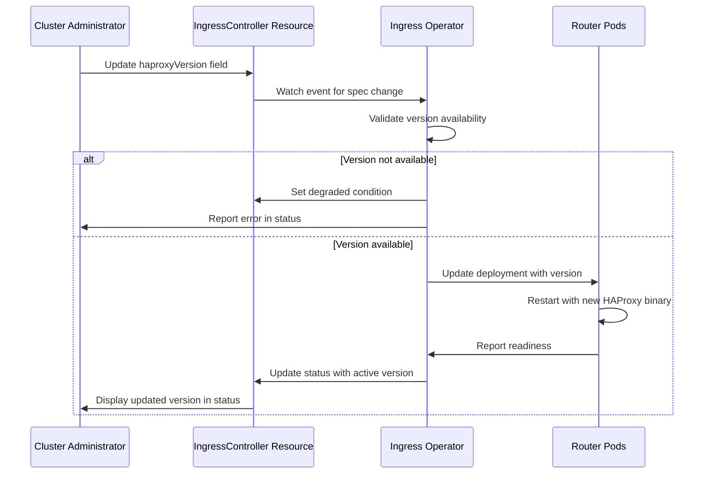

# Select HAProxy Version

## Summary

This enhancement proposes adding the ability for cluster administrators to
select specific HAProxy versions for IngressControllers, decoupling HAProxy
version upgrades from OpenShift cluster upgrades. This allows administrators
to test new HAProxy versions independently before deploying them to
production workloads, reducing the risk of application outages during
cluster upgrades. The feature will be available starting with OpenShift 5.0.

## Motivation

Router and the HAProxy implementation are critical components of the
OpenShift environment. They are responsible for exposing applications
outside of the cluster, and even minimal changes during upgrades can lead
to applications misbehaving or experiencing outages. Currently, HAProxy
versions are tightly coupled with OpenShift releases, forcing all
IngressControllers to upgrade HAProxy simultaneously during cluster
upgrades.

By adding the ability to select HAProxy versions, system administrators can:
- Preserve the HAProxy version from a previous OpenShift release during
  cluster upgrades
- Test new HAProxy versions on non-production IngressControllers before
  promoting to production
- Manage risk more effectively during upgrade cycles
- Maintain stability for critical production applications while exploring
  newer versions

### User Stories

As a cluster administrator, I want to upgrade my OpenShift cluster without
simultaneously upgrading HAProxy on production IngressControllers, so that I
can reduce the risk of application outages during the upgrade process.

As a cluster administrator, I want to create a sharded test IngressController
with a newer HAProxy version, so that I can evaluate the behavior of the new
version before deploying it to production workloads, or evaluate the behavior
in canary test fashion on a small subset of traffic.

As a cluster administrator, I want to gradually migrate my IngressControllers
from one HAProxy version to the next, so that I can manage changes incrementally
across multiple OpenShift releases.

As a cluster administrator, I want to downgrade an existing IngressController
to a previous HAProxy version, so that I can resolve a critical outage or
degradation caused by a later HAProxy version.
 
As a platform operations team, I want to monitor and manage HAProxy versions
across multiple IngressControllers at scale, so that I can ensure
consistency and track version adoption across the cluster.

### Goals

- Enable cluster administrators to select HAProxy versions for individual
  IngressControllers independently of OpenShift cluster version
- Support at most 2 distinct HAProxy versions simultaneously: a pinned version
  from a previous supported release and a new version if introduced in the
  current OpenShift release
- Allow testing new HAProxy versions on dedicated IngressControllers before
  production deployment
- Maintain compatibility with dynamic HAProxy compilation and required
  dependencies (pcre, openssl, FIPS libraries)
- Default to the HAProxy version from the current OpenShift release when no
  explicit version is selected

### Non-Goals

- Backporting HAProxy versions from newer OpenShift releases to older
  clusters
- Providing formal support for custom HAProxy versions or images not shipped
  with supported OpenShift releases (though the mechanism may technically
  allow custom versions in an unsupported configuration - see Open Question #11)
- Allowing selection of specific HAProxy version numbers (e.g., "2.8.5") in
  the standard supported configuration
- Providing version selection for other ingress components beyond HAProxy
  itself (router code, templates, etc.)
- Supporting more than 2 distinct HAProxy versions simultaneously
- Supporting OCP versions older than the previous supported release

## Proposal

This enhancement proposes adding a new field to the IngressController API
that allows administrators to specify which HAProxy version to use. When
the field is unset (the default), it always uses the default HAProxy version
from the current OpenShift release.

When an administrator specifies a HAProxy minor version (e.g., "3.2"), the
IngressController pins that HAProxy version, preserving it across future
cluster upgrades even if the default version changes. When the field is
unset, the IngressController uses the default HAProxy version for the
current OpenShift release. The cluster-ingress-operator manages the
deployment of the appropriate HAProxy binary and its dependencies (pcre,
openssl, FIPS libraries) to support the selected version.

At most 2 distinct HAProxy versions are supported simultaneously: a pinned
version from a previous supported release and a new version if introduced in
the current OpenShift release. The feature begins with OCP 5.0.

**Version Selection Rules**:

Each OpenShift release supports at most 2 distinct HAProxy versions. The
supported values for `haproxyVersion` are:

- **OCP 4.22**: Supports unset and "2.8"
  - Unset and "2.8" uses HAProxy 2.8
  - Note: API-only backport - field available but no operator implementation;
    setting "2.8" allows pinning HAProxy 2.8 when upgrading to 4.23 or 5.0

- **OCP 4.23**: Supports unset, "2.8" and "3.2"
  - Unset uses HAProxy 3.2
  - "3.2" uses HAProxy 3.2 (explicitly pins version during cluster upgrades)
  - "2.8" uses HAProxy 2.8 from the 4.22 release
  - Note: EUS-to-ELC users should upgrade to 4.23 to have the ability to select 
    between HAProxy 2.8 and 3.2 before proceeding to 5.1.

- **OCP 5.0**: Supports unset, "2.8" and "3.2"
  - Unset uses HAProxy 3.2
  - "3.2" uses HAProxy 3.2 (explicitly pins version during cluster upgrades)
  - "2.8" uses HAProxy 2.8 from the 4.22 release
  - Note: Unset and "3.2" use the same HAProxy image; specifying "3.2" explicitly
    pins the version during cluster upgrades

- **OCP 5.1**: Supports unset and "3.2"
  - Unset and "3.2" uses the latest HAProxy 3.2.z available for this OpenShift
    release (pins the minor version; z-stream floats with each OCP release)
  - Note: "2.8" is dropped; HAProxy 2.8 support ends; a future HAProxy version
    may be added for customers to validate

- **OCP 5.2**: Supports unset, "3.2" and "3.4"
  - Unset uses HAProxy 3.4
  - "3.4" uses HAProxy 3.4 (explicitly pins version during cluster upgrades)
  - "3.2" uses the latest HAProxy 3.2.z available for this OpenShift release
  - Note: Unset and "3.4" use the same HAProxy image; specifying "3.4" explicitly
    pins the version during cluster upgrades

- **OCP 5.3**: Supports unset and "3.4"
  - Unset and "3.4" uses the latest HAProxy 3.4.z available for this OpenShift
    release (pins the minor version; z-stream floats with each OCP release)
  - Note: "3.2" is dropped; HAProxy 3.2 support ends; a future HAProxy version
    may be added for customers to validate

- **OCP 5.4**: Supports unset and "3.4"
  - Unset and "3.4" uses the latest HAProxy 3.4.z available for this OpenShift
    release (pins the minor version; z-stream floats with each OCP release)
  - Note: A future HAProxy version may be added for customers to validate

- **OCP 5.5**: Supports unset, "3.4" and "3.6"
  - Unset uses HAProxy 3.6
  - "3.6" uses HAProxy 3.6 (explicitly pins version during cluster upgrades)
  - "3.4" uses the latest HAProxy 3.4.z available for this OpenShift release
  - Note: Unset and "3.6" use the same HAProxy image; specifying "3.6" explicitly
    pins the version during cluster upgrades

**Supported Version Matrix**:

The following table shows which `haproxyVersion` field values are valid for
each OpenShift release, and which HAProxy images are shipped with each release:

| OCP / HAProxy | 2.8 | 3.2 | 3.4 | 3.6 |
|:-------------:|:---:|:---:|:---:|:---:|
| 4.22          | D   |     |     |     |
| 4.23          | P   | D   |     |     |
| 5.0           | P   | D   |     |     |
| 5.1           |     | D   | ?   |     |
| 5.2           |     | P   | D   |     |
| 5.3           |     |     | D   | ?   |
| 5.4           |     |     | D   | ?   |
| 5.5           |     |     | P   | D   |

D = default (unset), P = pinnable, ? = may be added for early validation

**Key Points**:
- Each OCP release ships with at most 2 HAProxy container images
- A release has no previous HAProxy version when it neither introduces a new
  minor nor carries one forward from a prior release
- Unset field always uses the default HAProxy for that release
- **Version transition pattern**: New HAProxy minor versions are introduced
  on ELC releases. The previous pinnable version is dropped one release after
  the new minor version is introduced. For example, OCP 5.2 (ELC) introduces
  HAProxy 3.4, making both "3.2" and "3.4" available in 5.2. Then "3.2" is
  dropped in OCP 5.3 (one release after 3.4 was introduced), leaving only "3.4"
  available through 5.3 and 5.4. When OCP 5.5 (ELC) introduces HAProxy 3.6,
  both "3.4" and "3.6" become available, and "3.4" would be dropped in the
  subsequent release.
  Note: HAProxy 2.8 follows this same pattern - OCP 5.0 introduces HAProxy 3.2,
  and "2.8" is dropped in 5.1 (one release after 3.2 was introduced).
- The OpenShift releases introducing a new HAProxy minor version (e.g., 5.2)
  allow pinning to the current version for upgrade stability, in addition to
  pinning to a previous supported release (e.g., "3.2").

**Implementation Approach**: This feature will be implemented using a sidecar
deployment model where HAProxy runs in a separate container alongside the
main router container. Each supported HAProxy version is packaged in its own
dedicated container image, providing clean separation of concerns and
independent versioning. See the Implementation section below for detailed
information.

### Workflow Description

**cluster administrator** is a human user responsible for managing
OpenShift cluster infrastructure and upgrades.

#### Selecting a HAProxy Version

1. The cluster administrator reviews the current OpenShift release notes and
   identifies the HAProxy version shipped with the new release.
2. The cluster administrator creates or updates an IngressController resource,
   specifying the desired HAProxy version in the new API field (e.g.,
   `haproxyVersion: "3.2"`, or leaving it unset for the default).
3. The cluster-ingress-operator validates the requested version is
   available and supported.
4. The operator updates the IngressController deployment to use the
   specified HAProxy version and its matching dependencies.
5. The router pods restart with the selected HAProxy version.
6. The cluster administrator verifies the IngressController status reflects
   the selected version and routes are functioning correctly.

#### Testing a New HAProxy Version Before Production

1. The cluster administrator creates a new sharded IngressController with
   `haproxyVersion` unset to test the latest HAProxy version.
2. The cluster administrator configures test routes to use the new
   IngressController via route or namespace label selectors.
3. The cluster administrator runs tests against the test IngressController
   to validate HAProxy behavior.
4. Once validated, the cluster administrator updates production
   IngressControllers to leave `haproxyVersion` unset (for the latest) or
   set it to a specific OpenShift version.

#### Upgrading OpenShift with HAProxy Version Control

1. The cluster administrator initiates an OpenShift cluster upgrade from
   version 5.0 to 5.1.
2. For IngressControllers with `haproxyVersion` unset, the operator
   automatically upgrades to the default HAProxy version from OpenShift 5.1.
3. For IngressControllers with `haproxyVersion: "3.2"`, the operator
   preserves the same HAProxy 3.2 used on OpenShift 5.0.
4. The cluster administrator validates production applications on
   IngressControllers running HAProxy from OpenShift 5.0.
5. The cluster administrator gradually updates production IngressControllers
   to use newer HAProxy versions after validation.



### API Extensions

This enhancement modifies the existing IngressController CRD
(`ingresscontrollers.operator.openshift.io/v1`) to add a new optional field for specifying
the HAProxy version.

The proposed API type definitions for OCP 4.22:

```go
type IngressControllerSpec struct {
	// ... existing fields ...

	// haproxyVersion specifies the HAProxy version to use for this
	// IngressController.
	//
	// This field is available in OpenShift 4.22 as an API-only backport with no
	// operator implementation. Setting this field on OpenShift 4.22 allows
	// administrators to pin HAProxy 2.8 before upgrading to OpenShift 5.0, where
	// the operator will honor this setting.
	//
	// Valid values for OpenShift 4.22:
	// - Unset (default): Uses HAProxy 2.8 (the default for OpenShift 4.22)
	// - "2.8": Explicitly pins HAProxy 2.8 for preservation during cluster
	//   upgrade to OpenShift 5.0
	//
	// On OpenShift 4.22, this field has no effect on the running IngressController.
	// It only preserves the administrator's intent for the OpenShift 5.0 upgrade.
	//
	// +optional
	HAProxyVersion HAProxyVersion `json:"haproxyVersion,omitempty"`
}

// HAProxyVersion is a string representing a HAProxy minor version in "X.Y"
// format. The allowed values are constrained by enum validation and vary by
// OpenShift release.
//
// +kubebuilder:validation:Enum="2.8"
type HAProxyVersion string

const (
	// HAProxyVersion28 represents HAProxy 2.8, shipped with OpenShift 4.22.
	HAProxyVersion28 HAProxyVersion = "2.8"
)
```

The proposed API type definitions for OCP 5.0:

```go
type IngressControllerSpec struct {
	// ... existing fields ...

	// haproxyVersion specifies the HAProxy version to use for this
	// IngressController.
	//
	// OpenShift 5.0 introduces HAProxy 3.2 as its default version and supports
	// HAProxy 2.8 from OpenShift 4.22 for migration purposes. When an OpenShift
	// release introduces a new default HAProxy version, that HAProxy version
	// becomes available as a pinnable value in subsequent OpenShift releases,
	// providing a smooth migration path for administrators who want to defer
	// HAProxy upgrades.
	//
	// Valid values for OpenShift 5.0:
	// - Unset (default): Uses HAProxy 3.2 (the default for OpenShift 5.0)
	// - "3.2": Explicitly pins HAProxy 3.2 for preservation during cluster
	//   upgrades to future OpenShift releases
	// - "2.8": Uses HAProxy 2.8 from OpenShift 4.22 (migration support, will
	//   be dropped in the next OpenShift release)
	//
	// If a specific HAProxy version is set and would become unsupported in a
	// target cluster upgrade, a preflight check would block the cluster upgrade,
	// blocking the cluster upgrade until this field is updated to unset or a
	// supported version.
	//
	// +optional
	// +openshift:enable:FeatureGate=IngressControllerMultipleHAProxyVersions
	HAProxyVersion HAProxyVersion `json:"haproxyVersion,omitempty"`
}

type IngressControllerStatus struct {
	// ... existing fields ...

	// effectiveHAProxyVersion reports the HAProxy version currently in use by
	// this IngressController. This reflects the resolved value of the
	// spec.haproxyVersion field. When omitted, the effective value has not yet
	// been resolved by the operator or the feature is not enabled for this cluster.
	//
	// Examples for OpenShift 5.0:
	// - "3.2": Using HAProxy 3.2
	// - "2.8": Using HAProxy 2.8
	//
	// +optional
	// +openshift:enable:FeatureGate=IngressControllerMultipleHAProxyVersions
	EffectiveHAProxyVersion HAProxyVersion `json:"effectiveHAProxyVersion,omitempty"`
}

// HAProxyVersion is a string representing a HAProxy minor version in "X.Y"
// format. The allowed values are constrained by enum validation and vary by
// OpenShift release.
//
// +kubebuilder:validation:Enum="2.8";"3.2"
type HAProxyVersion string

const (
	// HAProxyVersion28 represents HAProxy 2.8, shipped with OpenShift 4.22.
	HAProxyVersion28 HAProxyVersion = "2.8"

	// HAProxyVersion32 represents HAProxy 3.2, introduced in OpenShift 5.0.
	HAProxyVersion32 HAProxyVersion = "3.2"
)
```

The proposed API type definitions for OCP 5.1:

```go
type IngressControllerSpec struct {
	// ... existing fields ...

	// haproxyVersion specifies the HAProxy version to use for this
	// IngressController.
	//
	// OpenShift 5.1 continues with HAProxy 3.2 (same minor version introduced
	// in OpenShift 5.0) and does not introduce a new default HAProxy version.
	//
	// Valid values for OpenShift 5.1:
	// - Unset (default): Uses HAProxy 3.2 (the default for OpenShift 5.1)
	// - "3.2": Uses the latest HAProxy 3.2.z available for this OpenShift
	// release and pins the minor version
	//
	// Note: HAProxy 2.8 support has been dropped in OpenShift 5.1. Upgrading
	// from OpenShift 5.0 with haproxyVersion set to "2.8" is blocked.
	//
	// If a specific HAProxy version is set and would become unsupported in a
	// target cluster upgrade, a preflight check would block the cluster upgrade,
	// blocking the cluster upgrade until this field is updated to unset or a
	// supported version.
	//
	// +optional
	// +openshift:enable:FeatureGate=IngressControllerMultipleHAProxyVersions
	HAProxyVersion HAProxyVersion `json:"haproxyVersion,omitempty"`
}

type IngressControllerStatus struct {
	// ... existing fields ...

	// effectiveHAProxyVersion reports the HAProxy version currently in use by
	// this IngressController. This reflects the resolved value of the
	// spec.haproxyVersion field. When omitted, the effective value has not yet
	// been resolved by the operator or the feature is not enabled for this cluster.
	//
	// For OpenShift 5.1, this field always reports "3.2" when resolved, as both
	// unset and "3.2" use HAProxy 3.2.
	//
	// +optional
	// +openshift:enable:FeatureGate=IngressControllerMultipleHAProxyVersions
	EffectiveHAProxyVersion HAProxyVersion `json:"effectiveHAProxyVersion,omitempty"`
}

// HAProxyVersion is a string representing a HAProxy minor version in "X.Y"
// format. The allowed values are constrained by enum validation and vary by
// OpenShift release.
//
// +kubebuilder:validation:Enum="3.2"
type HAProxyVersion string

const (
	// HAProxyVersion32 represents HAProxy 3.2, introduced in OpenShift 5.0.
	HAProxyVersion32 HAProxyVersion = "3.2"
)
```

The API is updated with each OpenShift release to reflect the supported HAProxy
versions for that release. The enum validation ensures only supported values can
be specified, eliminating the need for runtime validation or ValidatingAdmissionPolicy.
By using enum-based validation at the CRD level, the API is self-documenting and
version-specific validation is enforced declaratively.

The fields will be gated behind the `IngressControllerMultipleHAProxyVersions`
feature gate and will only appear in the CRD when the feature gate is enabled.

This modification does not change the behavior of existing IngressController
resources. When the field is not specified (unset), the IngressController will
use the default HAProxy version in the current OpenShift release, maintaining
backward compatibility.

### Topology Considerations

#### Hypershift / Hosted Control Planes

This enhancement works with Hypershift deployments. The HAProxy version
selection applies to IngressControllers in both the management cluster and
guest clusters. The cluster-ingress-operator in each context manages the
appropriate HAProxy binaries and dependencies.

#### Standalone Clusters

This enhancement is fully applicable to standalone clusters and represents
the primary use case. Administrators can manage HAProxy versions
independently across multiple IngressControllers.

#### Single-node Deployments or MicroShift

For Single-Node OpenShift (SNO) deployments, this enhancement provides the
same benefits as standalone clusters. Resource consumption is minimal as
only the selected HAProxy binary and its dependencies are loaded.

For MicroShift, this enhancement may not be directly applicable as
MicroShift has a different ingress architecture. If MicroShift adopts
IngressController resources in the future, this enhancement could be
extended to support it.

#### OpenShift Kubernetes Engine

This enhancement works with OpenShift Kubernetes Engine (OKE) as it relies
on standard IngressController resources which are available in OKE.

### Implementation Details

#### Chosen Implementation: External HAProxy Images with Sidecar Deployment

This implementation deploys HAProxy as a separate sidecar container alongside the
main router container. Each supported HAProxy version is packaged in its own
dedicated container image. Each OCP release includes at most 2 distinct HAProxy
sidecar images: a pinned version from a previous supported release and a new
version if introduced in the current OpenShift release

**Pod Structure**:
```yaml
spec:
  initContainers:
  - name: init-router-config
    image: registry.redhat.io/openshift4/ose-haproxy-router:v5.0
    # Run script to copy static files (error pages) and templates to shared volume
    command: ["/usr/local/bin/init-haproxy-files.sh"]
    volumeMounts:
    - name: haproxy-shared
      mountPath: /mnt/shared
  containers:
  - name: router
    image: registry.redhat.io/openshift4/ose-haproxy-router:v5.0
    # Router logic, template rendering, route watching
    volumeMounts:
    - name: haproxy-shared
      mountPath: /var/lib/haproxy
  - name: haproxy
    image: registry.redhat.io/openshift4/ose-haproxy:4.22
    # HAProxy binary with its dependencies
    volumeMounts:
    - name: haproxy-shared
      mountPath: /var/lib/haproxy
  volumes:
  - name: haproxy-shared
    emptyDir: {}
```

The init container runs from the router image and executes a shell script to
copy static files (error pages, scripts) and HAProxy configuration templates
from the router image filesystem to the shared emptyDir volume. The router
container generates HAProxy configuration and writes it to the shared volume.
The router communicates with HAProxy through the HAProxy admin socket (also
on the shared volume) to trigger configuration reloads and manage the HAProxy
process.

**Advantages**:
- Clean separation of concerns (router logic vs HAProxy runtime)
- Smaller individual images
- No library isolation complexity
- Only selected version image is pulled
- HAProxy image can be updated independently

**Disadvantages**:
- Requires pod structure changes (init container + sidecar)
- Minimal overhead in the additional sidecar container
- Requires special handling if using new features from a newer HAProxy
  version, not available on an older one
- Init container needed for static files and initial configuration
- Operator must maintain mapping from OCP version to HAProxy sidecar image
- More complex startup sequence

### Alternative Implementation Approaches

During the design phase, two alternative approaches were considered but not
selected. These are documented here for completeness and future reference.

#### Alternative 1: Multiple HAProxy Versions in Single Router Image

This proposal packages all supported HAProxy versions within the existing
router container image. Each HAProxy version is installed with its complete
set of direct dependencies (pcre, openssl, FIPS libraries) and indirect
dependencies (libc and other system libraries), ensuring complete isolation
and compatibility. Isolation is achieved through one of three sub-approaches.

**Directory Structure Example**:
```
/usr/local/haproxy/
  4.22/
    bin/haproxy
    lib/libpcre.so.1
    lib/libssl.so.3
    lib/libc.so.6           # libc and other system libraries
    lib/...                 # additional system libraries
    lib64/ossl-modules/fips.so
  5.2/
    bin/haproxy
    lib/libpcre.so.1
    lib/libssl.so.3
    lib/libc.so.6           # libc and other system libraries
    lib/...                 # additional system libraries
    lib64/ossl-modules/fips.so
```

**Sub-Proposal 1.a: chroot Isolation**

Start HAProxy using `chroot` to isolate each version's file system view. Each
HAProxy version directory contains its required direct dependencies (pcre,
openssl, FIPS modules), indirect dependencies (libc and other system
libraries), and a complete directory structure for HAProxy operation,
including configuration files, certificates, and runtime state.

**Directory Structure Example**:
```
/usr/local/haproxy/4.22/
  bin/haproxy
  lib/libpcre.so.1
  lib/libc.so.6           # libc and other system libraries
  lib/...                 # additional system libraries
  lib64/libssl.so.3
  lib64/ossl-modules/fips.so
  var/lib/haproxy/conf/haproxy.config
  var/lib/haproxy/certs/
  var/lib/haproxy/run/admin.sock
```

The router process runs inside the chroot environment and manages all
HAProxy-related files (configuration, certificates from Secrets, admin socket)
directly within the chroot filesystem.

Advantages:
- Strong isolation between HAProxy versions
- No environment variable conflicts
- Clear separation of dependencies
- Router and HAProxy both run in isolated environment

Disadvantages:
- Requires complete directory structure for each version
- Router process must run within chroot environment
- Requires privileged container permissions for chroot operation
- Potential compatibility issues with older libraries (from older OCP versions)
  running on newer kernels, particularly for FIPS libraries

**Sub-Proposal 1.b: Environment Variable Isolation**

Use `LD_LIBRARY_PATH` to point to version-specific library directories and
`OPENSSL_MODULES` to specify the correct FIPS module location. The router
entrypoint script sets these variables before executing the appropriate HAProxy
binary.

Example startup:
```bash
export LD_LIBRARY_PATH="/usr/local/haproxy/4.22/lib:/usr/local/haproxy/4.22/lib64"
export OPENSSL_MODULES="/usr/local/haproxy/4.22/lib64/ossl-modules"
/usr/local/haproxy/4.22/bin/haproxy -f /var/lib/haproxy/conf/haproxy.config
```

Advantages:
- Simpler implementation than chroot
- No special permissions required
- Straightforward library path management

Disadvantages:
- Environment variables affect entire process
- Potential conflicts if libraries are not fully isolated
- Requires careful ordering of library paths
- Possible conflict between the library loader (from the OS) and the libc
  version being loaded (from the dynamic HAProxy dependencies)

**Sub-Proposal 1.c: Manual Library Loader Invocation**

Directly invoke a version-specific dynamic linker with `--library-path` to
specify version-specific library directories. Each HAProxy version includes
its own copy of the dynamic linker (ld-linux) alongside its other libraries,
avoiding dependency issues between the linker and the libc version. This
provides explicit control over library resolution without relying on
environment variables. HAProxy does not use `dlopen()` for dynamic
dependencies, so this approach handles all required library loading.

**Directory Structure Addition**:
```
/usr/local/haproxy/4.22/
  bin/haproxy
  lib/ld-linux-x86-64.so.2  # dynamic linker copied for this version
  lib/libpcre.so.1
  lib/libssl.so.3
  lib/libc.so.6
  lib64/ossl-modules/fips.so
```

Example startup:
```bash
/usr/local/haproxy/4.22/lib/ld-linux-x86-64.so.2 \
  --library-path /usr/local/haproxy/4.22/lib:/usr/local/haproxy/4.22/lib64 \
  /usr/local/haproxy/4.22/bin/haproxy \
  -f /var/lib/haproxy/conf/haproxy.config
```

Advantages:
- Most explicit control over library loading
- No pollution of environment variables
- Can override RPATH/RUNPATH embedded in binaries
- Compatible with HAProxy's library loading model
- Dynamic linker and libc versions match, avoiding incompatibilities

Disadvantages:
- Platform-specific (loader filename differs across architectures)
- More complex command line
- FIPS compliance verification needed for this approach
- Each version must include its own copy of the dynamic linker
- Running process is the library loader, not haproxy

**Common Advantages for Proposal 1**:
- Single container image to manage
- No changes to pod structure
- Straightforward deployment model
- All versions available immediately

**Common Disadvantages for Proposal 1**:
- Complexity in the library isolation
- Requires special handling if using new features from a newer HAProxy
  version, not available on an older one
- Larger image size (multiple HAProxy binaries and dependencies)
- All versions consume image storage even when unused (no deduplication of
  identical libraries across versions)
- Image rebuilds required to update any HAProxy version

#### Alternative 2: Distinct Router Images per HAProxy Version

This proposal creates completely separate router images for each supported
HAProxy version. Each image contains the router code and a single embedded
HAProxy version with its dependencies. All images are built together from the
same source during each OCP release, with only the embedded HAProxy binary
differing. Images are tagged by the target OCP version.

The router and HAProxy evolve together within each image as a complete unit.
The cluster-ingress-operator selects the appropriate image based on the
`haproxyVersion` field. Router code bug fixes are applied to all supported
images using the same backport strategy used for patch releases across OCP
versions.

Previous OCP releases provide the router images to newer releases (e.g., the
5.0 and 4.22 router images provide the HAProxy binaries for the ocp5.0 and
ocp4.22 images). See Open Questions for details on the feasibility of this
approach.

Advantages:
- Simplest runtime model (single container, single HAProxy)
- No library isolation complexity
- Smallest individual image sizes
- Clear image-to-version mapping
- Easiest to troubleshoot
- Router and HAProxy evolve together within each image

Disadvantages:
- Router code duplicated across all images
- More complex build and release pipeline
- Bug fixes must be applied to all supported images

### Implementation Details/Notes/Constraints

The implementation using the sidecar deployment model requires the following
high-level code changes:

1. **API Changes**: Add the `haproxyVersion` field to the IngressController
   CRD in the `openshift/api` repository, gated behind the
   `IngressControllerMultipleHAProxyVersions` feature gate.

2. **Feature Gate Registration**: Register the `IngressControllerMultipleHAProxyVersions`
   feature gate in
   https://github.com/openshift/api/blob/master/features/features.go with
   the `TechPreviewNoUpgrade` feature set. The feature gate must
   specify the Jira component, contact person, and link to this enhancement.

3. **Operator Logic**: Update the cluster-ingress-operator to:
   - Read and validate the `haproxyVersion` field
   - Map the OCP version to the appropriate HAProxy sidecar container image
     reference
   - Update the router deployment to include the HAProxy sidecar container
     with the selected image
   - Configure the init container to copy static files and templates to the
     shared volume
   - Report the effective HAProxy version in a new IngressController status
     field (e.g., `status.effectiveHAProxyVersion: "2.8"`) showing the
     HAProxy version in use
   - HAProxy's own version number is available through HAProxy's built-in
     metrics

4. **HAProxy Image Management**: Using the sidecar deployment model:
   - Build separate HAProxy container images for each supported OCP version
   - HAProxy is built as an RPM package and the HAProxy sidecar images are
     created by installing HAProxy via dnf, ensuring consistency with standard
     package management practices and dependency resolution
   - Each HAProxy image includes the HAProxy binary and all its dependencies
     (pcre, openssl, FIPS libraries, libc, and other system libraries)
   - The operator maintains a mapping from HAProxy version (e.g., "2.8") to
     the corresponding HAProxy sidecar image reference
   - Maintain compatibility matrices for HAProxy versions and their
     dependencies
   - Each OCP release ships with at most 2 HAProxy sidecar images: one for a
     previous supported version and a new version if introduced in the current
     OpenShift release

5. **Version Validation**: Validation is enforced entirely at the CRD level
   using enum-based validation. Each OpenShift release updates the API definition
   to reflect the supported HAProxy versions for that release:
   - The `HAProxyVersion` type uses `+kubebuilder:validation:Enum` to restrict
     values to only the supported HAProxy versions for the current release
   - For example, OCP 4.22 allows only `"2.8"`, while OCP 5.0 allows `"2.8"` and
     `"3.2"`
   - The enum validation ensures only supported values can be specified, with no
     need for runtime validation, webhooks, or ValidatingAdmissionPolicy
   - The API must be updated with each OpenShift release to add new HAProxy
     versions and remove unsupported ones from the enum
   - At most 2 HAProxy versions are supported in each OCP release

6. **Upgrade Handling**: Implement logic to handle cluster upgrades according
   to the specified version policy:
   - Unset `haproxyVersion` always uses the default HAProxy version in the
     current OpenShift release
   - Specific versions are preserved only if they remain supported in the target
     release
   - If any IngressController references a `haproxyVersion` that would become
     unsupported in the target release, a preflight check would prevent cluster
     upgrades until administrators update to unset or a supported version.

7. **Version Count Rationale**: The decision to support at most 2 distinct
   HAProxy versions simultaneously (the default and a pinned version) provides
   upgrade flexibility while limiting operational complexity. Supporting at most
   2 versions allows administrators to upgrade the OpenShift cluster while
   keeping HAProxy stable, then migrate HAProxy versions independently on their
   own timeline. This balances the need for version control during upgrades
   with the maintenance burden of supporting multiple HAProxy versions.

8. **Resource Allocation for Sidecar Containers**: With the introduction of the
   HAProxy sidecar container, the resource requests must be split between the
   router and HAProxy containers. The total resource allocation increases by a
   factor of 25% from the current single-container deployment:
   - **HAProxy container**: 100m CPU and 256Mi memory requests. HAProxy is
     allocated the majority of resources as it is in the hot path, handling all
     ingress traffic and performing connection management, load balancing, SSL
     termination, and request routing. This is also the allocation of the
     current single-container deployment.
   - **Router container**: 25m CPU and 64Mi memory requests. The router
     container performs route watching, configuration generation, and HAProxy
     management through the admin socket, which are less resource-intensive
     operations compared to traffic handling.
   - **Total**: 125m CPU and 320Mi memory requests across both containers,
     which represents an increase of 25%.
   
   This allocation strategy prioritizes HAProxy performance for traffic handling
   while providing sufficient resources for the router's control plane
   operations.

9. **HAProxy Version Bump Strategy**: HAProxy minor version bumps follow a
   controlled strategy to provide predictable upgrade paths and maintain version
   stability:
   
   **When and why we bump**: OpenShift adopts new HAProxy LTS (Long Term Support)
   versions when they become available from upstream and when the currently
   supported HAProxy version approaches end-of-life. HAProxy LTS releases occur
   approximately once per year. OpenShift releases that do not introduce a new
   default HAProxy version preserves the option to pin the same HAProxy version
   introduced on a previous release. The pinned version receives the latest
   patches available for that minor version in each OpenShift release.
   
   **Version transition pattern**: When an OpenShift release introduces a new
   default HAProxy version, that HAProxy version becomes available as a pinnable
   value in subsequent OpenShift releases. This provides a smooth migration
   path for administrators who want to defer HAProxy upgrades. The previous
   pinnable HAProxy version is dropped in the next OpenShift release,
   maintaining at most 2 distinct HAProxy versions at any time.
   
   For example, when OCP 5.0 introduces HAProxy 3.2, the "3.2" value becomes
   pinnable in 5.1 and later releases. The previous pinnable version "2.8" is
   supported only in OCP 5.0 and is dropped in OCP 5.1. When OCP 5.2 introduces
   HAProxy 3.4, it supports both unset/"3.4" (HAProxy 3.4) and "3.2" (HAProxy 3.2).
   HAProxy 3.4 remains pinnable until the next release that introduces a new
   HAProxy minor version.
   
   **Version progression for OCP 5.0-5.2**:
   - OCP 5.0: Ships HAProxy 3.2 LTS (introduces HAProxy 3.2 as OCP 5.0 default version)
   - OCP 5.1: Ships HAProxy 3.2.z (z-stream patches only)
   - OCP 5.2: Ships HAProxy 3.4 LTS (introduces HAProxy 3.4 as OCP 5.2 default version)
   
   **Pinned version behavior**: When administrators pin to a HAProxy LTS version
   (e.g., `haproxyVersion: "3.2"` on OCP 5.1 or 5.2), they receive the latest
   HAProxy 3.2.z available for that OpenShift release. The pinned value is a
   y-stream contract - the z-stream may change between OCP releases as patches
   are applied. For example, pinning to "3.2" on OCP 5.0 might use HAProxy
   3.2.1, while pinning to "3.2" on OCP 5.1 might use HAProxy 3.2.2.
   
   This strategy ensures that:
   - HAProxy minor version changes are controlled and predictable
   - No frozen release streams or separate CVE backport streams are required
   - The API remains open for explicit z-stream pinning (e.g., "3.2.1") in
     the future if needed
   
   **Future Version opt-in**: In addition to the pinnable previous LTS described
   above, we may ship a newer HAProxy version on any release - including non-ELC
   releases - as an opt-in option for customers to validate ahead of the next
   ELC. The default (unset) continues to use the default HAProxy version for
   that release, while the newer version is available for early adoption by
   explicitly setting it. In the future, the system may be extended to support
   more than 2 versions simultaneously, such as a previous LTS, the current
   standard, and an upcoming version available for early validation.

### Risks and Mitigations

**Risk 1**: Supporting multiple HAProxy versions increases operational complexity
with the sidecar deployment model.

**Mitigation**: Limit support at most 2 distinct versions (the default and a
pinned version from a previous supported release). The sidecar approach minimizes
individual image sizes and only pulls the selected version. Establish clear
deprecation policies. The init container and sidecar pattern is well-established
in Kubernetes, reducing operational risk.

**Risk 2**: Administrators may select outdated HAProxy versions with known
security vulnerabilities.

**Mitigation**: Track CVEs and security vulnerabilities for all supported
HAProxy versions and apply fixes by backporting patches or updating the RPM
builds for each affected version. Clearly document supported versions and
deprecation timelines. Provide warnings in the IngressController status when
using older versions. Consider implementing alerts when versions reach
end-of-support.

**Risk 3**: Dependency conflicts between HAProxy versions and their required
libraries (pcre, openssl, FIPS), including potential incompatibilities when
running older libraries from previous OCP releases on newer kernels.

**Mitigation**: Thoroughly test each supported version with its dependencies
on each supported kernel version. Each HAProxy sidecar image is self-contained
with all required dependencies, eliminating library isolation concerns.
Implement robust validation during version selection. Document tested
library/kernel combinations and known incompatibilities.

**Risk 4**: Complexity in troubleshooting when different IngressControllers
run different HAProxy versions.

**Mitigation**: Clearly expose the HAProxy version in IngressController
status. Add metrics and logging to identify which version is running.
Include version information in the must-gather artifacts.

**Risk 5**: Y-stream floating means the HAProxy z-stream version can change
between OCP releases without the administrator explicitly opting in. For
example, an administrator who sets `haproxyVersion: "3.2"` on OCP 5.0 might
run HAProxy 3.2.1, then after upgrading to OCP 5.1, the same `"3.2"` setting
could resolve to HAProxy 3.2.3. While z-stream updates are generally
backwards-compatible, a behavioral change in a z-stream bump could
unexpectedly affect a user's configuration.

**Mitigation**: Z-stream updates for HAProxy LTS releases are limited to bug
fixes and security patches. The API remains open for explicit z-stream pinning
(e.g., `haproxyVersion: "3.2.1"`) in the future if this proves to be a
concern in practice.

### Drawbacks

This enhancement introduces additional complexity to the ingress subsystem:
- Increased maintenance burden for supporting multiple HAProxy versions
- Pod structure changes introducing an init container and sidecar container
- Inter-container communication via shared volume for configuration and
  admin socket
- More complex startup sequence with init container copying static files
- Additional testing required for version compatibility matrices
- Potential for configuration drift across IngressControllers
- Operator must maintain mapping from OCP version to HAProxy sidecar image

However, these drawbacks are outweighed by the operational benefits of
reducing upgrade risk and allowing gradual migration of critical production
workloads. The sidecar pattern is well-established in Kubernetes and provides
clean separation of concerns between router logic and HAProxy runtime.

## Alternatives (Not Implemented)

### Alternative Implementation Approaches (Not Selected)

The chosen sidecar deployment model was selected over two alternative
packaging approaches. The alternatives are documented in detail in the
"Alternative Implementation Approaches" section under Implementation Details.
In summary:

- **Alternative 1**: Multiple HAProxy Versions in Single Router Image -
  packages all versions in one image with library isolation via chroot,
  environment variables, or manual library loader invocation. Not selected
  due to image size concerns and library isolation complexity.

- **Alternative 2**: Distinct Router Images per HAProxy Version - creates
  separate router images for each version. Not selected due to build pipeline
  complexity and router code duplication across images.

### Alternative API Approaches (Not Implemented)

#### Alternative 1: Arbitrary HAProxy Version Selection

Allow administrators to specify any HAProxy version number, including patch
versions (e.g., "2.6.2", "2.8.5").

**Why not selected**: This approach would require maintaining and testing
arbitrary user-provided HAProxy versions, significantly increasing the support
matrix and maintenance burden. The selected approach limits HAProxy versions to
only the minor versions (e.g., "2.8", "3.2") officially shipped with OpenShift
releases, ensuring only tested and validated combinations are used.

#### Alternative 2: Pin to Specific OCP Release Number

Reference OpenShift release versions (e.g., "5.0", "4.22") instead of HAProxy
versions. Each OCP version would map to the default HAProxy version that shipped
with that OpenShift release.

**Why not selected**: This approach would require supporting more HAProxy
versions simultaneously to enable EUS-to-EUS migration paths (e.g., upgrading
from OCP 4.22 → 4.24 → 4.26 would require HAProxy versions from all three
releases to remain available). The selected approach using direct HAProxy
version references limits support to at most 2 HAProxy minor versions at any
time, reducing the maintenance and testing burden.

#### Alternative 3: Automatic Canary Testing

Implement automatic canary testing where the operator gradually rolls out
new HAProxy versions and monitors for issues.

**Why not selected**: While valuable, this is a more complex feature that
could be built on top of this enhancement in the future. The current
proposal provides the building blocks for manual canary testing by allowing
administrators to create separate IngressControllers with different
versions.

#### Alternative 4: Complete IngressController Image Selection

Allow selection of entire router images rather than just HAProxy versions.

**Why not selected**: This provides too much flexibility and could lead to
unsupported configurations. The goal is specifically to manage HAProxy
version risk while keeping other router components synchronized with the
OpenShift release.

## Open Questions [optional]

1. ~~Which implementation proposal (1, 2, or 3) should be selected for the
   initial implementation?~~ **RESOLVED**: Proposal 2 (External HAProxy Images
   with Sidecar Deployment) has been selected. The sidecar approach provides
   clean separation of concerns, smaller individual images, and independent
   versioning while avoiding library isolation complexity.

2. What telemetry should be collected to track HAProxy version adoption and
   identify potential issues with specific versions?

3. ~~**HAProxy version pinning during initial feature adoption**: How should
    administrators pin to OCP 4.22's HAProxy version when upgrading from OCP
    4.22 to OCP 5.0?~~ **RESOLVED**: The `haproxyVersion` API field is
    backported to OCP 4.22 as an API-only change (no operator implementation).
    Administrators who want to preserve HAProxy 2.8 when upgrading from 4.22 to
    5.0 must explicitly set `haproxyVersion: "2.8"` on their
    IngressControllers while still on OCP 4.22. The field is stored but not
    acted upon on 4.22. When the cluster upgrades to 5.0, the operator honors
    this setting and continues using HAProxy 2.8. If the field is left unset,
    the operator will adopt HAProxy 3.2 on 5.0. There is no automatic migration
    behavior. This approach gives administrators explicit control over the
    HAProxy version transition timing.

4. ~~**FIPS compliance and validation**: How do FIPS requirements impact the
   HAProxy sidecar container?~~ **RESOLVED**: FIPS compliance is already
   validated at the RHEL level. Since each HAProxy sidecar image is built on
   a specific RHEL base image with HAProxy installed via dnf (as an RPM), FIPS
   validation follows the standard RHEL certification process. No additional
   HAProxy-specific FIPS validation is required beyond what RHEL provides.

5. **Version to image mapping**: How does the operator maintain the mapping
   from `haproxyVersion: "X.Y"` to the HAProxy sidecar container image
   reference?
   - Is the mapping hardcoded in the operator?
   - Stored in an API resource?
   - When is this mapping validated (reconcile time vs cluster upgrade time)?

6. ~~**HAProxy version deprecation and continuous support window**: How should
   we handle HAProxy version support when OCP versions go end-of-life?~~
   **RESOLVED**: HAProxy versions from EOL OCP releases that are referenced by
   newer OCP releases should be maintained normally. Although the OCP release
   itself may be EOL, Red Hat continues to support the HAProxy version as long
   as it is included in a supported OCP release. For example, if an older OCP
   release goes EOL but a newer OCP release still supports that version as a
   selectable HAProxy version, Red Hat will continue to maintain and apply
   security fixes to that HAProxy version. Support ends only when the HAProxy
   version is no longer referenced by any supported OCP release.

7. ~~**Library compatibility across kernel versions**: What are the risks of
   running older dynamic libraries (pcre, openssl, FIPS modules from OCP 4.22)
   packaged in HAProxy sidecar images on a newer kernel (from OCP 5.1)?~~
   **RESOLVED**: The sidecar approach eliminates library compatibility concerns.
   Each HAProxy sidecar image uses a specific RHEL version as its base image,
   with HAProxy compiled and packaged as an RPM for that RHEL version. The
   HAProxy binary and all its dependencies are matched to the same RHEL version,
   ensuring compatibility.

8. ~~**HAProxy sidecar image sourcing**: When building OCP 5.1 with two
   distinct HAProxy sidecar images (one for unset and one for pinned "3.2"),
   how are the older image versions obtained?~~ **RESOLVED**:
   Each supported HAProxy version is maintained in a distinct repository. When
   building an OCP release (e.g., OCP 5.1), the build process packages HAProxy
   from each of the distinct repositories into separate container images. All
   required HAProxy sidecar images are included in the OCP bundle for that
   release. This approach ensures that each OCP release ships with all necessary
   HAProxy versions self-contained, without requiring cross-release dependencies
   or image reuse from previous OCP releases.

9. ~~**HAProxy version correlation and visibility**: The IngressController
   status shows the HAProxy version (e.g., `status.effectiveHAProxyVersion:
   "3.2"`) directly. HAProxy also exposes its own version number in metrics.~~
   **RESOLVED**: The current API approach uses `haproxyVersion` field, which
   uses HAProxy version numbers directly (e.g., "3.2", "2.8"), eliminating the
   need for OCP-to-HAProxy version mapping tables. The status field
   `effectiveHAProxyVersion` reports the resolved HAProxy version. Additional
   visibility through logs or events can be added during implementation as
   needed.

10. ~~**Version support criteria for 5.x releases with 4.x availability**: Once
    OCP 4.23 and newer 4.x versions start releasing (after OCP 5.0 and 5.x are
    available), what should be the criteria for supported HAProxy versions?~~
    **RESOLVED**: This is not a problem because OCP 4.23 is the last 4.x series
    version and is functionally equivalent to OCP 5.0. No new 4.x versions will
    be released after 4.23, so there is no need to handle support criteria for
    concurrent 4.x and 5.x releases.

11. **Custom HAProxy image configuration**: Should administrators be allowed to
    configure their own HAProxy image in an unsupported fashion, instead of
    always relying on the officially shipped HAProxy versions?
    - Could this be done via a documented but unsupported API field that is
      officially exposed but carries no support guarantees?
    - Alternatively, should this be implemented as a hidden and undocumented
      field that technically works but is not publicly exposed in the API
      schema or documentation?
    - What are the implications for support, security, and FIPS compliance when
      allowing custom images?
    - How does this interact with the supported OCP version mappings?
    - What validations should be applied when a custom image is selected?

## Test Plan

The test plan for this enhancement must include:

**Unit Tests**:
- API validation for the `haproxyVersion` field
- Version selection logic in the operator
- Version compatibility validation
- Upgrade scenario handling

**Integration Tests**:
- IngressController creation with different HAProxy versions
- Switching between HAProxy versions on existing IngressControllers
- Behavior during cluster upgrades with various version configurations
- Validation of version limits (at most 2 distinct versions per release)

**E2E Tests**:
All E2E tests must include the `[sig-network-edge]` and the
`[OCPFeatureGate:IngressControllerMultipleHAProxyVersions]` labels for the
component, and appropriate test type labels like
`[Suite:openshift/conformance/parallel]`, `[Serial]`, `[Slow]`, or
`[Disruptive]` as needed.

Tests must cover:
- Basic functionality: using unset field (default) and specific OpenShift versions
- Version persistence across cluster upgrades, using API field on OCP 5.0 or newer
- Version persistence when migrating from 4.22 to 5.0, where API field is backported but operator implementation is not available
- Multiple IngressControllers with different HAProxy versions
- Validation that routes work correctly with different HAProxy versions
- Performance and resource consumption with multiple versions
- HAProxy configuration reload functionality via admin socket API
- Init container startup and static file copying
- Sidecar container communication and shared volume functionality

**Negative Tests**:
- Attempting to use unsupported/unavailable versions
- Attempting to migrate to a newer OCP release having an unsupported `haproxyVersion`
- Invalid version format strings

**CI Strategy**:

All existing CI jobs will implicitly test the default HAProxy version.
To cover the previous HAProxy version, a subset of existing nightly periodic
jobs are cloned with a variant suffix (e.g., `-haproxy-prev`) using a CI step
registry step (e.g., `ingress-conf-haproxy-version`) that writes an
IngressController installer manifest to set the previous HAProxy version at
install time. While the feature gate is TechPreviewNoUpgrade, these variants
will be based on the `-techpreview` jobs.

These variants will run on a single platform (e.g., AWS) rather than duplicating
across every platform, since HAProxy behavior is platform-agnostic. The initial
set of previous HAProxy periodic job variants will include:
- E2E conformance (e.g., `e2e-aws-ovn-haproxy-prev`)
- Serial tests (e.g., `e2e-aws-ovn-serial-1of2-haproxy-prev`,
  `e2e-aws-ovn-serial-2of2-haproxy-prev`)
- Z-stream upgrade (e.g., `e2e-aws-ovn-upgrade-haproxy-prev`)
- Minor version upgrade (e.g., `e2e-aws-ovn-upgrade-major-haproxy-prev`)

Additionally, an optional on-demand presubmit (e.g., `e2e-aws-ovn-haproxy-prev`)
will be added to the `openshift/router` and `openshift/cluster-ingress-operator`
repositories, allowing developers to trigger it via `/test` when touching
HAProxy-related code.

All upgrade variants run continuous ingress disruption monitors throughout the
upgrade to detect availability regressions. If the test matrix grows beyond 2
supported HAProxy versions, parameterized CI workflows will replace manually
cloned job variants. This is a starting point — the scope and coverage will be
refined as we coordinate with the TRT/TestPlatform team.

## Graduation Criteria

We will introduce the feature as TechPreviewNoUpgrade during the OpenShift 5.0
development, with the goal of graduating it to GA before it is released.

### Dev Preview -> Tech Preview

N/A.

### Tech Preview -> GA

- Payload tests pass with HAProxy selection enabled
- All known regressions are fixed
- Extensive testing including upgrade scenarios
- End-to-end tests included in standard conformance suites
- Support procedures documented for troubleshooting version issues
- Limitations, such as migration criterias, are documented

### Removing a deprecated feature

N/A - This is a new feature.

## Upgrade / Downgrade Strategy

**Upgrades**:

When upgrading an OpenShift cluster:
1. IngressControllers with `haproxyVersion` unset will automatically use the
   new HAProxy version from the upgraded OpenShift release, except in the case
   of OpenShift 4.22 migration (see the special case below).
2. IngressControllers with `haproxyVersion: "X.Y"` will preserve the
   specified HAProxy version, provided it remains a supported value for the
   target release.
3. If a pinned version would become unsupported in the target release, a
   preflight check would block the cluster upgrade. The administrator must
   unset the field or update it to a supported version before proceeding.

Examples:
- Upgrading from 5.0 to 5.1: `haproxyVersion: "2.8"` is blocked ("2.8" is
  not a valid value on 5.1; administrator must update to unset or "3.2")
- Upgrading from 5.1 to 5.2: `haproxyVersion: "3.2"` is allowed ("3.2" is
  still a valid value on 5.2)

No changes to existing IngressController configurations are required during
upgrades. The default behavior (using the default HAProxy version) is preserved.

**Special Case - Upgrading from OCP 4.22 (API-Only Backport)**:

OCP 4.22 receives an API-only backport of the `haproxyVersion` field. The
API definition is backported, but there is no operator implementation - the
field is stored but not acted upon. This allows administrators to explicitly
express their intent before upgrading to 5.0:

- **To pin HAProxy 2.8 during the upgrade**: Set `haproxyVersion: "2.8"`
  on IngressControllers while still on OCP 4.22. When upgrading to 5.0, the
  operator will honor this setting and continue using HAProxy 2.8.
  
- **To adopt HAProxy 3.2 during the upgrade**: Leave `haproxyVersion` unset
  (the default). When upgrading to 5.0, the operator will use HAProxy 3.2.

There is no automatic migration behavior. Administrators must explicitly set
the field on 4.22 if they want to preserve HAProxy 2.8 when upgrading to 5.0.
This is the only opportunity to pin HAProxy 2.8, as support for "2.8"
is limited to OCP 5.0 and is dropped starting at OCP 5.1.

## Version Skew Strategy

This enhancement handles version skew through the following mechanisms:

**Control Plane / Data Plane Skew**:
The cluster-ingress-operator (control plane) must support serving
multiple HAProxy versions to router pods (data plane). The operator version
determines which HAProxy versions are available, not the router pod version.

**Multi-Version Support Window**:
The operator maintains compatibility with HAProxy versions from the current
OpenShift release and a previously supported release. During a rolling upgrade,
different router pods may temporarily run different HAProxy versions, which
is acceptable.

**API Compatibility**:
The new `haproxyVersion` field is optional and gated behind a feature gate.
Older versions of the operator (before the feature) will ignore this field.
Newer versions of the operator will handle both the presence and absence of
the field gracefully.

**Kubelet Compatibility**:
This enhancement does not involve kubelet changes. HAProxy version selection
is entirely managed by the cluster-ingress-operator and router pods.

## Operational Aspects of API Extensions

N/A. - This feature neither extends the API nor adds webhooks.

## Support Procedures

* **Failure Mode 1**: Requested HAProxy version is not available
   * **Impact**: IngressController enters degraded state, uses fallback version
or refuses to reconcile.
   * **Detection**: IngressController status condition `Degraded=True` with
reason `UnavailableHAProxyVersion`. Operator logs include details about
missing version.
   * **Teams**: Networking team (ingress maintainers) handles escalations.

* **Failure Mode 2**: Dependency mismatch between HAProxy and libraries
   * **Impact**: Router pods fail to start or crash at runtime.
   * **Detection**: Router pod crash loops, readiness probe failures, operator
degraded condition. Logs show library loading errors.
   * **Teams**: Networking team (ingress maintainers) handles escalations.

### Detecting Failures

* **Symptom 1**: IngressController degraded condition
   ```
   oc get ingresscontroller -n openshift-ingress-operator
   ```
   Check for `Degraded=True` status.

* **Symptom 2**: Router pods not running or crash looping
   ```
   oc get pods -n openshift-ingress
   oc logs -n openshift-ingress <router-pod-name>
   ```
   Check for pod status, restart counts, and reason of the restarts in the router
   pod logs.

* **Symptom 3**: Routes not accessible
   Check router pod logs:
   ```
   oc logs -n openshift-ingress <router-pod-name>
   ```
   Look for HAProxy startup errors or library loading failures.

### Graceful Degradation

The feature fails gracefully:
- If a requested version is unavailable, the operator sets a degraded
  condition but keeps the IngressController operational with a fallback
  version
- If dependencies are missing, the operator attempts to use the default
  version and reports the error
- Version validation happens before applying changes, preventing invalid
  configurations from being deployed

When the feature is disabled, IngressControllers automatically resume using
the current default HAProxy version without requiring manual intervention.

## Infrastructure Needed [optional]

The sidecar deployment implementation requires:

- CI infrastructure to test all supported HAProxy versions across platforms
- Build pipeline updates to compile and package HAProxy versions as separate
  sidecar images (2 images per OCP release)
- Separate container image registry entries for HAProxy sidecar images
  (e.g., `ose-haproxy:4.22`, `ose-haproxy:5.2`)
- Storage for HAProxy sidecar images
- Build pipeline capable of producing HAProxy images for current and
  previously supported versions
