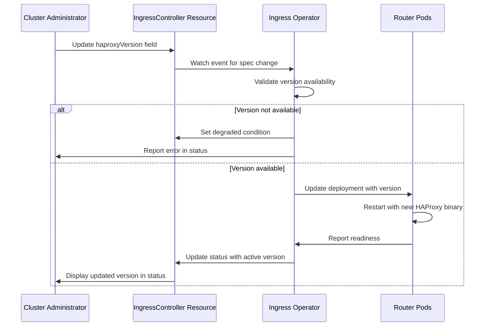

# Select HAProxy Version

## Summary

This enhancement proposes adding the ability for cluster administrators to
select specific HAProxy versions for IngressControllers, decoupling HAProxy
version upgrades from OpenShift cluster upgrades. This allows administrators
to test new HAProxy versions independently before deploying them to
production workloads, reducing the risk of application outages during
cluster upgrades.

## Motivation

Router and the HAProxy implementation are critical components of the
OpenShift environment. They are responsible for exposing applications
outside of the cluster, and even minimal changes during upgrades can lead
to applications misbehaving or experiencing outages. Currently, HAProxy
versions are tightly coupled with OpenShift releases, forcing all
IngressControllers to upgrade HAProxy simultaneously during cluster
upgrades.

By adding the ability to select HAProxy versions, system administrators can:
- Preserve the HAProxy version from a previous OpenShift release during
  cluster upgrades
- Test new HAProxy versions on non-production IngressControllers before
  promoting to production
- Manage risk more effectively during upgrade cycles
- Maintain stability for critical production applications while exploring
  newer versions

### User Stories

As a cluster administrator, I want to upgrade my OpenShift cluster without
simultaneously upgrading HAProxy on production IngressControllers, so that I
can reduce the risk of application outages during the upgrade process.

As a cluster administrator, I want to create a test IngressController with
a newer HAProxy version, so that I can validate the behavior of the new
version before deploying it to production workloads.

As a cluster administrator, I want to gradually migrate my IngressControllers
from one LTS OpenShift version's HAProxy to the next, so that I can manage
changes incrementally across multiple OpenShift releases.

As a platform operations team, I want to monitor and manage HAProxy versions
across multiple IngressControllers at scale, so that I can ensure
consistency and track version adoption across the cluster.

### Goals

- Enable cluster administrators to select HAProxy versions for individual
  IngressControllers independently of OpenShift cluster version
- Support preservation of HAProxy versions from the current OpenShift
  release and up to 2 previous releases to facilitate LTS-to-LTS migrations
- Allow testing new HAProxy versions on dedicated IngressControllers before
  production deployment
- Maintain compatibility with dynamic HAProxy compilation and required
  dependencies (pcre, openssl, FIPS libraries)
- Default to latest available HAProxy version when no explicit version is
  selected

### Non-Goals

- Backporting HAProxy versions from newer OpenShift releases to older
  clusters
- Allowing selection of arbitrary HAProxy versions not shipped with
  supported OpenShift releases
- Providing version selection for other ingress components beyond HAProxy
  itself (router code, templates, etc.)
- Supporting more than 3 distinct HAProxy versions simultaneously

## Proposal

This enhancement proposes adding a new field to the IngressController API
that allows administrators to specify which HAProxy version to use. The
version is referenced by OpenShift release version (e.g., "OCP-4.21") or
the special value "Current" (default) which always uses the default
HAProxy version on the current OpenShift release.

When an administrator specifies an OpenShift release version, the
IngressController will use the HAProxy version that shipped with that
specific OpenShift release. The ingress-controller-operator will manage the
deployment of the appropriate HAProxy binary and its dependencies (pcre,
openssl, FIPS libraries) to support the selected version.

Up to 3 distinct HAProxy versions will be supported simultaneously,
allowing administrators to migrate from one LTS OpenShift version to the
next while preserving HAProxy versions during the transition period.

### Workflow Description

**cluster administrator** is a human user responsible for managing
OpenShift cluster infrastructure and upgrades.

#### Selecting a HAProxy Version

1. The cluster administrator reviews the current OpenShift release notes and
   identifies the HAProxy version shipped with the new release.
2. The cluster administrator creates or updates an IngressController resource,
   specifying the desired HAProxy version in the new API field (e.g.,
   `haproxyVersion: "OCP-4.21"` or `haproxyVersion: "Current"`).
3. The ingress-controller-operator validates the requested version is
   available and supported.
4. The operator updates the IngressController deployment to use the
   specified HAProxy version and its matching dependencies.
5. The router pods restart with the selected HAProxy version.
6. The cluster administrator verifies the IngressController status reflects
   the selected version and routes are functioning correctly.

#### Testing a New HAProxy Version Before Production

1. The cluster administrator creates a new IngressController with
   `haproxyVersion: "Current"` to test the latest HAProxy version.
2. The cluster administrator configures test routes to use the new
   IngressController via domain or namespace selectors.
3. The cluster administrator runs tests against the test IngressController
   to validate HAProxy behavior.
4. Once validated, the cluster administrator updates production
   IngressControllers to use `haproxyVersion: "Current"` or the specific
   OpenShift version.

#### Upgrading OpenShift with HAProxy Version Control

1. The cluster administrator initiates an OpenShift cluster upgrade from
   version 4.21 to 4.22.
2. For IngressControllers with `haproxyVersion: "Current"`, the operator
   automatically upgrades to the HAProxy version from OpenShift 4.22.
3. For IngressControllers with `haproxyVersion: "OCP-4.21"`, the operator
   preserves the HAProxy version from OpenShift 4.21.
4. The cluster administrator validates production applications on
   IngressControllers running HAProxy from OpenShift 4.21.
5. The cluster administrator gradually updates production IngressControllers
   to use newer HAProxy versions after validation.



### API Extensions

This enhancement modifies the existing IngressController CRD
(`operator.openshift.io/v1`) to add a new optional field for specifying
the HAProxy version.

The proposed API field:

```go
// HAProxyVersion specifies which HAProxy version to use for this
// IngressController. Valid values are:
// - "Current" (default): Use the latest HAProxy version available in this
//   OpenShift release
// - "OCP-X.Y": Use the HAProxy version from OpenShift release X.Y
//
// Supports the current OpenShift release and up to 2 prior releases,
// starting from "OCP-4.23".
//
// +optional
// +kubebuilder:default="Current"
// +openshift:enable:FeatureGate=SelectableHAProxyVersion
HAProxyVersion string `json:"haproxyVersion,omitempty"`
```

The field will be gated behind the `SelectableHAProxyVersion` feature gate
and will only appear in the CRD when the feature gate is enabled.

This modification does not change the behavior of existing IngressController
resources. When the field is not specified or set to "Current", the
IngressController will use the latest HAProxy version, maintaining backward
compatibility.

### Topology Considerations

#### Hypershift / Hosted Control Planes

This enhancement works with Hypershift deployments. The HAProxy version
selection applies to IngressControllers in both the management cluster and
guest clusters. The ingress-controller-operator in each context manages the
appropriate HAProxy binaries and dependencies.

#### Standalone Clusters

This enhancement is fully applicable to standalone clusters and represents
the primary use case. Administrators can manage HAProxy versions
independently across multiple IngressControllers.

#### Single-node Deployments or MicroShift

For Single-Node OpenShift (SNO) deployments, this enhancement provides the
same benefits as standalone clusters. Resource consumption is minimal as
only the selected HAProxy binary and its dependencies are loaded.

For MicroShift, this enhancement may not be directly applicable as
MicroShift has a different ingress architecture. If MicroShift adopts
IngressController resources in the future, this enhancement could be
extended to support it.

#### OpenShift Kubernetes Engine

This enhancement works with OpenShift Kubernetes Engine (OKE) as it relies
on standard IngressController resources which are available in OKE.

### Implementation Details/Notes/Constraints

The implementation requires the following high-level code changes:

1. **API Changes**: Add the `haproxyVersion` field to the IngressController
   CRD in the `openshift/api` repository, gated behind the
   `SelectableHAProxyVersion` feature gate.

2. **Feature Gate Registration**: Register the `SelectableHAProxyVersion`
   feature gate in
   https://github.com/openshift/api/blob/master/features/features.go with
   the `TechPreviewNoUpgrade` feature set. The feature gate must
   specify the Jira component, contact person, and link to this enhancement.

3. **Operator Logic**: Update the ingress-controller-operator to:
   - Read and validate the `haproxyVersion` field
   - Determine which HAProxy binary and dependencies to use
   - Update the router deployment with the appropriate image or version
     references
   - Report the active HAProxy version in the IngressController status

4. **HAProxy Binary Management**: Since HAProxy is compiled dynamically, the
   implementation must:
   - Package multiple HAProxy versions with their dependencies (pcre,
     openssl, FIPS libraries) in the router image, in a dedicated HAProxy
     image, or as separate artifacts
   - Ensure the correct dynamic libraries are available for each version
     if installed in the same image
   - Maintain compatibility matrices for HAProxy versions and their
     dependencies

5. **Version Validation**: Implement validation to ensure:
   - Only supported OpenShift release versions can be specified
   - Maximum of 3 distinct versions are maintained
   - Requested versions are available in the current cluster

6. **Upgrade/Downgrade Handling**: Implement logic to handle cluster
   upgrades and downgrades according to the specified version policy:
   - "Current" always uses the latest available version
   - Specific versions are preserved if available in the target release
   - Fall back to default if a version becomes unsupported when
     Downgrading
   - Deny cluster upgrades when any IngressController references a
     `haproxyVersion` that would become unsupported in the target release,
     requiring administrators to update to "Current" or a supported version
     first.

### Risks and Mitigations

**Risk 1**: Supporting multiple HAProxy versions increases the image size and
complexity of the router image.

**Mitigation**: Limit support to 3 distinct versions. Consider using
separate container images or layers for different HAProxy versions to
optimize storage. Monitor image size and establish clear deprecation
policies.

**Risk 2**: Administrators may select outdated HAProxy versions with known
security vulnerabilities.

**Mitigation**: Clearly document supported versions and deprecation
timelines. Provide warnings in the IngressController status when using
older versions. Consider implementing alerts when versions reach
end-of-support.

**Risk 3**: Dependency conflicts between HAProxy versions and their required
libraries (pcre, openssl, FIPS).

**Mitigation**: Thoroughly test each supported version with its
dependencies. Package dependencies alongside HAProxy binaries to ensure
compatibility. Implement robust validation during version selection.

**Risk 4**: Complexity in troubleshooting when different IngressControllers
run different HAProxy versions.

**Mitigation**: Clearly expose the HAProxy version in IngressController
status. Add metrics and logging to identify which version is running.
Include version information in support bundles.

### Drawbacks

This enhancement introduces additional complexity to the ingress subsystem:
- Increased maintenance burden for supporting multiple HAProxy versions
- Larger router images or more complex packaging mechanisms
- Additional testing required for version compatibility matrices
- Potential for configuration drift across IngressControllers

However, these drawbacks are outweighed by the operational benefits of
reducing upgrade risk and allowing gradual migration of critical production
workloads.

## Alternatives (Not Implemented)

### Alternative 1: Pin to Specific HAProxy Version Numbers

Instead of referencing OpenShift releases, allow administrators to specify
exact HAProxy version numbers (e.g., "2.6.2").

**Why not selected**: This approach would require maintaining and testing
arbitrary HAProxy versions, significantly increasing the support matrix and
maintenance burden. Tying to OpenShift releases ensures only tested and
validated combinations are used.

### Alternative 2: Automatic Canary Testing

Implement automatic canary testing where the operator gradually rolls out
new HAProxy versions and monitors for issues.

**Why not selected**: While valuable, this is a more complex feature that
could be built on top of this enhancement in the future. The current
proposal provides the building blocks for manual canary testing by allowing
administrators to create separate IngressControllers with different
versions.

### Alternative 3: Complete IngressController Image Selection

Allow selection of entire router images rather than just HAProxy versions.

**Why not selected**: This provides too much flexibility and could lead to
unsupported configurations. The goal is specifically to manage HAProxy
version risk while keeping other router components synchronized with the
OpenShift release.

## Open Questions [optional]

1. What is the exact mechanism for packaging and distributing multiple
   HAProxy versions and their dependencies? Should they be included in the
   router image or distributed separately?

2. How to pin an HAProxy version from OpenShift 4.22 before migrating to 4.23
   or 5.0?

3. What telemetry should be collected to track HAProxy version adoption and
   identify potential issues with specific versions?

## Test Plan

The test plan for this enhancement must include:

**Unit Tests**:
- API validation for the `haproxyVersion` field
- Version selection logic in the operator
- Version compatibility validation
- Upgrade and downgrade scenario handling

**Integration Tests**:
- IngressController creation with different HAProxy versions
- Switching between HAProxy versions on existing IngressControllers
- Behavior during cluster upgrades with various version configurations
- Validation of version limits (maximum 3 distinct versions)

**E2E Tests**:
All E2E tests must include the `[sig-network-edge]` and the
`[OCPFeatureGate:SelectableHAProxyVersion]` labels for the component, and
appropriate test type labels like `[Suite:openshift/conformance/parallel]`,
`[Serial]`, `[Slow]`, or `[Disruptive]` as needed.

Tests must cover:
- Basic functionality: selecting "Current" and specific OpenShift versions
- Version persistence across cluster upgrades
- Fallback behavior during downgrades
- Multiple IngressControllers with different HAProxy versions
- Validation that routes work correctly with different HAProxy versions
- Performance and resource consumption with multiple versions

**Negative Tests**:
- Attempting to use unsupported/unavailable versions
- Invalid version format strings
- Migrate to an OpenShift version not supporting the selected `haproxyVersion`

## Graduation Criteria

**Testing Requirements**:
- Minimum 5 tests per feature gate
- All tests must run at least 7 times per week
- All tests must run at least 14 times per supported platform
- Tests must be in place at least 14 days before branch cut
- All tests must pass at least 95% of the time
- Tests running on all supported platforms: AWS (HA/Single), Azure (HA),
  GCP (HA), vSphere (HA), Baremetal (HA with IPv4/IPv6/Dual)

**Tech Preview**:
- Ability to select and use different HAProxy versions end-to-end
- End user documentation covering use cases and migration strategies
- API stability with no planned breaking changes
- Sufficient test coverage across supported platforms
- Gather feedback from early adopters
- Metrics exposed for HAProxy version tracking
- Alerts defined for version compatibility issues

**Tech Preview -> GA**:
- Extensive testing including upgrade, downgrade, and scale scenarios
- At least one full release cycle in Tech Preview
- Available by default with `haproxyVersion: "Current"` behavior
- Telemetry data showing feature adoption and stability
- User-facing documentation in openshift-docs
- Performance testing showing no regression
- Support procedures documented for troubleshooting version issues
- End-to-end tests included in standard conformance suites

### Removing a deprecated feature

N/A - This is a new feature.

## Upgrade / Downgrade Strategy

**Upgrades**:

When upgrading an OpenShift cluster:
1. IngressControllers with `haproxyVersion: "Current"` (or field unset) will
   automatically use the new HAProxy version from the upgraded OpenShift
   release.
2. IngressControllers with `haproxyVersion: "OCP-X.Y"` will preserve the
   specified HAProxy version, provided it is still within the supported
   window (current release and up to 2 previous releases).
3. If a pinned version would become unsupported in the target release
   (older than the target release minus 2), the cluster upgrade will be
   denied and the administrator must update the version selection before
   proceeding.

No changes to existing IngressController configurations are required during
upgrades. The default behavior (using the latest HAProxy) is preserved.

**Downgrades**:

During cluster downgrades:
1. IngressControllers with `haproxyVersion: "Current"` will use the default
   HAProxy version from the downgraded OpenShift release.
2. IngressControllers with `haproxyVersion: "OCP-X.Y"` will preserve the
   specified version if it is available in the downgraded release.
3. If the specified version is not available in the downgraded release
   (e.g., it was from a newer release), the operator will fall back to the
   default HAProxy version and set a condition indicating the version
   override.

The IngressController will remain available during upgrades and downgrades.
Version transitions may cause brief disruptions as router pods restart with
the new HAProxy binary, following standard voluntary disruption best
practices.

## Version Skew Strategy

This enhancement handles version skew through the following mechanisms:

**Control Plane / Data Plane Skew**:
The ingress-controller-operator (control plane) must support serving
multiple HAProxy versions to router pods (data plane). The operator version
determines which HAProxy versions are available, not the router pod version.

**Multi-Version Support Window**:
The operator maintains compatibility with HAProxy versions from the current
OpenShift release and up to 2 previous releases. During a rolling upgrade,
different router pods may temporarily run different HAProxy versions, which
is acceptable as each IngressController operates independently.

**API Compatibility**:
The new `haproxyVersion` field is optional and gated behind a feature gate.
Older versions of the operator (before the feature) will ignore this field.
Newer versions of the operator will handle both the presence and absence of
the field gracefully.

**Kubelet Compatibility**:
This enhancement does not involve kubelet changes. HAProxy version selection
is entirely managed by the ingress-controller-operator and router pods.

## Operational Aspects of API Extensions

### SLIs for API Extensions

This enhancement modifies an existing CRD (IngressController) but does not
add webhooks or aggregated API servers. The existing SLIs for
IngressController resources apply:

- `cluster-ingress-operator` condition `Available=True`
- `cluster-ingress-operator` condition `Degraded=False`
- IngressController resource status conditions

### Impact on Existing SLIs

**API Throughput**: Minimal impact. The new field is optional and adds
negligible processing overhead during IngressController reconciliation.

**Scalability**: No significant impact. The operator already manages
multiple IngressControllers, and version selection is a one-time decision
during reconciliation.

**API Availability**: No impact. The enhancement does not add API
dependencies or external calls.

### Measurement and Testing

Performance impact will be measured through:
- Existing OpenShift scalability tests that create and manage multiple
  IngressControllers
- Component Readiness regression testing across all supported platforms
- Monitoring IngressController reconciliation times with version selection
  enabled

QE will measure these metrics in standard CI runs for each supported
platform.

## Support Procedures

* **Failure Mode 1**: Requested HAProxy version is not available
   * **Impact**: IngressController enters degraded state, uses fallback version
or refuses to reconcile.
   * **Detection**: IngressController status condition `Degraded=True` with
reason `UnavailableHAProxyVersion`. Operator logs include details about
missing version.
   * **Teams**: Networking team (ingress maintainers) handles escalations.

* **Failure Mode 2**: Dependency mismatch between HAProxy and libraries
   * **Impact**: Router pods fail to start or crash at runtime.
   * **Detection**: Router pod crash loops, readiness probe failures, operator
degraded condition. Logs show library loading errors.
   * **Teams**: Networking team (ingress maintainers) handles escalations.

### Detecting Failures

* **Symptom 1**: IngressController degraded condition
   ```
   oc get ingresscontroller -n openshift-ingress-operator
   ```
   Check for `Degraded=True` status.

* **Symptom 2**: Router pods not running or crash looping
   ```
   oc get pods -n openshift-ingress
   oc logs -n openshift-ingress <router-pod-name>
   ```
   Check for pod status, restart counts, and reason of the restarts in the router
   pod logs.

* **Symptom 3**: Routes not accessible
   Check router pod logs:
   ```
   oc logs -n openshift-ingress <router-pod-name>
   ```
   Look for HAProxy startup errors or library loading failures.

### Graceful Degradation

The feature fails gracefully:
- If a requested version is unavailable, the operator sets a degraded
  condition but keeps the IngressController operational with a fallback
  version
- If dependencies are missing, the operator attempts to use the default
  version and reports the error
- Version validation happens before applying changes, preventing invalid
  configurations from being deployed

When the feature is disabled, IngressControllers automatically resume using
the current default HAProxy version without requiring manual intervention.

## Infrastructure Needed [optional]

Potential infrastructure needs:
- Storage for multiple HAProxy binaries and dependencies in container
  images or artifact repositories
- CI infrastructure to test all supported HAProxy versions across platforms
- Build pipeline updates to compile and package multiple HAProxy versions
