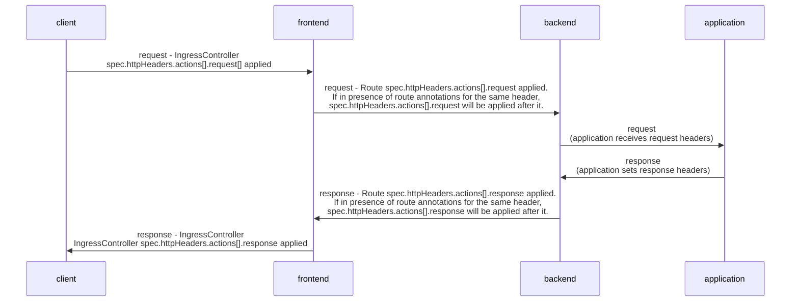

# Set, Delete HTTP Response headers

## Summary

This enhancement extends the IngressController API and Route API to allow the user to set or delete
specific HTTP request and response headers (barring certain headers that it may be dangerous to allow customizing).

## Motivation

Certain HTTP request or response headers may need to be set or deleted to meet security compliance requirements, to prevent cross-site scripting attacks, to share
information about client connections or TLS sessions with backend servers, or to hide information about internal systems from clients.
In OpenShift 3, cluster administrators could use a custom HAProxy configuration template to set or delete headers, but using a custom
template is not permitted in OpenShift 4.

### User Stories

1. As a cluster administrator, I need to configure an IngressController to set or delete certain HTTP request or response headers in order to
   satisfy compliance requirements at the global level (i.e. for all routes) to send or not to send those particular headers to clients.
    - Example 1: As a cluster administrator, I want to set HTTP response headers `X-XSS-Protection: 1; mode=block`, `X-Content-Type-Options: nosniff`, and `X-Frame-Options: SAMEORIGIN` to be sent to all clients
    - Example 2: As a cluster administrator I want to set HTTP request headers such as `Content-Type: text/html; charset=utf-8`, `X-SSL-Client-Cert: %{+Q}[ssl_c_der,base64]`, or `X-Target: %[req.hdr(host),lower]` (using HAProxy's  dynamic value syntax) to be sent to all applications
    - Example 3: As a cluster administrator I want to delete HTTP response headers such as `server` to prevent them from being sent to the client
    - Example 4: As a cluster administrator I want to delete http request headers like `Content-Type` to be not sent to the application

2. As a route owner, I need to configure my Route to set or delete HTTP request or response headers to send or not send them to the client which has connected to the Route
    - Example 1: As a user, I want to set HTTP response headers such as `X-XSS-Protection: 1; mode=block`, `X-Content-Type-Options: nosniff`, and `X-Frame-Options: SAMEORIGIN` to be sent to the client
    - Example 2: As a user, I want to set HTTP request headers such as `X-SSL-Client-Cert: %{+Q}[ssl_c_der,base64]` and `X-Target: %[req.hdr(host),lower]` (using HAProxy's  dynamic value syntax) to be sent to the application
    - Example 3: As a user, I want to delete HTTP response headers such as `X-XSS-Protection` to prevent them from being sent to the client
    - Example 4: As a user I want to delete HTTP request headers such as `server` to prevent them from being sent to the application

### Goals

1. Enable the cluster administrator to specify HTTP response headers in the IngressController CR spec that should be set or
   deleted at the global level when forwarding a response to all clients, i.e. for all routes.
2. Enable the cluster administrator to specify HTTP request headers in the IngressController CR spec that should be set or
   deleted at the global level when forwarding connections to all applications from clients.
3. Enable the route owner to specify HTTP response headers in the Route spec (when it is not a passthrough Route) for their application
   that should be set or deleted when forwarding a response to the client.
4. Enable the route owner to specify HTTP request headers in the Route spec (when it is not a passthrough Route) for their application
   that should be set or deleted when forwarding a connection to the application from a client.
5. Define a hard-coded deny-list of headers which are not allowed to be set or deleted (for example: the `strict-transport-security` header;
   see [Risks and Mitigations](#risks-and-mitigations) for details).
6. Setting dynamic header values for HTTP responses. Allowed sample fetchers are `res.hdr` and `ssl_c_der`. Allowed converters are `lower` and `base64`.
7. Setting dynamic header values for HTTP requests. Allowed sample fetchers are `req.hdr` and `ssl_c_der`. Allowed converters are `lower` and `base64`.
8. Configuration for setting or deleting a header on a Route will override configuration for a header with the same name on the IngressController.


### Non-Goals

1. Validation that each specified value is valid for the respective header (for example: require that either "DENY" or "SAMEORIGIN" is 
   specified for [the `x-frame-options` header](https://developer.mozilla.org/en-US/docs/Web/HTTP/Headers/X-Frame-Options)).
2. Setting load balancing algorithm using header values. Please refer [Open Questions](#open-questions) for more details.
3. Configuring buffer sizes for headers (for example: customizing HAProxy's `tune.bufsize` and `tune.maxrewrite` settings).
4. Modifying headers for a passthrough route. 
5. Providing dedicated API knobs for [appending](http://cbonte.github.io/haproxy-dconv/2.6/configuration.html#4.2-http-response%20add-header) or
   [replacing](http://cbonte.github.io/haproxy-dconv/2.6/configuration.html#4.2-http-response%20replace-header) headers.
6. Allowing sample fetchers other than `req.hdr`, `res.hdr`, and `ssl_c_der` or converters other than `lower` and `base64` in dynamic header values.
   (Additional sample fetchers or converters may be allowed in the future, but not in the initial implementation of this EP.)
7. Allowing conditions like `if` to set header values. For example: `x-frame-options: "%[res.hdr(server)] if { req.hdr(user-agent) -m sub evil}"` 
   Please refer [Open Questions](#open-questions) for more details.
8. Providing a way to prohibit the Route owner from overriding the configuration for an IngressController if the Route and IngressController both set or delete a header with the same name.

## Proposal

### Workflow Description

**Cluster admin** is a human user responsible for deploying a
cluster.

**User** is a human user responsible for developing and
deploying an application in a cluster.
1. Cluster admin wants to set/delete HTTP response or request headers for all the routes of an Ingress Controller.
   Cluster admin edits/creates the CR of the Ingress Controller having Spec as follows -
```yaml
      apiVersion: operator.openshift.io/v1
      kind: IngressController
      spec:
        httpHeaders:
          actions:
            response:
            - name: X-Frame-Options
              action:
                type: Set
                set:
                  value: DENY
            - name: X-Cache-Info
              action:
                type: Set
                set:
                  value: "not cacheable; metadata too large"
            - name: X-XSS-Protection
              action:
                type: Delete
            - name: X-Source
              action:
                type: Set
                set:
                  value: "%[res.hdr(X-Value),lower]"
            request:
            - name: Content-Location
              action:
                type: Set
                set:
                  value: /my-first-blog-post
            - name: X-SSL-Client-Cert
              action:
                type: Set
                set:
                  value: "%{+Q}[ssl_c_der,base64]"
            - name:   Content-Language
              action:
                type: Delete
            - name: X-Target
              action:
                type: Set
                set:
                  value: "%[req.hdr(host),lower]"
```
2. Route owner wants to set/delete HTTP response or request headers for only a specific route.
   Users edits/creates the Route having Spec as follows -
```yaml
      apiVersion: route.openshift.io/v1
      kind: Route
      metadata:
        labels:
          type: sharded
        name: hello-openshift-actions
        namespace: hello-openshift
      spec:
        subdomain: hello-openshift
        tls:
          termination: edge
        to:
          kind: Service
          name: hello-openshift
        httpHeaders:
          actions:
            response:
            - name: X-Frame-Options
              action:
                type: Set
                set:
                  value: DENY
            - name: X-Cache-Info
              action:
                type: Set
                set:
                  value: "not cacheable; metadata too large"
            - name: X-XSS-Protection
              action:
                type: Delete
            - name: X-Source
              action:
                type: Set
                set:
                  value: "%[res.hdr(X-Value),lower]"
            request:
            - name: Content-Location
              action:
                type: Set
                set:
                  value: /my-first-blog-post
            - name: X-SSL-Client-Cert
              action:
                type: Set
                set:
                  value: "%{+Q}[ssl_c_der,base64]"
            - name:   Content-Language
              action:
                type: Delete
            - name: X-Target
              action:
                type: Set
                set:
                  value: "%[req.hdr(host),lower]"
```

### API Extensions

A)  Setting or deleting HTTP request or response headers via `IngressController.spec`.
The existing `IngressControllerHTTPHeaders` Go type definition of the IngressController API is extended by adding a field for header manipulations.
```go
// IngressControllerSpec is the specification of the desired behavior of the
// IngressController.
type IngressControllerSpec struct {
	...
    // httpHeaders defines policy for HTTP headers.
    //
    // If this field is empty, the default values are used.
    //
    // +optional
    HTTPHeaders *IngressControllerHTTPHeaders `json:"httpHeaders,omitempty"`
}
```

```go
// IngressControllerHTTPHeaders specifies how the IngressController handles
// certain HTTP headers.
type IngressControllerHTTPHeaders struct {
	...
	// actions specifies options for performing action on headers.
	// Note that this option only applies to cleartext HTTP connections
	// and to secure HTTP connections for which the ingress controller
	// terminates encryption (that is, edge-terminated or reencrypt
	// connections).  Headers cannot be set or deleted for TLS passthrough
	// connections.
	// Setting HSTS header is supported via another mechanism in Ingress.Spec.RequiredHSTSPolicies.
	// The header settings made here can replace settings made in: cache-control, spec.clientTLS,
	// spec.httpHeaders.forwardedHeaderPolicy, spec.httpHeaders.uniqueId,
	// and spec.httpHeaders.headerNameCaseAdjustments.
	// The header settings made here can be replaced by Route annotations made by users.
	// Setting httpCaptureHeaders for the headers set via this API will not work.
	// Note that the total size of all added headers *after* interpolating dynamic values
	// must not exceed the value of spec.tuningOptions.headerBufferMaxRewriteBytes on the
	// IngressController.
	// +optional
	Actions IngressControllerHTTPHeaderActions `json:"actions,omitempty"`
}
```

```go
// IngressControllerHTTPHeaderActions defines configuration for actions on HTTP request and response headers.
type IngressControllerHTTPHeaderActions struct {
    // response is a list of HTTP response headers to set or delete.
    // The cluster administrator uses these to specify HTTP response headers that should be set or
    // deleted at the global level when forwarding responses from an application to the client, i.e. for all routes.
    // The actions either Set or Delete will be performed on the headers in sequence as defined in the list of response headers.
    // A maximum of 20 response header actions may be configured.
    // Sample fetchers allowed are "res.hdr" and "ssl_c_der".
    // Converters allowed are "lower" and "base64".
    // Examples of header value - "%[res.hdr(X-target),lower]", "%[res.hdr(X-client),base64]", "{+Q}[ssl_c_der,base64]", "{+Q}[ssl_c_der,lower]"
    // + ---
    // + Note: Any change to regex mentioned below must be reflected in the CRD validation of route in https://github.com/openshift/library-go/blob/master/pkg/route/validation/validation.go and vice-versa.
	// +listType=map
    // +listMapKey=name
    // +optional
    // +kubebuilder:validation:MaxItems=20
    // +kubebuilder:validation:XValidation:rule=`self.all(key, key.action.type == "Delete" || (has(key.action.set) && 
    key.action.set.value.matches('^(?:%(?:%|(?:\\{[-+]?[QXE](?:,[-+]?[QXE])*\\})?\\[(?:res\\.hdr\\([0-9A-Za-z-]+\\)|ssl_c_der)(?:,(?:lower|base64))*\\])|[^%[:cntrl:]])+$')))`
   ,message="Either the header value provided is not in correct format or the sample fetcher/converter specified is not allowed.
   The dynamic header value will be interpreted as an HAProxy format string as defined in https://cbonte.github.io/haproxy-dconv/2.4/configuration.html#8.2.4 and 
   may use HAProxy's %[] syntax and otherwise must be a valid HTTP header value as defined in https://datatracker.ietf.org/doc/html/rfc7230#section-3.2. Sample fetchers allowed are res.hdr, ssl_c_der. Converters allowed are lower, base64."
    Response []IngressControllerHTTPHeader `json:"response"`

    // request is a list of HTTP request headers to set or delete.
    // The cluster administrator uses these to specify HTTP request headers that should be set or
    // deleted at the global level when forwarding responses to your application to the client, i.e. for all routes.
    // The actions either Set or Delete will be performed on the headers in sequence as defined in the list of request headers.
    // A maximum of 20 request header actions may be configured.
    // Sample fetchers allowed are "req.hdr" and "ssl_c_der".
    // Converters allowed are "lower" and "base64".
    // Examples of header value - "%[req.hdr(host),lower]", "%[req.hdr(host),base64]", "{+Q}[ssl_c_der,base64]", "{+Q}[ssl_c_der,lower]"
    // + ---
    // + Note: Any change to regex mentioned below must be reflected in the CRD validation of route in https://github.com/openshift/library-go/blob/master/pkg/route/validation/validation.go and vice-versa.
    // +listType=map
    // +listMapKey=name
    // +optional
    // +kubebuilder:validation:MaxItems=20
    // +kubebuilder:validation:XValidation:rule=`self.all(key, key.action.type == "Delete" || (has(key.action.set) && 
    key.action.set.value.matches('^(?:%(?:%|(?:\\{[-+]?[QXE](?:,[-+]?[QXE])*\\})?\\[(?:req\\.hdr\\([0-9A-Za-z-]+\\)|ssl_c_der)(?:,(?:lower|base64))*\\])|[^%[:cntrl:]])+$')))`
    ,message="Either the header value provided is not in correct format or the sample fetcher/converter specified is not allowed.
    The dynamic header value will be interpreted as an HAProxy format string as defined in https://cbonte.github.io/haproxy-dconv/2.4/configuration.html#8.2.4 and
    may use HAProxy's %[] syntax and otherwise must be a valid HTTP header value as defined in https://datatracker.ietf.org/doc/html/rfc7230#section-3.2. Sample fetchers allowed are req.hdr, ssl_c_der. Converters allowed are lower, base64."
    Request []IngressControllerHTTPHeader `json:"request"`
}
```

Headers with the same name are not allowed and must be unique.
```go
// IngressControllerHTTPHeader specifies configuration for setting or deleting an HTTP header.
type IngressControllerHTTPHeader struct {
    // name specifies the name of a header to set or delete.  Its value must be a valid HTTP header.
    // name as defined in RFC 2616 section 4.2.
    // The name must consist only of alphanumeric and the following special characters, `-!#$%&'*+.^_``.
    // It must be no more than 1024 characters in length.
    // A max length of 1024 characters was selected arbitrarily.
	// Header name must be unique.
    // +kubebuilder:validation:Required
    // +kubebuilder:validation:MinLength=1
    // +kubebuilder:validation:MaxLength=1024
    // +kubebuilder:validation:Pattern="^[-!#$%&'*+.0-9A-Z^_`a-z|~]+$"
    // +kubebuilder:validation:XValidation:rule="self.lowerAscii() != 'strict-transport-security'",message="strict-transport-security may not be set/delete via header actions"
    // +kubebuilder:validation:XValidation:rule="self.lowerAscii() != 'proxy'",message="proxy may not be set/delete via header actions"
    // +kubebuilder:validation:XValidation:rule="self.lowerAscii() != 'host'",message="host may not be set/delete via header actions"
    Name string `json:"name"`
    // action specifies actions to perform on headers, such as setting or deleting headers.
    // +kubebuilder:validation:Required
    Action IngressControllerHTTPHeaderActionUnion `json:"action"`
}
```

```go
// IngressControllerHTTPHeaderActionUnion specifies an action to take on an HTTP header.
// +kubebuilder:validation:XValidation:rule="has(self.type) && self.type == 'Set' ?  has(self.set) : !has(self.set)",message="set is required when type is Set, and forbidden otherwise"
// +union
type IngressControllerHTTPHeaderActionUnion struct {
    // type defines the type of the action to be applied on the header.
    // Possible values are Set or Delete.
    // Set allows you to set http request and response headers.
    // Delete allows you to delete http request and response headers.
    // +unionDiscriminator
    // +kubebuilder:validation:Enum:=Set;Delete
    // +kubebuilder:validation:Required
    Type IngressControllerHTTPHeaderActionType `json:"type"`

    // set specifies how the HTTP header should be set.
    // If this field is empty, no action is taken.
    // +optional
    // +unionMember
    Set *IngressControllerSetHTTPHeader `json:"set,omitempty"`
}
```

```go
// IngressControllerHTTPHeaderActionType defines actions that can be performed on HTTP headers.
type IngressControllerHTTPHeaderActionType string

const (
	// Set specifies that an HTTP header should be set.
	Set IngressControllerHTTPHeaderActionType = "Set"
	// Delete specifies that an HTTP header should be deleted.
	Delete IngressControllerHTTPHeaderActionType = "Delete"
)
```

The `IngressControllerSetHTTPHeader` type has a field for specifying a header value.
```go
// IngressControllerSetHTTPHeader defines the value which needs to be set on an HTTP header.
type IngressControllerSetHTTPHeader struct {
	// value specifies a header value.
	// Dynamic values can be added. The value will be interpreted as an HAProxy format string as defined in
	// https://cbonte.github.io/haproxy-dconv/2.4/configuration.html#8.2.4 and may use HAProxy's %[] syntax and
	// otherwise must be a valid HTTP header value as defined in https://datatracker.ietf.org/doc/html/rfc7230#section-3.2.
	// The value of this field must be no more than 16384 characters in length.
	// This limit was selected as most common web servers have a limit of 16384 characters
	// or some lower limit.
	//
	// Note that the total size of all added headers *after* interpolating dynamic values
	// must not exceed the value of spec.tuningOptions.headerBufferMaxRewriteBytes on the
	// IngressController.
	// +kubebuilder:validation:Required
	// +kubebuilder:validation:MinLength=1
	// +kubebuilder:validation:MaxLength=16384
	Value string `json:"value"`
}
```

B) Setting or deleting HTTP request or response headers via `Route.spec`.
```go
type Route struct {
...
    // spec is the desired state of the route
    // +kubebuilder:validation:XValidation:rule="!has(self.tls) || self.tls.termination != 'passthrough' || !has(self.httpHeaders)",message="header actions are not permitted when tls termination is passthrough."
    Spec RouteSpec `json:"spec" protobuf:"bytes,2,opt,name=spec"`
...
}
```

The `RouteSpec` Go type definition of the Route API is extended by adding an optional `HTTPHeaders` field of type `RouteHTTPHeaders`:
```go
type RouteSpec struct {
	...
	// httpHeaders defines policy for HTTP headers.
	//
	// If this field is empty, the default values are used.
	//
	// +optional
	HTTPHeaders RouteHTTPHeaders `json:"httpHeaders,omitempty" protobuf:"bytes,9,opt,name=httpHeaders"`
}	

```

```go
// RouteHTTPHeaders defines policy for HTTP headers.
type RouteHTTPHeaders struct {
	// actions specifies actions to take on headers.
	// Note that this option only applies to cleartext HTTP connections
	// and to secure HTTP connections for which the ingress controller
	// terminates encryption (that is, edge-terminated or reencrypt
	// connections).  Headers cannot be set or deleted for TLS passthrough
	// connections.
	// Setting HSTS header is supported via another mechanism in Ingress.Spec.RequiredHSTSPolicies.
	// The header set using route will override the header set in ingress controller if the headers defined both were the same.
	// Note that the total size of all added headers *after* interpolating dynamic values
	// must not exceed the value of spec.tuningOptions.headerBufferMaxRewriteBytes on the
	// IngressController.
	// +optional
	Actions RouteHTTPHeaderActions `json:"actions,omitempty" protobuf:"bytes,1,opt,name=actions"`
}
```

```go
// RouteHTTPHeaderActions defines configuration for actions on HTTP request and response headers.
type RouteHTTPHeaderActions struct {
	// response is a list of HTTP response headers to set or delete.
    // The actions either Set or Delete will be performed on the headers in sequence as defined in the list of response headers.
    // A maximum of 20 response header actions may be configured.
    // You can use this field to specify HTTP response headers that should be set or deleted
    // when forwarding responses from your application to the client.
    // Sample fetchers allowed are "req.hdr" and "ssl_c_der".
    // Converters allowed are "lower" and "base64".
    // Examples of header value - "%[res.hdr(X-target),lower]", "%[res.hdr(X-client),base64]", "{+Q}[ssl_c_der,base64]", "{+Q}[ssl_c_der,lower]"
	// Note: This field cannot be used if your route uses TLS passthrough.
    // + ---
    // + Note: Any change to regex mentioned below must be reflected in the CRD validation of route in https://github.com/openshift/library-go/blob/master/pkg/route/validation/validation.go and vice-versa.
    // +listType=map
    // +listMapKey=name
    // +optional
    // +kubebuilder:validation:MaxItems=20
    // +kubebuilder:validation:XValidation:rule=`self.all(key, key.action.type == "Delete" || (has(key.action.set) && 
    key.action.set.value.matches(
    '^(?:%(?:%|(?:\\{[-+]?[QXE](?:,[-+]?[QXE])*\\})?\\[(?:res\\.hdr\\([0-9A-Za-z-]+\\)|ssl_c_der)(?:,(?:lower|base64))*\\])|[^%[:cntrl:]])+$')))`
    ,message="Either the header value provided is not in correct format or the sample fetcher/converter specified is not allowed.
    The dynamic header value will be interpreted as an HAProxy format string as defined in https://cbonte.github.io/haproxy-dconv/2.4/configuration.html#8.2.4 and may use HAProxy's %[] syntax and otherwise must be a valid HTTP header value as defined in https://datatracker.ietf.org/doc/html/rfc7230#section-3.2. Sample fetchers allowed are res.hdr, ssl_c_der. Converters allowed are lower, base64."
    Response []RouteHTTPHeader `json:"response" protobuf:"bytes,1,rep,name=response"`
    // request is a list of HTTP request headers to set or delete.
    // The actions either Set or Delete will be performed on the headers in sequence as defined in the list of request headers.
    // A maximum of 20 request header actions may be configured.
    // You can use this field to specify HTTP request headers that should be set or deleted
    // when forwarding connections from the client to your application.
    // Sample fetchers allowed are "req.hdr" and "ssl_c_der".
    // Converters allowed are "lower" and "base64".
    // Examples of header value - "%[req.hdr(host),lower]", "%[req.hdr(host),base64]", "{+Q}[ssl_c_der,base64]", "{+Q}[ssl_c_der,lower]"
    // Note: This field cannot be used if your route uses TLS passthrough.
    // + ---
    // + Note: Any change to regex mentioned below must be reflected in the CRD validation of route in https://github.com/openshift/library-go/blob/master/pkg/route/validation/validation.go and vice-versa.
    // +listType=map
    // +listMapKey=name
    // +optional
    // +kubebuilder:validation:MaxItems=20
    // +kubebuilder:validation:XValidation:rule=`self.all(key, key.action.type == "Delete" || (has(key.action.set) 
	&& key.action.set.value.matches('^(?:%(?:%|(?:\\{[-+]?[QXE](?:,[-+]?[QXE])*\\})?\\[(?:req\\.hdr\\([0-9A-Za-z-]+\\)|ssl_c_der)(?:,(?:lower|base64))*\\])|[^%[:cntrl:]])+$')))`
    ,message="Either the header value provided is not in correct format or the sample fetcher/converter specified is not allowed.
    The dynamic header value will be interpreted as an HAProxy format string as defined in https://cbonte.github.io/haproxy-dconv/2.4/configuration.html#8.2.4 and may use HAProxy's %[] syntax and otherwise must be a valid HTTP header value as defined in https://datatracker.ietf.org/doc/html/rfc7230#section-3.2. Sample fetchers allowed are req.hdr, ssl_c_der. Converters allowed are lower, base64."
    Request []RouteHTTPHeader `json:"request" protobuf:"bytes,2,rep,name=request"`
}
```

Headers with the same name are not allowed and must be unique.
```go
// RouteHTTPHeader specifies configuration for setting or deleting an HTTP header.
type RouteHTTPHeader struct {
	// name specifies a header name to be set or deleted. Its value must be a valid HTTP header.
	// name as defined in RFC 2616 section 4.2.
	// The name must consist only of alphanumeric and the following special characters, `-!#$%&'*+.^_``.
	// It must be no more than 1024 characters in length.
	// A max length of 1024 characters was selected arbitrarily.
	// Header name must be unique.
	// +kubebuilder:validation:Required
	// +kubebuilder:validation:MinLength=1
	// +kubebuilder:validation:MaxLength=1024
	// +kubebuilder:validation:Pattern="^[-!#$%&'*+.0-9A-Z^_`a-z|~]+$"
	// +kubebuilder:validation:XValidation:rule="self.lowerAscii() != 'strict-transport-security'",message="strict-transport-security may not be set/delete via header actions"
	// +kubebuilder:validation:XValidation:rule="self.lowerAscii() != 'proxy'",message="proxy may not be set/delete via header actions"
	Name string `json:"name" protobuf:"bytes,1,opt,name=name"`

	// action specifies actions to perform on headers, such as setting or deleting headers.
	// +kubebuilder:validation:Required
	Action RouteHTTPHeaderActionUnion `json:"action" protobuf:"bytes,2,opt,name=action"`
}
```

```go
// RouteHTTPHeaderActionUnion specifies an action to take on an HTTP header.
// +kubebuilder:validation:XValidation:rule="has(self.type) && self.type == 'Set' ?  has(self.set) : !has(self.set)",message="set is required when type is Set, and forbidden otherwise"
// +union
type RouteHTTPHeaderActionUnion struct {
	// type defines the type of the action to be applied on the header.
	// Possible values are Set or Delete.
	// Set allows you to set http request and response headers.
	// Delete allows you to delete http request and response headers.
	// +unionDiscriminator
	// +kubebuilder:validation:Enum:=Set;Delete
	// +kubebuilder:validation:Required
	Type RouteHTTPHeaderActionType `json:"type" protobuf:"bytes,1,opt,name=type,casttype=RouteHTTPHeaderActionType"`

	// set defines the HTTP header that should be set: added if it doesn't exist or replaced if it does.
	// If this field is empty, no header is added or replaced.
	// +optional
	// +unionMember
	Set *RouteSetHTTPHeader `json:"set,omitempty" protobuf:"bytes,2,opt,name=set"`
}
```

The `RouteSetHTTPHeader` type has a field for specifying a header value for the "Set" action.
```go
// RouteSetHTTPHeader specifies what value needs to be set on an HTTP header.
type RouteSetHTTPHeader struct {
	// value specifies a header value.
	// Dynamic values can be added. The value will be interpreted as an HAProxy format string as defined in
	// https://cbonte.github.io/haproxy-dconv/2.4/configuration.html#8.2.4 and may use HAProxy's %[] syntax and
	// otherwise must be a valid HTTP header value as defined in https://datatracker.ietf.org/doc/html/rfc7230#section-3.2.
	// The value of this field must be no more than 16384 characters in length.
	// This limit was selected as most common web servers have a limit of 16384 characters
	// or some lower limit.
	//
	// Note that the total size of all added headers *after* interpolating dynamic values
	// must not exceed the value of spec.tuningOptions.headerBufferMaxRewriteBytes on the
	// IngressController.
	// +kubebuilder:validation:Required
	// +kubebuilder:validation:MinLength=1
	// +kubebuilder:validation:MaxLength=16384
	Value string `json:"value" protobuf:"bytes,1,opt,name=value"`
}
```

### Implementation Details/Notes/Constraints
A) Setting HTTP headers by cluster admin via IngressController's Spec.

Implementing this enhancement requires changes in the following repositories:

* openshift/api
* openshift/cluster-ingress-operator
* openshift/router

The router configures HAProxy using a configuration template.
The configuration template defines a frontend named "public" for non-TLS HTTP connections, as well as frontends named "fe_no_sni" and "fe_sni" for TLS connections for which the router has terminated TLS (viz. for edge-terminated or reencrypt routes).  The template uses
environment variables as input parameters.

The enhancement adds two new
environment variables, `ROUTER_HTTP_RESPONSE_HEADERS` and `ROUTER_HTTP_REQUEST_HEADERS`, which specify the request and response HTTP headers to be set or deleted in the
`public`, `fe_no_sni`, and `fe_sni` frontends.

The ingress operator sets this variable based on the IngressController's
`spec.httpHeaders.actions.response[*].set` or `spec.httpHeaders.actions.response[*].delete` or `spec.httpHeaders.actions.request[*].set` or `spec.httpHeaders.actions.request[*].delete` field values. 

The value of `ROUTER_HTTP_RESPONSE_HEADERS` or `ROUTER_HTTP_REQUEST_HEADERS` is a comma-delimited list of percent encoded  triplets of the form `name:value:action` for action `Set` and `name:action` pairs for action `Delete`.
The template translates these values into the appropriate `http-response set-header` stanzas.

For example, if `ROUTER_HTTP_RESPONSE_HEADERS` has percent encoded value `"X-Frame-Options:DENY:Set,X-XSS-Protection:1%3Bmode%3Dblock:Set,x-forwarded-client-cert:%25%7B%2BQ%7D%5Bssl_c_der%2Cbase64%5D:Set,X-Frame-Options:Delete,X-XSS-Protection:Delete"`
, this gets decoded into the 5 triples ("X-Frame-Options", "DENY", "Set"), ("X-XSS-Protection", "1;mode=block", "Set"), ("x-forwarded-client-cert", "%{+Q}[ssl_c_der,base64]", "Set"), ("X-Frame-Options", "Delete"), and ("X-XSS-Protection", "Delete"); and if `ROUTER_HTTP_REQUEST_HEADERS` has the percent encoded value `"Accept:text%2Fplain%2C+text%2Fhtml:Set,Accept-Encoding:Delete"`,
this gets decoded into the two triples ("Accept", "text/plain, text/html", "Set") and ("Accept-Encoding", "Delete"); then the template adds the following stanzas to the `public`, `fe_no_sni`, and `fe_sni` frontends:
```conf
    http-response set-header X-Frame-Options 'DENY'
    http-response set-header X-XSS-Protection '1;mode=block'
    http-response set-header x-forwarded-client-cert '%{+Q}[ssl_c_der,base64]'
    http-response del-header X-Frame-Options
    http-response del-header X-XSS-Protection
    http-request set-header Accept 'text/plain, text/html'
    http-request del-header Accept-Encoding
```
Header values are quoted so that HAProxy does not misinterpret or throw an error while parsing `http-response` and `http-request` stanzas in `haproxy.config`
that contain spaces or other special characters.

Any single quotes provided within the header value will be escaped and replaced with `'\''`, and then the value is encapsulated with single quotes `''`.
Header value  `"abc"\ 'def'` is quoted as `'"abc"\ '\''def'\'''`
Header value `%[req.hdr(Host)] if foo` is quoted as `'%[req.hdr(Host)] if foo'`.

The following shows how it will get set in haproxy.config
```conf
http-response set-header X-Frame-Options '"abc"\ '\''def'\'''
http-response set-header X-Server '%[req.hdr(Host)] if foo'
```

Use of a single environment variable `ROUTER_HTTP_RESPONSE_HEADERS` for HTTP response headers and `ROUTER_HTTP_REQUEST_HEADERS` for HTTP request headers,
respectively, for both the `Set` and `Delete` actions enables the template to preserve ordering.

This feature's implementation will be similar to an existing feature called logging headers which was implemented in
[router](https://github.com/openshift/router/commit/40ee0ba472a4ac503f1e6c97d4464f559101c97c) and 
[cluster-ingress-operator](https://github.com/openshift/cluster-ingress-operator/commit/c5139cb07c3a99a8a3b18a6c9321310add51b075).

B) Setting or Deleting HTTP headers via Route's Spec by Users.

Implementing this enhancement requires changes in the following repositories:

* openshift/api
* openshift/router
* openshift/openshift-apiserver

The router configures HAProxy using a configuration template. The template is populated with data from `ServiceAliasConfig` values, where each `ServiceAliasConfig` represents a Route.

The enhancement adds two fields in `ServiceAliasConfig`: `HTTPResponseHeaders`, `HTTPRequestHeaders` for request or response headers to be set or deleted in the
the `haproxy.config` sections corresponding to the following backends: plain http backend, backend with TLS terminated at the edge, secure backend with re-encryption ([code location](https://github.com/openshift/router/blob/master/images/router/haproxy/conf/haproxy-config.template#L609)).

The router sets this variable based on the Route's `spec.httpHeaders.actions.response[*].action.set` or `spec.httpHeaders.actions.response[*].action.type` or `spec.httpHeaders.actions.request[*].action.set` or `spec.httpHeaders.actions.request[*].action.type` field values.
`ServiceAliasConfig` is populated by [the router's `createServiceAliasConfig` method](https://github.com/openshift/router/blob/3065f6583f3925328fbdbfe95e3bc7bb7a084d33/pkg/router/template/router.go#L908-L935)

```go
// ServiceAliasConfig is a route for a service.  Uniquely identified by host + path.
type ServiceAliasConfig struct {
    ...
    // For route based setting of http response headers
    HTTPResponseHeaders []HTTPHeader

    // For route based setting of http request headers
    HTTPRequestHeaders []HTTPHeader
}
```
```go
// HTTPHeader specifies an HTTP header that should be set/replace/append
type HTTPHeader struct {
    // Name specifies an HTTP header name.
    Name string

    // Value specifies the header value.
    Value string

    // Action specifies the action to be performed.
    Action string
}
```

The sequence of action operations will be maintained according to the router RouteSpec. 

First, we iterate  over `spec.httpHeaders.actions.request[*].action.set` or `spec.httpHeaders.actions.request[*].action.type`,
then over `spec.httpHeaders.actions.response[*].action.set` or `spec.httpHeaders.actions.response[*].action.type`.

C) library-go code will be having validations for checking Route API fields for OCP.
   We will be creating an immutable/hard-coded deny-list of HTTP response headers in [library-go](https://github.com/openshift/library-go/blob/2a52b7ce52f99e2ed185718380b43734877f2439/pkg/route/validation/validation.go#L48-L141)
   which won't be allowed to be set or deleted. 

   For the initial enhancement, some headers are in the deny list. 
   Please refer to the section `Risks and Mitigations` for more details.
   
   Only 20 items in request and response header list will be allowed.
   
   Minimum length of the header value would have to be greater than 0 and less than 16384.
   
   Allowed sample fetchers for response dynamic header values are "res.hdr" and "ssl_c_der".

   Allowed sample fetchers for request dynamic header values  are "req.hdr" and "ssl_c_der".
   
   Converters allowed for request and response are "lower" and "base64".

   Validation prohibits configuring any header actions on passthrough routes.

D) route/v1 of openshift/api will specify kubebuilder tags and CEL to enable client-side validation.

E) operator/v1/types_ingress.go of openshift/api will contain the validations using kubebuilder tags and CEL.
The validations will be the same as mentioned in point C) except the one for passthrough routes.

F) To validate the header value it has to match a regex.
For the IngressController CRD and Route CRD, this validation is defined on the request and response action lists in openshift/api.
For the Route API as handled by openshift-apiserver, this is defined in library-go.
This will be the regex
for a request header value:
```conf
`^(?:%(?:%|(?:\{[-+]?[QXE](?:,[-+]?[QXE])*\})?\[(?:req\.hdr\([0-9A-Za-z-]+\)|ssl_c_der)(?:,(?:lower|base64))*\])|[^%[:cntrl:]])+$`
```
And for a reponse header value:
```conf
`^(?:%(?:%|(?:\{[-+]?[QXE](?:,[-+]?[QXE])*\})?\[(?:res\.hdr\([0-9A-Za-z-]+\)|ssl_c_der)(?:,(?:lower|base64))*\])|[^%[:cntrl:]])+$`
```
G) Dynamic values are allowed. (more details can be found in https://cbonte.github.io/haproxy-dconv/2.4/configuration.html#7.3) 
Example dynamic values for request:
```conf
%[req.hdr(host),lower]
%[req.hdr(host),base64]
%[req.hdr(Host)]
```
Example dynamic values for response:
```conf
%[res.hdr(X-Acl-Key),lower]
%[res.hdr(X-Acl-Key),base64]
%[res.hdr(Host)]
```

Example dynamic values that can be used by both request and response:
```conf
%{+Q}[ssl_c_der,base64]
```

H) Static header values
For regular header which are not dynamic one can pass values as mentioned in unit test `TestHeaderValues` with `validInput:true`
present in `pkg/route/validation/validation_test.go`

Please note that the router quotes all values before interpolating them into `haproxy.conf`.

The user must not add quotes in the API `value` field unless the user wants literal quotes in the HTTP header value.
Specifically, any single-quote present in the value is escaped, and then the whole value
is surrounded in single-quotes.  This prevents HAProxy config parsing errors in the event of invalid input. 

This quoting logic will be present in the router.

To quote using single-quotes, we will do the following:
1. Replace `'` with `'\''`.
2. Wrap the entire string in single quotes.
   For example, `"abc"\\ 'def'`  will be converted to `'"abc"\\ '\''def'\'''`.


### Risks and Mitigations

We identified the following headers that require special explanations:

#### Proxy header
The `proxy` HTTP request header can be used to exploit vulnerable CGI applications using the [_httpoxy_](https://httpoxy.org/) vulnerability.
In this vulnerability, if the client sets the HTTP `proxy` request header and the proxy passes it through to the application, then the CGI application takes the header value and injects it in the `HTTP_PROXY` environment variable.

In this manner, an attacker could direct a vulnerable application to use a proxy of the attacker's choice.
Note that OpenShift router already mitigates this vulnerability by deleting any `proxy` header that the client specifies.

Allowing the cluster-admin or route owner to override the `proxy` HTTP header isn't necessarily a security risk; it would only allow admins or route owners to inject configuration into their own applications, which they already control.
However, the `proxy` header is non-standard, and allowing it to be configured is error-prone.

For this reason, we have not and still do not allow setting the `proxy` header

#### Strict-Transport-Security
Strict-transport-security is already [handled separately](https://docs.openshift.com/container-platform/4.13/networking/routes/route-configuration.html#nw-enabling-hsts_route-configuration),
so we don't allow overrides of that configuration.

We don't allow setting the `strict-transport-security` header on either an IngressController or a Route.

#### X-Forwarded-For
`x-forwarded-for` and related headers were considered for the deny-list (as modifying these headers using this new API could affect configuration specified using
another [option](https://docs.openshift.com/container-platform/4.12/networking/ingress-operator.html#nw-using-ingress-forwarded_configuring-ingress))
but have actual use-cases (which aren't covered by the existing option). Therefore, they will be allowed, with the following note in the product documentation:

Note: If in the IngressController, action `Set` is set using API(`spec.httpHeaders.actions`) and if action `Replace` is set using the API mentioned above i.e spec.httpHeaders.forwardedHeaderPolicy then the value will be set
using this API(spec.httpHeaders.actions).
In short, the value set by `spec.httpHeaders.actions` will override the value set by `spec.httpHeaders.actions`.

In the case of HTTP request headers, the actions specified in `spec.httpHeaders.actions` on the Route will be executed after
the actions specified in the IngressController's `spec.httpHeaders.actions` field.

So, the custom HTTP request value of `x-forwarded-for` header set using `spec.httpHeaders.actions[*].request` of the Route will take over the value defined in annotation `haproxy.router.openshift.io/set-forwarded-headers` of Route, `spec.httpHeaders.forwardedHeaderPolicy` of Ingress Controller
or `spec.httpHeaders.actions[*].request` of Ingress Controller as in case of HTTP request headers, HAProxy overrides the value of the frontend of same header name set by IngressController with the
value which was present in the backend section.

This enhancement provides a method for a user to  delete the `x-forwarded-for` header, which the Ingress Controller `spec.httpHeaders.forwardedHeaderPolicy` does not provide.


| values overriden by spec.httpHeaders.action &rarr;<br/>values set along with spec.httpHeaders.action &darr;                                                                      | haproxy.router.openshift.io/set-forwarded-headers | spec.httpHeaders.forwardedHeaderPolicy |
|-----------------------------------------------------------------------------------------------------------------------------|---------------------------------------------------|----------------------------------------|
|haproxy.router.openshift.io/set-forwarded-headers,<br/>spec.httpHeaders.forwardedHeaderPolicy | yes                                               | yes                                    |                          
| haproxy.router.openshift.io/set-forwarded-headers                                             | yes                                               |                                        | 
| spec.httpHeaders.forwardedHeaderPolicy                                                        |                                                   | yes                                    | 


#### X-SSL
Similarly to `x-forwarded-for`, there are legitimate use-cases for setting `x-ssl` and related headers, and allowing the cluster-admin or route owner to modify these headers presents no security risk.
For example: HAProxy takes information from TLS handshake, tls session or the certificate that client provided. These headers are used for mtls and client certificates.

In general, these headers tell you whether the client provided a certificate, was the certificate valid, what was the content or cipher, distinguished name or expiration date
on the certificate using fetchers with prefix like `ssl_` which can be used in the haproxy proxy config to take that information and put it http request headers which get sent
to the backend application. Please note that we just allow the `ssl_c_der` fetcher along with converters `base64` or `lower`. 

You must already trust the cluster-admin or route owner, who has full control over the proxy or application.  Thus, there is no additional risk in trusting
an `x-ssl` header that is controlled by the cluster-admin or route owner.  For this reason, we do not restrict setting this header.

#### Host
Setting the `host` header via the IngressController CR can cause HAProxy to fail to look up the correct route, and for that reason, we prohibit setting the `host` request header on the IngressController.

OpenShift router's `haproxy.config` file uses [the `base` sample fetch method](http://cbonte.github.io/haproxy-dconv/2.6/configuration.html#7.3.6-base) in the frontends to get the
HTTP request `host` header and path, which are then used with [the `map` converter](http://cbonte.github.io/haproxy-dconv/2.6/configuration.html#7.3.1-map) to look up the
appropriate backend to use for the request.

Modifying the `host` header on the IngressController therefore could cause HTTP requests to fail with HTTP 503 errors.
For this reason, the `host` header is in the deny list of headers that are prohibited to be set or deleted using the IngressController API.

Please note that a custom `host` header may be specified via RouteSpec. Please refer to `Open Questions` for more details.

#### Cookie and Set-Cookie
This enhancement does not allow setting or deleting `Cookie` or `Set-Cookie` headers, for the following three reasons:

1. The cookies that HAProxy sets are used for session tracking, to map a client connection to a particular 
   backend server.
   We don't want to risk interfering with HAProxy's session affinity, nor restrict HAProxy's ownership of a cookie.

2. There were no use cases mentioned for these headers in [RFE](https://issues.redhat.com/browse/RFE-464).

3. A better solution for cookie headers is a new structured API feature.

#### Header Configuration Options
The following table summarizes the previously mentioned headers, and which API to use to customize them:

| Header name                 | Configurable using IngressController `spec.httpHeaders.actions` | Configurable using Route `spec.httpHeaders.actions` | Configurable using another API                                                                                                               |
|-----------------------------|-----------------------------------------------------------------|-----------------------------------------------------|----------------------------------------------------------------------------------------------------------------------------------------------|
| `proxy`                     | No                                                              | No                                                  | No                                                                                                                                           |
| `host`                      | No                                                              | Yes                                                 | No                                                                                                                                           |
| `strict-transport-security` | No                                                              | No                                                  | `haproxy.router.openshift.io/hsts_header` Route annotation                                                                                   |
| `x-forwarded-for`           | Yes                                                             | Yes                                                 | `haproxy.router.openshift.io/set-forwarded-headers` Route annotation or IngressController `spec.httpHeaders.forwardedHeaderPolicy` API field |
| `x-ssl`                     | Yes                                                             | Yes                                                 | No                                                                                                                                           |        
| `cookie` or `set-cookie`      | No                                                              | No                                                  | `haproxy.router.openshift.io/disable_cookie` or `router.openshift.io/cookie_name` Route annotation.                                          |        

### Drawbacks

Please refer to the `Risks and Mitigations` section to understand which headers are not allowed to be set/delete using this EP.

## Design Details

### Open Questions

#### Will this enhancement cover setting or deleting request headers in addition to response headers?
  Answer: Yes, we will be covering setting or deleting of request headers.
  This is required for the following use-case.  
  
  As a cluster admin or route owner, I want to enable mutual TLS but replace the "x-ssl-client-der" request header
  that OpenShift router adds with an "x-forwarded-client-cert" request header that my application checks for, 
  so that I can migrate my applications that rely on mutual TLS and use the latter header name. 

  The following example replaces "x-ssl-client-der" with "x-forwarded-client-cert":
```yaml
spec:
  httpHeaders:
    actions:
      request:
        - name: x-forwarded-client-cert
          action: Set
          set:
            value: "%{+Q}[ssl_c_der,base64]"
        - name: x-ssl-client-der
          action: Delete
```

#### Will this enhancement cover setting the load-balancing algorithm based on headers?
  Answer: The HAProxy configuration provides a [load balancing algorithm](http://cbonte.github.io/haproxy-dconv/2.6/configuration.html#4.2-balance) which relies on the
  check against the incoming request's header values.
  
  Even though this enhancement adds the header manipulation capability it
  doesn't aim at providing (or enhancing) the load balancing API for the IngressController or Route. 
  
  Therefore, such a load balancing algorithm is out of scope for this enhancement and should be handled with a separate RFE and thereby it will be considered as a non-goal.

#### Will this enhancement cover appending headers?
  Answer: No. This enhancement will not cover appending of
  HTTP response and request headers as per the requirements from
  [RFE-464](https://issues.redhat.com/browse/RFE-464). 
  While this RFE mentions use-cases that require the ability to set or delete headers, there is no use-case
  from this RFE that requires the ability to append headers. 

  Once such a use-case arises, we may add the option to append headers, with due
  consideration of any additional requirements deriving from the use-case
  itself or considerations around the handling of comma-separated values.  (Note
  that a use-case involving the `x-forwarded-*` headers, which is not mentioned
  on the RFE, is described below.)
  
  "set-header" does the same as "add-header" except that the header name is first removed if it existed.
  So, that is the reason we don't need an add-header.
  References - https://wohugb.gitbooks.io/haproxy/content/config/http-response.html
       https://www.haproxy.com/documentation/hapee/latest/traffic-routing/rewrites/rewrite-responses/
  
  For the headers like `X-Forwarded-For` which might need values to be appended. 
  For Example:  X-Forwarded-For: <client>, <proxy1>, <proxy2>
  We have a different API for that.

  This API is specifically meant to just either set or delete an HTTP Request and Response header.

  In this API if someone sets an HTTP header with a value we expect them to set a complete value in advance rather than appending it later to the header.
  Also using this API one can specify the header name in the list only once to avoid providing two entries of the same header name.

#### For headers such as `X-Forwarded-For`, it makes sense to add an "Append" action. So why does this enhancement not cover appending?
  Answer: Currently, we are proceeding with Set and Delete only. The RFE requires these two only. We have confirmed this with the stakeholders as well.
  For the `X-Forwarded-*` headers, we have a dedicated API field for IngressControllers and a Route annotation, which provide the equivalent of an `Append` action for these headers:

```sh
$ oc explain ingresscontroller.spec.httpHeaders.forwardedHeaderPolicy
KIND:     IngressController
VERSION:  operator.openshift.io/v1

FIELD:    forwardedHeaderPolicy <string>

    DESCRIPTION:
    forwardedHeaderPolicy specifies when and how the IngressController sets the
    Forwarded, X-Forwarded-For, X-Forwarded-Host, X-Forwarded-Port,
    X-Forwarded-Proto, and X-Forwarded-Proto-Version HTTP headers. The value
    may be one of the following:
    * "Append", which specifies that the IngressController appends the headers,
    preserving existing headers.
    * "Replace", which specifies that the IngressController sets the headers,
    replacing any existing Forwarded or X-Forwarded-* headers.
    * "IfNone", which specifies that the IngressController sets the headers if
    they are not already set.
    * "Never", which specifies that the IngressController never sets the
    headers, preserving any existing headers. By default, the policy is
    "Append".
```

#### Are some headers blocked from being set or deleted?
  Answer: Yes, please refer to the `Risks and Mitigations` section for more details.

#### Can we please make sure to only add the `cache-control: private` header if there is no `cache-control: public` header already present in the response?
Answer:  No. Many applications serve mixed content: static assets (images, js, css) and dynamic content (html, json). 

They usually want to cache the static assets on the client and do not care about session stickiness for those requests.

Only the dynamic requests need to stick to the same server (session sticky).

Most applications will set something like this for static assets:
```conf
cache-control: max-age=7200, must-revalidate, public
````

But OpenShift router (HAProxy) will add `cache-control: private` which results in both headers in the response:
```conf
cache-control: private
cache-control: max-age=7200, must-revalidate, public
```

This can lead to issues with caching: e.g. CDNs like Cloudflare will not cache your files.

As a workaround, a common technique is to put static assets on a different virtual host.

In OpenShift terms, that means using a distinct route for static assets. 
This route can be annotated with `haproxy.router.openshift.io/disable_cookies=true` to prevent setting the cookie and thus prevent setting cache-control.

#### Would we be able to [Replace a header by using a regular expression](https://www.haproxy.com/documentation/hapee/latest/traffic-routing/rewrites/rewrite-responses/#replace-a-header-by-using-a-regular-expression) or [Replace part of a header by using a regular expression](https://www.haproxy.com/documentation/hapee/latest/traffic-routing/rewrites/rewrite-responses/#replace-part-of-a-header-by-using-a-regular-expression)?
  Answer: No, this is out of scope for this enhancement. Action `Set` will perform `set-header` in the haproxy.config for `http-response` and `http-request` which will either set the value if the value is not present or replace the existing value.

#### Should this enhancement allow setting dynamic header values?
  Answer: Yes, you would be able to set a minimal set of dynamic header values. 
  We had three options for this EP.

  1. Allow dynamic header values with all sample fetchers and converters.

  2. Allow a minimal set of dynamic values that we can confidently validate, focusing on the things that people have asked for on the RFE or [EP](https://github.com/openshift/enhancements/pull/1296#issuecomment-1396103783).

  3. Prohibit dynamic values entirely.

  However, as few customers asked for it, we went ahead with option number 2.

  For setting dynamic header values for HTTP responses, allowed sample fetchers are `res.hdr` and `ssl_c_der`. Allowed converters are `lower` and `base64`.
  
  For setting dynamic header values for HTTP requests, allowed sample fetchers are `req.hdr` and `ssl_c_der`. Allowed converters are `lower` and `base64`.
    
  Example: One might be able to set the value of `x-forwarded-client-cert` to `%{+Q}[ssl_c_der,base64]`.

#### For HSTS, would it not be better to provide a concrete API and deprecate the annotation API?
  Answer:  Yes, but HSTS requires careful treatment that goes beyond the scope of this enhancement.  
  See the discussion here: https://github.com/openshift/enhancements/pull/1296#discussion_r1082528269.
  
  We considered allowing HSTS to be configured on the IngressController in the past; see the global-options-enable-hsts EP, which was not accepted,
  and its supercedent https://github.com/openshift/enhancements/blob/master/enhancements/ingress/global-admission-hsts.md, which was implemented.

  However, HSTS isn't neatly scoped: Route A's HSTS policy can affect Route B, even if the routes are in different namespaces or belong to
  different IngressControllers, if Route B's host name is a subdomain of
  Route A's. 
  
  Additionally, specifying HSTS on an IngressController can cause a route manifest that behaves as expected on one cluster to behave surprisingly and
  problematically on another cluster. 

  For these reasons, the global-options-enable-hsts proposal was not accepted. The global-admission-hsts proposal was accepted. 
  
  It defines a cluster-scoped API, using which the cluster admin can specify HSTS parameters that may or must be specified on routes
  for a given domain: https://github.com/openshift/api/blob/6ba31fa438f20d6c822ef47ad3d771309cb5216b/config/v1/types_ingress.go#L64-L87.      
  
  HSTS should be configurable by a cluster admin for a domain, and not override-able by a route annotation or by a custom header setting.

#### Why do we need the kubebuilder validation tags on the Route CRD in openshift/api in addition to validation in library-go?
  Answer: The library-go validation is used for server-side validation whereas the OpenAPI schema on the Route CRD may be used for client-side validation.
  On OCP, kube-apiserver delegates the Route API to openshift-apiserver, which employs the library-go validation to validate Route objects (see <https://github.com/openshift/openshift-apiserver/blob/aac3dd5bf0547e928103a0f718ca104b1bb13930/pkg/route/apis/route/validation/validation.go>).
  MicroShift does not use openshift-apiserver; instead, on MicroShift, kube-apiserver handles the Route API using the Route CRD. 
    
  However, kube-apiserver has an admission plugin for the Route CRD that employs the same library-go validation that openshift-apiserver uses (see <https://github.com/openshift/kubernetes/blob/15f19ea2dd700767e5337502aec753d2a6e26905/openshift-kube-apiserver/admission/customresourcevalidation/route/validate_route.go>).
  Defining validation for the same API in both library-go and the OpenAPI schema introduces the risk that someone could inadvertently introduce discrepancies between the library-go validation and the OpenAPI schema, leading to buggy and potentially confusing behavior.  Care must be taken to avoid introducing such discrepancies.
  Historical note: At one time, MicroShift relied on the OpenAPI schema for server-side validation of the Route CRD, and for this reason, kubebuilder validation tags were added to the
  Route CRD (see <https://github.com/openshift/api/pull/1228>).

  Since then, an admission plugin has been added to kube-apiserver that validates the Route CRD using the same
  library-go validation on MicroShift that openshift-apiserver uses on OpenShift (see <https://github.com/openshift/kubernetes/pull/1416>).
  As a result, the kubebuilder validation tags on the Route CRD are no longer required specifically for MicroShift; however, the kubebuilder validation tags are still required for client-side validation.

#### Why don't you set/delete the headers on frontend public_ssl in the haproxy.config?
  Answer: The connection is still encrypted in public_ssl, so it is not possible to examine or modify the HTTP session there. The fe_sni and fe_no_sni frontends terminate TLS.

#### Can we use conditional values for headers?
  Answer: No. You cannot set a conditional value.
  
  For example: If you set x-frame-options: "%[res.hdr(server)] if { req.hdr(user-agent) -m sub evil}" on an 
  HTTP x-frame-options response header, then the response value will be
  the literal:  `x-frame-options: Apache/2.4.37 (centos) if { req.hdr(user-agent) -m sub evil}`. 
  
  In other words, the condition is not evaluated.
  
  All values are escaped and quoted using the single quotes. Please check section `Alternative quoting strategies for haproxy.config` for more
  details. So the value we get after escape and quote we get is a string. 

#### Why is it okay to still allow the host header on the route?
  Answer: Custom headers that are specified on the route get configured on the corresponding backend, and the backend configuration takes effect after the frontend has done its map lookup.

#### Why do we limit to max 20 items each for custom response and request headers ?
  Answer: We selected 20 items as this is a max value we can [scale](https://github.com/kubernetes/enhancements/tree/master/keps/sig-api-machinery/2876-crd-validation-expression-language#estimated-cost-limits) 
  w.r.t header value max size 16,384 bytes along with the CEL conditions defined.
  
  Setting a non-scalable value results in error [`Forbidden: estimated rule cost exceeds budget by factor of 2.7x (try simplifying the rule, or adding maxItems, maxProperties,
  and maxLength where arrays, maps, and strings are declared)`](https://github.com/openshift/kubernetes/blob/af29f64acbf9e6d33cde7f3194cf858f54058d3b/staging/src/k8s.io/apiextensions-apiserver/pkg/apis/apiextensions/validation/validation.go#L1113)
  while running integration tests.

#### Why did we select max value size of 16384 for header value ?
  Answer: This limit was [selected](https://www.geekersdigest.com/max-http-request-header-size-server-comparison/) as most common web servers have a limit of 16384 characters or some lower limit.
  Note that the total size of all added headers *after* interpolating dynamic values
  must not exceed the value of spec.tuningOptions.headerBufferMaxRewriteBytes on the
  IngressController.

#### How do Route headers interact with IngressController headers of the same value?
  Answer:  It depends on if they are response headers or request headers.

In case of HTTP response headers, the actions specified in `spec.httpHeaders.actions[*].response` on the IngressController will be executed after
the actions specified in the Route's `spec.httpHeaders.actions[*].response` field.

In the case of HTTP request headers, the actions specified in `spec.httpHeaders.actions[*].request` on the Route will be executed after
the actions specified in the IngressController's `spec.httpHeaders.actions[*].request` field.

 This is because of the way HAProxy is designed to work. We cannot change the processing order; we're constrained by HAProxy's design: 
 the frontend receives the request and dispatches it to the backend, and then the frontend gets the 
 response from the backend.

This means that for requests, [the frontend's rules are applied first, followed by the backend's,
and conversely](https://cbonte.github.io/haproxy-dconv/2.6/configuration.html#4.2-http-request), for responses, [the backend's rules are applied first, followed by the frontend's](https://cbonte.github.io/haproxy-dconv/2.6/configuration.html#4.2-http-response).
 The `http-response/http-request set or delete` stanzas are applied and interpreted in this way by the HAProxy.

For example: A cluster admin sets a response header with the name `X-Frame-Options` and the value `DENY` 
using the IngressController API. However, a route owner sets  the `X-Frame-Options` header with the value `SAMEORIGIN`.
In this scenario, `haproxy.config` will look like the following where
the response header called `X-Frame-Options` with value 'DENY' applied to the frontend configurations 
will override the response header `X-Frame-Options` with the value `'SAMEORIGIN'` set in the backend section.
```conf
frontend public
  http-response set-header X-Frame-Options 'DENY' 

frontend fe_sni
  http-response set-header X-Frame-Options 'DENY' 

frontend fe_no_sni
  http-response set-header X-Frame-Options 'DENY' 

backend be_secure:openshift-monitoring:alertmanager-main
  http-response set-header X-Frame-Options 'SAMEORIGIN'
```

The following sequence diagram represents how the headers get set in sequence and how they could get over-ridden:


#### Does a custom header value defined in RouteSpec override the route annotation ?
  Answer: Yes. A value defined in RouteSpec overrides the route annotation, except for response headers, where the IngressControllerSpec overrides both.

#### So, we allowed there to be an additional way of specifying x-forwarded-for as well?  Are there any plans to deprecate the first way?
  Answer: We don't have any plans to deprecate the existing way of setting forwarded headers using route annotation and ingress controller.
  Please check the table mentioned under `Risks and Mitigation` section.

### Test Plan

The controller that manages the IngressController Deployment and related
resources has unit test coverage; for this enhancement, the unit tests are
expanded to cover the additional functionality.
- Unit tests for testing the regular expression to reject invalid values will be added in library-go.
- Unit tests to check the percent-encoded environment-variable values in the router deployment will be added in the ingress operator.
- Unit tests to check if values are passed correctly to the template and properly quoted in `haproxy.config` will be written in the router.
- Unit tests to test escaping will be added to library-go.

The operator has end-to-end tests; for this enhancement, a test is added that
(1) creates an IngressController that specifies certain response
headers should be set or deleted, (2) sends an HTTP request to one of the standard
routes (such as the console route), and (3) verifies that the expected headers
are seen in the `curl -vk <route host>`.

Integration tests will be added in openshift/api.

### Graduation Criteria

This feature will be GA from the start with no dev preview or tech preview.

#### Dev Preview -> Tech Preview

N/A

#### Tech Preview -> GA

N/A

#### Removing a deprecated feature

N/A

### Upgrade / Downgrade Strategy

On upgrade, the default configuration sets or deletes no HTTP headers, as before the
introduction of the HTTP header Set/Delete API.

On downgrade, the `httpHeaders` API field won't exist in the downgraded version, and so any header customizations that were specified in any 
IngressController or Route objects before the downgrade will be dropped by the API server on downgrade and therefore will be  dropped by the router as well.

### Version Skew Strategy

N/A

### Operational Aspects of API Extensions
 
#### Failure Modes
- If a user sets a header with a value which may expand to a size greater than tune.bufsize - tune.maxrewrite 
  then HAProxy will send a `400` in response. For example: Setting repeatedly a dynamic value having a fetcher `ssl_c_der` and a converter `base64` 
  which exceeds the limit.
  By default, tune.maxrewrite is 8192 and tune.bufsize is 32768.
```html
<html><body><h1>400 Bad request</h1>
Your browser sent an invalid request.
</body></html>
```
Reference: https://github.com/haproxy/haproxy/issues/1309

#### Support Procedures
- If the ingress operator is in 'CrashLoopBackOff' state after setting the `httpHeaders` in the IngressController Spec then check the ingress-operator logs using `oc logs <ingress-operator-pod-name> -n openshift-ingress-operator`.
  It can go in this state if encoding of headers value was not done properly which can throw an error. You also may need to check the `ROUTER_HTTP_RESPONSE_HEADERS` and `ROUTER_HTTP_REQUEST_HEADERS`
  vars set in the router deployment using `oc -n openshift-ingress get deployment/<router-name> -o yaml`
- If the router pods are in `CrashLoopBackOff` state after setting the `httpHeaders` in the IngressController Spec then check the router pod logs using `oc logs <router pod name> -n openshift-ingress` and also check the ingress-operator pod logs .
- If the router pods are in `CrashLoopBackOff` state after setting the `httpHeaders` in the Route Spec then check the router pod logs using `oc logs <router pod name> -n openshift-ingress`.
- In case of second and third point you may also run `oc debug deployment router-name -n openshift-ingress`, then check as per the following:
  The reason to use oc debug is that `oc rsh` or `oc cp` might not work when the pod is in `CrashLoopBackOff` state.
  - If HTTP headers were set/delete via IngressController Spec then you need check the front end sections for `http-response/http-request set-header` or `http-response/http-request del-header` stanzas set in the `haproxy.config`. Check
    if the desired value was set.
  - If HTTP headers were set/delete via RouteSpec then you need to check the Plain backend section for `http-response/http-request set-header` or `http-response/http-request  del-header` stanzas set in the `haproxy.config`. Check if the desired
    value was set.
- If the API fields are not getting set via IngressController Spec or Route Spec i.e. if `oc patch` is failing to edit values of the Ingress Controller or Route CR 
  then check the openshift-apiserver logs. You can even run `oc explain route.spec.httpHeaders` or `oc explain ingresscontroller.spec.httpHeaders` to understand how to set the `httpHeaders` field.
- Check the [access logs](https://docs.openshift.com/container-platform/4.12/rest_api/operator_apis/ingresscontroller-operator-openshift-io-v1.html#spec-logging-access) of the HAProxy if you want to check what HTTP Response or Request was set for the frontend and backend.

## Implementation History

## Alternatives
### Avoid Using Union Types
Using union types makes the newly added API fields more verbose and deeply nested than is strictly necessary. The API could be designed to avoid the use of unions
by changing the `IngressControllerHTTPHeader` and `RouteHTTPHeaders` types to flat structures, using CEL to require or prohibit specifying a header value based on the specified action.
In this alternative, `IngressControllerHTTPHeader` would look like the following (some extraneous details are omitted):
```go
type IngressControllerHTTPHeader struct {
    Name string `json:"name"`
    // +kubebuilder:validation:Enum:=Set;Delete
    // Action IngressControllerHTTPHeaderAction `json:"action,omitempty"`
    // +kubebuilder:validation:XValidation:rule="has(self.value) && self.action == 'Delete'", message="Value is not required while performing delete action."
    // +kubebuilder:validation:XValidation:rule="!has(self.value) && self.action == 'Set'", message="Value is required while performing set action."
    Value string `json:"value"`
}
```
This alternative has the disadvantage that it relies more heavily on CEL and limits the extensibility of the API.  Unions are already pervasive in OpenShift APIs and facilitate
greater extensibility for adding more actions or action-specific options in the future.  For these reasons, we decided to use union types for this feature.

### Alternative quoting strategies for `haproxy.config`
We have multiple options for quoting header values in `haproxy.config`, as [described in the HAProxy documentation](http://cbonte.github.io/haproxy-dconv/2.6/configuration.html#2.2):
- Escape special characters (`\`, `'`, `"`, `#`, and `$`) using backslashes.
- Quote the value using double-quotes.
- Quote the value using single-quotes.
- For this EP we decided to quote using single-quotes, using the following steps:
  1. Replace every occurrence of `'` with `'\''`.
  2. Wrap the entire string in single-quotes.
The HAProxy documentation refers to this as _strong quoting_.  Using strong quoting allows us to keep the quoting logic simple and `haproxy.config` more human-readable compared to the alternatives.

### Proposed Alternative Solution for overriding the HTTP response headers defined in the IngressController by the Route
By design, HAProxy's frontend receives the request and dispatches it to the backend, and then the frontend
gets the response from the backend.

So, the override behavior happens the way mentioned in the question `Why does a custom header value defined in RouteSpec override IngressControllerSpec value ?`
under section `Open Questions` where HTTP request headers defined in the IngressController are overridden by headers
defined in the Route.  HTTP response headers defined in the Ingress Controller are **not** overridden by response headers defined in the Route.

We considered implementing the same behavior of override for HTTP response headers as that of HTTP request headers.
However, to do this we would have to inject the set-header from the IngressController config into every backend and not the frontend.

We rejected this because it would grow the generated haproxy.config significantly, compromising the performance of HAProxy. 
For Example: Suppose an ingress controller called custom-header handles 100 routes.
If it sets HTTP response `X-Frame-Options DENY` via `spec.httpHeader.actions`,
then for each of those 100 routes the command `http-response set-header X-Frame-Options DENY` will be set, resulting in 100 additional stanzas as it will be one stanza per backend related to a route.

There might be a case, where admin wants to set a response header for all connections to the IngressController as per company policy which he won't be able to do so
using this approach.
For Example: A cluster admin wants to set the  `X-Frame-Options` header with the value `DENY` for all routes the ingress controller is handling, overwriting 
any existing `X-Frame-Options` header that may have been set by the application or Route configuration.

The upsides of injecting all the header configuration on the backends is that
it would give OpenShift router full control over the ordering of header actions and present a more consistent learning environment for the admin.

In addition, in the case of the `host` header, because the actions would take place after the frontend dispatches the connection to the backend, 
we could allow the `host` header to be modified via the IngressController API (see `Risks and Mitigations` section).

## Infrastructure Needed

This feature requires no special infrastructure.  
