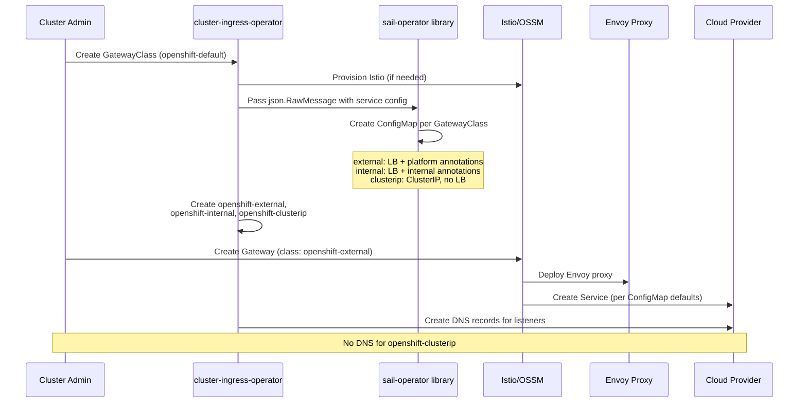

# Support Different Gateway API Service Provisioning with Different GatewayClass

## Summary

This enhancement proposes the creation of three new
OpenShift-managed GatewayClasses (`openshift-external`,
`openshift-internal`, and `openshift-clusterip`) that allow users
to provision Gateway instances with different service topologies.
Each GatewayClass maps to a specific service type and
configuration: external LoadBalancer, internal LoadBalancer, or
ClusterIP. The Cluster Ingress Operator (CIO) passes the service
configuration to the sail-operator library, which provisions a
GatewayClass defaults ConfigMap following the Istio GatewayClass
defaults mechanism. CIO then creates the GatewayClasses
automatically when `openshift-default` is created. This mirrors
the service customization that CIO already provides for
IngressControllers, but applied to Gateway API.

## Motivation

Today, when a user creates a Gateway with the `openshift-default`
GatewayClass, the provisioned service is always a LoadBalancer
with external scope. There is no way for users to request a
Gateway with an internal LoadBalancer or a ClusterIP service
without manually patching the service after creation, which is
fragile and not supported.

Cluster administrators need the ability to provision Gateways with
different service topologies depending on their use case: external
traffic, internal-only traffic, or cluster-internal communication.
This is a common pattern in other Kubernetes distributions, where
different GatewayClasses map to different service configurations.

The existing `openshift-default` GatewayClass will not be modified
to preserve backward compatibility. Instead, three new
GatewayClasses will be introduced.

There is a goal to backport this feature to previous OCP versions
because this is a desired capability for existing deployments. The
backport is feasible for OCP versions using OSSM >= 3.2.4 or
>= 3.3.1, which include the required GatewayClass defaults fix
([sail-operator#1465](https://github.com/istio-ecosystem/sail-operator/pull/1465)).
Backport to versions using OSSM 3.0.x or 3.1.x is not possible
without an additional upstream cherry-pick.

### User Stories

#### Story 1: External LoadBalancer Gateway

As a cluster administrator, I want to create a Gateway with an
external LoadBalancer service including platform-specific
annotations (e.g., AWS NLB annotations, health check
configuration, `externalTrafficPolicy`), so that I can expose
applications to external traffic with the correct cloud provider
configuration without manual service patching.

#### Story 2: Internal LoadBalancer Gateway

As a cluster administrator, I want to create a Gateway with an
internal LoadBalancer service, so that I can expose applications
only within my cloud provider's internal network (e.g., VPC)
using the same platform-specific annotations that CIO applies to
internal IngressControllers.

#### Story 3: ClusterIP Gateway

As a cluster administrator, I want to create a Gateway with a
ClusterIP service, so that I can use Gateway API for
cluster-internal traffic without provisioning any cloud load
balancer.

#### Story 4: Operations at Scale

As a platform engineer managing multiple clusters, I want the
GatewayClass-based service customization to be declarative and
automated by CIO, so that I can rely on consistent service
configurations across clusters without manual intervention, and
monitor the provisioned Gateways through existing telemetry.

### Goals

- Customize service creation based on GatewayClass name. Create
  three new GatewayClasses: `openshift-external`,
  `openshift-internal`, and `openshift-clusterip`.
- Define new GatewayClasses so existing environments will not
  break. The `openshift-default` GatewayClass will not be
  modified.
- Define what each GatewayClass represents:
  - `openshift-external`: mirrors CIO service provisioning for
    external LoadBalancers, including platform-specific
    annotations (e.g., AWS NLB annotations, health check
    settings), `externalTrafficPolicy`, and the OVN
    `local-with-fallback` annotation when applicable. See
    [Service Configuration Details](#service-configuration-details)
    for the full list.
  - `openshift-internal`: same approach but for internal
    LoadBalancers, including the platform-specific internal
    annotation (e.g.,
    `service.beta.kubernetes.io/aws-load-balancer-internal` on
    AWS, `cloud.google.com/load-balancer-type: Internal` on GCP).
  - `openshift-clusterip`: service type ClusterIP, no
    LoadBalancer provisioned.
- Reserve the `openshift-*` naming prefix for OpenShift
  GatewayClasses (requires `controllerName:
  openshift.io/gateway-controller/v1`).
- Provisioning any of these GatewayClasses with the OpenShift
  controller name kicks the provisioning of Istio/OSSM (same as
  today with `openshift-default`).
- Existing telemetry already covers these new GatewayClasses
  since we collect `controllerName` to determine OCP Gateway API
  usage.
- Reuse as much as possible the existing CIO service
  customization functions (from IngressController service
  provisioning) for building the GatewayClass defaults, rather
  than creating new logic from scratch.
- Support backporting to previous OCP versions (subject to
  availability of the required OSSM version with the GatewayClass
  defaults patch).

### Non-Goals

- Fan out many GatewayClasses for every service customization
  permutation. We will stick with 3 new GatewayClasses. Any
  further customization should be discussed separately.
- Customize Gateway deployment options (nodeSelector, replicas,
  resource limits, etc.). These will be discussed in a separate
  enhancement.
- Support NodePort service type as a dedicated GatewayClass. This
  is a stretched goal and the approach needs discussion (e.g., a
  ClusterIP GatewayClass with a manually created NodePort
  service).

## Proposal

The Cluster Ingress Operator will be extended to recognize three
new GatewayClass names (`openshift-external`,
`openshift-internal`, `openshift-clusterip`) in addition to the
existing `openshift-default`. When a user creates one of these
GatewayClasses with `controllerName:
openshift.io/gateway-controller/v1`, CIO will:

1. Provision Istio/OSSM the same way it does for
   `openshift-default`.
2. Pass the service configuration as `json.RawMessage` to the
   sail-operator library, which provisions a GatewayClass
   defaults ConfigMap following the Istio mechanism documented at
   https://istio.io/latest/docs/tasks/traffic-management/ingress/gateway-api/#gatewayclass-defaults.
3. Create the GatewayClass resources (if they do not already
   exist) with the correct `controllerName`.

This approach is consistent with how CIO already provisions
automatic HPA for Gateways managed by CIO.

One ConfigMap is created per GatewayClass (not per Gateway
instance). All Gateways referencing a given GatewayClass share
the same default configuration.

CIO automatically creates the three new GatewayClasses when
`openshift-default` is created (or during upgrade). This keeps
the Gateway API enablement workflow unchanged: the cluster
administrator creates `openshift-default`, and CIO provisions
the additional classes as part of the enablement process.

### Workflow Description

**cluster administrator** is a human user responsible for managing
the cluster and Gateway infrastructure.

**application developer** is a human user responsible for
deploying applications and creating routes.

1. The cluster administrator creates the `openshift-default`
   GatewayClass with `spec.controllerName:
   openshift.io/gateway-controller/v1` (existing enablement
   workflow, unchanged).
2. CIO detects `openshift-default` and provisions Istio/OSSM
   (same as today).
3. The sail-operator library (or Sail Operator, depending on the
   approach) creates the GatewayClass defaults ConfigMap for
   each new class, with the appropriate service type and
   platform-specific annotations. CIO passes the required
   configuration as `json.RawMessage`, the same way it does for
   HPA provisioning.
4. CIO creates the `openshift-external`, `openshift-internal`,
   and `openshift-clusterip` GatewayClasses (if they do not
   already exist) with the same `controllerName`.
5. The cluster administrator creates a Gateway referencing one
   of the available GatewayClasses (e.g.,
   `gatewayClassName: openshift-external`).
6. Istio provisions the Gateway with an Envoy deployment and a
   service matching the defaults from the ConfigMap.
7. CIO manages DNS for the Gateway listeners (same as today,
   except for `openshift-clusterip` which gets no DNS).
8. The application developer creates an HTTPRoute attached to
   the Gateway.

The same workflow applies for `openshift-internal` (internal
LoadBalancer) and `openshift-clusterip` (ClusterIP, no
LoadBalancer, no DNS).



### API Extensions

This enhancement introduces a ValidatingAdmissionPolicy (VAP)
that enforces naming and ownership rules for GatewayClasses using
the OpenShift controller name.

#### ValidatingAdmissionPolicy for GatewayClass Naming

A ValidatingAdmissionPolicy will be created to enforce the
following rules:

1. **OpenShift controller name requires `openshift-` prefix**: If
   a GatewayClass specifies `controllerName:
   openshift.io/gateway-controller/v1`, its name must be prefixed
   with `openshift-`. A GatewayClass with the OpenShift controller
   name but without the `openshift-` prefix will be rejected.

2. **`openshift-` prefix is reserved**: The `openshift-` prefix
   for GatewayClass names is reserved for OpenShift-managed
   classes. A GatewayClass with the `openshift-` prefix but a
   different `controllerName` will be rejected.

3. **Allowlisted names only**: Only the following GatewayClass
   names are allowed when using the OpenShift controller name:
   - `openshift-default`
   - `openshift-external`
   - `openshift-internal`
   - `openshift-clusterip`

   Any other `openshift-*` name will be rejected.

The VAP must use `Deny` (hard error, blocks creation) to
prevent misconfiguration. Warnings are not sufficient because
a misconfigured GatewayClass with the `openshift-*` prefix
would be silently ignored by CIO, leading to user confusion.

Example VAP (simplified):

```yaml
apiVersion: admissionregistration.k8s.io/v1
kind: ValidatingAdmissionPolicy
metadata:
  name: gatewayclass-openshift-naming
spec:
  failurePolicy: Fail
  matchConstraints:
    resourceRules:
    - apiGroups:
      - gateway.networking.k8s.io
      apiVersions:
      - v1
      operations:
      - CREATE
      resources:
      - gatewayclasses
  validations:
  - expression: >-
      !(object.spec.controllerName ==
        'openshift.io/gateway-controller/v1' &&
        !object.metadata.name.startsWith('openshift-'))
    message: >-
      GatewayClasses with controllerName
      'openshift.io/gateway-controller/v1' must have a name
      prefixed with 'openshift-'.
  - expression: >-
      !(object.metadata.name.startsWith('openshift-') &&
        object.spec.controllerName !=
        'openshift.io/gateway-controller/v1')
    message: >-
      The 'openshift-' prefix is reserved for OpenShift-managed
      GatewayClasses and requires controllerName
      'openshift.io/gateway-controller/v1'.
  - expression: >-
      !(object.spec.controllerName ==
        'openshift.io/gateway-controller/v1' &&
        !(object.metadata.name in ['openshift-default',
          'openshift-external', 'openshift-internal',
          'openshift-clusterip']))
    message: >-
      Only the following GatewayClass names are allowed with
      the OpenShift controller: openshift-default,
      openshift-external, openshift-internal,
      openshift-clusterip.
```

The VAP and its corresponding ValidatingAdmissionPolicyBinding
will be managed by CIO and deployed when the GatewayAPI feature
is enabled.

The new GatewayClasses are instances of the existing
`gateway.networking.k8s.io/v1` GatewayClass resource. The
ConfigMaps created by CIO are standard Kubernetes ConfigMaps.

### Topology Considerations

#### Hypershift / Hosted Control Planes

This enhancement applies to Hypershift with no additional
considerations beyond existing Gateway API support. The
GatewayClass defaults ConfigMap and Gateway provisioning happen
on the guest cluster where CIO and Istio run. Platform-specific
annotations in the ConfigMap must match the guest cluster's
infrastructure platform.

#### Standalone Clusters

This enhancement is directly applicable to standalone clusters.
The platform-specific annotations in the GatewayClass defaults
ConfigMap will be derived from the cluster's infrastructure
platform, the same way CIO derives annotations for
IngressController services.

#### Single-node Deployments or MicroShift

No additional resource consumption beyond what a Gateway already
requires. The `openshift-clusterip` GatewayClass is useful for
single-node deployments where external LoadBalancers may not be
available.

MicroShift has its own Gateway API support and does not use CIO,
so this enhancement does not directly affect MicroShift.

#### OpenShift Kubernetes Engine

This enhancement works on OKE clusters the same way as on OCP
clusters, provided Gateway API is available (which depends on the
OLM/Helm-based Istio installation being available on OKE, as
addressed by the gateway-api-without-olm enhancement).

### Implementation Details/Notes/Constraints

#### Service Configuration Details

The GatewayClass defaults ConfigMap must replicate the same
service configuration that CIO applies to IngressController
services today. The following is a summary of what CIO currently
configures, based on the existing load balancer service
provisioning code in `cluster-ingress-operator`:

**Common to all platforms (external LoadBalancer):**
- `externalTrafficPolicy`: defaults vary by platform (most use
  `Local`, IBM uses `Cluster`)
- `traffic-policy.network.alpha.openshift.io/local-with-fallback: ""`
  annotation when `externalTrafficPolicy: Local` is set (OVN
  local-with-fallback support)

**AWS:**
- External: NLB type
  (`service.beta.kubernetes.io/aws-load-balancer-type: nlb`),
  health check annotations (interval `10`, timeout `4`,
  unhealthy threshold `2`, healthy threshold `2`)
- Internal: adds
  `service.beta.kubernetes.io/aws-load-balancer-internal: "true"`
- Subnet selection via
  `service.beta.kubernetes.io/aws-load-balancer-subnets`

**Azure:**
- Internal:
  `service.beta.kubernetes.io/azure-load-balancer-internal: "true"`

**GCP:**
- Internal:
  `cloud.google.com/load-balancer-type: "Internal"` and
  `networking.gke.io/internal-load-balancer-allow-global-access`

**IBM Cloud / Power VS:**
- External:
  `service.kubernetes.io/ibm-load-balancer-cloud-provider-ip-type: "public"`
- Internal:
  `service.kubernetes.io/ibm-load-balancer-cloud-provider-ip-type: "private"`
- `externalTrafficPolicy: Cluster` (IBM-specific)

**OpenStack:**
- Internal:
  `service.beta.kubernetes.io/openstack-internal-load-balancer: "true"`

**ClusterIP class:** no LoadBalancer annotations, service type
is `ClusterIP`.

The implementation must reuse the same annotation-derivation
logic that CIO already uses for IngressController services to
ensure consistency.

#### Code Changes Required

1. **GatewayClass recognition**: Extend the
   gatewayclass-controller to recognize the three new GatewayClass
   names in addition to `openshift-default`. All four classes use
   the same `controllerName:
   openshift.io/gateway-controller/v1`.

2. **ConfigMap provisioning**: The sail-operator library (or Sail
   Operator) provisions the GatewayClass defaults ConfigMap,
   following the mechanism defined at
   https://istio.io/latest/docs/tasks/traffic-management/ingress/gateway-api/#gatewayclass-defaults.
   CIO passes the required service configuration as
   `json.RawMessage` to the sail-operator library, the same
   pattern used for HPA provisioning today.

3. **Platform-specific annotations**: CIO derives the
   platform-specific service annotations from the cluster
   infrastructure, reusing the same code path as IngressController
   service provisioning.

4. **DNS management**: For `openshift-external` and
   `openshift-internal`, CIO manages DNS the same way as for
   `openshift-default`. For `openshift-clusterip`, no DNS records
   are created since there is no external endpoint.

5. **Reserved naming**: The `openshift-*` prefix is reserved for
   OpenShift-managed GatewayClasses. CIO should reject or ignore
   GatewayClasses with this prefix that do not use the correct
   `controllerName`.

This enhancement does not require a new feature gate. It is a CIO
behavioral change that extends existing Gateway API support.

**OSSM version requirement**: The GatewayClass defaults ConfigMap
mechanism depends on the upstream fix
[istio-ecosystem/sail-operator#1465](https://github.com/istio-ecosystem/sail-operator/pull/1465)
("set preserve-unknown-fields on gatewayClasses"), merged to
upstream `main` on 2025-12-17. This fix was cherry-picked to:

- **release-3.2** (downstream
  `openshift-service-mesh/sail-operator`): available since
  tag `3.2.3-dev` (2026-02-19). First GA tag: **`v3.2.4`**
  (2026-04-22).
- **release-3.3**: available since tag `3.3.0-dev`
  (2026-03-06). First GA tag: **`v3.3.1`** (2026-03-27).

The fix is **not present** in any 3.0.x or 3.1.x release (no
upstream cherry-pick to `release-1.25` or `release-1.26`).

This means:
- OCP 4.23 (targeting OSSM 3.3.x): supported.
- Backports to OCP versions using OSSM >= 3.2.4: supported.
- Backports to OCP versions using OSSM 3.0.x or 3.1.x: **not
  possible** without an additional cherry-pick upstream.


### Risks and Mitigations

**Risk**: Users create GatewayClasses with `openshift-*` names
but incorrect `controllerName`.

**Mitigation**: CIO only acts on GatewayClasses with both a
recognized name and the correct `controllerName`. Unrecognized
combinations are ignored.

**Risk**: Platform-specific annotations diverge from what CIO
applies to IngressController services.

**Mitigation**: Reuse the same annotation-derivation code that
CIO uses for IngressController services.

**Risk**: Backporting to older OCP versions requires a specific
OSSM version with the GatewayClass defaults patch.

**Mitigation**: Document the minimum required OSSM version. Do
not backport to versions where the required OSSM patch is not
available.

**Risk**: The Istio GatewayClass defaults ConfigMap mechanism
changes or is removed in a future Istio version.

**Mitigation**: The ConfigMap mechanism is documented and
supported by Istio. Monitor upstream changes and adapt if needed.

### Drawbacks

- Adds three more GatewayClasses that users must understand and
  choose from, increasing cognitive load.
- The ConfigMap-based GatewayClass defaults mechanism depends on
  Istio supporting it. If Istio changes or removes this mechanism,
  the implementation must adapt.
- Backporting a feature to older versions adds testing and
  maintenance burden.

## Open Questions

1. Should NodePort be supported as a stretched goal? If so, should
   it be a separate GatewayClass or should users create a
   `openshift-clusterip` Gateway and manually create a NodePort
   service? A proposed approach is ClusterIP + manual NodePort
   service, which works as long as we document it for users.

2. ~~What is the minimum OSSM version required?~~ **Answered**:
   OSSM >= 3.2.4 (sail-operator `v3.2.4`) or >= 3.3.1
   (`v3.3.1`). Not available in 3.0.x or 3.1.x. See
   [Implementation Details](#implementation-detailsnotesconstraints).

3. For backports: should the ConfigMap be created by CIO directly,
   or should we rely on the sail-operator library being available
   in the target version?

4. How should CIO handle the case where a GatewayClass is created
   on a platform where certain annotations are not applicable
   (e.g., `openshift-internal` on a bare metal cluster without a
   cloud load balancer)?

5. For backports: should the backport create the extra GatewayClass 
   during the backport, or GatewayClass should be created just on 
   main branch?

## Alternatives (Not Implemented)

### Alternative 1: Modify openshift-default Behavior

Instead of creating new GatewayClasses, modify
`openshift-default` to accept configuration parameters that
control service type.

**Reason Not Chosen**: This would break existing environments
where `openshift-default` always provisions an external
LoadBalancer. The GatewayClass-per-topology approach is the
standard pattern in Gateway API (used by other implementations)
and keeps each class self-contained.

### Alternative 2: Per-Gateway Annotations

Allow users to annotate Gateway resources with desired service
type and platform annotations.

**Reason Not Chosen**: Annotations are not validated and are
error-prone. The GatewayClass approach provides a clear contract
between the platform and the user about what service topology
will be provisioned.

## Test Plan

<!-- TODO: Tests must include the following labels per
dev-guide/feature-zero-to-hero.md:
- [Jira:"Networking / cluster-ingress-operator"] for the
  component
- Appropriate test type labels like [Suite:...], [Serial],
  [Slow], or [Disruptive] as needed
Reference dev-guide/test-conventions.md for details. -->

Testing will cover the following scenarios:

1. Create `openshift-default` and verify CIO automatically
   creates `openshift-external`, `openshift-internal`, and
   `openshift-clusterip` GatewayClasses with the correct
   ConfigMap for each.
2. Create a Gateway with each new GatewayClass and verify the
   provisioned service has the correct type (LoadBalancer
   external, LoadBalancer internal, ClusterIP) and annotations.
3. Verify that `openshift-default` behavior is unchanged
   (regression test).
4. Verify that DNS records are created for `openshift-external`
   and `openshift-internal` but not for `openshift-clusterip`.
5. Verify that deleting a GatewayClass cleans up the associated
   ConfigMap.
6. Test on multiple platforms (AWS, Azure, GCP, vSphere) to
   verify platform-specific annotations are correct.
7. Test upgrade and downgrade scenarios.

## Graduation Criteria

<!-- TODO: Refer to dev-guide/feature-zero-to-hero.md for
promotion requirements: minimum 5 tests, 7 runs per week, 14
runs per supported platform, 95% pass rate, and tests running
on all supported platforms (AWS, Azure, GCP, vSphere, Baremetal
with various network stacks). -->

### Dev Preview -> Tech Preview

N/A. This feature targets direct inclusion as part of the
existing Gateway API support, which is already GA in 4.19.

### Tech Preview -> GA

- All test scenarios pass consistently across supported
  platforms.
- Platform-specific annotation coverage verified for AWS, Azure,
  GCP, and vSphere.
- Documentation created in openshift-docs covering the new
  GatewayClasses and their use cases.
- Backport plan finalized with the minimum required OSSM version
  documented.

### Removing a deprecated feature

N/A.

## Upgrade / Downgrade Strategy

### Upgrade

Clusters upgrading to 4.23 where `openshift-default` already
exists will have the three new GatewayClasses automatically
created by CIO during the upgrade. The `openshift-default`
GatewayClass continues to work as before.

### Downgrade

<!-- TODO: The downgrade strategy needs to be fully defined
during implementation. The following are considerations that
must be addressed: -->

The downgrade behavior for Gateways using the new GatewayClasses
needs to be defined. Considerations include:

- Gateways created with `openshift-external`,
  `openshift-internal`, or `openshift-clusterip` GatewayClasses
  will remain on the cluster after downgrade, but the older CIO
  version will not recognize them.
- The GatewayClass defaults ConfigMap will not be managed by the
  older CIO. The ConfigMap may be left orphaned, or it may be
  garbage collected depending on owner references.
- Existing Gateway services may lose their customized
  configuration on the next Istio reconciliation if the ConfigMap
  is removed.
- For backported versions, OSSM >= 3.2.4 or >= 3.3.1 is
  required (contains the GatewayClass defaults fix from
  sail-operator#1465). Clusters on OSSM 3.0.x or 3.1.x cannot
  use the new GatewayClasses.
- Both scenarios (Gateways staying with degraded behavior, or
  Gateways being cleaned up by Istio) need to be tested during
  implementation to determine the actual behavior and define the
  supported downgrade procedure.

## Version Skew Strategy

No new version skew concerns. CIO and Istio versions remain
synchronized through the OCP release. The ConfigMap-based
GatewayClass defaults mechanism is handled entirely by Istio,
and CIO only creates the ConfigMap.

## Operational Aspects of API Extensions

This enhancement introduces a ValidatingAdmissionPolicy (VAP)
for GatewayClass naming enforcement.

- The VAP only applies to GatewayClass CREATE operations.
  GatewayClass `name` and `controllerName` are immutable after
  creation, so UPDATE validation is not needed.
- The VAP uses CEL expressions evaluated in-process by the API
  server. There is no external webhook, no network dependency,
  and no additional latency beyond the CEL evaluation itself.
- If the VAP is removed or misconfigured, GatewayClasses with
  non-standard names could be created. CIO would ignore them
  (it only acts on recognized names), but the naming convention
  would not be enforced.
- The NID (Networking, Ingress, and DNS) team is responsible for
  the VAP and should be contacted for escalation.

#### Failure Modes

- If CIO fails to create the GatewayClass defaults ConfigMap,
  Gateways referencing that class will be provisioned with
  Istio's default behavior (LoadBalancer, no platform
  annotations). CIO should set a condition on the GatewayClass
  to indicate the failure.
- If the ConfigMap is deleted manually, CIO should recreate it
  on the next reconciliation.
- If the ValidatingAdmissionPolicy is deleted, naming
  enforcement is lost but Gateway provisioning continues to
  work. CIO should recreate the VAP on the next reconciliation.

## Support Procedures

Check the GatewayClass defaults ConfigMap exists:
```bash
oc -n openshift-ingress get configmap \
  -l gateway.istio.io/managed=openshift.io-gateway-controller
```

Check the ValidatingAdmissionPolicy is in place:
```bash
oc get validatingadmissionpolicy \
  gatewayclass-openshift-naming
```

Check CIO logs for GatewayClass reconciliation:
```bash
oc -n openshift-ingress-operator logs \
  deployment/ingress-operator | grep -i gatewayclass
```

Verify the service created for a Gateway has the expected type
and annotations:
```bash
oc -n <gateway-namespace> get svc <gateway-name> -o yaml
```

## Infrastructure Needed

No new infrastructure required.
