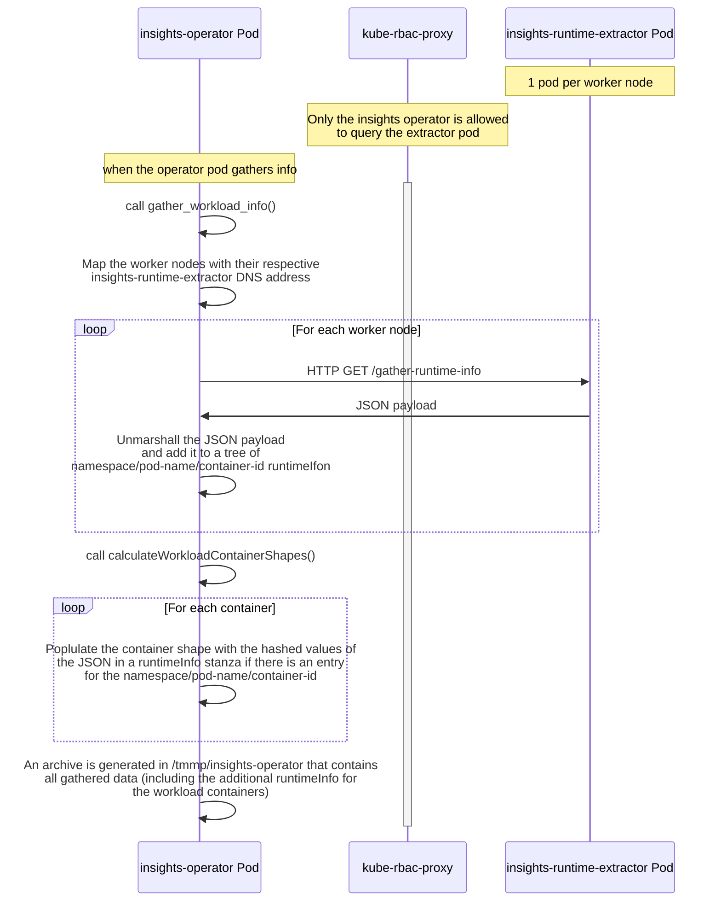
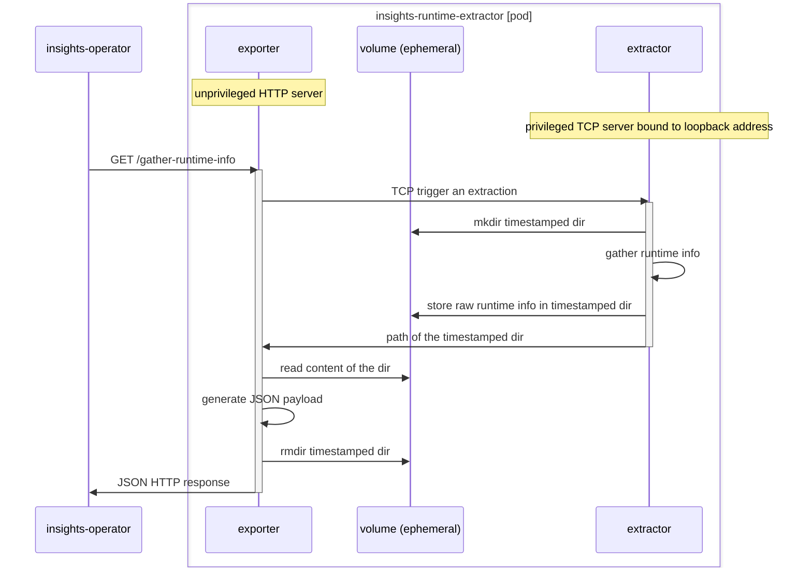
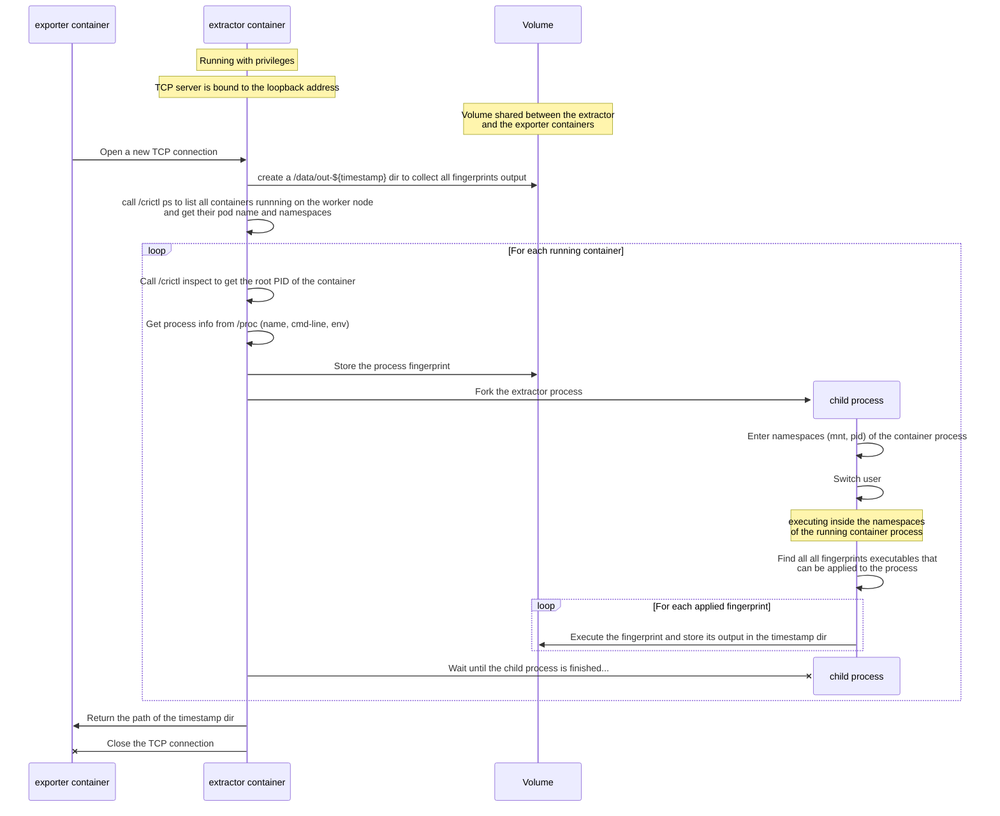

# Gather Workload Runtime Info From Containers

This document proposes a mechanism to gather runtime info from containers to get additional insights on user workloads and make investment decisions that will drive utilization.

## Summary

The Insights operator periodically gathers cluster data and sends it to Red Hat. The data about workloads consists of the image ID and the entrypoint. 

In many cases, the image ID and its layers do not provide any meaningful information about the actual application or application language/platform/framework.
To get this level of information, we can gather additional data on the running containers.   
By inspecting running containers, the Insights Operator can enrich the gathered data and capture the kind of workload that is running on OpenShift. This information can be used by Red Hat to target OpenShift investments at the most popular workloads, inform decisions around long-life offerings for application platforms and frameworks, identify growth opportunities in emerging workloads, and measure the success of our strategic initiatives in AI and Middleware.

For example, inspecting the container allows to gather additional data such as:

* The container (with the ID `sha256:5edd4b...`) is based on __RHEL 8.9__ ands runs a __Kafka Broker 3.6.1__ with __Java OpenJDK 17.0.9__
* The container (with the ID `sha256:4redc...`)  is based on __Fedora 17__, and runs a __Quarkus 3.6.2__ application with __Java Eclipse Adoptium 21.0.1__ 
* The container (with the ID `sha256:7euc...`)  is based on __RHEL 8.8__, and runs a __Red Hat Build of Quarkus 3.2.13__ application with __Red Hat Java 17.0.3-1__ 
* The container (with the ID `sha256:2badc...`)  is based on __Alpine Linux v3.11__, and runs a __Spring Boot 2.7__ with __Java OpenJDK 17.0.8.1__
* The container (with the ID `sha256:3fdb45...`) is based on __Ubuntu 20.04.4 LTS__, and runs a __Node.js v18.18.2__ application
* The container (with the ID `sha256:5edd4b...`) is a scratch container (not layered on top of any image) and runs a __Go 1.18.10__ executable
* The container (with the ID `sha256:566tr...`) is  based on __RHEL 8.9__ ands runs __PostgreSQL 10.23__

This enhancement proposes to extract this additional layer of data to get deeper insights on the OpenShift workload.
It proposes to do so while keeping the existing constraints and requirements that the Insights Operator already has for privacy, security & performance.

## Motivation

Currently, the Insights operator tries to identify what workload is used on OpenShift by looking for known fingerprinting in layers of containers, but there are a lot of issues with this approach where we can only identify base-level containers.
We do, for example, not know if a python container is using AI libraries.
Another issue is that we can only identify containers using known base containers (like OpenJDK), but we do not know what type of workload is more popular (Spring Boot, Quarkus, WildFly, EAP, etc.).

The Insights operator can also not tell what is the operating system and its version used by the user's workloads. Knowing this data means that BU and product leadership can use this data to prioritize future work and realign investment.

### User Stories

* As a middleware product manager, I can observe the trends of a product version over time to estimate the expected value of any customer requested extended life offering.

* As a product manager in the AI space, I can measure the application platforms/frameworks/languages used in clusters or namespaces running OpenShift AI to understand what users are coding applications in so we could offer up-to-date images with those libraries and think how about how to support those better.

* As a middleware product manager, I can track the number of applications built using Quarkus to understand our return on investment from an OpenShift workload perspective.

* As a RHEL product manager, I can follow trends in the use of other Linux containers to inform my product roadmap.

* As an OpenShift product marketing manager, I want to be able to produce content that shows users use OpenShift as a platform for all types of workloads.
    

### Goals

The goal of this proposal is to inspect running containers and surface a few key pieces of data to identify the workload that they are running. This data will enrich and complement the information already gathered by the Insights Operator to get a more accurate representation of workloads running on OpenShift.

### Non-Goals

* It is not a goal of this proposal to scan containers for security purposes
* It is not a goal of this proposal to get runtime information specific to a given customer or application
* It is not a goal of this proposal to capture personal sensitive information

## Proposal

This enhancement proposal introduces additional data to identify the technology stack of running containers.

The existing `workloadContainerShape` type that contains workload information about a container will be enhanced with a new `workloadRuntimeInfoContainer` field:

```go
// workloadContainerShape describes the shape of a container which includes
// a subset of the data in the container.
// TODO: this may desirable to make more precise with a whole container hash
//
//  that includes more of the workload, but that would only be necessary if
//  it assisted reconstruction of type of workloads.
type workloadContainerShape struct {
   // ImageID is the content addressable hash of the image as observed from
   // the status or the spec tag.
   ImageID string `json:"imageID"`
   // FirstCommand is a hash of the first value in the command array, if
   // any was set.
   FirstCommand string `json:"firstCommand,omitempty"`
   // FirstArg is a hash of the first value in the arguments array, if any
   // was set.
   FirstArg string `json:"firstArg,omitempty"`
   // Runtime info on the container
   RuntimeInfo workloadRuntimeInfoContainer `json:"runtimeInfo,omitempty"`
}
```

This new `workloadRuntimeInfoContainer` is defined as:

```go
type workloadRuntimeInfoContainer struct {
	// Hash of the identifier of the Operating System (based on /etc/os-release ID)
	Os string `json:"os,omitempty"`
	// Hash of the version identifier of the Operating System (based on /etc/os-release VERSION_ID)
	OsVersion string `json:"osVersion,omitempty"`
	// Identifier of the kind of runtime
	Kind string `json:"kind,omitempty"`
	// Version of the kind of runtime
	KindVersion string `json:"kindVersion,omitempty"`
	// Entity that provides the runtime-kind implementation
	KindImplementer string `json:"kindImplementer,omitempty"`
	// Runtimes components
	Runtimes []RuntimeComponent `json:"runtimes,omitempty"`
}

type RuntimeComponent struct {
	// Name of a runtime used to run the application in the container
	Name string `json:"name,omitempty"`
	// The version of this runtime
	Version string `json:"version,omitempty"`
}
```

These new data elements are all optional (as they may not be relevant depending on the type of workloads) and are hashed (and truncated) to preserve shoulder-surfing anonymity (the hashing algorithm is [the same one that is currently used by the gatherer](https://github.com/openshift/insights-operator/blob/30b161f98eb185bb357ac84f8aca58e369d34bcd/pkg/gatherers/workloads/workloads_info.go#L336)).

Someone with access to the date and who knows what they are looking for ("How many containers are running Go 1.21.3?") will be able to unobscure the data.

### Runtime Info Description

With the ability to inspect running containers in OpenShift clusters, Red Hat can collect additional data about the software running on the cluster to improve its products.

The additional data are:

* Operating System (OS) information - Based on standard linux file ([/etc/os-release](https://www.freedesktop.org/software/systemd/man/latest/os-release.html)) present in most Linux distributions, collect the ID and Version ID of the operating system of the container.
  * __`Os`__ - Identifier of the Operating System
    * Raw value based on /etc/os-release `ID` field if present 
    * Optional
    * Value is a hash of the corresponding `ID` field: `debian, rhel, fedora, ol,...` (list not exhaustive)
  * __`OsVersion`__ - Version identifier of the Operating system
    * Raw value based on /etc/os-release `VERSION_ID` field if present 
    * Optional
    * Value is a hash of the corresponding `VERSION_ID` field: `11.0, 7.9, 17,..` (list not exhaustive)
* Kind of runtime information - Based on the process name or ELF headers, determine the kind of runtime that is running:
  * __`Kind`__ - Identifier of the kind of runtime
    * Derived value (set by the insights-runtime-extractor component)
    * Optional (if detected by the insights-runtime-extractor component)
    * Value is a hash of the detected runtime kind: `Java, Golang, Node.js, GraalVM` (exhaustive list based on the capabilities of the container scanner)
  * __`KindVersion`__ - Version of the kind of runtime.
    * Raw value (depending on the value of runtime-kind, the version is read from different files in the container)
    * Optional - based on the existence of various files in the containers (`$JAVA_HOME/release` for Java, the ELF header of the executable for Golang, the output of `node —version` for Node.js)
    * Value is a hash of the detected versions: `go1.21.3, v18.18.2, 17.0.2,...` (list not exhaustive)
  * __`KindImplementer`__ - Entity that provides the runtime-kind implementation 
    * Raw value (based on the existence of various files in the containers, eg  `$JAVA_HOME/release` for Java)
    * Optional
    * Value is a hash of the detected implementers: `Red Hat, inc., Oracle Corporation, Eclipse Adoptium` (list not exhaustive)
* Runtime Information - The container scanner can selectively identify runtime libraries/frameworks that run in the containers. They are represented with the `RuntimeComponent` type that has the fields:
  * __`Name`__ - Name of the runtime used to run the application in the container
    * Derived value (set by the insights-runtime-extractor component)
    * Optional - based on the capabilities of the container scanner to detect such runtimes
    * Value is a hash of the detected runtimes `Quarkus, Spring Boot, Apache Tomcat, WildFly, JBoss EAP` (list based on the capabilities of the container scanner, might be enhanced with additional development)
  * __`Version`__ - The version of the runtime used to run the application
    * Raw values (read from files in the containers)
    * Optional - based on the capabilities of the insights-runtime-extractor component to detect the runtime and the availability of its version from files in the container
    * Value is a hash of the detected runtime version: `2.10.3.Final, 7.4.7.GA, 2.7.1, 3.6.0.redhat-00005,...` (list not exhaustive)

It is not planned to add more fields to the `workloadRuntimeInfoContainer` type. However, the insights-runtime-extractor component can be enhanced to detect more runtimes without impacting the integration in the Insights Operator.

##### Examples

```json
"runtimeInfo": {
  "os": "yqx1WBefoIAq",
  "osVersion": "AQN-qh_OyRUA",
  "kind": "wbpgzhNYZQOi",
  "kindVersion": "cAsoUDy8JFNV",
  "kindImplementer": "DzP5-GS6tDOQ",
  "runtimes": [
    {
      "name": "zBVuVhrrC_vC",
      "version": "lyAE7Oh63WPU"
    }
  ]
}
```

As the values are derived by the insights-runtime-extractor component or correspond to software versions, it is possible to create a dictionary of the hashes and retrieve the unobfuscated values. The example above corresponds to:

```json
"runtimeInfo": {
  "os": "rhel",
  "osVersion": "8.9",
  "kind": "Java",
  "kindVersion": "17.0.7",
  "kindImplementer": "Red Hat, Inc.",
  "runtimes": [
    {
      "name": "Quarkus",
      "version": "2.13.8.Final-redhat-00004"
    }
  ]
}
```

### Workflow Description

In its existing implementation, the OpenShift Insights Operator periodically gathers workload data every 12 hours.

The Operator iterates over pods in the cluster (up to a limit of 8000) and, for each pod's containers, captures their Image ID and entry points.

When the operator starts gathering workload information, it would first gather runtime information for all the containers running on the cluster's worker nodes and then
populate the existing gathered info with these additional runtime information.



This is not a user-facing feature. It is achieved within the OpenShift Insights Operator gathering workflow.
The user is able to examine the gathered data by unarchiving the archive generated by the operator.

The DaemonSet for the insights-runtime-extractor is deployed when the Insights Operator is installed in the cluster and is not accessible outside of the `openshift-insights` namespace.

From the operator perspective, the insights-runtime-extractor is a black box, and its requirements are:

* Determine the Pod name of each insights-runtime-extractor’s Pod (as the insights-runtime-extractor is deployed as a DaemonSet, there is a single pod instance on each worker node) and map it to its worker node.
  * There is no service exposing the insights-runtime-extractor and its pods are accessed directly throug their DNS records.
* When the operator starts gathering workload information, query the `HTTP GET /gather-runtime-info` request on each insights-runtime-extractor pod. The HTTP response will return a JSON payload in the standard output that represents a tree of `namespace/pod-name/container-id/runtime-info`.
* As the operator iterates over the containers in the cluster, check if there is a runtime-info entry for the `namespace/pod-name/container-id` and add it to the existing `workloadContainerShape` (after hashing all the values)

The insights-runtime-extractor functionality is provided by an image that must be pullable from the `openshift-insights` namespace and present in the cluster at installation.

#### Variation and form factor considerations [optional]

This enhancement to the Insight Operator is not impacting the Control Plane of OpenShift and should be available regardless of the form of OpenShift (Standalone OCP,  Microshift, Hypershift).

This enhancement only gathers runtime information from Linux worker nodes and will not touch Windows worker nodes. The DaemonSet will be configured to only be deployed on Linux worker nodes (having the label `beta.kubernetes.io/os=linux`).

### API Extensions

This proposal does not require any API Extensions to the OpenShift Insights Operator.

### Topology Considerations

#### Hypershift / Hosted Control Planes

#### Hypershift [optional]

This proposal only aims to gather data about the Data plane and will not inspect any containers running in the Control Plane.

#### Standalone Clusters

This proposal is relevant for standalone clusters.

#### Single-node Deployments or MicroShift

This proposal affects single-node deployment as there is additional resource consumption
when the Insights Operator gathers workload data that will affect the only worker node.

### Implementation Details/Notes/Constraints [optional]

#### Container Scanner API

The Insights Operator communicates with the insights-runtime-extractor pods deployed by its DaemonSet with a simple HTTP server that has the following API:

* `GET /gather-runtime-info`
  * Inspect the all the containers running on the worker node. The HTTP response returns a JSON payload with the extracted data organized in a tree of `namespace/pod-name/container-id/runtime-info`:

```json
{
  "my-namespace": {
    "my-pod-1": {
      "cri-o://xxxx": {
        "os-release-id": "rhel",
        "os-release-version-id": "8.8",
        "runtime-kind": "Java",
        "runtime-kind-version": "17.0.8",
        "runtime-kind-implementer": "Red Hat, Inc.",
        "runtimes": [
          {
            "name": "Quarkus",
            "version": "3.4.1",
          }
        ],
      },
      "cri-o://yyyy": {
        "os-release-id": "rhel",
        "os-release-version-id": "9.2",
      }
    },
    "my-pod-2": {
      [...]
    }
  },
  "other-namespace": {
    "other-pod-1": {
      "cri-o://zzzz": {
        [...]
      }
    }
  }
}
```

#### insights-runtime-extractor Implementation

Inspecting a container is achieved by running on the same worker node that the inspected container and looking at the host process table. The insights-runtime-extractor enters the container’s process namespaces to extract meaningful information about the runtime stack.

The extraction of data from the running container is achieved by executing “fingerprint” executables in the process `mnt` namespace to find the relevant information by reading specific files (e.g. the `Os` and `OsVersion` values are read from the `/etc/os-release` file if it is present). These fingerprints executables are self-contained executables.

This cannot be achieved by a program running in the OpenShift Insights Operator deployment.
This requires an additional resource for the operator, which is a DaemonSet that would deploy a “insights-runtime-extractor” image on all the cluster worker nodes.

The insights-runtime-extractor image requires high privileges to run (access the worker node’s host table, enter process namespaces, etc.) and needs to be configured with a specific security context constraint.

To minimize the code path running with high privileges, the insights-runtime-extractor is split into 2 components:
* an "extractor" running in a privileged container. It runs a simple TCP server that, when it is trigged, will extract the runtime information and store them in a shared volume. The TCP server is bould to the loopback address so that it can only be contacted by clients running inside the same pod.
* an "exporter" running in an unprivileged container. Its role is to trigger the extractor, read the raw content of the extraction from a shared volume, bundle it in a JSON payload and reply to the Insights Operator `GET /gather_runtime_info` request.


The sequence diagram for the `exporter` container is:


The sequence diagram for the `extractor` container is:



#### insights-runtime-extractor Constraints

The insights-runtime-extractor `extractor` is sensitive software that requires high privileges to function.
It needs to run as privileged and in the host PID namespace of Worker Nodes to read their `/proc` tables. It must also run as root to be able to enter in the `mnt` and `pid` namespaces of the process.

> **Note**
> The extractor does not enter the `cgroups` namespace of the process so it does not count toward its container limits.


A specific `SecurityContextConstraints` should be added to the `openshift-insights` to deploy the insights-runtime-extractor with the required permissions.

In order to minimize any security risks, its code will be audited for security and it image will be as minimal as possible.

The `extractor` image contains:

* The TCP server to trigger runtime info extraction (written in Rust)
  * Access to this server is constrained by listening only to the loopback address. Only clients in the same pod will be able to connect to it.
*  The `crictl` tool to find the running containers and their root PID
* “Fingerprints” which are self-contained executables that run in the container’s process namespaces to identify what the container is running.

The `exporter` component runs an unprivileged HTTP server. When it receives a `GET /gather-runtime-info`, it triggers an extraction by connecting to the `extractor` that replies
with a path to a dir on the shared volume. The exporter then collects the raw data from that directory, bundle them in a JSON payload sent as the HTTP response.
Connections to the `exporter` HTTP server will be fronted by `kube-rbac-proxy` so that only the Insights Operator is allowed to query it.

The `exporter` image would contain:

* The HTTP server (written in Go)

Due to the self-contained nature of these executables, the 2 images that compose the insights-runtime-extractor are built from a minimal FIPS-compliant base image.

### Risks and Mitigations

#### Security Risk & Mitigation

##### Hardened and Minimized Privileged Code

Introspecting the runtime environment of an arbitrary running container requires certain root-like system capabilities. First, the ability to introspect the host process table (`/proc` on a root pid namespace) is necessary to detect key processes running in all containers. Second, the ability to switch to an arbitrary mount namespace hosting the inspected container’s overlay filesystem is required to be able to examine and identify file contents within the container.  Third, read & write access to the container runtime socket (`/var/run/crio.sock`) is needed to portably correlate container metadata with a discovered process. Finally, for safety reasons described below, the ability to switch to an arbitrary user is required to drop privileges yet retain the necessary permission to analyze file contents.

Any code running under such a high level of privilege is an attractive target for privilege escalation, since it can be leveraged to gain complete access to the node’s underlying operating system, and all hosted data. It is therefore essential to minimize the potential attack surface area and harden all essential code of the insights-runtime-extractor component.

##### Reducing Attack Surface Area through Modular Process Design

Splitting the inspection logic into multiple plugins/modules not only allows for extensibility but also provides for the ability to partition critical privilege requiring code from code which requires only point in time access to a specific container. Following this approach, privileged actions can be limited to a thin coordinator process in the `extractor` component, with the bulk of logic executed as a forked downgraded process limited to the same access afforded the inspected container target. Additionally, limiting the lifespan of the downgraded logic’s process to a per-container execution basis mitigates potential attacks where a rogue container corrupts the inspection logic to modify or gain access to a second victim container. 

##### Thin Privileged Coordinator Process

The risk of a workable exploit can be greatly reduced by minimizing the amount of total potential code, including the number and size of third-party dependencies. This comes from two key factors: First, the reduced complexity of the system limits the number of potential attack points, and secondly, the smaller total code set improves the speed and effectiveness of both human and automated code auditing.

As such, three key key rules should be followed in the design and implementation of the coordinator process

1. __Dynamic loading of arbitrary executable code should never be supported or allowed by the coordinator process.__ This precludes scripting language runtimes (such as python and JS) as well as bytecode interpreting languages such as Java, .Net, and WASM. It also precludes usage of dlopen(), or libraries with dynamic loading capabilities: the process must be statically compiled. 
1. __Dependencies in the coordinator should be kept to only the provided language SDK, and Linux system contracts__, even at the expense of some code duplication
1. __Coordinator code should be limited to what is strictly required__ to execute in a privileged manner. All non-privilege requiring code should be externalized into the logic of other processes (in the fingerprints executables or the `exporter` component).

##### Defensive Input and Memory Guarding

While keeping the bulk of analysis logic out of the coordinator process reduces risk, there is still the potential for a deprivileged insights-runtime-extractor component to influence the coordinator as a corrupted relay through its required communication channel. As an example, a corrupted container could lead a fingeprint to write a carefully crafted payload aiming to trigger a buffer overflow and potentially arbitrary code execution in the coordinator.

To mitigate this risk, the `extractor` component (that runs with high privileges) will limit its output to writing data on a shared volume and will not read back any data from fingerprints execution.

The `exporter` component (that runs with no privileges) handles reading the input from the fingerprints execution from the shared volume.

#### Privacy Risk & Mitigation

As runtime information is extracted from the user containers, it is technically possible to get access to sensitive information that should not be exposed to Red Hat.
The fingerprints that are executing in the container namespaces must be able to sanitize the extracted information and discard them if they deviate from the expected output.

To make sure customer confidentiality is preserved, any new collected data is hashed before they are sent to Red Hat backends. Mechanisms are already in place so that access to the unobfuscated data in Red Hat is granted on a needs-to-know basis.

#### Performance Risk & Mitigation

##### Limited Restrictions for Fingerprints

Since a fingerprint executable runs under a downgraded privilege model, with a limited process life-span, significantly more freedom is afforded to it, but some care is still necessary. Notably, a fingerprint executable can have a larger dependency set beyond the core language SDK to meet its needs. Additionally, fingerprint executables can leverage languages with a greater emphasis on productivity (e.g. Golang), provided the implementations still utilize input and output hardening techniques, and do not load potentially rogue code in the container. Each fingerprint implementation may even have a different language runtime than its peers. The following rules should be followed:

1. __Inspecting code must be statically compiled and not rely on dynamic library loading.__ This is essentially already required to achieve stable execution on arbitrary container layers, including those with differing libc implementations, or even scratch containers with no additional libraries
2. __All analysis I/O operations should be limit-bound.__ A container either through error or design may have files of arbitrary size, or files in a corrupt state. Any potentially unbounded operation (e.g. reading to the end of a file or following a reference data structure to its arbitrary end) is prohibited.
3. __Memory and CPU usage should not be input derived.__ In addition to achieving system stability and performance goals, ensuring the overhead of a inspecting process does not increase significantly relative to input data is critical in preventing potential Denial-of-Service attacks relying on a specially crafted container filesystem.  

##### No Impact on Workloads

Inspecting containers must not disrupt the containers that are inspected and have an impact on their quality of service.
The insights-runtime-extractor is running with its own memory and CPU requirements and does not consume resources from the inspected container.

If the worker node is near limits, a burst of activity from the insights runtime extractor could lead to node instability. To prevent this,
the insights runtime extractor will extract runtime information from processes one at a time and will not parallelize these tasks.
Increasing the gathering time is a trade-off to prevent node instability.

###### Risk of misbehaving code execution

A few fingerprints relies on executing process in the user namespace (for example, executing `node --version` to determine the version of Node.js).
There is a risk of side-effects if this execution does not match the expectation (if the `node` process is not the Node.js executable and its `--version` parameter triggers a `rm -rf /`).
Executing such code should be done conservatively on well-identified workloads (`python`, `node`, etc.) if they provide a way to get their versions without side-effect.

##### Measurable Impact on Gathering Time & Payload

The workload data is gathered every 12 hours by the Insights Operator.
Gathering the runtime data will increase the overall executing time of the workload gatherer. The increase must remain reasonable.

In the existing initial implementation of the insights-runtime-extractor, it takes __~200 ms to scan a single container__.
As the inspection is done in parallel on each worker node, its overall duration is impacted by
the density of the cluster (number of containers per worker node).
On a fresh OpenShift cluster (with no user workload and only OpenShift own containers), it takes ~15 seconds to scan all containers.
For a 8-worker node with 800 containers, assuming the containers are spread evenly, it would take around 20 seconds to scan the whole cluster. In practice, it will be a bit longer and capped by the inspection of the worker node with the most containers.

The additional data in the `workloadRuntimeInfoContainer` will increase the size of the insights payload that is archived and sent to Red Hat backends.

The additional data adds __~200 uncompressed bytes per WorkloadContainerShape in the JSON payload__.

This additional payload does not scale with the number of pods but with the number of `WorkloadContainerShape` which is difficult to estimate. There is an upper limit of 8000 pods
in the Insights operator but that does not give a limit on the number of containers. It is also very likely that some of the pods are replicas and their containers would only count for 1 `WorkloadContainerShape` in their gathered data.

#### UX Risk & Mitigation

The additional runtime info added to the gathered data will be exposed to the user though the archives generated by the Insights operator. As the values of the field are hashed, the user will not be able to determine their corresponding content.

Exposing these data to the user with a clean user interface (eg within console.redhat.com) is out of scope of this proposal. In the future, the extracted runtime data could be used to provide a cluster-wide view of the running pods to help our users understand how their clusters are utilized.

### Drawbacks

If implemented, Red Hat will document the addition of this new collection. We  introduce the risk that some number of customers who would have or are sending telemetry data via the Insights operator will choose to turn it off because they are uncomfortable sharing this additional data.
In that proposal, there is no option to turn off the collection of the runtime information so an user would have to completely turn off the Insights operator collection.
If that proves problematic, an individual flag to turn off runtime collection could be added to the Insights Operator configuration before this feature becomes GA.

Any compliance or certification program that prevents to "call back" Red Hat backends will not report the data (as is already the case).

The insights-runtime-extractor needs to be continually updated to detect new workloads that Red Hat wants information about.
This can be done iteratively and will require an updated reference to the insights-runtime-extractor image in the Insights Operator to take into account the additional detections.

As the insights-runtime-extractor is sanitizing the data extracted from the containers, it is not able to retrieve "raw" data (such as processes' name and command line) which limits its ability to detect emerging trends. The insights-runtime-extractor must provide fingerprints executables for workloads that Red Hat wants to monitor.

## Design Details

### Open Questions [optional]

## Test Plan

### insights-runtime-extractor Test Plan

The insights-runtime-extractor can be tested in isolation to verify its capability to scan containers and collect the expected runtime info.

Testing the insights-runtime-extractor can be done outside of the Insights Operator test suite.
It requires integration tests with applications based on the detectable runtime stacks. A end-to-end (e2e) test suite can be developed to verify the capabilities of the insights-runtime-extractor.

### Insights Operator Test Plan

The integration tests for the Insights Operator will verify that it is able to properly deploy the insights-runtime-extractor as a `DaemonSet` and have some smoke tests to validate that the additional runtime info can effectively be collected.

## Graduation Criteria

The plan is to introduce the first version of this enhancement behind the `TechPreviewNoUpgrade` feature gate.
It would be an opt-in feature called `InsightsRuntimeExtractor`.

### Dev Preview -> Tech Preview

This enhancement would be behind the featuregate capabilities of OpenShift

When `TechPreviewNoUpgrade` feature gate is not enabled, the Insights operator works and reports in the same way. 
When `TechPreviewNoUpgrade` feature is enabled, the extractor's daemon set is deployed and the runtime info will be added to the gathered workload payload.

### Tech Preview -> GA

The `TechPreviewNoUpgrade` feature gate requirement is removed. The behavior defined above in the [Dev Preview -> Tech Preview](#dev-preview---tech-preview) section is still true. 

Other than that we would like to:

* More testing (including end-to-end testing)
* Sufficient time for feedback
* Conduct load testing
* FIPS-compliant container images for the `insights-runtime-extractor` component
* User facing documentation created in [openshift-docs](https://github.com/openshift/openshift-docs/blob/main/support/remote_health_monitoring/using-insights-operator.adoc) if needed

### Removing a deprecated feature

The additional field `runtimeInfo` introduced in the `workloadContainerShape` would remain (and be documented as `Deprecated`).
It would always be empty.

## Upgrade / Downgrade Strategy

Upgrades/downgrades of the insights-runtime-extractor will be handled by updating its image URL in the Insights Operator manifests.
The release cycle of the insights-runtime-extractor is bound to the Insight Operator release cycle.

This proposal does not bring additional change to the upgrade/downgrade of the OpenShift Insights Operator.

## Version Skew Strategy

This proposal does not impact the version skew strategy of the Insights Operator.

## Operational Aspects of API Extensions

The insights-runtime-extractor runs with its own cgroups and does not impact the inspected containers.

However, it will consume a certain amount of CPU and memory on each worker node while it is inspecting.
These consumptions must be bounded to avoid disrupting the user workload.

Inspecting containers will also increase the time to collect insights by the operator. The workload gatherer is performed every 12 hours and its execution will depend on the number of containers that are inspected.

---
**TBD** Provide measures of resource consumption (memory and CPU)

---

## Support Procedures

The failure of inspecting containers must not impact the ability of the Insights operator to finish collecting workload data.

Failures to inspect running containers will be reported as an error in the `"workloads/workload_info"` stanza of the `insights-operator/gathers.json` file inside the archive generated by the operator.

## Implementation History

Major milestones in the life cycle of a proposal should be tracked in `Implementation History`.

## Alternatives

Red Hat has complementary products that are able to gather runtime information (through RHEL Insights, Insights for App Services). However these solutions require users to:

* Run on a Red Hat Enterprise Linux (RHEL) stack
* Opt-in the collection of data

This proposal is complementary to these products as it would be able to collect similar data but with a wider installation base not tied to using Red Hat products (or running on a RHEL stack).

The products are mentioned in the section not as alternatives but to give a comprehensive evaluation of the proposal and how it ties with parallel features in other Red Hat products.

An alternative for the proposed implementation of the `insights-runtime-extractor` is to use [eBPF](https://ebpf.io) to extract the runtime info whenever a new container is started.

Discussion with the [Red Hat Advanced Cluster Security for Kubernetes](https://www.redhat.com/en/technologies/cloud-computing/openshift/advanced-cluster-security-kubernetes) team clarified that their ACS Collector does not have the required capability at that time. It should be possible to add the capability and make the ACS collector a standalone library that could be reused for the purpose of this RFE in the future. This would be an implementation detail change in the `insights-runtime-extractor` component without impact on its integration in the OpenShift Insights operator.

## Infrastructure Needed

A new Git repository is needed to contain the code of the insights-runtime-extractor image.

As this enhancement is integrated into the OpenShift Insights Operator, this code repository should go in the same organization and live in the  https://github.com/openshift/insights-runtime-extractor (that does not exist at the moment).

The code from this repository will be delivered as a container image pushed to `quay.io/openshift/origin-insights-runtime-extractor:latest` (that does not exist at the moment).
This image will be made available by default in cluster installations by being listed as an [image reference](https://github.com/openshift/insights-operator/blob/master/manifests/image-references) on the OpenShift Insights operator.

Continuous Integration for the insights-runtime-extractor needs to be in place to test and qualify it before it is updated in the Insights Operator.

The maintenance and development of the insights-runtime-extractor is tied and integrated into the OpenShift Insights Operator releases.

Issue management must comply to the OpenShift Container Platform issue tracker. It can be under the [existing component for the Insights Operator](https://issues.redhat.com/issues/?jql=project%20%3D%20OCPBUGS%20AND%20component%20%3D%20%22Insights%20Operator%22) as it is ultimately the component that delivers its capabilities.