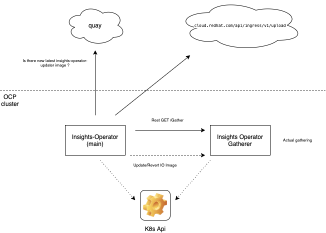

# Up to date gathering in Insights operator

## Release Signoff Checklist

- [ ] Enhancement is `implementable`
- [ ] Design details are appropriately documented from clear requirements
- [ ] Test plan is defined
- [ ] Graduation criteria for dev preview, tech preview, GA
- [ ] User-facing documentation is created in [openshift-docs](https://github.com/openshift/openshift-docs/)

## Summary

The intent of this change is to evolve Insights Operator to make the data gathering component less dependent 
on the the particular release of the cluster. The proposal also suggest to follow more the standard operator 
pattern, where the responsibility of the main operator process would shift from gathering the data itself to 
watch over the gathering process, such as the selection of desired image stream or the fallback mechanism in 
case something goes wrong.



## Motivation

The motivation is to be able to react faster on requirements for additional
Insights Operator data requests. The benefit for customers would be faster
identification of clusters based on newly discovered issues, identified by
particular cluster configuration.
The other potential slowdown might be caused by fact that administrators need
to upgrade their clusters to deliver actual updates (either automatically or manually).

Example of situation when the process is too slow:
Two weeks ago we discovered an issue that for larger amount of generated alerts, IO Archives
becomes too large (#148, CCXDEV-2673). We decided to fix it in all available versions (4.6, - 4.3)
We spent 3 days on development and review until it was merged in Master/4.6
3 Days later we created PR for 4.5, it was merged 6 days later.
6 days after we creted PR for 4.4 it is still not merged (now e2e tests are failing)
We still need to merge it to 4.3.
Since the beginning it is now 24 days.

When CCX needs release faster: 
- To identify affected customers (suggest Workaround), 
- To find real feature usage, especially in in historical releases (because all that waiting on merge)
- Fix IO bug


### Goals

As part of this enhancement we plan to do the following:
* Release process change. On a fast-track release, publish Insights Operator fast-track changes during build to new quay tag for example 4.5-fast-track.
The rest of release process will behave like today, release to 4.x.

There will be two containers in Insights Operator Pod (*main* container with driver and *gatherer* container with Insights Operator).
* Run the gathering logic in a separate container: a *gatherer* 
* Control the lifecycle of the gatherer from *main* insights-operator container (different executable as part of the same image): this includes using newer versions
of the image when available, as well as fallback mechanism to older version on failures.

### Non-Goals


## Proposal

Separate The Insights Operator pod in two containers the Operator *main* and 
Insighs Operator *gatherer*.

The *main* will be similar to today's operator. It would like a proper operator 
drive *gatherer*, but keep all the non-gathering logic, like uploading, status updates etc in it.
It will be periodically checking for new versions in a 4.x-fast-track image on quay.io and eventually update the
Insights Operator Gatherer container to latest 4.x-fast-track image url.
It will not contain the Gathering methods and it will use Rest to reach *gatherer*, which will be 
responsible for collection and saving data to storagePath (/var/lib/insights-operator) and this volume will be 
shared among two containers.
The *main* will instead of local Gather call remote Gather as Api, but will keep all the status handling and uploading
in *main*.

The Insights Operator *gatherer* will become just rest server on operators framework exposing Gather endpoint.
Instead of returning all the data, the method will save the data using disk flusher to storagePath and return
only status. (This was discussed as an improvement to save memory in IO for larger datasets, like logs).
It would have same security role as today.
The proposal will be implemented in three phases, described in [Implementation phases](#implementation-phases).

### Integrating with CVO

There is still to be described how we are going to keep upgraded Operator Deployment after the image url change.
Cluster Version Operator is reverting Operator Deployment config even if I just add a new container.
There are two possible ways. Create separate, non CVO managed Deployment for Gatherer and make Gatherer separate Pod,
or find some way how to make CVO keep changes in second container image after the Gatherer image update. This is still
being investigated.

### Handling errors and failback

If the Insights Operator *Gatherer* runs in a fast-track (non release) image,
*main* will be checking also health of *gatherer* container.
Besides states it is reporting today, like when it cannot upload, it will be reporting
error from *gatherer* call. When *host* detect an issue with *gatherer it will 
update image back to its own image url, which will be stable release.
*Main* would also need checking crashlooping state of *gatherer* for example if image cannot be downloaded.

### Image selection

There might be various ways how to select the good new image.
The initial idea is to check for new versions check in quay.io. We would need to create new tag in quay, 
for example fast-track, and we would be checking
```
quay.io/openshift/origin-insights-operator:4-5-fast-track
```

Note: I am using origin-insights-operator image, I am not sure if there is a better url to use for OCP image.

For the existence of new manifest. If a new one will be found and it wasn't downloaded yet
it will proceed with change of image url to the manifest.

For example:
```
quay.io/openshift/origin-insights-operator@sha256:606aa2ad67c688934c44d03ec7558cb5ab86d13c30e3363cc14af48b065dac5e
```

### Update durability

When the *main* container detect new fast-track image in quay and successfully changes
the *gatherer* container image, it sets it in the support secret in openshift-config, where 
the rest of the insights operator configuration already lives.
We will use key "GathererImage"  and set it to particular image url.

For example:

```
GathererImage: quay.io/openshift-release-dev/ocp-v4.0-art-dev@sha256:534e829a33e3
```

This value will be used by *main* update checker. When GathererImage will be latest
available image in quay it won't update the Gatherer Deployment manifest.

### Returning release image

To revert the original released image, because both containers are running same image,
we can find the current image of *driver* container with Api alternative to:

For example:
```
oc get pod $POD -n openshift-insights  -o=json | jq '.status.containerStatuses[] | { "image": .image, "imageID": .imageID }'
{
  "image": "quay.io/openshift-release-dev/ocp-v4.0-art-dev@sha256:534e829a33e3f6948720f315ba5894a5edded0d45a8f7981214ebc28a030022c",
  "imageID": "quay.io/openshift-release-dev/ocp-v4.0-art-dev@sha256:534e829a33e3f6948720f315ba5894a5edded0d45a8f7981214ebc28a030022c"
}
```

To find exact image, which will be again replaced in Gatherer container.


### Risks and Mitigations

If download of an image fails because we detect incorrect image, we should be able to 
return to release image if Pod starts to fail.


## Design Details

### <a name="implementation-phases"></a> Implementation phases

1. Implementation of *main* container and its orchestration in driver mode with execution of today’s Release version from Host
with extracting the Gathering logic to *gatherer* and implementation of its host. At this phase driving will be disabled and 
there will be no publication to fast-track tag.
2. We will start publishing changes on fast-track release to Latest version available within the same stream 
(4.4.z fast-track cluster might get gatherer from 4.4.z2 once available): 4.4.5 gatherer would still need 
to go though the backporting process to verify it works with that particular stream. Reverting on failure to 
"release - non fast-track" will be on place.
3. Unification of fast-track streams. Instead of checking 4.5-fast-track on quay, driver will be looking for unified fast-track.
Gather methods will be OCP version specific without the need to backporting. For example Api call for Image registry will only work on supported OCP.


### Changes in Dockerfile
We will keep existing Dockerfile with insights-operator binary, and add insights-operator-main binary with adding this line:
```
COPY --from=builder /go/src/github.com/openshift/insights-operator/bin/insights-operator-main /usr/bin/
```

### Git repository

For the simplicity, initially we plan to host both binaries in current insights-operator repository with different starting points in /cmd.
We could move pkg into main folder (for *main* container) and create separate gather folder for *gatherer* rest server.

### Test Plan

We should prepare e2e integration test, which would be verifying that:
- Operator is installed with both containers
- Availability of the new version is triggering update
- Failure of Pod triggers revert logic back to release image.

### Fast-track release process

After review and merge and verification from QA, the build image with Insights operator can be pushed to fast-track tag.
This would need a discussion with Release team, how to trigger the action exactly because it will be aside of standard release cycle. 

### Graduation Criteria

This enhancement will start as GA

### Upgrade / Downgrade Strategy


### Version Skew Strategy


## Implementation History

v1: Initial proposal

## Drawbacks


## Alternatives

We were discussing:
- If we could gather based on data definition (like yaml). Drawback of this approach is that we are trying to minimize returned data
and anonymize each set in quite specific way. It looked like there would be still required changes in code for new data.

- Use of script languages (JavaScript). The drawback was that there is no Golang client even using Swagger there will be quite a
lot of manual work to process Rest Api (which OCP client-go handles today). It would also be needed to be written
twice (for release version and for gathering script), one in Go, second in JavaScript.

- Use of WebAssembly on server. There were two main problems. OC/K8s Api client-go doesn't compile on WebAsembly,
so there would need to be some proxy code (similar situation like with adding Rest calls for JavaScript, just in Golang).
Second issue was that Golang webassembly is today used mostly on client side. The interface to fill the WebAssembly runtime with
neccessary objects is still internal and changing among golang releases. Even thought it can be fixed, it might break in next version.

- Shipping a separate binary. We could expose specific binary on some Https secured endpoint with required changes and download it in IO.
We were discussing some security aspects. But this proposal appeared better option.


## Infrastructure Needed

We would need a separate tag in the insights-operator on quay.io.