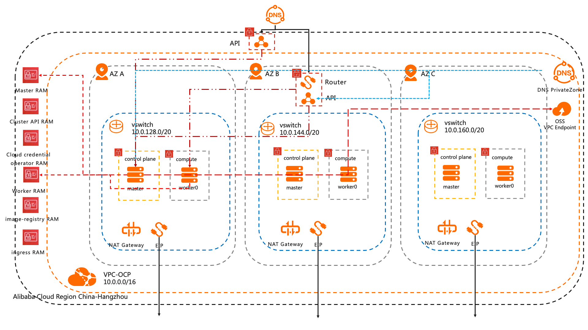

# Alibaba Cloud IPI

## Release Signoff Checklist

- [X] Enhancement is `implementable`
- [ ] Design details are appropriately documented from clear requirements
- [ ] Test plan is defined
- [ ] Operational readiness criteria is defined
- [ ] Graduation criteria for dev preview, tech preview, GA
- [ ] User-facing documentation is created in [openshift-docs](https://github.com/openshift/openshift-docs/)

## Summary

This enhancement covers adding support to install OpenShift clusters to Alibaba Cloud and details for the Installer to create infrastructure and run an OpenShift cluster on Alibaba Cloud.

## Motivation

Currently, openshift4.x does not support Alibaba Cloud via IPI installation. However, the feedback team got is that there is a lot of demand for this kind of installation.

Users interest in running Openshift in Alibaba Cloud can already do it manually. (Link TBD will be added after UPI document is published), but IPI installation will make it much simpler and automated.

### Goals

1. Installer creates infrastructure and installs OpenShift on Alibaba Cloud.
2. Installer provides few but useful and comprehensive customizations through the install-config.yaml file.
3. RHCOS images are built and published to Alibaba as part of the images pipeline process.

- Red Hat builds the RHCOS images from their build pipeline.
- Red Hat will perform some validation.
- Red Hat will apply for whitelisting the Alibaba account uid who wants to use API.
- Red hat will upload RHCOS image to the bucket of OSS in this Alibaba account.
- Red hat will make an OS image and copy the image to target region.
- Red hat will share the image to public in target region by API.
- Red hat will update the installer with the correct image ID.

4. Add a CI job that executes the provisioning steps to test the Alibaba IPI installer.

### Non-Goals

## Proposal

### User Stories

Enables `openshift-install` to create and destroy a cluster on Alibaba Cloud, which is managed and released and covered by CI tests.

### Implementation Details/Notes/Constraints [optional]

1. Steps to prepare the account.

- Domain - Acquire or Identify an domain.
- RAM user - Create an RAM user in Alibaba Cloud account and attach Adminstrative policy.
- AK secret credential - Acquire Access Key and Secret of RAM user.

2. The default installation is going to have below Alibaba resources.

- ControlPlane:
  - name: master
  - availability zones: 3
  - size: 500
  - PerformanceLevel: PL1
  - Category: ESSD
  - InstanceType: g6a.xlarge

- Compute:
  - name: worker
  - availability zones: 3
  - size: 500
  - PerformanceLevel: PL1
  - Category: ESSD
  - InstanceType: c6.4xlarge

- Temporary:
  - name: bootstrap
  - availability zones: 1
  - size: 100
  - PerformanceLevel: PL1
  - Category: ESSD
  - InstanceType: g6a.xlarge

- SLB:
  - Option One:
    - 1 for external access
    - 1 for internal access
  - Option Two:
    - 1 for external and internal access. external need to bind to EIP.

- Public IP:
  - 3 EIP's for NATGateway
  - 1 EIP binding to SLB if Option Two is chosen.

- DNS:
  - 1 Alibaba Cloud DNS - privatezone for private domain name resolution.
  - 1 Alibaba Cooud DNS - Manage DNS for public domain name resolution.

3. We're planning to use Alibaba Cloud DNS and privatezone solution. The nodes within the VPC utilize [privatezone for private domain name resolution](https://www.alibabacloud.com/help/product/64583.html) to provide internal DNS feature. [Manage DNS for public domain name resolution](https://www.alibabacloud.com/product/dns) will provide public DNS feature.

4. We're going to use one public-facing and one private [load balancer](https://www.alibabacloud.com/help/doc-detail/196874.htm) for internal/external requests to the API.

Now it is going to create load balancing based on nginx ingress controller. Also, service type load balancing can use [Alibaba CLB](https://www.alibabacloud.com/help/doc-detail/27539.htm).

5. We are planing to use tags with additional keys and values for installer to all resources that it creates.

- openshift = ISV Integration
- kubernetes.io/cluster/${var.cluster_id} = owned
- extra tags(optional)

6. We're going to use credentials. Long-lived tokens uses [Alibaba RAM AK](https://www.alibabacloud.com/help/doc-detail/122151.htm).
Short-lived tokens uses [Alibaba Cloud Security Token Service (STS)](https://www.alibabacloud.com/help/doc-detail/28756.html)
Currently the installer will use the long-lived tokens. In the future we would like to use STS.

### Risks and Mitigations

If users expect differences in the resources and their available options across different regions. users can expect the same level of performance. But some resource available in most regions might be uavailable in some region. The solution is that we could provide preferred regions list to make sure the resources could be available on list.  

Region Differences:

- Number of availability zones - Most of Regions have more than 3 availability zones. Some regions only have 2 availability zones.
- Instance types - Installer default instance types g6.xlarge which can be purchased in 3 availability zones of regions.

## Design Details

### Infrastructure Global Configuration

#### API

Alicloud will need to be added [Alicloud Environments in the API](https://github.com/openshift/api/blob/master/config/v1/types_infrastructure.go#L339-L355):

#### Cluster Config Operator

Cluster config operator will [need to be added](https://github.com/openshift/cluster-config-operator/blob/master/pkg/operator/kube_cloud_config/) and the new API vendored in.

#### Installer Manifests & Cloud Provider Config

The [Alicloud cloud-provider-config](https://github.com/openshift/installer/blob/master/pkg/asset/manifests/alicloud) will need to be added.

The [Machine API implementation](https://github.com/AliyunContainerService/cluster-api-provider-alibabacloud) will need to be added.

### Upgrade / Downgrade Strategy

### Install Config

New required fields will be added to `installconfig.platform.alicloud`.

- Cluster
  - imageid (required string): Image should be used to boot machines for cluster.
  - regionid (required string): The region where the cluster will be created.
  - VSwitchIds (optional array of strings): vswitches where cluster resources will be created. Leave unset to have the installer create vswitchs in a new VPC.
  - userTags (optional object): the installer will add tags to all resources created.
  - defaultMachinePlatform (optional object): Default machine pool properties.

- Machine
  - SystemDisk (optional object): Defines systemdisk for ECS instances.
  - PerformanceLevel (optional String): [The performance level of systemdisk](https://www.alibabacloud.com/help/doc-detail/122389.htm). This is only valid for type essd.
  - size (optional integer): Size of the system disk in gibibytes (GiB).
  - Category (optional string): The type of disk.
  - InstanceType (optional string): The ECS instance type.
  - zones (optional array of strings): The availability zones used for machines.
  - imageid (required string): The image should be used to boot machines.

- Existing VPC & Vswitches:
  - If users want to use some preexisting network resources instead of having the installer create one for them. Please use fields to point to these existing networking resources.
    - VpcId (required String): A public VPC for the cluster.
    - VSwitchIds (optional array of strings): vswitches where cluster resources will be created. The vswitches for between 1 and 3 availability zones.

### Terraform

Alicloud has [a Terraform provider](https://registry.terraform.io/providers/aliyun/alicloud/latest/docs).

### Open Questions

Suggestions for adopting the operators for the Alibaba Cloud.

### Test Plan

E2E and integration tests should be developed for Alibaba Cloud.

1. E2E jobs should cover cluster creation with openshift-install running periodically and stably.
2. IPI documentation is available and published.
3. Test engineering validation should follow the published documentation with successful results.

### Graduation Criteria

None. Same as any platform.

#### Dev Preview -> Tech Preview

#### Tech Preview -> GA

#### Removing a deprecated feature

### Version Skew Strategy

None. Same as any platform.

## Implementation History

None

## Drawbacks

None

## Alternatives

People not using the IPI installation can follow the Alibaba UPI document(Link TBD will be added after UPI document is published). This requires more manual work and the necessary knowledge without any automation help.
SLB

Use one public-facing and one private [load balancer](https://www.alibabacloud.com/help/doc-detail/196874.htm) for internal/external requests to the API. Option One is one for external access and one for internal access. Option Two is one for both extrenal and internal access. but external need to bind one EIP.